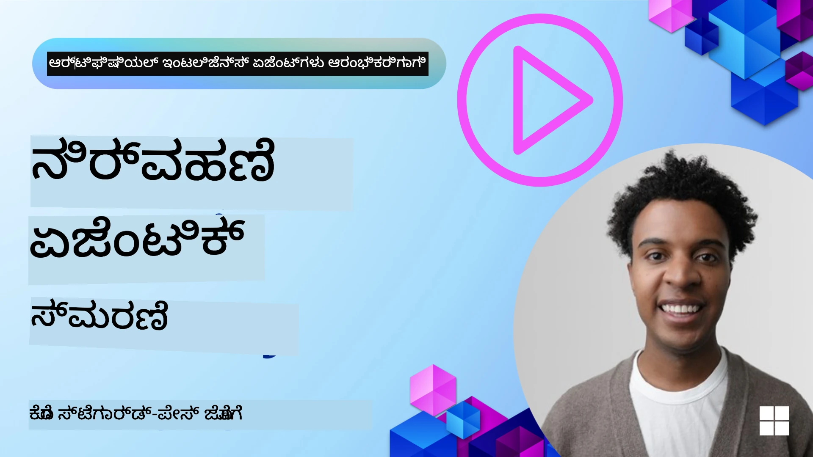

# AI ಏಜೆಂಟ್‌ಗಳಿಗಾಗಿ ಮೆಮೊರಿ 

AI ಏಜೆಂಟ್‌ಗಳನ್ನು ರಚಿಸುವ ವಿಶಿಷ್ಟ ಪ್ರಯೋಜನಗಳನ್ನು ಚರ್ಚಿಸುವಾಗ, ಮುಖ್ಯವಾಗಿ ಎರಡು ವಿಷಯಗಳ ಬಗ್ಗೆ ಮಾತಾಗುತ್ತದೆ: ಕಾರ್ಯಗಳನ್ನು ಪೂರ್ಣಗೊಳಿಸಲು ಸಾಧನಗಳನ್ನು ಕರೆಯುವ ಸಾಮರ್ಥ್ಯ ಮತ್ತು ಸಮಯದೊಂದಿಗೆ ಸುಧಾರಿಸಲು ಸಾಧ್ಯವಾದುದು. ಸ್ವತಃ ಸುಧಾರಿಸುವ ಏಜೆಂಟ್ ಅನ್ನು ರಚಿಸುವಲ್ಲಿ ಮೆಮೊರಿ ಎಂಬುದು ಆಧಾರಭೂತವಾಗಿದೆ, ಇದು ನಮ್ಮ ಬಳಕೆದಾರರಿಗೆ ಉತ್ತಮ ಅನುಭವಗಳನ್ನು ನಿರ್ಮಿಸಲು ಸಹಾಯ ಮಾಡುತ್ತದೆ.

ಈ ಪಾಠದಲ್ಲಿ, AI ಏಜೆಂಟ್‌ಗಳಿಗಾಗಿ ಮೆಮೊರಿ ಎಂಬುದು ಏನೆಂಬುದೂ, ಅದನ್ನು ನಾವು ಹೇಗೆ ನಿರ್ವಹಿಸಬಹುದು ಮತ್ತು ನಮ್ಮ ಅಪ್ಲಿಕೇಶನ್‌ಗಳಿಗೆ ಅದನ್ನು ಹೇಗೆ ಪ್ರಯೋಜನಕ್ಕೆ ತರುವುದೆಂಬುದನ್ನೂ ನೋಡುತ್ತೇವೆ.

## ಪರಿಚಯ

ಈ ಪಾಠವು ಒಳಗೊಂಡಿದೆ:

• **AI ಏಜೆಂಟ್ ಮೆಮೊರಿ ಅರ್ಥಮಾಡಿಕೊಳ್ಳುವುದು**: ಮೆಮೊರಿ ಏನು ಮತ್ತು ಏಕೆ ಏಜೆಂಟ್‌ಗಳಿಗೆ ಅವಶ್ಯಕವೇ ಎಂಬುದು.

• **ಮೆಮೊರಿ ಅನುಷ್ಠಾನ ಮತ್ತು ಸಂಗ್ರಹಿಸುವುದು**: ಸಂಕ್ಷಿಪ್ತ ಮತ್ತು ದೀರ್ಘಕಾಲದ ಮೆಮೊರಿಯನ್ನು केन्द्रಗೊಳಿಸಿ, ನಿಮ್ಮ AI ಏಜೆಂಟ್‌ಗಳಿಗೆ ಮೆಮೊರಿ ಸಾಮರ್ಥ್ಯಗಳನ್ನು ಸೇರಿಸುವ ಪ್ರಾಯೋಗಿಕ ವಿಧಾನಗಳು.

• **AI ಏಜೆಂಟ್‌ಗಳನ್ನು ಸ್ವಯಂ-ಸುಧಾರಿಸುವಂತೆ ಮಾಡುವುದು**: ಮೆಮೊರಿ ಹೇಗೆ ಏಜೆಂಟ್‌ಗಳು ಹಿಂದಿನ ಸಂವಹನಗಳಿಂದ ಕಲಿಯಲು ಮತ್ತು ಕಾಲಕ್ರಮೇಣ ಸುಧಾರಿಸಲು ಸಹಾಯ ಮಾಡುತ್ತದೆ.

## ಲಭ್ಯವಿರುವ ಅನುಷ್ಠಾನಗಳು

ಈ ಪಾಠದಲ್ಲಿ ಎರಡು ಸಮಗ್ರ ನೋಟ್ಬುಕ್ ಟ್ಯುಟೋರಿಯಲ್‌ಗಳಿವೆ:

• **[13-agent-memory.ipynb](./13-agent-memory.ipynb)**: Microsoft Agent Framework ಬಳಸಿ Mem0 ಮತ್ತು Azure AI Search ಮೂಲಕ ಮೆಮೊರಿಯನ್ನು ಅನುಷ್ಠಾನಗೊಳಿಸುತ್ತದೆ

• **[13-agent-memory-cognee.ipynb](./13-agent-memory-cognee.ipynb)**: Cognee ಬಳಸಿಕೊಂಡು ರಚನೆಗಾ್ಧಿತ ಮೆಮೊರಿ ಅನ್ನು ಅನುಷ್ಠಾನಗೊಳಿಸುತ್ತದೆ, embeddings ಮೂಲಕ ಸ್ವಯಂಚಾಲಿತವಾಗಿ ಜ್ಞಾನ ಗ್ರಾಫ್ ನಿರ್ಮಿಸುತ್ತದೆ, ಗ್ರಾಫ್ ದೃಶ್ಯೀಕರಣ ಮತ್ತು ಬುದ್ಧಿವಂತ ಪುನರಾವರ್ತನೆಗಳನ್ನು ಒದಗಿಸುತ್ತದೆ

## ಕಲಿಕೆ ಗುರಿಗಳು

ಈ ಪಾಠ ಪೂರ್ಣಗೊಳ್ಳುತ್ತಿದ್ದಂತೆಯೇ, ನೀವು ತಿಳಿದುಕೊಳ್ಳುತ್ತೀರಿ:

• **ವಿವಿಧ ರೀತಿಯ AI ಏಜೆಂಟ್ ಮೆಮೊರಿಗಳ ನಡುವೆ ವ್ಯತ್ಯಾಸವನ್ನು ಗುರುತಿಸುವುದು**, ಕಾರ್ಯಚರ Antoine (working), ಸಂಕ್ಷಿಪ್ತ (short-term), ಮತ್ತು ದೀರ್ಘಕಾಲದ (long-term) ಮೆಮೊರಿ ಸೇರಿದಂತೆ, ಜೊತೆಗೆ ವ್ಯಕ್ತಿತ್ವ (persona) ಮತ್ತು ಘಟನಾತ್ಮಕ (episodic) ಮೆಮೊರಿಗಳು ಹೀಗೆ ವಿಶೇಷಿತರೂಪಗಳು.

• **Microsoft Agent Framework ಬಳಸಿ, Mem0, Cognee, Whiteboard ಮೆಮೊರಿ ಮುಂತಾದ ಸಾಧನಗಳನ್ನು ಉಪಯೋಗಿಸಿ AI ಏಜೆಂಟ್ ಗಾಗಿ ಸಂಕ್ಷಿಪ್ತ ಮತ್ತು ದೀರ್ಘಕಾಲದ ಮೆಮೊರಿಯನ್ನು ಅನುಷ್ಠಾನಗೊಳಿಸಲು ಮತ್ತು ನಿರ್ವಹಿಸಲು**.

• **ಸ್ವಯಂ-ಸುಧಾರಿಸುವ AI ಏಜೆಂಟ್‌ಗಳ ಹಿಂದಿರುವ ತತ್ತ್ವಗಳನ್ನು ಅರ್ಥಮಾಡಿಕೊಳ್ಳುವುದು** ಮತ್ತು ಬಲಿಷ್ಠ ಮೆಮೊರಿ ನಿರ್ವಹಣಾ ವ್ಯವಸ್ಥೆಗಳು ನಿರಂತರ ಕಲಿಕೆ ಮತ್ತು ಹೊಂದಿಕೊಳ್ಳುವಿಕೆಗೆ ಹೇಗೆ ಸಹಾಯ ಮಾಡುತ್ತವೆ ಎಂಬುದು.

## AI ಏಜೆಂಟ್ ಮೆಮೊರಿಯನ್ನು ಅರ್ಥಮಾಡಿಕೊಳ್ಳುವುದು

ಮೂಲತಃ, **AI ಏಜೆಂಟ್‌ಗಳಿಗಾಗಿ ಮೆಮೊರಿ ಎಂದರೆ ಅವುಗಳಿಗೆ ಮಾಹಿತಿಯನ್ನು ಹಿಡಿದುಕೊಂಡು ಪರಿಗಣಿಸಲು ಮತ್ತು ಮರುಸ್ಮರಣೆ ಮಾಡುವ ಸಾಧ್ಯತೆಯನ್ನು ನೀಡುವ ಯಂತ್ರಣೆಗಳಾಗಿವೆ**. ಈ ಮಾಹಿತಿಯು ಸಂಭಾಷಣೆಯ ನಿರ್ದಿಷ್ಟ ವಿವರಗಳು, ಬಳಕೆದಾರ ಪ್ರಾಧಾನ್ಯತೆಗಳು, ಹಿಂದಿನ ಕ್ರಮಗಳು ಅಥವಾ zelfs ಕಲಿತ ಮಾದರಿಗಳನ್ನು ಒಳಗೊಂಡಿರಬಹುದು.

ಮೆಮೊರಿ ಇಲ್ಲದಿದ್ದರೆ, AI ಅಪ್ಲಿಕೇಶನ್‌ಗಳು ಸಾಮಾನ್ಯವಾಗಿ ಸ್ಥಿತ್ಯಹೀನವಾಗಿರುತ್ತವೆ, ಅಂದರೆ ಪ್ರತಿ ಸಂವಹನವು ಶೂನ್ಯದಿಂದ ಪ್ರಾರಂಭವಾಗುತ್ತದೆ. ಇದರ ফলে ಏಜೆಂಟ್ ಹಿಂದಿನ ಪ್ರ.Context ಅಥವಾ ಆಡಂಬರಿಗೆ "ಮರೆತು" ಹೋಗುತ್ತಿರುವಂತೆ ಉಡುಪುಮಾಡುವ ಪುನರಾವರ್ತನೆ ಮತ್ತು ಕೋಪದಾಯಕ ಬಳಕೆದಾರ ಅನುಭವ ಉಂಟಾಗುತ್ತದೆ.

### ಮೆಮೊರಿ ಏಕೆ ಪ್ರಮುಖವಾಗಿದೆ?

ಏಜೆಂಟ್‌ನ ಬುದ್ದಿಮತ್ತೆ ಅದರ ಹಿಂದಿನ ಮಾಹಿತಿಯನ್ನು ಮರುಸ್ಮರಿಸುವ ಮತ್ತು ಉಪಯೋಗಿಸುವ ಸಾಮರ್ಥ್ಯಕ್ಕೆ ಗಟ್ಟಿ ಸಂಪರ್ಕಿಸಿದೆ. ಮೆಮೊರಿ ಏಜೆಂಟ್‌ಗಳನ್ನು ಈ ಕೆಳಗಿನಂತೆ ಮಾಡುತ್ತದೆ:

• **ಪರಿಶೀಲನಾತ್ಮಕ (Reflective)**: ಹಿಂದಿನ ಕ್ರಮಗಳು ಮತ್ತು ಫಲಿತಾಂಶಗಳನ್ನಿಂದ ಕಲಿಕೆ.

• **ಸಂವಹನಾತ್ಮಕ (Interactive)**: ಜರುಗುತ್ತಿರುವ ಸಂಭಾಷಣೆಯ ಮೇಲೆ ಸಾಥಿ ಕಾಪಾಡುವುದು.

• **ಪ್ರಾಕ್ಟಿವ್ ಮತ್ತು ರಿಯಾಕ್ಟಿವ್ (Proactive and Reactive)**: ಅಗತ್ಯಗಳನ್ನು ಊಹಿಸುವುದು ಅಥವಾ ಇತಿಹಾಸಾತ್ಮಕ ಮಾಹಿತಿಯ ಆಧಾರದ ಮೇಲೆ ಸೂಚಿತವಾಗಿ ಪ್ರತಿಕ್ರಿಯಿಸುವುದು.

• **ಸ್ವಾಯತ್ತ (Autonomous)**: ಸಂಗ್ರಹಿಸಿದ ಜ್ಞಾನವನ್ನು ಆಧರಿಸಿ ಹೆಚ್ಚು ಸ್ವತಂತ್ರವಾಗಿ ಕಾರ್ಯನಿರ್ವಹಿಸುವುದು.

ಮೆಮೊರಿ ಅನುಷ್ಠಾನಗೊಳಿಸುವ ಉದ್ದೇಶ ಏಜೆಂಟ್‌ಗಳನ್ನು ಹೆಚ್ಚು **ನಂಬಿಗಸ್ತ ಮತ್ತು ಸಾಮರ್ಥ್ಯವಂತಾಗಿಸುವುದು**.

### ಮೆಮೊರಿಯ ರೀತಿಗಳು

#### ಕಾರ್ಯಸ್ಮೃತಿ (Working Memory)

ಇದನ್ನು ಏಜೆಂಟ್ ಒಂಭತ್ತು ongoing ಕಾರ್ಯ ಅಥವಾ ಚಿಂತನೆ ಪ್ರಕ್ರಿಯೆಯ دوران ಬಳಸುವ ಸಣ್ಣ ಸ್ಟ್ರ್ಚ್ ಪೇಪರ್ ಎಂದು ಭಾವಿಸಿ. ಇದು ಮುಂದಿನ ಹಂತವನ್ನು ಲೆಕ್ಕಹಾಕಲು ಅಗತ್ಯವಿರುವ ತಕ್ಷಣದ ಮಾಹಿತಿಯನ್ನು ಹಿಡಿದುಕೊಳ್ಳುತ್ತದೆ.

AI ಏಜೆಂಟ್‌ಗಳಿಗೆ ಕಾರ್ಯಸ್ಮೃತಿ ಸಂಭಾಷಣೆಯಿಂದ ಅತ್ಯಂತ ಸಂಬಂಧಪಟ್ಟ ಮಾಹಿತಿಯನ್ನು ಹಿಡಿದುಕೊಳ್ಳುತ್ತದೆ, ಇಲ್ಲದಿದ್ದರೂ ಸಂಪೂರ್ಣ ಚಾಟ್ ಇತಿಹಾಸವು ಉದ್ದವಾಗಿರುವ یا ಕಡಿತಗೊಳ್ಳಬಹುದು. ಇದು ಅಗತ್ಯ, ಪ್ರಸ್ತಾಪ, ನಿರ್ಧಾರಗಳು ಮತ್ತು ಕ್ರಮಗಳಂತಹ ಪ್ರಮುಖ ಅಂಶಗಳನ್ನು ಹೊರತೆಗೆದುಕೊಡಲು ಕೇಂದ್ರೀಕರಿಸುತ್ತದೆ.

**ಕಾರ್ಯಕ್ಷಮತಾ ಸ್ಮೃತಿ ಉದಾಹರಣೆ**

ಪ್ರವಾಸ ಬುಕ್ಕಿಂಗ್ ಏಜೆಂಟ್‌ನಲ್ಲಿ, ಕಾರ್ಯಸ್ಮೃತಿ ಬಳಕೆದಾರರ ಇತ್ತೀಚಿನ ವಿನಂತಿಯನ್ನು ಹಿಡಿದಿರಬಹುದು, ಉದಾಹರಣೆಗೆ "ನಾನು ಪ್ಯಾರಿಸ್‌ಗೆ ಪ್ರವಾಸ ಬುಕರ್ ಮಾಡಬೇಕು" ಎಂಬುದನ್ನು. ಈ ನಿರ್ದಿಷ್ಟ ಬ್ಯಾಲಿಸ್ಥಿತಿ ಏಜೆಂಟ್‌ನ ತಕ್ಷಣದ ಸಂಧರ್ಭವನ್ನು ಮಾರ್ಗದರ್ಶನ ಮಾಡಲು ಹಿಡಿದಿರುತ್ತದೆ.

#### ಸಂಕ್ಷಿಪ್ತ ಸ್ಮೃತಿ (Short Term Memory)

ಈ ಸ್ಮೃತಿ ಒಂದೇ ಸಂಭಾಷಣೆ ಅಥವಾ ಸೆಶನ್ ಅವಧಿಗಾಗಿ ಮಾಹಿತಿಯನ್ನು ಕಾಯ್ದಿರಿಸುತ್ತದೆ. ಇದು ಪ್ರಸ್ತುತ ಚಾಟ್‌ನ ಸ೦ದರ್ಭವಾಗಿದ್ದು, ಏಜೆಂಟ್‌ಗೆ ಸಂವಾದದ ಹಿಂದಿನ ತಿರುವುಗಳನ್ನು ಉಲ್ಲೇಖಿಸಲು ಅವಕಾಶ ನೀಡುತ್ತದೆ.

**ಸಂಕ್ಷಿಪ್ತ ಸ್ಮೃತಿ ಉದಾಹರಣೆ**

ಬಳಕೆದಾರರು "ಪ್ಯಾರಿಸ್‌ಗೆ ವಿಮಾನದ ವೆಚ್ಚ ಎಷ್ಟು?" ಎಂದು ಕೇಳಿದ ನಂತರ "ಅಲ್ಲಿ ವಾಸಸ್ಥಳದ ಬಗ್ಗೆ ಹೇಗೆ?" ಎಂದು ಕೇಳಿದರೆ, ಸಂಕ್ಷಿಪ್ತ ಸ್ಮೃತಿ ಅದು "ಅಲ್ಲಿ" ಎಂದರೆ ಅದೇ ಸಂಭಾಷಣೆಯಲ್ಲಿ "ಪ್ಯಾರಿಸ್" ಯಾಗಿರುತ್ತದೆ ಎಂದು ಏಜೆಂಟ್‌ಗೆ معلومವಾಗುವಂತೆ ಮಾಡುತ್ತದೆ.

#### ದೀರ್ಘಕಾಲದ ಸ್ಮೃತಿ (Long Term Memory)

ಇದು ಬಹು ಸಂಭಾಷಣೆಗಳು ಅಥವಾ ಸೆಶನ್‌ಗಳ ಮೇಲೆ ದಾಟಿಕೊಂಡು ಉಳಿಯುವ ಮಾಹಿತಿಯಾಗಿದೆ. ಇದು ಏಜೆಂಟ್‌ಗಳಿಗೆ ಬಳಕೆದಾರ ಪ್ರಾಧಾನ್ಯತೆಗಳು, ಐತಿಹಾಸಿಕ ಸಂವಹನಗಳು ಅಥವಾ ದೀರ್ಘಕಾಲದ ಸಾಮಾನ್ಯ ಜ್ಞಾನವನ್ನು ಮೆಮೊರಿಸಲು ಅನುಮತಿಸುತ್ತದೆ. ವೈಯಕ್ತಿಕೀಕರಣಕ್ಕಾಗಿ ಇದು ಮಹತ್ವಪೂರ್ಣವಾಗಿದೆ.

**ದೀರ್ಘಕಾಲದ ಸ್ಮೃತಿ ಉದಾಹರಣೆ**

ದೀರ್ಘಕಾಲದ ಸ್ಮೃತಿ "Ben ಕ್ರೀಡಾಕಾರರು ಮತ್ತುOutdoor ಚಟುವಟಿಕೆಗಳನ್ನು ಆನಂದಿಸುತ್ತಾನೆ, paha‍ry golಕೋಟಿ (mountain view) ಬೇಕೆಂದು ಕಫಿ ಇಷ್ಟಪಡುತ್ತಾನೆ, ಮತ್ತು ಹಿಂದಿನ ಗಾಯದ ಕಾರಣ advanced ski slopes ಅನ್ನು ತಪ್ಪಿಸಲು ಬಯಸುತ್ತಾನೆ" ಎಂಬಂತಹ ಮಾಹಿತಿಯನ್ನು ಸಂಗ್ರಹಿಸಬಹುದು. ಹಿಂದಿನ ಸಂವಹನಗಳಿಂದ ಕಲಿತ ಈ ಮಾಹಿತಿ ಭವಿಷ್ಯದ ಪ್ರವಾಸ ಯೋಜನೆಗಳಲ್ಲಿ ಶಿಫಾರಸುಗಳನ್ನು ಭಾವನಾತ್ಮಕವಾಗಿ ವೈಯಕ್ತಿಕಗೊಳಿಸಲು ಪ್ರಭಾವ ಬೀರುತ್ತದೆ.

#### ಪರ್ಸೋನಾ ಸ್ಮೃತಿ (Persona Memory)

ಈ ವಿಶೇಷಿತ ಸ್ಮೃತಿ ಏಜೆಂಟ್‌ಗೆ ಸತತ "ವೈಯಕ್ತಿಕತೆ" ಅಥವಾ "ಪರ್ಸೋನಾ" ಅಭಿವೃದ್ಧಿ ಮಾಡಲು ಸಹಾಯ ಮಾಡುತ್ತದ. ಇದು ಏಜೆಂಟ್ ತನ್ನ ಬಗ್ಗೆ ಅಥವಾ ಅದರ ನಿರ್ದಿಷ್ಟ ಪಾತ್ರದ ಬಗ್ಗೆ ವಿವರಗಳನ್ನು ನೆನಪಿಟ್ಟು ಕೊಡುತ್ತದೆ, ಇದರಿಂದ ಸಂವಹನಗಳು ಹೆಚ್ಚು ಸರಾಗ ಮತ್ತು ಕೇಂದ್ರೀಕೃತವಾಗುತ್ತವೆ.

**ಪರ್ಸೋನಾ ಸ್ಮೃತಿ ಉದಾಹರಣೆ**
ಪ್ರವಾಸ ಏಜೆಂಟ್ ಅನ್ನು "ನಿಪುಣ ಸ್ಕಿ ಯೋಜಕರ" ಎಂಗVPN_TYPElೋ? ಆಗ ರೂಪಿಸದಿದ್ದರೆ, ಪರ್ಸೋನಾ ಸ್ಮೃತಿ ಈ ಪಾತ್ರವನ್ನು ದೃಢಗೊಳಿಸಿ, ಅದರ ಪ್ರತಿಕ್ರಿಯೆಗಳನ್ನು ನಿಪುಣರ ಮಾತಿನ ಶೈಲಿ ಮತ್ತು ಜ್ಞಾನದೊಂದಿಗೆ ಹೊಂದಿಸುತ್ತದೆ.

#### ಕಾರ್ಯಪ್ರವಾಹ/ಘಟನೆ ಸ್ಮೃತಿ (Workflow/Episodic Memory)

ಈ ಸ್ಮೃತಿ ಜಟೀಲ ಕಾರ್ಯವೊಂದನ್ನು ನಡೆಸುವ ಸಂದರ್ಭದಲ್ಲಿ ಏಜೆಂಟ್ ತೆಗೆದುಕೊಳ್ಳುವ ಕ್ರಮಗಳ ಕ್ರಮಾಂಕವನ್ನು, ಯಶಸ್ವಿ ಮತ್ತು ವೈಫಲ್ಯಗಳನ್ನು ಸಂಗ್ರಹಿಸುತ್ತದೆ. ಇದು ವಿಶೇಷ "ಘಟನೆಯ" ಅಥವಾ ಹಿಂದಿನ ಅನುಭವಗಳನ್ನು ನೆನಪಿಡುವಂತೆ ಆಗುತ್ತದೆ ಮತ್ತು ಅವುಗಳಿಂದ ಕಲಿಯುತ್ತದೆ.

**ಘಟನೆ ಸ್ಮೃತಿ ಉದಾಹರಣೆ**

ಏಜೆಂಟ್ ನಿರ್ದಿಷ್ಟ ವಿಮಾನವನ್ನು ಬುಕ್ ಮಾಡುವ ಪ್ರಯತ್ನ ಮಾಡಿತು ಆದರೆ ಲಭ್ಯತೆ ಕೊರತೆಯಿಂದ ಅಸಫಲವಾಗಿತ್ತೆಂದಾದರೆ, ಘಟನೆಯ ಸ್ಮೃತಿ ಆ ವೈಫಲ್ಯವನ್ನು ದಾಖಲಿಸಬಹುದು, ಇದರಿಂದ ಏಜೆಂಟ್ ಮುಂದಿನ ಪ್ರಯತ್ನದಲ್ಲಿ ಪರ್ಯಾಯ ವಿಮಾನಗಳನ್ನು ಪ್ರಯತ್ನಿಸಲು ಅಥವಾ ಬಳಕೆದಾರನಿಗೆ ಸಮಸ್ಯೆಯ ಬಗ್ಗೆ ಹೆಚ್ಚು ಮಾಹಿತಿ ನೀಡಲು ಸಾದ್ಯವಾಗುತ್ತದೆ.

#### ಅಸ್ತಿತ್ವ (Entity) ಮೆಮೊರಿ

ಇದು ಸಂಭಾಷಣೆಗಳಿಂದ ನಿರ್ದಿಷ್ಟ ಅಸ್ತಿತ್ವಗಳನ್ನು (ಮನುಷ್ಯರು, ಸ್ಥಳಗಳು ಅಥವಾ ವಸ್ತುಗಳು) ಮತ್ತು ಘಟನೆಗಳನ್ನು ಹೊರತೆಗೆಯುವುದು ಮತ್ತು ನೆನಪಿಡುವುದನ್ನು ಒಳಗೊಂಡಿದೆ. ಇದು ಅರಿವಿನ ರಚಿತಬದ್ಧ فهمನೆಯನ್ನು ನಿರ್ಮಿಸಲು ಏಜೆಂಟ್‌ಗೆ ಅವಕಾಶ ನೀಡುತ್ತದೆ.

**ಅಸ್ತಿತ್ವ ಮೆಮೊರಿ ಉದಾಹರಣೆ**

ಹಿಂದಿನ ಪ್ರವಾಸದ ಬಗ್ಗೆ ಸಂಭಾಷಣೆದಿಂದ, ಏಜೆಂಟ್ "Paris", "Eiffel Tower", ಮತ್ತು "Le Chat Noir ರೆಸ್ಟೋರೆಂಟ್‌ನಲ್ಲಿ ಊಟ" ಎಂಬಂತೆ ಅಸ್ತಿತ್ವಗಳನ್ನು ಹೊರತೆಗೆಯಬಹುದು. ಭವಿಷ್ಯದ ಸಂವಹನದಲ್ಲಿ, ಏಜೆಂಟ್ "Le Chat Noir" ಅನ್ನು ನೆನಪಿಸಿಕೊಂಡು ಅಲ್ಲಿಕ್ಕೆ ಹೊಸ ಮೀಸಲಾತಿಯನ್ನು ಮಾಡಿ ಕೊಡಲು ಪ್ರಸ್ತಾಪಿಸಬಹುದು.

#### ರಚಿತ RAG (Structured RAG) (Retrieval Augmented Generation)

RAG ಒಂದು ವಿಶಾಲ ತಂತ್ರವಾಗಿದೆ, ಆದರೆ "Structured RAG" ಅನ್ನು ಶಕ್ತಿಶಾಲಿ ಮೆಮೊರಿ ತಂತ್ರಜ್ಞಾನವೆಂದು ವಿಶೇಷಗೊಳಿಸಲಾಗಿದೆ. ಇದು ಸಂಭಾಷಣೆಗಳು, ಇಮೇಲ್‌ಗಳು, ಚಿತ್ರಗಳು ಮುಂತಾದ ವಿವಿಧ ಮೂಲಗಳಿಂದ ಘನ, ರಚಿತ ಮಾಹಿತಿಯನ್ನು ಹೊರತೆಗೆಯುತ್ತದೆ ಮತ್ತು ಉತ್ತರಗಳಲ್ಲಿ ಸಶ್ರದ್ಧತೆ, ಮರುಪಿರಕಣೆ ಮತ್ತು ವೇಗವನ್ನು ಹೆಚ್ಚಿಸಲು ಬಳಸುತ್ತದೆ. ಸಾಂಪ್ರದಾಯಿಕ RAG_semantic_similarity ಮಾತ್ರ ಅವಲಂಬಿಸುವುದರಿಂದ ವಿಭಿನ್ನವಾಗಿ, Structured RAG ಮಾಹಿತಿ యొక్క ಒಳನೋಟವನ್ನು ಬಳಸುತ್ತದೆ.

**Structured RAG ಉದಾಹರಣೆ**

ಶುದ್ಗಾವಾಗಿ ಕೀವರ್ಡ್‌ಗಳನ್ನು ಹೊಂದಿಸುವುದಕ್ಕೆ ಬದಲು, Structured RAG ಒಂದು ಇಮೇಲ್‌ನಿಂದ ವಿಮಾನ ವಿವರಗಳನ್ನು (ಗಮ್ಯಸ್ಥಳ, ದಿನಾಂಕ, ಸಮಯ, ವಿಮಾನಸೇವಾ) ಪಾರ್ಸಿಂಗ್ ಮಾಡಿ ಅವುಗಳನ್ನು ರಚನಾ ಪಥದಲ್ಲಿ ಸಂಗ್ರಹಿಸಬಹುದು. ಇದು "ನಾನು ಮಂಗಳವಾರ ಪ್ಯಾರಿಸ್‌ಗೆ ಯಾವ ವಿಮಾನ ಹತ್ತಿದ್ದೆ?" ಎಂಬಂತ Precise ಪ್ರಶ್ನೆಗಳಿಗೆ ಉತ್ತರ ನೀಡಲು ಅನುಕೂಲವಾಗುತ್ತದೆ.

## ಮೆಮೊರಿ ಅನುಷ್ಠಾನ ಮತ್ತು ಸಂಗ್ರಹಣೆ

AI ಏಜೆಂಟ್‌ಗಳಿಗೆ ಮೆಮೊರಿ ಅನುಷ್ಠಾನಗೊಳಿಸುವುದು ಸ್ಕೃಯತ್ಮಕ ಕ್ರಮವನ್ನು ಒಳಗೊಂಡಿದ್ದು, ಇದರಲ್ಲಿ ಮೆಮೊರಿ ನಿರ್ವಹಣೆ ಎಂಬುದು ಮುಖ್ಯವಾಗಿದೆ, ಇದರಲ್ಲಿ ಜನರೇಟು ಮಾಡುವುದು, ಸಂಗ್ರಹಿಸುವುದು, ಪಡೆಯುವುದು, ಏಕರೂಪಗೊಳಿಸುವುದು, ನವೀಕರಣ ಮಾಡುವುದು ಮತ್ತು ಅಗತ್ಯವಿದ್ದರೆ "ಮರೆತುವಾರಿಸುವುದು" (ಅಥವಾ ಅಳಿಸುವುದು) ಸೇರಿದೆ. ವಿಶಿಷ್ಟವಾಗಿ, ಪುನಃಪ್ರಾಪ್ತಿ (retrieval) ಅತ್ಯಂತ ಮುಖ್ಯ ಅಂಶವಾಗಿದೆ.

### ವಿಶೇಷಿತ ಮೆಮೊರಿ ಉಪಕರಣಗಳು

#### Mem0

ಏಜೆಂಟ್ ಮೆಮೊರಿಯನ್ನು ಸಂಗ್ರಹಿಸಲು ಮತ್ತು ನಿರ್ವಹಿಸಲು ಒಂದು ಮಾರ್ಗವೆಂದರೆ Mem0 ಹೀಗೆ ವಿಶೇಷಿತ ಉಪಕರಣಗಳನ್ನು ಬಳಸುವುದು. Mem0 ಸ್ಥಿರ ಮೆಮೊರಿ ಪದರವಾಗಿ ಕೆಲಸ ಮಾಡುತ್ತದೆ, ಏಜೆಂಟ್‌ಗಳು ಸಂಬಂಧಪಟ್ಟ ಸಂವಹನಗಳನ್ನು ಮರುಸ್ಮರಿಸಲು, ಬಳಕೆದಾರ ಪ್ರಾಧಾನ್ಯತೆಗಳು ಮತ್ತು ತತ್ವಾತ್ಮಕ ಸ೦ದರ್ಭಗಳನ್ನು ಸಂಗ್ರಹಿಸಲು ಮತ್ತು ಕಾಲಕ್ರಮೇಣ ಯಶಸ್ಸು ಮತ್ತು ವೈಫಲ್ಯಗಳಿಂದ ಕಲಿಯಲು ಸಹಾಯ ಮಾಡುತ್ತದೆ. ಉದ್ದೇಶವೆಂದರೆ ಸ್ಥಿತ್ಯಹೀನ ಏಜೆಂಟ್‌ಗಳನ್ನು ಸ್ಥಿತಿಸ್ಥಾಪಕವಾಗುವಂತೆ ಮಾಡುವುದಾಗಿದೆ.

ಇದು **ಎರಡು ಹಂತದ ಮೆಮೊರಿ ಪೈಪ್‌ಲೈನ್: ಹೊರತೆಗೆಯುವಿಕೆ ಮತ್ತು ನವೀಕರಣ** ಮೂಲಕ ಕಾರ್ಯನಿರ್ವಹಿಸುತ್ತದೆ. ಮೊದಲು, ಏಜೆಂಟ್‌ನ ಥ್ರೆಡ್‌ಗೆ ಸೇರಿಸಿದ ಸಂದೇಶಗಳನ್ನು Mem0 ಸೇವೆಗೆ ಕಳುಹಿಸಲಾಗುತ್ತದೆ, ಅದು ದೊಡ್ಡ ಭಾಷಾ ಮಾದರಿಯನ್ನು (LLM) ಬಳಸಿ ಸಂಭಾಷಣಾ ಇತಿಹಾಸವನ್ನು ಸಾರಾಂಶಮಾಡಿ ಹೊಸ ಮೆಮೊರಿಗಳನ್ನು ಹೊರತೆಗೆಯುತ್ತದೆ. ನಂತರ, LLM-ಚಾಲಿತ ನವೀಕರಣ ಹಂತವು ಈ ಮೆಮೊರಿಗಳನ್ನು ಸೇರಿಸುವುದೇ, ಬದಲಾಯಿಸುವುದೇ ಅಥವಾ ಅಳಿಸುವುದೇ ಎಂಬುದನ್ನು ನಿರ್ಧರಿಸಿ ಅವುಗಳನ್ನು ವೆಕ್ಟರ್, ಗ್ರಾಫ್ ಮತ್ತು ಕೀ-ವ್ಯಾಲ್ಯೂ ಡೇಟಾಬೇಸ್ ಗಳನ್ನು ಒಳಗೊಂಡಿರಬಹುದಾದ ಹೈಬ್ರಿಡ್ ಡೇಟಾ ಸ್ಟೋರ್‌ನಲ್ಲಿ ಸಂಗ್ರಹಿಸುತ್ತದೆ. ಈ ವ್ಯವಸ್ಥೆ ವಿವಿಧ ಮೆಮೊರಿ ಪ್ರಕಾರಗಳನ್ನು ಬೆಂಬಲಿಸುತ್ತದೆ ಮತ್ತು ಅಸ್ತಿತ್ವಗಳ ನಡುವಿನ ಸಂಬಂಧಗಳನ್ನು ನಿರ್ವಹಿಸಲು ಗ್ರಾಫ್ ಮೆಮೊರಿಯನ್ನು ಸೇರಿಸಬಹುದು.

#### Cognee

ಇನ್ನೊಂದು ಶಕ್ತಿಶಾಲಿ ವಿಧಾನವೆಂದರೆ **Cognee** ಅನ್ನು ಬಳಸುವುದು, ಇದು AI ಏಜೆಂಟ್‌ಗಳಿಗಾಗಿ ಓಪನ್-ಸೋರ್ಸ್ ಸೆಮಾಂಟಿಕ್ ಮೆಮೊರಿ ಆಗಿದ್ದು ರಚಿತ ಮತ್ತು ಅಪ್ರಚೂರಿತ ಡೇಟಾವನ್ನು embeddings ಮೂಲಕ ಪ್ರಶ್ನಾ ಮಾಡಬಹುದಾದ ಜ್ಞಾನ ಗ್ರಾಫ್‌ಗಳಾಗಿ ಪರಿವರ್ತಿಸುತ್ತದೆ. Cognee ಡ್ಯುಯಲ್-ಸ್ಟೋರ್ ಸ್ಥಾಪನೆಯನ್ನು ಒದಗಿಸುತ್ತದೆ, ಇದು ವೆಕ್ಟರ್ ಸಾದೃಶ್ಯ ಹುಡುಕಾಟವನ್ನು ಮತ್ತು ಗ್ರಾಫ್ ಸಂಬಂಧಗಳನ್ನು ಸಂಯೋಜಿಸುತ್ತದೆ, ಇದರಿಂದ ಏಜೆಂಟ್‌ಗಳು ಕೇವಲ ಯಾವುದೆ ಮಾಹಿತಿಯು ಸಾದೃಶ್ಯವಾಗಿದೆ ಎಂಬುದನ್ನೇ ಅಲ್ಲದೆ, ಯಾಕೆ ಮತ್ತು ಹೇಗೆ ಕಲ್ಪನೆಗಳು ಪರಸ್ಪರ ಸಂಬಂಧಿಸಿದವೆಯೋ ಅದನ್ನು ಅರ್ಥಮಾಡಿಕೊಳ್ಳಲು ಸಾಧ್ಯವಾಗುತ್ತದೆ.

ಇದು **ಹೈಬ್ರಿಡು ಪುನರಾವರ್ತನೆ** ನಲ್ಲಿ ಬಲಶಾಲಿಯಾಗಿದ್ದು, ವೆಕ್ಟರ್ ಸಾದೃಶ್ಯ, ಗ್ರಾಫ್ ರಚನೆ ಮತ್ತು LLM ಯುಕ್ತಿಯಿಂದ ಮಿಶ್ರಣವನ್ನು ನೀಡುತ್ತದೆ - ಕಚ್ಚಾ ಚಂಕ್ ಹುಡುಕಾಟದಿಂದ ಹಿಡಿದು ಗ್ರಾಫ್-ಜ್ಞಾನಾಧಾರಿತ ಪ್ರಶ್ನೋತ್ತರವರೆಗೆ. ವ್ಯವಸ್ಥೆ ಒಂದು ಸಂಯುಕ್ತ ಗ್ರಾಫ್ ಆಗಿ ಉಳಿಯುವ ಮತ್ತು ಬೆಳೆಸಿಕೊಳ್ಳುವ "ಜೀವಂತ ಮೆಮೊರಿ" ಯನ್ನು ನಿರ್ವಹಿಸುತ್ತದೆ, ಸಂಕ್ಷಿಪ್ತ ಸೆಷನ್ ಸ೦ದರ್ಭ ಹಾಗೂ ದೀರ್ಘಕಾಲीन ಸ್ಥಿರ ಮೆಮೊರಿ ಇಬ್ಬರನ್ನೂ ಬೆಂಬಲಿಸುತ್ತದೆ.

Cognee ನೋಟ್ಬುಕ್ ಟ್ಯುಟೋರಿಯಲ್ ([13-agent-memory-cognee.ipynb](./13-agent-memory-cognee.ipynb)) ಈ ಏಕೀಕೃತ ಮೆಮೊರಿ ಪದರವನ್ನು ನಿರ್ಮಿಸುವುದನ್ನು ಪ್ರದರ್ಶಿಸುತ್ತದೆ, ವಿವಿಧ ಡೇಟಾ ಮೂಲಗಳನ್ನು ಹಾಕುವುದು, ಜ್ಞಾನ ಗ್ರಾಫ್ ಅನ್ನು ದೃಶ್ಯೀಕರಿಸುವುದರ ಪ್ರಾಯೋಗಿಕ ಉದಾಹರಣೆಗಳನ್ನು ಮತ್ತು ನಿಟ್ಟುಗೊಂಡ ಹುಡುಕಾಟ ತಂತ್ರಗಳನ್ನು ಬಳಸಿಕೊಂಡು ಪ್ರಶ್ನೆಮಾಡುವ ವಿಧಾನಗಳನ್ನು ತೋರಿಸುತ್ತದೆ.

### RAG ಜೊತೆಗೆ ಮೆಮೊರಿ ಸಂಗ್ರಹಣೆ

mem0 ಮುಂತಾದ ವಿಶೇಷಿತ ಮೆಮೊರಿ ಸಾಧನಗಳನ್ನು ಬದಲಾಗಿ, ನೀವು ಪ್ರತಿಭಾವಂತ ಹುಡುಕಾಟ ಸೇವೆಗಳನ್ನು ಆಯ್ಕೆಮಾಡಬಹುದು, ಉದಾಹರಣೆಗೆ **Azure AI Search ಅನ್ನು ಹಿಂದೆಬಲವಾಗಿ ಬಳಸಿ ಮೆಮೊರಿಗಳನ್ನು ಸಂಗ್ರಹಿಸಲು ಮತ್ತು ನೀಡಿಕೊಳ್ಳಲು**, ವಿಶೇಷವಾಗಿ ರಚಿತ RAG ಗಾಗಿ.

ಈ ಮೂಲಕ ನೀವು ನಿಮ್ಮ ಏಜೆಂಟ್‌ನ ಉತ್ತರಗಳನ್ನು ನಿಮ್ಮದೇ ಡೇಟಾ ಮೂಲಕ ನೆಲಸಿದ್ಧಗೊಳಿಸಬಹುದು, ಇದು ಹೆಚ್ಚು ಸಂಬಂಧಪಟ್ಟ ಮತ್ತು ಸರಿಯಾದ ಉತ್ತರಗಳನ್ನು ಖಾತ್ರಿಪಡಿಸುತ್ತದೆ. Azure AI Search ಅನ್ನು ಬಳಸಿ ಬಳಕೆದಾರ-ವಿಶಿಷ್ಟ ಪ್ರವಾಸ ಮೆಮೊರಿ, ಉತ್ಪನ್ನ ಕ್ಯಾಟಲೊಗ್ಗಳು ಅಥವಾ ಯಾವುದೇ ಇತರ ಡೊಮೇನ್-ನಿರ್ದಿಷ್ಟ ಜ್ಞಾನವನ್ನು ಸಂಗ್ರಹಿಸಬಹುದು.

Azure AI Search **Structured RAG** ಮುಂತಾದ ಸಾಮರ್ಥ್ಯಗಳನ್ನು ಬೆಂಬಲಿಸುತ್ತದೆ, ಇದು ಸಂಭಾಷಣೆ ಇತಿಹಾಸ, ಇಮೇಲ್‌ಗಳು ಅಥವಾ ಚಿತ್ತಾರಗಳಂತಹ ದೊಡ್ಡ ಡೇಟಾಸೆಟ್‌ಗಳಿಂದ ಘನ, ರಚಿತ ಮಾಹಿತಿಯನ್ನು ಹೊರತೆಗೆಯಲು ಮತ್ತು ಪುನರಾವರ್ತನೆ ಮಾಡಲು ತೀರ್ಮಾನಶೀಲವಾಗಿದೆ. ಸಂಪ್ರದಾಯಿಕ ಪಠ್ಯದ ಚಂಕಿಂಗ್ ಮತ್ತು embedding ವಿಧಾನಗಳಿಗಿಂತ ಇದನ್ನು "ಅಧಿಕಾರೀ ಶ್ರದ್ಧೆ ಮತ್ತು ಮರುಪಿರಕಣೆ" ಎಂದು ವಿವರಿಸಲಾಗುತ್ತದೆ.

## AI ಏಜೆಂಟ್‌ಗಳನ್ನು ಸ್ವಯಂ-ಸುಧಾರಿಸಲು ಮಾಡಬೇಕಾದುದೆ

ಸ್ವಯಂ-ಸುಧಾರಿಸುವ ಏಜೆಂಟ್‌ಗಳ ಸಾಮಾನ್ಯ ಮಾದರಿ ಒಂದು **"ಜ್ಞಾನ ಏಜೆಂಟ್"** ಅನ್ನು ಪರಿಚಯಿಸುವುದನ್ನು ಒಳಗೊಂಡಿದ್ದುದಾಗಿದೆ. ಈ ಪ್ರತ್ಯೇಕ ಏಜೆಂಟ್ ಮುಖ್ಯ ಸಂಭಾಷಣೆಯನ್ನು, ಬಳಕೆದಾರ ಮತ್ತು ಪ್ರಾಥಮಿಕ ಏಜೆಂಟ್ ನಡುವಿನ ಸಂಭಾಷಣೆಯನ್ನು ಗಮನಿಸುತ್ತದೆ. ಇದರ ಪಾತ್ರ:

1. **ಮೌಲ್ಯಯುತ ಮಾಹಿತಿಯನ್ನು ಗುರುತಿಸು**: ಸಂಭಾಷಣೆಯ ಯಾವುದಾದರೂ ಭಾಗವನ್ನು ಸಾಮಾನ್ಯ ಜ್ಞಾನವಾಗಿ ಅಥವಾ ನಿರ್ದಿಷ್ಟ ಬಳಕೆದಾರ ಪ್ರಾಧಾನ್ಯತೆಯಾಗಿ ಉಳಿಸಲು ಯೋಗ್ಯವೋ ಎಂದು ನಿರ್ಧರಿಸು.

2. **ಹೊರತೆಗೆಯು ಮತ್ತು ಸಾರಾಂಶಮಾಡು**: ಸಂಭಾಷಣೆಯಿಂದ ತತ್ವಾತ್ಮಕ ಕಲಿಕೆ ಅಥವಾ ಪ್ರಾಧಾನ್ಯತೆಯನ್ನು ಸಂಕ್ಷೇಪಿಸು.

3. **ಜ್ಞಾನ ಆಧಾರದದಲ್ಲಿ ಸಂಗ್ರಹಿಸು**: ಈ ಹೊರತೆಗೆಯಾದ ಮಾಹಿತಿಯನ್ನು ಸಂರಕ್ಷಿಸು, ಸಾಮಾನ್ಯವಾಗಿ ವೆಕ್ಟರ್ ಡೇಟಾಬೇಸಿನಲ್ಲಿ, ನಂತರ ಅದನ್ನು ನಂತರದಲ್ಲಿ ಪಡೆಯಲು.

4. **ಭವಿಷ್ಯದ ಪ್ರಶ್ನೆಗಳನ್ನು ಪೂರ್ಣಗೊಳಿಸಲು ಹೆಚ್ಚಿಸಿ**: ಬಳಕೆದಾರ ಹೊಸ ಪ್ರಶ್ನೆಯನ್ನು ಪ್ರಾರಂಭಿಸಿದಾಗ, ಜ್ಞಾನ ಏಜೆಂಟ್ ಸಂಬಂಧಪಟ್ಟ ಸಂಗ್ರಹಿತ ಮಾಹಿತಿಯನ್ನು ಬಿಂಧಿಸಿ ಬಳಕೆದಾರನ ಪ್ರಾಂಪ್ಟ್‌ಗೆ ಸೇರಿಸಿ, ಪ್ರಾಥಮಿಕ ಏಜೆಂಟ್‌ಗೆ ನಿರ್ಧಾರಾತ್ಮಕ ಸ೦ದರ್ಭವನ್ನು ಒದಗಿಸುವಂತೆ (RAG ವಂಶದಂತೆ).

### ಮೆಮೊರಿಗಾಗಿ ಸುಧಾರಣೆಗಳು (Optimizations)

• **ವಿಲಂಬ ನಿರ್ವಹಣೆ (Latency Management)**: ಬಳಕೆದಾರ ಸಂವಹನಗಳನ್ನು ನಿಧಾನಗೊಳಿಸದಂತೆ, ಆರಂಭದಲ್ಲಿ ಕಡಿಮೆ ದುಡ್ಡು, ವೇಗದ ಮಾದರಿಯನ್ನು ಉಪಯೋಗಿಸಿ ತ್ವರಿತವಾಗಿ ಮಾಹಿತಿಯನ್ನು ಸಂಗ್ರಹಿಸುವುದಕ್ಕೋ ಅಥವಾ ಮರುಪ್ರಾಪ್ತಿಗೋ ಯೋಗ್ಯವೋ ಎಂದು ಪರಿಶೀಲಿಸಬಹುದು, ಆನಂತರ ಮಾತ್ರ ಹೆಚ್ಚಿರುವ ಸಂಕೀರ್ಣ ಹೊರತೆಗೆಯುವ/ಪುನರಾವರಣ ಪ್ರಕ್ರಿಯೆಗಳನ್ನು ಆಹ್ವಾನಿಸುವುದು.

• **ಜ್ಞಾನ ಆಧಾರದ ನಿರ್ವಹಣೆ**: ಹೆಚ್ಚುತ್ತುತ್ತಿರುವ ಜ್ಞಾನ ಆಧಾರದಿಗಾಗಿ, ಕಡಿಮೆ ಬಾರಿ ಬಳಸಲ್ಪಡುವ ಮಾಹಿತಿಯನ್ನು ವೆಚ್ಚ ನಿರ್ವಹಣೆಯಿಗಾಗಿ "ಕೋಲ್ಡ್ ಸ್ಟೋರೇಜ್" ಗೆ ಸ್ಥಳಾಂತರಿಸಬಹುದು.

## ಏಜೆಂಟ್ ಮೆಮೊರಿ ಬಗ್ಗೆ ಇನ್ನೂ ಹೆಚ್ಚಿನ ಪ್ರಶ್ನೆಗಳಿವೆಯೇ?

ಮತ್ತೊಂದು ಕಲಿಕಾ ಸೆಷನ್‌ಗಳಿಗೆ ಸೇರಲು, ಆಫೀಸ್ ಕೋಲ್ಗೆ ಹಾಜರಾಗಲು ಮತ್ತು ನಿಮ್ಮ AI ಏಜೆಂಟ್ ಪ್ರಶ್ನೆಗಳಿಗೆ ಉತ್ತರಗಳನ್ನು ಪಡೆಯಲು [Microsoft Foundry Discord](https://aka.ms/ai-agents/discord) ಸೇರಿ.

---

<!-- CO-OP TRANSLATOR DISCLAIMER START -->
ನಿರಾಕರಣೆ:
ಈ ದಸ್ತಾವೇಜನ್ನು ಕೃತಕ ಬುದ್ಧಿಮತ್ತೆ (AI) ಆಧಾರಿತ ಅನುವಾದ ಸೇವೆ [Co-op Translator](https://github.com/Azure/co-op-translator) ಬಳಸಿ ಅನುವದಿಸಲಾಗಿದೆ. ನಾವು ಶುದ್ಧತೆಗೆ ಪ್ರಯತ್ನಿಸಿದರೂ, ಸ್ವಯಂಚಾಲಿತ ಅನುವಾದಗಳಲ್ಲಿ ತಪ್ಪುಗಳು ಅಥವಾ ಅಸ್ಪಷ್ಟತೆಗಳಿರುವ ಸಂಭವವಿದೆ ಎಂದು ದಯವಿಟ್ಟು ಗಮನದಲ್ಲಿರಿಸಿಕೊಳ್ಳಿ. ಮೂಲ ದಸ್ತಾವೇಜನ್ನು ಅದರ ಮೂಲ ಭಾಷೆಯಲ್ಲೇ ಅಧಿಕೃತ ಮೂಲವೆಂದು ಪರಿಗಣಿಸಬೇಕು. ಗಂಭೀರ ಮಾಹಿತಿಗಾಗಿ ವೃತ್ತಿಪರ ಮಾನವ ಅನುವಾದವನ್ನು ಶಿಫಾರಸು ಮಾಡಲಾಗುತ್ತದೆ. ಈ ಅನುವಾದದ ಬಳಕೆಯಿಂದ ಉಂಟಾಗುವ ಯಾವುದೇ ಅರ್ಥಭ್ರಮೆ ಅಥವಾ ತಪ್ಪು ವ್ಯಾಖ್ಯಾನಗಳಿಗಾಗಿ ನಾವು ಜವಾಬ್ದಾರಿಯಲ್ಲ.
<!-- CO-OP TRANSLATOR DISCLAIMER END -->