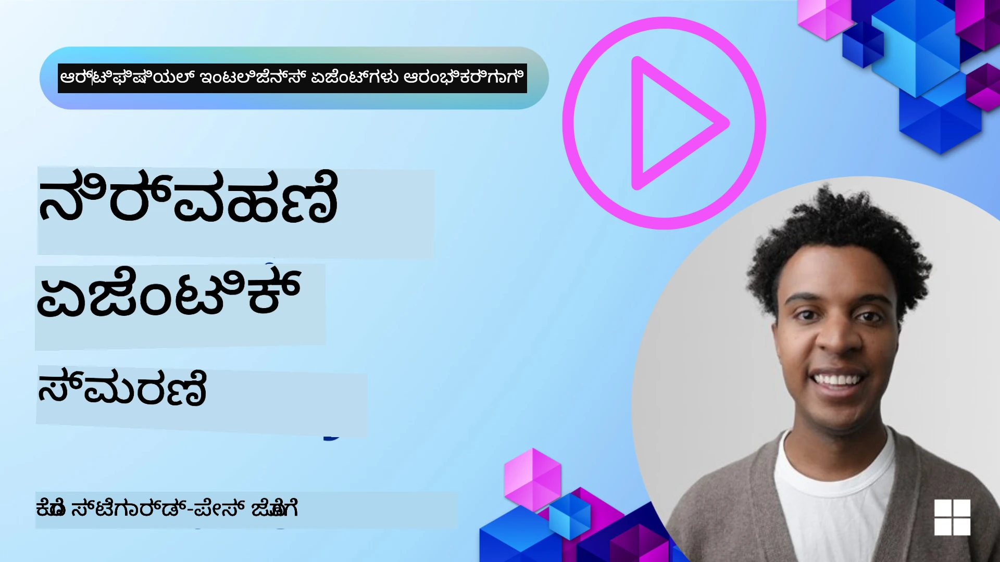

# AI ಏಜೆಂಟ್‌ಗಳಿಗಾಗಿ ಸ್ಮರಣೆ 

AI ಏಜೆಂಟ್‌ಗಳನ್ನು ರಚಿಸುವ ವಿಶೇಷ ಲಾಭಗಳನ್ನು ಚರ್ಚಿಸುವಾಗ, ದೀರ್ಘಕಾಲೀನ ಕಾರ್ಯಗಳನ್ನು ಪೂರ್ಣಗೊಳಿಸಲು ಸಾಧನಗಳನ್ನು ಕರೆಸಲು ಸಾಮರ್ಥ್ಯ ಮತ್ತು ಸಮಯದೊಂದಿಗೆ ಸುಧಾರಿಸುವ ಸಾಮರ್ಥ್ಯ ಮುಖ್ಯವಾಗಿ ಚರ್ಚಿಸಲಾಗುತ್ತದೆ. ಸ್ಮರಣೆ ನಮ್ಮ ಬಳಕೆದಾರರಿಗೆ ಉತ್ತಮ ಅನುಭವಗಳನ್ನು ಸೃಷ್ಟಿಸುವ ಸ್ವಯಂ ಸುಧಾರಣೆಯ ಏಜೆಂಟ್ ರಚಿಸುವ ಆಧಾರವಾಗಿದೆ.

ಈ ಪಾಠದಲ್ಲಿ, ನಾವು AI ಏಜೆಂಟ್‌ಗಳಿಗೆ ಸ್ಮರಣೆ ಎಂದರೆ ಏನು ಮತ್ತು ಅದನ್ನು ಹೇಗೆ ನಿರ್ವಹಿಸಬಹುದು ಮತ್ತು ನಮ್ಮ ಅಪ್ಲಿಕೇಷನ್‌ಗಳಿಗೆ ಹೇಗೆ ಪ್ರಯೋಜನಕಾರಿಯಾಗಿ ಬಳಸಬಹುದು ಎಂಬುದನ್ನು ನೋಡಲಿದ್ದೇವೆ.

## ಪರಿಚಯ

ಈ ಪಾಠದಲ್ಲಿ ಈ ವಿಷಯಗಳನ್ನು ಒಳಗೊಂಡಿದೆ:

• **AI ಏಜೆಂಟ್ ಸ್ಮರಣೆಯ ಅರ್ಥ ತಿಳಿಯುವುದು**: ಸ್ಮರಣೆ ಎಂದರೇನು ಮತ್ತು ಏಜೆಂಟ್‌ಗಳಿಗೆ ಅದು ಯಾಕೆ ಅಗತ್ಯ.

• **ಸ್ಮರಣೆಯನ್ನು ಅನುಷ್ಠಾನಗೊಳಿಸುವುದು ಮತ್ತು ಸಂರಕ್ಷಿಸುವುದು**: ನಿಮ್ಮ AI ಏಜೆಂಟ್‌ಗಳಿಗೆ ಸ್ಮರಣೆ ಸಾಮರ್ಥ್ಯಗಳನ್ನು ಸೇರಿಸುವ ಪ್ರಾಯೋಗಿಕ ವಿಧಾನಗಳು, ಹತ್ತುಕಾಲಿಕೆ ಮತ್ತು ದೀರ್ಘಕಾಲಿಕ ಸ್ಮರಣೆ ಮೇಲೆ ಕೇಂದ್ರೀಕರಿಸಿ.

• **AI ಏಜೆಂಟ್‌ಗಳನ್ನು ಸ್ವಯಂ ಸುಧಾರಿಸುವಂತೆ ಮಾಡಲು**: ಸ್ಮರಣೆ ಏಜೆಂಟ್‌ಗಳು ಹಳೆಯ ಸಂವಹನಗಳಿಂದ ಕಲಿಯಲು ಮತ್ತು ಸಮಯದೊಂದಿಗೆ ಸುಧಾರಿಸಲು ಹೇಗೆ ಸಹಾಯ ಮಾಡುತ್ತದೆ.

## ಲಭ್ಯವಿರುವ ಅನುಷ್ಠಾನಗಳು

ಈ ಪಾಠದಲ್ಲಿ ಎರಡು ಸಂಪೂರ್ಣ ನೋಟ್‌ಬುಕ್ ಟ್ಯುಟೋರಿಯಲ್‌ಗಳಿವೆ:

• **[13-agent-memory.ipynb](./13-agent-memory.ipynb)**: Mem0 ಮತ್ತು Azure AI Search ಉಪಯೋಗಿಸಿ Microsoft Agent Framework ಸಹಿತ ಸ್ಮರಣೆಯನ್ನು ಅನುಷ್ಠಾನಗೊಳಿಸುತ್ತದೆ

• **[13-agent-memory-cognee.ipynb](./13-agent-memory-cognee.ipynb)**: Cognee ಉಪಯೋಗಿಸಿ ರಚನೆಯಾದ ಸ್ಮರಣೆಯನ್ನು ಅನುಷ್ಠಾನಗೊಳಿಸುತ್ತದೆ, ಸ್ವಯಂಚಾಲಿತವಾಗಿ ಎಂಬೆಡ್ಡಿಂಗ್‌ಗಳಿಂದ ಬೆಂಬಲಿತ ಜ್ಞಾನ ಗ್ರಾಫ್ ನಿರ್ಮಿಸುವುದು, ಗ್ರಾಫ್ ಅನ್ನು ದೃಶ್ಯೀಕರಣ ಮಾಡುವುದು ಮತ್ತು ಬುದ್ಧಿವಂತವಾಗಿ ವಿಚಾರಣೆಯನ್ನು ನಿರ್ವಹಿಸುವುದು

## ಕಲಿಕೆಯ ಗುರಿಗಳು

ಈ ಪಾಠವನ್ನು ಪೂರ್ಣಗೊಳಿಸಿದ ನಂತರ, ನೀವು ತಿಳಿಯಲಿದ್ದಿರಿ:

• **ವಿಭಿನ್ನ ಪ್ರಕಾರದ AI ಏಜೆಂಟ್ ಸ್ಮರಣೆ ಗಳನ್ನು ವಿಭಿನ್ನವಾಗಿ ಅರಿವು ಪಡೆಯುವುದು**, ಅದರಲ್ಲಿ ಕೆಲಸ ಮಾಡುವ, ಹತ್ತುಕಾಲಿಕೆ ಮತ್ತು ದೀರ್ಘಕಾಲಿಕ ಸ್ಮರಣೆಗಳ ಜೊತೆಗೆ ವ್ಯಕ್ತಿತ್ವ ಮತ್ತು ಘಟನಾವಳಿ ಸ್ಮರಣೆಗಳ ವಿಶೇಷ ರೂಪಗಳು ಸೇರಿವೆ.

• **Microsoft Agent Framework ಉಪಯೋಗಿಸಿ AI ಏಜೆಂಟ್‌ಗಳಿಗೆ ಹತ್ತುಕಾಲಿಕೆ ಮತ್ತು ದೀರ್ಘಕಾಲಿಕ ಸ್ಮರಣೆಯನ್ನು ಅನುಷ್ಠಾನಗೊಳಿಸುವುದು ಮತ್ತು ನಿರ್ವಹಿಸುವುದು**, Mem0, Cognee, ವೈಟ್‌ಬೋರ್ಡ್ ಸ್ಮರಣೆಗಳನ್ನು ಬಳಸುವುದು ಮತ್ತು Azure AI Search ಜೊತೆಗೆ ಸಂಯೋಜಿಸುವುದು.

• **ಸ್ವಯಂ ಸುಧಾರಣೆಯ AI ಏಜೆಂಟ್‌ಗಳ ಪರಿಯೋಜನೆಗಳು ಮತ್ತು ದಿಟ್ಟ ಸ್ಮರಣೆ ನಿರ್ವಹಣೆಯ ವ್ಯವಸ್ಥೆಗಳು ಕ್ರಿಯಾತ್ಮಕ ಕಲಿಕೆ ಮತ್ತು ಹೊಂದಾಣಿಕೆಗೆ ಹೇಗೆ ಕಾರಣವಾಗುತ್ತವೆ ಎಂಬುದನ್ನು ಅರ್ಥಮಾಡಿಕೊಳ್ಳುವುದು**.

## AI ಏಜೆಂಟ್ ಸ್ಮರಣೆಯ ಅರ್ಥ

ಮೂಲಭೂತವಾಗಿ, **AI ಏಜೆಂಟ್‌ಗಳಿಗಾಗಿ ಸ್ಮರಣೆ ಎಂದರೆ ಅವರಿಗೆ ಮಾಹಿತಿಯನ್ನು ಉಳಿಸಿ ಜೊತೆಗೊಳಿಸಲು ಮತ್ತು ಪುನಃ ಕರೆತರುವ ಯಂತ್ರಚಾಲಿತ ವ್ಯವಸ್ಥೆಗಳು**. ಈ ಮಾಹಿತಿ ಮಾತನಾಡಿದ್ದ ವಿಷಯದ ನಿರ್ದಿಷ್ಟ ವಿವರಗಳು, ಬಳಕೆದಾರರ ಇಷ್ಟಗಳು, ಹಿಂದಿನ ಕ್ರಿಯೆಗಳು ಅಥವಾ ಕಲಿತ ಮಾದರಿಗಳನ್ನು ಒಳಗೊಂಡಿರಬಹುದು.

ಸ್ಮರಣೆ ಇಲ್ಲದಿದ್ದರೆ, AI ಅಪ್ಲಿಕೇಶನ್‌ಗಳು ಸಾಮಾನ್ಯವಾಗಿ ಸ್ಥಿತಿಗತಿಯಿಲ್ಲದಿವೆ, ಅರ್ಥಾತ್ ಪ್ರತಿ ಸಂವಹನ ಹೊಸದಾಗಿ ಪ್ರಾರಂಭವಾಗುತ್ತದೆ. ಇದರಿಂದ ಬಳಕೆದಾರರಿಗೆ "ಮರೆತಿರುವ" ಹಿಂದಿನ ಪರಿಪ್ರೇಕ್ಷ್ಯ ಅಥವಾ ಇಷ್ಟಗಳನ್ನು ಹೊಂದದ ನಿರಂತರ ಮತ್ತು ಕೋಪದಾಯಕ ಅನುಭವ ದೊರಕುತ್ತದೆ.

### ಸ್ಮರಣೆ ಯಾಕೆ ಮುಖ್ಯ?

ಏಜೆಂಟ್‌ನ ಬುದ್ಧಿವಂತಿಕೆಯು ಅದನ್ನು ಹಿಂದಿನ ಮಾಹಿತಿಯನ್ನು ನೆನಪಿಸಿಕೊಂಡು ಬಳಸಲು ಹೊಂದಿರುವ ಸಾಮರ್ಥ್ಯದೊಂದಿಗೆ ಆಳವಾಗಿ ಸಂಬಂದಿಸಿದೆ. ಸ್ಮರಣೆ ಏಜೆಂಟ್‌ಗಳನ್ನು ಇಡೀ ಮಾಡುತ್ತದೆ:

• **ಪರಿಶೀಲನೆ ಮಾಡುತಿ**: ಹಿಂದೆಗೊಂಡ ಕ್ರಮಗಳು ಮತ್ತು ಫಲಿತಾಂಶಗಳಿಂದ ಕಲಿಯುವುದು.

• **ಸම්බಂಧಿಸಿದ**: ನಡೆಯುತ್ತಿರುವ ಸಂಭಾಷಣೆಗಳ ಪೈಕಿ ಪರಿಪ್ರೇಕ್ಷ್ಯವನ್ನು ಕಾಯ್ದುಕೊಳ್ಳುವುದು.

• **ಪೂರ್ವಾನುಮಾನ ಹಾಗೂ ಪ್ರತಿಕ್ರಿಯಾಶೀಲ**: ಹಿಂದಿನ ಡೇಟಾ ಆಧಾರದ ಮೇಲೆ ಅಗತ್ಯಗಳನ್ನು ನಿರೀಕ್ಷಿಸುವುದು ಅಥವಾ ಸೂಕ್ತವಾಗಿ ಪ್ರತಿಕ್ರಿಯಿಸುವುದು.

• **ಸ್ವಾಯತ್ತ**: ಸಂಗ್ರಹಿತ ಜ್ಞಾನವನ್ನು ಬಳಸಿಕೊಂಡು ಹೆಚ್ಚು ಸ್ವತಂತ್ರವಾಗಿ ಕಾರ್ಯನಿರ್ವಹಿಸುವುದು.

ಸ್ಮರಣೆಯನ್ನು ಅನುಷ್ಠಾನಗೊಳಿಸುವ ಉದ್ದೇಶ ಏಜೆಂಟ್‌ಗಳನ್ನು ಹೆಚ್ಚು **ನಿರ್ಬಂಧಾರ್ಹ ಮತ್ತು ಸಾಮರ್ಥ್ಯವಂತವಾಗಿಸುವುದು**.

### ಸ್ಮರಣೆಯ ವಿಧಗಳು

#### ಕೆಲಸ ಮಾಡುವ ಸ್ಮರಣೆ

ಇದನ್ನು ಏಜೆಂಟ್ ಒಂದು ಒಂದೇ ಕಾರ್ಯ ಅಥವಾ ಆಲೋಚನಾ ಪ್ರಕ್ರಿಯೆಯ ಸಮಯದಲ್ಲಿ ಬಳಸುವ ಸಲಹೆ ಪತ್ರಿಕೆಯ ತುಂಡಿನಂತೆ ಪರಿಗಣಿಸಬಹುದು. ಮುಂದಿನ ಹೆಜ್ಜೆಯನ್ನು ಗಣನೆ ಮಾಡಲು ತಕ್ಷಣದ ಮಾಹಿತಿಯನ್ನು ಇಟುಕೊಳ್ಳುತ್ತದೆ.

AI ಏಜೆಂಟ್‌ಗಳಿಗಾಗಿ, ಕೆಲಸ ಮಾಡುವ ಸ್ಮರಣೆ ಸಂಭಾಷಣೆಗಳಿಂದ ಅತ್ಯಂತ ಸಂಬಂಧಿಸಿದ ಮಾಹಿತಿಯನ್ನು ಹಿಡಿಯುತ್ತದೆ, ಚಾಟ್ ಇತಿಹಾಸವು ದೀರ್ಘವಾಗಿದ್ದರೂ ಅಥವಾ ಕತ್ತರಿಸಲಾಗಿದ್ದರೂ ಕೂಡ. ಇದು ಅಗತ್ಯಗಳು, ಪ್ರಸ್ತಾಪಗಳು, ನಿರ್ಣಯಗಳು ಮತ್ತು ಕ್ರಿಯೆಗಳನ್ನು ಹೊರತೆಗೆದacemf ಧ್ಯಾನ ಕೊಡುತ್ತದೆ.

**ಕೆಲಸದ ಸ್ಮರಣೆ ಉದಾಹರಣೆ**

ಪ್ರಯಾಣದ ಬುಕ್ಕಿಂಗ್ ಏಜೆಂಟ್‌ನಲ್ಲಿ, ಕೆಲಸ ಮಾಡುವ ಸ್ಮರಣೆ ಬಳಕೆದಾರರ ಪ್ರಸ್ತುತ ವಿನಂತಿಯನ್ನು ಹಿಡಿಯಬಹುದು, ಉದಾಹರಣೆಗೆ "ನಾನು ಪ್ಯಾರಿಸ್‌ಗೆ ಪ್ರವಾಸವನ್ನು ಬುಕ್ ಮಾಡಬೇಕಾಗಿದೆ". ಈ ನಿಖರವಾದ ಅಗತ್ಯವನ್ನು ಏಜೆಂಟ್ ತನ್ನ ತಕ್ಷಣದ ಬಾತಾಯಿಕೆಯಲ್ಲಿ ಇಟ್ಟುಕೊಂಡಿರುತ್ತದೆ ಪ್ರಸ್ತುತ ಸಂವಾದವನ್ನು ನಯವಾಗಿ ನಡೆಸಲು.

#### ಹತ್ತುಕಾಲಿಕ ಸ್ಮರಣೆ

ಈ ವಿಧದ ಸ್ಮರಣೆ ಒಂದು ಒಂದೇ ಸಂಭಾಷಣೆ ಅಥವಾ ಸೆಷನ್ ಅವಧಿಗೆ ಮಾಹಿತಿಯನ್ನು ಉಳಿಸಿಕೊಳ್ಳುತ್ತದೆ. ಇದು ಪ್ರಸ್ತುತ ಚಾಟ್ ಪರಿಪ್ರೇಕ್ಷ್ಯವಾಗಿದ್ದು, ಏಜೆಂಟ್ ಹಿಂದಿನ ಸಂಭಾಷಣಾ ತಿರುವುಗಳನ್ನು ಉಲ್ಲೇಖಿಸಲು ಸಾಧ್ಯವಾಗುತ್ತದೆ.

[Microsoft Agent Framework](https://github.com/microsoft/agent-framework) ಪೈಥಾನ್ SDK ನ ಮಾದರಿಗಳಲ್ಲಿ, ಇದನ್ನು `AgentSession` ಗೆ ನಕ್ಷಿ ಮಾಡಲಾಗಿದೆ, ಇದು `agent.create_session()` ಮೂಲಕ ರಚಿಸಲಾಗಿದೆ. ಸೆಷನ್ ಫ್ರೇಮ್ವರ್ಕ್‌ನ ನಿರ್ಮಿತ ಹತ್ತುಕಾಲಿಕ ಸ್ಮರಣೆ ಆಗಿದೆ: ಅದೇ ಸೆಷನ್ ಮರುಬಳಕೆ ಆಗುತ್ತಿರುವಷ್ಟಕ್ಕೆ ಸಂಭಾಷಣೆಯ ಪರಿಪ್ರೇಕ್ಷ್ಯ ಲಭ್ಯವಾಗಿರುತ್ತದೆ, ಆದರೆ ಸೆಷನ್ ಮುಗಿದಾಗ ಅಥವಾ ಅಪ್ಲಿಕೇಶನ್ ಮರುಪ್ರಾರಂಭವಾದಾಗ ಆ ಪರಿಪ್ರೇಕ್ಷ್ಯ ಉಳಿದಿರದು. ಸತ್ಯಗಳು ಮತ್ತು ಇಷ್ಟಗಳು ಸೆಷನ್‌ಗಳ ನಡುವೆ ಉಳಿಯ ಬೇಕಾದರೆ ದೀರ್ಘಕಾಲಿಕ ಸ್ಮರಣೆ ಬಳಸಬೇಕು, ಸಾಮಾನ್ಯವಾಗಿ ಡೇಟಾಬೇಸ್, ವೆಕ್ಟರ್ ಸೂಚ್ಯಂಕ ಅಥವಾ ಇನ್ನೊಂದು ಸ್ಥಿರ ಸಂಗ್ರಹಣೆಯಿಂದ.

**ಹತ್ತುಕಾಲಿಕ ಸ್ಮರಣೆ ಉದಾಹರಣೆ**

ಬಳಕೆದಾರ "ಪ್ಯಾರಿಸ್‌ಗೆ ಹಾರಾಟದ ದರ ಎಷ್ಟು?" ಎಂದು ಕೇಳಿದ ನಂತರ "ಅಲ್ಲಿ ವಸತಿ ಹೇಗಿದೆ?" ಎಂದು ಕೇಳಿದರೆ, ಹತ್ತುಕಾಲಿಕ ಸ್ಮರಣೆ ಏಜೆಂಟ್ ಕೈಗೊಂಡ ಸಂಭಾಷಣೆಯಲ್ಲಿ "ಅಲ್ಲಿ" ಎಂದರೆ "ಪ್ಯಾರಿಸ್" ಎಂಬುದನ್ನು ತಿಳಿದಿರುತ್ತದೆ.

#### ದೀರ್ಘಕಾಲಿಕ ಸ್ಮರಣೆ

ಇದು ಹಲವಾರು ಸಂಭಾಷಣೆಗಳು ಅಥವಾ ಸೆಷನ್‌ಗಳ ನಡುವೆ ಉಳಿಯುವ ಮಾಹಿತಿಯಾಗಿದೆ. ಇದು ಏಜೆಂಟ್‌ಗಳಿಗೆ ಬಳಕೆದಾರರ ಇಷ್ಟಗಳು, ಇತಿಹಾಸ ಸಂವಹನಗಳು ಅಥವಾ ಸಾಮಾನ್ಯ ಜ್ಞಾನವನ್ನು ದೀರ್ಘಾವಧಿಯಲ್ಲಿ ನೆನಪಿಡಲು ಸಹಾಯ ಮಾಡುತ್ತದೆ. ವೈಯಕ್ತೀಕರಣಕ್ಕೆ ಇದು ಅತ್ಯಂತ ಮುಖ್ಯ.

**ದೀರ್ಘಕಾಲಿಕ ಸ್ಮರಣೆ ಉದಾಹರಣೆ**

ದೀರ್ಘಕಾಲಿಕ ಸ್ಮರಣೆ "ಬೆನ್ ಹಿಮದ ಸರಕು ಹಾಗೂ ಬಾಹ್ಯ ಚಟುವಟಿಕೆಗಳನ್ನು ಇಷ್ಟಪಡುವನು, ಪರ್ವತ ನೋಟದೊಂದಿಗೆ ಕಾಫಿಯನ್ನು ಇಷ್ಟಪಡುವನು ಹಾಗೂ ಹಿಂಬಾಲಿಸಿದ ಗಾಯದ ಕಾರಣದಿಂದ ಮುಂದಿನ ಅಡ್ವಾನ್ಸ್ಡ್ ಹಿಮದ ಸರಕುಗಳಲ್ಲಿಗೆ ಹೋಗುವುದನ್ನು ತಪ್ಪಿಸುತ್ತಾನೆ" ಎಂಬ ಮಾಹಿತಿಯನ್ನು ಸಂಗ್ರಹಿಸಿರಬಹುದು. ಈ ಹಿಂದಿನ ಸಂವಹನಗಳಿಂದ ಕಲಿತ ಮಾಹಿತಿಯು ಭವಿಷ್ಯದ ಪ್ರವಾಸ ಯೋಜನಾ ಸೆಷನ್‌ಗಳಲ್ಲಿ ಶಿಫಾರಸುಗಳನ್ನು ಹೆಚ್ಚು ವೈಯಕ್ತಿಕಗೊಂಡಂತೆ ಮಾಡುತ್ತದೆ.

#### ವ್ಯಕ್ತಿತ್ವ ಸ್ಮರಣೆ

ಈ ವಿಶೇಷ ಸ್ಮರಣೆ ಪ್ರಕಾರವು ಏಜೆಂಟ್‌ಗೆ ಸತತ "ವ್ಯಕ್ತಿತ್ವ" ಅಥವಾ "ಪರ್ಸೋನಾ" ಅಭಿವೃದ್ಧಿಗೊಳಿಸಲು ಸಹಾಯ ಮಾಡುತ್ತದೆ. ಇದು ಏಜೆಂಟ್ ಅನ್ನು ತನ್ನ ಬಗ್ಗೆ ಅಥವಾ ನಿರ್ದಿಷ್ಟ ಪಾತ್ರದ ಬಗ್ಗೆ ವಿವರಗಳನ್ನು ನೆನಪಿಡಲು ಅನುಮತಿಸುತ್ತದೆ, ಇದರಿಂದ ಸಂವಹನಗಳು ಹೆಚ್ಚು ಬದಲಾಯಣೆ ಇಲ್ಲದ ಮತ್ತು ಕೇಂದ್ರೀಕೃತವಾಗುತ್ತವೆ.

**ವ್ಯಕ್ತಿತ್ವ ಸ್ಮರಣೆ ಉದಾಹರಣೆ**
ಪ್ರವಾಸ ಏಜೆಂಟ್ ಒಂದು "ತಜ್ಞ ಹಿಮ ಸರಕು ಯೋಜಕ" ಆಗಿರುವಂತೆ ವಿನ್ಯಾಸಗೊಳಿಸಿದರೆ, ವ್ಯಕ್ತಿತ್ವ ಸ್ಮರಣೆ ಈ ಪಾತ್ರವನ್ನು ಬೆಂಬಲಿಸಬಹುದು, ತಜ್ಞನ ಸಾಂದರ್ಭಿಕ ಧ್ವನಿಗಳು ಮತ್ತು ತಿಳಿವಳಿಕೆಗಳೊಂದಿಗೆ ಅದರ ಪ್ರತಿಕ್ರಿಯೆಗಳನ್ನು ಹೊಂದಿಸುತ್ತದೆ.

#### ಕಾರ್ಯಪಟು/ಘಟನಾವಳಿ ಸ್ಮರಣೆ

ಈ ಸ್ಮರಣೆ ಏಜೆಂಟ್ ಒಂದು ಸಂಕೀರ್ಣ ಕಾರ್ಯವನ್ನು ನಡೆಸುವಾಗ ಅನುಸರಿಸುವ ಕ್ರಮಗಳನ್ನು, ಯಶಸ್ಸುಗಳು ಮತ್ತು ವಿಫಲತೆಗಳನ್ನು ಸಂಗ್ರಹಿಸುತ್ತದೆ. ಇದು ನಿರ್ದಿಷ್ಟ "ಘಟನಾವಳಿ" ಅಥವಾ ಹಿಂದಿನ ಅನುಭವಗಳನ್ನು ನೆನಪಿಸುವಂತೆ ಆಗಿದೆ, ಅವುಗಳಿಂದ ಕಲಿಯಲು.

**ಘಟನಾವಳಿ ಸ್ಮರಣೆ ಉದಾಹರಣೆ**

ಏಜೆಂಟ್ ಒಂದು ನಿರ್ದಿಷ್ಟ ಹಾರಾಟವನ್ನು ಬುಕ್ ಮಾಡಲು ಪ್ರಯತ್ನಿಸಿದಾಗ ಅದು ಲಭ್ಯವಿಲ್ಲದ ಕಾರಣ ವಿಫಲವಾದರೆ, ಘಟನಾವಳಿ ಸ್ಮರಣೆ ಈ ವಿಫಲತೆಯನ್ನು ದಾಖಲಿಸುತ್ತದೆ, ನಂತರ ಆಯ್ಕೆ ಹಾರಾಟಗಳನ್ನು ಪ್ರಯತ್ನಿಸಲು ಅಥವಾ ಬಳಕೆದಾರರಿಗೆ ವಿವರಣೆಗಾಗಿ ಹೆಚ್ಚಿನ ಬೇರೆ ಪ್ರಯತ್ನದಲ್ಲಿ ತಿಳಿಸುವಂತೆ ಮಾಡುತ್ತದೆ.

#### ಘಟಕ ಸ್ಮರಣೆ

ಇದು ಸಂಭಾಷಣೆಗಳಿಂದ ನಿರ್ದಿಷ್ಟ ಘಟಕಗಳನ್ನು (ಜನರು, ಸ್ಥಳಗಳು ಅಥವಾ ವಸ್ತುವಿಗಳು) ಮತ್ತು ಘಟನೆಗಳನ್ನು ಹೊರತೆಗೆಯುವುದು ಮತ್ತು ನೆನಪಿಸುವುದನ್ನು ಒಳಗೊಂಡಿದೆ. ಇದು ಏಜೆಂಟ್ಗೆ ಚರ್ಚಿಸಲಾದ ಪ್ರಮುಖ ಅಂಶಗಳ ರಚನೆಯಾದ ಅರ್ಥವನ್ನು ನಿರ್ಮಿಸಲು ಅನುಮತಿಸುತ್ತದೆ.

**ಘಟಕ ಸ್ಮರಣೆ ಉದಾಹರಣೆ**

ಹಿಂದಿನ ಪ್ರವಾಸ ಕುರಿತು ಮಾತನಾಡಿದಾಗ, ಏಜೆಂಟ್ "ಪ್ಯಾರಿಸ್", "ಐಫಲ್ ಟವರ್" ಮತ್ತು "ಲೆ ಶಾಟ್ ನ್ಯುವಾರ್ ರೆಸ್ಟಾರೆಂಟ್‌ನಲ್ಲಿ ಊಟ" ಎಂಬ ಘಟಕಗಳನ್ನು ಹೊರತೆಗೆಯಬಹುದು. ಮುಂದಿನ ಸಂಭಾಷಣದಲ್ಲಿ, ಏಜೆಂಟ್ "ಲೆ ಶಾಟ್ ನ್ಯುವಾರ್" ಅನ್ನು ನೆನಪಿಸಬಹುದು ಮತ್ತು ಅಲ್ಲಿಗೆ ಹೊಸ ಕಾಯ್ದಿರಿಸುವಿಕೆಯನ್ನು ಮಾಡಿಕೊಳ್ಳುವ ಪ್ರಸ್ತಾವನೆ ನೀಡಬಹುದು.

#### ರಚನಾತ್ಮಕ RAG (ಪುನರುಪಯೋಗಿತ ಹೆಚ್ಚುವರಿ ತಯಾರಿಕೆ)

RAG ಸಾಮಾನ್ಯತಃ ವಿಶಾಲ ತಂತ್ರವಾಗಿದೆ, "ರಚನಾತ್ಮಕ RAG" ಎಂಬುದು ಶಕ್ತಿಶಾಲಿಯಾದ ಸ್ಮರಣೆ ತಂತ್ರಜ್ಞಾನವಾಗಿ ಸೂಚಿಸಲಾಗಿದೆ. ಇದು ವಿವಿಧ ಮೂಲಗಳಿಂದ (ಸಂಭಾಷಣೆಗಳು, ಇಮೇಲ್‌, ಚಿತ್ರಗಳು) ದಟ್ಟ, ರಚನೆಯಾದ ಮಾಹಿತಿಯನ್ನು ಹೊರತೆಗೆಯುತ್ತದೆ ಮತ್ತು ಅದನ್ನು ಪ್ರತಿಕ್ರಿಯೆಗಳ ಗಾತಾನುಬಂಧಿತತೆ, ನೆನಪಿಕೆ ಮತ್ತು ವೇಗವನ್ನು ಹೆಚ್ಚಿಸಲು ಬಳಸುತ್ತದೆ. ಪಾರಂಪರಿಕ RAG ಮಾತ್ರ ಅರ್ಥಭರಿತ ಸಮಾನತೆಯ ಮೇಲೆ ಅವಲಂಬಿಸಿದರೆ, ರಚನಾತ್ಮಕ RAG ಮೂಲ ಮಾಹಿತಿಯ ಸ್ವಭಾವಿಕ ರಚನೆಯೊಂದಿಗೆ ಕಾರ್ಯನಿರ್ವಹಿಸುತ್ತಿದೆ.

**ರಚನಾತ್ಮಕ RAG ಉದಾಹರಣೆ**

ಕೀವರ್ಡ್‌ಗಳನ್ನು ಹೊಂದಿಸುವ ಬದಲು, ರಚನಾತ್ಮಕ RAG ಇಮೇಲ್‌ನಿಂದ ಹಾರಾಟದ ವಿವರಗಳು (ಗಮ್ಯಸ್ಥಾನ, ದಿನಾಂಕ, ಸಮಯ, ಏರ್‌ಲೈನ್) ಅನ್ನು ಪಾರ್ಸ್ ಮಾಡಿ ಮತ್ತು ಅವುಗಳನ್ನು ರಚನೆಯಾದ ರೀತಿಯಲ್ಲಿ ಸಂಗ್ರಹಿಸಬಹುದು. ಇದರಿಂದ "ನಾನು ಮಂಗಳವಾರ ಯಾವ ಹಾರಾಟವನ್ನು ಪ್ಯಾರಿಸ್‌ಗೆ ಬುಕ್ ಮಾಡಿದೆನು?" ಎಂಬ ನಿಖರ ಪ್ರಶ್ನೆಗಳಿಗೆ ಉತ್ತರ ನೀಡಬಹುದು.

## ಸ್ಮರಣೆಯನ್ನು ಅನುಷ್ಠಾನಗೊಳಿಸುವುದು ಮತ್ತು ಸಂಗ್ರಹಿಸುವುದು

AI ಏಜೆಂಟ್‌ಗಳಿಗಾಗಿ ಸ್ಮರಣೆಯನ್ನು ಅನುಷ್ಠಾನಗೊಳಿಸುವುದು ಒಂದು ವೈಧವಾರಿಞ್ ಪ್ರಕ್ರಿಯೆಯನ್ನು ಒಳಗೊಂಡಿದೆ, ಅದರಲ್ಲಿ ಸ್ಮರಣೆ ನಿರ್ವಹಣೆ, ಉತ್ಪಾದನೆ, ಸಂಗ್ರಹಣೆ, ಪುನಃಪಡೆಯುವುದು, ಸಂಯೋಜನೆ, ನವೀಕರಣ, ಮತ್ತು "ಮರೆಮಾಚುವುದು" (ಅಥವಾ ಅಳಿಸುವುದು) ಸೇರಿವೆ. ಪುನಃಪಡೆಯುವುದು ವಿಶೇಷವಾಗಿ ಮುಖ್ಯ ವಿಷಯವಾಗಿದೆ.

### ವಿಶೇಷ ಸ್ಮರಣೆ ಸಾಧನಗಳು

#### Mem0

ಏಜೆಂಟ್ ಸ್ಮರಣೆಯನ್ನು ಸಂಗ್ರಹಿಸುವ ಮತ್ತು ನಿರ್ವಹಿಸುವ ಒಂದೊಂದು ವಿಧಾನವೆಂದರೆ ವಿಶೇಷ ಸಾಧನಗಳನ್ನು ಬಳಸುವುದು, ಉದಾಹರಣೆಗೆ Mem0. Mem0 ಒಂದು ನಿರಂತರ ಸ್ಮರಣೆ ಪದರವಾಗಿ ಕಾರ್ಯನಿರ್ವಹಿಸುತ್ತದೆ, ಏಜೆಂಟ್‌ಗಳು ಸಂಬಂಧಿತ ಸಂವಹನಗಳನ್ನು ನೆನಪಿಸಿಕೊಂಡು, ಬಳಕೆದಾರ ಇಷ್ಟಗಳು ಮತ್ತು ವಾಸ್ತವಿಕ ಸಂದರ್ಭಗಳನ್ನು ಸಂಗ್ರಹಿಸಿ, ಯಶಸ್ಸುಗಳು ಮತ್ತು ವಿಫಲತೆಗಳಿಂದ ಕಲಿಯಲು ಸಹಾಯ ಮಾಡುತ್ತದೆ. ಈ ಮೂಲಕ ಸ್ಥಿತಿರಹಿತ ಏಜೆಂಟ್‌ಗಳು ಸ್ಥಿತಿಗತಿಯಿಂದ ದೊರೆಯುವ ಏಜೆಂಟ್‌ಗಳಾಗಿ ಪರಿವರ್ತಿಸುತ್ತವೆ.

ಇದು **ಎರಡು ಹಂತದ ಸ್ಮರಣೆ ಪ್ರಕ್ರಿಯೆಯಿಂದ ಕಾರ್ಯನಿರ್ವಹಿಸುತ್ತದೆ: ಹೊರತೆಗೆಯುವುದು ಮತ್ತು ನವೀಕರಿಸುವುದು**. ಮೊದಲು, ಏಜೆಂಟ್ ತುಂಬುವ ಸಂದೇಶಗಳು Mem0 ಸೇವೆಗೆ ಕಳುಹಿಸಲಾಗುತ್ತದೆ, ಇಲ್ಲಿ ಲಾರ್ಜ್ ಲ್ಯಾಂಗ್ವೇಜ್ ಮಾದರಿ (LLM) ಸಂಭಾಷಣೆಯ ಇತಿಹಾಸವನ್ನು ಸಾರಾಂಶಗೊಳಿಸುತ್ತದೆ ಮತ್ತು ಹೊಸ ಸ್ಮರಣೆಗಳನ್ನು ಹೊರತೆಗೆಯುತ್ತದೆ. ನಂತರ, LLM ಚಾಲಿತ ನವೀಕರಣ ಹಂತವು ಈ ಸ್ಮರಣೆಗಳನ್ನು ಸೇರಿಸಲು, ಬದಲಾಯಿಸಲು ಅಥವಾ ಅಳಿಸಲು ನಿರ್ಧರಿಸುತ್ತದೆ, ಅವುಗಳನ್ನು ವೆಕ್ಟರ್, ಗ್ರಾಫ್ ಮತ್ತು કೀ-ಮೌಲ್ಯ ಡೇಟಾಬೇಸ್‌ಗಳನ್ನು ಹೊಂದಿರುವ ಸಂಯೋಜಿತ ಡೇಟಾ ಸ್ಟೋರ್‌ನಲ್ಲಿ ಸಂಗ್ರಹಿಸುತ್ತದೆ. ಈ ವ್ಯವಸ್ಥೆ ವಿವಿಧ ಸ್ಮರಣೆ ಪ್ರಕಾರಗಳಿಗೂ ಬೆಂಬಲ ನೀಡುತ್ತದೆ ಮತ್ತು ಘಟಕಗಳ ನಡುವಣ ಸಂಬಂಧಗಳನ್ನು ನಿರ್ವಹಿಸಲು ಗ್ರಾಫ್ ಸ್ಮರಣೆಯನ್ನು ಸೇರಿಸಬಹುದು.

#### Cognee

ಇನ್ನೊಂದು ಶಕ್ತಿಶಾಲಿ ವಿಧಾನವೆಂದರೆ **Cognee** ಉಪಯೋಗಿಸುವುದು, ಇದು AI ಏಜೆಂಟ್‌ಗಳಿಗೆ ಸಂರಚನಾತ್ಮಕ ಮತ್ತು ಅಸಂರಚಿತ ಡೇಟಾವನ್ನು ಸಮನ್ವಯಪೂರಕ ಎಂಬೆಡ್ಡಿಂಗ್‌ಗಳಿಂದ ಬೆಂಬಲಿತ ಪ್ರಶ್ನಾಸಂಬಂಧಿ ಜ್ಞಾನ ಗ್ರಾಫ್ಗಳಾಗಿ ಪರಿವರ್ತಿಸುವ ಓಪನ್-ಸೋರ್ಸ್ ಸ್ಮರಣೆ ವ್ಯವಸ್ಥೆಯಾಗಿದೆ. Cognee ಒಂದು **ದ್ವಂದ್ವ ಸಂಗ್ರಹಣಾ ವಾಸ್ತುಶಿಲ್ಪವನ್ನು** ನೀಡುತ್ತದೆ, ಇದು ವೆಕ್ಟರ್ ಸಮಾನತೆ ಶೋಧನೆ ಮತ್ತು ಗ್ರಾಫ್ ಸಂಬಂಧಗಳನ್ನು ಸಂಯೋಜಿಸುತ್ತದೆ, ಏಜೆಂಟ್‌ಗಳು ಯಾವ ಮಾಹಿತಿಯು ಒಂದೇ ರೀತಿಯಾಗಿದೆ ಮಾತ್ರವಲ್ಲದೆ ಪರಸ್ಪರ ಹೇಗೆ ಸಂಬಂಧಿಸಿದೆ ಎಂಬುದನ್ನು ಅರ್ಥಮಾಡಿಕೊಳ್ಳುವುದು ಸಾಧ್ಯವಾಗುತ್ತದೆ.

ಇದು ವೆಕ್ಟರ್ ಸಮಾನತೆ, ಗ್ರಾಫ್ ರಚನೆ ಮತ್ತು LLM ತರ್ಕವನ್ನು ಮಿಶ್ರಣಗೊಳಿಸುವ **ಸಂಮಿಶ್ರ ಪುನರುಪಯೋಗೆ**ರಲ್ಲಿ ಸತ್ಸಮರ್ಥವಾಗಿದೆ – ಕಚ್ಚಾ ತುಂಡು ಲುಕ್-ಅಪ್‌ದಿಂದ ಗ್ರಾಫ್-ಅಭಿವೃದ್ಧಿ ಪ್ರಶ್ನೋತ್ತರದವರೆಗೆ. ಈ ವ್ಯವಸ್ಥೆ **ಜೀವಂತ ಸ್ಮರಣೆ** ಅನ್ನು ನಿರ್ವಹಿಸುತ್ತದೆ, ಇದು ಬೆಳೆಯುತ್ತಾ, ಬದಲಾಗುತ್ತಾ ಇರುತ್ತದೆ ಮತ್ತು ಒಂದು ಸಂಪರ್ಕಿತ ಜಾಲದಂತೆ ಪ್ರಶ್ನಾದಾಯಕವಾಗಿರುತ್ತದೆ, ಹತ್ತುಕಾಲಿಕ ಸೆಷನ್ ಪರಿಪ್ರೇಕ್ಷ್ಯ ಮತ್ತು ದೀರ್ಘಕಾಲಿಕ ಸ್ಥಿರ ಸ್ಮರಣೆಗೆ ಬೆಂಬಲ ನೀಡುತ್ತದೆ.

Cognee ನೋಟ್‌ಬುಕ್ ಟ್ಯುಟೋರಿಯಲ್ ([13-agent-memory-cognee.ipynb](./13-agent-memory-cognee.ipynb)) ಈ ಏಕೀಕೃತ ಸ್ಮರಣೆ ಪದರವನ್ನು ನಿರ್ಮಿಸುವುದನ್ನು ತೋರಿಸುತ್ತದೆ, ವಿಭಿನ್ನ ಡೇಟಾ ಮೂಲಗಳನ್ನು ಒಳಗೊಳಿಸುವ ಪ್ರಾಯೋಗಿಕ ಉದಾಹರಣೆಗಳು, ಜ್ಞಾನ ಗ್ರಾಫ್ ದೃಶ್ಯಿಕರಣ ಮತ್ತು ವಿಶೇಷ ಏಜೆಂಟ್ ಅಗತ್ಯಗಳಿಗೆ ಹೊಂದಿಕೊಂಡ ವಿವಿಧ ಶೋಧನಾ ತಂತ್ರಗಳನ್ನು ಬಳಸುವ ವಿಚಾರಣೆಗಳೊಂದಿಗೆ.

### RAG ಬಳಸಿ ಸ್ಮರಣೆಯನ್ನು ಸಂಗ್ರಹಿಸುವುದು

Mem0 ಹಾಗೂ ಇತರ ವಿಶೇಷ	s್ಮರಣೆ ಸಾಧನಗಳ ಹೊರತಾಗಿ, ನೀವು ಬಲವಾದ ಶೋಧನಾ ಸೇವೆಗಳನ್ನು, ವಿಶೇಷವಾಗಿ ರಚನಾತ್ಮಕ RAG ಗಾಗಿ **Azure AI Search ಅನ್ನು ಸ್ಮರಣೆ ಸಂಗ್ರಹಿಸುವ ಮತ್ತು ಪುನಃಪಡೆಯುತ್ತಿರುವ ಬ್ಯಾಕೆಂಡ್ ಆಗಿ ಬಳಸಬಹುದು**.

ಇದು ನಿಮ್ಮ ಏಜೆಂಟ್ ಪ್ರತಿಕ್ರಿಯೆಗಳನ್ನು ನಿಮ್ಮ ಸ್ವಂತ ಡೇಟಾದೊಂದಿಗೆ ನೆಲೆಮಾಡಲು ಅವಕಾಶ ಮಾಡುತ್ತದೆ, ಹೆಚ್ಚು ಸಂಬಂಧಿಸಿದ ಮತ್ತು ನಿಖರವಾದ ಉತ್ತರಗಳನ್ನು ಖಚಿತಪಡಿಸುತ್ತದೆ. Azure AI Search ಬಳಕೆದಾರರ ವಿಶೇಷ ಪ್ರವಾಸ ಸ್ಮರಣೆ, ಉತ್ಪನ್ನ ಕ್ಯಾಟಾಲಾಗ್‌ಗಳು ಅಥವಾ ಯಾವುದೇ ಕ್ಷೇತ್ರ-ನಿರ್ದಿಷ್ಟ ಜ್ಞಾನದ ಸಂಗ್ರಹಣೆಗಾಗಿ ಬಳಸಬಹುದು.

Azure AI Search, ಸಂಭಾಷಣೆ ಇತಿಹಾಸಗಳು, ಇಮೇಲ್‌ಗಳು ಅಥವಾ ಚಿತ್ರಗಳಂತಹ ದೊಡ್ಡ ಡೇಟಾ ಸೆಟ್‌ಗಳ ದಟ್ಟ, ರಚನಾತ್ಮಕ ಮಾಹಿತಿಯನ್ನು ಹೊರತೆಗೆಯಲು ಮತ್ತು ಪುನರುಪಯೋಗಿಸಲು ಉತ್ತಮವಾದ **ರಚನಾತ್ಮಕ RAG** ಸಾಮರ್ಥ್ಯಗಳನ್ನು ಬೆಂಬಲಿಸುತ್ತದೆ. ಇದು ಪಾರಂಪರಿಕ ಪಠ್ಯದ ತುಂಡು ಮತ್ತು ಎಂಬೆಡ್ಡಿಂಗ್ ವಿಧಾನಗಳಿಗಿಂತ ಹೆಚ್ಚಿನ "ಮನುಷ್ಯರಿಗಿಂತ ಮೇಲು" ನಿಖರತೆ ಮತ್ತು ನೆನಪುಗವನ್ನು ಒದಗಿಸುತ್ತದೆ.

## AI ಏಜೆಂಟ್‌ಗಳ ಸ್ವಯಂ ಸುಧಾರಣೆ ಮಾಡಲು

ಸ್ವಯಂ ಸುಧಾರಣೆಯ ಏಜೆಂಟ್‌ಗಳಿಗೆ ಸಾಮಾನ್ಯ ಮಾದರಿಯಾಗಿದ್ದು ಒಂದು **"ಜ್ಞಾನ ಏಜೆಂಟ್"** ಅನ್ನು ಪರಿಚಯಿಸುವುದು. ಈ ಪ್ರತ್ಯೇಕ ಏಜೆಂಟ್ ಬಳಕೆದಾರ ಮತ್ತು ಪ್ರಮುಖ ಏಜೆಂಟ್ ನಡುವಿನ ಮುಖ್ಯ ಸಂಭಾಷಣೆಯನ್ನು ಗಮನಿಸುವುದು. ಅದರ ಪಾತ್ರವೇ:

1. **ಮೂಲ್ಯವಂತ ಮಾಹಿತಿಯ ಗುರುತುಮಾಡುವುದು**: ಸಂಭಾಷಣೆಯ ಯಾವುದೇ ಭಾಗವನ್ನು ಸಾಮಾನ್ಯ ಜ್ಞಾನ ಅಥವಾ ನಿರ್ದಿಷ್ಟ ಬಳಕೆದಾರ ಇಷ್ಟವಾಗಿ ಉಳಿಸುವುದಕ್ಕಾಗಿಯೇ ತೀರ್ಮಾನಿಸುವುದು.

2. **ಹೊರತೆಗೆಯುವುದು ಮತ್ತು ಸಾರಾಂಶ ರೂಪಿಸುವುದು**: ಸಂಭಾಷಣೆಯಿಂದ ಮುಖ್ಯ ಕಲಿಕೆ ಅಥವಾ ಇಷ್ಟವನ್ನು ಸಾರಾಂಶಗೊಳಿಸುವುದು.

3. **ಜ್ಞಾನ ಭಂಡಾರದಲ್ಲಿ ಸಂಗ್ರಹಿಸುವುದು**: ಈ ಹೊರತೆಗೆಯಲಾದ ಮಾಹಿತಿಯನ್ನು, ಸಾಮಾನ್ಯವಾಗಿ ವೆಕ್ಟರ್ ಡೇಟಾಬೇಸ್‌ನಲ್ಲಿ, ನಂತರದಲ್ಲಿ ಪಡೆದುಕೊಳ್ಳಲು ಉಳಿಸುವುದು.

4. **ಭವಿಷ್ಯದ ಪ್ರಶ್ನೆಗಳಿಗೆ ಹೆಚ್ಚಿಸುವುದು**: ಬಳಕೆದಾರ ಹೊಸ ಪ್ರಶ್ನೆಯನ್ನು ಮಾಡುವಾಗ, ಜ್ಞಾನ ಏಜೆಂಟ್ ಸಂಬಂಧಿತ ಸಂಗ್ರಹಿತ ಮಾಹಿತಿಯನ್ನು ಪಡೆದು ಬಳಕೆದಾರರ ಪ್ರಾಂಪ್ಟ್‌ಗೆ ಸೇರಿಸಿ, ಮುಖ್ಯ ಏಜೆಂಟ್‌ಗೆ ಪ್ರಮುಖ ಪರಿಪ್ರೇಕ್ಷ್ಯ প্রদান ಮಾಡುತ್ತದೆ (RAG ತರದಂತೆ).

### ಸ್ಮರಣೆಯ ದೂರದೃಷ್ಟಿಯ ಅನುಕೂಲಗಳು

• **ವಿಲಂಬ ನಿರ್ವಹಣೆ**: ಬಳಕೆದಾರ ಸಂವಹನದ ವೇಗ ಕುಗ್ಗದಂತೆ, ಮೊದಲಿಗೆ ಕಡಿಮೆ ವೆಚ್ಚದ ಮತ್ತು ವೇಗವಾದ ಮಾದರಿಯನ್ನು ಬಳಸಬಹುದು ಒಂದು ಪಾತ್ರಮಾಡಿದ ಮಾಹಿತಿಯನ್ನು ಸಂಗ್ರಹಿಸಬೇಕಾಗಿದೆಯೇ ಅಥವಾ ಪುನಃ ಪಡೆಯಬೇಕಾಗಿದೆಯೇ ಎಂದು ತ್ವರಿತ ಪರಿಶೀಲನೆಗಾಗಿ, ಬಿಗಿಯಾದ ಹೊರತೆಗೆಯುವ/ಪುನಃಪಡೆಯುವ ಪ್ರಕ್ರಿಯೆಯನ್ನು ಅಗತ್ಯವಿದ್ದಾಗ ಮಾತ್ರ ಕರೆಯಲಾಗುತ್ತದೆ.

• **ಜ್ಞಾನ ಭಂಡಾರ ನಿರ್ವಹಣೆ**: ಬೆಳೆಯುತ್ತಿರುವ ಜ್ಞಾನ ಭಂಡಾರಕ್ಕೆ, ಕಡಿಮೆ ಬಳಕೆಯಾಗುವ ಮಾಹಿತಿಗಳನ್ನು "ತಗ್ಗಿದ ಶೇಖರಣೆಗೆ" ಸ್ಥಳಾಂತರಿಸಿ ವೆಚ್ಚವನ್ನು ನಿಯಂತ್ರಿಸಬಹುದು.

## ಏಜೆಂಟ್ ಸ್ಮರಣೆ ಬಗ್ಗೆ ಇನ್ನೂ ಹೆಚ್ಚಿನ ಪ್ರಶ್ನೆಗಳಿವೆಯೇ?

[Microsoft Foundry Discord](https://discord.com/invite/ATgtXmAS5D) ಸೇರಿ ಇತರ ಕಲಿಯುವವರನ್ನು ನೋಡಿಕೊಳ್ಳಿ, ಕಚೇರಿ ಸಮಯಗಳಲ್ಲಿ ಭಾಗವಹಿಸಿ ಮತ್ತು ನಿಮ್ಮ AI ಏಜೆಂಟ್‌ಗಳಿಗೆ ಸಂಬಂಧಿಸಿದ ಪ್ರಶ್ನೆಗಳಿಗೆ ಉತ್ತರ ಪಡೆದುಕೊಳ್ಳಿ.

---

<!-- CO-OP TRANSLATOR DISCLAIMER START -->
**ಅಸ್ವೀಕಾರ**:
ಈ ದಸ್ತಾವೇಜು AI ಅನುವಾದ ಸೇವೆ [Co-op Translator](https://github.com/Azure/co-op-translator) ಬಳಸಿ ಅನುವಾದಿಸಲಾಗಿದೆ. ನಾವು ನಿಖರತೆಯನ್ನು ಸಾಧಿಸಲು ಪ್ರಯತ್ನಿಸುತ್ತಿದ್ದರೂ, ದಯವಿಟ್ಟು ಗಮನಿಸಿ, ಸ್ವಯಂಚಾಲಿತ ಅನುವಾದಗಳಲ್ಲಿ ದೋಷಗಳು ಅಥವಾ ಅಸಡ್ಡೆಗಳು ಇರಬಹುದು. ಮೂಲ ಭಾಷೆಯಲ್ಲಿರುವ ಮೂಲ ದಸ್ತಾವೇಜು ಪ್ರಾಮಾಣಿಕ ಮೂಲವೆಂದು ಪರಿಗಣಿಸಬೇಕು. ಪ್ರಮುಖ ಮಾಹಿತಿಗಾಗಿ, ವೃತ್ತಿಪರ ಮಾನವ ಅನುವಾದವನ್ನು ಶಿಫಾರಸು ಮಾಡಲಾಗುತ್ತದೆ. ಈ ಅನುವಾದವನ್ನು ಬಳಸುವ ಮೂಲಕ ಉಂಟಾಗುವ ಯಾವುದೇ ತಪ್ಪು ಅರ್ಥಗಳ ಅಥವಾ ತಪ್ಪು ವ್ಯಾಖ್ಯಾನಗಳ ಬಗ್ಗೆ ನಾವು ಹೊಣೆಗಾರರಲ್ಲ.
<!-- CO-OP TRANSLATOR DISCLAIMER END -->