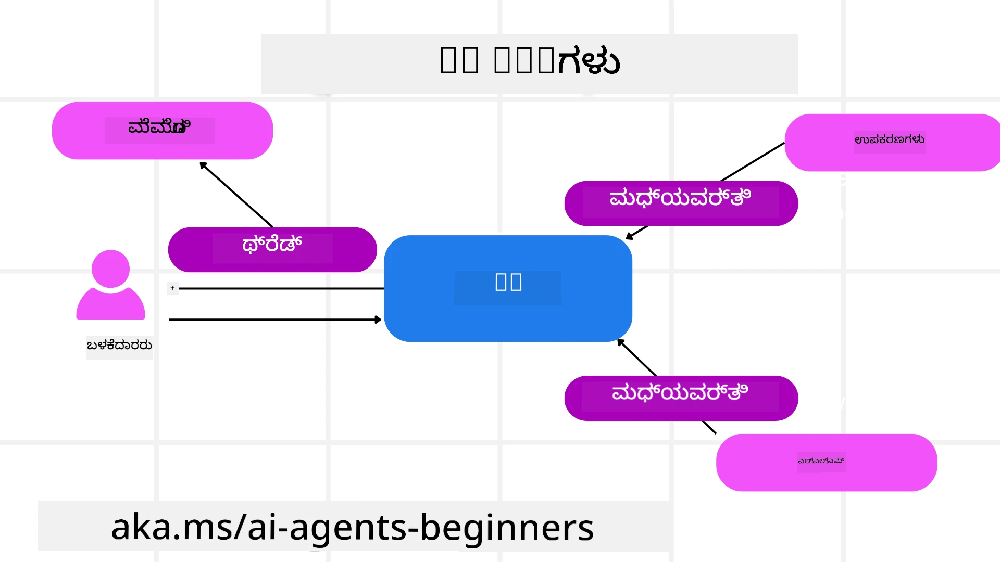

# ಮೈಕ್ರೋಸಾಫ್ಟ್ ಏಜೆಂಟ್ ಫ್ರೇಮ್ವರ್ಕ್ ಅನ್ನು ಅನ್ವೇಷಣೆ ಮಾಡುವುದು


### ಪರಿಚಯ

ಈ ಪಾಠದಲ್ಲಿ ಹೀಗಿವೆ:

- ಮೈಕ್ರೋಸಾಫ್ಟ್ ಏಜೆಂಟ್ ಫ್ರೇಮ್ವರ್ಕ್ ಅರ್ಥಮಾಡಿಕೊಳ್ಳುವುದು: ಮುಖ್ಯ ವೈಶಿಷ್ಟ್ಯಗಳು ಮತ್ತು ಮೌಲ್ಯ  
- ಮೈಕ್ರೋಸಾಫ್ಟ್ ಏಜೆಂಟ್ ಫ್ರೇಮ್ವರ್ಕ್‌ನ ಪ್ರಮುಖ ಪರಿಕಲ್ಪನೆಗಳನ್ನು ಅನ್ವೇಷಿಸುವುದು
- ಮುಂದಿನ ಮಟ್ಟದ MAF ಮಾದರಿಗಳು: ಕಾರ್ಯಪ್ರವಾಹಗಳು, ಮೀಡಿಯೇಲ್‌ವೇರ್ ಮತ್ತು ಸ್ಮೃತಿ

## ಅಧ್ಯಯನ ಗುರಿಗಳು

ಈ ಪಾಠವನ್ನು ಪೂರ್ಣಗೊಳಿಸಿದ ನಂತರ, ನೀವು ತಿಳಿಯೋದು:

- ಮೈಕ್ರೋಸಾಫ್ಟ್ ಏಜೆಂಟ್ ಫ್ರೇಮ್ವರ್ಕ್ ಬಳಸಿ ಉತ್ಪಾದನಾ-ಸಿದ್ಧ AI ಏಜೆಂಟ್‌ಗಳನ್ನು ನಿರ್ಮಿಸುವುದು
- ಮೈಕ್ರೋಸಾಫ್ಟ್ ಏಜೆಂಟ್ ಫ್ರೇಮ್ವರ್ಕ್‌ನ ಮೂಲ ವೈಶಿಷ್ಟ್ಯಗಳನ್ನು ನಿಮ್ಮ ಏಜೆಂಟಿಕ್ ಉಪಯೋಗ ಪ್ರಕರಣಗಳಿಗೆ ಅನ್ವಯಿಸುವುದು
- ಕಾರ್ಯಪ್ರವಾಹಗಳು, ಮೀಡಿಯೇಲ್‌ವೇರ್ ಮತ್ತು ಅಬ್ಲಿಕ್ಯುವೇಬಿಲಿಟಿ ಸೇರಿದಂತೆ ಆಧುನಿಕ ಮಾದರಿಗಳನ್ನು ಬಳಸುವುದು

## ಕೋಡ್ ಉದಾಹರಣೆಗಳು

[Microsoft Agent Framework (MAF)](https://aka.ms/ai-agents-beginners/agent-framewrok) ಗೆ ಸಂಬಂಧಿಸಿದ ಕೋಡ್ ಉದಾಹರಣೆಗಳನ್ನು ಈ ರೆಪೊಸಿಟರಿಯಲ್ಲಿ `xx-python-agent-framework` ಮತ್ತು `xx-dotnet-agent-framework` ಕಡತಗಳಲ್ಲಿ ಕಾಣಬಹುದು.

## ಮೈಕ್ರೋಸಾಫ್ಟ್ ಏಜೆಂಟ್ ಫ್ರೇಮ್ವರ್ಕ್ ಅನ್ನು ಅರ್ಥಮಾಡಿಕೊಳ್ಳುವುದು


[Microsoft Agent Framework (MAF)](https://aka.ms/ai-agents-beginners/agent-framewrok) ಮೈಕ್ರೋಸಾಫ್ಟ್ ಒಕ್ಕೂಟದ AI ಏಜೆಂಟ್‌ಗಳನ್ನು ನಿರ್ಮಿಸಲು ಏಕೀಕೃತ ಫ್ರೇಮ್ವರ್ಕ್ ಆಗಿದೆ. ಇದು ಉತ್ಪಾದನೆ ಮತ್ತು ಸಂಶೋಧನಾ ಪರಿಸರಗಳಲ್ಲಿ ಕಂಡುಬರುವ ವ್ಯಾಪಕ ಏಜೆಂಟಿಕ್ ಉಪಯೋಗ ಪ್ರಕರಣಗಳನ್ನು ಕಾಣಿಸಿಕೊಂಡು ವಿಪುಲತೆ ನೀಡುತ್ತದೆ, ಅವುಗಳಲ್ಲಿ:

- **ಕ್ರಮಾನುಗತ ಏಜೆಂಟ್ ಸಂಯೋಜನೆ** ಅಂದರೆ ಹಂತ ಹಂತವಾಗಿ ಕಾರ್ಯಪ್ರವಾಹಗಳು ಬೇಕಾಗುವ ಸಂದರ್ಭಗಳಲ್ಲಿ.
- **ಸಮಾನಕಾಲೀನ ಸಂಯೋಜನೆ** ಅಂದರೆ ಏಜೆಂಟ್‌ಗಳು ಒಂದೇ ಸಮಯದಲ್ಲಿ ಕಾರ್ಯಗಳನ್ನು ಪೂರೈಸಬೇಕಾಗುವ ಸಂದರ್ಭಗಳಲ್ಲಿ.
- **ಗುಂಪು ಚಾಟ್ ಸಂಯೋಜನೆ** ಅಂದರೆ ಏಜೆಂಟ್‌ಗಳು ಒಂದೇ ಕಾರ್ಯದಲ್ಲಿ ಒಟ್ಟಾಗಿ ಸಹಕರಿಸುವ ಸಂದರ್ಭಗಳು.
- **ಹ್ಯಾಂಡ್‌ಆಫ್ ಸಂಯೋಜನೆ** ಅಂದರೆ ಉಪಕಲ ಕಾರುಣೆಗಳನ್ನು ಪೂರ್ಣಗೊಳಿಸುವಾಗ ಏಜೆಂಟ್‌ಗಳು ಕಾರ್ಯವನ್ನು ಪರಸ್ಪರ ಹಸ್ತಾಂತರಿಸುವ ಸಂದರ್ಭಗಳಲ್ಲಿ.
- **ಮ್ಯಾಗ್ನೆಟಿಕ್ ಸಂಯೋಜನೆ** ಅಂದರೆ ವ್ಯವಸ್ಥಾಪಕ ಏಜೆಂಟ್ ಕಾರ್ಯ ಪಟ್ಟಿ ರಚಿಸಿ ತಿದ್ದುಪಡಿ ಮಾಡುತ್ತಾ ಉಪಏಜೆಂಟ್‌ಗಳ ಸಂಯೋಜನೆಯನ್ನು ನಿಭಾಯಿಸುವ ಸಂದರ್ಭಗಳಲ್ಲಿ.

AI ಏಜೆಂಟ್‌ಗಳನ್ನು ಉತ್ಪಾದನೆಯಲ್ಲಿ ಒದಗಿಸಲು, MAF ಹೀಗೂ ವೈಶಿಷ್ಟ್ಯಗಳನ್ನು ಒಳಗೊಂಡಿದೆ:

- **ನಿರೀಕ್ಷಣೀಯತೆ** OpenTelemetry ಬಳಸಿ, AI ಏಜೆಂಟ್‌ನ ಪ್ರತಿಯೊಂದು ಕಾರ್ಯ ಸೇರಿದಂತೆ ಉಪಕರಣಗಳ ಸಮರ್ಪಣೆ, ಸಂಯೋಜನಾ ಹಂತಗಳು, ವಿಚಾರಣೆ ಹರಿವು ಮತ್ತು Microsoft Foundry ಡ್ಯಾಶ್‌ಬೋರ್ಡ್ ಮೂಲಕ ಕಾರ್ಯಕ್ಷಮತೆ ನಿಗದಾರಿಕೆ.
- **ಸುರಕ್ಷತೆ** ಏಜೆಂಟ್‌ಗಳನ್ನು ನೈಜವಾಗಿ Microsoft Foundryಯಲ್ಲಿ ಇರಿಸುವ ಮೂಲಕ, ಪಾತ್ರಾಧಾರಿತ ಪ್ರವೇಶ, ಖಾಸಗಿ ಡೇಟಾ ನಿರ್ವಹಣೆ ಮತ್ತು ನಿರ್ಮಿತ ಕಡತ ಸುರಕ್ಷತೆ.
- **ದೃಢತೆ** ಏಜೆಂಟ್ ಥ್ರೆಡ್‌ಗಳು ಮತ್ತು ಕಾರ್ಯಪ್ರವಾಹಗಳು ನಿಲ್ಲಿಸುವುದು, ಪುನರಾರಂಭಿಸುವುದು ಮತ್ತು ದೋಷಗಳಿಂದ ಚೇತನಗೊಳ್ಳುವುದನ್ನು ಸಹಿಸುತ್ತದೆ ಮತ್ತು ಹೀಗೆ ದೀರ್ಘ ಅವಧಿಯ ಪ್ರಕ್ರಿಯೆಗಳಿಗೆ ಅನುಕೂಲವಾಗುತ್ತದೆ.
- **ನಿಯಂತ್ರಣ** ಹ್ಯೂಮನ್ನೊಂದಿಗೆ ಕಾರ್ಯಪ್ರವಾಹಗಳಿಗೆ ಬೆಂಬಲ ನೀಡುವುದು, ಕೆಲಸಗಳನ್ನು ಮಾನವ ಅನುಮೋದನೆ ಅಗತ್ಯವಾಗಿರುವಂತೆ ಗುರುತಿಸಲಾಗುತ್ತದೆ.

ಮೈಕ್ರೋಸಾಫ್ಟ್ ಏಜೆಂಟ್ ಫ್ರೇಮ್ವರ್ಕ್ ಅಂತರ್‌ಸಾರಗೊಳ್ಳಿಕೆಯ ಮೇಲೆ ಆರೈಕೆ ನೀಡುತ್ತದೆ ಅಥವಾ:

- **ಮೇಘ-ನಿರಪೇಕ್ಷವಾಗಿದ್ದು** - ಏಜೆಂಟ್‌ಗಳು ಕಂಟೇನರ್‌ಗಳಲ್ಲಿ, ಸ್ಥಳೀಯ ಮತ್ತು ವಿವಿಧ ಮೇಘಗಳಲ್ಲಿ ಚಲಿಸಬಹುದು.
- **ಪ್ರದಾತ-ನಿರಪೇಕ್ಷವಾಗಿದ್ದು** - ಆಯ್ಕೆಯ SDK, Azure OpenAI ಮತ್ತು OpenAI ಸೇರಿದಂತೆ, ಮೂಲಕ ಏಜೆಂಟ್‌ಗಳನ್ನು ರಚಿಸಬಹುದು.
- **ತೆರೆದ ಮಾನದಂಡಗಳನ್ನು ಏಕರೂಪಗೊಳಿಸುವುದು** - Agent-to-Agent (A2A) ಮತ್ತು Model Context Protocol (MCP) ಮುಂತಾದ ಪ್ರೋಟೋಕಾಲ್ಗಳನ್ನು ಬಳಸಿ ಇತರ ಏಜೆಂಟ್‌ಗಳು ಮತ್ತು ಉಪಕರಣಗಳನ್ನು ಪತ್ತೆ ಹಚ್ಚಿ ಬಳಸಬಹುದು.
- **ಪ್ಲಗಿನ್‌ಗಳು ಮತ್ತು ಸಂಪರ್ಕಗಳು** - Microsoft Fabric, SharePoint, Pinecone ಮತ್ತು Qdrant ಮುಂತಾದ ಡೇಟಾ ಮತ್ತು ಸ್ಮೃತಿ ಸೇವೆಗಳೊಂದಿಗೆ ಸಂಪರ್ಕಗಳನ್ನು ಮಾಡಬಹುದು.

ಈ ವೈಶಿಷ್ಟ್ಯಗಳು ಮೈಕ್ರೋಸಾಫ್ಟ್ ಏಜೆಂಟ್ ಫ್ರೇಮ್ವರ್ಕ್‌ನ ಕೆಲವು ಮೂಲ ಪರಿಕಲ್ಪನೆಗಳಿಗೆ ಹೇಗೆ ಅನ್ವಯಿಸುತ್ತವೆ ನೋಡಿ.

## ಮೈಕ್ರೋಸಾಫ್ಟ್ ಏಜೆಂಟ್ ಫ್ರೇಮ್ವರ್ಕ್‌ನ ಮುಖ್ಯ ಪರಿಕಲ್ಪನೆಗಳು

### ಏಜೆಂಟ್‌ಗಳು



**ಏಜೆಂಟ್ ಹೊರತಾಗಿ ರಚಿಸುವುದು**

ಏಜೆಂಟ್ ರಚನೆ ಮಾಡುವುದು ಇನ್ಫರೆನ್ಸ್ ಸೇವೆ (LLM ಪೂರೈಕೆದಾರ), AI ಏಜೆಂಟ್ ಅನುಸರಿಸಬೇಕಾದ ಸೂಚನೆಗಳ ಸರಣಿ ಮತ್ತು ನಿಗದಿತ `ಹೆಸರು` ಮೂಲಕ ಆಗುತ್ತದೆ:

```python
agent = AzureOpenAIChatClient(credential=AzureCliCredential()).create_agent( instructions="You are good at recommending trips to customers based on their preferences.", name="TripRecommender" )
```


ಮೇಲಿನ ಉದಾಹರಣೆಯಲ್ಲಿ `Azure OpenAI` ಬಳಕೆ ಮಾಡಲಾಗಿದೆ ಆದರೆ ಏಜೆಂಟ್‌ಗಳನ್ನು ವಿವಿಧ ಸೇವೆಗಳ ಮೂಲಕ ಸಹ ಸೃಷ್ಟಿಸಬಹುದು, ಉದಾ: `Microsoft Foundry Agent Service`:

```python
AzureAIAgentClient(async_credential=credential).create_agent( name="HelperAgent", instructions="You are a helpful assistant." ) as agent
```


OpenAI `ಪ್ರತಿಕ್ರಿಯೆಗಳು`, `ChatCompletion` APIಗಳು

```python
agent = OpenAIResponsesClient().create_agent( name="WeatherBot", instructions="You are a helpful weather assistant.", )
```

```python
agent = OpenAIChatClient().create_agent( name="HelpfulAssistant", instructions="You are a helpful assistant.", )
```


ಅಥವಾ A2A ಪ್ರೋಟೋಕಾಲ್ ಬಳಸಿ ದೂರದ ಏಜೆಂಟ್‌ಗಳು:

```python
agent = A2AAgent( name=agent_card.name, description=agent_card.description, agent_card=agent_card, url="https://your-a2a-agent-host" )
```


**ಏಜೆಂಟ್‌ಗಳ ಚಲನೆಯು**

ಏಜೆಂಟ್‌ಗಳನ್ನು `.run` ಅಥವಾ `.run_stream` ವಿಧಾನಗಳ ಮೂಲಕ ನಾನ್-ಸ್ಟ್ರೀಮಿಂಗ್ ಅಥವಾ ಸ್ಟ್ರೀಮಿಂಗ್ ಪ್ರತಿಕ್ರಿಯೆಗಳಿಗೆ ಚಲಿಸುವಂತೆ ಮಾಡಲಾಗುತ್ತದೆ.

```python
result = await agent.run("What are good places to visit in Amsterdam?")
print(result.text)
```

```python
async for update in agent.run_stream("What are the good places to visit in Amsterdam?"):
    if update.text:
        print(update.text, end="", flush=True)

```


ಪ್ರತಿ ಏಜೆಂಟ್ ರನ್‌ಗೆ ಅನ್ವಯಿಸಬಹುದಾದ ಆಯ್ಕೆಗಳು ಇವೆ ಉದಾ: ಏಜೆಂಟ್ ಬಳಕೆಮಾಡುವ `max_tokens`, ಏಜೆಂಟ್ ಕರೆಮಾಡಬಹುದಾದ `tools`, ಮತ್ತು ಏಜೆಂಟ್‌ಗೆ ಉಪಯೋಗಿಸಿದ `model` ಮುಂತಾದವುಗಳನ್ನು ಕಸ್ಟಮೈಸ್ ಮಾಡಬಹುದು.

ಇದು ನಿರ್ದಿಷ್ಟ ಮಾದರಿಗಳು ಅಥವಾ ಉಪಕರಣಗಳು ಬಳಕೆದಾರನ ಕಾರ್ಯ ಪೂರೈಸಲು ಅಗತ್ಯವಿರುವ ಸಂದರ್ಭಗಳಲ್ಲಿ ಉಪಯುಕ್ತ.

**ಉಪಕರಣಗಳು**

ಏಜೆಂಟ್ ರಚಿಸುವಾಗ ಮತ್ತು ಏಜೆಂಟ್‌ಚಲಿಸುವಾಗ ಉಪಕರಣಗಳನ್ನು ನಿರ್ಧರಿಸಬಹುದು:

```python
def get_attractions( location: Annotated[str, Field(description="The location to get the top tourist attractions for")], ) -> str: """Get the top tourist attractions for a given location.""" return f"The top attractions for {location} are." 


# ನೇರವಾಗಿ ChatAgent ಅನ್ನು ರಚಿಸುವಾಗ

agent = ChatAgent( chat_client=OpenAIChatClient(), instructions="You are a helpful assistant", tools=[get_attractions]

```

```python

result1 = await agent.run( "What's the best place to visit in Seattle?", tools=[get_attractions] # ಈ ರನ್‌ಗಾಗಿ ಮಾತ್ರ ಒದಗಿಸಲಾದ ಸಾಧನ )
```


**ಏಜೆಂಟ್ ಥ್ರೆಡ್‌ಗಳು**

ಮಲ್ಟಿ-ಟರ್ನ್ ಸಂಭಾಷಣೆಗಳನ್ನು ನಿಭಾಯಿಸಲು ಥ್ರೆಡ್‌ಗಳನ್ನು ಬಳಸಲಾಗುತ್ತದೆ. ಥ್ರೆಡ್‌ಗಳನ್ನು ರಚಿಸುವ ವಿಧಾನಗಳು:

- `get_new_thread()` ಬಳಸಿ ಥ್ರೆಡ್ ಸಿದ್ಧಪಡಿಸಿ ಹಳೆಯ ಸಮಯದಲ್ಲಿ ಉಳಿಸಿ
- ಏಜೆಂಟ್ ರನ್ ಮಾಡುವಾಗ ಸ್ವಯಂಚಾಲಿತವಾಗಿ ಥ್ರೆಡ್ ಸೃಷ್ಟಿಸಿ ಮತ್ತು ಆಗಿನ ರನ್ನಿನಷ್ಟೇ ಅದು ಇರಿಸುವುದು

ಥ್ರೆಡ್ ರಚನೆ ಹೀಗಿರುತ್ತದೆ:

```python
# ಹೊಸಥ್ರೆಡ್ ಸೃಷ್ಟಿಸಿ.
thread = agent.get_new_thread() # ಅದೇ ಥ್ರೆಡ್‌ನೊಂದಿಗೆ ಏಜೆಂಟ್ ಅನ್ನು ಚಾಲನೆಮಾಡಿ.
response = await agent.run("Hello, I am here to help you book travel. Where would you like to go?", thread=thread)

```


ನಂತರ ಥ್ರೆಡ್ ಅನ್ನು ಶೇಖರಿಸಲು ಸೀರಿಯಲೈಸ್ ಮಾಡಬಹುದು:

```python
# ಹೊಸ ಥ್ರೆಡ್ ರಚಿಸಿ.
thread = agent.get_new_thread() 

# ಥ್ರೆಡ್ ಜೊತೆಗೆ ಏಜೆಂಟ್ ಅನ್ನು ನಡೆಸಿ.

response = await agent.run("Hello, how are you?", thread=thread) 

# ಸಂಗ್ರಹಣೆಯಗಾಗಿ ಥ್ರೆಡ್ ಅನ್ನು ಸರಣಿ ಆಕಾರಕ್ಕೆ ಬದಲಿಸಿ.

serialized_thread = await thread.serialize() 

# ಸಂಗ್ರಹಣೆಯಿಂದ ಲೋಡ್ ಮಾಡುವ ನಂತರ ಥ್ರೆಡ್ ಸ್ಥಿತಿಯನ್ನು ವಿನ್ಯಾಸವಿಚ್ಛೇದಿಸಿ.

resumed_thread = await agent.deserialize_thread(serialized_thread)
```


**ಏಜೆಂಟ್ ಮೀಡಿಯೇಲ್‌ವೇರ್**

ಯುಜರ್ ಕಾರ್ಯಪೂರೈಸಲು ಏಜೆಂಟ್‌ಗಳು ಉಪಕರಣಗಳು ಮತ್ತು LLMಗಳೊಂದಿಗೆ ಸಂವಹನ ಮಾಡುತ್ತವೆ. ಕೆಲ ಸಂದರ್ಭಗಳಲ್ಲಿ, ಈ ಸಂವಹನಗಳ ಮಧ್ಯದಲ್ಲಿ ನಿರ್ವಹಣೆ ಅಥವಾ ಗಮನ-ಇಡವು ಬೇಕಾಗುತ್ತದೆ. ಏಜೆಂಟ್ ಮೀಡಿಯೇಲ್‌ವೇರ್ ಇದನ್ನು ಸಾಧ್ಯವಾಗಿಸುತ್ತದೆ:

*ಕಾರ್ಯ ಮಿಡಿಲ್ವೇರ್*

ಈ ಮಿಡಿಲ್ವೇರ್ ಏಜೆಂಟ್ ಮತ್ತು ಅದು ಕರೆಮಾಡುವ ಕಾರ್ಯ ಅಥವಾ ಉಪಕರಣದ ನಡುವೆ ಕ್ರಿಯೆಯನ್ನು ನಿರ್ವಹಿಸುತ್ತದೆ. ಉದಾಹರಣೆಗೆ, ಫಂಕ್ಷನ್ ಕರೆಮೇಲೆ ಲಾಗಿಂಗ್ ನಡೆಸುವಾಗ ಬಳಸಬಹುದು.

ಕೆಳಗಿನ ಕೋಡ್‌ನಲ್ಲಿ `next` ಪದವು ಮುಂದಿನ ಮಿಡಿಲ್ವೇರ್ ಅಥವಾ ನಿಜವಾದ ಫಂಕ್ಷನನ್ನು ಕರೆಮಾಡಬೇಕೇ ಎಂದು ಸೂಚಿಸುತ್ತದೆ.

```python
async def logging_function_middleware(
    context: FunctionInvocationContext,
    next: Callable[[FunctionInvocationContext], Awaitable[None]],
) -> None:
    """Function middleware that logs function execution."""
    # ಪೂರ್ವ ಪ್ರಕ್ರಿಯೆ: ಕಾರ್ಯಾಚರಣೆ ನಡೆಸುವ ಮೊದಲು ಲಾಗ್ ಮಾಡಿ
    print(f"[Function] Calling {context.function.name}")

    # ಮುಂದಿನ ಮಿಡ್‌ಲ್ವೇರ್ ಅಥವಾ ಕಾರ್ಯಾಚರಣೆ ಪಾಲನೆಯ ಮುಂದುವರಿಕೆ
    await next(context)

    # ನಂತರ ಪ್ರಕ್ರಿಯೆ: ಕಾರ್ಯಾಚರಣೆ ನಡೆಸಿದ ನಂತರ ಲಾಗ್ ಮಾಡಿ
    print(f"[Function] {context.function.name} completed")
```


*ಚಾಟ್ ಮಿಡಿಲ್ವೇರ್*

ಈ ಮಿಡಿಲ್ವೇರ್ ಏಜೆಂಟ್ ಮತ್ತು LLM ನಡುವಣ ವಿನಂತಿಗಳ ನಡುವೆ ಕ್ರಿಯೆ ಅಥವಾ ಲಾಗ್ ಮಾಡುವುದು.

ಇದರಲ್ಲಿ AI ಸೇವೆಗೆ ಕಳುಹಿಸಲಾಗುವ `ಸಂದೇಶಗಳು` ಇರतात.

```python
async def logging_chat_middleware(
    context: ChatContext,
    next: Callable[[ChatContext], Awaitable[None]],
) -> None:
    """Chat middleware that logs AI interactions."""
    # ಪೂರ್ವ-ಪ್ರಕ್ರಿಯೆ: AI ಕರೆಗೂ ಮುಂಚಿತವಾಗಿ ಲಾಗ್ ಮಾಡು
    print(f"[Chat] Sending {len(context.messages)} messages to AI")

    # ಮುಂದಿನ ಮಿಡ್‌ಲ್‌ವೇರ್ ಅಥವಾ AI ಸೇವೆಗೆ ಮುಂದುವರೆಸು
    await next(context)

    # ನಂತರ-ಪ್ರಕ್ರಿಯೆ: AI ಪ್ರತಿಕ್ರಿಯೆಯ ನಂತರ ಲಾಗ್ ಮಾಡು
    print("[Chat] AI response received")

```


**ಏಜೆಂಟ್ ಸ್ಮೃತಿ**

`Agentic Memory` ಪಾಠದಲ್ಲಿ ವಿವರಿಸಲ್ಪಟ್ಟಂತೆ, ಸ್ಮೃತಿ ಏಜೆಂಟ್‌ಗಳಿಗೆ ವಿಭಿನ್ನ ಹಿನ್ನೆಲೆಗಳಲ್ಲಿ ಕಾರ್ಯನಿರ್ವಹಿಸಲು ಮುಖ್ಯ ಅಂಶ. MAF ವಿವಿಧ ಮಾದರಿಯ ಸ್ಮೃತಿಗಳನ್ನು ಒದಗಿಸುತ್ತದೆ:

*ಇನ್-ಮೀಮರಿ ಸಂಗ್ರಹಣೆ*

ಅಪ್ಲಿಕೇಶನ್ ರನ್‌ಟೈಮ್ ವೇಳೆ ಥ್ರೆಡ್‌ಗಳಲ್ಲಿ ಸಂಗ್ರಹಿಸುವ ಸ್ಮೃತಿ.

```python
# ಹೊಸ ಥ್ರೆಡ್ ಅನ್ನು ರಚಿಸಿ.
thread = agent.get_new_thread() # ಆಥಾಟ್ ಅನ್ನು ಥ್ರೆಡ್ ಜೊತೆ ಚಾಲನೆ ಮಾಡು.
response = await agent.run("Hello, I am here to help you book travel. Where would you like to go?", thread=thread)
```


*ಸ್ಥಾಯೀ ಸಂದೇಶಗಳು*

ವಿವಿಧ ಅಧಿವೇಶನಗಳಲ್ಲಿ ಸಂಭಾಷಣೆ ಇತಿಹಾಸವನ್ನು ಉಳಿಸುವುದಕ್ಕೆ ಬಳಸುತ್ತದೆ. ಇದನ್ನು `chat_message_store_factory` ಬಳಸಿ ನಿರ್ಧರಿಸಲಾಗುತ್ತದೆ.

```python
from agent_framework import ChatMessageStore

# ಕಸ್ಟಮ್ ಸಂದೇಶ ಸಂಗ್ರಹವನ್ನು ರಚಿಸಿ
def create_message_store():
    return ChatMessageStore()

agent = ChatAgent(
    chat_client=OpenAIChatClient(),
    instructions="You are a Travel assistant.",
    chat_message_store_factory=create_message_store
)

```


*ಡೈನಾಮಿಕ್ ಸ್ಮೃತಿ*

ಈ ಸ್ಮೃತಿ ಏಜೆಂಟ್‌ಗಳು ರನ್ ಆಗುವ ಮೊದಲು ಹಿನ್ನೆಲೆಗೆ ಸೇರ್ಪಡೆ ಮಾಡಲಾಗುತ್ತದೆ. ಈ ಸ್ಮೃತಿಗಳನ್ನು ಹೊರಗಿನ ಸೇವೆಗಳಲ್ಲಿ ಸಂಗ್ರಹಿಸಬಹುದು, ಉದಾ: mem0

```python
from agent_framework.mem0 import Mem0Provider

# ಸುಧಾರಿತ ಮೆಮೊರಿ ಸಾಮರ್ಥ್ಯದಿಗಾಗಿ Mem0 ಬಳಸಿ
memory_provider = Mem0Provider(
    api_key="your-mem0-api-key",
    user_id="user_123",
    application_id="my_app"
)

agent = ChatAgent(
    chat_client=OpenAIChatClient(),
    instructions="You are a helpful assistant with memory.",
    context_providers=memory_provider
)

```


**ಏಜೆಂಟ್ ನಿರೀಕ್ಷಣೀಯತೆ**

ನಂಬಿಕೆ ಮಾಡಲು ಮತ್ತು ನಿಭಾಯಿಸಲು ಸಾಧ್ಯವಾಗುವ ಏಜೆಂಟಿಕ್ ವ್ಯವಸ್ಥೆಗಳನ್ನು ನಿರ್ಮಿಸುವಲ್ಲಿ ನಿರೀಕ್ಷಣೀಯತೆ ಪ್ರಮುಖ. MAF OpenTelemetry ಜೊತೆ ಏಕೀಕೃತವಾಗಿದೆ ಉತ್ತಮ ನಿರೀಕ್ಷಣೀಯತೆಯ trace ಮತ್ತು meters ನೀಡಲು.

```python
from agent_framework.observability import get_tracer, get_meter

tracer = get_tracer()
meter = get_meter()
with tracer.start_as_current_span("my_custom_span"):
    # ಏನಾದರೂ ಮಾಡು
    pass
counter = meter.create_counter("my_custom_counter")
counter.add(1, {"key": "value"})
```


### ಕಾರ್ಯಪ್ರವಾಹಗಳು

MAF ಕಾರ್ಯಪ್ರವಾಹಗಳನ್ನು ಒದಗಿಸುತ್ತದೆ, ಇವು ಪೂರ್ಣಗೊಳಿಸಲು ಪೂರ್ವನಿರ್ಧರಿತ ಹಂತಗಳು, AI ಏಜೆಂಟ್‌ಗಳನ್ನು ಅವುಗಳ ಹಂತಗಳಲ್ಲಿ ಅಂಶಗಳಾಗಿ ಒಳಗೊಂಡಿದೆ.

ಕಾರ್ಯಪ್ರವಾಹಗಳು ವಿವಿಧ ಭಾಗಗಳಿಂದ ಕೂಡಿವೆ, ಇದು ಉತ್ತಮ ನಿಯಂತ್ರಣ ಹರಿವಿಗೆ ನೆರವಾಗುತ್ತದೆ. ಕಾರ್ಯಪ್ರವಾಹಗಳು **ಮಲ್ಟಿ-ಏಜೆಂಟ್ ಸಂಯೋಜನೆ** ಮತ್ತು **ಚೆಕ್​ಪಾಯಿಂಟಿಂಗ್** ಅನ್ನು ಸಹ ಸಾಧ್ಯವಾಗಿಸುವ ಮೂಲಕ ಕಾರ್ಯಪ್ರವಾಹ ಸ್ಥಿತಿಗಳನ್ನು ಉಳಿಸುವ ಮತ್ತು ಮರುಪ್ರಾರಂಭಿಸಲು ಸಹಾಯ ಮಾಡುತ್ತವೆ.

ಕಾರ್ಯಪ್ರವಾಹದ ಮೂಲ ಅಂಶಗಳು:

**ನಿರ್ವಹಿಸುವವರು (Executors)**

ನಿರ್ವಹಿಸುವವರು ಇನ್‌ಪುಟ್ ಸಂದೇಶಗಳನ್ನು ಸ್ವೀಕರಿಸಿ, ತಮ್ಮ ನಿಯೋಜಿತ ಕಾರ್ಯಗಳನ್ನು ನಿರ್ವಹಿಸಿ, ನಂತರ ಔಟ್‌ಪುಟ್ ಸಂದೇಶವನ್ನು ಉತ್ಪಾದಿಸಬೇಕು. ಇದು ಕಾರ್ಯಪ್ರವಾಹವನ್ನು ದೊಡ್ಡ ಕಾರ್ಯವನ್ನು ಪೂರ್ಣಗೊಳಿಸುವತ್ತ ಮುನ್ನಡೆಯಿಸುತ್ತದೆ. ನಿರ್ವಹಿಸುವವರು AI ಏಜೆಂಟ್ ಅಥವಾ ಕಸ್ಟಮ್ ಲಾಜಿಕ್ ಆಗಿರಬಹುದು.

**ಎಡ್ಜ್‌ಗಳು**

ವೆಂದರೆ ಕಾರ್ಯಪ್ರವಾಹದಲ್ಲಿ ಸಂದೇಶಗಳ ಹರಿವಿಗೆ ವ್ಯಾಖ್ಯಾನವಾಗಿರುವ ಸಂಪರ್ಕ. ಇವು:

*ನೇರ ಎಡ್ಜ್‌ಗಳು* - ನಿರ್ವಹಿಸುವವರ ನಡುವೆ ಸರಳ ಒಬ್ಬರಿಂದ ಒಬ್ಬರಿಗೆ ಸಂಪರ್ಕ:

```python
from agent_framework import WorkflowBuilder

builder = WorkflowBuilder()
builder.add_edge(source_executor, target_executor)
builder.set_start_executor(source_executor)
workflow = builder.build()
```


*ಶರತಾಧಾರಿತ ಎಡ್ಜ್‌ಗಳು* - ನಿರ್ದಿಷ್ಟ ಶರತ ತಲುಪಿದ ಮೇಲೆ ಸಕ್ರಿಯವಾಗುವವು. ಉದಾಹರಣೆಗೆ, ಹೋಟೆಲ್ ಕೊಠಡಿಗಳು ಲಭ್ಯವಿಲ್ಲದಾಗ, ನಿರ್ವಹಿಸುವವರು ಬೇರೆ ಆಯ್ಕೆಗಳನ್ನು ಸೂಚಿಸಬಹುದು.

*ಸ್ವಿಚ್-ಕೇಸ್ ಎಡ್ಜ್‌ಗಳು* - ನಿಗದಿತ ಶರತ ಆಧಾರದ ಮೇಲೆ ಸಂದೇಶಗಳನ್ನು ವಿಭಿನ್ನ ನಿರ್ವಹಿಸುವವರಿಗೆ ಕಳುಹಿಸುವುದು. ಉದಾ: ಪ್ರಯಾಣಿಕರಿಗೆ ಪ್ರಾಯಾರಿಟಿ ಪ್ರವೇಶ ಇದ್ದರೆ, ಅವರ ಕಾರ್ಯಗಳು ಬೇರೆ ಕಾರ್ಯಪ್ರವಾಹ ಮೂಲಕ ನಡೆಯಬಹುದು.

*ಫ್ಯಾನ್-ಔಟ್ ಎಡ್ಜ್‌ಗಳು* - ಒಂದು ಸಂದೇಶವನ್ನು ಬಹು ಗುರಿಗಳಿಗೆ ಕಳುಹಿಸುವುದು.

*ಫ್ಯಾನ್-ಇನ್ ಎಡ್ಜ್‌ಗಳು* - ವಿಭಿನ್ನ ನಿರ್ವಹಿಸುವವರಿಂದ ಬಹು ಸಂದೇಶಗಳನ್ನು ಸಂಗ್ರಹಿಸಿ ಒಂದು ಗುರಿಗೆ ಕಳುಹಿಸುವುದು.

**ಕಾರ್ಯಘಟನೆಗಳು**

ಕಾರ್ಯಪ್ರವಾಹಗಳ ನಿರೀಕ್ಷಣೀಯತೆಯನ್ನು ಉತ್ತಮಗೊಳ್ಳಿಸಲು, MAF ಪ್ರತಿಗಳು ಕ್ರಿಯೆಗಳ_builtin_ಕಾರ್ಯಘಟನೆಗಳನ್ನು ಒದಗಿಸುತ್ತದೆ:

- `WorkflowStartedEvent` - ಕಾರ್ಯಪ್ರವಾಹ ಆರಂಭವಾಗಿದೆ
- `WorkflowOutputEvent` - ಕಾರ್ಯಪ್ರವಾಹವು ಔಟ್‌ಪುಟ್ ಉತ್ಪಾದಿಸಿದೆ
- `WorkflowErrorEvent` - ಕಾರ್ಯಪ್ರವಾಹದಲ್ಲಿ ದೋಷ ಕಂಡುಬಂದಿದೆ
- `ExecutorInvokeEvent` - ನಿರ್ವಹಿಸುವವರು ಪ್ರಕ್ರಿಯೆ ಆರಂಭಿಸಿದ್ದಾರೆ
- `ExecutorCompleteEvent` - ನಿರ್ವಹಿಸುವವರು ಪ್ರಕ್ರಿಯೆ ಮುಗಿಸಿದ್ದು
- `RequestInfoEvent` - ವಿನಂತಿ ಜಾರಿ

## ಮುಂದಿನ ಮಟ್ಟದ MAF ಮಾದರಿಗಳು

ಮೇಲಿನ ವಿಭಾಗಗಳು ಮೈಕ್ರೋಸಾಫ್ಟ್ ಏಜೆಂಟ್ ಫ್ರೇಮ್ವರ್ಕ್‌ನ ಮುಖ್ಯ ಪರಿಕಲ್ಪನೆಗಳನ್ನು ಹೊಂದಿವೆ. ನೀವು ಹೆಚ್ಚು ಕ್ಲಿಷ್ಟ ಏಜೆಂಟ್‌ಗಳನ್ನು ನಿರ್ಮಿಸುವಾಗ, ಕೆಲ ಮುಂದುವರೆದ ಮಾದರಿಗಳನ್ನು ಪರಿಗಣಿಸಿ:

- **ಮೀಡಿಯೇಲ್‌ವೇರ್ ಸಂಯೋಜನೆ**: ಲಾಗಿಂಗ್, ಪ್ರತ್ಯಯೀಕರಣ, ದರ-ನಿಯಂತ್ರಣ ಮುಂತಾದ ಹಲವಾರು ಮೀಡಿಯೇಲ್‌ವೇರ್ ಹ್ಯಾಂಡ್ಲರ್‌ಗಳನ್ನು ಸರಪಳಿಯಲ್ಲಿ ನೇಮಿಸಿ, ಕಾರ್ಯವೈಖರಿ ಮೇಲೆ ಸೂಕ್ಷ್ಮ ನಿಯಂತ್ರಣಕ್ಕಾಗಿ ಕಾರ್ಯ ಮತ್ತು ಚಾಟ್ ಮೀಡಿಯೇಲ್‌ವೇರ್‌ಗಳನ್ನು ಬಳಸುವುದು.
- **ಕಾರ್ಯಪ್ರವಾಹ ಚೆಕ್‌ಪಾಯಿಂಟಿಂಗ್**: ಕಾರ್ಯಘಟನೆಗಳು ಮತ್ತು ಸೀರಿಯಲೈಜೇಶನ್ ಬಳಸಿ ದೀರ್ಘಾವಧಿ ಏಜೆಂಟ್ ಪ್ರಕ್ರಿಯೆಗಳನ್ನು ಉಳಿಸಿ ಮರುಪ್ರಾರಂಭಿಸುವುದು.
- **ಡೈನಾಮಿಕ್ ಉಪಕರಣ ಆಯ್ಕೆ**: ಉಪಕರಣ ವಿವರಣೆಗಳ ಮೇಲೆ RAG ಜೋಡಣೆ ಮಾಡಿಕೊಳ್ಳುವುದು ಮತ್ತು MAF ಉಪಕರಣ ನೋಂದಣಿ ಬಳಸಿ ಪ್ರತಿ ಪ್ರಶ್ನೆಗೆ ಸಂಬಂಧಪಟ್ಟ ಉಪಕರಣಗಳನ್ನು ಮಾತ್ರ ಒದಗಿಸುವುದು.
- **ಬহು ಏಜೆಂಟ್ ಹ್ಯಾಂಡ್‌ಆಫ್**: ಕಾರ್ಯಪ್ರವಾಹ ಎಡ್ಜ್‌ಗಳು ಮತ್ತು ಶರತಾಧಾರಿತ ನೇರಾಯಣೆ ಬಳಸಿ ವಿಶೇಷ ಏಜೆಂಟ್‌ಗಳ ನಡುವೆ ಹ್ಯಾಂಡ್‌ಆಫ್‌ಗಳನ್ನು ಸಂಯೋಜಿಸುವುದು.

## ಕೋಡ್ ಉದಾಹರಣೆಗಳು

ಮೈಕ್ರೋಸಾಫ್ಟ್ ಏಜೆಂಟ್ ಫ್ರೇಮ್ವರ್ಕ್‌ಗೆ ಸಂಬಂಧಿಸಿದ ಕೋಡ್ ಉದಾಹರಣೆಗಳನ್ನು ಈ ರೆಪೊಸಿಟರಿಯಲ್ಲಿ `xx-python-agent-framework` ಮತ್ತು `xx-dotnet-agent-framework` ಕಡತಗಳಲ್ಲಿ ಕಾಣಬಹುದು.

## ಮೈಕ್ರೋಸಾಫ್ಟ್ ಏಜೆಂಟ್ ಫ್ರೇಮ್ವರ್ಕ್ ಬಗ್ಗೆ ಇನ್ನಷ್ಟು ಪ್ರಶ್ನೆಗಳಿವೆಯೇ?

ಇತರ ಕಲಿಯುವವರನ್ನು ಭೇಟಿಯಾಗಲು, ಕಚೇರಿ ಗಂಟೆಗಳಲ್ಲಿ ಭಾಗವಹಿಸಲು ಮತ್ತು ನಿಮ್ಮ AI ಏಜೆಂಟ್ ಪ್ರಶ್ನೆಗಳಿಗೆ ಉತ್ತರಗಳನ್ನು ಪಡೆಯಲು [Microsoft Foundry Discord](https://aka.ms/ai-agents/discord) ಗೆ ಸೇರಿ.

---

<!-- CO-OP TRANSLATOR DISCLAIMER START -->
**ಅಸ್ವೀಕಾರ ಸೂಚನೆ**:
ಈ ದಸ್ತಾವೇಜನ್ನು AI ಅನುವಾದ ಸೇವೆ [Co-op Translator](https://github.com/Azure/co-op-translator) ಬಳಸಿ ಅನುವಾದಿಸಲಾಗಿದೆ. ನಾವು ನಿಖರತೆಯ ಬಗ್ಗೆ ಪ್ರಯತ್ನಿಸುತ್ತಿದ್ದರೂ, ಸ್ವಯಂಚಾಲಿತ ಅನುವಾದಗಳಲ್ಲಿ ತಪ್ಪುಗಳು ಅಥವಾ ಅನಿಷ್ಠತೆಗಳು ಇರಬಹುದು ಎಂಬುದು ದಯವಿಟ್ಟು ಗಮನಿಸಿ. ಸ್ಥಳಿಯ ಭಾಷೆಯಲ್ಲಿನ ಮೂಲ ದಸ್ತಾವೇಜುವೇ ಅಧಿಕೃತ ಮೂಲವಾಗಿರುತ್ತದೆ. ಪ್ರಮುಖ ಮಾಹಿತಿಗಾಗಿ ವೃತ್ತಿಪರ ಮಾನವನ ಅನುವಾದವನ್ನು ಶಿಫಾರಸು ಮಾಡಲಾಗುತ್ತದೆ. ಈ ಅನುವಾದ ಬಳಕೆಯಿಂದ ಉಂಟಾಗುವ ಯಾವುದೇ ತಪ್ಪುಬುದ್ಧಿ ಅಥವಾ ತಪ್ಪು ಅರ್ಥಗರ್ಭಿತವಷ್ಟಕ್ಕಾಗಿ ನಾವು ಜವಾಬ್ದಾರಿಯಾಗಿರಲಾರೆವು.
<!-- CO-OP TRANSLATOR DISCLAIMER END -->