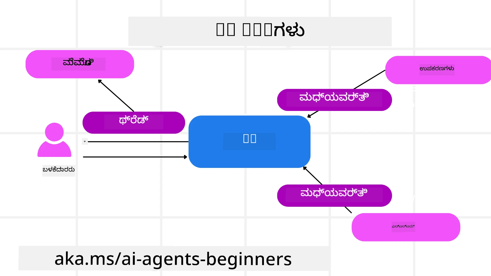

# ಮೈಕ್ರೋಸಾಫ್ಟ್ ಏಜೆಂಟ್ ಫ್ರೇಮ್ವರ್ಕ್ ಅನ್ನು ಅನ್ವೇಷಿಸುವುದು


### ಪರಿಚಯ

ಈ ಪಾಠವು ಒಳಗೊಂಡಿರುತ್ತದೆ:

- ಮೈಕ್ರೋಸಾಫ್ಟ್ ಏಜೆಂಟ್ ಫ್ರೇಮ್ವರ್ಕ್ ಅನ್ನು ಅರ್ಥಮಾಡಿಕೊಳ್ಳುವುದು: ಮುಖ್ಯ ವೈಶಿಷ್ಟ್ಯಗಳು ಮತ್ತು ಮೌಲ್ಯ  
- ಮೈಕ್ರೋಸಾಫ್ಟ್ ಏಜೆಂಟ್ ಫ್ರೇಮ್ವರ್ಕ್‌ನ ಮುಖ್ಯ ತತ್ವಗಳನ್ನು ಅನ್ವೇಷಿಸುವುದು
- ಮುಂದಿನ ಮಟ್ಟದ MAF ಮಾದರಿಗಳು: ವರ್ಕ್ಫ್ಲೋಗಳು, ಮಧ್ಯವರ್ತಿ, ಮತ್ತು ಸ್ಮರಣೆ

## ಕಲಿಕೆ ಗುರಿಗಳು

ಈ ಪಾಠವನ್ನು ಪೂರ್ಣಗೊಳಿಸಿದ ನಂತರ, ನೀವು ಕಿಸಲಾಗುವುದು:

- ಮೈಕ್ರೋಸಾಫ್ಟ್ ಏಜೆಂಟ್ ಫ್ರೇಮ್ವರ್ಕ್ ಉಪಯೋಗಿಸಿ ಉತ್ಪಾದನಾ ಸಿದ್ಧ AI ಏಜೆಂಟ್ಗಳನ್ನು ನಿರ್ಮಿಸುವುದು
- ಮೈಕ್ರೋಸಾಫ್ಟ್ ಏಜೆಂಟ್ ಫ್ರೇಮ್ವರ್ಕ್‌ನ ಮೂಲ ವೈಶಿಷ್ಟ್ಯಗಳನ್ನು ನಿಮ್ಮ ಏಜಂಟ್ ಬಳಸುವ ಪ್ರಕರಣಗಳಿಗೆ ಅನ್ವಯಿಸುವುದು
- ವರ್ಕ್ಫ್ಲೋಗಳು, ಮಧ್ಯವರ್ತಿ, ಮತ್ತು ಪರಿಶೀಲಿಸಬಹುದಾದತೆ ಸೇರಿದಂತೆ ಮುಂದಿನ ಮಟ್ಟದ ಮಾದರಿಗಳನ್ನು ಬಳಸುವುದು

## ಕೋಡ್ ಉದಾಹರಣೆಗಳು 

[Microsoft Agent Framework (MAF)](https://aka.ms/ai-agents-beginners/agent-framework)ಿಗಾಗಿ ಕೋಡ್ ಉದಾಹರಣೆಗಳನ್ನು ಇದರ ಸಂಗ್ರಹಣೆಯಲ್ಲಿ `xx-python-agent-framework` ಮತ್ತು `xx-dotnet-agent-framework` ಫೈಲ್‌ಗಳಲ್ಲಿ ಕಾಣಬಹುದು.

## ಮೈಕ್ರೋಸಾಫ್ಟ್ ಏಜೆಂಟ್ ಫ್ರೇಮ್ವರ್ಕ್ ಅನ್ನು ಅರ್ಥಮಾಡಿಕೊಳ್ಳುವುದು


[Microsoft Agent Framework (MAF)](https://aka.ms/ai-agents-beginners/agent-framework) ಎನ್ನುವುದು AI ಏಜೆಂಟ್ಗಳನ್ನು ನಿರ್ಮಿಸಲು ಮೈಕ್ರೋಸಾಫ್ಟ್‌ನ ಏಕೀಕೃತ ಫ್ರೇಮ್ವರ್ಕ್. ಇದು ಉತ್ಪಾದನೆ ಮತ್ತು ಸಂಶೋಧನಾ ಪರಿಸರಗಳಲ್ಲಿ ಕಾಣುವ ವಿವಿಧ ಏಜೆಂಟಿಕ್ ಬಳಕೆ ಪ್ರಕರಣಗಳನ್ನು ನಿರ್ವಹಿಸಲು ಸುಲಭವಾಗಿದೆ, ಉದಾಹರಣೆಗೆ:

- **ಅನುಗ್ರಣಾತ್ಮಕ ಏಜೆಂಟ್ ವ್ಯವಸ್ಥೆ** - ಹಂತ ಹಾಕುವ ಕಾರ್ಯಪ್ರವಾಹಗಳು ಅಗತ್ಯವಿರುವ ಸಂದರ್ಭಗಳಲ್ಲಿ.
- **ಸಮನ್ವಯ ವ್ಯವಸ್ಥೆ** - ಏಜೆಂಟ್‌ಗಳು ಒಂದೇ ಸಮಯದಲ್ಲಿ ಕಾರ್ಯಗಳನ್ನು ಪೂರ್ಣಗೊಳಿಸಲು ಅಗತ್ಯವಿರುವ ಸಂದರ್ಭಗಳಲ್ಲಿ.
- **ಗುಂಪು ಚಾಟ್ ವ್ಯವಸ್ಥೆ** - ಏಜೆಂಟ್‌ಗಳು ಒಂದೇ ಕಾರ್ಯದಲ್ಲಿ ಸಹಕಾರ ಮಾಡಲು ಸಾಧ್ಯವಾಗುವ ಸಂದರ್ಭಗಳಲ್ಲಿ.
- **ಹ್ಯಾಂಡ್ಓಫ್ ವ್ಯವಸ್ಥೆ** - ಉಪಕಾರ್ಯಗಳನ್ನು ಪೂರ್ಣಗೊಳಿಸುವಂತೆ ಏಜೆಂಟ್‌ಗಳು ಕಾರ್ಯಗಳನ್ನು ಪರಸ್ಪರ ಹಸ್ತಾಂತರಿಸುವ ಸಂದರ್ಭಗಳಲ್ಲಿ.
- **ಮ್ಯಾಗ್ನೆಟಿಕ್ ವ್ಯವಸ್ಥೆ** - ವ್ಯವಸ್ಥಾಪಕ ಏಜೆಂಟ್ ಕಾರ್ಯಪಟ್ಟಿಯನ್ನು ರಚಿಸಿ, ತಿದ್ದುಪಡಿ ಮಾಡಿ ಉಪಏಜೆಂಟ್‌ಗಳ ಸಂಯೋಜನೆಯನ್ನು ನಿಯಂತ್ರಿಸುವ ಸಂದರ್ಭಗಳಲ್ಲಿ.

ಉತ್ಪಾದನೆಯಲ್ಲಿ AI ಏಜೆಂಟ್‌ಗಳನ್ನು ಒದಗಿಸಲು, MAF ಈ ಕೆಳಗಿನ ವೈಶಿಷ್ಟ್ಯಗಳನ್ನು ಒಳಗೊಂಡಿದೆ:

- **ಪರಿಶೀಲನೀಯತೆ** - OpenTelemetry ಉಪಯೋಗಿಸಿದ ಮೂಲಕ, AI ಏಜೆಂಟ್‌ನ ಪ್ರತಿಯೊಂದು ಕ್ರಿಯೆಯಾದ ಸಾಧನ ಕರಪತ್ರ, ವ್ಯವಸ್ಥೆಯ ಹಂತಗಳು, ವಿವರಣೆ ಹರಿವುಗಳು ಮತ್ತು ಕಾರ್ಯಕ್ಷಮತೆಯ ಮೇಲ್ವಿಚಾರಣೆ, ಮೈಕ್ರೋಸಾಫ್ಟ್ ಫೌಂಡ್ರೀ ಡ್ಯಾಶ್‌ಬೋರ್ಡ್‌ನ ಮೂಲಕ.
- **ಭದ್ರತೆ** - ಮೈಕ್ರೋಸಾಫ್ಟ್ ಫೌಂಡ್ರೀನಲ್ಲಿ ಏಜೆಂಟ್‌ಗಳನ್ನು ನೇಟಿವ್ ಆಗಿ ಹೊಂದಿಸುವ ಮೂಲಕ, ಮತ್ತು ಪಾತ್ರಾಧಾರಿತ ಪ್ರವೇಶ, ಖಾಸಗಿ ಡೇಟಾ ನಿರ್ವಹಣೆ ಮತ್ತು ನಿರ್ಮಿತ ವಿಷಯ ಭದ್ರತೆ ನಿಯಂತ್ರಣಗಳು.
- **ದೃಢತೆ** - ಏಜೆಂಟ್ ತಂತುಗಳು ಮತ್ತು ಕಾರ್ಯಪ್ರವಾಹಗಳನ್ನು ನಿಲ್ಲಿಸಲು, ಪುನಾರಂಭಿಸಲು ಮತ್ತು ದೋಷಗಳಿಂದ ಪಾರಾಗಲು ಸಾಧ್ಯವಾಗುತ್ತದೆ, ಇದು ದೀರ್ಘಕಾಲದ ಪ್ರಕ್ರಿಯೆಗೆ ಅವಕಾಶ ನೀಡುತ್ತದೆ.
- **ನಿಯಂತ್ರಣ** - ಮಾನವ ತುರ್ತು workflows ಅನ್ನು ಬೆಂಬಲಿಸುವುದರಿಂದ, ಕಾರ್ಯಗಳನ್ನು ಮಾನವನ ಅನುಮೋದನೆ ಅಗತ್ಯವಿದೆ ಎಂದು ಗುರುತಿಸಲಾಗುತ್ತದೆ.

ಮೈಕ್ರೋಸಾಫ್ಟ್ ಏಜೆಂಟ್ ಫ್ರೇಮ್ವರ್ಕ್ ಸಹ ಇಂಟರ್‌ಆಪರೇಬಲ್ ಆಗಿರಲು ಗಮನ ನೀಡುತ್ತದೆ:

- **ಮೇಘ-ನಿರಪೇಕ್ಷ** - ಏಜೆಂಟ್‌ಗಳು ಕಂಟೈನರ್‌ಗಳಲ್ಲಿ, ಆನ್‌ಪ್ರೇಂ ಮತ್ತು ಬಹುಮೇಘಗಳಲ್ಲಿ ಚಾಲನೆಯಲ್ಲಿರಬಹುದು.
- **ಪೂರೈಕೆದಾರ-ನಿರಪೇಕ್ಷ** - ನಿಮ್ಮ ಇಷ್ಟದ SDK ಮೂಲಕ ಏಜೆಂಟ್‌ಗಳನ್ನು ರಚಿಸಬಹುದು, ಉದಾಹರಣೆಗೆ Azure OpenAI ಮತ್ತು OpenAI
- **ತೆರೆದ ಮಾನದಂಡಗಳ ಸಂಯೋಜನೆ** - ಏಜೆಂಟ್-ಟು-ಏಜೆಂಟ್(A2A) ಮತ್ತು ಮಾದರಿ প্রসঙ্গ ಪ್ರೋಟೋಕಾಲ್ (MCP) ಮುಂತಾದ ಪ್ರೋಟೋಕಾಲ್‌ಗಳನ್ನು ಉಪಯೋಗಿಸಿ ಇತರ ಏಜೆಂಟ್‌ಗಳು ಮತ್ತು ಸಾಧನಗಳನ್ನು ಕಂಡುಹಿಡಿಯುವುದು ಮತ್ತು ಬಳಸುವುದು.
- **ಪ್ಲಗಿನ್‌ಗಳು ಮತ್ತು ಸಂಪರ್ಕಿಗಳು** - ಮೈಕ್ರೋಸಾಫ್ಟ್ ಫ್ಯಾಬ್ರಿಕ್, ಶೇರ್‌ಪಾಯಿಂಟ್, ಪೈನ್‌ಕೋನ್ ಮತ್ತು ಕ್ಯೂಡ್ರಾಂಟ್ ಮುಂತಾದ ಡೇಟಾ ಮತ್ತು ಸ್ಮರಣೆ ಸೇವೆಗಳಿಗೆ ಸಂಪರ್ಕಗಳನ್ನು ಮಾಡಬಹುದು.

ಮಾಡಲಾದ ವೈಶಿಷ್ಟ್ಯಗಳನ್ನು ಮೈಕ್ರೋಸಾಫ್ಟ್ ಏಜೆಂಟ್ ಫ್ರೇಮ್ವರ್ಕ್‌ನ ಕೆಲವು ಮೂಲ ತತ್ವಗಳಿಗೆ ಹೇಗೆ ಅನ್ವಯಿಸಲಾಗುತ್ತದೆ ಎಂದು ನೋಡೋಣ.

## ಮೈಕ್ರೋಸಾಫ್ಟ್ ಏಜೆಂಟ್ ಫ್ರೇಮ್ವರ್ಕ್‌ನ ಮುಖ್ಯ ತತ್ವಗಳು

### ಏಜೆಂಟ್‌ಗಳು



**ಏಜೆಂಟ್ ರಚನೆ**

ಏಜೆಂಟ್ ರಚನೆ ಮಾಡುವುದು ಅನ್ವಯಿಸುವ ಸೇವೆಯನ್ನು (LLM ಪೂರೈಕೆದಾರ), AI ಏಜೆಂಟ್ ಅನುಸರಿಸುವ ನಿರ್ದೇಶನಗಳ ಸರಣಿಯನ್ನು, ಮತ್ತು ನಿಯೋಜಿಸಲಾದ `ಹೆಸರು` ಅನ್ನು ವ್ಯಾಖ್ಯಾನಿಸುವ ಮೂಲಕ ಆಗುತ್ತದೆ:


```python
agent = AzureOpenAIChatClient(credential=AzureCliCredential()).create_agent( instructions="You are good at recommending trips to customers based on their preferences.", name="TripRecommender" )
```

ಮೇಲಿನ ಉದಾಹರಣೆ `Azure OpenAI` ಅನ್ನು ಬಳಸುತ್ತಿದೆ ಆದರೆ ಏಜೆಂಟ್‌ಗಳನ್ನು ವಿವಿಧ ಸೇವೆಗಳನ್ನು ಬಳಸಿಕೊಂಡು ರಚಿಸಬಹುದು, ಉದಾಹರಣೆಗೆ `Microsoft Foundry Agent Service`:

```python
AzureAIAgentClient(async_credential=credential).create_agent( name="HelperAgent", instructions="You are a helpful assistant." ) as agent
```

OpenAI `Responses`, `ChatCompletion` APIಗಳು

```python
agent = OpenAIResponsesClient().create_agent( name="WeatherBot", instructions="You are a helpful weather assistant.", )
```

```python
agent = OpenAIChatClient().create_agent( name="HelpfulAssistant", instructions="You are a helpful assistant.", )
```

ಅಥವಾ [MiniMax](https://platform.minimaxi.com/), ಇದು ದೀರ್ಘ প্রসಂಗ ಕಿಟಕಿಗಳನ್ನು (204K ಟೋಕನ್‌ಗಳವರೆಗೆ) ಹೊಂದಿದ OpenAI-ಸಂಗತ API ಒದಗಿಸುತ್ತದೆ:

```python
agent = OpenAIChatClient(base_url="https://api.minimax.io/v1", api_key=os.environ["MINIMAX_API_KEY"], model_id="MiniMax-M3").create_agent( name="HelpfulAssistant", instructions="You are a helpful assistant.", )
```

ಅಥವಾ A2A ಪ್ರೋಟೋಕಾಲ್ ಬಳಸಿ ದೂರಸ್ಥ ಏಜೆಂಟ್‌ಗಳು:

```python
agent = A2AAgent( name=agent_card.name, description=agent_card.description, agent_card=agent_card, url="https://your-a2a-agent-host" )
```

**ಏಜೆಂಟ್ ಚಾಲನೆ**

ಏಜೆಂಟ್‌ಗಳನ್ನು `.run` ಅಥವಾ `.run_stream` ವಿಧಾನಗಳನ್ನು ಬಳಸಿ ನಾನ್-ಸ್ಟ್ರೀಮಿಂಗ್ ಅಥವಾ ಸ್ಟ್ರೀಮಿಂಗ್ ಪ್ರತಿಕ್ರಿಯೆಗಳಿಗೆ ಚಾಲನೆ ನೀಡಲಾಗುತ್ತದೆ.

```python
result = await agent.run("What are good places to visit in Amsterdam?")
print(result.text)
```

```python
async for update in agent.run_stream("What are the good places to visit in Amsterdam?"):
    if update.text:
        print(update.text, end="", flush=True)

```

ಪ್ರತಿ ಏಜೆಂಟ್ ಚಾಲನೆಗೆ `max_tokens` ಅನ್ನು, ಏಜೆಂಟ್ ಕರೆಮಾಡಬಹುದಾದ `tools` ಮತ್ತು ಮೇಲುಮೇಲಾಗಿ ಏಜೆಂಟ್‌ಗೆ ಬಳಸಲಾದ `model` ಪರಿಮಾಣಗಳನ್ನು ಕಸ್ಟಮೈಸ್ ಮಾಡುವ ಆಯ್ಕೆಗಳು ಇರಬಹುದು.

ಇದು ವಿಶೇಷ ಮಾದರಿ ಅಥವಾ ಸಾಧನಗಳು ಬಳಕೆದಾರರ ಕಾರ್ಯ ಪೂರ್ಣಗೊಳಿಸಲು ಅಗತ್ಯವಿರುವ ಸನ್ನಿವೇಶಗಳಲ್ಲಿ ಉಪಯುಕ್ತ.

**ಸಾಧನಗಳು**

ಸಾಧನಗಳನ್ನು ಏಜೆಂಟ್ ವರ್ಣಿಸುವಾಗ ಎರಡೂ ಪರಿಗಣಿಸಬಹುದು:

```python
def get_attractions( location: Annotated[str, Field(description="The location to get the top tourist attractions for")], ) -> str: """Get the top tourist attractions for a given location.""" return f"The top attractions for {location} are." 


# ChatAgent ನೇರವಾಗಿ ರಚಿಸುವಾಗ

agent = ChatAgent( chat_client=OpenAIChatClient(), instructions="You are a helpful assistant", tools=[get_attractions]

```

ಅಲ್ಲದೆ, ಏಜೆಂಟ್ ಚಾಲನೆ ಸಮಯದಲ್ಲಿಯೂ:

```python

result1 = await agent.run( "What's the best place to visit in Seattle?", tools=[get_attractions] # ಈ ರನ್‌ಗೆ ಮಾತ್ರ ಒದಗಿಸಲಾದ ಸಾಧನ )
```

**ಏಜೆಂಟ್ ತಂತುಗಳು**

ಏಜೆಂಟ್ ತಂತುಗಳು ಬಹು-ತಿರುಗು ಸಂಭಾಷಣೆಗಳನ್ನು ನಿರ್ವಹಿಸಲು ಉಪಯೋಗಿಸಲಾಗುತ್ತವೆ. ತಂತುಗಳನ್ನು ರಚಿಸುವುದು ಎರಡು ಮಾರ್ಗಗಳಲ್ಲಿ ಇರಬಹುದು:

- `get_new_thread()` ಉಪಯೋಗಿಸಿ, ಇದು ತಂತುವನ್ನು ಸಮಯೋಚಿತವಾಗಿ ಉಳಿಸಲು ಸಹಾಯಮಾಡುತ್ತದೆ
- ಏಜೆಂಟ್ ಚಾಲನೆಯಾಗುತ್ತಿರುವಾಗ ತಂತು ಸ್ವಯಂಚಾಲಿತವಾಗಿ ರಚಿಸಿ ಮತ್ತು ಆ ರನ್ ವೇಳೆ ಮಾತ್ರ ತಂತು ಇರುತ್ತದೆ.

ತಂತು ರಚಿಸಲು, ಕೋಡ್ ಹೀಗಿದೆ:

```python
# ಹೊಸ ತಂತಿಯನ್ನು ರಚಿಸಿ.
thread = agent.get_new_thread() # ಆ ತಂತಿ ಜೊತೆಗೆ ಏಜೆಂಟ್ ಅನ್ನು ಚಲಾಯಿಸಿ.
response = await agent.run("Hello, I am here to help you book travel. Where would you like to go?", thread=thread)

```

ನಂತರ, ನೀವು ನಂತರ ಉಪಯೋಗವಿಗಾಗಿ ತಂತುವನ್ನು ಸರಣಿಬದ್ಧಗೊಳಿಸಲು ಸಾಧ್ಯವಿದೆ:

```python
# ಹೊಸ ಥ್ರೆಡ್ ರಚಿಸಿ.
thread = agent.get_new_thread() 

# ಥ್ರೆಡ್‌ನೊಂದಿಗೆ ಏಜೆಂಟ್ ಅನ್ನು ಚಾಲನೆ ಮಾಡು.

response = await agent.run("Hello, how are you?", thread=thread) 

# ಸಂಗ್ರಹಣೆಗೆ ಥ್ರೆಡ್ ಅನ್ನು ಸರಣೀಕರಿಸಿ.

serialized_thread = await thread.serialize() 

# ಸಂಗ್ರಹಣೆಯಿಂದ ಲೋಡ್ ಮಾಡಿದ ನಂತರ ಥ್ರೆಡ್ ಸ್ಥಿತಿಯನ್ನು ಅನ್‌ಸರಣೀಕರಿಸಿ.

resumed_thread = await agent.deserialize_thread(serialized_thread)
```

**ಏಜೆಂಟ್ ಮಧ್ಯವರ್ತಿ**

ಏಜೆಂಟ್‌ಗಳು ಸಾಧನಗಳು ಮತ್ತು LLMಗಳಿಗೆ ಸರಿಯುತ್ತಿರುವಾಗ ಬಳಕೆದಾರರ ಕಾರ್ಯಗಳನ್ನು ಪೂರ್ಣಗೊಳಿಸುತ್ತವೆ. ಕೆಲವು ಸಂದರ್ಭಗಳಲ್ಲಿ, ನಾವು ಈ ಸಂವಹನಗಳ ನಡುವಿನ ನಿರ್ವಹಣೆ ಅಥವಾ ನಿಗಾದರ್ಶನವನ್ನು ನಿರ್ವಹಿಸಲು ಇಚ್ಛಿಸುತ್ತೇವೆ. ಏಜೆಂಟ್ ಮಧ್ಯವರ್ತಿ ಇದನ್ನು ಸಾದ್ಯಮಾಡುತ್ತದೆ:

*ಕಾರ್ಯ ಮಧ್ಯವರ್ತಿ*

ಈ ಮಧ್ಯವರ್ತಿ ನಾವು ಏಜೆಂಟ್ ಮತ್ತು ಕರೆಯಲಾದ ಕಾರ್ಯ/ಸಾಧನದ ನಡುವಿನಲ್ಲಿ ಕ್ರಿಯೆಯನ್ನು ಕಾರ್ಯಗತಗೊಳಿಸಲು ಅನುಮತಿಸುತ್ತದೆ. ಉದಾಹರಣೆಗೆ ಕಾರ್ಯ ಕರೆಯುವಾಗ ಲಾಗ್ ಮಾಡಬೇಕಾದ ಸಂದರ್ಭದಲ್ಲಿ.

ಕೆಳಗಿನ ಕೋಡ್‌ನಲ್ಲಿ `next` ಮಧ್ಯವರ್ತಿಯ ಮುಂದಿನ ಅಥವಾ ನಿಜವಾದ ಕಾರ್ಯವನ್ನು ಕರೆಸಬೇಕೆಂದು ನಿರ್ಧರಿಸುತ್ತದೆ.

```python
async def logging_function_middleware(
    context: FunctionInvocationContext,
    next: Callable[[FunctionInvocationContext], Awaitable[None]],
) -> None:
    """Function middleware that logs function execution."""
    # ಪೂರ್ವ-ಪ್ರಕ್ರಿಯೆ: ಕಾರ್ಯಚರಣೆ ಮುಂಚಿತವಾಗಿ ಲಾಗ್ ಮಾಡಿ
    print(f"[Function] Calling {context.function.name}")

    # ಮುಂದಿನ ಮೀಡಿಯವೆರ್ ಅಥವಾ ಕಾರ್ಯಚರಣೆ ಮುಂದುವರಿಸಿ
    await next(context)

    # ನಂತರ-ಪ್ರಕ್ರಿಯೆ: ಕಾರ್ಯಚರಣೆ ನಂತರ ಲಾಗ್ ಮಾಡಿ
    print(f"[Function] {context.function.name} completed")
```

*ಚಾಟ್ ಮಧ್ಯವರ್ತಿ*

ಈ ಮಧ್ಯವರ್ತಿ ಏಜೆಂಟ್ ಮತ್ತು LLM ನಡುವೆ ವಿನಂತಿಗಳ ನಡುವಿನ ಕ್ರಿಯೆಯನ್ನು ಕಾರ್ಯಗತಗೊಳಿಸಲು ಅಥವಾ ಲಾಗ್ ಮಾಡಲು ಉಪಯೋಗಿಸಲಾಗುತ್ತದೆ.

ಇದರಲ್ಲಿ AI ಸೇವೆಗೆ ಕಳುಹಿಸಲಾಗುವ `messages` ಸೇರಿದಂತೆ ಪ್ರಮುಖ ಮಾಹಿತಿ ಇರುತ್ತದೆ.

```python
async def logging_chat_middleware(
    context: ChatContext,
    next: Callable[[ChatContext], Awaitable[None]],
) -> None:
    """Chat middleware that logs AI interactions."""
    # ಪೂರ್ವಪ್ರಕ್ರಿಯೆ: AI ಕರೆಮಾಡುವ ಮೊದಲು ಲಾಗ್ ಮಾಡಿ
    print(f"[Chat] Sending {len(context.messages)} messages to AI")

    # ಮುಂದಿನ ಮಧ್ಯಂತರ ಅಥವಾ AI ಸೇವೆಗೆ ಮುಂದುವರಿಯಿರಿ
    await next(context)

    # ನಂತರದ ಪ್ರಕ್ರಿಯೆ: AI ಪ್ರತಿಕ್ರಿಯೆಯ ನಂತರ ಲಾಗ್ ಮಾಡಿ
    print("[Chat] AI response received")

```

**ಏಜೆಂಟ್ ಸ್ಮರಣೆ**

`Agentic Memory` ಪಾಠದಲ್ಲಿ ಆವರಿಸಲಾಗಿರುವಂತೆ, ಸ್ಮರಣೆ ಏಜೆಂಟ್ ವಿಭಿನ್ನ প্রসಂಗಗಳಲ್ಲಿ ಕಾರ್ಯನಿರ್ವಹಿಸಲು ಪ್ರಮುಖ ಅಂಶವಾಗಿದೆ. MAF ಹಲವು ವಿವಿಧ ರೀತಿಯ ಸ್ಮರಣೆಗಳನ್ನು ನೀಡುತ್ತದೆ:

*ಮನೆ ಸ್ಮರಣೆ ಸಂಗ್ರಹಣೆ*

ಅಪ್ಲಿಕೇಶನ್ ರನ್‌ಟೈಮ್ ಸಮಯದಲ್ಲಿ ತಂತುಗಳಲ್ಲಿ ಸಂಗ್ರಹಿಸಿದ ಸ್ಮರಣೆ ಇದು.

```python
# ಹೊಸ ಥ್ರೆಡ್ ರಚಿಸಿ.
thread = agent.get_new_thread() # ಆಥ್ರೆಡ್ ಬಳಸಿ ಏಜೆಂಟ್ ಅನ್ನು ಚಲಾಯಿಸಿ.
response = await agent.run("Hello, I am here to help you book travel. Where would you like to go?", thread=thread)
```

*ಸ್ಥಾಯಿ ಸಂದೇಶಗಳು*

ವಿಭಿನ್ನ ಸೆಷನ್‌ಗಳ ಮಧ್ಯೆ ಸಂಭಾಷಣಾ ಇತಿಹಾಸವನ್ನು ಸಂಗ್ರಹಿಸಲು ಬಳಸಲಾಗುವ ಸ್ಮರಣೆ. ಇದನ್ನು `chat_message_store_factory` ಉಪಯೋಗಿಸಿ ವ್ಯಾಖ್ಯಾನಿಸಲಾಗುತ್ತದೆ:

```python
from agent_framework import ChatMessageStore

# ಕಸ್ಟಮ್ ಸಂದೇಶ ಸಂಗ್ರಹವನ್ನು ರಚಿಸಿ
def create_message_store():
    return ChatMessageStore()

agent = ChatAgent(
    chat_client=OpenAIChatClient(),
    instructions="You are a Travel assistant.",
    chat_message_store_factory=create_message_store
)

```

*ಡೈನಾಮಿಕ್ ಸ್ಮರಣೆ*

ಏಜೆಂಟ್‌ಗಳು ಚಾಲನೆಗೊಳ್ಳುವ ಮೊದಲು ಪ್ರಸಂಗ ಸೇರಿಸಲು ಈ ಸ್ಮರಣೆಯನ್ನು ಬಳಸಲಾಗುತ್ತದೆ. ಇವು mem0 ಮತ್ತು ಇತರ ಸೇವೆಗಳಲ್ಲಿ ಸಂಗ್ರಹಿಸಬಹುದು:

```python
from agent_framework.mem0 import Mem0Provider

# ಅಭಿವೃದ್ಧಗೊಂಡ ಮೆಮೊರಿ ಸಾಮರ್ಥ್ಯಗಳಿಗೆ Mem0 ಅನ್ನು ಬಳಕೆ ಮಾಡಲಾಗುತ್ತಿದೆ
memory_provider = Mem0Provider(
    api_key="your-mem0-api-key",
    user_id="user_123",
    application_id="my_app"
)

agent = ChatAgent(
    chat_client=OpenAIChatClient(),
    instructions="You are a helpful assistant with memory.",
    context_providers=memory_provider
)

```

**ಏಜೆಂಟ್ ಪರಿಶೀಲನೀಯತೆ**


ವೀಕ್ಷಣೀಯತೆ ವಿಶ್ವಾಸಾರ್ಹ ಮತ್ತು ನಿರ್ವಹಣೀಯ ಏಜೆಂಟಿಕ್ ವ್ಯವಸ್ಥೆಗಳನ್ನು ನಿರ್ಮಿಸಲು ಮಹತ್ವದ್ದಾಗಿದೆ. MAF ಉತ್ತಮ ವೀಕ್ಷಣೀಯತೆಗಾಗಿ ಟೆಲಿಮೆಟ್ರಿ ಮತ್ತು ಮೀಟರ್‌ಗಳನ್ನು ಒದಗಿಸಲು OpenTelemetry ಜೊತೆಗೆ ಏಕೀಕೃತವಾಗಿದೆ.

```python
from agent_framework.observability import get_tracer, get_meter

tracer = get_tracer()
meter = get_meter()
with tracer.start_as_current_span("my_custom_span"):
    # ಏನು ನನ್ನೀಯಿರಿ
    pass
counter = meter.create_counter("my_custom_counter")
counter.add(1, {"key": "value"})
```

### ವರ್ಕ್ಫ್ಲೋಗಳು

MAF ಕಾರ್ಯವನ್ನು ಪೂರ್ಣಗೊಳಿಸಲು ಪೂರ್ವನಿಶ್ಚಿತ ಹಂತಗಳನ್ನು ನೀಡುವ workflowಗಳನ್ನು ಒದಗಿಸುತ್ತದೆ ಮತ್ತು ಆ ಹಂತಗಳಲ್ಲಿ AI ಏಜೆಂಟ್ಗಳನ್ನು ಘಟಕಗಳಾಗಿ ಒಳಗೊಂಡಿರುತ್ತವೆ.

ವರ್ಕ್ಫ್ಲೋಗಳು ಉನ್ನತ ನಿಯಂತ್ರಣ ಪ್ರವಾಹಕ್ಕೆ ಅನುಕೂಲವಾಗುವ ವಿಭಿನ್ನ ಘಟಕಗಳಿಂದ ನಿರ್ಮಿತವಾಗಿವೆ. ವರ್ಕ್‌ಫ್ಲೋಗಳು **ಬಹು-ಏಜೆಂಟ್ ಸಂಯೋಜನೆ** ಮತ್ತು ವರ್ಕ್ಫ್ಲೋ ಸ್ಥಿತಿಗಳನ್ನು ಉಳಿಸುವ **ಚೆಕ್‌ಪಾಯಿಂಟಿಂಗ್** ಅನ್ನು ಸಹ ಸಕ್ರಿಯಗೊಳಿಸುತ್ತವೆ.

workflowನ ಮುಖ್ಯ ಘಟಕಗಳು ಹೀಗಿವೆ:

**ಎಕ್ಸಿಕ್ಯೂಟರ್‌ಗಳು**

ಎಕ್ಸಿಕ್ಯೂಟರ್‌ಗಳು ಇನ್‌ಪುಟ್ ಸಂದೇಶಗಳನ್ನು ಸ್ವೀಕರಿಸಿ, ತಮ್ಮ ನಿಯೋಜಿತ ಕಾರ್ಯಗಳನ್ನು ನಿರ್ವಹಿಸಿ, ನಂತರ ಔಟ್‌ಪುಟ್ ಸಂದೇಶವನ್ನು ಉತ್ಪಾದಿಸುತ್ತವೆ. ಇದರಿಂದ workflow ಮುಂದಕ್ಕೆ ನಡೆಯುತ್ತದೆ ಮತ್ತು ದೊಡ್ಡ ಕಾರ್ಯವನ್ನು ಪೂರ್ಣಗೊಳಿಸುತ್ತದೆ. ಎಕ್ಸಿಕ್ಯೂಟರ್‌ಗಳು AI ಏಜೆಂಟ್ ಅಥವಾ ಕಸ್ಟಮ್ ಲಾಜಿಕ್ ಇರಬಹುದು.

**ಎಡ್ಜ್‌ಗಳು**

ಎಡ್ಜ್‌ಗಳು ವರ್ಕ್ಫ್ಲೋದಲ್ಲಿ ಸಂದೇಶಗಳ ಪ್ರವಾಹವನ್ನು นิerms ngalೇಶw ಮಾಡುತ್ತವೆ. ఇవి ಇರಬಹುದು:

*ನೇರ ಎಡ್ಜ್‌ಗಳು* - ಎಕ್ಸಿಕ್ಯೂಟರ್‌ಗಳ ಮಧ್ಯೆ ಸರಳ ಒಂದರ-ಮೇಲೆ-ಒಂದು ಸಂಪರ್ಕಗಳು:

```python
from agent_framework import WorkflowBuilder

builder = WorkflowBuilder()
builder.add_edge(source_executor, target_executor)
builder.set_start_executor(source_executor)
workflow = builder.build()
```

*ಶರತಿನ ಆಧಾರದ ಮೇಲೆ ಎಡ್ಜ್‌ಗಳು* - ನಿರ್ದಿಷ್ಟ ಶರತಿದನು ತಲುಪಿದ ಮೇಲೆ ಪ್ರಾರಂಭವಾಗುತ್ತವೆ. ಉದಾಹರಣೆಗೆ, ಹೊಟೇಲ್ ಗಳು ಲಭ್ಯವಿಲ್ಲದಿದ್ದಾಗ, ಇನ್ನೂ ಆಯ್ಕೆಗಳನ್ನು ತಾಳ್ಕರಿಸಲು ಒಂದು ಎಕ್ಸಿಕ್ಯೂಟರ್ ಸೂಚಿಸಬಹುದು.

*ಸ್ವಿಚ್-ಕೇಸ್ ಎಡ್ಜ್‌ಗಳು* - ನಿರ್ದಿಷ್ಟ ಶರ್ತೆಗಳ ಆಧಾರದ ಮೇಲೆ ಸಂದೇಶಗಳನ್ನು ವಿವಿಧ ಎಕ್ಸಿಕ್ಯೂಟರ್‌ಗಳ ಕಡೆಗೆ ಮಾರ್ಗದರ್ಶನ ಮಾಡುತ್ತವೆ. ಉದಾಹರಣೆಗೆ, ಪ್ರಾಯಾರಿಟಿ ಬಳಕೆದಾರರ ಪ್ರಯಾಣದ ಕಸ್ಟಮರ್ ಇದ್ದರೆ, ಅವರ ಕಾರ್ಯಗಳನ್ನು ಇನ್ನೊಂದು workflow ಮೂಲಕ ಕೈಗಾರಿಕೆಯಾಗುತ್ತದೆ.

*ಫ್ಯಾನ್-ಔಟ್ ಎಡ್ಜ್‌ಗಳು* - ಒಂದೇ ಸಂದೇಶವನ್ನು ಹಲವಾರು ಗುರಿಗಳಿಗೆ ಕಳುಹಿಸುತ್ತವೆ.

*ಫ್ಯಾನ್-ಇನ್ ಎಡ್ಜ್‌ಗಳು* - ಬೇರೆ ಬೇರೆ ಎಕ್ಸಿಕ್ಯೂಟರ್‌ಗಳಲ್ಲಿದ ಹಲವಾರು ಸಂದೇಶಗಳನ್ನು ಸಂಗ್ರಹಿಸಿ ಒಂದೇ ಗುರಿಗೆ ಕಳುಹಿಸುತ್ತವೆ.

**ಈವೆಂಟ್ಸ್**

ವರ್ಕ್ಫ್ಲೋಗಳಲ್ಲಿ ಉತ್ತಮ ವೀಕ್ಷಣೀಯತೆಯನ್ನು ಒದಗಿಸಲು, MAF ಕಾರ್ಯನిర್ವಹಣೆಗೆ ಒಳಗಾಗುವ ಆಂತರಿಕ ಈವೆಂಟ್ಗಳನ್ನು ಒದಗಿಸುತ್ತದೆ, ಅವುಗಳಲ್ಲಿ:

- `WorkflowStartedEvent`  - workflow ಕಾರ್ಯನಿರ್ವಹಣೆ ಪ್ರಾರಂಭಿಸುತ್ತಿದೆ
- `WorkflowOutputEvent` - workflow ಔಟ್‌ಪುಟ್ ಅನ್ನು ಉತ್ಪಾದಿಸುತ್ತದೆ
- `WorkflowErrorEvent` - workflow ದೋಷವನ್ನು ಎದುರಿಸುತ್ತದೆ
- `ExecutorInvokeEvent`  - ಎಕ್ಸಿಕ್ಯೂಟರ್ ಕಾರ್ಯಾರಂಭ ಮಾಡುತ್ತದೆ
- `ExecutorCompleteEvent`  -  ಎಕ್ಸಿಕ್ಯೂಟರ್ ಕಾರ್ಯನಿರ್ವಹಣೆ ಮುಗಿಸುತ್ತಿದೆ
- `RequestInfoEvent` - ಒಂದು ವಿನಂತಿ ಬಿಡುಗಡೆ ಮಾಡಲಾಗಿದೆ

## ಅಭಿವೃದ್ಧಿಪಡಿಸಿದ MAF ಮಾದರಿಗಳು

ಮೇಲಿನ ವಿಭಾಗಗಳು Microsoft Agent Frameworkನ ಪ್ರಮುಖ ਧਾਰಣೆಗಳನ್ನು ಒಳಗೊಂಡಿವೆ. ನೀವು ಸದೂರದಿಂಥ ಏಜೆಂಟ್ಸ್ ನಿರ್ಮಿಸುವಾಗ, ಇಲ್ಲಿವೆ ಕೆಲವು ಸುಧಾರಿತ ಮಾದರಿಗಳನ್ನು ಪರಿಗಣಿಸಿ:

- **ಮಧ್ಯಸ್ಥರ ರಚನೆ**: ಲಾಗಿಂಗ್, ಪ್ರಾಮಾಣೀಕರಣ, ದರ-ನಿಯಂತ್ರಣ ಮುಂತಾದ middleware ಹ್ಯಾಂಡ್ಲರ್‌ಗಳನ್ನು ಸರಪಳಿಯಾಗಿ ಜೋಡಿಸಿ, ಏಜೆಂಟ್ ವರ್ತನೆಗಾಗಿ ಸೂಕ್ಷ್ಮ ನಿಯಂತ್ರಣಕ್ಕಾಗಿ ಕಾರ್ಯ ಮತ್ತು ಚಾಟ್ middleware ಬಳಸಿಕೊಳ್ಳಿ.
- **Workflow Checkpointing**: ವರ್ಕ್ಫ್ಲೋ ಈವೆಂಟ್ಗಳನ್ನು ಮತ್ತು ಸರಣೀಕರಣವನ್ನು ಬಳಸಿಕೊಂಡು, ದೀರ್ಘ-ನಡೆಸುವ ಏಜೆಂಟ್ ಪ್ರಕ್ರಿಯೆಗಳನ್ನು ಉಳಿಸಿ ಮತ್ತು ಪುನರಾರಂಭಿಸಿ.
- **ಡೈನಾಮಿಕ್ ಟೂಲ್ ಆಯ್ಕೆ**: MAFನ ಟೂಲ್ ನೋಂದಣಿಯನ್ನು ಪಡೆದಿರುವ ಟೂಲ್ ವಿವರಣೆಗಳ ಮೇಲೆ RAG ಅನ್ನು ಸಂಯೋಜಿಸಿ, ಪ್ರತಿಯೊಂದು ಪ್ರಶ್ನೆಗೆ ಮಾತ್ರ ಸಬಂದಪಟ್ಟ ಟೂಲ್‌ಗಳನ್ನು ಪ್ರದರ್ಶಿಸಿ.
- **ಬಹು-ಏಜೆಂಟ್ ಹ್ಯಾಂಡ್ಆಫ್**: ವರ್ಕ್ಫ್ಲೋ ಎಡ್ಜ್‌ಗಳ ಮತ್ತು ಶರತಿನ ಆಧಾರಿತ ಮಾರ್ಗದರ್ಶನ ಬಳಸಿ, ವಿಶೇಷೀಕೃತ ಏಜೆಂಟ್‌ಗಳ ನಡುವೆ ಹ್ಯಾಂಡ್ಆಫ್‌ಗಳನ್ನು ಸಂಯೋಜಿಸಿ.

## Microsoft Foundryನಲ್ಲಿ LangChain / LangGraph ಏಜೆಂಟ್‌ಗಳನ್ನು ಹೋಸ್ಟ್ ಮಾಡುವುದು

Microsoft Agent Framework **ಫ್ರೇಮ್ವರ್ಕ್-ಅಂತರವೃತ್ತಿ** — ನೀವು MAF-ನಲ್ಲಿ ಬರೆಯಲ್ಪಟ್ಟ ಏಜೆಂಟ್‌ಗಳಿಗೆ ಮಾತ್ರ ಸೀಮಿತವಲ್ಲ. ನೀವು ಈಗಾಗಲೇ **LangChain** ಅಥವಾ **LangGraph** ಬಳಸಿ ಏಜೆಂಟ್ ನಿರ್ಮಿಸಿದ್ದರೆ, ಅದನ್ನು **Microsoft Foundry ಹೋಸ್ಟ್ ಮಾಡಿದ ಏಜೆಂಟ್** ಆಗಿ ಚಾಲನೆ ಮಾಡಬಹುದು; ಆದಾಗ Foundry ನಿಮಗಾಗಿ ಚಾಲನಾ ಸಮಯ, ಸೆಷನ್‌ಗಳು, ಪರಿಧಿ, ಗುರುತಿನ ವಿವರಗಳು ಮತ್ತು ಪ್ರೋಟೋಕಾಲ್ ಅಂತ complements ಮುಂತಾದವುಗಳನ್ನು ನಿರ್ವಹಿಸುತ್ತದೆ, ಬದಲಾಗಿ ನಿಮ್ಮ ಏಜೆಂಟ್ ಲಾಜಿಕ್ LangGraphನಲ್ಲಿ ಉಳಿಯುತ್ತದೆ.

ಇದು `langchain_azure_ai.agents.hosting` ಪ್ಯಾಕೇಜ್ ಮೂಲಕ ಮಾಡಲಾಗಿದೆ, ಇದು Foundry ಹೋಸ್ಟ್ ಮಾಡಿದ ಏಜೆಂಟ್‌ಗಳು ಬಳಸುವ ಅದೇ ಪ್ರೋಟೋಕಾಲ್‌ಗಳ ಮೇಲೆ ಸಂಯೋಜಿಸಲಾದ LangGraph ಗ್ರಾಫ್ ಅನ್ನು ಹೊರತುಪಡಿಸುತ್ತದೆ.

**1. ಹೋಸ್ಟಿಂಗ್ ಹೆಚ್ಚುವರಿಯನ್ನು ಸ್ಥಾಪಿಸು:**

```bash
pip install -U "langchain-azure-ai[hosting]>=1.2.4" azure-identity
```

`hosting` ಹೆಚ್ಚುವರಿ Foundry ಪ್ರೋಟೋಕಾಲ್ ಪುಸ್ತಕಾಲಯಗಳನ್ನು ಸ್ಥಾಪಿಸುತ್ತದೆ: `azure-ai-agentserver-responses` (OpenAI-ಅನುಕೂಲಿತ `/responses` ಅಂತ complements) ಮತ್ತು `azure-ai-agentserver-invocations` (ಸಾಮಾನ್ಯ `/invocations` ಅಂತ complements).

**2. ಹೋಸ್ಟಿಂಗ್ ಪ್ರೋಟೋಕಾಲ್ ಆಯ್ಕೆ ಮಾಡಿರಿ:**

| ಪ್ರೋಟೋಕಾಲ್ | ಹೋಸ್ಟ್ ಕ್ಲಾಸ್ | ಅಂತ complements | ಬಳಸುವ ಸಂದರ್ಭ |
|----------|-----------|----------|----------|
| **Responses** | `ResponsesHostServer` | `/responses` | ನೀವು OpenAI-ಅನುಕೂಲಿತ ಚಾಟ್, ಸ್ಟ್ರೀಮಿಂಗ್, ಪ್ರತಿಕ್ರಿಯಾ ಇತಿಹಾಸ ಮತ್ತು ಸಂಭಾಷಣಾ ಥ್ರೆಡಿಂಗ್ ಬೇಕಾದರೆ — ಸಂಭಾಷಣಾ ಏಜೆಂಟ್‌ಗಳಿಗೆ ಶಿಫಾರಸು ಮಾಡಲಾದ ಮಾನದಂಡ. |
| **Invocations** | `InvocationsHostServer` | `/invocations` | ನೀವು ಕಸ್ಟಮ್ JSON ವಿನ್ಯಾಸ, ವೆಬ್‌ಹುಕ್ ಶೈಲಿಯ ಅಂತ complement ಅಥವಾ ಅಸಂವಹನ ಪ್ರಕ್ರಿಯೆ ಬೇಕಾದರೆ. |

ಏಕೆಂದರೆ **Responses API Foundryನಲ್ಲಿ ಏಜೆಂಟ್ ಶೈಲಿಯ ಅಭಿವೃದ್ಧಿಗಾಗಿಯೇ ಪ್ರಮುಖ API ಆಗಿದೆ**, ಬಹುತೇಕ ಏಜೆಂಟ್‌ಗಳಿಗೆ `ResponsesHostServer` ಬಳಸುವುದು ಪ್ರಾರಂಭವಾಗುತ್ತದೆ.

**3. ಪರಿಸರ ಚರಗಳನ್ನು ಸಂರಚಿಸಿ** (`az login` ಮೊದಲು ಮಾಡಿ, ಆ ನಂತರ `DefaultAzureCredential` ಪ್ರಮಾಣೀಕರಣ ಮಾಡಬಹುದು):

```bash
export FOUNDRY_PROJECT_ENDPOINT="https://<resource>.services.ai.azure.com/api/projects/<project>"
export FOUNDRY_MODEL_NAME="gpt-4.1"
```

ಏಜೆಂಟ್ ನಂತರ Foundryನಲ್ಲಿ ಹೋಸ್ಟ್ ಮಾಡಲಾದ ಏಜೆಂಟ್ ಆಗಿ ಚಾಲನೆ ಆಗುವಾಗ, ವೇದಿಕೆ ಆತೋಮ್ಯಾಟಿಕ್ `FOUNDRY_PROJECT_ENDPOINT` ಅನ್ನು ಸೇರಿಸುತ್ತದೆ.

**4. Responses ಪ್ರೋಟೋಕಾಲ್ ಮೂಲಕ LangGraph ಏಜೆಂಟನ್ನು ಬಹಿರಂಗಪಡಿಸಿ:**

```python
import os

from azure.ai.projects import AIProjectClient
from azure.identity import DefaultAzureCredential, get_bearer_token_provider
from langchain.agents import create_agent
from langchain_openai import ChatOpenAI
from langchain_azure_ai.agents.hosting import ResponsesHostServer

_AZURE_AI_SCOPE = "https://ai.azure.com/.default"


def build_chat_model() -> ChatOpenAI:
    project_endpoint = os.environ["FOUNDRY_PROJECT_ENDPOINT"].rstrip("/")
    deployment = os.environ.get("FOUNDRY_MODEL_NAME", "gpt-4.1")
    credential = DefaultAzureCredential()
    project = AIProjectClient(endpoint=project_endpoint, credential=credential)
    openai_client = project.get_openai_client()
    token_provider = get_bearer_token_provider(credential, _AZURE_AI_SCOPE)

    # ChatOpenAI ಇಲ್ಲಿ Foundry ಪ್ರಾಜೆಕ್ಟ್‌ನ OpenAI-ಸಂಗತ (ಪ್ರতিক್ರಿಯೆಗಳು) ಅಂಶವನ್ನು ಗುರಿಯಾಗಿಸಿಕೊಂಡಿದೆ.
    return ChatOpenAI(
        model=deployment,
        base_url=str(openai_client.base_url),
        api_key=token_provider,
    )


def main() -> None:
    graph = create_agent(build_chat_model(), tools=[])
    port = int(os.environ.get("PORT", "8088"))
    ResponsesHostServer(graph).run(port=port)


if __name__ == "__main__":
    main()
```

ಇದನ್ನು ಸ್ಥಳೀಯವಾಗಿ `python main.py` ಮೂಲಕ ಚಾಲನೆ ಮಾಡಿ, ನಂತರ `http://localhost:8088/responses` ಗೆ Responses ವಿನಂತಿಯನ್ನು ಕಳುಹಿಸಿ.

**ಮುಖ್ಯ ವರ್ತನೆಗಳು:**

- **ಸಂಭಾಷಣೆಗಳು**: ಕ್ಲೈಂಟ್‌ಗಳು `previous_response_id` ಅಥವಾ `conversation` ID ಅನ್ನು ನೀಡುವ ಮೂಲಕ ಸಂಭಾಷಣೆಯನ್ನು ಮುಂದುವರೆಸುತ್ತವೆ. ನಿಮ್ಮ ಗ್ರಾಫ್ LangGraph ಚೆಕ್‌ಪಾಯಿಂಟರ್ೊಂದಿಗೆ ಸಂಯೋಜಿತವಾಗಿದ್ದರೆ, Foundry ಸಂಭಾಷಣೆ ಸ್ಥಿತಿಯನ್ನು ಚೆಕ್‌ಪಾಯಿಂಟ್‌ಗೆ ಕೀ ಮಾಡಿದ್ದಾರೆ (ಉತ್ಪಾದನದಲ್ಲಿ ಶಕ್ತಿ ಚೆಕ್‌ಪಾಯಿಂಟರ್ ಬಳಸಿ; ಸ್ಥಳೀಯ ಪರೀಕ್ಷೆಗೆ `MemorySaver` ಸಮರ್ಥವಾಗಿದೆ).
- **ಹ್ಯೂಮನ್-ಇನ್-ದಿ-ಲೂಪ್**: ನಿಮ್ಮ ಗ್ರಾಫ್ LangGraph `interrupt()` ಬಳಸಿದರೆ, `ResponsesHostServer` ಪ್ರತಿಕ್ರಿಯೆಗಳಲ್ಲಿ `function_call` / `mcp_approval_request` ಆಗಿ ಮುಂದಾಳುವ ತಡೆತಡೆ ಕುರುಡಣೆಯನ್ನು ತೋರಿಸುತ್ತದೆ ಮತ್ತು ಕ್ಲೈಂಟ್ ಗಳು `function_call_output` / `mcp_approval_response` ಮೂಲಕ ಪುನರುರಂಭಿಸುತ್ತವೆ.
- **Foundryಗೆ ನಿಯೋಜಿಸಿ**: Azure ಡೆವಲಪರ್ CLI ಬಳಸಿ — `azd ext install azure.ai.agents`, `azd ai agent init -m <manifest>`, `azd ai agent run` (ಸ್ಥಳೀಯ, ಡೋಕರ್ ಅಗತ್ಯವಿದೆ), ನಂತರ `azd provision` ಮತ್ತು `azd deploy`. ಹೋಸ್ಟ್-ಏಜೆಂಟ್ ನಿಯೋಜನೆಗೆ **Foundry Project Manager** ಪಾತ್ರ ಅಗತ್ಯ.

ಈ ಉದಾಹರಣೆಯ ಸಂಚಲನ ರೂಪ [code-samples/14-langchain-hosted-agent.py](../../../14-microsoft-agent-framework/code-samples/14-langchain-hosted-agent.py) ನಲ್ಲಿ ಲಭ್ಯವಿದೆ. ಸಂಪೂರ್ಣ ಮಾರ್ಗದರ್ಶನ (Invocations ಪ್ರೋಟೋಕಾಲ್, ಕಸ್ಟಮ್ ವಿನಂತಿ ಮತ್ತಿವು, ಮತ್ತು ಸಮಸ್ಯೆ ಪರಿಹಾರ) ಕೊಡಲು, [Host LangGraph agents as Foundry hosted agents](https://learn.microsoft.com/azure/foundry/how-to/develop/langchain-hosted-agents) ನೋಡಿ.

## ಕೋಡ್ ನಿದರ್ಶನಗಳು

Microsoft Agent Frameworkಗೆ ಸಂಬಂಧಿಸಿದ ಕೋಡ್ ನಿದರ್ಶನಗಳು ಈ ಸಂಗ್ರಹದಲ್ಲಿ `xx-python-agent-framework` ಮತ್ತು `xx-dotnet-agent-framework` ಕಡತಗಳ ಅಡಿ ಲಭ್ಯವಿವೆ.

## Microsoft Agent Framework ಬಗ್ಗೆ ಇನ್ನಷ್ಟು ಪ್ರಶ್ನೆಗಳಿವೆಯೇ?

ಮತ್ತಿತರ ಅಧ್ಯಾಯಕರೊಂದಿಗೆ ಸೇರುವ, ಕಾರ್ಯಾಲಯ ಸಮಯಗಳನ್ನು ಹಾಜರಾಗುವ ಮತ್ತು ನಿಮ್ಮ AI ಏಜೆಂಟ್ ಪ್ರಶ್ನೆಗಳಿಗೆ ಉತ್ತರ ಪಡೆಯಲು [Microsoft Foundry Discord](https://discord.com/invite/ATgtXmAS5D) ಸೇರಿ.

---

<!-- CO-OP TRANSLATOR DISCLAIMER START -->
**ಅಸ್ವೀಕಾರ**:
ಈ ದಸ್ತಾವೇಜು AI ಅನುವಾದ ಸೇವೆ [Co-op Translator](https://github.com/Azure/co-op-translator) ಬಳಸಿ ಅನುವಾದಿಸಲಾಗಿದೆ. ನಾವು ನಿಖರತೆಯನ್ನು ಸಾಧಿಸಲು ಪ್ರಯತ್ನಿಸುತ್ತಿದ್ದರೂ, ದಯವಿಟ್ಟು ಗಮನಿಸಿ, ಸ್ವಯಂಚಾಲಿತ ಅನುವಾದಗಳಲ್ಲಿ ದೋಷಗಳು ಅಥವಾ ಅಸಡ್ಡೆಗಳು ಇರಬಹುದು. ಮೂಲ ಭಾಷೆಯಲ್ಲಿರುವ ಮೂಲ ದಸ್ತಾವೇಜು ಪ್ರಾಮಾಣಿಕ ಮೂಲವೆಂದು ಪರಿಗಣಿಸಬೇಕು. ಪ್ರಮುಖ ಮಾಹಿತಿಗಾಗಿ, ವೃತ್ತಿಪರ ಮಾನವ ಅನುವಾದವನ್ನು ಶಿಫಾರಸು ಮಾಡಲಾಗುತ್ತದೆ. ಈ ಅನುವಾದವನ್ನು ಬಳಸುವ ಮೂಲಕ ಉಂಟಾಗುವ ಯಾವುದೇ ತಪ್ಪು ಅರ್ಥಗಳ ಅಥವಾ ತಪ್ಪು ವ್ಯಾಖ್ಯಾನಗಳ ಬಗ್ಗೆ ನಾವು ಹೊಣೆಗಾರರಲ್ಲ.
<!-- CO-OP TRANSLATOR DISCLAIMER END -->