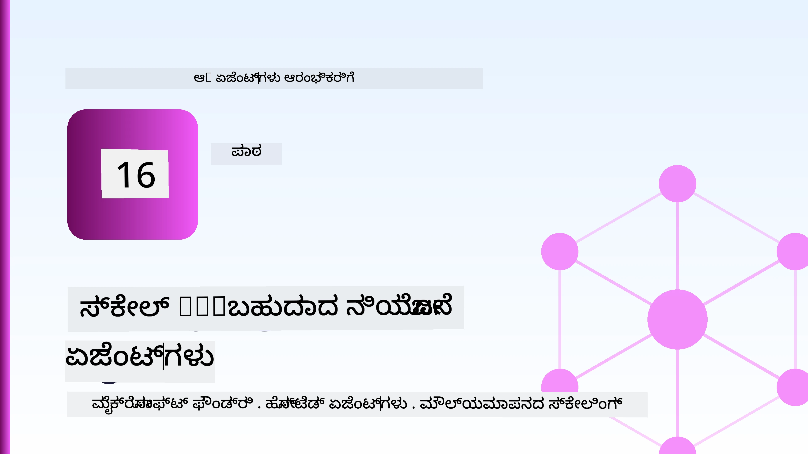
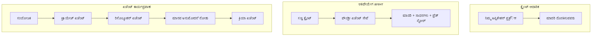
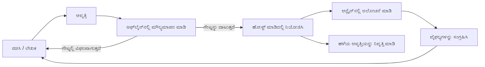
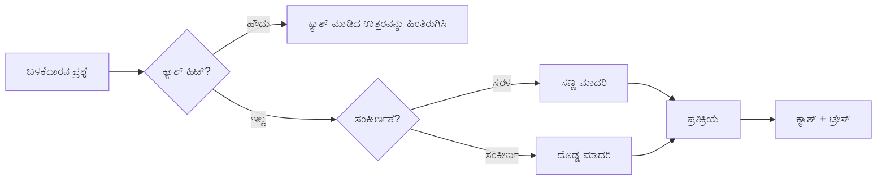
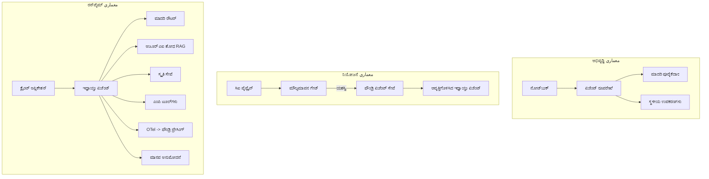

# ಮೈಕ್ರೋಸಾಫ್ಟ್ ಫೌಂಡ್ರಿಯೊಂದಿಗೆ ಸ್ಕೇಲಬಲ್ ಏಜೆಂಟ್ಗಳನ್ನು ನಿಯೋಜಿಸುವಿಕೆಗೆ



ಈ ಕೋರ್ಸಿನ ಈ ದಶಕದವರೆಗೆ ನೀವು ಲ್ಯಾಪ್‌ಟಾಪ್‌ನಲ್ಲಿ, ನೋಟ್‌ಬುಕ್ ಒಳಗೆ, `az login` ಮತ್ತು ಕೆಲವು ಪರಿಸರ ಚರಗಳೊಂದಿಗೆ ಚಾಲಿತವಾಗುವ ಏಜೆಂಟ್ಗಳನ್ನು ನಿರ್ಮಿಸಿದ್ದೀರಿ. ಕಲಿಯಲು ಇದು ಸರಿಯಾದ ಮಾರ್ಗವೇ ಆಗಿದೆ. ಸಾವಿರಾರು ಗ್ರಾಹಕರು ನಂಬುತ್ತಾರೆ ಎಂದು ಬೆಳಿಗ್ಗೆ 3 ಗಂಟೆಗೆ ಏಜೆಂಟ್ನು ನಿರ್ವಹಿಸುವುದು ಇದು ಸರಿಯಾದ ಮಾರ್ಗವಲ್ಲ.

ಈ ಪಾಠವು "ನನ್ನ ಯಂತ್ರದಲ್ಲಿ ಕೆಲಸ ಮಾಡುತ್ತದೆ" ಮತ್ತು "ನಿರಾಕರಣೆಯಲ್ಲಿ ನಂಬಿಕೆಯುತವಾಗಿ ಮತ್ತು ಚಮತ್ಕಾರವಾಗಿ ಕೆಲಸ ಮಾಡುತ್ತದೆ" ಎಂಬ ನಡುವಿನ ಖಾಲಿಯನ್ನು ಬಗ್ಗೆ. ನಾವು ಅದನ್ನು **ಮೈಕ್ರೋಸಾಫ್ಟ್ ಫೌಂಡ್ರಿ** ಮತ್ತು **ಮೈಕ್ರೋಸಾಫ್ಟ್ ಫೌಂಡ್ರಿ ಏಜೆಂಟು ಸೇವೆ** ಉಪಯೋಗಿಸಿ ಮುಚ್ಚುತ್ತೇವೆ, ಮತ್ತು ನಾವು ಇದನ್ನು ನಿಜವಾದ ಗ್ರಾಹಕರ ಬೆಂಬಲ ಏಜೆಂಟ್ನನ್ನು ನೋಡುವ ಕಾಮಗಾರಿ ಸಾಧನಗಳು, retrieval, memory, ಮೌಲ್ಯಮಾಪನ ಮತ್ತು ನಿಗಾ ಪಡಿಸುವಿಕೆಯನ್ನು ನಿರ್ಮಿಸುವ ಮೂಲಕ ಮಾಡುತ್ತೇವೆ.

## ಪರಿಚಯ

ಈ ಪಾಠದಲ್ಲಿ ಒಳಗೊಂಡಿದ್ದು:

- **ಪ್ರೋಟೋಟೈಪ್ ಏಜೆಂಟ್** ಮತ್ತು **ನಿಯೋಜಿಸಲಾಗಿರುವ ಏಜೆಂಟು** ನಡುವೆ ಇರುವ ವ್ಯತ್ಯಾಸ, ಮತ್ತು ಬದಲಾವಣೆ ಹೆಚ್ಚು ಮಾದರಿಯ ಸುತ್ತಲೂ ಬರುವುದರ ಬಗ್ಗೆ.
- ಏಜೆಂಟ್ಗಳಿಗೆ **ನಿಯೋಜನೆ ಮಾದರಿಗಳು**: ಕ್ಲೈಂಟ್-ಹೋಸ್ಟ್, ಸೇವಾ-ಹೋಸ್ಟ್ (Hosted Agents), ಮತ್ತು ವರ್ಕ್ಫ್ಲೋ-ಕಟೈಕೆ.
- **ಮೈಕ್ರೋಸಾಫ್ಟ್ ಫೌಂಡ್ರಿಯಲ್ಲಿನ ಏಜೆಂಟ್ ಜೀವನಚಕ್ರ** — ರಚನೆ, ಸುಧಾರಣೆ, ನಿಯೋಜನೆ, ಮೌಲ್ಯಮಾಪನ, ತಪಾಸಣೆ, ನಿವೃತ್ತಿ.
- **ಸ್ಕೇಲಿಂಗ್ ತಂತ್ರಗಳು**: ಮಾದರಿ ಮಾರ್ಗದರ್ಶನ, ಕ್ಯಾಸಿಂಗ್, ಸರಳಿಕರಣ, ಮತ್ತು ಸ್ಥಿತಿರಹಿತ ವಿನ್ಯಾಸ.
- **OpenTelemetry ಮತ್ತು ಫೌಂಡ್ರಿ ಟ್ರೇಸಿಂಗ್ ಮೂಲಕ ನಿಗಾ ಪಡಿಸುವಿಕೆ**.
- ಮಾದರಿ ಆಯ್ಕೆ, ಮಾರ್ಗದರ್ಶನ ಮತ್ತು ಮೌಲ್ಯಮಾಪನ ಗೇಟ್ಗಳ ಮೂಲಕ **ಖರ್ಚು ತಗ್ಗಿಸುವಿಕೆ**.
- **ಸಂಸ್ಥೆಯ ಪರಿಗಣನೆಗಳು**: ಆಡಳಿತ, ಮಾನವ ಅನುಮೋದನೆ, ಮತ್ತು.production ನಲ್ಲಿ MCP ಸರ್ವರ್‌ಗಳನ್ನು ಸುರಕ್ಷಿತವಾಗಿ ನಿರ್ವಹಿಸುವುದು.

## ಕಲಿಕೆಯ ಗುರಿಗಳು

ಈ ಪಾಠವನ್ನು ಪೂರ್ಣಗೊಳಿಸಿದ ನಂತರ, ನೀವು ತಿಳಿಯಬೆಕು:

- ಯಾವುದೇ ಏಜೆಂಟ್ ಭಾರವಾಹಿಕೆಯಿಗಾಗಿ ಸರಿಯಾದ ನಿಯೋಜನೆ ಮಾದರಿಯನ್ನು ಆರಿಸುವುದು.
- ಏಜೆಂಟ್ ಅನ್ನು ಮೈಕ್ರೋಸಾಫ್ಟ್ ಫೌಂಡ್ರಿ ಏಜೆಂಟ್ ಸೇವೆಗೆ ನಿಯೋಜಿಸಿ, ಅದು ಸುಧಾರಿತ, ನಿಯಂತ್ರಿಸಲ್ಪಟ್ಟ ಮತ್ತು ನಿಗಾ ಪಡಿಸುವಿಕೆಯಾಗಿರುವುದು.
- ಪ್ರತಿ ಬಿಡುಗಡೆಗಿಂತ ಮುಂಚೆ ನಡೆಯುವ ಮೌಲ್ಯಮಾಪನ ಪೈಪ್‌ಲೈನ್ ಅನ್ನು ಟ್ರೇಸಿಂಗ್ ಮಾಡಲು ಏಜೆಂಟ್ ಅನ್ನು ಸಾಧನೀಕರಿಸುವುದು ಮತ್ತು ಸಂಪರ್ಕಿಸುವುದು.
- ಮಾದರಿ ಮಾರ್ಗದರ್ಶನ ಮತ್ತು ಕ್ಯಾಸಿಂಗ್ ಅನ್ನು ಅನ್ವಯಿಸಿ ದಡ್ಯತೆಯನ್ನು ಮತ್ತು ಖರ್ಚನ್ನು ನಿಯಂತ್ರಣದಲ್ಲಿ ಇಡುವುದು.
- ಉನ್ನತ-ಆಪಾಯಗಳ ಕ್ರಿಯೆಗಳಿಗಾಗಿ ಮಾನವ ಅನುಮೋದನಾ ಗೇಟ್ ಸೇರಿಸುವುದು ಮತ್ತು MCP ಸರ್ವರ್ ಅನ್ನು ನಿರ್ಮಾಣ-ಸುರಕ್ಷಿತ ಮಾರ್ಗದಲ್ಲಿ ಸಂಯೋಜಿಸುವುದು.

## ಪೂರ್ವ ಅವಶ್ಯಕತೆಗಳು

ಈ ಪಾಠವು ನೀವು ಹಿಂದಿನ ಪಾಠಗಳನ್ನು ಪೂರ್ಣಗೊಳಿಸಿದ್ದೀರಿ ಎಂದು ಮತ್ತು ಇವುಗಳಲ್ಲಿ ಆರಾಮವಾಗಿ ಕೆಲಸ ಮಾಡುತ್ತೀರಿ ಎಂದು ಧಾರಣೆ ಮಾಡುತ್ತದೆ:

- [Microsoft Agent Framework](../14-microsoft-agent-framework/README.md) ಬಳಸಿ ಏಜೆಂಟ್ ನಿರ್ಮಾಣ (ಪಾಠ 14).
- [ ಸಾಧನ ಬಳಕೆ](../04-tool-use/README.md) (ಪಾಠ 4) ಮತ್ತು [Agentic RAG](../05-agentic-rag/README.md) (ಪಾಠ 5).
- [ ಏಜೆಂಟ್ ಮೆಮೊರಿ](../13-agent-memory/README.md) (ಪಾಠ 13) ಮತ್ತು [Agentic ಪ್ರೋಟೋಕಾಲ್ಸ್ / MCP](../11-agentic-protocols/README.md) (ಪಾಠ 11).
- [ನಿಗಾ ಪಡಿಸುವಿಕೆ ಮತ್ತು ಮೌಲ್ಯಮಾಪನ](../10-ai-agents-production/README.md) (ಪಾಠ 10) — ಈ ಪಾಠ ಅದಕ್ಕೇ ತೊಡೆಯುತ್ತದೆ.

ನಿಮಗೆ ಇವೇ ಬೇಕಾಗುತ್ತದೆ:

- ಕನಿಷ್ಠ ಒಂದು ನಿಯೋಜಿಸಲಾದ ಚಾಟ್ ಮಾದರಿಯನ್ನು ಒಳಗೊಂಡ **ಅಜುರ್ ಸಬ್ಸ್ಕ್ರಿಪ್ಷನ್** ಮತ್ತು **Microsoft Foundry ಪ್ರಾಜೆಕ್ಟ್**.
- **ಅಜುರ್ CLI** ಪ್ರಾಮಾಣಿಕೃತ (`az login`).
- Python 3.12+ ಮತ್ತು ಗಣನೀಯವೆಂದು ಇದ್ದ [`requirements.txt`](../../../requirements.txt) ಪ್ಯಾಕೇಜುಗಳು.

## ಪ್ರೋಟೋಟೈಪ್‌ನಿಂದ ಉತ್ಪಾದನೆಗೆ: ನಿಜವಾಗಿಯೂ ಏನು ಬದಲಾಗುತ್ತದೆ

ಪ್ರೋಟೋಟೈಪ್ ಏಜೆಂಟು ಮತ್ತು ಉತ್ಪಾದನಾ ಏಜೆಂಟು ಒಟ್ಟಿಗೆ ಕೂಡಿಕೊಳ್ಳುವ ಗಮನ: ಯುಕ್ತಿ, ಸಾಧನಗಳನ್ನು ಕರೆಮಾಡಿ, ಪ್ರತಿಕ್ರಿಯೆ ಕೊಡು. ಬದಲಾವಣೆ ಅದನ್ನು ಸುತ್ತಲೂ ಬರುವ ಎಲ್ಲವೂ ಆಗಿರುತ್ತದೆ. ಮಾದರಿ ಉತ್ಪಾದನಾ ಏಜೆಂಟಿನ 20% ಮಾತ್ರ; ಉಳಿದ 80% ಕಾರ್ಯಾಚರಣಾತ್ಮಕ ರಚನೆ.

| ವಿಚಾರಣೆ | ಪ್ರೋಟೋಟೈಪ್ | ಉತ್ಪಾದನೆ |
| --- | --- | --- |
| **ಹೋಸ್ಟಿಂಗ್** | ನಿಮ್ಮ ನೋಟ್ಬುಕ್‌ನಲ್ಲಿ चलುತ್ತದೆ | ಒಂದು ಹೋಸ್ಟ್ ಸೇವೆಯಾಗಿ, ಸುಧಾರಿತ ಮತ್ತು ಬಿಡುಗಡೆ ಮಾಡುತ್ತದೆ |
| **ಗುರುತು** | ನಿಮ್ಮ `az login` ಟೋಕನ್ | ನಿಯಂತ್ರಿತ ಮಾನ್ಯತೆ with scoped RBAC |
| **ಸ್ಥಿತಿ** | ಮೆಮೊರಿಯಲ್ಲಿ, ಮರುಪ್ರಾರಂಭದಲ್ಲಿ ಕಳೆದುಕೊಳ್ಳುತ್ತದೆ | ಬಾಹ್ಯ (ಥ್ರೆಡ್ ಸ್ಟೋರ್, ಮೆಮೊರಿ ಸರ್ವೀಸ್) |
| **ವಿಫಲತೆ** | ನೀವು ಟ್ರೇಸ್ಬ್ಯಾಕ್ ಮುಂದಿಸುತ್ತೀರಿ | ಮತ್ತೆ ಪ್ರಯತ್ನ, ಬ್ಯಾಕಪ್, ಡೆಡ್-ಲೆಟರ್, ಎಚ್ಚರಿಕೆಗಳು |
| **ಖರ್ಚು** | "ಕೆಲವು ಸೆಂಟುಗಳಿಗೆ ಇದೆ" | ಪ್ರತಿ ವಿನಂತಿಗೆ ಮೇಲ್ವಿಚಾರಣೆ, ಮಾರ್ಗದರ್ಶನ, ಕ್ಯಾಸಿಂಗ್, ಬಜೆಟ್ ಮಾಡಲಾಗಿದೆ |
| **ಗುಣಮಟ್ಟ** | ನೀವು ಔಟ್‌ಪುಟ್ ಅನ್ನು ನೋಡುತ್ತೀರಿ | ಪ್ರತಿ ಬಿಡುಗಡೆಗೆ ಮುಂಚಿತವಾಗಿ ಸ್ವಯಂಚಾಲಿತ ಮೌಲ್ಯಮಾಪನ |
| **ನಂಬಿಕೆ** | ನೀವು ಪ್ರತಿಯೊಂದು ಕ್ರಿಯೆಯನ್ನು ಅನುಮೋದಿಸಿ | ನೀತಿ + ಮಾನವ-ನಡೆತ ಚಕ್ರದಲ್ಲಿನ ಅಪಾಯಪೂರ್ಣ ಕ್ರಿಯೆಗಳು |

ಈ ಟೇಬಲ್ ಅನ್ನು ಗಮನದಲ್ಲಿಡಿ. ಕೆಳಗಿನ ಪ್ರತಿಯೊಂದು ವಿಭಾಗವು ಈ ಸಾಲುಗಳಲ್ಲಿ ಒಂದನ್ನೊಮ್ಮೆ ನಕ್ಷೆ ಮಾಡುತ್ತದೆ.

## ಏಜೆಂಟ್ ನಿಯೋಜನೆ ಮಾದರಿಗಳು

ನೀವು ಮಿಶ್ರಣದಲ್ಲಿ ಹೆಚ್ಚು ಬಳಸುವ ಮೂರು ಮಾದರಿಗಳಿವೆ.

### 1. ಕ್ಲೈಂಟ್-ಹೋಸ್ಟ್ ಏಜೆಂಟ್ಗಳು

ಏಜೆಂಟ್ ವಸ್ತು *ನಿಮ್ಮ* ಅಪ್ಲಿಕೇಶನ್ ಪ್ರಕ್ರಿಯೆಯೊಳಗೆ ಜಿವಂತವಾಗಿದೆ. ನಿಮ್ಮ ಕೋಡ್ ನೇರವಾಗಿ ಮಾದರಿ ಪೂರೈಕೆದಾರನನ್ನು ಕರೆ ಮಾಡುತ್ತದೆ; ಯುಕ್ತಿ ಲೂಪ್ ನಿಮ್ಮ ಸೇವೆಯೊಳಗೆ ಚಲಿಸುತ್ತದೆ. ಇದು ಈಗಿನ ಪ್ರತಿಯೊಂದು ಪಾಠವು ಮಾಡಿದದ್ದು.

- **ಬಳಸುವ ಸಮಯ** ನೀವು ಲೂಪ್‌ನಲ್ಲಿ ಸಂಪೂರ್ಣ ನಿಯಂತ್ರಣ ಅಗತ್ಯವಿದ್ದಾಗ, ಕಸ್ಟಮ್ ಮಧ್ಯವರ್ತಿ, ಅಥವಾ ಈಗಾಗಲೇ ಇರುವ ಬ್ಯಾಕೆಂಡ್ ಒಳಗೆ ಏಜೆಂಟ್ ಅನ್ನು ಸೇರಿಸುವಾಗ.
- **ವ್ಯತ್ಯಾಸ**: ನೀವು ಸ್ವತಂತ್ರವಾಗಿ ಸ್ಕೇಲಿಂಗ್, ಸ್ಥಿತಿ, ಮತ್ತು ಸ್ಥಿರತೆಯನ್ನು ನಿರ್ವಹಿಸುತ್ತೀರಿ.

### 2. ಹೋಸ್ಟೆಡ್ ಏಜೆಂಟ್ಗಳು (Foundry Agent Service)

ಏಜೆಂಟ್ *ಮೈಕ್ರೋಸಾಫ್ಟ್ ಫೌಂಡ್ರಿಯಲ್ಲಿ ಸಂಪನ್ಮೂಲವಾಗಿ ನೋಂದಾಯಿಸಲಾಗಿದೆ*. ಫೌಂಡ್ರಿ ಯುಕ್ತಿ ಲೂಪ್ ಅನ್ನು ಹೋಸ್ಟ್ ಮಾಡುತ್ತದೆ, ಥ್ರೆಡ್‌ಗಳನ್ನು ಸಂಗ್ರಹಿಸುತ್ತದೆ, ವಿಷಯ ಸುರಕ್ಷತೆ ಮತ್ತು RBAC ಅಳವಡಿಸುತ್ತದೆ, ಮತ್ತು ಫೌಂಡ್ರಿ ಪೋರ್ಟಲ್‌ನಲ್ಲಿ ಏಜೆಂಟ್‌ಗೆ ದೃಶ್ಯಮಾನತೆ ಒದಗಿಸುತ್ತದೆ. ನಿಮ್ಮ ಆಪ್ ಇವುಗಳೇ ಫಲಿತಾಂಶಕ್ಕಾಗಿ ಥಿನ್ ಕ್ಲೈಂಟ್ ಆಗಿ ಮಾರ್ಪಡುತ್ತದೆ.

- **ಬಳಸುವ ಸಮಯ** ನೀವು ದೃಢತೆಯನ್ನು, ಆಂತರಿಕ ನಿಗಾ ಪಡಿಸುವಿಕೆ ಇಲ್ಲೇ ಆಡಳಿತ ಮತ್ತು ಕಡಿಮೆ ಕಾರ್ಯಾಚರಣಾ ವ್ಯಾಪ್ತಿಯನ್ನು ಬಯಸಿದಾಗ.
- **ವ್ಯತ್ಯಾಸ**: ನಿರ್ವಹಿಸಲಾದ ರಂಟೈಮ್‌ಗೆ ವಿನಿಮಯವಾಗಿ ಕಡಿಮೆ ತಳದ ನಿಯಂತ್ರಣ.

### 3. ಏಜೆಂಟ್ ವರ್ಕ್ಫ್ಲೋಗಳು

ಅನೇಕ ಏಜೆಂಟ್ಗಳು (ಮತ್ತು ಸಾಧನಗಳು) ಸ್ಪಷ್ಟ ನಿಯಂತ್ರಣ ಪ್ರವಾಹದೊಂದಿಗೆ ಒಂದು ಗ್ರಾಫ್‌ಗೆ ಸಂಯೋಜಿಸಲ್ಪಟ್ಟಿವೆ — ಕ್ರಮೇಣ ಹಂತಗಳು, ಶಾಖೆಗಳು, ಮಾನವ ಅನುಮೋದನಾ ನಾಡುಗಳು ಮತ್ತು ಸ್ಥಿರ ಚೆಕ್‌ಪಾಯಿಂಟ್‌ಗಳು, ಅವುಗಳನ್ನು ನಿಲ್ಲಿಸಿ ಮತ್ತು ಪುನರಾರಂಭ ಮಾಡಬಹುದು. ಇದು ಮೈಕ್ರೋಸಾಫ್ಟ್ ಏಜೆಂಟ್ ಫ್ರೇಮ್ವರ್ಕ್ **ವರ್ಕ್‌ಫ್ಲೋಗಳು** ಸಾಮರ್ಥ್ಯವನ್ನು ನಿಯೋಜನೆ ಪ್ರಮಾಣದಲ್ಲಿ ಅನ್ವಯಿಸುತ್ತದೆ.

- **ಬಳಸುವ ಸಮಯ** ಒಂದು ಕಾರ್ಯವು ಹಲವಾರು ವಿಶೇಷ ಏಜೆಂಟ್ಗಳನ್ನು ವ್ಯಾಪಿಸುತ್ತದೆ ಅಥವಾ ಮಧ್ಯದಲ್ಲಿ ಅನುಮೋದನಾ ಹಂತವನ್ನು ಅವಶ್ಯಕವಾಗಿಸಿಕೊಳ್ಳುತ್ತದೆ.
- **ವ್ಯತ್ಯಾಸ**: ಹೆಚ್ಚು ಸಂಚಾಲಿತ ಭಾಗಗಳು; ಸಂಯೋಜನೆ-ಮಟ್ಟದ ನಿಗಾ ಅಗತ.



## ಮೈಕ್ರೋಸಾಫ್ಟ್ ಫೌಂಡ್ರಿಯಲ್ಲಿನ ಏಜೆಂಟ್ ಜೀವನಚಕ್ರ

ಏಜೆಂಟ್ ಅನ್ನು ನಿಯೋಜಿಸುವುದು ಒಂದೇ ಬಾರಿ `push` ಆಗಿರುವುದು ಅಲ್ಲ. ಇದು ಒಂದು ಲೂಪ್ ಆಗಿದೆ, ಮತ್ತು ಇವು ಸಾಫ್ಟ್‌ವೇರ್ ಬಿಡುಗಡೆ ಚಕ್ರದಂತೆಯೇ ಕಾಣುತ್ತದೆ ಏಕೆಂದರೆ ಅದೇ ಆಗಿದೆ.



ಪ್ರಮುಖ ಆಲೋಚನೆ, [ಪಾಠ 10](../10-ai-agents-production/README.md) ಯಿಂದ ಬಂದದ್ದು: **ಆಫ್‌ಲೈನ್ ಮೌಲ್ಯಮಾಪನ ಗೇಟ್, ನಂತರದ ವಿಷಯವಲ್ಲ.** ಹೊಸ ಏಜೆಂಟ್ ಆವೃತ್ತಿ ನಿಮ್ಮ ಮೌಲ್ಯಮಾಪನ ಮಿತಿಗಳನ್ನು ತಲುಪದಿದ್ದರೆ ಕಂಪ್ಯೂಟರ್ ಶಿಪ್ ಆಗುವುದಿಲ್ಲ. ಆನ್ಲೈನ್ ನಿಗಾ ನಂತರ ವಾಸ್ತವ ವಿಫಲತೆಗಳನ್ನು ನಿಮ್ಮ ಆಫ್‌ಲೈನ್ ಪರೀಕ್ಷಾ ಸಂಗ್ರಹಕ್ಕೆ ಹಿಂತಿರುಗಿಸುತ್ತದೆ. ಆದುದೇ ಸಂಪೂರ್ಣ ಲೂಪ್.

## ಸ್ಕೇಲಿಂಗ್ ತಂತ್ರಗಳು

ಏಜೆಂಟ್ ಅನ್ನು ಸ್ಕೇಲು ಮಾಡುವುದು ಸ್ಥಿತಿರಹಿತ ವೆಬ್ API ಸ್ಕೇಲು ಮಾಡುವುದರಿಂದ ಬೇರೆಯಾಗಿದೆ, ಏಕೆಂದರೆ ಪ್ರತಿ ವಿನಂತಿ ಬಹಳಷ್ಟು ದುಬಾರಿ ಮಾದರಿ ಮತ್ತು ಸಾಧನದ ಕರೆಗಳನ್ನು ಪ್ರಾರಂಭಿಸಬಹುದು. ನಾಲ್ಕು ತಂತ್ರಗಳು ಹೆಚ್ಚಿನ ಲೋಡನ್ನು ತೆಗೆದುಕೊಳ್ಳುತ್ತವೆ.

**ಸ್ಥಿತಿರಹಿತ ವಿನಂತಿ ನಿರ್ವಹಣೆ.** ಪ್ರತಿ ಬಳಕೆದಾರರ ಸ್ಥಿತಿಯನ್ನು ನಿಮ್ಮ ಪ್ರಕ್ರಿಯೆಯ ಮೆಮೊರಿಯಲ್ಲಿ ಉಳೆಯಬೇಡಿ. ಸಂಭಾಷಣಾ ಥ್ರೆಡ್‌ಗಳನ್ನು ಫೌಂಡ್ರಿ ಥ್ರೆಡ್ ಸ್ಟೋರ್ ಅಥವಾ ಮೆಮೊರಿ ಸರ್ವೀಸ್‌ನಲ್ಲಿ ಉಳಿಸಿ, ಯಾವುದೇ ಉದಾಹರಣೆ ಯಾವುದೇ ವಿನಂತಿಯನ್ನು ನಿರ್ವಹಿಸಬಹುದು. ಈದು ನಿಮ್ಮನ್ನು ಒಳಗಡೆ ಸ್ಕೇಲು ಮಾಡಲು ಅವಕಾಶ ಮಾಡಿಕೊಡುತ್ತದೆ — ಉದಾಹರಣೆಗಳನ್ನು ಸೇರಿಸಿ, ಸಟಿಕ್ ಸೆಷನ್ಗಳಿಲ್ಲ.

**ಮಾದರಿ ಮಾರ್ಗದರ್ಶನ.** ಪ್ರತೀ ವಿನಂತಿಗೆ ನಿಮ್ಮ ಅತ್ಯಂತ ಸಾಮರ್ಥ್ಯ ಮತ್ತು ದುಬಾರಿ ಮಾದರಿಯ ಅಗತ್ಯವಿಲ್ಲ. ಸರಳ ವಿನಂತಿಗಳನ್ನು — ಉದ್ದೇಶ ವರ್ಗೀಕರಣ, ಚಿಕ್ಕ ತಣ್ಣನೆಯ ಉತ್ತರಗಳು — ಚಿಕ್ಕ, ವೇಗದ ಮಾದರಿಯತ್ತ ಮಾರ್ಗದರ್ಶಿಸಿ, ದೊಡ್ಡ ಮಾದರಿಯನ್ನು ನಿಜವಾದ ಯುಕ್ತಿಗಾಗಿ ಮೀಸಲಿಡಿ. ಫೌಂಡ್ರಿಯ **ಮಾದರಿ ರೌಟರ್** ನಿಮ್ಮಿಗಾಗಿ ಇದನ್ನು ಮಾಡಬಹುದು, ಅಥವಾ ನೀವು ತಗ್ಗಿದ್ದ ವರ್ಗೀಕರಣವನ್ನು ಸ್ವತಃ ಅನ್ವಯಿಸಬಹುದು. ನೀವು ಪ್ರಯೋಗಾಲಯದಲ್ಲಿ ಸ್ವ-ನಿರ್ಮಿತ ಆವೃತ್ತಿಯನ್ನು ನಿರ್ಮಿಸುವಿರಿ.

**ಪ್ರತಿಕ್ರಿಯೆ ಕ್ಯಾಸಿಂಗ್.** ಹಲವಾರು ಬೆಂಬಲ ವಿಚಾರಣೆಗಳು ಸಮೀಪದ ನಕಲುಗಳಿಂದ ಕೂಡಿರುತ್ತದೆ ("ನನ್ನ ಪಾಸ್ವರ್ಡ್ ಅನ್ನು ಹೇಗೆ ಮರುಹೊಂದಿಸಬಹುದು?"). ಸಾಮಾನ್ಯ ಪ್ರಶ್ನೆಗಳಿಗೆ ಉತ್ತರಗಳನ್ನು ಕ್ಯಾಸೆಯಲ್ಲೆ ಉಳಿಸಿ ಮತ್ತು ಮಾದರಿಯನ್ನು ಹೊಡೆದದೇ ಸೇವಿಸಿ. ಸಣ್ಣ ಮಟ್ಟದ ಕ್ಯಾಸೆ ಹಿಟ್ ದರವು ಖರ್ಚು ಮತ್ತು ದಡ್ಯದೆಯನ್ನು ಅರ್ಥಪೂರ್ಣವಾಗಿ ಕಡಿಮೆ ಮಾಡುತ್ತದೆ.

**ಸಹ-ಪ್ರಚಲಿಸುವಿಕೆ ಮತ್ತು ಬ್ಯಾಕ್ಫ್ರೆಶರ್.** ಮಾದರಿ ಪೂರೈಕೆದಾರರಿಗೆ ದರ ಮಿತಿಗಳು ಇವೆ. ನಿಮ್ಮ ಸಹ-ಪ್ರಚಲಿಸುವಿಕೆಯನ್ನು ನಿಯಂತ್ರಿಸಿ, ಘಾತಾಂಶ ಹಿಂಪಡೆಯೊಂದಿಗೆ ಮರುಪ್ರಯತ್ನಗಳನ್ನು ಬಳಸಿರಿ, ಮತ್ತು ಸೌಮ್ಯವಾಗಿ ವಿಫಲವಾಗಿರಿ (ಒಂದು ಕಾಲಮಾನ "ನಾವಿದ್ದುಕೆ ಹೋಗುತ್ತಿದ್ದೇವೆ" ಪ್ರತಿಕ್ರಿಯೆಯು 500 ಕ್ಕಿಂತ ಉತ್ತಮ).



## ನಿರಾಕರಣೆಯಲ್ಲಿ ನಿಗಾ ಪಡಿಸುವಿಕೆ

ನೀವು ಕಾಣದಿರುವುದನ್ನು ಕಾರ್ಯಗತಗೊಳಿಸಲು ಸಾಧ್ಯವಿಲ್ಲ. ಪಾಠ 10 ನಲ್ಲಿ ವಿವರಿಸಿದಂತೆ, ಮೈಕ್ರೋಸಾಫ್ಟ್ ಏಜೆಂಟ್ ಫ್ರೇಮ್ವರ್ಕ್ **OpenTelemetry** ಟ್ರೇಸ್‌ಗಳನ್ನು ಸ್ವಾಭಾವಿಕವಾಗಿ ಹೊರಹಾಕುತ್ತದೆ — ಪ್ರತಿಯೊಂದು ಮಾದರಿ ಕರೆ, ಸಾಧನ ಆಮಂತ್ರಣ ಮತ್ತು ಸಂಯೋಜನಾ ಹಂತವು spans ಆಗುತ್ತದೆ. ನಿರಾಕರಣೆಯಲ್ಲಿ ನೀವು ಆ spans ಗಳನ್ನು Microsoft Foundry (ಅಥವಾ ಯಾವುದೇ OTel- ಹೊಂದಾಣಿಕೆಯ ಹಿನ್ನೆಲೆಗೆ) ರಫ್ತು ಮಾಡಬಹುದು ताकि ನೀವು:

- ಒಂದು ಗ್ರಾಹಕ ದೂರುವನ್ನು ಪ್ರತಿಯೊಂದು ಮಾದರಿ ಮತ್ತು ಸಾಧನ ಕರೆಗಳ ಮೂಲಕ ಮುಕ್ತಾಯದಿಂದ ಮುಕ್ತಾಯಕ್ಕೆ ಟ್ರೇಸ್ಮಾಡಿ.
- ಸಮಯದೊಂದಿಗೆ ಪ್ರತಿ ವಿನಂತಿಗೆ p50/p95 ದಡ್ಯತೆ ಮತ್ತು ಖರ್ಚು ವೀಕ್ಷಿಸಿ.
- ದೋಷ ದರದ ಏರಿಕೆ ಮತ್ತು ಖರ್ಚು ಅನೋಮಲಿಗಳ ಮೇಲೆ ಎಚ್ಚರಿಕೆ ನೀಡಿರಿ, ನಿಮ್ಮ ಬಳಕೆದಾರರು (ಅಥವಾ ನಿಮ್ಮ ಹಣಕಾಸು ತಂಡ) ಗಮನಿಸಲು ಮುಂಚಿತವಾಗಿ.

```python
from agent_framework.observability import get_tracer

tracer = get_tracer()

with tracer.start_as_current_span("support_request") as span:
    span.set_attribute("customer.tier", "enterprise")
    span.set_attribute("routed.model", "gpt-5-nano")
    # ಏಜೆಂಟ್ ಕಾರ್ಯಾಚರಣೆಯನ್ನು ಸ್ವಯಂಚಾಲಿತವಾಗಿ ಈ ಸ್ಪ್ಯಾನ್ ಒಳಗೆ ಅನುಸರಿಸಲಾಗುತ್ತದೆ
```

`customer.tier` ಮತ್ತು `routed.model` ಮುಂತಾದ ಗುಣಲಕ್ಷಣಗಳು ಟ್ರೇಸಿನ ಗೋಡೆಗಳನ್ನು ಉತ್ತರಕೊಡುವ ಪ್ರಶ್ನೆಗಳಾಗಿ ("ಉದ್ಯಮ ಗ್ರಾಹಕರು ಸಣ್ಣ ಮಾದರಿಗೆ ಹೆಚ್ಚು ಮಾರ್ಗದರ್ಶನಗೊಳ್ಳುತ್ತಿದೆಯೇ?") ಮಾರ್ಪಡಿಸುತ್ತವೆ.

## ಖರ್ಚು ತಗ್ಗಿಸುವಿಕೆ

ಉತ್ಪಾದನಾ ಏಜೆಂಟುಗಳಲ್ಲಿ ಖರ್ಚು ಟೋಕನ್‌ಗಳ ಮೂಲಕ ಪ್ರಭುತ್ವ ಪಡೆದಿದೆ. ಪರಿಣಾಮದ ಕ್ರಮದಲ್ಲಿ ಮೂರು рыಾರಿ ದೊರಕದ್ದುಗಳು:

1. ** ಸರಿಯಾದ ಗಾತ್ರದ ಮಾದರಿಯನ್ನು ಆರಿಸಿ.** ನಿಮ್ಮ ಮೌಲ್ಯಮಾಪನ ಗೇಟ್ ಅನ್ನು ಹೊಡೆಯುವ ಒಂದು ಸಣ್ಣ ಮಾದರಿ ಸಾಮಾನ್ಯವಾಗಿ ಒಂದು ದೊಡ್ಡ ಮಾದರಿಗಿಂತ, ಅದು ಕೂಡ ಗೇಟ್ ಹೊಡೆದು, ಕಡಿಮೆ ದುಬಾರಿ. ಎಚ್ಚರಿಕೆಗಾಗಿ ದೈವಬಂಧವಾಗಿ ದೊಡ್ಡ ಮಾದರಿಯನ್ನೇ ಆಯ್ಕೆ ಮಾಡುವುದನ್ನು ಬಿಟ್ಟು, ಸಣ್ಣ ಮಾದರಿಯು ಸಾಕಾಗುವುದನ್ನು ಮೌಲ್ಯಮಾಪನದಲ್ಲಿ *ಸಾಬೀತುಪಡಿಸಿ*.
2. **ಸಂಕೀರ್ಣತೆಯ ಮೂಲಕ ಮಾರ್ಗದರ್ಶನ.** ಮೇಲ್ಕಾಣಿದಂತೆ — ದೊಡ್ಡ ಮಾದರಿ ಯುಕ್ತಿಗೆ ಮಾತ್ರ ದೊಡ್ಡ-ಮಾದರಿ ಬೆಲೆಗಳನ್ನು ಪಾವತಿಸಿ.
3. **ತೀವ್ರವಾಗಿ ಕ್ಯಾಸಿಂಗ್ ಮಾಡಿ.** ಅತಿ ಕಡಿಮೆ ಮಾದರಿ ಕರೆ ಎಂದರೆ ನೀವು ಎಂದಿಗೂ ಮಾಡದಿರುವದು.

ಮೌಲ್ಯಮಾಪನ ಗೇಟ್ಗಳು ಮತ್ತು ಖರ್ಚು ನಿಯಂತ್ರಣವು ಎರಡು ಬದಿಗಳಿಂದ ನೋಡಿದ ಒಟ್ಟಾರೆ ಶಿಸ್ತಾಗಿವೆ: ಮೌಲ್ಯಮಾಪನವು ನಿಮಗೆ *ಗುಣಮಟ್ಟ ನೆಲ* ಅನ್ನು ಹೇಳುತ್ತದೆ, ಮಾರ್ಗದರ್ಶನ ಮತ್ತು ಕ್ಯಾಸಿಂಗ್ ನಿಮ್ಮನ್ನು ಆ ನೆಲದ *ಖರ್ಚಿಗೆ* όσο ಸಮೀಪದಲ್ಲಿಡುತ್ತದೆ.

## ಸಂಸ್ಥೆಯ ನಿಯೋಜನೆ ಪರಿಗಣನೆಗಳು

**ಆಡಳಿತ.** Hosted Agents ಫೌಂಡ್ರಿಯ RBAC, ವಿಷಯ ಸುರಕ್ಷತೆ ಮತ್ತು ಲಾಗ್ ತಪಾಸಣೆಯನ್ನು ಪಾಲಿಸುತ್ತವೆ. ಪ್ರತಿ ಏಜೆಂಟ್‌ಗೆ ಅವಶ್ಯಕತೆಯ ಕನಿಷ್ಠ ಪ್ರಿವಿಲೇಜುಳ್ಳ ನಿರ್ವಹಿತ ಗುರುತು ನೀಡಿ — ಜ್ಞಾನ ಆಧಾರದ ಓದಿದ ಮಾತ್ರ ಪ್ರವೇಶ, ಟಿಕೆಟ್ API ಗೆ ಮಿತಿತ ಪ್ರವೇಶ, ಬೇರೆಯದೇನೂ ಇಲ್ಲ.

**ಮಾನವ-ನಡೆತ ಚಕ್ರದಲ್ಲಿ.** ಕೆಲವು ಕ್ರಿಯೆಗಳು ಸಂಪೂರ್ಣವಾಗಿ ಸ್ವಯಂಚಾಲಿತವಾಗಲು ಯೋಗ್ಯವಾಗಿಲ್ಲ — ಹಣ ಹಿಂತಣಿಸುವಿಕೆ, ಖಾತೆಯನ್ನುೊಳಗಡೆ ಮಾಯಮಾಡುವುದು, ಕಾನೂನು ತಂಡಕ್ಕೆ ಹೆಚ್ಚಿಸಲು. ಮೈಕ್ರೋಸಾಫ್ಟ್ ಏಜೆಂಟ್ ಫ್ರೇಮ್‌ವರ್ಕ್ **ಅನುಮೋದನೆ-ಅಗತ್ಯ** ಸಾಧನಗಳನ್ನು ಬೆಂಬಲಿಸುತ್ತದೆ: ಏಜೆಂಟ್ ಕಾರ್ಯವನ್ನು ಪ್ರಸ್ತಾಪಿಸಿ, ಕಾರ್ಯಾಚರಣೆ ನಿಲ್ಲಿಸಿ, ಮಾನವ ಅನುಮೋದನೆ ಅಥವಾ ನಿರಾಕರಣೆ, ನಂತರ ವರ್ಕ್ಫ್ಲೋ ಮುಂದುವರಿಕೆ. ನೀವು [ಪಾಠ 6](../06-building-trustworthy-agents/README.md) ನಲ್ಲಿ ಆ ಪ್ರಾಂಭಿಕತೆಯನ್ನು ಕಂಡಿದ್ದೀರಿ; ಇಲ್ಲಿ ನೀವು ಅದನ್ನು ನಿಯೋಜಿಸುತ್ತೀರಿ.

**ಉತ್ಪಾದನೆಯಲ್ಲಿ MCP.** [MCP](../11-agentic-protocols/README.md) ನಿಮಗೆ ನಿಮ್ಮ ಏಜೆಂಟ್ ಗೆ ಹೊರಗಿನ ಸಾಧನಗಳನ್ನು ತಮ್ಮ ಮಾನಕ ಇಂಟರ್ಫೇಸ್ ಮೂಲಕ ಉಪಯೋಗಿಸಲು ಅವಕಾಶ ಮಾಡಿಕೊಡುತ್ತದೆ. ಉತ್ಪಾದನೆಯಲ್ಲಿ, ಪ್ರತಿಯೊಂದು MCP ಸರ್ವರ್ ಅನ್ನು ನಂಬದ ಸೇಮಾಗ್ರ ಗಡಪಾಗಿ ಪರಿಗಣಿಸಿ: ಸರ್ವರ್ ಆವೃತ್ತಿಯನ್ನು ಪಿನ್ ಮಾಡಿ, ಅದನ್ನು ಸ್ಕೋಪ್ ಮಾಡಿದ ಗುರುತು ಸಹಿತ ಚಾಲನೆ ಮಾಡಿ, ಅದರ ಫಲಿತಾಂಶಗಳನ್ನು ಪರಿಶೀಲಿಸಿ, ಮತ್ತು ಅದಕ್ಕೆ ರಹಸ್ಯಗಳನ್ನು ಎಂದಿಗೂ ಬಹಿರಂಗಪಡಿಸಬೇಡಿ. MCP ಸರ್ವರ್ ಒಂದು ನಿರ್ಭರತೆ, ಮತ್ತು ನಿರ್ಭರತೆಗಳಿಗೆ ಸುಧಾರಣೆ, ಲಾಗ್ ಪರಿಶೀಲನೆ ಮತ್ತು ದರ ನಿಯಂತ್ರಣ ಇರುತ್ತದೆ.



ಆ ಮೂವರು ಚಿತ್ರಗಳು — ಅಭಿವೃದ್ಧಿ, ನಿಯೋಜನೆ, ರನ್‌ಟೈಮ್ — ಅದೇ ಏಜೆಂಟ್ ತನ್ನ ಜೀವನದ ಮೂರು ಹಂತಗಳಲ್ಲಿ. ನಂತರದ ಪ್ರಯೋಗಾಲಯವು ನಿಮ್ಮನ್ನು ಅದನ್ನು ನಿರ್ಮಿಸುವ ಮೂಲಕ ನಡೆಯಿಸುತ್ತದೆ.

## ಕೈಗೂಡಿಸುವ ಪ್ರಯೋಗಾಲಯ: ಉತ್ಪಾದನೆ-ಸಿದ್ಧ ಗ್ರಾಹಕ ಬೆಂಬಲ ಏಜೆಂಟ್

[`code_samples/16-python-agent-framework.ipynb`](./code_samples/16-python-agent-framework.ipynb) ತೆರೆಯಿರಿ ಮತ್ತು ಅದು ಮುಗಿಸುವವರೆಗೆ ಕೆಲಸ ಮಾಡಿ. ನೀವು ಪ್ರತಿಯೊಂದು ಉತ್ಪಾದನಾ ಪರಿಗಣನೆಯೊಂದಿಗೆ **ಕಂಟೋಸೊ ಗ್ರಾಹಕ ಬೆಂಬಲ ಏಜೆಂಟ್** ಅನ್ನು ಸಂಯೋಜಿಸುವಿರಿ:

1. **ಸಾಧನ ಕರೆ** — ಆರ್ಡರ್ ಸ್ಥಿತಿಯನ್ನು ಹುಡುಕಿ ಮತ್ತು ಬೆಂಬಲ ಟಿಕೆಟ್‌ಗಳನ್ನು ತೆರೆಯಿರಿ.
2. **RAG** — ಜ್ಞಾನ ಆಧಾರದಿಂದ ನೀತಿ ಪ್ರಶ್ನೆಗಳಿಗೆ ಉತ್ತರ ನೀಡಿ (ಅಜುರ್ AI ಶೋಧ, ಮೆಮೊರಿಯಲ್ಲಿ ಬ್ಯಾಕಪ್ ಸಹಿತ, ಆದರಿಂದ ನೋಟ್‌ಬುಕ್ ಶೋಧ ಸಂಪನ್ಮೂಲವಿಲ್ಲದೆ ಓಡುತ್ತದೆ).
3. **ಮೆಮೊರಿ** — ಸಂಭಾಷಣೆಯ ಕೊನೆಯಲ್ಲಿ ಗ್ರಾಹಕನನ್ನು ಸ್ಮರಿಸಿ.
4. **ಮಾದರಿ ಮಾರ್ಗದರ್ಶನ** — ಸಂಕೀರ್ಣತೆ ವರ್ಗೀಕರಿಸುವುದು ಪ್ರತಿ ವಿನಂತಿಯನ್ನು ಸಣ್ಣ ಅಥವಾ ದೊಡ್ಡ ಮಾದರಿಯಿಗೆ ಮಾರ್ಗದರ್ಶಿಸುತ್ತದೆ.
5. **ಪ್ರತಿಕ್ರಿಯೆ ಕ್ಯಾಸಿಂಗ್** — ಪುನರಾವರ್ತಿತ ಪ್ರಶ್ನೆಗಳನ್ನು ಕ್ಯಾಸೆಯಿಂದ ಸರ್ವ್ ಮಾಡಲಾಗುತ್ತದೆ.
6. **ಮಾನವ ಅನುಮೋದನೆ** — ನಿರ್ದಿಷ್ಟ ಮಿತಿ ಮೀರಿದ ಮರುಪಾವತಿ ಮಾನವ ಸಹಿಯಿಗಾಗಿ ನಿಲ್ಲುತ್ತದೆ.
7. **ಮೌಲ್ಯಮಾಪನ ಪೈಪ್‌ಲೈನ್** — ಸಣ್ಣ ಆಫ್‌ಲೈನ್ ಪರೀಕ್ಷಾ ಸಂಕಲನ ಏಜೆಂಟ್ ಅನ್ನು ಅಂಕಿಅಂಶಮಾಡುತ್ತದೆ ಮತ್ತು ಬಿಡುಗಡೆ ಗೇಟ್ ಆಗ ಕಾರ್ಯನಿರ್ವಹಿಸುತ್ತದೆ.
8. **ನಿಗಾ ಪಡಿಸುವಿಕೆ** — ಪ್ರತಿ ವಿನಂತಿಯ ಎದುರು OpenTelemetry ಟ್ರೇಸಿಂಗ್.

### ಕ್ರಮಬದ್ಧ ಅನುಸರಣೆ

ನೋಟ್‌ಬುಕ್ ಅನ್ನು ಪ್ರತಿಯೊಂದು ಉತ್ಪಾದನಾ ಪರಿಗಣನೆಯನ್ನು ಸ್ವತಂತ್ರವಾಗಿ, ಓಡಬಹುದಾದ ವಿಭಾಗವಾಗಿ ವಿನ್ಯಾಸಗೊಳಿಸಲಾಗಿದೆ. ಅದರ ಹೃದಯವು ಮಾರ್ಗದರ್ಶನ ಮತ್ತು ಕ್ಯಾಸಿಂಗ್ ವಿನಂತಿ ನಿರ್ವಹಣೆಯಾಗಿದೆ:

```python
async def handle_support_request(query: str, customer_id: str) -> str:
    # 1. ಸಾಧ್ಯವಾದಾಗ ಕ್ಯಾಶೆಯಿಂದ ಸೇವೆ ನೀಡಿ.
    cached = response_cache.get(normalize(query))
    if cached:
        return cached

    # 2. ವೆಚ್ಚವನ್ನು ನಿಯಂತ್ರಿಸಲು ಜಟೀಲತೆಯ ಪ್ರಕಾರ ಮಾರ್ಗನಿರ್ದೇಶನ ಮಾಡಿ.
    model = "gpt-5-nano" if is_simple(query) else "gpt-5-mini"

    # 3. ಗಮನಾರ್ಹತೆಯಿಗಾಗಿ ಏಜೆಂಟ್ ಅನ್ನು ಟ್ರೇಸ್ ಸ್ಪ್ಯಾನ್ ಒಳಗೆ ನಡೆಸಿ.
    with tracer.start_as_current_span("support_request") as span:
        span.set_attribute("routed.model", model)
        span.set_attribute("customer.id", customer_id)
        response = await support_agent.run(query, model=model)

    # 4. ಕ್ಯಾಶೆ ಮಾಡಿ ಮತ್ತು ಹಿಂತಿರುಗಿಸಿ.
    response_cache.set(normalize(query), response.text)
    return response.text
```

ಬಿಡುಗಡೆಯನ್ನು ಸುರಕ್ಷಿತಗೊಳಿಸುವ ಮೌಲ್ಯಮಾಪನ ಗೇಟ್ ಹೀಗೆ ಕಾಣುತ್ತದೆ:

```python
async def evaluation_gate(agent, test_cases, threshold: float = 0.8) -> bool:
    passed = 0
    for case in test_cases:
        result = await agent.run(case["input"])
        if score_response(result.text, case["expected"]) >= 0.8:
            passed += 1
    pass_rate = passed / len(test_cases)
    print(f"Evaluation pass rate: {pass_rate:.0%} (gate: {threshold:.0%})")
    return pass_rate >= threshold  # ಗೇಟ್ ಪಾಸ್ ಆಗಿದ್ರೆ ಮಾತ್ರ ನಿಯೋಜಿಸು
```

ಪ್ರತಿಯೊಂದು ಸಾಲನ್ನು ಓದಿ — ನೋಟ್‌ಬುಕ್ ಪ್ರಿಮೆಟಿವ್‌ಗಳನ್ನು ಉದ್ದೇಶಪೂರ್ವಕವಾಗಿ ಸಣ್ಣದಾಗಿ ಇಟ್ಟಿದೆ, ಯಾವುದೇ ಮಾಹಿತಿ ಫ್ರೇಮ್‌ವರ್ಕ್ ಕರೆ ಹಿಂದೆ ಸುಳಿವಲ್ಲ.

## ನಿಯೋಜಿಸಿದ ಏಜೆಂಟನ್ನು ಧೂಮಕೋಲೆ ಪರೀಕ್ಷೆಗಳ ಮೂಲಕ ಪರಿಶೀಲಿಸುವುದು

ಮೇಲಿನ ಮೌಲ್ಯಮಾಪನ ಗೇಟ್ ನಿಮ್ಮ ಏಜೆಂಟ್ ವಸ್ತುವಿಗೆ ವಿರುದ್ಧವಾಗಿ *ಆಫ್‌ಲೈನ್* ಬಳಸಲಾಗುತ್ತದೆ. ಏಜೆಂಟ್ ನಿಯೋಜನೆ ಆಗುವಾಗ, ಇನ್ನೊಂದರ ಅಗತ್ಯವಿದೆ, ಮತ್ತಷ್ಟು ಕಡಿಮೆ ವೆಚ್ಚದ ಪರಿಶೀಲನೆ: **ನಿಯೋಜಿತ ಅಂತಿಮ ಬಿಂದುವು ನಿಜವಾಗಿಯೂ ಉತ್ತರಿಸುತ್ತಿದೆಯೇ?**

"ಯಶಸ್ವಿಯಾಗಿ" ನಿಯೋಜಿಸುವುದು ಕೇವಲ ನಿಯಂತ್ರಣ ತಟ್ಟೆಯನ್ನು ಸ್ವೀಕರಿಸಿದೆ ಎಂದು ಸಾಬೀತುಪಡಿಸುತ್ತದೆ — ಇದು ಏಜೆಂಟ್ ಪ್ರತಿಕ್ರಿಯಿಸುವುದಿಲ್ಲ ಎಂಬುದನ್ನು ಸಾಬೀತುಪಡಿಸುವುದಿಲ್ಲ. ಒಂದು ಕೊರತೆ ಇರುವ ಅವಲಂಬನೆ, ತಪ್ಪಾದ ಮಾದರಿ ಮಾರ್ಗದರ್ಶನ, ಅಥವಾ ಅವಧಿಹೀನ ಸಂಪರ್ಕವು ಒಂದೇ ಹಸಿರು ನಿಯೋಜನೆಯನ್ನು ಮರುಪಠಿಸುತ್ತದೆ ಆದರೆ ಏನೂ ನೀಡುವುದಿಲ್ಲ. **ಧೂಮಕೋಲೆ ಪರೀಕ್ಷೆ** ಒಂದು ಸೆಕೆಂಡಿನಲ್ಲಿ ಅದನ್ನು ಹಿಡಿಯುತ್ತದೆ, ಪ್ರತಿಯೊಂದು ನಿಯೋಜನೆ ಮೇಲೂ, ಸಂಪೂರ್ಣ ಮೌಲ್ಯಮಾಪನ ವೆಚ್ಚವಿಲ್ಲದೆ.

ಈ ಸಂಗ್ರಹಣೆಯು [AI Smoke Test](https://github.com/marketplace/actions/ai-smoke-test) GitHub ಕ್ರಿಯೆಯ ಮೇಲೆ ನಿರ್ಮಿತ ಸಿದ್ಧ-ಬಳಕೆಯ ಧೂಮಕೋಲೆ-ಪರೀಕ್ಷೆ ಪೈಪ್‌ಲೈನ್ ಅನ್ನು ಒದಗಿಸುತ್ತದೆ:

- **ಕ್ಯಾಟಲಾಕ್** — [`tests/lesson-16-smoke-tests.json`](../../../tests/lesson-16-smoke-tests.json) ನಲ್ಲಿ Contoso ಬೆಂಬಲ ಏಜೆಂಟ್‌ಗೆ ಪ್ರಾಂಪ್ಟ್‌ಗಳು ಮತ್ತು ದೃಢೀಕರಣಗಳು ಇವೆ (ಭೂಮಿತ ನೀತಿ ಉತ್ತರಗಳು, ಆರ್ಡರ್ ಹುಡುಕಾಟ, ವಿಷಯದ ಮೇಲೆ ಇರುವುದು, ಮತ್ತು ಬಹು-ತಿರುವು ಥ್ರೆಡ್ ನಿರಂತರತೆ). ಇತರ ಪಾಠದ ಏಜೆಂಟ್‌ಗಳ ಕ್ಯಾಟಲಾಕ್‌ಗಳು ಇನ್ನೂ ಸದೆ ... [`tests/README.md`](../tests/README.md) ನಲ್ಲಿ ಇವೆ.
- **ವರ್ಕ್‌ಫ್ಲೋ** — [`.github/workflows/smoke-test.yml`](../../../.github/workflows/smoke-test.yml) ಅಜುರ್ OIDC ನೊಂದಿಗೆ ಲಾಗಿನ್ ಆಗಿ ಪ್ರತಿಯೊಂದು ಪ್ರಾಂಪ್ಟ್ ಅನ್ನು ಏಜೆಂಟ್ Responses ಅಂತರ್ಜಾಲಿಕೆಗೆ POST ಮಾಡುತ್ತದೆ, ಯಾವುದೇ ದೃಢೀಕರಣ ತಪ್ಪುಗೊಳಿಸಿದರೆ ಕೆಲಸ ವಿಫಲಗೊಳಿಸುತ್ತದೆ.

```yaml
- name: Smoke-test hosted agent
  uses: JFolberth/ai-smoketest@v1
  with:
    project_endpoint: ${{ inputs.project_endpoint }}
    agent_name: ContosoSupportAgent
    tests_file: tests/lesson-16-smoke-tests.json
```


ನಿಮ್ಮ ಏಜೆಂಟ್ ನಿಯೋಜಿಸಲಾದ ನಂತರ, ನಿಮ್ಮ Foundry ಪ್ರಾಜೆಕ್ಟ್ ಎಂಡ್‌ಪಾಯಿಂಟ್ ಮತ್ತು ಏಜೆಂಟ್ ಹೆಸರನ್ನು ಒದಗಿಸುವ ಮೂಲಕ **Actions** ಟ್ಯಾಬ್‌ನಿಂದ ಅದನ್ನು ಓಡಿಸಿ. ಫೆಡರೆಟೆಡ್ ಐಡೆಂಟಿಟಿಗೆ Foundry ಪ್ರಾಜೆಕ್ಟ್ ವ್ಯಾಪ್ತಿಯಲ್ಲಿ **Azure AI User** ಪಾತ್ರ ಬೇಕಾಗುತ್ತದೆ. ಅವುಗಳನ್ನು ಪಿರಮಿಡ್ ಎಂದುಕೊಳ್ಳಿ: ಸ್ಮೋಕ್ ಪರೀಕ್ಷೆಗಳು (ತೆರೆಯಬಹುದಾದ ಮತ್ತು ಪ್ರತಿಕ್ರಿಯಿಸುವವೆಯಾ?) ಪ್ರತಿ ನಿಯೋಜನೆಯಲ್ಲೂ ನಡೆಯುತ್ತವೆ, ಆಫ್‌ಲೈನ್ ಮೌಲ್ಯಮಾಪನ (ಕಡತಗೆ ಕಳುಹಿಸಲು ಯಥೇಷ್ಠವೋ?) ಪ್ರಚಾರದ ಹಿಂದೆ ನಡೆಯುತ್ತದೆ, ಮತ್ತು ಆನ್ಲೈನ್ ಮೌಲ್ಯಮಾಪನ (ಇದು ವಿಲೈದಲ್ಲಿ ಹೇಗಿದೆ?) ನಿರಂತರವಾಗಿ ನಡೆಯುತ್ತದೆ.

## ತಿಳುವಳಿಕೆಯ ಪರಿಶೀಲನೆ

ನಿಯೋಜನೆಗೆ ಮುನ್ನ ನಿಮ್ಮ ಅರ್ಥವನ್ನು ಪರೀಕ್ಷಿಸಿ.

**1. ಉತ್ಪಾದನಾ ಏಜೆಂಟ್‌ನಷ್ಟು ಭಾಗವನ್ನು "ಮೊಡೆಲ್" ಅತ್ಯಂತ ಮುಖ್ಯವಾಗಿದೆ, ಉಳಿದವು ಏನು?**

<details>
<summary>ಉತ್ತರ</summary>

ಮೊಡೆಲ್ ವ್ಯವಸ್ಥೆಯ ಹಿಸುಮಾತುಗಳ minority ಆಗಿದ್ದು — ಸಾಮಾನ್ಯವಾಗಿ ಸುತ್ತಲೂ 20% ಎಂದು ಉಲ್ಲೇಖಿಸಲಾಗಿದೆ. ಉಳಿದ ಭಾಗವು ಕಾರ್ಯಾಚರಣಾ ಸ್ಥೂಲಾಢ್ಯಾಂತ: ಹೊಸ್ಟಿಂಗ್ ಮತ್ತು ಆವೃತ್ತಿ ನಿರ್ವಹಣೆ, ಐಡೆಂಟಿಟಿ ಮತ್ತು RBAC, ಹೊರಗಿನ ಸ್ಥಿತಿ, ವೈಫಲ್ಯ ನಿರ್ವಹಣೆ, ವೆಚ್ಚ ವೀಕ್ಷಣೆ, ಮೌಲ್ಯಮಾಪನ, ಮತ್ತು ಮಾನವ ನಿಯಂತ್ರಣಗಳನ್ನು ಒಳಗೊಂಡಿದೆ. ಉತ್ಪಾದನೆಯತ್ತ ಹೆಜ್ಜೆ ಹಾಕುವುದು ಬಹುಮೂಲಾಗ್ರಅಂಶಗಳ ಸುತ್ತಲೂ reasoning loop ಅನ್ನು ನಿರ್ಮಿಸುವುದು.
</details>

**2. ನೀವು ಎಷ್ಟಾಗಿಸಬೇಕಾಗಿದ್ದಾಗ Client-hosted ಏಜೆಂಟ್ ಬದಲು Hosted Agent ಆಯ್ಕೆ ಮಾಡುತ್ತೀರಿ?**

<details>
<summary>ಉತ್ತರ</summary>

ನೀವು ನಿರ್ವಹಿತ runtime ಬೇಕಾದಾಗ built-in durability (persist ಆಗುವ ಮತ್ತು ಮರುಪ್ರಾರಂಭಿಸಬಹುದಾದ threads), ನೋಡಲು ಸಾಧ್ಯತೆ, ವಿಷಯ ಭದ್ರತೆ, ಮತ್ತು RBAC ಅಗತ್ಯವಿದ್ದಾಗ ಮತ್ತು reasoning loop ನ ಕೆಲವು ಕಡಿಮೆ ಮಟ್ಟದ ನಿಯಂತ್ರಣ ಅಪಾಯವನ್ನು operational ಪ್ರಮಾಣವನ್ನು കുറೊಸ್ತಾಗ ಕೊಡುವಾಗ Hosted Agent ಆಯ್ಕೆ ಮಾಡುತ್ತೀರಿ. Client-hosted ಉತ್ತಮವಾದ ಆಯ್ಕೆ ಯಾಗುತ್ತದೆ, ನೀವು loop ಮೇಲೆ ಸಂಪೂರ್ಣ ನಿಯಂತ್ರಣ ಬೇಕಾದಾಗ ಅಥವಾ ಏಜೆಂಟ್ ಅನ್ನು ಅಸ್ತಿತ್ವದಲ್ಲಿರುವ ಬ್ಯಾಕೆಂಡ್‌ಗೆ ಸೇರಿಸಿದಾಗ.
</details>

**3. ಏಕೆ scalability ಹೊಂದಿರುವ ಏಜೆಂಟ್ ತನ್ನ ಪ್ರಕ್ರಿಯೆಯ ಮೆಮೊರಿಯಲ್ಲಿ ಸ್ಥಿತಿಸ್ವಾತಂತ್ರ್ಯವಾಗಿರಬೇಕು?**

<details>
<summary>ಉತ್ತರ</summary>

ಯಾವ ಉದಾಹರಣೆಯೂ ಯಾವುದೇ ವಿನಂತಿಯನ್ನು ಸಂಭಾಳಿಸಬಹುದಾಗಬೇಕು, ಇದರಿಂದ sticky sessions ಇಲ್ಲದೆ horizontal scalability ಸಾಧ್ಯವಾಗುತ್ತದೆ. ಪ್ರತಿ ಬಳಕೆದಾರ ಸಂವಾದ ಸ್ಥಿತಿ ಥ್ರೆಡ್ ಅಂಗಡಿಯಲ್ಲಿ ಅಥವಾ ಮೆಮೊರಿ ಸೇವೆಯಲ್ಲಿ ಹೊರತಾಗಿ ಇರುತ್ತದೆ. ಸ್ಥಿತಿ ಪ್ರಕ್ರಿಯೆಯ ಮೆಮೊರಿಯಲ್ಲಿ ಇದ್ದರೆ, ಮರುಪ್ರಾರಂಭಿಸಿದಾಗ ಅದು ಹಾಳಾಗುತ್ತದೆ ಮತ್ತು ಭಾರವನ್ನು ಮುಕ್ತವಾಗಿ ಹಂಚಲಾಗುವುದಿಲ್ಲ.
</details>

**4. ಮೊಡೆಲ್ ರೂಟಿಂಗ್ ಯಾವ ಸಮಸ್ಯೆಯನ್ನು ಪರಿಹರಿಸುತ್ತದೆ ಮತ್ತು ಅದು ಮೌಲ್ಯಮಾಪನಕ್ಕೆ ಹೇಗೆ ಸಂಬಂಧಿಸಿದೆ?**

<details>
<summary>ಉತ್ತರ</summary>

ರೂಟಿಂಗ್ ಸರಳ ವಿನಂತಿಗಳನ್ನು ಸಣ್ಣ, ಕಡಿಮೆ ವೆಚ್ಚದ, ವೇಗವಾದ ಮೊಡೆಲ್‌ಗೆ ಕಳುಹಿಸುತ್ತದೆ ಮತ್ತು ದೊಡ್ಡ ಮೊಡೆಲ್ ಅನ್ನು ನಿಜವಾದ reasoning ಗೆ ಎಸೆಸುತ್ತದೆ, ಇದು ವಿಳಂಬ ಮತ್ತು ವೆಚ್ಚವನ್ನು ನಿಯಂತ್ರಿಸುತ್ತದೆ. ಇದು ಮೌಲ್ಯಮಾಪನಕ್ಕೆ ಸಂಬಂಧಿಸಿದೆ ಏಕೆಂದರೆ ಮೌಲ್ಯಮಾಪನೆ ಸಣ್ಣ ಮೊಡೆಲ್ ಯಥೇಷ್ಠವಾಗಿದೆ ಎಂಬುದನ್ನು ದೃಢಪಡಿಸುತ್ತದೆ — ಮೌಲ್ಯಮಾಪನೆ ಇಲ್ಲದೆ ರೂಟಿಂಗ್ ಊಹೆಯಷ್ಟೇ.
</details>

**5. "ಮೌಲ್ಯಮಾಪನ ಗೇಟ್" ಎಂದರೇನು ಮತ್ತು ಅದು ಜೀವನಚರಿತ್ರೆಯಲ್ಲಿ ಎಲ್ಲಿ ಕುಳಿತಿದೆ?**

<details>
<summary>ಉತ್ತರ</summary>

ಮೌಲ್ಯಮಾಪನ ಗೇಟ್ ಹೊಸ ಏಜೆಂಟ್ ಆವೃತ್ತಿಗೆ ವಿರುದ್ಧ ಆಫ್‌ಲೈನ್ ಪರೀಕ್ಷಾ ಸಂಗ್ರಹವನ್ನು ನಡೆಸುತ್ತದೆ ಮತ್ತು ಪಾಸ್ ರೇಟ್ ಗరిష್ಠವನ್ನು ದಾಟದಿದ್ದರೆ ನಿಯೋಜನೆಯನ್ನು ತಡೆಯುತ್ತದೆ. ಇದು ಜೀವನಚರಿತ್ರೆಯ "ಆವೃತ್ತಿ" ಮತ್ತು "ನಿಯೋಜನೆ" ನಡುವಣಲ್ಲಿದೆ, ಬಿಡುಗಡೆಗೆ ಗುಣಮಟ್ಟವನ್ನು ಪೂರ್ವಾಪೇಕ್ಷೆ ಮಾಡಿದಂತೆ ಮಾಡುತ್ತದೆ ಬದಲಾಗಿ ಜಾಹೀರಾತು ನಂತರ ಪರಿಶೀಲಿಸುವುದರ ಬದಲು.
</details>

**6. ಉತ್ಪಾದನೆಯಲ್ಲಿ MCP ಸರ್ವರ್ ಅನ್ನು ಅಸ್ಥಿರ ಹಕ್ಕಿನಂತೆ ಚಿಕಿತ್ಸೆ ಮಾಡಬೇಕು ಯಾಕೆ?**

<details>
<summary>ಉತ್ತರ</summary>

ಏಕೆಂದರೆ ಅದು ನಿಮ್ಮ ಏಜೆಂಟ್ ಕರೆದೊಯ್ಯುವ ಹೊರಗಿನ ಆಧಾರವಾಗಿದೆ. ನೀವು ಅದರ ಆವೃತ್ತಿಯನ್ನು ಅನುಸ್ಥಾಪಿಸಬೇಕು, ಅದನ್ನು ನಿರ್ದಿಷ್ಟ ಐಡೆಂಟಿಟಿಯೊಂದಿಗೆ ಓಡಿಸಬೇಕು, ಅದರ ಔಟ್‌ಪುಟ್ಗಳನ್ನು ಪರಿಶೀಲಿಸಬೇಕು, ದರ ಮಿತಿಗೊಳಿಸಬೇಕು, ಮತ್ತು ಅದಕ್ಕೆ ಗುಪ್ತಾಂಶಗಳನ್ನು ಬಹಿರಂಗಪಡಿಸಬಾರದು — ಇದು ಯಾವುದೇ ಮೂರ್ನಾಲ್ಕನೇ ಪಕ್ಷದ ಆಧಾರದ ಮೇಲೆ ಬಳಸುವ ನಿಯಮಗಳು. ಅದರ ಔಟ್‌ಪುಟ್‍ಗಳು ನಿಮ್ಮ ಏಜೆಂಟ್ reasoning ಗೆ ಪ್ರವಾಹ ಮಾಡುತ್ತವೆ, ಹಾಗಾಗಿ ಪರಿಶೀಲಿಸಲಾದ ನಂಬಿಕೆ ಇಲ್ಲದಿರುವುದು ಭದ್ರತಾ ಅಪಾಯ.
</details>

**7. ಸಾಮಾನ್ಯವಾಗಿ ಉತ್ಪಾದನಾ ಏಜೆಂಟ್ ವೆಚ್ಚದ ಮೇಲೆ ಅತ್ಯಧಿಕ ಪ್ರಭಾವ ಬೀರಲು ಏನು ಏಕೈಕ ಬದಲಾವಣೆ? ಏಕೆ?**

<details>
<summary>ಉತ್ತರ</summary>

ಸರಿಯಾದ ಮೊಡೆಲ್ ಆಯ್ಕೆ ಮಾಡುವುದು — ನಿಮ್ಮ ಮೌಲ್ಯಮಾಪನ ಗೇಟ್ ಅನ್ನು ಪಾಸ್ ಮಾಡುವ ಅನ್ನು ಕಡಿಮೆ ಗಾತ್ರದ ಮೊಡೆಲ್ ಬಳಸುವುದು. ವೆಚ್ಚವು ಟೋಕನ್‍ಗಳ ಮೇಲೆ ಹೆಚ್ಚಾಗಿ ಆದ್ಯತೆ ಹೊಂದಿದ್ದು, ಗುಣಮಟ್ಟದ ಮಾನದಂಡ ಪೂರೈಸುವ ಚಿಕ್ಕ ಮೊಡೆಲ್ ದೊಡ್ಡದಿಗಿಂತ ಹೆಚ್ಚಿನ ಮೂರ್ತಿಯಲ್ಲಿ ಕಡಿಮೆ ವೆಚ್ಚಕ್ಕೆ ಬರುತ್ತದೆ. ಕ್ಯಾಶಿಂಗ್ ಮತ್ತು ರೂಟಿಂಗ್ ವೆಚ್ಚವನ್ನು ಇನ್ನೂ ಕಡಿಮೆ ಮಾಡುತ್ತವೆ, ಆದರೆ ಸರಿಯಾದ ಮೂಲ ಮೊಡೆಲ್ ಆಯ್ಕೆ ಮಾಡುವುದು ಮೊದಲನೆ ದರ್ಜೆಯ ಪರಿಣಾಮ.
</details>

**8. `customer.tier` ಮತ್ತು `routed.model` ಎಂಬ ಸ್ಪಾನ್ ಗುಣಲಕ್ಷಣಗಳು ವೀಕ್ಷಣೆ (observability) ನಲ್ಲಿ ಯಾವುದನ್ನು ಪಾತ್ರ ವಹಿಸುತ್ತವೆ?**

<details>
<summary>ಉತ್ತರ</summary>

ಅವು ಕಚ್ಚಾ ಟ್ರೇಸ್ಗಳನ್ನು ಉತ್ತರ ನೀಡಬಹುದಾದ ವ್ಯಾಪಾರ ಪ್ರಶ್ನೆಗಳಾಗಿ ಪರಿವರ್ತಿಸುತ್ತವೆ. ಗುಣಲಕ್ಷಣಗಳಿಲ್ಲದೆ ನೀವು ಸ್ಪಾನ್ ಗೋಡೆಯನ್ನೇ ನೋಡುತ್ತೀರಿ; ಹೊಂದಿದ್ದರೆ "ಎಂಟರ್‌ಪ್ರೈಸ್ ಗ್ರಾಹಕರು ಚಿಕ್ಕ ಮೊಡೆಲ್‌ಗೆ ತುಂಬಾ ಬಾರಿ ಹೋಗುತ್ತಾರಾ?" ಅಥವಾ "ಯಾವ ಮೊಡೆಲ್ ನಮ್ಮ ಅತಿ ನಿಧಾನ ವಿನಂತಿಗಳನ್ನು ಸರ್ಪೆÇಸಿಸುತ್ತದೆ?" ಎಂದು ಕೇಳಬಹುದು. ಗುಣಲಕ್ಷಣಗಳು ನಿಮ್ಮ ಕಾರ್ಯಾಚರಣೆಗಾಗಿ ಮಹತ್ವದ ಆಯಾಮಗಳ ಪ್ರಕಾರ ಟೆಲಿಮೆಟ್ರಿಯನ್ನು ವಿಭಾಗಿಸುವ ವಿಧಾನ.
</details>

## ನಿಯೋಜನೆ

ಪ್ರಯೋಗಾಲಯದಿಂದ ಗ್ರಾಹಕ ಬೆಂಬಲ ಏಜೆಂಟ್ ತೆಗೆಸಿ ಮತ್ತು ಅದನ್ನು ಒಂದು ನಿರ್ದಿಷ್ಟ ಸಂದರ್ಭಕ್ಕಾಗಿ ಹಾರ್ಡನ್ ಮಾಡಿ: **SaaS ಕಂಪನಿಗಾಗಿ ಚಂದಾ ಬಿಲ್ಲಿಂಗ್ ಬೆಂಬಲ ಏಜೆಂಟ್.**

ನಿಮ್ಮ ಸಲ್ಲಿಕೆ ಈ ಕೆಳಗಿನಂತೆ ಇರಬೇಕು:

1. **ಪರಿಕರಗಳನ್ನು ಬದಲಿಸಿ** ಬಿಲ್ಲಿಂಗ್ ಸಂಬಂಧಿತವಾಗಿರುವ `get_subscription_status`, `get_invoice`, ಮತ್ತು `issue_credit` (50 ಡಾಲರ್‌ಗಳ ಮೇಲ್ಪಟ್ಟ ಕ್ರೆಡಿಟ್ಗೆ ಮಾನವ ಅನುಮೋದನೆ ಅಗತ್ಯ).
2. **ಮೂರು RAG ದಾಖಲೆಗಳನ್ನು ಸೇರಿಸಿ** ಕಂಪನಿಯ ಪಾವತಿ ಮರುಪಾವತಿ ನೀತಿ, ಬಿಲ್ಲಿಂಗ್ ಚಕ್ರ, ಮತ್ತು ರದ್ದುಪಡಿಸುವ ನೀತಿ ಸಂಬಂಧಿ.
3. **ಮೌಲ್ಯಮಾಪನ ಸಂಗ್ರಹವನ್ನು ವಿಸ್ತರಿಸಿ** ಕನೀನು ಎಂಟು ಪ್ರಕರಣಗಳವರೆಗೆ, ಕನೀನು ಎರಡು ಮಾನವ ಅನುಮೋದನೆ ಪಥವನ್ನು ಪ್ರೇರೇಪಿಸಬೇಕಾದವುಗಳು ಸೇರಿ, ಮತ್ತು ನೀವು ನಿಮ್ಮ ಮೌಲ್ಯಮಾಪನ ಗೇಟ್ ಸರಿಯಾದ ರೀತಿಯಲ್ಲಿ ಪಾಸ್ ಅಥವಾ ಫೇಲ್ ಮಾಡುತ್ತಿದ್ದೀರಿ ಎಂದು ಖಚಿತಪಡಿಸಿ.
4. **ಒಂದು ವೆಚ್ಚ ವರದಿಯನ್ನು ಸೇರಿಸಿ**: ಏಜೆಂಟ್ ಮೂಲಕ ಹತ್ತು ಮಿಶ್ರಿತ ಚೊದರಣೆಗಳನ್ನು ಓಡಿಸಿದ ನಂತರ, 얼마나 ಕೂಡ ಸಣ್ಣ ಮೊಡೆಲ್‌ಗೆ, ಎಷ್ಟು ದೊಡ್ಡ ಮೊಡೆಲ್‌ಗೆ ಮತ್ತು ಎಷ್ಟು ಕ್ಯಾಶೆಯಿಂದ ಸರ್ವ್ ಮಾಡಲಾಯಿತೆಂದು ಮುದ್ರಿಸಿ.

ಒಂದು ಸಣ್ಣ ಪ್ಯಾರಾಗ್ರಾಫ್ (ಮಾರ್ಕ್ಡೌನ್ ಸೆಲ್) ಬರೆಯಿರಿ ನೀವು ಯಾವ ಮೊಡೆಲ್ ರೂಟಿಂಗ್ ನಿಯಮವನ್ನು ಆಯ್ದುಕೊಂಡಿರಿ ಮತ್ತು ಅದನ್ನು ನಿಜವಾದ ಟ್ರಾಫಿಕ್ೊಂದಿಗೆ ಎಷ್ಟು ಪರಿಶೀಲಿಸುವಿರಿ ಎಂಬುದನ್ನು ವಿವರಿಸಿ. ಏಕೈಕ ಸರಿಯಾದ ಉತ್ತರ ಇರುವುದಿಲ್ಲ — ನಿಮ್ಮ ಉತ್ಪಾದನಾ ಚಿಂತನೆಗಳನ್ನು ಸಮರಸ್ಯದಿಂದ ಕೊಂಡಾಡಲಾಗುತ್ತಿದೆಯೇ ಇಲ್ಲವೇ ಎಂಬುದರ ಮೇಲೆ ಮೌಲ್ಯಮಾಪನ ಮಾಡಲಾಗುತ್ತದೆ.

## ಸಾರಾಂಶ

ಈ ಪಾಠದಲ್ಲಿ ನೀವು Microsoft Foundry ಬಳಸಿ ಏಜೆಂಟ್ ಅನ್ನು ಪ್ರೋಟೋಟೈಪ್ ನಿಂದ ಉತ್ಪಾದನೆಗೆ ತಂದಿದ್ದೀರಿ:

- ಉತ್ಪಾದನೆಗೆ ಜಾಗೃತಗೊಳ್ಳುವುದು ಬಹುಮೇಲೆ **ಕಾರ್ಯಾಚರಣಾ ಸ್ಥೂಲಾಂಶ** ಬಗ್ಗೆ — ಹೊಸ್ಟಿಂಗ್, ಐಡೆಂಟಿಟಿ, ಸ್ಥಿತಿ, ವೈಫಲ್ಯ ನಿರ್ವಹಣೆ, ವೆಚ್ಚ, ಗುಣಮಟ್ಟ ಮತ್ತು ನಂಬಿಕೆ.
- ನೀವು ಮೂವರು **ನಿಯೋಜನೆ ಮಾದರಿಗಳನ್ನು** ಕಲಿತಿರಿ — client-hosted, Hosted Agents, ಮತ್ತು Agent Workflows — ಮತ್ತು ಯಾವಾಗ ಯಾವುದು ಸೂಭವಿದೆ.
- ನೀವು **ಏಜೆಂಟ್ ಜೀವನಚರಿತ್ರೆಯನ್ನು** ಅನ್ವೇಷಿಸಿದರು, ಅಲ್ಲಿ ಆಫ್‌ಲೈನ್ **ಮೌಲ್ಯಮಾಪನ ಬಿಡುಗಡೆ ಗೇಟ್ ಅಂದರೆ ಕಾರ್ಯನಿರ್ವಹಿಸುತ್ತದೆ** ಮತ್ತು ಆನ್ಲೈನ್ ವೀಕ್ಷಣೆ ವೈಫಲ್ಯಗಳನ್ನು ಪರೀಕ್ಷಾ ಸಂಗ್ರಹಕ್ಕೆ ಮರಳಿಸುತ್ತದೆ.
- ನೀವು **ವಾರ್ದನೆ ತಂತ್ರಗಳನ್ನು** ಅನ್ವಯಿಸಿದರು — ಸ್ಥಿತಿಸ್ವಾತಂತ್ರ ವಿನ್ಯಾಸ, ಮೊಡೆಲ್ ರೂಟಿಂಗ್, ಕ್ಯಾಶಿಂಗ್ ಮತ್ತು ಮಿತಿಗೊಳಿಸಿದ ಸಸಾಮರ್ಥ್ಯ — ಮತ್ತು ಅವುಗಳನ್ನು **ವೆಚ್ಚದ ದಕ್ಷತೆಯೊಂದಿಗೆ** ಸಂಪರ್ಕಿಸಿದರು.
- ನೀವು **ಎಂಟರ್‌ಪ್ರೈಸ್ ನಿಯಂತ್ರಣಗಳನ್ನು** ಜೋಡಿಸಿದ್ದರು: RBAC, ಮಾನವ ನಿಯಂತ್ರಣ ಅನುಮೋದನೆ, ಮತ್ತು ಉತ್ಪಾದನೆ-ಭದ್ರ MCP ಹೋಳಿಕೆ.
- ನೀವು **ಉತ್ಪಾದನೆಗೆ ಹೊಂದಿಕೆಯಾಗಿದ ಗ್ರಾಹಕ ಬೆಂಬಲ ಏಜೆಂಟ್** ಅನ್ನು ರಚಿಸಿದ್ದೀರಿ, ಇದು ಎಲ್ಲಾ ಚಿಂತೆಗಳನ್ನು runnable ಕೋಡ್‌ನಲ್ಲಿ ಸಡಿಲಿಸುತ್ತದೆ.

ಮುಂದಿನ ಪಾಠವು ವಿರುದ್ಧ ಪ್ರಯಾಣ ಮಾಡುವುದಾಗಿದೆ: ಏಜೆಂಟ್‌ಗಳನ್ನ 클ೌಡ್ನಲ್ಲಿ ವಿಸ್ತರಿಸುವ ಬದಲು, ನೀವು ಅವುಗಳನ್ನು ಒಂದು ಡೆವಲಪರ್ ಯಂತ್ರಕ್ಕೆ ಕೊಂಡು ಹೋಗಿ ಸಂಪೂರ್ಣವಾಗಿ ಸ್ಥಳೀಯವಾಗಿ ಓಡಿಸುತ್ತೀರಿ.

## ಹೆಚ್ಚುವರಿ ಸಂಪನ್ಮೂಲಗಳು

- <a href="https://learn.microsoft.com/azure/ai-foundry/what-is-azure-ai-foundry" target="_blank">Microsoft Foundry ಡಾಕ್ಯುಮೆಂಟೇಷನ್</a>
- <a href="https://learn.microsoft.com/azure/ai-foundry/agents/overview" target="_blank">Microsoft Foundry ಏಜೆಂಟ್ ಸೇವೆಯ ಅವಲೋಕನ</a>
- <a href="https://learn.microsoft.com/en-us/agent-framework/overview/?wt.mc_id=youtube_26688_organicsocial_reactor&pivots=programming-language-python" target="_blank">Microsoft ಏಜೆಂಟ್ ಫ್ರೇಂವರ್ಕ್</a>
- <a href="https://learn.microsoft.com/azure/ai-foundry/concepts/model-router" target="_blank">Microsoft Foundry ನಲ್ಲಿ ಮೊಡೆಲ್ ರೂಟರ್</a>
- <a href="https://learn.microsoft.com/azure/search/search-what-is-azure-search" target="_blank">Azure AI Search</a>
- <a href="https://opentelemetry.io/" target="_blank">OpenTelemetry</a>
- <a href="https://github.com/marketplace/actions/ai-smoke-test" target="_blank">AI ಸ್ಮೋಕ್ ಟೆಸ್ಟ್ GitHub Action</a>
- <a href="https://modelcontextprotocol.io/" target="_blank">Model Context Protocol (MCP)</a>

## ಹಿಂದಿನ ಪಾಠ

[ಕಂಪ್ಯೂಟರ್ ಉಪಯೋಗ ಏಜೆಂಟ್ಗಳ ರಚನೆ (CUA)](../15-browser-use/README.md)

## ಮುಂದಿನ ಪಾಠ

[ಸ್ಥಳೀಯ AI ಏಜೆಂಟ್ ರಚನೆ](../17-creating-local-ai-agents/README.md)

---

<!-- CO-OP TRANSLATOR DISCLAIMER START -->
**ಅಸ್ವೀಕಾರ**:
ಈ ದಸ್ತಾವೇಜು AI ಅನುವಾದ ಸೇವೆ [Co-op Translator](https://github.com/Azure/co-op-translator) ಬಳಸಿ ಅನುವಾದಿಸಲಾಗಿದೆ. ನಾವು ನಿಖರತೆಯನ್ನು ಸಾಧಿಸಲು ಪ್ರಯತ್ನಿಸುತ್ತಿದ್ದರೂ, ದಯವಿಟ್ಟು ಗಮನಿಸಿ, ಸ್ವಯಂಚಾಲಿತ ಅನುವಾದಗಳಲ್ಲಿ ದೋಷಗಳು ಅಥವಾ ಅಸಡ್ಡೆಗಳು ಇರಬಹುದು. ಮೂಲ ಭಾಷೆಯಲ್ಲಿರುವ ಮೂಲ ದಸ್ತಾವೇಜು ಪ್ರಾಮಾಣಿಕ ಮೂಲವೆಂದು ಪರಿಗಣಿಸಬೇಕು. ಪ್ರಮುಖ ಮಾಹಿತಿಗಾಗಿ, ವೃತ್ತಿಪರ ಮಾನವ ಅನುವಾದವನ್ನು ಶಿಫಾರಸು ಮಾಡಲಾಗುತ್ತದೆ. ಈ ಅನುವಾದವನ್ನು ಬಳಸುವ ಮೂಲಕ ಉಂಟಾಗುವ ಯಾವುದೇ ತಪ್ಪು ಅರ್ಥಗಳ ಅಥವಾ ತಪ್ಪು ವ್ಯಾಖ್ಯಾನಗಳ ಬಗ್ಗೆ ನಾವು ಹೊಣೆಗಾರರಲ್ಲ.
<!-- CO-OP TRANSLATOR DISCLAIMER END -->