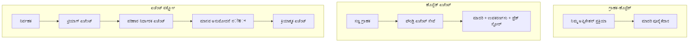
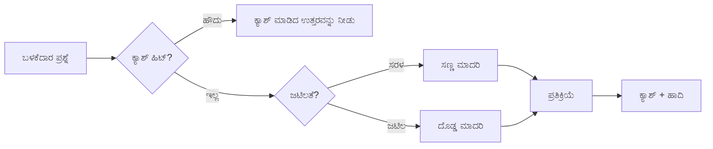
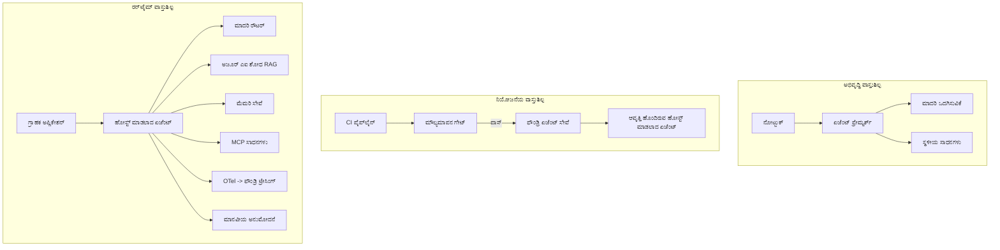

# ಮೈಕ್ರೋಸಾಫ್ಟ್ ಫೌಂಡ್ರಿಯೊಂದಿಗೆ ಮೌಲ್ಯಯುತ ಏಜೆಂಟ್ಗಳನ್ನು ನಿಯೋಜಿಸುವುದು


ಈ ಕೋರ್ಸಿನ ಈ ಹಂತದವರೆಗೆ ನೀವು ನಿಮ್ಮ ಲ್ಯಾಪ್‌ಟಾಪ್‌ನಲ್ಲಿ, ಒಂದು ನೋಟ್‌ಬುಕ್‌ನ ಒಳಗೆ, `az login` ಮತ್ತು ಕೆಲವು ಪರಿಸರ ವೈಶಿಷ್ಟ್ಯಗಳಿಂದ ಚಾಲಿತವಾಗುವ ಏಜೆಂಟ್ಗಳನ್ನು ನಿರ್ಮಿಸಿದ್ದೀರ. ಅದು ಬಿಳಿಯಾದ ರೀತಿಯಲ್ಲಿ ಕಲಿಯಲು ಸರಿಯಾದ ಮಾರ್ಗವಾಗಿದೆ. ಅದು ಶಾಹಿಭಾಗಿಯಾದ 3 ಗಂಟೆಗೆ ಸಾವಿರಾರು ಗ್ರಾಹಕರು ನಂಬುವ ಏಜೆಂಟನ್ನು ಚಲಾಯಿಸುವ ಸರಿಯಾದ ಮಾರ್ಗವಲ್ಲ.

ಈ ಪಾಠವು "ನನ್ನ ಯಂತ್ರದಲ್ಲಿ ಕೆಲಸ ಮಾಡುತ್ತದೆ" ಮತ್ತು "ಉತ್ಪಾದನೆಯಲ್ಲಿ, ನಂಬಿಗಸ್ಥವಾಗಿ ಮತ್ತು ಸರಹದ್ದಾಗಿ ಕೆಲಸ ಮಾಡುತ್ತದೆ" ಎಂಬ ಮಧ್ಯಂತರವನ್ನು ಕುರಿತಾಗಿದೆ. ನಾವು ಆ ಮಧ್ಯಂತರವನ್ನು **ಮೈಕ್ರೋಸಾಫ್ಟ್ ಫೌಂಡ್ರಿ** ಮತ್ತು **ಮೈಕ್ರೋಸಾಫ್ಟ್ ಫೌಂಡ್ರಿ ಏಜೆಂಟ್ ಸೇವೆ** ಬಳಸಿಕೊಂಡು ಮುಚ್ಚುತ್ತೇವೆ ಮತ್ತು ನಾವು ಘಟಕ, ರೀಟ್ರೀವಲ್, ಸ್ಮೃತಿ, ಮೌಲ್ಯಮಾಪನ ಮತ್ತು ಮೇಲ್ವಿಚಾರಣೆ ಇರುವ ನಿಜವಾದ ಗ್ರಾಹಕ ಬೆಂಬಲ ಏಜೆಂಟ್ ಅನ್ನು ನಿರ್ಮಿಸುವ ಮೂಲಕ ಮಾಡುತ್ತೇವೆ.

## ಪರಿಚಯ

ಈ ಪಾಠವು ಈ ಕೆಳಗಿನ ವಿಷಯಗಳನ್ನು ಒಳಗೊಂಡಿದೆ:

- **ಪ್ರೋಟೋಟೈಪ್ ಏಜೆಂಟ್** ಮತ್ತು **ನಿಯೋಜಿತ ಏಜೆಂಟ್** ನಡುವಿನ ವ್ಯತ್ಯಾಸ, ಮತ್ತು ಈ ಬದಲಾವಣೆಯು ಮುಖ್ಯವಾಗಿ ಮಾದರಿಯ ಸುತ್ತಲೂ ಇರುವ ಎಲ್ಲಾ ವಿಚಾರಗಳ ಬಗ್ಗೆ ಏಕೆ ಆಗುತ್ತದೆ ಎಂಬುದು.
- ಏಜೆಂಟ್‌ಗಳ **ನಿಯೋಜನೆ ಮಾದರಿಗಳು**: ಕ್ಲಯಂಟ್-ಹೋಸ್ಟೆಡ್, ಸೇವಾ-ಹೋಸ್ಟೆಡ್ (ಹೋಸ್ಟ್ ಆಗಿರುವ ಏಜೆಂಟ್‌ಗಳು), ಮತ್ತು ವರ್ಕ್‌ಫ್ಲೋ-ಸಂಯೋಜಿತ.
- **ಮೈಕ್ರೋಸಾಫ್ಟ್ ಫೌಂಡ್ರಿಯ ಮೇಲಿನ ಏಜೆಂಟ್ ಜೀವನ ಚಕ್ರ** — ರಚನೆ, ಆವೃತ್ತಿ, ನಿಯೋಜನೆ, ಮೌಲ್ಯಮಾಪನ, ನಿಗಾ, ನಿವೃತ್ತಿ.
- **ಸ್ಕೇಲಿಂಗ್ ತಂತ್ರಗಳು**: ಮಾದರಿ ಮಾರ್ಗದರ್ಶನ, ಕ್ಯಾಶಿಂಗ್, ಜೋಡಣೆ, ಮತ್ತು ಅವ್ಯವಸ್ಥಿತ ವಿನ್ಯಾಸ.
- **ನೋಡಿಕೊಳ್ಳುವಿಕೆ** OpenTelemetry ಮತ್ತು ಫೌಂಡ್ರಿ ಟ್ರೇಸಿಂಗ್‌ಗಳೊಂದಿಗೆ.
- ಮಾದರಿ ಆಯ್ಕೆ, ಮಾರ್ಗದರ್ಶನ ಮತ್ತು ಮೌಲ್ಯಮಾಪನ ಗೇಟ್‌ಗಳ ಮೂಲಕ **ಚಾರ್ಜಿಂಗ್ ಆಪ್ಟಿಮೈಜೆಷನ್**.
- **ಎಂಟರ್‌ಪ್ರೈಸ್ ಪರಿಗಣನೆಗಳು**: ಆಡಳಿತ, ಮಾನವ ಅನುಮೋದನೆ, ಮತ್ತು ಉತ್ಪಾದನೆಯಲ್ಲಿ MCP ಸರ್ವರ್‌ಗಳನ್ನು ಸುರಕ್ಷಿತವಾಗಿ ಓಡಿಸುವುದು.

## ಕಲಿಕೆಯ ಗುರಿಗಳು

ಈ ಪಾಠವನ್ನು ಪೂರ್ಣಗೊಳಿಸಿದ ಬಳಿಕ ನೀವು ತಿಳಿದುಕೊಳ್ಳುತ್ತೀರಿ:

- ನೀಡಲಾದ ಏಜೆಂಟ್ ಕೆಲಸದ ಭಾರಕ್ಕೆ ಸರಿಯಾದ ನಿಯೋಜನೆ ಮಾದರಿಯನ್ನು ಆಯ್ಕೆಮಾಡುವುದು.
- ಏಜೆಂಟ್ ಅನ್ನು ಮೈಕ್ರೋಸಾಫ್ಟ್ ಫೌಂಡ್ರಿ ಏಜೆಂಟ್ ಸೇವೆಗೆ ನಿಯೋಜಿಸುವುದು ಹಾಗು ಅದು ಆವೃತ್ತಿಯಾಗಿದೆ, ಆಡಳಿತಯುಕ್ತವಾಗಿದೆ ಮತ್ತು ನೋಡುವಿಕೆಯಾಗಿದೆ.
- ಏಜೆಂಟ್ ಅನ್ನು ಟ್ರೇಸಿಂಗ್‌ಗಾಗಿ ಸಾಧನಗೊಳಿಸುವುದು ಹಾಗೂ ಪ್ರತಿ ಬಿಡುಗಡೆದ ಮುಂಚಿತವಾಗಿರುವ ಮೌಲ್ಯಮಾಪನ ಪೈಪ್‌ಲೈನ್ ಅನ್ನು ಜೋಡಿಸುವುದು.
- ಮಾದರಿ ಮಾರ್ಗದರ್ಶನ ಮತ್ತು ಕ್ಯಾಶಿಂಗ್ ಅನ್ನು ಅನ್ವಯಿಸುವ ಮೂಲಕ ವಿಳಂಬ ಮತ್ತು ವೆಚ್ಚವನ್ನು ನಿಯಂತ್ರಣದಲ್ಲಿ ಇರಿಸುವುದು.
- ಅಪಾಯವಿರುವ ಕ್ರಿಯೆಗಳಿಗಾಗಿ ಮಾನವ ಅನುಮೋದನಾ ಗೇಟ್ ಸೇರಿಸುವುದು ಮತ್ತು MCP ಸರ್ವರ್ ಅನ್ನು ಉತ್ಪಾದನೆಯಲ್ಲಿ ಸುರಕ್ಷಿತ ರೀತಿಯಲ್ಲಿ ಏರ್ಪಡಿಸುವುದು.

## ಪೂರ್ವಾಪೇಕ್ಷಿತತೆಗಳು

ಈ ಪಾಠವು ಪೂರ್ವದ ಪಾಠಗಳನ್ನು ಪೂರ್ಣಗೊಳಿಸಿರುವುದು ಮತ್ತು ಈ ಕೆಳಗಿನ ವಿಷಯಗಳಲ್ಲಿ ಆರಾಮದಾಯಕವಾಗಿದೆ ಎಂದು ಊಹಿಸುತ್ತದೆ:

- [Microsoft Agent Framework](../14-microsoft-agent-framework/README.md) (ಪಾಠ 14) ಬಳಸಿಕೊಂಡು ಏಜೆಂಟ್‌ಗಳನ್ನು ನಿರ್ಮಿಸುವುದು.
- [ಶ್ರೇಣಿಯ ಉಪಯೋಗ](../04-tool-use/README.md) (ಪಾಠ 4) ಮತ್ತು [Agentic RAG](../05-agentic-rag/README.md) (ಪಾಠ 5).
- [Agent Memory](../13-agent-memory/README.md) (ಪಾಠ 13) ಮತ್ತು [Agentic Protocols / MCP](../11-agentic-protocols/README.md) (ಪಾಠ 11).
- [ನೋಡಿಕೊಳ್ಳುವಿಕೆ ಮತ್ತು ಮೌಲ್ಯಮಾಪನ](../10-ai-agents-production/README.md) (ಪಾಠ 10) — ಈ ಪಾಠ ಇದಕ್ಕೆ ನೇರವಾಗಿ ನಿರ್ಮಾಣವಾಗಿದೆ.

ನಿಮಗೆ ಅಗತ್ಯವಿರುವುದೇಂತೆಂದರೆ:

- ಕನಿಷ್ಠ ಒಂದು ನಿಯೋಜಿಸಿದ ಚಾಟ್ ಮಾದರಿಯೊಂದಿಗೆ **ಏಜೂರ್ ಚಂದಾದಾರಿಕೆ** ಮತ್ತು **ಮೈಕ್ರೋಸಾಫ್ಟ್ ಫೌಂಡ್ರಿ ಯೋಜನೆ**.
- **ಏಜೂರ್ CLI** ಪ್ರಾಮಾಣೀಕೃತವಾಗಿದೆ (`az login`).
- Python 3.12+ ಮತ್ತು ರೆಪೊಸಿಟರಿ [`requirements.txt`](../../../requirements.txt) ನಲ್ಲಿ ಇರುವ ಪ್ಯಾಕೇಜುಗಳು.

## ಪ್ರೋಟೋಟೈಪ್ನಿಂದ ಉತ್ಪಾದನೆಗೆ: ಏನು ಬದಲಾವಣೆಯಾಗುತ್ತದೆ

ಪ್ರೋಟೋಟೈಪ್ ಏಜೆಂಟ್ ಮತ್ತು ಉತ್ಪಾದನಾ ಏಜೆಂಟ್ ಒಂದೇ ಮೂಲ ಲೂಪನ್ನು ಹಂಚಿಕೊಂಡಿವೆ – ವಿವರಣೆ, ಉಪಕರಣಗಳನ್ನು ಕರೆ, ಪ್ರತಿಕ್ರಿಯೆ. ಬದಲಾಯಿಸುವುದು ಆ ಲೂಪ್ ಸುತ್ತಲಿನ ಎಲ್ಲವನ್ನೂ ಆಗಿದೆ. ಉತ್ಪಾದನಾ ಏಜೆಂಟ್‌ನ 20% ಮಾದರಿ ಆಗಿರಬಹುದು; ಬೇರೆ 80% ಕಾರ್ಯಾಚರಣೆüglich ಚಟುವಟಿಕೆಗಳು.

| ವಿಚಾರ | ಪ್ರೋಟೋಟೈಪ್ | ಉತ್ಪಾದನೆ |
| --- | --- | --- |
| **ಹೋಸ್ಟಿಂಗ್** | ನಿಮ್ಮ ನೋಟ್‌ಬುಕ್‌ನಲ್ಲಿ ಓಡುತ್ತದೆ | ವರ್ಸನಾದ, ಹೋಸ್ಟೆಡ್ ಸೇವೆಯಾಗಿ ಓಡುತ್ತದೆ |
| **ಪರಿಚಯ** | ನಿಮ್ಮ`az	login` ಟೋಕನ್ | ಸಾದೃಶ್ಯಿತ ಗುರುತಿನೊಂದಿಗೆ ನಿರ್ವಹಿತ ಗುರುತು |
| **ಅವಸ್ತಿ** | ಇನ್‌ಮೆಮೊರಿ, ಮರುಪ್ರಾರಂಭದಲ್ಲಿ ಕಳೆದುಹೋಗುತ್ತದೆ | ಹೊರಗಿನ (ಥ್ರೆಡ್ ಸ್ಟೋರ್, ಮೆಮೊರಿ ಸೇವೆ) |
| **ವಿಫಲತೆ** | ನೀವು ಸರಿಯಾದ ತಪ್ಪುವನ್ನು ಕಾಣುತ್ತೀರಿ | ಪುನಃಪ್ರಯತ್ನಗಳು, ಬ್ಯಾಕ್‌ಅಪ್, ಡೆಡ್-ಲೇಟರ್, ಎಚ್ಚರಿಕೆಗಳು |
| **ವೆಚ್ಚ** | "ಇದು ಕೆಲವು ಸೆಂಟುಗಳು" | elke vinayangalaya, ನಿಖರವಾಗಿ ಸರಿಯಾದ ವಿನಂತಿಗೆ ಅನುಗುಣವಾಗಿ ಮಾರ್ಗದರ್ಶನ, ಕ್ಯಾಶ್ಗಾಗಿ ಬಜೆಟ್ ಮಾಡಲಾಗಿದೆ |
| **ಗುಣಮಟ್ಟ** | ನೀವು ಅದನ್ನು ಕಣ್ಣಿಟ್ಟು ನೋಡುತ್ತೀರಿ | ಪ್ರತಿಯೊಂದು ಬಿಡುಗಡೆಗೂ ಮುಂಚಿತವಾಗಿ ಸ್ವಚ್ಛಂದವಾಗಿ ಮೌಲ್ಯಮಾಪನ |
| **ನಂಬಿಕೆ** | ನೀವು ಪ್ರತಿಯೊಂದು ಕ್ರಿಯೆಯನ್ನು ಅನುಮೋದಿಸುತ್ತೀರಿ | ನೀತಿವಿಧಿ + ಅಪಾಯದಿರುವ ಕ್ರಿಯೆಗಳಿಗಾಗಿ ಮಾನವರ ಸಂಪರ್ಕದಲ್ಲಿರುವ ವ್ಯವಸ್ಥೆ |

ಈ ಟೇಬಲ್ ನೆನಪಿಸಿಕೊಳ್ಳಿ. ಕೆಳಗಿನ ಪ್ರತಿಯೊಂದು ವಿಭಾಗವು ಈ ಸಾಲುಗಳಲ್ಲಿ ಒಂದಿಗೆ ನಕ್ಷೇಧ ಆಗಿದೆ.

## ಏಜೆಂಟ್ ನಿಯೋಜನೆ ಮಾದರಿಗಳು

ನೀವು ಬಳಸಲಿರುವ ಮೂರು ಮಾದರಿಗಳಿವೆ, ಬಹುತೆಕ ಸಂಯೋಜನೆಯಲ್ಲಿಯೂ.

### 1. ಕ್ಲಿಯಂಟ್-ಹೋಸ್ಟೆಡ್ ಏಜೆಂಟ್‌ಗಳು

ಏಜೆಂಟ್ ವಸ್ತು ನಿಮ್ಮ ಅಪ್ಲಿಕೇಶನ್ ಪ್ರಕ್ರಿಯೆಯ ಒಳಗೆ ಇರಲಿದೆ. ನಿಮ್ಮ ಕೋಡ್ ನೇರವಾಗಿ ಮಾದರಿ ಒದಗಿಸುವವನು ಕರೆಸುತ್ತದೆ; ತರ್ಕ ಲೂಪ್ ನಿಮ್ಮ ಸೇವೆಯಲ್ಲಿ ಓಡುತ್ತದೆ. ಇದು ಹಳೆಯ ಪಾಠಗಳನ್ನು ಮಾಡಿಕೊಂಡು ಮಾಡಿದದ್ದು.

- **ಒಂದು ಬಗೆಯಲ್ಲಿ ಬಳಕೆಮಾಡಿ** ಲೂಪಿನ ಮೇಲೆ ಸಂಪೂರ್ಣ ನಿಯಂತ್ರಣ, ಕಸ್ಟಮ್ ಮಿಡ್ಲ್ವೇರ್ ಬೇಕಾದಾಗ ಅಥವಾ ನೀವು ಏಜೆಂಟ್ ಅನ್ನು ಇರುತ್ತಿರೋ ಬ್ಯಾಕೆಂಡ್‌ಗೆ ಒಳಗಾಗಿಸಬೇಕು.
- **ನಷ್ಟ**: ನೀವು ಸ್ವಂತವಾಗಿ ಸ್ಕೇಲಾಗ, ಸ್ಥಿತಿ ಮತ್ತು ಪ್ರತಿರೋಧಕತೆಯನ್ನು ಹೊಂದಿಕೊಳ್ಳಬೇಕು.

### 2. ಹೋಸ್ಟೆಡ್ ಏಜೆಂಟ್‌ಗಳು (ಫೌಂಡ್ರಿ ಏಜೆಂಟ್ ಸೇವೆ)

ಏಜೆಂಟ್ ಅನ್ನು ಮೈಕ್ರೋಸಾಫ್ಟ್ ಫೌಂಡ್ರಿಯಲ್ಲೋ ಒಂದು ಸಂಪನ್ಮೂಲವಾಗಿ *ನೂದಿಸಲಾಗಿದೆ*. ಫೌಂಡ್ರಿ ತರ್ಕ ಲೂಪ್ ಅನ್ನು ಹೋಸ್ಟ್ ಮಾಡುತ್ತದೆ, ಥ್ರೆಡ್ಗಳನ್ನು ಸಂಗ್ರಹಿಸುತ್ತದೆ, ವಿಷಯ ಸುರಕ್ಷತೆ ಮತ್ತು RBAC ಅನ್ನು ಜಾರಿ ಮಾಡುತ್ತದೆ, ಮತ್ತು ಏಜೆಂಟ್ ಅನ್ನು ಫೌಂಡ್ರಿ ಪೋರ್‌ಟಲ್‌ನಲ್ಲಿ ದೃಶ್ಯಮಾಡುತ್ತದೆ. ನಿಮ್ಮ ಅಪ್ಲಿಕೇಶನ್ ಒಂದು ಸಣ್ಣ ಕ್ಲಿಯಂಟ್ ಆಗಿ ಥ್ರೆಡ್‌ಗಳನ್ನು ನಿರ್ಮಿಸಿ ಪ್ರತಿಕ್ರಿಯೆಗಳನ್ನು ಓದುವದಾಗುತ್ತದೆ.

- **ಒಂದು ಬಗೆಯಲ್ಲಿ ಬಳಕೆಮಾಡಿ** ನೀವು ದೀರ್ಘಕಾಲಿಕತೆ, ಒಳಗೊಂಡಿರುವ ನೋಡುವಿಕೆ, ಆಡಳಿತ ಮತ್ತು ಕಡಿಮೆ ಕಾರ್ಯಾಚರಣೆ ವಿಸ್ತೀರ್ಣ ಬಯಸಿದಾಗ.
- **ನಷ್ಟ**: ನಿರ್ವಹಿತ ರನ್‌ಟೈಮ್ ಪಡೆದ ಸಮಸ್ಯೆಗೆ ಕಡಿಮೆ ನಿಯಂತ್ರಣ.

### 3. ಏಜೆಂಟ್ ವರ್ಕ್‌ಫ್ಲೋಗಳು

ಹಲವಾರು ಏಜೆಂಟ್‌ಗಳು (ಮತ್ತು ಉಪಕರಣಗಳು) ಸ್ಪಷ್ಟ ನಿಯಂತ್ರಣ ಹರಿವಿನೊಂದಿಗೆ — ಕ್ರಮವಾರು ಹಂತಗಳು, ಶಾಖೆಗಳ, ಮಾನವ ಅನುಮೋದನೆಗಳ, ಮತ್ತು ಸ್ಥಿರ_checkpoint ಗಳನ್ನು ಹೊಂದಿಸಿ ಸಂಯೋಜಿಸಲ್ಪಟ್ಟಿವೆ. ಇದು ಮೈಕ್ರೋಸಾಫ್ಟ್ ಏಜೆಂಟ್ ಫ್ರೇಮಿwk **ವರ್ಕ್‌ಫ್ಲೋಗಳು** ಸಾಮರ್ಥ್ಯವನ್ನು ನಿಯೋಜನೆ ತರಕ್ಕಿಗೆ ಅನ್ವಯಿಸಲಾಗಿದೆ.

- **ಒಂದು ಬಗೆಯಲ್ಲಿ ಬಳಕೆಮಾಡಿ** ಒಂದು ಕಾರ್ಯವು ವಿಭಿನ್ನ ವಿಶೇಷ ಏಜೆಂಟ್‌ಗಳನ್ನ ಒಳಗೊಂಡಿದ್ದಾಗ ಅಥವಾ ನಡುವೆ ಅನುಮೋದನಾ ಹಂತ ಬೇಕಾದಾಗ.
- **ನಷ್ಟ**: ಹೆಚ್ಚು ಚಲಿಸುವ ಭಾಗಗಳು; ಸಂಯೋಜನೆ ಮಟ್ಟ ನೋಡುವಿಕೆ ಬೇಕು.



## ಮೈಕ್ರೋಸಾಫ್ಟ್ ಫೌಂಡ್ರಿಯಲ್ಲಿ ಏಜೆಂಟ್ ಜೀವನ ಚಕ್ರ 

ಏಜೆಂಟ್ ನಿಯೋಜನೆ ಒಂದು ಒಮ್ಮೆ ನಡೆಯುವ `push` ಅಲ್ಲ. ಇದು ಒಂದು ಲೂಪ್ ಮತ್ತು ಅದು ಸಾಫ್ಟ್‌ವೇರ್ ಬಿಡುಗಡೆ ಚಕ್ರದಂತೆ ಕಾಣುತ್ತದೆ ಏಕೆಂದರೆ ಅದು ನಿಜವಾಗಿಯೂ ಅದೇ.

```mermaid
flowchart LR
    Create[ರಚನೆ / ರಚಯಿತೃ] --> Version[ಆವೃತ್ತಿ]
    Version --> Evaluate[ಅಪ್ಲೈನ್‌ನಲ್ಲಿ ಮೌಲ್ಯಮಾಪನ ಮಾಡಿ]
    Evaluate -->|ಗೇಟ್‌ಗೆ ಪಾಸಾಗುತ್ತದೆ| Deploy[ಆಹುತಿ ಮಾಡು (ಡಿಪ್ಲಾಯ್)]
    Evaluate -->|ಗೇಟ್‌ಗೆ ಎತ್ತಿಲేదు| Create
    Deploy --> Observe[ಆನ್‌ಲೈನ್‌ನಲ್ಲಿ ಗಮನಿಸಿ]
    Observe --> Improve[ವೈಫಲ್ಯಗಳನ್ನು ಸಂಗ್ರಹಿಸಿ]
    Improve --> Create
    Deploy --> Retire[ಹಳೆಯ ಆವೃತ್ತಿಯನ್ನು ನಿವೃತ್ತಿಗೊಳಿಸಿ]
```

[ಪಾಠ 10](../10-ai-agents-production/README.md) ರಿಂದ ಬಂದ ಮುಖ್ಯ ಕಲ್ಪನೆ: **ಅನ್‌ಲೈನ್ ಮೌಲ್ಯಮಾಪನ ಗೇಟ್ ಆಗಿದೆ, ನಂತರದ ವಿಚಾರವಲ್ಲ.** ಹೊಸ ಏಜೆಂಟ್ ಆವೃತ್ತಿ ನಿಮ್ಮ ಮೌಲ್ಯಮಾಪನ ಗಡಿಗಳನ್ನು ಪೂರೈಸದಿದ್ದರೆ ಸಾಗದು. ಆನ್‌ಲೈನ್ ನೋಡುವಿಕೆ ನಂತರ ನಿಜವಾದ دنيا ತಪ್ಪುಗಳನ್ನು ನಿಮ್ಮ ಅನ್‌ಲೈನ್ ಪರೀಕ್ಷಾ ಸೆಟ್‌ಗೆ ತಿರುಗಿಸಿ ನೀಡುತ್ತದೆ. ಅದು ಸಂಪೂರ್ಣ ಲೂಪ್.

## ಸ್ಕೇಲಿಂಗ್ ತಂತ್ರಗಳು

ಏಜೆಂಟ್ ಸ್ಕೇಲಿಂಗ್ ಸ್ಟೇಟ್‌ಲೆಸ್ ವೆಬ್ API ಸ್ಕೇಲಿಂಗ್‌ನಿಂದ ಭಿನ್ನವಾಗಿದೆ, ಏಕೆಂದರೆ ಪ್ರತಿ ವಿನಂತಿ ಹಲವಾರು ಖರ್ಚು ಮಾಡಬಹುದಾದ ಮಾದರಿ ಮತ್ತು ಉಪಕರಣ ಕರೆಗಳನ್ನು ಹುಟ್ಟಿಸಬಹುದು. ನಾಲ್ಕು ತಂತ್ರಗಳು ಹೆಚ್ಚು ಹೊತ್ತು ಸಾಗಿಸುವವು:

**ಅವಸ್ಥಿ ರಹಿತ ವಿನಂತಿ ನಿರ್ವಹಣೆ.** ನಿಮ್ಮ ಪ್ರಕ್ರಿಯಾ ಮೆಮೊರಿಯಲ್ಲಿ ಪ್ರತಿ ಬಳಕೆದಾರ ಸ್ಥಿತಿಯನ್ನು ಇರಿಸಿಬೇಕಾಗಿಲ್ಲ. ಸಂಭಾಷಣೆ ಥ್ರೆಡ್‌ಗಳನ್ನು ಫೌಂಡ್ರಿ ಥ್ರೆಡ್ ಸ್ಟೋರ್ ಅಥವಾ ಮೆಮೊರಿ ಸೇವೆಯಲ್ಲಿ ಉಳಿಸಿ ಯಾವುದಾದರೂ ಉದಾಹರಣೆ ಯಾವುದಾದರೂ ವಿನಂತಿಯನ್ನು ನಿಭಾಯಿಸಬಹುದು. ಇದು ನಿಮಗೆ ಸಮಾಂತರವಾಗಿ ಸ್ಕೇಲಿಂಗ್ ಮಾಡಲು ಅವಕಾಶ ನೀಡುತ್ತದೆ — ಉದಾಹರಣೆಗಳಿಗೆ ಸೇರಿಸಿ, ಯಾವುದೇ ಸ್ಟಿಕ್ಕಿ ಸೆಷನ್ ಇಲ್ಲ.

**ಮಾದರಿ ಮಾರ್ಗದರ್ಶನ.** ಪ್ರತಿ ವಿನಂತಿಗೆ ನಿಮ್ಮ ಅತ್ಯಂತ ಸಮರ್ಥ (ಮತ್ತು ಅತಿಭಾರಿಯಾದ) ಮಾದರಿ ಅಗತ್ಯವಿಲ್ಲ. ಸರಳ ವಿನಂತಿಗಳನ್ನು – ಉದ್ದೇಶ ವರ್ಗೀಕರಣ, ಚಿಕ್ಕFACTUAL ಉತ್ತರಗಳು – ಚಿಕ್ಕ, ವೇಗವಾದ ಮಾದರಿಗಳಿಗೆ ಮಾರ್ಗದರ್ಶಿಸಿ, ಮತ್ತು ದೊಡ್ಡ ಮಾದರಿಯನ್ನು ನಿಜವಾದ ವಿವರಣೆಗೆ ಕಾಯ್ದಿರಿಸಿ. ಫೌಂಡ್ರಿಯ **ಮಾದರಿ ರೌಟರ್** ಇದನ್ನು ನಿಮ್ಮ ಪರವಾಗಿ ಮಾಡಬಹುದು, ಅಥವಾ ನೀವು ಸ್ವಂತವಾಗಿಯೂ ಹಗುರವಾದ ವರ್ಗೀಕರಣ ಯಂತ್ರವನ್ನು ನಿರ್ಮಿಸಬಹುದು. ನೀವು ಪ್ರಯೋಗಾಗಾರದಲ್ಲಿ DIY ಆವೃತ್ತಿ ನಿರ್ಮಿಸಬಹುದು.

**ಪ್ರತಿಕ್ರಿಯೆ ಕ್ಯಾಶಿಂಗ್.** ಅನೇಕ ಬೆಂಬಲ ಕ್ವೆರಿಗಳು ಸಮೀಪದ ಪ್ರತಿಯಾಗಿ ("ನನಗೆ ಪಾಸ್ವರ್ಡ್ ಅನ್ನು ಹೇಗೆ ಮರುಸೆಟ್ಟ್ ಮಾಡಬೇಕು?"). ಸಾಮಾನ್ಯ ಪ್ರಶ್ನೆಗಳ ಉತ್ತರಗಳನ್ನು ಕ್ಯಾಶ್ನಲ್ಲಿ ಇಟ್ಟುಕೊಳ್ಳಿ ಮತ್ತು ಮಾದರಿಯನ್ನು ತಟ್ಟದೆ ಒದಗಿಸಿ. ಒಂದು ಸರಾಸರಿ ಕ್ಯಾಶ್ ಹಿಟ್ ದರವೆಂದರೆ ವೆಚ್ಚ ಮತ್ತು ವಿಳಂಬವನ್ನು ಅರ್ಥಪೂರ್ಣವಾಗಿ ಕಡಿಮೆ ಮಾಡುತ್ತದೆ.

**ಸಮ್ಮಿಲನ ಮತ್ತು ಬ್ಯಾಕ್‌ಪ್ರೆಶರ್.** ಮಾದರಿ ಒದಗಿಸುವವರು ದರ ಮಿತಿಗಳನ್ನು ಹೊಂದಿದ್ದಾರೆ. ನಿಮ್ಮ ಸಮ್ಮಿಲನವನ್ನು ಮಿತಿಗೊಳಿಸಿ, ಪ್ರತ್ಯೇಕ ಪ್ರಯತ್ನಗಳನ್ನುಪರಿಪಕ್ವ ಹಿಂತೆಗೆದುಕೊಳ್ಳುವಿಕೆಯೊಂದಿಗೆ ಬಳಸಿ ಮತ್ತು ನಿಧಾನವಾಗಿ ವಿಫಲವಿರಿ (ಪಂಕ್ತಿಕೃತ "ನಾವು ಅದರ ಮೇಲೆ ಕೆಲಸ ಮಾಡುತ್ತಿದ್ದೇವೆ" ಪ್ರತಿಕ್ರಿಯೆ 500 ಅನ್ನು ಹೆಚ್ಚು).



## ಉತ್ಪಾದನೆಯಲ್ಲಿ ನೋಡುವಿಕೆ

ನೀವು ನೋಡದಿದ್ದರೆ ನಿರ್ವಹಿಸಲು ಸಾಧ್ಯವಿಲ್ಲ. ಪಾಠ 10 ರಲ್ಲಿ ವಿವರಿಸಲಾಗಿರುವಂತೆ, ಮೈಕ್ರೋಸಾಫ್ಟ್ ಏಜೆಂಟ್ ಫ್ರೇಮ್ವರ್ಕ್ ಸ್ವಾಭಾವಿಕವಾಗಿ **OpenTelemetry** ಟ್ರೇಸ್‌ಗಳನ್ನು ಹೊರತೆಗೆಯುತ್ತದೆ — ಪ್ರತಿ ಮಾದರಿ ಕರೆ, ಉಪಕರಣ ವಿನಂತಿ, ಮತ್ತು ಸಂಯೋಜನೆ ಹಂತವು ಒಂದು ಸ್ಪಾನ್ ಆಗುತ್ತದೆ. ಉತ್ಪಾದನೆಯಲ್ಲಿ ನೀವು ಆ ಸ್ಪಾನ್‌ಗಳನ್ನು ಮೈಕ್ರೋಸಾಫ್ಟ್ ಫೌಂಡ್ರಿಗೆ (ಅಥವಾ ಯಾವುದೇ OTel-ಸಂಗತ ಬ್ಯಾಕ್‌ಎಂಡ್‌ಗೆ) ರಫ್ತು ಮಾಡುತ್ತೀರಿ ಅಂದರೆ ನೀವು:

- ಒಂದೇ ಗ್ರಾಹಕ ದೂರು ಅನ್ನು ಪ್ರತಿ ಮಾದರಿ ಮತ್ತು ಉಪಕರಣ ಕರೆಗೂ ಮುಂತಾದಂತೆ ಅಂತ್ಯದಂಡಾಮಾಡಿ ಅನ್ವೇಷಿಸಬಹುದು.
- ಸಮಯದೊಂದಿಗೆ p50/p95 ವಿಳಂಬ ಮತ್ತು ಪ್ರತಿವಿನಂತಿಗೆ ವೆಚ್ಚವನ್ನು ನೋಡಿ.
- ನಿಮ್ಮ ಬಳಕೆದಾರರು (ಅಥವಾ ನಿಮ್ಮ ಹಣಕಾಸು ತಂಡ) ಗಮನಿಸುವ ಮೊದಲು ದೋಷ ದರ ಏರಿಕೆಗಳು ಮತ್ತು ವೆಚ್ಚ ಅನೋಮಾಲಿಗಳನ್ನು ಎಚ್ಚರಿಸಬಹುದು.

```python
from agent_framework.observability import get_tracer

tracer = get_tracer()

with tracer.start_as_current_span("support_request") as span:
    span.set_attribute("customer.tier", "enterprise")
    span.set_attribute("routed.model", "gpt-5-nano")
    # ಏಜೆಂಟ್ ನ ಕಾರ್ಯಾಚರಣೆ ಈ ವಿಸ್ತೀರ್ಣದೊಳಗೆ ಸ್ವಯಂಚಾಲಿತವಾಗಿ ಟ್ರೇಸ್ ಮಾಡಲ್ಪಡುತ್ತದೆ
```

`customer.tier` ಮತ್ತು `routed.model` ಎಂಬ ಲಕ್ಷಣಗಳು ಆಗಾಗ್ಗೆ ಟ್ರೇಸ್‌ಗಳ ಗೋಡೆಗೆ ಉತ್ತರಿಸಬಹುದಾದ ಪ್ರಶ್ನೆಗಳನ್ನು ಕೊಡುವವು ("ಎಂಟರ್‌ಪ್ರೈಸ್ ಗ್ರಾಹಕರು ಚಿಕ್ಕ ಮಾದರಿಗೂ ಹೆಚ್ಚಾಗಿ ಮಾರ್ಗದರ್ಶಿತವಾಗುತ್ತಿವೆಯೇ?").

## ವೆಚ್ಚ ಆಪ್ಟಿಮೈಜೆಷನ್

ಉತ್ಪಾದನಾ ಏಜೆಂಟ್‌ಗಳ ವೆಚ್ಚಕ್ಕೆ ಟೋಕನ್ಗಳು ಮುಖ್ಯ ಕಾರಣ. ಪರಿಣಾಮದ ಕ್ರಮದಲ್ಲಿ ಮೂರು ಹಿಡಿತಗಳು:

1. **ಮಾದರಿಯನ್ನ ಸರಿಯಾದ ಗಾತ್ರಕ್ಕೆ ತರಿರಿ.** ನಿಮ್ಮ ಮೌಲ್ಯಮಾಪನ ಗೇಟ್ ಪಾಸಾದ ಚಿಕ್ಕ ಮಾದರಿ ಅನೇಕ ಬಾರಿ ದೊಡ್ಡದಿಗಿಂತ ಕಡಿಮೆ ವೆಚ್ಚ ಹೆಚ್ಚು. ಹೆಚ್ಚು ವಿಮರ್ಶೆಯಿಂದ ದೊಡ್ಡದಿಗೆ ಬಂದಾಗ, ಚಿಕ್ಕ ಮಾದರಿ ಸಾಕಾಗುತ್ತದೆ ಎಂಬುದನ್ನು ಪರೀಕ್ಷಾ ಮೂಲಕ ಪ್ರಭವಪಟ್ಟಿ ಮಾಡಿ.
2. **ಸಂಕೀರ್ಣತೆಯ ಆಧಾರದ ಮೇಲೆ ಮಾರ್ಗದರ್ಶಿಸಿ.** ಮೇಲಿನಂತೆ — ದೊಡ್ಡ ಮಾದರಿಯ ಬಾಕಿ ಬೆಲೆಗೆ ಮಾತ್ರ ದೊಡ್ಡ ಮಾದರಿಯ ಉದ್ದೇಶಕ್ಕೂ ಬೇಕಾದ ವಿನಂತಿಗಳಿಗೆ ಮಾತ್ರ ಪಾವತಿಸಿ.
3. **ತೀವ್ರ ಕ್ಯಾಶಿಂಗ್.** ಕಡಿಮೆ ವೆಚ್ಚದ ಮಾದರಿ ಕರೆ ಎಂದರೆ ನೀವು ಎಂದಿಗೂ ಮಾಡದ ಕರೆ.

ಮೌಲ್ಯಮಾಪನ ಗೇಟ್‌ಗಳು ಮತ್ತು ವೆಚ್ಚ ನಿಯಂತ್ರಣವು ಎರಡು ಭಾಗಗಳಿಂದ ಇರುವ ಹಾಗೆಯೇ ಇದೆ: ಮೌಲ್ಯಮಾಪನ ನಿಮಗೆ *ಗುಣಮಟ್ಟದ ನೆಲವನ್ನು* ಹೇಳುತ್ತದೆ, ಮಾರ್ಗದರ್ಶನ ಮತ್ತು ಕ್ಯಾಶಿಂಗ್ ನಿಮ್ಮನ್ನು ಆ ನೆಲದ *ವೆಚ್ಚಕ್ಕೆ* ಅತ್ಯಂತ ಹತ್ತಿರವನ್ನಾಗಿ ಇಡುವುದಕ್ಕೆ ಸಹಾಯಕ.

## ಎಂಟರ್‌ಪ್ರೈಸ್ ನಿಯೋಜನೆ ಪರಿಗಣನೆಗಳು

**ಆಡಳಿತ.** ಹೋಸ್ಟೆಡ್ ಏಜೆಂಟ್‌ಗಳು ಫೌಂಡ್ರಿಯ RBAC, ವಿಷಯ ಸುರಕ್ಷತೆ, ಮತ್ತು ಸಾಲಿನ ದಾಖಲೆಗಳನ್ನು ಕಂಡುಕೊಳ್ಳುತ್ತವೆ. ಪ್ರತಿ ಏಜೆಂಟ್‌ಗೆ ಅಗತ್ಯವಿರುವ ಕನಿಷ್ಠ ಹಕ್ಕುಗಳೊಂದಿಗೆ ನಿರ್ವಹಿತ ಗುರುತು ನೀಡಿ — ಜ್ಞಾನ ಆಧಾರದ อ่าน-ಒಗ್ಗರಿಸುವ ಪ್ರವೇಶ, ಟಿಕೆಟ್ API ಗೆ ಸೀಮಿತ ಪ್ರವೇಶ, ಇನ್ನಿಲ್ಲ.

**ಮಾನವ-ನಿಯಂತ್ರಿತ.** ಕೆಲವು ಕ್ರಿಯೆಗಳು ನನಗೆನ್ನ ಹಾಯ್ದುದು ಬಹುಪರಿಣಾಮಕಾರಿ — ಹಣದ ಹಿಂತಿರುಗಿಸುವಿಕೆ, ಖಾತೆಯನ್ನು ಅಳಿಸುವುದು, ಕಾನೂನಿನ ತಂಡಕ್ಕೆ ವೃದ್ಧಿಸುವುದು. ಮೈಕ್ರೋಸಾಫ್ಟ್ ಏಜೆಂಟ್ ಫ್ರೇಮ್ವರ್ಕ್ **ಅನುಮೋದನೆ-ಅಗತ್ಯವಿರುವ** ಸಾಧನಗಳನ್ನು ಬೆಂಬಲಿಸುತ್ತದೆ: ಏಜೆಂಟ್ ಕ್ರಿಯೆಯನ್ನು ಸೂಚಿಸುತ್ತದೆ, ಕಾರ್ಯ ನಿರ್ವಹಣೆ ನಿಲ್ಲುತ್ತದೆ, ಮಾನವನು ಅನುಮೋದನೆ ಅಥವಾ ನಿರಾಕರಣೆಯನ್ನು ನೀಡುತ್ತಾನೆ, ಮತ್ತು ವರ್ಕ್‌ಫ್ಲೋ ಮುಂದುವರೆಯುತ್ತದೆ. ನೀವು [ಪಾಠ 6](../06-building-trustworthy-agents/README.md) ನಲ್ಲಿ ಮೂಲಭೂತವನ್ನು ನೋಡಿದ್ದಿರಿ; ಇಲ್ಲಿ ನೀವು ಅದನ್ನು ನಿಯೋಜಿಸುತ್ತೀರಿ.

**ಉತ್ಪಾದನೆಯಲ್ಲಿ MCP.** [MCP](../11-agentic-protocols/README.md) ನಿಮ್ಮ ಏಜೆಂಟ್ ಅನ್ನು ಹೊರಗಿನ ಉಪಕರಣಗಳನ್ನು ಸ್ಟ್ಯಾಂಡರ್ಡ್ ಇಂಟರ್ಫೇಸ್ ಮೂಲಕ ಬಳಕೆಮಾಡಲು ಬಿಡುತ್ತದೆ. ಉತ್ಪಾದನೆಯಲ್ಲಿ, ಪ್ರತಿಯೊಂದು MCP ಸರ್ವರ್ ಅನ್ನು ಅಪರಿಚಿತ ಗಡಿಯನ್ನುಂದು ಪರಿಗಣಿಸಿ: ಸರ್ವರ್ ಆವೃತ್ತಿಯನ್ನು ನಿಶ್ಚಿತಗೊಳಿಸಿ, ಅದನ್ನು ಸೀಮಿತ ಗುರುತಿನೊಂದಿಗೆ ಓಡಿಸಿ, ಅದ್ಹಿಂದಾಗುವ ಪರಿಣಾಮಗಳನ್ನು ಪರಿಶೀಲಿಸಿ ಮತ್ತು ಅಂತರಾಳದ ಮಾಹಿತಿಯನ್ನು ಎಂದಿಗೂ ಬಹಿರಂಗಪಡಿಸಕೂಡದು. MCP ಸರ್ವರ್ ಅವಲಂಬನೆ ಮತ್ತು ಅವಲಂಬನೆಗಳು ಪ್ಯಾಚ್, ತಪಾಸಣೆ ಮತ್ತು ದರ-ನಿಯಂತ್ರಣ ಹೊಂದಿವೆ.



ಆ ಮೂರು ರೂಪರೇಖೆಗಳು — ಅಭಿವೃದ್ಧಿ, ನಿಯೋಜನೆ, ರನ್‌ಟೈಮ್ — ಒಂದೇ ಏಜೆಂಟ್ ತನ್ನ ಜೀವನದ ಮೂರು ಹಂತಗಳಲ್ಲಿ. ಮುಂದಿನ ಪ್ರಯೋಗಶಾಲೆ ಅದನ್ನು ನಿರ್ಮಿಸುವುದು ಹೇಗೆ ಎಂಬುದನ್ನು ಹೇಗೆಂದರಿಸುತ್ತದೆ.

## ಕೈಯಲ್ಲಿ ಪಾಠ: ಉತ್ಪಾದನೆಗೆ ಸಿದ್ದವಾದ ಗ್ರಾಹಕ ಬೆಂಬಲ ಏಜೆಂಟ್

[`code_samples/16-python-agent-framework.ipynb`](./code_samples/16-python-agent-framework.ipynb) ಅನ್ನು ತೆರೆಯಿರಿ ಮತ್ತು ಆನಂತರ ಅದನ್ನು ಸಂಪೂರ್ಣವಾಗಿ ಗುರುತು ಮಾಡಿ. ನೀವು **ಕಂಟೊಸೊ ಗ್ರಾಹಕ ಬೆಂಬಲ ಏಜೆಂಟ್** ಅನ್ನು ಎಲ್ಲಾ ಉತ್ಪಾದನಾ ಇಚ್ಛೆಗಳನ್ನು ಒಳಗೊಂಡಂತೆ ಸಂಘಟಿಸುತ್ತೀರಿ:

1. **ಉಪಕರಣ ಕರೆಗೆ** — ಆದೇಶ ಸ್ಥಿತಿ ಪರಿಶೀಲನೆ ಮತ್ತು ಬೆಂಬಲ ಟಿಕೆಟ್ ತೆರೆಯುವುದು.
2. **RAG** — ಜ್ಞಾನಾಧಾರದಿಂದ ನೀತಿ ಪ್ರಶ್ನೆಗಳಿಗೆ ಉತ್ತರ ಮಾಡುವುದು (ಏಜೂರ್ AI ಹುಡುಕಾಟ, in-memory ಬ್ಯಾಕ್ಅಪ್ ಹೊಂದಿರುವ ನೋಟ್ಬುಕ್ ಹುಡುಕಾಟ ಸಂಪನ್ಮೂಲವಿಲ್ಲದೆ ಓಡುತ್ತದೆ).
3. **ಸ್ಮೃತಿ** — ಸಂಭಾಷಣೆಯ ತಿರುವುಗಳಿಗೆ ಗ್ರಾಹಕನನ್ನು ನೆನಪಿಸಿಕೊಳ್ಳುವುದು.
4. **ಮಾದರಿ ಮಾರ್ಗದರ್ಶನ** — ಒಂದು ಸಂಕೀರ್ಣತೆಯ ವರ್ಗೀಕರಣ ಯಂತ್ರ ಪ್ರತಿ ವಿನಂತಿಯನ್ನು ಚಿಕ್ಕ ಅಥವಾ ದೊಡ್ಡ ಮಾದರಿಗೆ ಮಾರ್ಗದರ್ಶಿಸುತ್ತದೆ.
5. **ಪ್ರತಿಕ್ರಿಯೆ ಕ್ಯಾಶಿಂಗ್** — ಪುನರಾವರ್ತಿತ ಪ್ರಶ್ನೆಗಳನ್ನು ಕ್ಯಾಶೆಯಿಂದ ಒದಗಿಸಲಾಗುತ್ತದೆ.
6. **ಮಾನವ ಅನುಮೋದನೆ** — ಒಬ್ಬ ಮಾನವನ ಸಹಿ ಹೊಂದುವವರೆಗೆ ನಿರ್ದಿಷ್ಟ ಮಿತಿಯನ್ನು ಮೀರುವ ಮರುಪಾವತಿ ನಿಲ್ಲಿಸುತ್ತದೆ.
7. **ಮೌಲ್ಯಮಾಪನ ಪೈಪ್‌ಲೈನ್** — ಚಿಕ್ಕ ಅನ್‌ಲೈನ್ ಪರೀಕ್ಷಾ ಸೆಟ್ ಏಜೆಂಟ್ ಅನ್ನು ಅಂಕಗಳನ್ನು ನೀಡುತ್ತದೆ ಮತ್ತು ಬಿಡುಗಡೆ ಗೇಟ್ ಆಗಿ ಕಾರ್ಯನಿರ್ವಹಿಸುತ್ತದೆ.
8. **ನೋಡುವಿಕೆ** — ಪ್ರತಿ ವಿನಂತಿಯ ಸುತ್ತಲೂ OpenTelemetry ಟ್ರೇಸಿಂಗ್.

### ಪ್ರಗತಿವಿಧಾನ

ನೋಟ್ಭುಕ್ ಸ್ವತಂತ್ರ, ಓಡಬಹುದಾದ ವಿಭಾಗಗಳಾಗಿ ಪ್ರತಿ ಉತ್ಪಾದನಾ ಇಚ್ಛೆಯನ್ನು ಸಂಘಟಿಸಿದೆ. ಅದರ ಹೃದಯಭಾಗ.routing-ಹಾಗೂ-ಕ್ಯಾಶಿಂಗ್ ವಿನಂತಿ ನಿರ್ವಹಣೆ:

```python
async def handle_support_request(query: str, customer_id: str) -> str:
    # 1. ಸಾಧ್ಯವಾದರೆ ಕ್ಯಾಶೆದಿಂದ ಸೇವೆ ನೀಡಿರಿ.
    cached = response_cache.get(normalize(query))
    if cached:
        return cached

    # 2. ವೆಚ್ಚ ನಿಯಂತ್ರಣಕ್ಕಾಗಿ ಸಂಕೀರ್ಣತೆಯ ಮೂಲಕ ಮಾರ್ಗ ನಿಗದಿಮಾಡಿ.
    model = "gpt-5-nano" if is_simple(query) else "gpt-5-mini"

    # 3. ಗಮನಾರ್ಹತೆಗಾಗಿ ಏಜೆಂಟ್ ಅನ್ನು ಟ್ರೇಸ್ ಸ್ಪ್ಯಾನ್ ಒಳಗೆ ಚಾಲನೆ ಮಾಡಿ.
    with tracer.start_as_current_span("support_request") as span:
        span.set_attribute("routed.model", model)
        span.set_attribute("customer.id", customer_id)
        response = await support_agent.run(query, model=model)

    # 4. ಕ್ಯಾಶ್ ಮಾಡಿ ಮತ್ತು ಹಿಂಪಡೆಯಿರಿ.
    response_cache.set(normalize(query), response.text)
    return response.text
```

ಬಿಡುಗಡೆಗೆ ಮಾರ್ಗದರ್ಶನ ಮಾಡುವ ಮೌಲ್ಯಮಾಪನ ಗೇಟ್ ಹೀಗೆ ಕಾಣಿಸುತ್ತದೆ:

```python
async def evaluation_gate(agent, test_cases, threshold: float = 0.8) -> bool:
    passed = 0
    for case in test_cases:
        result = await agent.run(case["input"])
        if score_response(result.text, case["expected"]) >= 0.8:
            passed += 1
    pass_rate = passed / len(test_cases)
    print(f"Evaluation pass rate: {pass_rate:.0%} (gate: {threshold:.0%})")
    return pass_rate >= threshold  # ಗೇಟ್ ಪಾಸಾದರೆ ಮಾತ್ರ ನಿಯೋಜಿಸಿ
```

ಪ್ರತಿ ಸಾಲನ್ನು ಓದಿ — ನೋಟ್ಭುಕ್ ಮೂಲಭೂತಗಳನ್ನು ಉದ್ದೇಶಪೂರ್ವಕವಾಗಿ ಸಣ್ಣಮಟ್ಟದನ್ನಾಗಿ ಇಟ್ಟಿದೆ ಹಾಗೆ ಯಾವುದೇ ಫ್ರೇಮ್ವರ್ಕ್ ಕರೆಯ ಹಿಂದೆ ಏನೂ ಮರೆಮಾಡಲಾಗಿಲ್ಲ.

## ನಿಯೋಜಿಸಲಾದ ಏಜೆಂಟ್ ಅನ್ನು ಸ್ಮೋಕ್ ಟెస్టುಗಳೊಂದಿಗೆ ಮಾನ್ಯಗೊಳಿಸುವುದು

ಮೇಲಿನ ಮೌಲ್ಯಮಾಪನ ಗೇಟ್ ನಿಮ್ಮ ಏಜೆಂಟ್ ವಸ್ತುವಿನ ವಿರುದ್ಧ *ಅನ್‌ಲೈನ್* ಆಗಿರುತ್ತದೆ. ಏಜೆಂಟ್ ಅನ್ನು ಹೋಸ್ಟೆಡ್ ಏಜೆಂಟ್ ಆಗಿ ನಿಯೋಜಿಸಿದಾಗ ನೀವು ಇನ್ನೊಂದು, ತುಂಬಾ மலಚಿಮ್ಮದ ಪರಿಶೀಲನೆ ಬೇಕಾಗುತ್ತದೆ: **ನಿಯೋಜಿತ ಅಂತಿಮ ಬಿಂದು ನಿಜವಾಗಿಯೂ ಉತ್ತರ ಕೊಡುತ್ತಿದ್ದದೆಯೇ?**

"ವಿಜಯಸ್ವವಾಗಿ" ನಿಯೋಜಿಸುವುದು ನಿಯಂತ್ರಣ ವಲಯವು ವ್ಯಾಖ್ಯಾನವನ್ನು ಅಂಗೀಕರಿಸಿದೆ ಎಂದು ಮಾತ್ರ ಸಾಬೀತಾಗುತ್ತದೆ — ಅದು ಏಜೆಂಟ್ ಪ್ರತಿಕ್ರಿಯಿಸುವುದನ್ನು ಸಾಬೀತಾಗಿಸುವುದು ಅಲ್ಲ. ಆವಶ್ಯಕ ಅವಲಂಬನೆ ಇಲ್ಲದಿರುವುದು, ಕೆಟ್ಟ ಮಾದರಿ ಮಾರ್ಗದರ್ಶನ, ಅಥವಾ ಅವಧಿ ಮುಗಿದ ಸಂಪರ್ಕ ಬದ್ಧವಾದ ನಿಯೋಜನೆಯನ್ನು ತೆಗೆಯಬಹುದು ಆದರೆ ಪ್ರತಿಕ್ರಿಯೆ ನೀಡುವುದಿಲ್ಲ. **ಸ್ಮೋಕ್ ಟೆಸ್ಟ್** ಅದನ್ನು ಸೆಕೆಂಡುಗಳಲ್ಲಿ, ಪ್ರತಿ ನಿಯೋಜನೆಯಲ್ಲಿ ಹಿಡಿಯುತ್ತದೆ, ಸಂಪೂರ್ಣ ಮೌಲ್ಯಮಾಪನ ವೆಚ್ಚವಿಲ್ಲದೆ.

ಈ ರೆಪೊಸಿಟರಿ ತಯಾರಾಗಿರುವ ಸ್ಮೋಕ್-ಟೆಸ್ಟ್ ಪೈಪ್‌ಲೈನ್ ಅನ್ನು [AI Smoke Test](https://github.com/marketplace/actions/ai-smoke-test) GitHub ಕ್ರಿಯೆಯ ಮೇಲೆ ನಿರ್ಮಿಸಿದೆ:

- **ಕ್ಯಾಟಲോഗ್** — [`tests/lesson-16-smoke-tests.json`](../../../tests/lesson-16-smoke-tests.json) ನಲ್ಲಿ Contoso ಬೆಂಬಲ ಏಜೆಂಟ್‌ಗಾಗಿ ಪ್ರಾಂಪ್ಟ್‌ಗಳು ಮತ್ತು ದೃಢೀಕರಣಗಳಿವೆ (ಸ್ಥಿರ ನೀತಿ ಉತ್ತರಗಳು, ಆದೇಶ ಪರಿಶೀಲನೆ, ವಿಷಯಬದ್ಧತೆ, ಮತ್ತು ಬಹುತಿರುವ ಥ್ರೆಡ್ ನಿರಂತರತೆ). ಮತ್ತಿತರ ಪಾಠಗಳ ಏಜೆಂಟ್‌ಗಳ ಕ್ಯಾಟಲೋಗ್ಗಳು ಅದಕ್ಕೊಡನೆ ಇವೆ — ನೋಡಿ [`tests/README.md`](../tests/README.md).
- **ವರ್ಕ್ಫ್ಲೋ** — [`.github/workflows/smoke-test.yml`](../../../.github/workflows/smoke-test.yml) ನಲ್ಲಿ ಏಜುರ್ OIDC ಬಳಸಿ ಲಾಗಿನ್ ಮಾಡುತ್ತದೆ ಮತ್ತು ಪ್ರತಿಯೊಂದು ಪ್ರಾಂಪ್ಟ್ ಅನ್ನು ಏಜೆಂಟ್ ಉತ್ತರಗಳ ಅಂತಿಮ ಬಿಂದುವಿಗೆ POST ಮಾಡುತ್ತದೆ, ಯಾವುದೇ ದೃಢೀಕರಣ ತಪ್ಪಿದ್ದಲ್ಲಿ ಜಾಬ್ ವಿಫಲಗೊಳ್ಳುತ್ತದೆ.

```yaml
- name: Smoke-test hosted agent
  uses: JFolberth/ai-smoketest@v1
  with:
    project_endpoint: ${{ inputs.project_endpoint }}
    agent_name: ContosoSupportAgent
    tests_file: tests/lesson-16-smoke-tests.json
```


ನಿಮ್ಮ ಏಜಂಟ್ ನಿಯೋಜಿಸಲಾಗಿದ ನಂತರ, ನಿಮ್ಮ Foundry ಪ್ರಾಜೆಕ್ಟ್ ಎಂಡ್ಪಾಯಿಂಟ್ ಮತ್ತು ಏಜಂಟ್ ಹೆಸರನ್ನು ಒದಗಿಸುತ್ತಾ **Actions** ಟ್ಯಾಬ್ ನಿಂದ ಅದನ್ನು ಚಾಲನೆ ಮಾಡಿ. ಫೆಡರೇಟೆಡ್ ಗುರುತುಕ್ಕೆ Foundry ಪ್ರಾಜೆಕ್ಟ್ ವ್ಯಾಪ್ತಿಯಲ್ಲಿ **Azure AI User** ಪಾತ್ರ ಅಗತ್ಯವಿದೆ. ಪದರಗಳನ್ನು ಪಿರಮಿಡ್ ಎಂದು ಭಾವಿಸಿ: ಸ್ಮೋಕ್ ಟೆಸ್ಟ್‌ಗಳು (ತಲುಪಬಹುದೇ ಮತ್ತು ಪ್ರತಿಕ್ರಿಯೆ ನೀಡುತ್ತಿದೆಯೇ?) ಪ್ರತಿ ನಿಯೋಜನೆಯಲ್ಲಿಯೂ ನಡೆಯುತ್ತವೆ, ಆಫ್‌ಲೈನ್ ಮೌಲ್ಯಮಾಪನ (ಕಳುಹಿಸಲು ಸಾಧ್ಯವಿರುವ ಮಟ್ಟಿಗೆ ಚೆನ್ನಾಗಿದೆಯೇ?) ಪ್ರಚಾರದ ಮುನ್ನ ನಡೆಯುತ್ತದೆ, ಮತ್ತು ಆನ್ಲೈನ್ ಮೌಲ್ಯಮಾಪನ (ಅವನಡಿಯಲ್ಲಿ ಅದು ಹೇಗೆ ನಡತಿದೆ?) ನಿರಂತರವಾಗಿ ನಡೆಯುತ್ತವೆ.

## ಜ್ಞಾನ ಪರಿಶೀಲನೆ

ನಿಯೋಜನೆಗೆ ಹೋಗುವ ಮೊದಲು ನಿಮ್ಮ ಅರ್ಥವನ್ನು ಪರೀಕ್ಷಿಸಿ.

**1. ಉತ್ಪಾದನಾ ಏಜಂಟ್ ನಲ್ಲಿ "ಮодель" ಪ್ರಮಾಣಾಕ್ಷರವಾಗಿ ಎಷ್ಟು, ಮತ್ತು ಉಳಿದದ್ದು ಏನು?**

<details>
<summary>ಉತ್ತರ</summary>

ಮಾದರಿ ವ್ಯವಸ್ಥೆಯ ಸಣ್ಣ ಭಾಗವೇ — ಸಾಮಾನ್ಯವಾಗಿ ಸುತ್ತ 20% ಎಂದು ಉಲ್ಲೇಖಿಸಲಾಗುತ್ತದೆ. ಉಳಿದದ್ದು ಕಾರ್ಯಾಚರಣೆ ಸ್ಫಟಿಕಾಕಾರ ಶರೀರ: ಹೋಸ್ಟ್‌ ಮಾಡುವುದು ಮತ್ತು ಆವೃತ್ತಿ ನಿರ್ವಹಣೆ, ಗುರುತಿಸುವಿಕೆ ಮತ್ತು RBAC, ಬಾಹ್ಯೀಕೃತ ಸ್ಥಿತಿ, ವಿಫಲತೆಯ ನಿರ್ವಹಣೆ, ವೆಚ್ಚದ ಗಮನ, ಮೌಲ್ಯಮಾಪನ, ಮತ್ತು ಮಾನವ-ನಂಟ್ಲೂಪ್ ನಿಯಂತ್ರಣಗಳು. ಉತ್ಪಾದನೆಯಲ್ಲಿ ಸಾಗುವುದು ಅಂಶಗಳ ಸುತ್ತಲೂ *ಲಾಜಿಕ್ ಲೂಪ್* ನಿರ್ಮಿಸುವುದು.
</details>

**2. ಕ್ಲೈಂಟ್-ಹೋಸ್ಟ್ ಏಜಂಟ್ ತೊರೆದು Hosted Agent ಆಯ್ಕೆಯೆಂದಾದರೆ ಯಾವಾಗ?**

<details>
<summary>ಉತ್ತರ</summary>

ನೀವು ನಿರ್ವಹಿತ ರನ್‌ಟೈಮ್ ಮತ್ತು ಒಳಗೊಂಡ ಸ್ಥಾಯಿತ್ವ (ತುಂಬ ತಿಳಿದಿರುವದಲ್ಲಿ ಚಲಿಸುವ ಸ್ಪಂದನೆಗಳು) ಮತ್ತು ವೀಕ್ಷಣಾ ಸಾಮರ್ಥ್ಯ, ವಿಷಯ ಸುರಕ್ಷತೆ ಮತ್ತು RBAC ಬಯಸುವಾಗ ಮತ್ತು ಲಾಜಿಕ್ ಲೂಪಿನ ಕಡಿಮೆ ಮಟ್ಟದ ನಿಯಂತ್ರಣವನ್ನು ಕಾರ್ಯಾಚರಣಾ ಪ್ರದೇಶ ಕಡಿಮೆ ಮಾಡುವುದಕ್ಕಾಗಿ ತ್ಯಾಗ ಕೊಡಲು ಸಿದ್ಧರಾಗಿರುವಾಗ. ಕ್ಲೈಂಟ್-ಹೋಸ್ಟ್ ಆದಾಗ ಪೂರ್ಣ ನಿಯಂತ್ರಣ ಬೇಕಾಗಿದ್ದಾಗ ಅಥವಾ ಏಜಂಟ್ ಅನ್ನು ಇವತ್ತಿನ ಬ್ಯಾಕ್ಎಂಡ್‌ಗೆ ಮಿಶ್ರಿಸಲು ಬಯಸುವಾಗ.
</details>

**3. ಪ್ರಮಾಣವಿಧಾನ ಏಜೆಂಟ್ ತನ್ನ ಸ್ವಂತ ಪ್ರಕ್ರಿಯಾ ಮೆಮೊರಿಯಲ್ಲಿ ಸ್ಥಿತರಹಿತರಾಗಿರಬೇಕು ಎಂಬುದು ಏಕೆ?**

<details>
<summary>ಉತ್ತರ</summary>

ಯಾವುದೇ ಉದಾಹರಣೆ ಯಾವುದೇ ವಿನಂತಿಯನ್ನು ನಿರ್ವಹಿಸಬಹುದು, ಇದು ಅಂಟಿಕೊಂಡ ಸೆಶನ್‌ಗಳಿಲ್ಲದೆ ಆಡು ಸಮಾನಾಂತರ ವಿಸ್ತರಣೆಯ ಅನುಮತಿಸುತ್ತದೆ. ಪ್ರತಿ ಬಳಕೆದಾರ ಸಂಭಾಷಣೆ ಸ್ಥಿತಿಯನ್ನು ಥ್ರೆಡ್ ಸ್ಟೋರ್ ಅಥವಾ ಮೆಮೊರಿ ಸೇವೆಗೆ ಬಾಹ್ಯೀಕರಿಸಲಾಗಿದೆ. ಸ್ಥಿತಿ ಪ್ರಕ್ರಿಯಾ ಮೆಮೊರಿಯಲ್ಲಿ ಇದ್ದರೆ, ಮರುಪ್ರಾರಂಭದ ವೇಳೆ ಅದನ್ನು ಕಳೆದುಹೋಗುತ್ತದೆ ಮತ್ತು ಲೋಡ್ ಅನ್ನು ಬಿಡುಗಡೆಯಾಗಿ ವಿತರಿಸಲು ಸಾಧ್ಯವಿರ್ತದೆ.
</details>

**4. ಮಾದರಿ ರೌಟಿಂಗ್ ಯಾವ ಸಮಸ್ಯೆಯನ್ನು ಪರಿಹರಿಸುತ್ತದೆ ಮತ್ತು ಅದು ಮೌಲ್ಯಮಾಪನಕ್ಕೆ ಹೇಗೆ ಸಂಬಂಧಿಸಿದೆಯೆ?**

<details>
<summary>ಉತ್ತರ</summary>

ರೌಟಿಂಗ್ ಸರಳ ವಿನಂತಿಗಳನ್ನು ಚಿಕ್ಕ, ಸಸ್ತಾ, ವೇಗವಾದ ಮಾದರಿಗೆ ಕಳುಹಿಸುತ್ತದೆ ಮತ್ತು ದೊಡ್ಡ ಮಾದರಿಯನ್ನು ನಿಜವಾದ ಲಾಜಿಕ್ ನಿರ್ವಹಣೆಗಾಗಿ ಮೀಸಲಿಟ್ಟು, ತಡೆಯಾಗುವಿಕೆ ಮತ್ತು ವೆಚ್ಚವನ್ನು ನಿಯಂತ್ರಿಸುತ್ತದೆ. ಅದನ್ನು ಮೌಲ್ಯಮಾಪನಕ್ಕೆ ಸಂಬಂಧಿಸಿದಂತೆ ನೋಡಿದರೆ, ಮೌಲ್ಯಮಾಪನೆ ಸಣ್ಣ ಮಾದರಿ ಒಂದು ವಿನಂತಿ ವರ್ಗಕ್ಕೆ ಸಾಕಾಗುತ್ತದೆ ಎಂದು *ಸಾಬೀತುಪಡಿಸುವುದು* — ಮೌಲ್ಯಮಾಪನವಿಲ್ಲದೆ ರೌಟಿಂಗ್ ಅಂದಾಜು ಮಾಡುತ್ತಿರುವುದು.
</details>

**5. "ಮೌಲ್ಯಮಾಪನ ಗೇಟ್" ಎಂದರೆ ಏನು ಮತ್ತು ಅದು ಜೀವನಚರಿತ್ರೆಯಲ್ಲಿ ಎಲ್ಲಿದೆ?**

<details>
<summary>ಉತ್ತರ</summary>

ಮೌಲ್ಯಮಾಪನ ಗೇಟ್ ಹೊಸ ಏಜಂಟ್ ಆವೃತ್ತಿಗೆ ವಿರುದ್ಧವಾಗಿ ಆಫ್‌ಲೈನ್ ಪರೀಕ್ಷಾ ಸೆಟ್ ನಡೆಸುತ್ತದೆ ಮತ್ತು ಪಾಸ್ ದರ ಒಂದು ಥ್ರೆಶೋಲ್ಡ್ ಚಾಲನೆಗಿಂತ ಕಡಿಮೆ ಇದ್ದರೆ ನಿಯೋಜನೆಯನ್ನು ತಡೆಹಿಡಿಯುತ್ತದೆ. ಅದು ಜೀವನಚರಿತೆಯಲ್ಲಿ "ಆವೃತ್ತಿ" ಮತ್ತು "ನಿಯೋಜನೆ" ನಡುವೆ ಇರುತ್ತದೆ, ಒಂದು ಬಿಡುಗಡೆಗೆ ಗುಣಮಟ್ಟವನ್ನು ಮೊದಲಿಕ ಶರತ್ತು ಮಾಡುವುದಿಲ್ಲ ಎಂದರೆ ಶಿಪ್ ನ ನಂತರ ಪರಿಶೀಲಿಸುವುದು ಅಲ್ಲ.
</details>

**6. MCP ಸರ್ವರ್ ಅನ್ನು ಉತ್ಪಾದನೆಯಲ್ಲಿ ನಂಬಲಾರದ ಸೀಮೆಯಾಗಿ ಪರಿಗಣಿಸಬೇಕಾದುದು ಏಕೆ?**

<details>
<summary>ಉತ್ತರ</summary>

ಅದು ನಿಮ್ಮ ಏಜಂಟ್ ಕರೆಮಾಡುವ ಬಾಹ್ಯ ಅವಲಂಬನೆಯಾಗಿದೆ. ನೀವು ಅದರ ಆವೃತ್ತಿಯನ್ನು ಪಿನ್ ಮಾಡಬೇಕು, ಸೀಮಿತ ಗುರುತುದಲ್ಲಿ ಅದನ್ನು ನಡೆಸಬೇಕು, ಅದರ ಫಲಿತಾಂಶಗಳನ್ನು ಮಾನ್ಯಗೊಳಿಸಬೇಕು, ದರ-ನಿಯಂತ್ರಣ ಮಾಡಬೇಕು, ಮತ್ತು ಅದಕ್ಕೆ ರಹಸ್ಯಗಳನ್ನು ಬಹಿರಂಗಪಡಿಸಬಾರದು — ಯಾವುದೇ ಮೂರನೇ ಪಕ್ಷದ ಅವಲಂಬನೆಯಲ್ಲಿ ನೀವು ಜಾರಿಗೆ ತರುವ ಶಿಸ್ತಿನಂತೆ. ಅದರ ಫಲಿತಾಂಶಗಳು ನಿಮ್ಮ ಏಜಂಟ್ ಲಾಜಿಕ್‌ಗೆ ಹರಿಯುತ್ತವೆ, ಆದ್ದರಿಂದ ಮಾನ್ಯಗೊಳ್ಳದ ನಂಬಿಕೆ ಭದ್ರತಾ ಅಪಾಯವಾಗಿದೆ.
</details>

**7. ಸಾಮಾನ್ಯವಾಗಿ ಉತ್ಪಾದನಾ ಏಜಂಟ್ ವೆಚ್ಚದ ಮೇಲೆ ಅತ್ಯಂತ ಪ್ರಭಾವ ಬೀರುವ ಏಕೈಕ ಬದಲಾವಣೆ ಏನು, ಮತ್ತು ಏಕೆ?**

<details>
<summary>ಉತ್ತರ</summary>

ಮಾದರಿಯನ್ನು ಸರಿಯಾದ ಗಾತ್ರಕ್ಕೆ ಹೊಂದಿಸಿಕೊಂಡು — ನಿಮ್ಮ ಮೌಲ್ಯಮಾಪನ ಗೇಟ್ ತಲುಪುವ ಅತಿಸಣ್ಣ ಮಾದರಿಯನ್ನು ಬಳಸುವುದು. ವೆಚ್ಚವನ್ನು ಟೋಕನ್‌ಗಳು ನಿಯಂತ್ರಿಸುತ್ತವೆ, ಗುಣಮಟ್ಟದ ಮಾನದಂಡ ಅನ್ವಯಿಸುವ ಅದ್ಭುತ ಸಣ್ಣ ಮಾದರಿ ದೊಡ್ಡದರಿಗಿಂತ ಹೆಚ್ಚಾಗಿ ಕಡಿಮೆ ಖರ್ಚಿನಾದಾಗಿರುತ್ತದೆ. ಕ್ಯಾಶಿಂಗ್ ಮತ್ತು ರೌಟಿಂಗ್ ನಂತರ ವೆಚ್ಚವನ್ನು ಅಗ್ಗಿಸಬಹುದು, ಆದರೆ ಸರಿಯಾದ ಮೂಲ ಮಾದರಿಯನ್ನು ಆಯ್ಕೆ ಮಾಡುವುದು ಮೊದಲಮಾನದ ಹೆಚ್ಚು ಪರಿಣಾಮ.
</details>

**8. `customer.tier` ಮತ್ತು `routed.model` ಹಾಗು ಸ್ಪಾನ್ ಗುಣಲಕ್ಷಣಗಳು ವೀಕ್ಷಣಾ ಸಾಮರ್ಥ್ಯದಲ್ಲಿ ಯಾವ ಪಾತ್ರ ವಹಿಸುತ್ತವೆ?**

<details>
<summary>ಉತ್ತರ</summary>

ಅವು الخام ಡೇಟಾದ ನೆರೆಸಿದ ಪ್ರಶ್ನೆಗಳಾಗಿ ಮಾರ್ಪಡಿಸುತ್ತವೆ. ಗುಣಲಕ್ಷಣಗಳಿಲ್ಲದೆ ನಿಮಗೊಂದು ಸ್ಪಾನ್ ಗೋಡೆ ಇರುತ್ತದೆ; ಅವುಳ್ಳ ಮೂಲಕ ನೀವು ಕೇಳಬಹುದು "ಪ್ರಮುಖ ಗ್ರಾಹಕರು ಚಿಕ್ಕ ಮಾದರಿಗೆ ಹೆಚ್ಚು ರೌಟ್ ಆಗುತ್ತಾರೆಯೇ?" ಅಥವಾ "ನಮ್ಮ ನಿಧಾನ ಸರಿಸುಮು ಕೂಡಲು ಯಾವ ಮಾದರಿ ಬದ್ಧವಾಗಿದೆ?" ಗುಣಲಕ್ಷಣಗಳು ನಿಮ್ಮ ಕಾರ್ಯಾಚರಣೆಗೆ ಮಹತ್ವದ ಆಯಾಮಗಳ ಮೂಲಕ ಟೆಲಮೆಟ್ರಿಯನ್ನು ಕತ್ತರಿಸುವ ಪ್ರಕ್ರಿಯೆ.
</details>

## ನಿಯೋಜನೆ

ಪ್ರಯೋಗಾಲಯದಿಂದ ಗ್ರಾಹಕ ಬೆಂಬಲ ಏಜಂಟ್ ಅನ್ನು ತೆಗೆದುಕೊಳ್ಳಿ ಮತ್ತು ವಿಶೇಷ ಸಂದರ್ಭಕ್ಕೆ ಬಲಪಡಿಸಿ: **ಸಾಬ್ಜಕ್ಟ್ ಕಂಪನಿಗಾಗಿ ಸಬ್‌ಸ್ಕ್ರಿಪ್‌ಶನ್ ಬಿಲ್ಲಿಂಗ್ ಬೆಂಬಲ ಏಜಂಟ್.**

ನಿಮ್ಮ ಸಲ್ಲಿಕೆ ಇದನ್ನು ಒಳಗೂಳ್ಳಬೇಕು:

1. ಬಿಲ್ಲಿಂಗ್-ಸಂಬಂದಿತ ಸಾಧನಗಳನ್ನು ಬಳಸಿ **ಪರ್ಯಾಯ ಮಾಡಿರಿ**: `get_subscription_status`, `get_invoice`, ಮತ್ತು `issue_credit` (50 ಡಾಲರ್‌ ಮೇಲ್ಪಟ್ಟ ಕ್ರೆಡಿಟ್ಗಾಗಿ ಮಾನವ ಅನುಮೋದನೆ ಅಗತ್ಯ).
2. ಕಂಪನಿಯ ವಾಪಸು ನೀತಿ, ಬಿಲ್ಲಿಂಗ್ ಸೈಕಲ್, ಮತ್ತು ರದ್ದುಮಾಡುವ ನೀತಿ ಮುಂತಾದವುಗಳನ್ನು ಒಳಗೊಂಡ ಮೂರು RAG ದಾಖಲೆಗಳನ್ನು **ಸೇರಿಸಿ**.
3. ಮೌಲ್ಯಮಾಪನ ಸೆಟ್ ಅನ್ನು ಕನಿಷ್ಠ ಎಂಟು ಪ್ರಕರಣಗಳಿಗೆ **ವಿಸ್ತರಿಸಿ**, ಕನಿಷ್ಠ ಎರಡು *ಮಾನವ ಅನುಮೋದನೆ ಮಾರ್ಗದ* ಅಗತ್ಯವಿರುವುದು ಸೇರಿಸಿ, ಮತ್ತು ನಿಮ್ಮ ಮೌಲ್ಯಮಾಪನ ಗೇಟ್ ತಪ್ಪದೇ ಸರಿಯಾಗಿ ಉತ್ತೀರ್ಣವಾಗುವ ಅಥವಾ ವಿಫಲವಾಗುವಂತೆ ದೃಢೀಕರಿಸಿ.
4. **ಒಂದು ವೆಚ್ಚ ವರದಿಯನ್ನು ಸೇರಿಸಿ**: ಏಜಂಟ್ ಮೂಲಕ ಹತ್ತು ಮಿಶ್ರ ಪ್ರಶ್ನೆಗಳನ್ನು ನಡೆಸಿ, ಚಿಕ್ಕ ಮಾದರಿಗೆ ಎಷ್ಟು, ದೊಡ್ಡ ಮಾದರಿಗೆ ಎಷ್ಟು, ಮತ್ತು ಕ್ಯಾಶಿನಿಂದ ಎಷ್ಟು ಸೇವಿಸಲಾಯಿತು ಎಂದು ಮುದ್ರಿಸಿ.

ಒಂದು ಚಿಕ್ಕ ಪ್ಯಾರಾಗ್ರಾಫ್ (markdown ಸೆಲ್ನಲ್ಲಿ) ಬರೆಯಿರಿ, ನೀವು ಆಯ್ಕೆಮಾಡಿದ ಮಾದರಿ-ರೌಟಿಂಗ್ ನಿಯಮ ಏನು ಮತ್ತು ಅದನ್ನು ನಿಜವಾದ ಟ್ರಾಫಿಕ್‌ನೊಂದಿಗೆ ಹೇಗೆ ದೃಢೀಕರಿಸುವಿರಿ ಎಂದು ವಿವರಿಸಿ. ಯಾವುದೇ ಒೊಂದು ಸರಿಯಾದ ಉತ್ತರವಿಲ್ಲ — ನೀವು ಮೌಲ್ಯಮಾಪನದಲ್ಲಿ ಉತ್ಪಾದನಾ ಚಿಂತನೆಗಳು ಒಟ್ಟಾಗಿ ಜೋಡಣೆಯಾಗಿದ್ದಾರೇ ಎಂದು ಮೌಲ್ಯಮಾಪನೆಗೆ ಒಳಪಡುತ್ತೀರ.

## ಸಾರಾಂಶ

ಈ ಪಾಠದಲ್ಲಿ ನೀವು Microsoft Foundry ಬಳಸಿ prototype ಆಜಂಟ್ ಅನ್ನು ಉತ್ಪಾದನೆಗೆ տեղափոխಿಸಿದ್ದಿರಿ:

- ಉತ್ಪಾದನೆಗೆ ಜಿಗಿತವು ಹೆಚ್ಚಾಗಿ ಮಾದರಿಯ ಸುತ್ತಲಿನ **ಕಾರ್ಯಾಚರಣಾ ಸ್ಫಟಿಕಾಕಾರ** ಬಗ್ಗೆ — ಹೋಸ್ಟ್ ಮಾಡುವುದು, ಗುರುತು, ಸ್ಥിതി, ವೈಫಲ್ಯ ನಿರ್ವಹಣೆ, ವೆಚ್ಚ, ಗುಣಮಟ್ಟ ಮತ್ತು ನಂಬಿಕೆ.
- ನೀವು ಮೂರು **ನಿಯೋಜನೆ ಮಾದರಿಗಳನ್ನು** ಕಲಿತುಕೊಂಡಿರಿ — ಕ್ಲೈಂಟ್-ಹೋಸ್ಟ್, Hosted Agents ಮತ್ತು Agent Workflows — ಮತ್ತು ಪ್ರತಿಯೊಂದು ಯಾವಾಗ ಹೊಂದಿಕೊಳ್ಳುತ್ತದೆ ಎಂಬುದು.
- ನೀವು **ಏಜಂಟ್ ಜೀವನಚರಿತ್ರೆಯನ್ನು** ಯಾತ್ರೆ ಮಾಡುತ್ತಿದ್ದಿರಿ, ಅಲ್ಲಿ ಆಫ್‌ಲೈನ್ **ಮೌಲ್ಯಮಾಪನ ಬಿಡುಗಡೆಯ ಗೇಟ್ ಆಗಿ ಕಾರ್ಯನಿರ್ವಹಿಸುತ್ತದೆ** ಮತ್ತು ಆನ್ಲೈನ್ ವೀಕ್ಷಣೆ ವೈಫಲ್ಯಗಳನ್ನು ಪರೀಕ್ಷಾ ಸೆಟ್‌ಗೆ ಹಿಂತಿರುಗಿಸುತ್ತದೆ.
- ನೀವು **ವಿಸ್ತಾರಣಾ ನುಡಿಮುತ್ತುಗಳನ್ನು** ಹೂಡುತ್ತಿದ್ದಿರಿ — ಸ್ಥಿತರಹಿತ ವಿನ್ಯಾಸ, ಮಾದರಿ ರೌಟಿಂಗ್, ಕ್ಯಾಶಿಂಗ್, ಮತ್ತು ನಿಯಮಿತ ಸಂಯೋಜನೆ — ಮತ್ತು ಅವುಗಳನ್ನು **ವೆಚ್ಚದ_OPTIMISATION ಗೆ** ಸೇರಿಸುತ್ತಿದ್ದಿರಿ.
- ನೀವು **ಸಂಸ್ಥಾ ನಿಯಂತ್ರಣಗಳನ್ನು** ಅಳವಡಿಸಿದ್ದಿರಿ: RBAC, ಮಾನವ-ನಂಟ್ಲೂಪ್ ಅನುಮೋದನೆ, ಮತ್ತು ಉತ್ಪಾದನಾ ಸುರಕ್ಷಿತ MCP ಏಕೀಕರಣ.
- ನೀವು **ಉತ್ಪಾದನಾ ಸಿದ್ಧ ಗ್ರಾಹಕ ಬೆಂಬಲ ಏಜಂಟ್** ಅನ್ನು ನಿರ್ಮಿಸಿದ್ದಿರಿ, ಇದು ಈ ಎಲ್ಲ ಚಿಂತೆಗಳನ್ನು ಚಾಲನೆ ಕೋಡ್‌ನಲ್ಲಿ ಒಟ್ಟಾಗಿ ಬಿಗಿಬಿಟ್ಟಿದೆ.

ಮುಂದಿನ ಪಾಠವು ವಿರುದ್ಧ ಪ್ರಯಾಣ ಮಾಡಿ: ಏಜೆಂಟ್‌ಗಳನ್ನು ಮೋಡಕ್ಕೆ ವಿಸ್ತರಿಸುವ ಬದಲು, ನೀವು ಅವುಗಳನ್ನು ಒಂದೇ ಡೆವಲಪರ್ ಯಂತ್ರಕ್ಕೇ ಕೆಳಗೆ ತರಲಿದ್ದು, ಸಂಪೂರ್ಣವಾಗಿ ಸ್ಥಳೀಯವಾಗಿ ಓಡಿಸುವಿರಿ.

## ಹೆಚ್ಚುವರಿ ಸಂಪನ್ಮೂಲಗಳು

- <a href="https://learn.microsoft.com/azure/ai-foundry/what-is-azure-ai-foundry" target="_blank">Microsoft Foundry ಡಾಕ್ಯುಮೆಂಟೇಶನ್</a>
- <a href="https://learn.microsoft.com/azure/ai-foundry/agents/overview" target="_blank">Microsoft Foundry Agent ಸೇವೆ ಅವಲೋಕನ</a>
- <a href="https://learn.microsoft.com/en-us/agent-framework/overview/?wt.mc_id=youtube_26688_organicsocial_reactor&pivots=programming-language-python" target="_blank">Microsoft Agent ಫ್ರೇಮ್ವರ್ಕ್</a>
- <a href="https://learn.microsoft.com/azure/ai-foundry/concepts/model-router" target="_blank">Microsoft Foundry ನಲ್ಲಿ ಮಾದರಿ ರೌಟರ್</a>
- <a href="https://learn.microsoft.com/azure/search/search-what-is-azure-search" target="_blank">Azure AI Search</a>
- <a href="https://opentelemetry.io/" target="_blank">OpenTelemetry</a>
- <a href="https://github.com/marketplace/actions/ai-smoke-test" target="_blank">AI Smoke Test GitHub Action</a>
- <a href="https://modelcontextprotocol.io/" target="_blank">Model Context Protocol (MCP)</a>

## ಹಿಂದಿನ ಪಾಠ

[ಕಂಪ್ಯೂಟರ್ ಬಳಕೆ ಏಜಂಟ್ಸ್ ನಿರ್ಮಾಣ (CUA)](../15-browser-use/README.md)

## ಮುಂದಿನ ಪಾಠ

[ಸ್ಥಳೀಯ AI ಏಜೆಂಟ್ ರಚನೆ](../17-creating-local-ai-agents/README.md)

---

<!-- CO-OP TRANSLATOR DISCLAIMER START -->
**ಅಸ್ವೀಕಾರ**:
ಈ ದಸ್ತಾವೇಜು AI ಅನುವಾದ ಸೇವೆ [Co-op Translator](https://github.com/Azure/co-op-translator) ಬಳಸಿ ಅನುವಾದಿಸಲಾಗಿದೆ. ನಾವು ನಿಖರತೆಯನ್ನು ಸಾಧಿಸಲು ಪ್ರಯತ್ನಿಸುತ್ತಿದ್ದರೂ, ದಯವಿಟ್ಟು ಗಮನಿಸಿ, ಸ್ವಯಂಚಾಲಿತ ಅನುವಾದಗಳಲ್ಲಿ ದೋಷಗಳು ಅಥವಾ ಅಸಡ್ಡೆಗಳು ಇರಬಹುದು. ಮೂಲ ಭಾಷೆಯಲ್ಲಿರುವ ಮೂಲ ದಸ್ತಾವೇಜು ಪ್ರಾಮಾಣಿಕ ಮೂಲವೆಂದು ಪರಿಗಣಿಸಬೇಕು. ಪ್ರಮುಖ ಮಾಹಿತಿಗಾಗಿ, ವೃತ್ತಿಪರ ಮಾನವ ಅನುವಾದವನ್ನು ಶಿಫಾರಸು ಮಾಡಲಾಗುತ್ತದೆ. ಈ ಅನುವಾದವನ್ನು ಬಳಸುವ ಮೂಲಕ ಉಂಟಾಗುವ ಯಾವುದೇ ತಪ್ಪು ಅರ್ಥಗಳ ಅಥವಾ ತಪ್ಪು ವ್ಯಾಖ್ಯಾನಗಳ ಬಗ್ಗೆ ನಾವು ಹೊಣೆಗಾರರಲ್ಲ.
<!-- CO-OP TRANSLATOR DISCLAIMER END -->