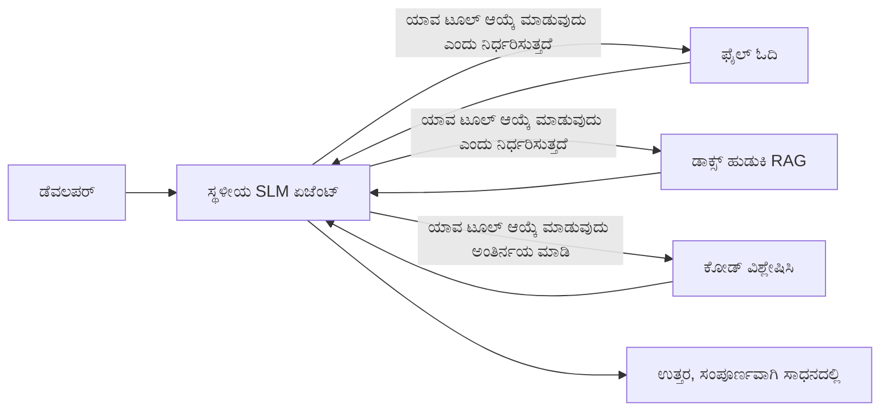
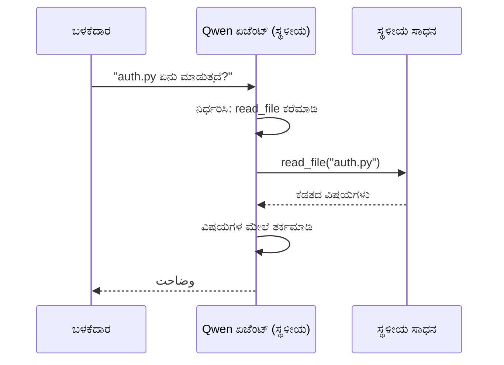
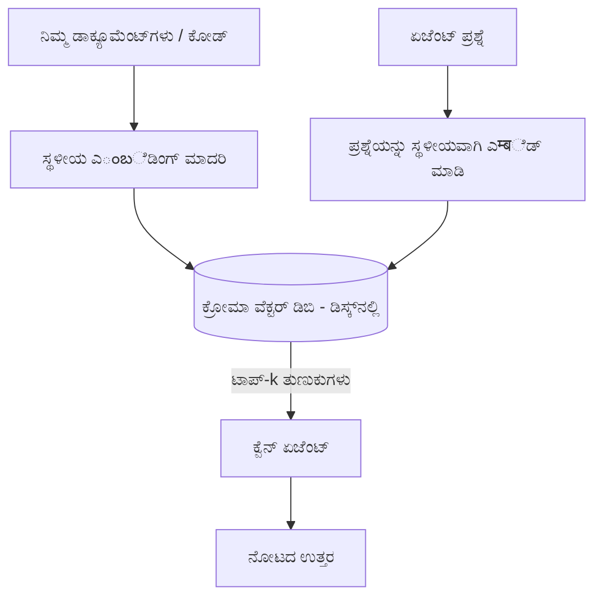
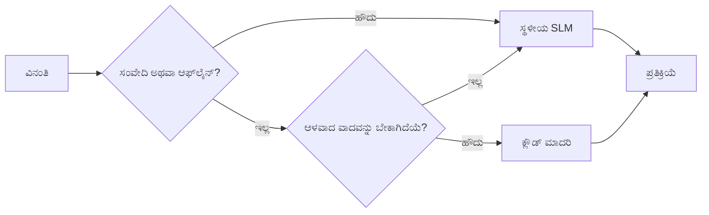

# ಮೈಕ್ರೋಸಾಫ್ಟ್ ಫೌಂಡ್ರಿ ಲೊಕಲ್ ಮತ್ತು ಕ್ವೆನ್ ಬಳಸಿ ಸ್ಥಳೀಯ AI ಏಜೆಂಟ್‌ಗಳನ್ನು ರಚಿಸುವುದು


ಹಿಂದಿನ ಪಾಠವು ಏಜೆಂಟ್‌ಗಳನ್ನು ಕ್ಲೌಡ್‌ನಲ್ಲಿ *ಮೇಲಕ್ಕೆ* ವ್ಯಾಪಿಸಿದೆ. ಈ ಪಾಠವು ಅವರನ್ನು ಒಂದು ಯಂತ್ರದಲ್ಲಿ *ಕೆಳಗೆ* ಇಳಿಸಲು ಸಹಾಯ ಮಾಡುತ್ತದೆ. ಕೊನೆಯಲ್ಲಿ ನೀವು ಕಾರ್ಯನಿರ್ವಹಿಸುವ ಎಂಜಿನಿಯರಿಂಗ್ ಸಹಾಯಕನನ್ನು ಹೊಂದಿರುತ್ತೀರಿ, ಅದು ತರ್ಕ ಮಾಡುತ್ತದೆ, ಉಪಕರಣಗಳನ್ನು ಕರೆ ಮಾಡುತ್ತದೆ, ನಿಮ್ಮ ಕಡತಗಳನ್ನು ಓದುತ್ತದೆ ಮತ್ತು ನಿಮ್ಮ ಡಾಕ್ಯುಮೆಂಟೇಶನ್ ಅನ್ನು ಹುಡುಕುತ್ತದೆ — **ಏಕೈಕ ಕ್ಲೌಡ್ ಇನ್ಫರೆನ್ಸ್ ಕರೆಗೆ ಇಲ್ಲದೆ.**

ನೀವು ಏಕೆ ಅದನ್ನು ಬಯಸುತ್ತೀರಿ? ನಿಜವಾದ ಎಂಜಿನಿಯರಿಂಗ್ ಕೆಲಸದಲ್ಲಿ ನಿಯತವಾಗಿಯೂ ಬರುತ್ತಿರುವ ಮೂರು ಕಾರಣಗಳು:

- **ಗೌಪ್ಯತೆ.** ಕೋಡ್ ಮತ್ತು ಡಾಕ್ಯುಮೆಂಟುಗಳು ಯಂತ್ರವನ್ನು ಬಿಟ್ಟು ಹೊರಗೆ ಹೋಗುವುದಿಲ್ಲ. ಯಾವುದೇ ಪ್ರಾಂಪ್ಟ್, ಸ્નಿಪೆಟ್, ಗ್ರಾಹಕ ಡೇಟಾ ನೆಟ್ವರ್ಕ್ ಸೀಮೆಯನ್ನು ದಾಟುವುದಿಲ್ಲ.
- **ವೆಚ್ಚ.** ಸ್ಥಳೀಯ ಇನ್ಫರೆನ್ಸ್‌ಗೆ ಪ್ರತಿ ಟೋಕನ್ ಬಿಲ್ ಇಲ್ಲ. ವಿದ್ಯುತ್ ಶುಲ್ಕಕ್ಕಾಗಿ ದಿನದೊಂದು ಪೂರ್ಣ ಪ್ರಯೋಗ ನಡೆಸಬಹುದು.
- **ಆಫ್‌ಲೈನ್.** ವಿಮಾನದಲ್ಲಿ, ಸುರಕ್ಷಿತ ಸೌಲಭ್ಯದಲ್ಲಿ ಅಥವಾ ತೊಂದರೆಯ ಸಮಯದಲ್ಲಿ, ಏಜೆಂಟ್ ಇನ್ನೂ ಕೆಲಸ ಮಾಡುತ್ತದೆ.

ಅದಕ್ಕೆ ತಪ್ಪಿತಸ್ಥವೆಂದರೆ ನಿಮಗೆ ನಿಮ್ಮ CPU, GPU ಅಥವಾ NPU ಮೇಲೆ ನಡೆಯುವ **ಸಣ್ಣ ಭಾಷಾ ಮಾದರಿ (SLM)** ಬದಿಲಾಗಿ ಫ್ರಂಟಿಯರ್ ಕ್ಲೌಡ್ ಮಾದರಿಯನ್ನು ವಿನಿಮಯ ಮಾಡಿಕೊಳ್ಳಬೇಕಾಗುತ್ತದೆ. ಈ ಪಾಠವು ಆ ನಿರ್ಬಂಧದೊಳಗೆ *ಸುಂದರ*ವಾದ ಏಜೆಂಟ್‌ಗಳನ್ನು ನಿರ್ಮಿಸುವ ಬಗ್ಗೆ ಇರುತ್ತದೆ, ನಿರ್ಬಂಧವಿಲ್ಲದಂತೆ ಭಾಸಕೊಡದೆ.

## ಪರಿಚಯ

ಈ ಪಾಠವು ಹೀಗಿದೆ:

- **ಸಣ್ಣ ಭಾಷಾ ಮಾದರಿಗಳು (SLMs)** — ಅವು ಏನು, ಎಲ್ಲಿಗೆ ಪರಿಶೀಲಿಸುತ್ತವೆ ಮತ್ತು ಎಲ್ಲಿಗೆ ಸರಿಯದು.
- **ಮೈಕ್ರೋಸಾಫ್ಟ್ ಫೌಂಡ್ರಿ ಲೊಕಲ್** — ಮಾದರಿಗಳನ್ನು ಆನ್-ಡಿವೈಸ್ ಡೌನ್‌ಲೋಡ್ ಮಾಡಿ ಸೇವೆ ಮಾಡಲು ರನ್‌ಟೈಮ್, **OpenAI-ಸಮ್ಮತ API** ಮೂಲಕ.
- **ಕ್ವೆನ್ ಫಂಗ್ಶನ್-ಕಾಲಿಂಗ್ ಮಾದರಿಗಳು** — ಉಪಕರಣಗಳ ಕರೆಗಳನ್ನು ವಿಶ್ವಾಸಾರ್ಹವಾಗಿ ಉತ್ಪಾದಿಸುವ SLMಗಳಾಗಿವೆ, ಅದರಿಂದ ಸ್ಥಳೀಯ *ಏಜೆಂಟ್‌ಗಳು* ಸಾಧ್ಯ.
- **ಸ್ಥಳೀಯ ಉಪಕರಣಗಳು, ಸ್ಥಳೀಯ RAG ಮತ್ತು ಸ್ಥಳೀಯ MCP** — ಏಜೆಂಟ್‌ಗೆ ಕ್ಲೌಡ್ ಬೇಕಾಗದೆ ಸಾಮರ್ಥ್ಯ ಕೊಡುವವು.
- **ಸಂಕಲಿತ ಮಾದರಿಗಳು** — ಯಾವಾಗ ವಿಷಯಗಳನ್ನು ಸ್ಥಳೀಯವಾಗಿಡಬೇಕು ಮತ್ತು ಯಾವಾಗ ಕ್ಲೌಡ್ ಅನ್ನು ಬೆಸೆಯಬೇಕು.

## ಕಲಿಕಾ ಗುರಿಗಳು

ಈ ಪಾಠವನ್ನು ಪೂರ್ಣಗೊಳಿಸಿದ ನಂತರ, ನೀವು ತಿಳಿಯುವುದು:

- SLMಗಳ ವ್ಯವಹಾರ-ಪರಿಣಾಮಗಳನ್ನು ವಿವರಿಸಿ ಮತ್ತು ಸೂಕ್ತ ಸ್ಥಳೀಯ ಏಜೆಂಟ್ ಬಳಕೆ ಪ್ರಕರಣಗಳನ್ನು ಆಯ್ಕೆ ಮಾಡಿ.
- ಫೌಂಡ್ರಿ ಲೊಕಲ್ ಮೂಲಕ ಸ್ಥಳೀಯವಾಗಿ ಕ್ವೆನ್ ಮಾದರಿಯನ್ನು ಸೇವಿಸಿ ಮತ್ತು OpenAI-ಸಮ್ಮತ ಎಂಡ್ಪಾಯಿಂಟ್ ಮೂಲಕ ಸಂಪರ್ಕಿಸಿ.
- ಪೂರ್ಣವಾಗಿ ನಿಮ್ಮ ವರ್ಕ್‌ಸ್ಟೇಶನ್‌ನಲ್ಲಿ ಕಾರ್ಯನಿರ್ವಹಿಸುವ ಉಪಕರಣ-ಕಾಲಿಂಗ್ ಏಜೆಂಟ್ ನಿರ್ಮಿಸಿ.
- ನಿಮ್ಮ ಸ್ವಂತ ಡಾಕ್ಯುಮೆಂಟ್‌ಗಳಲ್ಲಿ ಸ್ಥಳೀಯ RAG ಅನ್ನು ಸ್ಥಳೀಯ ವೆಕ್ಟರ್ ಡೇಟಾಬೇಸ್ (ಕ್ರೋಮಾ) ಬಳಸಿ ಸೇರಿಸಿ.
- ಏಜೆಂಟ್ ಅನ್ನು ಸ್ಥಳೀಯ MCP ಸರ್ವರ್‌ಗೆ ಸಂಪರ್ಕಿಸಿ ಮತ್ತು ಸಂಕಲಿತ ಸ್ಥಳೀಯ/ಕ್ಲೌಡ್ ವಿನ್ಯಾಸಗಳನ್ನು ತರ್ಕ ಮಾಡಿ.

## ಪೂರ್ವನಿಬಂಧನೆಗಳು

ಈ ಪಾಠವು ನೀವು ಹಿಂದಿನ ಪಾಠಗಳನ್ನು ಪೂರ್ಣಗೊಳಿಸಿದ್ದು, ಅನುಕೂಲವಾಗಿರುವಂತೆ ಇರಬೇಕೆಂದು فرضನೆ ಮಾಡುತ್ತದೆ:

- [ಉಪಕರಣ ಬಳಕೆ](../04-tool-use/README.md) (ಪಾಠ 4) ಮತ್ತು [ಏಜೆಂಟಿಕ್ RAG](../05-agentic-rag/README.md) (ಪಾಠ 5).
- [ಏಜೆಂಟಿಕ್ ಪ್ರೋಟೋಕಾಲ್ಸ್ / MCP](../11-agentic-protocols/README.md) (ಪಾಠ 11).
- [ಮೈಕ್ರೋಸಾಫ್ಟ್ ಏಜೆಂಟ್ ಫ್ರೇಮ್ವರ್ಕ್](../14-microsoft-agent-framework/README.md) (ಪಾಠ 14).

ನಿಮಗೆ ಅಗತ್ಯವಿದೆ:

- ಅಭಿವೃದ್ಧಿ ವರ್ಕ್‌ಸ್ಟೇಶನ್. **8 GB RAM ಕನೀಸಿಗೆ ವಾಸ್ತವಿಕವಾಗಿದೆ**; 16 GB+ ಸೂಕ್ತವಾಗಿದೆ. GPU ಅಥವಾ NPU ಸಹಕಾರಿ ಆದರೆ ಅಗತ್ಯವಿಲ್ಲ.
- **ಮೈಕ್ರೋಸಾಫ್ಟ್ ಫೌಂಡ್ರಿ ಲೊಕಲ್** ಸ್ಥಾಪಿಸಲಾಗಿದೆ (ಕೆಳಗಿನ ಹೊಂದಿಸುವಿಕೆಯ ವಿಭಾಗ ನೋಡಿ).
- Python 3.12+ ಮತ್ತು ರೆಪೋಸಿಟರಿಯಲ್ಲಿರುವ ಪ್ಯಾಕೇಜ್‌ಗಳು [`requirements.txt`](../../../requirements.txt), ಜೊತೆಗೆ ಈ ಪಾಠಕ್ಕಾಗಿ `foundry-local-sdk`, `openai`, ಮತ್ತು `chromadb`.

## ಸಣ್ಣ ಭಾಷಾ ಮಾದರಿಗಳು: ಸ್ಥಳೀಯ ಕೆಲಸಕ್ಕೆ ಸರಿಯಾದ ಉಪಕರಣ

ಫ್ರಂಟಿಯರ್ ಕ್ಲೌಡ್ ಮಾದರಿಗೆ ನೂರು ಕೋಟಿ ಪರಿಮಾಣಗಳಿವೆ ಮತ್ತು ಡೇಟಾ ಕೇಂದ್ರವಿದೆ. SLMಗೆ ಕೆಲವು ಕೋಟಿಗಳ ಪರಿಮಾಣವಿದ್ದು ನಿಮ್ಮ ಲ್ಯಾಪ್‌ಟಾಪ್ RAMನಲ್ಲಿ फिट್ ಆಗಬೇಕು. ಆ ವ್ಯತ್ಯಾಸ ಸ್ಪಷ್ಟ ನಿರೀಕ್ಷೆಗಳನ್ನು ಸೃಷ್ಟಿಸುತ್ತದೆ.

**SLMಗಳು ಉತ್ತಮವೆಂದರೆ:**

- ರಚನಾತ್ಮಕ, ಮಿತಿಯುಳ್ಳ ಕಾರ್ಯಗಳು — ವರ್ಗೀಕರಣ, ಪರಿಹಾರ, ಪರಿಚಿತ ಡಾಕ್ಯುಮೆಂಟ್ ಸಾರಾಂಶ.
- **ಉಪಕರಣ ಕರೆ ಮಾಡುವುದು** — ಯಾವ ಫಂಗ್‌ಷನ್ ಕರೆಮಾಡಬೇಕು ಮತ್ತು ಯಾವ Arguments ಕೊಡಬೇಕು ಎಂದು ನಿರ್ಧಾರ.
- ನಿಮ್ಮ ಸ್ವಂತ ಡೇಟಾದ ಮೇಲೆಯೂ ವೇಗವಾಗಿ, ಅಗ್ಗವಾಗಿ, ಖಾಸಗಿ ಪುನರಾವರ್ತನೆ.

**SLMಗಳು ದುರ್ಬಲವಾಗಿವೆ:**

- ತೆರವುಮಾಡಿಕೊಳ್ಳದ, ಬಹು ಹಂತದ ತರ್ಕ ಇಡೀ ದೊಡ್ಡ ಸಂದರ್ಭದಲ್ಲಿ.
- ವ್ಯಾಪಕ ಜಾಗತಿಕ ಜ್ಞಾನ (ಅವರಿಗಿಂತ ಕಡಿಮೆ ನೋಡಿದೆವು ಮತ್ತು ಮರೆತುಹೋಗುತ್ತದೆ).

ಸ್ಥಳೀಯ ಏಜೆಂಟ್‌ಗಳ ಗೆದ್ದೂಕುವ ನೀತಿ: **SLMಯನ್ನು ವ್ಯವಸ್ಥಾಪನೆ ಮಾಡಲು ಬಿಡಿ, ಮತ್ತು ಉಪಕರಣಗಳು ದೊಡ್ಡ ಕೆಲಸವನ್ನು ಮಾಡಲಿ.** ಮಾದರಿಗೆ ನಿಮ್ಮ ಕೋಡ್‌ಬೇಸ್ ತಿಳಿದಿರಬೇಕಾಗಿಲ್ಲ — ಅದಕ್ಕೆ `read_file` ಮತ್ತು `search_docs` ಕೇವಲ ಕರೆಮಾಡಬೇಕಾಗಿದೆ. ಇದು SLMಗಳ ಸಾಮರ್ಥ್ಯದ ಕಡೆ ನೇರವಾಗಿ ಕೆಲಸ ಮಾಡುತ್ತದೆ.



## ಮೈಕ್ರೋಸಾಫ್ಟ್ ಫೌಂಡ್ರಿ ಲೊಕಲ್

**ಮೈಕ್ರೋಸಾಫ್ಟ್ ಫೌಂಡ್ರಿ ಲೊಕಲ್** ಒಂದು ತೆಳುವಾದ ರನ್‌ಟೈಮ್ ಆಗಿದ್ದು, ನಿಮ್ಮ ಯಂತ್ರದಲ್ಲಿ ಸಂಪೂರ್ಣವಾಗಿ ಮಾದರಿಗಳನ್ನು ಡೌನ್‌ಲೋಡ್, ನಿರ್ವಹಣೆ ಮತ್ತು ಸೇವೆ ಮಾಡುತ್ತದೆ. ಇದರ ಅತ್ಯಂತ ಮುಖ್ಯ ಲಕ್ಷಣವೆಂದರೆ ಇದು **OpenAI-ಸಮ್ಮತ HTTP ಎಂಡ್‌ಪಾಯಿಂಟ್** ಅನ್ನು ಒದಗಿಸುತ್ತದೆ — ಅಂದರೆ OpenAI SDK ಮತ್ತು ಮೈಕ್ರೋಸಾಫ್ಟ್ ಏಜೆಂಟ್ ಫ್ರೇಮ್ವರ್ಕಿನ OpenAI ಕ್ಲೈಯಂಟ್ ಅದನ್ನು `base_url` ಬದಲಿಸುವ ಮೂಲಕ ಮಾತ್ರ ಬಳಸಬಹುದು. ನೀವು ಏಜೆಂಟ್ ನಿರ್ಮಿಸುವುದಕ್ಕೆ ಕಲಿತಿದ್ದ ಎಲ್ಲಾ ವಿಷಯಗಳು ನೇರವಾಗಿ ವರ್ಗಾಯಿಸಿ; ಒಂದೇ ಬದಲಾವಣೆ ಎಂಡ್‌ಪಾಯಿಂಟ್ ಕ್ಲೌಡ್‌ನಿಂದ `localhost` ಗೆ ಆಗಿರುತ್ತದೆ.

ಫೌಂಡ್ರಿ ಲೊಕಲ್ ಸಹ ನಿಮ್ಮ ಹಾರ್ಡ್‌ವೇರ್‌ಗೆ ಸೂಕ್ತವಾದ ಮಾದರಿಯ ಅತ್ಯುತ್ತಮ ಬಿಲ್ಡ್ ಅನ್ನು ಸ್ವಯಂಚಾಲಿತವಾಗಿ ಆಯ್ಕೆಮಾಡುತ್ತದೆ — CPU ಬಿಲ್ಡ್, CUDA/GPU ಬಿಲ್ಡ್ ಅಥವಾ NPU ಬಿಲ್ಡ್ — ಹೀಗಾಗಿ ನೀವು ಪ್ರತಿ ಯಂತ್ರಕ್ಕೆ ಕೈಗೊಂಡ ಸೂಕ್ತೀಕರಣ ಮಾಡಬೇಕಾಗಿಲ್ಲ.

### ಹೊಂದಿಸುವಿಕೆ

ಫೌಂಡ್ರಿ ಲೊಕಲ್ ಅನ್ನು ಸ್ಥಾಪಿಸಿ (ನಿಮ್ಮ OSಗೆ [ಡಾಕ್ಯುಮೆಂಟೇಶನ್](https://learn.microsoft.com/azure/ai-foundry/foundry-local/) ನೋಡಿ), ನಂತರ ಅದು ಕಾರ್ಯನಿರ್ವಹಿಸುತ್ತಿದೆಯೆ ಎಂದು ದೃಢಪಡಿಸಿ:

```bash
# ಇನ್ಸ್ಟಾಲ್ ಮಾಡಿ (ಉದಾಹರಣೆಗೆ; ನಿಮ್ಮ ಪ್ಲಾಟ್‌ಫಾರ್ಮ್‌ಗಾಗಿ ಡಾಕ್ಯೂಮೆಂಟ್‌ಗಳನು ಅನುಸರಿಸಿ)
winget install Microsoft.FoundryLocal      # ವಿಂಡೋಸ್
# brew install microsoft/foundrylocal/foundrylocal   # macOS

# Qwen ಮಾದರಿಯನ್ನು ಡೌನ್ಲೋಡ್ ಮಾಡಿ ಮತ್ತು ಓಡಿಸಿ, ನಂತರ ಸ್ಥಳೀಯ ಸೇವೆಯನ್ನು ಆರಂಭಿಸಿ
foundry model run qwen2.5-7b-instruct
foundry service status
```

ಸೇವೆ ಚಾಲನೆಗೊಂಡ ನಂತರ ನಿಮ್ಮ ಬಳಿ ಒಂದು ಸ್ಥಳೀಯ, OpenAI-ಸಮ್ಮತ ಎಂಡ್ಪಾಯಿಂಟ್ (ಸಾಮಾನ್ಯವಾಗಿ `http://localhost:PORT/v1`) ಇದೆ. ನೋಟ್‌ಬುಕ್ `foundry-local-sdk` ಬಳಸಿ ಸ್ವಯಂಚಾಲಿತವಾಗಿ ಎಂಡ್ಪಾಯಿಂಟ್ ಕಂಡುಹಿಡಿಯುತ್ತದೆ, ಆದ್ದರಿಂದ ನೀವು ಪೋರ್ಟ್ ದಿಶಾನಿರ್ದೇಶನವನ್ನು ಕೂರಿಸುವ ಅಗತ್ಯವಿಲ್ಲ.

## ಕ್ವೆನ್ ಫಂಗ್ಶನ್ ಕcalling: ಯಾಕೆ ಇದು ಮಹತ್ವವಿದೆ

ಏಜೆಂಟ್ ಎಂದರೆ ಅದು ಉಪಕರಣಗಳನ್ನು ಕರೆಮಾಡಬಲ್ಲಾಗಿರಬೇಕು. ಅನೇಕ SLMಗಳು ಚಾಟ್ ಮಾಡಬಹುದು ಆದರೆ ಅಸ್ಥಿರ, ಅವ್ಯವಸ್ಥಿತ ಉಪಕರಣ ಕರೆಗಳನ್ನು ಉತ್ಪಾದಿಸುತ್ತವೆ. **ಕ್ವೆನ್** ಮಾದರಿಗಳು ಫಂಗ್ಶನ್ ಕರೆಗಾಗಿ ತರಬೇತಿಗೊಳ್ಳುತ್ತವೆ ಮತ್ತು ಸತತವಾಗಿ ಸರಿಯಾದ ಉಪಕರಣ-ಕರೆ ರಚನೆಗಳನ್ನು ನೀಡುತ್ತವೆ — ಇದರಿಂದಲೇ ಸ್ಥಳೀಯ ಚಾಟ್ ಮಾದರಿಯನ್ನು ಸ್ಥಳೀಯ *ಏಜೆಂಟ್* ಆಗಿಸಲು ಸಾಧ್ಯವಾಗುತ್ತದೆ.

ಪ್ರಕ್ರಿಯೆಯು ನೀವು ಈಗಾಗಲೇ ತಿಳಿದಿರುವ ಸ್ಟ್ಯಾಂಡರ್ಡ್ ಉಪಕರಣ-ಕಾಲಿಂಗ್ ಲೂಪ್ನಾಗಿದ್ದು, ಬರೀ ಆನ್-ಡಿವೈಸ್‌ನ ಮೇಲೆ ಚಾಲನೆ ಆಗುತ್ತದೆ:



## ಸ್ಥಳೀಯ RAG

ಡಾಕ್ಯುಮೆಂಟೇಶನ್ ಹುಡುಕುವುದು ಸ್ಥಳೀಯ ಏಜೆಂಟ್‌ಗಳು ತಮ್ಮ ಸಾಮರ್ಥ್ಯವನ್ನು ತೋರಿಸುವ ಜಾಗ. SLM ನಿಮ್ಮ ಫ್ರೇಮ್‌ವರ್ಕ್ ಲಿಖಿತಗಳನ್ನು ನೆನಪಿನಲ್ಲಿಟ್ಟುಕೊಂಡಿದೆ ಎಂದು ಹೋಳುವುದಕ್ಕಲ್ಲದೆ, ಆ ಲಿಖಿತಗಳನ್ನು **ಸ್ಥಳೀಯ ವೆಕ್ಟರ್ ಡೇಟಾಬೇಸ್** ಗೆ ಹಮ್ಮಿಸಿ, ಏಜೆಂಟ್ ಅವಶ್ಯಕ ಅಂಶಗಳನ್ನು ತಲುಪಲು ಬಿಡುತ್ತದೆ.

ನಾವು ಬಳಸುವದು **ಕ್ರೋಮಾ**, ಅದು ಸಂಗ್ರಹಿಕೆ ಇಲ್ಲದೆ, ಪ್ರಕ್ರಿಯೆಯಲ್ಲಿ ಓಡಹೊಕ್ಕುವ ಒಂದು ವಿವರಿತ ವೆಕ್ಟರ್ ಸಂಗ್ರಹಣೆ. ಪೈಪ್‌ಲೈನ್ ಸಂಪೂರ್ಣವಾಗಿ ಸ್ಥಳೀಯ: ಸ್ಥಳೀಯ ಒಳನಿರ್ದೇಶನ ಮಾದರಿ → ಸ್ಥಳೀಯ ವೆಕ್ಟರ್‌ಗಳು → ಸ್ಥಳೀಯ ಮಂದಿ → ಸ್ಥಳೀಯ SLM.



ಇದು ಪಾಠ 5ನ ಏಜೆಂಟಿಕ್ RAG ಮಾದರಿಯೇ — ಒಂದೇ ಬದಲಾವಣೆ, ಪ್ರತಿಯೊಂದು ಭಾಗವು ನಿಮ್ಮ ಯಂತ್ರದಲ್ಲಿ ಓಡುತ್ತದೆ.

## ಸ್ಥಳೀಯ MCP ಸರ್ವರ್‌ಗಳು

[MCP](../11-agentic-protocols/README.md) ಒಂದು ಸಾರಿಗೆ ವಿಧಾನ, ಕ್ಲೌಡ್ ಸೇವೆ కాదు. MCP ಸರ್ವರ್ `stdio` ಮೇಲೆ ಸ್ಥಳೀಯ ಪ್ರಕ್ರಿಯೆಗಳಾಗಿ ಕಾರ್ಯನಿರ್ವಹಿಸಿ, ಏಜೆಂಟ್‌ಗೆ ಸ್ಟ್ಯಾಂಡರ್ಡ್ ಪ್ರೋಟೋಕಾಲ್ ಮೂಲಕ ಉಪಕರಣಗಳನ್ನು ಒದಗಿಸುತ್ತದೆ. ಇದರಿಂದ ನೀವು MCP ಸರ್ವರ್‌ಗಳ ಬೆಳವಣಿಗೆಯ ಪರಿಸರವನ್ನು ಪುನರ್-ಬಳಕೆ ಮಾಡಬಹುದು — ಫೈಲ್ ಸಿಸ್ಟಂ ಪ್ರವೇಶ, ಗಿಟ್ ಕಾರ್ಯಾಚರಣೆಗಳು, ಡೇಟಾಬೇಸ್ ಕ್ವೆರಿ — ಸಂಪೂರ್ಣ ಆಫ್‌ಲೈನ್.

ಭದ್ರತಾ ಸ್ಥಿತಿ ಕ್ಲೌಡ್‌ಗಿಂತ ಭಿನ್ನವಾಗಿದೆ, ಆದರೆ ಇಲ್ಲಿಹತ್ತಲಾಗಿಲ್ಲ: ಸ್ಥಳೀಯ MCP ಸರ್ವರ್ ನಿಮ್ಮ ಬಳಕೆದಾರ ಅನುಮತಿಗಳೊಂದಿಗೆ ಕಾರ್ಯನಿರ್ವಹಿಸುತ್ತಿದ್ದು, ಅದು ಸ್ಪರ್ಶಿಸಲು ಬಿಡಿದಿರುವದನ್ನು ಹರಿಸುವುದು, ಆದ್ದರಿಂದ ಅದು ಪ್ರವೇಶಿಸಬಹುದಾದವನ್ನಷ್ಟೇ ಸೀಮಿತಗೊಳಿಸಿ (ಒಂದು ಯೋಜನೆ ಡೈರೆಕ್ಟರಿ, ನಿಮ್ಮ ಇಡೀ ಹೋಮ್ ಫೋಲ್ಡರ್ ಅಲ್ಲ) ಮತ್ತು ಅದರಿಂದ ಹೊರಬರುವ ಫಲಿತಾಂಶಗಳನ್ನು ಇನ್ಪುಟ್ಗಳಾಗಿ ಪರಿಶೀಲಿಸಿ.

## ಸಂಕಲಿತ ಕ್ಲೌಡ್-ಮತ್ತು-ಸ್ಥಳೀಯ ಮಾದರಿಗಳು

ಸ್ಥಳೀಯ-ಮೊದಲನೆಯದೂ ಸ್ಥಾನೀಯ-ಮಾತ್ರವಲ್ಲ. ಸಿದ್ಧಪಡಿಸಿದ ವ್ಯವಸ್ಥೆಗಳು ಸಂವೇದನಾಶೀಲತೆ ಮತ್ತು ಕಷ್ಟತೆಯ ಮೇಲೆ ಮಾರ್ಗನಿರ್ದೇಶಿಸುತ್ತವೆ:

| ಪರಿಸ್ಥಿತಿ | ಅದೊಂದು ಎಲ್ಲಿ ಓಡುತ್ತದೆ |
| --- | --- |
| ಸಂವೇದನಾಶೀಲ ಕೋಡ್ / ಡೇಟಾ ಅಥವಾ ಆಫ್‌ಲೈನ್ | **ಸ್ಥಳೀಯ SLM** |
| ಸರಳ, ಮಿತಿಯುಳ್ಳ ಕಾರ್ಯ | **ಸ್ಥಳೀಯ SLM** (ಅಗ್ಗ, ವೇಗ) |
| ಸಂಕೀರ್ಣ ಬಹು ಹಂತದ ತರ್ಕ, ಸಂವೇದನಾಶೀಲವಲ್ಲದ ಡೇಟಾ ಮೇಲೆ | **ಕ್ಲೌಡ್ ಮಾದರಿ** |
| ಎಲ್ಲವೂ, ತೊಂದರೆ ಸಮಯದಲ್ಲಿ | **ಸ್ಥಳೀಯ SLM** (ಸರಳ ಆಗುವ ಕ್ರಮಶಃ ಕುಬ್ಬಣೆ) |

ಇದು ಪಾಠ 16ರ **ಮಾಡೆಲ್ ಮಾರ್ಗನಿರ್ದೇಶನ** ಯೋಚನೆಯನ್ನು ಪ್ರತಿಬಿಂಬಿಸುತ್ತದೆ — ಬದಲಾಗಿ "ಮಾಡೆಲ್"ಗಳಲ್ಲಿ ಒಂದು ಈಗ ನಿಮ್ಮ ಸ್ವಂತ ಯಂತ್ರ. ಒಬ್ಬ ದೃಢ ವಿನ್ಯಾಸವು ಕ್ಲೌಡ್ ಲಭ್ಯವಿಲ್ಲದಿದ್ದಾಗ ಸ್ಥಳೀಯ ಗೆ ಹಿಂತಿರುಗುತ್ತದೆ ಮತ್ತು ಏಜೆಂಟ್ ಗುಣಮಟ್ಟದಲ್ಲಿ ಕುಂದುಗುಳ್ಳುವುದನ್ನು ತಪ್ಪಿಸಿ ಸಂಪೂರ್ಣ ವಿಫಲವಾಗುವುದನ್ನು ತಪ್ಪಿಸುತ್ತದೆ.



## ಪ್ರಾಯೋಗಿಕ ಪ್ರಯೋಗಾಗಾರ: ಸ್ಥಳೀಯ ಎಂಜಿನಿಯರಿಂಗ್ ಸಹಾಯಕ

[`code_samples/17-local-agent-foundry-local.ipynb`](./code_samples/17-local-agent-foundry-local.ipynb) ತೆರೆಯಿರಿ ಮತ್ತು ಅದರ ಮೂಲಕ ಕೆಲಸಮಾಡಿ. ನೀವು ಪೂರ್ತಿ ನಿಮ್ಮ ವರ್ಕ್‌ಸ್ಟೇಶನ್‌ನಲ್ಲಿ ನಿರ್ವಹಿಸುವ **ಸ್ಥಳೀಯ ಎಂಜಿನಿಯರಿಂಗ್ ಸಹಾಯಕನ**ನ್ನ ನಿರ್ಮಿಸುವಿರಿ, ಇದು:

1. **ಉಪಕರಣಗಳನ್ನು ಕರೆ ಮಾಡುವುದು** — ಫೌಂಡ್ರಿ ಲೊಕಲ್ ಮೂಲಕ ಕ್ವೆನ್ ಫಂಗ್ಶನ್-ಕಾಲಿಂಗ್ ಮೂಲಕ.
2. **ಸ್ಥಳೀಯ ಫೈಲ್ ಕಾರ್ಯಾಚರಣೆಗಳನ್ನು ಮಾಡುವುದು** — ಯೋಜನಾ ಡೈರೆಕ್ಟರಿಯಲ್ಲಿರುವ ಕಡತಗಳನ್ನು ಒದಗಿಸುವುದು ಮತ್ತು ಓದುವುದು.
3. **ಕೋಡ್ ವಿಶ್ಲೇಷಣೆ** — ಮೂಲ ಕಡತದ ಮೂಲಭೂತ ಅಳೆಯೊಂದಗಳನ್ನು ವರದಿ ಮಾಡುವುದು.
4. **ಡಾಕ್ಯುಮೆಂಟೇಶನ್ ಹುಡುಕುವುದು** — ಕ್ರೋಮಾ ಮೂಲಕ ಡಾಕ್ಸ್ ಫೋಲ್ಡರ್ ಮೇಲೆ ಸ್ಥಳೀಯ RAG.
5. **MCP ಬಳಕೆ** — ಸ್ಥಳೀಯ MCP ಸರ್ವರ್‌ಗೆ ಸಂಪರ್ಕ (ಯಾವುದೇ ಸರ್ವರ್ ಸಂರಚಿಸಲ್ಪಟ್ಟಿಲ್ಲದಿದ್ದರೆ ಸರಳವಾಗಿ ಬಿಟ್ಟಿಡುವುದು).

ಯಾವುದೇ ಮೊಡಲೆ ಇನ್ಫರೆನ್ಸ್ ಬಳಕೆಯಾಗುವುದಿಲ್ಲ.

### ಸಹಾಯಿತಾಳಿಕೆ

ಸಹಾಯಕನು ಫೌಂಡ್ರಿ ಲೊಕಲ್‌ಗೆ OpenAI-ಸಮ್ಮತ ಎಂಡ್‌ಪಾಯಿಂಟ್ ಮೂಲಕ ಸಂಪರ್ಕ ಹಸ್ಥಗತಗೊಳಿಸುತ್ತದೆ, ಆದ್ದರಿಂದ ಏಜೆಂಟ್ ಕೋಡ್ ಕ್ಲೌಡ್ ಪಾಠಗಳಿಗೆ ಬಹಳ ಸಮಾನವಾಗಿರುತ್ತದೆ — ಕೇವಲ ಕ್ಲೈಯಂಟ್ ಬದಲಾಗುತ್ತದೆ:

```python
from foundry_local import FoundryLocalManager
from openai import OpenAI

# ಫೌಂಡ್ರಿ ಲೋಕಲ್ ಮಾದರಿಯನ್ನು ಕಂಡುಹಿಡಿದು/ಡೌನ್ ಲೋಡ್ ಮಾಡುತ್ತದೆ ಮತ್ತು ನಮಗೆ ಸ್ಥಳೀಯ ಎಂಡ್ಪಾಯಿಂಟ್ ಅನ್ನು ನೀಡುತ್ತದೆ.
manager = FoundryLocalManager(\"qwen2.5-7b-instruct\")
client = OpenAI(base_url=manager.endpoint, api_key=manager.api_key)  # api_key ಒಂದು ಸ್ಥಳೀಯ ಸ್ಥಾನಾಪೂರकವಾಗಿದೆ
```

ಉಪಕರಣಗಳು ಸಾಮಾನ್ಯ ಪೈಥಾನ್ ಫಂಕ್ಷನ್‌ಗಳಾಗಿವೆ ಮತ್ತು ಯೋಜನಾ ಡೈರೆಕ್ಟರಿಗೆ ಸೀಮಿತಗೊಂಡಿವೆ:

```python
def read_file(path: str) -> str:
    \"\"\"Read a file, but only inside the sandboxed project directory.\"\"\"
    full = (PROJECT_ROOT / path).resolve()
    if PROJECT_ROOT not in full.parents and full != PROJECT_ROOT:
        return \"Access denied: path is outside the project directory.\"
    return full.read_text(encoding=\"utf-8\")
```

ಸ್ಯಾಂಡ್‌ಬಾಕ್ಸ್ ಪರಿಶೀಲನೆಯನ್ನು ಗಮನಿಸಿ — ಸ್ಥಳೀಯವಾಗಿಯೂಅದರೂ, ಯಾದೃಚ್ಛಿಕ ಪಾತಿಗಳನ್ನು ಓದುವ ಉಪಕರಣ ಒಂದು ಜವಾಬ್ದಾರಿಯಾಗಿದೆ. ನೋಟ್‌ಬುಕ್ ಪ್ರತಿ ಉಪಕರಣವನ್ನು ಒಂದು ಯೋಜನೆ ಮೂಲಕ್ಕೆ ಸೀಮಿತಗೊಳಿಸುತ್ತದೆ.

## ಜ್ಞಾನ ಪರಿಶೀಲನೆ

ನಿಯೋಜನೆಯಿಂದ ಮೊದಲೇ ನಿಮ್ಮ ಅರ್ಥಗೊಳ್ಳುವಿಕೆಯನ್ನು ಪರೀಕ್ಷಿಸಿ.

**1. ಏಜೆಂಟ್ ಅನ್ನು ಕ್ಲೌಡ್ ಬದಲು ಸ್ಥಳೀಯವಾಗಿ ನಡೆಸಬೇಕಾದ ಎರಡು ಸ್ಪಷ್ಟ ಕಾರಣಗಳನ್ನು ನೀಡಿ.**

<details>
<summary>ಉತ್ತರ</summary>

ಯಾವುದಾದರೂ ಎರಡು: **ಗೌಪ್ಯತೆ** (ಕೋಡ್ ಮತ್ತು ಡೇಟಾ ಯಂತ್ರದಿಂದ ಹೊರಡುವುದಿಲ್ಲ), **ವೆಚ್ಚ** (ಪ್ರತಿ ಟೋಕನ್ ಇನ್ಫರೆನ್ಸ್ ಬಿಲ್ ಇಲ್ಲ), ಮತ್ತು **ಆಫ್‌ಲೈನ್ ಸಾಮರ್ಥ್ಯ** (ನೆಟ್ವರ್ಕ್ ಇಲ್ಲದಿದ್ದಾಗವೂ ಕೆಲಸ ಮಾಡುತ್ತದೆ — ವಿಮಾನದಲ್ಲಿ, ಸುರಕ್ಷಿತ ಸೌಲಭ್ಯದಲ್ಲಿ, ಅಥವಾ ವಿಫಲತೆಯಲ್ಲಿ). ನಿಯಂತ್ರಣ/ಅನುಕೂಲತೆ ನಿರ್ಬಂಧಗಳು ಡೇಟಾವನ್ನು ಡಿವೈಸ್ನಿಂದ ಕಳುಹಿಸಲು ತಡೆಯುವವುಗಳಿಗೆ ಸಾಮಾನ್ಯ ಚಾಲಕಾದನಾಗಿವೆ.
</details>

**2. ಸ್ಥಳೀಯ ಏಜೆಂಟ್‌ನಲ್ಲಿ SLM ಮತ್ತು ಅದರ ಉಪಕರಣಗಳ ಮಧ್ಯೆ ಶಿಫಾರಸು ಮಾಡಿದ ಕೆಲಸ ಹಂಚಿಕೆ ಏನು, ಮತ್ತು ಯಾಕೆ?**

<details>
<summary>ಉತ್ತರ</summary>

SLM** ವ್ಯವಸ್ಥಾಪವನ್ನು ಮಾಡುವಂತಿರಲಿ** (ಯಾವ ಉಪಕರಣವನ್ನೆ ಕರೆ ಮಾಡಬೇಕು ಮತ್ತು ಯಾವ Arguments ಬೇಕು ಎಂಬುದನ್ನು ನಿರ್ಧರಿಸುವದು) ಮತ್ತು **ಉಪಕರಣಗಳು ಭಾರವಾದ ಕೆಲಸ ಮಾಡಲಿ** (ಫೈಲ್‌ಗಳನ್ನು ಓದುವುದು, ಡಾಕ್ಯುಮೆಂಟ್‌ಗಳನ್ನು ತರಣ ಮಾಡುವುದು, ಫಲಿತಾಂಶ ಸಿದ್ಧಪಡಿಸುವುದು). SLMಗಳು ಉಪಕರಣ ಆರಿಸುವಂತಹ ಮಿತಿಯುಳ್ಳ ನಿರ್ಧಾರಗಳತ್ತ ಬಲವಾಗಿವೆ ಆದರೆ ವ್ಯಾಪಕ ಜ್ಞಾನ ಮತ್ತು ಬಹು ಹಂತದ ತರ್ಕದಲ್ಲಿ ದುರ್ಬಲ, ಆದ್ದರಿಂದ ಉಪಕರಣಗಳಿಗೆ ಅವಲಂಬಿಸುವುದು ಅವರ ಶಕ್ತಿಗೆ ಹೊಂದಿಕೊಳ್ಳುತ್ತದೆ.
</details>

**3. ಫೌಂಡ್ರಿ ಲೊಕಲ್ನೊಂದಿಗೆ ಕ್ಲೌಡ್ ಏಜೆಂಟ್ ಕೋಡ್ ಪುನಃಬಳಕೆಗೆ ಏನು ಸಾಧ್ಯವಾಗಿಸುತ್ತದೆ?**

<details>
<summary>ಉತ್ತರ</summary>

ಫೌಂಡ್ರಿ ಲೊಕಲ್ **OpenAI-ಸಮ್ಮತ HTTP ಎಂಡ್‌ಪಾಯಿಂಟ್** ಒದಗಿಸುತ್ತದೆ. OpenAI SDK ಮತ್ತು ಏಜೆಂಟ್ ಫ್ರೇಮ್ವರ್ಕ್‌ನ OpenAI ಕ್ಲೈಯಂಟ್ `base_url` ಮಾತ್ರ ಬದಲಾಯಿಸುವ ಮೂಲಕ ಅದನ್ನು ಬಳಸುತ್ತವೆ (ಮತ್ತು ಸ್ಥಳೀಯ ಬದಲಾವಣೆ API ಕೀ). ಇನ್ನಷ್ಟು ಏಜೆಂಟ್ ಕೋಡ್ ಒಂದೇ ರೀತಿಯಲ್ಲೇ ಇರುತ್ತದೆ.
</details>

**4. ಯಾಕೆ ನಾವು ಯಾವುದೇ SLM ಬದಲಿಗೆ ವಿಶೇಷವಾಗಿ ಕ್ವೆನ್ ಫಂಗ್ಷನ್-ಕಾಲಿಂಗ್ ಮಾದರಿಯನ್ನು ಬಳಸುತ್ತೇವೆ?**

<details>
<summary>ಉತ್ತರ</summary>

ಏಕೆಂದರೆ ಏಜೆಂಟ್ ವಿಶ್ವಾಸಾರ್ಹ, ಸರಿಯಾದ **ಉಪಕರಣ ಕರೆಗಳನ್ನು** ಉತ್ಪಾದಿಸಬೇಕು. ಅನೇಕ SLMಗಳು ಚಾಟ್ ಮಾಡಬಹುದು ಆದರೆ ಅಸ್ಥಿರ ಅಥವಾ ನಿರಂತರವಾಗದ ಉಪಕರಣ-ಕರೆ ರಚನೆಗಳನ್ನು ನೀಡುತ್ತವೆ. ಕ್ವೆನ್ ಮಾದರಿಗಳು ಫಂಗ್ಶನ್ ಕರೆಗಾಗಿ ತರಬೇತಿ ಪಡೆದಿವೆ ಮತ್ತು ಸತತ ಉಪಕರಣ ಕರೆಗಳನ್ನು ಉತ್ಪಾದಿಸುತ್ತವೆ, ಇದರಿಂದ ಸ್ಥಳೀಯ ಚಾಟ್ ಮಾದರಿಯನ್ನು ಕಾರ್ಯನಿರ್ವಹಿಸುವ ಸ್ಥಳೀಯ ಏಜೆಂಟ್ ಗೆ ಪರಿವರ್ತನ ಮಾಡುತ್ತದೆ.
</details>

**5. ಸ್ಥಳೀಯ RAG ಪೈಪ್‌ಲೈನಿನಲ್ಲಿ ಯಾವ ಭಾಗಗಳು ಯಂತ್ರದಲ್ಲಿ ನಡೆಯುತ್ತವೆ?**

<details>
<summary>ಉತ್ತರ</summary>

ಅವು ಎಲ್ಲಾ: ಒಳನಿರ್ದೇಶನ ಮಾದರಿ, ವೆಕ್ಟರ್ ಡೇಟಾಬೇಸ್ (ಕ್ರೋಮಾ, ಡಿಸ್ಕ್‌ನಲ್ಲಿ), ರಿಟ್ರೀವಲ್ ಹಂತ ಮತ್ತು SLM. ಡಾಕ್ಯುಮೆಂಟ್‌ಗಳು ಸ್ಥಳೀಯವಾಗಿ ಒಳನಿರ್ದೇಶನ ಮಾಡಲ್ಪಟ್ಟರೂ, ಸ್ಥಳೀಯವಾಗಿ ಸಂಗ್ರಹಿಸಬಹುದು, ಸ್ಥಳೀಯವಾಗಿ ಪಡೆಯಬಹುದು ಮತ್ತು ಸ್ಥಳೀಯ ಮಾದರಿಯಿಂದ ತರ್ಕ ಮಾಡಬಹುದು — ಯಾವುದೇ ಘಟಕವೂ ಕ್ಲೌಡ್ ಪ್ರವೇಶಿಸುವದು ಇಲ್ಲ.
</details>

**6. ವಿಶೇಷವಾಗಿ ನಿಮ್ಮ ಯಂತ್ರದ ಮೇಲೆ ಒಂದು ಸ್ಥಳೀಯ MCP ಸರ್ವರ್ ಕಾರ್ಯನಿರ್ವಹಿಸುತ್ತಿದೆ. ಅದು ಸ್ವಯಂಚಾಲಿತವಾಗಿ ಸುರಕ್ಷಿತವಾಗುತ್ತುದೇ? ನೀವು ಯಾವ ಎಚ್ಚರಿಕೆಯನ್ನಾಗಲಿ ತೆಗೆದುಕೊಳ್ಳಬೇಕು?**

<details>
<summary>ಉತ್ತರ</summary>

ಅಲ್ಲ. ಸ್ಥಳೀಯ MCP ಸರ್ವರ್ ನಿಮ್ಮ ಬಳಕೆದಾರ ಅನುಮತಿಗಳೊಂದಿಗೆ ಕಾರ್ಯನಿರ್ವಹಿಸುತ್ತಿದೆ, ಆದ್ದರಿಂದ ನೀವು ಟಚ್ ಮಾಡಬಹುದಾದ ಯಾವುದನ್ನಾದರೂ ಅದು ಅನುಮತಿಸುತ್ತದೆ. ಅದನ್ನು ಅದು ಬೇಕಾದಂತೆ ಸೀಮಿತಗೊಳಿಸಿ (ಉದಾಹರಣೆಗೆ, ನಿಮ್ಮ ಇಡೀ ಹೋಮ್ ಫೋಲ್ಡರ್ ಬದಲು ಒಂದು ಯೋಜನೆ ಡೈರೆಕ್ಟರಿ) ಮತ್ತು ಅದರ ಫಲಿತಾಂಶಗಳನ್ನು ಇನ್ಪುಟ್ಗಳಾಗಿ ಪರಿಗಣಿಸಿ, ಅವುಗಳ ಮೇಲೆ ಕಾರ್ಯ ಮಾಡಲು ಮೊದಲು ಪರಿಶೀಲಿಸಿ.
</details>

**7. ಸ್ಥಳೀಯ ಮಾದರಿಯನ್ನು ಹೊಂದಿರುವ ತಕ್ಕಮಟ್ಟಿನ ಸಂಕಲಿತ ಮಾರ್ಗನಿರ್ದೇಶನ ನಿಯಮವನ್ನು ವರ್ಣಿಸಿ.**

<details>
<summary>ಉತ್ತರ</summary>

ಸಂವೇದನಾಶೀಲ ಅಥವಾ ಆಫ್‌ಲೈನ್ ವಿನಂತಿಗಳನ್ನು ಸ್ಥಳೀಯ SLMಗೆ ಮಾರ್ಗದರ್ಶನ ಮಾಡಿ; ಸರಳ ಮಿತಿಯುಳ್ಳ ಕಾರ್ಯಗಳನ್ನು ವೇಗ ಮತ್ತು ವೆಚ್ಚಕ್ಕಾಗಿ ಸ್ಥಳೀಯ SLMಗೆ ಮಾರ್ಗ ಮಾಡಿ; ಸಂವೇದನಾಶೀಲವಲ್ಲದ ಡೇಟಾದ ಮೇಲೆ ಕಠಿಣ ಬಹು ಹಂತದ ತರ್ಕವನ್ನು ಕ್ಲೌಡ್ ಮಾದರಿ ಕಡೆ ಯರುಳಿಸಿ; ಮತ್ತು ಕ್ಲೌಡ್ ಲಭ್ಯವಿಲ್ಲದ ಸಂದರ್ಭದಲ್ಲಿ ಸ್ಥಳೀಯ SLMಗೆ ಹಿಂತಿರುಗಿ, ಏಜೆಂಟ್ ಗುಣಮಟ್ಟದಲ್ಲಿ ಸಹಜ ಕುಗ್ಗುವಿಕೆಗೆ ಬಿಡಿ, ಸಂಪೂರ್ಣ ವಿಫಲತೆಯನ್ನ್ಮಾಡಬಾರದು. ಇದು ಪಾಠ 16ರ ಮಾದರಿ ಮಾರ್ಗನಿರ್ದೇಶನವಾಗಿದ್ದು, ಸ್ಥಳೀಯ ಯಂತ್ರವು ಒಂದು ಮಾದರಿಯಾಗಿದೆ.
</details>

**8. ಈ ಪಾಠದಲ್ಲಿ ಸ್ಥಳೀಯ ಏಜೆಂಟ್ ಚಾಲನೆಗಾಗಿ ವಾಸ್ತವಿಕ ಕನಿಷ್ಠ RAM ಅಂಶ ಎಷ್ಟು, ಮತ್ತು ಹೆಚ್ಚಿನ RAM ನಿಮಗೆ ಏನು ಕೊಡುವದು?**

<details>
<summary>ಉತ್ತರ</summary>

ಸುಮಾರು **8 GB** ಯನ್ನು ವಾಸ್ತವಿಕ ಕನಿಷ್ಠ ಎಂದು ಪರಿಗಣಿಸಲಾಗುತ್ತದೆ; 16 GB+ ಅನುಕೂಲಕರ. ಹೆಚ್ಚು RAM ನಿಂದ ನೀವು ದೊಡ್ಡ, ಹೆಚ್ಚು ಸಾಮರ್ಥ್ಯವಿರುವ ಮಾದರಿಗಳನ್ನು ಓಡಿಸಬಹುದು ಮತ್ತು ಹೆಚ್ಚಿನ ಪ್ರಮುಖ ಸನ್ನಿವೇಶವನ್ನು ಮೆಮರಿಯಲ್ಲಿ ಇಡಬಹುದು. GPU ಅಥವಾ NPU ಇನ್ಫರೆನ್ಸ್ ವೇಗಗೊಳಿಸುವುದಕ್ಕೆ ಬೇಗಮೂಲಕ ಅಲ್ಲ — ಫೌಂಡ್ರಿ ಲೊಕಲ್ ತ್ವರಿತ ಲಭ್ಯವಿಲ್ಲದಾಗ CPU ಬಿಲ್ಡ್ ಆಯ್ಕೆಮಾಡುತ್ತದೆ.
</details>

## ನಿಯೋಜನೆ

ಸ್ಥಳೀಯ ಎಂಜಿನಿಯರಿಂಗ್ ಸಹಾಯಕರನ್ನು ನಿಮ್ಮ ಆಯ್ಕೆಯ ಸಣ್ಣ ಯೋಜನೆಯ **ಸ್ಥಳೀಯ ಡಾಕ್ಯುಮೆಂಟೇಶನ್ ವಿಮರ್ಶಕ** ಆಗಿ ವಿಸ್ತರಿಸಿ (ಈ ರೆಪೋನ ಪಾಠ ಎಡೆಗಳ ಒಂದನ್ನು ಬಳಸಬಹುದು).

ನಿಮ್ಮ ಸಲ್ಲಿಕೆಯಿಂದಾಗಬೇಕಾದವು:

1. ಕ್ರೋಮಾ ಯಲ್ಲಿ ನಿಜವಾದ ಡಾಕ್ಸ್/ಕೋಡ್ ಫೋಲ್ಡರ್ (ಕನಿಷ್ಟವಾಗಿ ಐದು ಕಡತಗಳು) ಅನ್ನು ಸೂಚಿಸಿ.
2. `TODO`/`FIXME` ಕಾಮೆಂಟ್‌ಗಳನ್ನು ಯೋಜನೆಯಲ್ಲಿ ತಪಾಸಣಿ ಮಾಡುವ ಮತ್ತು ಕಡತ ಮತ್ತು ಸಾಲಿನ ಸಂಖ್ಯೆಯೊಂದಿಗೆ ಅವುಗಳನ್ನು ಹಿಂತಿರುಗಿಸುವ `find_todos` ಉಪಕರಣವನ್ನು ಸೇರಿಸಿ — `read_file` ಯಂತು ಇದೇ ಸ್ಯಾಂಡ್‌ಬಾಕ್ಸ್ ಪರಿಶೀಲನೆಯನ್ನು ಉಳಿಸಬೇಕು.

3. **ಏಜೆಂಟ್‌ಗೆ ಮೂರು ಪ್ರಶ್ನೆಗಳನ್ನು ಕೇಳಿ** ಅವು ಸಾಧನಗಳನ್ನು ಸಂಯೋಜಿಸಲು ಅಡ್ಡಿಪಡಿಸುತ್ತವೆ: ಒಂದು ಶುದ್ಧ RAG ಪ್ರಶ್ನೆ, ಒಂದು ನಿರ್ದಿಷ್ಟ ಫೈಲ್ ಓದುವಿಕೆಗೆ ಅಗತ್ಯವಿರುವುದು, ಮತ್ತು ಒಂದು TODOಗಳನ್ನು ಹುಡುಕಲು ಅಗತ್ಯವಿರುವುದು.
4. **ಅದ್ದಿಡಿಸಿ**: ಮೂರು ಪ್ರತಿಕ್ರಿಯೆಗಳ ಪ್ರತಿಯೊಂದರ ಕಾಲವನ್ನು ಪ್ರತಿ ಮಾದರಿಯ ಸೆಲ್‌ನಲ್ಲಿ ಸೂಚಿಸಿ. ನಿಮ್ಮ ಸಂಯೋಜಿತ ಕೆಲಸಕ್ಕೆ ಲೇಟೆನ್ಸಿ ಒಪ್ಪಿಗೆಯಾದ್ದೇ ಎಂದು ಕಾಮೆಂಟ್ ಮಾಡಿ.

ನಂತರ ಈ ವಿಮರ್ಶಕರಿಗಾಗಿ **ನೀವು ಕ್ಲೌಡ್‌ಗೆ ಏನನ್ನು ಸಾಗಿಸಲಿದ್ದೀರಿ ಮತ್ತು ಏನನ್ನು ಸ್ಥಳೀಯವಾಗಿಯೇ ಇಡುವಿರಿ** ಮತ್ತು ಯಾಕೆ ಎಂಬುದರ ಬಗ್ಗೆ ಒಂದು ಸಣ್ಣ ಪರಿಚ್ಛೇದವನ್ನು ಬರೆಯಿರಿ. ನೀವು ಸ್ಥಳೀಯ ಘಟಕಗಳು ಸರಿಯಾಗಿ ಸಂಯೋಜಿಸಲಾಗಿದೆ ಮತ್ತು ನಿಮ್ಮ ಸಂಯೋಜಿತ ನಿರ್ಧಾರ ಸರಿ - ಎಂದು ಪ್ರಾಮಾಣಿಕತೆ ಮೇಲೆ ಅವಲಂಬಿಸಲಾಗಿದೆ — ಮಾದರಿ ಗುಣಮಟ್ಟದ ಮೇಲೆ ಅಲ್ಲ.

## ಸಾರಾಂಶ

ಈ ಪಾಠದಲ್ಲಿ ನೀವು ಸಂಪೂರ್ಣವಾಗಿ ನಿಮ್ಮ ಸ್ವಂತ ಯಂತ್ರದಲ್ಲಿ ಓಡಿಸುವ ಏಜೆಂಟ್ ಅನ್ನು ನಿರ್ಮಿಸಿದ್ದೀರಿ:

- **SLMs** ವಿಸ್ತಾರವನ್ನು ಗೌಪ್ಯತೆ, ವೆಚ್ಚ ಮತ್ತು ಆಫ್‌ಲೈನ್ ಕಾರ್ಯಾಚರಣೆಗೆ ವಿನಿಮಯ ಮಾಡಿಕೊಳ್ಳುತ್ತವೆ — ಮತ್ತು ಅವರು ತಮ್ಮಲ್ಲೇ ಎಲ್ಲಾ ಜ್ಞಾನವನ್ನು ಹೊಂದಿರುವುದಕ್ಕಿಂತ ಹೆಚ್ಚು **ಸಾಧನಗಳನ್ನು ಸಂಯೋಜಿಸುವಾಗ** ಬೆಳಗುತ್ತದೆ.
- **Foundry Local** ಮಾದರಿಗಳನ್ನು ಸಾಧನದ ಹಿಂದೆ **OpenAI-ಸಾಮರಸ್ಯ ಹೊಂದಿರುವ ಎಂಡ್‌పಾಯಿಂಟ್** ಬಿಡುಗಡೆ ಮಾಡುತ್ತದೆ, ಆದ್ದರಿಂದ ನಿಮ್ಮ ಕ್ಲೌಡ್ ಏಜೆಂಟ್ ಕೋಡ್ ಒಂದು ಸಾಲಿನ ಬದಲಾವಣೆಯೊಂದಿಗೆ ವರ್ಗಾವಣೆಯಾಗುತ್ತದೆ.
- **Qwen ಕಾರ್ಯ-ಕೂಟ ಮಾಡಿಸುವ ಮಾದರಿಗಳು** ನಂಬಬಹುದಾದ ಸ್ಥಳೀಯ ಸಾಧನ ಕರೆಯನ್ನು ಅಭಿವೃದ್ದಿಗೊಳಿಸುತ್ತವೆ — ಆದ್ದರಿಂದ ಸ್ಥಳೀಯ *ಏಜೆಂಟ್‌ಗಳು* ಸಾಧ್ಯವಾಗುತ್ತವೆ.
- **ಸ್ಥಳೀಯ RAG** (Chroma) ಮತ್ತು **ಸ್ಥಳೀಯ MCP** ಏಜೆಂಟ್‌ಗೆ ಯಂತ್ರವನ್ನು ಬಿಡದೇ ಸಾಮರ್ಥ್ಯವನ್ನು ನೀಡುತ್ತದೆ.
- **ಸಂಯೋಜಿತ ಮಾದರಿಗಳು** ಭೇದಾತ್ಮಕತೆ ಮತ್ತು ಕಠಿಣತೆ ಆಧರಿಸಿ ಮಾರ್ಗದರ್ಶನ ನೀಡಲು ಅವಕಾಶ ನೀಡುತ್ತವೆ, ಸ್ಥಳೀಯವನ್ನು ಸಾಂಕೀರ್ಣFallback ಆಗಿ.

ಇದು ನಿಯೋಜನೆಯ ವೃತ್ತಾಂತವನ್ನು ಪೂರ್ಣಗೊಳಿಸುತ್ತದೆ: ಪಾಠ 16 ಏಜೆಂಟ್‌ಗಳನ್ನು ಮಾರುಕಟ್ಟೆಯಲ್ಲಿ ಹಾಕಿತು, ಮತ್ತು ಈ ಪಾಠವು ಅವುಗಳನ್ನು ಒಮನೆಯ ಕಾರ್ಯಸ್ಥಳದಲ್ಲಿ ಹೋಳిస్తుంది. ಮುಂದಿನ ಪಾಠವು ನಿಯೋಜಿಸಿದ ಏಜೆಂಟ್‌ಗಳನ್ನು ಸುರಕ್ಷಿತವಾಗಿಡುವುದಕ್ಕೆ ತಿರುಗುತ್ತದೆ.

## ಹೆಚ್ಚುವರಿ ಸಂಪನ್ಮೂಲಗಳು

- <a href="https://learn.microsoft.com/azure/ai-foundry/foundry-local/" target="_blank">Microsoft Foundry Local ದಾಖಲೆ</a>
- <a href="https://learn.microsoft.com/azure/ai-foundry/what-is-azure-ai-foundry" target="_blank">Microsoft Foundry ದಾಖಲೆ</a>
- <a href="https://learn.microsoft.com/en-us/agent-framework/overview/?wt.mc_id=youtube_26688_organicsocial_reactor&pivots=programming-language-python" target="_blank">Microsoft Agent Framework</a>
- <a href="https://qwen.readthedocs.io/en/latest/framework/function_call.html" target="_blank">Qwen ಕಾರ್ಯ-ಕೂಟ ಮಾಡುವ ದಾಖಲೆ</a>
- <a href="https://modelcontextprotocol.io/" target="_blank">ಮಾದರಿ ಕಂಟೆಕ್ಸ್ಟ್ ಪ್ರೊಟೋಕಾಲ್ (MCP)</a>
- <a href="https://docs.trychroma.com/" target="_blank">Chroma ವೆಕ್ಟರ್ ಡೇಟಾಬೇಸ್</a>

## ಹಿಂದಿನ ಪಾಠ

[ಸ್ಕೇಲಾಬಲ್ ಏಜೆಂಟ್‌ಗಳನ್ನು ನಿಯೋಜಿಸುವುದು](../16-deploying-scalable-agents/README.md)

## ಮುಂದಿನ ಪಾಠ

[AI ಏಜೆಂಟ್‌ಗಳನ್ನು ಸುರಕ್ಷಿತಗೊಳಿಸುವುದು](../18-securing-ai-agents/README.md)

---

<!-- CO-OP TRANSLATOR DISCLAIMER START -->
**ಅಸ್ವೀಕಾರ**:
ಈ ದಸ್ತಾವೇಜು AI ಅನುವಾದ ಸೇವೆ [Co-op Translator](https://github.com/Azure/co-op-translator) ಬಳಸಿ ಅನುವಾದಿಸಲಾಗಿದೆ. ನಾವು ನಿಖರತೆಯನ್ನು ಸಾಧಿಸಲು ಪ್ರಯತ್ನಿಸುತ್ತಿದ್ದರೂ, ದಯವಿಟ್ಟು ಗಮನಿಸಿ, ಸ್ವಯಂಚಾಲಿತ ಅನುವಾದಗಳಲ್ಲಿ ದೋಷಗಳು ಅಥವಾ ಅಸಡ್ಡೆಗಳು ಇರಬಹುದು. ಮೂಲ ಭಾಷೆಯಲ್ಲಿರುವ ಮೂಲ ದಸ್ತಾವೇಜು ಪ್ರಾಮಾಣಿಕ ಮೂಲವೆಂದು ಪರಿಗಣಿಸಬೇಕು. ಪ್ರಮುಖ ಮಾಹಿತಿಗಾಗಿ, ವೃತ್ತಿಪರ ಮಾನವ ಅನುವಾದವನ್ನು ಶಿಫಾರಸು ಮಾಡಲಾಗುತ್ತದೆ. ಈ ಅನುವಾದವನ್ನು ಬಳಸುವ ಮೂಲಕ ಉಂಟಾಗುವ ಯಾವುದೇ ತಪ್ಪು ಅರ್ಥಗಳ ಅಥವಾ ತಪ್ಪು ವ್ಯಾಖ್ಯಾನಗಳ ಬಗ್ಗೆ ನಾವು ಹೊಣೆಗಾರರಲ್ಲ.
<!-- CO-OP TRANSLATOR DISCLAIMER END -->