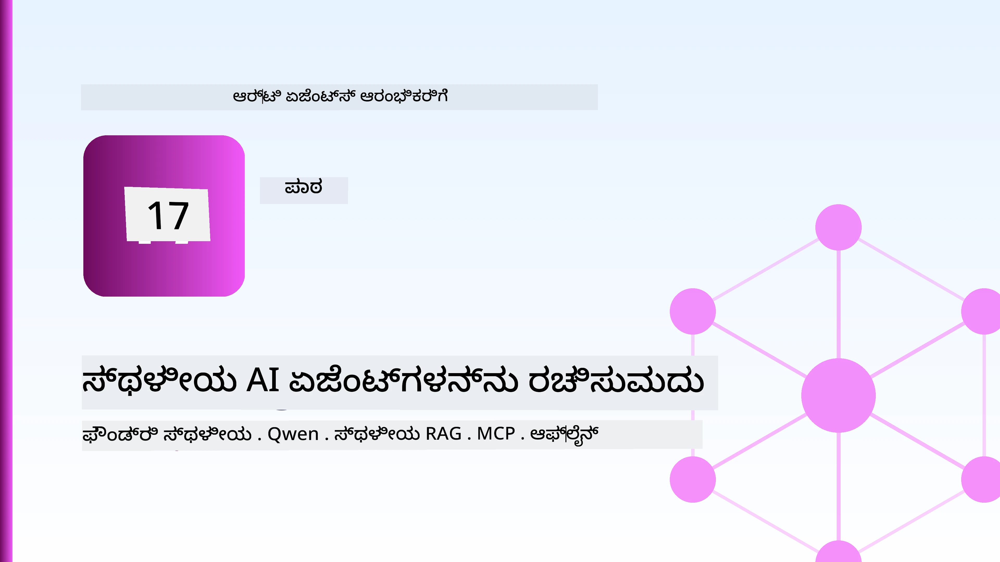
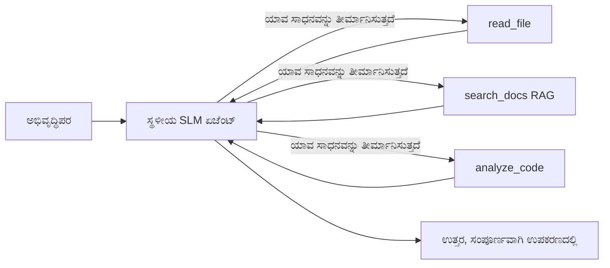
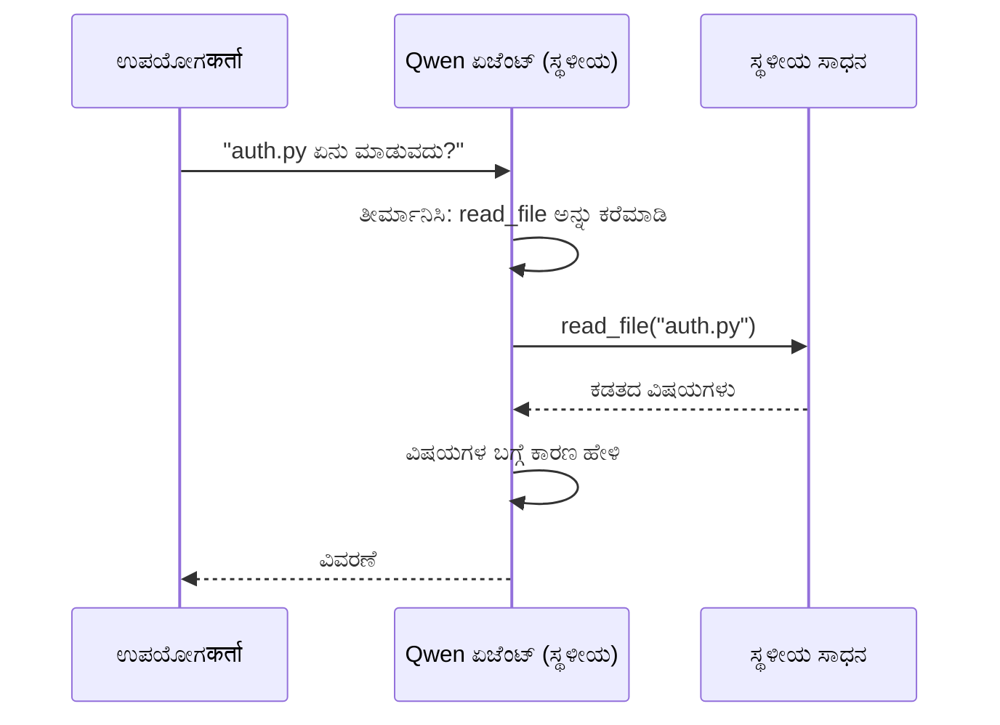
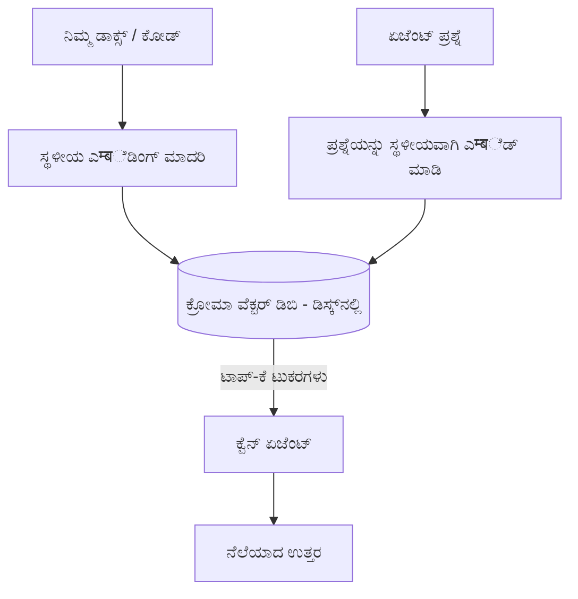
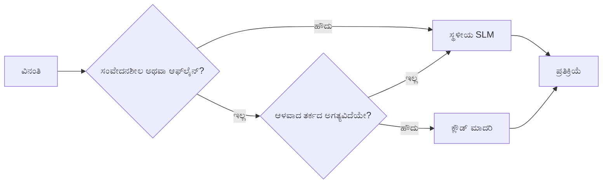

# ಮೈಕ್ರೋಸಾಫ್ಟ್ ಫೌಂಡ್ರಿ ಲೋಕಲ್ ಮತ್ತು ಕ್ವೆನ್ ಬಳಸಿ ಸ್ಥಳೀಯ AI ಏಜೆಂಟ್ಗಳನ್ನು ರಚಿಸುವುದು



ಹಿಂದಿನ ಪಾಠ ಏಜೆಂಟ್ಗಳನ್ನು ಮೆಘದಲ್ಲಿ *ಮೆಲುಕು* ಹಾಕಿದರೆ, ಈ ಪಾಠವು ಅವುಗಳನ್ನು ಒಂದು ಯಂತ್ರದಲ್ಲಿ *ಕೆಳಕ್ಕೆ* ತರುತ್ತದೆ. ಅಂತ್ಯಕ್ಕೆ ನೀವು ಕಾರ್ಯನಿರ್ವಹಿಸುವ ಎಂಜಿನಿಯರಿಂಗ್ ಸಹಾಯಕನನ್ನು ಹೊಂದಿರುವಿರಿ, ಅದು ತರ್ಕಮಾಡುತ್ತದೆ, ಸಾಧನಗಳನ್ನು ಕರೆಸುತ್ತದೆ, ನಿಮ್ಮ ಕಡತಗಳನ್ನು ಓದುತ್ತದೆ ಮತ್ತು ನಿಮ್ಮ ದಾಖಲೆಗಳನ್ನು ಹುಡುಕುತ್ತದೆ — **ಒಂದು ಮೆಘ ಅನ್ವೇಷಣೆಯ ಕರೆ ಇಲ್ಲದೆ.**

ನೀವು ಅದನ್ನು ಯಾಕೆ ಬಯಸಬೇಕು? ವಾಸ್ತವ ಎಂಜಿನಿಯರಿಂಗ್ ಕೆಲಸದಲ್ಲಿ ಮೂರು ಕಾರಣಗಳು ಇವೆ:

- **ಗೌಪ್ಯತೆ.** ಕೋಡ್ ಮತ್ತು ದಾಖಲೆಗಳು ಯಂತ್ರವನ್ನು ಬಿಟ್ಟು ಹೋಗುವುದಿಲ್ಲ. ಪ್ರಾಂಪ್ಟ್, ಸ್ನಿಪೆಟ್ ಅಥವಾ ಗ್ರಾಹಕ ಡೇಟಾ ನೆಟ್ವರ್ಕ್ ಗಡಿಯನ್ನು ದಾಟುವುದಿಲ್ಲ.
- **ಬೆಲೆ.** ಸ್ಥಳೀಯ ಅನ್ವೇಷಣೆಗೆ ಪ್ರತಿಯೊಂದು ಟೋಕನ್ ಶಕ್ತಿ ಬಿಲ್ಲು ಇಲ್ಲ. ನೀವು ವಿದ್ಯುತ್ ವೆಚ್ಚಕ್ಕೆ ದಿನಪೂರ್ತಿ ಪುನರಾವರ್ತಿಸಬಹುದು.
- **ಆಫ್‌ಲೈನ್.** ವಿಮಾನದೊಳಗೆ, ಸುರಕ್ಷಿತ ಸೌಲಭ್ಯದಲ್ಲಿ ಅಥವಾ ವಿದ್ಯುತ್ ನಷ್ಟ ಸಮಯದಲ್ಲಿ, ಏಜೆಂಟ್ ಇನ್ನೂ ಕಾರ್ಯನಿರ್ವಹಿಸುತ್ತದೆ.

ವ್ಯತ್ಯಾಸವೆಂದರೆ ನೀವು ಫ್ರಂಟಿಯರ್ ಕ್ಲೌಡ್ ಮಾದರಿಯನ್ನು **ಚಿಕ್ಕ ಭಾಷಾ ಮಾದರಿ (SLM)** ಗೆ ವಿನಿಮಯ ಮಾಡಿಕೊಳ್ಳುತ್ತಿದ್ದೀರಿ, ಅದು ನಿಮ್ಮ CPU, GPU ಅಥವಾ NPU ಮೇಲೆ चलता. ಈ ಪಾಠವು ಈ ಅಡ್ಡಿ ಒಳಗಿರುವ *ಚೆನ್ನಾಗಿರುವ* ಏಜೆಂಟ್ಗಳನ್ನು ಕಟ್ಟಿಕೊಳ್ಳುವುದರ ಬಗ್ಗೆ.

## ಪರಿಚಯ

ಈ ಪಾಠವು ಒಳಗೊಂಡಿದೆ:

- **ಚಿಕ್ಕ ಭಾಷಾ ಮಾದರಿಗಳು (SLMs)** — ಅವು ಏನು, ಎಲ್ಲಿಗೆ ಬೆಳಕು ಬೀಳುತ್ತದೆ ಮತ್ತು ಎಲ್ಲಿಗೆ ಬೀಳದು.
- **ಮೈಕ್ರೋಸಾಫ್ಟ್ ಫೌಂಡ್ರಿ ಲೋಕಲ್** — ಸಾಧನದಲ್ಲಿ ಮಾದರಿಗಳನ್ನು ಡೌನ್‌ಲೋಡ್ ಮಾಡಿ ಸಾಧ್ಯವಾದಂತೆ ಸೇವಿಸುವ ಕಾರ್ಯಾಚರಣಾ ವಾತಾವರಣ, **OpenAI ಹೊಂದಾಣಿಕೆಯನ್ನು ಹೊಂದಿರುವ API** ಮೂಲಕ.
- **ಕ್ವೆನ್ ಫಂಕ್ಷನ್-ಕಾಲಿಂಗ್ ಮಾದರಿಗಳು** — ಅತ್ಯಾಧುನಿಕ SLMಗಳು, ಅವು ಸಾಧನ ಕರೆಗಳನ್ನು ನಂಬಲಾರ್ಹವಾಗಿ ಉತ್ಪಾದಿಸುತ್ತವೆ, ಇದು ಸ್ಥಳೀಯ *ಏಜೆಂಟ್* ಗಳು ಮಾಡಲು ಸಾಧ್ಯವಾಗುತ್ತದೆ.
- **ಸ್ಥಳೀಯ ಸಾಧನಗಳು, ಸ್ಥಳೀಯ RAG ಮತ್ತು ಸ್ಥಳೀಯ MCP** — ಏಜೆಂಟ್‌ಗೆ ಮేఘವಿಲ್ಲದೆ ಶಕ್ತಿ ನೀಡುವವು.
- **ಹೈಬ್ರಿಡ್ ಮಾದರಿಗಳು** — ಯಾವಾಗದ್ದಕ್ಕೆ ಸ್ಥಳೀಯವಾಗಿರಬೇಕು ಮತ್ತು ಯಾವಾಗ ಮেঘವನ್ನು ಬಳಕೆ ಮಾಡಬೇಕು.

## ಅಧ್ಯಯನ ಗುರಿಗಳು

ಈ ಪಾಠ ಮುಗಿಸಿದ ಬಳಿಕ, ನೀವು ತಿಳಿದುಕೊಳ್ಳಲಿದ್ದೀರಿ ಹೇಗೆ:

- SLMಗಳ ವ್ಯತ್ಯಾಸಗಳನ್ನು ವಿವರಿಸಿ ಮತ್ತು ಅನ್ವಯಧರ್ಮಿ ಸ್ಥಳೀಯ ಏಜೆಂಟ್ ಬಳಕೆ ಪ್ರಕರಣಗಳನ್ನು ಆರಿಸಿಕೊಳ್ಳಿ.
- ಫೌಂಡ್ರಿ ಲೋಕಲ್ ಮೂಲಕ ಸ್ಥಳೀಯವಾಗಿ ಕ್ವೆನ್ ಮಾದರಿಯನ್ನು ಸೇವೆ ಮಾಡಿ, OpenAI ಹೊಂದಾಣಿಕೆಯ ಅಂತর্বಹ ಹಂಚಿಕೆಯನ್ನು ಬಳಸಿರಿ.
- ಸಂಪೂರ್ಣವಾಗಿ ನಿಮ್ಮ ಕಾರ್ಯಾಗಾರ ಯಂತ್ರದಲ್ಲಿ ನಡೆಯುವ ಸಾಧನ-ಕರೆ ಮಾಡೋ ಏಜೆಂಟ್ ಅನ್ನು ನಿರ್ಮಿಸಿ.
- ನಿಮ್ಮದೇ ದಾಖಲೆಗಳ ಮೇಲ್ವಿಚಾರಣೆಗಾಗಿ ಸ್ಥಳೀಯ RAG ಸೇರಿಸಿ, ಸ್ಥಳೀಯ ವೆಕ್ಟರ್ ಡೇಟಾಬೇಸ್ (ಕ್ರೋಮಾ) ಬಳಸಿ.
- ಏಜೆಂಟ್ ಅನ್ನು ಸ್ಥಳೀಯ MCP ಸರ್ವರ್ ಗೆ ಸಂಪರ್ಕಿಸಿ, ಹೈಬ್ರಿಡ್ ಸ್ಥಳೀಯ/ಮೇಘ ವಿನ್ಯಾಸಗಳ ಕುರಿತು ತರ್ಕಮಾಡಿ.

## ಪೂರ್ವಾಪೇಕ್ಷಿತಗಳು

ಈ ಪಾಠ ಪೂರ್ವ ಪಾಠಗಳನ್ನು ಮುಗಿಸಿರುವ ಮತ್ತು ಸ್ನಿಗ್ಧವಾಗಿ ಈ ವಿಷಯಗಳನ್ನು ತಿಳಿದಿರುವ ಮೊದಲು ಅಡಗಿದೆ:

- [ಸಾಧನ ಬಳಕೆ](../04-tool-use/README.md) (ಪಾಠ 4) ಮತ್ತು [ಏಜೆಂಟಿಕ್ RAG](../05-agentic-rag/README.md) (ಪಾಠ 5).
- [ಏಜೆಂಟಿಕ್ ಪ್ರೋಟೋಕಾಲ್ಸ್ / MCP](../11-agentic-protocols/README.md) (ಪಾಠ 11).
- [ಮೈಕ್ರೋಸಾಫ್ಟ್ ಏಜೆಂಟ್ ಫ್ರೇಮ್ವರ್ಕ್](../14-microsoft-agent-framework/README.md) (ಪಾಠ 14).

ನಿಮಗೆ ಬೇಕಾಗುವುದು:

- ಡೆವೆಲಪರ್ ವರ್ಕ್‌ಸ್ಟೇಷನ್. **8 GB RAM ಕನಿಷ್ಠವಾದ ಸಾಮರ್ಥ್ಯ**; 16 GB+ ಹೆಚ್ಚು ಆರಾಮದಾಯಕ. GPU ಅಥವಾ NPU ಸಹಾಯ ಮಾಡುತ್ತದೆ ಆದರೆ ಅವಶ್ಯಕವಲ್ಲ.
- **ಮೈಕ್ರೋಸಾಫ್ಟ್ ಫೌಂಡ್ರಿ ಲೋಕಲ್** ಸ್ಥಾಪಿತವಾಗಿರಬೇಕು (ಕೆಳಗಿನ ಸೆಟಪ್ ವಿಭಾಗ ನೋಡಿ).
- Python 3.12+ ಮತ್ತು ರೆಪೊದಲ್ಲಿ ಇರುವ ಪ್ಯಾಕೇಜುಗಳು [`requirements.txt`](../../../requirements.txt), ಜೊತೆಗೆ `foundry-local-sdk`, `openai`, ಮತ್ತು `chromadb` ಈ ಪಾಠಕ್ಕೆ.

## ಚಿಕ್ಕ ಭಾಷಾ ಮಾದರಿಗಳು: ಸ್ಥಳೀಯ ಕೆಲಸಕ್ಕೆ ಸೂಕ್ತ ಸಾಧನ

ಫ್ರಂಟಿಯರ್ ಕ್ಲೌಡ್ ಮಾದರಿಯು ನೂರಾರು ಬಿಲಿಯನ್ ಪ್ಯಾರಾಮೀಟರ್ ಇರುತ್ತವೆ ಮತ್ತು ಡೇಟಾ ಕೇಂದ್ರವನ್ನು ಹೊಂದಿರುತ್ತದೆ. SLM ಗಳು ಕೆಲವು ಬಿಲಿಯನ್ ಪ್ಯಾರಾಮೀಟರ್ ಗಳನ್ನು ಹೊಂದಿವೆ ಮತ್ತು ನಿಮ್ಮ ಲ್ಯಾಪ್‌ಟಾಪ್ ರ್ಯಾಮ್‌ನಲ್ಲಿ ಹೊಂದಿಬರುವಂತಿವೆ. ಆ ವ್ಯತ್ಯಾಸ ಸ್ಪಷ್ಟ ನಿರೀಕ್ಷೆಗಳನ್ನು ಹೊಂದಿಸಿದೆ.

**SLMಗಳು ಉತ್ತಮ ಕೆಲಸಗಳು:**

- ರಚಿತ, ನಿಯಮಿತ ಕಾರ್ಯಗಳು — ವರ್ಗೀಕರಣ, ತೆಗೆಯುವಿಕೆ, ಸಂಕ್ಷೇಪಣೆಯಾದ ಡಾಕ್ಯುಮೆಂಟ್.
- **ಸಾಧನ ಕರೆಯುವುದು** — ಯಾವ ಕಾರ್ಯವನ್ನು ಯಾವ arguments ಒದಗಿಸಿ ಕರೆಸಿಕೊಳ್ಳಬೇಕೆಂದು ನಿರ್ಧಾರ.
- ನಿಮ್ಮದೇ ಡೇಟಾ ಮೇಲೆ ವೇಗದ, ಅಗ್ಗದ, ಖಾಸಗಿ ಪುನರಾವೃತ್ತಿ.

**SLMಗಳು ದುರ್ಬಲ ಹಂತ:**

- ಮುಕ್ತ, ಹಲವಾರು ಹಂತ ತರ್ಕವಿದೆ.
- ವಿಶ್ವದ ವ್ಯಾಪಕ ಜ್ಞಾನ (ಅವರು ಕಡಿಮೆ ನೋಡಿರುವರು ಮತ್ತು ಹೆಚ್ಚು ಮರೆತುಹೋಗುತ್ತಾರೆ).

ಸೇರಿದಂತೆ ಸ್ಥಳೀಯ ಏಜೆಂಟ್ ಗೆ ಗೆಲ್ಲುವ ತಂತ್ರವೇ: **SLM ನಿರ್ವಹಣೆಯನ್ನು ಮಾಡಲಿ, ಸಾಧನಗಳು ಭಾರವಾದ ಕೆಲಸ ಮಾಡಲಿ.** ಮಾದರಿಯು ನಿಮ್ಮ ಕೋಡ್ಬೇಸ್ ಅನ್ನು *ತಿಳಿದುಕೊಳ್ಳಬೇಕಾಗಿಲ್ಲ* — ಅದು `read_file` ಮತ್ತು `search_docs` ಯಾವಾಗ ಕರೆಮಾಡಬೇಕೆಂದು ತಿಳಿದಿರಬೇಕು. ಇದು ನೇರವಾಗಿ SLM ಗೀಚುಗಳಿಗೆ ಪೂರಕ.



## ಮೈಕ್ರೋಸಾಫ್ಟ್ ಫೌಂಡ್ರಿ ಲೋಕಲ್

**ಮೈಕ್ರೋಸಾಫ್ಟ್ ಫೌಂಡ್ರಿ ಲೋಕಲ್** ಒಂದು ಲೈಟ್‌ವೇಟ್ ಕಾರ್ಯಾಚರಣೆ ವಾತಾವರಣ, ಇದು ಸಂಪೂರ್ಣವಾಗಿ ನಿಮ್ಮ ಯಂತ್ರದಲ್ಲಿ ಮಾದರಿಗಳನ್ನು ಡೌನ್‌ಲೋಡ್, ನಿರ್ವಹಿಸಿ, ಸೇವಿಸುತ್ತದೆ. ಅದರ ಪ್ರಮುಖ ವೈಶಿಷ್ಟ್ಯವೆಂದರೆ ಇದು **OpenAI ಹೊಂದಾಣಿಕೆಯನ್ನು ಹೊಂದಿರುವ HTTP ಅಂತರ್ಬಹ ಹಂಚಿಕೆ** ಒದಗಿಸುತ್ತದೆ — ಅಂದರೆ OpenAI SDK ಮತ್ತು ಮೈಕ್ರೋಸಾಫ್ಟ್ ಏಜೆಂಟ್ ಫ್ರೇಮ್ವರ್ಕ್‌ನ OpenAI ಕ್ಲೈಂಟ್ ಅದನ್ನು `base_url` ಬದಲಿಸುವುದರಿಂದ ಉಪಯೋಗಿಸಬಹುದು. ಏಜೆಂಟ್ ನಿರ್ಮಿಸುವ ಬಗ್ಗೆ ಕಲಿತ ಪ್ರತಿಯೊಂದು ವಿಷಯ ನೇರವಾಗಿ ಅನ್ವಯವಾಗುತ್ತದೆ; ಮಾತ್ರ ಅಂತರ್ಬಹ ಸ್ಥಳಾಂತರಮಾಡಿದೆಯೇ: ಮೆಘದಿಂದ `localhost`.

ಫೌಂಡ್ರಿ ಲೋಕಲ್ ನಿಮ್ಮ ಹಾರ್ಡ್ವೇರ್‌ಗೆ ಅತ್ಯುತ್ತಮ ಬಿಲ್ಡ್ ಆಯ್ದಿಕೊಳ್ಳುತ್ತದೆ — CPU ಬಿಲ್ಡ್, CUDA/GPU ಬಿಲ್ಡ್ ಅಥವಾ NPU ಬಿಲ್ಡ್ — ನೀವು ಪ್ರತಿಯೊಂದು ಯಂತ್ರಕ್ಕೆ ಕೈಯಿಂದ tốiಮೈಸಿಕೊಳ್ಳಬೇಕಾಗಿಲ್ಲ.

### ಸೆಟಪ್

ಫೌಂಡ್ರಿ ಲೋಕಲ್ ಸ್ಥಾಪಿಸಿ (ನಿಮ್ಮ OS ಗೆ [ದಾಖಲೆ](https://learn.microsoft.com/azure/ai-foundry/foundry-local/) ನೋಡಿ), ನಂತರ ವರ್ಕ್ ಆಗುತ್ತಿದೆಯೆಂದು ಖಚಿತಪಡಿಸಿಕೊಳ್ಳಿ:

```bash
# ಸ್ಥಾಪಿಸಿ (ಉದಾಹರಣೆ; ನಿಮ್ಮ ವೇದಿಕೆಗೆ ದಸ್ತಾವೇಜುಗಳನ್ನು ಅನುಸರಿಸಿ)
winget install Microsoft.FoundryLocal      # ವಿಂಡೋਜ਼್
# brew install microsoft/foundrylocal/foundrylocal   # macOS

# Qwen ಮಾದರಿಯನ್ನು ಡೌನ್ಲೋಡ್ ಮಾಡಿ ಚಾಲನೆ ಮಾಡಿ, ನಂತರ ಸ್ಥಳೀಯ ಸೇವೆಯನ್ನು ಪ್ರಾರಂಭಿಸಿ
foundry model run qwen2.5-7b-instruct
foundry service status
```

ಸೇವೆ ಚಾಲನೆಯಲ್ಲಿದ್ದರೆ ನಿಮಗೆ ಸ್ಥಳೀಯ, OpenAI ಹೊಂದಾಣಿಕೆಯ ಅಂತರ್ಬಹ (ಸಾಧಾರಣವಾಗಿ `http://localhost:PORT/v1`) ದೊರೆಯುತ್ತದೆ. ನೋಟ್ಬುಕ್ `foundry-local-sdk` ಜೊತೆಗೆ ಅಂತರ್ಬಹವನ್ನು ಸ್ವಯಂಚಾಲಿತವಾಗಿ ಕಂಡುಹಿಡಿಯುತ್ತದೆ, ಆದ್ದರಿಂದ ನೀವು ಪೋರ್ಟ್ ನ್ನು ಹಾರ್ಡ್-ಕೋಡ್ ಮಾಡಬೇಕಾಗಿಲ್ಲ.

## ಕ್ವೆನ್ ಫಂಕ್ಷನ್ ಕಾಲಿಂಗ್: ಏಕೆ ಇದು ಮುಖ್ಯ

ಏಜೆಂಟ್ ಎಂದರೆ ಸಾಧನಗಳನ್ನು ಕರೆಸಿಕೊಳ್ಳಬಲ್ಲದು ಮಾತ್ರವೇ ಏಜೆಂಟ್. ಹಲವು SLMಗಳು ಮಾತುಕತೆ ಮಾಡಬಹುದಾದರೂ ನಂಬಲಾರದ, ಅನಿಯಮಿತ ಸಾಧನ ಕರೆಗಳನ್ನು ಹೊರಹಾಕುತ್ತವೆ. **ಕ್ವೆನ್** ಮಾದರಿಗಳು ಕಾರ್ಯನಿರ್ವಹಣೆ ಕಲಿತಿದ್ದು ಸುಲಭವಾಗಿ ಸರಿಯಾದ ಸಾಧನ-ಕರೆ ರಚನೆಗಳನ್ನು ನಿಯಮಿತವಾಗಿ ಹೊರಹಾಕುತ್ತವೆ — ಇದೇ ಸ್ಥಳೀಯ ಚಾಟ್ ಮಾದರಿಯನ್ನು ಸ್ಥಳೀಯ *ಏಜೆಂಟ್* ಆಗಿ ಪರಿವರ್ತಿಸುತ್ತದೆ.

ಫ್ಲೋ ನಿಮಗೆ ಪರಿಚಿತವಾದ ಸಾಧನ-ಕರೆ ಲೂಪ್, ಕೇವಲ ಸಾಧನದಲ್ಲಿಯೇ ನಡೆಯುತ್ತಿದೆ:



## ಸ್ಥಳೀಯ RAG

ದಾಖಲೆ ಹುಡುಕುವುದು ಸ್ಥಳೀಯ ಏಜೆಂಟ್ ಗಳಿಗೆ ಮಹತ್ವದೆಂದು ಅರ್ಥ ಮಾಡಿಕೊಳ್ಳಬಹುದು. SLM ನಿಮ್ಮ ಫ್ರೇಮ್ವರ್ಕ್ ದಾಖಲೆಗಳನ್ನು ನೆನಪಿಸಿಕೊಂಡಿರುತ್ತಾನೆ ಎಂದು ಭರವಸೆ ಇಡದೆ, ನೀವು ಆ ದಾಖಲೆಗಳನ್ನು **ಸ್ಥಳೀಯ ವೆಕ್ಟರ್ ಡೇಟಾಬೇಸ್**ನಲ್ಲಿ ಸಂಗ್ರಹಿಸಿ, ಬೇಕಾದಾಗ ಏಜೆಂಟ್ ಅವುಗಳನ್ನು ಪಡೆಯುವುದು.

ನಾವು **ಕ್ರೋಮಾ** ಉಪಯೋಗಿಸುತ್ತೇವೆ, ಇದು ಸೇರ್ವರ್ ಇಲ್ಲದೆ ಪ್ರಕ್ರಿಯೆಯ ಒಳಗೆ ಡೇಟಾ ಸಂಗ್ರಹಿಸುವ ವೆಕ್ಟರ್ ಸ್ಟೋರ್. ಸುರಂಗ ಸಂಪೂರ್ಣವಾಗಿ ಸ್ಥಳೀಯ: ಸ್ಥಳೀಯ Embedding ಮಾದರಿ → ಸ್ಥಳೀಯ ವೆಕ್ಟರ್ ಗಳು → ಸ್ಥಳೀಯ ವಾಪಸ್ ಪಡೆಯುವುದು → ಸ್ಥಳೀಯ SLM.



ಇದು ಪಾಠ 5ನ ಏಜೆಂಟಿಕ್ RAG ಮಾದರಿಯೇ — ಬದಲಾವಣೆ ಕೇವಲ ಎಲ್ಲಾ ಘಟಕಗಳು ನಿಮ್ಮ ಯಂತ್ರದಲ್ಲಿ ನಡೆಯುವಂತಿದೆ.

## ಸ್ಥಳೀಯ MCP ಸರ್ವರ್ ಗಳು

[MCP](../11-agentic-protocols/README.md) ಸಾರಿಗೆ ವ್ಯವಸ್ಥೆಯಾಗಿದ್ದು, ಕ್ಲೌಡ್ ಸೇವೆಯಲ್ಲ. MCP ಸರ್ವರ್ ಅನ್ನು `stdio` ಮೇಲೆ ಸ್ಥಳೀಯ ಪ್ರಕ್ರಿಯೆಯಾಗಿ ಚಲಿಸುವಂತೆ ಮಾಡಬಹುದು, ಅದು ಸ್ಟ್ಯಾಂಡರ್ಡ್ ಪ್ರೋಟೋಕಾಲ್ ಮೂಲಕ ನಿಮ್ಮ ಏಜೆಂಟ್ ಗೆ ಸಾಧನಗಳನ್ನು ಲಭ್ಯವಾಗಿಸುತ್ತದೆ. ಇದರಿಂದ ನೀವು MCP ಸರ್ವರ್ ಗಳ ಬೆಳವಣಿಗೆಯ ಪರಿಸರವನ್ನು ಪುನಃ ಬಳಸಬಹುದು — ಫೈಲ್ ಸಿಸ್ಟಮ್ ಪ್ರವೇಶ, git ಕಾರ್ಯಚಟುವಟಿಕೆ, ಡೇಟಾಬೇಸ್ ವಿಚಾರಣೆಗಳು — ಸಂಪೂರ್ಣ ಆಫ್‌ಲೈನ್.

ಭದ್ರತಾ ಸ್ಥಿತಿ ಕ್ಲೌಡ್ ನೊಂದಿಗೆ ವ್ಯತ್ಯಾಸವಿದೆಯೇ ಆದರೂ ಇಲ್ಲದ ಮಾತ್ರವಲ್ಲ: ಸ್ಥಳೀಯ MCP ಸರ್ವರ್ ನಿಮ್ಮ ಬಳಕೆದಾರರ ಅನುಮತಿಗಳಲ್ಲಿ ಕಾರ್ಯಾಚರಿಸುತ್ತದೆ, ಆದ್ದರಿಂದ ಅದು ಸವುಮಿ ಸಮ್ಮಿತಿ (ಒಂದು ಪ್ರಾಜೆಕ್ಟ್ ಡೈರಕ್ಟರಿ ಮಾತ್ರ, ನಿಮ್ಮ ಸಂಪೂರ್ಣ ಹೋಮ್ ಫೋಲ್ಡರ್ ಅಲ್ಲ) ಹೊಂದಬೇಕು ಮತ್ತು ಅದರ ಔಟ್‌ಪುಟ್‌ಗಳನ್ನು ನಿರಂತರವಾಗಿ ಪರಿಶೀಲಿಸಿ.

## ಹೈಬ್ರಿಡ್ ಕ್ಲೌಡ್-ಮತ್ತು-ಲೋಕಲ್ ಮಾದರಿಗಳು

ಸ್ಥಳೀಯ-ಪ್ರಥಮ ಎಂದರೆ ಸ್ಥಳೀಯ ಮಾತ್ರವಲ್ಲ. ಸುತ್ತುವಲಯಗಳು ಸಂವೇದನಾಶೀಲತೆ ಮತ್ತು ಕಷ್ಟತೆ ಆಧಾರಿತವಾಗಿ ಬೇಟೆಯಾಡುತ್ತವೆ:

| ಸ್ಥಿತಿ | ಎಲ್ಲಿದೆ |
| --- | --- |
| ಸಂವೇದನಾಶೀಲ ಕೋಡ್ / ಡೇಟಾ, ಅಥವಾ ಆಫ್‌ಲೈನ್ | **ಸ್ಥಳೀಯ SLM** |
| ಸರಳ, ನಿಯಮಿತ ಕಾರ್ಯ | **ಸ್ಥಳೀಯ SLM** (ಕಡಿಮೆ, ವೇಗದ) |
| ಸಂಕೀರ್ಣ ಬಹು ಹಂತದ ತರ್ಕವು ಸಂವೇದನಾಶೀಲವಲ್ಲದ ಡೇಟಾದ ಮೇಲೆ | **ಕ್ಲೌಡ್ ಮಾದರಿ** |
| ಪ್ರತಿದಿನದ ಎಲ್ಲಾ ಸಂದರ್ಭಗಳಲ್ಲಿ, ವಿದ್ಯುತ್ ನಷ್ಟದ ವೇಳೆ | **ಸ್ಥಳೀಯ SLM** (ಸದೃಢ ಕುಸಿತ) |

ಇದು ಪಾಠ 16ರ **ಮಾದರಿ ರೌಟಿಂಗ್** ಕಲ್ಪನೆಯೇ — ಒಂದುವೇಳೆ "ಮಾದರಿಗಳಲ್ಲಿ" ಒಂದುವೇಳೆ ನಿಮ್ಮದೇ ಯಂತ್ರ. ಪ್ರಬಲ ವಿನ್ಯಾಸವು ಕ್ಲೌಡ್ ಲಭ್ಯವಿಲ್ಲದ ಬಾರಿಗೆ ಸ್ಥಳೀಯಕ್ಕೆ ಮರಳುತ್ತದೆ, ಆದ್ದರಿಂದ ಏಜೆಂಟ್ ಕಡಿಮೆ ಗುಣಮಟ್ಟದಲ್ಲಿ ದುರ್ಬಲಗೊಳ್ಳುತ್ತದೆ, ಸಂಪೂರ್ಣ ದೋಷಕ್ಕೆ ದಾರಿತೇಳುವುದಿಲ್ಲ.



## ಕೈಯೊಡ್ಡುವ ಪ್ರಯೋಗಶಾಲೆ: ಸ್ಥಳೀಯ ಎಂಜಿನಿಯರಿಂಗ್ ಸಹಾಯಕ

ತೆರೆಯಿರಿ [`code_samples/17-local-agent-foundry-local.ipynb`](./code_samples/17-local-agent-foundry-local.ipynb) ಮತ್ತು ಅದನ್ನು ಅನುಸರಿಸಿ. ನೀವು ನಿರ್ಮಿಸುವುದು ಪೂರ್ಣವಾಗಿ ನಿಮ್ಮ ಕೆಲಸಗಾರ ಯಂತ್ರದಲ್ಲಿ ನಡೆಯುವ **ಸ್ಥಳೀಯ ಎಂಜಿನಿಯರಿಂಗ್ ಸಹಾಯಕ**, ಅದು:

1. **ಸಾಧನಗಳನ್ನು ಕರೆಸುವುದು** — ಫೌಂಡ್ರಿ ಲೋಕಲ್ ಮೂಲಕ ಕ್ವೆನ್ ಫಂಕ್ಷನ್-ಕಾಲಿಂಗ್ ಮೂಲಕ.
2. **ಸ್ಥಳೀಯ ಕಡತ ಕಾರ್ಯಗಳು** — ಪ್ರಾಜೆಕ್ಟ್ ಡೈರಕ್ಟರಿಗೆ ಇರುವ ಕಡತಗಳ ಪಟ್ಟಿ ಮಾಡುವುದು ಮತ್ತು ಓದುವುದು.
3. **ಕೋಡ್ ವಿಶ್ಲೇಷಣೆ** — ಮೂಲ ಕಡತದ ಮೂಲಭೂತ ಅಂಕಿ-ಅಂಶಗಳನ್ನು ವರದಿ ಮಾಡುವುದು.
4. **ದಾಖಲೆಗಳನ್ನು ಹುಡುಕುವುದು** — ಕ್ರೋಮಾ ಬಳಸಿ *ಲೋಕಲ್ RAG*.
5. **MCP ಬಳಸುವುದು** — ಸ್ಥಳೀಯ MCP ಸರ್ವರ್ ಗೆ ಸಂಪರ್ಕ ಹೊಂದುವುದು (ಸ್ಥಾಪನೆ ಆಗಿಲ್ಲದಿದ್ದರೆ ಅದನ್ನು ಸದೃಢವಾಗಿ ಬಿಟ್ಟುಹಾಕುವುದು).

ಯಾವುದೇ ಮೆಘ ಅನ್ವೇಷಣೆಯ ಬಳಕೆ ಇಲ್ಲ.

### ಅನುಸರಣೆ

ಸಹಾಯಕವು OpenAI ಹೊಂದಾಣಿಕೆಯಾಗಿರುವ ಅಂತರ್ಬಹದಿಂದ ಫೌಂಡ್ರಿ ಲೋಕಲ್ ಗೆ ಸಂಪರ್ಕ ಹೊಂದುತ್ತದೆ, ಆದ್ದರಿಂದ ಏಜೆಂಟ್ ಕೋಡ್ ಕ್ಲೌಡ್ ಪಾಠಗಳಿಗಾಗಿ ಬಹಳ ಸಮಾನವಾಗಿರುತ್ತದೆ — ಮಾತ್ರ ಕ್ಲೈಂಟ್ ಬದಲಾಗಿದೆ:

```python
from foundry_local import FoundryLocalManager
from openai import OpenAI

# ಫೌಂಡ್ರೀ ಲೋಕಲ್ ಮಾದರಿಯನ್ನು ಕಂಡುಹಿಡಿದು/ಡೌನ್‌ಲೋಡ್ ಮಾಡುತ್ತದೆ ಮತ್ತು ನಮಗೆ ಸ್ಥಳೀಯ ಎಂಡ್ಪಾಯಿಂಟ್ ಅನ್ನು ನೀಡುತ್ತದೆ.
manager = FoundryLocalManager(\"qwen2.5-7b-instruct\")
client = OpenAI(base_url=manager.endpoint, api_key=manager.api_key)  # api_key ಒಂದು ಸ್ಥಳೀಯ ಪ್ಲೇಸ್‌ಹೋಲ್ಡರ್ ಆಗಿದೆ.
```

ಸಾಧನಗಳು ಸಾಮಾನ್ಯ Python ಕಾರ್ಯಗಳು, ಪ್ರಾಜೆಕ್ಟ್ ಡೈರಕ್ಟರಿಯನ್ನು ವ್ಯಾಪಿಸಿ:

```python
def read_file(path: str) -> str:
    \"\"\"Read a file, but only inside the sandboxed project directory.\"\"\"
    full = (PROJECT_ROOT / path).resolve()
    if PROJECT_ROOT not in full.parents and full != PROJECT_ROOT:
        return \"Access denied: path is outside the project directory.\"
    return full.read_text(encoding=\"utf-8\")
```

ಸ್ಯಾಂಡ್‌ಬಾಕ್ಸ್ ಪರಿಶೀಲನೆ ಗಮನಿಸಿ — ಸ್ಥಳೀಯದಲ್ಲಿಯೂ ಸಹ, ಯಾವುದಾದರೂ ಅರುಂಧ್ರ ಮಾರ್ಗಗಳನ್ನು ಓದುವ ಸಾಧನ ಜವಾಬ್ದಾರಿಯಾಗಿದೆ. ನೋಟ್ಬುಕ್ ಪ್ರತಿಯೊಂದು ಸಾಧನವನ್ನು ಒಂದೇ ಪ್ರಾಜೆಕ್ಟ್ ರೂಟ್ ಗೆ ಮಾತ್ರ ನಿಯೋಜಿಸುತ್ತದೆ.

## ಜ್ಞಾನ ಪರೀಕ್ಷೆ

ನಿಯೋಜನೆಗೆ ಹೋಗುವ ಮೊದಲು ನಿಮ್ಮ ಅರ್ಥಮಾಡಿಕೆಯಲ್ಲಿ ಪರೀಕ್ಷೆ ಮಾಡಿ.

**1. ಏಜೆಂಟನ್ನು ಕ್ಲೌಡ್ ಬದಲು ಸ್ಥಳೀಯವಾಗಿ ಚಲಿಸುವ ಎರಡು ನಿಖರ ಕಾರಣಗಳನ್ನು ನೀಡಿ.**

<details>
<summary>ಉತ್ತರ</summary>

ಯಾವುದೇ ಎರಡು: **ಗೌಪ್ಯತೆ** (ಕೋಡ್ ಮತ್ತು ಡೇಟಾ ಯಂತ್ರದಿಂದ ಹೊರಗೆ ಹೋಗುವುದಿಲ್ಲ), **ಬೆಲೆ** (ಪ್ರತಿ ಟೋಕನ್ ಅನ್ವೇಷಣೆಯ ಬಿಲ್ಲು ಇಲ್ಲ), ಮತ್ತು **ಆಫ್‌ಲೈನ್ ಸಾಮರ್ಥ್ಯ** (ನೆಟ್ವರ್ಕ್ ಇಲ್ಲದೆ ಕಾರ್ಯನಿರ್ವಹಿಸುವುದು — ವಿಮಾನ, ಸುರಕ್ಷಿತ ಸ್ಥಳ ಅಥವಾ ವಿದ್ಯುತ್ ನಷ್ಟ ಸಮಯದಲ್ಲಿ). ನಿಯಂತ್ರಣ/ಅನುಪಾಲನಾ ನಿಯಮಗಳು ಡೇಟಾ ಡಿವೈಸ್ ಹೊರಗೆ ಕಳುಹಿಸುವ ನಿರ್ಬಂಧವು ಪ್ರಮುಖ ಕಾರಣವಾಗಿದೆ.
</details>

**2. ಸ್ಥಳೀಯ ಏಜೆಂಟ್ ನಲ್ಲಿ SLM ಮತ್ತು ಅದರ ಸಾಧನಗಳ ನಡುವಿನ ಶಿಫಾರಸು ಮಾಡಿದ ಕೆಲಸ ಬೆರಕು ಮತ್ತು ಕಾರಣವೇನು?**

<details>
<summary>ಉತ್ತರ</summary>

SLM **ನಿರ್ವಹಣೆ ಮಾಡಲಿ** (ಯಾವ ಸಾಧನವನ್ನು ಕರೆಸುವುದು ಮತ್ತು ಯಾವ.arguments ಜೊತೆಗೆ ಎಂದು ನಿರ್ಧರಿಸು) ಮತ್ತು **ಸಾಧನಗಳು ಭಾರವಾದ ಕೆಲಸ ಮಾಡಲಿ** (ಕಡತಗಳನ್ನು ಓದುವುದು, ದಾಖಲೆಗಳನ್ನು ತರುತ್ತದೆ, ಫಲಿತಾಂಶಗಳನ್ನು ಗಣನೆ ಮಾಡುವುದು). SLMಗಳು ನಿರ್ಧಾರಗಳಲ್ಲಿ ಬಲಿಷ್ಠವಾಗಿದ್ದು ಆದರೆ ವ್ಯಾಪಕ ಜ್ಞಾನ ಮತ್ತು ದೀರ್ಘ ಅನೇಕ ಹಂತದ ತರ್ಕದಲ್ಲಿ ದುರ್ಬಲ, ಆದ್ದರಿಂದ ಸಾಧನಗಳ ಮೇಲೆ ಅವಲಂಬಿಸುವುದು ಅವರ ಬಲಗಳಿಗೆ ಒಪ್ಪಂದ.
</details>

**3. ಫೌಂಡ್ರಿ ಲೋಕಲ್ ನಲ್ಲಿ ಕ್ಲೌಡ್ ಏಜೆಂಟ್ ಕೋಡ್ ಮರುಬಳಕೆಗೆ ಸಾಧ್ಯವಾಗುವುವುದಕ್ಕೆ ಕಾರಣವೇನು?**

<details>
<summary>ಉತ್ತರ</summary>

ಫೌಂಡ್ರಿ ಲೋಕಲ್ ಒಂದು **OpenAI ಹೊಂದಾಣಿಕೆಯ HTTP ಅಂತರ್ಬಹ** ಒದಗಿಸುತ್ತದೆ. OpenAI SDK ಮತ್ತು ಏಜೆಂಟ್ ಫ್ರೇಮ್ವರ್ಕ್‌ನ OpenAI ಕ್ಲೈಂಟ್ ಅದನ್ನು `base_url` ಬದಲಿಸುವ ಮೂಲಕ ಉಪಯೋಗಿಸುತ್ತವೆ (ಸ್ಥಳೀಯ ಪ್ಲೇಸ್‌ಹೋಲ್ಡರ್ API ಕೀ ಬಳಸಿ). ಏಜೆಂಟ್ ಕೋಡ್ ಕುರಿತು ಇತರೆ ಎಲ್ಲವೂ ಅದೇ ಹಾಗೆ ಇದೆ.
</details>

**4. ಯಾವ ಕಾರಣಕ್ಕಾಗಿ ನಾವು ಯಾವುದೇ SLM ಬದಲು ಕ್ವೆನ್ ಫಂಕ್ಷನ್-ಕಾಲಿಂಗ್ ಮಾದರಿಯನ್ನು ಉಪಯೋಗಿಸುತ್ತೇವೆ?**

<details>
<summary>ಉತ್ತರ</summary>

ಏಜೆಂಟ್ ನಂಬಲಾರ್ಹ, ಒಳ್ಳೆಯ ಶೈಲಿಯ **ಸಾಧನ ಕರೆಗಳನ್ನು** ಹೊರಹಾಕಬೇಕು. ಹಲವಾರು SLMಗಳು ಮಾತುಕತೆ ಮಾಡಬಹುದು ಆದರೆ ಅಸ್ವದೃಢ ಅಥವಾ ಅಸಮಂಜಸ ಸಾಧನ-ಕರೆ ರಚನೆಗಳನ್ನು ನೀಡುತ್ತವೆ. ಕ್ವೆನ್ ಮಾದರಿಗಳು ಕಾರ್ಯನಿರ್ವಹಣೆ ಕಲಿತಿದ್ದು ಸತತವಾಗಿ ಸಾಧನ ಕರೆಗಳನ್ನು ನೀಡುತ್ತವೆ, ಇದು ಸ್ಥಳೀಯ ಚಾಟ್ ಮಾದರಿಯನ್ನು ಕಾರ್ಯನಿರ್ವಹಿಸುವ ಸ್ಥಳೀಯ ಏಜೆಂಟ್ ಆಗಿ ಪರಿವರ್ತಿಸುತ್ತದೆ.
</details>

**5. ಸ್ಥಳೀಯ RAG ಪೈಪ್‌ಲೈನ್‌ನಲ್ಲಿ ಯಾವ ಘಟಕಗಳು ಯಂತ್ರದಲ್ಲಿ ನಡೆಯುತ್ತವೆ?**

<details>
<summary>ಉತ್ತರ</summary>

ಎಲ್ಲವೂ: embedding ಮಾದರಿ, ವೆಕ್ಟರ್ ಡೇಟಾಬೇಸ್ (ಕ್ರೋಮಾ, ಡಿಸ್ಕ್ ಮೇಲೆ), ವಾಪಸಿಗೊಳ್ಳುವ ಹಂತ ಮತ್ತು SLM. ದಾಖಲೆಗಳು ಸ್ಥಳೀಯವಾಗಿ embedding ಮಾಡಲ್ಪಡುತ್ತವೆ, ಸ್ಥಳೀಯವಾಗಿ ಸಂಗ್ರಹಿಸಲಾಗುತ್ತದೆ, ಸ್ಥಳೀಯವಾಗಿ ಪಡೆದಿರುತ್ತದೆ ಮತ್ತು ಸ್ಥಳೀಯ ಮಾದರಿ ವಶಪಡಿಸಿಕೊಂಡಿದೆ — ಯಾವುದೇ ಘಟಕವೂ ಮೆಘವನ್ನು ಸ್ಪರ್ಶಿಸುವುದಿಲ್ಲ.
</details>

**6. ಸ್ಥಳೀಯ MCP ಸರ್ವರ್ ನಿಮ್ಮ ಯಂತ್ರದಲ್ಲಿ ಚಲಿಸುವುದು ಅದನ್ನು ಸ್ವಯಂಚಾಲಿತವಾಗಿ ಸುರಕ್ಷಿತವಾಗಿಸುವುದೇ? ಇನ್ನೇನು ಮುನ್ಸೂಚನೆಗಳನ್ನು ತೆಗೆದುಕೊಳ್ಳಬೇಕು?**

<details>
<summary>ಉತ್ತರ</summary>

ಇಲ್ಲ. ಸ್ಥಳೀಯ MCP ಸರ್ವರ್ ನಿಮ್ಮ ಬಳಕೆದಾರರ ಅನುಮತಿಗಳೊಂದಿಗೆ ಕಾರ್ಯನಿರ್ವಹಿಸುತ್ತದೆ, ಆದ್ದರಿಂದ ಅದು ನಿಮ್ಮ ನಿಯಮಗಳು ತಲುಪಬಹುದಾದ ಎಲ್ಲವನ್ನೂ ತಲುಪಬಹುದು. ಅದನ್ನು ಅವಶ್ಯಕವಿರುವದಕ್ಕೆ (ಉದಾ: ಒಂದು ಪ್ರಾಜೆಕ್ಟ್ ಡೈರಕ್ಟರಿ, ನಿಮ್ಮ ಸಂಪೂರ್ಣ ಹೋಮ್ ಫೋಲ್ಡರ್ ಅಲ್ಲ) ಸೀಮಿತಗೊಳಿಸಿ ಮತ್ತು ಅದರ ಹೊರತುಪಡಿಸಿದ ನಿರ್ಗಮಗಳನ್ನು ಬಳಕೆ ಮಾಡುವ ಮುನ್ನ ಪರಿಶೀಲಿಸಿ.
</details>

**7. ಸ್ಥಳೀಯ ಮಾದರಿಯನ್ನು ಒಳಗೊಂಡಿರುವ ವಿವೇಕಯುತ ಹೈಬ್ರಿಡ್ ರೌಟಿಂಗ್ ನಿಯಮವನ್ನು ವಿವರಿಸಿ.**

<details>
<summary>ಉತ್ತರ</summary>

ಸಂವೇದನಾಶೀಲ ಅಥವಾ ಆಫ್‌ಲೈನ್ ವಿನಂತಿಗಳನ್ನು ಸ್ಥಳೀಯ SLM ಗೆ ಮಾರ್ಗನಿರ್ದೇಶಿಸಿ; ಸರಳ ನಿಯಮಿತ ಕೆಲಸಗಳನ್ನು ವೇಗ ಮತ್ತು ವೆಚ್ಚಕ್ಕಾಗಿ ಸ್ಥಳೀಯ SLM ಗೆ ಮಾರ್ಗ ಮಾಡಿ; ಸಂವೇದನಾಶೀಲವಲ್ಲದ ಡೇಟಾದ ಮೇಲೆ ಸಂಕೀರ್ಣ ಬಹು ಹಂತ ತರ್ಕಕ್ಕಾಗಿ ಕ್ಲೌಡ್ ಮಾದರಿಗೆ ಮಾರ್ಗ ಮಾಡಿ; ಮತ್ತು ಕ್ಲೌಡ್ ಲಭ್ಯವಿಲ್ಲದಿದ್ದರೆ ಸ್ಥಳೀಯ SLM ಗೆ ಮರಳಿಸಿ, ಏಜೆಂಟ್ ಗಮನಾರ್ಹ ಕುಸಿತಕ್ಕೆ ಬಿದ್ದು ಸಂಪೂರ್ಣ ದೋಷವಲ್ಲ. ಇದು ಮೂರ್ನೆ ಪಾಠದ ಮಾದರಿ ರೌಟಿಂಗ್ ಆಗಿದ್ದು, ಸ್ಥಳೀಯ ಯಂತ್ರವೂ ಮಾದರಿಗಳಲ್ಲೊಂದು.
</details>

**8. ಈ ಪಾಠದಲ್ಲಿ ಸ್ಥಳೀಯ ಏಜೆಂಟ್ ಚಾಲನೆಗೆ ಯಥಾರ್ಥ ಕನಿಷ್ಠ RAM ಹಾಗೂ ಹೆಚ್ಚಿನ RAM ದೇನು ಒದಗಿಸುತ್ತದೆ?**

<details>
<summary>ಉತ್ತರ</summary>

ಸುಮಾರು **8 GB** ಕನಿಷ್ಠ ನಿಜವಾದ ಸಂಖ್ಯೆ; 16 GB+ ಹೆಚ್ಚು ಆರಾಮದಾಯಕ. ಹೆಚ್ಚು RAM ದೊಡ್ಡ, ಸಾಮರ್ಥ್ಯವಂತ ಮಾದರಿಗಳನ್ನು ಚಾಲನೆ ಮಾಡಲು ಮತ್ತು ಹೆಚ್ಚಿನ ಸನ್ನಿವೇಶವನ್ನು ನೆನಪಿನಲ್ಲಿ ಇಡಲು ಅವಕಾಶ ಕೊಡುವುದು. GPU ಅಥವಾ NPU ವೇಗವಾದ ಅನ್ವೇಷಣೆಗೆ ಉಪಯೋಗವಾಗಬಹುದು ಆದರೆ ಅವಶ್ಯಕವಲ್ಲ — ಫೌಂಡ್ರಿ ಲೋಕಲ್ ಯಾವಾಗಲೂ ತ್ವರಿತ ಕಾರಕ ಇಲ್ಲದಿದ್ದಾಗ CPU ಬಿಲ್ಡ್ ಆಯ್ಕೆ ಮಾಡುತ್ತದೆ.
</details>

## ನಿಯೋಜನೆ

ಸ್ಥಳೀಯ ಎಂಜಿನಿಯರಿಂಗ್ ಸಹಾಯಕನನ್ನು ನಿಮ್ಮ ಆಯ್ಕೆಯ ಒಂದು ಚಿಕ್ಕ ಪ್ರಾಜೆಕ್ಟ್‌ಗೆ **ಸ್ಥಳೀಯ ದಾಖಲೆ ಪರಿಶೀಲಕ** ಆಗಿ ವಿಸ್ತರಿಸಿ (ಈ ರೆಪೊವಿನ ಪಾಠ ಮಂಗಳಭಾಗಗಳನ್ನು ಬಳಸಬಹುದು).

ನಿಮ್ಮ ಸಲ್ಲಿಕೆ ಈ ಕೆಳವುಗಳನ್ನು ಬಾಲಕೊಳ್ಳಬೇಕು:

1. ಕ್ರೋಮಾ ಬಳಸಿ ನಿಜವಾದ ಡಾಕ್ಸ್ / ಕೋಡ್ ಫೋಲ್ಡರ್ ಅನ್ನು ಸೂಚ್ಯಂಕಗೊಳಿಸಿ (ಕನಿಷ್ಠ ಐದು ಕಡತಗಳು).
2. `find_todos` ಸಾಧನ ಸೇರಿಸಿ, ಅದು ಪ್ರಾಜೆಕ್ಟ್ನಲ್ಲಿ `TODO`/`FIXME` ಕಾಮೆಂಟ್ ಗಳು ಇದ್ದರೆ ಸ್ಕ್ಯಾನ್ ಮಾಡಿ ಕಡತ ಮತ್ತು ಸಾಲಿನ ಸಂಖ್ಯೆಗಳಿಗೆ ವಿವರಣೆ ನೀಡುತ್ತದೆ — `read_file` ನಂತೆ ಸ್ಯಾಂಡ್‌ಬಾಕ್ಸ್ ಪರಿಶೀಲನೆಯನ್ನು ಉಳಿಸಿ.

3. **ಏಜೆಂಟ್‌ಗೆ ಮೂರು ಪ್ರಶ್ನೆಗಳನ್ನು ಕೇಳಿ** ಅದು ಟೂಲ್ಗಳನ್ನು ಸಂಯೋಜಿಸಲು ಬಲವಂತ ಪಡಿಸುತ್ತವೆ: ಒಂದು ಶುದ್ಧ RAG ಪ್ರಶ್ನೆ, ಒಂದು ವಿಶೇಷ ಕಡತವನ್ನು ಓದಿಕೊಳ್ಳಬೇಕಾದದ್ದು, ಮತ್ತು ಒಂದು TODOಗಳನ್ನು ಹುಡುಕಬೇಕಾದದ್ದು.
4. **ಅದರ ಸಮಯವನ್ನು ಅಳೆಯಿರಿ**: ಮೂರು ಪ್ರತಿಕ್ರಿಯೆಗಳ ಪ್ರತಿಯೊಂದರ ಕಾಲವನ್ನು ಅಳೆಯಿರಿ ಮತ್ತು ಅವುಗಳನ್ನು ಒಂದು ಮಾರ್ಕ್ಡೌನ್ ಸೆಲ್‌ನಲ್ಲಿ ಬರೆದುಕೊಳ್ಳಿ. ನಿಮ್ಮ ಉದ್ದೇಶಿತ ಕಾರ್ಯಪ್ರವಾಹಕ್ಕೆ ಲೇಟನ್ಸಿ ಪರೀಕ್ಷೆ ಸ್ವೀಕಾರಾರ್ಹವೆಂದು ತೀರ್ಮಾನಿಸಿ ಟಿಪ್ಪಣಿ ನೀಡಿ.

ನಂತರ ಈ ವಿಮರ್ಶಕನಿಗೆ **ನೀವು ಕ್ಲೌಡ್‌ಗೆ ಏನು ಸ್ಥಳಾಂತರಿಸುವಿರಿ ಮತ್ತು ಸ್ಥಳೀಯವಾಗಿ ಏನೇನನ್ನು ಉಳಿಸುವಿರಿ** ಎಂಬುದರ ಬಗ್ಗೆ ಒಂದು ಸಣ್ಣ ಪರಿಚ್ಛೇದ ಬರೆದು, ಮತ್ತು ಏಕೆ ಎಂದು ವಿವರಿಸಿ. ನೀವು ಸ್ಥಳೀಯ ಘಟಕಗಳು ಸರಿಯಾಗಿ ಜೋಡಿಸಲ್ಪಟ್ಟಿವೆ ಮತ್ತು ನಿಮ್ಮ ಸಂಯೋಜಿತ ತರ್ಕವು ಬಲವಾಗಿದೆಯೇ ಎಂಬುದರ ಮೇಲೆ ಅಂಕಗಳನ್ನು ಪಡೆಯುತ್ತೀರಿ — ಮಾದರಿ ಗುಣಮಟ್ಟದ ಮೇಲೆ ಅಲ್ಲ.

## ಸಾರಾಂಶ

ಈ ಪಾಠದಲ್ಲಿ ನೀವು ನಿಮ್ಮ ಸ್ವಂತ ಯಂತ್ರದಲ್ಲಿ ಸಂಪೂರ್ಣವಾಗಿ ಕಾರ್ಯನಿರ್ವಹಿಸುವ ಏಜೆಂಟ್ ಅನ್ನು ನಿರ್ಮಿಸಿದ್ದೀರಿ:

- **SLMs** ವೈಚಿತ್ರ್ಯಕ್ಕಾಗಿ ಗೌಪ್ಯತೆ, ವೆಚ್ಚ ಮತ್ತು ಆಫ್‌ಲೈನ್ ಕಾರ್ಯಾಚರಣೆಗಳನ್ನು ವಿನಿಮಯಮಾಡುತ್ತವೆ — ಮತ್ತು ಸ್ವಂತಬುದ್ಧಿತನದ ಬದಲು **ಟೂಲ್ಗಳನ್ನು ಆಯೋಜಿಸುವಾಗ** ಸ್ಪಷ್ಟವಾಗಿ ಪ್ರಭಾವಶಾಲಿಯಾಗಿರುತ್ತವೆ.
- **Foundry Local** ಯಂತ್ರದ ಹಿಂದೆ **OpenAI-ಸಮ್ಮತಿಯೊಂದಿಗಿನ ಎಂಜಿನ್ಳೆಟ್** ಕ್ಕೆ ಮಾದರಿಗಳನ್ನು ಸೇವೆ ಮಾಡುತ್ತದೆ, ಆದ್ದರಿಂದ ನಿಮ್ಮ ಕ್ಲೌಡ್ ಏಜೆಂಟ್ ಕೋಡ್ ಒಂದು ಸಾಲಿನ ಬದಲಾವಣೆಯೊಂದಿಗೆ ವರ್ಗಾಯಿಸಬಹುದು.
- **Qwen ಫಂಕ್ಷನ್ ಕರೆ ಮಾಡುವುದು ಮಾದರಿಗಳು** ವಿಶ್ವಾಸಾರ್ಹ ಸ್ಥಳೀಯ ಟೂಲ್ಕಾರಣೆಯನ್ನು ಸಾಧ್ಯಮಾಡುತ್ತವೆ — ಹೀಗಾಗಿ ಸ್ಥಳೀಯ *ಏಜೆಂಟ್‌ಗಳಿಗೂ* ಅವಕಾಶ ನೀಡುತ್ತದೆ.
- **ಸ್ಥಳೀಯ RAG** (Chroma) ಮತ್ತು **ಸ್ಥಳೀಯ MCP** ಯಂತ್ರ ತೊರೆದ ತಪ್ಪದೆ ಏಜೆಂಟ್‌ಗೆ ಸಾಮರ್ಥ್ಯವನ್ನು ನೀಡುತ್ತವೆ.
- **ಸಂಯೋಜಿತ ಮಾದರಿಗಳು** ಸಂವೇದನಾಶೀಲತೆ ಮತ್ತು ಕಷ್ಟದ ಆಧಾರದ ಮೇಲೆ ದಾರಿತಲು ಅವಕಾಶ ನೀಡುತ್ತವೆ, ಸ್ಥಳೀಯವು ಸೌಮ್ಯ ವಾಪಸಾಗುವಿಕೆಯಾಗಿ.

ಇದು ನಿಯೋಜನೆ ಚಕ್ರವನ್ನು ಪೂರ್ಣಗೊಳಿಸುತ್ತದೆ: ಪಾಠ 16 ನ ಪ್ರಮುಖ ಏಜೆಂಟ್ ಗಳನ್ನು ಮೈಕ್ರೋಸಾಫ್ಟ್ ಫೌಂಡ್ರಿಯಲ್ಲಿ ವಿಸ್ತರಿಸಿತು, ಮತ್ತು ಈ ಪಾಠವು ಅವುಗಳನ್ನು ಒಬ್ಬ ಒಂದು ವರ್ಕ್‌ಸ್ಟೇಷನ್‌ಗೆ ಕಡಿತಗೊಳಿಸಿತು. ಮುಂದಿನ ಪಾಠವು ನಿಯೋಜಿಸಲಾದ ಏಜೆಂಟ್ ಗಳನ್ನು ಸುರಕ್ಷಿತವಾಗಿಡುವ ಬಗ್ಗೆ ಪ್ರಸಕ್ತವಾಗಿದೆ.

## ಹೆಚ್ಚುವರಿ ಸಂಪನ್ಮೂಲಗಳು

- <a href="https://learn.microsoft.com/azure/ai-foundry/foundry-local/" target="_blank">Microsoft Foundry Local ಡಾಕ್ಯುಮೆಂಟ್</a>
- <a href="https://learn.microsoft.com/azure/ai-foundry/what-is-azure-ai-foundry" target="_blank">Microsoft Foundry ಡಾಕ್ಯುಮೆಂಟ್</a>
- <a href="https://learn.microsoft.com/en-us/agent-framework/overview/?wt.mc_id=youtube_26688_organicsocial_reactor&pivots=programming-language-python" target="_blank">Microsoft ಏಜೆಂಟ್ ಫ್ರೇಮ್ವರ್ಕ್</a>
- <a href="https://qwen.readthedocs.io/en/latest/framework/function_call.html" target="_blank">Qwen ಫಂಕ್ಷನ್ ಕರೆ ಡಾಕ್ಯುಮೆಂಟ್</a>
- <a href="https://modelcontextprotocol.io/" target="_blank">ಮಾದರಿ ಸಂದರ್ಭ ಪ್ರೋಟೋಕಾಲ್ (MCP)</a>
- <a href="https://docs.trychroma.com/" target="_blank">Chroma ವೆಕ್ಟರ್ ಡೇಟಾಬೇಸ್</a>

## ಹಿಂದಿನ ಪಾಠ

[ಸ್ಕೇಲಬಲ್ ಏಜೆಂಟ್‌ಗಳನ್ನು ನಿಯೋಜಿಸುವುದು](../16-deploying-scalable-agents/README.md)

## ಮುಂದಿನ ಪಾಠ

[AI ಏಜೆಂಟ್‌ಗಳು ಸುರಕ್ಷಿತವಾಗಿಸುವುದು](../18-securing-ai-agents/README.md)

---

<!-- CO-OP TRANSLATOR DISCLAIMER START -->
**ಅಸ್ವೀಕಾರ**:
ಈ ದಸ್ತಾವೇಜು AI ಅನುವಾದ ಸೇವೆ [Co-op Translator](https://github.com/Azure/co-op-translator) ಬಳಸಿ ಅನುವಾದಿಸಲಾಗಿದೆ. ನಾವು ನಿಖರತೆಯನ್ನು ಸಾಧಿಸಲು ಪ್ರಯತ್ನಿಸುತ್ತಿದ್ದರೂ, ದಯವಿಟ್ಟು ಗಮನಿಸಿ, ಸ್ವಯಂಚಾಲಿತ ಅನುವಾದಗಳಲ್ಲಿ ದೋಷಗಳು ಅಥವಾ ಅಸಡ್ಡೆಗಳು ಇರಬಹುದು. ಮೂಲ ಭಾಷೆಯಲ್ಲಿರುವ ಮೂಲ ದಸ್ತಾವೇಜು ಪ್ರಾಮಾಣಿಕ ಮೂಲವೆಂದು ಪರಿಗಣಿಸಬೇಕು. ಪ್ರಮುಖ ಮಾಹಿತಿಗಾಗಿ, ವೃತ್ತಿಪರ ಮಾನವ ಅನುವಾದವನ್ನು ಶಿಫಾರಸು ಮಾಡಲಾಗುತ್ತದೆ. ಈ ಅನುವಾದವನ್ನು ಬಳಸುವ ಮೂಲಕ ಉಂಟಾಗುವ ಯಾವುದೇ ತಪ್ಪು ಅರ್ಥಗಳ ಅಥವಾ ತಪ್ಪು ವ್ಯಾಖ್ಯಾನಗಳ ಬಗ್ಗೆ ನಾವು ಹೊಣೆಗಾರರಲ್ಲ.
<!-- CO-OP TRANSLATOR DISCLAIMER END -->