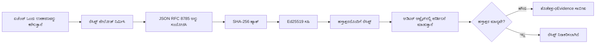
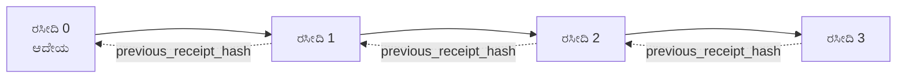

[ಪಾಠದ ವೀಡಿಯೊವನ್ನು ವೀಕ್ಷಿಸಿ: ಕ್ರಿಪ್ಟೋಗ್ರಾಫಿಕ್ ರಸೀದಿಗಳೊಂದಿಗೆ AI ಏಜೆಂಟ್ಗಳನ್ನು ಸುರಕ್ಷಿತಗೊಳಿಸುವುದು](https://youtu.be/PLACEHOLDER_VIDEO_ID)

> _(ಪಾಠದ ವೀಡಿಯೊ ಮತ್ತು ಥಂಬ್ನೇಲ್‌ಗಳು ಮರ್ಜ್ ನಂತರ ಮೈಕ್ರೋಸಾಫ್ಟ್ ವಿಷಯ ತಂಡದಿಂದ ಸೇರಿಸಲಾಗುವುದು, ಪಾಠ 14 / 15 ಮಾದರಿಯನ್ನು ಹೊಂದಿಸುವಂತೆ.)_

# ಕ್ರಿಪ್ಟೋಗ್ರಾಫಿಕ್ ರಸೀದಿಗಳೊಂದಿಗೆ AI ಏಜೆಂಟ್ಗಳನ್ನು ಸುರಕ್ಷಿತಗೊಳಿಸುವುದು

## ಪರಿಚಯ

ಈ ಪಾಠದಲ್ಲಿ ಈ ವಿಷಯಗಳನ್ನು ಕಾಣಲಿದ್ದೇವೆ:

- ಏಕೆ AI ಏಜೆಂಟ್ಗಳಿಗಾಗಿ ಆಡಿಟ್ ಟ್ರೇಲ್ಗಳು ಅನುಕೂಲತಾ ನಿಯಮ, ಡಿಬಗಿಂಗ್ ಮತ್ತು ನಂಬಿಕೆಗೆ ಅಗತ್ಯವಿದೆ.
- ಕ್ರಿಪ್ಟೋಗ್ರಾಫಿಕ್ ರಸೀದಿ ಎಂಬುದು ಏನು ಮತ್ತು ಅದು ಅಸೈನ್ ಮಾಡದ ಲಾಗ್ ಲೈನ್ ಇಂದ ಹೇಗೆ ಭಿನ್ನವಾಗಿದೆ.
- ಸಾಮಾನ್ಯ ಪೈಥಾನ್‌ನಲ್ಲಿ ಏಜೆಂಟಿನ ಟೂಲ್ ಕರೆಗಾಗಿ ಸಹಿ ಹಾಕಲಾದ ರಸೀದಿಯನ್ನು ಹೇಗೆ ಉತ್ಪಾದಿಸುವುದು.
- ರಸೀದಿಯನ್ನು ಆಫ್‌ಲೈನ್‌ನಲ್ಲಿ ಪರಿಶೀಲಿಸುವುದು ಮತ್ತು ತುರ್ತು ತಿದ್ದಿದರೆ ಗುರುತಿಸುವುದು.
- ರಸೀದಿಗಳನ್ನು ಸರಣಿಯಾಗಿ ಅಂಟಿಸುವುದು zodat ಒಂದು ರಸೀದಿಯನ್ನು ತೆಗೆಯುವುದು ಅಥವಾ ಪದನಿರೂಪಣೆಯನ್ನು ಮರುಗೊಟ್ಟು ಸರಣಿಯನ್ನು ಕೆಡಿಸುವುದು.
- ರಸೀದಿಗಳು ಸಾಬೀತುಪಡಿಸುವುದೆನು ಮತ್ತು ಸ್ಪಷ್ಟವಾಗಿ ಸಾಬೀತುಪಡಿಸುತ್ತವೆಯೇ ಇಲ್ಲವೇ ಎಂಬುದು.

## ಕಲಿಕೆ ಗುರಿಗಳು

ಈ ಪಾಠವನ್ನು ಪೂರ್ಣಗೊಳಿಸಿದ ನಂತರ, ನೀವು ಈದರ ಮೇಲೆ ಜ್ಞಾನ ಹೊಂದಿರುತ್ತೀರಿ:

- ಏಜೆಂಟ್ ಕ್ರಿಯೆಗಳ ಕ್ರಿಪ್ಟೋಗ್ರಾಫಿಕ್ ಮೂಲದ ಪ್ರೇರಣೆಗಾಗಿ ವೈಫಲ್ಯ ಮಾದರಿಗಳನ್ನು ಗುರುತಿಸುವುದು.
- ಕನನಿಕಲ JSON ಲೊಡ್ ಮೇಲಿನ Ed25519 ಸಹಿ ಹಾಕಲಾದ ರಸೀದಿಯನ್ನು ಸೃಷ್ಟಿಸುವುದು.
- ಸಹಿ ಮಾಡುವವರ ಸಾರ್ವಜನಿಕ ಕೀ ಯ ಬಳಕೆ ಮಾಡಿ ರಸೀದಿಯನ್ನು ಸ್ವತಂತ್ರವಾಗಿ ಪರಿಶೀಲಿಸುವುದು.
- ತಿದ್ದುಪಡಿ ಮಾಡಿ ಪರಿಶೀಲನೆ ಮರುಚಲಿಸುವ ಮೂಲಕ ತುರ್ತು ತಿದ್ದನ್ನು ಸೃಷ್ಟಿಸುವುದು.
- ರಸೀದಿಗಳ ಹ್ಯಾಶ್ ಸರಣಿಯನ್ನು ನಿರ್ಮಿಸಿ ಸರಣಿಯ ಮಹತ್ವವನ್ನು ವಿವರಿಸುವುದು.
- ರಸೀದಿ ಸಾಬೀತುಪಡಿಸುವ ಮತ್ತು ಇಲ್ಲದಿರುವ ಅಂಶಗಳ ಮಧ್ಯೆ ಸೀಮೆಯನ್ನು ಗುರುತಿಸುವುದು (ಹೊಂದಾಣಿಕೆ, ಅಖಂಡತೆ, ಕ್ರಮ, ಹಾಗೂ ಕ್ರಿಯೆಯ ಸರಿಯಾದತನ ಮತ್ತು ನೀತಿಪಾಲನೆಯ ಸಮರ್ಥನೆ).

## ಸಮಸ್ಯೆ: ನಿಮ್ಮ ಏಜೆಂಟ್‌ನ ಆಡಿಟ್ ಟ್ರೇಲ್

ನೀವು Contoso Travel ಗೆ AI ಏಜೆಂಟ್ ಅನ್ನು ನಿಯೋಜಿಸಿದ್ದನ್ನಾಗಿರಿ. ಏಜೆಂಟ್ ಗ್ರಾಹಕರ ವಿನಂತಿಗಳನ್ನು ಓದುತ್ತದೆ, ಫ್ಲೈಟ್ಸ್ API ಅನ್ನು ಕರೆಸಿ ಆಯ್ಕೆಗಳನ್ನು ಹುಡುಕುತ್ತದೆ ಮತ್ತು ಗ್ರಾಹಕರ ಪರವಾಗಿ ಸೀಟುಗಳನ್ನು ಬುಕ್ ಮಾಡುತ್ತದೆ. ಕಳೆದ ತ್ರೈಮಾಸಿಕದಲ್ಲಿ, ಏಜೆಂಟ್ 50,000 ಬುಕ್ಕಿಂಗ್ ಅನ್ನು ಪ್ರಕ್ರಿಯೆಗೊಳಿಸಿದೆ.

ಇಂದು ಆಡುವಿಟರ್ ಬರುತ್ತಾರೆ. ಅವರು ಸರಳ ಪ್ರಶ್ನೆ ಕೇಳುತ್ತಾರೆ: "ನಿಮ್ಮ ಏಜೆಂಟ್ ಏನು ಮಾಡಿತು ಎಂಬುದನ್ನು ತೋರಿಸಿ."

ನೀವು ನಿಮ್ಮ ಲಾಗ್ ಫೈಲ್‌ಗಳನ್ನು ನೀಡುತ್ತೀರಿ. ಆಡುವಿಟರ್ ಅವುಗಳನ್ನು ನೋಡುತ್ತಾರೆ ಮತ್ತು ಹೆಚ್ಚಿನ ಪ್ರಶ್ನೆ ಕೇಳುತ್ತಾರೆ: "ಈ ಲಾಗ್‌ಗಳು ಸಂಪಾದಿತವಾಗಿಲ್ಲ ಎಂದು ಹೇಗೆ ಖಚಿತಪಡಿಸಿಕೊಳ್ಳಬಹುದು?"

ಇದು ಆಡಿಟ್ ಟ್ರೇಲ್ ಸಮಸ್ಯೆಯಾಗಿದೆ. ಇಂದಿನ ಬಹುತೇಕ ಏಜೆಂಟ್ ನಿಯೋಜನೆಗಳು ಇವುಗಳ ಮೇಲ್ಭರಸೆ ಇಟ್ಟಿವೆ:

- **ಅಪ್ಲಿಕೇಶನ್ ಲಾಗ್‌ಗಳು**: ಏಜೆಂಟ್ ಸ್ವಯಂ ಬರೆಯುವವು, ಫೈಲ್ ಸಿಸ್ಟಮ್ ಪ್ರವೇಶ ಹೊಂದಿರುವ ಯಾರಾದರೂ ಸಂಪಾದಿಸಬಹುದು.
- **ಕ್ಲೌಡ್ ಲಾಗಿಂಗ್ ಸೇವೆಗಳು**: ವೇದಿಕೆ ಮಟ್ಟದಲ್ಲಿ ತುರ್ತುತಿದ್ದನ ಸಾಬೀತಾಗುತ್ತವೆ ಆದರೆ ಆಡುವಿಟರ್ ವೇದಿಕೆ ನಿರ್ವಹಣಾಪರನಂಬಿಕೆ ಇಟ್ಟರೆ ಮಾತ್ರ.
- **ಡೇಟಾಬೇಸ್ ವ್ಯವಹಾರ ಲಾಗ್‌ಗಳು**: ಡೇಟಾಬೇಸ್ ಬದಲಾವಣೆಗಳಿಗೆ ಸೂಕ್ತವಾಗಿವೆ ಆದರೆ ಸಾದೃಶ್ಯ ಹೆಜ್ಜೆ ಕರೆಗಳಿಗೆ ಅಲ್ಲ.

ಯಾವುದೂ ಆಡುವಿಟರ್ ಪ್ರಶ್ನೆಗೆ ಜವಾಬ್ ನೀಡಲು ಒಬ್ಬರಿಗೋ ಅಥವಾ ಇನ್ನಾರಿಗೋ ನಂಬಿಕೆ ಇರಬೇಕಾಗುತ್ತದೆ (ನೀವು, ನಿಮ್ಮ ಕ್ಲೌಡ್ ಪ್ರೊವೈಡರ್, ನಿಮ್ಮ ಡೇಟಾಬೇಸ್ ಮಾರಾಟಗಾರ). ಆಂತರಿಕ ಬಳಕೆಗೆ ಆ ನಂಬಿಕೆ ಸ್ವೀಕಾರ್ಯ ಆಗಬಹುದು. ನಿಯಂತ್ರಿತ ಭಾರಿತ ಕಾರ್ಯಗಳಿಗೆ (ಹಣಕಾಸು, ಆರೈಕೆ, EU AI ಕಾಯ್ದೆಯ ಒಳಗೆ ಬರುವವು) ಅದು ಆಗದು.

ಕ್ರಿಪ್ಟೋಗ್ರಾಫಿಕ್ ರಸೀದಿಗಳಿಂದ ಪ್ರತಿಯೊಂದು ಏಜೆಂಟ್ ಕ್ರಿಯೆ ಸ್ವತಂತ್ರವಾಗಿ ಪರಿಶೀಲಿಸಲ್ಪಡುತ್ತದೆ. ಆಡುವಿಟರ್ ನಿಮಗೆ ನಂಬಿಕೆ ಇರಬೇಕಾಗಿಲ್ಲ. ಅವರಿಗೆ ನಿಮ್ಮ ಸಾರ್ವಜನಿಕ ಕೀ ಮತ್ತು ರಸೀದಿ ಬೇಕಾಗುತ್ತದೆ.

## ಕ್ರಿಪ್ಟೋಗ್ರಾಫಿಕ್ ರಸೀದಿ ಎಂದರೇನು?

ರಸೀದಿ ಎನ್ನುವುದು ಏಜೆಂಟ್ ಏನು ಮಾಡಿತು ಎಂದು ದಾಖಲಿಸುವ JSON ವಸ್ತು, ಡಿಜಿಟಲ್ ಸಹಿಯನ್ನು ಸೇರಿಸಿ.



ಬಹುಸಾಮಾನ್ಯ ರಸೀದಿ ಹೀಗಿರುತ್ತದೆ:

```json
{
  "type": "agent.tool_call.v1",
  "agent_id": "contoso-travel-bot",
  "tool_name": "lookup_flights",
  "tool_args_hash": "sha256:a3f9c1...",
  "result_hash": "sha256:7b2e1d...",
  "policy_id": "contoso-travel-policy-v3",
  "timestamp": "2026-04-25T14:30:00Z",
  "sequence": 47,
  "previous_receipt_hash": "sha256:9d4e6a...",
  "signature": {
    "alg": "EdDSA",
    "sig": "c5af83...",
    "public_key": "8f3b2c..."
  }
}
```

ಮೂರು ಗುಣಲಕ್ಷಣಗಳು ಕೆಲಸ ಮಾಡುತ್ತಿವೆ:

1. **ಸಹಿ**. ರಸೀದಿ ಏಜೆಂಟ್ ಗೇಟ್‌ವೆಯ Ed25519 ಖಾಸಗಿ ಕೀ ಬಳಸಿ ಸಹಿ ಮಾಡಲಾಗಿದೆ. ಸಂಬಂಧಪಟ್ಟ ಸಾರ್ವಜನಿಕ ಕೀ ಹೊಂದಿದ್ದರೆ ಯಾವುದೇ ವ್ಯಕ್ತಿ ಆಫ್‌ಲೈನ್‌ನಲ್ಲಿ ಸಹಿಯನ್ನು ಪರಿಶೀಲಿಸಬಹುದು. ಯಾವುದೇ ಕ್ಷೇತ್ರ ತಿದ್ದುಪಡಿ ಸಹಿಯನ್ನು ಅಸಾಕ್ಷ್ಯಗೊಳಿಸುತ್ತದೆ.

2. **ಕನನಿಕಲ್ ಎಂಕೋಡಿಂಗ್**. ಸಹಿ ಮಾಡುವ ಮೊದಲು, JSON ಕನನಿಕಲೈಜೆಶನ್ ವ್ಯವಸ್ಥೆ (JCS, RFC 8785) ಬಳಸಿ ರಸೀದಿ ಸರಣಿಬದ್ಧಗೊಳ್ಳುತ್ತದೆ. ಇದು ಎರಡು ನಿರ್ವಹಣೆಗಳು ಸಮಾನ ಲಾಜಿಕಲ್ ರಸೀದಿಯನ್ನು ತಯಾರಿಸಿದಾಗ ಬಿಟ್-ಪರಿಪೂರ್ಣ ಹೊರತುಪಡಿಸುತ್ತದೆ. ಕನನಿಕಲೈಜೆಶನ್ ಇಲ್ಲದಿದ್ದರೆ, ವಿಭಿನ್ನ JSON ಸರಣಿಸರ್ಚಿಗಳು ಸಮಾನ ವಿಷಯಕ್ಕೆ ವಿಭಿನ್ನ ಸಹಿ ಉತ್ಪಾದಿಸುತ್ತವೆ.

3. **ಹ್ಯಾಶ್ ಸರಣೀಕರಣ**. `previous_receipt_hash` ಕ್ಷೇತ್ರವು ಪ್ರತಿ ರಸೀದಿಯನ್ನು ಹಿಂದಿನ ರಸೀದಿಗೆ ಲಿಂಕ್ ಮಾಡುತ್ತದೆ. ಒಂದು ರಸೀದಿಯನ್ನು ತೆಗೆದುಹಾಕುವ ಅಥವಾ ಮರುಕ್ರಮಗೊಳ್ಳಿಸುವುದು ನಂತರದ ಪ್ರತಿ ರಸೀದಿಯನ್ನು ಒಡೆಯುತ್ತದೆ. ತಿದ್ದುಪಡಿ ಸರಣಿಯ ಮಟ್ಟಿನಲ್ಲಿ ಗೋಚರಿಸುತ್ತದೆ signature individual bypass ಆಗಿದ್ದರೂ ಸಹ.

ಈ ಗುಣಲಕ್ಷಣಗಳು ಮೂರು ಖಾತ್ರಿ ನೀಡುತ್ತವೆ:

- **ಹೊಂದಾಣಿಕೆ**: ಈ ಕೀ ಈ ವಿಷಯಕ್ಕೆ ಸಹಿ ಹಾಕಿತು.
- **ಅಖಂಡತೆ**: ಸಹಿ ಮಾಡಿದ ನಂತರ ವಿಷಯ ಬದಲಾಗಿಲ್ಲ.
- **ಕ್ರಮ**: ಈ ರಸೀದಿ ಆ ರಸೀದಿಗೆ ಸರಣಿಯಲ್ಲಿ ಬಳಿಕ ಬಂದಿದೆ.

## ಪೈಥಾನ್‌ನಲ್ಲಿ ರಸೀದಿ ರಚನೆ

ರಸೀದಿ ರಚಿಸಲು ವಿಶೇಷ ಗ್ರಂಥಾಲಯ ಬೇಕಾಗುವುದಿಲ್ಲ. ಕ್ರಿಪ್ಟೋಗ್ರಾಫಿಕ್ ಮೂಲಭೂತಗಳು ವ್ಯಾಪಕವಾಗಿ ಲಭ್ಯವಿದ್ದು, ಲಾಜಿಕ್ ಕೆಲವು ಪೈಥಾನ್ ಸಾಲುಗಳಷ್ಟೇ.

`code_samples/18-signed-receipts.ipynb` ನಲ್ಲಿ ಕೈಯಲ್ಲಿ ಮಾಡುವ ಅಭ್ಯಾಸಗಳು ಸಂಪೂರ್ಣ ಪ್ರಕ್ರಿಯೆಯನ್ನು ವಿವರಿಸುತ್ತವೆ. ಸಂಕ್ಷಿಪ್ತ ಸಂಸ್ಕರಣೆ:

```python
import json
import hashlib
import base64
from nacl import signing
from jcs import canonicalize  # RFC 8785 ಮಾನಕ JSON

def b64url_nopad(data: bytes) -> str:
    return base64.urlsafe_b64encode(data).decode("ascii").rstrip("=")

def sha256_canonical(obj) -> str:
    """SHA-256 of a Python object's JCS-canonical JSON form."""
    return f"sha256:{hashlib.sha256(canonicalize(obj)).hexdigest()}"

# ಸಹಿ ಮಾಡಲು ಅಥವಾ ಲೋಡ್ ಮಾಡಲು ಕೀ (ನಿರ್ವಹಣೆಯಲ್ಲಿ, ಕೀ ವಾಲ್ಟ್‌ನಲ್ಲಿ ಸಂಗ್ರಹಿಸಿ)
signing_key = signing.SigningKey.generate()
verify_key = signing_key.verify_key

# ರಸೀದಿ ಪೇಲೋಡ್ ರಚನೆ ಮಾಡಿ (ಇನ್ನೂ ಸಹಿ ಇಲ್ಲ)
tool_args = {"origin": "SYD", "destination": "LAX"}
tool_result = [{"flight": "QF11", "price": 1850, "stops": 0}]

payload = {
    "type": "agent.tool_call.v1",
    "agent_id": "contoso-travel-bot",
    "tool_name": "lookup_flights",
    "tool_args_hash": sha256_canonical(tool_args),
    "result_hash": sha256_canonical(tool_result),
    "policy_id": "contoso-travel-policy-v3",
    "timestamp": "2026-04-25T14:30:00Z",
    "sequence": 0,
    "previous_receipt_hash": None,
}

# ಮಾನಕೀಕರಣ ಮಾಡಿ, ಹ್ಯಾಶ್ ಮಾಡಿ, ಸಹಿ ಮಾಡಿ.
canonical_bytes = canonicalize(payload)
message_hash = hashlib.sha256(canonical_bytes).digest()
signature_bytes = signing_key.sign(message_hash).signature

# ಸಂರಚಿತ ಸಹಿ ವಸ್ತುವನ್ನು ಜೋಡಿಸಿ.
receipt = {
    **payload,
    "signature": {
        "alg": "EdDSA",
        "sig": b64url_nopad(signature_bytes),
        "public_key": b64url_nopad(bytes(verify_key)),
    },
}
```

ಇದು ಸಂಪೂರ್ಣ ಸಹಿ ಪ್ರಕ್ರಿಯೆಯಾಗಿದೆ. ನೋಟ್‌ಬುಕ್‌ನಲ್ಲಿ ಪ್ರತಿಯೊಂದು ಹಂತವನ್ನು ಸ್ವತಃ ಮುಳುಗುವುದು.

## ರಸೀದಿಯನ್ನು ಪರಿಶೀಲಿಸುವುದು ಮತ್ತು ತಿದ್ದುಪಡಿ ಗುರುತಿಸುವುದು

ಪರಿಶೀಲನೆ ಪ್ರಕ್ರಿಯೆಯ ಪ್ರತ್ಯೇಕ ವಿಧವಾಗಿದೆ:

```python
import base64
import hashlib
from nacl import signing
from nacl.exceptions import BadSignatureError
from jcs import canonicalize

def b64url_decode(s: str) -> bytes:
    padding = "=" * ((4 - len(s) % 4) % 4)
    return base64.urlsafe_b64decode(s + padding)

def verify_receipt(receipt: dict) -> bool:
    # ಸಹಿ ಸಂರಚನಾತ್ಮಕ ವಸ್ತು: {"alg", "sig", "public_key"}.
    sig_obj = receipt.get("signature")
    if not sig_obj or sig_obj.get("alg") != "EdDSA":
        return False

    # ನಿಜವಾಗಿಯಾದರೂ ಸಹಿಯಾಗಿಸಿದ ಪೇಲೋಡ್ (ಸಹಿಯನ್ನು ಹೊರತುಪಡಿಸಿ ಎಲ್ಲವೂ) ಮರುನಿರ್ಮಾಣ ಮಾಡಿರಿ.
    payload = {k: v for k, v in receipt.items() if k != "signature"}

    canonical_bytes = canonicalize(payload)
    message_hash = hashlib.sha256(canonical_bytes).digest()

    try:
        verify_key = signing.VerifyKey(b64url_decode(sig_obj["public_key"]))
        verify_key.verify(message_hash, b64url_decode(sig_obj["sig"]))
        return True
    except BadSignatureError:
        return False
```

ಈ ಫಂಕ್ಷನ್ ಒಂದು ರಸೀದಿಯನ್ನು ತೆಗೆದು ಸಹಿ ಮಾನ್ಯವಾದಲ್ಲಿ `True` ನೀಡುತ್ತದೆ, ಇಲ್ಲದಿದ್ದರೆ `False`. ಯಾವುದೇ ಜಾಲ ಸಂಪರ್ಕ, ಸೇವಾ ಅವಲಂಬನೆ, ಮೂರನೇ ಪಕ್ಷದ ಮೇಲಿನ ನಂಬಿಕೆ ಇಲ್ಲದೆ.

ತಿದ್ದುಪಡಿ ಪತ್ತೆಮಾಡುವುದಕ್ಕಾಗಿ ನೋಟ್‌ಬುಕ್ ನೋಡಿ:

1. ಮಾನ್ಯ ರಸೀದಿ ಉತ್ಪಾದಿಸಿ, ಪರಿಶೀಲನೆ ಮಂಕುತಿರುಗಿಸುವಿಕೆ ದೃಢಪಡಿಸುವುದು.
2. `tool_args_hash` ಕ್ಷೇತ್ರದ ಒಂದೊಂದು ಬೈಟ್ ಬದಲಾಯಿಸುವುದು.
3. ಪರಿಶೀಲನೆಯನ್ನು ಮರುಚಲಿಸಿ ವಿಫಲವಾಗಿರುವುದು ನೋಡಿ.

ಇದು ತುರ್ತುತಿದ್ದನ ಸಾಬೀತಾಗಿರುವ عملي ಪ್ರದರ್ಶನ: ಯಾವುದೇ ಸಣ್ಣ ಬದಲಾವಣೆ ಸಹಿ ಒಡೆಯುತ್ತದೆ.

## ಬಹು ಹಂತ ಏಜೆಂಟ್‌ಗಳಿಗೆ ರಸೀದಿಗಳನ್ನು ಸರಣಿಗೊಳಿಸುವುದು

ಒಂದು ಸಹಿ ಹಾಕಲಾದ ರಸೀದಿ ಒಂದೇ ಕ್ರಿಯೆಯನ್ನು ರಕ್ಷಿಸುತ್ತದೆ. ರಸೀದಿಗಳ ಸರಣಿ ಕ್ರಮವನ್ನು ರಕ್ಷಿಸುತ್ತದೆ.



ಪ್ರತಿ ರಸೀದಿ ಹಿಂದಿನ ರಸೀದಿ ಹ್ಯಾಶ್ ಅನ್ನು ದಾಖಲಿಸುತ್ತದೆ. ರಸೀದಿ 2 ಅನ್ನು ಮೌನವಾಗಿ ತೆಗೆಯಲಿಕ್ಕಾಗಿಸಿದರೆ ಆಕ್ರಮಣಕಾರಿಯೂ ಇಲ್ಲದಿದ್ದರೆ:

- ರಸೀದಿ 3ರ `previous_receipt_hash` ಕ್ಷೇತ್ರವನ್ನು ಬದಲಾಯಿಸುತ್ತದೆ (ರಸೀದಿ 3ರ ಸಹಿ ಒಡೆಯುತ್ತದೆ), ಅಥವಾ
- ಬದಲಾಯಿಸಿದ ರಸೀದಿ 3 ಮೇಲೆ ಹೊಸ ಸಹಿಯನ್ನು ಮಾಡುತ್ತದೆ (ಏಜೆಂಟ್ ಖಾಸಗಿ ಕೀ ಅಗತ್ಯ).

ಖಾಸಗಿ ಕೀ হার್ಡ್‌ವೇರ್ ಕೀ ವಾಲ್ಟ್‌ನಲ್ಲಿ ಇದ್ದರೆ ಮತ್ತು ಸಾರ್ವಜನಿಕ ಕೀ ಪ್ರತಿಯೊಂದು ರಸೀದಿಯೊಂದಿಗೆ ಪ್ರಕಟಿಸಿದರೆ, ಈ ದಂಟನೆಗಳು ಪತ್ತೆಗೆ ಬರದೇ ಸಾಧ್ಯವಿಲ್ಲ.

ನೋಟ್‌ಬುಕ್ ಮೂಲಕ:

1. ಮೂರು ರಸೀದಿಗಳ ಸರಣಿ ನಿರ್ಮಾಣ.
2. ಪ್ರತಿಯೊಂದು ರಸೀದಿಯ `previous_receipt_hash` ಹಿಂದಿನ ರಸೀದಿ ಯಥಾರ್ಥ ಹ್ಯಾಶ್ ಗೆ ಸೇರುತ್ತದೆ ಎಂದು ಪರಿಶೀಲನೆ.
3. ಮಧ್ಯೆ ಒಂದರೊಂದಿಗೆ ತಿದ್ದುಪಡಿ ಮಾಡಿ ಸರಣಿ ಅವಿಭಾಜ್ಯವಾಗುವುದು ನೋಡಿ.

ಇದರ ಮೂಲಕ ನೀವು ಐದುಟಿಟರ್ ಗೆ ನಂಬಿಕೆ ಇಡದೆ ಹೊರಗಿನ ಆಡಿಟ್ ಟ್ರೇಲ್ ಸೃಷ್ಟಿಸುತ್ತೀರಿ.

## ರಸೀದಿಗಳು ಸಾಬೀತುಪಡಿಸುವುದು (ಮತ್ತು ಸಾಬೀತುಪಡಿಸುವುದಲ್ಲದಿರುವುದು)

ಈಗ ಪಾಠದ ಅತ್ಯಂತ ಮುಖ್ಯ ಭಾಗ. ರಸೀದಿಗಳು ಶಕ್ತಿಶಾಲಿಯಾಗಿವೆ ಆದರೆ ಅವರ ಶಕ್ತಿ ಮಿತಿಯಿದೆ.

**ರಸೀದಿಗಳು ಮೂರು ವಸ್ತುಗಳನ್ನು ಸಾಬೀತುಪಡಿಸುತ್ತವೆ:**

1. **ಹೊಂದಾಣಿಕೆ**: ನಿರ್ದಿಷ್ಟ ಕೀ ನಿರ್ದಿಷ್ಟ ಲೋಡ್ ಗೆ ಸಹಿ ಹಾಕಿದೆ.
2. **ಅಖಂಡತೆ**: ಸಹಿ ನಂತರ ಲೋಡ್ ಬದಲಾಗಿಲ್ಲ.
3. **ಕ್ರಮ**: ಈ ರಸೀದಿ ಆ ರಸೀದಿಯ ನಂತರ ಸರಣಿಯಲ್ಲಿ ಬರುತ್ತದೆ.

**ರಸೀದಿಗಳು ಸಾಬೀತುಪಡಿಸುವುದಿಲ್ಲ:**

1. **ಸರಿಯಾದತನ**: ಏಜೆಂಟ್ ಕ್ರಿಯೆ ಸರಿಯಾದ ಕ್ರಿಯೆಯೆಂದು ಸಾಬೀತಾಗುವುದಿಲ್ಲ. ತಡವಾದ ಉತ್ತರಕ್ಕೆ ಸಹ ಸಹಿ ಮಾಡಬಹುದು.
2. **ನೀತಿ ಅನುಸರಣಾ**: `policy_id`ನ ಪಾಲಿಸಿಕೊಂಡ ನಿಯಮ ಪರಿಕ್ಷೆಯಾಗಿದೆ ಅಥವಾ ಈ ಕ್ರಿಯೆ ಅನುಮತಿಸಲ್ಪಟ್ಟಿದೆಯೆ ಎಂಬುದು ಸಾಬೀತಾಗುವುದಿಲ್ಲ. ರಸೀದಿ ದಾಖಲುಮಾಡಿದ್ದು ಅಯ್ಯಿತು ಎಂದು ಮಾತ್ರ.
3. **ಕಿಯ ಭಿನ್ನವಾಗಿ ಸತ್ಯಾತೀತತೆ**: ರಸೀದಿ "ಈ ಕೀ ಈ ವಿಷಯಕ್ಕೆ ಸಹಿ ಹಾಕಿದೆ" ಎಂದು ಹೇಳುತ್ತದೆ; "ಈ ವ್ಯಕ್ತಿ ಅಥವಾ ಸಂಸ್ಥೆ ಅನುಮತಿಸಿದೆ " ಎಂದು ಹೇಳುವುದಿಲ್ಲ. ಇದು ವಿಭಿನ್ನ ಗುರುತು ವ್ಯವಸ್ಥೆಯನ್ನು ಅಗಲಾಗಿದೆ.
4. **ಪ್ರವೇಶಗಳ ಸತ್ಯತೆ**: ಏಜೆಂಟ್ ತಿದ್ದುಪಡಿಪಡಿಸಲಾದ ಪ್ರಾಂಪ್ಟ್ ಪಡೆದಿದ್ದರೆ ರಸೀದಿ ಕ್ರಿಯೆಯನ್ನು ನಂಬಿಕೆಪೂರ್ವಕವಾಗಿ ದಾಖಲಿಸುತ್ತದೆ. ರಸೀದಿ ಪ್ರವೇಶ ಪರಿಶೀಲನೆಯ ಪರ್ಯಾಯವಲ್ಲ.

ಈ ಸೀಮೆ ಎರಡು ಕಾರಣಗಳಿಂದ ಮುಖ್ಯ:

- ಇದು ನಿಮಗೆ ತಿಳಿಸುತ್ತದೆ ರಸೀದಿಗಳು ಏನಿಗೆ ಉಪಯುಕ್ತ: ಏಜೆಂಟ್ ವರ್ತನೆ ಪರಿಶೋಧನೀಯ ಮತ್ತು ತುರ್ತು ತಿದ್ದುಪಡಿ ಸಾಬೀತುಪಡಿಸಬಹುದು, ಸಂಘಟನಾತ್ಮಕ ವ್ಯಾಪ್ತಿಯಲ್ಲಿಯೂ ಕೂಡ.
- ಇನ್ನಷ್ಟು ಅಗತ್ಯವಿರುತ್ತವೆ: ಪ್ರವೇಶ ಪರಿಶೀಲನೆ (ಪಾಠ 6), ನೀತಿ ಕಾರ್ಯಗತಿಕೆ (ಕೆಲವೇನೆಲ್ಲ ವಿವರಿಸಲಾಗಿದೆ), ಗುರುತು ವ್ಯವಸ್ಥೆ (ಈ ಪಾಠದ ವ್ಯಾಪ್ತಿಗಿಂತ ಹೊರಗಿನದು).

ಸাধಾರಣ ತಪ್ಪು "ನಮ್ಮ ಬಳಿ ರಸೀದಿಗಳು ಇದ್ದವೆ" ಎಂದರೆ "ನಾವು ನಿಯಂತ್ರಣ ಹೊಂದಿದ್ದೇವೆ" ಎಂದು ಭ್ರಮೆ. ಅಲ್ಲ. ರಸೀದಿ ನೆಲೆಮಾಗಿದ್ದು ಗ್ರಾಹಕಿ ವ್ಯವಸ್ಥೆಯ ಅನುಷ್ಠಾನವಾಗಿದೆ.

## ಉತ್ಪಾದನಾ ಉಲ್ಲೇಖಗಳು

ಈ ಪಾಠದ ಪೈಥಾನ್ ಕೋಡ್ ಬಹುಮಾನವಾಗಿ ಕಡಿಮೆ ಇಡಲಾಗಿದೆ ಎಲ್ಲ ಸಾಲುಗಳನ್ನು ಓದಿ ಏನಾಗುತ್ತಿದೆಯೆಂದು ಅರ್ಥಮಾಡಿಕೊಳ್ಳಲು. ಉತ್ಪಾದನದಲ್ಲಿ ಎರಡು ಆಯ್ಕೆಗಳು:

1. **ಕ್ರಿಪ್ಟೋಗ್ರಾಫಿಕ್ ಮೂಲಭೂತಗಳಿಂದ ನೇರವಾಗಿ ನಿರ್ಮಿಸಿ.** ಮೇಲಿನ 50 ಸಾಲು ಹಲವಾರು ಬಳಕೆಗಳಿಗೆ ಸಾಕು. PyNaCl (Ed25519) ಮತ್ತು `jcs` ಪ್ಯಾಕೇಜ್ (ಕನನಿಕಲ JSON) ಉತ್ತಮ ನಿರ್ವಹಣೆ ಮತ್ತು ಪರಿಶೀಲನೆ ಹೊಂದಿವೆ.

2. **ಉತ್ಪಾದನಾ ರಸೀದಿ ಗ್ರಂಥಾಲಯ ಬಳಸಿ.** ಕೆಲವು ಓಪನ್ ಸೋರ್ಸ್ ಯೋಜನೆಗಳು ಅದೇ ಮಾದರಿಯನ್ನು ಹೆಚ್ಚುವರಿ ವೈಶಿಷ್ಟ್ಯಗಳೊಂದಿಗೆ (ಕೀ ಬದಲಾವಣೆ, ಬ್ಯಾಚ್ ಪರಿಶೀಲನೆ, JWK ಸೆಟ್ ವಿತರಣೆ, ನೀತಿ ಸಂಯೋಜನೆ) ಅನ್ವಯಿಸುತ್ತವೆ:
   - ಈ ಪಾಠದಲ್ಲಿ ಬಳಕೆಯಾದ ರಸೀದಿ ಸ್ವರೂಪವು IETF ಇಂಟರ್ನೆಟ್-ಡ್ರಾಫ್ಟ್ (`draft-farley-acta-signed-receipts`) ಯಂತೆ ಸ್ಥಾಂದರ್ಡ್ಸ್ ಪ್ರಕ್ರಿಯೆಗಳಲ್ಲಿ ಇದೆ.
   - ಮೈಕ್ರೋಸಾಫ್ಟ್ ಏಜೆಂಟ್ ಗವರ್ನನ್ಸ್ ಟೂಲ್‌ಕಿಟ್ ರಸೀದಿಗಳನ್ನು Cedar ಆಧಾರಿತ ನೀತಿ ನಿರ್ಣಯಗಳೊಡನೆ ಸಂಯೋಜಿಸುತ್ತದೆ; ಆ ಸಂಗ್ರಹಣೆಯಲ್ಲಿನ ಟ್ಯುಟೋರಿಯಲ್ 33 ಅನ್ನು ಪೂರಣ ಉದಾಹರಣೆಗೆ ನೋಡಿ.
   - `protect-mcp` (npm) ಮತ್ತು `@veritasacta/verify` (npm) ಪ್ಯಾಕೇಜುಗಳು ನೋಡ್ ಆಧಾರಿತ ರಸೀದಿ ಸಹಿ ಮತ್ತು ಆಫ್‌ಲೈನ್ ಪರಿಶೀಲನೆ ಒದಗಿಸುತ್ತವೆ, ಯಾವುದೇ MCP ಸೆರ್ವರ್ ಅನ್ನು ತುರ್ತು ತಿದ್ದಣೆಯ ಆಡಿಟ್ ಟ್ರೇಲ್ ಜೊತೆ ಸುತ್ತುವಂತೆ.
   - **[nobulex](https://github.com/arian-gogani/nobulex)** ಪೈಥಾನ್ SDK (`pip install nobulex`) Ed25519 + JCS ಸಹಿ ಮಾದರಿಯನ್ನು LangChain ಮತ್ತು CrewAI ಜತೆ ಸಂಯೋಜಿಸಿ ಒದಗಿಸುತ್ತದೆ, ಪ್ರಕಟಿತ ಕ್ರಾಸ್-ವ್ಯಾಲಿಡೇಶನ್ ಪರೀಕ್ಷಾ ವಿಕ್ಟರ್‌ಗಳೊಂದಿಗೆ ಮತ್ತು [OWASP PR #2210](https://github.com/OWASP/CheatSheetSeries/pull/2210) ಮೂಲಕ ಸಲ್ಲಿಸಿರುವ ಅನುಕೂಲ ಸಂಶೋಧನೆಯೊಂದಿಗೆ.

ನೀವು ಸ್ವಯಂ JWT ಗ್ರಂಥಾಲಯ ಬರೆಯುವುದು ಮತ್ತು ಪರೀಕ್ಷಿತ ಒಂದು ಬಳಸುವ ನಡುವಣಾ ನಿರ್ಣಯದಂತೆ ಈ ಪಾಠ ಸ್ವತಃ ಆರಂಭದಿಂದ ಲಕ್ಷ್ಯಪಡಿಸುವ ಮೂಲಕ ಮೂಲಭೂತಗಳನ್ನು ಒದಗಿಸುತ್ತದೆ.

## ಜ್ಞಾನ ಪರಿಶೀಲನೆ

ಕೈಗೊಂಡ ಪದಗಳಲ್ಲಿ ಅಭ್ಯಾಸ ಮಾಡಲು ಮುಂಚಿತವಾಗಿ ನಿಮ್ಮ ಅರ್ಥವನ್ನು ಪರಿಕ್ಷೆಮಾಡಿ.

**1. ರಸೀದಿಯನ್ನು ಏಜೆಂಟ್ ಖಾಸಗಿ Ed25519 ಕೀ ಬಳಸಿ ಸಹಿ ಮಾಡಲಾಗಿದೆ. ಆಡುವಿಟರ್ ಬಳಿ ಮಾತ್ರ ಸಾರ್ವಜನಿಕ ಕೀ ಇದೆ. ಆಡುವಿಟರ್ ಆಫ್‌ಲೈನ್‌ನಲ್ಲಿ ರಸೀದಿ ಪರಿಶೀಲಿಸಬಹುದೇ?**

<details>
<summary>ಪასუხ</summary>

ಹೌದು. Ed25519 ಪರಿಶೀಲನೆಗೆ ಒಂದೇ ಸಾರ್ವಜನಿಕ ಕೀ ಮತ್ತು ಸಹಿ ಮಾಡಿದ ಬೈಟ್ಸ್ ಬೇಕು. ಯಾವುದೇ ಜಾಲ ಕರೆ, ಸೇವಾ ಅವಲಂಬನೆ ಇಲ್ಲ. ಇದು ರಸೀದಿಗಳನ್ನು ಏರ್-ಘ್ಯಾಪ್ಡ್, ಬಹು-ಸಂಸ್ಥಾ, ಕಡಿಮೆ ನಂಬಿಕೆಯ ಆಡಿಟ್ ಅಂಗಗಳಲ್ಲಿ ಉಪಯುಕ್ತವಾಗಿಸುತ್ತದೆ.
</details>

**2. ಒಂದು ಆಕ್ರಮಣಕಾರಿ ರಸೀದಿಯ `policy_id` ಕ್ಷೇತ್ರವನ್ನು ಬದಲಾಯಿಸಿ ಹೆಚ್ಚು ಅನುಮತಿಪಟ್ಟ ನೀತಿಯನ್ನು ಹೇಳಲು ಬಯಸಿದರು. ಸಹಿ ಮೂಲ ಲೋಡ್ ಮೇಲೆ ಇದೆ. ಪರಿಶೀಲನೆ ಸಮಯದಲ್ಲಿ ಏನಾಗುತ್ತದೆ?**

<details>
<summary>ಪასუხ</summary>

ಪರಿಶೀಲನೆ ವಿಫಲವಾಗುತ್ತದೆ. ಸಹಿ ಅಮಲುಮಾಡಿದ ಮೂಲ ಲೋಡ್‌ನ ಕನನಿಕಲ್ ಬೈಟ್ಸ್ ಮೇಲೆ ಮಾಡಲಾಗಿದೆ; ಯಾವುದೇ ಕ್ಷೇತ್ರ ಬದಲಾಯಿಸಿದರೆ ಕನನಿಕಲ್ ಬೈಟ್ಸ್ ಬದಲಾಯಿSHA-256 ಹ್ಯಾಶ್ ಬದಲಾಗುತ್ತದೆ, ಇದು ಸಹಿಯನ್ನು ಅಸಾಕ್ಷ್ಯ ಮಾಡುತ್ತದೆ. ಆಕ್ರಮಣಕಾರಿ ಸರಿ ವ್ಯಾಪ್ತಿಯ ಸಹಿ ಮಾಡಲು ಖಾಸಗಿ ಕೀ ಬೇಕಾಗುತ್ತದೆ, ಅದು ಇಲ್ಲ.
</details>

**3. ರಸೀದಿ ಕಚ್ಚಾ ವಾದಗಳು ಮತ್ತು ಫಲಿತಾಂಶ ಬದಲು `tool_args_hash` ಮತ್ತು `result_hash` ಅನ್ನು ಸೇರಿಸಿರುವುದಕ್ಕೆ ಕಾರಣವೇನು?**

<details>
<summary>ಪასუხ</summary>

ಎರಡು ಕಾರಣಗಳು. ಮೊದಲನೆಯದಾಗಿ, ರಸೀದಿಯನ್ನು ಸಂಗ್ರಹಿಸಲು ಅಥವಾ ಬಾಹ್ಯಕ್ಕೆ ಕಳುಹಿಸಲು ಅಗಾಗ्छಾಗುವ ಪರಿಸರಗಳಲ್ಲಿ (PII, ವ್ಯಾಪಾರ ಮಾಹಿತಿ) ಸಮಸ್ಯೆಯಾಗಬಹುದು. ಹ್ಯಾಶಿಂಗ್ ರಸೀದಿಯನ್ನು ಸಣ್ಣದಾಗಿ ಮತ್ತು ವಿಷಯವನ್ನು ಖಾಸಗಿಯಾಗಿ ಇಡುವುದಕ್ಕೆ ಸಹಾಯ ಮಾಡುತ್ತದೆ; ಆಡುವಿಟರ್ ಹ್ಯಾಶ್ ನ ಸ್ಪಷ್ಟ ಪ್ರತಿಯನ್ನು ಹೊಂದಿರುವ ಮೂಲ ವಿಷಯದೊಂದಿಗೆ ಪರಿಶೀಲಿಸುತ್ತಾನೆ. ಎರಡನೆಯದಾಗಿ ಹ್ಯಾಶ್ ಗಳು ಸ್ಥಿರ ಗಾತ್ರದವು; ಹೀಗಾಗಿ ಬರ್ಹ ಇನ್‌ಪುಟ್ ಮತ್ತು ಔಟ್‌ಪುಟ್ ಗಾತ್ರವೂ ಮತ್ತಷ್ಟು ದೊಡ್ಡದಾಗಿದ್ದರೂ ರಸೀದಿ ಗಾತ್ರ ನಿರ್ಧಿಷ್ಟವಾಗಿರುತ್ತದೆ.
</details>

**4. `previous_receipt_hash` ಕ್ಷೇತ್ರವು ಪ್ರತಿ ರಸೀದಿಯನ್ನು ಹಿಂದೆಲೋವುದು. ಸರಣಿಯಲ್ಲಿ ಮಧ್ಯದಲ್ಲಿ ಒಂದು ರಸೀದಿಯನ್ನು ಮೌನವಾಗಿ ಅಳಿಸಿದರೆ ಏನು ಅಸಾಕ್ಷ್ಯವಾಗುತ್ತದೆ?**

<details>
<summary>ಪ.ascus</summary>

ಅಳಿಸಿದ ರಸೀದಿಯ ನಂತರವಿರುವ ಪ್ರತಿಯೊಂದು ರಸೀದಿ. ಅವುಗಳ `previous_receipt_hash` ಫೀಲ್ಡ್‌ಗಳು ಸರಣಿ ಯಥಾರ್ಥ ಮ್ಯಾಚ್ ಆಗುವುದಿಲ್ಲ (ಅವರು ಹೇಳಿದ ಅದು ಇಲ್ಲ, ಅಥವಾ ಸರಣಿ ಬೇರೆ ಹಿಂದಿನವರು ಕಡೆಗಣಿಸಿ). ಅಳಿಸಿಕೊಂಡುದನ್ನು ಮರೆಮಾಚಲು ಆಕ್ರಮಣಕಾರಿ ಪ್ರತಿಯೊಂದು ನಂತರದ ರಸೀದಿಯನ್ನು ಮರುಸಹಿ ಹಾಕಬೇಕಾಗುತ್ತದೆ, ಅದು ಖಾಸಗಿ ಕೀ ಬೇಕಾಗುತ್ತದೆ.
</details>

**5. ಒಂದು ರಸೀದಿ ಸ್ವಚ್ಛವಾಗಿ ಪರಿಶೀಲನೆಗೊಳ್ಳುತ್ತದೆ. ಅದರರ್ಥ ಏಜೆಂಟ್ ಕ್ರಿಯ ಬರುವುದೆನುನು ಸರಿಯಾದ, ನಿಗದಿತ ಅಥವಾ ನೀತಿ ಪಾಲನೆಯೊಂದಿಗೆ ಹೊಂದಿಕೊಳ್ಳುವುದೆಂದು ಸಾಬೀತಾಗುತ್ತದೆಯೆ?**

<details>
<summary>ಪ.ascus</summary>

ಇಲ್ಲ. ಮಾನ್ಯ ರಸೀದಿ ಮೂರು ವಸ್ತುಗಳನ್ನು ಸಾಬೀತುಪಡಿಸುತ್ತದೆ: ಹೊಂದಾಣಿಕೆ (ಈ ಕೀ ಈ ವಿಷಯಕ್ಕೆ ಸಹಿ ಹಾಕಿದೆ), ಅಖಂಡತೆ (ವಿಷಯ ಬದಲಾಗಿರಲಿಲ್ಲ), ಕ್ರಮ (ಈ ರಸೀದಿ ಆ ರಸೀದಿಯ ನಂತರ). ಇದು ಕ್ರಿಯೆಯ ಸರಿಯಾದತನ, `policy_id` ನಲ್ಲಿ ನೀಡಲಾದ ನೀತಿಯಾ ಪರಿಕ್ಷೆಯಾದದು ಅಥವಾ ಏಜೆಂಟ್ ಎಲ್ಲ ನಿಯಮ ಪಾಲಿಸಿದೆ ಎಂಬುದನ್ನು ಸಾಬೀತುಪಡಿಸುವುದಿಲ್ಲ. ರಸೀದಿಗಳು ಏಜೆಂಟ್ ವರ್ತನೆаuditable ಮಾಡುತ್ತವೆ, ತಪ್ಪು ಇಲ್ಲದೇ ಅಲ್ಲ. ಈ ಭಾಗ ಪಾಠದ ಅತ್ಯಂತ ಮುಖ್ಯ ದಡವಾಗಿದೆ.
</details>

## ಅಭ್ಯಾಸ ವ್ಯಾಯಾಮ

`code_samples/18-signed-receipts.ipynb` ತೆರೆಯಿರಿ ಮತ್ತು ಎಲ್ಲ ನಾಲ್ಕು ವಿಭಾಗಗಳನ್ನು ಪೂರ್ಣಗೊಳಿಸಿ:

1. **ಭಾಗ 1**: ನಿಮ್ಮ ಮೊದಲ ರಸೀದಿಗೆ ಸಹಿ ಹಾಕಿ ಅದನ್ನು ಪರಿಶೀಲಿಸಿ.
2. **ಭಾಗ 2**: ರಸೀದಿಗೆ ತಿದ್ದುಪಡಿ ಮಾಡಿ ಪರಿಶೀಲನೆ ವಿಫಲವಾಗುವುದು ನೋಡಿ.
3. **ಭಾಗ 3**: ಮೂರು ರಸೀದಿಗಳ ಸರಣಿ ರಚಿಸಿ ಸರಣಿ ಅಖಂಡತೆಯನ್ನು ಪರಿಶೀಲಿಸಿ.
4. **ಭಾಗ 4**: ಮೈಕ್ರೋಸಾಫ್ಟ್ ಏಜೆಂಟ್ ಫ್ರೇಮ್‌ವರ್ಕ್ ಬಳಸಿ ನಿರ್ಮಿಸಲಾದ ಏಜೆಂಟ್‌ಗೆ ಈ ಮಾದರಿಯನ್ನು ಅನ್ವಯಿಸಿ: ಟೂಲ್ ಕರೆ ರಸೀದಿ ಸಹಿ, ನಂತರ ರಸೀದಿಯನ್ನು ಸ್ವತಂತ್ರವಾಗಿ ಪರಿಶೀಲಿಸಿ.
**ಸ್ಟ್ರೆಚ್ ಚಾಲೆಂಜ್ 1:** ರಸೀದಿ ಸ್ಕೀಮಾವನ್ನು ನಿಮ್ಮ ಆಯ್ಕೆಯ ಮತ್ತೊಂದು ಕ್ಷೇತ್ರದಿಂದ ವಿಸ್ತರಿಸಿ (ಉದಾಹರಣೆಗೆ, ಟ್ರೇಸಿಂಗ್‌ಗಾಗಿ ವಿನಂತಿ ಐಡಿ), ಅದನ್ನು ಸೇರಿಸುವಂತೆ ಕಾನೊನಿಕಲ್ ಸೈನಿಂಗ್ ಲಾಜಿಕ್ ಅನ್ನು ಹಿಂಡಿಸಿ, ಮತ್ತು ರಸೀದಿ ಪರಿಶೀಲನೆಯ ಮೂಲಕ ಇನ್ನೂ ಸರಿಯಾಗಿ ಸಂಚರಿಸುತ್ತಿದೆಯೇ ಎಂದು ದೃಢೀಕರಿಸಿ. ನಂತರ ಸಹಿ ಮಾಡಿದ ನಂತರ ಕ್ಷೇತ್ರವನ್ನು ತಿದ್ದುಪಡಿಸಿ ಮತ್ತು ಪರಿಶೀಲನೆ ವಿಫಲವಾಗುವುದನ್ನು ದೃಢೀಕರಿಸಿ. ಇದು ಕಾನೊನಿಕಲ್ ಎನ್ಕೋಡಿಂಗ್‌ನ ಪ್ರತಿಯೊಂದು ಬೈಟ್ ಸಹಿ ಗೆ ಹೇಗೆ ಕೊಡುಗೆ ನೀಡುತ್ತದೆ ಎಂದು ನಿಮಗೆ ಅರ್ಥಮಾಡಿಕೊಳ್ಳಬೇಕಾಗುತ್ತದೆ.

**ಸ್ಟ್ರೆಚ್ ಚಾಲೆಂಜ್ 2:** ನಿಮ್ಮ ಎರಡು ರಸೀದಿಗಳನ್ನು SHA-256-ಹ್ಯಾಶ್ ಮಾಡಿ (ಅದರ ಕಾನೊನಿಕಲ್ ಬೈಟ್ಸನ್ನು ನಿರ್ಧಾರಾತ್ಮಕ ಕ್ರಮದಲ್ಲಿ ಸಂಯೋಜಿಸಿ) ಮತ್ತು ಸಹಿ ಮಾಡುವ ಮೊದಲು ಮೂರನೇ ರಸೀದಿಯ ಮೇಲೆ ಫಲಿತಾಂಶದ ಡೈಜೆಸ್ಟ್ ಅನ್ನು ಹೊಸ ಕ್ಷೇತ್ರವಾಗಿ ನಿಕ್ಷೇಪಿಸಿ. ಮೂರೂ ರಸೀದಿಗಳು ಇನ್ನೂ ಸರಿಯಾಗಿ ಸಂಚರಿಸುತ್ತವೆ ಎಂದು ಪರಿಶೀಲಿಸಿ. ನೀವು ಅಂದುಕೊಡಿದ ಮೊದಲ ಎರಡು ರಸೀದಿಗಳು ಸಹಿ ಮಾಡಿದ ಸಮಯದಲ್ಲಿ ಇದ್ದವು ಎಂದು ಮೂರನೇ ರಸೀದಿ ಹೊಂದಿರುವವರಾದರೆ ಯಾರಾದರೂ ಸಾಬೀತುಪಡಿಸಬಹುದು, ಅದರ ವಿವರಣೆ ಬಹಿರಂಗಪಡಿಸುವ ಅಗತ್ಯವಿದೆಯೆನುದನ್ನು ಇಲ್ಲದ್ದಾಗಿದೆ. ಇದು ಆಯ್ಕೆ-ಹ頭ಳಿಕೆ ರಸೀದಿಗಳಲ್ಲಿ (ಮರ್ಕಲ್ ಕಮಿಟ್‌ಮೆಂಟ್ಸ್, RFC 6962) ಉಪಯೋಗಿಸುವ ಮಾದರಿ.

## ಸಮಾರೋಪ

ಕ್ರಿಪ್ಟೋಗ್ರಾಫಿಕ್ ರಸೀದಿಗಳು AI ಏಜೆಂಟ್ಗೆ ಈ ಕೆಳಗಿನಂತಿರುವ ಆಡಿಟ್ ಟ್ರೇಲ್ ನೀಡುತ್ತವೆ:

- **ಸ್ವತಂತ್ರವಾಗಿ ಪರಿಶೀಲನೀಯ:** ಯಾವುದೇ ಪಕ್ಷವು ಸಾರ್ವಜನಿಕ ಕೀ ಹೊಂದಿದ್ದರೆ ಪರಿಶೀಲಿಸಬಹುದು, ಯಾವುದೇ ಸೇವೆ ಅವಲಂಬನೆಯಿಲ್ಲದೆ.
- **ಚಿಕೆಟ್-ನಿರ್ದೇಶಿತ:** ಯಾವುದೇ ಬದಲಾವಣೆಯನ್ನು ಸಹಿ ಅಮಾನ್ಯಗೊಳಿಸುತ್ತದೆ.
- **ಮೊಬೈಲಾಯಕ:** ರಸೀದಿ ಚಿಕ್ಕ JSON ಫೈಲ್ ಆಗಿದೆ; ಅದು ಸಂಗ್ರಹಿಸಬಹುದು, ಪ್ರಸಾರ ಮಾಡಬಹುದು ಮತ್ತು ಎಲ್ಲೆಡೆ ಪರಿಶೀಲಿಸಬಹುದು.
- **ಮಾನದಂಡಗಳಿಗೆ ಹೊಂದಿಕೊಳ್ಳುವ:** Ed25519 (RFC 8032), JCS (RFC 8785), ಮತ್ತು SHA-256 ಮೇಲೆ ನಿರ್ಮಿತವಾಗಿದ್ದು, ಎಲ್ಲೆಡೆ ಬಳಸುವ ಮೂಲಭೂತ ರೀತಿಗಳು.

ಅವು ಇನ್ಪುಟ್ ಮೌಲ್ಯಮಾಪನ, ನೀತಿನಿಯಮ ಜಾರಿಗೆ, ಅಥವಾ ವ್ಯಕ್ತಿತ್ವ ಮೂಲಸೌಕರ್ಯದ ಬದಲಿಗೆ ಅಲ್ಲ. ಅವು ಆ ಅಗಿರುವ ಸ್ಥರಗಳಿಗೆ ಆಧಾರವಾಗಿವೆ. ನೀವು ನಿಯಂತ್ರಿತ ಕೆಲಸದ ಭಾರಗಳು, ಬಹು-ಸಂಸ್ಥೆಗಳ ವರ್ಕ್‌ಫ್ಲೋಗಳು ಅಥವಾ ಭವಿಷ್ಯದ ಆಡಿಟರ್ ನಿಮಗೆ ವಿಶ್ವಾಸ ನೀಡುವುದಿಲ್ಲ ಎನ್ನಬಹುದಾದ ಯಾವುದೇ ಸನ್ನಿವೇಶಗಳಿಗೆ ಏಜೆಂಟ್ಗಳನ್ನು ನಿಯೋಜಿಸುವಾಗ, ರಸೀದಿಗಳು ನೀವು ಆಡಿಟ್ ಟ್ರೇಲ್ ಅನ್ನು ನಿಷ್ಠರಾಗಿ ಮಾಡುವ ಮಾರ್ಗ.

ಅತ್ಯಂತ ಪ್ರಮುಖವಾದ ಕಲಿಕೆಯ ವಿಷಯ: ರಸೀದಿಗಳು ಯಾರು ಏನು, ಯಾವಾಗ ಹೇಳಿದರು ಎಂದು ಸಾಬೀತುಪಡಿಸುತ್ತವೆ. ಅವು ಹೇಳಿದ ವಿಷಯವು ಸತ್ಯ ಅಥವಾ ಸರಿಯಾಗಿತ್ತು ಎಂದು ಸಾಬೀತುಪಡಿಸುವುದಿಲ್ಲ. ಆ ವಿಭಿನ್ನತೆಯನ್ನು ಕಟ್ಟಿ ಚಿಗುರುವಂತೆ ಇರಿಸಿ. ಇದು ನಿಷ್ಠಾವಂತ ಮೂಲನಿರ್ದೇಶನ ವ್ಯವಸ್ಥೆ ಮತ್ತು ತಪ್ಪು ಮುನ್ನಡೆಸುವೊಂದಕೆಯ ನಡುವಿನ ವ್ಯತ್ಯಾಸ.

## ಉತ್ಪಾದನಾ ಚೆಕ್‌ಲಿಸ್ಟ್

ನೀವು ಈ ಪಾಠದಿಂದ ರಸೀದಿ ಸಹಿ ಮಾಡಿದ ಏಜೆಂಟ್‌ಗಳನ್ನು ನೈಜ ಪರಿಸರದಲ್ಲಿ ನಿಯೋಜಿಸಲು ಸಿದ್ಧರಾದಾಗ:

- [ ] **ಸಹಿ ಮಾಡಲು ಕೀ ಅಭಿವೃದ್ಧಿಪಡಿಸುವ ಲ್ಯಾಪ್‌ಟಾಪ್‌ನಿಂದ ಹೊರಗೆ ತೆಗೆದು ಹಾಕಿ.** Azure Key Vault, AWS KMS ಅಥವಾ ಒಂದು ಹಾರ್ಡ್‌ವೇರ್ ಭದ್ರತಾ ಘಟಕವನ್ನು ಬಳಸಿರಿ. ನಿಮ್ಮ ರಸೀದಿಗಳನ್ನು ಸಹಿ ಮಾಡುವ ಖಾಸಗಿ ಕೀ ಎಂದಿಗೂ ಸೋರ್ಸ್ ಕಂಟ್ರೋಲ್ ಅಥವಾ ಅಪ್ಲಿಕೇಶನ್ ಯಂತ್ರಗಳಲ್ಲಿ ಪ್ಲೇನ್ ಟೆಕ್ಸ್ಟ್‌ನಲ್ಲಿರಬಾರದು.
- [ ] **ಪರಿಶೀಲನಾ ಸಾರ್ವಜನಿಕ ಕೀ ಅನ್ನು ಪ್ರಕಟಿಸಿ.** ಆಡಿಟರ್‌ಗಳು ಆಫ್‌ಲೈನ್ ಪರಿಶೀಲಿಸಲು ಇದನ್ನು ಬೇಕಾಗುತ್ತದೆ. ಮಾದರಿ JWK ಸೆಟ್ ಒಬ್ಬಕ್ಕೆ ಒಪ್ಪಿಗೆಯಾದ URL ನಲ್ಲಿ ಸ್ಟೋರೇಜ್ ಮಾಡಬೇಕು (RFC 7517), ಉದಾಹರಣೆ: `https://your-org.example.com/.well-known/agent-keys.json`.
- [ ] ** external ಸರಪಳಿ ಹೋಲಿಕೆಯನ್ನಿ ಠೇವಣಿ ಮಾಡಿ.** ನಿಯತಕಾಲಿಕವಾಗಿ ಇತ್ತೀಚಿನ ಸರಪಳಿ ತಲೆ ಹ್ಯಾಶ್ ಅನ್ನು ಪಾರದರ್ಶಕತ ಲಾಗ್ (Sigstore Rekor, RFC 3161 ಟೈಮ್ಸ್ಟ್ಯಾಂಪ್ ಪ್ರಾಧಿಕಾರ, ಅಥವಾ ಎರಡನೇ ಆಂತರಿಕ ವ್ಯವಸ್ಥೆ) ಗೆ ಬರೆಯಿರಿ, ಅಂತಹರೆ ಆ ಹೊರಗಿನ ಪಕ್ಷವು "ಈ ಸರಪಳಿ ಈ ಸಮಯದಲ್ಲಿ ಇತ್ತು" ಎಂದು ದೃಢೀಕರಿಸಬಹುದು.
- [ ] **ರಸೀದಿಗಳನ್ನು ಅಚಂಚಲವಾಗಿ ಸಂಗ್ರಹಿಸಿ.** Append-only ಬ್ಲಾಬ್ ಸ್ಟೋರೇಜ್ (ಅಜೂರ್ ಸ್ಟೋರೇಜ್ ಜತೆಅಚಂಚಲತೆ ನೀತಿಗಳು, AWS S3 αντικ объект್ ಲಾಕ್) ಒಂದು ಒಳಗಣ ಒಬ್ಬನಿಂದ ಇತಿಹಾಸವನ್ನು ಮರುಳಿಸುವುದನ್ನು ತಡೆಯುತ್ತದೆ.
- [ ] **ಆರಕ್ಷಣೆ ಅವಧಿ ನಿರ್ಧರಿಸಿ.** ಅನೇಕ ಅನುಕೂಲ ಚಟುವಟಿಕೆಗಳು ಬಹು ವರ್ಷಗಳ ಉಳಿಕೆ ಅವಶ್ಯಕತೆ ಇರುತ್ತದೆ. ರಸೀದಿ ವೃದ್ಧಿಗೆ ಯೋಜನೆ ರೂಪಿಸಿ (ಪ್ರತಿ ರಸೀದಿ ಸುಮಾರು 500 ಬೈಟ್; ದಿನಕ್ಕೆ 10,000 ಕರೆಗಳನ್ನು ಮಾಡುವ ಏಜೆಂಟ್ ವರ್ಷಕ್ಕೆ ಸುಮಾರು 1.8 GB ಉತ್ಪಾದಿಸುತ್ತದೆ).
- [ ] **ರಸೀದಿಗಳು ಏನು ಕವರ್ ಮಾಡುತ್ತವೆಯೆಂಬುದನ್ನು ದಾಖಲಿಸಿ.** ರಸೀದಿಗಳು ಹಕ್ಕುಪತ್ರ, ಅಖಂಡತೆ ಮತ್ತು ಕ್ರಮವನ್ನು ಸಾಬೀತಾಗಿಸುತ್ತವೆ. ನಿಮ್ಮ ಚಾಲನೆ ಪುಸ್ತಕವು ಸ್ಪಷ್ಟವಾಗಿ ಇನ್ಪುಟ್ ಮೌಲ್ಯಮಾಪನ, ನೀತಿಯಿಂದ ಜಾರಿಗೆ, ದರಮಿತಿ, ಮತ್ತು ವ್ಯಕ್ತಿತ್ವ ಮೂಲಸೌಕರ್ಯ ಮುಂತಾದ ಹೆಚ್ಚುವರಿ ನಿಯಂತ್ರಣಗಳು ರಸೀದಿಗಳೊಡನೆ ನಿಮ್ಮ ಆಡಳಿತ ಕ್ರಮದಲ್ಲಿ ಹೇಗೆ ಇರುತ್ತವೆ ತಿಳಿಸಬೇಕು.

### AI ಏಜೆಂಟ್‌ಗಳ ಭದ್ರತೆ ಕುರಿತು ಇನ್ನಷ್ಟು ಪ್ರಶ್ನೆಗಳಿವೆಯಾ?

ಮತ್ತು ಕಲಿಯೋವರು, ಕಾರ್ಯಾಲಯ ಸಮಯಗಳಲ್ಲಿ ಭಾಗವಹಿಸುವುದು, ನಿಮ್ಮ AI ಏಜೆಂಟ್ ಪ್ರಶ್ನೆಗಳಿಗೆ ಉತ್ತರ ಪಡೆಯಲು [Microsoft Foundry Discord](https://aka.ms/ai-agents/discord) ಸೇರಿ.

## ಈ ಪಾಠದ ನಂತರ

ಈ ಪಾಠವು ಏಕ-ರಸೀದಿ ಸಹಿ ಮತ್ತು ಹ್ಯಾಶ್-ಮುಂದುವರೆದ ಸರಣಿಗಳನ್ನು ಒಳಗೊಂಡಿದೆ. ಇದೇ ಮೂಲಭೂತ ತತ್ವಗಳು ನಿಮ್ಮ ಆಡಳಿತ ಕ್ರಮ ವೃದ್ಧಿಯಾದಂತೆ ನೀವು ದೃಷ್ಟಿಸುತ್ತಿರುವ ಹಲವಾರು ಉನ್ನತ ಮಾದರಿಗಳನ್ನು ನಿರ್ಮಿಸುತ್ತವೆ:

- **ಆಯ್ಕೆ-ಗುಪ್ತತೆ ಬಹಿರಂಗಪಡಿಸುವಿಕೆ.** ರಸೀದಿಯ ಕ್ಷೇತ್ರಗಳು ಸ್ವತಂತ್ರವಾಗಿ ಬದ್ಧರಾಗಿದ್ದಾಗ (RFC 6962 ಶೈಲಿಯ ಮರ್ಕಲ್ ಮರ), ನೀವು ನಿರ್ದಿಷ್ಟ ಕ್ಷೇತ್ರಗಳನ್ನು ನಿರ್ದಿಷ್ಟ ಆಡಿತ್ರ್ಗೆ ಬಹಿರಂಗಪಡಿಸಿ ಉಳಿದವುಗಳನ್ನು ಬದಲಾಯಿಸಲಾಗಿಲ್ಲ ಎಂದು ಸಾಬೀತುಪಡಿಸಬಹುದು ಆದರೆ ಅವುಗಳನ್ನು ಬಹಿರಂಗಪಡಿಸಬೇಕಾಗುವುದಿಲ್ಲ. ಇದು ಅದೇ ರಸೀದಿ ಸಮಗ್ರ ಆಡಿಟ್ (ಪೂರ್ಣತೆ ಬೇಕಾದುದು) ಮತ್ತು GDPR ಸರಕು ನಿಯಮಗಳಿಗೆ (ಆಡಿಟರ್ ಸಾಧ್ಯವೈಶಿಷ್ಟ್ಯ ಕಡಿಮೆ ನೋಡಬೇಕಾಗಿದೆ) ಎರಡೂ ಪೂರೈಸಬೇಕಾದಾಗ ಉಪಯೋಗವಾಗುತ್ತದೆ.
- **ರಸೀದಿ ರದ್ದತಿ.** ಸಹಿ ಮಾಡುವ ಕೀ ಭದ್ರತೆ ಕಳೆದುಕೊಂಡರೆ, ನೀವು ಆ ಕೀ ಸಹಿ ಮಾಡಿದ ಎಲ್ಲಾ ರಸೀದಿಗಳನ್ನು ಅಪ್ರತಿಮಾನವಾಗಿ ಗುರುತಿಸುವ ಮಾರ್ಗ ಬೇಕಾಗುತ್ತದೆ. ಮಾದರಿ: ಕಡಿಮೆ ಆಯುಷ್ ಹೊಂದಿರುವ ಸಹಿ ಕೀಗಳು ಮತ್ತು ಪ್ರಕಟಿತ ರದ್ದತಿ ಪಟ್ಟಿ ಅಥವಾ ರದ್ದತಿ ದಾಖಲಾತಿಗಳುಳ್ಳ ಪಾರದರ್ಶಕತ ಲಾಗ್.
- **ದ್ವಿಪಕ್ಷೀಯ / ಭಾಗ-ಸಹಿ ರಸೀದಿಗಳು.** ಕೆಲವು ಅನುಷ್ಠಾನಗಳು ಸಹಿ ಮಾಡಲಾದ ಪೇಲೋಡ್ ಅನ್ನು ಪೂರ್ವ-ನಿರ್ವಹಣೆ(`authorization_*`) ಮತ್ತು ಪ್ರತ್ಯೇಕ ಸಹಿಗಳೊಂದಿಗೆ ನಂತರ-ನಿರ್ವಹಣೆ(`result_*`) ವಿಭಾಗಗಳಾಗಿ ವಿಭಜಿಸುತ್ತವೆ, ಅಧಿಕಾರ ನಿರ್ಧಾರ ಮತ್ತು ಅವಲೋಕಿತ ಫಲಿತಾಂಶ ವಿಭಿನ್ನ ಕಾರ್ಯಕರ್ತರಿಂದ ಬೇರೆ ಸಮಯದಲ್ಲಿ ನಿರೀಕ್ಷಿಸಿದಾಗ ಉಪಯುಕ್ತ. ಇದನ್ನು ಈ ಪಾಠದಲ್ಲಿ ಕಲಿಸಿದ ರಸೀದಿ ಸ್ವರೂಪದ ಮೇಲೆ ಜೋಡಿಸಬಹುದು.
- **ಪೇಲೋಡ್ ಸಂಯೋಜನೆ.** ರಸೀದಿ ನೀವು `result_hash` ನಲ್ಲಿ ಹಾಕುವ ಯಾವುದೆ ಬೈಟ್ಸನ್ನಾಗಿರುವುದನ್ನು ಮುಚ್ಚುತ್ತದೆ. ನೈಜ ಜಗತ್ತಿನ ಪೇಲೋಡ್‌ಗಳು ಸಾಮಾನ್ಯವಾಗಿ ಒಂದೇ ಟೂಲ್ ಕರೆ ಫಲಿತಾಂಶಕ್ಕಿಂತ ಶ್ರೀಮಂತರಾಗಿದ್ದು: ಪೂರ್ವ ನಿರ್ಧಾರ ತರ್ಕ (ಮಾದರಿ ಭವಿಷ್ಯ ನುಡಿಪು, ಪರಿಗಣಿಸಿದ ಆಯ್ಕೆಗಳು, ಸಾಕ್ಷಿ ಮತ್ತು ಅದರ ಪೂರ್ಣತೆ, ಅಪಾಯ ಸ್ಥಿತಿಯನ್ನು, ಹೊಣೆಗಾರಿಕೆ ಸರಪಳಿ, ಗೇಟ್ ಫಲಿತಾಂಶ) ಎಲ್ಲವೂ ಪೇಲೋಡ್ ಒಳಗೆ ಇರಬಹುದಾಗಿದೆ, ಒಂದೇ ರಸೀದಿಯಿಂದ ಮೊದಲಾದ. ಇದು ರಸೀದಿ ಸ್ವರೂಪವನ್ನು ಕನಿಷ್ಠವಾಗಿರುವಂತೆ ಇರಿಸುತ್ತದೆ ಮತ್ತು ಪೇಲೋಡ್ ಸ್ಕೀಮಾ ಪ್ರತಿ ಕ್ಷೇತ್ರಕ್ಕನುಸಾರವಾಗಿ ವಿಸ್ತಾರಗೊಳ್ಳಲು ಬಿಡುತ್ತದೆ.
- **ಅನುಷ್ಠಾನದ ಮೀರಿನೊಡನೆ ಹೊಂದಾಣಿಕೆ.** ಒಂದೇ ರಸೀದಿ ಸ್ವರೂಪವನ್ನು ವಿಭಿನ್ನ ಅನುಷ್ಠಾನಗಳು (Python, TypeScript, Rust, Go) ಹೋಲಿಕೆಗೆ ಒಪ್ಪಿಕೊಳ್ಳುವ ಪ್ರಯೋಗ ಸಾಧ್ಯತೆಗಳನ್ನು ಹೊಂದಿವೆ. ನೀವು ನಿಮ್ಮ ಸ್ವಂತ ಅನುಷ್ಠಾನವನ್ನು ನಿರ್ಮಿಸಿದರೆ, ಪ್ರಕಟಿತ ಪರೀಕ್ಷಾ ಕ್ರಮವೊಂದರ ವಿರುದ್ಧ ಪರಿಶೀಲನೆ ವೈರ್ ಹೊಂದಾಣಿಕೆಯನ್ನು ದೃಢೀಕರಣ ಮಾಡುತ್ತದೆ.
- **ಪೋಸ್ಟ್-ಕ್ವಾಂಟಮ್ ವಲಸೆ.** Ed25519 ಈಗ ಪಾಪ್ಯುಲರ್ ಆದರೂ, ಇದು ಕ್ವಾಂಟಂ-ನಿರೋಧಕವಲ್ಲ. ರಸೀದಿ ಸ್ವರೂಪ ಅಲ್ಗೋರಿಥಂ-ಸ್ಥಿರವಾಗಿದೆ: `signature.alg` ಕ್ಷೇತ್ರ `ML-DSA-65` (NIST ಪೋಸ್ಟ್-ಕ್ವಾಂಟಮ್ ಸಹಿ ಮಾನದಂಡ) ಹೊತ್ತಿರಬಹುದು ನಿಮಗೆ ವಲಿಸಲು ಅಗತ್ಯವಿದ್ದಾಗ. ರಸೀದಿಗಳು ಎರಡು ಸಹಿಗಳು ಹೊಂದಿರುವ ಪ್ರಕ್ರಿಯೆಯ ಸಮಯಾವಧಿಗೆ ಯೋಜಿಸಿ.

## ಹೆಚ್ಚುವರಿ ಸಂಪನ್ಮೂಲಗಳು

- <a href="https://datatracker.ietf.org/doc/draft-farley-acta-signed-receipts/" target="_blank">IETF ಇಂಟರ್ನೆಟ್-ಡ್ರಾಫ್ಟ್: ಯಂತ್ರದಿಂದ ಯಂತ್ರ ಪ್ರವೇಶ ನಿಯಂತ್ರಣಕ್ಕಾಗಿ ಸಹಿ ಮಾಡಲಾದ ನಿರ್ಣಯ ರಸೀದಿಗಳು</a>
- <a href="https://learn.microsoft.com/azure/ai-studio/responsible-use-of-ai-overview" target="_blank">ಜವಾಬ್ದಾರಿಯುತ AI ಅವಲೋಕನ (Azure AI)</a>
- <a href="https://datatracker.ietf.org/doc/html/rfc8032" target="_blank">RFC 8032: ಎಡ್ವರ್ಡ್ಸ್-ವಕ್ರ ಡಿಜಿಟಲ್ ಸಹಿ ಅಲ್ಗೋರಿಥಂ (EdDSA)</a>
- <a href="https://datatracker.ietf.org/doc/html/rfc8785" target="_blank">RFC 8785: JSON ಕಾನೊನಿಕಲೈಸೇಷನ್ ಸ್ಕೆಮ್ (JCS)</a>
- <a href="https://datatracker.ietf.org/doc/html/rfc6962" target="_blank">RFC 6962: ಪ್ರಮಾಣಪತ್ರ ಪಾರದರ್ಶಕತೆ</a> (ಮರ್ಕಲ್ ಮರ ರಚನೆ ಆಯ್ಕೆ-ಗುಪ್ತತೆ ರಸೀದಿಗಳಲ್ಲಿ ಉಪಯೋಗಿಸುವುದು)
- <a href="https://github.com/microsoft/agent-governance-toolkit/blob/main/docs/tutorials/33-offline-verifiable-receipts.md" target="_blank">ಮೈಕ್ರೋಸಾಫ್ಟ್ ಏಜೆಂಟ್ ಆಡಳಿತ ಟೂಲ್‌ಕಿಟ್, ಟ್ಯೂಟೋರಿಯಲ್ 33: ಆಫ್‌ಲೈನ್-ಪರಿಶೀಲಿಸಲು ಸಾಧ್ಯವಿರುವ ನಿರ್ಣಯ ರಸೀದಿಗಳು</a>
- <a href="https://github.com/ScopeBlind/agent-governance-testvectors" target="_blank">ಈ ಪಾಠದಲ್ಲಿ ಬಳಸಿದ ರಸೀದಿ ಸ್ವರೂಪಕ್ಕೆ ಕ್ರಾಸ್-ಅನುಷ್ಠಾನ ಹೊಂದಾಣಿಕೆ ಪರೀಕ್ಷಾ ವೆಕ್ಟರ್‌ಗಳು</a> (Apache-2.0)
- <a href="https://pynacl.readthedocs.io/" target="_blank">PyNaCl ಡಾಕ್ಯುಮೆಂಟೇಷನ್</a> (Python ನಲ್ಲಿ Ed25519)

## ಪೂರ್ವ ಪಾಠ

[ಕಂಪ್ಯೂಟರ್ ಬಳಕೆ ಏಜೆಂಟ್‌ಗಳನ್ನು ನಿರ್ಮಿಸುವುದು (CUA)](../15-browser-use/README.md)

## ಮುಂದಿನ ಪಾಠ

_(ಪಠ್ಯಕ್ರಮ ನಿರ್ವಾಹಕರು ನಿರ್ಧರಿಸುವರು)_

---

<!-- CO-OP TRANSLATOR DISCLAIMER START -->
**ಅಸ್ವೀಕಾರ**:
ಈ ದಸ್ತಾವೇಜು AI ಅನುವಾದ ಸೇವೆ [Co-op Translator](https://github.com/Azure/co-op-translator) ಬಳಸಿ ಅನುವಾದಿಸಲಾಗಿದೆ. ನಾವು ನಿಖರತೆಯನ್ನು ಸಾಧಿಸಲು ಪ್ರಯತ್ನಿಸುತ್ತಿದ್ದರೂ, ದಯವಿಟ್ಟು ಗಮನಿಸಿ, ಸ್ವಯಂಚಾಲಿತ ಅನುವಾದಗಳಲ್ಲಿ ದೋಷಗಳು ಅಥವಾ ಅಸಡ್ಡೆಗಳು ಇರಬಹುದು. ಮೂಲ ಭಾಷೆಯಲ್ಲಿರುವ ಮೂಲ ದಸ್ತಾವೇಜು ಪ್ರಾಮಾಣಿಕ ಮೂಲವೆಂದು ಪರಿಗಣಿಸಬೇಕು. ಪ್ರಮುಖ ಮಾಹಿತಿಗಾಗಿ, ವೃತ್ತಿಪರ ಮಾನವ ಅನುವಾದವನ್ನು ಶಿಫಾರಸು ಮಾಡಲಾಗುತ್ತದೆ. ಈ ಅನುವಾದವನ್ನು ಬಳಸುವ ಮೂಲಕ ಉಂಟಾಗುವ ಯಾವುದೇ ತಪ್ಪು ಅರ್ಥಗಳ ಅಥವಾ ತಪ್ಪು ವ್ಯಾಖ್ಯಾನಗಳ ಬಗ್ಗೆ ನಾವು ಹೊಣೆಗಾರರಲ್ಲ.
<!-- CO-OP TRANSLATOR DISCLAIMER END -->