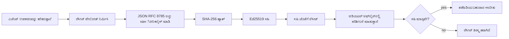
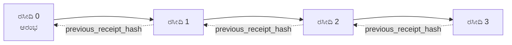

[ಪಾಠದ ವೀಡಿಯೋವನ್ನು ನೋಡಿರಿ: ಕ್ರಿಪ್ಟೋಗ್ರಾಫಿಕ್ ರಸೀದಿಗಳೊಂದಿಗೆ AI ಏಜೆಂಟ್‌ಗಳನ್ನು ಭದ್ರಪಡಿಸುವುದು](https://youtu.be/PLACEHOLDER_VIDEO_ID)

> _(ಪಾಠದ ವೀಡಿಯೋ ಮತ್ತು ಥಂಬ್ನೇಲ್ ಅನ್ನು ಮೈಕ್ರೋಸಾಫ್ಟ್ ವಿಷಯ ತಂಡ ಮರ್ಜ್ ನಂತರ ಸೇರಿಸುವುದು, ಪಾಠ 14 / 15 نمೂನೆಯನ್ನು ಹೊಂದಿಸುತ್ತದೆ.)_

# ಕ್ರಿಪ್ಟೋಗ್ರಾಫಿಕ್ ರಸೀದಿಗಳೊಂದಿಗೆ AI ಏಜೆಂಟ್‌ಗಳನ್ನು ಭದ್ರಪಡಿಸುವುದು

## ಪರಿಚಯ

ಈ ಪಾಠದಲ್ಲಿ ಒಳಗೊಂಡಿರುವವು:

- ಅನುಗುಣತೆ, ಡೀಬಗ್‌ಮೆಂಟ್ ಮತ್ತು ನಂಬಿಕೆಗೆ AI ಏಜೆಂಟ್‌ಗಳಿಗೆ ಆಡಿಟ್ ಟ್ರೇಲ್‌ಗಳು ಏಕೆ ಮುಖ್ಯ.
- ಕ್ರಿಪ್ಟೋಗ್ರಾಫಿಕ್ ರಸೀದಿ ಎಂದರೇನು ಮತ್ತು ಅದು ಅನ್‌ಸೈನ್ ಮಾಡಲಾದ ಲಾಗ್ ಲೈನ್‌ನಿಂದ ಹೇಗೆ ಭಿನ್ನ.
- ಸರಳ Python ನಲ್ಲಿ ಏಜೆಂಟ್‌ನ ಉಪಕರಣ ಕರೆಗಾಗಿ ಸೈನ್ ಮಾಡಲಾದ ರಸೀದಿ ಹೇಗೆ ತಯಾರಿಸುವುದು.
- ರಸೀದಿ ಅನ್ನು ಆಫ್‌ಲೈನ್‌ನಲ್ಲಿ ಪರಿಶೀಲಿಸುವುದು ಮತ್ತು ತೊಂದರೆ ಕಂಡುಹಿಡಿಯುವುದು.
- ರಸೀದಿಗಳನ್ನು ಸರಪಳಿಯಾಗಿ ಜೋಡಿಸುವುದು, ಹೀಗೆ ಒಂದು ರಸೀದಿಯನ್ನು ತೆಗೆದುಹಾಕುವುದು ಅಥವಾ ಪಕ್ರೋಳಿಕೆಯನ್ನು ಬದಲಾಯಿಸುವುದು ಸರಪಳಿಯನ್ನು ಒಡೆದುಹಾಕುವುದು.
- ರಸೀದಿಗಳು ಏನು ಸಾಬೀತುಪಡಿಸುತ್ತವೆ ಮತ್ತು ಅವು ಸ್ಪಷ್ಟವಾಗಿ ಏನು ಸಾಬೀತುಪಡಿಸುವುದಿಲ್ಲ.

## ಕಲಿಕಾ ಗುರಿಗಳು

ಈ ಪಾಠವನ್ನು ಪೂರ್ಣಗೊಳಿಸಿದ ನಂತರ, ನೀವು ತಿಳಿದುಕೊಳ್ಳುವುದಾಗಿ:

- ಏಜೆಂಟ್ ಕ್ರಿಯೆಗಳಿಗಾಗಿ ಕ್ರಿಪ್ಟೋಗ್ರಾಫಿಕ್ ಮೂಲದ ಬಗ್ಗೆ ಪ್ರೇರೇಪಿಸುವ ವಿಫಲತೆಯ ವಿಧಾನಗಳನ್ನು ಗುರುತಿಸುವುದು.
- ಕ್ಯಾನಾನಿಕಲ್ JSON ಪೇಲೋಡ್ ಮೇಲೆ Ed25519-ಸೈನ್ ಮಾಡಿದ ರಸೀದಿಯನ್ನು ಉತ್ಪಾದಿಸುವುದು.
- ಸಂಘಟನೆಯ ಸಾರ್ವಜನಿಕ ಕೀ ಮಾತ್ರವನ್ನು ಬಳಸಿ ಸ್ವತಂತ್ರವಾಗಿ ರಸೀದಿಯನ್ನು ಪರಿಶೀಲಿಸುವುದು.
- ತೊಂದರೆ ಕಂಡುಹಿಡಿಯುವುದು, ತಿದ್ದುಪಡಿ ಮಾಡಿದ ರಸೀದಿಯಲ್ಲಿ ಪರಿಶೀಲನೆಯನ್ನು ಪುನಃ ನಡೆಸುವುದು.
- ರಸೀದಿಗಳ ಹ್ಯಾಶ್-ಚೈನ್ ಸರಣಿಯನ್ನು ನಿರ್ಮಿಸುವುದು ಮತ್ತು ಸರಪಳಿಯ ಮಹತ್ವವನ್ನು ವಿವರಿಸುವುದು.
- ರಸೀದಿಗಳು ಏನು ಸಾಬೀತುಪಡಿಸುತ್ತವೆ (ಸ್ವಾಧೀನತೆ, ಸಾರ್ಥಕತೆ, ಕ್ರಮ), ಮತ್ತು ಏನು ಸಾಬೀತುಪಡಿಸುವುದಿಲ್ಲ (ಕ್ರಿಯೆಯ ಶುದ್ಧತೆ, ನೀತಿ ಧ್ವನಿಸ್ಥಿತಿ) ಎಂಬ ಗಡಿಯರೆಯನ್ನು ಗುರುತಿಸುವುದು.

## ಸಮಸ್ಯೆ: ನಿಮ್ಮ ಏಜೆಂಟ್‌ನ ಆಡಿಟ್ ಟ್ರೇಲ್

ನೀವು Contoso ಟ್ರಾವಲ್‌ಗೆ AI ಏಜೆಂಟ್ ಅನ್ನು ನಿಯೋಜಿಸಿರುವುದಾಗಿ ಕಲ್ಪಿಸಿಕೊಳ್ಳಿ. ಏಜೆಂಟ್ ಗ್ರಾಹಕರ ವಿನಂತಿಗಳನ್ನು ಓದುತ್ತದೆ, ವಿಮಾನಗಳ API ಅನ್ನು ಕರೆಸಿ ಆಯ್ಕೆಗಳು ನೋಡುತ್ತದೆ, ಮತ್ತು ಗ್ರಾಹಕರ ಪರವಾಗಿ ಸೀಟುಗಳನ್ನು ಬುಕ್ ಮಾಡುತ್ತದೆ. ಕಳೆದ ತ್ರೈಮಾಸಿಕದಲ್ಲಿ, ಏಜೆಂಟ್ 50,000 ಬುಕ್ಕಿಂಗ್‌ಗಳನ್ನು ಪ್ರಕ್ರಿಯೆ ಮಾಡಿತು.

ಇಂದೊಂದು ಆಡಿಟರ್ ಬರುತ್ತಾನೆ. ಅವರು ಸರಳವಾದ ಪ್ರಶ್ನೆ ಕೇಳುತ್ತಾರೆ: "ನಿಮ್ಮ ಏಜೆಂಟ್ ಏನು ಮಾಡಿತು ಎಂದು ತೋರಿಸಿ."

ನೀವು ಲಾಗ್ ಕಡತಗಳನ್ನು ನೀಡುತ್ತೀರಿ. ಆಡಿಟರ್ ಅವುಗಳನ್ನು ನೋಡಿ ಕಠಿಣವಾದ ಪ್ರಶ್ನೆ ಕೇಳುತ್ತಾರೆ: "ನನ್ನಗೆ ಹೇಗೆ ತಿಳಿಯಬಹುದು ಈ ಲಾಗ್‌ಗಳನ್ನು ತಿದ್ದುಪಡಿ ಮಾಡಲಾಗಿಲ್ಲ ಎಂದು?"

ಇದು ಆಡಿಟ್-ಟ್ರೇಲ್ ಸಮಸ್ಯೆಯಾಗಿದೆ. ಇಂದು ಹೆಚ್ಚು ಭಾಗಶಃ ಏಜೆಂಟ್ ನಿಯೋಜನೆಗಳು ಅಂದುಕೊಳ್ಳುತ್ತವೆ:

- **ಅನ್ವಯ ಲಾಗ್‌ಗಳು**: ಏಜೆಂಟಿನಿಂದಲೇ ಬರೆದಿರುವದು, ಫೈಲ್ ಸಿಸ್ಟಮ್ ಪ್ರವೇಶವಿರುವ ಯಾರಿಂದಲಾದರೂ ತಿದ್ದುಪಡಿ ಮಾಡಬಹುದಾಗಿದೆ.
- **ಮೇಘ ಲಾಗಿಂಗ್ ಸೇವೆಗಳು**: ವೇದಿಕೆಯ ಮಟ್ಟದಲ್ಲಿ ತೊಂದರೆ-ಪ್ರತಿದೃಶ್ಯಕರ হলেও ಆಡಿಟರ್ ವೇದಿಕೆ ಕಾರ್ಯನಿರ್ವಹಣಾಧಿಕಾರಿಯನ್ನು ನಂಬಲೇಬೇಕಾಗುತ್ತದೆ.
- **ಡೇಟಾಬೇಸ್ ವ್ಯವಹಾರ ಲಾಗ್‌ಗಳು**: ಡೇಟಾಬೇಸ್ ಬದಲಾವಣೆಗಳಿಗೆ ಸೂಕ್ತವಾಗಿವೆ ಆದರೆ ಯಾವುದರ ಉಪಕರಣ ಕರೆಗಳಿಗೆ ಅಲ್ಲ.

ಇವುಗಳಲ್ಲಿ ಯಾವುದೂ ಆಡಿಟರ್ ಪ್ರಶ್ನೆಗೆ ಉತ್ತರ ನೀಡುವುದಿಲ್ಲ ಆದರೆ ಆಡಿಟರ್ ಯಾರನ್ನಾದರೂ (ನೀವು, ನಿಮ್ಮ ಮೇಘ ಒದಗಿಸುವವರು, ನಿಮ್ಮ ಡೇಟಾಬೇಸ್ ವಿಕ್ರೇತಾರ) ನಂಬಬೇಕಾಗುತ್ತದೆ. ಅಂತರಂಗ ಬಳಕೆಗೆ, ಆ ನಂಬಿಕೆ ಸಹನೀಯ. ನಿಯಂತ್ರಿತ ವೋರ್ಕ್‌ಲೋಡ್‌ಗಳಿಗೆ (ಹಣಕಾಸು, ಸ್ವಾಸ್ಥ್ಯ, ಯುರೋಪಿಯನ್ AI ಕಾಯ್ದೆ ಅಧೀನ) ಅದು ಅನುಕೂಲಕರವಲ್ಲ.

ಕ್ರಿಪ್ಟೋಗ್ರಾಫಿಕ್ ರಸೀದಿಗಳು ಪ್ರತಿ ಏಜೆಂಟ್ ಕ್ರಿಯೆಯನ್ನು ಸ್ವತಂತ್ರವಾಗಿ ಪರಿಶೀಲನಾಯೋಗ್ಯವುವಾಗಿಸುವ ಮೂಲಕ ಈ ಸಮಸ್ಯೆಯನ್ನು ಪರಿಹರಿಸುತ್ತವೆ. ಆಡಿಟರ್ ನಿಮಗಿಲ್ಲ, ಅವರು ತಮ್ಮ ಸಾರ್ವಜನಿಕ ಕೀ ಮತ್ತು ರಸೀದಿ ಮಾತ್ರ ಬೇಕಾಗುತ್ತದೆ.

## ಕ್ರಿಪ್ಟೋಗ್ರಾಫಿಕ್ ರಸೀದಿ ಎಂದರೇನು?

ರಸೀದಿ ಒಂದು JSON ವಸ್ತುವಾಗಿದೆ, ಅದು ಏಜೆಂಟ್ ಏನು ಮಾಡಿತೇ ಎಂಬುದನ್ನು ದಾಖಲಿಸುತ್ತದೆ ಮತ್ತು ಡಿಜಿಟಲ್ ಸಹಿಯೊಂದಿಗೆ ಸಹಿ ಮಾಡಲ್ಪಟ್ಟಿರುತ್ತದೆ.



ಕನಿಷ್ಠ ರಸೀದಿ ಹೀಗಿದೆ:

```json
{
  "type": "agent.tool_call.v1",
  "agent_id": "contoso-travel-bot",
  "tool_name": "lookup_flights",
  "tool_args_hash": "sha256:a3f9c1...",
  "result_hash": "sha256:7b2e1d...",
  "policy_id": "contoso-travel-policy-v3",
  "timestamp": "2026-04-25T14:30:00Z",
  "sequence": 47,
  "previous_receipt_hash": "sha256:9d4e6a...",
  "signature": {
    "alg": "EdDSA",
    "sig": "c5af83...",
    "public_key": "8f3b2c..."
  }
}
```

ಮೂರು ಗುಣಲಕ್ಷಣಗಳು ಕೆಲಸ ಮಾಡುತ್ತವೆ:

1. **ಸಹಿ**. ರಸೀದಿಯನ್ನು ಏಜೆಂಟ್ ಗೇಟ್‌ವೇ Ed25519 ಖಾಸಗಿ ಕೀಲಿಯಿಂದ ಸಹಿ ಮಾಡುತ್ತದೆ. ಹೊಂದಿರುವ ಸಾರ್ವಜನಿಕ ಕೀ ಮೂಲಕ ಯಾರೂ ಸಹಿ ಆಫ್‌ಲೈನ್ ಪರಿಶೀಲಿಸಬಹುದು. ಯಾವುದೇ ಕ್ಷೇತ್ರವನ್ನು ತಿದ್ದುಮಾಡುವುದು ಸಹಿಯನ್ನು ಅಮಾನ್ಯಗೊಳಿಸುತ್ತದೆ.

2. **ಕ್ಯಾನಾನಿಕಲ್ ಎಂಕೋಡಿಂಗ್**. ಸಹಿ ಮಾಡmadan önce, ರಸೀದಿಯನ್ನು JSON ಕ್ಯಾನಾನಿಕಲೀಕರಣ ಯೋಜನೆ (JCS, RFC 8785) ಬಳಸಿ ಸರಣಿಗೊಳಿಸಲಾಗುತ್ತದೆ. ಇದರಿಂದ ಎರಡು ಅನ್ವಯಣೆಗಳು ಅದೇ ತಾರ್ಕಿಕ ರಸೀದಿಯನ್ನು ಬೈಟ್-ಪರಿವಾರ ಮೂಲಕ ರಚಿಸಲು ಖಾತ್ರಿ ಮಾಡುತ್ತದೆ. ಕ್ಯಾನಾನಿಕಲೀಕರಣವಿಲ್ಲದೆ ವಿಭಿನ್ನ JSON ಸರಣಿಗೊಳಿಸುವವರು ಒಂದೇ ವಿಷಯಕ್ಕೆ ವಿಭಿನ್ನ ಸಹಿಗಳನ್ನು ರಚಿಸುತ್ತಿದ್ದರೆ.

3. **ಹ್ಯಾಶ್ ಚೈನಿಂಗ್**. `previous_receipt_hash` ಕ್ಷೇತ್ರವು ಪ್ರತಿಯೊಂದು ರಸೀದಿಯನ್ನು ಹಿಂದಿನ ಒಂದು ರಸೀದಿಗೆ ಲಿಂಕ್ ಮಾಡುತ್ತದೆ. ಒಂದು ರಸೀದಿಯನ್ನು ತೆಗೆದುಹಾಕುವುದು ಅಥವಾ ಪುನರ್ದರ್ಜೆ ಮಾಡುವುದು ಮುಂದಿನ ಪ್ರತಿಯೊಂದು ರಸೀದಿಯನ್ನು ಒಡೆದುಹಾಕುವುದು. ವೈಯಕ್ತಿಕ ಸಹಿಗಳನ್ನು ತಡೆಯಲಾಗಿದ್ದರೂ ಸಹ ತೊಂದರೆ ಸರಪಳಿಯಲ್ಲಿ ಗೋಚರಿಸುತ್ತದೆ.

ಈ ಗುಣಲಕ್ಷಣಗಳು ಮೂರು ಖಾತ್ರಿ ನೀಡುತ್ತವೆ:

- **ಸ್ವಾಧೀನತೆ**: ಈ ಕೀ ಈ ವಿಷಯವನ್ನೇ ಸಹಿ ಮಾಡಿತು.
- **ಸಾರ್ಥಕತೆ**: ಸಹಿ ಮಾಡಿದ ನಂತರ ವಿಷಯ ಪರಿಷ್ಕೃತಗೊಂಡಿಲ್ಲ.
- **ಕ್ರಮಬದ್ಧತೆ**: ಈ ರಸೀದಿ ಆ ರಸೀದಿಯ ನಂತರ ಸರಪಳಿಯಲ್ಲಿ ಬಂದಿದೆ.

## Python ನಲ್ಲಿ ರಸೀದಿ ತಯಾರಿಸುವುದು

ರಸೀದಿ ತಯಾರಿಸಲು ವಿಶೇಷ ಗ್ರಂಥಾಲಯ ಅಗತ್ಯವಿಲ್ಲ. ಕ್ರಿಪ್ಟೋಗ್ರಾಫಿಕ್ ಮೂಲಾಂಶಗಳು ವ್ಯాప్తంగా ಲಭ್ಯವಿವೆ ಮತ್ತು ಲಾಜಿಕ್ ಕೆಲವು ಡಜನ್ ಲೈನ್ಸ್ Python ಕೋಡ್.

`code_samples/18-signed-receipts.ipynb` ಇನ್ಮುಕುಡಿಯೊಳಗಿನ ವ್ಯಾಯಾಮಗಳು ಸಂಪೂರ್ಣ ಪ್ರಕ್ರಿಯೆಯನ್ನು ಸವಿಸ್ತಾರವಾಗಿ ಮುಚ್ಚುತ್ತವೆ. ಸಾರಾಂಶ ಸಂಸ್ಕರಣೆ:

```python
import json
import hashlib
import base64
from nacl import signing
from jcs import canonicalize  # RFC 8785 ಕ್ಯಾನೋನಿಕಲ್ JSON

def b64url_nopad(data: bytes) -> str:
    return base64.urlsafe_b64encode(data).decode("ascii").rstrip("=")

def sha256_canonical(obj) -> str:
    """SHA-256 of a Python object's JCS-canonical JSON form."""
    return f"sha256:{hashlib.sha256(canonicalize(obj)).hexdigest()}"

# ಸಹಿ ನೀಡುವ ಕೀಲಿಯನ್ನು ರಚಿಸಿ ಅಥವಾ ಲೋಡ್ ಮಾಡಿ (ಉತ್ಪಾದನೆಯಲ್ಲಿ, ಕೀ ವಾಲ್ಟ್‌ನಲ್ಲಿ ಸಂಗ್ರಹಿಸಿ)
signing_key = signing.SigningKey.generate()
verify_key = signing_key.verify_key

# ರಸೀದಿ ಪೇಲೋಡ್ ನಿರ್ಮಿಸಿ (ಈಗೂ ಸಹಿ ಇಲ್ಲ)
tool_args = {"origin": "SYD", "destination": "LAX"}
tool_result = [{"flight": "QF11", "price": 1850, "stops": 0}]

payload = {
    "type": "agent.tool_call.v1",
    "agent_id": "contoso-travel-bot",
    "tool_name": "lookup_flights",
    "tool_args_hash": sha256_canonical(tool_args),
    "result_hash": sha256_canonical(tool_result),
    "policy_id": "contoso-travel-policy-v3",
    "timestamp": "2026-04-25T14:30:00Z",
    "sequence": 0,
    "previous_receipt_hash": None,
}

# ಕ್ಯಾನೋನಿಕಲೈಸ್ ಮಾಡಿ, ಹ್ಯಾಶ್ ಮಾಡಿ, ಸಹಿ ಇರಿಸಿ.
canonical_bytes = canonicalize(payload)
message_hash = hashlib.sha256(canonical_bytes).digest()
signature_bytes = signing_key.sign(message_hash).signature

# ರಚನಾತ್ಮಕ ಸಹಿ ವಸ್ತುವನ್ನು ಜೋಡಿಸಿ.
receipt = {
    **payload,
    "signature": {
        "alg": "EdDSA",
        "sig": b64url_nopad(signature_bytes),
        "public_key": b64url_nopad(bytes(verify_key)),
    },
}
```

ಇದು ಸಹಿ ಪ್ರಕ್ರಿಯೆಯ ಸಂಪೂರ್ಣ ಪೈಪ್ಲೈನ್. ನೋಟ್ಬುಕ್‌ನ ವ್ಯಾಯಾಮಗಳು ಪ್ರತಿ ಹಂತವನ್ನು ವಿವರಿಸುತ್ತವೆ.

## ರಸೀದಿಯನ್ನು ಪರಿಶೀಲಿಸುವುದು ಮತ್ತು ತೊಂದರೆಗೆ ಪತ್ತೆಹಚ್ಚುವುದು

ಪರಿಶೀಲನೆ ವಿರುದ್ಧ ಪ್ರಕ್ರಿಯೆಯಾಗಿದೆ:

```python
import base64
import hashlib
from nacl import signing
from nacl.exceptions import BadSignatureError
from jcs import canonicalize

def b64url_decode(s: str) -> bytes:
    padding = "=" * ((4 - len(s) % 4) % 4)
    return base64.urlsafe_b64decode(s + padding)

def verify_receipt(receipt: dict) -> bool:
    # ಸಹಿ ಒಂದು ರಚನೆಯಾದ ವಸ್ತು: {"alg", "sig", "public_key"}.
    sig_obj = receipt.get("signature")
    if not sig_obj or sig_obj.get("alg") != "EdDSA":
        return False

    # ನಿಜವಾಗಿಯೂ ಸಹಿ ಹಾಕಲಾದ ಪೇಲೋಡ್ ಅನ್ನು ಮರುನിര്‍മ്മಿಸಿ (ಸಹಿಯನ್ನು ಹೊರತುಪಡಿಸಿ ಎಲ್ಲವೂ).
    payload = {k: v for k, v in receipt.items() if k != "signature"}

    canonical_bytes = canonicalize(payload)
    message_hash = hashlib.sha256(canonical_bytes).digest()

    try:
        verify_key = signing.VerifyKey(b64url_decode(sig_obj["public_key"]))
        verify_key.verify(message_hash, b64url_decode(sig_obj["sig"]))
        return True
    except BadSignatureError:
        return False
```

ಈ ಫಂಕ್ಷನ್ ರಸೀದಿಯನ್ನು ತೆಗೆದುಕೊಳ್ಳುತ್ತದೆ ಮತ್ತು ಸಹಿ ಸರಿ ಇದ್ದರೆ `True`, ಇಲ್ಲದಿದ್ದರೆ `False` ನೀಡುತ್ತದೆ. ಯಾವುದೇ ನೆಟ್‌ವರ್ಕ್ ಕರೆ, ಯಾವುದೇ ಸೇವಾ ಅವಲಂಬನೆ ಇಲ್ಲ, ಯಾವ ಮೂರನೇ ಪಕ್ಷದ ನಂಬಿಕೆ ಬೇಕಾಗಿಲ್ಲ.

ತೊಂದರೆ ಪತ್ತೆಹಚ್ಚುವ ನಿಡರ್ಶನವನ್ನು ನೋಡಲು, ನೋಟ್ಬುಕ್ ಹೀಗಿದೆ:

1. ಮಾನ್ಯ ರಸೀದಿಯನ್ನು ತಯಾರಿಸಿ ಮತ್ತು ಪರಿಶೀಲಿಸುತ್ತಾರೆ.
2. `tool_args_hash` ಕ್ಷೇತ್ರದ ಒಂದು ಬೈಟ್ ತಿದ್ದುಮಾಡುತ್ತಾರೆ.
3. ಪರಿಶೀಲನೆಯನ್ನು ಪುನರುಚಿತ ಮಾಡುವಾಗ ಅಸಫಲವಾಗುತ್ತದೆ.

ಇದು ಪ್ರಾಯೋಗಿಕವಾಗಿ ತೋರಿಸುವುದು ರಸೀದಿಗಳು ತೊಂದರೆ-ಪ್ರತಿದೃಶ್ಯಕರವಾಗಿವೆ ಎಂಬುದು: ಯಾವುದೇ ಸಣ್ಣ ತಿದ್ದುಪಡಿ ಸಹ ಸಿಗ್ನೇಚರ್ ಅನ್ನು ಒಡೆದಿಡುತ್ತದೆ.

## ಬಹು ಹಂತದ ಏಜೆಂಟ್‌ಗಳಿಗಾಗಿ ರಸೀದಿಗಳನ್ನು ಸರಪಳಿಯಾಗಿ ಜೋಡಿಸುವುದು

ಒಂದು ಸೈನ್ ಮಾಡಲಾದ ರಸೀದಿ ಒಂದು ಕ್ರಿಯೆಯನ್ನು ರಕ್ಷಿಸುತ್ತದೆ. ರಸೀದಿಗಳ ಸರಪಳಿ ಸರಣಿಯನ್ನು ರಕ್ಷಿಸುತ್ತದೆ.



ಪ್ರತಿ ರಸೀದಿ ಹಿಂದಿನ ರಸೀದಿಯ ಹ್ಯಾಶ್ ಅನ್ನು ದಾಖಲಿಸುತ್ತದೆ. ಮೌನವಾಗಿ ರಸೀದಿ 2 ಅನ್ನು ತೆಗೆಯಲು, ದಾಳಿ ಮಾಡುವವನಿಗೆ ಬೇಕಾಗುವುದು:

- ರಸೀದಿ 3 ನ `previous_receipt_hash` ಕ್ಷೇತ್ರವನ್ನು ತಿದ್ದುಪಡಿಮಾಡುವುದು (ರಸೀದಿ 3 ರ ಸಹಿಯನ್ನು ಒಡೆದುಹಿಡಿಯುತ್ತದೆ), ಅಥವಾ
- ತಿದ್ದುಮಾಡಲಾದ ರಸೀದಿ 3 ನ ಮೇಲೆ ಹೊಸ ಸಹಿಯನ್ನು ಕೃತ್ರಿಮಗೊಳಿಸುವುದು (ಏಜೆಂಟ್ ಖಾಸಗಿ ಕೀ ಬೇಕು).

ಖಾಸಗಿ ಕೀ ಒಂದು ಹಾರ್ಡ್ವೇರ್ ಕೀ ವಾಲ್ಟ್‌ನಲ್ಲಿ ಇದ್ದರೆ ಮತ್ತು ನೀವು ಪ್ರತಿ ರಸೀದಿಯೊಂದಿಗೆ ಸಾರ್ವಜನಿಕ ಕೀ ಪ್ರಕಟಿಸಿದರೆ, ಯಾವುದೇ ದಾಳಿ ಪತ್ತೆಯಿಲ್ಲದೆ ಸಾಧ್ಯವಿಲ್ಲ.

ನೋಟ್ಬುಕ್ ಮೂಲಕ:

1. ಮೂರು ರಸೀದಿಗಳ ಸರಪಳಿ ನಿರ್ಮಿಸುವುದು.
2. ಪ್ರತಿಯೊಂದು ರಸೀದಿಯ `previous_receipt_hash` ಹಿಂದಿನ ರಸೀದಿಯ ನಿಜವಾದ ಹ್ಯಾಶ್‌ಗೆ ಹೊಂದುವಿಕೆ ಪರಿಶೀಲಿಸುವುದು.
3. ಮಧ್ಯದಲ್ಲೊಂದು ರಸೀದಿಯನ್ನು ತಿದ್ದುಪಡಿಸಿ ಸರಪಳಿ ಬಿದ್ದುಹೋಗುವುದನ್ನು ನೋಡುವುದು.

ಇದು ನೀವು ಅಧಿಕಾರಪಡದ ಹೊರಗಿನ ಆಡಿಟರ್ ಪರಿಶೀಲನಾಗಳನ್ನು ಮಾಡಲು ಆಡಿಟ್ ಟ್ರೇಲ್ ತಯಾರಿಸುವ ಉಪಾಯ.

## ರಸೀದಿಗಳು ಯಾವುದು ಸಾಬೀತುಪಡಿಸುತ್ತವೆ (ಮತ್ತು ಯಾವುದು ಸಾಬೀತುಪಡಿಸುವುದಿಲ್ಲ)

ಈ ಪಾಠದ ಅತ್ಯಂತ ಮಹತ್ವದ ವಿಭಾಗವಾಗಿದೆ. ರಸೀದಿಗಳು ಶಕ್ತಿಶಾಲಿ ಆದರೆ ಅವರ ಶಕ್ತಿ ಮಿತವಾಗಿದೆ.

**ರಸೀದಿಗಳು ಮೂರ್ನೋವು ಸಾಬೀತುಪಡಿಸುತ್ತವೆ:**

1. **ಸ್ವಾಧೀನತೆ**: ನಿರ್ದಿಷ್ಟ ಕೀ ನಿರ್ದಿಷ್ಟ ಪೇಲೋಡ್ ಅನ್ನು ಸಹಿ ಮಾಡಿದೆ.
2. **ಸಾರ್ಥಕತೆ**: ಸಹಿ ಮಾಡಿದ ನಂತರ ಪೇಲೋಡ್ ಬದಲಾಗಿಲ್ಲ.
3. **ಕ್ರಮಬದ್ಧತೆ**: ಈ ರಸೀದಿ ಆ ರಸೀದಿಯ ನಂತರ ಹ್ಯಾಶ್ ಸರಪಳಿಯಲ್ಲಿ ಬಂದಿದೆ.

**ರಸೀದಿಗಳು ಸಾಬೀತುಪಡಿಸುವುದಿಲ್ಲ:**

1. **ಶುದ್ಧತೆ**: ಏಜೆಂಟ್ ಕ್ರಿಯೆಯು ಸರಿಯಾದ ಕ್ರಿಯೆಯೇ ಎಂಬುದನ್ನು. ತಪ್ಪು ಉತ್ತರಕ್ಕೂ ರಸೀದಿ ಸರ್ಪೊಗಾಚಾರವಾಗಿ ಸಹಿ ಮಾಡಬಹುದು.
2. **ನೀತಿ ಅನುಗುಣತೆ**: `policy_id` ನಲ್ಲಿ ವಿವರಿಸಲಾದ ನೀತಿ ವಾಸ್ತವದಲ್ಲಿ ಅಂದಾಜಿಸಲಾಯಿತು ಎಂದು ಅಥವಾ ಅದೃಷ್ಟವಶಾತ್ ಕಾಪಾಡಲಾಯಿತು ಎಂಬುದಿಲ್ಲ. ರಸೀದಿ ವಾದಿಸಿದುದನ್ನು ದಾಖಲಿಸುತ್ತದೆ, ಅನುಷ್ಠಾನರೀತಿಯಲ್ಲ.
3. **ಕೀಲಿಯಿಂದ ಮೀರಿ ಗುರುತು**: ರಸೀದಿ "ಈ ಕೀ ಈ ವಿಷಯವನ್ನು ಸಹಿ ಮಾಡಿತು" ಎಂದು ಹೇಳುತ್ತದೆ. "ಈ ಮಾನವನೂ ಅನುಮೋದಿಸಿದನು" ಎಂದು ಹೇಳುವುದಿಲ್ಲ. ವ್ಯಕ್ತಿಯ ಅಥವಾ ಸಂಸ್ಥೆಯ ಗುರುತಿನಿಂದ ಕೀಲಿಯನ್ನು ಸಂಪರ್ಕಿಸುವುದು ಮುಂಬರುವ ಗುರುತು ಮೂಲಸೌಕರ್ಯಗಳನ್ನು ಅವಲಂಬಿಸುತ್ತದೆ (ಡೈರೆಕ್ಟರಿ ಅಥವಾ ಸಾರ್ವಜನಿಕ ಕೀ ನೋಂದಣಿ).
4. **ಇನಪುಟ್‌ಗಳ ನೈಜತವು**: ಏಜೆಂಟ್ манипುಲೇಟಡ್ ಪ್ರಾಂಪ್ಟ್ ಪಡೆದಿದ್ದಲ್ಲಿ ಮತ್ತು ಅದರಲ್ಲಿ ಕಾರ್ಯನಿರ್ವಹಿಸಿದರೆ, ರಸೀದಿ ಕ್ರಿಯೆಯನ್ನು ಸತ್ಯಾಸತ್ಯತೆಯ ಮೂಲಕ ದಾಖಲಿಸುತ್ತದೆ. ಇವು ಇನಪುಟ್ ಮಾನ್ಯತೆಗೂಣಗಾರಿಕೆ ಆಗಿದ್ದು ಬದಲಿ ಅಲ್ಲ.

ಈ ಗಡಿ ಎರಡು ಕಾರಣಗಳಿಗಾಗಿ ಪ್ರಮುಖ:

- ಅದು ನಿಮಗೆ ತಿಳಿಸುತ್ತದೆ ರಸೀದಿಗಳು ಏನಿಗೆ ಉಪಯುಕ್ತ: ಏಜೆಂಟ್ ವರ್ತನೆaudit ಮಾಡಬಹುದಾದ ಮತ್ತು ತೊಂದರೆ-ಪ್ರತಿದೃಶ್ಯಕರವಾಗಿರುವಂತೆ ಮಾಡಲು, ಸಂಘಟನಾತ್ಮಕ ಗಡಿಗಳನ್ನು ಮೀರಿ.
- ನಿಮ್ಮಿಗೆ ಯಾವುದಂತೆ ಹೆಚ್ಚಿನ ಹಂತಗಳು ಬೇಕಾಗಿವೆ ಎಂಬುದನ್ನು: ಇನಪುಟ್ ಮಾನ್ಯತೆ (ಪಾಠ 6), ನೀತಿ ಅನುಷ್ಟಾನ (ಕೆಳಗೆ ಸಣ್ಣ ಮಾಹಿತಿ), ಮತ್ತು ಗುರುತು ಮೂಲಸೌಕರ್ಯ (ಈ ಪಾಠಕ್ಕೆ ಹೊರಗೆ).

ಸಾಮಾನ್ಯ ತಪ್ಪು "ನಮಗೂ ರಸೀದಿಗಳಿವೆ" ಎಂದರೆ "ನಾವು ಆಡಳಿತದಲ್ಲಿದ್ದೇವೆ" ಎಂದು ಭಾವಿಸುವುದಾಗಿದೆ. ಅಲ್ಲ. ರಸೀದಿಗಳು ಪ್ರಾಥಮಿಕ ಸ್ಥರ. ಆಡಳಿತವು ನೀವು ನಿರ್ಮಿಸುವ ವ್ಯವಸ್ಥೆ.

## ಉತ್ಪಾದನಾ ಉಲ್ಲೇಖಗಳು

ಈ ಪಾಠದಲ್ಲಿನ Python ಕೋಡ್ ಉದ್ದೇಶಪೂರ್ವಕವಾಗಿ ಕನಿಷ್ಠವಾಗಿದೆ, ಆದ್ದರಿಂದ ನೀವು ہر لائن ಓದಿ ಎಚ್ಚರಿಕೆಯಿಂದ ಅರ್ಥಮಾಡಿಕೊಳ್ಳಬಹುದು. ಉತ್ಪಾದನೆಯಲ್ಲಿ ನಿಮಗೆ ಎರಡು ಆಯ್ಕೆಗಳು:

1. **ಕ್ರಿಪ್ಟೋಗ್ರಫಿಕ್ ಮೂಲಾಂಶಗಳ ಮೇಲೆ ನೇರವಾಗಿ ನಿರ್ಮಿಸಿಕೊಳ್ಳಿ.** ಮೇಲಿನ 50 ಸಾಲುಗಳು ಬಹುತೇಕ ಉಪಯೋಗಗಳಿಗೆ ಸಾಕಷ್ಟಾಗಿದೆ. PyNaCl (Ed25519) ಮತ್ತು `jcs` ಪ್ಯಾಕೇಜ್ (ಕ್ಯಾನಾನಿಕಲ್ JSON) ಉತ್ತಮವಾಗಿ ನಿರ್ವಹಿಸಲ್ಪಟ್ಟ ಮತ್ತು ಪರಿಶೀಲಿಸಲ್ಪಟ್ಟ ಲೈಬ್ರರಿಗಳು.

2. **ಉತ್ಪಾದನಾ ರಸೀದಿ ಗ್ರಂಥಾಲಯವನ್ನು ಬಳಸಿ.** ಹಲವು ಓಪನ್-ಸೋರ್ಸ್ ಪ್ರಾಜೆಕ್ಟ್‌ಗಳು ಸೇರಿಸುವುವು ಇಂತಹ ಮಾದರಿಯನ್ನು ಹೆಚ್ಚಿನ ವೈಶಿಷ್ಟ್ಯಗಳೊಂದಿಗೆ (ಕೀ ರೋಟೇಶನ್, ಬ್ಯಾಚ್ ಪರಿಶೀಲನೆ, JWK ಸೆಟ್ ವಿತರಣೆ, ನೀತಿ ಎಂಜಿನ್ ಕೆಲವೊಂದರ ಅಳವಡಿಕೆ):

   - ಈ ಪಾಠದಲ್ಲಿ ಬಳಕೆಯಾದ ರಸೀದಿ ಸ್ವರೂಪ IETF ಇಂಟರ್ನೆಟ್-ದ್ರಾಫ್ಟ್ (`draft-farley-acta-signed-receipts`) ಅನ್ನು ಅನುಸರಿಸುತ್ತದೆ, ಪ್ರಸ್ತುತ ಮಾನಕ ಪ್ರಕ್ರಿಯೆಯಲ್ಲಿದೆ.
   - Microsoft Agent Governance Toolkit ರಸೀದಿಗಳನ್ನು Cedar ಆಧಾರಿತ ನೀತಿ ನಿರ್ಣಯಗಳೊಂದಿಗೆ ಸಂಯೋಜಿಸುತ್ತದೆ; ಈ ಸಂಗ್ರಹಣೆಯ ಟ್ಯುಟೋರಿಯಲ್ 33 ಗಾಗಿ ಸಂಪೂರ್ಣ ಉದಾಹರಣೆ ನೋಡಿರಿ.
   - `protect-mcp` (npm) ಮತ್ತು `@veritasacta/verify` (npm) ಪ್ಯಾಕೇಜುಗಳು Node ಆಧಾರಿತ ರಸೀದಿ ಸಹಿ ಮತ್ತು ಆಫ್‌ಲೈನ್ ಪರಿಶೀಲನೆಯನ್ನು ಒದಗಿಸುತ್ತವೆ, ಯಾವುದೇ MCP ಸರ್ವರ್ ಅನ್ನು ತೊಂದರೆ-ಪ್ರತಿದೃಶ್ಯಕAudit ಟ್ರೇಲ್ ಮೂಲಕ ಸುತ್ತಲು ಪ್ರಯೋಜನಕಾರಿಯಾಗಿದೆ.

ನಿಮ್ಮದಾಗಿ ಬರೆಯುವ ಮತ್ತು ಗ್ರಂಥಾಲಯ ಬಳಕೆಮಾಡುವ ನಿರ್ಧಾರವು, ನಿಮಗೆ ಜೇಡಬ್ಲ್ಯೂಟಿ ಗ್ರಂಥಾಲಯ ಬರೆದಿಕೊಳ್ಳುವ ಮತ್ತು ಪೂರ್ವಪರೀಕ್ಷಿತದನ್ನು ಉಪಯೋಗಿಸುವ ನಡುವೆ ತೀರ್ಮಾನಗಳಂತೆ. ಎರಡೂ ಇವು ಸಹಜ; ಗ್ರಂಥಾಲಯ ಸಮಯ ಮತ್ತು ಪರಿಶೀಲನಾ ಭಾಗವನ್ನು ಉಳಿಸುತ್ತದೆ; ತಲುಪಿಕೊಳ್ಳುವ ವಿಧಾನದಿಂದ ನೀವು ಪ್ರತಿ ಮೂಲಾಂಶವನ್ನು ಅರ್ಥಮಾಡಿಕೊಳ್ಳಬಹುದು. ಈ ಪಾಠ ತಲುಪಿಕೊಳ್ಳುವ ಮಾರ್ಗವನ್ನು ಕಲಿಸುತ್ತದೆ, ಆದ್ದರಿಂದ ನೀವು ಎರಡು ಆಯ್ಕೆಗಳಿಗೆ ನೆಲೆ ಹೊಂದಿರುತ್ತೀರಿ.

## ಜ್ಞಾನ ಪರಿಶೀಲನೆ

ಅಭ್ಯಾಸ ವ್ಯಾಯಾಮಕ್ಕೆ ಹೋಗುವ ಮೊದಲು ನಿಮ್ಮ ಅರ್ಥವನ್ನು ಪರೀಕ್ಷಿಸಿ.

**1. ಒಂದು ರಸೀದಿ ಏಜೆಂಟ್‌ನ ಖಾಸಗಿ Ed25519 ಕೀಲಿಯಿಂದ ಸಹಿ ಮಾಡಲ್ಪಟ್ಟಿದೆ. ಆಡಿಟರ್‌ಗೆ ಕೇವಲ ಸಾರ್ವಜನಿಕ ಕೀ ಇದೆ. ಆಡಿಟರ್ ಆಫ್‌ಲೈನ್‌ನಲ್ಲಿ ರಸೀದಿಯನ್ನು ಪರಿಶೀಲಿಸಬಹುದೇ?**

<details>
<summary>ಉತ್ತರ</summary>

ಹೌದು. Ed25519 ಪರಿಶೀಲನೆಗೆ ಕೇವಲ ಸಾರ್ವಜನಿಕ ಕೀ ಮತ್ತು ಸಹಿ ಮಾಡಿದ ಬೈಟ್ಗಳಷ್ಟೇ ಬೇಕು. ಯಾವುದೇ ನೆಟ್‌ವರ್ಕ್ ಕರೆ, ಸೇವಾ ಅವಲಂಬನೆ ಇಲ್ಲ. ಇದು ರಸೀದಿಗಳನ್ನು ಗಾಳಿಚುಕ್ಕಿದ, ಬಹು-ಸಂಸ್ಥೆಗಳಲ್ಲಿ, ಅಥವಾ ಕಡಿಮೆ ನಂಬಿಕೆಯುಳ್ಳ ಆಡಿಟ್ ಸನ್ನಿವೇಶಗಳಲ್ಲಿ ಉಪಯುಕ್ತವಾಗಿಸುತ್ತದೆ.
</details>

**2. ದಾಳಿ ಮಾಡಿದವನು ರಸೀದಿಯ `policy_id` ಕ್ಷೇತ್ರವನ್ನು ಹೆಚ್ಚು ಅನುಮತಿತ ನೀತಿಗೆ ಬದಲಾಯಿಸಿದ್ದಾರೆ. ಸಹಿ ಮೂಲ ಪೇಲೋಡ್ ಮೇಲೆ ಹಾಗಿದೆ. ಪರಿಶೀಲನೆ ವೇಳೆ ಏನು ಸಂಭವಿಸುತ್ತದೆ?**

<details>
<summary>ಉತ್ತರ</summary>

ಪರಿಶೀಲನೆ ವಿಫಲವಾಗುತ್ತದೆ. ಸಹಿ ಮೂಲ ಪೇಲೋಡ್‌ನ ಕ್ಯಾನಾನಿಕಲ್ ಬೈಟ್ಗಳ ಮೇಲೆ ಹತ್ತು, ಯಾವುದೇ ಕ್ಷೇತ್ರ ತಿದ್ದುಪಡಿ ಅದು ಕ್ಯಾನಾನಿಕಲ್ ಬೈಟ್ಗಳನ್ನು ಬದಲಾಯಿಸುತ್ತದೆ, ಇದರ SHA-256 ಹ್ಯಾಶ್ ಬದಲಾಗುತ್ತದೆ ಮತ್ತು ಸಹಿಗೆ ಅಮಾನ್ಯ. ದಾಳಿ ಮಾಡುವವನಿಗೆ ಹೊಸ ಮಾನ್ಯ ಸಹಿಯನ್ನು ತಲುಪಿಸಲು ಖಾಸಗಿ ಕೀ ಬೇಕಾಗುತ್ತದೆ, ಆದರೆ ಅದನ್ನು ಹೊಂದಿಲ್ಲ.
</details>

**3. ರಸೀದಿಗೆ ಕಚ್ಚಾ ಆರ್ಗ್ಯುಮೆಂಟ್ಸ್ ಮತ್ತು ಫಲಿತಾಂಶದ ಬದಲು `tool_args_hash` ಮತ್ತು `result_hash` ಅನ್ನು ಸೇರಿಸುವುದಕ್ಕೆ ಕಾರಣವೇನು?**

<details>
<summary>ಉತ್ತರ</summary>

ಇರಡು ಕಾರಣಗಳಿವೆ. ಮೊದಲನೆಯದು, ರಸೀದಿ ಅಂತರ್ಧಾನದಲ್ಲಿ ಅಥವಾ ಪ್ರಸಾರ ಪರಿಸರಗಳಲ್ಲಿ ಸಂಗ್ರಹಿಸಲಾಗವೇತ್ರಲ್ಲಿ ಅದೃಷ್ಟವಶಾತ್ (PII, ವ್ಯವಹಾರ ಮಾಹಿತಿ) ಲೀಕ್ ಆಗುತಿದೆ. ಹ್ಯಾಶಿಂಗಿನಿಂದ ರಸೀದಿ ಸಣ್ಣದಾಗುತ್ತದೆ ಮತ್ತು ವಿಷಯ ಗುಪ್ತವಾಗುತ್ತದೆ; ಆಡಿಟರ್ ಹ್ಯಾಶ್ ನಿಜವಾದ ವಿಷಯದ ಪ್ರತ್ಯೇಕ ನಕಲಿಗೆ ಹೊಂದಿಕೊಳ್ತಾನೆ. ಎರಡನೆಯದು, ಹ್ಯಾಶ್‌ಗಳಿಗೆ ಸ್ಥಿರ ಗಾತ್ರವಿದೆ; ಇನ್ಪುಟ್ ಮತ್ತು ಔಟ್‌పುಟ್ גדತ್ತಿದ್ದರೂ ರಸೀದಿ ಗಾತ್ರದಲ್ಲಿ ಮಿತಿ ಇರುತ್ತದೆ.
</details>

**4. `previous_receipt_hash` ಕ್ಷೇತ್ರವು ಪ್ರತಿ ರಸೀದಿಯನ್ನು ಹಿಂದಿನದಕ್ಕೆ ಲಿಂಕ್ ಮಾಡುತ್ತದೆ. ದಾಳಿ ಮಾಡಿದವನು ಸರಪಳಿಯ ಮಧ್ಯದಿಂದ ಒಂದು ರಸೀದಿ ಮೌನವಾಗಿ ಅಳಿಸಿದರೆ ಏನು ಅಮಾನ್ಯವಾಗುತ್ತದೆ?**

<details>
<summary>ಉತ್ತರ</summary>

ಅಳಿಸಲಾದ ರಸೀದಿಯ ನಂತರ ಬರುವ ಪ್ರತಿಯೊಂದು ರಸೀದಿ. ಅವುಗಳ `previous_receipt_hash` ಕ್ಷೇತ್ರಗಳು ಸರಿಯಾದ ಸರಪಳಿಗೆ ಹೊಂದಿಕೆಯಾಗುವುದಿಲ್ಲ (ಅವರ ಲಿಂಕ್ ಮಾಡಿದ ರಸೀದಿ ಈಗ ಇಲ್ಲ, ಅಥವಾ ಸರಪಳಿ ಬೇರೆ ಹಳೆಯದನ್ನು ಉಲ್ಲೇಖಿಸುತ್ತದೆ). ಅಳಿಕೆಯನ್ನು ಮರೆಮಾಡಲು, ದಾಳಿ ಮಾಡುವವನು ಪ್ರತಿಯೊಂದು ನಂತರದ ರಸೀದಿಯನ್ನು ಮರುಸಹಿ ಮಾಡಬೇಕಾಗುತ್ತದೆ, ಇದಕ್ಕೆ ಖಾಸಗಿ ಕೀ ಬೇಕು.
</details>

**5. ರಸೀದಿ ಪರಿಶೀಲನೆ ಯಶಸ್ವಿ. ಇದರಿಂದ ಏಜೆಂಟ್ ಕ್ರಿಯೆ ಸರಿಯಾದದು, ಧ್ವನಿಷ್ಟ, ಅಥವಾ ನೀತಿ ಜಾಗೃತಿಯ ಸಹಿತ ಎಂದು ಸಾಬೀತಾಗುತ್ತದೆಯೇ?**

<details>
<summary>ಉತ್ತರ</summary>

ಇಲ್ಲ. ಮಾನ್ಯ ರಸೀದಿ ಮೂರು ಸಂಗತಿಗಳನ್ನು ಸಾಬೀತುಪಡಿಸುತ್ತದೆ: ಸ್ವಾಧೀನತೆ (ಈ ಕೀ ಈ ವಿಷಯವನ್ನು ಸಹಿ ಮಾಡಿತು), ಸಾರ್ಥಕತೆ (ವಿಷಯ ಬದಲಾಗಿಲ್ಲ), ಮತ್ತು ಕ್ರಮಬದ್ಧತೆ (ಈ ರಸೀದಿ ಆ ರಸೀದಿಯ ನಂತರ ಬಂದಿದೆ). ಇದು ಕ್ರಿಯೆಯ ಶುದ್ಧತೆ, `policy_id` ಯಲ್ಲಿ ನೋಡಲಾದ ನೀತಿ ಅಂದಾಜಿತವೆಯೇ ಅಥವಾ ಏಜೆಂಟ್ ನೀಡಿದ ಪ್ರತಿ ನಿಯಮವನ್ನು ಅನುಸರಿಸಿದ್ದಾನೇ ಎಂಬುದನ್ನು ಸಾಬೀತುಪಡಿಸುವುದಿಲ್ಲ. ರಸೀದಿಗಳು ಏಜೆಂಟ್ ವರ್ತನೆaudit ಮಾಡಲು ಸಹಾಯ ಮಾಡುತ್ತವೆ, ಆದರೆ ಸರಿ ಎಂಬುದನ್ನು ಖಚಿತಪಡಿಸುವುದಿಲ್ಲ. ಇದು ಪಾಠದ ಅತ್ಯಂತ ಮಹತ್ವದ ಗಡಿ.

</details>

## ಅಭ್ಯಾಸ ವ್ಯಾಯಾಮ

`code_samples/18-signed-receipts.ipynb` ಅನ್ನು ತೆರೆದಾಗ ಎಲ್ಲಾ ನಾಲ್ಕು ವಿಭಾಗಗಳನ್ನು ಪೂರೈಸಿ:

1. **ವಿಭಾಗ 1**: ನಿಮ್ಮ ಮೊದಲ ರಸೀದಿಗೆ ಸಹಿ ಮಾಡಿ ಮತ್ತು ಪರಿಶೀಲಿಸಿ.
2. **ವಿಭಾಗ 2**: ರಸೀದಿಯನ್ನು ತಿದ್ದುಪಡಿ ಮಾಡಿ ಮತ್ತು ಪರಿಶೀಲನೆ ವಿಫಲವಾಗುತ್ತಿರುವುದನ್ನು ನೋಡು.
3. **ವಿಭಾಗ 3**: ಮೂರು ರಸೀದಿ ಸರಪಳಿಯನ್ನು ನಿರ್ಮಿಸಿ ಮತ್ತು ಸರಪಳಿಯ ಅಖಂಡತೆಯನ್ನು ಪರಿಶೀಲಿಸಿ.
4. **ವಿಭಾಗ 4**: ಮೈಕ್ರೋಸಾಫ್ಟ್ ಏಜೆಂಟ್ ಫ್ರೇಮ್‌ವರ್ಕ್‌ನಿಂದ ನಿರ್ಮಿತ ಏಜೆಂಟ್‌ಗೆ ಮಾದರಿಯನ್ನು ಅನ್ವಯಿಸಿ: ಉಪಕರಣ ಕರೆಯ ಮೇಲ್ಸಹಿ ಮಾಡಿ, ನಂತರ ರಸೀದಿಯನ್ನು ಸ್ವತಂತ್ರವಾಗಿ ಪರಿಶೀಲಿಸಿ.

**ಕಡಿಮೆಯಾದ ಸವಾಲು 1:** ನಿಮ್ಮ ಇಚ್ಛೆಯ ಒಂದು ಹೆಚ್ಚುವರಿ ಕ್ಷೇತ್ರದೊಂದಿಗೆ ರಸೀದಿ ರೂಪರೇಖೆಯನ್ನು ವಿಸ್ತರಿಸಿ (ಉದಾಹರಣೆಗೆ, ಟ್ರೇಸಿಂಗ್‌ಗೆ ವಿನಂತಿ ID), ಅದನ್ನು ಕ್ಯಾನಾನಿಕಲ್ ಸಹಿ ಲಾಜಿಕ್‌ಗೆ ಸೇರಿಸಿ, ಮತ್ತು রಸೀದಿ ಪರಿಶೀಲನೆಯ ಮೂಲಕ ಸುತ್ತಲು ಸಾಧ್ಯವಿದೆ ಎಂದು ಖಚಿತಪಡಿಸಿಕೊಳ್ಳಿ. ನಂತರ ಸಹಿ ನಂತರ ಕ్షೇತ್ರವನ್ನು ತಿದ್ದುಮಾಡಿ ಪರಿಶೀಲನೆ ವಿಫಲವಾಗುವುದನ್ನು ದೃಢೀಕರಿಸಿ. ಇದರಿಂದ ನೀವು ಕ್ಯಾನಾನಿಕಲ್ ಎಂಕೋಡಿಂಗ್‌ನ ಪ್ರತಿ ಬೈಟ್ ಸಹಿಗೆ ಹೇಗೆ ಇಳಿದಿದೆ ಎಂಬುದನ್ನು ಅರ್ಥಮಾಡಿಕೊಳ್ಳಬೇಕಾಗುತ್ತದೆ.
**ಸ್ಟ್ರೆಚ್ ಚಾಲೆಂಜ್ 2:** ನಿಮ್ಮ ರಸೀದಿಗಳಿಂದ ಎರಡು ರಸೀದಿಗಳನ್ನು SHA-256 ಹ್ಯಾಶ್ ಮಾಡಿ (ಅವರ ಕ್ಯಾನೋನಿಕ್ ಬೈಟ್ಗಳನ್ನು ನಿರ್ದಿಷ್ಟ ಕ್ರಮದಲ್ಲಿconcatenate ಮಾಡಿ) ಮತ್ತು ಪ್ರತ್ಯುತ್ತರವನ್ನು ಮೂರನೇ ರಸೀದಿಯಲ್ಲಿ ಹೊಸ ಕ್ಷೇತ್ರವಾಗಿ ಸೇರಿಸಿ ಸೈನ್ ಮಾಡುವ ಮುನ್ನ. ಮೂರುವನ್ನೂ ರೌಂಡ್-ಟ್ರಿಪ್ ಆಗುತ್ತಿರುವುದನ್ನು ಪರಿಶೀಲಿಸಿ. ನೀವು ಒಂದೇ ಹೆಜ್ಜೆಯಲ್ಲಿ ಒಳಗೊಂಡಿರುವ ಸಾಬೀತು ನಿರ್ಮಿಸಿದ್ದಾರೆ: ಮೂರನೇ ರಸೀದಿ ಹಿಡಿದಿರುವ ಯಾರೂ ಆದರೂ ಮೊದಲ ಎರಡು ಇದ್ದವು ಎಂದು ಸೈನ್ ಆಗಿದ್ದ ಸಮಯದಲ್ಲಿ ಸಾಬೀತು ಮಾಡಬಹುದು, ಅವರ ವಿಷಯಗಳನ್ನು ಬಹಿರಂಗಪಡಿಸುವ ಅಗತ್ಯವಿಲ್ಲದೆ. ಇದು ಆಯ್ಕೆಮಾಡಿದ-ಪ್ರಕಟಣೆ ರಸೀದಿಗಳು ಮಾಪನದಲ್ಲಿ ಬಳಸುವ ಮಾದರಿ (ಮರ್ಕಲ್ ಬದ್ಧತೆಗಳು, RFC 6962).

## ನಿರ್ಣಯ

ಕ್ರಿಪ್ಟೋಗ್ರಾಫಿಕ್ ರಸೀದಿಗಳು AI ಏಜನ್ಕಳುಗೆ ನೋಂದಣಿ ಪಥವನ್ನು ಕೊಡುವುದು:

- **ಸ್ವತಂತ್ರವಾಗಿ ಪರಿಶೀಲಿಸಲಾಗುವದು:** ಸಾರ್ವಜನಿಕ ಕೀ ಹೊಂದಿರುವ ಯಾವುದೇ ಪಕ್ಷದವರು ಪರಿಶೀಲಿಸಬಹುದು, ಯಾವುದೇ ಸೇವಾ ಅವಲಂಬನೆ ಇಲ್ಲದೆ.
- **ತಪ್ಪು ತೋರಿಸುವುದು:** ಯಾವುದೇ ಬದಲಾವಣೆ ಸಹಿಯನ್ನು ಅಮಾನ್ಯಗೊಳಿಸುತ್ತದೆ.
- **ಪೋರ್ಟೇಬಲ್:** ರಸೀದಿ ಒಂದು ಸಣ್ಣ JSON ಕಡತ; ಇದು ಸಂಗ್ರಹಿಸಬಹುದು, ಪ್ರಸಾರ ಮಾಡಬಹುದು ಮತ್ತು ಎಲ್ಲಲ್ಲೂ ಪರಿಶೀಲಿಸಬಹುದು.
- **ಮಾನದಂಡ-ಹೊಂದಿಕೊಳ್ಳುವ:** Ed25519 (RFC 8032), JCS (RFC 8785), ಮತ್ತು SHA-256 ಮೇಲೆ ನಿರ್ಮಿಸಲಾಗಿದೆ, ಅತ್ಯಂತ ವ್ಯಾಪಕವಾಗಿ ಹೂಡಿಕೆ ಮಾಡಿದ ಮೂಲಪದರಗಳು.

ಇವು ಇನ್ಪುಟ್ ಆರೈಕೆ, ನೀತಿ ಜಾರಿಗೆ, ಅಥವಾ ಗುರುತಿನ ಮೂಲಸೌಕರ್ಯಕ್ಕೆ ಬದಲಿ ಅಲ್ಲ. ಅವು ಆ ಪದರಗಳಿಗೆ ನೆಲವನ್ನು ಒದಗಿಸುತ್ತವೆ. ನೀವು ನಿಯಂತ್ರಿತ ಭಾರ ಹೊಂದಿರುವ ಕೆಲಸಗಳಲ್ಲಿ ಅಥವಾ ಬಹು-ಸಂಸ್ಥೆಗಳ ಕಾರ್ಯಪ್ರವಾಹಗಳಲ್ಲಿ, ಅಥವಾ ಭವಿಷ್ಯದ ಪರಿಶೀಲಕನು ನಿಮ್ಮ ಮೇಲೆ ಭರವಸೆ ಇಡುವುದಿಲ್ಲದ ಯಾವುದೇ ಪರಿಸರದಲ್ಲಿ ಏಜನ್ಗಳನ್ನು ನಿಯೋಜಿಸುತ್ತಿದ್ದಾಗ, ರಸೀದಿಗಳುAuditing ಅಗತ್ಯವನ್ನು ಪ್ರಾಮಾಣಿಕವಾಗಿಯೇ ಮಾಡುತ್ತದೆ.

ಮುಖ್ಯವಾಗಿ ತಿಳಿಯಬೇಕಾದುದು: ರಸೀದಿಗಳು ಯಾರು ಏನು ಹೇಳಿದರು ಮತ್ತು ಯಾವಾಗ ಎಂದು ಸಾಬೀತು ಮಾಡುತ್ತವೆ. ಅವರು ಹೇಳಿದ್ದು ಸತ್ಯ ಅಥವಾ ಸರಿಯಾದದ್ದು ಎಂದು ಸಾಬೀತು ಮಾಡೋದಿಲ್ಲ. ಆ ಭೇದವನ್ನು ಕಟ್ಟುನಿಟ್ಟಾಗಿ ಹಿಡಿಯಿರಿ. ಇದು ಪ್ರಾಮಾಣಿಕ ಮೂಲದ ವ್ಯವಸ್ಥೆ ಮತ್ತು ಮಿಥ್ಯೆ-ಮಾರ್ಗದರ್ಶಕ ವ್ಯವಸ್ಥೆಯ ನಡುವಿನ ವ್ಯತ್ಯಾಸ.

## ಉತ್ಪಾದನಾ ಪರೀಕ್ಷಾ ಪಟ್ಟಿಕೆ

ನೀವು ಈ ಪಾಠದಿಂದ毕业 ಆಗಿ ನಿಜವಾದ ಪರಿಸರದಲ್ಲಿ ರಸೀದಿ-ಸೈನ್ ಮಾಡಲಾದ ಏಜನ್ಗಳನ್ನು ನಿಯೋಜಿಸಲು ಸಿದ್ಧರಾಗಿರುತ್ತೀರಿ:

- [ ] **ಸೈನ್ ಮಾಡಲು ಕೀ ಡಿವೈಸ್ ಅನ್ನು ಡೆವಲಪರ್ ಲ್ಯಾಪ್‌ಟಾಪ್‌ನಿಂದ ತೆಗೆದು ಹೀರಿಸಿ.** Azure Key Vault, AWS KMS, ಅಥವಾ ಹಾರ್ಡ್‌ವೇರ್ ಭದ್ರತಾ ಘಟಕವನ್ನು ಬಳಸಿ. ನಿಮ್ಮ ರಸೀದಿಗಳನ್ನು ಸೈನ್ ಮಾಡುವ ಖಾಸಗಿ ಕೀ ಎಂದಿಗೂ ಮೂಲ ನಿಯಂತ್ರಣದಲ್ಲಿ ಅಥವಾ ಅಪ್ಲಿಕೇಶನ್ ಯಂತ್ರಗಳಲ್ಲಿ ಪ್ಲೇನ್ ಟೆಕ್ಸ್ಟ್ ರೂಪದಲ್ಲಿ ಇರಬಾರದು.
- [ ] **ಪರಿಶೀಲನಾ ಸಾರ್ವಜನಿಕ ಕೀವನ್ನು ಪ್ರಕಟಿಸಿ.** ಪರಿಶೀಲಕರು ನಿಗದಿತ ಸಮಯದಲ್ಲಿ ಅದನ್ನು ಪರಿಶೀಲಿಸಲು ಅವಶ್ಯಕ. ಸರ್ವಪರಿಚಿತ URLನಲ್ಲಿರುವ JWK ಸೆಟ್ ಆಗಿದೆ (RFC 7517), ಉದಾಹರಣೆಗೆ, `https://your-org.example.com/.well-known/agent-keys.json`.
- [ ] **ಚೈನ್ ಅನ್ನು ಬಾಹ್ಯವಾಗಿ ಹಾರೈಸಿ.** ನಿಯಮಿತವಾಗಿ ಅತೀಹೊಸ ಚೈನ್ ಹೆಡ್ ಹ್ಯಾಶ್ ಅನ್ನು ಪರದರ್ಶಕ ಲಾಗ್ (Sigstore Rekor, RFC 3161 టైಂಸ್ಟ್ಯಾಂಪ್ ಅథಾರಿಟಿ, ಅಥವಾ ಎರಡನೆಯ ಒಳಗಿನ ವ್ಯವಸ್ಥೆ) ಗೆ ಬರೆದು "ಈ ಚೈನ್ ಈ ಸಮಯದಲ್ಲಿ ಇತ್ತು" ಎಂದು ಬಾಹ್ಯ ಪಕ್ಷಕ್ಕಾಗಿ ದೃಢೀಕರಿಸುವಂತೆ ಮಾಡಿ.
- [ ] **ರಸೀದಿಗಳನ್ನು ಅಚಲವಾಗಿ ಸಂಗ್ರಹಿಸಿ.** ಆಪ್‌ಂಡ್-ಒನ್‌ಲಿ ಬ್ಲಾಬ್ ಸಂಗ್ರಹಣೆ (Azure ಸಂಗ್ರಹಣೆ ಜೊತೆ ಅಚಲತೆಯ ನೀತಿಗಳು, AWS S3 ವಸ್ತು ಲಾಕ್) ಸಂಗ್ರಹಣಾ ಪದರದಲ್ಲಿ ಯಾವುದೇ ಒಳಗಿನ ವ್ಯಕ್ತಿ ಇತಿಹಾಸ ಪುನಃ ಬರೆಯಲು ಅವಕಾಶ ನೀಡುವುದಿಲ್ಲ.
- [ ] **ರಿಟೆನ್ಶನ್ ಕುರಿತು ನಿರ್ಧರಿಸಿ.** ಅನೇಕ ಅನುಕೂಲತಾ ನಿಯಮಾವಳಿಗಳು ಬಹು-ವರ್ಷಗಳ ರಿಟೆನ್ಶನ್ ಅನ್ನು ಬೇಡಿಕೊಳ್ಳುತ್ತವೆ. ರಸೀದಿ ವೃದ್ಧಿ (ಪ್ರತಿ ರಸೀದಿ ~500 ಬೈಟ್ಸ್; ಒಂದು ಏಜಂಟ್ ಪ್ರತಿದಿನ 10K ಕರೆಗಳು ಮಾಡಿದರೆ ವರ್ಷಕ್ಕೆ ~1.8 GB ಉತ್ಪಾದಿಸುತ್ತದೆ) ಗೆ ಯೋಜನೆ ಮಾಡಿರಿ.
- [ ] **ರಸೀದಿಗಳು ಏನು ಒಳಗೊಂಡಿರುವುದಿಲ್ಲ ಎಂದು ದಾಖಲೆ ಬಿಡಿ.** ರಸೀದಿಗಳು ಅನುಬಂಧ, ಅಖಂಡತೆ ಮತ್ತು ಕ್ರಮವನ್ನು ಸಾಬೀತು ಮಾಡುತ್ತವೆ. ನಿಮ್ಮ ರನ್‌ಬುಕ್ ಸ್ಪಷ್ಟವಾಗಿ ತಿಳಿಸಬೇಕು, ಇನ್ಪುಟ್ ಪರಿಶೀಲನೆ, ನೀತಿ ಜಾರಿ, ದರ ನಿಯಂತ್ರಣ, ಗುರುತು ಮೂಲಸೌಕರ್ಯ जैसे ಹೆಚ್ಚುವರಿ ನಿಯಂತ್ರಣಗಳು ರಸೀದಿಗಳೊಂದಿಗೆ ನಿಮ್ಮ ಸರ್ಕಾರಿ ದೃಷ್ಟಿಕೋನದಲ್ಲಿ ಯಾರು ಸೇರಿವೆ.

### AI ಏಜನ್ಗಳನ್ನು ಭದ್ರಗೊಳಿಸುವ ಬಗ್ಗೆ ಇನ್ನಷ್ಟು ಪ್ರಶ್ನೆಗಳು ಇದೆಯೇ?

ಉಯುಕ್ತ ಕಲಿಯುತ್ತಿರೋವರ ಜೊತೆಗೆ ಭೇಟಿ ಮಾಡಲು, ಆಫೀಸ್ ಗಂಟೆಗಳಿಗೆ ಹಾಜರಾಗಲು ಮತ್ತು ನಿಮ್ಮ AI ಏಜನ್ಸ ಪ್ರಶ್ನೆಗಳಿಗೆ ಉತ್ತರ ಪಡೆಯಲು [Microsoft Foundry Discord](https://aka.ms/ai-agents/discord) ಸೇರಿ.

## ಈ ಪಾಠದ ನಂತರ

ಈ ಪಾಠವು ಒಂದು-ರಸೀದಿ ಸೈನ್ ಮಾಡುವುದು ಮತ್ತು ಹ್ಯಾಶ್-ಚೈನ್ಡ್ ಸರಣಿಗಳನ್ನು ಒಳಗೊಂಡಿದೆ. ನೀವು ಆಡಳಿತ ದೃಷ್ಟಿಕೋನವನ್ನು ವೃದ್ಧಿಸುವಂತೆ, ಅದೇ ಮೂಲಪದರಗಳು ಹಲವಾರು ಮುಂದಿನ ದರ್ಜೆಯ ಮಾದರಿಗಳನ್ನು ಸಂಯೋಜಿಸುತ್ತವೆ:

- **ಆಯ್ಕೆಮಾಡಿದ ಪ್ರಕಟಣೆ.** ರಸೀದಿ ಕ್ಷೇತ್ರಗಳು ಸ್ವತಂತ್ರವಾಗಿ ಬದ್ಧವಾಗಿರುವಾಗ (RFC 6962 ಶೈಲಿಯ ಮರ್ಕಲ್ ಕಣ್ಣು), ನೀವು ನಿರ್ದಿಷ್ಟ ಕ್ಷೇತ್ರಗಳನ್ನು ನಿರ್ದಿಷ್ಟ ಪರಿಶೀಲಕರಿಗೆ ಬಹಿರಂಗ ಮಾಡಬಹುದು ಮತ್ತು ಅವು ಬದಲಾಗಿರದಿರುವುದನ್ನು ಬೇರೆಯವರಿಗೆ ಬಹಿರಂಗಪಡಿಸದೆ ಸಾಬೀತು ಮಾಡಬಹುದು. ಅದೇ ರಸೀದಿಯನ್ನು ಸಂಪೂರ್ಣತೆಯಾದ ಪರಿಶೀಲನೆ ಹಾಗೂ GDPR ಮುಂತಾದ ದತ್ತಾಂಶ-ಕಡಿತ ನಿಯಮಾವಳಿಗಳೊಂದಿಗೆ ಪೂರೈಸಬೇಕಾಗುವುದು ಸಹಾಯವಾಗುತ್ತದೆ.
- **ರಸೀದಿ ರದ್ದು.** ಸೈನ್ ಮಾಡುವ ಕೀ ದೂರುಪಟ್ಟಾಗ, ಆ ಕೀದಿಂದ ಸೈನ್ ಮಾಡಿದ ಎಲ್ಲಾ ರಸೀದಿಗಳು ಒಂದು ವಿಧದ ಸಮಯದಿಂದ ಪ್ರಾಮಾಣಿಕವಾಗಿಲ್ಲವೆಂದು ಗುರುತಿಸುವ ಮಾರ್ಗ ಬೇಕಾಗುತ್ತದೆ. ಸಾಮಾನ್ಯ ಮಾದರಿಗಳು: ಚಿಕ್ಕಾವಧಿಯ ಸೈನ್ ಮಾಡಲಾದ ಕೀಗಳು ಮತ್ತು ಪ್ರಕಟಿತ ರದ್ದುಪಟ್ಟಿ, ಅಥವಾ ರದ್ದು ಪ್ರತ್ಯಯಗಳನ್ನೊಳಗೊಂಡಿರುವ ಪರದರ್ಶಕ ಲಾಗ್.
- **ದ್ವಿಪಾಕ್ಷಿಕ / ವಿಭಜಿತ-ಸಹಿ ರಸೀದಿಗಳು.** ಕೆಲವು ಅನುಷ್ಠಾನಗಳು ಅನುಷ್ಠಾನಕ್ಕೆ ಮುನ್ನ (`authorization_*`) ಮತ್ತು ಅನುಷ್ಠಾನದ ನಂತರ (`result_*`) ಪಕ್ಷವಿಭಜಿಸುವುದರಲ್ಲಿ ಸ್ವತಂತ್ರ ಸಹಿಗಳನ್ನು ಹೊಂದಿರುವುದಾಗಿ, ಪ್ರಾಧಿಕಾರ ನಿರ್ಧಾರ ಮತ್ತು ಗಮನಿಸಿದ ಫಲಿತಾಂಶ ಬೇರೆ ಬೇರೆ ನಟರು ಅಥವಾ ಸಮಯದಲ್ಲಿ ಉತ್ಪಾದಿಸಲ್ಪಡುವಾಗ ಸಹಾಯಕವಾಗಿರುತ್ತವೆ. ಇದು ಈ ಪಾಠದಲ್ಲಿ ಕಲಿತ ರಸೀದಿ ಸ್ವರೂಪದ ಮೇಲೆ ಪದೇ ಪದೇ ಸೇರುವಿಕೆ.
- **ಪೇಲೋಡ್ ಸಂಯೋಜನೆ.** `result_hash`ಯಲ್ಲಿ ನೀವು ಇಡುವ ಏನೇbytes ಹಚ್ಚಬಹುದು. ನಿಜವಾದ ಪೇಲೋಡ್‌ಗಳು ಸಾಮಾನ್ಯವಾಗಿ ಏಕ ಉಪಕರಣ ಫಲಿತಾಂಶಕ್ಕಿಂತ ಶ್ರೀಮಂತವಾಗಿರುತ್ತವೆ: ಪೂರ್ವ-ನಿರ್ಧಾರ ಯುಕ್ತಿ (ಮಾದರಿ ಪೂರ್ವಾನುಮಾನ, ಪರ್ಯಾಯಗಳು, ಸಾಕ್ಷ್ಯ ಮತ್ತು ಅದರ ಪರಿಪೂರ್ಣತೆ, ಹಿಂಸೆ ದೃಷ್ಟಿ, ಹೊಣೆಗಾರಿಕೆ ಸರಪಳಿ, ಗೇಟ್ ಫಲಿತಾಂಶ) ಎಲ್ಲವು ಒಂದು ರಸೀದಿ ಒಳಗೆ ಶೀಲ್ಡ್ ಆಗಿರಬಹುದು. ಇದು ರಸೀದಿ ಸ್ವರೂಪವನ್ನು ಕನಿಷ್ಠವಾಗಿರಿಸಲು ಸಹಕಾರಿಯಾಗಿಯೇ ಪೇಲೋಡ್ ಸ್ಕೀಮಾಗಳನ್ನು ಪ್ರತಿ ಕ್ಷೇತ್ರದಲ್ಲಿ ಅಭಿವೃದ್ಧಿಪಡಿಸಲು ನೆರವಾಗುತ್ತದೆ.
- **ಅನೇಕ ಅನುಷ್ಠಾನಗಳ ಹೊಂದಿಕತೆ.** ಒಂದೇ ರಸೀದಿ ಸ್ವರೂಪದ ವಿವಿಧ ಸ್ವತಂತ್ರ ಅನುಷ್ಠಾನಗಳು (Python, TypeScript, Rust, Go) ಹಂಚಿಕೊಂಡ ಪರೀಕ್ಷಾ ವೆಕ್ತರ್‌ಗಳ ವಿರುದ್ಧ ಪರಸ್ಪರ ಪರಿಶೀಲನೆ ಮಾಡುತ್ತವೆ. ನೀವು ನಿಮ್ಮ ಸ್ವಂತ ಅನುಷ್ಠಾನವನ್ನು ನಿರ್ಮಿಸಿದರೆ, ಪ್ರಕಟಿತ ವೆಕ್ತರ್‌ಗಳ ವಿರುದ್ಧ ಪರಿಶೀಲಿಸುವುದು ವೈರ್ ಹೊಂದಾಣಿಕೆಯನ್ನು ದೃಢೀಕರಿಸುತ್ತದೆ.
- **ಪೋಸ್ಟ್-ಕ್ವಾಂಟಮ್ ವರ್ಗಾವಣೆ.** Ed25519 ಇಂದು ವ್ಯಾಪಕವಾಗಿ ಬಳಸಲ್ಪಡುತ್ತಿದ್ದು, ಆದರೆ ಕ್ವಾಂಟಮ್-ಪ್ರತಿರೋಧಕವಲ್ಲ. ರಸೀದಿ ಸ್ವರೂಪವು ಅಲ್ಗೋριθಮ್-ಅಜಿಲ್: `signature.alg` ಕ್ಷೇತ್ರವುMigration ಅಗತ್ಯವಿದ್ದರೆ `ML-DSA-65` (NIST ಪೋಸ್ಟ್-ಕ್ವಾಂಟಮ್ ಸಹಿ ಮಾನದಂಡ) ಅನ್ನು ಹೊರೆದಿರಬಹುದು. ರಸೀದಿಗಳು ದ್ವಯ-ಸಹಿಯಾಗಿ ಸೈನ್ ಆಗಿರುವ ವರ್ಗಾವಣೆ ಅವಧಿಗೆ ಯೋಜಿಸಿ.

## ಹೆಚ್ಚುವರಿ ಸಂಪನ್ಮೂಲಗಳು

- <a href="https://datatracker.ietf.org/doc/draft-farley-acta-signed-receipts/" target="_blank">IETF ಇಂಟರ್ನೆಟ್-ಡ್ರಾಫ್ಟ್: ಮೆಶಿನ್-ಟು-ಮೆಶಿನ್ ಪ್ರವೇಶ ನಿಯಂತ್ರಣಕ್ಕಾಗಿ ಸಹಿ ಮಾಡಲಾದ ನಿರ್ಣಯ ರಸೀದಿಗಳು</a>
- <a href="https://learn.microsoft.com/azure/ai-studio/responsible-use-of-ai-overview" target="_blank">ಜವಾಬ್ದಾರಿ AI ಅವಲೋಕನ (Azure AI)</a>
- <a href="https://datatracker.ietf.org/doc/html/rfc8032" target="_blank">RFC 8032: ಎಡ್ವರ್ಡ್ಸ್-ವಕ್ರಾಂಕ ಡಿಜಿಟಲ್ ಸಹಿ ಅಲ್ಗಾರಿಥಂ (EdDSA)</a>
- <a href="https://datatracker.ietf.org/doc/html/rfc8785" target="_blank">RFC 8785: JSON ಕ್ಯಾನೋನಿಕಲೈಸೇಷನ್ ಯೋಜನೆ (JCS)</a>
- <a href="https://datatracker.ietf.org/doc/html/rfc6962" target="_blank">RFC 6962: ಪ್ರಮಾಣಪತ್ರ ಪಾರದರ್ಶಕತೆ</a> (ಆಯ್ಕೆಮಾಡಿದ-ಪ್ರಕಟಣೆ ರಸೀದಿಗಳು ಬಳಸುವ ಮರ್ಕಲ್-ವೃಕ್ಷ ನಿರ್ಮಾಣ)
- <a href="https://github.com/microsoft/agent-governance-toolkit/blob/main/docs/tutorials/33-offline-verifiable-receipts.md" target="_blank">Microsoft Agent Governance Toolkit, ಟ್ಯೂಟೋರಿಯಲ್ 33: ಆಫ್‌ಲೈನ್-ಪರಿಶೀಲಿಸಬಹುದಾದ ನಿರ್ಣಯ ರಸೀದಿಗಳು</a>
- <a href="https://github.com/ScopeBlind/agent-governance-testvectors" target="_blank">ಈ ಪಾಠದಲ್ಲಿ ಬಳಸಲಾದ ರಸೀದಿ ಸ್ವರೂಪಕ್ಕೆ ಕ್ರಾಸ್-ಅನುಷ್ಠಾನ ಹೊಂದಿಕೊಳ್ಳುವಿಕೆ ಪರೀಕ್ಷಾ ವೆಕ್ಟರ್‌ಗಳು</a> (Apache-2.0)
- <a href="https://pynacl.readthedocs.io/" target="_blank">PyNaCl ದಸ್ತಾವೇಜುಗಳು</a> (Pythonನಲ್ಲಿ Ed25519)

## ಹಿಂದಿನ ಪಾಠ

[ಕಂಪ್ಯೂಟರ್ ಬಳಕೆ ಏಜನ್ಗಳ ನಿರ್ಮಾಣ (CUA)](../15-browser-use/README.md)

## ಮುಂದಿನ ಪಾಠ

_(ಪಾಠಕ್ರಮ ನಿರ್ವಹಕರಿಂದ ನಿರ್ಧರಿಸಲಾಗುವುದು)_

---

<!-- CO-OP TRANSLATOR DISCLAIMER START -->
**ಅಸ್ವೀಕಾರ**:
ಈ ದಸ್ತಾವೇಜು AI ಅನುವಾದ ಸೇವೆ [Co-op Translator](https://github.com/Azure/co-op-translator) ಬಳಸಿ ಅನುವಾದಿಸಲಾಗಿದೆ. ನಾವು ನಿಖರತೆಯನ್ನು ಸಾಧಿಸಲು ಪ್ರಯತ್ನಿಸುತ್ತಿದ್ದರೂ, ದಯವಿಟ್ಟು ಗಮನಿಸಿ, ಸ್ವಯಂಚಾಲಿತ ಅನುವಾದಗಳಲ್ಲಿ ದೋಷಗಳು ಅಥವಾ ಅಸಡ್ಡೆಗಳು ಇರಬಹುದು. ಮೂಲ ಭಾಷೆಯಲ್ಲಿರುವ ಮೂಲ ದಸ್ತಾವೇಜು ಪ್ರಾಮಾಣಿಕ ಮೂಲವೆಂದು ಪರಿಗಣಿಸಬೇಕು. ಪ್ರಮುಖ ಮಾಹಿತಿಗಾಗಿ, ವೃತ್ತಿಪರ ಮಾನವ ಅನುವಾದವನ್ನು ಶಿಫಾರಸು ಮಾಡಲಾಗುತ್ತದೆ. ಈ ಅನುವಾದವನ್ನು ಬಳಸುವ ಮೂಲಕ ಉಂಟಾಗುವ ಯಾವುದೇ ತಪ್ಪು ಅರ್ಥಗಳ ಅಥವಾ ತಪ್ಪು ವ್ಯಾಖ್ಯಾನಗಳ ಬಗ್ಗೆ ನಾವು ಹೊಣೆಗಾರರಲ್ಲ.
<!-- CO-OP TRANSLATOR DISCLAIMER END -->