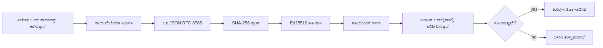

[ಪಾಠದ ವಿಡಿಯೋವನ್ನು ನೋಡಿ: ಕ್ರಿಪ್ಟೋಗ್ರಾಫಿಕ್ ರಸೀದಿಗಳೊಂದಿಗೆ AI ಏಜೆಂಟ್ಗಳನ್ನು ಸುರಕ್ಷಿತಗೊಳಿಸುವುದು](https://youtu.be/PLACEHOLDER_VIDEO_ID)

> _(ಪಾಠದ ವಿಡಿಯೋ ಮತ್ತು ಥಂಬ್ನೇಲ್ ಅನ್ನು ಮರ್ಜ್ ನಂತರ ಮೈಕ್ರೋಸಾಫ್ಟ್ ವಿಷಯ ತಂಡ ಸೇರಿಸುವುದು, ಪಾಠ 14 / 15 ಮಾದರಿಯನ್ನು ಅನುಸರಿಸಿ.)_

# ಕ್ರಿಪ್ಟೋಗ್ರಾಫಿಕ್ ರಸೀದಿಗಳೊಂದಿಗೆ AI ಏಜೆಂಟ್ಗಳನ್ನು ಸುರಕ್ಷಿತಗೊಳಿಸುವುದು

## ಪರಿಚಯ

ಈ ಪಾಠದಲ್ಲಿ ಚರ್ಚೆಯಾಗುವುದು:

- ಕಂಪ್ಲೈಯನ್ಸ್, ಡೀಬಗ್ಗಿಂಗ್ ಮತ್ತು ನಂಬಿಕೆಗೆ AI ಏಜೆಂಟ್ಗಳಿಗಾಗಿ ಅಡಿಟ್ ಟ್ರೇಲ್ಸ್ ಏಕೆ ಮಹತ್ತರವೆಂಬುದು.
- ಕ್ರಿಪ್ಟೋಗ್ರಾಫಿಕ್ ರಸೀದಿ ಎಂದರೇನು ಮತ್ತು ಅದು ಸಹಿ ಹಾಕದ ಲಾಗ್ ಲೈನ್‌ನಿಂದ ಹೇಗೆ ವಿಭಿನ್ನವಾಗುತ್ತದೆ ಎಂಬುದು.
- ಏಜೆಂಟ್‌ನ ಟೂಲ್ನ ಕಾಲ್‌ಗೆ ಸಹಿ ಹಾಕಿದ ರಸೀದಿಯನ್ನು ಪೈಥಾನ್‌ನಲ್ಲಿ ಹೇಗೆ ತಯಾರಿಸುವುದು.
- ರಸೀದಿಯನ್ನು ಆಫ್‌ಲೈನಿನಲ್ಲಿ ಪರಿಶೀಲಿಸುವುದು ಮತ್ತು ತಿದ್ದುಪಡಿ ಕಂಡು ಹಿಡಿಯುವುದು ಹೇಗೆ.
- ರಸೀದಿಗಳನ್ನು ಸರಪಳಿಯಾಗಿ ಜೋಡಿಸುವುದು, ಇದರಿಂದ ಒಂದನ್ನು ತೆಗೆದುಹಾಕುವುದರಿಂದ ಅಥವಾ ಮರುಕ್ರಮಗೊಳಿಸುವುದರಿಂದ ಸರಪಳಿ ಮುರಿಯುವುದು.
- ರಸೀದಿಗಳು ಏನು ಸಾಬೀತು ಮಾಡುತ್ತವೆ ಮತ್ತು ಅವು ಸ್ಪಷ್ಟವಾಗಿ ಏನು ಸಾಬೀತು ಮಾಡೋದಿಲ್ಲ.

## ಕಲಿಕಾ ಗುರಿಗಳು

ಈ ಪಾಠವನ್ನು ಪೂರ್ಣಗೊಳಿಸಿದ ನಂತರ, ನೀವು ತಿಳಿದುಕೊಳ್ಳಲು ಸಾಧ್ಯವಾಗುವುದು:

- ಏಜೆಂಟ್ ಕ್ರಮಗಳಿಗೆ ಕ್ರಿಪ್ಟೋಗ್ರಾಫಿಕ್ ಪ್ರವಿಷಮಾನಕ್ಕೆ ಪ್ರೇರಣೆ ನೀಡುವ ವಿಫಲತೆಯ ಮಾದರಿಗಳನ್ನು ಗುರುತಿಸುವುದು.
- ಕ್ಯಾನೊನಿಕಲ್ JSON ಪೇಲೋಡ್ ಮೇಲೆ Ed25519 ಸಹಿ ಹಾಕಿದ ರಸೀದಿಯನ್ನು ತಯಾರಿಸುವುದು.
- ಸಹಿಯ ಸರಕಾರಿ ಸಾರ್ವಜನಿಕ ಕೀಲಿಯನ್ನು ಮಾತ್ರ ಬಳಸಿ ರಸೀದಿಯನ್ನು ಸ್ವತಂತ್ರವಾಗಿ ಪರಿಶೀಲಿಸುವುದು.
- ಬದಲಾಯಿಸಿದ ರಸೀದಿ ಮೇಲೆ ಪುನಃ ಪರಿಶೀಲಿಸುವ ಮೂಲಕ ತಿದ್ದುಪಡಿ ಕಂಡು ಹಿಡಿಯುವುದು.
- ರಸೀದಿಗಳ ಹ್ಯಾಶ್ ಸರಪಳಿಯನ್ನು ಕಟ್ಟುವುದು ಮತ್ತು ಸರಪಳಿ ಮಹತ್ವವನ್ನು ವಿವರಿಸುವುದು.
- ರಸೀದಿಗಳು ಸಾಬೀತು ಮಾಡುವುದರ ಮತ್ತು ಸಾಬೀತು ಮಾಡದೆ ಇರುವುದರ ಗಡಿಗಳನ್ನು ಗುರುತಿಸುವುದು (ವಿನಿಯೋಗ, ಅಖಂಡತೆ, ಕ್ರಮವು ಸಾಬೀತು ಆದರೆ ಕ್ರಮದ ಸರಿಯಾದತೆ, ಧ್ವನಿಷ್ಠತೆಯು ಸಾಬೀತು ಮಾಡುವುದಿಲ್ಲ).

## ಸಮಸ್ಯೆ: ನಿಮ್ಮ ಏಜೆಂಟ್‌ನ ಅಡಿಟ್ ಟ್ರೇಲ್

ನೀವು Contoso ಪ್ರಯಾಣಕ್ಕಾಗಿ AI ಏಜೆಂಟ್ ಅನ್ನು ನಿಯೋಜಿಸಿರುವಿರಿ ಎಂದು ಊಹಿಸಿ. ಏಜೆಂಟ್ ಗ್ರಾಹಕರ ವಿನಂತಿಗಳನ್ನು ಓದುತ್ತದೆ, ವಿಮಾನಗಳ API ಅನ್ನು ಕರೆಸಿ ಆಯ್ಕೆಗಳನ್ನು ಹುಡುಕುತ್ತದೆ ಮತ್ತು ಗ್ರಾಹಕರ ಪರವಾಗಿ ಸೀಟುಗಳನ್ನು ಬುಕ್ ಮಾಡುತ್ತದೆ. ಕಳೆದ ತ್ರೈಮಾಸಿಕದಲ್ಲಿ, ಏಜೆಂಟ್ 50,000 ಬುಕ್ಕಿಂಗ್‌ಗಳನ್ನು ಕಾರ್ಯಗತಗೊಳಿಸಿತ್ತು.

ಇಂದು ಒಂದು ಅಡಿಟರ್ ಬಂದು, ಸರಳವಾದ ಪ್ರಶ್ನೆಯನ್ನು ಕೇಳುತ್ತಾನೆ: "ನಿಮ್ಮ ಏಜೆಂಟ್ ಏನು ಮಾಡಿದುದೆನ್ನಿಸಿ ತೋರಿಸಿ."

ನೀವು ನಿಮ್ಮ ಲಾಗ್ ಫೈಲ್‌ಗಳನ್ನು ನೀಡುತ್ತೀರಿ. ಅಡಿಟರ್ ಅವುಗಳನ್ನು ನೋಡುತ್ತಾನೆ ಮತ್ತು ಕಠಿಣವಾದ ಪ್ರಶ್ನೆ ಕೇಳುತ್ತಾನೆ: "ನಾನು ಹೇಗೆ ತಿಳಿದುಕೊಳ್ಳಬೇಕೆಂದರೆ ಈ ಲಾಗ್‌ಗಳನ್ನು ಬದಲಾಯಿಸಲ್ಪಡದೆ ಇದೆ?"

ಇದು ಅಡಿಟ್-ಟ್ರೇಲ್ ಸಮಸ್ಯೆ. ಇಂದಿನ ದಿನದಲ್ಲಿನ ಬಹುತೇಕ ಏಜೆಂಟ್ ನಿಯೋಜನೆಗಳು ಆಧಾರವಾಗಿವೆ:

- **ಅಪ್ಲಿಕೇಶನ್ ಲಾಗ್ಗಳು**: ಏಜೆಂಟ್ ಸ್ವಯಂ ಬರೆದಿದ್ದು, ಯಾರಿಗಾದರೂ ಫೈಲ್ ಸಿಸ್ಟಮ್ ಪ್ರವೇಶವಿದ್ದರೆ ಸಂಪಾದಿಸಬಹುದು.
- **ಕ್ಲೌಡ್ ಲಾಗಿಂಗ್ ಸೇವೆಗಳು**: ವೇದಿಕೆಯ ಮಟ್ಟದಲ್ಲಿ ಟ್ಯಾಂಪರ್-ಎವಿಡೆಂಟ್ ಆದರೆ ಹಾಗೂ ಅಡಿಟರ್ ವೇದಿಕೆ ಸಂಚಾಲಕನ ಮೇಲೆ ನಂಬಿಕೆಯಾಗಿದ್ದಾಗ ಮಾತ್ರ.
- **ಡೇಟಾಬೇಸ್ ವ್ಯವಹಾರ ಲಾಗ್ಗಳು**: ಡೇಟಾಬೇಸ್ ಬದಲಾವಣೆಗಳಿಗಾಗಿ ಸೂಕ್ತವಾದವು ಆದರೆ ಯಾವುದೇ ಟೂಲ್ ಕಾಲ್‌ಗಳಿಗೆ ಅಲ್ಲ.

ಇವುಗಳಲ್ಲಿ ಯಾರೂ ಅಡಿಟರ್ ಕೇಳುವ ಪ್ರಶ್ನೆಗೆ ಉತ್ತರ ನೀಡಲು ಸಾಧ್ಯವಿಲ್ಲ, ಅದು ಅಡಿಟರ್ ಯಾರು (ನೀವು, ನಿಮ್ಮ ಕ್ಲೌಡ್ ಪ್ರೊವೈಡರ್, ನಿಮ್ಮ ಡೇಟಾಬೇಸ್ ವಿತರಕ) ಮೇಲೆ ನಂಬಿಕೆ ಇಡಬೇಕಾಗುತ್ತದೆ. ಆಂತರಿಕ ಬಳಕೆಗೆ ಆ ನಂಬಿಕೆ ಸಾಮಾನ್ಯವಾಗಿ ತಕ್ಕದ್ದು; ನಿಯಂತ್ರಿತ ವರ್ಕ್‌ಲೋಡ್‌ಗಳಿಗೆ (ನಿಧಿ, ಆರೋಗ್ಯ ಸೇವೆ, ಯುರೋಪಿಯನ್ AI ನಿಯಮಕ್ಕೆ ಒಳಪಟ್ಟಯೆಲ್ಲ) ಆಯಿತಲ್ಲ.

ಕ್ರಿಪ್ಟೋಗ್ರಾಫಿಕ್ ರಸೀದಿಗಳು ಪ್ರತಿ ಏಜೆಂಟ್ ಕ್ರಮವನ್ನು ಸ್ವತಂತ್ರವಾಗಿ ಪರಿಶೀಲಿಸಲಾಗುವಂತೆ ಮಾಡಿ ಸಮಸ್ಯೆಯನ್ನು ಪರಿಹರಿಸುತ್ತವೆ. ಅಡಿಟರ್ ನಿಮಗೆ ನಂಬಿಕೆ ಇಡಬೇಕಾಗಿಲ್ಲ. ಅವರು ನಿಮ್ಮ सार्वजनिक ಕೀಲಿಯು ಮತ್ತು ರಸೀದಿ ಅನ್ನು ಮಾತ್ರ ಬೇಕು.

## ಕ್ರಿಪ್ಟೋಗ್ರಾಫಿಕ್ ರಸೀದಿ ಎಂದರೇನು?

ರಸೀದಿ ಎಂದರೇನು ಎಂದರೆ ಏಜೆಂಟ್ ಏನು ಮಾಡಿದೆಯೆಂಬ ದಸ್ತಾವೇಜು ಜೇಸನ್ ಆಬ್ಜೆಕ್ಟ್ ಆಗಿದ್ದು, ಡಿಜಿಟಲ್ ಸಹಿಯೊಂದಿಗೆ ಸಹಿ ಹಾಕಲ್ಪಟ್ಟಿದೆ.


```mermaid
flowchart LR
    A[ಏಜೆಂಟ್ ಒಂದು ಸಾಧನವನ್ನು ಕರೆಸುತ್ತಾನೆ] --> B[ರಸೀದಿ ಪೇಲೋಡ್ ನಿರ್ಮಿಸಿ]
    B --> C[ಜನ JSON RFC 8785]
    C --> D[SHA-256 ಹ್ಯಾಶ್]
    D --> E[Ed25519 ಸಹಿ ಹಾಕಿ]
    E --> F[ಸಹಿಯೊಂದಿಗೆ ರಸೀದಿ]
    F --> G[ಆಡಿಟರ್ ಆಫ್‌ಲೈನ್‌ನಲ್ಲಿ ಪರಿಶೀಲಿಸುತ್ತಾನೆ]
    G --> H{ಸಹಿ ಮಾನ್ಯವೇ?}
    H -- yes --> I[ತಿರುವು-ಸೂಚಕ ಸಾಬೀತು]
    H -- no --> J[ರಸೀದಿ ತಿರಸ್ಕೃತವಾಗಿದೆ]
```

ಕಂಠಪಾಠದ ರಸೀದಿ ಹೀಗೆ ಕಾಣುತ್ತದೆ:

```json
{
  "type": "agent.tool_call.v1",
  "agent_id": "contoso-travel-bot",
  "tool_name": "lookup_flights",
  "tool_args_hash": "sha256:a3f9c1...",
  "result_hash": "sha256:7b2e1d...",
  "policy_id": "contoso-travel-policy-v3",
  "timestamp": "2026-04-25T14:30:00Z",
  "sequence": 47,
  "previous_receipt_hash": "sha256:9d4e6a...",
  "signature": {
    "alg": "EdDSA",
    "sig": "c5af83...",
    "public_key": "8f3b2c..."
  }
}
```

ಮೂರು ಗುಣಲಕ್ಷಣಗಳು ಕೆಲಸ ಮಾಡುತ್ತಿದೆ:

1. **ಸಹಿ**. ರಸೀದಿ ಏಜೆಂಟ್ ಗೇಟ್ವೇ ಮೂಲಕ Ed25519 ಖಾಸಗಿ ಕೀಲಿಯೊಂದಿಗೆ ಸಹಿ ಮಾಡಲಾಗಿದೆ. ಹೊಂದಿರುವ ಯಾರಾಗಿದ್ದರೂ ಸಾರ್ವಜನಿಕ ಕೀಲಿಯನ್ನು ಬಳಸಿ ಸಹಿಯನ್ನು ಆಫ್‌ಲೈನಿನಲ್ಲಿ ಪರಿಶೀಲಿಸಬಹುದು. ಯಾವುದೇ ಕ್ಷೇತ್ರದಲ್ಲಿ ತಿದ್ದುಪಡಿ ಸಹಿಯನ್ನು ಅಮಾನ್ಯಗೊಳಿಸುತ್ತದೆ.

2. **ಕ್ಯಾನೊನಿಕಲ್ ಎನ್ಕೋಡಿಂಗ್**. ಸಹಿ ಹಾಕುವ ಮುನ್ನ, ರಸೀದಿ JSON ಕ್ಯಾನೊನಿಕಲೈಜೆಷನ್ ಸ್ಕೀಮ್ (JCS, RFC 8785) ಬಳಸಿಕೊಂಡು ಸರಣಿ ಮಾಡಿಬಿಡಲಾಗಿದೆ. ಇದು ಎರಡು ಅನುಷ್ಟಾನಗಳು ಸಮಾನ ಲಾಜಿಕಲ್ ರಸೀದಿಯನ್ನು ಪ್ರೊಡ್ಯೂಸ್ ಮಾಡಿದಾಗ ಬೈಟ್-ಒಂದು ರೂಪದಿರಲು ಖಚಿತಪಡಿಸುತ್ತದೆ. ಕ್ಯಾನೊನಿಕಲೀಕರಣ ಇಲ್ಲದೆ, ಬೇರೆ ಬೇರೆ JSON ಸೀರಿಯಲೈಸರ್‌ಗಳು ಒಂದೇ ವಿಷಯಕ್ಕೆ ವಿಭಿನ್ನ ಸಹಿಗಳನ್ನು ನೀಡುತ್ತವೆ.

3. **ಹ್ಯಾಶ್ ಸರಪಳಿ**. `previous_receipt_hash` ಕ್ಷೇತ್ರವು ಪ್ರತಿ ರಸೀದಿಯನ್ನು ಅದರ ಹಿಂದಿನದಕ್ಕೆ ಲಿಂಕ್ ಮಾಡುತ್ತದೆ. ಒಂದು ರಸೀದಿಯನ್ನು ತೆಗೆದುಹಾಕುವುದು ಅಥವಾ ಮರುಕ್ರಮಗೊಳಿಸುವುದು ನಂತರದ ಎಲ್ಲಾ ರಸೀದಿಗಳನ್ನು ಮುರಿಯುತ್ತದೆ. ಒಡೆತ ಯಾವುದಾದರೂ ಇಂದividual ಸಹಿಗಳನ್ನು ಮುರಿದರೂ ಕೂಡ ಸರಪಳಿ ಮಟ್ಟದಲ್ಲಿ ಕಾಣಿಸುತ್ತದೆ.

ಈ ಗುಣಲಕ್ಷಣಗಳು ಮೂರು ಭರವಸೆಗಳನ್ನು ಒದಗಿಸುತ್ತವೆ:

- **ವಿನಿಯೋಗ**: ಈ ಕೀ ಈ ವಿಷಯದ ಮೇಲೆ ಸಹಿ ಹಚ್ಚಿತು.
- **ಅಖಂಡತೆ**: ಸಹಿ ಹಾಕಿದ ಮರುಗಳಿಂದ ವಿಷಯ ಬದಲಾಗಿಲ್ಲ.
- **ಕ್ರಮ**: ಈ ರಸೀದಿ ಆ ರಸೀದಿಯ ನಂತರ ಸರಪಳಿಯಲ್ಲಿ ಬಂದಿದೆ.

## ಪೈಥಾನ್‌ನಲ್ಲಿ ರಸೀದಿ ತಯಾರಿಸುವುದು

ರಸೀದಿ ತಯಾರಿಸಲು ವಿಶೇಷ ಲೈബ്രರಿ ಅಗತ್ಯವಿಲ್ಲ. ಕ್ರಿಪ್ಟೋಗ್ರಾಫಿಕ್ ಮೂಲಭೂತ ತತ್ವಗಳು ಬಹಳ ಸಿಗುತ್ತವೆ ಮತ್ತು ಲಾಜಿಕ್ ಕೆಲ ಡಜನ್ ಪೈಥಾನ್ ಸಾಲುಗಳಷ್ಟಿದೆ.

`code_samples/18-signed-receipts.ipynb`ಯಲ್ಲಿ ಕೈಯಿಂದ ಮಾಡುವ ಅಭ್ಯಾಸಗಳು ಸಂಪೂರ್ಣ ಪ್ರಕ್ರಿಯೆಯನ್ನು ಹಾದುಹೋಗುತ್ತವೆ. ಸಂಕ್ಷಿಪ್ತ ರೂಪವೇನೆಂದರೆ:

```python
import json
import hashlib
import base64
from nacl import signing
from jcs import canonicalize  # RFC 8785 ಅನುವಂಶೀಯ JSON

def b64url_nopad(data: bytes) -> str:
    return base64.urlsafe_b64encode(data).decode("ascii").rstrip("=")

def sha256_canonical(obj) -> str:
    """SHA-256 of a Python object's JCS-canonical JSON form."""
    return f"sha256:{hashlib.sha256(canonicalize(obj)).hexdigest()}"

# ಸಹಿ ಕೀಲಿಯನ್ನು ಸೃಷ್ಟಿಸಿ ಅಥವಾ ಲೋಡ್ ಮಾಡು (ಉತ್ಪಾದನೆಯಲ್ಲಿ, ಕೀ ವಾಲ್ಟ್‌ನಲ್ಲಿ ಸಂಗ್ರಹಿಸು)
signing_key = signing.SigningKey.generate()
verify_key = signing_key.verify_key

# ರಸೀದಿ ಪೇಲೋಡ್ ರಚಿಸಿ (ಇಂದು ಸಹಿ ಇಲ್ಲ)
tool_args = {"origin": "SYD", "destination": "LAX"}
tool_result = [{"flight": "QF11", "price": 1850, "stops": 0}]

payload = {
    "type": "agent.tool_call.v1",
    "agent_id": "contoso-travel-bot",
    "tool_name": "lookup_flights",
    "tool_args_hash": sha256_canonical(tool_args),
    "result_hash": sha256_canonical(tool_result),
    "policy_id": "contoso-travel-policy-v3",
    "timestamp": "2026-04-25T14:30:00Z",
    "sequence": 0,
    "previous_receipt_hash": None,
}

# ಅನುವಂಶೀಯಗೊಳಿಸಿ, ಹ್ಯಾಶ್ ಮಾಡಿ, ಸಹಿ ಮಾಡಿ.
canonical_bytes = canonicalize(payload)
message_hash = hashlib.sha256(canonical_bytes).digest()
signature_bytes = signing_key.sign(message_hash).signature

# ರಚಿತ ಸಹಿ ವಸ್ತುವನ್ನು ಸಂलग್ನಿಸು.
receipt = {
    **payload,
    "signature": {
        "alg": "EdDSA",
        "sig": b64url_nopad(signature_bytes),
        "public_key": b64url_nopad(bytes(verify_key)),
    },
}
```

ಅದು ಸಂಪೂರ್ಣ ಸಹಿ ಹಾಕುವ ಪ್ರಕ್ರಿಯೆ. ನೋಟ್ಬುಕ್‌中的 ಅಭ್ಯಾಸಗಳು ಪ್ರತಿ ಹಂತವನ್ನು ವಿವರವಾಗಿ ಕಲಿಸುತ್ತವೆ.

## ರಸೀದಿ ಪರಿಶೀಲನೆ ಮತ್ತು ತಿದ್ದುಪಡಿ ಪತ್ತೆಮಾಡುವುದು

ಪರಿಶೀಲನೆ ವಿರುದ್ಧ ಪ್ರಕ್ರಿಯೆಯಾಗಿದೆ:

```python
import base64
import hashlib
from nacl import signing
from nacl.exceptions import BadSignatureError
from jcs import canonicalize

def b64url_decode(s: str) -> bytes:
    padding = "=" * ((4 - len(s) % 4) % 4)
    return base64.urlsafe_b64decode(s + padding)

def verify_receipt(receipt: dict) -> bool:
    # ಸಹಿ ಒಂದು ರಚನಾತ್ಮಕ ವಸ್ತು: {"alg", "sig", "public_key"}.
    sig_obj = receipt.get("signature")
    if not sig_obj or sig_obj.get("alg") != "EdDSA":
        return False

    # ನಿಜವಾಗಿಯೂ ಸಹಿ ಮಾಡಲಾದ ಪೇಲೋಡ್ ಅನ್ನು ಪುನಃ ನಿರ್ಮಿಸಿ (ಸಹಿ ಹೊರತು ಎಲ್ಲವೂ).
    payload = {k: v for k, v in receipt.items() if k != "signature"}

    canonical_bytes = canonicalize(payload)
    message_hash = hashlib.sha256(canonical_bytes).digest()

    try:
        verify_key = signing.VerifyKey(b64url_decode(sig_obj["public_key"]))
        verify_key.verify(message_hash, b64url_decode(sig_obj["sig"]))
        return True
    except BadSignatureError:
        return False
```

ಈ ಫಂಕ್ಷನ್ ಒಂದು ರಸೀದಿಯನ್ನು ತೆಗೆದುಕೊಳ್ಳುತ್ತದೆ ಮತ್ತು ಸಹಿ ಮಾನ್ಯವಿದ್ದರೆ `True` ಅನ್ನು, ಇಲ್ಲದಿದ್ದರೆ `False` ಅನ್ನು ನೀಡುತ್ತದೆ. ಯಾವ ನೆಟ್‌ವರ್ಕ್ ಕರೆ ಇಲ್ಲ, ಯಾವುದೇ ಸೇವಾ ಅವಲಂಬನೆ ಇಲ್ಲ, ಯಾವುದೇ ತೃಟಿ ಪಕ್ಷದ ಮೇಲೆ ನಂಬಿಕೆ ಇಲ್ಲ.

ತಿದ್ದುಪಡಿ ಪತ್ತೆಯನ ಚಿತ್ರಿಸಲು, ನೋಟ್ಬುಕ್ ಹೀಗೇ ಮಾಡುತ್ತದೆ:

1. ಮಾನ್ಯ ರಸೀದಿ ತಯಾರಿಸಿ ಅದರ ಪರಿಶೀಲನೆ ಯಶಸ್ವಿಯಾಗುವುದು ದೃಢೀಕರಿಸುವುದು.
2. `tool_args_hash` ಕ್ಷೇತ್ರದ ಒಂದು ಬೈಟ್ ಬದಲಾಯಿಸುವುದು.
3. ಪರಿಶೀಲನೆಯನ್ನು ಪುನಃ ನಡೆಸಿ ಅದಕ್ಕೆ ಸೋಲಾಗುವುದು ಕಾಣುವುದು.

ಇದು ರಸೀದಿಗಳು ತಿದ್ದುಪಡಿ-ಎವಿಡೆಂಟ್ ಆಗಿವೆ ಎಂಬ ಪ್ರಾಯೋಗಿಕ ಪ್ರದರ್ಶನ: ಯಥಾಸ್ಥಿತಿ ತಿದ್ದುಪಡಿದೊಂದೂ ಸಹ ಸಹಿಯನ್ನು ಮುರಿಯುತ್ತದೆ.

## ಬಹು ಹಂತ ಏಜೆಂಟ್ಗಳಿಗಾಗಿ ರಸೀದಿ ಸರಪಳಿ

ಒಂಬತ್ತು ಸಹಿ ಹಾಕಿದ ರಸೀದಿ ಒಂದು ಕ್ರಿಯೆಯನ್ನು ರಕ್ಷಿಸುತ್ತದೆ. ರಸೀದಿ ಸರಪಳಿ ಕ್ರಮವನ್ನು ರಕ್ಷಿಸುತ್ತದೆ.


```mermaid
flowchart LR
    R0[ರಸೀದಿ 0<br/>ಆರಂಭ] --> R1[ರಸೀದಿ 1]
    R1 --> R2[ರಸೀದಿ 2]
    R2 --> R3[ರಸೀದಿ 3]
    R1 -. previous_receipt_hash .-> R0
    R2 -. previous_receipt_hash .-> R1
    R3 -. previous_receipt_hash .-> R2
```

ಪ್ರತಿ ರಸೀದಿ ಹಿಂದಿನ ರಸೀದಿ ಹ್ಯಾಶ್ ಅನ್ನು ದಾಖಲೆ ಮಾಡುತ್ತದೆ. ಮಧ್ಯದಲ್ಲಿ 2 ನೇ ರಸೀದಿಯನ್ನು ಶಾಂತವಾಗಿಯೇ ತೆಗೆದುಹಾಕಲು, ದಾಳಿ ಮಾಡುವವನಿಗೆ ಒಂದಾದರೆ:

- 3 ನೇ ರಸೀದಿಯ `previous_receipt_hash` ಕ್ಷೇತ್ರವನ್ನು ಬದಲಿಸುವುದು (3 ನೇ ರಸೀದಿಯ ಸಹಿ ಮುರಿಯುವುದು), ಅಥವಾ
- ಬದಲಾಯಿಸಿದ 3 ನೇ ರಸೀದಿಯ ಮೇಲೆ ಹೊಸ ಸಹಿಯನ್ನು ನಕಲುಮಾಡುವುದು (ಏಜೆಂಟ್‌ನ ಖಾಸಗಿ ಕೀಲಿಯ ಅಗತ್ಯವಿದೆ).

ಖಾಸಗಿ ಕೀ ಹಾರ್ಡ್‌ವೇರ್ ಕೀ ವೋಲ್ಟ್‌ನಲ್ಲಿ ಇದ್ದರೆ ಮತ್ತು ನೀವು ಪ್ರತಿ ರಸೀದಿಯ ಜೊತೆಗೆ ಸಾರ್ವಜನಿಕ ಕೀಲಿಯನ್ನು ಪ್ರಕಟಿಸಿದರೆ, ಯಾವುದೂ ಈ ದಾಳಿ ಪತ್ತೆಯಾಗದೆ ಸಾಧ್ಯವಿಲ್ಲ.

ನೋಟ್ಬುಕ್ ಹೀಗೇ ಮಾಡುತ್ತದೆ:

1. ಮೂರು ರಸೀದಿ ಸರಪಳಿಯನ್ನು ಕಟ್ಟುವುದು.
2. ಪ್ರತಿಯೊಂದು ರಸೀದಿಯ `previous_receipt_hash` ಹಿಂದಿನ ರಸೀದಿ ಹ್ಯಾಶ್‌ಗೆ ಹೊಂದಿಕೆಯಾಗುವುದನ್ನು ಪರಿಶೀಲಿಸುವುದು.
3. ಮಧ್ಯದ ಒಂದು ರಸೀದಿಯಲ್ಲಿ ತಿದ್ದುಪಡಿ ಮಾಡಿ ಸರಪಳಿಯ ಮುರಿದಿರುವುದನ್ನು ನೋಡುವುದು.

ಇವುಗಳ ಮೂಲಕ ನೀವು ಒಂದು ಅಡಿಟರ್ ನಿಮ್ಮ ಮೇಲೆ ನಂಬಿಕೆ ಇಡದೆ ಪರಿಶೀಲಿಸಲು ಸಾಧ್ಯವಾದ ಅಡಿಟ್ ಟ್ರೇಲ್ ತಯಾರಿಸುವಿರಿ.

## ರಸೀದಿಗಳು ಸಾಬೀತು ಮಾಡುವವು (ಮತ್ತು ಬಲ್ಲವಿಲ್ಲದವು)

ಇದು ಈ ಪಾಠದ ಅತ್ಯಂತ ಮಹತ್ವಾದ್ಭುತ ವಿಭಾಗ. ರಸೀದಿಗಳು ಶಕ್ತಿಶಾಲಿ ಆದರೆ ಅವರ ಶಕ್ತಿ ಮಿತವಾಗಿದೆ.

**ರಸೀದಿಗಳು ಮೂರು ವಿಷಯಗಳನ್ನು ಸಾಬೀತು ಮಾಡುತ್ತವೆ:**

1. **ವಿನಿಯೋಗ**: ಒಂದು ನಿರ್ದಿಷ್ಟ ಕೀ ವಿಶೇಷ ಪೇಲೋಡ್ ಗೆ ಸಹಿ ಹಚ್ಚಿದೆ.
2. **ಅಖಂಡತೆ**: ಪೇಲೋಡ್ ಸಹಿ ಬಳಿಕ ಬದಲಾಗಿಲ್ಲ.
3. **ಕ್ರಮ**: ಈ ರಸೀದಿ ಆ ರಸೀದಿಯ ನಂತರ ಹ್ಯಾಶ್ ಸರಪಳಿಯಲ್ಲಿ ಬಂದಿದೆ.

**ರಸೀದಿಗಳು ಸಾಬೀತು ಮಾಡಬೇಕಿಲ್ಲ:**

1. **ಸರಿಯಾದತೆ**: ಏಜೆಂಟ್ ಕ್ರಮ ಸರಿಯಾದ ಕ್ರಮವೋ ಇಲ್ಲವೋ. ತಪ್ಪು ಉತ್ತರಕ್ಕಾಗಿ ಸಹ ರಸೀದಿ ಸಹಿ ಮಾಡಬಹುದು.
2. **ನೀತಿ ಅನುಸರಣೆ**: `policy_id`ಯಲ್ಲಿ ಪರೀಕ್ಷಿತ ನೀತಿ ವಾಸ್ತವವಾಗಿ ಮೌಲ್ಯಮಾಪನ ചെയಲಾಗಿದೆ ಅಥವಾ ಪರೀಕ್ಷಿಸಿದ್ದು ಈ ಕ್ರಮವನ್ನು ಅನುಮತಿಸುತ್ತದೆ ಎಂಬುದಿಲ್ಲ. ರಸೀದಿ ಕ್ಲೈಮ್ ಮಾಡಿರುವುದನ್ನೇ ದಾಖಲಿಸುತ್ತದೆ, ಜರುರಾತು ಮಾಡದದ್ದು.
3. **ಕೀ ಗಿಂತ ಮೇಲಿನ ಗುರುತಿನವಿ**: ರಸೀದಿ "ಈ ಕೀ ಈ ವಿಷಯಕ್ಕೆ ಸಹಿ ಹಚ್ಚಿದೆ" ಎಂದೇ ಹೇಳುತ್ತದೆ. "ಈ ಮಾನವ ಈ ಅನುಮೋದನೆ ನೀಡಿದ್ದು" ಅಂತ ಹೇಳುವುದಿಲ್ಲ. ವ್ಯಕ್ತಿ ಅಥವಾ ಸಂಸ್ಥೆಗೆ ಕೀ ಅನ್ನು ಕನೆಕ್ಟ್ ಮಾಡಬೇಕಾದರೆ ಬೇರೆ ಗುರುತು ಮೂಲವರ್ತನೆ (ಡೈರೆಕ್ಟರಿ, ಸಾರ್ವಜನಿಕ ಕೀ ನೋಂದಣಿ) ಬೇಕು.
4. **ಇನ್ಪುಟ್‌ಗಳ ಸತ್ಯತೆ**: ಏಜೆಂಟ್ ತಿರುವುಗೊಳ್ಳಿಸಿದ ಪ್ರಾಂಪ್ಟ್ ಪಡೆದು ಅದಕ್ಕೆ ಕ್ರಮ ತೆಗೆದುಕೊಂಡಿದ್ದರೆ, ರಸೀದಿ ಕ್ರಮವನ್ನು ನಿಷ್ಠುರವಾಗಿ ದಾಖಲಿಸುತ್ತದೆ. ರಸೀದುಗಳು ಇನ್‌ಪುಟ್ ವಾಲಿಡೇಷನ್ ನಂತರದವು, ಅದಕ್ಕೆ ಬದಲಿ ಅಲ್ಲ.

ಈ ಗಡಿಯಾರ ಎರಡು ಕಾರಣಗಳಿಗಾಗಿ ಮಹತ್ವದ್ದಾಗಿದೆ:

- ಇದು ನಿಮಗೆ ತಿಳಿಸುತ್ತದೆ ರಸೀದಿಗಳನ್ನು ಏನೆಗಾಗಿ ಉಪಯೋಗಿಸಬಹುದು: ಏಜೆಂಟ್ gedragen ನ್ನು ಆಡಿಟ್ ಮತ್ತು ತಿದ್ದುಪಡಿ-ಎವಿಡೆಂಟ್ ಮಾಡುವುದು ಇನ್ನೂ ಸಂಸ್ಥೆಗಳ ಗಡಿಗಳಲ್ಲಿ ಸಹ.
- ಇದು ನಿಮಗೆ ತೋರಿಸುತ್ತದೆ ಇನ್ನೂ ಯಾವ ಹೆಚ್ಚುವರಿ ಪದರಗಳು ಅಗತ್ಯವಿವೆ: ಇನ್ಪುಟ್ ವಾಲಿಡೇಷನ್ (ಪಾಠ 6), ನೀತಿ ಅನುಷ್ಠಾನ (ಕೆಲವು ವಿವರ ಇಲ್ಲಿದೆ), ಮತ್ತು ಗುರುತು ಮೂಲವರ್ತನೆ (ಈ ಪಾಠಕ್ಕೆ ಹೊರಗಡೆ).

ಸಾಮಾನ್ಯ ತಪ್ಪು "ನಮ್ಮ ಬಳಿ ರಸೀದಿಗಳಿವೆ" ಎಂದರೆ "ನಾವು ಆಳ್ವಿಕೆ ಹೊಂದಿದ್ದೇವೆ" ಎಂದು ಬಲ್ಲದೆ. ಅದು ಇಲ್ಲ. ರಸೀದಿಗಳು ಆಧಾರವೆ. ಆಳ್ವಿಕೆ ನೀವು ನಿರ್ಮಿಸುವ ವ್ಯವಸ್ಥೆ.

## ಉತ್ಪಾದನಾ ಉಲ್ಲೇಖಗಳು

ಈ ಪಾಠದ ಪೈಥಾನ್ ಕೋಡ್ ಉದ್ದಿಷ್ಟವಾಗಿ ಕನಿಷ್ಠವಾಗಿದೆ ಆದ್ದರಿಂದ ನೀವು ಪ್ರತಿಯೊಂದು ಸಾಲು ಓದಿ ಏನಾಗುತ್ತಿದೆಯೋ ಸರಿಯಾಗಿ ಅರ್ಥಮಾಡಿಕೊಳ್ಳಬಹುದು. ಉತ್ಪಾದನೆಯಲ್ಲಿ ನಿಮಗೆ ಎರಡು ಆಯ್ಕೆಗಳು ಇವೆ:

1. **ನೇರವಾಗಿ ಕ್ರಿಪ್ಟೋಗ್ರಾಫಿಕ್ ಮೂಲಭೂತದ ಮೇಲೆಯೇ ನಿರ್ಮಿಸು.** ಮೇಲಿನ 50 ಸಾಲುಗಳು ಬಹುಮಾನ ಯಾವುದಾದರೂ ಉಪಯೋಗಕ್ಕೆ ಸಾಕಾಗಿದೆ. PyNaCl (Ed25519) ಮತ್ತು `jcs` ಪ್ಯاكلೇಜ್ (ಕ್ಯಾನೊನಿಕಲ್ JSON) ಒಳ್ಳೆಯದು ನಿರ್ವಹಣೆಯಾದ ನೆಲೆಯ ಲೈಬ್ರರಿಗಳು.

2. **ಉತ್ಪಾದನಾ ರಸೀದಿ ಲೈಬ್ರರಿ ಉಪಯೋಗಿಸು.** ಹಲವಾರು ಓಪನ್-ಸೋರ್ಸ್ ಯೋಜನೆಗಳು ಈ ಮಾದರಿಯನ್ನು ಹೆಚ್ಚುವರಿ ವೈಶಿಷ್ಟ್ಯಗಳೊಂದಿಗೆ (ಕೀ ರೋಟೇಶನ್, ಬ್ಯಾಚ್ ಪರಿಶೀಲನೆ, JWK ಸೆಟ್ ವಿತರಣೆ, ನೀತಿ ಎಂಜಿನ್‌ಗಳೊಂದಿಗೆ ಇಂಟಿಗ್ರೇಶನ್) ಜಾರಿಗೊಳಿಸುತ್ತವೆ:
   - ಈ ಪಾಠದಲ್ಲಿ ಬಳಸಿದ ರಸೀದಿ ಸ್ವರೂಪವು ಪ್ರಸ್ತುತ ಮಾನ್ಯತೆ ಪ್ರಕ್ರಿಯೆಯಲ್ಲಿ ಇರುವ IETF ಇಂಟರ್‌ನೆಟ್-ಡ್ರಾಫ್ಟ್ (`draft-farley-acta-signed-receipts`) ಅನುಸರಿಸುತ್ತದೆ.
   - ಮೈಕ್ರೋಸಾಫ್ಟ್ ಏಜೆಂಟ್ ಗೌವರ್ನೆನ್ಸ್ ಟೂಲ್‌ಕಿಟ್ Cedar ಆಧಾರಿತ ನೀತಿ ನಿರ್ಣಯಗಳೊಂದಿಗೆ ರಸೀದಿಗಳನ್ನು ಸಮರ್ಪಕಗೊಳಿಸುತ್ತದೆ; ಆ ಗದಿನಲ್ಲಿನ ಟ್ಯುಟೋರಿಯಲ್ 33 ಅನ್ನು ಪೂರ್ಣ ಉದಾಹರಣೆಗೆ ನೋಡಿ.
   - `protect-mcp` (npm) ಮತ್ತು `@veritasacta/verify` (npm) ಪ್ಯಾಕೇಜುಗಳು ಎಡ್ಮಿಂ ಜೆ ಒಂದು Node ಆಧಾರಿತ ರಸೀದಿ ಸಹಿ ಮತ್ತು ಆಫ್‌ಲೈನ್ ಪರಿಶೀಲನಾ ಜಾರಿಗೆ ರೂಪಿಸಿವೆ, ಯಾವುದೇ MCP ಸರ್ವರ್‌ ನ್ನು ಟ್ಯಾಂಪರ್-ಎವಿಡೆಂಟ್ ಅಡಿಟ್ ಟ್ರೇಲ್ ನೊಂದಿಗೆ ಚೌಕಟ್ಟು ಮಾಡುವ ಉದ್ದೇಶದ.
   - **[nobulex](https://github.com/arian-gogani/nobulex)** ಪೈಥಾನ್ SDK (`pip install nobulex`) Ed25519 + JCS ಸಹಿ ಮಾದರಿಯನ್ನು LangChain ಮತ್ತು CrewAI ಲಾಗಂತರಗೊಳಿಸುವಿಕೆಗಳೊಂದಿಗೆ ಪೈಥಾನ್‌ನಲ್ಲಿ ಒದಗಿಸುತ್ತದೆ, ಪ್ರಕಟಿತ ಕ್ರಾಸ್-ವ್ಯಾಲಿಡೇಷನ್ ಪರೀಕ್ಷಾ ವೆಕ್ಟರ್‌ಗಳು ಮತ್ತು [OWASP PR #2210](https://github.com/OWASP/CheatSheetSeries/pull/2210)ರಿಂದ ಕೊಡುಗೆ ನೀಡಿದ ಕಂಪ್ಲಯನ್ಸ್ ಮ್ಯಾಪಿಂಗ್ ಸೇರಿದಂತೆ.

ನಿಮ್ಮದೇ JWT ಲೈಬ್ರರಿಯನ್ನು ಬರೆಯುವ ಮತ್ತು ಪರೀಕ್ಷಿತ JWT ಲೈಬ್ರರಿಯನ್ನು ಬಳಸುವ ನಿರ್ಧಾರವನ್ನು ಹೋಲಿಸಿ, ನಿಮ್ಮದೇ ರಸೀದಿ ಲೈಬ್ರರಿಯನ್ನು ಹಾಕುವುದು ಮತ್ತು ಲೈಬ್ರರಿ ಉಪಯೋಗಿಸುವ ನಿರ್ಧಾರವನ್ನು ಹೋಲಿಸುತ್ತದೆ: ಎರಡೂ ನೆಗೆಟಿವ್ ಅಲ್ಲ; ಲೈಬ್ರರಿ ಸಮಯ ಉಳಿಸುತ್ತದೆ ಮತ್ತು ಅಡಿಟ್ ಸತಹ ಕಡಿಮೆ ಮಾಡುತ್ತದೆ; ಆರಂಭದಿಂದಲೇ ರಚಿಸುವ ದಾರಿಗೆ ಪ್ರತಿಯೊಂದು ಮೂಲಭೂತವನ್ನು ನಿಮಗೆ ಅರ್ಥಮಾಡಿಕೊಳ್ಳಲು ಪ್ರೇರೇಪಿಸುತ್ತದೆ. ಈ ಪಾಠವು ಆರಂಭದಿಂದಲೇ ಮಾರ್ಗವನ್ನು ಕಲಿಸುತ್ತಿದೆ ಆದ್ದರಿಂದ ನೀವು ಯಾವುದೇ ಆಯ್ಕೆಗಾಗಿ ಆಧಾರವನ್ನು ಹೊಂದಿರುತ್ತೀರಿ.

## ಜ್ಞಾನ ತಪಾಸಣೆ

ಅಭ್ಯಾಸಕ್ಕಾಗಿ ಹಿಂತಿರುಗುವ ಮೊದಲೇ ನಿಮ್ಮ ಅರ್ಥವನ್ನು ಪರೀಕ್ಷಿಸಿ.

**1. ರಸೀದಿಗೆ ಏಜೆಂಟ್ ಖಾಸಗಿ Ed25519 ಕೀಲಿಯಿಂದ ಸಹಿ ಹಾಕಲಾಗಿದೆ. ಅಡಿಟರ್ ಕೇವಲ ಸಾರ್ವಜನಿಕ ಕೀಲಿಯನ್ನು ಹೊಂದಿದ್ದಾನೆ. ಅಡಿಟರ್ ಆಫ್‌ಲೈನ್‌ನಲ್ಲಿ ರಸೀದಿಯನ್ನು ಪರಿಶೀಲಿಸಬಹುದೇ?**

<details>
<summary>ಉತ್ತರ</summary>

ಹೌದು. Ed25519 ಪರಿಶೀಲನೆಗೆ ಕೇವಲ ಸಾರ್ವಜನಿಕ ಕೀ ಮತ್ತು ಸಹಿ ಹಾಕಲಾದ ಬೈಟ್‌ಗಳೇ ಬೇಕು. ಯಾವ ನೆಟ್‌ವರ್ಕ್ ಕರೆ ಇಲ್ಲ, ಯಾವ ಸೇವಾ ಅವಲಂಬನೆ ಇಲ್ಲ. ಇದು ರಸೀದಿಗಳನ್ನು ಏರ್-ಗ್ಯಾಪ್ಡ್, ಬಹು-ಸಂಸ್ಥೆ ಅಥವಾ ಕಡಿಮೆ ನಂಬಿಕೆಯ ಆಡಿಟ್ ಸೆಟಿಂಗ್‌ಗಳಲ್ಲಿ ಉಪಯುಕ್ತವಾಗಿಸುವ ಗುಣಲಕ್ಷಣ.
</details>

**2. ದಾಳಿ ಮಾಡುತಿ `policy_id` ಕ್ಷೇತ್ರವನ್ನು ಬದಲಾಯಿಸಿ ಅದು ಮತ್ತಷ್ಟು ಅನುಮತಿದಾಯಕ ನೀತಿಂದ ಆಡಳಿತವಾಯಿತೆಂದು ಹೇಳುತ್ತಿದೆ. ಸಹಿ ಮೂಲ ಪೇಲೋಡ್ ಮೇಲೆ ಮಾಡಲ್ಪಟ್ಟಿತ್ತು. ಪರಿಶೀಲನೆಯಾಗುವಾಗ ಏನಾಗುತ್ತದೆ?**

<details>
<summary>ಉತ್ತರ</summary>

ಪರಿಶೀಲನೆ ವಿಫಲವಾಗುತ್ತದೆ. ಸಹಿ ಮೂಲ ಪೇಲೋಡ್ ಕ್ಯಾನೊನಿಕಲ್ ಬೈಟ್‌ಗಳ ಮೇಲೆ ಮಾಡಲಾಗಿದೆ; ಯಾವುದಾದರೂ ಕ್ಷೇತ್ರವನ್ನು ಬದಲಾಯಿಸುವುದು ಕ್ಯಾನೊನಿಕಲ್ ಬೈಟ್‌ಗಳನ್ನು ಬದಲಿಸುತ್ತದೆ, ಅದು SHA-256 ಹ್ಯಾಶ್ ಬದಲಿಸುವುದು, ಅದು ಸಹಿಯನ್ನು ಅಮಾನ್ಯಗೊಳಿಸುವುದು. ದಾಳಿ ಮಾಡಲು ಅವರಿಗೆ ಖಾಸಗಿ ಕೀ ಬೇಕಾಗುತ್ತದೆ, ಅದು ಇಲ್ಲ.
</details>

**3. ರಸೀದಿಯಲ್ಲಿ ಕಚ್ಚಾ ಅರ್ಗ್ಯೂಮೆಂಟ್‌ಗಳು ಮತ್ತು ಫಲಿತಾಂಶ ಬದಲು `tool_args_hash` ಮತ್ತು `result_hash`ಏಕೆ ಸೇರಿಸಲಾಗಿದೆ?**

<details>
<summary>ಉತ್ತರ</summary>

ಎರಡು ಕಾರಣಗಳಿವೆ. ಮೊದಲನೆಯದು, ರಸೀದಿ ಸಂಗ್ರಹ ಅಥವಾ ಪ್ರಸಾರ ಮಾಡುವ ಪರಿಸರಗಳಲ್ಲಿ ಕಚ್ಚಾ ವಿಷಯ (ಪೈ, ವ್ಯವಹಾರ ಮಾಹಿತಿ) ಹೀರಿಕೊಂಡರೆ ಸಮಸ್ಯೆ. ಹ್ಯಾಶ್‌ನಿಂದ ರಸೀದಿ ಚಿಕ್ಕದಾಗುತ್ತದೆ ಮತ್ತು ವಿಷಯ ಖಾಸಗಿಯಾಗುತ್ತದೆ; ಅಡಿಟರ್ ನಿಜವಾದ ವಿಷಯದ ಬೇರೆ ಪ್ರತಿಯೊಡನೆ ಹ್ಯಾಶ್ ಹೊಂದಿದೆ ಎಂದು ಪರಿಶೀಲಿಸುತ್ತದೆ. ಎರಡನೆಯದು, ಹ್ಯಾಶ್‌ಗಳ ಗಾತ್ರ ಫಿಕ್ಸಾಗಿದೆ; ಕೇಳಿಗಳು ಮತ್ತು ಫಲಿತಾಂಶಗಳ ಗಾತ್ರ ಎಷ್ಟು ಇದ್ದರೂ ಹ್ಯಾಶ್ ಬಳಕೆಯು ರಸೀದಿಯ ಗಾತ್ರವನ್ನು ನಿಯಂತ್ರಿಸುತ್ತದೆ.
</details>

**4. `previous_receipt_hash` ಕ್ಷೇತ್ರವು ಪ್ರತಿಯೊಂದು ರಸೀದಿಯನ್ನು ಅದರ ಪೂರ್ವವರ್ಗಕ್ಕೆ ಲಿಂಕ್ ಮಾಡುತ್ತದೆ. ಮದ್ಯದಲ್ಲಿ ಒಂದು ರಸೀದಿಯನ್ನು ದಾಳಿ ತಪ್ಪಿಸದೆ ಅಳಿಸಿದರೆ ಏನು ಅಮಾನ್ಯವಾಗುತ್ತದೆ?**

<details>
<summary>ಉತ್ತರ</summary>

ಅಳಿಸಿದ ನಂತರದ ಪ್ರತಿಯೊಂದು ರಸೀದಿಗೂ ಅದರಿಂದ `previous_receipt_hash` ಅಸಂಗತವಾಗುತ್ತದೆ (ಅವುಗಳು ಇಂದಿಯಾಗಿದ್ದ ಪೂರ್ವವರ್ಗವನ್ನು ಹೊಂದದೇ ಇರುತ್ತವೆ). ಅಳುವುದನ್ನು ಮರೆಮಾಡಲು ದಾಳಿ ಮಾಡುವನು ಪ್ರತಿಯೊಂದು ನಂತರದ ರಸೀದಿಯನ್ನು ಪುನಃ ಸಹಿ ಹಾಕಬೇಕಾಗುತ್ತದೆ, ಇದಕ್ಕೆ ಖಾಸಗಿ ಕೀಲಿಯ ಅಗತ್ಯ.
</details>

**5. ಒಂದು ರಸೀದಿ ಶುಭ್ರವಾಗಿ ಪರಿಶೀಲಿಸಲ್ಪಟ್ಟಿದೆ. ಇದು ಏಜೆಂಟ್ ಕ್ರಮ ಸರಿಯಾದ, ಧ್ವನಿಷ್ಠತೆಳ್ಳುವ ಅಥವಾ ನೀತಿಪಾಲನೆಯನ್ನು ಮಾಡಿರುವುದಾಗಿ ಸಾಬೀತು ಮಾಡುತ್ತದೆಯೇ?**

<details>
<summary>ಉತ್ತರ</summary>

ಇಲ್ಲ. ಮಾನ್ಯ ರಸೀದಿ ಮೂರು ಸಂಗತಿಗಳನ್ನು ಸಾಬೀತು ಮಾಡುತ್ತದೆ: ವಿನಿಯೋಗ (ಈ ಕೀ ಈ ವಿಷಯಕ್ಕೆ ಸಹಿ ಹಾಕಿದೆ), ಅಖಂಡತೆ (ವಿಷಯ ಬದಲಾಗಿಲ್ಲ), ಮತ್ತು ಕ್ರಮ (ಈ ರಸೀದಿ ಆ ರಸೀದಿಯ ನಂತರ ಬಂದಿದೆ). ಇದು ಕ್ರಮ ಸರಿಯಾದದ್ದು ಎಂದು ಸಾಬೀತು ಮಾಡೋದಿಲ್ಲ, `policy_id`ಯಲ್ಲಿ ಸೂಚಿಸಿದ ನೀತಿ ಪರಿಶೀಲಿಸಲ್ಪಟ್ಟದ್ದು ಅಥವಾ ಏಜೆಂಟ್ ಎಲ್ಲಾ ನಿಯಮಗಳನ್ನು ಅನುಸರಿಸಿದದ್ದು ಎಂದು ಸಾಬೀತು ಮಾಡುವುದಿಲ್ಲ. ರಸೀದಿಗಳು ಏಜೆಂಟ್ ನಡೆಮನೆಯನ್ನು ಆಡಿಟ್ ಮಾಡಲು ಉಪಯೋಗವಾಗುತ್ತವೆ, ಸರಿಯಾಗಿಸಲು ಅಲ್ಲ. ಇದು ಪಾಠದ ಅತ್ಯಂತ ಪ್ರಮುಖ ಗಡಿ.
</details>

## ಅಭ್ಯಾಸ ವ್ಯಾಯಾಮ

`code_samples/18-signed-receipts.ipynb` ತೆರೆಯಿರಿ ಮತ್ತು ಎಲ್ಲಾ ನಾಲ್ಕು ವಿಭಾಗಗಳನ್ನು ಪೂರ್ಣಗೊಳಿಸಿ:

1. **ವಿಭಾಗ 1**: ನಿಮ್ಮ ಮೊದಲ ರಸೀದಿಗೆ ಸಹಿ ಹಾಕಿ ಮತ್ತು ಪರಿಶೀಲಿಸಿ.
2. **ವಿಭಾಗ 2**: ರಸೀದಿಯಲ್ಲಿ ತಿದ್ದುಪಡಿ ಮಾಡಿ ಪರಿಶೀಲನೆ ವಿಫಲವಾಗುವುದನ್ನು ಗಮನಿಸಿ.
3. **ವಿಭಾಗ 3**: ಮೂರು ರಸೀದಿ ಸರಪಳಿಯನ್ನು ಕಟ್ಟದೆ ಸರಪಳಿ ಅಖಂಡತೆಯನ್ನು ಪರಿಶೀಲಿಸಿ.
4. **ವಿಭಾಗ 4**: ಮೈಕ್ರೋಸಾಫ್ಟ್ ಏಜೆಂಟ್ ಫ್ರೇಮ್ವರ್ಕ್ ಬಳಸಿ ನಿರ್ಮಿತ ಏಜೆಂಟ್‌ಗೆ ಮಾದರಿಯನ್ನು ಅನ್ವಯಿಸಿ: ಟೂಲ್ನ ಕಾಲ್ ಅನ್ನು ರಸೀದಿ ಸಹಿ ಮಾಡುವಲ್ಲಿ ಬೇರೆ ತಪಾಸಣೆ ಕೈಗೊಳ್ಳಿ.


**ಸ್ಟ್ರೆಚ್ ಚಾಲೆಂಜ್ 1:** ರಸೀದಿ ಸ್ಕೀಮಾದಲ್ಲಿ ನಿಮ್ಮ ಆಯ್ಕೆಮಾದ ಒಂದು ಹೆಚ್ಚುವರಿ ಕ್ಷೇತ್ರವನ್ನು (ಉದಾಹರಣೆಗೆ, ಟ್ರೇಸಿಂಗ್ ಗಾಗಿ ವಿನಂತಿಸುವ ID) ಸೇರಿಸಿ, ಅದನ್ನು ಒಳಗೊಂಡಿರುವಂತೆ ಕ್ಯಾನೋನಿಕಲ್ ಸಹಿ ಲಾಜಿಕ್ ಅನ್ನು ನವೀಕರಿಸಿ, ಮತ್ತು ರಸೀದಿ ಪರಿಶೀಲನೆಯ ಮೂಲಕ ಇನ್ನೂ ಸುತ್ತುತ್ತಿರುವುದನ್ನು ದೃಢೀಕರಿಸಿ. ನಂತರ ಸಹಿ ಹಾಕಿದ ನಂತರ ಕ್ಷೇತ್ರವನ್ನು ಬದಲಾಯಿಸಿ ಮತ್ತು ಪರಿಶೀಲನೆ ವಿಫಲವಾಗುವುದನ್ನು ದೃಢೀಕರಿಸಿ. ಇದು ನೀವು ಕ್ಯಾನೋನಿಕಲ್ ಎನ್‌ಕೋಡಿಂಗ್‌ನ ಪ್ರತಿಯೊಂದು ಬೈಟ್ ಸಹಿಗೆ ಹೇಗೆ ಸಹಾಯ ಮಾಡುತ್ತದೆ ಎಂಬುದನ್ನು ಅರಿತುಕೊಳ್ಳಲು ನೆರವಾಗುತ್ತದೆ.

**ಸ್ಟ್ರೆಚ್ ಚಾಲೆಂಜ್ 2:** ನಿಮ್ಮ ಎರಡು ರಸೀದಿಗಳನ್ನು SHA-256-ಹ್ಯಾಶ್ ಮಾಡಿ (ಅವರ ಕ್ಯಾನೋನಿಕಲ್ ಬೈಟ್‌ಗಳನ್ನು ನಿರ್ದಿಷ್ಟ ಕ್ರಮದಲ್ಲಿ ಸಂಪರ್ಕಿಸಿ) ಮತ್ತು ಉತ್ಪನ್ನವಾದ ಹ್ಯಾಶ್ ಅನ್ನು ಮೂರನೆಯ ರಸೀದಿಯಲ್ಲಿ ಹೊಸ ಕ್ಷೇತ್ರವಾಗಿ ಸೇರಿಸಿ ಹಾಗೂ ಸಹಿ ಹಾಕಿ. ಮೂರು ರಸೀದಿಗಳು ಇನ್ನೂ ಸುತ್ತುತ್ತಿರುವುದನ್ನು ಪರಿಶೀಲಿಸಿ. ನೀವು ಈಗ ಒಂದೇ ಹಂತದ ಸಮಾವೇಶವನ್ನು ನಿರೂಪಿಸಿದೀರಿ: ಮೂರನೆಯ ರಸೀದಿ ಹೊಂದಿರುವ ಯಾರಿಗೂ ಮೊದಲ ಎರಡು ರಸೀದಿಗಳು ಸಹಿ ಹಾಕುವ ಸಮಯದಂದು ಇತ್ತವೆ ಎಂದು ಯಾವುದೇ ವಿಷಯವನ್ನು ಬಹಿರಂಗಪಡಿಸದೇ ಸಾಬೀತುಪಡಿಸಬಹುದು. ಇದು ಆಯ್ಕಾಯಿತಿತಾ ಬಹಿರಂಗಪಡಿಸುವ ರಸೀದಿ ಮಾದರಿಯ ಮಾದರಿಯಾಗಿದೆ (ಮರ್ಕಲ್ ಕಮಿಟ್‌ಮೆಂಟ್‌ಗಳು, RFC 6962).

## ಸಮಾರೋಪ

ರಹಸ್ಯಚಿಹ್ನಿತ ರಸೀದಿಗಳು AI ಏಜೆಂಟ್‌ಗಳಿಗೆ ಈ ಕೆಳಗಿನ ಗುಣ ಲಕ್ಷಣಗಳನ್ನು ಹೊಂದಿರುವ ಆಡಿಟ್ ಟ್ರೇಲ್ ಅನ್ನು ಒದಗಿಸುತ್ತವೆ:

- **ಸ್ವತಂತ್ರವಾಗಿ ಪರಿಶೀಲಿಸಬಹುದಾದ**: ಸಾರ್ವಜನಿಕ ಕೀ ಹೊಂದಿರುವ ಯಾವುದೇ ಪಕ್ಷ ಪರಿಶೀಲಿಸಬಹುದು, ಯಾವುದೇ ಸೇವಾ ಅವಲಂಬನೆ ಇಲ್ಲ.
- **ತಡೆಹಿಡಿಯುವ ಲಕ್ಷಣ**: ಯಾವುದೇ ತಿದ್ದುಪಡಿ ಸಹಿಯನ್ನು ಅಮಾನ್ಯಗೊಳಿಸುತ್ತದೆ.
- **ಪೋರ್ಟಬಲ್**: ರಸೀದಿ ಎಂಬುದು ಸಣ್ಣ JSON ಫೈಲ್; ಇದನ್ನು ಸಂಗ್ರಹಿಸಬಹುದು, ಪ್ರಸಾರ ಮಾಡಬಹುದು ಮತ್ತು ಎಲ್ಲಿ ಬೇಕಾದರೂ ಪರಿಶೀಲಿಸಬಹುದು.
- **ಮಾನದಂಡಗಳಿಗೆ ಅನುಗುಣ**: Ed25519 (RFC 8032), JCS (RFC 8785), ಮತ್ತು SHA-256 ಅನ್ನು ಬಳಸಿ ನಿರ್ಮಿಸಲಾಗಿದೆ, ಎಲ್ಲವು ವ್ಯಾಪಕವಾಗಿ ಉಪಯೋಗಿಸಲಾಗುತ್ತಿವೆ.

ಅವು ಇನ್ಪುಟ್ ಮಾನ್ಯತೆ, ನೀತಿ ಜಾರಿಗೆ ಅಥವಾ ಗುರುತುಮಾಪನ ಕುಟುಂಬಾಧಾರಕ್ಕೆ ಪರ್ಯಾಯವಲ್ಲ. ಅವು ಆ ಹಂತಗಳಿಗೆ ಆಧಾರಶೀಲವಾಗಿವೆ. ನೀವು ನಿಯಂತ್ರಣಗೊಳಿಸಲ್ಪಟ್ಟ ಕೆಲಸಭಾಗಗಳಲ್ಲಿ, ಬಹು-ಸಂಘಟನೆಯ ಕಾರ್ಯಪ್ರವಾಹಗಳಲ್ಲಿ ಅಥವಾ ಭವಿಷ್ಯದ ಆಡಿಟರ್ ನಿಮಗೆ ವಿಶ್ವಾಸವಿರಿಸಲಾಗದು ಎಂದು ಭಾವಿಸುವ ಪರಿಸ್ಥಿತಿಗಳಲ್ಲಿ ಏಜಂಟ್‌ಗಳನ್ನು ನಿಯೋಜಿಸುವಾಗ, ರಸೀದಿಗಳು ನಿಮ್ಮ ಆಡಿಟ್ ಟ್ರೇಲ್ ಅನ್ನು ನಿಷ್ಠಾವಂತ ಮಾಡುತ್ತವೆ.

ಅತಿ ಮುಖ್ಯವಾದ ಪಾಠ: ರಸೀದಿಗಳು ಯಾರು ಯಾವಾಗ ಏನನ್ನು ಹೇಳಿದರು ಎಂಬುದನ್ನು ಸಾಬೀತುಪಡಿಸುತ್ತವೆ. ಮಾತಾಡಿದ್ದದು ಸತ್ಯ ಅಥವಾ ಸರಿಯಾಗಿದೆ ಎಂದು ಸಾಬೀತುಪಡಿಸುವುದಿಲ್ಲ. ಆ ವಿಭಿನ್ನತೆಯನ್ನು ಒಡ್ಡಿ ಹಿಡಿಯಿರಿ. ಇದು ನಿಷ್ಠಾವಂತ ಮೂಲತತ್ವ ವ್ಯವಸ್ಥೆ ಮತ್ತು ತಪ್ಪು ದಿಕ್ಕಿನ ನಡುವಿನ ಭೇದವಾಗಿದೆ.

## ಉತ್ಪಾದನೆ ಪರಿಶೀಲನೆ ಪಟ್ಟಿ

ನೀವು ಈ ಪಾಠದಿಂದ ಹೊರ ಬರಲು ಮತ್ತು ರಸೀದಿ-ಸಹಿ ಮಾಡಿದ ಏಜೆಂಟ್‌ಗಳನ್ನು ನಿಜವಾದ ಪರಿಸರದಲ್ಲಿ ನಿಯೋಜಿಸಲು ಸಿದ್ಧರಾಗಿರುವಾಗ:

- [ ] **ಸಹಿ ಕೀ ಡೆವಲಪರ್ ಲ್ಯಾಪ್‌ಟಾಪ್‌ನಿಂದ ತೆಗೆದುಹಾಕಿ.** Azure Key Vault, AWS KMS ಅಥವಾ হার್ಡ್ವೇರ್ ಸುರಕ್ಷತಾ ಗಣಕವನ್ನು ಬಳಸಿ. ನಿಮ್ಮ ರಸೀದಿಗಳನ್ನು ಸಹಿ ಮಾಡುವ ಖಾಸಗಿ ಆರೆಡೆವು ಮೂಲ ನಿಯಂತ್ರಣದಲ್ಲೋ ಅಥವಾ ಎಪ್ಲಿಕೇಶನ್ ಯಂತ್ರಗಳಲ್ಲಿ ಪ್ಲೇನ್‌ಟೆಕ್ಸ್ಟಿನಲ್ಲಿ ಇರಬಾರದು.
- [ ] **ಪರಿಶೀಲನಾ ಸಾರ್ವಜನಿಕ ಕಿಯನ್ನು ಪ್ರಕಟಿಸಿ.** ಆಡಿಟರ್‌ಗಳು ಅದನ್ನು ಆಫ್‌ಲೈನ್‌ನಲ್ಲಿ ಪರಿಶೀಲಿಸಲು ಬೇಕಾಗಿದೆ. ಮಾನದಂಡ ಮಾದರಿ JWK ಸೆಟ್ ಅನ್ನು ಒಪ್ಪಿಗೆಯಾಗಿ URL (RFC 7517), ಉದಾ., `https://your-org.example.com/.well-known/agent-keys.json` ನಲ್ಲಿ ಇಡಬೇಕು.
- [ ] **ಚೈನ್ ಅನ್ನು ಹೊರಗೆ ಅಂಕರ್ ಮಾಡಿ.** ಸಮಯಾಂತರವಾಗಿ ಇತ್ತೀಚಿನ ಸರಪಳಿಯ ತಲ ಹ್ಯಾಶ್ ಅನ್ನು ಪರದರ್ಶಿ ದಾಖಲೆಯಲ್ಲಿ ಬರೆಯಿರಿ (Sigstore Rekor, RFC 3161 ಕಾಲಮುದ್ರಾಧಿಕಾರಿ, ಅಥವಾ ಎರಡನೇ اندرಗಿನ ವ್ಯವಸ್ಥೆ) ಆಗ ಹೊರಗಿನ ಪಕ್ಷವು "ಈ ಸರಪಳಿ ಈ ಸಮಯದಲ್ಲಿ ಇತ್ತು" ಎಂದು ದೃಢೀಕರಿಸಬಹುದು.
- [ ] **ರಸೀದಿಗಳನ್ನು ಬದಲಾಯಿಸದಂತೆ ಸಂಗ್ರಹಿಸಿ.** ಸೇರ್ಪಡೆ-ಮಾತ್ರ ಬ್ಲಾಬ್ ಸಂಗ್ರಹಣೆ (Azure ಸಂಗ್ರಹಣೆ ಅಚಲತಾ ನೀತಿಗಳೊಂದಿಗೆ, AWS S3 ವಸ್ತು ಲಾಕ್) ಒಳಗಿನ ವ್ಯಕ್ತಿಗೆ ಸಂಗ್ರಹಣಾ ಹಂತದಲ್ಲಿ ಇತಿಹಾಸವನ್ನು ಮರುಬರೆಯಲು ಅವಕಾಶ ನೀಡುವುದಿಲ್ಲ.
- [ ] **ರಕ್ಷಣೆ ಅವಧಿಯನ್ನು ನಿರ್ಧರಿಸಿ.** ಹಲವಾರು ಅನುಕೂಲಾತ್ಮಕ ನಿಯಮಗಳು ಬಹು-ವರ್ಷದ ಉಳಿವು ಅಗತ್ಯವಿದೆ. ರಸೀದಿ ವೃದ್ಧಿಗಾಗಿಯೂ ಯೋಜನೆ ಮಾಡಿಕೊಳ್ಳಿ (ಒಂದು ರಸೀದಿ ಸುಮಾರು 500 ಬೈಟ್; ದಿನಕ್ಕೆ 10 ಸಾವಿರ ಕರೆಗಳನ್ನು ಮಾಡುತ್ತಿರುವ ಏಜೆಂಟ್ ವರ್ಷಕ್ಕೆ ಸುಮಾರು 1.8 GB ಉತ್ಪಾದಿಸುತ್ತದೆ).
- [ ] **ರಸೀದಿಗಳು ಏನು ಹೊರೆತಿವೆ ಎಂದು ದಾಖಲೆ ಮಾಡಿಕೊಳ್ಳಿ.** ರಸೀದಿಗಳು ಹಣತೆ, ಸತ್ಯತೆ ಮತ್ತು ಕ್ರಮವನ್ನು ಸಾಬೀತುಪಡಿಸುತ್ತವೆ. ನಿಮ್ಮ ರನ್‌ಬುಕ್ ಸ್ಪಷ್ಟವಾಗಿ ಏನು ಹೆಚ್ಚುವರಿ ನಿಯಂತ್ರಣೆಗಳು (ಇನ್ಪುಟ್ ಮಾನ್ಯತೆ, ನೀತಿ ಜಾರಿಗೆ, ದರ ಮಿತಿ, ಗುರುತುಮಾಪನ ಕ್ರೌಢತೆ) ರಸೀದಿಗಳೊಂದಿಗೆ ನಿಮ್ಮ ಗವರ್ನೆನ್ಸ್ ಭಂಗಿಮೆಯಲ್ಲಿ ಅಂಟಿಕೊಂಡಿವೆ ಎಂಬುದನ್ನು ಪಟ್ಟಿ ಮಾಡಬೇಕು.

### AI ಏಜೆಂಟ್‌ಗಳ ಸುರಕ್ಷತೆಯ ಕುರಿತು ಇನ್ನಷ್ಟು ಪ್ರಶ್ನೆಗಳಿವೆಯಾ?

ಇತರೆ ವಿದ್ಯಾರ್ಥಿಗಳ ಜೊತೆಗೆ ಭೇಟಿಯಾಡಲು, ಆಫೀಸ್ ಗಂಟುಗಳಿಗೆ ಹಾಜರಾಗಲು ಮತ್ತು ನಿಮ್ಮ AI ಏಜೆಂಟ್ ಪ್ರಶ್ನೆಗಳಿಗೆ ಉತ್ತರ ಪಡೆಯಲು [Microsoft Foundry Discord](https://aka.ms/ai-agents/discord) ಸೇರಿ.

## ಈ ಪಾಠದ ನಂತರ

ಈ ಪಾಠವು ಏಕ-ರಸೀದಿ ಸಹಿ ಮತ್ತು ಹ್ಯಾಶ್ ಸರಪಳಿ ಆಧಾರಿತ ಕ್ರಮಗಳನ್ನು ಸಂಗ್ರಹಿಸುತ್ತದೆ. ಸಮಾನ ಮೌಲ್ಯಗಳು ನಿಮ್ಮ ಗವರ್ನೆನ್ಸ್ ಭಂಗಿಮೆ ಅಭಿವೃದ್ಧಿಯಾಗುತ್ತಿದ್ದಂತೆ ಇನ್ನಷ್ಟು ಆದುಕೊಂಡ ವಿಧಿಗಳಾಗಿ ರಚಿಸಲ್ಪಡುತ್ತವೆ:

- **ಆಯ್ಕೆಮಾತು ಬಹಿರಂಗಪಡಿಸುವಿಕೆ.** ರಸೀದಿಗಳ ಕ್ಷೇತ್ರಗಳು ಸ್ವತಂತ್ರವಾಗಿ ಬದ್ಧವಾಗಿದ್ದರೆ (RFC 6962 ಶೈಲಿಯ ಮರ್ಕಲ್ ಮರ), ನೀವು ನಿರ್ದಿಷ್ಟ ಕ್ಷೇತ್ರಗಳನ್ನು ನಿರ್ದಿಷ್ಟ ಆಡಿಟರ್‌ಗಳಿಗೆ ಬಹಿರಂಗಪಡಿಸಿ ಇತರವುಗಳ ಬದಲಾಗದಿರುವುದನ್ನು ಸಾಬೀತುಪಡಿಸಬಹುದು. ಅದೇ ರಸೀದಿ ಸಮಗ್ರ ಆಡಿಟ್ (ಪೂರ್ಣತೆ ಬೇಕು) ಮತ್ತು GDPR (ಕಡಿಮೆ ಡೇಟಾ ಬೇಕು) ಮಾದರಿಗಳ ಎರಡನ್ನೂ ಪೂರೈಸಲು ಉಪಯುಕ್ತ.
- **ರಸೀದಿ ರದ್ದುಪಡಿಸುವಿಕೆ.** ಸಹಿ ಕೀ ಹಾಳಾಗಿದ್ದರೆ, ಆ ಕೀ ಸಹಿ ಮಾಡಿದ ಎಲ್ಲಾ ರಸೀದಿಗಳನ್ನು ನಿರ್ದಿಷ್ಟ ಸಮಯದಿಂದ onward ಅನರೋಗ್ಯಕರ ಎಂದು ಗುರುತಿಸಲು ಬೇಕಾಗುತ್ತದೆ. ಮಾನದಂಡ ಮಾದರಿಗಳು: ಚಿಕ್ಕ ಕಾಲಾವಧಿಯ ಸಹಿ ಕೀಗಳು ಮತ್ತು ಪ್ರಕಟಿತ ರದ್ದುಪಟ್ಟಿ ಅಥವಾ ರದ್ದುಗೊಳಿಸುವಿಕೆ ದಾಖಲೆಗಳಿವೆ Transparency ಲೋಗ್.
- **ರೇಖೀಯ / ವಿಭಜಿತ-ಸಹಿ ರಸೀದಿಗಳು.** ಕೆಲವು ಅನುಷ್ಠಾನಗಳು ಸಹಿತವಾದ ಮಾಹಿತಿ ಪೂರೈಕೆಗಾಗಿ ಮುಂಚಿತ-ಕಾರ್ಯಾಚರಣೆ (`authorization_*`) ಮತ್ತು ನಂತರ ಕಾರ್ಯಾಚರಣೆ (`result_*`) ಭಾಗಗಳನ್ನು ಸ್ವತಂತ್ರ ಸಹಿ ಮಾಡುತ್ತವೆ, ಇದು ಪ್ರಭಾವಿಗಳು ವಿಭಿನ್ನ ಕಾರ್ಯವೈಖರಿಗಳಿಂದ ಉತ್ಪಾದಿಸಿದಾಗ ಉಪಯುಕ್ತ. ಇದನ್ನು ಈ ಪಾಠದಲ್ಲಿ ಕಲಿತ ರಸೀದಿ ವಿನ್ಯಾಸದ ಮೇಲ್ಮೈಯಾಗಿ ಸೇರಿಸಲಾಗುತ್ತದೆ.
- **ಪೇಲೋಡ್ ರಚನೆ.** ರಸೀದಿ ನೀವು `result_hash` ಗೆ ಹಾಕಿದ ಯಾವುದೇ ಬೈಟ್ಗಳನ್ನು ಕೂಡಿ ಹೆಸರಿಸುತ್ತದೆ. ನಿಜವಾದ ಪೇಲೋಡ್‌ಗಳು ಸಾಮಾನ್ಯವಾಗಿ ಏಕ ಏಜೆಂಟ್ ಕರೆ ಫಲಿತಾಂಶಕ್ಕಿಂತ ಹೆಚ್ಚು ಶ್ರೀಮಂತ: ಮುಂಚಿತ ತೀರ್ಮಾನ ಅರ್ಹತೆ (ಮಾದರಿ ಪೂರ್ವಾಹ್ನ, ಪರಿಗಣಿಸಿದ ಆಯ್ಕೆಗಳು, ಸಾಕ್ಷ್ಯಗಳು ಮತ್ತು ಅವುಗಳ ಪೂರ್ಣತೆ, ಅಪಾಯ ಸ್ಥಿತಿ, ಜವಾಬ್ದಾರಿ ಸರಪಳಿ, ಗೇಟ್ ಫಲಿತಾಂಶ) ಎಲ್ಲವೂ ಒಂದೇ ರಸೀದಿಯಲ್ಲಿ ಇರುತ್ತವೆ. ಇದು ರಸೀದಿ ವಿನ್ಯಾಸವನ್ನು ಸಣ್ಣದಾಗಿರಿಸಲು ಸಹಾಯ ಮಾಡುತ್ತದೆ ಮತ್ತು ಕ್ಷೇತ್ರಗಳ ವಿಕಾಸವನ್ನು ಪ್ರತಿ ಕ್ಷೇತ್ರಾಭಿವೃದ್ಧಿಯಾಗಿ ಮಾಡಲು ಅನುಮತಿಸುತ್ತದೆ.
- **ಆಪ್ಟಕೃತ-ಅನುಷ್ಠಾನ ಅನುಕೂಲತೆ.** ಸಮಾನ ರಸದ ಬಳಸುವ ಅನೇಕ ಸ್ವತಂತ್ರ ಅನುಷ್ಠಾನಗಳು (Python, TypeScript, Rust, Go) ಹಂಚಿಕೊಂಡ ಪರೀಕ್ಷಾ ವೃಂದಗಳೆ ವಿರುದ್ಧ ತಪಾಸಣೆಯನ್ನು ಮಾಡುತ್ತವೆ. ನೀವು ನಿಮ್ಮ ಸ್ವಂತ ಅನುಷ್ಠಾನವನ್ನು ನಿರ್ಮಿಸಿದರೆ, ಪ್ರಕಟಿತ ವೃಂದಗಳಿಗೆ ವಿರುದ್ಧ ಮಾನ್ಯತೆ ನೀಡುವುದು ವೈರ್ ಹೊಂದಾಣಿಕೆಯನ್ನು ದೃಢಪಡಿಸುತ್ತದೆ.
- **ಕ್ವಾಂಟಂ-ನಂತರ ವರ್ಗಾವಣೆ.** Ed25519 ಇಂದಿನ ದಿನಗಳಲ್ಲಿ ವ್ಯಾಪಕವಾಗಿದೆ ಆದರೆ ಕ್ವಾಂಟಂ ಪ್ರತಿರೋಧಕವಲ್ಲ. ರಸೀದಿ ವಿನ್ಯಾಸ ಅಲ್ಗೋರಿದಮ್-ಚುರುಕುಗೊಂಡಿದೆ: `signature.alg` ಕ್ಷೇತ್ರದಲ್ಲಿ ನಿಮಗೆ ವರ್ಗಾವಣೆ ಬೇಕಾಗುವಾಗ `ML-DSA-65` (NIST ಕ್ವಾಂಟಂ ನಂತರದ ಸಹಿ ಮಾನದಂಡ) ಇರಬಹುದು. ರಸೀದಿಗಳನ್ನು ಇಬ್ಬರ ಸಹಿಯನ್ನು ಹೊಂದುವ ವ್ಯವಸ್ಥೆಯೊಂದರ ಅನ್ವಯ ಯೋಜನೆ ಮಾಡಿಕೊಳ್ಳಿ.

## ಹೆಚ್ಚುವರಿ ಸಂಪನ್ಮೂಲಗಳು

- <a href="https://datatracker.ietf.org/doc/draft-farley-acta-signed-receipts/" target="_blank">IETF ಇಂಟರ್ನೆಟ್-ಡ್ರಾಫ್ಟ್: ಯಂತ್ರ-ಮಧ್ಯೆ ಪ್ರವೇಶ ನಿಯಂತ್ರಣಕ್ಕಾಗಿ ಸಹಿ ಮಾಡಲಾದ ನಿರ್ಣಯ ರಸೀದಿಗಳು</a>
- <a href="https://learn.microsoft.com/azure/ai-studio/responsible-use-of-ai-overview" target="_blank">ಜವಾಬ್ದಾರಿಯುತ AI ಅವಲೋಕನ (Azure AI)</a>
- <a href="https://datatracker.ietf.org/doc/html/rfc8032" target="_blank">RFC 8032: ಎಡ್ವರ್ಡ್ಸ್-ಕಾರ್ವ್ ಡಿಜಿಟಲ್ ಸಹಿ ಆಲ್ಗೋರಿತಮ್ (EdDSA)</a>
- <a href="https://datatracker.ietf.org/doc/html/rfc8785" target="_blank">RFC 8785: JSON ಕ್ಯಾನೋನಿಕಲೈಜೆಷನ್ ಸ್ಕೀಮ್ (JCS)</a>
- <a href="https://datatracker.ietf.org/doc/html/rfc6962" target="_blank">RFC 6962: ಪ್ರಮಾಣಪತ್ರ ಪರದರ್ಶತೆ</a> (ಮರ್ಕಲ್-ಮರ ನಿರ್ಮಾಣವು ಆಯ್ಕಾಯಿತಿತಾ-ಬಹಿರಂಗಪಡಿಸುವ ರಸೀದಿಗಳಲ್ಲಿ ಉಪಯೋಗವಾಗಿದೆ)
- <a href="https://github.com/microsoft/agent-governance-toolkit/blob/main/docs/tutorials/33-offline-verifiable-receipts.md" target="_blank">Microsoft ಏಜೆಂಟ್ ಗವರ್ನೆನ್ಸ್ ಟೂಲ್ಕಿಟ್, ಟ್ಯುಟೋರಿಯಲ್ 33: ಆಫ್‌ಲೈನ್-ಪರಿಶೀಲನೀಯ ನಿರ್ಣಯ ರಸೀದಿಗಳು</a>
- <a href="https://github.com/ScopeBlind/agent-governance-testvectors" target="_blank">ಈ ಪಾಠದಲ್ಲಿ ಬಳಸಿದ ರಸೀದಿ ವಿನ್ಯಾಸಕ್ಕೆ ಕ್ರಾಸ್-ಅನುಷ್ಠಾನ ಹೊಂದಾಣಿಕೆ ಪರೀಕ್ಷಾ ವೃಂದಗಳು</a> (Apache-2.0)
- <a href="https://pynacl.readthedocs.io/" target="_blank">PyNaCl ಡಾಕ್ಯುಮೆಂಟೇಷನ್</a> (Python ನಲ್ಲಿ Ed25519)

## ಹಿಂದಿನ ಪಾಠ

[ಕಂಪ್ಯೂಟರ್ ಬಳಕೆ ಏಜೆಂಟ್‌ಗಳನ್ನು ನಿರ್ಮಿಸುವಿಕೆ (CUA)](../15-browser-use/README.md)

---

<!-- CO-OP TRANSLATOR DISCLAIMER START -->
**ಅಸ್ವೀಕಾರ**:
ಈ ದಸ್ತಾವೇಜು AI ಅನುವಾದ ಸೇವೆ [Co-op Translator](https://github.com/Azure/co-op-translator) ಬಳಸಿ ಅನುವಾದಿಸಲಾಗಿದೆ. ನಾವು ನಿಖರತೆಯನ್ನು ಸಾಧಿಸಲು ಪ್ರಯತ್ನಿಸುತ್ತಿದ್ದರೂ, ದಯವಿಟ್ಟು ಗಮನಿಸಿ, ಸ್ವಯಂಚಾಲಿತ ಅನುವಾದಗಳಲ್ಲಿ ದೋಷಗಳು ಅಥವಾ ಅಸಡ್ಡೆಗಳು ಇರಬಹುದು. ಮೂಲ ಭಾಷೆಯಲ್ಲಿರುವ ಮೂಲ ದಸ್ತಾವೇಜು ಪ್ರಾಮಾಣಿಕ ಮೂಲವೆಂದು ಪರಿಗಣಿಸಬೇಕು. ಪ್ರಮುಖ ಮಾಹಿತಿಗಾಗಿ, ವೃತ್ತಿಪರ ಮಾನವ ಅನುವಾದವನ್ನು ಶಿಫಾರಸು ಮಾಡಲಾಗುತ್ತದೆ. ಈ ಅನುವಾದವನ್ನು ಬಳಸುವ ಮೂಲಕ ಉಂಟಾಗುವ ಯಾವುದೇ ತಪ್ಪು ಅರ್ಥಗಳ ಅಥವಾ ತಪ್ಪು ವ್ಯಾಖ್ಯಾನಗಳ ಬಗ್ಗೆ ನಾವು ಹೊಣೆಗಾರರಲ್ಲ.
<!-- CO-OP TRANSLATOR DISCLAIMER END -->