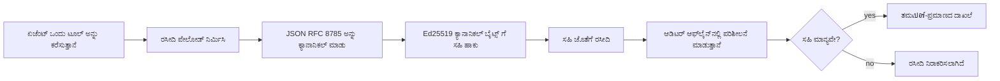
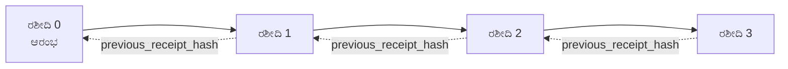

[ಪಾಠದ ವಿಡಿಯೋ ನೋಡಿ: ಕ್ರಿಪ್ಟೋಗ್ರಾಫಿಕ್ ರಸೀದಿಗಳೊಂದಿಗೆ AI ಏಜೆಂಟ್‌ಗಳನ್ನು ಸುರಕ್ಷಿತಗೊಳಿಸುವುದು](https://youtu.be/PLACEHOLDER_VIDEO_ID)

> _(ಪಾಠದ ವಿಡಿಯೋ ಮತ್ತು ಥಂಬರ್‍ನೇಲ್ ಅನ್ನು ಮೈಕ್ರೋಸಾಫ್ಟ್ ವಿಷಯ ತಂಡವು ಮರ್ಜ್ ನಂತರ ಸೇರಿಸುತ್ತದೆ, ಪಾಠ 14 / 15 ಮಾದರಿಯನ್ನು ಹೊಂದಿಸುತ್ತದೆ.)_

# ಕ್ರಿಪ್ಟೋಗ್ರಾಫಿಕ್ ರಸೀದಿಗಳೊಂದಿಗೆ AI ಏಜೆಂಟ್‌ಗಳನ್ನು ಸುರಕ್ಷಿತಗೊಳಿಸುವುದು

## ಪರಿಚಯ

ಈ ಪಾಠವು ನೋಡಿಕೆಯೂಡಿಕೆ ಮಾಡುತ್ತದೆ:

- ನಿಯಮ ಪಾಲನೆ, ಡಿಬಗ್ ಮತ್ತು ವಿಶ್ವಾಸಕ್ಕಾಗಿ AI ಏಜೆಂಟ್‌ಗಳಿಗಾಗಿ ಆಡಿಟ್ ಟ್ರೇಲ್‌ಗಳು ಮುಖ್ಯವಾಗಿರುವುದು.
- ಕ್ರಿಪ್ಟೋಗ್ರಾಫಿಕ್ ರಸೀದಿ ಎಂದರೇನು ಮತ್ತು ಅದು ಅಸೈನ್ ಆಗದ ಲಾಗ್ ಲೈನ್‌ನಿಂದ ಹೇಗೆ ಭಿನ್ನವಾಗುತ್ತದೆ.
- ಏಜೆಂಟ್‌ನ ಉಪಕರಣ ಕರೆಗೆ ಸಹಿ ಮಾಡಿದ ರಸೀದಿಯನ್ನು ಸರಳPythonನಲ್ಲಿ ಹೇಗೆ ತಯಾರಿಸಲು.
- ಆಫ್‌ಲೈನ್‌ನಲ್ಲಿ ರಸೀದಿಯನ್ನು ಪರಿಶೀಲಿಸುವುದು ಮತ್ತು ತಿದ್ದುಪಡಿ ಪತ್ತೆ ಮಾಡುವುದು.
- ರಸೀದಿಗಳನ್ನು ಹೇಗೆ ಸರಪಳಿ ರೂಪದಲ್ಲಿ ಜೋಡಿಸಬೇಕೆಂದು, ಅಂದರೆ ಯಾವುದನ್ನಾದರೂ ತೆಗೆದುಹಾಕಿದಾಗ ಅಥವಾ ಮರುಕ್ರಮದಲ್ಲಿ ಆಸಕ್ತಿಯ ಸರಪಳಿ ಮುರಿಯುತ್ತದೆ.
- ರಸೀದಿಗಳು ಯಾವ್ದನ್ನು ಸಾಬೀತುಪಡಿಸುತ್ತವೆ ಮತ್ತು ಯಾವ್ದನ್ನು ಸ್ಪಷ್ಟವಾಗಿ ಸಾಬೀತುಪಡಿಸುವುದಿಲ್ಲ.

## ಕಲಿಕೆಯ ಗುರಿಗಳು

ಈ ಪಾಠವನ್ನು ಪೂರ್ಣಗೊಳಿಸಿದ ನಂತರ, ನೀವು ತಿಳಿಯುವಿರಿ:

- ಏಜೆಂಟ್ ಕ್ರಿಯೆಗಳಿಗಾಗಿ ಕ್ರಿಪ್ಟೋಗ್ರಾಫಿಕ್ ಮೂಲಸ್ಥಿತಿಯನ್ನು ಪ್ರೇರೇಪಿಸುವ ವೈಫಲ್ಯ ವಿಧಾನಗಳನ್ನು ಗುರುತಿಸುವುದು.
- ಒಂದು ಸಹಿ ಮಾಡಲಾದ Ed25519 ರಸೀದಿಯನ್ನು ಕಾನೋನಿಕಲ್ JSON ಪೇಲೋಡ್ ಮೇಲೆ ರೂಪಿಸುವುದು.
- ಸಹಿಗೊಂಡವರ ಸಾರ್ವಜನಿಕ ಕೀಲಿಯ ಮೂಲಕ ಮಾತ್ರ ಸ್ವತಂತ್ರವಾಗಿ ರಸೀದಿಯನ್ನು ಪರಿಶೀಲಿಸುವುದು.
- ತಿದ್ದುಪಡಿ ಪತ್ತೆ ಮಾಡಲು ತಿದ್ದುಪಡಿಸಲಾಗಿದ ರಸೀದಿಯನ್ನು ಪುನಃಪರಿಶೀಲಿಸುವುದು.
- ರಸೀದಿಗಳ ಹ್ಯಾಶ್-ಚೇನ್ ಸರಣಿಯನ್ನು ನಿರ್ಮಿಸಲು ಮತ್ತು ಸರಣಿಯ ಮಹತ್ವವನ್ನು ವಿವರಿಸಲು.
- ರಸೀದಿಗಳು ಯಾವ್ದನ್ನು ಸಾಬೀತುಪಡಿಸುತ್ತವೆ (ಅಟ್ರಿಬ್ಯೂಶನ್, ಅಖಂಡತೆ, ಕ್ರಮವನ್ನು) ಮತ್ತು ಯಾವ್ದನ್ನು ಸಾಬೀತುಪಡಿಸುವುದಿಲ್ಲ (ಕ್ರಿಯೆಯ ಸರಿಯುತತೆ, ನೀತಿಯ ಶ್ರಾವಣತೆ) ಎಂಬುದರ ನಡುವಿನ ಗಡಿಯನ್ನು ಗುರುತಿಸಲು.

## ಸಮಸ್ಯೆ: ನಿಮ್ಮ ಏಜೆಂಟ್‌ನ ಆಡಿಟ್ ಟ್ರೇಲ್

ನೀವು Contoso ಟ್ರಾವೆಲ್‌ಗೆ AI ಏಜೆಂಟ್ ಅನ್ನು ನಿಯೋಜಿಸಿರುವಿರಿ ಎಂದು ಕಲ್ಪಿಸಿ. ಏಜೆಂಟ್ ಗ್ರಾಹಕರ ವಿನಂತಿಗಳನ್ನು ಓದುತ್ತದೆ, ಫ್ಲೈಟ್ಸ್ API ಅನ್ನು ಕರೆ ಮಾಡಿ ಆಯ್ಕೆಗಳನ್ನು ನೋಡುತ್ತದೆ ಮತ್ತು ಗ್ರಾಹಕರ ಪರವಾಗಿ ಸೀಟುಗಳನ್ನು ಬುಕ್ ಮಾಡುತ್ತದೆ. ಕಳೆದ ತ್ರೈಮಾಸಿಕದಲ್ಲಿ, ಏಜೆಂಟ್ 50,000 ಬುಕ್ಕಿಂಗ್‌ಗಳನ್ನು ಪ್ರಕ್ರಿಯೆಗೊಳಿಸಿದ್ದರು.

ಇಂದು ಆಧಾರ್‌ಪೂರ್ವಕ ವೀಕ್ಷಕ ಬರುತ್ತಾರೆ. ಅವರು ಸರಳ ಪ್ರಶ್ನೆಯನ್ನು ಕೇಳುತ್ತಾರೆ: "ನಿಮ್ಮ ಏಜೆಂಟ್ ಏನು ಮಾಡಿತು ಎಂಬುದನ್ನು ತೋರಿಸಿ."

ನೀವು ಲಾಗ್ ಕಡತಗಳನ್ನು ನೀಡುತ್ತೀರಿ. ವೀಕ್ಷಕ ಅವುಗಳನ್ನು ನೋಡುತ್ತಾರೆ ಮತ್ತು ಕಠಿಣ ಪ್ರಶ್ನೆಯನ್ನು ಕೇಳುತ್ತಾರೆ: "ನಾನು ಹೇಗೆ ತಿಳಿದುಕೊಳ್ಳಲಿ ಈ ಲಾಗ್‌ಗಳು ತಿದ್ದುಪಡಿಸಲಾಗಿಲ್ಲವೆಂದು?"

ಇದು ಆಡಿಟ್-ಟ್ರೇಲ್ ಸಮಸ್ಯೆ. ಇಂದಿನಂತೆಯೇ ಹೆಚ್ಚು ಏಜೆಂಟ್ ನಿಯೋಜನೆಗಳು ಇವುಗಳನ್ನು ಅವಲಂಬಿಸುತ್ತವೆ:

- **ಅಪ್ಲಿಕೇಶನ್ ಲಾಗ್‌ಗಳು**: ಏಜೆಂಟ್ ಸ್ವಂತದಿಂದ ಬರೆದವು, ಯಾವುದೇ ಫೈಲ್ ಸಿಸ್ಟಂ ಪ್ರವೇಶ ಹೊಂದಿದವರು ಸರಿಪಡಿಸಬಹುದು.
- **ಮೇಘ ಲಾಗಿಂಗ್ ಸೇವೆಗಳು**: ವೇದಿಕೆ ಮಟ್ಟದಲ್ಲಿ ತಿದ್ದುಪಡಿ ಸ್ಪಷ್ಟತೆಯಿವೆ ಆದರೆ ವೀಕ್ಷಕ ವೇದಿಕೆ ಕಾರ್ಯಾಚಾರಕನ ಮೇಲೆ ನಂಬಿಕೆ ಇಟ್ಟುಕೊಂಡಿದ್ದಾಗ ಮಾತ್ರ.
- **ಡೇಟಾಬೇಸ್ ಲೆನದ ಲಾಗ್‌ಗಳು**: ಡೇಟಾಬೇಸ್ ಬದಲಾವಣೆಗಳಿಗೆ ಸೂಕ್ತವಾದವು, ಆದರೆ ಒಂದುರೂಪದ ಟೂಲ್ ಕರೆಗಳಿಗೆ ಅಲ್ಲ.

ಯಾವುದೂ ವೀಕ್ಷಕರ ಪ್ರಶ್ನೆಯನ್ನು ಉತ್ತರಿಸಲು ಯಾರು ನಂಬಿಕೆ ಇರಬೇಕಾ ಎಂಬುದನ್ನು ತಪ್ಪಿಸಿಲ್ಲ (ನೀವು, ನಿಮ್ಮ ಕ್ಲೌಡ್ ಪೂರೈಕೆದಾರ, ನಿಮ್ಮ ಡೇಟಾಬೇಸ್ ಬಳಕೆದಾರ). ಅಂತರಿಕ ಬಳಕೆಗಾಗಿ, ಆ ನಂಬಿಕೆ ಸಾಮಾನ್ಯವಾಗಿ ಸಹನೆ ಮಾಡಲಾಗುತ್ತದೆ. ನಿಯಂತ್ರಿತ ಕಾರ್ಯಭಾರಗಳಿಗಾಗಿ (ಹಣಕಾಸು, ಆರೈಕೆ, ಅಥವಾ EU AI ಐನ್ ಅಡಿ ಬರುವ ಯಾವುದೇ), ಅದು ಅನುಕೂಲಕರವಲ್ಲ.

ಕ್ರಿಪ್ಟೋಗ್ರಾಫಿಕ್ ರಸೀದಿಗಳು ಪ್ರತಿ ಏಜೆಂಟ್ ಕ್ರಿಯೆಯನ್ನು ಸ್ವತಂತ್ರವಾಗಿ ಪರಿಶೀಲಿಸಲು ಸಾಧ್ಯವಾಗಿಸುವ ಮೂಲಕ ಈ ಸಮಸ್ಯೆಯನ್ನು ಪರಿಹರಿಸುವವು. ವೀಕ್ಷಕನಿಗೆ ನಿಮ್ಮ ಮೇಲಿನ ನಂಬಿಕೆ ಅಗತ್ಯವಿಲ್ಲ. ಅವರು ನಿಮ್ಮ ಸಾರ್ವಜನಿಕ ಕೀ ಮತ್ತು ರಸೀದಿಯನ್ನು ಮಾತ್ರ ಬೇಕಾಗುತ್ತದೆ.

## ಕ್ರಿಪ್ಟೋಗ್ರಾಫಿಕ್ ರಸೀದಿ ಎಂದರೇನು?

ರಸೀದಿ ಎಂದರೆ ಏಜೆಂಟ್ ಏನು ಮಾಡಿತು ಎಂಬುದನ್ನು ದಾಖಲಿಸುವ JSON ವಸ್ತು, ಡಿಜಿಟಲ್ ಸಹಿತಿಯನ್ನು ಹೊಂದಿದೆ.


```mermaid
flowchart LR
    A[ಏಜೆಂಟ್ ಒಂದು ಟೂಲ್ ಅನ್ನು ಕರೆಸುತ್ತಾನೆ] --> B[ರಸೀದಿ ಪೇಲೋಡ್ ನಿರ್ಮಿಸಿ]
    B --> C[JSON RFC 8785 ಅನ್ನು ಕ್ಯಾನಾನಿಕಲ್ ಮಾಡು]
    C --> E[Ed25519 ಕ್ಯಾನಾನಿಕಲ್ ಬೈಟ್ಸ್ ಗೆ ಸಹಿ ಹಾಕು]
    E --> F[ಸಹಿ ಜೊತೆಗೆ ರಸೀದಿ]
    F --> G[ಆಡಿಟರ್ ಆಫ್‌ಲೈನ್‌ನಲ್ಲಿ ಪರಿಶೀಲನೆ ಮಾಡುತ್ತಾನೆ]
    G --> H{ಸಹಿ ಮಾನ್ಯವೇ?}
    H -- yes --> I[ತಮเปอร์-ಪ್ರಮಾಣದ ದಾಖಲೆ]
    H -- no --> J[ರಸೀದಿ ನಿರಾಕರಿಸಲಾಗಿದೆ]
```

ಕನಿಷ್ಠ ರಸೀದಿ ಹೀಗಿರುತ್ತದೆ:

```json
{
  "type": "agent.tool_call.v1",
  "agent_id": "contoso-travel-bot",
  "tool_name": "lookup_flights",
  "tool_args_hash": "sha256:a3f9c1...",
  "result_hash": "sha256:7b2e1d...",
  "policy_id": "contoso-travel-policy-v3",
  "timestamp": "2026-04-25T14:30:00Z",
  "sequence": 47,
  "previous_receipt_hash": "sha256:9d4e6a...",
  "signature": {
    "alg": "EdDSA",
    "sig": "c5af83...",
    "public_key": "8f3b2c..."
  }
}
```

ಮೂವರು ಗುಣಲಕ್ಷಣಗಳು ಸಾಧ್ಯವಾಗಿಸುತ್ತಿವೆ:

1. **ಸಹಿ**. ರಸೀದಿಯನ್ನು ಏಜೆಂಟ್ ಗೇಟ್ವೇ Ed25519 ಖಾಸಗಿ ಕೀಲಿಯನ್ನು ಬಳಸಿ ಸಹಿ ಮಾಡುತ್ತದೆ. ಅದರ ಸಂಬಂಧಿಸಿದ ಸಾರ್ವಜನಿಕ ಕೀಲಿಯನ್ನು ಹೊಂದಿರುವವರು ಸಹಿಯನ್ನು ಆಫ್‌ಲೈನ್ ಪರಿಶೀಲಿಸಬಹುದು. ಯಾವುದಾದರೂ ಪ್ರಾಂಶವನ್ನು ತಿದ್ದುಪಡಿ ಮಾಡಿದರೆ ಸಹಿ ಅಮಾನ್ಯವಾಗುತ್ತದೆ.

2. **ಕಾನೋನಿಕಲ್ ಎಂಕೋಡಿಂಗ್**. ಸಹಿ ಮಾಡುವ ಮುನ್ನ, ರಸೀದಿಯನ್ನು JSON ಕನಿನಿಕಲೈಜೇಷನ್ ಸ್ಕೀಮ್ (JCS, RFC 8785) ಬಳಸಿ ಸರಣೀಕರಿಸಲಾಗುತ್ತದೆ. ಇದು ಎರಡು ವಿಸ್ತಾರಗಳು ಅದೇ ಮಾಲೀಕತ್ವ ಶಕ್ತಿಯದ್ದಾದ ಲಾಜಿಕಲ್ ರಸೀದಿಯನ್ನು ತುಮಕಾರು-ಒಳಗೆಸಲ್ಪಟ್ಟ ನಿರ್ಗಮವನ್ನು ನಿರ್ಮಿಸುವುದು ಖಾತ್ರಿ ಮಾಡುತ್ತದೆ. ಕನಿನಿಕಲೈಜೇಷನ್ ಇಲ್ಲದೆ, ವಿಭಿನ್ನ JSON ಸರಣೀಕರಣಗಳು ಅದೇ ವಿಷಯಕ್ಕೆ ವಿಭಿನ್ನ ಸಹಿಗಳನ್ನು ಉತ್ತೇಜಿಸುತ್ತವೆ.

3. **ಹ್ಯಾಶ್ ಚೇನಿಂಗ್**. `previous_receipt_hash` ಕ್ಷೇತ್ರವು ಪ್ರತಿ ರಸೀದಿಯನ್ನು ಹಿಂದಿನ ರಸೀದಿಯೊಂದಿಗೆ ಲಿಂಕ್ ಮಾಡುತ್ತದೆ. ರಸೀದಿಯನ್ನು ತೆಗೆದುಹಾಕಿದಾಗ ಅಥವಾ ಮರುಕ್ರಮಿಸಿದಾಗ ನಂತರದ ಪ್ರತಿಯೊಂದು ರಸೀದಿಗೂ ಸಮಸ್ಯೆಗಳು ಉಂಟಾಗುತ್ತವೆ. ಪ್ರತ್ಯೇಕ ಸಹಿಗಳನ್ನು ಮೀರಿದರೂ ಸರಪಳಿಯ ಮಟ್ಟದಲ್ಲಿ ತಿದ್ದುಪಡಿಯನ್ನು ಕಂಡುಹಿಡಿಯಬಹುದು.

ಈ ಗುಣಲಕ್ಷಣಗಳು ಒಟ್ಟಾಗಿ ಮೂರು ಭರವಸೆಗಳನ್ನು ನೀಡುತ್ತವೆ:

- **ಅಟ್ರಿಬ್ಯೂಶನ್**: ಈ ಕೀ ಈ ವಿಷಯವನ್ನು ಸಹಿ ಮಾಡಿದ್ದಾರೆ.
- **ಅಖಂಡತೆ**: ಸಹಿ ಆದ ಬಳಿಕ ವಿಷಯ ಬದಲಾಗಿಲ್ಲ.
- **ಕ್ರಮ**: ಈ ರಸೀದಿ ಆ ಸರಪಳಿಯಲ್ಲಿ ಆ ರಸೀದಿಯ ನಂತರ ಬಂದಿದೆ.

## Pythonನಲ್ಲಿ ರಸೀದಿ ತಯಾರಿಸುವುದು

ರಸೀದಿ ತಯಾರಿಸಲು ನಿಮಗೆ ವಿಶೇಷ ಗ್ರಂಥಾಲಯ ಬೇಕಾಗಿರುವದು ಇಲ್ಲ. ಕ್ರಿಪ್ಟೋಗ್ರಾಫಿಕ್ ಸ್ತರಗಳು ವ್ಯಾಪಕವಾಗಿ ಲಭ್ಯವಿದ್ದು, ಲಾಜಿಕ್ ಕೆಲವು ದಶಕನೇ Python ಸಾಲುಗಳಷ್ಟೇ.

`code_samples/18-signed-receipts.ipynb` ನಲ್ಲಿ ಕೈಭ್ಯಾಸಗಳು ಸಂಪೂರ್ಣ ಪ್ರಕ್ರಿಯೆಯನ್ನು ವಿವರಿಸುತ್ತವೆ. ಸಂಕ್ಷಿಪ್ತ ಆವೃತ್ತಿ:

```python
import json
import hashlib
import base64
from nacl import signing
from jcs import canonicalize  # RFC 8785 ಮಾಡ್ಯುಲಾದ JSON

def b64url_nopad(data: bytes) -> str:
    return base64.urlsafe_b64encode(data).decode("ascii").rstrip("=")

def sha256_canonical(obj) -> str:
    """SHA-256 of a Python object's JCS-canonical JSON form."""
    return f"sha256:{hashlib.sha256(canonicalize(obj)).hexdigest()}"

# ಸಹಿ ಕೀ ತೆಗೆಯಿರಿ ಅಥವಾ ಲೋಡ್ ಮಾಡಿ (ಉತ್ಪಾದನಾ ಪರಿಸರದಲ್ಲಿ ಕೀ ವಾಲ್ಟ್‌ನಲ್ಲಿ ಸಂರಕ್ಷಿಸಿ)
signing_key = signing.SigningKey.generate()
verify_key = signing_key.verify_key

# ರಸೀದಿ ಪೇಲೋಡ್ ರಚಿಸಿ (ಇನ್ನೂ ಸಹಿ ಇಲ್ಲ)
tool_args = {"origin": "SYD", "destination": "LAX"}
tool_result = [{"flight": "QF11", "price": 1850, "stops": 0}]

payload = {
    "type": "agent.tool_call.v1",
    "agent_id": "contoso-travel-bot",
    "tool_name": "lookup_flights",
    "tool_args_hash": sha256_canonical(tool_args),
    "result_hash": sha256_canonical(tool_result),
    "policy_id": "contoso-travel-policy-v3",
    "timestamp": "2026-04-25T14:30:00Z",
    "sequence": 0,
    "previous_receipt_hash": None,
}

# JCS ಬೈಟ್ಗಳನ್ನು ನೇರವಾಗಿ ಮಾಡ್ಯುಲೈಸ್ ಮಾಡಿ ಮತ್ತು ಸಹಿ ಮಾಡಿ. ಪ್ಯೂರ್‌ಇಡಿಎಸ್ಎ ಅಂತರ್ನಿಹಿತವಾಗಿ ಹ್ಯಾಷ್ ಮಾಡುತ್ತದೆ.
canonical_bytes = canonicalize(payload)
signature_bytes = signing_key.sign(canonical_bytes).signature

# ರೂಪರೇಖಿತ ಸಹಿ ವಸ್ತುವನ್ನು ಜೋಡಿಸಿ.
receipt = {
    **payload,
    "signature": {
        "alg": "EdDSA",
        "sig": b64url_nopad(signature_bytes),
        "public_key": b64url_nopad(bytes(verify_key)),
    },
}
```

ಇದು ಸಂಪೂರ್ಣ ಸಹಿ ಪ್ರಕ್ರಿಯೆ. ನೋಟ್ಬುಕ್‌ನ ವ್ಯಾಯಾಮಗಳು ಪ್ರತಿಯೊಂದು ಹಂತವನ್ನು ವಿವರಿಸುತ್ತವೆ.

## ರಸೀದಿಯನ್ನು ಪರಿಶೀಲಿಸುವುದು ಮತ್ತು ತಿದ್ದುಪಡಿ ಪತ್ತೆಮಾಡುವುದು

ಪರಿಶೀಲನೆ ಪ್ರತಿಕೂಲ ಪದ್ಧತಿ:

```python
import base64
import hashlib
from nacl import signing
from nacl.exceptions import BadSignatureError
from jcs import canonicalize

def b64url_decode(s: str) -> bytes:
    padding = "=" * ((4 - len(s) % 4) % 4)
    return base64.urlsafe_b64decode(s + padding)

def verify_receipt(receipt: dict) -> bool:
    # ಸಹಿ ಒಂದು ರಚನೆಯಾದ ವಸ್ತು: {"alg", "sig", "public_key"}.
    sig_obj = receipt.get("signature")
    if not sig_obj or sig_obj.get("alg") != "EdDSA":
        return False

    # ವಾಸ್ತವದಲ್ಲಿ ಸಹಿ ಹಾಕಲಾದ ಪೇಲೋಡ್ ಅನ್ನು ಮರುನಿರ್ಮಿಸಿ (ಸಹಿ ತಪ್ಪಿಸಿ ಎಲ್ಲವೂ).
    payload = {k: v for k, v in receipt.items() if k != "signature"}

    canonical_bytes = canonicalize(payload)

    try:
        verify_key = signing.VerifyKey(b64url_decode(sig_obj["public_key"]))
        verify_key.verify(canonical_bytes, b64url_decode(sig_obj["sig"]))
        return True
    except BadSignatureError:
        return False
```

ಈ ಕಾರ್ಯವು ಒಂದು ರಸೀದಿಯನ್ನು ತೆಗೆದುಕೊಳ್ಳುತ್ತದೆ ಮತ್ತು ಸಹಿ ಮಾನ್ಯವಾದರೆ `True` ಅನ್ನು ಹಿಂತಿರುಗಿಸುತ್ತದೆ, ಇಲ್ಲದಿದ್ದರೆ `False` ಅನ್ನು. ಯಾವುದೇ ನೆಟ್ವರ್ಕ್ ಕರೆ, ಸೇವಾ ಅವಲಂಬನೆ ಅಥವಾ ಮೂರನೇ ಪಕ್ಷದ ಮೇಲಿನ ನಂಬಿಕೆ ಇಲ್ಲ.

ತಿದ್ದುಪಡಿ ಪತ್ತೆ ಕಾರ್ಯಾಚರಣೆಯನ್ನು ನೋಡಲು, ನೋಟ್ಬುಕ್ ಈ ಹಂತಗಳನ್ನು ನಡೆಸುತ್ತದೆ:

1. ಮಾನ್ಯ ರಸೀದಿಯನ್ನು ತಯಾರಿಸಿ ಪರಿಶೀಲನೆ ಆಗುತ್ತದೆ ಎಂದು ದೃಢಪಡಿಸುವುದು.
2. `tool_args_hash` ಕ್ಷೇತ್ರದ ಒಂದು ಬೈಟ್ ಅನ್ನು ತಿದ್ದುಪಡಿ ಮಾಡುವುದು.
3. ಪರಿಶೀಲನೆಯನ್ನು ಪುನಃ ಚಲಾಯಿಸಿ ಅದು ವಿಫಲವಾಗುವುದನ್ನು ನೋಡುವುದು.

ಇದು ರಸೀದಿಗಳು ತಿದ್ದುಪಡಿ-ಸ್ಪಷ್ಟವಾಗಿವೆ ಎಂಬ ಪರಿಕಲ್ಪನಾತ್ಮಕ ಪ್ರದರ್ಶನ: ಯಾವುದೇ ತಿದ್ದುಪಡಿ, ಹಾಳು ಸಣ್ಣದಾದರೂ ಸಹ ಗೌಪ್ಯತೆಯನ್ನು ಮುರಿಯುತ್ತದೆ.

## ಬಹು ಹಂತ ಏಜೆಂಟ್‌ಗಳಿಗಾಗಿ ರಸೀದಿಗಳನ್ನು ಸರಪಳಿ ಮಾಡುವುದು

ಒಂದು ಸಹಿ ರಸೀದಿ ಒಂದು ಕ್ರಿಯೆಯನ್ನು ರಕ್ಷಿಸುತ್ತದೆ. ರಸೀದಿಗಳ ಸರಪಳಿ ಸರಣಿಯನ್ನು ರಕ್ಷಿಸುತ್ತದೆ.


```mermaid
flowchart LR
    R0[ರಶೀದಿ 0<br/>ಆರಂಭ] --> R1[ರಶೀದಿ 1]
    R1 --> R2[ರಶೀದಿ 2]
    R2 --> R3[ರಶೀದಿ 3]
    R1 -. previous_receipt_hash .-> R0
    R2 -. previous_receipt_hash .-> R1
    R3 -. previous_receipt_hash .-> R2
```

ಪ್ರತಿಯೊಂದು ರಸೀದಿ ಅದರ ಹಿಂದೆ ಇದ್ದ ರಸೀದಿಯ ಹ್ಯಾಶ್ ಅನ್ನು ದಾಖಲಿಸುತ್ತದೆ. ರಸೀದಿ 2 ಅನ್ನು ಮೌನವಾಗಿ ತೆಗೆದುಹಾಕಲು, ಹ್ಯಾಕರ್ ಕೆಳಗಿನವನ್ನಾಗಿಸಬೇಕಾಗುತ್ತದೆ:

- ರಸೀದಿ 3ನ `previous_receipt_hash` ಕ್ಷೇತ್ರವನ್ನು ತಿದ್ದುಪಡಿ ಮಾಡಬೇಕು (ರಸೀದಿ 3ನ ಸಹಿ ಮುರಿಯುತ್ತದೆ), ಅಥವಾ
- ಬದಲಾದ ರಸೀದಿ 3 ಮೇಲೆ ಹೊಸ ಸಹಿಯನ್ನು ನಕಲು ಮಾಡಬೇಕು (ಆಗ ಏಜೆಂಟ್ ಖಾಸಗಿ ಕೀ ಅಗತ್ಯವಿದೆ).

ಖಾಸಗಿ ಕೀ ಒಂದು ಹಾರ್ಡ್‌ವೇರ್ ಕೀ ವಾಲ್ಟ್‌ನಲ್ಲಿದ್ದರೆ ಮತ್ತು ನೀವು ಪ್ರತಿಯೊಂದು ರಸೀದಿಯೊಂದಿಗೆ ಸಾರ್ವಜನಿಕ ಕೀ ಪ್ರಕಟಿಸಿದರೆ, ಈ ಎರಡೂ ಹಲ್ಲೆಗಳು ಪತ್ತೆಯಾಗದೆ ಸಾಧ್ಯವಿಲ್ಲ.

ನೋಟ್ಬುಕ್ ಈ ಹಂತಗಳನ್ನು ಮಾಡುತ್ತದೆ:

1. ಮೂರು ರಸೀದಿಗಳ ಸರಪಳಿಯನ್ನು ನಿರ್ಮಿಸುವುದು.
2. ಪ್ರತಿಯೊಂದು ರಸೀದಿಯ `previous_receipt_hash` ಮೊದಲೆ ಅವಳ ರಸೀದಿಯ ಹ್ಯಾಶ್‌ಗೆ ಹೊಂದಿಕೆಯಾಗುವುದನ್ನು ಪರಿಶೀಲಿಸುವುದು.
3. ಮಧ್ಯದಲ್ಲಿ ಒಂದು ರಸೀದಿಯನ್ನು ತಿದ್ದುಪಡಿ ಮಾಡಿ, ಸರಪಳಿ ಅಲ್ಲಿ ಮುರಿಯುವುದನ್ನು ಕಂಡುಹಿಡಿಯುವುದು.

ಇದು ನೀವು ರಚಿಸುವ ಪ್ರಕಾರದ ಆಡಿಟ್ ಟ್ರೇಲ್ ಹೊರಗಿನ ವೀಕ್ಷಕರು ನಂಬಿಕೆ ಇಲ್ಲದೆ ಪರಿಶೀಲಿಸಬಹುದು.

## ರಸೀದಿಗಳು ಸಾಬೀತುಪಡಿಸುವುದು (ಮತ್ತು ಸಾಬೀತುಪಡಿಸುವುದಿಲ್ಲ)

ಇದು ಈ ಪಾಠದ ಅತ್ಯಂತ ಪ್ರಮುಖ ಭಾಗ. ರಸೀದಿಗಳು ಶಕ್ತಿಶಾಲಿ ಆದರೆ ಅವುಗಳ ಶಕ್ತಿ ಸೀಮಿತವಾಗಿದೆ.

**ರಸೀದಿಗಳು ಮೂರು ವಿಷಯಗಳನ್ನು ಸಾಬೀತುಪಡಿಸುತ್ತವೆ:**

1. **ಅಟ್ರಿಬ್ಯೂಶನ್**: ಒಂದು ನಿರ್ದಿಷ್ಟ ಕೀ ಒಂದು ನಿರ್ದಿಷ್ಟ ಪೇಲೋಡ್ ಅನ್ನು ಸಹಿ ಮಾಡಿತು.
2. **ಅಖಂಡತೆ**: ಪೇಲೋಡ್ ಸಹಿ ಆದ ನಂತರ ಬದಲಾಗಿಲ್ಲ.
3. **ಕ್ರಮ**: ಈ ರಸೀದಿ ಆ ಹ್ಯಾಶ್ ಸರಪಳಿಯಲ್ಲಿ ಆ ರಸೀದಿಯ ನಂತರ ಬಂದಿದೆ.

**ರಸೀದಿಗಳು ಸಾಬೀತುಪಡಿಸುವುದಿಲ್ಲ:**

1. **ಸರಿಯಾದತೆ**: ಏಜೆಂಟ್ ಕ್ರಿಯೆಯು ಸರಿಯಾದ ಕ್ರಿಯೆಯೇ ಎಂಬುದನ್ನು. ತಪ್ಪಾಗಿರುವ ಉತ್ತರಕ್ಕೆ ಸಹ ರಸೀದಿಯನ್ನು ಸಹಿಪಡಿಸಬಹುದು.
2. **ನೀತಿ ಅನುಸರಣಾ**: `policy_id`ನಲ್ಲಿ ಉಲ್ಲೇಖಿಸಿದ ನೀತಿ ಚರ್ಚಿಸಲ್ಪಟ್ಟಿತ್ತು ಅಥವಾ ಪರಿಶೀಲಿಸಿದರೆ ಈ ಕ್ರಿಯೆಗೆ ಅನುಮತಿ ನೀಡಿತ್ತು ಎಂದು ರಸೀದಿ ದಾಖಲಿಸುವುದು ಇಲ್ಲ. ರಸೀದಿ ಹೇಳುವುದೆಂದರೆ "ಅದರ ಬಗ್ಗೆ ಹೇಳಿದ್ದು," "ಅದರ ಬಗ್ಗೆ ಜಾರಿಗೆ ಬಂದದ್ದು" ಅಲ್ಲ.
3. **ಕೀಲಿಗೆ ಮೀರಿದ ಗುರುತು**: ರಸೀದಿ ಹೇಳುವುದು "ಈ ಕೀ ಈ ವಿಷಯವನ್ನು ಸಹಿ ಮಾಡಿತು." ಅಲ್ಲ "ಈ ವ್ಯಕ್ತಿ ಅನುಮೋದನೆ ಕೊಟ್ಟರು." ಕೀ ಯೊ ವ್ಯಕ್ತಿ ಅಥವಾ ಸಂಸ್ಥೆಗೆ ಜೋಡಿಸುವುದು ಪ್ರತ್ಯೇಕ ಗುರುತು ವ್ಯವಸ್ಥೆ ಬಯಸುತ್ತದೆ (ಡೈರೆಕ್ಟರಿ, ಸಾರ್ವಜನಿಕ ಕೀ രജಿಸ್ಟ್ರಿ ಇತ್ಯಾದಿ).
4. **ನಿಜವಾದ ಇನ್‌ಪುಟ್‌ಗಳ ಸತ್ಯತೆ**: ಏಜೆಂಟ್ ತಿರುವುಮಾಡಲ್ಪಟ್ಟ ಪ್ರಾಂಪ್ಟ್ ಅನ್ನು ಪಡೆದಾಗ, ರಸೀದಿ ಕ್ರಿಯೆಯನ್ನು ನಿಷ್ಠೆಯಿಂದ ದಾಖಲಿಸುತ್ತದೆ. ರಸೀದಿಗಳು ಇನ್‌ಪುಟ್ ಮಾನ್ಯತೆಗೂಳಿಸಿರುವುದಿಲ್ಲ, ಇದಕ್ಕೆ ಬದಲಾವಣೆ ಅಲ್ಲ.

ಈ ಗಡಿ ಎರಡು ಕಾರಣಗಳಿಂದ ಮುಖ್ಯ:

- ಇದು ನಿಮಗೆ ಹೇಳುತ್ತದೆ ರಸೀದಿಗಳನ್ನು ಏಕೆ ಉಪಯೋಗಿಸಬೇಕು: ಏಜೆಂಟ್ ವರ್ತನೆಯನ್ನು ಪರಿಶೀಲಿಸಲು ಮತ್ತು ತಿದ್ದುಪಡಿ ಸ್ಪಷ್ಟತೆಯನ್ನು ಮಾಡಲು, ಸಂಸ್ಥಾ ಗಡಿಗಳನ್ನು ಮೀರಿ ಸಹ.
- ಇದು ನಿಮಗೆ ಬೇಕಾದ ಹೆಚ್ಚುವರಿ ಪದರಗಳಿದ್ದರೂ ಸಹ ಸೂಚಿಸುತ್ತದೆ: ಇನ್‌ಪುಟ್ ಮಾನ್ಯತೆ (ಪಾಠ 6), ನೀತಿ ಜಾರಿಗೆ (ಕೆಲವು ವಿವರಗಳನ್ನು ಕೆಳಗೆ), ಮತ್ತು ಗುರುತಿನ ಮೂಲಸೌಕರ್ಯ (ಈ ಪಾಠಕ್ಕೆ ಒಳಗೆ ಇಲ್ಲ).

ಸಾಮಾನ್ಯ ತಪ್ಪು: "ನಮ್ಮಿಗೆ ರಸೀದಿಗಳು ಇದ್ದವು" ಎಂದರೆ "ನಾವು ನಿಯಂತ್ರಿತರಾ" ಎನ್ನುವುದನ್ನು ಊಹಿಸುವುದು. ಅದು ಅಲ್ಲ. ರಸೀದಿಗಳು ಆಧಾರ. ನಿಯಂತ್ರಣವು ನೀವು ನಿರ್ಮಿಸುವ ವ್ಯವಸ್ಥೆ.

## ಮಾನವನು ಅದೃಷ್ಟಕರ ಕಾರ್ಯವನ್ನು ಅನುಮೋದಿಸಿದ್ದು ಹೇಗೆ ಸಾಬೀತುಪಡಿಸುವುದು

ಮೇಲಿನ ಐಟಂ 3 ತನ್ನದೇ ವಿಭಾಗಕ್ಕೊಂದು ಅರ್ಹ: ಕ್ರಿಯೆಯ ರಸೀದಿ ಹೇಳುವುದು "ಈ ಕೀ ಈ ವಿಷಯವನ್ನು ಸಹಿ ಮಾಡಿತು", "ஒரு மனிதನು ಅನುಮೋದನೆ ನೀಡಿದೆಯ" ಅಲ್ಲ. ಹೆಚ್ಚು ಅಪಾಯಕಾರಿ ಕ್ರಮಗಳಿಗೆ (ರಿಫಂಡ್ಗಳು, ಅಳಿಸುವಿಕೆಗಳು, ವಾಯರ್ ವರ್ಗಾಲುಗಳು), ನಿಯಂತ್ರಣ ಚಟುವಟಿಕೆಗಳು ಹೆಚ್ಚಾಗುತ್ತಿರುವಂತೆ ಅವಶ್ಯಕತೆ ಬರುತ್ತಿದೆ, ಮತ್ತು ಇದು ನೀವು ಈ ಪಾಠದಲ್ಲಿ ಈಗಾಗಲೇ ನಿರ್ಮಿಸಿರುವ ಮೂಲಗಳಲ್ಲಿ ಉತ್ಪನ್ನವಾಗಿದೆ.

ಮುಂದಿನ ನೋಟ್ಬುಕ್ `code_samples/human-authorization-receipts.ipynb` ಎರಡನೆಯ ರಸೀದಿ ವಿಧ `human.approval.v1` ಅನ್ನು ಸೇರಿಸುತ್ತದೆ, ಪಾಠದ ರಸೀದಿಗಳೇ ಹಾಗೆಯೇ ಒಂದು ಪೆÇ್ಟ್ ಸಂರಚನೆಯಲ್ಲಿ (Typed payload Ed25519 ಕಾನೋನಿಕಲ್ JCS ಬೈಟ್ ಗಳ ಮೇಲ್ಮೇಲ್ಗೆ ಸಹಿ, `signature` ವಸ್ತು ಸಹಿ ಮಾಡಿದ ಭಾಗದ ಹೊರಗೆ). ನಾಮಿತ ಅನುಮೋದಕರೊಬ್ಬರು **ಪೂರ್ಣ ಕಾನೋನಿಕಲ್ ಕ್ರಿಯೆಯನ್ನು ಮತ್ತು ಅದರ ಡೈಜಸ್ಟ್ ಅನ್ನು** ಕಾರ್ಯಾಚರಣೆಗೊಳಿಸುವ ಮುಂಚೆ ಸಹಿ ಮಾಡುತ್ತಾರೆ; ಏಜೆಂಟ್ ನ ಕಾರ್ಯ ರಸೀದಿ ಅದೇ ಕ್ರಿಯ ಡೈಜಸ್ಟ್ ಮತ್ತು `parent_approval_ref`, ಅನುಮೋದನೆಯ `receipt_hash` ಹೊಂದಿದೆ, ನಿಮ್ಮ ಮೇಲಿನ ಸರಪಳಿಯಲ್ಲಿರುವ `previous_receipt_hash` ಅವರಂತೆ. ಒಂದು `verify_chain` ಎರಡೂ ವಸ್ತುಗಳನ್ನು ವಿಭಿನ್ನ ಕೀ ಸಲ್ಲಿಕೆಗಳಡಿ ಪರಿಶೀಲಿಸುತ್ತದೆ (ಅನುಮೋದಕ ಕೀ vs ಏಜೆಂಟ್‌ ಕೀಗಳು), ಆದ್ದರಿಂದ ಕೋಡ್ ಪಥ ಹಂಚಿಕೊಂಡಿರುತ್ತದೆ ಆದರೆ ಅಧಿಕಾರಿಗಳು ಎಂದಿಗೂ ಹಂಚಿಕೊಳ್ಳುವುದಿಲ್ಲ.

ಈ ಗುಣಲಕ್ಷಣ ಹೇಳುವುದು: *ಮನುಷ್ಯನು ಈ ವಿಶೇಷ ಕ್ರಿಯೆಯನ್ನು ಅನುಮೋದಿಸಿದೆಯ, ಮತ್ತು ಏಜೆಂಟ್ ಅದೆಸರಲ್ಲಿ ಪ್ರಮಾಣಿತಿಯಾಗಿ ಕಾರ್ಯಾಚರಿಸಿದೆ.* ನೋಟ್ಬುಕ್ ನಿರಾಕರಣೆ ಪರೀಕ್ಷೆಗಳು ಈ ಗುಣಲಕ್ಷಣವೇ ನಿಜವಾದದ್ದು ಎಂದು ತೋರಿಸುತ್ತವೆ:

- ಪರಂಪರಾ ಸಮಸ್ಯೆಗಳು: ತಿದ್ದುಪಡಿ, ಗರುಡಪಡುವ ಹುಲಿ, ಪುನರುತ್ಪಾದನೆ, ಎರಡೂ ಬದಿಗಳ ನಕಲಿ ಕೀಗಳು, ತಪ್ಪು ಇನ್‌ಪುಟ್;
- **ಹಳೆಯ ಅಧಿಕಾರ**: ಸಹಿ ಇನ್ನೂ ಪರಿಶೀಲನೀಯದಾಗಿದ್ದರೂ ನಿರಾಕರಿಸಲಾಗಿದೆ ಏಕೆಂದರೆ ನೀತಿ ಆವೃತ್ತಿ ಮುಂದಾಗಿದೆ, ಅನುಮೋದಕ ಕೀ گردشದಿಂದ ತೆಗೆಯಲಾಯಿತು, ಅಥವಾ ಅನುಮೋದನೆ ಕಾರ್ಯಾಚರಣೆಗೆ ಮುಂಚೆ ಅವಧಿ ಮುಗಿಯಿತು;
- **ಡೈಜಸ್ಟ್ ಬದಲಾವಣೆ**: ಒಂದು ಮಾನ್ಯ ಸಹಿ ಕ್ರಿಯೆಯ ರಸೀದಿ ವಿಭಿನ್ನ ಕಾನೋನಿಕಲ್ ಕ್ರಿಯೆಯನ್ನು ನಿರ್ಬಂಧಿಸುವ ನಿಜವಾದ ಅನುಮೋದನೆಯನ್ನು ಸೂಚಿಸುತ್ತದೆ.

ಪ್ರತಿಯೊಂದು ವಿಫಲತೆ ವಿಭಿನ್ನ ಕಾರಣಕ್ಕೆ ನಿರಾಕರಿಸುತ್ತವೆ, ಆದ್ದರಿಂದ ವೀಕ್ಷಕನು ಓದುತ್ತಿದ್ದಾಗ ಅಧಿಕಾರ ಹಳೆದಿತೆ ಅಥವಾ ಕಾರ್ಯಾಚರಣೆ ಬದಲಾಗಿತೆ ಎಂದು ತಿಳಿದುಕೊಳ್ಳಬಹುದು. ನೋಟ್ಬುಕ್ ಬೋಧಿಸುವ ನಿಯಮ: ಸಹಿ ಅನುಮೋದನೆ ಸ್ವತಃ ಅಧಿಕಾರವಲ್ಲ. ಅಧಿಕಾರ ಮಾತ್ರ ತರುವ ಎರಡು ರಸೀದಿಗಳು ಕೂಡ ಕಾರ್ಯಾಚರಣೆಯ ಸಮಯದಲ್ಲಿ ಒಂದೇ ಕಾನೋನಿಕಲ್ ಕ್ರಿಯೆಯನ್ನು ಬಿಗಿದಿದ್ದರೆ ಮಾತ್ರ. ಮಾನವ ಅನುಮೋದನೆಯ ರಸೀದಿ ಈ ಪಾಠದ ಶೈಕ್ಷಣಿಕ ಸಂಯೋಜನೆ, `draft-farley-acta-signed-receipts` ನವೀಕರಣ ರಸೀದಿ ವಿಧವಲ್ಲ.

## ಉತ್ಪಾದನಾ ಉಲ್ಲೇಖಗಳು

ಈ ಪಾಠದ Python ಕೋಡ್ ಉದ್ದೇಶಪೂರ್ವಕವಾಗಿ ಕನಿಷ್ಠವಾಗಿದೆ ಆದ್ದರಿಂದ ನೀವು ಪ್ರತಿಯೊಂದು ಸಾಲನ್ನು ಓದಿ ಏನಾಗುತ್ತಿದೆ ಎಂಬುದನ್ನು ಸಂಪೂರ್ಣವಾಗಿ ಅರ್ಥಮಾಡಿಕೊಳ್ಳಬಹುದು. ಉತ್ಪಾದನೆಯಲ್ಲಿ, ನಿಮ್ಮ ಬಳಿ ಎರಡು ಆಯ್ಕೆಗಳು ಇವೆ:

1. **ಕ್ರಿಪ್ಟೋಗ್ರಾಫಿಕ್ ಮೂಲಾರ್ಧಗಳನ್ನು ನೇರವಾಗಿ ನಿರ್ಮಿಸುವುದು.** ಮೇಲ್ಕಂಡ 50 ಸಾಲುಗಳು ಬಹು ಉಪಯೋಗಗಳಿಗೆ ಸಾಕಾಗಿವೆ. PyNaCl (Ed25519) ಮತ್ತು `jcs` ಪ್ಯಾಕೇಜ್ (ಕಾನೋನಿಕಲ್ JSON) ಉತ್ತಮವಾಗಿ ನಿರ್ವಹಿಸಲ್ಪಟ್ಟ ಮತ್ತು ಪರಿಶೀಲಿಸಿದ ಗ್ರಂಥಾಲಯಗಳು.

2. **ಉತ್ಪಾದನಾ ರಸೀದಿ ಗ್ರಂಥಾಲಯವನ್ನು ಬಳಸುವುದು.** ಹಲವೇ ಓಪನ್-ಸೋರ್ಸ್ ಪ್ರಾಜೆಕ್ಟ್‌ಗಳು ಈ ಮಾದರಿಯನ್ನು ಹೆಚ್ಚುವರಿ ವೈಶಿಷ್ಟ್ಯಗಳೊಂದಿಗೆ ಅನುಷ್ಠಾನ ಮಾಡುತ್ತವೆ (ಕೀ گردش, ಬ್ಯಾಚ್ ಪರಿಶೀಲನೆ, JWK ಸೆಟ್ ವಿತರಣೆ, ನೀತಿ ಎಂಜಿನ್‌ಗಳೊಂದಿಗೆ ಏಕೀಕರಣ):
   - ಸಹಿ ಪ್ರಕ್ರಿಯೆ ಸ್ವತಂತ್ರ IETF ಇಂಟರ್ನೆಟ್-ಡ್ರಾಫ್ಟ್ (`draft-farley-acta-signed-receipts`, ಪುನರ್ಮೂಲ್ಯ 02)ನಲ್ಲಿ JCS ಮತ್ತು ಸಹಿ ವ್ಯಾಪ್ತಿಯ ನಿಯಮಾವಳಿಗಳನ್ನು ಬಳಸುತ್ತದೆ. ಈ ಪಾಠದ ಸರಳ ಶೈಕ್ಷಣಿಕ ರಸೀದಿ ಡ್ರಾಫ್ಟ್‌ನ `{payload, signature}` ಸಂರಚನೆಯಿಂದ ಭಿನ್ನವಾಗಿದೆ ಮತ್ತು ಅನುಗುಣ ಅನುಷ್ಠಾನವಲ್ಲ ಎಂದು ವರದಿಪಡಿಸಲಾಗಿದೆ. ಡ್ರಾಫ್ಟ್ ಅದರ ತಂತು ಸ್ವರೂಪಕ್ಕೆ ಗೋಳದ ಪರೀಕ್ಷಾ ಸಮುದಾಯವನ್ನು ಪ್ರಕಟಿಸಿದೆ ([agent-governance-testvectors](https://github.com/ScopeBlind/agent-governance-testvectors)).
   - Microsoft Agent Governance Toolkitವು ರಸೀದಿಗಳನ್ನು Cedar ಆಧಾರಿತ ನೀತಿ ನಿರ್ಣಯಗಳೊಂದಿಗೆ ಸಂಯೋಜಿಸುತ್ತದೆ; ಆ ಸಂಗ್ರಹಣೆಯ Tutorial 33 ನಿಂದ ಉಳಿದ ಭಾಗದ ಉದಾಹರಣೆ ನೋಡಿ.
   - `protect-mcp` (npm) ಮತ್ತು `@veritasacta/verify` (npm) ಪ್ಯಾಕೇಜುಗಳು Node ಆಧಾರಿತ ರಸೀದಿ ಸಹಿ ಮತ್ತು ಆಫ್‌ಲೈನ್ ಪರಿಶೀಲನೆ ಅನ್ವಯಿಸುತ್ತವೆ, ಯಾವುದೇ MCP ಸರ್ವರ್‌ನ್ನು ತಿದ್ದುಪಡಿ-ಸ್ಪಷ್ಟ ಆಡಿಟ್ ಟ್ರೇಲ್‌ಗಾಗಿ ಸುತ್ತುವರಿದಂತೆ, ಇದರೊಳಗೆ ಸಹ-ಸಹಿ ಪ್ರವರ್ತನಾ ಧಾರೆ ನೀಡುವ ಸ್ಥಗಿತ ಕ್ರಿಯೆಗೆ ಅನುಮೋದನೆ ರಸೀದಿಯನ್ನು ಉಳಿತಾಯ ಮಾಡುವ ವ್ಯವಸ್ಥೆ (ವೆಬ್‌ಆತ್‌ನ್-ಬ್ಯಾಕ್‌ಡ್ ಡೆಸ್ಕ್‌ಟಾಪ್ ಪ್ರವರ್ತನೆಯಲ್ಲಿ), ಮೇಲಿನ ಮಾನವ ಅನುಮೋದನಾ ನೋಟ್ಬುಕ್‌ನಂತೆಯೇ ರಚಿಸುವುದಾಗಿ.
   - **[nobulex](https://github.com/arian-gogani/nobulex)** Python SDK (`pip install nobulex`) Ed25519 + JCS ಸಹಿ ಮಾದರಿಯನ್ನು LangChain ಮತ್ತು CrewAI ಏಕೀಕರಣಗಳೊಂದಿಗೆ Python ನಲ್ಲಿ ಒದಗಿಸುತ್ತದೆ, ಪ್ರಕಟಿತ ಕ್ರಾಸ್-ಪರಿಶೀಲನೆ ಪರೀಕ್ಷಾ ಮೊಳುಗಳು ಮತ್ತು [OWASP PR #2210](https://github.com/OWASP/CheatSheetSeries/pull/2210) ಮೂಲಕ ಕೊಡುಗೆ ನೀಡಲಾದ ಅನುಗುಣತೆ ನಕ್ಷೆ ಸೇರಿದಂತೆ.

ನಿಮ್ಮದೇ JWT ಗ್ರಂಥಾಲಯವನ್ನು ಬರೆಯುವ ಮತ್ತು ಪರಿಶೀಲಿತವಾದ ಅದೊಂದು ಬಳಸಿ ನಡುವಿನ ನಿರ್ಣಯವು, ನಿಮ್ಮದೇ ರಸೀದಿ ಗ್ರಂಥಾಲಯವನ್ನು ನಿರ್ಮಿಸುವ ಮತ್ತು ಒಂದು ಟೀಕಿತವನ್ನು ಬಳಸದಿರುವ ನಡುವಿನ ನಿರ್ಣಯದಂತೆ: ಎರಡೂ ಸಮಂಜಸ; ಗ್ರಂಥಾಲಯ ಸಮಯವನ್ನು ಉಳಿಸುತ್ತದೆ ಮತ್ತು ಪರಿಶೀಲನಾ ವ್ಯಾಪ್ತಿಯನ್ನು ಕಡಿಮೆ ಮಾಡುತ್ತದೆ; ಸೊಪ್ಪು ಮಾರ್ಗವು ಪ್ರತಿಯೊಂದು ಮೂಲದ ಅವಶ್ಯಕತೆಯನ್ನು ತಿಳಿದುಕೊಳ್ಳುವಂತೆ ಮಾಡುತ್ತದೆ. ಈ ಪಾಠವು ಸೊಪ್ಪು ಮಾರ್ಗವನ್ನು ಕಲಿಸುತ್ತದೆ ಆದ್ದರಿಂದ ನೀವು ಎರಡೂ ಆಯ್ಕೆಗಳಿಗೆ ಆಧಾರವನ್ನು ಹೊಂದಿರುವಿರಿ.

## ಜ್ಞಾಪನ ಪರಿಕ್ಷೆ

ಅಭ್ಯಾಸ ವ್ಯಾಯಾಮಕ್ಕೆ ಹೋಗುವುದಕ್ಕೂ ಮೊದಲು ನಿಮ್ಮ ಅರಿವು ಪರೀಕ್ಷಿಸಿ.

**1. ಒಂದು ರಸೀದಿ ಏಜೆಂಟ್ ಖಾಸಗಿ Ed25519 ಕೀಲಿಯಿಂದ ಸಹಿ ಮಾಡಲ್ಪಟ್ಟಿದೆ. ವೀಕ್ಷಕನಿಗೆ ಸಾರ್ವಜನಿಕ ಕೀ ಮಾತ್ರ ಇದೆ. ವೀಕ್ಷಕ ರಸೀದಿಯನ್ನು ಆಫ್‌ಲೈನ್‌ನಲ್ಲಿ ಪರಿಶೀಲಿಸಬಹುದೆ?**

<details>
<summary>ಉತ್ತರ</summary>

ಹೌದು. Ed25519 ಪರಿಶೀಲನೆಗೆ ಸಾರ್ವಜನಿಕ ಕೀ ಮತ್ತು ಸಹಿ ಆಗಿರುವ ಬೈಟ್ಸ್ ಮಾತ್ರ ಬೇಕು. ಯಾವುದೆ ನೆಟ್ವರ್ಕ್ ಕರೆ ಇಲ್ಲ, ಯಾವ ಸೇವಾ ಅವಲಂಬನೆ ಇಲ್ಲ. ಇದು ರಸೀದಿಗಳನ್ನು ಏರ್-ಗ್ಯಾಪ್, ಬಹು ಸಂಸ್ಥೆಗಳ ಅಥವಾ ಕಡಿಮೆ ನಂಬಿಕೆಯ ಆಡ್ ಅಡ್ಡಿಟ್ಟಿಂಗ್ ಪರಿಸರಗಳಲ್ಲಿ ಉಪಯುಕ್ತವಾಗಿಸುತ್ತದೆ.
</details>

**2. ಹ್ಯಾಕರ್ ರಸೀದಿ `policy_id` ಕ್ಷೇತ್ರವನ್ನು ಹೆಚ್ಚು ಅನುಮತಿಯ ನೀತಿಯನ್ನು ಆಧರಿಸಿದಂತೆ ಬದಲಾಯಿಸುತ್ತಾನೆ. ಸಹಿ ಮೂಲ ಪೇಲೋಡ್ ಮೇಲೆ ಆಗಿದೆ. ಪರಿಶೀಲನೆ ವೇಳೆ ಏನಾಗುತ್ತದೆ?**

<details>
<summary>ಉತ್ತರ</summary>


ಪರಿಶೀಲನೆ ವಿಫಲವಾಗಿದೆ. ಸಹಿ ಮೂಲ ಪೇಲೋಡ್‌ನ ನಿಯಮಿತ ಬೈಟ್ಗಳ ಮೇಲೆ ಲೆಕ್ಕಿಸಲಾಗಿದೆ; ಯಾವುದೇ ಕ್ಷೇತ್ರವನ್ನು ಬದಲಾಯಿಸುವುದು ಆ ಬೈಟ್ಗಳನ್ನು ಬದಲಾಯಿಸುತ್ತದೆ, ಇದರಿಂದ ಸಹಿ ಅಮಾನ್ಯವಾಗುತ್ತದೆ. ದಾಳಿಕಾರಕ ಹೊಸ ಮಾನ್ಯ ಸಹಿಯನ್ನು ಉತ್ಪಾದಿಸಲು ಖಾಸಗಿ ಕೀ ಅವಶ್ಯಕತೆಗೊಳ್ಳುತ್ತದೆ, ಆದರೆ ಅವರ ಬಳಿ ಅದು ಇಲ್ಲ.
</details>

**3. ರಸೀದಿ `tool_args_hash` ಮತ್ತು `result_hash` ಅನ್ನು ಕಚ್ಚಾ arguments ಮತ್ತು ಫಲಿತಾಂಶಗಳ ಬದಲು ಏಕೆ ಒಳಗೊಂಡಿದೆ?**

<details>
<summary>ಉತ್ತರ</summary>

ಎರಡು ಕಾರಣಗಳಿವೆ. ಮೊದಲನೆಯದು, ರಸೀದಿಯನ್ನು ಆರ್ಕೈವ್ ಮಾಡಬೇಕಾಗಬಹುದು ಅಥವಾ ಮೂಲ ವಿಷಯವನ್ನು ಹಾಳುಮಾಡುವ ಪರಿಸರಗಳಲ್ಲಿ ಪ್ರಸಾರ ಮಾಡಬೇಕಾಗಬಹುದು (PII, ವ್ಯವಹಾರದ ಡೇಟಾ). ಹ್ಯಾಶಿಂಗ್ ರಸೀದಿಯನ್ನು ಸಣ್ಣಗೊಳಿಸುತ್ತದೆ ಮತ್ತು ವಿಷಯವನ್ನು ಖಾಸಗಿಯಲ್ಲಿಡುತ್ತದೆ; ಪರಿಶೀಲಕನು ಹ್ಯಾಶ್ حقیقی ವಿಷಯದ ಪ್ರತ್ಯೇಕ ಸಂಗ್ರಹಿಸಲಾದ ನಕಲಿಗೆ ಹೊಂದಿಕೆಯಾಗಿರುತ್ತದೆ ಎಂದು ಖಚಿತಪಡಿಸುತ್ತದೆ. ಎರಡನೆಯದು, ಹ್ಯಾಶ್‌ಗಳ ზომ ಸ್ಥಿರವಾಗಿರುತ್ತದೆ; ಹ್ಯಾಶ್‌ಗಳೊಂದಿಗೆ ರಸೀದಿ ಎಷ್ಟೇ ದೊಡ್ಡ ಆದರೂ ಗಾತ್ರದಲ್ಲಿ ನಿರ್ದಿಷ್ಟವಾಗಿದೆ.
</details>

**4. `previous_receipt_hash` ಕ್ಷೇತ್ರವು ಪ್ರತಿ ರಸೀದಿಯನ್ನು ಅದರ ಪೂರ್ವವ ತಕ್ಷಣದ ರಸೀದಿಗೆ ಲಿಂಕ್ ಮಾಡುತ್ತದೆ. ಸರಪಳಿಯ ಮಧ್ಯಭಾಗದಿಂದ ಒಬ್ಬ ದಾಳಿಕಾರಕ ಒಂದು ರಸೀದಿಯನ್ನು ಮೌನವಾಗಿ ಅಳಿಸಿದರೆ ಏನು ಅಮಾನ್ಯವಾಗುತ್ತದೆ?**

<details>
<summary>ಉತ್ತರ</summary>

ಅಳಿಸಿದ ರಸೀದಿರ ನಂತರವಾದ ಎಲ್ಲ ರಸೀದಿ ಗಳು ಅಮಾನ್ಯವಾಗುತ್ತವೆ. ಅವರ `previous_receipt_hash` ಕ್ಷೇತ್ರಗಳು ಆ ಸರಣಿಗೆ ಹೊಂದಿಕೆಯಾಗದಂತೆ ಆಗುತ್ತದೆ (ಆ ರಸೀದಿಗೆ ಸಂಪರ್ಕ ಮಾಡಿದ ರಸೀದಿ ಈಗ ಇಲ್ಲದಿರುವ ಕಾರಣದಿಂದ ಅಥವಾ ಸರಣಿಯು ಬೇರೆ ಪೂರ್ವವ ತೋರುತ್ತಿರುವುದರಿಂದ). ಅಳಿಸುವುದನ್ನು ಮರೆಮಾಚಲು ದಾಳಿಕಾರಕನು ಪ್ರತಿಯೊಂದು ನಂತರದ ರಸೀದಿಯನ್ನು ಮರು-ಸಹಿಯನ್ನು ಮಾಡಬೇಕಾಗುತ್ತದೆ, ಇದಕ್ಕೆ ಖಾಸಗಿ ಕೀ ಅಗತ್ಯವಿದೆ.
</details>

**5. ಒಂದು ರಸೀದಿ ಸ್ವಚ್ಛವಾಗಿ ಪರಿಶೀಲನೆ ಆಗಿದೆ. ಅದರಿಂದ ಏಜೆಂಟ್‌ನ ಕ್ರಿಯೆ ಸರಿಯೇಂದು ಅಥವಾ ಧ್ವನಿಯೇಂದು ಅಥವಾ ನೀತಿಯಂತೆ ಆಗಿದ್ದಿತೆಂದು ಸಾಬೀತಾಗುತ್ತದೆಯೆ?**

<details>
<summary>ಉತ್ತರ</summary>

ಇಲ್ಲ. ಮಾನ್ಯರಸೀದಿ ಮೂರ್ನು ವಿಷಯಗಳನ್ನು ಸಾಬೀತು ಮಾಡುತ್ತದೆ: ಅಟ್ರಿಬ್ಯೂಶನ್ (ಈ ಕೀ ಈ ವಿಷಯಕ್ಕಾಗಿ ಸಹಿ ಮಾಡಿದ್ದಾರೆ), ಅಖಂಡತೆ (ವಿಷಯ ಬದಲಾಯಿಸಿಲ್ಲ), ಮತ್ತು ಕ್ರಮ (ಈ ರಸೀದಿ ಆ ರಸೀದಿಗಿಂತ ನಂತರ ಬಂದಿದೆ). ಇದು ಕ್ರಿಯೆಯು ಸರಿಯಾದದ್ದು, `policy_id` ನಲ್ಲಿ ಉಲ್ಲೇಖಿತ ನೀತಿ ನಿಜವಾಗಿಯೂ ಮೌಲ್ಯಮಾಪನಗೊಂಡಿದೆಯೆಂಬುದನ್ನು ಅಥವಾ ಏಜೆಂಟ್ ಪ್ರತಿಯೊಂದು ನಿಯಮ ಪಾಲಿಸಿತೀನೋ ಎಂಬುದನ್ನಿಲ್ಲ ಸಾಬೀತುಪಡಿಸುವುದಿಲ್ಲ. ರಸೀದಿ ಗಳು ಏಜೆಂಟ್ ವರ್ತನೆಯನ್ನು ಪರಿಶೀಲಿಸುವಂತೆ ಮಾಡುತ್ತವೆ, ಆದರೆ ಅದೇ ಆದರ್ಶವಾದದ್ದು ಎಂದು ಸಾಬೀತುಪಡಿಸುವುದಿಲ್ಲ. ಇದು ಪಾಠದ ಅತಿ ಪ್ರಮುಖ ಗಡಿ ಆಗಿದೆ.
</details>

## ಅಭ್ಯಾಸ ಬಹಿರ್ಬಾಗ

`code_samples/18-signed-receipts.ipynb` ಅನ್ನು ತೆರೆಯಿರಿ ಮತ್ತು ಎಲ್ಲಾ ನಾಲ್ಕು ವಿಭಾಗಗಳನ್ನು ಪೂರ್ಣಗೊಳಿಸಿ:

1. **ಭಾಗ 1**: ನಿಮ್ಮ ಮೊದಲ ರಸೀದಿಯನ್ನು ಸಹಿ ಮಾಡಿ ಮತ್ತು ಪರಿಶೀಲಿಸಿ.
2. **ಭಾಗ 2**: ರಸೀದಿಯನ್ನು ತೊಂದರೆಗೊಳಿಸಿ ಮತ್ತು ಪರಿಶೀಲನೆ ವಿಫಲವಾಗುವುದನ್ನು ಗಮನಿಸಿ.
3. **ಭಾಗ 3**: ಮೂರು ರಸೀದಿ ಸರಪಳಿಯನ್ನು ನಿರ್ಮಿಸಿ ಮತ್ತು ಸರಪಳಿಯ ಅಖಂಡತೆಯನ್ನು ಪರಿಶೀಲಿಸಿ.
4. **ಭಾಗ 4**: ಮೈಕ್ರೋಸಾಫ್ಟ್ ಏಜೆಂಟ್ ಫ್ರೇಮ್‌ವರ್ಕ್‌ನೊಂದಿಗೆ ನಿರ್ಮಿತ ಏಜೆಂಟ್‌ಗೆ ಈ ಮಾದರಿಯನ್ನು ಅನ್ವಯಿಸಿ: ಸಲಕರಣೆ ಕರೆ ರಸೀದಿ-ಸಹಿ ಮಾಡಿ ಅರೆಪರಿಶೀಲಿಸಿ.

**ವಿಸ್ತಾರ ಸವಾಲು 1:** ನಿಮ್ಮದೇನು ಕೂಡಾ ಕ್ಷೇತ್ರವನ್ನು ಸೇರಿಸಿ (ಉದಾ: ಟ್ರೇಸಿಂಗ್ ಗಾಗಿ ವಿನಂತಿ ಐಡಿ), ನಿಯಮಿತ ಸಹಿ ತರ್ಕವನ್ನು ಅದರಲ್ಲಿ ಸೇರಿಸಿ, ಮತ್ತು ರಸೀದಿ ಪರಿಶೀಲನೆಯ ಮೂಲಕ ಸುತ್ತೋಡುತ್ತಿರುವುದನ್ನು ಖಚಿತಪಡಿಸಿ. ಸಹಿಯ ನಂತರ ಕ್ಷೇತ್ರವನ್ನು ಬದಲಾಯಿಸಿ ಪರಿಶೀಲನೆ ವಿಫಲವಾಗುವುದನ್ನು ಪರಿಶೀಲಿಸಿ. ಇದು ನಿಯಮಿತ ಎನ್ಕೋಡಿಂಗ್‌ನ ಪ್ರತಿಯೊಂದು ಬೈಟ್ ಸಹಿಗೆ ಹೇಗೆ ಕೊಡುಗೆ ನೀಡುತ್ತದೆ ಎಂಬುದನ್ನು ನೀವು ಅರ್ಥಮಾಡಿಕೊಳ್ಳುವಂತೆ ಮಾಡುತ್ತದೆ.

**ವಿಸ್ತಾರ ಸವಾಲು 2:** ನಿಮ್ಮ ಎರಡು ರಸೀದಿಗಳನ್ನು SHA-256-ಹಾಷ್ ಮಾಡಿ (ನಿಯಮಿತ ಕ್ರಮದಲ್ಲಿ ಅವುಗಳ ನಿಯಮಿತ ಬೈಟ್ಗಳನ್ನು ಜೋಡಿಸಿ) ಮತ್ತು ಮೂರನೇ ರಸೀದಿಯ ಹೊಸ ಕ್ಷೇತ್ರವಾಗಿ ಅದರ ಹಾಜಿಯನ್ನು ಸೇರಿಸಿ ಮತ್ತು ಸಹಿ ಮಾಡಲು. ಮೂರು ರಸೀದಿಗಳು ಸುತ್ತುಮುತ್ತಲೂ ಪರಿಶೀಲನೆಯಾಗುವುದು ಖಚಿತಪಡಿಸಿ. ಇದರಿಂದ ನೀವು ಒಂದು ಹಂತದ ಒಳಗೊಂಡಂತೆ ಸಾಬೀತು ನಿರ್ಮಿಸಿದ್ದೀರಿ: ಮೂರನೇ ರಸೀದಿಯನ್ನು ಹೊಂದಿರುವ ಯಾರಾದರೂ ಮೊದಲ ಎರಡು ರಸೀದಿಗಳು ಸಹಿಯಾದಾಗಿದ್ದವು ಎಂದು ಸಾಬೀತುಪಡಿಸಬಹುದು, ಅವರ ವಿಷಯಗಳನ್ನು ಬಹಿರಂಗಪಡಿಸಲು ಅಗತ್ಯವಿಲ್ಲದೆ. ಇದು ಆಯ್ಕೆಮಾಡಿದ ಬಹಿರಂಗಪಡಿಸುವ ರಸೀದಿಗಳ ಪರಿಮಾಣದಲ್ಲಿ ಬಳಸುವ ಮಾದರಿಯಾಗಿದೆ (ಮರ್ಕಲ್ ಬದ್ಧತೆಗಳು, RFC 6962).

## ಸಮಾರೋಪ

ಕ್ರಿಪ್ಟೋಗ್ರಾಫಿಕ್ ರಸೀದಿಗಳು AI ಏಜೆಂಟ್‌ಗಳಿಗೆ auditing ಎಂಬ ಒಂದು ದಾಖಲಾತಿ ನೀಡುತ್ತದೆ:

- **ಸ್ವತಂತ್ರವಾಗಿ ಪರಿಶೀಲಿಸಬಹುದಾದವು:** ಸಾರ್ವಜನಿಕ ಕೀ ಇರುವ ಯಾರಾದರೂ ಪರಿಶೀಲಿಸಬಹುದು, ಯಾವುದೇ ಸೇವೆ ಅವಲಂಬನೆಯಿಲ್ಲ.
- **ತೊಂದರೆ-ಗ್ರಹಣೀಯ:** ಯಾವುದೇ ಬದಲಾವಣೆ ಸಹಿಯನ್ನು ಅಮಾನ್ಯಗೊಳಿಸುತ್ತದೆ.
- **ಹೊರಹೋಗಿಸುವ:** ರಸೀದಿ ಸಣ್ಣ JSON ಕಡತ; ಇದನ್ನು ಸಂಗ್ರಹಿಸಬಹುದಾಗಿದ್ದು, ಪ್ರಸಾರ ಮತ್ತು ಪರಿಶೀಲನೆ ಎಲ್ಲೆಡೆಯೂ ಮಾಡಬಹುದು.
- **ಮಾನದಂಡಗಳಿಗೆ ಅನುಗುಣವಾದ:** Ed25519 (RFC 8032), JCS (RFC 8785), ಮತ್ತು SHA-256 ಅಪಾರವಾಗಿ ಬಳಸುವ ಪ್ರಾಥಮಿಕ ಪದಾರ್ಥಗಳ ಮೇಲೆ ನಿರ್ಮಿತ.

ಇವು ಇನ್‌ಪುಟ್ ಮಾನ್ಯತೆ, ನೀತಿ ಜಾರಿಗೆ ಅಥವಾ ಗುರುತುಮಾಡುವ ಮೂಲಸೌಕರ್ಯದ ಬದಲಿ ಅಲ್ಲ. ಅವು ಆ ಪದರಗಳಿಗೆ ಆಧಾರ. ನಿಯಂತ್ರಿತ ಕಾರ್ಯಭಾರಗಳಲ್ಲಿ, ಬಹು-ಸಂಸ್ಥೆಗಳ ಕಾರ್ಯಪ್ರವೃತ್ತಿಗಳಲ್ಲಿ, ಅಥವಾ ಭವಿಷ್ಯದ ಪರಿಶೀಲಕ ನಿಮ್ಮ ಮೇಲೆ ನಂಬಿಕೆ ಇಡಲಾರದ ಪರಿಸರದಲ್ಲಿ ಏಜೆಂಟ್‌ಗಳನ್ನು ನಿಯೋಜಿಸುವಾಗ, ರಸೀದಿಗಳು auditing ದಾಖಲೆಗಳನ್ನು ನಿಜವಾಗಿಸಲು ಉಪಯೋಗವಾಗುತ್ತವೆ.

ಅತಿ ಮುಖ್ಯವಾದ ಪಾಠ: ರಸೀದಿಗಳು ಯಾರು ಏನು ಎಂದರು ಮತ್ತು ಯಾವಾಗ ಎಂದರು ಎಂಬುದನ್ನು ಸಾಬೀತು ಮಾಡುತ್ತವೆ. ಅದೇನೆಂದರೆ ಹೇಳಿದದ್ದು ನಿಜ ಅಥವಾ ಸರಿಯಾಗಿತೇ ಎಂಬುದನ್ನು ಸಾಬೀತುಪಡಿಸುವುದಿಲ್ಲ. ಆ ಭೇದವನ್ನು ಮನಸ್ಸಿನಲ್ಲಿಟ್ಟು ಇಯ್ಯಿರಿ. ಇದು ನಿಷ್ಠಾವಂತ ಮೂಲರನ್ನು ಮತ್ತು ತಪ್ಪುಮಾಡುವ ಮೂಲರನ್ನು ವಿಭಿನ್ನಗೊಳಿಸುವುದು.

## ಉತ್ಪಾದನಾ ಪರಿಶೀಲನಾ ಪಟ್ಟಿ

ನೀವು ಈ ಪಾಠದಿಂದ ನಿಜ ಪರಿಸರದಲ್ಲಿ ರಸೀದಿ-ಸಹಿ ಮಾಡಿದ ಏಜೆಂಟ್‌ಗಳನ್ನು ನಿಯೋಜಿಸಲು ಸಿದ್ಧರಾದಾಗ:

- [ ] **ಸಹಿ ಕೀ ಡೆವಲಪರ್ ಲ್ಯಾಪ್‌ಟಾಪ್‌ನಿಂದ ತೆರವುಮಾಡಿ.** Azure Key Vault, AWS KMS, ಅಥವಾ hardware security module ಬಳಸಿ. ನಿಮ್ಮ ರಸೀದಿಗಳನ್ನು ಸಹಿ ಮಾಡುವ ಖಾಸಗಿ ಕೀ ಎಲೋಲಿಯಲ್ಲಿದ್ದೀತು ಇಲ್ಲ, ಅಥವಾ ಹೆಸರರಹಿತರೂಪದಲ್ಲಿ ಅಡ್ಲಿನಲ್ಲಿ ಇರಬಾರದು.
- [ ] **ಪರಿಶೀಲನೆ ಸಾರ್ವಜನಿಕ ಕೀ ಪ್ರಕಟಿಸಿ.** ಪರಿಶೀಲಕರು ಆನ್‌ಲೈನ್ ಹೊರಗೆ ಪರಿಶೀಲಿಸಲು ಅದು ಅಗತ್ಯ. ಪ್ರಾಮಾಣಿಕ ಮಾದರಿ JWK ಸೆಟ್ ಅನ್ನು ಪ್ರಖ್ಯಾತ URL ನಲ್ಲಿ ಇಡಬೇಕು (RFC 7517), ಉದಾ., `https://your-org.example.com/.well-known/agent-keys.json`.
- [ ] **ಸರಪಳಿಯನ್ನು ಬಾಹ್ಯವಾಗಿ ಅಂಕಿಟೈಟ್ ಮಾಡಿ.** ನಿಯತ_INTERVAL ನಲ್ಲಿ ಇತ್ತೀಚಿನ ಸರಪಳಿಯ ತಲೆ ಹ್ಯಾಶ್ ಅನ್ನು ಟ್ರಾನ್ಸ್ಪೆರನ್ಸಿ ಲಾಗ್ಗೆ ಬರೆಯಿರಿ (Sigstore Rekor, RFC 3161 timestamp ಪ್ರಾಧಿಕಾರ, ಅಥವಾ ಎರಡನೇ ಆಂತರಿಕ ವ್ಯವಸ್ಥೆ) ಹೀಗೆ ಬಾಹ್ಯ ಪಕ್ಷವು "ಈ ಸರಪಳಿ ಈ ಸಮಯದಲ್ಲಿ ಎತ್ತುಕೊಂಡಿತು" ಎಂದು ದೃಢೀಕರಿಸಬಹುದು.
- [ ] **ರಸೀದಿಗಳನ್ನು ಬದಲಾಯಿಸಲಾಗದಂತೆ ಸಂಗ್ರಹಿಸಿ.** Append-only blob storage (Azure Storage with immutability policies, AWS S3 Object Lock) ಸಂಗ್ರಹ ಪದರದಲ್ಲಿ ಒಳಗಿನವರಿಂದ ಇತಿಹಾಸವನ್ನು ಮರುಬರೆಯುವಿಕೆಯನ್ನು ತಡೆಗಟ್ಟುತ್ತದೆ.
- [ ] **ರಕ್ಷಣೆ ಅವಧಿ ನಿರ್ಧರಿಸಿ.** ಹಲವಾರು ಅನುಕೂಲ ನಿಯಮಗಳು ಬಹು-ವರ್ಷಾವಧಿ ರಕ್ಷಣೆ ಅಗತ್ಯವಿದೆ. ರಸೀದಿ ಬೆಳವಣಿಗೆಗಾಗಿ ಯೋಜನೆ ಮಾಡಿಕೊಳ್ಳಿ (ಪ್ರತಿ ರಸೀದಿ ~500 ಬೈಟ್; ದೈನಂದಿನ 10K ಕರೆ ಮಾಡಿದ ಏಜೆಂಟ್ ವರ್ಷಕ್ಕೆ ~1.8 GB ಉತ್ಪಾದಿಸುತ್ತದೆ).
- [ ] **ರಸೀದಿಗಳು ಏನು ಒಳಗೊಂಡಿಲ್ಲ ಎಂಬುದನ್ನು ದಾಖಲೆ ಮಾಡಿ.** ರಸೀದಿಗಳು ಅಟ್ರಿಬ್ಯೂಶನ್, ಅಖಂಡತೆ ಮತ್ತು ಕ್ರಮವನ್ನು ಸಾಬೀತುಪಡಿಸುತ್ತವೆ. ನಿಮ್ಮ ಚಲಿಸುವ ಪುಸ್ತಕದಲ್ಲಿ ವಿವಿಧ ನಿಯಂತ್ರಣಗಳು (ಇನ್‌ಪುಟ್ ಮಾನ್ಯತೆ, ನೀತಿ ಜಾರಿಗೆ, ನಿಯಮವಧಿ ನಿಯಂತ್ರಣ, ಗುರುತು ಮೂಲಸೌಕರ್ಯ) ರಸೀದಿಗಳೊಡನೆ ನಿಮ್ಮ ನಿರ್ವಹಣೆ ದೃಷ್ಟಿಕೋನದಲ್ಲಿ ಯಾವ ಸ್ಥಾನದಲ್ಲಿದ್ದಾರೆ ಎಂದು ಸ್ಪಷ್ಟವಾಗಿ ಬರೆದಿರಲಿ.

### AI ಏಜೆಂಟ್‌ಗಳನ್ನು ಸುರಕ್ಷಿತಗೊಳಿಸುವ ಕುರಿತು ಇನ್ನಷ್ಟು ಪ್ರಶ್ನೆಗಳಿವೆಯೇ?

ಇತರ ಕಲಿಕೆ ಮಂದಲಿಗೆ ಭೇಟಿ ಕೊಡಲು, ಕಾರ್ಯಾಲಯ ಸಮಯಗಳಿಗೆ ಹಾಜರಾಗಲು ಮತ್ತು ನಿಮ್ಮ AI ಏಜೆಂಟ್ ಪ್ರಶ್ನೆಗಳಿಗೆ ಉತ್ತರ ಪಡೆಯಲು [Microsoft Foundry Discord](https://aka.ms/ai-agents/discord) ಸೇರಿಕೊಳ್ಳಿ.

## ಈ ಪಾಠದ ನಂತರ

ಈ ಪಾಠವು ಏಕಾ-ರಸೀದಿ ಸಹಿ ಮತ್ತು ಹ್ಯಾಶ್ ಸರಪಳಿಗಳನ್ನು ಒಳಗೊಂಡಿದೆ. ಇದೇ ಮೂಲಭೂತ ಪದಾರ್ಥಗಳು ಹಲವು ಹೆಚ್ಚಿನ ನಾಟಕೀಯ ಮಾದರಿಗಳಲ್ಲಿ ಕಂಡುಬರುತ್ತವೆ, ನಿಮ್ಮ ನಿರ್ವಹಣೆ ದೃಷ್ಟಿಕೋನ ಮೆರೆಯುತ್ತಂತೆ:

- **ಆಯ್ದ ಬಹಿರಂಗಪಡಿಸುವಿಕೆ.** ರಸೀದಿಯ ಕ್ಷೇತ್ರಗಳು ಸ್ವತಂತ್ರವಾಗಿ ಬದ್ಧ (RFC 6962-ಶೈಲಿ ಮರ್ಕಲ್ ಮರ), ನೀವು ವಿಶೇಷ ಕ್ಷೇತ್ರಗಳನ್ನು ನಿರ್ದಿಷ್ಟ ಪರಿಶೀಲಕರಿಗೆ ಬಹಿರಂಗಪಡಿಸಬಹುದು ಮತ್ತು ಉಳಿದವು ಬದಲಾಗಿಲ್ಲ ಎಂದು ಸಾಬೀತು ಮಾಡಬಹುದು, ಅವು ಬಹಿರಂಗಪಡಿಸುವುದಿಲ್ಲ. ಉದಾ: ಒಂದೇ ರಸೀದಿ ಸಮಗ್ರ ಪರಿಶೀಲನೆ ಮತ್ತು <GDPR>ಶೀಘ್ರ ನಿಯಮಗಳಿಗೆ ಅನುಗುಣವಾಗಿರುವಾಗ ಉಪಯೋಗ.
- **ರಸೀದಿ ರದ್ದುಪಡಿಸುವಿಕೆ.** ಒಂದು ಸಹಿ ಕೀ ಹಾಳಾಗಿದ್ದರೆ, ಆ ಕೀ ಸಹಿ ಮಾಡಿದ ಎಲ್ಲಾ ರಸೀದಿಗಳನ್ನು ನಿರೂಪಿಸಲು ವಿಧಾನ ಅಗತ್ಯ. ಸಾಮಾನ್ಯ ಮಾದರಿ: ಅಲ್ಪ ಆಯುಷ್ಯದ ಸಹಿ ಕಿಗಳು plus ಪ್ರಕಟಿತ ರದ್ದುಪಟ್ಟಿ ಅಥವಾ ಪಾರದರ್ಶಕತೆ ಲಾಗ್.
- **ಬಿಲ್ಯಾಟರಲ್ / ವಿಜ್ಞಾನ ಸೀಗೆ ರಸೀದಿಗಳು.** ಕೆಲವು ಅನುಷ್ಠಾನಗಳು ಪೂರ್ವ-ನಿರ್ವಹಣೆ (`authorization_*`) ಮತ್ತು ನಂತರದ-ನಿರ್ವಹಣೆ (`result_*`) ಅರ್ಧಗಳಿಗೆ ವಿಭಜಿಸಿರುವ ಸಹಿ, ವಿಭಿನ್ನ ಕಾಲ ಮತ್ತು ಪಾತ್ರದವರಿಂದ ಫಲಿತಾಂಶಗಳು ಬಂದಾಗ ಉಪಯೋಗ. ಇದು ಈ ಪಾಠದಲ್ಲಿ ಕಲಿತ ರಸೀದಿ ಮಾದರಿಗಿಂತ ಹೆಚ್ಚಾಗಿ ಬೆಳೆಸಬಹುದು.
- **ಪೇಲೋಡ್ ಸಂಯೋಜನೆಯು.** ರಸೀದಿ `result_hash` ಯಲ್ಲಿ ಹಾಕಿದ ಬೈಟ್ಗಳನ್ನು ಸೀಲ್ಡ್ ಮಾಡುತ್ತದೆ. ನೈಜ ಜಗತ್ತಿನ ಪೇಲೋಡ್‌ಗಳು ಒಂದೇ ಉಪಕರಣ ಕರೆಯ ಫಲಿತಾಂಶಕ್ಕಿಂತ ಹೆಚ್ಚಿನವಾಗಿರುತ್ತವೆ: ಪೂರ್ವ-ನಿರ್ಧಾರ ತರ್ಕ (ಮಾಡೆಲಿನ ಸೂಚನೆ, ಆಯ್ಕೆಗಳು, ಸಾಕ್ಷ್ಯ ಮತ್ತು ಅದರ ಸಂಪೂರ್ಣತೆ, ಅಪಾಯ ಸ್ಥಿತಿ, ಹೊಣೆಗಾರಿಕೆ ಸರಪಳಿ, ಗೇಟ್ ಫಲಿತಾಂಶ) ಎಲ್ಲವು ಕೂಡ ಪೇಲೋಡ್ ಒಳಗೆ ಇರಬಹುದು, ಒಂದೇ ರಸೀದಿ ಮೂಲಕ ಸೀಲ್ಡ್ ಮಾಡುವುದು. ಇದು ರಸೀದಿ ಮಾದರಿಯನ್ನು ಕನಿಷ್ಠವಾಗಿರಿಸುತ್ತದೆ ಆದರೆ ಪೇಲೋಡ್ ಮಾದರಿಗಳು ಕ್ಷೇತ್ರದ ಅವಲಂಬನೆಯಂತೆ ಬೆಳೆಯುತ್ತವೆ.
- **ಕ್ರಾಸ್-ಅನುಷ್ಠಾನ ಸಮ್ಮತಿಗಳು.**ೊಂದೇ ರಸೀದಿ ಮಾದರಿಯಾದರೂ Python, TypeScript, Rust, Go ಅನೇಕ ಸ್ವತಂತ್ರ ಅನುಷ್ಠಾನಗಳು ಹಂಚಿಕೊಂಡ ಪರೀಕ್ಷಾ ಮಾದರಿಗಳಿಗೆ ವಿರುದ್ಧವಾಗಿ ಪರಿಶೀಲಿಸುವುದು. ನೀವು ನಿಮ್ಮದೇ ಅನುಷ್ಠಾನ ಮಾಡಿದರೆ, ಪ್ರಕಟಿತ ಮಾದರಿಗಳೊಂದಿಗೆ ಪರಿಕ್ಷಿಸುತ್ತೇವೆಂದರೆ ಕೇಬಲ್ ಹೊಂದಿಕೆಯಾಗುತ್ತದೆ ಎಂದು ಖಚಿತಪಡಿಸಬಹುದು.
- **ಪೋಸ್ಟ್-ಕ್ವಾಂಟಮ್ ಹಸ್ತಾಂತರ.** Ed25519 ಇಂದು ವ್ಯಾಪಕವಾಗಿ ಬಳಸಲಾಗುತ್ತದೆ ಆದರೆ ಕ್ವಾಂಟಮ್-ಪ್ರತಿರೋಧಿ ಅಲ್ಲ. ರಸೀದಿ ಮಾದರಿ ವೈಕಾರಿಕ: `signature.alg` ಕ್ಷೇತ್ರದಲ್ಲಿಅಗ್ರಹ ಪೋಷಕ ಸಹಿ ಮಾನದಂಡ `ML-DSA-65` ಅನ್ನು ಹೊಂದುತ್ತದೆಲೇಬೇಕಾದರೆ. ರಸೀದಿಗಳು ದ್ವೈತ-ಸಹಿ ಆಗಿರುವ ಅವಧಿಗೆ ಯೋಜನೆ ಮಾಡಿ.

## ಹೆಚ್ಚುವರಿ ಸಂಪನ್ಮೂಲಗಳು

- <a href="https://datatracker.ietf.org/doc/draft-farley-acta-signed-receipts/" target="_blank">IETF ಇಂಟರ್ನೆಟ್-ಡ್ರಾಫ್ಟ್: மಷಿನ್-ತೊ-ಮಷಿನ್ ಪ್ರವೇಶ ನಿಯಂತ್ರಣಕ್ಕೆ ಸಹಿ ನಿರ್ಧಾರ ರಸೀದಿಗಳು</a>
- <a href="https://learn.microsoft.com/azure/ai-studio/responsible-use-of-ai-overview" target="_blank">책임있는 AI ಅವಲೋಕನ (Azure AI)</a>
- <a href="https://datatracker.ietf.org/doc/html/rfc8032" target="_blank">RFC 8032: ಎಡ್ವರ್ಡ್ಸ್-ವಕ್ರ ಡಿಜಿಟಲ್ ಸಹಿ ಆಲ್ಗೋರೆದಂ (EdDSA)</a>
- <a href="https://datatracker.ietf.org/doc/html/rfc8785" target="_blank">RFC 8785: JSON ನಿಯಮಿತೀಕರಣ ಯೋಜನೆ (JCS)</a>
- <a href="https://datatracker.ietf.org/doc/html/rfc6962" target="_blank">RFC 6962: ಪ್ರಮಾಣಪತ್ರ ಪಾರದರ್ಶಕತೆ</a> (ಮರ್ಕಲ್-ಮರ ನಿರ್ಮಾಣವು ಆಯ್ಕೆಮಾಡಿದ ಬಹಿರಂಗಪಡಿಸುವ ರಸೀದಿಯಲ್ಲಿ ಉಪಯೋಗಪಡಿಸಿಕೊಂಡಿದೆ)
- <a href="https://github.com/microsoft/agent-governance-toolkit/blob/main/docs/tutorials/33-offline-verifiable-receipts.md" target="_blank">Microsoft ಏಜೆಂಟ್ ನಿರ್ವಹಣಾ ಸಲಕರಣೆ, ಪಾಠ 33: ಆಫ್‌ಲೈನ್ ಪರಿಶೀಲಿಸಬಹುದಾದ ನಿರ್ಧಾರ ರಸೀದಿ ಗಳು</a>
- <a href="https://github.com/ScopeBlind/agent-governance-testvectors" target="_blank">ಕ್ರಾಸ್-ಅನುಷ್ಠಾನ ಸಮ್ಮತ ಪರೀಕ್ಷಾ ಕಂತುಗಳು</a> ಈ ಪಾಠದಲ್ಲಿನ ರಸೀದಿ ಮಾದರಿಗಾಗಿ (Apache-2.0)
- <a href="https://pynacl.readthedocs.io/" target="_blank">PyNaCl ಡಾಕ್ಯುಮೆಂಟೇಶನ್</a> (Python ನಲ್ಲಿ Ed25519)

## ಹಿಂದಿನ ಪಾಠ

[ಸ್ಥಳೀಯ AI ಏಜೆಂಟ್‌ಗಳ ರಚನೆ](../17-creating-local-ai-agents/README.md)

---

<!-- CO-OP TRANSLATOR DISCLAIMER START -->
**ಅಸ್ವೀಕಾರ**:
ಈ ದಸ್ತಾವೇಜು AI ಅನುವಾದ ಸೇವೆ [Co-op Translator](https://github.com/Azure/co-op-translator) ಬಳಸಿ ಅನುವಾದಿಸಲಾಗಿದೆ. ನಾವು ನಿಖರತೆಯನ್ನು ಸಾಧಿಸಲು ಪ್ರಯತ್ನಿಸುತ್ತಿದ್ದರೂ, ದಯವಿಟ್ಟು ಗಮನಿಸಿ, ಸ್ವಯಂಚಾಲಿತ ಅನುವಾದಗಳಲ್ಲಿ ದೋಷಗಳು ಅಥವಾ ಅಸಡ್ಡೆಗಳು ಇರಬಹುದು. ಮೂಲ ಭಾಷೆಯಲ್ಲಿರುವ ಮೂಲ ದಸ್ತಾವೇಜು ಪ್ರಾಮಾಣಿಕ ಮೂಲವೆಂದು ಪರಿಗಣಿಸಬೇಕು. ಪ್ರಮುಖ ಮಾಹಿತಿಗಾಗಿ, ವೃತ್ತಿಪರ ಮಾನವ ಅನುವಾದವನ್ನು ಶಿಫಾರಸು ಮಾಡಲಾಗುತ್ತದೆ. ಈ ಅನುವಾದವನ್ನು ಬಳಸುವ ಮೂಲಕ ಉಂಟಾಗುವ ಯಾವುದೇ ತಪ್ಪು ಅರ್ಥಗಳ ಅಥವಾ ತಪ್ಪು ವ್ಯಾಖ್ಯಾನಗಳ ಬಗ್ಗೆ ನಾವು ಹೊಣೆಗಾರರಲ್ಲ.
<!-- CO-OP TRANSLATOR DISCLAIMER END -->