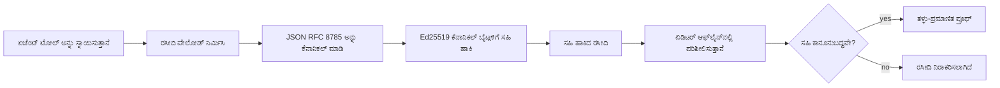
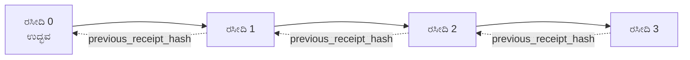

[ಪಾಠದ ವೀಡಿಯೋ ಅನ್ನು ನೋಡಿರಿ: ಕ್ರಿಪ್ಟೋಗ್ರಾಫಿಕ್ ರಸೀದಿಗಳೊಂದಿಗೆ AI ಏಜೆಂಟ್ಗಳನ್ನು ಸುರಕ್ಷಿತಗೊಳಿಸುವುದು](https://youtu.be/PLACEHOLDER_VIDEO_ID)

> _(ಪಾಠ ವೀಡಿಯೋ ಮತ್ತು ಥಂಬ್‌ನೆಲ್ ಅನ್ನು ಮೈಕ್ರೋಸಾಫ್ಟ್ ವಿಷಯ ತಂಡವು ಮерж್ ಆದ ನಂತರ ಸೇರಿಸಲಾಗುವುದು, ಪಾಠ 14/15 ಮಾದರಿಯನ್ನು ಹೊಂದುತ್ತವೆ.)_

# ಕ್ರಿಪ್ಟೋಗ್ರಾಫಿಕ್ ರಸೀದಿಗಳೊಂದಿಗೆ AI ಏಜೆಂಟ್ಗಳನ್ನು ಸುರಕ್ಷಿತಗೊಳಿಸುವುದು

## ಪರಿಚಯ

ಈ ಪಾಠವು ಇವುಗಳನ್ನು ಒಳಗೊಂಡಿರುತ್ತದೆ:

- ಅನುಕೂಲತೆ, ಡೀಬಗ್, ಮತ್ತು ನಂಬಿಕೆಗೆ AI ಏಜೆಂಟ್ಗಳಿಗೆ ಆಡಿಯಟ್ ಟ್ರೇಲ್‌ಗಳು چرا ಮುಖ್ಯ.
- ಕ್ರಿಪ್ಟೋಗ್ರಾಫಿಕ್ ರಸೀದಿ ಎಂದರೇನು ಮತ್ತು ಅದು ಅಸೈನ್ ಮಾಡದ ಲಾಗ್ ಲೈನಿನಿಂದ ಹೇಗೆ ಭಿನ್ನ.
- ಪ್ಲೇನ್ ಪೈಥಾನ್‌ನಲ್ಲಿ ಏಜೆಂಟ್ ಸಾಧನ ಕರೆಗಾಗಿ ಸಹಿ ಮಾಡಲಾದ ರಸೀದಿ ಹೇಗೆ ಉತ್ಪಾದಿಸುವುದು.
- ರಸೀದಿಯನ್ನು ಆಫ್‌ಲೈನ್‌ನಲ್ಲಿ ಪರಿಶೀಲಿಸುವುದು ಮತ್ತು ತತ್ತರಿಸಲಾಗುವಿಕೆಯನ್ನು ಪತ್ತೆಹಚ್ಚುವುದು.
- ರಸೀದಿಗಳನ್ನು ಸರಪಳಿ ಮಾಡಲು ಹೇಗೆ, ಇದರಿಂದ ಒಂದು ರಸೀದಿಯನ್ನು ತೆಗೆದುಹಾಕುವುದು ಅಥವಾ ಮರು ಆದೇಶಿಸುವುದು ಸರಪಳಿಯನ್ನು ಮುರಿದುಹಾಕುತ್ತದೆ.
- ರಸೀದಿಗಳು 무엇을 ಸಾಬೀತುಮಾಡುತ್ತವೆ ಮತ್ತು ಅವು ಸ್ಪಷ್ಟವಾಗಿ 무엇ನ್ನು ಸಾಬೀತುಮಾಡುವುದಿಲ್ಲ.

## ಅಧ್ಯಯನ ಗುರಿಗಳು

ಈ ಪಾಠವನ್ನು ಮುಗಿಸಿದ ನಂತರ ನೀವು ತಿಳಿಯಬಹುದು:

- ಏಜೆಂಟ್ ಕ್ರಿಯೆಗಳಿಗೆ ಕ್ರಿಪ್ಟೋಗ್ರಾಫಿಕ್ ಮೂಲಭೂತತೆಯನ್ನು ಹುಣಿಸಿ ಉತ್ತೇಜಿಸುವ ವಿಫಲತೆ ಮodoಗಳು ಅರ್ಥಮಾಡಿಕೊಂಡು.
- ಮಾನ್ಯವಾದ JSON ಪೇಲೋಡ್‌ ಮೇಲೆ Ed25519 ಸಹಿ ಮಾಡಲಾದ ರಸೀದಿ ಉತ್ಪಾದಿಸುವುದು.
- ಸಹಿದಾರರ ಸಾರ್ವಜನಿಕ ಕೀಮాత్రದ ಬಳಸಿಕೊಂಡು ರಸೀದಿಯನ್ನು ಸ್ವತಂತ್ರವಾಗಿ ಪರಿಶೀಲಿಸುವುದು.
- ತಯಾರಿಸಿದ ರಸೀದಿಯನ್ನು ಬದಲಾಯಿಸಿ ಪರಿಶೀಲನೆಯನ್ನು ಮತ್ತೆ ನಡೆಸಿ ತತ್ತರಿಸುವಿಕೆಯನ್ನು ಪತ್ತೆಹಚ್ಚುವುದು.
- ರಸೀದಿಗಳ ಹ್ಯಾಶ್-ಚೈನ್ ಸರಣಿಯನ್ನು ಸಂಯೋಜಿಸಿ ಮತ್ತು ಆ ಸರಣಿ ಪ್ರಮುಖವಾದ್ದನ್ನು ವಿವರಣೆ ಮಾಡುವುದು.
- ರಸೀದಿಗಳು 무엇ನ್ನು ಸಾಬೀತುಮಾಡುತ್ತವೆ (ಹೆಸರು ಸೂಚನೆ, ಅಖಂಡತೆ, ಕ್ರಮ) ಮತ್ತು 무엇ನ್ನು ಸಾಬೀತುಮಾಡುವುದಿಲ್ಲ (ಕ್ರಿಯೆಯ ಸರಿಯಾದತೆ, ನಿತಿಚಟುವಟಿಕೆಯ ಶ್ರೇಷ್ಠತೆ) ಎಂಬ ಭೇದ.

## ಸಮಸ್ಯೆ: ನಿಮ್ಮ ಏಜೆಂಟ್ನ ಆಡಿಯಟ್ ಟ್ರೇಲ್

ನೀವು Contoso ಟ್ರಾವೆಲ್‌ಗೆ ಒಂದು AI ಏಜೆಂಟ್ ಅನ್ನು ನಿಯೋಜಿಸಿದ್ದೀರಂತೆ. ಏಜೆಂಟ್ ಗ್ರಾಹಕರ ವಿನಂತಿಗಳನ್ನು ಓದಿ, ಫ್ಲೈಟ್‌ಗಳ API ಅನ್ನು ಕರೆ ಮಾಡಿ ಆಯ್ಕೆಗಳನ್ನು ಹುಡುಕಿ, ಮತ್ತು ಗ್ರಾಹಕರ ಪರವಾಗಿ ಸೀಟುಗಳನ್ನು ಬುಕ್ ಮಾಡುತ್ತದೆ. ಕಳೆದ ತ್ರೈಮಾಸಿಕದಲ್ಲಿ, ಏಜೆಂಟ್ 50,000 ಬುಕ್ಕಿಂಗ್‌ಗಳನ್ನು ಪ್ರಕ್ರಿಯೆಮಾಡಿತು.

ಇಂದು ಒಂದು ಆಡಿಯಟರ್ ಬರುವರು. ಅವರು ಸರಳ ಪ್ರಶ್ನೆಯನ್ನು ಕೇಳುತ್ತಾರೆ: "ನಿಮ್ಮ ಏಜೆಂಟ್ ಏನು ಮಾಡಿದೆಯೋ ತೋರಿಸಿ."

ನೀವು ನಿಮ್ಮ ಲಾಗ್ ಕಡತಗಳನ್ನು ನೀಡುತ್ತೀರಿ. ಆಡಿಯಟರ್ ಅವುಗಳನ್ನು ನೋಡುತ್ತಾನೆ ಮತ್ತು ಗಟ್ಟಿಯಾದ ಪ್ರಶ್ನೆ ಕೇಳುತ್ತಾನೆ: "ನಾನು ಹೇಗೆ ತಿಳಿದುಕೊಳ್ಳಬೇಕೆಂದು ಈ ಲಾಗ್‌ಗಳನ್ನು ಸಂಪಾದಿಸಲಾಗಿದೆ ಎಂದು?"

ಇದು ಆಡಿಯಟ್-ಟ್ರೇಲ್ ಸಮಸ್ಯೆ. ಇಂದಿನ ಬಹುತೇಕ ಏಜೆಂಟ್ ನಿಯೋಜನೆಗಳು ಇವುಗಳನ್ನು ಅವಲಂಬಿಸುತ್ತವೆ:

- **ಅಪ್ಲಿಕೇಶನ್ ಲಾಗ್‌ಗಳು**: ಏಜೆಂಟ್ ಸ್ವತಃ ಬರೆದು, ಯಾವುದೇ ಫೈಲ್-ಸಿಸ್ಟಮ್ ಪ್ರವೇಶವಿರುವವರು ಸಂಪಾದಿಸಬಹುದಾದವು.
- **ಮೇಘ ಲಾಗಿಂಗ್ ಸೇವೆಗಳು**: ವೇದಿಕೆ ಮಟ್ಟದಲ್ಲಿ ತತ್ತರೋಪಾಧಿ ಸ್ಫಟಿಕ ಆದರೆ ಆಡಿಯಟರ್ ವೇದಿಕೆ ಸಂಚಾಲಕನ ಮೇಲೆ ನಂಬಿಕೆ ಇಡುವಾಗ ಮಾತ್ರ.
- **ಡೇಟಾಬೇಸ್ ಟ್ರಾನ್ಸಾಕ್ಷನ್ ಲಾಗ್‌ಗಳು**: ಡೇಟಾಬೇಸ್ ಬದಲಾವಣೆಗಳಿಗೆ ಸೂಕ್ತವಾಗಿವೆ ಆದರೆ ಎಲ arbitrary ಸಾಧನ ಕರೆಗಳಿಗೆ ಅಲ್ಲ.

ಆಡಿಯಟರ್ ಯಾರನ್ನು ನಂಬಬೇಕೆಂಬುದಿಲ್ಲದೆ ಆಡಿಯಟರ್ ಪ್ರಶ್ನೆಗೆ ಉತ್ತರಿಸುವುದಿಲ್ಲ. ಆಂತರಿಕ ಬಳಕೆಗೆ ಆ ನಂಬಿಕೆ ಸಾಮಾನ್ಯವಾಗಿ ಸ್ವೀಕಾರಾರ್ಹ. ನಿಯಂತ್ರಿತ ಕಾರ್ಯಗಳಿಗೆ (ಹಣಕಾಸು, ಆರೋಗ್ಯ ಸೇವೆ, EU AI ಅಧಿನಿಯಮಕ್ಕೆ ಒಳಪಟ್ಟ ಯಾವುದೇ ಕಾರ್ಯ), ಅದು ಸಾಧ್ಯವಿಲ್ಲ.

ಕ್ರಿಪ್ಟೋಗ್ರಾಫಿಕ್ ರಸೀದಿಗಳು ಪ್ರತಿ ಏಜೆಂಟ್ ಕ್ರಿಯೆಯನ್ನು ಸ್ವತಂತ್ರವಾಗಿ ಪರಿಶೀಲಿಸಬಹುದಾದಂತೆ ಮಾಡುವುದರಿಂದ ಈ ಸಮಸ್ಯೆಯನ್ನು ಪರಿಹರಿಸುತ್ತವೆ. ಆಡಿಯಟರ್ ನಿಮ್ಮನ್ನು ನಂಬಬೇಕಾಗಿಲ್ಲ. ಅವರಿಗೆ ನಿಮ್ಮ ಸಾರ್ವಜನಿಕ ಕೀ ಮತ್ತು ರಸೀದಿ ಮಾತ್ರ ಅವಶ್ಯ.

## ಕ್ರಿಪ್ಟೋಗ್ರಾಫಿಕ್ ರಸೀದಿ ಎಂದರೇನು?

ರಸೀದಿ ಅಂದರೆ ಏಜೆಂಟ್ ಏನ್ ಮಾಡಿದೆಯೋ ದಾಖಲಿಸುವ JSON ವಸ್ತು, ಡಿಜಿಟಲ್ ಸಹಿಯಿಂದ ಸಹಿ ಮಾಡಲಾಗುತ್ತದೆ.


```mermaid
flowchart LR
    A[ಏಜೆಂಟ್‌ ಟೋಲ್ ಅನ್ನು ಸ್ನಾಯಿಸುತ್ತಾನೆ] --> B[ರಸೀದಿ ಪೇಲೋಡ್ ನಿರ್ಮಿಸಿ]
    B --> C[JSON RFC 8785 ಅನ್ನು ಕೆನಾನಿಕಲ್ ಮಾಡಿ]
    C --> E[Ed25519 ಕೆನಾನಿಕಲ್ ಬೈಟ್ಗಳಿಗೆ ಸಹಿ ಹಾಕಿ]
    E --> F[ಸಹಿ ಹಾಕಿದ ರಸೀದಿ]
    F --> G[ಏಡಿಟರ್ ಆಫ್‌ಲೈನ್‌ನಲ್ಲಿ ಪರಿಶೀಲಿಸುತ್ತಾನೆ]
    G --> H{ಸಹಿ ಕಾನೂನುಬದ್ಧವೇ?}
    H -- yes --> I[ತಳ್ಳು-ಪ್ರಮಾಣಿತ ಪ್ರೂಫ್]
    H -- no --> J[ರಸೀದಿ ನಿರಾಕರಿಸಲಾಗಿದೆ]
```

ಸಾಂಪ್ರದಾಯಿಕ ರಸೀದಿ ಹೀಗೆ ಕಾಣಬಹುದು:

```json
{
  "type": "agent.tool_call.v1",
  "agent_id": "contoso-travel-bot",
  "tool_name": "lookup_flights",
  "tool_args_hash": "sha256:a3f9c1...",
  "result_hash": "sha256:7b2e1d...",
  "policy_id": "contoso-travel-policy-v3",
  "timestamp": "2026-04-25T14:30:00Z",
  "sequence": 47,
  "previous_receipt_hash": "sha256:9d4e6a...",
  "signature": {
    "alg": "EdDSA",
    "sig": "c5af83...",
    "public_key": "8f3b2c..."
  }
}
```

ಮೂರು ಗುಣಲಕ್ಷಣಗಳು ಕೆಲಸ ಮಾಡುತ್ತವೆ:

1. **ಸಹಿ**. ರಸೀದಿ ಏಜೆಂಟ್ ಗೇಟ್ವೇನಿಂದ Ed25519 ಖಾಸಗಿ ಕೀ ಬಳಸಿ ಸಹಿ ಮಾಡಲಾಗುತ್ತದೆ. ಸಂಬಂಧಿತ ಸಾರ್ವಜನಿಕ ಕಿಯನ್ನು ಹೊಂದಿರುವ ಯಾರಾದರೂ ಸಹಿ ಆಫ್‌ಲೈನ್‌ನಲ್ಲಿ ಪರಿಶೀಲಿಸಬಹುದು. ಯಾವುದೇ ಕ್ಷೇತ್ರ ತತ್ತರಿಸಲಾಗುವಿಕೆ ಸಹಿಯನ್ನು ಅಮಾನ್ಯಗೊಳಿಸುತ್ತದೆ.

2. **ಕ್ಯಾನೋನಿಕಲ್ ಎನ್ಕೋಡಿಂಗ್**. ಸಹಿ ಮಾಡುವ ಮೊದಲು, ರಸೀದಿಯನ್ನು JSON ಕ್ಯಾನೋನಿಕಲೈಜೆಷನ್ ಸ್ಕೀಮ್ (JCS, RFC 8785) ಉಪಯೋಗಿಸಿ ಸರಣಿ ಗೊಳಿಸಲಾಗುತ್ತದೆ. ಇದರಿಂದ ಎರಡು ಅನುಷ್ಠಾನಗಳು ಒಂದೇ ಲಾಜಿಕಲ್ ರಸೀದಿಯನ್ನು ಬೈಟ್-ಒಂದುಸರಿಯಾದ ಔಟ್‌ಪುಟ್ ಉತ್ಪಾದಿಸುತ್ತವೆ. ಕ್ಯಾನೋನಿಕಲೈಸೇಶನ್ ಇಲ್ಲದೆ, ವಿಭಿನ್ನ JSON ಸರಿಯಾದಿಕೆಗಳು ಒಂದೇ ವಿಷಯಕ್ಕೆ ವಿಭಿನ್ನ ಸಹಿಗಳನ್ನು ಒದಗಿಸುತ್ತವೆ.

3. **ಹ್ಯಾಶ್ ಚೇನಿಂಗ್**. `previous_receipt_hash` ಕ್ಷೇತ್ರವು ಪ್ರತಿ ರಸೀದಿಯನ್ನು ಹಿಂದಿನ ಹಾದಿಗಾಗಿ ಲಿಂಕ್ ಮಾಡುತ್ತದೆ. ರಸೀದಿಯನ್ನು ತೆಗೆದು ಹಾಕುವುದು ಅಥವಾ ಮರು ಆದೇಶಿಸುವುದು ನಂತರದ ಪ್ರತಿಯೊಂದು ರಸೀದಿಯನ್ನು ಮುರಿಯುತ್ತದೆ. ವೈಯಕ್ತಿಕ ಸಹಿಗಳನ್ನು ದಾಟಿದರೂ ಸಹ, ತತ್ತರಿಸಲಾಗುವಿಕೆ ಸರಣಿ ಮಟ್ಟದಲ್ಲಿ ಸ್ಪಷ್ಟವಾಗುತ್ತದೆ.

ಈ ಗುಣಲಕ್ಷಣಗಳು ಒಟ್ಟಿಗೆ ಮೂರು ಭರವಸೆಗಳನ್ನು ನೀಡುತ್ತವೆ:

- **ಹೆಸರು ಸೂಚನೆ**: ಈ ಕೀ ಈ ವಿಷಯವನ್ನು ಸಹಿ ಮಾಡಿದೆ.
- **ಅಖಂಡತೆ**: ಸಹಿ ಮಾಡಿದರೆಂದಿನಿಂದ ವಿಷಯ ಬದಲಾಗಿಲ್ಲ.
- **ಕ್ರಮ**: ಈ ರಸೀದಿ ಆ ಸರಣಿಯಲ್ಲಿ ಆ ರಸೀದಿಗಿಂತ ನಂತರ ಬಂತು.

## ಪೈಥಾನ್‌ನಲ್ಲಿ ರಸೀದಿ ಉತ್ಪಾದಿಸುವುದು

ರಸೀದಿ ಉತ್ಪಾದಿಸಲು ವಿಶೇಷ ಗ್ರಂಥಾಲಯ ಅಗತ್ಯವಿಲ್ಲ. ಕ್ರಿಪ್ಟೋಗ್ರಾಫಿಕ್ ಮೂಲಭೂತಗಳು ವೇಗವಾಗಿ ಲಭ್ಯವಿದ್ದು ಲಾಜಿಕ್ ಕೆಲ ಡಜನ್ ಪೈಥಾನ್ ಸಾಲುಗಳಷ್ಟೇ.

`code_samples/18-signed-receipts.ipynb` ನಲ್ಲಿ ಕೈಯಿಂದ ಮಾಡುವ ವ್ಯಾಯಾಮಗಳು ಸಂಪೂರ್ಣ ಪ್ರಕ್ರಿಯೆಯನ್ನು ನಡೆಸುತ್ತವೆ. ಸಾರಾಂಶ:

```python
import json
import hashlib
import base64
from nacl import signing
from jcs import canonicalize  # RFC 8785 ಪ್ರಾಮಾಣಿಕ JSON

def b64url_nopad(data: bytes) -> str:
    return base64.urlsafe_b64encode(data).decode("ascii").rstrip("=")

def sha256_canonical(obj) -> str:
    """SHA-256 of a Python object's JCS-canonical JSON form."""
    return f"sha256:{hashlib.sha256(canonicalize(obj)).hexdigest()}"

# ಸಹಿ ಕೀವನ್ನು ತಯಾರಿಸು ಅಥವಾ ಲೋಡ್ ಮಾಡು (ಉತ್ಪಾದನೆಯಲ್ಲಿ, ಕೀ ವಾಲ್ಟ್‌ನಲ್ಲಿ ಸಂಗ್ರಹಿಸು)
signing_key = signing.SigningKey.generate()
verify_key = signing_key.verify_key

# ರಸೀದಿ ಪೇಲೋಡ್ ನಿರ್ಮಿಸು (ಇನ್ನೂ ಸಹಿ ಇಲ್ಲ)
tool_args = {"origin": "SYD", "destination": "LAX"}
tool_result = [{"flight": "QF11", "price": 1850, "stops": 0}]

payload = {
    "type": "agent.tool_call.v1",
    "agent_id": "contoso-travel-bot",
    "tool_name": "lookup_flights",
    "tool_args_hash": sha256_canonical(tool_args),
    "result_hash": sha256_canonical(tool_result),
    "policy_id": "contoso-travel-policy-v3",
    "timestamp": "2026-04-25T14:30:00Z",
    "sequence": 0,
    "previous_receipt_hash": None,
}

# ನೇರವಾಗಿ JCS ಬೈಟ್ಗಳನ್ನು ಪ್ರಾಮಾಣಿಕಗೊಳಿಸಿ ಮತ್ತು ಸಹಿ ಹಾಕಿ. PureEdDSA ಒಳಗೊಳ್ಳುತ್ತವೆ ಹ್ಯಾಶ್ ಆದೇಶಗಳನ್ನು.
canonical_bytes = canonicalize(payload)
signature_bytes = signing_key.sign(canonical_bytes).signature

# ರಚನಾತ್ಮಕ ಸಹಿ ವಸ್ತುವನ್ನು ಜೋಡಿಸು.
receipt = {
    **payload,
    "signature": {
        "alg": "EdDSA",
        "sig": b64url_nopad(signature_bytes),
        "public_key": b64url_nopad(bytes(verify_key)),
    },
}
```

ಇದು ಸಂಪೂರ್ಣ ಸಹಿ ಮಾಡುವ ಪೈಪ್ಲೈನ್. ನೋಟ್ಬುಕ್‌ನ ವ್ಯಾಯಾಮಗಳು ಪ್ರತಿ ಹೆಜ್ಜೆಯನ್ನು ವಿವರಿಸುತ್ತವೆ.

## ರಸೀದಿಯನ್ನು ಪರಿಶೀಲಿಸುವುದು ಮತ್ತು ತತ್ತರಿಸುವಿಕೆಯನ್ನು ಪತ್ತೆಹಚ್ಚುವುದು

ಪರಿಶೀಲನೆಹುನ್ನೆರುವಿಕೆ ಕ್ರಿಯೆಯ ವಿರುದ್ಧ.

```python
import base64
import hashlib
from nacl import signing
from nacl.exceptions import BadSignatureError
from jcs import canonicalize

def b64url_decode(s: str) -> bytes:
    padding = "=" * ((4 - len(s) % 4) % 4)
    return base64.urlsafe_b64decode(s + padding)

def verify_receipt(receipt: dict) -> bool:
    # ಸಹಿ ಇದೊಂದು ರಚನೆಗೊಂಡ ವಸ್ತು: {"alg", "sig", "public_key"}.
    sig_obj = receipt.get("signature")
    if not sig_obj or sig_obj.get("alg") != "EdDSA":
        return False

    # ವಾಸ್ತವವಾಗಿ ಸಹಿ ಹಾಕಲಾದ ಪೇಲೋಡ್ ಅನ್ನು ಪುನಃನಿರ್ಮಿಸಿ (ಸಹಿ ಹೊರತುಪಡಿಸಿ ಎಲ್ಲವೂ).
    payload = {k: v for k, v in receipt.items() if k != "signature"}

    canonical_bytes = canonicalize(payload)

    try:
        verify_key = signing.VerifyKey(b64url_decode(sig_obj["public_key"]))
        verify_key.verify(canonical_bytes, b64url_decode(sig_obj["sig"]))
        return True
    except BadSignatureError:
        return False
```

ಈ ಫंक್ಶನ್ ರಸೀದಿಯನ್ನು ತೆಗೆದುಕೊಂಡು ಸಹಿ ಮಾನ್ಯವಾದರೆ `True` ಅನ್ನು, ಇಲ್ಲದಿದ್ದರೆ `False` ಅನ್ನು ಹಿಂತೆಗೆದುಕೊಳ್ಳುತ್ತದೆ. ಯಾವುದೇ ಜಾಲ ತರಲು, ಸೇವೆ ಅವಲಂಬನೆಯಿಲ್ಲ, ಯಾವುದೇ ಮೂರನೇ ಪಕ್ಷವನ್ನು ನಂಬಬೇಕೂ ಇಲ್ಲ.

ತತ್ತರಿಸುವಿಕೆ ಪತ್ತೆಚೆಗೆ ನೋಟ್ಬುಕ್‌ನಲ್ಲಿ ಇವುಗಳು ನಡೆಯುತ್ತವೆ:

1. ಮಾನ್ಯವಾದ ರಸೀದಿಯನ್ನು ಉತ್ಪಾದಿಸಿ ಅದು ಪರಿಶೀಲನೆ ಸಮ್ಮತಿಸುತ್ತದೆ ಎಂದು ದೃಢಪಡಿಸುವುದು.
2. `tool_args_hash` ಕ್ಷೇತ್ರದ ಒಂದೊಂದು ಬೈಟ್ ಅನ್ನು ಬದಲಾಯಿಸುವುದು.
3. ಪರಿಶೀಲನೆಯನ್ನು ಪುನಃ ನಡೆಸಿ ಅದು ವಿಫಲವಾಗುವುದನ್ನು ನೋಡುವುದು.

ಇದು ರಸೀದಿಗಳು ತತ್ತರಿಸುವಿಕೆ-ಸೂಚಿತವಾಗಿದ್ದಾರೆಯೆಂದು ವೈಯಕ್ತಿಕವಾಗಿ ಪ್ರದರ್ಶಿಸುವುದು: ಯಾವುದೇ ಬದಲಾವಣೆ ಸಹಿ ಮುರಿಯುತ್ತದೆ.

## ಬಹು-ಹೆಜ್ಜೆಗಳ ಏಜೆಂಟ್ಗಾಗಿ ರಸೀದಿಗಳ ಸರಪಳಿ

ಒಂದು ಸಹಿ ಮಾಡಿದ ರಸೀದಿ ಒಂದು ಕ್ರಿಯೆಯನ್ನು ರಕ್ಷಿಸುತ್ತದೆ. ರಸೀದಿಗಳ ಸರಪಳಿ ಕ್ರಮವನ್ನು ರಕ್ಷಿಸುತ್ತದೆ.


```mermaid
flowchart LR
    R0[ರಸೀದಿ 0<br/>ಉದ್ಭವ] --> R1[ರಸೀದಿ 1]
    R1 --> R2[ರಸೀದಿ 2]
    R2 --> R3[ರಸೀದಿ 3]
    R1 -. previous_receipt_hash .-> R0
    R2 -. previous_receipt_hash .-> R1
    R3 -. previous_receipt_hash .-> R2
```

ಪ್ರತಿ ರಸೀದಿ ಹಿಂದಿನ ರಸೀದಿಯ ಹ್ಯಾಶ್ ಅನ್ನು ದಾಖಲಿಸುತ್ತದೆ. ರಸೀದಿ 2 ಅನ್ನು ಮೌನವಾಗಿ ತೆಗೆದು ಹಾಕಲು, ದಾಳಿ ಮಾಡುತ್ತಿರುವವರು:

- ರಸೀದಿ 3‌ನ `previous_receipt_hash` ಕ್ಷೇತ್ರವನ್ನು ಬದಲಾಯಿಸುವುದು (ರಸೀದಿ 3‌ನ ಸಹಿಯನ್ನು ಮುರಿಯುತ್ತದೆ), ಅಥವಾ
- ಬದಲಾಯಿಸಿದ ರಸೀದಿ 3 ಮೇಲೆ ಹೊಸ ಸಹಿಯನ್ನು ನಕಲಿ ಮಾಡುವುದು (ಏಜೆಂಟ್ ಖಾಸಗಿ ಕೀ ಅಗತ್ಯ).

ಖಾಸಗಿ ಕೀ ಹಾರ್ಡ್‌ವೇರ್ ಕೀ ವಾಲ್ಟ್‌ನಲ್ಲಿ ಇರಿ ಹಾಗೂ ಪ್ರತಿಯೊಂದು ರಸೀದಿಯೊಂದಿಗೆ ಸಾರ್ವಜನಿಕ ಕೀ ಪ್ರಕಟಿಸಿದರೆ, ಈ ದಾಳಿ ಗುರುತಿಸಲಾಗದೆ ಸಾಧ್ಯವಿಲ್ಲ.

ನೋಟ್ಬುಕ್ ಮುಂದುವರಿದಿದೆ:

1. ಮೂರು ರಸೀದಿಗಳ ಸರಪಳಿ ನಿರ್ಮಿಸುವುದು.
2. ಪ್ರತಿ ರಸೀದಿಯ `previous_receipt_hash` ಹಿಂದಿನ ರಸೀದಿಯ ನಿಜವಾದ ಹ್ಯಾಶ್‌ಗೂ ಹೊಂದಿಕೆಯನ್ನು ಪರಿಶೀಲಿಸುವುದು.
3. ಮಧ್ಯದಲ್ಲಿ ಒಂದೊಂದು ರಸೀದಿಯನ್ನು ತತ್ತರಿಸುವುದು ಮತ್ತು ಸರಣಿ ಮುರಿಯುತ್ತಿರುವುದು ನೋಡುವುದು.

ಈ ರೀತಿ ನೀವು ಆಡಿಯಟರ್ ನಿಮ್ಮನ್ನು ನಂಬದೆ ಪರಿಶೀಲಿಸಬಹುದಾದ ಆಡಿಯಟ್ ಟ್ರೇಲ್ ಅನ್ನು ಉತ್ಪಾದಿಸುತ್ತೀರಿ.

## ರಸೀದಿಗಳು 무엇ನ್ನು ಸಾಬೀತುಮಾಡುತ್ತವೆ (ಮತ್ತು 무엇ನ್ನು ಮಾಡುವುದಿಲ್ಲ)

ಈ ಪಾಠದ ಅತ್ಯಂತ ಮುಖ್ಯ ವಿಭಾಗ. ರಸೀದಿಗಳು ಶಕ್ತಿಶಾಲಿ ಆದರೆ ಆ ಶಕ್ತಿ ಮಿತವಾಗಿದೆ.

**ರಸೀದಿಗಳು ಮೂರು ವಿಷಯಗಳನ್ನು ಸಾಬೀತು ಮಾಡುತ್ತವೆ:**

1. **ಹೆಸರು ಸೂಚನೆ**: ನಿರ್ದಿಷ್ಟ ಕೀ ನಿರ್ದಿಷ್ಟ ಪೇಲೋಡ್ ಅನ್ನು ಸಹಿ ಮಾಡಿತ್ತು.
2. **ಅಖಂಡತೆ**: ಪೇಲೋಡ್ ಸಹಿ ಮಾಡಿದಾಗಿನಿಂದ ಬದಲಾಯಿಲ್ಲ.
3. **ಕ್ರಮ**: ಈ ರಸೀದಿ ಆ ಹ್ಯಾಶ್ ಸರಣಿಯಲ್ಲಿ ಆ ರಸೀದಿಗಿಂತ ಮುಂದೆ ಬಂತು.

**ರಸೀದಿಗಳು ಸಾಬೀತು ಮಾಡದೆ ಇರುತ್ತವೆ:**

1. **ಸರಿಯಾದತೆ**: ಏಜೆಂಟ್ ಕ್ರಿಯೆ ಸರಿಯಾದ ಕ್ರಮವೋ ಎಂಬುದು. ತಪ್ಪಾದ ಉತ್ತರಕ್ಕೂ ಸಹಿ ಮಾಡಬಹುದು ಅದೇ ರೀತಿಯಲ್ಲಿ.
2. **ನೀತಿ ಅನುಕೂಲತೆ**: `policy_id` ನಲ್ಲಿ ಸೂಚಿಸಲ್ಪಟ್ಟ ನಿಯತಿಯನ್ನು ಸತ್ಯವಾಗಿಯೇ ಮೌಲ್ಯಾಂಕನ ಮಾಡಲಾಯಿತು ಅಥವಾ ಯಾವುದಾದರೂ ಕ್ರಿಯೆಯನ್ನು ಅನುಮತಿಸಿತೇ ಎಂಬುದನ್ನು. ರಸೀದಿ ಹೇಳುವುದು ಪ್ರವೇಶ ವಾದವು, ಅಳವಡಿಸಿಕೊಂಡಿಲ್ಲ.
3. **ಕೀಯಿಗಿಂತ ಹೊರಗಿನ ಐಡಂಟಿಟಿ**: ರಸೀದಿ "ಈ ಕೀ ಈ ವಿಷಯವನ್ನು ಸಹಿ ಮಾಡಿದೆ" ಎಂದು ಹೇಳುತ್ತದೆ. "ಈ ವ್ಯಕ್ತಿಯು ಅನುಮೋದಿಸಿದ" ಎಂದು ಹೇಳುವುದಿಲ್ಲ. ವ್ಯಕ್ತಿ ಅಥವಾ ಸಂಸ್ಥೆಗಾಗಿ ಕೀ ಸಂಪರ್ಕಿಸಬೇಕಾದರೆ ಪ್ರತ್ಯೇಕ ಐಡಂಟಿಟಿ ಮೂಲಸೌಕರ್ಯ ಬೇಕು (ಡೈರೆಕ್ಟರಿ, ಸಾರ್ವಜನಿಕ ಕೀ ನೊಂದಣಿ, ಇತ್ಯಾದಿ).
4. **ಇನ್ಪುಟ್‌ಗಳ ಸತ್ಯತ್ವ**: ಏಜೆಂಟ್ ತಂತ್ರಸೂಚನೆಯನ್ನು ತಿರುವುಮಾಡಿದಂತೆ ಮತಿಗಳನ್ನು ಸ್ವೀಕರಿಸಿ ಅದನ್ನು ಅನುಷ್ಠಾನ ಮಾಡಿದರೆ, ರಸೀದಿ ಆ ಕ್ರಿಯೆಯನ್ನು ನಂಬಬಹುದಾಗಿದೆ. ರಸೀದಿಗಳು ಇನ್ಪುಟ್ ಪ್ರಮಾಣೀಕರಣದ ಹಿಂದೆ ಇರುತ್ತವೆ, ಅದರ ಬದಲಿಗೆ ಅಲ್ಲ.

ಈ ಅಗ್ಗುಲು ಎರಡು ಕಾರಣಗಳಿಂದ ಮುಖ್ಯ:

- ಪ್ರಸಕ್ತಗೊಳಿಸುವುದು ರಸೀದಿಗಳು ಏಜೆಂಟ್ ಆಚಾರವನ್ನು ಪರಿಶೀಲನೀಯವಾಗಿಸಿ ತತ್ತರಿಸಲು ಸಹಕಾರಿ ಎಂಬುದು, ಸಂಸ್ಥೆಗಳ ಗಡಿಗಳನ್ನು ದಾಟಿದರೂ ಸಹ.
- ನೀವು ಇನ್ನೂ ಬೇಕಾಗುವ ಹೆಚ್ಚುವರಿ ಪದರಗಳನ್ನು ತಿಳಿಸುತ್ತದೆ: ಇನ್ಪುಟ್ ದೃಢೀಕರಣ (ಪಾಠ 6), ನೀತಿ ಜಾರಿಗೆ (ಕೆಳಗೆ ಸಣ್ಣ ವಿವರಣೆ), ಮತ್ತು ಐಡಂಟಿಟಿ ಮೂಲಸೌಕರ್ಯ (ಈ ಪಾಠಕ್ಕೆ ಹೊರಗಿದ್ದು).

ಸಾಮಾನ್ಯ ತಪ್ಪು "ನಾವು ರಸೀದಿಗಳನ್ನು ಹೊಂದಿದ್ದೇವೆ" ಎಂದರೆ "ನಾವು ಆಡಳಿತাধীন" ಎಂದು ಭಾವಿಸುವುದು. ಅಲ್ಲ. ರಸೀದಿಗಳು അടിസ്ഥാനಚೌಕಟ್ಟು. ಆಡಳಿತ ವ್ಯವಸ್ಥೆಯು ನೀವು ನಿರ್ಮಿಸುವ ವ್ಯವಸ್ಥೆಯಾಗಿದೆ.

## ಮಾನವನು ಖಚಿತವಾಗಿ ಆ ಕ್ರಮವನ್ನು ಅನುಮೋದಿಸಿದುದನ್ನು ಸಾಬೀತುಪಡಿಸುವುದು

ಮೇಲಿನ 3ನೇ ಅಂಶವೇ ಪ್ರತ್ಯೇಕ ಅಧ್ಯಾಯಕ್ಕಿಂತ ಹೆಚ್ಚುವರಿ: ಕ್ರಿಯೆ ರಸೀದಿ "ಈ ಕೀ ಈ ವಿಷಯವನ್ನು ಸಹಿ ಮಾಡಿದೆ" ಅಂದ್ರೆ, "ಮನುಷ್ಯನು ಅನುಮೋದನೆ ನೀಡಿದ" ಅಲ್ಲ. ಉಳುಮೆಯ ಲಭ್ಯಕೃತ್ಯಗಳಿಗೆ (ಪರಿಸಿಗ, ಅಳಿಸುವಿಕೆ, ಹಣ ವರ್ಗಾವಣೆ) ಆಡಳಿತಾತ್ಮಕ ಚಟುವಟಿಕೆಗಳು ಈ ಅಗತ್ಯವಿರುವ ನಿರ್ವಹಣಾ ಚಟುವಟಿಕೆ ಚಟುವಟಿಕೆಗಳು ಹೆಚ್ಚಾಗುತ್ತಿವೆ, ಮತ್ತು ಈ ಪಾಠದಲ್ಲಿ ನೀವು ಈಗಾಗಲೇ ನಿರ್ಮಿಸಿದ ಮೂಲಭೂತಗಳಿಂದ ಉತ್ಪಾದಿಸಬಹುದಾದವು.

ಮುಂದಿನ ನೋಟ್ಬುಕ್ `code_samples/human-authorization-receipts.ipynb` ಎರಡನೇ ರಸೀದಿ ಪ್ರಕಾರವನ್ನು ಸೇರಿಸುತ್ತದೆ, `human.approval.v1`, ಪಾಠದ ರಸೀದಿಗಳಂತೆ (typed payload Ed25519 ಸಹಿತ canonical JCS ಬೈಟ್‌ಗಳ ಮೇಲೆ ಸಹಿ ಮಾಡಲಾದ, `signature` ವಸ್ತು ಸಹಿ ಮಾಡಿದ ಬೈಟ್‌ಗಳ ಹೊರಗೆ). ಹೆಸರು ನಾಮಿತ ಪ್ರಮಾಣಿಕರಣದ ಪ್ರತಿ ಕಾರ್ಯವನ್ನು ಮತ್ತು ಅದರ ದಿಜೆಸ್ಟ್ ಅನ್ನು ಸಹಿ ಮಾಡುತ್ತದೆ; ಏಜೆಂಟ್ ಕ್ರಿಯೆ ರಸೀದಿ ಅದೇ ಕ್ರಿಯೆ ದಿಜೆಸ್ಟ್ ಮತ್ತು ಒಂದು `parent_approval_ref`, ಅನುಮೋದನೆಯ `receipt_hash`, ಸರಣಿಯ `previous_receipt_hash` ನ ಪಾರದರ್ಶಕಾತ್ಮಕ ನಿಯಮ. ಒಂದು `verify_chain` ಇಬ್ಬರು ಕಲ್ಪಿತ ಕೀ ನೋಂದಣಿಗಳಡಿ ಎರಡು ದಾಖಲೆಗಳನ್ನು ಪರಿಶೀಲಿಸುತ್ತದೆ (ಅನುಮೋದಕ ಕీలు ಮತ್ತು ಏಜೆಂಟ್ ಕీలు), ಆದ್ದರಿಂದ ಕೋಡ್ ಮಾರ್ಗವನ್ನು ಹಂಚಿಕೊಳ್ಳುತ್ತದೆ ಆದರೆ ಅಧಿಕಾರಿಗಳು ಎಂದಿಗೂ ಹಂಚಿಕೊಳ್ಳುವುದಿಲ್ಲ.

ಇದು ಖಚಿತಗೊಳ್ಳುವ ಗುಣಲಕ್ಷಣ: *ಮನುಷ್ಯನು ಈ ನಿಖರ ಕ್ರಿಯೆಯನ್ನು ಅನುಮೋದಿಸಿತ್ತು, ಮತ್ತು ಏಜೆಂಟ್ ನಿಖರವಾಗಿ ಆ ಅನುಮೋದಿಸಿದ ಕ್ರಿಯೆಯನ್ನು ನಿರ್ವಹಿಸಿತು.* ನೋಟ್ಬುಕ್‌ನಲ್ಲಿ ನಿರಾಕರಣಾ ಸಂಗತಿಗಳು ಈ ಗುಣಲಕ್ಷಣವನ್ನು ನಿಜವಾಗಿಸುವುದಕ್ಕೆ ಇರುವವು:

- ಸಾಂಪ್ರದಾಯಿಕ ಗುಂಪು: ತತ್ತರಿಸುವಿಕೆ, ಗೊಂದಲದ ಪ್ರತಿನಿಧಿ, ಪುನರಾಯೋಜನೆ, ನಕಲಿ ಕీలు ಎರಡೂ ಬದಿ, ತಪ್ಪಾದ ಇನ್ಪುಟ್;
- **ಹಳೆಯ ಅಧಿಕಾರ**: ಸಹಿ ಇನ್ನೂ ಮಾನ್ಯ ಆದರೆ ನಿರಾಕರಿಸಲಾಗಿದೆ ಏಕೆಂದರೆ ನೀತಿ ಸಂಸ್ಕರಣೆಯು ಸರಿಯಾದಿಲ್ಲ, ಅನುಮೋದಕ ಕೀ ನೋಂದಣಿಯಿಂದ ಹೊರಗಡೆ ಬರಲಾಗಿದೆ, ಅಥವಾ ಅನುಮೋದನೆ ಕಾರ್ಯಗತಗೊಳಿಸುವ ಮೊದಲು ಅವಧಿ ಮುಗಿಯಾಗಿದೆ;
- **ದಿಜೆಸ್ಟ್ ಬದಲಾವಣೆ**: ನಿಜವಾದ ಅನುಮೋದನೆಯನ್ನು ಸೂಚಿಸುವ ಮಾನ್ಯ ಸಹಿ ಹೊಂದಿದ ಕ್ರಿಯೆ ರಸೀದಿ, ಆದರೆ ವಿಭಿನ್ನ ಕ್ಯಾನೋನಿಕಲ್ ಕ್ರಿಯೆಗೆ ಬಿಡುತ್ತದೆಯೆಂದು ಸೂಚಿಸುವುದು.

ಪ್ರತಿ ವೈಫಲ್ಯವೂ ವಿಭಿನ್ನ ಕಾರಣದಿಂದ ನಿರಾಕರಿಸಲಾಗುತ್ತದೆ, ಆದ್ದರಿಂದ ಆಡಿಯಟರ್ ನಿರಾಕರಣೆಯನ್ನು ಓದುವಾಗ ಅಧಿಕಾರ ಹಳೆಯಾಗಿದೆ ಅಥವಾ ಕಾರ್ಯ ಬದಲಾಗಿದೆ ಎಂದು ತಿಳಿದುಕೊಳ್ಳಬಹುದು. ನೋಟ್ಬುಕ್ ತಿಳಿಸುವ ನಿಯಮ: ಸಹಿ ಮಾಡಲಾದ ಅನುಮೋದನೆ ಸ್ವತಂತ್ರ ಅಧಿಕಾರವಲ್ಲ. ಅಧಿಕಾರವಿರುವುದು ಮಾತ್ರ ಎರಡೂ ರಸೀದಿಗಳು ಕಾರ್ಯಗತಗೊಳಿಸುವ ಸಮಯದಲ್ಲಿ ಒಂದೇ ಕರ್ತವ್ಯವನ್ನು ಬದ್ಧವಾಗಿರುತ್ತವೆ. ಮಾನವ-ಅನುಮೋದನೆ ರಸೀದಿ ಈ ಪಾಠದ ಮೂಲಕ ವ್ಯಾಖ್ಯಾಯಿತ ಶಿಕ್ಷಣ ಸಂಯೋಜನೆಯಾಗಿದೆ, ಅದು `draft-farley-acta-signed-receipts` ನಿಂದ ವ್ಯಾಖ್ಯಾನದ ಪ್ರಕಾರವಲ್ಲ.

## ಉತ್ಪಾದನೆ ಉಲ್ಲೇಖಗಳು

ಈ ಪಾಠದ ಪೈಥನ್ ಕೋಡ್ ಉದ್ದೇಶಪೂರ್ವಕವಾಗಿ ಕನಿಷ್ಠವಾಗಿದೆ, ಆದ್ದರಿಂದ ಪ್ರತಿಯೊಂದು ಸಾಲನ್ನು ಓದಿ ಏನಾಗುತ್ತಿದ್ದುದು ತಿಳಿಯಬಹುದು. ಉತ್ಪಾದನೆಯಲ್ಲಿ, ನಿಮಗೆ ಎರಡು ಆಯ್ಕೆಗಳು ಇವೆ:

1. **ನೇರವಾಗಿ ಕ್ರಿಪ್ಟೋಗ್ರಾಫಿಕ್ ಮೂಲಭೂತಗಳ ಮೇಲೆ ನಿರ್ಮಿಸಿ.** ಮೇಲಿನ 50 ಸಾಲುಗಳು ಹಲವಾರು ಬಳಕೆಗಳಿಗೆ ಸಾಕಷ್ಟಿವೆ. PyNaCl (Ed25519) ಮತ್ತು `jcs` ಪ್ಯಾಕೇಜ್ (ಕ್ಯಾನೋನಿಕಲ್ JSON) ಉತ್ತಮ ನಿರ್ವಹಣೆ ಮತ್ತು ಪರಿಶೀಲನೆಯ ಗ್ರಂಥಾಲಯಗಳು.

2. **ಉತ್ಪನ್ನ ರಸೀದಿ ಗ್ರಂಥಾಲಯ ಬಳಸಿ.** ಹಲವು ಮುಕ್ತ-ಮೂಲ ಯೋಜನೆಗಳು ಸಹಿ ಮಾಡುವುದು, ಬ್ಯಾಚ್ ಪರಿಶೀಲನೆ, JWK ಸೆಟ್ ವಿತರಣೆ, ನೀತಿ ಎಂಜಿನ್‍ಗಳ ನೆರವು ಸೇರಿದಂತೆ ಅದೇ ಮಾದರಿಯನ್ನು ಜಾರಿಗೆ ತಂದಿವೆ:
   - ಸಹಿ ಪೈಪ್ಲೈನ್ JCS ಮತ್ತು ಸಹಿ-ವಿಸ್ತಾರ ನಿಯಮಗಳನ್ನು ಸ್ವತಂತ್ರ IETF ಇಂಟರ್ನೆಟ್-ಡ್ರಾಫ್ಟ್ ([`draft-farley-acta-signed-receipts`](https://datatracker.ietf.org/doc/draft-farley-acta-signed-receipts/), ಮರುಪಾರದರ್ಶಕತೆ 02) ಬಳಕೆ ಮಾಡುತ್ತದೆ. ಈ ಪಾಠದ ಸರಳ ಶೈಕ್ಷಣಿಕ ರಸೀದಿ ಡ್ರಾಫ್ಟ್‌ನ `{payload, signature}` ಎನ್ವಲಪ್‌ನಿಂದ ಭಿನ್ನವಾಗಿದೆ ಮತ್ತು ಅನುಷ್ಠಾನವಲ್ಲ. ಡ್ರಾಫ್ಟ್ ತನ್ನ ವೈರ್ ಫಾರ್ಮಾಟ್ ಗುರಿಯಲ್ಲಿ ಅನುಷ್ಠಾನಗಳಿಗೆ ಸಹಕಾರದ ಕಿಕ್ಕುಗಳನ್ನು ಪ್ರಕಟಿಸಿದೆ ([agent-governance-testvectors](https://github.com/ScopeBlind/agent-governance-testvectors)).
   - ಮೈಕ್ರೋಸಾಫ್ಟ್ ಏಜೆಂಟ್ ಆಡಳಿತ ಪರಿಕರ ಕಿಟ್ ರಸೀದಿಗಳನ್ನು ಸೀಡರ್ ಆಧಾರಿತ ನೀತಿ ನಿರ್ಧಾರಗಳಿಂದ ರಚಿಸುತ್ತದೆ; ಅದರಲ್ಲಿ ಟ್ಯುಟೋರಿಯಲ್ 33 ಪೂರ್ಣ ಉದಾಹರಣೆಗಾಗಿ ನೋಡಿ.
   - `protect-mcp` (npm) ಮತ್ತು `@veritasacta/verify` (npm) ಪ್ಯಾಕೇಜುಗಳು ನೋಡ್ ಆಧಾರಿತ ರಸೀದಿ ಸಹಿ ಮತ್ತು ಆಫ್‌ಲೈನ್ ಪರಿಶೀಲನೆ ಕಾರ್ಯಾನುಷ್ಠಾನವನ್ನು ಒದಗಿಸುತ್ತವೆ, ಎಲ್ಲ MCP ಸರ್ವರ್‌ಗಳನ್ನು ತತ್ತರಸೂಚಕ ಆಡಿಯಟ್ ಟ್ರೇಲ್‌ನೊಂದಿಗೆ ಸಾಧಿಸಲು, ರದ್ದು ಮಾಡಿ ಕಾಯ್ದಿರಿಸುವ ಕಾರ್ಯದಲ್ಲಿ ವೀಕ್ಷಣೆ ಅನುಮೋದನಾ ರಸೀದಿಯನ್ನು ಹೊರಡಿಸುವ ವ್ಯವಸ್ಥೆಯನ್ನು ಒಳಗೊಂಡಿದೆ (ಡೆಸ್ಕ್‌ಟಾಪ್ ಹರಿವುಗಳಲ್ಲಿ ವೆಬ್ ಆಥ್‍ನ್ ಬೆಂಬಲಿತ), ಮೇಲಿನ ಮಾನವ-ಅನುಮೋದನೆ ನೋಟ್ಬುಕ್‌ನಂತೆ.
   - **[nobulex](https://github.com/arian-gogani/nobulex)** ಪೈಥಾನ್ SDK (`pip install nobulex`) Ed25519 + JCS ಸಹಿ ಮಾದರಿಯನ್ನು ಪೈಥಾನ್‌ನಲ್ಲಿ LangChain ಮತ್ತು CrewAI ಸಂಯೋಜನೆಗಳೊಂದಿಗೆ ಒದಗಿಸುತ್ತದೆ, ಪ್ರಕಟಿತ ಪರಸ್ಪರ-ಪರಿಶೀಲನೆ ಪರೀಕ್ಷಾ ಕಿಕ್ಕುಗಳು ಮತ್ತು [OWASP PR #2210](https://github.com/OWASP/CheatSheetSeries/pull/2210) ಮೂಲಕ ಕೊಡುಗೆ ಹೊಂದಿದೆ.

ನಿಮ್ಮದೇ JWT ಗ್ರಂಥಾಲಯವನ್ನು ಬರೆಯುವುದು ಅಥವಾ ಪರೀಕ್ಷಿತ ಗ್ರಂಥಾಲಯವನ್ನು ಬಳಸದಿರುವುದರೊಳಗಿನ ಭೇದದಲ್ಲಿಯೇ, ನಿಮ್ಮದೇ ರಸೀದಿ ಗ್ರಂಥಾಲಯವನ್ನು ರಚಿಸುವ ಅಥವಾ ಬಳಸದಿರುವ ನಿರ್ಧಾರ. ಎರಡೂ ಸಮಂಜಸ; ಗ್ರಂಥಾಲಯ ಸಮಯ ಉಳಿಸುತ್ತದೆ ಮತ್ತು ಪರಿಶೀಲನೆ ಸೌಕರ್ಯ ಕಡಿಮೆ ಮಾಡುತ್ತದೆ; ಆರಂಭದಿಂದ ಬರೆಸುವುದು ಪ್ರತಿಯೊಂದು ಮೂಲಭೂತವನ್ನು ಅರ್ಥಮಾಡಿಕೊಳ್ಳಲು ಕೈಪಿಡಿ. ಈ ಪಾಠ ಆರಂಭದಿಂದಲೂ ಮಾರ್ಗವನ್ನು ಕಲಿಸುವುದರಿಂದ ಯಾವುದೇ ಆಯ್ಕೆಗೆ ಮೂಲಸೌಕರ್ಯ ಸಿಗುತ್ತದೆ.

## ಜ್ಞಾನ ಪರಿಶೀಲನೆ

ಅಭ್ಯಾಸ ವ್ಯಾಯಾಮಕ್ಕೆ ಮುಂದುವರಿಯುವ ಮುನ್ನ ನಿಮ್ಮ ಅರ್ಥಮಾಡಿಕೊಳ್ಳುವಿಕೆಯನ್ನು ಪರೀಕ್ಷಿಸಿ.

**1. ರಸೀದಿಯನ್ನು ಏಜೆಂಟ್ ಖಾಸಗಿ Ed25519 ಕೀಲಿನೊಂದಿಗೆ ಸಹಿ ಮಾಡಲಾಗಿದೆ. ಆಡಿಯಟರ್‌ಗೆ ಸಾರ್ವಜನಿಕ ಕೀ ಮಾತ್ರ ಇದೆ. ಆಡಿಯಟರ್ ಆಫ್‌ಲೈನ್‌ನಲ್ಲಿ ರಸೀದಿಯನ್ನು ಪರಿಶೀಲಿಸಬಹುದೇ?**

<details>
<summary>ಉತ್ತರ</summary>

ಹೌದು. Ed25519 ಪರಿಶೀಲನೆಗೆ ಸಾರ್ವಜನಿಕ ಕೀಯಷ್ಟೇ ಸಮರ್ಪಕ. ಯಾವುದೇ ಜಾಲ ಕರೆ, ಸೇವೆ ಅವಲಂಬನೆ ಇಲ್ಲ. ಇದು ರಸೀದಿಗಳನ್ನು ಏರ್-ಗ್ಯಾಪ್ಡ್, ಬಹು-ಸಂಸ್ಥೆ ಅಥವಾ ಕಡಿಮೆ ನಂಬಿಕೆ ಆಡಿಯಟ್ ಸನ್ನಿವೇಶಗಳಲ್ಲಿ ಉಪಯುಕ್ತವನ್ನಾಗಿ ಮಾಡುವ ಲಕ್ಷಣ.
</details>

**2. ದಾಳಿ ಮಾಡುವವರು ರಸೀದಿ `policy_id` ಕ್ಷೇತ್ರವನ್ನು ಬದಲಾಯಿಸಿ ಅದেকেಗಿಂತ ಹೆಚ್ಚು ಅನುಮತಿಸುವ ನೀತಿಯಿಂದ ಸಂಚಾಲಿತವಂತೆ ಹೇಳುತ್ತಾರೆ. ಸಹಿ ಆ ಮೂಲ ಪೇಲೋಡ್ ಮೇಲೆ ಆಗಿತ್ತು. ಪರಿಶೀಲನೆ ಸಮಯದಲ್ಲಿ ಏನಾಗುತ್ತದೆ?**

<details>
<summary>ಉತ್ತರ</summary>


ಪರಿಶೀಲನೆ ವಿಫಲವಾಗಿದೆ. ಸಹಿ ಮೂಲ ಪೇಲೋಡ್‌ನ ಮಾನಕ ಬೈಟುಗಳ ಮೇಲೆ ಲೆಕ್ಕಿಸಲಾಯಿತು; ಯಾವುದೇ ಕ್ಷೇತ್ರವನ್ನು ಬದಲಾಯಿಸುವುದು ಆ ಬೈಟುಗಳನ್ನು ಬದಲಾಯಿಸುತ್ತದೆ, ಇದು ಸಹಿಯನ್ನು ಅಮಾನ್ಯಗೊಳಿಸುತ್ತದೆ. ದಾಳಿ ನಡೆಸುವವರು ಹೊಸ ಸರಿಯಾದ ಸಹಿಯನ್ನು ರಚಿಸಲು ಖಾಸಗಿ ಕೀ ಅಗತ್ಯವಿದೆ, ಅದು ಅವರ ಬಳಿ ಇಲ್ಲ.
</details>

**3. ರಸೀದಿ ಕಚ್ಚಾ ಆರ್ಗುಮೆಂಟ್ಗಳ ಮತ್ತು ಫಲಿತಾಂಶದ ಬದಲು `tool_args_hash` ಮತ್ತು `result_hash` ಅನ್ನು ಏಕೆ ಒಳಗೊಂಡಿದೆ?**

<details>
<summary>ಉತ್ತರ</summary>

ಎರಡು ಕಾರಣಗಳು. ಮೊದಲನೆಯದಾಗಿ, ರಸೀದಿ ಸಂಗ್ರಹಿಸಲು ಅಥವಾ ಪ್ರಸಾರ ಮಾಡಲು ಅಗತ್ಯವಿರಬಹುದು, ಅಲ್ಲಿ ಕಚ್ಚಾ ವಿಷಯ (ವೈಯಕ್ತಿಕ ಗುರುತಿಸುವ ಮಾಹಿತಿ, ವ್ಯಾಪಾರದ ದತ್ತಾಂಶ) ಲೀಕ್ ಆಗುವುದು ಸಮಸ್ಯೆಯಾಗಿರಬಹುದು. ಹ್ಯಾಷಿಂಗ್ ರಸೀದಿಯನ್ನು ಸಣ್ಣದಾಗಿಸು ಹಾಗೂ ವಿಷಯವನ್ನು ಖಾಸಗಿ ಇಡುತ್ತದೆ; ಪರಿಶೀಲಕವು ಹ್ಯಾಷ್ ಪ್ರಾರಂಭದಲ್ಲಿ ಇಡಲಾದ ನಕಲಿನೊಂದಿಗೆ ಹೊಂದಿಕೆಯಾಗುತ್ತದೆ ಎಂದು ಪರಿಶೀಲಿಸುತ್ತಾನೆ. ಎರಡನೆಯದಾಗಿ, ಹ್ಯಾಷ್‌ಗಳು ಸ್ಥಿರ ಗಾತ್ರವನ್ನು ಹೊಂದಿರುತ್ತವೆ; ಹ್ಯಾಷ್‌ಗಳುಳ್ಳ ರಸೀದಿ ಗಾತ್ರದಲ್ಲಿ ನಿಯಂತ್ರಿತವಾಗಿರುತ್ತದೆ, ಇನ್ಪುಟ್‌ಗಳು ಮತ್ತು ಔಟ್‌ಪುಟ್‌ಗಳು ಎಷ್ಟು ದೊಡ್ಡವಿದ್ದರೂ ಸಹ.
</details>

**4. `previous_receipt_hash` ಕ್ಷೇತ್ರವು ಪ್ರತಿ ರಸೀದಿಯನ್ನು ಅದರ ಪೂರ್ವ ಅವರೊಂದಿಗೆ ಸಂಪರ್ಕಿಸುತ್ತದೆ. ದಾಳಿಕಾರನು ಸರಣಿಯ ಮಧ್ಯಭಾಗದಲ್ಲಿ ಒಂದು ರಸೀದಿ ಮೌನವಾಗಿ ಅಳಿಸಿದರೆ, ಯಾವುದು ಅಮಾನ್ಯವಾಗುತ್ತದೆ?**

<details>
<summary>ಉತ್ತರ</summary>

ಅಳಿಸಿದ ರಸೀದಿಯಿಂದ ನಂತರ ಬಂದ ಪ್ರತಿ ರಸೀದಿ. ಅವುಗಳ `previous_receipt_hash` ಕ್ಷೇತ್ರಗಳು ವಾಸ್ತವ ಸರಣಿಯೊಂದಿಗೆ ಹೊಂದಾಣಿಕೆ ಆಗುತ್ತಿಲ್ಲ (ಅವರು ಉಲ್ಲೇಖಿಸಿದ ರಸೀದಿ ಈಗ ಇಲ್ಲದಿರುವುದರಿಂದ ಅಥವಾ ಸರಣಿ ಈಗ ಬೇರೆ ಪೂರ್ವ ಹೊಂದಿದ್ದರಿಂದ). ಅಳಿಸುವಿಕೆಯನ್ನು ಮುಚ್ಚಿಡಲು, ದಾಳಿಕಾರನು ನಂತರದ ಎಲ್ಲ ರಸೀದಿಗಳನ್ನು ಮರು ಸಹಿ ಹಾಕಬೇಕು, ಅದಕ್ಕೆ ಖಾಸಗಿ ಕೀ ಅಗತ್ಯವಿದೆ.
</details>

**5. ರಸೀದಿ ಸ್ಪಷ್ಟವಾಗಿ ಪರಿಶೀಲನೆಗೊಂಡಿದೆ. ಇದು ಏಜೆಂಟ್‌ನ ಕ್ರಿಯೆ ಸರಿಯಾದುದು, ಧ್ವನಿಪೂರ್ಣ ಅಥವಾ ನೀತಿ ಅನುಕೂಲವಾಗಿದೆ ಎಂದು ಸಾಬೀತಾಗುತ್ತದೆಯೇ?**

<details>
<summary>ಉತ್ತರ</summary>

ಇಲ್ಲ. ಮಾನ್ಯ ರಸೀದಿ ಮೂರು ವಿಷಯಗಳನ್ನು ಸಾಬೀತು ಮಾಡುತ್ತದೆ: ಹಕ್ಕು(ಈ ಕೀ ಈ ವಿಷಯವನ್ನು ಸಹಿ ಮಾಡಿದೆ), ಅಖಂಡತೆ(ವಿಷಯ ಬದಲಾಗಿಲ್ಲ), ಮತ್ತು ಕ್ರಮಬದ್ಧತೆ(ಈ ರಸೀದಿ ಆ ರಸೀದಿಗೆ ನಂತರ ಬಂತು). ಇದು ಕ್ರಿಯೆಯು ಸರಿಯಾದುದು ಎಂದು ಅಥವಾ `policy_id` ನಲ್ಲಿ ನಮೂದಿಸಿದ ನীতি ನಿಜವಾಗಿಯೂ ಪರಿಶೀಲಿತವೋ, ಅಥವಾ ಏಜೆಂಟ್ ಎಲ್ಲಾ ನಿಯಮಗಳನ್ನು ಪಾಲಿಸಿದ್ದು ಎಂದು ಸಾಬೀತಾಗಿಸುವುದಿಲ್ಲ. ರಸೀದಿಗಳು ಏಜೆಂಟ್ ವರ್ತನೆ ಪರೀಕ್ಷಣೀಯವಾಗಿಸುವುವು, ಆದರೆ ಅಗತ್ಯವಿಲ್ಲದೆ ಸರಿಯೆಂದು ಸಾಬೀತುಪಡಿಸುವುದಿಲ್ಲ. ಇದೇ ಪಾಠದಲ್ಲಿ ಅತ್ಯಂತ ಪ್ರಮುಖ ಮಿತಿಯು.
</details>

## ಅಭ್ಯಾಸ ವ್ಯಾಯಾಮ

 `code_samples/18-signed-receipts.ipynb` ಓದಿ ನಾಲ್ಕು ವಿಭಾಗಗಳನ್ನೂ ಪೂರ್ಣಗೊಳಿಸಿ:

1. **ವಿಭಾಗ 1**: ನಿಮ್ಮ ಮೊದಲ ರಸೀದಿಯನ್ನು ಸಹಿ ಮಾಡಿ ಮತ್ತು ಪರಿಶೀಲಿಸಿ.
2. **ವಿಭಾಗ 2**: ರಸೀದಿಯನ್ನು ಏಳುಮಾಡಿ ಮತ್ತು ಪರಿಶೀಲನೆ ವಿಫಲವಾಗುತ್ತದೆ ನೋಡಿ.
3. **ವಿಭಾಗ 3**: ಮೂರು ರಸೀದಿ ಸರಣಿಯನ್ನು ನಿರ್ಮಿಸಿ ಸರಣಿಯ ಅಖಂಡತೆ ಪರಿಶೀಲಿಸಿ.
4. **ವಿಭಾಗ 4**: ಮೈಕ್ರೋಸಾಫ್ಟ್ ಏಜೆಂಟ್ ಫ್ರೇಮ್ವರ್ಕ್ ಬಳಸಿ ನಿರ್ಮಿಸಿದ ಏಜೆಂಟ್‌ಗೆ ಮಾದರಿಯನ್ನು ಅನ್ವಯಿಸಿ: ಟೂಲ್ ಕರೆ ರಸೀದಿ-ಸಹಿ ಮೂಲಕ ಮುತ್ತಬೇಕು, ನಂತರ ರಸೀದಿಯನ್ನು ಸ್ವತಂತ್ರವಾಗಿ ಪರಿಶೀಲಿಸಬೇಕು.

**ಸ್ಟ್ರೆಚ್ ಸವಾಲು 1:** ಇಚ್ಛಿತ ಕ್ಷೇತ್ರ ಒಂದು ಹೆಚ್ಚಿಸಿ (ಉದಾಹರಣೆಗೆ ಟ್ರೇಸಿಂಗ್‌ಗಾಗಿ ವಿನಂತಿ ID), ಮಾನಕ ಸಹಿ ಲಾಜಿಕ್ ಅನ್ನು ಅದರಲ್ಲಿ ಸೇರಿಸಿ, ಮತ್ತು ರಸೀದಿ ಪರಿಶೀಲನೆಯ ಮೂಲಕ ಮತ್ತೆ ಸುತ್ತುಹೋಗುತ್ತದೆ ಎಂದು ಖಚಿತಪಡಿಸಿ. ನಂತರ ಸಹಿ ನಂತರ ಕ್ಷೇತ್ರವನ್ನು ಬದಲಿಸಿ ಮತ್ತು ಪರಿಶೀಲನೆ ವಿಫಲವಾಗುತ್ತದೆ ಎಂದು ದೃಢಪಡಿಸಿ. ಇದು ಮಾನಕ ಎನ್ಕೋಡಿಂಗ್‌ನ ಪ್ರತಿಯೊಂದು ಬೈಟ್ ಸಹಿಗೆ ಹೇಗೆ ಕೊಡುಗೆ ನೀಡುತ್ತದೆ ಎಂದು ತಿಳಿಯಲು ನಿಮಗೆ ಸಹಾಯ ಮಾಡುತ್ತದೆ.

**ಸ್ಟ್ರೆಚ್ ಸವಾಲು 2:** ನಿಮ್ಮ երկու ರಸೀದಿಗಳನ್ನು SHA-256 ಹ್ಯಾಷ್ ಮಾಡಿ (ಮೌಲ್ಯಮಾನ ನಿಯೋಜಿತ ಕ್ರಮದಲ್ಲಿ ಮಾನಕ ಬೈಟುಗಳನ್ನು Concatenate ಮಾಡಿ) ಮತ್ತು ಹಿನ್ನೀಲಿ ಒಂದು ಮೂರನೇ ರಸೀದಿಯಲ್ಲಿ ಹೊಸ ಕ್ಷೇತ್ರವಾಗಿ ಹೇರಿಸಿ. ಎಲ್ಲಾ ಮೂರು ರಸೀದಿಗಳು ಇನ್ನೂ ಸುತ್ತುಹೋಗುತ್ತವೆ ಎಂದು ಪರಿಶೀಲಿಸಿ. ನೀವು ಇತ್ತೀಚೆಗೆ ಒಂದು ಹಂತದ ಒಳಗೊಂಡಿರುವುದು ಸಾಬೀತು ಮಾಡುವುದನ್ನು ನಿರ್ಮಿಸಿದ್ದೀರಿ: ಮೂರನೇ ರಸೀದಿ ಹೊಂದಿರುವೆವರು ಮೊದಲ ಎರಡು ಸಹಿ ಆಗಿದ್ದಾಗ ಇದ್ದವು ಎಂದು ಸಾಬೀತು ಮಾಡುವುವು, ವಿಷಯಗಳನ್ನು ಬಹಿರಂಗಪಡಿಸದೆ. ಇದು ಆಯ್ಕೆಮಾಡಿದ ಬಹಿರಂಗ ಪಟ್ಟಿ ರಸೀದಿಗಳು ವ್ಯಾಪಕವಾಗಿ ಬಳಸುವ ಮಾದರಿ (Merkle ಬದ್ಧತೆಗಳು, RFC 6962).

## ಕೊನೆ

ಕ್ರಿಪ್ಟೋಗ್ರಾಫಿಕ್ ರಸೀದಿಗಳು AI ಏಜೆಂಟ್‌ಗಳಿಗೆ ಈ ರೀತಿಯ ಪರಿಶೀಲನಾ ಹಾದಿಯನ್ನು ನೀಡುತ್ತವೆ:

- **ಸ್ವತಂತ್ರವಾಗಿ ಪರಿಶೀಲಿಸಲಾಗುವದು**: ಯಾವ ಪಕ್ಷಕ್ಕೂ ಸಾರ್ವಜನಿಕ ಕೀ ಸಹಿತ ಪರಿಶೀಲಿಸಬಹುದು, ಯಾವುದೇ ಸೇವಾ ಅವಲಂಬನೆಯಿಲ್ಲದೆ.
- **ತಪ್ಪುಮಾಡಲು ದೃಷ್ಟಿಗೋಚರ**: ಯಾವುದೇ ಬದಲಾವಣೆ ಸಹಿಯನ್ನು ಅಮಾನ್ಯಗೊಳಿಸುತ್ತದೆ.
- **ಹರಿಸಲಾಗಬಹುದಾದದ್ದು**: ರಸೀದಿ ಸಣ್ಣ JSON ಕಡತ; ಅದನ್ನು ಸಂಗ್ರಹಿಸಬಹುದು, ಪ್ರಸಾರ ಮಾಡಬಹುದು ಮತ್ತು ಉಪಸ್ಥಿತಿಯಲ್ಲಿ ಪರಿಶೀಲಿಸಬಹುದು.
- **ಮಾಣ್ಯಗಳಗುಂಡಾದವು**: Ed25519 (RFC 8032), JCS (RFC 8785), ಮತ್ತು SHA-256 ಮೇಲೆ ನಿರ್ಮಿತ, ಎಲ್ಲವೂ ವ್ಯಾಪಕವಾಗಿ ಬಳಸುವ ಪ್ರಾಥಮಿಕಗಳು.

ಇವು ನಮೂದರ ಪರಿಶೀಲನೆ, ನೀತಿ ಜಾರಿಗೊಳಿಸುವಿಕೆ, ಅಥವಾ ಗುರುತು ವ್ಯವಸ್ಥೆಯ ಪರ್ಯಾಯವಲ್ಲ. ಅವು ಆ ಲೇಯರ್‌ಗಳಿಗೆ ಮೂಲಾವಳಿಯಾಗಿವೆ. ನಿಯಂತ್ರಿತ ವರ್ಕ್ಲೋಡ್ಗಳಲ್ಲಿ ಏಜೆಂಟ್‌ಗಳನ್ನು ನೆಡಿಸುವಾಗ, ಬಹು-ಸಂಸ್ಥೆಯ ಕಾರ್ಯಪ್ರವಾಹಗಳಲ್ಲಿ, ಅಥವಾ ಭವಿಷ್ಯದಲ್ಲಿ ಪರಿಶೀಲಕನು ನಿಮಗೆ ನಂಬಿಕೆ ಇಡುವುದಿಲ್ಲವೆಂದು ಊಹಿಸಬಹುದಾದ ಪರಿಸರದಲ್ಲಿ, ರಸೀದಿಗಳು ಪರಿಶೀಲನಾ ಹಾದಿಯನ್ನು ನೈತಿಕವಾಗಿಸುವುದು.

ಅತ್ಯಂತ ಪ್ರಮುಖ ಪಾಠ: ರಸೀದಿಗಳು ಯಾರು ಏನು ಹೇಳಿದ್ದು, ಯಾವಾಗ ಎಂದು ಸಾಬೀತು ಮಾಡುತ್ತವೆ. ಅದರಲ್ಲಿ ಹೇಳಿದವು ಸತ್ಯ ಅಥವಾ ಸರಿಯಾಗಿವೆ ಎಂಬುದನ್ನು ಸಾಬೀತುಮಾಡುವುದಿಲ್ಲ. ಆ ಭೇದವನ್ನು ಬಿಗಿಯಾಗಿಯಾಗಿ ಹಿಡಿಯಿರಿ. ಇದು ನೈತಿಕ ಮೂಲವ್ಯವಸ್ಥೆ ಮತ್ತು ಗೊಂದಲ ಮೂಡಿಸುವ ಇತರ ನಡುವಿನ ವ್ಯತ್ಯಾಸ.

## ಉತ್ಪಾದನಾ ಪರಿಶೀಲನೆ ಪಟ್ಟಿ

ನೀವು ಈ ಪಾಠವನ್ನು ಮುಗಿಸಿ ತಾಂತ್ರಿಕ ವಾಸ್ತವಿಕ ಪರಿಸರದಲ್ಲಿ ರಸೀದಿ-ಸಹಿತ ಏಜೆಂಟ್ ಗಳನ್ನು ನಿಯೋಜಿಸಲು ಸಿದ್ಧರಾಗಿರುವಾಗ:

- [ ] **ದೇವಲಾಪಕಿ ಲ್ಯಾಪ್‌ಟಾಪ್‌ನಿಂದ ಸಹಿ ಕೀಯನ್ನು ಅಳಿಸಿ.** Azure Key Vault, AWS KMS, ಅಥವಾ ಹಾರ್ಡ್‌ವೇರ್ ಸುರಕ್ಷತಾ ಘಟಕವನ್ನು ಬಳಸಿರಿ. ನಿಮ್ಮ ರಸೀದಿ ಸಹಿ ಮಾಡುವ ಖಾಸಗಿ ಕೀ ಮೂಲ ನಿಯಂತ್ರಣ ಅಥವಾ ಸಾಗಣೆ ಯಂತ್ರಗಳಲ್ಲಿ ಪLAINಟೆಕ್ಸ್ಟ್ ಆಗಿರಬಾರದು.
- [ ] **ಪರಿಶೀಲನಾ ಸಾರ್ವಜನಿಕ ಕೀಯನ್ನು ಪ್ರಕಟಿಸಿ.** ಪರಿಶೀಲಕರು ಆಫ್‌ಲೈನ್ ರೀತಿ ಪರಿಶೀಲಿಸಲು ಅದನ್ನು ಬೇಕಾಗುತ್ತದೆ. ಮಾನಕ ಮಾದರಿ ಹಲವಾರು ಪ್ರಸಿದ್ಧ URL ನಲ್ಲಿ ಇರುವ JWK ಸೆಟ್ ಆಗಿದೆ (RFC 7517), ಉದಾ., `https://your-org.example.com/.well-known/agent-keys.json`.
- [ ] **ಸರಣಿಯನ್ನು ಹೊರಗಿನ ನಿರ್ಧಾರಕ್ಕೆ ಆಂಕರ್ ಮಾಡಿ.** ಸಿಗಸ್ಟೋರ್ ರೆಕಾಪರ್, RFC 3161 ಸಮಯ ಮುದ್ರಿತ ಪ್ರಾಧಿಕಾರ, ಅಥವಾ ಎರಡನೇ ಆಂತರಿಕ ವ್ಯವಸ್ಥೆಗೆ ಇತ್ತೀಚಿನ ಸರಣಿ ತಲೆ ಹ್ಯಾಶ್ ನಿಯಮಿತವಾಗಿ ಬರೆಯಿರಿ, ಹಾಗಾಗಿ ಹೊರಗಿನ ಪಕ್ಷವು "ಈ ಸರಣಿ ಈ ಸಮಯದಲ್ಲಿ ಇತ್ತು" ಎಂದು ದೃಢಪಡಿಸಬಹುದು.
- [ ] **ರಸೀದಿಗಳನ್ನೂ ಅಚಲವಾಗಿ ಸಂಗ್ರಹಿಸಿ.** ಅತಿರಿಕ್ತ-ಮಾತ್ರ ಬ್ಲಾಬ್ ಸಂಗ್ರಹಣೆ (ಅಜೂರ್ ಸಂಗ್ರಹಣೆ ಅಚಲತೆ ನೀತಿಗಳೊಂದಿಗೆ, AWS S3 ವಸ್ತು ಲಾಕ್) ಆಂತರಿಕರಿಗೆ ಇತಿಹಾಸವನ್ನು ಮರುಬರೆಯುವುದಿಲ್ಲ.
- [ ] **ರಹಿತ ನಿರ್ಧಾರ ಮಾಡಿ.** ಹಲವಾರು ಅನುಭವ ನಿಯಮ ವರುಷ ಸಹಿತ ಸಂಗ್ರಹಣೆ ಬೇಕಾಗುತ್ತದೆ. ರಸೀದಿ ಬೃಹತ್ತಾಗುವಿಕೆಯನ್ನು ಯೋಜಿಸಿ (ಪ್ರತಿ ರಸೀದಿ ~500 ಬೈಟ್; ಏಜೆಂಟ್ ದಿನಕ್ಕೆ 10K ಕರೆ ಮಾಡುತ್ತಿದ್ದರೆ ವರ್ಷಕ್ಕೆ ~1.8 GB ಉತ್ಫತ್ತಾ).
- [ ] **ರಸೀದಿಗಳು ಯಾವಯಾವುದನ್ನು ಒಳಗೊಂಡಿಲ್ಲ ಎಂದು ದಾಖಲೆ ಮಾಡಿರಿ.** ರಸೀದಿಗಳು ಹಕ್ಕು, ಅಖಂಡತೆ, ಮತ್ತು ಕ್ರಮವನ್ನು ಸಾಬೀತುಪಡಿಸುತ್ತವೆ. ನಿಮ್ಮ ಕಾರ್ಯನಿರ್ದೇಶನದಲ್ಲಿ ಯಾವುದೇ ಹೆಚ್ಚುವರಿ ನಿಯಂತ್ರಣಗಳು (ಇನ್ಪುಟ್ ಪರಿಶೀಲನೆ, ನೀತಿ ಜಾರಿಗೊಳಿಸುವಿಕೆ, ದರ ಮಿತಿ, ಗುರುತು ವ್ಯವಸ್ಥೆ) ರಸೀದಿಗಳೊಡನೆ ನಿಮ್ಮ ಆಡಳಿತ ಕಸೂತಿ ಪಾಲಿನಲ್ಲಿ ಇರುವಂತೆ ಸ್ಪಷ್ಟವಾಗಿ ಪಟ್ಟಿಮಾಡಿರಿ.

### AI ಏಜೆಂಟ್‌ಗಳನ್ನು ಭದ್ರಪಡಿಸುವ ಕುರಿತು ಇನ್ನಷ್ಟು ಪ್ರಶ್ನೆಗಳಿದ್ದರೆ?

[Microsoft Foundry Discord](https://aka.ms/ai-agents/discord) ನಲ್ಲಿ ಸೇರಿ, ಇತರ ಕಲಿಯುವವರನ್ನು ಭೇಟಿ ಮಾಡಿ, ಕಾರ್ಯಾಲಯ ಸಮಯಗಳಲ್ಲಿ ಭಾಗವಹಿಸಿ ಮತ್ತು ನಿಮ್ಮ AI ಏಜೆಂಟ್ ಪ್ರಶ್ನೆಗಳಿಗೆ ಉತ್ತರಗಳನ್ನು ಪಡೆಯಿರಿ.

## ಈ ಪಾಠದ ಮೇಲೆ ಮುಂದುವರಿಯಿರಿ

ಈ ಪಾಠವು ಒಬ್ಬೊಬ್ಬ ರಸೀದಿ ಸಹಿ ಮತ್ತು ಹ್ಯಾಶ್ ಸರಣಿಗಳನ್ನು ಒಳಗೊಂಡಿದೆ. ಇದೇ ಮೂಲಭೂತಗಳು ನೀವು ಮುಂದುವರೆದ ನಿಯಂತ್ರಣ ವ್ಯವಸ್ಥೆಗೆ ಬರುತ್ತಿರುವಾಗ ಹಲವುಂತೆ ಉತ್ತುಂಗ ಮಾದರಿಗಳಲ್ಲಿ ನಾಡಿ ಬೀಳಬಹುದು:

- **ಆಯ್ಕೆಮಾಡಿದ ಬಹಿರಂಗಪಡಿಸುವಿಕೆ.** ಒಬ್ಬ ರಸೀದಿಯ ಕ್ಷೇತ್ರಗಳು ಸ್ವತಂತ್ರವಾಗಿ ಬದ್ಧವಾಗಿದ್ದರೆ (RFC 6962 ಶೈಲಿಯ ಮೆರ್ಕಲ್ ಮರ), ನೀವು ವಿಶೇಷ ಕ್ಷೇತ್ರಗಳನ್ನು ವಿಶೇಷ ಪರಿಶೀಲಕರಿಗೆ ಬಿಚ್ಚಿ ಇತರವು ಬದಲಾಗಿಲ್ಲ ಎಂದು ಸಾಬೀತು ಮಾಡಬಹುದು. ಒಂದು ಸಮಗ್ರ ಪರಿಶೀಲನೆ (ಪೂರ್ಣತೆಯನ್ನು ಬಯಸದವರು) ಮತ್ತು GDPR ಹೀಗೆ ಕಡಿಮೆ ದತ್ತಾಂಶ ನಿಯಮಗಳು (ಪರಿಶೀಲಕರು ಕಡಿಮೆ ತಿಳಿದುಕೊಳ್ಳಬೇಕು) ಈ ಎರಡನ್ನು ತೃಪ್ತಿಪಡಿಸಲು ಉಪಯುಕ್ತ.
- **ರಸೀದಿ ರದ್ದತಿಕರಣ.** ಸಹಿ ಕೀ ಭಂಗವಾಗಿದ್ದರೆ, ಆ ಕೀ ಸಹಿ ಮಾಡಿದ ಎಲ್ಲಾ ರಸೀದಿಗಳನ್ನು ನಂಬಿಕೆಗೆ ಒಳಪಡಿಸುವದಿಲ್ಲ ಎಂದು ಸೂಚಿಸಲು ವಿಧಾನ ಬೇಕಾಗುತ್ತದೆ. ಮಾನಕ ಮಾದರಿಗಳು: ಚಿಕ್ಕ ಅವಧಿಯ ಸಹಿ ಕೀಗಳು ಮತ್ತು ಪ್ರಕಟಿತ ರದ್ದತಿಮಾಡಿದ ಪಟ್ಟಿ, ಅಥವಾ ರದ್ದತಿಸೂಚನೆಗಳಿರುವ ಪಾರದರ್ಶಕತಾಪಟ್ಟಿ.
- **ದ್ವಿಪাক্ষೀಯ / ವಿಭಾಗ-ಸಹಿ ರಸೀದಿಗಳು.** ಕೆಲವು ಅನುಷ್ಠಾನಗಳು ಸಹಿತ ಪೇಲೋಡ್ ಅನ್ನು ಪೂರ್ವ-ನಿರ್ವಹಣೆ (`authorization_*`) ಮತ್ತು ನಂತರ-ನಿರ್ವಹಣೆ (`result_*`) ಭಾಗಗಳಲ್ಲಿ ವಿಭಜಿಸಿ ಸ್ವತಂತ್ರ ಸಹಿಗಳೊಂದಿಗೆ ಬಳಸುತ್ತವೆ, ಅಥಾರೈಸೇಶನ್ ನಿರ್ಧಾರ ಮತ್ತು ಕಂಡುಬಂದ ಫಲಿತಾಂಶ ವಿಭಿನ್ನ ಪಾತ್ರದವರು ಅಥವಾ ಸಮಯದಲ್ಲಿ ಸೃಷ್ಟಿಸಿದಾಗ ಉಪಯುಕ್ತ. ಇದು ಈ ಪಾಠದಲ್ಲಿ ಕಲಿಸುವ ರಸೀದಿ ರೂಪರೇಖೆಯ ಮೇಲೆ ಸೇರಿಸಲಾಗುತ್ತದೆ.
- **ಪೇಲೋಡ್ ಸಂಯೋಜನೆ.** ನಿಮಗೆ `result_hash` ಒಳಗೊಂಡ ಯಾವುದೇ ಬೈಟುಗಳನ್ನು ರಸೀದಿ ಮೊಟ್ಟುಮುದ್ರಣ ಮಾಡುತ್ತದೆ. ವಾಸ್ತವಿಕ ಪೇಲೋಡ್‌ಗಳು ಹಲವು ಆಯ್ಕೆ-ಅನುಕೂಲನೆಗಳ ಹಾಗೂ ಪೂರ್ವ-ನಿರ್ಧಾರ ನಿರ್ವಹಣೆಯೊಂದಿಗೆ ಸಮೃದ್ಧವಾಗಿರಬಹುದು: ಮೊದಲನೆಯ ಆಗಾಗ ಮತ್ತು ಅದರ ಪೂರ್ಣತೆ, ಅಪಾಯ ಸ್ಥಿತಿ, ಹೊಣೆಗಾರಿಕೆ ಸರಣಿ, ಗೇಟ್ ಫಲಿತಾಂಶ ಇत्यಾದಿ. ಇದರಿಂದ ರಸೀದಿ ಸ್ವರೂಪವನ್ನು ಕನಿಷ್ಠವಾಗಿಟ್ಟುಕೊಳ್ಳಬಹುದು ಮತ್ತು ಪೇಲೋಡ್ ವ್ಯಾಕ್ಯಸಗಳು ಕ್ಷೇತ್ರ-ಪ್ರಕಾರವಾಗಿ ಬೆಳೆಯಬಹುದು.
- **ದ್ವಿತೀಯ ಅನುಷ್ಠಾನ ಹೊಂದಾಣಿಕೆ.** ಒಂದೇ ರಸೀದಿ ಸ್ವರೂಪದ ಹಲವಾರು ಸ್ವತಂತ್ರ ಅನುಷ್ಠಾನಗಳು (Python, TypeScript, Rust, Go) ಹಂಚಿದ ಟೆಸ್ಟ್ ವ್ಯಾಕ್ಟರ್‌ಗಳ ವಿರುದ್ಧ ಪರಿಶೀಲಿಸುತ್ತವೆ. ನೀವು ನಿಮ್ಮದೇ ಅನುಷ್ಠಾನ ನಿರ್ಮಿಸಿದರೆ, ಪ್ರಕಟಿತ ವ್ಯಾಕ್ಟರ್‌ಗಳ ವಿರುದ್ಧ ಮಾನ್ಯತೆ ಪಡೆದು ವ್ಯತ್ಯಾಸರಹಿತ ಸಂಪರ್ಕವನ್ನು ಖಚಿತಪಡಿಸಬಹುದು.
- **ಪೋಸ್ಟಂದಶಕ ಕಾಲ ಪರಿವಹನ.** Ed25519 ವ್ಯಾಪಕವಾಗಿ ಬಳಕೆಯಲ್ಲಿದೆಯಾದರೂ ಡಶಕ ಮುನ್ನಡೆದ ಸ್ಥಿರತೆಯುಳ್ಳದು ಅಲ್ಲ. ರಸೀದಿ ಸ್ವರೂಪ ಆಲ್ಗೋ-ಚುರುಕಾಗಿದ್ದು, `signature.alg` ಕ್ಷೇತ್ರವು `ML-DSA-65` (NIST ಪೋಸ್ಟ್-ಕೋಯಾಂಟಂ ಸಹಿ ಮಾಪಕ) ಹೊರುತ್ತದೆ ನೀವು ಸ್ಥಳಾಂತರ ಮಾಡಬೇಕಿದ್ದಾಗ. ದ್ವಂದ್ವ-ಸಹಿ ಸಮಯವನ್ನು ಯೋಜಿಸಿ.

## ಹೆಚ್ಚುವರಿ ಸಂಪನ್ಮೂಲಗಳು

- <a href="https://datatracker.ietf.org/doc/draft-farley-acta-signed-receipts/" target="_blank">IETF ಇಂಟರ್ನೆಟ್-ಡ್ರಾಫ್ಟ್: ಮಷೀನ್ ಗೆ ಮಷೀನ್ ಪ್ರವೇಶ ನಿಯಂತ್ರಣದ ಸಹಿ ಮಾಡಲಾದ ನಿರ್ಧಾರ ರಸೀದಿಗಳು</a>
- <a href="https://learn.microsoft.com/azure/ai-studio/responsible-use-of-ai-overview" target="_blank">ಜವಾಬ್ದಾರಿದಾಯಕ AI ಅವಲೋಕನ (Azure AI)</a>
- <a href="https://datatracker.ietf.org/doc/html/rfc8032" target="_blank">RFC 8032: ಎಡ್ವರ್ಡ್ಸ್-ವಕ್ ಡಿಜಿಟಲ್ ಸಹಿ ಆಲ್ಗೋರಿದಮ್ (EdDSA)</a>
- <a href="https://datatracker.ietf.org/doc/html/rfc8785" target="_blank">RFC 8785: JSON ಮಾನಕೀಕರಣ ಯೋಜನೆ (JCS)</a>
- <a href="https://datatracker.ietf.org/doc/html/rfc6962" target="_blank">RFC 6962: ಪ್ರಮಾಣೀಕರಣ ಪದ್ಯವಿವರಣೆ (Merkle-ಮரம் ರಚನೆ ಆರ್ದೊಡನೆ ಆಯ್ಕೆ-ಭಾಗವಹಿಸುವಿಕೆ ರಸೀದಿಗಳು)</a>
- <a href="https://github.com/microsoft/agent-governance-toolkit/blob/main/docs/tutorials/33-offline-verifiable-receipts.md" target="_blank">Microsoft Agent Governance Toolkit, ಟ್ಯುಟೋರಿಯಲ್ 33: ಆಫ್‌ಲೈನ್-ಪರಿಶೀಲಿಸಬಹುದಾದ ನಿರ್ಧಾರ ರಸೀದಿಗಳು</a>
- <a href="https://github.com/ScopeBlind/agent-governance-testvectors" target="_blank">ಈ ಪಾಠದಲ್ಲಿ ಬಳಸಿದ ರಸೀದಿ ಸ್ವರೂಪಕ್ಕೆ ಕ್ರಮಬದ್ಧ ಪರೀಕ್ಷಾ ವ್ಯಾಕ್ಟರ್ ಗಳು (Apache-2.0)</a>
- <a href="https://pynacl.readthedocs.io/" target="_blank">PyNaCl ಡಾಕ್ಯುಮೆಂಟೇಶನ್</a> (Python ನಲ್ಲಿ Ed25519)

## ಹಿಂದಿನ ಪಾಠ

[ಸ್ಥಳೀಯ AI ಏಜೆಂಟ್‌ಗಳನ್ನು ಸೃಷ್ಟಿಸಲಾಗುತ್ತಿದೆ](../17-creating-local-ai-agents/README.md)

---

<!-- CO-OP TRANSLATOR DISCLAIMER START -->
**ಅಸ್ವೀಕಾರ**:
ಈ ದಸ್ತಾವೇಜು AI ಅನುವಾದ ಸೇವೆ [Co-op Translator](https://github.com/Azure/co-op-translator) ಬಳಸಿ ಅನುವಾದಿಸಲಾಗಿದೆ. ನಾವು ನಿಖರತೆಯನ್ನು ಸಾಧಿಸಲು ಪ್ರಯತ್ನಿಸುತ್ತಿದ್ದರೂ, ದಯವಿಟ್ಟು ಗಮನಿಸಿ, ಸ್ವಯಂಚಾಲಿತ ಅನುವಾದಗಳಲ್ಲಿ ದೋಷಗಳು ಅಥವಾ ಅಸಡ್ಡೆಗಳು ಇರಬಹುದು. ಮೂಲ ಭಾಷೆಯಲ್ಲಿರುವ ಮೂಲ ದಸ್ತಾವೇಜು ಪ್ರಾಮಾಣಿಕ ಮೂಲವೆಂದು ಪರಿಗಣಿಸಬೇಕು. ಪ್ರಮುಖ ಮಾಹಿತಿಗಾಗಿ, ವೃತ್ತಿಪರ ಮಾನವ ಅನುವಾದವನ್ನು ಶಿಫಾರಸು ಮಾಡಲಾಗುತ್ತದೆ. ಈ ಅನುವಾದವನ್ನು ಬಳಸುವ ಮೂಲಕ ಉಂಟಾಗುವ ಯಾವುದೇ ತಪ್ಪು ಅರ್ಥಗಳ ಅಥವಾ ತಪ್ಪು ವ್ಯಾಖ್ಯಾನಗಳ ಬಗ್ಗೆ ನಾವು ಹೊಣೆಗಾರರಲ್ಲ.
<!-- CO-OP TRANSLATOR DISCLAIMER END -->