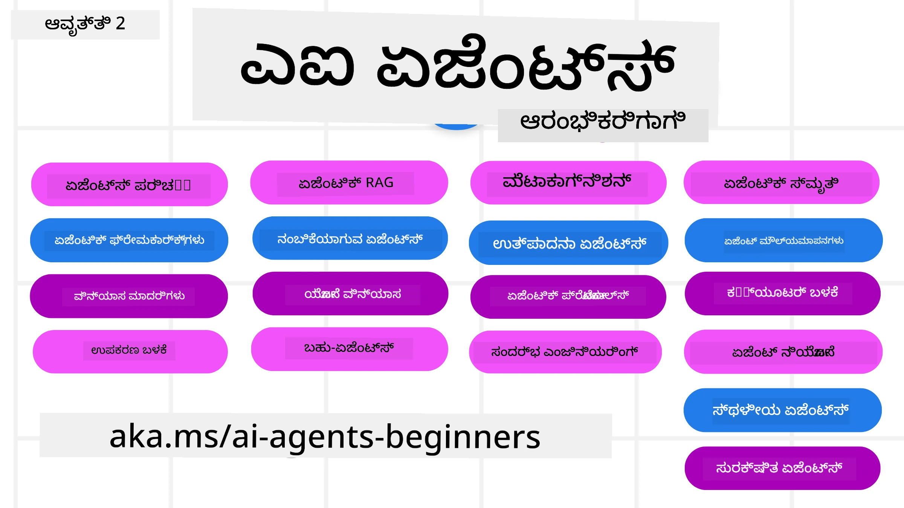

# ಪ್ರಾರಂಭಕರುಗಾಗುವ AI ಏಜೆಂಟ್ಸ್ - ಒಂದು ಕೋರ್ಸ್



## AI ಏಜೆಂಟ್‌ಗಳನ್ನು ನಿರ್ಮಿಸಲು ಪ್ರಾರಂಭಿಸಲು ಅಗತ್ಯವಿರುವ ಎಲ್ಲವನ್ನೂ ಕಲಿಸುವ ಕೋರ್ಸ್

[](https://github.com/microsoft/ai-agents-for-beginners/blob/master/LICENSE?WT.mc_id=academic-105485-koreyst)
[](https://GitHub.com/microsoft/ai-agents-for-beginners/graphs/contributors/?WT.mc_id=academic-105485-koreyst)
[](https://GitHub.com/microsoft/ai-agents-for-beginners/issues/?WT.mc_id=academic-105485-koreyst)
[](https://GitHub.com/microsoft/ai-agents-for-beginners/pulls/?WT.mc_id=academic-105485-koreyst)
[](http://makeapullrequest.com?WT.mc_id=academic-105485-koreyst)

### 🌐 ಬಹುಭಾಷಾ ಬೆಂಬಲ

#### GitHub ಆಕ್ಷನ್ ಮೂಲಕ ಬೆಂಬಲಿಸಲಾಗಿದೆ (ಸ್ವಯಂಚಾಲಿತ & ಸದಾ ನವೀಕೃತ)

<!-- CO-OP TRANSLATOR LANGUAGES TABLE START -->
[Arabic](../ar/README.md) | [Bengali](../bn/README.md) | [Bulgarian](../bg/README.md) | [Burmese (Myanmar)](../my/README.md) | [Chinese (Simplified)](../zh-CN/README.md) | [Chinese (Traditional, Hong Kong)](../zh-HK/README.md) | [Chinese (Traditional, Macau)](../zh-MO/README.md) | [Chinese (Traditional, Taiwan)](../zh-TW/README.md) | [Croatian](../hr/README.md) | [Czech](../cs/README.md) | [Danish](../da/README.md) | [Dutch](../nl/README.md) | [Estonian](../et/README.md) | [Finnish](../fi/README.md) | [French](../fr/README.md) | [German](../de/README.md) | [Greek](../el/README.md) | [Hebrew](../he/README.md) | [Hindi](../hi/README.md) | [Hungarian](../hu/README.md) | [Indonesian](../id/README.md) | [Italian](../it/README.md) | [Japanese](../ja/README.md) | [Kannada](./README.md) | [Khmer](../km/README.md) | [Korean](../ko/README.md) | [Lithuanian](../lt/README.md) | [Malay](../ms/README.md) | [Malayalam](../ml/README.md) | [Marathi](../mr/README.md) | [Nepali](../ne/README.md) | [Nigerian Pidgin](../pcm/README.md) | [Norwegian](../no/README.md) | [Persian (Farsi)](../fa/README.md) | [Polish](../pl/README.md) | [Portuguese (Brazil)](../pt-BR/README.md) | [Portuguese (Portugal)](../pt-PT/README.md) | [Punjabi (Gurmukhi)](../pa/README.md) | [Romanian](../ro/README.md) | [Russian](../ru/README.md) | [Serbian (Cyrillic)](../sr/README.md) | [Slovak](../sk/README.md) | [Slovenian](../sl/README.md) | [Spanish](../es/README.md) | [Swahili](../sw/README.md) | [Swedish](../sv/README.md) | [Tagalog (Filipino)](../tl/README.md) | [Tamil](../ta/README.md) | [Telugu](../te/README.md) | [Thai](../th/README.md) | [Turkish](../tr/README.md) | [Ukrainian](../uk/README.md) | [Urdu](../ur/README.md) | [Vietnamese](../vi/README.md)

> **ಸ್ಥಾನೀಯವಾಗಿ ಕ್ಲೋನ್ ಮಾಡುವುದು ಮೆಚ್ಚುಗೆ?**
>
> ಈ ರೆಪೊ 50+ ಭಾಷಾ ಅನುವಾದಗಳನ್ನು ಒಳಗೊಂಡಿದ್ದು, ಇದು ಡೌನ್ಲೋಡ್ ಗಾತ್ರವನ್ನು ಬಹಳ ಹೆಚ್ಚಿಸುತ್ತದೆ. ಅನುವಾದಗಳಿಲ್ಲದೆ ಕ್ಲೋನ್ ಮಾಡಲು, ಸ್ಪಾರ್ಸ್ ಔಟ್‌ಚೆಕ್ ಬಳಸಿ:
>
> **ಶೆಲ್ / macOS / ಲಿನಕ್ಸ್ನಲ್ಲಿ:**
> ```bash
> git clone --filter=blob:none --sparse https://github.com/microsoft/ai-agents-for-beginners.git
> cd ai-agents-for-beginners
> git sparse-checkout set --no-cone '/*' '!translations' '!translated_images'
> ```
>
> **CMD (ವಿಂಡೋಸ್):**
> ```cmd
> git clone --filter=blob:none --sparse https://github.com/microsoft/ai-agents-for-beginners.git
> cd ai-agents-for-beginners
> git sparse-checkout set --no-cone "/*" "!translations" "!translated_images"
> ```
>
> ಇದು ನಿಮಗೆ ಕೋರ್ಸ್ ಪೂರ್ಣಗೊಳಿಸಲು ಬೇಕಾಗಿರುವ ಎಲ್ಲವನ್ನೂ ಬಹಳ ವೇಗವಾದ ಡೌನ್ಲೋಡ್ ಜೊತೆಗೆ ನೀಡುತ್ತದೆ.
<!-- CO-OP TRANSLATOR LANGUAGES TABLE END -->

**ನೀವು ಹೆಚ್ಚಿನ ಅನುವಾದ ಭಾಷೆಗಳ ಬೆಂಬಲವನ್ನು ಬಯಸಿದರೆ, ಅವು [ಇಲ್ಲಿ](https://github.com/Azure/co-op-translator/blob/main/getting_started/supported-languages.md) ಪಟ್ಟಿ ಮಾಡಲಾಗಿದೆ.**

[](https://GitHub.com/microsoft/ai-agents-for-beginners/watchers/?WT.mc_id=academic-105485-koreyst)
[](https://GitHub.com/microsoft/ai-agents-for-beginners/network/?WT.mc_id=academic-105485-koreyst)
[](https://GitHub.com/microsoft/ai-agents-for-beginners/stargazers/?WT.mc_id=academic-105485-koreyst)

[](https://discord.com/invite/ATgtXmAS5D)


## 🌱 ಪ್ರಾರಂಭಿಸೋಣ

ಈ ಕೋರ್ಸ್ AI ಏಜೆಂಟ್‌ಗಳನ್ನು ನಿರ್ಮಿಸಲು ಮೂಲಭೂತತತ್ತ್ವಗಳನ್ನು ಒಳಗೊಂಡ ಪಾಠಗಳನ್ನು ಒಳಗೊಂಡಿದೆ. ಪ್ರತಿ ಪಾಠವು ತನ್ನದೇ ವಿಷಯವನ್ನು ಒಳಗೊಂಡಿದೆ ಆದ್ದರಿಂದ ನೀವು ಇಷ್ಟಪಡುವ ಪ್ರಕಾರ ಪ್ರಾರಂಭಿಸಬಹುದು!

ಈ ಕೋರ್ಸ್ಗಾಗಿ ಬಹುಭಾಷಾ ಬೆಂಬಲವಿದೆ. [ಇಲ್ಲಿ ಲಭ್ಯವಿರುವ ಭಾಷೆಗಳ](#-multi-language-support) ಭಾಗಕ್ಕೆ ಹೋಗಿ.

ನೀವು ಮೊದಲ ಬಾರಿಗೆ ಜನರೇಟಿವ್ AI ಮಾದರಿಗಳೊಂದಿಗೆ ನಿರ್ಮಿಸಲಾಗಿದ್ದರೆ, ನಮ್ಮ [ಜನರೇಟಿವ್ AI ಪ್ರಾರಂಭಕರುಗಾಗಿ](https://aka.ms/genai-beginners) ಕೋರ್ಸ್ ನೋಡಿ, ಇದು GenAI ಜೊತೆ ನಿರ್ಮಾಣ ಕುರಿತು 21 ಪಾಠಗಳನ್ನು ಒಳಗೊಂಡಿದೆ.

ಈ ರೆಪೊಗೆ [ಸ್ಟಾರ್ (🌟)ಮಾಡುವುದು](https://docs.github.com/en/get-started/exploring-projects-on-github/saving-repositories-with-stars?WT.mc_id=academic-105485-koreyst) ಮತ್ತು [ಫೋರ್ಕ್ ಮಾಡುವುದು](https://github.com/microsoft/ai-agents-for-beginners/fork) ಮರೆಯಬೇಡಿ.

### ಇತರ ಕಲಿಕೆದಾರರನ್ನು ಭೇಟಿ ಮಾಡಿ, ನಿಮ್ಮ ಪ್ರಶ್ನೆಗಳಿಗೆ ಉತ್ತರ ಪಡೆದುಕೊಳ್ಳಿ

ನೀವು ಅಡಚಣೆಯಾಗಿದೆಯೇ ಅಥವಾ AI ಏಜೆಂಟ್‌ಗಳ ನಿರ್ಮಾಣ ಕುರಿತ ಯಾವುದೇ ಪ್ರಶ್ನೆಗಳಿದ್ದರೆ, ನಮ್ಮ [Microsoft Foundry Discord](https://aka.ms/ai-agents/discord)ನ ನಿಷ್ಠುರ ಚಾನಲ್‌ಗೆ ಸೇರಿ.

### ನಿಮಗೆ ಬೇಕಾಗಿರುವುದು

ಈ ಕೋರ್ಸ್‌ನ ಪ್ರತಿ ಪಾಠದಲ್ಲಿ ಕೋಡ್ ಉದಾಹರಣೆಗಳಿವೆ, ಅವುಗಳನ್ನು code_samples ಫೋಲ್ಡರ್‌ನಲ್ಲಿ ಕಾಣಬಹುದು. ನಿಮ್ಮದೇ ಪ್ರತಿಯನ್ನು ರಚಿಸಲು ನೀವು [ಈ ರೆಪೊವನ್ನು ಫೋರ್ಕ್ ಮಾಡಬಹುದು](https://github.com/microsoft/ai-agents-for-beginners/fork).

ಈ ವ್ಯಾಯಾಮಗಳಲ್ಲಿನ ಕೋಡ್ ಉದಾಹರಣೆಗಳು Microsoft Agent Framework ಮತ್ತು Microsoft Foundry Agent Service V2 ಅನ್ನು ಬಳಸುತ್ತವೆ:

- [Microsoft Foundry](https://aka.ms/ai-agents-beginners/ai-foundry) - ಆಜುರ್ ಖಾತೆ ಬೇಕು

ಈ ಕೋರ್ಸ್ Microsoft ನ ಕೆಳಗಿನ AI ಏಜೆಂಟ್ ಫ್ರೇಮ್ವರ್ಕ್‌ಗಳು ಮತ್ತು ಸೇವೆಗಳನ್ನು ಬಳಸುತ್ತದೆ:

- [Microsoft Agent Framework (MAF)](https://aka.ms/ai-agents-beginners/agent-framework)
- [Microsoft Foundry Agent Service V2](https://aka.ms/ai-agents-beginners/ai-agent-service)

ಕೆಲವು ಕೋಡ್ ಉದಾಹರಣೆಗಳು ಹೆಚ್ಚುವರಿ OpenAI-ಸೌಖ್ಯತೆಯ ಪೂರೈಕೆದಾರರನ್ನು ಸಹ ಬೆಂಬಲಿಸುತ್ತವೆ, ಉದಾ: [MiniMax](https://platform.minimaxi.com/), ಇದು ದೊಡ್ಡ-ಪರಿಸರವಿರುವ ಮಾದರಿಗಳನ್ನು (೨೦೪ ಕೆ ಟೋಕನ್‌ಗಳವರೆಗೆ) ನೀಡುತ್ತದೆ. ವಿಸ্তারিত ಅನುಸ್ಥಾಪನೆಗಾಗಿ [ಕೋರ್ಸ್ ಸೆಟಪ್](./00-course-setup/README.md) ನೋಡಿ.

ಈ ಕೋರ್ಸ್ ಪರಿಷ್ಕರಣೆಗೆ ಕೋಡ್ ಓಡುವ ಬಗ್ಗೆ ಹೆಚ್ಚಿನ ಮಾಹಿತಿಗಾಗಿ [ಕೋರ್ಸ್ ಸೆಟಪ್](./00-course-setup/README.md) ಕಡೆಗೆ ಹೋಗಿ.

## 🙏 ಸಹಾಯ ಬೇಕಾ?

ನಿಮ್ಮ ಬಳಿ ಸಲಹೆಗಳು ಇದ್ದರೆ ಅಥವಾ ವಚನ ಅಥವಾ ಕೋಡ್ ದೋಷಗಳನ್ನು ಕಂಡುಹಿಡಿದಿದ್ದರೆ, [ಇಶ್ಯೂ ಮೇಳಿಸಿ](https://github.com/microsoft/ai-agents-for-beginners/issues?WT.mc_id=academic-105485-koreyst) ಅಥವಾ [ಪಲ್ಲ್ ರಿಕ್ವೆಸ್ಟ್ ಮಾಡಿ](https://github.com/microsoft/ai-agents-for-beginners/pulls?WT.mc_id=academic-105485-koreyst)


## 📂 ಪ್ರತಿ ಪಾಠದಲ್ಲಿ ಇವೆ

- README ಅಲ್ಲಿ ಬರಹದ ಪಾಠ ಮತ್ತು ಒಂದು ಸಂಕ್ಷಿಪ್ತ ವೀಡಿಯೊ
- Microsoft Agent Framework ಮತ್ತು Microsoft Foundry ಬಳಸಿ Python ಕೋಡ್ ಉದಾಹರಣೆಗಳು
- ನಿಮ್ಮ ಕಲಿಕೆಯನ್ನು ಮುಂದುವರಿಸಲು ಹೆಚ್ಚುವರಿ ಸಂಪನ್ಮೂಲಗಳ ಲಿಂಕ್‌ಗಳು


## 🗃️ ಪಾಠಗಳು

| **ಪಾಠ**                                   | **ಪಠ್ಯ & ಕೋಡ್**                                    | **ವೀಡಿಯೊ**                                                  | **ಹೆಚ್ಚಿನ ಕಲಿಕೆ**                                                                     |
|----------------------------------------------|----------------------------------------------------|------------------------------------------------------------|----------------------------------------------------------------------------------------|
| AI ಏಜೆಂಟ್‌ಗಳ ಪರಿಚಯ ಮತ್ತು ಏಜೆಂಟ್ ಉಪಯೋಗದ ಪ್ರಕರಣಗಳು       | [ಲಿಂಕ್](./01-intro-to-ai-agents/README.md)          | [ವೀಡಿಯೊ](https://youtu.be/3zgm60bXmQk?si=z8QygFvYQv-9WtO1)  | [ಲಿಂಕ್](https://aka.ms/ai-agents-beginners/collection?WT.mc_id=academic-105485-koreyst) |
| AI ಏಜೆಂಟ್ ಫ್ರೇಮ್ವರ್ಕ್‌ಗಳ ಅನ್ವೇಷಣೆ              | [ಲಿಂಕ್](./02-explore-agentic-frameworks/README.md)  | [ವೀಡಿಯೊ](https://youtu.be/ODwF-EZo_O8?si=Vawth4hzVaHv-u0H)  | [ಲಿಂಕ್](https://aka.ms/ai-agents-beginners/collection?WT.mc_id=academic-105485-koreyst) |
| AI ಏಜೆಂಟ್ ವಿನ್ಯಾಸ ಮಾದರಿಗಳನ್ನು ಅರ್ಥಮಾಡಿಕೊಳ್ಳುವುದು     | [ಲಿಂಕ್](./03-agentic-design-patterns/README.md)     | [ವೀಡಿಯೊ](https://youtu.be/m9lM8qqoOEA?si=BIzHwzstTPL8o9GF)  | [ಲಿಂಕ್](https://aka.ms/ai-agents-beginners/collection?WT.mc_id=academic-105485-koreyst) |
| ಟೂಲ್ ಬಳಕೆ ವಿನ್ಯಾಸ ಮಾದರಿ                      | [ಲಿಂಕ್](./04-tool-use/README.md)                    | [ವೀಡಿಯೊ](https://youtu.be/vieRiPRx-gI?si=2z6O2Xu2cu_Jz46N)  | [ಲಿಂಕ್](https://aka.ms/ai-agents-beginners/collection?WT.mc_id=academic-105485-koreyst) |
| ಏಜೆಂಟಿಕ್ RAG                                  | [ಲಿಂಕ್](./05-agentic-rag/README.md)                 | [ವೀಡಿಯೊ](https://youtu.be/WcjAARvdL7I?si=gKPWsQpKiIlDH9A3)  | [ಲಿಂಕ್](https://aka.ms/ai-agents-beginners/collection?WT.mc_id=academic-105485-koreyst) |
| ನಂಬೋ ಯೋಗ್ಯ AI ಏಜೆಂಟ್ ನಿರ್ಮಿಸುವುದು               | [ಲಿಂಕ್](./06-building-trustworthy-agents/README.md) | [ವೀಡಿಯೊ](https://youtu.be/iZKkMEGBCUQ?si=jZjpiMnGFOE9L8OK ) | [ಲಿಂಕ್](https://aka.ms/ai-agents-beginners/collection?WT.mc_id=academic-105485-koreyst) |
| ಯೋಜನೆ ವಿನ್ಯಾಸ ಮಾದರಿ                      | [ಲಿಂಕ್](./07-planning-design/README.md)             | [ವೀಡಿಯೊ](https://youtu.be/kPfJ2BrBCMY?si=6SC_iv_E5-mzucnC)  | [ಲಿಂಕ್](https://aka.ms/ai-agents-beginners/collection?WT.mc_id=academic-105485-koreyst) |
| ಬಹು ಏಜೆಂಟ್ ವಿನ್ಯಾಸ ಮಾದರಿ                   | [ಲಿಂಕ್](./08-multi-agent/README.md)                 | [ವೀಡಿಯೊ](https://youtu.be/V6HpE9hZEx0?si=rMgDhEu7wXo2uo6g)  | [ಲಿಂಕ್](https://aka.ms/ai-agents-beginners/collection?WT.mc_id=academic-105485-koreyst) |

| ಮೆಟಾಕಾಗ್ನಿಷನ್ ವಿನ್ಯಾಸ ಮಾದರಿ                 | [ಲಿಂಕ್](./09-metacognition/README.md)               | [ವಿಡಿಯೋ](https://youtu.be/His9R6gw6Ec?si=8gck6vvdSNCt6OcF)  | [ಲಿಂಕ್](https://aka.ms/ai-agents-beginners/collection?WT.mc_id=academic-105485-koreyst) |
| ಉತ್ಪಾದನೆಯಲ್ಲಿ AI ಏಜೆಂಟ್ಸ್                      | [ಲಿಂಕ್](./10-ai-agents-production/README.md)        | [ವಿಡಿಯೋ](https://youtu.be/l4TP6IyJxmQ?si=31dnhexRo6yLRJDl)  | [ಲಿಂಕ್](https://aka.ms/ai-agents-beginners/collection?WT.mc_id=academic-105485-koreyst) |
| ಏಜೆಂಟಿಕ್ ಪ್ರೋಟೋಕಾಲ್‌ಗಳ ಬಳಕೆ (MCP, A2A ಮತ್ತು NLWeb) | [ಲಿಂಕ್](./11-agentic-protocols/README.md)           | [ವಿಡಿಯೋ](https://youtu.be/X-Dh9R3Opn8)                                 | [ಲಿಂಕ್](https://aka.ms/ai-agents-beginners/collection?WT.mc_id=academic-105485-koreyst) |
| AI ಏಜೆಂಟ್ಸ್ಗಾಗಿ ಸಾಂದರ್ಭಿಕ ಇಂಜಿನಿಯರಿಂಗ್            | [ಲಿಂಕ್](./12-context-engineering/README.md)         | [ವಿಡಿಯೋ](https://youtu.be/F5zqRV7gEag)                                 | [ಲಿಂಕ್](https://aka.ms/ai-agents-beginners/collection?WT.mc_id=academic-105485-koreyst) |
| ಏಜೆಂಟಿಕ್ ಸ್ಮೃತಿ ನಿರ್ವಹಣೆ                      | [ಲಿಂಕ್](./13-agent-memory/README.md)     |      [ವಿಡಿಯೋ](https://youtu.be/QrYbHesIxpw?si=vZkVwKrQ4ieCcIPx)                                                      |                                                                                        |
| ಮೈಕ್ರೋಸಾಫ್ಟ್ ಏಜಂಟ್ ಫ್ರೇಮ್ವರ್ಕ್ ಅನ್ವೇಷಣೆ                         | [ಲಿಂಕ್](./14-microsoft-agent-framework/README.md)                            |                                                            |                                                                                        |
| ಕಂಪ್ಯೂಟರ್ ಬಳಕೆ ಏಜೆಂಟ್ಸ್ ನಿರ್ಮಿಸುವುದು (CUA)           | [ಲಿಂಕ್](./15-browser-use/README.md)     |                                                            | [ಲಿಂಕ್](https://docs.browser-use.com/examples/templates/playwright-integration)         |
| ಮಾಪನಕಾರಿಯಾಗಿ ಏಜೆಂಟ್ಸ್ ನಿಯೋಜನೆ                    | ಸೀಘ್ರದಲ್ಲೇ ಬರುತ್ತಿದೆ                            |                                                            |                                                                                        |
| ಸ್ಥಳೀಯ AI ಏಜೆಂಟ್ಸ್ ರಚನೆ                     | ಸೀಘ್ರದಲ್ಲೇ ಬರುತ್ತಿದೆ                               |                                                            |                                                                                        |
| AI ಏಜೆಂಟ್‌ಗಳನ್ನು ಸುರಕ್ಷಿತಗೊಳಿಸುವುದು                           | [ಲಿಂಕ್](./18-securing-ai-agents/README.md)  |                                                            | [ಲಿಂಕ್](https://aka.ms/ai-agents-beginners/collection?WT.mc_id=academic-105485-koreyst) |

## 🎒 ಇತರೆ ಕೋರ್ಸುಗಳು

ನಮ್ಮ ತಂಡ ಇತರೆ ಕೋರ್ಸುಗಳನ್ನು ಉತ್ಪಾದಿಸುತ್ತದೆ! ಪರಿಶೀಲಿಸಿ:

<!-- CO-OP TRANSLATOR OTHER COURSES START -->
### ಲಾಂಗ್‌ಚೇನ್
[](https://aka.ms/langchain4j-for-beginners)
[](https://aka.ms/langchainjs-for-beginners?WT.mc_id=m365-94501-dwahlin)
[](https://github.com/microsoft/langchain-for-beginners?WT.mc_id=m365-94501-dwahlin)
---

### ಅಜ್ಯುರ್ / ಎಡ್ಜ್ / MCP / ಏಜೆಂಟ್ಸ್
[](https://github.com/microsoft/AZD-for-beginners?WT.mc_id=academic-105485-koreyst)
[](https://github.com/microsoft/edgeai-for-beginners?WT.mc_id=academic-105485-koreyst)
[](https://github.com/microsoft/mcp-for-beginners?WT.mc_id=academic-105485-koreyst)
[](https://github.com/microsoft/ai-agents-for-beginners?WT.mc_id=academic-105485-koreyst)

---
 
### ಉತ್ಪಾದಕ AI ಸರಣಿಗಳು
[](https://github.com/microsoft/generative-ai-for-beginners?WT.mc_id=academic-105485-koreyst)
[-9333EA?style=for-the-badge&labelColor=E5E7EB&color=9333EA)](https://github.com/microsoft/Generative-AI-for-beginners-dotnet?WT.mc_id=academic-105485-koreyst)
[-C084FC?style=for-the-badge&labelColor=E5E7EB&color=C084FC)](https://github.com/microsoft/generative-ai-for-beginners-java?WT.mc_id=academic-105485-koreyst)

[-E879F9?style=for-the-badge&labelColor=E5E7EB&color=E879F9)](https://github.com/microsoft/generative-ai-with-javascript?WT.mc_id=academic-105485-koreyst)

---
 
### ಮೂಲ ಅಧ್ಯಯನ  
[](https://aka.ms/ml-beginners?WT.mc_id=academic-105485-koreyst)
[](https://aka.ms/datascience-beginners?WT.mc_id=academic-105485-koreyst)
[](https://aka.ms/ai-beginners?WT.mc_id=academic-105485-koreyst)
[](https://github.com/microsoft/Security-101?WT.mc_id=academic-96948-sayoung)
[](https://aka.ms/webdev-beginners?WT.mc_id=academic-105485-koreyst)
[](https://aka.ms/iot-beginners?WT.mc_id=academic-105485-koreyst)
[](https://github.com/microsoft/xr-development-for-beginners?WT.mc_id=academic-105485-koreyst)

---
 
### ಕೋಪೈಲಟ್ ಸರಣಿ
[](https://aka.ms/GitHubCopilotAI?WT.mc_id=academic-105485-koreyst)
[](https://github.com/microsoft/mastering-github-copilot-for-dotnet-csharp-developers?WT.mc_id=academic-105485-koreyst)
[](https://github.com/microsoft/CopilotAdventures?WT.mc_id=academic-105485-koreyst)
<!-- CO-OP TRANSLATOR OTHER COURSES END -->

## 🌟 ಸಮುದಾಯದ ಧನ್ಯವಾದಗಳು

Agentic RAG ಅನ್ನು ತೋರಿಸುವ ಪ್ರಮುಖ ಕೋಡ್ ಉದಾಹರಣೆಗಳಿಗಾಗಿ [ಶಿವಮ್ ಗೋಯಲ್](https://www.linkedin.com/in/shivam2003/) ಅವರಿಗೆ ಧನ್ಯವಾದಗಳು. 

## ಕೊಡುಗೆ ನೀಡುವುದು

ಈ ಯೋಜನೆ ಕೊಡುಗೆ ಮತ್ತು ಸಲಹೆಗಳನ್ನು ಸ್ವಾಗತಿಸುತ್ತದೆ. ಬಹುತೇಕ ಕೊಡುಗೆಗಳಿಗೆ ನೀವು ಒಪ್ಪಿಕೊಳ್ಳಬೇಕಾಗುತ್ತದೆ
ಕೊಡುಗೆಯ ಹಕ್ಕುಗಳನ್ನು ನಮಗೆ ನೀಡುವ ಹಕ್ಕು ಹೊಂದಿದ್ದೀರಿ ಮತ್ತು ನಿಜವಾಗಿಯೂ ನೀಡಿರುತ್ತೀರಿ ಎಂದು ಘೋಷಿಸುವ
ಕೊಡುಗೆದಾರರ ಪರವಾನಿಗೆ ಒಪ್ಪಂದ (CLA). ವಿವರಗಳಿಗೆ <https://cla.opensource.microsoft.com> ಭೇಟಿ ನೀಡಿ.

ನೀವು ಪುಲ್ ರಿಕ್ವೆಸ್ಟ್ ಸಲ್ಲಿಸುವಾಗ, CLA ಬಾಟ್ ಸ್ವಯಂಚಾಲಿತವಾಗಿ ನಿಮಗೆ CLA ಅನ್ನು ನೀಡಿ
PR ಅನ್ನು ಸೂಕ್ತವಾಗಿ ಅಲಂಕೃತಗೊಳಿಸುವುದು (ಹಾಗು ಸ್ಥಿತಿವಿಚಾರಣೆ, ಕಾಮೆಂಟ್). ಬಾಟ್ನ ಸೂಚನೆಗಳನ್ನು ಅನುಸರಿಸಿ.
ಈ ಪ್ರಕ್ರಿಯೆಯನ್ನು ನಮ್ಮ CLA ಬಳಸುವ ಎಲ್ಲ ರೆಪೋಗಳಲ್ಲಿ ನಿಮಗೆ ಒಮ್ಮೆ ಮಾತ್ರ ಮಾಡಬೇಕು.

ಈ ಯೋಜನೆಯಲ್ಲಿ [ಮೈಕ್ರೋಸಾಫ್ಟ್ ಓಪನ್ ಸೋರ್ಸ್ ಕೋಡ್ ಆಫ್ ಕನಡಕ್ಟ್](https://opensource.microsoft.com/codeofconduct/) ಅಳವಡಿಸಲಾಗಿದೆ.
ಹೆಚ್ಚಿನ ಮಾಹಿತಿಗೆ [ಕೋಡ್ ಆಫ್ ಕನಡಕ್ಟ್ FAQ](https://opensource.microsoft.com/codeofconduct/faq/) ನೋಡಿ ಅಥವಾ
ಹೆಚ್ಚಿನ ಪ್ರಶ್ನೆಗಳಿಗಾಗಿ ಅಥವಾ ಪ್ರತಿಕ್ರಿಯೆಗಾಗಿ [opencode@microsoft.com](mailto:opencode@microsoft.com) ಸಂಪರ್ಕಿಸಿ.

## ಟ್ರೇಡ್‌ಮಾರ್ಕ್‌ಗಳು

ಈ ಯೋಜನೆಯಲ್ಲಿ ಪ್ರಾಜೆಕ್ಟ್‌ಗಳು, ಉತ್ಪನ್ನಗಳು ಅಥವಾ ಸೇವೆಗಳಿಗೆ ಸಂಬಂಧಿಸಿದ ಟ್ರೇಡ್‌ಮಾರ್ಕ್‌ಗಳು ಅಥವಾ ಲೋಗೋಗಳು ಇರಬಹುದು. 
ಮೈಕ್ರೋಸಾಫ್ಟ್ ಟ್ರೇಡ್‌ಮಾರ್ಕ್‌ಗಳು ಅಥವಾ ಲೋಗೋಗಳ ಅನುಮೋದಿತ ಬಳಕೆಕ್ಕೆ
[ಮೈಕ್ರೋಸಾಫ್ಟ್ ಟ್ರೇಡ್‌ಮಾರ್ಕ್ & ಬ್ರ್ಯಾಂಡ್ ಮಾರ್ಗಸೂಚಿಗಳು](https://www.microsoft.com/legal/intellectualproperty/trademarks/usage/general) ಅನುಸರಿಸಬೇಕು.
ಈ ಯೋಜನೆಯ ಪರಿಷ್ಕೃತ ಆವೃತ್ತಿಗಳಲ್ಲಿ ಮೈಕ್ರೋಸಾಫ್ಟ್ ಟ್ರೇಡ್‌ಮಾರ್ಕ್‌ಗಳು ಅಥವಾ ಲೋಗೋಗಳ ಬಳಕೆ ಮೈಕ್ರೋಸಾಫ್ಟ್ ಪ್ರಾಯೋಜನೆಯನ್ನು ತಪ್ಪಾಗಿ ಸೂಚಿಸಬಾರದು.
ಮೂರನೇ ಪಕ್ಷದ ಟ್ರೇಡ್‌ಮಾರ್ಕ್‌ಗಳು ಅಥವಾ ಲೋಗೋಗಳ ಯಾವುದೇ ಬಳಕೆ ಆ ಪಕ್ಷಗಳ ನೀತಿಗಳಿಗೆ ಅಡಿಪಾಯವಾಗಿರುತ್ತದೆ.

## ಸಹಾಯ ಪಡೆಯುವುದು


ನಿಮ್ಮಲ್ಲಿ ಯಾವುದೇ ಸಮಸ್ಯೆಯಿದ್ದರೆ ಅಥವಾ AI ಆ್ಯಪ್‌ಗಳನ್ನು ನಿರ್ಮಿಸುವ ಬಗ್ಗೆ ಪ್ರಶ್ನೆಗಳಿದ್ದರೆ, ಸೇರಿ:

[](https://aka.ms/foundry/discord)

ಉತ್ಪನ್ನ ಪ್ರತಿಕ್ರಿಯೆ ಅಥವಾ ನಿರ್ಮಾಣದ ವೇಳೆ ದೋಷಗಳಿದ್ದರೆ ಭೇಟಿನೀಡಿ:

[](https://aka.ms/foundry/forum)

---

<!-- CO-OP TRANSLATOR DISCLAIMER START -->
**ಅಸ್ವೀಕಾರ**:
ಈ ದಸ್ತಾವೇಜು AI ಅನುವಾದ ಸೇವೆ [Co-op Translator](https://github.com/Azure/co-op-translator) ಬಳಸಿ ಅನುವಾದಿಸಲಾಗಿದೆ. ನಾವು ನಿಖರತೆಯನ್ನು ಸಾಧಿಸಲು ಪ್ರಯತ್ನಿಸುತ್ತಿದ್ದರೂ, ದಯವಿಟ್ಟು ಗಮನಿಸಿ, ಸ್ವಯಂಚಾಲಿತ ಅನುವಾದಗಳಲ್ಲಿ ದೋಷಗಳು ಅಥವಾ ಅಸಡ್ಡೆಗಳು ಇರಬಹುದು. ಮೂಲ ಭಾಷೆಯಲ್ಲಿರುವ ಮೂಲ ದಸ್ತಾವೇಜು ಪ್ರಾಮಾಣಿಕ ಮೂಲವೆಂದು ಪರಿಗಣಿಸಬೇಕು. ಪ್ರಮುಖ ಮಾಹಿತಿಗಾಗಿ, ವೃತ್ತಿಪರ ಮಾನವ ಅನುವಾದವನ್ನು ಶಿಫಾರಸು ಮಾಡಲಾಗುತ್ತದೆ. ಈ ಅನುವಾದವನ್ನು ಬಳಸುವ ಮೂಲಕ ಉಂಟಾಗುವ ಯಾವುದೇ ತಪ್ಪು ಅರ್ಥಗಳ ಅಥವಾ ತಪ್ಪು ವ್ಯಾಖ್ಯಾನಗಳ ಬಗ್ಗೆ ನಾವು ಹೊಣೆಗಾರರಲ್ಲ.
<!-- CO-OP TRANSLATOR DISCLAIMER END -->