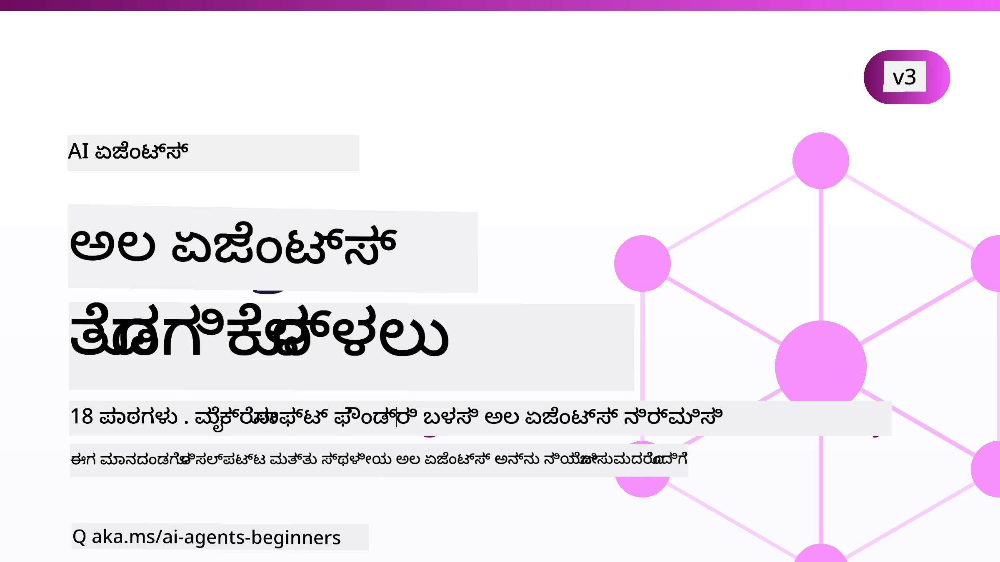

# ಪ್ರಾರಂಭಿಕರಿಗೆ AI ಏಜೆಂಟ್ಸ್ - ಒಂದು ಕೋರ್ಸ್



## AI ಏಜೆಂಟ್ಸ್ ನಿರ್ಮಿಸಲು ಆಗಲೇ ತಿಳಿಯಬೇಕಾದ ಎಲ್ಲವನ್ನೂ ಓದಲು ಕಲಿಸುವ ಕೋರ್ಸ್

[](https://github.com/microsoft/ai-agents-for-beginners/blob/master/LICENSE?WT.mc_id=academic-105485-koreyst)
[](https://GitHub.com/microsoft/ai-agents-for-beginners/graphs/contributors/?WT.mc_id=academic-105485-koreyst)
[](https://GitHub.com/microsoft/ai-agents-for-beginners/issues/?WT.mc_id=academic-105485-koreyst)
[](https://GitHub.com/microsoft/ai-agents-for-beginners/pulls/?WT.mc_id=academic-105485-koreyst)
[](http://makeapullrequest.com?WT.mc_id=academic-105485-koreyst)

### 🌐 ಬಹುಭಾಷಾ ಬೆಂಬಲ

#### GitHub ಕ್ರಿಯೆಯಿಂದ ಬೆಂಬಲಿಸಲ್ಪಡುತ್ತದೆ (ಸ್ವಯಂಚಾಲಿತ ಮತ್ತು ಸದಾ ನವೀಕರಣ)

<!-- CO-OP TRANSLATOR LANGUAGES TABLE START -->
[Arabic](../ar/README.md) | [Bengali](../bn/README.md) | [Bulgarian](../bg/README.md) | [Burmese (Myanmar)](../my/README.md) | [Chinese (Simplified)](../zh-CN/README.md) | [Chinese (Traditional, Hong Kong)](../zh-HK/README.md) | [Chinese (Traditional, Macau)](../zh-MO/README.md) | [Chinese (Traditional, Taiwan)](../zh-TW/README.md) | [Croatian](../hr/README.md) | [Czech](../cs/README.md) | [Danish](../da/README.md) | [Dutch](../nl/README.md) | [Estonian](../et/README.md) | [Finnish](../fi/README.md) | [French](../fr/README.md) | [German](../de/README.md) | [Greek](../el/README.md) | [Hebrew](../he/README.md) | [Hindi](../hi/README.md) | [Hungarian](../hu/README.md) | [Indonesian](../id/README.md) | [Italian](../it/README.md) | [Japanese](../ja/README.md) | [Kannada](./README.md) | [Khmer](../km/README.md) | [Korean](../ko/README.md) | [Lithuanian](../lt/README.md) | [Malay](../ms/README.md) | [Malayalam](../ml/README.md) | [Marathi](../mr/README.md) | [Nepali](../ne/README.md) | [Nigerian Pidgin](../pcm/README.md) | [Norwegian](../no/README.md) | [Persian (Farsi)](../fa/README.md) | [Polish](../pl/README.md) | [Portuguese (Brazil)](../pt-BR/README.md) | [Portuguese (Portugal)](../pt-PT/README.md) | [Punjabi (Gurmukhi)](../pa/README.md) | [Romanian](../ro/README.md) | [Russian](../ru/README.md) | [Serbian (Cyrillic)](../sr/README.md) | [Slovak](../sk/README.md) | [Slovenian](../sl/README.md) | [Spanish](../es/README.md) | [Swahili](../sw/README.md) | [Swedish](../sv/README.md) | [Tagalog (Filipino)](../tl/README.md) | [Tamil](../ta/README.md) | [Telugu](../te/README.md) | [Thai](../th/README.md) | [Turkish](../tr/README.md) | [Ukrainian](../uk/README.md) | [Urdu](../ur/README.md) | [Vietnamese](../vi/README.md)

> **ಸ್ಥಳೀಯವಾಗಿ ಕ್ಲೋನ್ ಮಾಡಲು ಇಷ್ಟವಿದೆಯೇ?**
>
> ಈ ರೆಪೊದಲ್ಲಿ 50 ಕ್ಕಿಂತ ಹೆಚ್ಚು ಭಾಷಾ ಅನುವಾದಗಳಿವೆ, ಅದು ಡೌನ್‌ಲೋಡ್ ಗಾತ್ರವನ್ನು ಹೆಚ್ಚಿಸುತ್ತದೆ. ಅನುವಾದಗಳಿಲ್ಲದೆ ಕ್ಲೋನ್ ಮಾಡಲು, ಸ್ಪಾರ್ಸ್ ಚೆಕೌಟ್ ಬಳಸಿ:
>
> **Bash / macOS / Linux:**
> ```bash
> git clone --filter=blob:none --sparse https://github.com/microsoft/ai-agents-for-beginners.git
> cd ai-agents-for-beginners
> git sparse-checkout set --no-cone '/*' '!translations' '!translated_images'
> ```
>
> **CMD (Windows):**
> ```cmd
> git clone --filter=blob:none --sparse https://github.com/microsoft/ai-agents-for-beginners.git
> cd ai-agents-for-beginners
> git sparse-checkout set --no-cone "/*" "!translations" "!translated_images"
> ```
>
> ಇದು ಕೋರ್ಸ್ ಪೂರ್ಣಗೊಳಿಸಲು ಬೇಕಾದ ಎಲ್ಲಾ ವಿಷಯಗಳನ್ನು ಕಡಿಮೆ ಸಮಯದಲ್ಲಿ ಡೌನ್‌ಲೋಡ್ ಮಾಡಲು ಸಹಾಯ ಮಾಡುತ್ತದೆ.
<!-- CO-OP TRANSLATOR LANGUAGES TABLE END -->

**ನೀವು ಹೆಚ್ಚುವರಿ ಅನುವಾದ ಭಾಷೆಗಳ ಬೆಂಬಲವನ್ನು ಇಚ್ಛಿಸುತ್ತಿದ್ದರೆ, ಅವುಗಳನ್ನು ಇಲ್ಲಿ ಪಟ್ಟಿಮಾಡಲಾಗಿದೆ [here](https://github.com/Azure/co-op-translator/blob/main/getting_started/supported-languages.md).**

[](https://GitHub.com/microsoft/ai-agents-for-beginners/watchers/?WT.mc_id=academic-105485-koreyst)
[](https://GitHub.com/microsoft/ai-agents-for-beginners/network/?WT.mc_id=academic-105485-koreyst)
[](https://GitHub.com/microsoft/ai-agents-for-beginners/stargazers/?WT.mc_id=academic-105485-koreyst)

[](https://discord.com/invite/ATgtXmAS5D)


## 🌱 ಪ್ರಾರಂಭಿಸುವುದು

ಈ ಕೋರ್ಸ್ AI ಏಜೆಂಟ್ಸ್ ನಿರ್ಮಾಣದ ಮೂಲತತ್ತ್ವಗಳನ್ನು ಒಳಗೊಂಡ ಪಾಠಗಳನ್ನು ಹೊಂದಿದೆ. ಪ್ರತಿ ಪಾಠವು ತನ್ನದೇ ವಿಷಯವನ್ನು ಒಳಗೊಂಡಿದೆ, ಆದ್ದರಿಂದ ಇಚ್ಛೆಯಾದಯಾವುದಾದರೂ ಪ್ರಾರಂಭಿಸಿ!

ಈ ಕೋರ್ಸ್ ಬಹುಭಾಷಾ ಬೆಂಬಲ ಹೊಂದಿದೆ. ನಮ್ಮ [ಲಭ್ಯವಿರುವ ಭಾಷೆಗಳು ಇಲ್ಲಿ](#-multi-language-support) ಗೆ ಹೋಗಿ.

ನೀವು ಮೊದಲಬಾರಿಗೆ ಜನರೇಟಿವ್ AI ಮಾದರಿಗಳೊಂದಿಗೆ ಕೆಲಸಮಾಡುತ್ತಿದ್ದರೆ, ನಮ್ಮ [ಜನರೇಟಿವ್ AI ಫಾರ್ ಬಗೆನ್ನರ್ಸ್](https://aka.ms/genai-beginners) ಕೋರ್ಸ್ ನೋಡಿ, ಇದರಲ್ಲಿ GenAI ಬಳಸಿ ನಿರ್ಮಿಸಲು 21 ಪಾಠಗಳಿವೆ.

ಈ ರೆಪೊಗೆ [ನಕ್ಷತ್ರ (🌟) ನೀಡಿ](https://docs.github.com/en/get-started/exploring-projects-on-github/saving-repositories-with-stars?WT.mc_id=academic-105485-koreyst) ಮತ್ತು [ಫೋರ್ಕ್ ಮಾಡಿ](https://github.com/microsoft/ai-agents-for-beginners/fork) ಕೋಡ್ ಚಾಲನೆ ಮಾಡಲು ಮರೆಯಬೇಡಿ.

### ಇತರ ಕಲಿಯುವವರನ್ನು ಭೇಟಿಮಾಡಿ, ನಿಮ್ಮ ಪ್ರಶ್ನೆಗಳಿಗೆ ಉತ್ತರ ಪಡೆಯಿರಿ

ನೀವು ಅಟಕಿದರೆ ಅಥವಾ AI ಏಜೆಂಟ್ಸ್ ನಿರ್ಮಿಸುವ ಬಗ್ಗೆ ಯಾವುದೇ ಪ್ರಶ್ನೆಗಳಿದ್ದರೆ, [Microsoft Foundry Discord](https://aka.ms/ai-agents/discord) ನಲ್ಲಿ ನಮ್ಮ ನಿಯೋಜಿತ ಡಿಸ್ಕೋರ್ಡ್ ಚಾನೆಲ್ ಸೇರಿ.

### ನೀವು ಬೇಕಾದದ್ದು

ಈ ಕೋರ್ಸ್‌ನ ಪ್ರತೀ ಪಾಠದಲ್ಲಿ ಕೋಡ್ ಉದಾಹರಣೆಗಳಿವೆ, ಅವುಗಳನ್ನು code_samples ಫೋಲ್ಡರ್‌ನಲ್ಲಿ ಕಾಣಬಹುದು. ನಿಮ್ಮ ಪ್ರತಿ ಪ್ರತಿಯನ್ನು ರಚಿಸಲು ನೀವು [ಈ ರೆಪೊಗೆ ಫೋರ್ಕ್ ಮಾಡಬಹುದು](https://github.com/microsoft/ai-agents-for-beginners/fork).  

ಈ ವ್ಯಾಯಾಮಗಳಲ್ಲಿ ಗೋಚರಿಸುವ ಕೋಡ್ ಉದಾಹರಣೆಗಳು ಮೈಕ್ರೋಸಾಫ್ಟ್ ಏಜೆಂಟ್ ಫ್ರೇಮ್ವರ್ಕ್ ಅನ್ನು ಮೈಕ್ರೋಸಾಫ್ಟ್ ಫೌಂಡ್ರಿ ಏಜೆಂಟ್ ಸೇವೆ V2 ಜೊತೆಗೆ ಬಳಸುತ್ತವೆ:

- [Microsoft Foundry](https://aka.ms/ai-agents-beginners/ai-foundry) - ಆಜೂರ್ ಖಾತೆ ಅಗತ್ಯವಿದೆ

ಈ ಕೋರ್ಸ್ ಮೈಕ್ರೋಸಾಫ್ಟ್‌ನಿಂದ ಕೆಳಗಿನ AI ಏಜೆಂಟ್ ಫ್ರೇಮ್ವರ್ಕ್‌ಗಳು ಮತ್ತು ಸೇವೆಗಳನ್ನು ಬಳಕೆ ಮಾಡುತ್ತದೆ:

- [Microsoft Agent Framework (MAF)](https://learn.microsoft.com/agent-framework/overview/)
- [Microsoft Foundry Agent Service V2](https://aka.ms/ai-agents-beginners/ai-agent-service)

ಕೆಲವು ಕೋಡ್ ಉದಾಹರಣೆಗಳು ಮತ್ತೊಂದು OpenAI ಹೊಂದಾಣಿಕೆಯ ಪೂರೈಕೆದಾರನಾದ [MiniMax](https://platform.minimaxi.com/) ಕೂಡ ಬೆಂಬಲಿಸುತ್ತವೆ, ಇದು ದೊಡ್ಡ ವಿಷಯದ ಮಾದರಿಗಳನ್ನು (204K ಟೋಕನ್ಸ್ ವರೆಗೂ) ಒದಗಿಸುತ್ತದೆ. ಸೆಟ್ಟಿಂಗ್ ವಿವರಗಳಿಗೆ [Course Setup](./00-course-setup/README.md) ನೋಡಿ.

ಈ ಕೋರ್ಸ್‌ಗೆ ಕೋಡ್ ಓಡುವ ಬಗ್ಗೆ ಹೆಚ್ಚಿನ ಮಾಹಿತಿಗೆ, [Course Setup](./00-course-setup/README.md) ಗೆ ಹೋಗಿ.

## 🙏 ಸಹಾಯ ಬೇಕೆ?

ನಿಮಗೆ ಸಲಹೆಗಳು ಇದ್ದರೆ ಅಥವಾ ಶಬ್ದ ಅಥವಾ ಕೋಡ್ ತಪ್ಪುಗಳನ್ನು ಕಂಡುಹೇಳಿದರೆ, [ಇಷ್ಯೂ ಹಾಕಿ](https://github.com/microsoft/ai-agents-for-beginners/issues?WT.mc_id=academic-105485-koreyst) ಅಥವಾ [ಪುಲ್ ರಿಕ್ವೆಸ್ಟ್ ಮಾಡಿ](https://github.com/microsoft/ai-agents-for-beginners/pulls?WT.mc_id=academic-105485-koreyst)


## 📂 ಪ್ರತೀ ಪಾಠವು ಒಳಗೊಂಡಿರುತ್ತದೆ

- READMEನಲ್ಲಿ ಬರೆದ ಪಾಠ ಮತ್ತು ಒಂದು ಚಿಕ್ಕ ವೀಡಿಯೊ
- ಮೈಕ್ರೋಸಾಫ್ಟ್ ಏಜೆಂಟ್ ಫ್ರೇಮ್ವರ್ಕ್ ಮತ್ತು ಮೈಕ್ರೋಸಾಫ್ಟ್ ಫೌಂಡ್ರಿ ಬಳಸಿದ ಪೈಥಾನ್ ಕೋಡ್ ಉದಾಹರಣೆಗಳು
- ನಿಮ್ಮ ಕಲಿಕೆಯನ್ನು ಮುಂದುವರೆಸಲು ಹೆಚ್ಚುವರಿ ಸಂಪನ್ಮೂಲಗಳಿಗೆ ಲಿಂಕ್‌ಗಳು


## 🗃️ ಪಾಠಗಳು

| **ಪಾಠ**                                    | **ಟೆಕ್ಸ್ಟ್ ಮತ್ತು ಕೋಡ್**                                 | **ವೀಡಿಯೊ**                                                  | **ಹೆಚ್ಚಿನ ಕಲಿಕೆ**                                                                     |
|----------------------------------------------|----------------------------------------------------|------------------------------------------------------------|----------------------------------------------------------------------------------------|
| AI ಏಜೆಂಟ್ಸ್ ಮತ್ತು ಏಜೆಂಟ್ ಉಪಯೋಗಗಳ ಪರಿಚಯ    | [ಲಿಂಕ್](./01-intro-to-ai-agents/README.md)          | [ವೀಡಿಯೊ](https://youtu.be/3zgm60bXmQk?si=z8QygFvYQv-9WtO1)  | [ಲಿಂಕ್](https://aka.ms/ai-agents-beginners/collection?WT.mc_id=academic-105485-koreyst) |
| AI ಏಜೆಂಟಿಕ್ ಫ್ರೇಮ್ವರ್ಕ್‌ಗಳನ್ನು ಅನ್ವೇಷಿಸುವುದು | [ಲಿಂಕ್](./02-explore-agentic-frameworks/README.md)  | [ವೀಡಿಯೊ](https://youtu.be/ODwF-EZo_O8?si=Vawth4hzVaHv-u0H)  | [ಲಿಂಕ್](https://aka.ms/ai-agents-beginners/collection?WT.mc_id=academic-105485-koreyst) |
| AI ಏಜೆಂಟಿಕ್ ವಿನ್ಯಾಸ ಮಾದರಿಗಳನ್ನು ಅರ್ಥಮಾಡಿಕೊಳ್ಳುವುದು | [ಲಿಂಕ್](./03-agentic-design-patterns/README.md)     | [ವೀಡಿಯೊ](https://youtu.be/m9lM8qqoOEA?si=BIzHwzstTPL8o9GF)  | [ಲಿಂಕ್](https://aka.ms/ai-agents-beginners/collection?WT.mc_id=academic-105485-koreyst) |
| ಉಪಕರಣ ಬಳಕೆ ವಿನ್ಯಾಸ ಮಾದರಿ                   | [ಲಿಂಕ್](./04-tool-use/README.md)                    | [ವೀಡಿಯೊ](https://youtu.be/vieRiPRx-gI?si=2z6O2Xu2cu_Jz46N)  | [ಲಿಂಕ್](https://aka.ms/ai-agents-beginners/collection?WT.mc_id=academic-105485-koreyst) |
| ಏಜೆಂಟಿಕ್ RAG                              | [ಲಿಂಕ್](./05-agentic-rag/README.md)                 | [ವೀಡಿಯೊ](https://youtu.be/WcjAARvdL7I?si=gKPWsQpKiIlDH9A3)  | [ಲಿಂಕ್](https://aka.ms/ai-agents-beginners/collection?WT.mc_id=academic-105485-koreyst) |
| ನಂಬಿಕೆಯರ್ಹ AI ಏಜೆಂಟ್‌ಗಳ ನಿರ್ಮಾಣ         | [ಲಿಂಕ್](./06-building-trustworthy-agents/README.md) | [ವೀಡಿಯೊ](https://youtu.be/iZKkMEGBCUQ?si=jZjpiMnGFOE9L8OK ) | [ಲಿಂಕ್](https://aka.ms/ai-agents-beginners/collection?WT.mc_id=academic-105485-koreyst) |
| ಯೋಜನೆ ವಿನ್ಯಾಸ ಮಾದರಿ                         | [ಲಿಂಕ್](./07-planning-design/README.md)             | [ವೀಡಿಯೊ](https://youtu.be/kPfJ2BrBCMY?si=6SC_iv_E5-mzucnC)  | [ಲಿಂಕ್](https://aka.ms/ai-agents-beginners/collection?WT.mc_id=academic-105485-koreyst) |
| ಬಹು ಏಜೆಂಟ್ ವಿನ್ಯಾಸ ಮಾದರಿ                   | [ಲಿಂಕ್](./08-multi-agent/README.md)                 | [ವೀಡಿಯೊ](https://youtu.be/V6HpE9hZEx0?si=rMgDhEu7wXo2uo6g)  | [ಲಿಂಕ್](https://aka.ms/ai-agents-beginners/collection?WT.mc_id=academic-105485-koreyst) |

| ಮೆಟಾಕಾಗ್ನಿಷನ್ ವಿನ್ಯಾಸ نمೂನೆ                   | [ಲಿಂಕ್](./09-metacognition/README.md)              | [ವೀಡಿಯೊ](https://youtu.be/His9R6gw6Ec?si=8gck6vvdSNCt6OcF)  | [ಲಿಂಕ್](https://aka.ms/ai-agents-beginners/collection?WT.mc_id=academic-105485-koreyst) |
| ಉತ್ಪಾದನೆಯಲ್ಲಿ AI ಏಜೆಂಟ್ಗಳು                     | [ಲಿಂಕ್](./10-ai-agents-production/README.md)       | [ವೀಡಿಯೊ](https://youtu.be/l4TP6IyJxmQ?si=31dnhexRo6yLRJDl)  | [ಲಿಂಕ್](https://aka.ms/ai-agents-beginners/collection?WT.mc_id=academic-105485-koreyst) |
| ಏಜೆಂಟಿಕ್ ಪ್ರೋಟೋಕಾಲ್‌ಗಳನ್ನು ಬಳಸುವುದು (MCP, A2A ಮತ್ತು NLWeb) | [ಲಿಂಕ್](./11-agentic-protocols/README.md)          | [ವೀಡಿಯೊ](https://youtu.be/X-Dh9R3Opn8)                                 | [ಲಿಂಕ್](https://aka.ms/ai-agents-beginners/collection?WT.mc_id=academic-105485-koreyst) |
| AI ಏಜೆಂಟ್ಗಳಿಗಾಗಿ ಸಂದರ್ಭ ಇಂಜಿನಿಯರಿಂಗ್        | [ಲಿಂಕ್](./12-context-engineering/README.md)        | [ವೀಡಿಯೊ](https://youtu.be/F5zqRV7gEag)                                 | [ಲಿಂಕ್](https://aka.ms/ai-agents-beginners/collection?WT.mc_id=academic-105485-koreyst) |
| ಏಜೆಂಟಿಕ್ ಮೆಮರಿಯನ್ನು ನಿರ್ವಹಿಸುವುದು               | [ಲಿಂಕ್](./13-agent-memory/README.md)     |      [ವೀಡಿಯೊ](https://youtu.be/QrYbHesIxpw?si=vZkVwKrQ4ieCcIPx)                                                      |                                                                                        |
| ಮೈಕ್ರೋಸಾಫ್ಟ್ ಏಜೆಂಟ್ ಫ್ರೆಂವರ್ಕ್ ಅನ್ನು ಅನ್ವೇಷಿಸುವುದು                | [ಲಿಂಕ್](./14-microsoft-agent-framework/README.md)                             |                                                            |                                                                                        |
| ಕಂಪ್ಯೂಟರ್ ಬಳಕೆ ಏಜೆಂಟ್ಗಳನ್ನು ನಿರ್ಮಿಸುವುದು (CUA) | [ಲಿಂಕ್](./15-browser-use/README.md)     |                                                            | [ಲಿಂಕ್](https://docs.browser-use.com/examples/templates/playwright-integration)         |
| ವ್ಯಾಪಕವಾಗಿ ಏಜೆಂಟ್ಗಳನ್ನು ನಿಯೋಜಿಸುವುದು            | [ಲಿಂಕ್](./16-deploying-scalable-agents/README.md) |                                                    | [ಲಿಂಕ್](https://learn.microsoft.com/azure/ai-foundry/agents/overview)                   |
| ಸ್ಥಳೀಯ AI ಏಜೆಂಟ್ಗಳನ್ನು ಸೃಷ್ಟಿಸುವುದು             | [ಲಿಂಕ್](./17-creating-local-ai-agents/README.md)  |                                                    | [ಲಿಂಕ್](https://learn.microsoft.com/azure/ai-foundry/foundry-local/)                    |
| AI ಏಜೆಂಟ್‌ಗಳನ್ನು ಸುರಕ್ಷಿತಗೊಳಿಸುವುದು               | [ಲಿಂಕ್](./18-securing-ai-agents/README.md)  |                                                            | [ಲಿಂಕ್](https://aka.ms/ai-agents-beginners/collection?WT.mc_id=academic-105485-koreyst) |

## 🎒 ಇತರೆ ಕೋರ್ಸುಗಳು

ನಮ್ಮ ತಂಡ ಇತರ ಕೋರ್ಸುಗಳನ್ನು ಉತ್ಪಾದಿಸುತ್ತೇವೆ! ಪರಿಶೀಲಿಸಿ:

<!-- CO-OP TRANSLATOR OTHER COURSES START -->
### ಲ್ಯಾಂಗ್‌ಚೈನ್
[](https://aka.ms/langchain4j-for-beginners)
[](https://aka.ms/langchainjs-for-beginners?WT.mc_id=m365-94501-dwahlin)
[](https://github.com/microsoft/langchain-for-beginners?WT.mc_id=m365-94501-dwahlin)
---

### ಅಜೂರ್ / ಎಡ್ಜ್ / MCP / ಏಜೆಂಟ್ಗಳು
[](https://github.com/microsoft/AZD-for-beginners?WT.mc_id=academic-105485-koreyst)
[](https://github.com/microsoft/edgeai-for-beginners?WT.mc_id=academic-105485-koreyst)
[](https://github.com/microsoft/mcp-for-beginners?WT.mc_id=academic-105485-koreyst)
[](https://github.com/microsoft/ai-agents-for-beginners?WT.mc_id=academic-105485-koreyst)

---
 
### ಜನರೇಟಿವ್ AI ಸರಣಿ
[](https://github.com/microsoft/generative-ai-for-beginners?WT.mc_id=academic-105485-koreyst)
[-9333EA?style=for-the-badge&labelColor=E5E7EB&color=9333EA)](https://github.com/microsoft/Generative-AI-for-beginners-dotnet?WT.mc_id=academic-105485-koreyst)
[-C084FC?style=for-the-badge&labelColor=E5E7EB&color=C084FC)](https://github.com/microsoft/generative-ai-for-beginners-java?WT.mc_id=academic-105485-koreyst)
[-E879F9?style=for-the-badge&labelColor=E5E7EB&color=E879F9)](https://github.com/microsoft/generative-ai-with-javascript?WT.mc_id=academic-105485-koreyst)

---
 
### ಕೋರ್ ಲರ್ನಿಂಗ್
[](https://aka.ms/ml-beginners?WT.mc_id=academic-105485-koreyst)
[](https://aka.ms/datascience-beginners?WT.mc_id=academic-105485-koreyst)
[](https://aka.ms/ai-beginners?WT.mc_id=academic-105485-koreyst)
[](https://github.com/microsoft/Security-101?WT.mc_id=academic-96948-sayoung)
[](https://aka.ms/webdev-beginners?WT.mc_id=academic-105485-koreyst)
[](https://aka.ms/iot-beginners?WT.mc_id=academic-105485-koreyst)
[](https://github.com/microsoft/xr-development-for-beginners?WT.mc_id=academic-105485-koreyst)

---
 
### ಕೋಪೈಲಟ್ ಸರಣಿ
[](https://aka.ms/GitHubCopilotAI?WT.mc_id=academic-105485-koreyst)
[](https://github.com/microsoft/mastering-github-copilot-for-dotnet-csharp-developers?WT.mc_id=academic-105485-koreyst)
[](https://github.com/microsoft/CopilotAdventures?WT.mc_id=academic-105485-koreyst)
<!-- CO-OP TRANSLATOR OTHER COURSES END -->

## 🌟 ಸಮುದಾಯದ ಅಭಿನಂದನೆಗಳು

ಅದ್ಭುತ Agentic RAG ಕುರಿತು ಪ್ರಮುಖ ಕೋಡ್ ಮಾದರಿಗಳನ್ನು ಕೊಟ್ಟ [ಶಿವಮ್ ಗೋಯಲ್](https://www.linkedin.com/in/shivam2003/) ಗೆ ಧನ್ಯವಾದಗಳು.

## ಕೊಡುಗೆ ನೀಡುವಿಕೆ

ಈ ಪ್ರಾಜೆಕ್ಟ್ ಕೊಡುಗೆಗಳು ಮತ್ತು ಸಲಹೆಗಳನ್ನ ಸ್ವಾಗತಿಸುತ್ತದೆ. ಹೆಚ್ಚಿನ ಕೊಡುಗೆಗಳಿಗೆ ನೀವು ಒಪ್ಪಿಕೊಂಡಿರಬೇಕು
ಕೊಡುಗೆದಾರರ ಪರವಾನಿಗೆ ಒಪ್ಪಂದ (CLA)ಯನ್ನು, ಇದರಿಂದ ನಿಮ್ಮ ಕೊಡುಗೆವನ್ನು ಬಳಕೆ ಮಾಡಲು ನಮಗೆ ಹಕ್ಕು ಇದೆ ಎಂದು ನೀವು ಖಚಿತಪಡಿಸಿಕೊಳ್ಳುತ್ತೀರಿ.
ವಿವರಗಳಿಗೆ ಭೇಟಿ ನೀಡಿ <https://cla.opensource.microsoft.com>.

ನೀವು ಪುಲ್ ರಿಕ್ವೆಸ್ಟ್ ಸಲ್ಲಿಸುವಾಗ, CLA ಬಾಟ್ ಸ್ವಯಂಚಾಲಿತವಾಗಿ ಪರಿಶೀಲಿಸುತ್ತದೆ ನೀವು CLA ನೀಡಬೇಕಾಗಿದೆಯಾ ಎಂಬುದನ್ನು ಮತ್ತು PR ಅನ್ನು ಸೂಕ್ತವಾಗಿ ಅಲಂಕರಿಸುತ್ತದೆ (ಉದಾ: ಸ್ಥಿತಿ ಪರಿಶೀಲನೆ, ಟಿಪ್ಪಣಿ). ಬಾಟ್ ನೀಡುವ ಸೂಚನೆಗಳನ್ನು ಅನುಸರಿಸಿ. ನಮ್ಮ CLA ಬಳಸುವ ಎಲ್ಲಾ ರೆಪೋಗಳಲ್ಲೂ ಈ ಪ್ರಕ್ರಿಯೆಯನ್ನು ನಿಮಗೆ ಕೇವಲ ಒಮ್ಮೆ ತಲುಪಬೇಕು.


ಈ ಪ್ರಾಜೆಕ್ಟ್ [Microsoft Open Source Code of Conduct](https://opensource.microsoft.com/codeofconduct/) ಅನ್ನು ಅಳವಡಿಸಿಕೊಂಡಿದೆ.
ಹೆಚ್ಚಿನ ಮಾಹಿತಿಗೆ ನೋಡಿ [Code of Conduct FAQ](https://opensource.microsoft.com/codeofconduct/faq/) ಅಥವಾ
[opencode@microsoft.com](mailto:opencode@microsoft.com) ಗೆ ಹೆಚ್ಚಿನ ಪ್ರಶ್ನೆಗಳು ಅಥವಾ ಟಿಪ್ಪಣಿಗಳೊಂದಿಗೆ ಸಂಪರ್ಕಿಸಿರಿ.

## ಟ್ರೇಡ್‌ಮಾರ್ಕ್ಸ್

ಈ ಪ್ರಾಜೆಕ್ಟ್ ಪ್ರಾಜೆಕ್ಟ್‌ಗಳು, ಉತ್ಪನ್ನಗಳು ಅಥವಾ ಸೇವೆಗಳ ಟೈಡ್‌ಮಾರ್ಕ್‌ಗಳು ಅಥವಾ ಲೋಗೊಗಳನ್ನು ಹೊಂದಿರಬಹುದು. ಮೈಕ್ರೋಸಾಫ್ಟ್
ಟೈಡ್‌ಮಾರ್ಕ್ ಅಥವಾ ಲೋಗೊಗಳ ಸಂಪೂರ್ಣ ಅನುಮೋದಿತ ಬಳಕೆ
[Microsoft's Trademark & Brand Guidelines](https://www.microsoft.com/legal/intellectualproperty/trademarks/usage/general) ಅನುಸರಿಸಬೇಕು.
ಈ ಪ್ರಾಜೆಕ್ಟಿನ ಪರಿಷ್ಕೃತ ಆವೃತ್ತಿಗಳಲ್ಲಿ ಮೈಕ್ರೋಸಾಫ್ಟ್ ಟೈಡ್‌ಮಾರ್ಕ್ ಅಥವಾ ಲೋಗೊಗಳ ಬಳಕೆ ಗೊಂದಲ ಮಾಡಬಾರದು ಅಥವಾ ಮೈಕ್ರೋಸಾಫ್ಟ್ ಪ್ರಾಯೋಜನೆ ಇರುವುದು ಎಂದು ಸೂಚಿಸಬಾರದು.
ಮೂರನೆಯ ಪಕ್ಷದ ಟೈಡ್ಮಾರ್ಕ್‌ಗಳು ಅಥವಾ ಲೋಗೊಗಳ ಯಾವುದೇ ಬಳಕೆ ಆ ಮೂರನೇ ಪಕ್ಷಗಳ ನೀತಿಗಳಿಗೆ ಒಳಪಟ್ಟಿದೆ.

## ನೆರವು ಪಡೆಯುವುದು


ನೀವು ಬಿಗಿದುಕೊಳ್ಳುತ್ತಿರುವಾಗ ಅಥವಾ AI ಅಪ್‌ಗಳು ನಿರ್ಮಾಣ ಕುರಿತು ಯಾವುದೇ ಪ್ರಶ್ನೆಗಳು ಇದ್ದರೆ ಸೇರಿ:

[](https://aka.ms/foundry/discord)

ನೀವು ಉತ್ಪನ್ನ ಪ್ರತಿಕ್ರಿಯೆ ಅಥವಾ ದೋಷಗಳನ್ನು ಹೊಂದಿದ್ದರೆ ಕನ್ಸ್ಟ್ರಕ್ಟ್ ಮಾಡುವಾಗ ಭೇಟಿ ನೀಡಿ:

[](https://aka.ms/foundry/forum)

---

<!-- CO-OP TRANSLATOR DISCLAIMER START -->
**ಅಸ್ವೀಕಾರ**:
ಈ ದಸ್ತಾವೇಜು AI ಅನುವಾದ ಸೇವೆ [Co-op Translator](https://github.com/Azure/co-op-translator) ಬಳಸಿ ಅನುವಾದಿಸಲಾಗಿದೆ. ನಾವು ನಿಖರತೆಯನ್ನು ಸಾಧಿಸಲು ಪ್ರಯತ್ನಿಸುತ್ತಿದ್ದರೂ, ದಯವಿಟ್ಟು ಗಮನಿಸಿ, ಸ್ವಯಂಚಾಲಿತ ಅನುವಾದಗಳಲ್ಲಿ ದೋಷಗಳು ಅಥವಾ ಅಸಡ್ಡೆಗಳು ಇರಬಹುದು. ಮೂಲ ಭಾಷೆಯಲ್ಲಿರುವ ಮೂಲ ದಸ್ತಾವೇಜು ಪ್ರಾಮಾಣಿಕ ಮೂಲವೆಂದು ಪರಿಗಣಿಸಬೇಕು. ಪ್ರಮುಖ ಮಾಹಿತಿಗಾಗಿ, ವೃತ್ತಿಪರ ಮಾನವ ಅನುವಾದವನ್ನು ಶಿಫಾರಸು ಮಾಡಲಾಗುತ್ತದೆ. ಈ ಅನುವಾದವನ್ನು ಬಳಸುವ ಮೂಲಕ ಉಂಟಾಗುವ ಯಾವುದೇ ತಪ್ಪು ಅರ್ಥಗಳ ಅಥವಾ ತಪ್ಪು ವ್ಯಾಖ್ಯಾನಗಳ ಬಗ್ಗೆ ನಾವು ಹೊಣೆಗಾರರಲ್ಲ.
<!-- CO-OP TRANSLATOR DISCLAIMER END -->