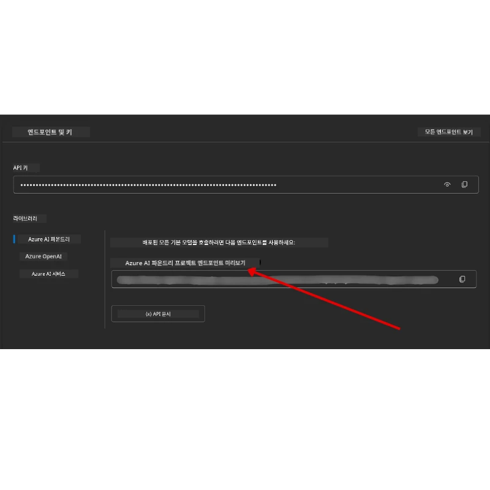

# 강의 설정

## 소개

이 강의에서는 이 과정의 코드 샘플을 실행하는 방법을 다룹니다.

## 다른 학습자와 함께 참여하고 도움 받기

레포지토리를 클론하기 전에 [AI Agents For Beginners Discord 채널](https://aka.ms/ai-agents/discord)에 참여하여 설정 관련 도움을 받거나, 과정에 관한 질문을 하거나, 다른 학습자들과 연결하세요.

## 이 레포지토리 클론 또는 포크하기

먼저, GitHub 레포지토리를 클론하거나 포크하세요. 이렇게 하면 과정 자료의 자신의 버전을 만들어 코드를 실행, 테스트 및 조정할 수 있습니다!

<a href="https://github.com/microsoft/ai-agents-for-beginners/fork" target="_blank">레포지토리 포크하기</a> 링크를 클릭하여 할 수 있습니다.

이제 다음 링크에서 이 과정의 자신만의 포크 버전을 갖게 됩니다:


### 얕은 클론 (워크숍 / Codespaces 권장)

 > 전체 레포지토리는 전체 히스토리와 모든 파일을 다운로드하면 클 수 있습니다(~3 GB). 워크숍에 참여하거나 몇 개의 레슨 폴더만 필요하면, 얕은 클론(또는 희소 클론)이 히스토리를 축소하거나 blob을 건너뛰어 대부분의 다운로드를 피할 수 있습니다.

#### 빠른 얕은 클론 — 최소 히스토리, 모든 파일

아래 명령어에서 `<your-username>`를 자신의 포크 URL(또는 필요하면 업스트림 URL)로 바꾸세요.

최신 커밋 히스토리만 클론하려면(작은 다운로드):

```bash|powershell
git clone --depth 1 https://github.com/<your-username>/ai-agents-for-beginners.git
```

특정 브랜치를 클론하려면:

```bash|powershell
git clone --depth 1 --branch <branch-name> https://github.com/<your-username>/ai-agents-for-beginners.git
```

#### 부분(희소) 클론 — 최소 blob + 선택된 폴더만

부분 클론과 희소 체크아웃을 사용합니다(Git 2.25 이상 필요하며 부분 클론 지원하는 최신 Git 권장):

```bash|powershell
git clone --depth 1 --filter=blob:none --sparse https://github.com/<your-username>/ai-agents-for-beginners.git
```

레포지토리 폴더로 이동:

```bash|powershell
cd ai-agents-for-beginners
```

필요한 폴더를 지정하세요(아래 예시는 두 폴더):

```bash|powershell
git sparse-checkout set 00-course-setup 01-intro-to-ai-agents
```

클론하고 파일을 확인한 후, 파일만 필요하고 공간을 확보하려면(깃 히스토리 없음), 레포지토리 메타데이터를 삭제하세요(💀복구 불가 — 모든 Git 기능상실: 커밋, 풀, 푸시, 히스토리 접근 불가).

```bash
# zsh/bash
rm -rf .git
```

```powershell
# 파워셸
Remove-Item -Recurse -Force .git
```

#### GitHub Codespaces 사용하기 (로컬 대용량 다운로드 회피 권장)

- 이 레포지토리용 새 Codespace를 [GitHub UI](https://github.com/codespaces)에서 생성하세요.

- 새로 생성된 Codespace 터미널에서 위의 얕은/희소 클론 명령어 중 하나를 실행하여 필요한 레슨 폴더만 Codespace 작업 공간으로 가져옵니다.
- 선택 사항: Codespaces 내에서 클론 후 .git을 제거하여 추가 공간 확보(위 제거 명령 참조).
- 참고: 레포지토리를 Codespaces에서 직접 열 경우(추가 클론 없이), Codespaces는 devcontainer 환경을 구성하며 필요한 것 이상을 프로비저닝할 수 있습니다. 새 Codespace 내부에서 얕은 복사본을 클론하면 디스크 사용량을 더 잘 제어할 수 있습니다.

#### 팁

- 수정/커밋할 경우 항상 클론 URL을 자신의 포크로 바꾸세요.
- 나중에 더 많은 히스토리나 파일이 필요하면, 가져오거나 희소 체크아웃을 조정해 추가 폴더를 포함할 수 있습니다.

## 코드 실행

이 과정은 AI 에이전트 구축 실습을 위해 실행할 수 있는 일련의 Jupyter 노트북을 제공합니다.

코드 샘플은 **Microsoft Agent Framework (MAF)** 와 `AzureAIProjectAgentProvider`를 사용하며, 이는 **Microsoft Foundry** 를 통해 **Azure AI Agent Service V2** (Responses API)에 연결됩니다.

모든 파이썬 노트북은 `*-python-agent-framework.ipynb`로 표시됩니다.

## 요구사항

- Python 3.12+
  - **참고**: Python3.12가 설치되어 있지 않다면 설치하세요. 이후 python3.12로 venv를 만들어 requirements.txt에서 올바른 버전이 설치되도록 하세요.

    >예시

    Python venv 디렉터리 생성:

    ```bash|powershell
    python -m venv venv
    ```

    이후 venv 환경 활성화:

    ```bash
    # zsh/bash
    source venv/bin/activate
    ```
  
    ```dos
    # Command Prompt for Windows
    venv\Scripts\activate
    ```

- .NET 10+: .NET을 사용하는 샘플 코드용으로 [.NET 10 SDK](https://dotnet.microsoft.com/download/dotnet/10.0) 이상을 설치하세요. 설치 후 .NET SDK 버전 확인:

    ```bash|powershell
    dotnet --list-sdks
    ```

- **Azure CLI** — 인증을 위해 필요합니다. [aka.ms/installazurecli](https://aka.ms/installazurecli)에서 설치하세요.
- **Azure 구독** — Microsoft Foundry 및 Azure AI Agent Service 접근용.
- **Microsoft Foundry 프로젝트** — 배포된 모델(예: `gpt-4o`)이 포함된 프로젝트. 아래 [1단계](../../../00-course-setup) 참조.

레포지토리 루트에 이 코드 샘플 실행에 필요한 모든 Python 패키지가 포함된 `requirements.txt` 파일이 있습니다.

터미널에서 다음 명령으로 설치할 수 있습니다:

```bash|powershell
pip install -r requirements.txt
```

충돌 및 문제 방지 위해 Python 가상 환경을 만드는 것을 권장합니다.

## VSCode 설정

VSCode에서 올바른 버전의 Python을 사용하고 있는지 확인하세요.


## Microsoft Foundry 및 Azure AI Agent Service 설정

### 1단계: Microsoft Foundry 프로젝트 생성

노트북을 실행하려면 배포된 모델이 있는 Azure AI Foundry **허브**와 **프로젝트**가 필요합니다.

1. [ai.azure.com](https://ai.azure.com)으로 이동하여 Azure 계정으로 로그인합니다.
2. **허브**를 생성하거나 기존 허브를 사용하세요. 자세한 내용: [Hub resources overview](https://learn.microsoft.com/azure/ai-foundry/concepts/ai-resources).
3. 허브 안에 **프로젝트**를 만듭니다.
4. **Models + Endpoints** → **Deploy model**에서 모델(예: `gpt-4o`)을 배포하세요.

### 2단계: 프로젝트 엔드포인트와 모델 배포 이름 확인

Microsoft Foundry 포털에서 프로젝트 내에서:

- **프로젝트 엔드포인트** — **Overview** 페이지로 가서 엔드포인트 URL을 복사하세요.



- **모델 배포 이름** — **Models + Endpoints**로 가서 배포된 모델을 선택한 후 **Deployment name**(예: `gpt-4o`)을 확인하세요.

### 3단계: `az login`으로 Azure 로그인

모든 노트북은 인증에 **`AzureCliCredential`** 을 사용하므로 API 키 관리가 필요 없습니다. Azure CLI로 로그인되어 있어야 합니다.

1. 아직 설치하지 않았다면 Azure CLI 설치: [aka.ms/installazurecli](https://aka.ms/installazurecli)

2. 로그인 실행:

    ```bash|powershell
    az login
    ```

    또는 브라우저가 없는 원격/Codespace 환경에서는:

    ```bash|powershell
    az login --use-device-code
    ```

3. 로그인 후 구독 선택 요청 시 Foundry 프로젝트가 포함된 구독을 선택하세요.

4. 로그인 여부 확인:

    ```bash|powershell
    az account show
    ```

> **왜 `az login`인가?** 노트북은 `azure-identity` 패키지의 `AzureCliCredential`을 사용해 인증합니다. 이는 Azure CLI 세션에서 자격 증명을 제공하여 API 키나 비밀을 `.env` 파일에 저장할 필요가 없습니다. 이는 [보안 최선 사례](https://learn.microsoft.com/azure/developer/ai/keyless-connections)입니다.

### 4단계: `.env` 파일 만들기

샘플 파일 복사:

```bash
# zsh/bash
cp .env.example .env
```

```powershell
# 파워셸
Copy-Item .env.example .env
```

`.env` 파일을 열고 다음 두 값을 입력하세요:

```env
AZURE_AI_PROJECT_ENDPOINT=https://<your-project>.services.ai.azure.com/api/projects/<your-project-id>
AZURE_AI_MODEL_DEPLOYMENT_NAME=gpt-4o
```

| 변수 | 위치 |
|----------|-----------------|
| `AZURE_AI_PROJECT_ENDPOINT` | Foundry 포털 → 프로젝트 → **Overview** 페이지 |
| `AZURE_AI_MODEL_DEPLOYMENT_NAME` | Foundry 포털 → **Models + Endpoints** → 배포 모델 이름 |

대부분 수업은 여기까지입니다! 노트북은 `az login` 세션을 통해 자동으로 인증됩니다.

### 5단계: Python 의존성 설치

```bash|powershell
pip install -r requirements.txt
```

앞서 생성한 가상 환경 안에서 실행하는 것을 권장합니다.

## 5과 추가 설정 (Agentic RAG)

5과는 검색 증강 생성용 **Azure AI Search**를 사용합니다. 해당 과정을 실행할 경우 `.env` 파일에 다음 변수를 추가하세요:

| 변수 | 위치 |
|----------|-----------------|
| `AZURE_SEARCH_SERVICE_ENDPOINT` | Azure 포털 → **Azure AI Search** 리소스 → **Overview** → URL |
| `AZURE_SEARCH_API_KEY` | Azure 포털 → **Azure AI Search** 리소스 → **Settings** → **Keys** → 기본 관리자 키 |

## 6과 및 8과 추가 설정 (GitHub 모델)

6과와 8과 일부 노트북은 Azure AI Foundry 대신 **GitHub 모델**을 사용합니다. 샘플 실행 예정이면 `.env` 파일에 다음 변수를 추가하세요:

| 변수 | 위치 |
|----------|-----------------|
| `GITHUB_TOKEN` | GitHub → **Settings** → **Developer settings** → **Personal access tokens** |
| `GITHUB_ENDPOINT` | `https://models.inference.ai.azure.com` (기본값) 사용 |
| `GITHUB_MODEL_ID` | 사용할 모델 이름 (예: `gpt-4o-mini`) |

## 8과 추가 설정 (Bing 접지 워크플로우)

8과 조건부 워크플로우 노트북은 Azure AI Foundry를 통한 **Bing 접지**를 사용합니다. 해당 샘플 실행 시 `.env` 파일에 다음 변수를 추가하세요:

| 변수 | 위치 |
|----------|-----------------|
| `BING_CONNECTION_ID` | Azure AI Foundry 포털 → 프로젝트 → **Management** → **Connected resources** → Bing 연결 → 연결 ID 복사 |

## 문제 해결

### macOS에서 SSL 인증서 검증 오류

macOS에서 다음과 같은 오류가 발생하는 경우:

```plaintext
ssl.SSLCertVerificationError: [SSL: CERTIFICATE_VERIFY_FAILED] certificate verify failed: self-signed certificate in certificate chain
```

Python이 macOS 시스템 SSL 인증서를 자동 신뢰하지 않는 알려진 문제입니다. 아래 해결책을 순서대로 시도하세요:

**옵션 1: Python 인증서 설치 스크립트 실행 (권장)**

```bash
# 설치된 파이썬 버전으로 3.XX를 교체하세요 (예: 3.12 또는 3.13):
/Applications/Python\ 3.XX/Install\ Certificates.command
```

**옵션 2: 노트북에서 `connection_verify=False` 사용 (GitHub 모델 노트북 전용)**

6과 노트북 (`06-building-trustworthy-agents/code_samples/06-system-message-framework.ipynb`)에 주석 처리된 해결책이 포함되어 있습니다. 클라이언트 생성 시 `connection_verify=False`를 주석 해제하세요:

```python
client = ChatCompletionsClient(
    endpoint=endpoint,
    credential=AzureKeyCredential(token),
    connection_verify=False,  # 인증서 오류가 발생하면 SSL 검증을 비활성화하세요
)
```

> **⚠️ 경고:** SSL 인증서 검증 비활성화(`connection_verify=False`)는 보안을 낮춥니다. 개발 환경의 임시 우회용으로만 사용하고, 운영 환경에서는 절대 사용하지 마세요.

**옵션 3: `truststore` 설치 및 사용**

```bash
pip install truststore
```

네트워크 호출 전에 노트북이나 스크립트 상단에 다음을 추가하세요:

```python
import truststore
truststore.inject_into_ssl()
```

## 어디서 막혔나요?

설정 관련 문제가 있다면 <a href="https://discord.gg/kzRShWzttr" target="_blank">Azure AI Community Discord</a>에 참여하거나 <a href="https://github.com/microsoft/ai-agents-for-beginners/issues?WT.mc_id=academic-105485-koreyst" target="_blank">이슈 생성</a> 하세요.

## 다음 강의

이제 이 과정의 코드를 실행할 준비가 되었습니다. AI 에이전트의 세계에 대해 더 많이 배우며 즐거운 학습 되세요!

[AI 에이전트 소개 및 에이전트 활용 사례](../01-intro-to-ai-agents/README.md)

---

<!-- CO-OP TRANSLATOR DISCLAIMER START -->
**면책 조항**:  
이 문서는 AI 번역 서비스 [Co-op Translator](https://github.com/Azure/co-op-translator)를 사용하여 번역되었습니다. 정확성을 위해 노력하고 있으나, 자동 번역에는 오류나 부정확한 내용이 포함될 수 있음을 유의하시기 바랍니다. 원문 문서가 권위 있는 자료로 간주되어야 합니다. 중요한 정보의 경우, 전문 인간 번역을 권장합니다. 본 번역 사용으로 인한 오해나 잘못된 해석에 대해서는 당사가 책임을 지지 않습니다.
<!-- CO-OP TRANSLATOR DISCLAIMER END -->