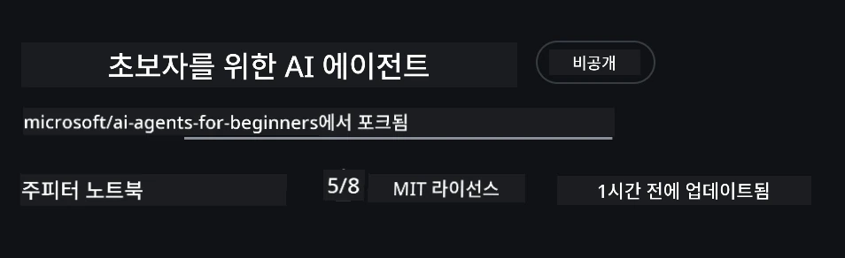
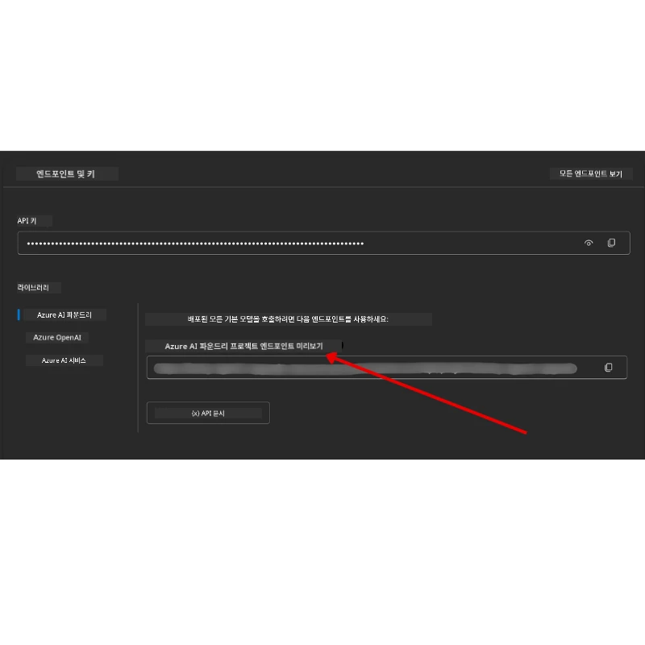

# 코스 설정

## 소개

이 수업에서는 이 코스의 코드 샘플을 실행하는 방법에 대해 다룹니다.

## 다른 학습자에 참여하고 도움 받기

저장소를 복제하기 전에, [AI Agents For Beginners Discord 채널](https://aka.ms/ai-agents/discord)에 가입하여 설정 관련 도움이나 코스에 관한 질문, 또는 다른 학습자들과 교류할 수 있습니다.

## 이 저장소 복제 또는 포크하기

시작하려면 GitHub 리포지토리를 복제하거나 포크하세요. 이렇게 하면 코스 자료의 자신의 버전을 만들어 코드를 실행하고, 테스트하고, 조정할 수 있습니다!

<a href="https://github.com/microsoft/ai-agents-for-beginners/fork" target="_blank">리포지토리를 포크하려면 여기를 클릭하세요</a>

이제 다음 링크에 자신의 포크된 버전의 코스가 있어야 합니다:



### 얕은 복제 (워크숍 / Codespaces 권장)

  >전체 리포지토리는 전체 기록과 모든 파일을 다운로드 시 용량이 클 수 있습니다(~3GB). 워크숍에만 참여하거나 몇몇 수업 폴더만 필요한 경우, 얕은 복제(또는 sparse clone)는 훨씬 적은 데이터를 다운로드합니다.

#### 빠른 얕은 복제 — 최소 기록, 모든 파일

아래 명령어에서 `<your-username>` 부분을 자신의 포크 URL(또는 선호하는 경우 업스트림 URL)로 바꾸세요.

최신 커밋 기록만 복제하려면 (작은 다운로드):

```bash
git clone --depth 1 https://github.com/<your-username>/ai-agents-for-beginners.git
```

특정 브랜치를 복제하려면:

```bash
git clone --depth 1 --branch <branch-name> https://github.com/<your-username>/ai-agents-for-beginners.git
```

#### 부분(스파스) 복제 — 최소 Blob + 선택된 폴더만

Git 2.25 이상 및 부분 복제 지원이 권장되는 최신 Git을 사용하여 부분 복제와 sparse-checkout을 사용합니다:

```bash
git clone --depth 1 --filter=blob:none --sparse https://github.com/<your-username>/ai-agents-for-beginners.git
```

리포지토리 폴더로 이동:

```bash
cd ai-agents-for-beginners
```

그런 다음 원하는 폴더를 지정합니다(아래 예시는 두 폴더 선택):

```bash
git sparse-checkout set 00-course-setup 01-intro-to-ai-agents
```

복제 및 파일 확인 후, 파일만 필요하고 공간을 확보하려면(깃 기록 없음), 저장소 메타데이터를 삭제하세요 (💀 되돌릴 수 없으며 모든 Git 기능이 사라집니다):

```bash
# zsh/bash
rm -rf .git
```

```powershell
# 파워셸
Remove-Item -Recurse -Force .git
```

#### GitHub Codespaces 사용하기 (로컬 대용량 다운로드를 피하려면 권장)

- [GitHub UI](https://github.com/codespaces)로 이 리포지토리의 새 Codespace를 만드세요.  

- 새로 생성된 Codespace 터미널에서 위의 얕은/스파스 복제 명령 중 하나를 실행해 필요한 수업 폴더만 Codespace 작업 영역으로 가져옵니다.
- 선택 사항: Codespaces 내에서 복제 후 .git을 제거하여 추가 공간을 확보하세요(위에 제거 명령 참조).
- 추가 복제 없이 바로 Codespaces에서 리포지토리를 열 경우, Codespaces가 devcontainer 환경을 구성하고 필요 이상의 리소스를 프로비저닝할 수 있습니다.

#### 팁

- 편집/커밋하려면 복제 URL을 항상 자신의 포크 URL로 교체하세요.
- 추가 기록이나 파일이 필요하면 나중에 가져오거나 sparse-checkout을 조정해 추가 폴더를 포함할 수 있습니다.

## 코드 실행하기

이 코스에서는 Jupyter 노트북 시리즈를 제공하여 AI 에이전트 구축을 실습할 수 있습니다.

코드 샘플은 `FoundryChatClient`를 사용하는 <strong>Microsoft Agent Framework (MAF)</strong>를 이용하며, 이는 **Microsoft Foundry Agent Service V2**(Responses API)와 <strong>Microsoft Foundry</strong>를 통해 연결됩니다.

모든 파이썬 노트북은 `*-python-agent-framework.ipynb`로 라벨링되어 있습니다.

## 요구사항

- Python 3.12 이상
  - <strong>참고</strong>: Python3.12가 설치되어 있지 않다면 반드시 설치하세요. 그런 다음 python3.12를 사용해 venv를 만들어 requirements.txt에 명시된 올바른 버전을 설치하세요.
  
    >예제

    Python venv 디렉터리 생성:

    ```bash
    python -m venv venv
    ```

    그런 다음 venv 환경 활성화:

    ```bash
    # zsh/bash
    source venv/bin/activate
    ```
  
    ```dos
    # Command Prompt for Windows
    venv\Scripts\activate
    ```

- .NET 10 이상: .NET 샘플 코드를 사용하려면 [.NET 10 SDK](https://dotnet.microsoft.com/download/dotnet/10.0) 이상을 설치하고, 설치된 SDK 버전을 확인하세요.

    ```bash
    dotnet --list-sdks
    ```

- **Azure CLI** — 인증에 필요합니다. [aka.ms/installazurecli](https://aka.ms/installazurecli)에서 설치하세요.
- **Azure 구독** — Microsoft Foundry 및 Microsoft Foundry Agent Service 액세스를 위해 필요합니다.
- **Microsoft Foundry 프로젝트** — 배포된 모델이 있는 프로젝트 (예: `gpt-5-mini`). 아래 [Step 1](#1단계-microsoft-foundry-프로젝트-생성) 참조.

이 저장소 루트에 코드 샘플 실행에 필요한 모든 파이썬 패키지를 포함한 `requirements.txt` 파일이 있습니다.

터미널에서 저장소 루트 위치에 아래 명령을 실행해 설치할 수 있습니다:

```bash
pip install -r requirements.txt
```

충돌 및 문제를 피하기 위해 Python 가상 환경을 생성하는 것을 권장합니다.

## VSCode 설정

VSCode에서 올바른 버전의 Python을 사용하고 있는지 확인하세요.


## Microsoft Foundry 및 Microsoft Foundry Agent Service 설정하기

### 1단계: Microsoft Foundry 프로젝트 생성

노트북을 실행하려면 배포된 모델이 포함된 Microsoft Foundry <strong>허브</strong>와 <strong>프로젝트</strong>가 필요합니다.

1. [ai.azure.com](https://ai.azure.com)으로 가서 Azure 계정으로 로그인하세요.
2. <strong>허브</strong>를 새로 만들거나, 기존 허브를 사용하세요. 자세한 내용은: [허브 리소스 개요](https://learn.microsoft.com/azure/ai-foundry/concepts/ai-resources).
3. 허브 안에서 <strong>프로젝트</strong>를 생성하세요.
4. **모델 + 엔드포인트** → <strong>모델 배포</strong>에서 모델(예: `gpt-5-mini`)을 배포하세요.

### 2단계: 프로젝트 엔드포인트와 모델 배포 이름 가져오기

Microsoft Foundry 포털 내 프로젝트에서:

- **프로젝트 엔드포인트** — <strong>개요</strong> 페이지에서 엔드포인트 URL을 복사하세요.



- **모델 배포 이름** — <strong>Models + Endpoints</strong>에서 배포한 모델을 선택하고, **배포 이름**(예: `gpt-5-mini`)을 기록하세요.

### 3단계: `az login`으로 Azure 로그인

대부분의 노트북은 `azure-identity` 패키지의 `AzureCliCredential` 또는 `DefaultAzureCredential`(두 가지 모두 `az login` 세션을 활용)로 Azure CLI 로그인을 통해 인증하므로 API 키가 필요 없습니다. 일부 수업과 선택적 통합은 API 키를 사용하니 각 수업 전제 조건에서 추가 환경 변수를 확인하세요. 이때 Azure CLI 로그인 상태가 필요합니다.

1. **Azure CLI를 설치하세요** (설치하지 않은 경우): [aka.ms/installazurecli](https://aka.ms/installazurecli)

2. <strong>로그인</strong> 실행:

    ```bash
    az login
    ```

    또는 브라우저가 없는 원격/Codespace 환경이라면:

    ```bash
    az login --use-device-code
    ```

3. 로그인 후, 프롬프트가 뜨면 구독을 선택하세요 — Foundry 프로젝트가 있는 구독을 선택합니다.

4. 로그인 상태를 확인하세요:

    ```bash
    az account show
    ```

> **왜 `az login`일까요?** 노트북은 `azure-identity` 패키지의 `AzureCliCredential`(또는 `DefaultAzureCredential`)을 이용해 인증합니다. 이는 `az login` 세션에서 인증 정보를 가져오기 때문에 별도의 API 키 또는 비밀을 `.env` 파일에 저장할 필요가 없습니다. 이는 [보안 권장사항](https://learn.microsoft.com/azure/developer/ai/keyless-connections)입니다.

### 4단계: `.env` 파일 생성

예시 파일을 복사하세요:

```bash
# zsh/bash
cp .env.example .env
```

```powershell
# 파워셸
Copy-Item .env.example .env
```

`.env` 파일을 열어 아래 두 값을 입력하세요:

```env
AZURE_AI_PROJECT_ENDPOINT=https://<your-project>.services.ai.azure.com/api/projects/<your-project-id>
AZURE_AI_MODEL_DEPLOYMENT_NAME=gpt-5-mini
```

| 변수명 | 위치 |
|----------|-----------------|
| `AZURE_AI_PROJECT_ENDPOINT` | Foundry 포털 → 프로젝트 → <strong>개요</strong> 페이지 |
| `AZURE_AI_MODEL_DEPLOYMENT_NAME` | Foundry 포털 → **Models + Endpoints** → 배포된 모델 이름 |

대부분의 수업은 여기까지로 충분합니다! 노트북은 자동으로 `az login` 세션을 통해 인증합니다.

### 5단계: Python 종속성 설치

```bash
pip install -r requirements.txt
```

앞서 만든 가상 환경 내에서 실행할 것을 권장합니다.

## 선택 설치: Azure AI 검색 (수업 5 및 16)

수업 5(Agentic RAG)와 16 노트북은 기본적으로 <strong>인메모리 지식 기반</strong>을 사용하므로 별도 Azure 자원이 필요 없습니다. 실 데이터로 **Azure AI Search** 인덱스를 사용하려면, <strong>수업 16 노트북은 현재 키 기반 인증을 사용</strong>하므로 **`AZURE_SEARCH_SERVICE_ENDPOINT`**와 **`AZURE_SEARCH_API_KEY`** 둘 다 설정해야 Azure AI Search로 전환됩니다. 그렇지 않으면 계속 인메모리 검색을 사용합니다 — 따라서 실제 인덱스에 연결하려면 관리자 키 설정이 필요합니다. 자체 프로덕션 코드에서는 `az login` 방식과 일관된 Microsoft Entra ID(RBAC)를 통한 키 없는 인증을 권장합니다.

아래 RBAC 단계는 가이드 샘플과 직접 작성하는 코드에 적용되며, 수업 16 노트북에서 키 없는 인증은 활성화하지 않습니다; 여전히 엔드포인트와 관리자 키 둘 다 필요합니다.

1. 검색 서비스에서 역할 기반 액세스를 활성화하세요:

    ```bash
    az search service update --name <service-name> --resource-group <resource-group> --auth-options aadOrApiKey
    ```

2. 필요한 역할(인덱스 생성/로드 및 쿼리)을 본인에게 할당하세요:

    ```bash
    az role assignment create --assignee <your-user-or-principal-id> --role "Search Service Contributor" --scope $(az search service show -g <resource-group> -n <service-name> --query id -o tsv)
    az role assignment create --assignee <your-user-or-principal-id> --role "Search Index Data Contributor" --scope $(az search service show -g <resource-group> -n <service-name> --query id -o tsv)
    ```

3. 엔드포인트를 `.env` 파일에 추가하세요:

| 변수명 | 위치 |
|----------|-----------------|
| `AZURE_SEARCH_SERVICE_ENDPOINT` | Azure 포털 → **Azure AI Search** 리소스 → <strong>개요</strong> → URL |
| `AZURE_SEARCH_API_KEY` | 수업 16 노트북에서 키 기반 인증용으로 필수. Azure 포털 → <strong>설정</strong> → <strong>키</strong> → 기본 관리자 키 |

> **왜 키 없는 인증인가요?** 관리자 키는 검색 서비스에 완전한 쓰기 권한을 부여하며 `.env` 파일로 인해 유출 위험이 있습니다. RBAC를 사용하면 대신 `az login` 아이덴티티를 사용하며, 이는 코스 내 노트북들이 사용하는 Entra ID 방식과 동일합니다 (`AzureCliCredential` / `DefaultAzureCredential` 참조). 자세한 내용은 [역할을 사용한 Azure AI Search 연결](https://learn.microsoft.com/azure/search/search-security-rbac)을 참조하세요.

전체 인덱스 생성 샘플(파이썬 및 .NET)은 [Azure AI Search 설정 가이드](./AzureSearch.md)를 참조하세요.

## Azure OpenAI 직접 호출하는 수업에 대한 추가 설정(수업 6 및 8)

수업 6 및 8의 일부 노트북은 Microsoft Foundry 프로젝트를 거치지 않고 <strong>Azure OpenAI</strong>를 직접 호출합니다(Responses API 사용). 이전에는 지원 종료된 GitHub Models를 사용했으나 Responses API를 지원하지 않습니다. `.env` 파일에 다음 변수를 추가하세요:

| 변수명 | 위치 |
|----------|-----------------|
| `AZURE_OPENAI_ENDPOINT` | Azure 포털 → **Azure OpenAI** 리소스 → **키 및 엔드포인트** → 엔드포인트(예: `https://<your-resource>.openai.azure.com`) |
| `AZURE_OPENAI_DEPLOYMENT` | Responses API를 지원하는 배포된 모델 이름(예: `gpt-5-mini`) |
| `AZURE_OPENAI_API_KEY` | 선택 사항 — 키 기반 인증을 `az login` / Entra ID 대신 사용할 때만 필요 |

> Responses API는 안정된 `/openai/v1/` 엔드포인트를 사용하므로 `api-version`은 필요 없습니다. 키 없는 Entra ID 인증을 위해 `az login`으로 로그인하세요.

## 대체 제공자: MiniMax (OpenAI 호환)

[MiniMax](https://platform.minimaxi.com/)는 최대 204K 토큰의 대규모 컨텍스트 모델을 OpenAI 호환 API를 통해 제공합니다. Microsoft Agent Framework의 `OpenAIChatClient`는 모든 OpenAI 호환 엔드포인트와 작동하므로 `OpenAIChatClient`를 사용하는 수업에서는 MiniMax를 바로 대체하여 사용할 수 있습니다.

`.env` 파일에 다음 변수를 추가하세요:

| 변수명 | 위치 |
|----------|-----------------|
| `MINIMAX_API_KEY` | [MiniMax 플랫폼](https://platform.minimaxi.com/) → API 키 |
| `MINIMAX_BASE_URL` | 기본값 `https://api.minimax.io/v1` 사용 |
| `MINIMAX_MODEL_ID` | 사용할 모델 이름 (예: `MiniMax-M3`) |

**예시 모델**: `MiniMax-M3` (권장), `MiniMax-M2.7`, `MiniMax-M2.7-highspeed` (더 빠른 응답). 모델 이름과 가용성은 변동 가능하며 계정별 접근 권한에 따라 다를 수 있습니다.

`OpenAIChatClient`를 사용하는 코드 샘플(e.g., 수업 14 호텔 예약 워크플로우)은 `MINIMAX_API_KEY`가 설정된 경우 자동으로 MiniMax 구성을 감지하고 사용합니다.


## 대체 제공자: Foundry Local (기기 내에서 모델 실행)

[Foundry Local](https://foundrylocal.ai)는 OpenAI 호환 API를 통해 **완전히 자신의 기기에서** 언어 모델을 다운로드, 관리 및 제공하는 경량 런타임입니다 — 클라우드가 필요하지 않습니다.

Microsoft Agent Framework의 `OpenAIChatClient`가 모든 OpenAI 호환 엔드포인트와 작동하기 때문에 Foundry Local은 Azure OpenAI에 대한 로컬 대체제로 바로 사용할 수 있습니다.

**1. Foundry Local 설치**

```bash
# 윈도우
winget install Microsoft.FoundryLocal

# 맥OS
brew install foundrylocal
```

**2. 모델 다운로드 및 실행** (로컬 서비스도 같이 시작됨):

```bash
foundry model list          # 사용 가능한 모델 보기
foundry model run phi-4-mini
```

**3. 로컬 엔드포인트를 탐색할 때 사용하는 Python SDK 설치:**

```bash
pip install foundry-local-sdk
```

**4. Microsoft Agent Framework가 로컬 모델을 가리키도록 설정:**

```python
from foundry_local import FoundryLocalManager
from agent_framework.openai import OpenAIChatClient

# 모델을 로컬에서 다운로드(필요한 경우) 및 제공한 다음, 엔드포인트/포트를 검색합니다.
manager = FoundryLocalManager("phi-4-mini")

chat_client = OpenAIChatClient(
    base_url=manager.endpoint,      # 예: http://localhost:<port>/v1
    api_key=manager.api_key,        # Foundry Local의 경우 항상 "필요 없음"입니다.
    model_id=manager.get_model_info("phi-4-mini").id,
)

agent = chat_client.as_agent(
    name="LocalAgent",
    instructions="You are a helpful assistant running fully on-device.",
)
```

> **참고:** Foundry Local은 OpenAI 호환 **Chat Completions** 엔드포인트를 제공합니다. 로컬 개발 및 오프라인 시나리오에 사용하세요. 전체 **Responses API** 기능 세트(상태 저장 대화 등)가 필요하면 Azure OpenAI 또는 Microsoft Foundry 프로젝트를 사용하세요.

## 8과 추가 설정 (Bing 기반 워크플로우)

8과의 조건부 워크플로우 노트북은 Microsoft Foundry를 통한 <strong>Bing 기반</strong>을 사용합니다. 해당 샘플을 실행할 계획이라면 `.env` 파일에 다음 변수를 추가하세요:

| 변수 | 찾는 위치 |
|----------|-----------------|
| `BING_CONNECTION_ID` | Microsoft Foundry 포털 → 프로젝트 → <strong>관리</strong> → **연결된 리소스** → Bing 연결 → 연결 ID 복사 |

## 문제 해결

### macOS에서 SSL 인증서 검증 오류

macOS에서 다음과 같은 오류가 발생하면:

```plaintext
ssl.SSLCertVerificationError: [SSL: CERTIFICATE_VERIFY_FAILED] certificate verify failed: self-signed certificate in certificate chain
```

이는 macOS Python의 알려진 문제로, 시스템 SSL 인증서를 자동으로 신뢰하지 않는 경우입니다. 다음 해결책을 순서대로 시도하세요:

**옵션 1: Python의 인증서 설치 스크립트 실행 (권장)**

```bash
# 설치한 Python 버전(예: 3.12 또는 3.13)으로 3.XX를 교체하세요:
/Applications/Python\ 3.XX/Install\ Certificates.command
```

**옵션 2: 노트북에서 `connection_verify=False` 사용 (GitHub Models 노트북 전용)**

6과 노트북(`06-building-trustworthy-agents/code_samples/06-system-message-framework.ipynb`)에는 주석 처리된 해결책이 포함되어 있습니다. 인증서 오류가 발생하면 `connection_verify=False`의 주석을 해제하세요:

```python
client = ChatCompletionsClient(
    endpoint=endpoint,
    credential=AzureKeyCredential(token),
    connection_verify=False,  # 인증서 오류가 발생할 경우 SSL 인증을 비활성화하세요
)
```

> **⚠️ 경고:** SSL 검증 비활성화(`connection_verify=False`)는 인증서 검증을 건너뛰어 보안을 낮춥니다. 개발 환경에서 임시 해결책으로만 사용하세요. 절대 프로덕션에서는 사용하지 마세요.

**옵션 3: `truststore` 설치 및 사용**

```bash
pip install truststore
```

그런 다음 네트워크 호출 전에 노트북이나 스크립트 상단에 다음을 추가하세요:

```python
import truststore
truststore.inject_into_ssl()
```

## 어디서 막혔나요?

이 설정 실행에 문제가 있으면 <a href="https://discord.gg/kzRShWzttr" target="_blank">Azure AI Community Discord</a>에 참여하거나 <a href="https://github.com/microsoft/ai-agents-for-beginners/issues?WT.mc_id=academic-105485-koreyst" target="_blank">이슈를 생성</a>하세요.

## 다음 강의

이제 이 과정의 코드를 실행할 준비가 되었습니다. AI 에이전트의 세계를 더 즐겁게 배워보세요!

[AI 에이전트 소개 및 에이전트 활용 사례](../01-intro-to-ai-agents/README.md)

---

<!-- CO-OP TRANSLATOR DISCLAIMER START -->
**면책 조항**:
이 문서는 AI 번역 서비스 [Co-op Translator](https://github.com/Azure/co-op-translator)를 사용하여 번역되었습니다. 정확성을 기하기 위해 노력하고 있으나, 자동 번역은 오류나 부정확한 부분이 있을 수 있음을 유의하시기 바랍니다. 원본 문서의 원어본이 권위 있는 자료로 간주되어야 합니다. 중요한 정보의 경우, 전문가의 인간 번역을 권장합니다. 이 번역 사용으로 인해 발생하는 오해나 잘못된 해석에 대해 당사는 책임을 지지 않습니다.
<!-- CO-OP TRANSLATOR DISCLAIMER END -->