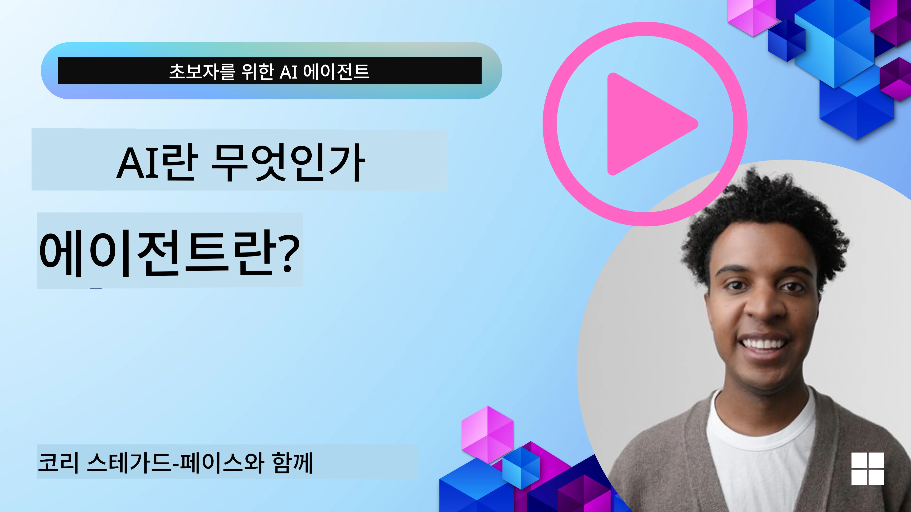
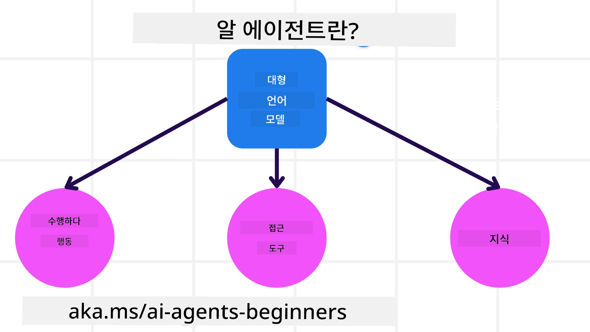
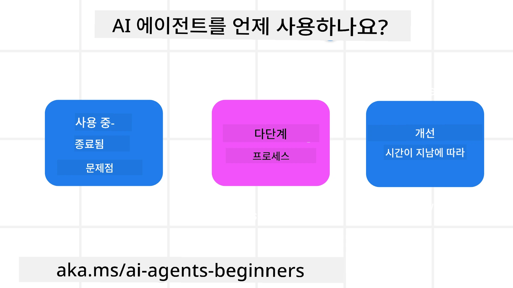

> _(위 이미지를 클릭하면 이 강의의 동영상을 볼 수 있습니다)_

# AI 에이전트 소개 및 에이전트 활용 사례

"초보자를 위한 AI 에이전트" 과정에 오신 것을 환영합니다! 이 과정은 AI 에이전트를 구축하기 위한 기본 지식과 적용 샘플을 제공합니다.

<a href="https://discord.gg/kzRShWzttr" target="_blank">Azure AI 디스코드 커뮤니티</a>에 가입하여 다른 학습자 및 AI 에이전트 빌더를 만나고 이 과정과 관련된 질문을 할 수 있습니다.

이 과정을 시작하기 위해, AI 에이전트가 무엇이며 우리가 구축하는 애플리케이션과 워크플로에서 어떻게 활용할 수 있는지 더 잘 이해하는 것부터 시작합니다.

## 소개

이 강의에서는 다음 내용을 다룹니다:

- AI 에이트란 무엇이며, 에이전트의 다양한 종류는 무엇인가?
- AI 에이전트에 적합한 사용 사례는 무엇이며, 어떻게 도움이 되는가?
- 에이전트 솔루션 설계 시 기본 구성 요소는 무엇인가?

## 학습 목표
이 강의를 완료하면 다음을 할 수 있습니다:

- AI 에이전트 개념을 이해하고 다른 AI 솔루션과의 차이를 알기.
- AI 에이전트를 가장 효율적으로 적용하기.
- 사용자 및 고객 모두에게 생산적인 에이전트 솔루션을 설계하기.

## AI 에이전트 정의 및 AI 에이전트 유형

### AI 에이전트란 무엇인가?

AI 에이전트는 **대형 언어 모델(LLM)**이 **도구 및 지식에 접근할 수 있도록 하여** **행동을 수행할 수 있게 하는 시스템**입니다.

이 정의를 좀 더 세부적으로 나누어 설명해 보겠습니다:

- **시스템** - 에이전트를 단일 컴포넌트가 아니라 여러 구성 요소로 이루어진 시스템으로 생각하는 것이 중요합니다. 기본적으로 AI 에이전트의 구성 요소는 다음과 같습니다:
  - **환경** - AI 에이전트가 작동하는 정의된 공간. 예를 들어, 여행 예약 AI 에이전트가 있다면, 환경은 AI 에이전트가 작업을 수행하는 여행 예약 시스템일 수 있습니다.
  - **센서** - 환경은 정보를 가지고 있으며 피드백을 제공합니다. AI 에이전트는 센서를 사용하여 환경의 현재 상태에 대한 정보를 수집하고 해석합니다. 여행 예약 에이전트 예시에서는, 여행 예약 시스템이 호텔의 가용 여부나 항공권 가격과 같은 정보를 제공할 수 있습니다.
  - **액추에이터** - AI 에이전트가 환경의 현재 상태를 받은 후, 현재 작업에 대해 환경을 변경하기 위해 어떤 행동을 수행할지 결정합니다. 여행 예약 에이전트의 경우, 사용자를 위해 가능한 방을 예약하는 것이 행동일 수 있습니다.

**대형 언어 모델** - 에이전트의 개념은 LLM이 등장하기 전부터 존재했습니다. LLM으로 AI 에이전트를 구축하는 이점은 인간 언어와 데이터를 해석하는 능력에 있습니다. 이 능력은 LLM이 환경 정보를 해석하고 환경을 변경하기 위한 계획을 정의할 수 있게 합니다.

**행동 수행** - AI 에이전트 시스템 외부에서, LLM은 사용자의 프롬프트를 기반으로 콘텐츠나 정보를 생성하는 작업에 한정되어 있습니다. AI 에이전트 시스템 내에서 LLM은 사용자의 요청을 해석하고 환경에서 사용할 수 있는 도구를 사용하여 작업을 수행할 수 있습니다.

**도구 접근** - LLM이 접근할 수 있는 도구는 1) 작동하는 환경과 2) AI 에이전트 개발자가 정의합니다. 여행 에이전트 예시에서, 에이전트의 도구는 예약 시스템에서 제공되는 작업에 의해 제한되고, 개발자는 에이전트의 도구 접근을 항공편으로 제한할 수도 있습니다.

**기억+지식** - 기억은 사용자와 에이전트 간의 대화 맥락에서 단기적일 수 있습니다. 장기적으로는, 환경에서 제공되는 정보 외에도 AI 에이전트는 다른 시스템, 서비스, 도구, 심지어 다른 에이전트로부터 지식을 검색할 수 있습니다. 여행 에이전트 예시에서, 이 지식은 고객 데이터베이스에 있는 사용자의 여행 선호 정보일 수 있습니다.

### 다양한 종류의 에이전트

일반적인 AI 에이전트 정의를 구했으니, 이제 특정 에이전트 유형과 이를 여행 예약 AI 에이전트에 어떻게 적용할 수 있는지 살펴보겠습니다.

| **에이전트 유형**               | **설명**                                                                                                                       | **예시**                                                                                                                                                                                                                   |
| ----------------------------- | ------------------------------------------------------------------------------------------------------------------------------------- | ----------------------------------------------------------------------------------------------------------------------------------------------------------------------------------------------------------------------------- |
| **간단한 반사 에이전트(Simple Reflex Agents)**      | 미리 정의된 규칙에 따라 즉각적인 행동을 수행합니다.                                                                                  | 여행 에이전트가 이메일의 맥락을 해석하고 여행 불만을 고객 서비스로 전달합니다.                                                                                                                          |
| **모델 기반 반사 에이전트(Model-Based Reflex Agents)** | 세계 모델과 해당 모델의 변화를 기반으로 행동을 수행합니다.                                                              | 여행 에이전트가 과거 가격 데이터를 기반으로 가격 변동이 큰 경로를 우선시합니다.                                                                                                             |
| **목표 기반 에이전트(Goal-Based Agents)**         | 목표를 해석하고 목표를 달성하기 위한 행동을 결정하여 계획을 세웁니다.                                  | 여행 에이전트가 현재 위치에서 목적지까지 필요한 여행 준비(자동차, 대중교통, 항공편 등)를 결정하여 여정을 예약합니다.                                                                                |
| **유틸리티 기반 에이전트(Utility-Based Agents)**      | 선호도를 고려하고 수치를 통해 거래를 따져 목표 달성 방법을 결정합니다.                                               | 여행 에이전트가 여행 예약 시 편의성 대 비용을 저울질하여 효용을 극대화합니다.                                                                                                                                          |
| **학습 에이전트(Learning Agents)**           | 피드백에 반응하고 행동을 조정하여 시간이 지남에 따라 개선됩니다.                                                        | 여행 에이전트가 여행 후 설문조사에서 받은 고객 피드백을 활용해 향후 예약 방식을 개선합니다.                                                                                                               |
| **계층 에이전트(Hierarchical Agents)**       | 여러 에이전트가 계층적으로 구성되어 상위 에이전트가 하위 에이전트에 작업을 분할하여 완수합니다. | 여행 에이전트가 여행 취소 작업을 여러 하위 작업(예: 특정 예약 취소)으로 나누고 하위 에이전트가 이를 수행, 결과를 상위 에이전트에 보고합니다.                                     |
| **다중 에이전트 시스템(Multi-Agent Systems, MAS)** | 에이전트가 독립적으로 작업을 수행하며 협력하거나 경쟁합니다.                                                           | 협력: 여러 에이전트가 호텔, 항공편, 엔터테인먼트 같은 특정 여행 서비스를 예약. 경쟁: 여러 에이전트가 공유 호텔 예약 캘린더를 관리하고 경쟁하여 고객을 호텔에 예약. |

## AI 에이전트를 사용해야 할 때

앞서 섹션에서는 여행 에이전트 사용 사례를 통해 다양한 에이전트 유형을 여행 예약의 여러 시나리오에 적용하는 방법을 설명했습니다. 이 애플리케이션은 과정 전체에 걸쳐 계속 사용됩니다.

AI 에이전트가 가장 적합한 사용 사례 유형을 살펴보겠습니다:

- **개방형 문제** - 작업을 완료하기 위한 필요한 단계를 LLM이 정하도록 허용합니다. 작업이 항상 워크플로에 하드코딩될 수 없기 때문입니다.
- **복수 단계 프로세스** - AI 에이전트가 단일 조회 대신 도구나 정보를 여러 단계에 걸쳐 사용해야 하는 복잡한 작업입니다.  
- **시간에 따른 개선** - 에이전트가 환경이나 사용자로부터 피드백을 받으며 시간이 지나면서 더 나은 효용을 제공하도록 개선할 수 있는 작업입니다.

AI 에이전트 사용 시 고려사항은 신뢰할 수 있는 AI 에이전트 구축 수업에서 더 다룹니다.

## 에이전트 솔루션 기초

### 에이전트 개발

AI 에이전트 시스템 설계의 첫 단계는 도구, 행동, 그리고 동작 방식을 정의하는 것입니다. 이 과정에서는 **Azure AI Agent Service**를 사용하여 에이전트를 정의하는 방법에 집중합니다. 이 서비스는 다음과 같은 기능을 제공합니다:

- OpenAI, Mistral, Llama와 같은 오픈 모델 선택
- Tripadvisor와 같은 공급자를 통한 라이선스 데이터 사용
- 표준화된 OpenAPI 3.0 도구 사용

### 에이전트 패턴

LLM과의 통신은 프롬프트를 통해 이루어집니다. AI 에이전트의 반자율적 특성으로 인해 환경 변화 후마다 LLM에 수동으로 다시 프롬프트를 보내는 것이 항상 가능하거나 요구되지 않습니다. 여러 단계에 걸쳐 LLM을 확장성 있게 프롬프트할 수 있도록 **에이전트 패턴**을 사용합니다.

이 과정은 현재 인기 있는 에이전트 패턴을 일부로 나누어 다룹니다.

### 에이전트 프레임워크

에이전트 프레임워크는 개발자가 코드로 에이전트 패턴을 구현할 수 있게 합니다. 이 프레임워크는 템플릿, 플러그인, 그리고 AI 에이전트 협업을 위한 도구를 제공합니다. 이를 통해 AI 에이전트 시스템의 가시성과 문제 해결 능력이 향상됩니다.

이 과정에서는 생산 준비가 된 AI 에이전트를 구축하기 위한 Microsoft Agent Framework (MAF)를 탐색합니다.

## 샘플 코드

- Python: [Agent Framework](./code_samples/01-python-agent-framework.ipynb)
- .NET: [Agent Framework](./code_samples/01-dotnet-agent-framework.md)

## AI 에이전트에 대해 궁금한 점이 더 있나요?

[Microsoft Foundry Discord](https://aka.ms/ai-agents/discord)에 가입하여 다른 학습자들과 만나고, 오피스 아워에 참석하여 AI 에이전트 관련 질문을 해보세요.

## 이전 강의

[과정 설정](../00-course-setup/README.md)

## 다음 강의

[에이전트 프레임워크 탐색](../02-explore-agentic-frameworks/README.md)

---

<!-- CO-OP TRANSLATOR DISCLAIMER START -->
**면책 조항**:  
이 문서는 AI 번역 서비스 [Co-op Translator](https://github.com/Azure/co-op-translator)를 사용하여 번역되었습니다. 정확성을 위해 노력하고 있으나, 자동 번역에는 오류나 부정확성이 포함될 수 있음을 알려드립니다. 원문이 쓰인 언어의 원본 문서가 권위 있는 출처로 간주되어야 합니다. 중요한 정보의 경우, 전문적인 사람 번역을 권장합니다. 본 번역 사용으로 인해 발생하는 오해나 잘못된 해석에 대해 당사는 책임을 지지 않습니다.
<!-- CO-OP TRANSLATOR DISCLAIMER END -->