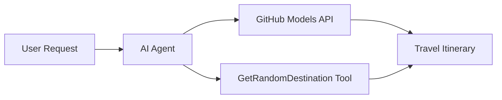

<!--
CO_OP_TRANSLATOR_METADATA:
{
  "original_hash": "23afd9be7b6ba5b69a44c3b6a78e07f6",
  "translation_date": "2025-11-06T10:02:36+00:00",
  "source_file": "01-intro-to-ai-agents/code_samples/01-dotnet-agent-framework.md",
  "language_code": "ko"
}
-->
# 🌍 Microsoft Agent Framework (.NET)을 활용한 AI 여행 에이전트

## 📋 시나리오 개요

이 노트북은 Microsoft Agent Framework for .NET을 사용하여 지능형 여행 계획 에이전트를 구축하는 방법을 보여줍니다. 에이전트는 전 세계의 랜덤 목적지를 기반으로 개인화된 당일 여행 일정을 자동으로 생성할 수 있습니다.

**주요 기능:**
- 🎲 **랜덤 목적지 선택**: 휴양지를 선택하는 커스텀 도구 사용
- 🗺️ **지능형 여행 계획**: 상세한 일별 일정 생성
- 🔄 **실시간 스트리밍**: 즉각적이고 스트리밍 응답 지원
- 🛠️ **커스텀 도구 통합**: 에이전트 기능 확장 방법 시연

## 🔧 기술 아키텍처

### 핵심 기술
- **Microsoft Agent Framework**: AI 에이전트 개발을 위한 최신 .NET 구현
- **GitHub Models 통합**: GitHub의 AI 모델 추론 서비스 사용
- **OpenAI API 호환성**: 커스텀 엔드포인트를 활용한 OpenAI 클라이언트 라이브러리 사용
- **보안 구성**: 환경 기반 API 키 관리

### 주요 구성 요소
1. **AIAgent**: 대화 흐름을 처리하는 주요 에이전트 오케스트레이터
2. **커스텀 도구**: 에이전트에서 사용 가능한 `GetRandomDestination()` 함수
3. **채팅 클라이언트**: GitHub Models 기반 대화 인터페이스
4. **스트리밍 지원**: 실시간 응답 생성 기능

### 통합 패턴


## 🚀 시작하기

**필수 조건:**
- .NET 10.0 이상
- GitHub Models API 액세스 토큰
- `.env` 파일에 환경 변수 구성

**필요한 환경 변수:**
```env
GITHUB_TOKEN=your_github_token
GITHUB_ENDPOINT=https://models.inference.ai.azure.com
GITHUB_MODEL_ID=gpt-4o-mini
```

아래 코드 샘플을 순서대로 실행하여 여행 에이전트의 작동을 확인하세요!

---

## .NET 단일 파일 앱: AI 여행 에이전트 예제

완전한 실행 가능한 코드 샘플은 `01-dotnet-agent-framework.cs`에서 확인하세요.

```bash
dotnet run 01-dotnet-agent-framework.cs
```

### 샘플 코드

```csharp
static string GetRandomDestination()
{
    var destinations = new List<string>
    {
        "Paris, France",
        "Tokyo, Japan",
        "New York City, USA",
        "Sydney, Australia",
        "Rome, Italy",
        "Barcelona, Spain",
        "Cape Town, South Africa",
        "Rio de Janeiro, Brazil",
        "Bangkok, Thailand",
        "Vancouver, Canada"
    };
    var random = new Random();
    int index = random.Next(destinations.Count);
    return destinations[index];
}

// Extract configuration from environment variables
var github_endpoint = Environment.GetEnvironmentVariable("GITHUB_ENDPOINT") ?? throw new InvalidOperationException("GITHUB_ENDPOINT is not set.");
var github_model_id = Environment.GetEnvironmentVariable("GITHUB_MODEL_ID") ?? "gpt-4o-mini";
var github_token = Environment.GetEnvironmentVariable("GITHUB_TOKEN") ?? throw new InvalidOperationException("GITHUB_TOKEN is not set.");

// Configure OpenAI Client Options
var openAIOptions = new OpenAIClientOptions()
{
    Endpoint = new Uri(github_endpoint)
};

// Initialize OpenAI Client with GitHub Models Configuration
var openAIClient = new OpenAIClient(new ApiKeyCredential(github_token), openAIOptions);

// Create AI Agent with Travel Planning Capabilities
AIAgent agent = openAIClient
    .GetChatClient(github_model_id)
    .CreateAIAgent(
        instructions: "You are a helpful AI Agent that can help plan vacations for customers at random destinations",
        tools: [AIFunctionFactory.Create(GetRandomDestination)]
    );

// Execute Agent: Plan a Day Trip (Non-Streaming)
Console.WriteLine(await agent.RunAsync("Plan me a day trip"));

// Execute Agent: Plan a Day Trip (Streaming Response)
await foreach (var update in agent.RunStreamingAsync("Plan me a day trip"))
{
    Console.Write(update);
}
```

---

**면책 조항**:  
이 문서는 AI 번역 서비스 [Co-op Translator](https://github.com/Azure/co-op-translator)를 사용하여 번역되었습니다. 정확성을 위해 노력하고 있지만, 자동 번역에는 오류나 부정확성이 포함될 수 있습니다. 원본 문서의 원어 버전이 권위 있는 출처로 간주되어야 합니다. 중요한 정보의 경우, 전문적인 인간 번역을 권장합니다. 이 번역 사용으로 인해 발생하는 오해나 잘못된 해석에 대해 책임을 지지 않습니다.