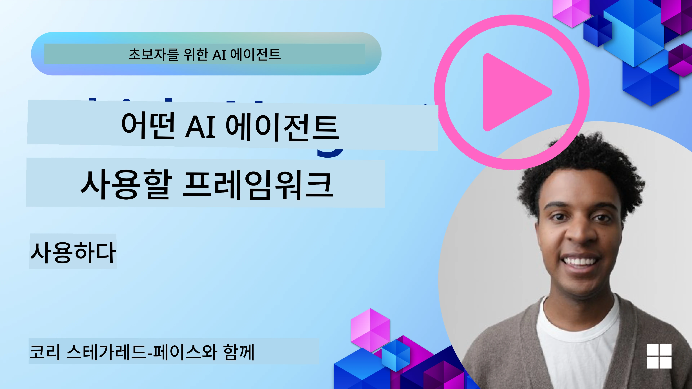

[](https://youtu.be/ODwF-EZo_O8?si=1xoy_B9RNQfrYdF7)

> _(위 이미지를 클릭하면 이 수업의 동영상을 볼 수 있습니다)_

# AI 에이전트 프레임워크 탐구하기

AI 에이전트 프레임워크는 AI 에이전트의 생성, 배포 및 관리를 간소화하기 위해 설계된 소프트웨어 플랫폼입니다. 이 프레임워크는 복잡한 AI 시스템 개발을 간소화하는 사전 구축된 구성 요소, 추상화 및 도구를 개발자에게 제공합니다.

이 프레임워크는 개발자가 AI 에이전트 개발의 일반적인 문제에 대한 표준화된 접근 방식을 제공함으로써 애플리케이션의 고유한 측면에 집중할 수 있도록 돕습니다. 또한 AI 시스템 구축에서 확장성, 접근성 및 효율성을 향상시킵니다.

## 소개

이 수업에서는 다음을 다룹니다:

- AI 에이전트 프레임워크란 무엇이며 개발자에게 무엇을 가능하게 하는가?
- 팀이 에이전트의 기능을 빠르게 프로토타입, 반복 개선하는 데 어떻게 활용할 수 있는가?
- Microsoft가 만든 프레임워크와 도구들(<a href="https://aka.ms/ai-agents-beginners/ai-agent-service" target="_blank">Azure AI Agent Service</a> 및 <a href="https://learn.microsoft.com/azure/ai-services/openai/how-to/responses" target="_blank">Microsoft Agent Framework</a>)의 차이점은 무엇인가?
- 기존 Azure 생태계 도구를 직접 통합할 수 있는가, 아니면 독립형 솔루션이 필요한가?
- Azure AI Agent Service란 무엇이며 이것이 어떻게 도움이 되는가?

## 학습 목표

이 수업의 목표는 다음을 이해하는 데 도움을 주는 것입니다:

- AI 개발에서 AI 에이전트 프레임워크의 역할
- AI 에이전트 프레임워크를 활용하여 지능형 에이전트를 구축하는 방법
- AI 에이전트 프레임워크가 제공하는 주요 기능
- Microsoft Agent Framework와 Azure AI Agent Service의 차이점

## AI 에이전트 프레임워크란 무엇이며 개발자들이 무엇을 할 수 있게 하는가?

전통적인 AI 프레임워크는 다음과 같은 방식으로 앱에 AI를 통합하고 앱을 개선할 수 있습니다:

- **개인화**: AI는 사용자 행동과 선호도를 분석해 개인 맞춤 추천, 콘텐츠 및 경험을 제공합니다.  
예: 넷플릭스 같은 스트리밍 서비스는 시청 기록을 기반으로 영화와 프로그램을 추천하여 사용자 참여와 만족도를 높입니다.
- **자동화 및 효율성**: AI는 반복 작업을 자동화하고 워크플로를 간소화하여 운영 효율성을 개선합니다.  
예: 고객 서비스 앱은 AI 기반 챗봇을 사용해 일반 문의를 처리하여 응답 시간을 줄이고 복잡한 문제는 인간 상담원이 담당할 수 있도록 합니다.
- **향상된 사용자 경험**: AI는 음성 인식, 자연어 처리, 예측 텍스트 같은 지능형 기능을 제공해 전체 사용자 경험을 개선합니다.  
예: 시리나 구글 어시스턴트 같은 가상 비서는 음성 명령을 이해하고 응답하여 사용자가 기기와 쉽게 상호 작용할 수 있게 합니다.

### 모두 좋게 들리는데, 왜 AI 에이전트 프레임워크가 필요한가?

AI 에이전트 프레임워크는 단순한 AI 프레임워크 그 이상을 의미합니다. 이들은 사용자, 다른 에이전트 및 환경과 상호작용하여 특정 목표를 달성할 수 있는 지능형 에이전트를 만드는 것을 가능하게 설계되었습니다. 이 에이전트들은 자율 행동을 보이고, 의사 결정을 하며, 변화하는 조건에 적응할 수 있습니다. AI 에이전트 프레임워크가 제공하는 주요 기능을 살펴보면:

- **에이전트 협업 및 조정**: 복수의 AI 에이전트가 함께 작업하고 소통하며 복잡한 작업을 해결하기 위해 조정할 수 있게 합니다.
- **작업 자동화 및 관리**: 다단계 워크플로 자동화, 작업 위임 및 에이전트 간 동적 작업 관리를 위한 메커니즘을 제공합니다.
- **맥락 이해 및 적응**: 에이전트가 상황을 이해하고 변화하는 환경에 적응하며 실시간 정보를 기반으로 의사 결정을 할 수 있는 능력을 갖추게 합니다.

요약하면, 에이전트는 더 많은 것을 할 수 있게 하며, 자동화를 한층 더 발전시키고, 환경에서 학습하고 적응할 수 있는 더 지능적인 시스템을 만드는 것을 가능하게 합니다.

## 에이전트의 기능을 빠르게 프로토타입하고 반복 개선하는 방법은?

이 분야는 빠르게 변하고 있지만 대부분의 AI 에이전트 프레임워크에서 공통적으로 볼 수 있는 빠른 프로토타입 및 반복 개선을 돕는 요소들이 있습니다. 모듈형 구성 요소, 협업 도구, 실시간 학습이 그것입니다. 살펴보겠습니다:

- **모듈형 구성 요소 사용**: AI SDK는 AI 및 메모리 커넥터, 자연어 또는 코드 플러그인을 이용한 함수 호출, 프롬프트 템플릿 등 사전 구축된 구성 요소를 제공합니다.
- **협업 도구 활용**: 특정 역할과 작업을 가진 에이전트를 설계하여 협업 워크플로를 테스트하고 개선할 수 있습니다.
- **실시간 학습**: 에이전트가 상호 작용에서 학습하고 행동을 동적으로 조정하도록 피드백 루프를 구현합니다.

### 모듈형 구성 요소 사용

Microsoft Agent Framework 같은 SDK는 AI 커넥터, 도구 정의 및 에이전트 관리를 포함하는 사전 구축된 구성 요소를 제공합니다.

**팀이 사용하는 방법**: 팀은 이러한 구성 요소를 조립하여 처음부터 시작하지 않고도 기능적 프로토타입을 빠르게 만들 수 있어 실험과 반복 작업이 용이합니다.

**실제 적용 예**: 사용자 입력에서 정보를 추출하는 사전 구축 파서를 사용하고, 데이터를 저장하고 검색하는 메모리 모듈, 사용자와 상호작용하는 프롬프트 생성기를 모두 직접 만들 필요 없이 사용할 수 있습니다.

**예제 코드**: Microsoft Agent Framework와 `AzureAIProjectAgentProvider`를 사용해 모델이 도구 호출로 사용자 입력에 응답하는 예제를 살펴보겠습니다:

``` python
# Microsoft Agent Framework Python 예제

import asyncio
import os
from typing import Annotated

from agent_framework.azure import AzureAIProjectAgentProvider
from azure.identity import AzureCliCredential


# 여행을 예약하는 샘플 도구 함수를 정의합니다.
def book_flight(date: str, location: str) -> str:
    """Book travel given location and date."""
    return f"Travel was booked to {location} on {date}"


async def main():
    provider = AzureAIProjectAgentProvider(credential=AzureCliCredential())
    agent = await provider.create_agent(
        name="travel_agent",
        instructions="Help the user book travel. Use the book_flight tool when ready.",
        tools=[book_flight],
    )

    response = await agent.run("I'd like to go to New York on January 1, 2025")
    print(response)
    # 예시 출력: 2025년 1월 1일 뉴욕행 항공편이 성공적으로 예약되었습니다. 안전한 여행 되세요! ✈️🗽


if __name__ == "__main__":
    asyncio.run(main())
```
  
이 예제에서 볼 수 있듯이 사용자 입력에서 출발지, 목적지, 날짜 같은 주요 정보를 추출하는 사전 구축 파서를 활용할 수 있습니다. 이 모듈 방식 덕분에 고수준 로직에 집중할 수 있습니다.

### 협업 도구 활용

Microsoft Agent Framework 같은 프레임워크는 여러 에이전트가 함께 작업할 수 있게 지원합니다.

**팀이 사용하는 방법**: 팀은 특정 역할과 작업을 가진 에이전트를 설계하여 협업 워크플로를 시험하고 다듬어 전체 시스템 효율성을 높일 수 있습니다.

**실제 적용 예**: 데이터 검색, 분석 또는 의사 결정 같은 전문 역할을 맡은 에이전트 팀을 만들고 이들이 소통하며 정보를 공유해 사용자 문의에 답변하거나 작업을 완료합니다.

**예제 코드 (Microsoft Agent Framework)**:

```python
# Microsoft Agent Framework를 사용하여 함께 작동하는 여러 에이전트를 생성하기

import os
from agent_framework.azure import AzureAIProjectAgentProvider
from azure.identity import AzureCliCredential

provider = AzureAIProjectAgentProvider(credential=AzureCliCredential())

# 데이터 검색 에이전트
agent_retrieve = await provider.create_agent(
    name="dataretrieval",
    instructions="Retrieve relevant data using available tools.",
    tools=[retrieve_tool],
)

# 데이터 분석 에이전트
agent_analyze = await provider.create_agent(
    name="dataanalysis",
    instructions="Analyze the retrieved data and provide insights.",
    tools=[analyze_tool],
)

# 작업에 대해 에이전트를 순차적으로 실행하기
retrieval_result = await agent_retrieve.run("Retrieve sales data for Q4")
analysis_result = await agent_analyze.run(f"Analyze this data: {retrieval_result}")
print(analysis_result)
```
  
위 코드에서는 여러 에이전트가 함께 작업하여 데이터를 분석하는 작업을 생성하는 방식을 볼 수 있습니다. 각 에이전트는 특정 기능을 수행하고 원하는 결과를 내기 위해 함께 작업을 조정합니다. 전문 역할을 가진 전담 에이전트를 만들면 작업 효율성과 수행 성능을 높일 수 있습니다.

### 실시간 학습

고급 프레임워크는 실시간 상황 이해 및 적응 기능을 제공합니다.

**팀이 사용하는 방법**: 팀은 에이전트가 상호작용에서 학습하고 동적으로 행동을 조정하는 피드백 루프를 구현하여 지속적인 개선과 기능 고도화를 이룰 수 있습니다.

**실제 적용 예**: 에이전트는 사용자 피드백, 환경 데이터 및 작업 결과를 분석해 지식 기반을 업데이트하고 의사 결정 알고리즘을 조정하며 성능을 향상시킵니다. 이러한 반복 학습 과정으로 에이전트는 변화하는 조건과 사용자 선호에 적응하여 전체 시스템 효과를 높입니다.

## Microsoft Agent Framework와 Azure AI Agent Service의 차이점은 무엇인가?

이 두 접근 방식을 여러 면에서 비교할 수 있지만, 설계, 기능, 주요 활용 사례 측면에서 핵심 차이점을 살펴보겠습니다.

## Microsoft Agent Framework (MAF)

Microsoft Agent Framework는 `AzureAIProjectAgentProvider`를 사용해 AI 에이전트를 구축하기 위한 간소화된 SDK를 제공합니다. 개발자는 Azure OpenAI 모델을 활용하는 에이전트를 만들 수 있으며, 내장된 도구 호출, 대화 관리, Azure ID를 통한 엔터프라이즈 수준 보안을 포함합니다.

**용도**: 도구 활용, 다단계 워크플로, 엔터프라이즈 통합 시나리오를 갖춘 프로덕션급 AI 에이전트 구축.

Microsoft Agent Framework의 주요 핵심 개념은 다음과 같습니다:

- **에이전트**: `AzureAIProjectAgentProvider`를 통해 생성되며 이름, 지침, 도구로 구성됩니다. 에이전트는:
  - 사용자 메시지를 처리하고 Azure OpenAI 모델을 사용해 응답 생성
  - 대화 맥락에 따라 도구를 자동으로 호출
  - 여러 상호작용 간 대화 상태 유지

  에이전트를 생성하는 코드 예시는 다음과 같습니다:

    ```python
    import os
    from agent_framework.azure import AzureAIProjectAgentProvider
    from azure.identity import AzureCliCredential

    provider = AzureAIProjectAgentProvider(credential=AzureCliCredential())
    agent = await provider.create_agent(
        name="my_agent",
        instructions="You are a helpful assistant.",
    )

    response = await agent.run("Hello, World!")
    print(response)
    ```
  
- **도구**: 프레임워크는 에이전트가 자동 호출할 수 있는 Python 함수로 도구를 정의하도록 지원합니다. 도구는 에이전트 생성 시 등록됩니다:

    ```python
    def get_weather(location: str) -> str:
        """Get the current weather for a location."""
        return f"The weather in {location} is sunny, 72\u00b0F."

    agent = await provider.create_agent(
        name="weather_agent",
        instructions="Help users check the weather.",
        tools=[get_weather],
    )
    ```
  
- **다중 에이전트 조정**: 서로 다른 전문 분야를 가진 여러 에이전트를 만들고 이들의 작업을 조정할 수 있습니다:

    ```python
    planner = await provider.create_agent(
        name="planner",
        instructions="Break down complex tasks into steps.",
    )

    executor = await provider.create_agent(
        name="executor",
        instructions="Execute the planned steps using available tools.",
        tools=[execute_tool],
    )

    plan = await planner.run("Plan a trip to Paris")
    result = await executor.run(f"Execute this plan: {plan}")
    ```
  
- **Azure ID 통합**: `AzureCliCredential`(또는 `DefaultAzureCredential`)를 사용해 API 키 관리 없이 안전하고 키 없는 인증을 제공합니다.

## Azure AI Agent Service

Azure AI Agent Service는 Microsoft Ignite 2024에서 소개된 최신 서비스입니다. Llama 3, Mistral, Cohere 같은 오픈 소스 LLM을 직접 호출하는 등 더 유연한 모델 사용과 AI 에이전트 개발 및 배포를 지원합니다.

Azure AI Agent Service는 보다 강력한 엔터프라이즈 보안 메커니즘과 데이터 저장 방식을 제공하며 기업용 애플리케이션에 적합합니다.

Microsoft Agent Framework와 함께 사용할 수 있어 에이전트 구축 및 배포를 지원합니다.

현재 Public Preview 단계이며 Python 및 C# 언어를 지원합니다.

Azure AI Agent Service Python SDK를 사용하여 사용자 정의 도구를 가진 에이전트를 만드는 예제입니다:

```python
import asyncio
from azure.identity import DefaultAzureCredential
from azure.ai.projects import AIProjectClient

# 도구 함수를 정의합니다
def get_specials() -> str:
    """Provides a list of specials from the menu."""
    return """
    Special Soup: Clam Chowder
    Special Salad: Cobb Salad
    Special Drink: Chai Tea
    """

def get_item_price(menu_item: str) -> str:
    """Provides the price of the requested menu item."""
    return "$9.99"


async def main() -> None:
    credential = DefaultAzureCredential()
    project_client = AIProjectClient.from_connection_string(
        credential=credential,
        conn_str="your-connection-string",
    )

    agent = project_client.agents.create_agent(
        model="gpt-4o-mini",
        name="Host",
        instructions="Answer questions about the menu.",
        tools=[get_specials, get_item_price],
    )

    thread = project_client.agents.create_thread()

    user_inputs = [
        "Hello",
        "What is the special soup?",
        "How much does that cost?",
        "Thank you",
    ]

    for user_input in user_inputs:
        print(f"# User: '{user_input}'")
        message = project_client.agents.create_message(
            thread_id=thread.id,
            role="user",
            content=user_input,
        )
        run = project_client.agents.create_and_process_run(
            thread_id=thread.id, agent_id=agent.id
        )
        messages = project_client.agents.list_messages(thread_id=thread.id)
        print(f"# Agent: {messages.data[0].content[0].text.value}")


if __name__ == "__main__":
    asyncio.run(main())
```
  
### 주요 개념

Azure AI Agent Service의 핵심 개념은 다음과 같습니다:

- **에이전트**: Azure AI Agent Service는 Microsoft Foundry와 통합됩니다. AI Foundry 내 에이전트는 질의 응답(RAG), 작업 수행 또는 완전한 워크플로 자동화를 위한 "스마트" 마이크로서비스 역할을 합니다. 생성 AI 모델의 힘과 실제 데이터 소스와 상호작용할 수 있는 도구를 결합해 이를 실현합니다. 예시는 다음과 같습니다:

    ```python
    agent = project_client.agents.create_agent(
        model="gpt-4o-mini",
        name="my-agent",
        instructions="You are helpful agent",
        tools=code_interpreter.definitions,
        tool_resources=code_interpreter.resources,
    )
    ```
  
    이 예제에서 에이전트는 `gpt-4o-mini` 모델, 이름 `my-agent`, 그리고 지침 `You are helpful agent`로 생성되었습니다. 코드를 해석하는 작업을 수행할 도구와 리소스를 갖추고 있습니다.

- **스레드와 메시지**: 스레드는 에이전트와 사용자 간의 대화 또는 상호작용을 나타내는 중요 개념입니다. 대화의 진행 상황 추적, 맥락 정보 저장, 상호작용 상태 관리를 위해 사용됩니다. 예제는 다음과 같습니다:

    ```python
    thread = project_client.agents.create_thread()
    message = project_client.agents.create_message(
        thread_id=thread.id,
        role="user",
        content="Could you please create a bar chart for the operating profit using the following data and provide the file to me? Company A: $1.2 million, Company B: $2.5 million, Company C: $3.0 million, Company D: $1.8 million",
    )
    
    # Ask the agent to perform work on the thread
    run = project_client.agents.create_and_process_run(thread_id=thread.id, agent_id=agent.id)
    
    # Fetch and log all messages to see the agent's response
    messages = project_client.agents.list_messages(thread_id=thread.id)
    print(f"Messages: {messages}")
    ```
  
    위 코드에서 스레드가 생성되고 메시지가 전송되었습니다. `create_and_process_run` 호출을 통해 에이전트가 스레드 작업을 수행하도록 요구합니다. 이후 메시지를 가져와 에이전트의 응답을 확인합니다. 메시지는 텍스트, 이미지, 파일 등 다양한 유형일 수 있으며, 이는 작업 결과 예를 들어 이미지나 텍스트 응답일 수 있습니다. 개발자는 이를 활용해 응답을 추가 처리하거나 사용자에게 표시할 수 있습니다.

- **Microsoft Agent Framework와 통합**: Azure AI Agent Service는 Microsoft Agent Framework와 원활히 작동하여 `AzureAIProjectAgentProvider`를 사용해 에이전트를 구축하고 프로덕션 시나리오에 맞게 서비스로 배포할 수 있습니다.

**용도**: 보안성, 확장성, 유연성을 가진 엔터프라이즈용 AI 에이전트 배포에 적합합니다.

## 이 두 접근 방식의 차이는?

중복되는 부분도 있지만 설계, 기능, 목표 활용 사례 측면에서 다음 핵심 차이가 있습니다:

- **Microsoft Agent Framework (MAF)**: 도구 호출, 대화 관리, Azure ID 통합을 갖춘 프로덕션 준비 완료 SDK입니다. 간소화된 API로 에이전트 구축을 지원합니다.
- **Azure AI Agent Service**: Azure Foundry 내 플랫폼 및 배포 서비스로, Azure OpenAI, Azure AI Search, Bing Search, 코드 실행과의 내장 연결성을 제공합니다.

아직 어떤 것을 선택해야 할지 모르겠다면?

### 활용 사례

몇 가지 일반적인 활용 사례를 통해 도와드리겠습니다:

> Q: 프로덕션 AI 에이전트 애플리케이션을 빠르게 시작하고 싶습니다.
>  
> A: Microsoft Agent Framework가 좋은 선택입니다. `AzureAIProjectAgentProvider`를 통해 몇 줄의 코드로 도구와 지침을 가진 에이전트를 정의할 수 있는 간단하고 파이썬 친화적 API를 제공합니다.

> Q: Search, 코드 실행 같은 Azure 통합 기능을 갖춘 엔터프라이즈급 배포가 필요합니다.
>  
> A: Azure AI Agent Service가 최적입니다. 여러 모델, Azure AI Search, Bing Search, Azure Functions를 지원하는 플랫폼 서비스로 Foundry Portal에서 에이전트를 쉽게 구축하고 대규모로 배포할 수 있습니다.

> Q: 여전히 모르겠으니 하나만 추천해 주세요.
>  
> A: Microsoft Agent Framework로 에이전트를 구축한 후, 프로덕션 배포와 확장이 필요할 때 Azure AI Agent Service를 사용하세요. 이 방식은 에이전트 로직을 빠르게 반복하면서도 엔터프라이즈 배포를 위한 명확한 경로를 제공합니다.

주요 차이점을 표로 요약합니다:

| Framework | 집중 분야 | 핵심 개념 | 활용 사례 |
| --- | --- | --- | --- |
| Microsoft Agent Framework | 도구 호출 지원 간소화된 에이전트 SDK | 에이전트, 도구, Azure ID | AI 에이전트 구축, 도구 활용, 다단계 워크플로 |
| Azure AI Agent Service | 유연한 모델, 엔터프라이즈 보안, 코드 생성, 도구 호출 | 모듈성, 협업, 프로세스 오케스트레이션 | 보안성, 확장성, 유연성 있는 AI 에이전트 배포 |

## 기존 Azure 생태계 도구를 직접 통합할 수 있나요, 아니면 독립형 솔루션이 필요한가요?
답변은 예입니다. 특히 Azure AI Agent Service는 다른 Azure 서비스와 원활하게 작동하도록 구축되었기 때문에 기존 Azure 생태계 도구를 직접 통합할 수 있습니다. 예를 들어 Bing, Azure AI Search 및 Azure Functions를 통합할 수 있습니다. 또한 Microsoft Foundry와의 깊은 통합도 지원됩니다.

Microsoft Agent Framework는 또한 `AzureAIProjectAgentProvider` 및 Azure ID를 통해 Azure 서비스와 통합되어 에이전트 도구에서 직접 Azure 서비스를 호출할 수 있습니다.

## Sample Codes

- Python: [Agent Framework](./code_samples/02-python-agent-framework.ipynb)
- .NET: [Agent Framework](./code_samples/02-dotnet-agent-framework.md)

## Got More Questions about AI Agent Frameworks?

Join the [Microsoft Foundry Discord](https://aka.ms/ai-agents/discord) to meet with other learners, attend office hours and get your AI Agents questions answered.

## References

- <a href="https://techcommunity.microsoft.com/blog/azure-ai-services-blog/introducing-azure-ai-agent-service/4298357" target="_blank">Azure Agent Service</a>
- <a href="https://learn.microsoft.com/azure/ai-services/openai/how-to/responses" target="_blank">Microsoft Agent Framework - Azure OpenAI Responses</a>
- <a href="https://learn.microsoft.com/azure/ai-services/agents/overview" target="_blank">Azure AI Agent service</a>

## Previous Lesson

[Introduction to AI Agents and Agent Use Cases](../01-intro-to-ai-agents/README.md)

## Next Lesson

[Understanding Agentic Design Patterns](../03-agentic-design-patterns/README.md)

---

<!-- CO-OP TRANSLATOR DISCLAIMER START -->
**면책 조항**:  
이 문서는 AI 번역 서비스 [Co-op Translator](https://github.com/Azure/co-op-translator)를 사용하여 번역되었습니다. 정확성을 위해 노력하고 있지만, 자동 번역에는 오류나 부정확성이 포함될 수 있음을 유의해 주시기 바랍니다. 원문 문서가 권위 있는 출처로 간주되어야 합니다. 중요한 정보의 경우 전문 인력에 의한 번역을 권장합니다. 본 번역물 사용으로 인한 오해나 오용에 대해서는 책임을 지지 않습니다.
<!-- CO-OP TRANSLATOR DISCLAIMER END -->