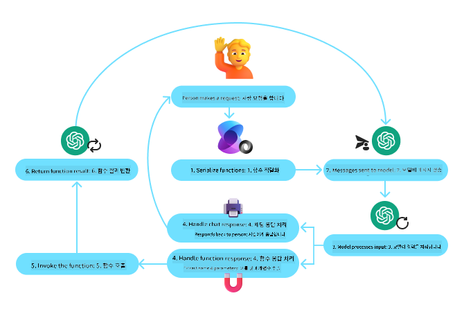
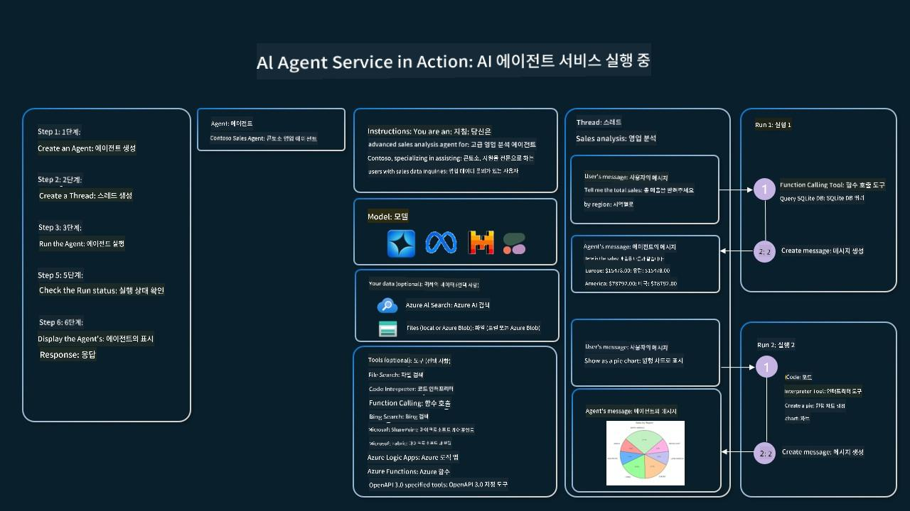

<!--
CO_OP_TRANSLATOR_METADATA:
{
  "original_hash": "e056335d729ba6e49571db7a6533825d",
  "translation_date": "2025-09-30T06:36:41+00:00",
  "source_file": "04-tool-use/README.md",
  "language_code": "ko"
}
-->
[](https://youtu.be/vieRiPRx-gI?si=cEZ8ApnT6Sus9rhn)

> _(위 이미지를 클릭하면 이 강의의 영상을 볼 수 있습니다)_

# 도구 사용 디자인 패턴

도구는 AI 에이전트가 더 넓은 범위의 기능을 가질 수 있도록 해주는 흥미로운 요소입니다. 에이전트가 수행할 수 있는 행동이 제한적일 때, 도구를 추가하면 에이전트가 다양한 행동을 수행할 수 있게 됩니다. 이 장에서는 AI 에이전트가 특정 도구를 사용하여 목표를 달성하는 방법을 설명하는 도구 사용 디자인 패턴에 대해 살펴보겠습니다.

## 소개

이 강의에서는 다음 질문에 답하고자 합니다:

- 도구 사용 디자인 패턴이란 무엇인가요?
- 이 패턴이 적용될 수 있는 사용 사례는 무엇인가요?
- 디자인 패턴을 구현하기 위해 필요한 요소/구성 요소는 무엇인가요?
- 신뢰할 수 있는 AI 에이전트를 구축하기 위해 도구 사용 디자인 패턴을 사용할 때 고려해야 할 특별한 사항은 무엇인가요?

## 학습 목표

이 강의를 완료한 후, 여러분은 다음을 할 수 있습니다:

- 도구 사용 디자인 패턴과 그 목적을 정의할 수 있습니다.
- 도구 사용 디자인 패턴이 적용 가능한 사용 사례를 식별할 수 있습니다.
- 디자인 패턴을 구현하기 위해 필요한 주요 요소를 이해할 수 있습니다.
- 이 디자인 패턴을 사용하는 AI 에이전트의 신뢰성을 보장하기 위한 고려 사항을 인식할 수 있습니다.

## 도구 사용 디자인 패턴이란 무엇인가요?

**도구 사용 디자인 패턴**은 LLM이 외부 도구와 상호작용하여 특정 목표를 달성할 수 있도록 하는 데 초점을 맞춥니다. 도구는 에이전트가 행동을 수행하기 위해 실행할 수 있는 코드입니다. 도구는 계산기와 같은 간단한 함수일 수도 있고, 주식 가격 조회나 날씨 예보와 같은 제3자 서비스에 대한 API 호출일 수도 있습니다. AI 에이전트의 맥락에서 도구는 **모델 생성 함수 호출**에 따라 에이전트가 실행하도록 설계됩니다.

## 이 패턴이 적용될 수 있는 사용 사례는 무엇인가요?

AI 에이전트는 도구를 활용하여 복잡한 작업을 완료하거나 정보를 검색하거나 결정을 내릴 수 있습니다. 도구 사용 디자인 패턴은 데이터베이스, 웹 서비스 또는 코드 인터프리터와 같은 외부 시스템과 동적으로 상호작용해야 하는 시나리오에서 자주 사용됩니다. 이 능력은 다음과 같은 다양한 사용 사례에 유용합니다:

- **동적 정보 검색:** 에이전트가 외부 API나 데이터베이스를 쿼리하여 최신 데이터를 가져올 수 있습니다(예: SQLite 데이터베이스를 쿼리하여 데이터 분석 수행, 주식 가격 또는 날씨 정보 가져오기).
- **코드 실행 및 해석:** 에이전트가 코드나 스크립트를 실행하여 수학 문제를 해결하거나 보고서를 생성하거나 시뮬레이션을 수행할 수 있습니다.
- **워크플로 자동화:** 작업 스케줄러, 이메일 서비스 또는 데이터 파이프라인과 같은 도구를 통합하여 반복적이거나 다단계 워크플로를 자동화합니다.
- **고객 지원:** 에이전트가 CRM 시스템, 티켓 플랫폼 또는 지식 기반과 상호작용하여 사용자 문의를 해결할 수 있습니다.
- **콘텐츠 생성 및 편집:** 에이전트가 문법 검사기, 텍스트 요약기 또는 콘텐츠 안전 평가 도구와 같은 도구를 활용하여 콘텐츠 생성 작업을 지원할 수 있습니다.

## 디자인 패턴을 구현하기 위해 필요한 요소/구성 요소는 무엇인가요?

이 구성 요소들은 AI 에이전트가 다양한 작업을 수행할 수 있도록 합니다. 도구 사용 디자인 패턴을 구현하기 위해 필요한 주요 요소를 살펴보겠습니다:

- **함수/도구 스키마**: 사용 가능한 도구에 대한 상세한 정의로, 함수 이름, 목적, 필요한 매개변수 및 예상 출력이 포함됩니다. 이러한 스키마는 LLM이 사용 가능한 도구와 유효한 요청을 구성하는 방법을 이해할 수 있도록 합니다.

- **함수 실행 로직**: 사용자의 의도와 대화 맥락에 따라 도구가 호출되는 방법과 시기를 관리합니다. 여기에는 계획 모듈, 라우팅 메커니즘 또는 도구 사용을 동적으로 결정하는 조건 흐름이 포함될 수 있습니다.

- **메시지 처리 시스템**: 사용자 입력, LLM 응답, 도구 호출 및 도구 출력 간의 대화 흐름을 관리하는 구성 요소입니다.

- **도구 통합 프레임워크**: 에이전트를 간단한 함수 또는 복잡한 외부 서비스와 연결하는 인프라입니다.

- **오류 처리 및 검증**: 도구 실행 실패를 처리하고, 매개변수를 검증하며, 예상치 못한 응답을 관리하는 메커니즘입니다.

- **상태 관리**: 대화 맥락, 이전 도구 상호작용 및 지속적인 데이터를 추적하여 다중 턴 상호작용에서 일관성을 보장합니다.

다음으로 함수/도구 호출에 대해 자세히 살펴보겠습니다.

### 함수/도구 호출

함수 호출은 대형 언어 모델(LLM)이 도구와 상호작용할 수 있도록 하는 주요 방법입니다. '함수'와 '도구'는 종종 서로 교환하여 사용되는데, '함수'(재사용 가능한 코드 블록)가 에이전트가 작업을 수행하는 데 사용하는 '도구'이기 때문입니다. 함수의 코드가 호출되기 위해서는 LLM이 사용자 요청을 함수 설명과 비교해야 합니다. 이를 위해 사용 가능한 모든 함수의 설명을 포함하는 스키마가 LLM에 전달됩니다. LLM은 작업에 가장 적합한 함수를 선택하고 함수 이름과 인수를 반환합니다. 선택된 함수가 호출되고, 그 응답이 LLM에 다시 전달되며, LLM은 정보를 사용하여 사용자 요청에 응답합니다.

에이전트에 대한 함수 호출을 구현하려면 다음이 필요합니다:

1. 함수 호출을 지원하는 LLM 모델
2. 함수 설명을 포함하는 스키마
3. 설명된 각 함수의 코드

샌프란시스코의 현재 시간을 가져오는 예제를 사용해 설명해 보겠습니다:

1. **함수 호출을 지원하는 LLM 초기화:**

    모든 모델이 함수 호출을 지원하는 것은 아니므로 사용하는 LLM이 이를 지원하는지 확인하는 것이 중요합니다. <a href="https://learn.microsoft.com/azure/ai-services/openai/how-to/function-calling" target="_blank">Azure OpenAI</a>는 함수 호출을 지원합니다. Azure OpenAI 클라이언트를 초기화하는 것으로 시작할 수 있습니다.

    ```python
    # Initialize the Azure OpenAI client
    client = AzureOpenAI(
        azure_endpoint = os.getenv("AZURE_OPENAI_ENDPOINT"), 
        api_key=os.getenv("AZURE_OPENAI_API_KEY"),  
        api_version="2024-05-01-preview"
    )
    ```

1. **함수 스키마 생성:**

    다음으로 함수 이름, 함수가 수행하는 작업에 대한 설명, 함수 매개변수의 이름과 설명을 포함하는 JSON 스키마를 정의합니다. 그런 다음 이 스키마를 이전에 생성한 클라이언트와 함께 샌프란시스코의 시간을 찾으려는 사용자 요청과 함께 전달합니다. 중요한 점은 **도구 호출**이 반환된다는 것이며, 질문에 대한 최종 답변이 **아니라는** 것입니다. 앞서 언급했듯이, LLM은 작업에 선택된 함수 이름과 전달될 인수를 반환합니다.

    ```python
    # Function description for the model to read
    tools = [
        {
            "type": "function",
            "function": {
                "name": "get_current_time",
                "description": "Get the current time in a given location",
                "parameters": {
                    "type": "object",
                    "properties": {
                        "location": {
                            "type": "string",
                            "description": "The city name, e.g. San Francisco",
                        },
                    },
                    "required": ["location"],
                },
            }
        }
    ]
    ```
   
    ```python
  
    # Initial user message
    messages = [{"role": "user", "content": "What's the current time in San Francisco"}] 
  
    # First API call: Ask the model to use the function
      response = client.chat.completions.create(
          model=deployment_name,
          messages=messages,
          tools=tools,
          tool_choice="auto",
      )
  
      # Process the model's response
      response_message = response.choices[0].message
      messages.append(response_message)
  
      print("Model's response:")  

      print(response_message)
  
    ```

    ```bash
    Model's response:
    ChatCompletionMessage(content=None, role='assistant', function_call=None, tool_calls=[ChatCompletionMessageToolCall(id='call_pOsKdUlqvdyttYB67MOj434b', function=Function(arguments='{"location":"San Francisco"}', name='get_current_time'), type='function')])
    ```
  
1. **작업을 수행하는 데 필요한 함수 코드:**

    이제 LLM이 실행해야 할 함수를 선택했으므로 작업을 수행하는 코드를 구현하고 실행해야 합니다. 우리는 Python으로 현재 시간을 가져오는 코드를 구현할 수 있습니다. 또한 response_message에서 이름과 인수를 추출하여 최종 결과를 얻는 코드를 작성해야 합니다.

    ```python
      def get_current_time(location):
        """Get the current time for a given location"""
        print(f"get_current_time called with location: {location}")  
        location_lower = location.lower()
        
        for key, timezone in TIMEZONE_DATA.items():
            if key in location_lower:
                print(f"Timezone found for {key}")  
                current_time = datetime.now(ZoneInfo(timezone)).strftime("%I:%M %p")
                return json.dumps({
                    "location": location,
                    "current_time": current_time
                })
      
        print(f"No timezone data found for {location_lower}")  
        return json.dumps({"location": location, "current_time": "unknown"})
    ```

     ```python
     # Handle function calls
      if response_message.tool_calls:
          for tool_call in response_message.tool_calls:
              if tool_call.function.name == "get_current_time":
     
                  function_args = json.loads(tool_call.function.arguments)
     
                  time_response = get_current_time(
                      location=function_args.get("location")
                  )
     
                  messages.append({
                      "tool_call_id": tool_call.id,
                      "role": "tool",
                      "name": "get_current_time",
                      "content": time_response,
                  })
      else:
          print("No tool calls were made by the model.")  
  
      # Second API call: Get the final response from the model
      final_response = client.chat.completions.create(
          model=deployment_name,
          messages=messages,
      )
  
      return final_response.choices[0].message.content
     ```

     ```bash
      get_current_time called with location: San Francisco
      Timezone found for san francisco
      The current time in San Francisco is 09:24 AM.
     ```

함수 호출은 대부분의 에이전트 도구 사용 설계의 핵심이지만, 처음부터 이를 구현하는 것은 때로는 어려울 수 있습니다. [Lesson 2](../../../02-explore-agentic-frameworks)에서 배운 것처럼 에이전트 프레임워크는 도구 사용을 구현하기 위한 사전 구축된 구성 요소를 제공합니다.

## 에이전트 프레임워크를 활용한 도구 사용 예제

다양한 에이전트 프레임워크를 사용하여 도구 사용 디자인 패턴을 구현하는 방법에 대한 몇 가지 예를 소개합니다:

### Semantic Kernel

<a href="https://learn.microsoft.com/azure/ai-services/agents/overview" target="_blank">Semantic Kernel</a>은 대형 언어 모델(LLM)을 사용하는 .NET, Python, Java 개발자를 위한 오픈 소스 AI 프레임워크입니다. 함수 호출을 자동으로 설명하고 함수와 매개변수를 모델에 전달하는 <a href="https://learn.microsoft.com/semantic-kernel/concepts/ai-services/chat-completion/function-calling/?pivots=programming-language-python#1-serializing-the-functions" target="_blank">직렬화</a> 과정을 통해 함수 호출 사용을 간소화합니다. 또한 모델과 코드 간의 상호작용을 처리합니다. Semantic Kernel과 같은 에이전트 프레임워크를 사용하면 <a href="https://github.com/microsoft/semantic-kernel/blob/main/python/samples/getting_started_with_agents/openai_assistant/step4_assistant_tool_file_search.py" target="_blank">파일 검색</a> 및 <a href="https://github.com/microsoft/semantic-kernel/blob/main/python/samples/getting_started_with_agents/openai_assistant/step3_assistant_tool_code_interpreter.py" target="_blank">코드 인터프리터</a>와 같은 사전 구축된 도구에 액세스할 수 있다는 장점도 있습니다.

다음 다이어그램은 Semantic Kernel을 사용한 함수 호출 과정을 보여줍니다:



Semantic Kernel에서는 함수/도구를 <a href="https://learn.microsoft.com/semantic-kernel/concepts/plugins/?pivots=programming-language-python" target="_blank">플러그인</a>이라고 부릅니다. 이전에 본 `get_current_time` 함수를 클래스 형태로 변환하여 플러그인으로 만들 수 있습니다. 또한 함수 설명을 받는 `kernel_function` 데코레이터를 가져올 수 있습니다. 그런 다음 GetCurrentTimePlugin으로 커널을 생성하면 커널이 함수와 매개변수를 자동으로 직렬화하여 LLM에 보낼 스키마를 생성합니다.

```python
from semantic_kernel.functions import kernel_function

class GetCurrentTimePlugin:
    async def __init__(self, location):
        self.location = location

    @kernel_function(
        description="Get the current time for a given location"
    )
    def get_current_time(location: str = ""):
        ...

```

```python 
from semantic_kernel import Kernel

# Create the kernel
kernel = Kernel()

# Create the plugin
get_current_time_plugin = GetCurrentTimePlugin(location)

# Add the plugin to the kernel
kernel.add_plugin(get_current_time_plugin)
```
  
### Azure AI Agent Service

<a href="https://learn.microsoft.com/azure/ai-services/agents/overview" target="_blank">Azure AI Agent Service</a>는 개발자가 기본 컴퓨팅 및 스토리지 리소스를 관리하지 않고도 고품질의 확장 가능한 AI 에이전트를 안전하게 구축, 배포 및 확장할 수 있도록 설계된 최신 에이전트 프레임워크입니다. 특히 엔터프라이즈 애플리케이션에 유용하며, 엔터프라이즈급 보안을 갖춘 완전 관리형 서비스입니다.

LLM API를 직접 개발하는 것과 비교했을 때, Azure AI Agent Service는 다음과 같은 장점을 제공합니다:

- 자동 도구 호출 – 도구 호출을 분석하고, 도구를 호출하며, 응답을 처리할 필요가 없습니다. 이 모든 것이 서버 측에서 처리됩니다.
- 안전하게 관리되는 데이터 – 대화 상태를 직접 관리하는 대신, 스레드를 사용하여 필요한 모든 정보를 저장할 수 있습니다.
- 기본 제공 도구 – Bing, Azure AI Search, Azure Functions와 같은 데이터 소스와 상호작용할 수 있는 도구를 사용할 수 있습니다.

Azure AI Agent Service에서 사용할 수 있는 도구는 두 가지 범주로 나뉩니다:

1. 지식 도구:
    - <a href="https://learn.microsoft.com/azure/ai-services/agents/how-to/tools/bing-grounding?tabs=python&pivots=overview" target="_blank">Bing 검색을 통한 기반 설정</a>
    - <a href="https://learn.microsoft.com/azure/ai-services/agents/how-to/tools/file-search?tabs=python&pivots=overview" target="_blank">파일 검색</a>
    - <a href="https://learn.microsoft.com/azure/ai-services/agents/how-to/tools/azure-ai-search?tabs=azurecli%2Cpython&pivots=overview-azure-ai-search" target="_blank">Azure AI Search</a>

2. 액션 도구:
    - <a href="https://learn.microsoft.com/azure/ai-services/agents/how-to/tools/function-calling?tabs=python&pivots=overview" target="_blank">함수 호출</a>
    - <a href="https://learn.microsoft.com/azure/ai-services/agents/how-to/tools/code-interpreter?tabs=python&pivots=overview" target="_blank">코드 인터프리터</a>
    - <a href="https://learn.microsoft.com/azure/ai-services/agents/how-to/tools/openapi-spec?tabs=python&pivots=overview" target="_blank">OpenAPI 정의 도구</a>
    - <a href="https://learn.microsoft.com/azure/ai-services/agents/how-to/tools/azure-functions?pivots=overview" target="_blank">Azure Functions</a>

Agent Service를 사용하면 이러한 도구를 `toolset`으로 함께 사용할 수 있습니다. 또한 특정 대화의 메시지 기록을 추적하는 `threads`를 활용합니다.

Contoso라는 회사의 영업 에이전트라고 가정해 보겠습니다. 여러분은 영업 데이터를 분석할 수 있는 대화형 에이전트를 개발하고 싶습니다.

다음 이미지는 Azure AI Agent Service를 사용하여 영업 데이터를 분석하는 방법을 보여줍니다:



이 서비스에서 도구를 사용하려면 클라이언트를 생성하고 도구 또는 도구 세트를 정의할 수 있습니다. 이를 실제로 구현하기 위해 다음 Python 코드를 사용할 수 있습니다. LLM은 도구 세트를 살펴보고 사용자가 생성한 함수 `fetch_sales_data_using_sqlite_query`를 사용할지, 아니면 사전 구축된 코드 인터프리터를 사용할지 사용자 요청에 따라 결정할 수 있습니다.

```python 
import os
from azure.ai.projects import AIProjectClient
from azure.identity import DefaultAzureCredential
from fetch_sales_data_functions import fetch_sales_data_using_sqlite_query # fetch_sales_data_using_sqlite_query function which can be found in a fetch_sales_data_functions.py file.
from azure.ai.projects.models import ToolSet, FunctionTool, CodeInterpreterTool

project_client = AIProjectClient.from_connection_string(
    credential=DefaultAzureCredential(),
    conn_str=os.environ["PROJECT_CONNECTION_STRING"],
)

# Initialize function calling agent with the fetch_sales_data_using_sqlite_query function and adding it to the toolset
fetch_data_function = FunctionTool(fetch_sales_data_using_sqlite_query)
toolset = ToolSet()
toolset.add(fetch_data_function)

# Initialize Code Interpreter tool and adding it to the toolset. 
code_interpreter = code_interpreter = CodeInterpreterTool()
toolset = ToolSet()
toolset.add(code_interpreter)

agent = project_client.agents.create_agent(
    model="gpt-4o-mini", name="my-agent", instructions="You are helpful agent", 
    toolset=toolset
)
```

## 신뢰할 수 있는 AI 에이전트를 구축하기 위해 도구 사용 디자인 패턴을 사용할 때 고려해야 할 특별한 사항은 무엇인가요?

LLM이 동적으로 생성한 SQL과 관련된 일반적인 우려는 보안, 특히 SQL 삽입 또는 데이터베이스 삭제나 변조와 같은 악의적인 행동의 위험입니다. 이러한 우려는 타당하지만, 데이터베이스 액세스 권한을 적절히 구성함으로써 효과적으로 완화할 수 있습니다. 대부분의 데이터베이스에서는 데이터베이스를 읽기 전용으로 구성하는 것이 포함됩니다. PostgreSQL이나 Azure SQL과 같은 데이터베이스 서비스의 경우 앱에 읽기 전용(SELECT) 역할을 할당해야 합니다.
앱을 안전한 환경에서 실행하면 보호 수준이 더욱 강화됩니다. 기업 환경에서는 데이터를 일반적으로 운영 시스템에서 추출하고 변환하여 읽기 전용 데이터베이스나 데이터 웨어하우스로 옮기며, 사용자 친화적인 스키마를 제공합니다. 이러한 접근 방식은 데이터의 보안을 유지하고 성능 및 접근성을 최적화하며, 앱이 제한된 읽기 전용 접근 권한만 가지도록 보장합니다.

### 도구 사용 디자인 패턴에 대해 더 궁금한 점이 있으신가요?

[Azure AI Foundry Discord](https://aka.ms/ai-agents/discord)에 참여하여 다른 학습자들과 만나고, 오피스 아워에 참석하며 AI Agents 관련 질문에 대한 답변을 받아보세요.

## 추가 자료

- <a href="https://microsoft.github.io/build-your-first-agent-with-azure-ai-agent-service-workshop/" target="_blank">Azure AI Agents Service 워크숍</a>
- <a href="https://github.com/Azure-Samples/contoso-creative-writer/tree/main/docs/workshop" target="_blank">Contoso Creative Writer 멀티 에이전트 워크숍</a>
- <a href="https://learn.microsoft.com/semantic-kernel/concepts/ai-services/chat-completion/function-calling/?pivots=programming-language-python#1-serializing-the-functions" target="_blank">Semantic Kernel 함수 호출 튜토리얼</a>
- <a href="https://github.com/microsoft/semantic-kernel/blob/main/python/samples/getting_started_with_agents/openai_assistant/step3_assistant_tool_code_interpreter.py" target="_blank">Semantic Kernel 코드 인터프리터</a>
- <a href="https://microsoft.github.io/autogen/dev/user-guide/core-user-guide/components/tools.html" target="_blank">Autogen 도구</a>

## 이전 강의

[에이전트 디자인 패턴 이해하기](../03-agentic-design-patterns/README.md)

## 다음 강의

[Agentic RAG](../05-agentic-rag/README.md)

---

**면책 조항**:  
이 문서는 AI 번역 서비스 [Co-op Translator](https://github.com/Azure/co-op-translator)를 사용하여 번역되었습니다. 정확성을 위해 최선을 다하고 있으나, 자동 번역에는 오류나 부정확한 내용이 포함될 수 있습니다. 원본 문서의 원어 버전이 권위 있는 출처로 간주되어야 합니다. 중요한 정보의 경우, 전문적인 인간 번역을 권장합니다. 이 번역 사용으로 인해 발생하는 오해나 잘못된 해석에 대해 당사는 책임을 지지 않습니다.