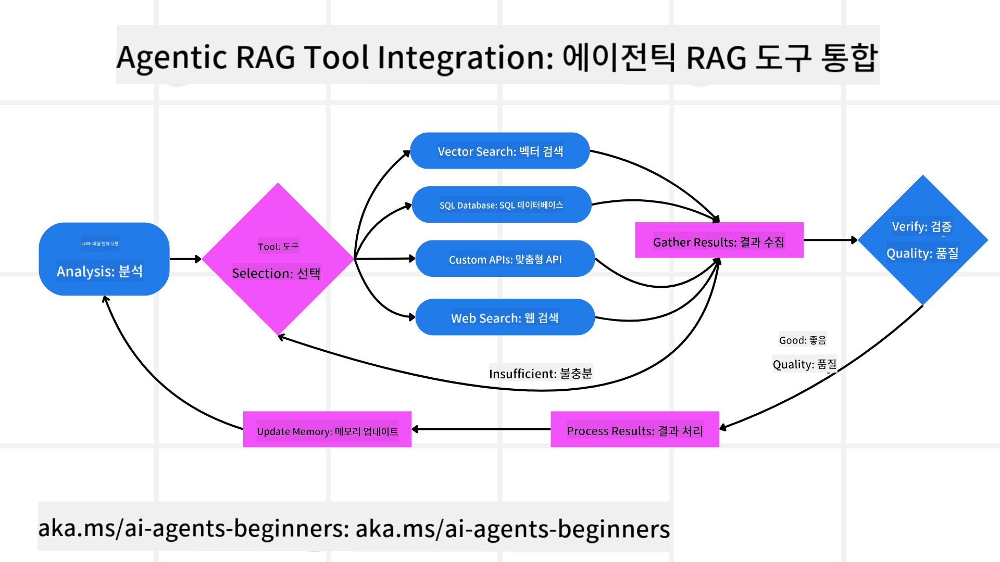
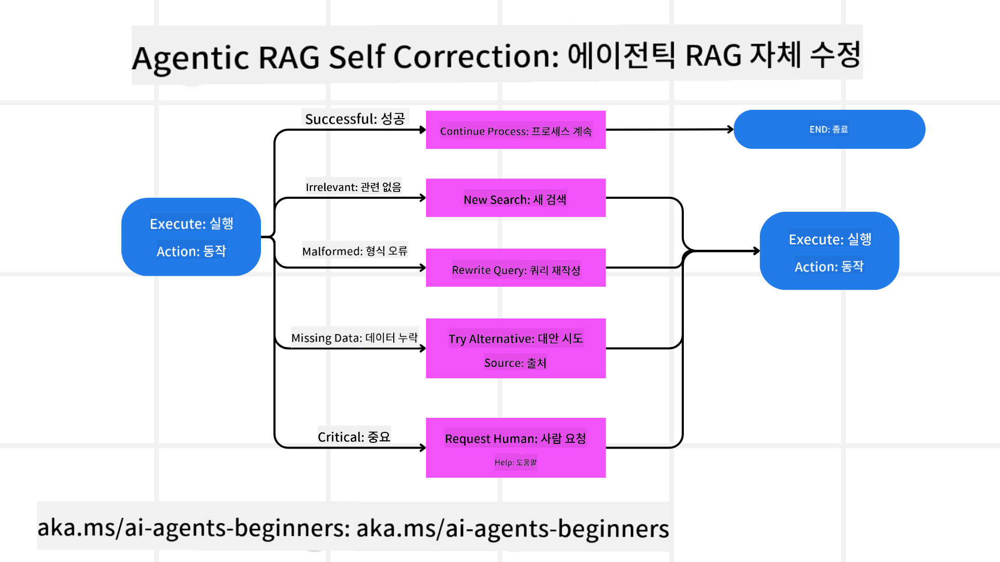
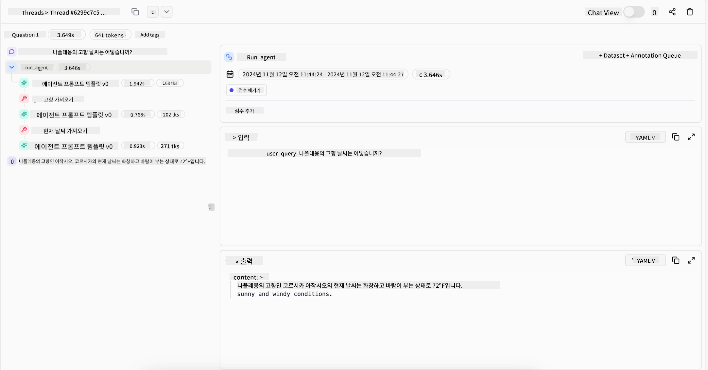

<!--
CO_OP_TRANSLATOR_METADATA:
{
  "original_hash": "d2f04b783b9e1253100329afd698f8ff",
  "translation_date": "2025-08-30T08:04:19+00:00",
  "source_file": "05-agentic-rag/README.md",
  "language_code": "ko"
}
-->

> _(위 이미지를 클릭하면 이 강의의 동영상을 볼 수 있습니다)_

# Agentic RAG

이 강의는 Agentic Retrieval-Augmented Generation (Agentic RAG)에 대한 포괄적인 개요를 제공합니다. Agentic RAG는 대규모 언어 모델(LLM)이 외부 소스에서 정보를 가져오면서 다음 단계를 자율적으로 계획하는 새로운 AI 패러다임입니다. 정적인 정보 검색 후 읽기 패턴과 달리, Agentic RAG는 LLM에 반복적으로 호출하며 도구 또는 함수 호출과 구조화된 출력을 교차적으로 사용합니다. 시스템은 결과를 평가하고, 쿼리를 수정하며, 필요할 경우 추가 도구를 호출하고, 만족스러운 솔루션이 나올 때까지 이 과정을 계속 반복합니다.

## 소개

이 강의에서는 다음을 다룹니다:

- **Agentic RAG 이해하기:** 대규모 언어 모델(LLM)이 외부 데이터 소스에서 정보를 가져오면서 다음 단계를 자율적으로 계획하는 AI의 새로운 패러다임에 대해 알아봅니다.
- **반복적 Maker-Checker 스타일 이해하기:** LLM에 반복적으로 호출하며 도구 또는 함수 호출과 구조화된 출력을 교차적으로 사용하여 정확성을 개선하고 잘못된 쿼리를 처리하는 루프를 이해합니다.
- **실용적인 응용 사례 탐구:** 정확성이 중요한 환경, 복잡한 데이터베이스 상호작용, 확장된 워크플로우와 같은 상황에서 Agentic RAG가 빛을 발하는 사례를 확인합니다.

## 학습 목표

이 강의를 완료한 후, 다음을 이해하거나 수행할 수 있습니다:

- **Agentic RAG 이해하기:** 대규모 언어 모델(LLM)이 외부 데이터 소스에서 정보를 가져오면서 다음 단계를 자율적으로 계획하는 AI의 새로운 패러다임에 대해 배웁니다.
- **반복적 Maker-Checker 스타일:** 정확성을 개선하고 잘못된 쿼리를 처리하기 위해 도구 또는 함수 호출과 구조화된 출력을 교차적으로 사용하는 반복적 호출 루프의 개념을 이해합니다.
- **추론 과정 소유하기:** 시스템이 사전 정의된 경로에 의존하지 않고 문제를 접근하는 방법을 결정하는 추론 과정을 소유하는 능력을 이해합니다.
- **워크플로우:** 에이전트 모델이 시장 동향 보고서를 검색하고, 경쟁사 데이터를 식별하며, 내부 판매 지표를 연관시키고, 결과를 종합하며, 전략을 평가하는 과정을 독립적으로 결정하는 방법을 이해합니다.
- **반복적 루프, 도구 통합 및 메모리:** 반복적 상호작용 패턴에 의존하며, 반복 루프를 피하고 정보에 입각한 결정을 내리기 위해 단계 간 상태와 메모리를 유지하는 시스템을 배웁니다.
- **실패 모드 처리 및 자기 수정:** 진단 도구 사용, 재쿼리, 인간 감독에 의존하는 등 시스템의 강력한 자기 수정 메커니즘을 탐구합니다.
- **에이전시의 한계:** 도메인별 자율성, 인프라 의존성, 안전 장치 준수에 초점을 맞춘 Agentic RAG의 한계를 이해합니다.
- **실용적인 사용 사례와 가치:** 정확성이 중요한 환경, 복잡한 데이터베이스 상호작용, 확장된 워크플로우와 같은 상황에서 Agentic RAG가 빛을 발하는 사례를 확인합니다.
- **거버넌스, 투명성 및 신뢰:** 설명 가능한 추론, 편향 제어, 인간 감독을 포함한 거버넌스와 투명성의 중요성을 배웁니다.

## Agentic RAG란 무엇인가?

Agentic Retrieval-Augmented Generation (Agentic RAG)은 대규모 언어 모델(LLM)이 외부 소스에서 정보를 가져오면서 다음 단계를 자율적으로 계획하는 새로운 AI 패러다임입니다. 정적인 정보 검색 후 읽기 패턴과 달리, Agentic RAG는 LLM에 반복적으로 호출하며 도구 또는 함수 호출과 구조화된 출력을 교차적으로 사용합니다. 시스템은 결과를 평가하고, 쿼리를 수정하며, 필요할 경우 추가 도구를 호출하고, 만족스러운 솔루션이 나올 때까지 이 과정을 계속 반복합니다.

이 반복적인 “Maker-Checker” 스타일은 정확성을 개선하고, 구조화된 데이터베이스(NL2SQL 등)에 대한 잘못된 쿼리를 처리하며, 균형 잡힌 고품질 결과를 보장하도록 설계되었습니다. 시스템은 사전 정의된 경로에 의존하지 않고, 실패한 쿼리를 다시 작성하고, 다른 검색 방법을 선택하며, 여러 도구를 통합할 수 있습니다. 예를 들어 Azure AI Search의 벡터 검색, SQL 데이터베이스 또는 사용자 지정 API를 사용하여 최종 답변을 완성합니다. 에이전트 시스템의 차별화된 특징은 추론 과정을 소유하는 능력입니다. 전통적인 RAG 구현은 사전 정의된 경로에 의존하지만, 에이전트 시스템은 발견한 정보의 품질에 따라 단계 순서를 자율적으로 결정합니다.

## Agentic Retrieval-Augmented Generation (Agentic RAG)의 정의

Agentic Retrieval-Augmented Generation (Agentic RAG)은 LLM이 외부 데이터 소스에서 정보를 가져오는 것뿐만 아니라 다음 단계를 자율적으로 계획하는 AI 개발의 새로운 패러다임입니다. 정적인 정보 검색 후 읽기 패턴이나 신중하게 스크립트된 프롬프트 시퀀스와 달리, Agentic RAG는 LLM에 반복적으로 호출하며 도구 또는 함수 호출과 구조화된 출력을 교차적으로 사용합니다. 매 단계마다 시스템은 얻은 결과를 평가하고, 쿼리를 수정할지 여부를 결정하며, 필요할 경우 추가 도구를 호출하고, 만족스러운 솔루션이 나올 때까지 이 과정을 계속 반복합니다.

이 반복적인 “Maker-Checker” 스타일의 운영은 정확성을 개선하고, 구조화된 데이터베이스(NL2SQL 등)에 대한 잘못된 쿼리를 처리하며, 균형 잡힌 고품질 결과를 보장하도록 설계되었습니다. 신중하게 설계된 프롬프트 체인에만 의존하는 대신, 시스템은 추론 과정을 적극적으로 소유합니다. 실패한 쿼리를 다시 작성하고, 다른 검색 방법을 선택하며, 여러 도구를 통합할 수 있습니다. 예를 들어 Azure AI Search의 벡터 검색, SQL 데이터베이스 또는 사용자 지정 API를 사용하여 최종 답변을 완성합니다. 이를 통해 복잡한 오케스트레이션 프레임워크가 필요하지 않습니다. 대신 비교적 간단한 “LLM 호출 → 도구 사용 → LLM 호출 → …” 루프를 통해 정교하고 근거 있는 출력을 생성할 수 있습니다.

## 추론 과정 소유하기

시스템을 “에이전트적”으로 만드는 차별화된 특징은 추론 과정을 소유하는 능력입니다. 전통적인 RAG 구현은 모델이 무엇을 검색하고 언제 검색할지를 인간이 사전에 정의한 경로에 의존합니다. 하지만 시스템이 진정으로 에이전트적일 때는 문제를 접근하는 방법을 내부적으로 결정합니다. 단순히 스크립트를 실행하는 것이 아니라, 발견한 정보의 품질에 따라 단계 순서를 자율적으로 결정합니다.

예를 들어, 제품 출시 전략을 생성하라는 요청을 받았을 때, 전체 연구 및 의사 결정 워크플로우를 명시하는 프롬프트에만 의존하지 않습니다. 대신, 에이전트 모델은 독립적으로 다음을 결정합니다:

1. Bing Web Grounding을 사용하여 현재 시장 동향 보고서를 검색합니다.
2. Azure AI Search를 사용하여 관련 경쟁사 데이터를 식별합니다.
3. Azure SQL Database를 사용하여 과거 내부 판매 지표를 연관시킵니다.
4. Azure OpenAI Service를 통해 결과를 종합하여 일관된 전략을 만듭니다.
5. 전략의 격차나 불일치를 평가하고, 필요할 경우 추가 검색을 요청합니다.

이 모든 단계—쿼리 수정, 소스 선택, 답변에 만족할 때까지 반복—은 모델이 결정하며, 인간이 사전에 스크립트로 정의하지 않습니다.

## 반복적 루프, 도구 통합 및 메모리

에이전트 시스템은 반복적 상호작용 패턴에 의존합니다:

- **초기 호출:** 사용자의 목표(사용자 프롬프트)가 LLM에 전달됩니다.
- **도구 호출:** 모델이 누락된 정보나 모호한 지침을 식별하면, 벡터 데이터베이스 쿼리(Azure AI Search 하이브리드 검색 등) 또는 구조화된 SQL 호출과 같은 도구나 검색 방법을 선택하여 더 많은 컨텍스트를 수집합니다.
- **평가 및 수정:** 반환된 데이터를 검토한 후, 모델은 정보가 충분한지 여부를 결정합니다. 충분하지 않다면 쿼리를 수정하거나, 다른 도구를 시도하거나, 접근 방식을 조정합니다.
- **만족할 때까지 반복:** 이 사이클은 모델이 명확성과 증거를 충분히 확보했다고 판단할 때까지 계속됩니다.
- **메모리 및 상태:** 시스템은 단계 간 상태와 메모리를 유지하기 때문에 이전 시도와 결과를 기억하고, 반복 루프를 피하며 진행하면서 더 정보에 입각한 결정을 내릴 수 있습니다.

시간이 지남에 따라 이는 진화하는 이해의 감각을 만들어내며, 모델이 복잡하고 다단계 작업을 인간의 지속적인 개입이나 프롬프트 재구성이 필요 없이 탐색할 수 있게 합니다.

## 실패 모드 처리 및 자기 수정

Agentic RAG의 자율성은 강력한 자기 수정 메커니즘도 포함합니다. 시스템이 막다른 길에 도달했을 때—예를 들어 관련 없는 문서를 검색하거나 잘못된 쿼리를 만났을 때—다음과 같은 작업을 수행할 수 있습니다:

- **반복 및 재쿼리:** 낮은 가치의 응답을 반환하는 대신, 모델은 새로운 검색 전략을 시도하거나, 데이터베이스 쿼리를 다시 작성하거나, 대체 데이터 세트를 탐색합니다.
- **진단 도구 사용:** 시스템은 추론 단계를 디버그하거나 검색된 데이터의 정확성을 확인하기 위해 추가 기능을 호출할 수 있습니다. Azure AI Tracing과 같은 도구는 강력한 관찰성과 모니터링을 가능하게 합니다.
- **인간 감독에 의존:** 고위험 또는 반복적으로 실패하는 시나리오에서는 모델이 불확실성을 표시하고 인간의 지침을 요청할 수 있습니다. 인간이 수정 피드백을 제공하면, 모델은 이를 향후 학습에 통합할 수 있습니다.

이 반복적이고 역동적인 접근 방식은 모델이 지속적으로 개선되도록 하며, 단순한 일회성 시스템이 아니라 주어진 세션 동안 실수를 통해 학습하는 시스템이 되도록 합니다.

## 에이전시의 한계

작업 내에서의 자율성에도 불구하고, Agentic RAG는 인공지능 일반 지능(AGI)과 동일하지 않습니다. 그 “에이전트적” 능력은 인간 개발자가 제공한 도구, 데이터 소스, 정책에 제한됩니다. 자체 도구를 발명하거나 설정된 도메인 경계를 벗어날 수 없습니다. 대신, 제공된 리소스를 동적으로 조율하는 데 뛰어납니다.

더 발전된 AI 형태와의 주요 차이점은 다음과 같습니다:

1. **도메인별 자율성:** Agentic RAG 시스템은 알려진 도메인 내에서 사용자 정의 목표를 달성하는 데 초점을 맞추며, 쿼리 재작성이나 도구 선택과 같은 전략을 사용하여 결과를 개선합니다.
2. **인프라 의존성:** 시스템의 능력은 개발자가 통합한 도구와 데이터에 달려 있습니다. 인간의 개입 없이는 이러한 경계를 초과할 수 없습니다.
3. **안전 장치 준수:** 윤리적 지침, 규정 준수 규칙, 비즈니스 정책은 여전히 매우 중요합니다. 에이전트의 자유는 항상 안전 조치와 감독 메커니즘에 의해 제한됩니다.

## 실용적인 사용 사례와 가치

Agentic RAG는 반복적 수정과 정밀성이 요구되는 시나리오에서 빛을 발합니다:

1. **정확성이 중요한 환경:** 규정 준수 검사, 규제 분석 또는 법률 연구에서 에이전트 모델은 사실을 반복적으로 확인하고, 여러 소스를 참조하며, 철저히 검토된 답변을 생성할 때까지 쿼리를 다시 작성할 수 있습니다.
2. **복잡한 데이터베이스 상호작용:** 구조화된 데이터와 작업할 때 쿼리가 자주 실패하거나 조정이 필요한 경우, 시스템은 Azure SQL 또는 Microsoft Fabric OneLake를 사용하여 쿼리를 자율적으로 수정하며 최종 검색이 사용자의 의도와 일치하도록 보장합니다.
3. **확장된 워크플로우:** 새로운 정보가 나타남에 따라 세션이 진화할 수 있습니다. Agentic RAG는 지속적으로 새로운 데이터를 통합하며, 문제 공간에 대해 더 많이 학습하면서 전략을 변경할 수 있습니다.

## 거버넌스, 투명성 및 신뢰

이 시스템이 추론에서 더 자율적이 될수록, 거버넌스와 투명성이 중요합니다:

- **설명 가능한 추론:** 모델은 수행한 쿼리, 참조한 소스, 결론에 도달하기 위해 취한 추론 단계를 감사 기록으로 제공할 수 있습니다. Azure AI Content Safety와 Azure AI Tracing / GenAIOps와 같은 도구는 투명성을 유지하고 위험을 완화하는 데 도움을 줄 수 있습니다.
- **편향 제어 및 균형 잡힌 검색:** 개발자는 균형 잡힌 대표적인 데이터 소스가 고려되도록 검색 전략을 조정할 수 있으며, Azure Machine Learning을 사용하는 고급 데이터 과학 조직을 위한 사용자 지정 모델을 통해 출력물을 정기적으로 감사하여 편향이나 왜곡된 패턴을 감지할 수 있습니다.
- **인간 감독 및 규정 준수:** 민감한 작업의 경우, 인간 검토는 여전히 필수적입니다. Agentic RAG는 고위험 결정에서 인간 판단을 대체하지 않고, 더 철저히 검토된 옵션을 제공함으로써 이를 보완합니다.

행동 기록을 명확히 제공하는 도구가 필수적입니다. 그렇지 않으면 다단계 프로세스를 디버깅하는 것이 매우 어려울 수 있습니다. Chainlit을 개발한 Literal AI의 에이전트 실행 예제를 참조하세요:

## 결론

Agentic RAG는 AI 시스템이 복잡하고 데이터 집약적인 작업을 처리하는 방식에서 자연스러운 진화를 나타냅니다. 반복적 상호작용 패턴을 채택하고, 도구를 자율적으로 선택하며, 고품질 결과를 얻을 때까지 쿼리를 수정함으로써, 시스템은 정적인 프롬프트 추종을 넘어 더 적응적이고 컨텍스트를 인식하는 의사 결정자로 발전합니다. 여전히 인간이 정의한 인프라와 윤리적 지침에 의해 제한되지만, 이러한 에이전트적 능력은 기업과 최종 사용자 모두에게 더 풍부하고 역동적이며 궁극적으로 더 유용한 AI 상호작용을 가능하게 합니다.

### Agentic RAG에 대해 더 궁금한 점이 있으신가요?

[Azure AI Foundry Discord](https://aka.ms/ai-agents/discord)에 참여하여 다른 학습자들과 만나고, 오피스 아워에 참석하며 AI 에이전트에 대한 질문에 답변을 받을 수 있습니다.

## 추가 자료

-
<a href="https://learn.microsoft.com/training/modules/use-own-data-azure-openai" target="_blank">
Azure OpenAI 서비스를 활용한 검색 증강 생성(RAG) 구현: Azure OpenAI 서비스를 사용하여 자신의 데이터를 활용하는 방법을 배워보세요. 이 Microsoft Learn 모듈은 RAG 구현에 대한 포괄적인 가이드를 제공합니다.
- <a href="https://learn.microsoft.com/azure/ai-studio/concepts/evaluation-approach-gen-ai" target="_blank">Azure AI Foundry를 활용한 생성형 AI 애플리케이션 평가: 이 글은 공개적으로 사용 가능한 데이터셋을 기반으로 모델을 평가하고 비교하는 방법을 다루며, Agentic AI 애플리케이션과 RAG 아키텍처를 포함합니다</a>
- <a href="https://weaviate.io/blog/what-is-agentic-rag" target="_blank">Agentic RAG란 무엇인가 | Weaviate</a>
- <a href="https://ragaboutit.com/agentic-rag-a-complete-guide-to-agent-based-retrieval-augmented-generation/" target="_blank">Agentic RAG: 에이전트 기반 검색 증강 생성에 대한 완벽한 가이드 – RAG 관련 뉴스</a>
- <a href="https://huggingface.co/learn/cookbook/agent_rag" target="_blank">Agentic RAG: 쿼리 재구성과 자체 쿼리를 통해 RAG를 강화하세요! Hugging Face 오픈소스 AI 요리책</a>
- <a href="https://youtu.be/aQ4yQXeB1Ss?si=2HUqBzHoeB5tR04U" target="_blank">RAG에 Agentic 레이어 추가하기</a>
- <a href="https://www.youtube.com/watch?v=zeAyuLc_f3Q&t=244s" target="_blank">지식 어시스턴트의 미래: Jerry Liu</a>
- <a href="https://www.youtube.com/watch?v=AOSjiXP1jmQ" target="_blank">Agentic RAG 시스템 구축 방법</a>
- <a href="https://ignite.microsoft.com/sessions/BRK102?source=sessions" target="_blank">Azure AI Foundry Agent Service를 활용하여 AI 에이전트를 확장하기</a>

### 학술 논문

- <a href="https://arxiv.org/abs/2303.17651" target="_blank">2303.17651 Self-Refine: 자기 피드백을 활용한 반복적 개선</a>
- <a href="https://arxiv.org/abs/2303.11366" target="_blank">2303.11366 Reflexion: 언어 에이전트와 언어 강화 학습</a>
- <a href="https://arxiv.org/abs/2305.11738" target="_blank">2305.11738 CRITIC: 대형 언어 모델은 도구와 상호작용하며 스스로 수정할 수 있음</a>
- <a href="https://arxiv.org/abs/2501.09136" target="_blank">2501.09136 Agentic Retrieval-Augmented Generation: Agentic RAG에 대한 설문 조사</a>

## 이전 강의

[도구 사용 디자인 패턴](../04-tool-use/README.md)

## 다음 강의

[신뢰할 수 있는 AI 에이전트 구축](../06-building-trustworthy-agents/README.md)

---

**면책 조항**:  
이 문서는 AI 번역 서비스 [Co-op Translator](https://github.com/Azure/co-op-translator)를 사용하여 번역되었습니다. 정확성을 위해 최선을 다하고 있으나, 자동 번역에는 오류나 부정확성이 포함될 수 있습니다. 원본 문서를 해당 언어로 작성된 상태에서 권위 있는 자료로 간주해야 합니다. 중요한 정보의 경우, 전문적인 인간 번역을 권장합니다. 이 번역 사용으로 인해 발생할 수 있는 오해나 잘못된 해석에 대해 당사는 책임을 지지 않습니다.  