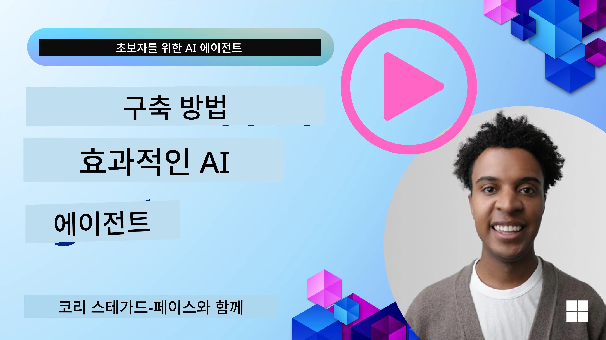
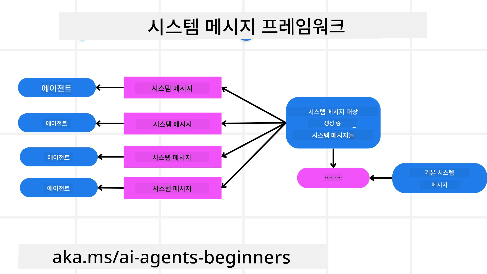
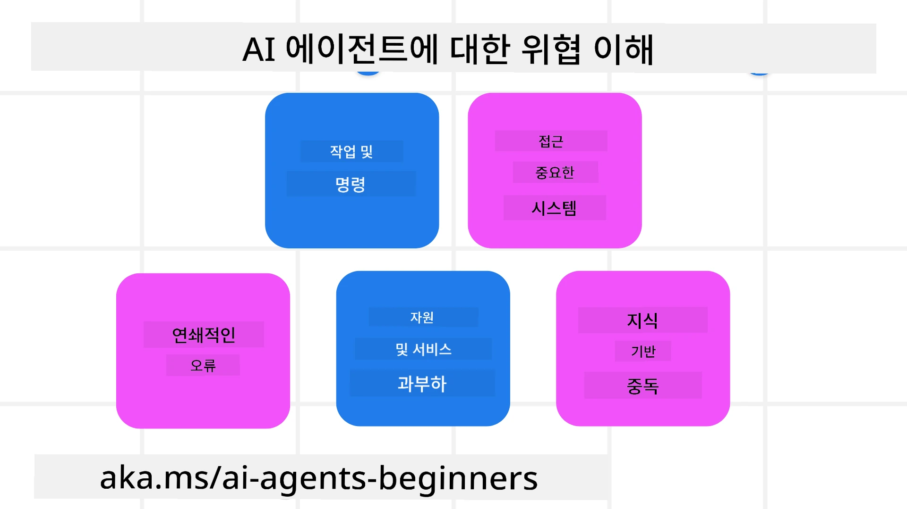
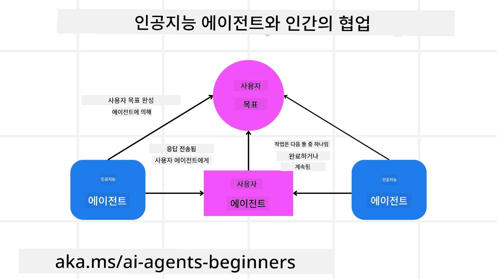

[](https://youtu.be/iZKkMEGBCUQ?si=Q-kEbcyHUMPoHp8L)

> _(위의 이미지를 클릭하여 이 수업의 비디오를 시청하세요)_

# 신뢰할 수 있는 AI 에이전트 구축

## 소개

이 수업에서는 다음 내용을 다룹니다:

- 안전하고 효과적인 AI 에이전트 구축 및 배포 방법
- AI 에이전트를 개발할 때의 주요 보안 고려사항
- AI 에이전트를 개발할 때 데이터 및 사용자 프라이버시를 유지하는 방법

## 학습 목표

이 수업을 완료하면 다음을 알게 됩니다:

- AI 에이전트를 만들 때 위험을 식별하고 완화하는 방법
- 데이터와 접근 권한이 적절히 관리되도록 보안 조치를 구현하는 방법
- 데이터 프라이버시를 유지하고 사용자 경험의 품질을 제공하는 AI 에이전트 생성 방법

## 안전

먼저 에이전트형 애플리케이션을 안전하게 구축하는 것부터 살펴보겠습니다. 안전성은 AI 에이전트가 설계된 대로 동작하는 것을 의미합니다. 에이전트형 애플리케이션의 제작자로서 우리는 안전을 극대화하기 위한 방법과 도구를 가지고 있습니다:

### 시스템 메시지 프레임워크 구축

LLM(대형 언어 모델)을 사용해 AI 애플리케이션을 만들어본 적이 있다면 강력한 시스템 프롬프트 또는 시스템 메시지를 설계하는 것이 얼마나 중요한지 알고 있을 것입니다. 이러한 프롬프트는 LLM이 사용자 및 데이터와 상호작용하는 방식에 대한 메타 규칙, 지침 및 가이드라인을 설정합니다.

AI 에이전트의 경우, 우리가 설계한 작업을 완료하기 위해 매우 구체적인 지시가 필요하기 때문에 시스템 프롬프트는 더욱 중요합니다.

확장 가능한 시스템 프롬프트를 만들기 위해 애플리케이션에서 하나 이상의 에이전트를 구축하는 데 사용할 수 있는 시스템 메시지 프레임워크를 사용할 수 있습니다:



#### 1단계: 메타 시스템 메시지 생성

메타 프롬프트는 LLM이 우리가 생성할 에이전트들을 위한 시스템 프롬프트를 생성하는 데 사용됩니다. 여러 에이전트를 효율적으로 생성할 수 있도록 템플릿으로 설계합니다.

LLM에 제공할 메타 시스템 메시지의 예는 다음과 같습니다:

```plaintext
You are an expert at creating AI agent assistants. 
You will be provided a company name, role, responsibilities and other
information that you will use to provide a system prompt for.
To create the system prompt, be descriptive as possible and provide a structure that a system using an LLM can better understand the role and responsibilities of the AI assistant. 
```

#### 2단계: 기본 프롬프트 생성

다음 단계는 AI 에이전트를 설명하는 기본 프롬프트를 생성하는 것입니다. 에이전트의 역할, 에이전트가 수행할 작업 및 에이전트의 기타 책임을 포함해야 합니다.

예시는 다음과 같습니다:

```plaintext
You are a travel agent for Contoso Travel that is great at booking flights for customers. To help customers you can perform the following tasks: lookup available flights, book flights, ask for preferences in seating and times for flights, cancel any previously booked flights and alert customers on any delays or cancellations of flights.  
```

#### 3단계: 기본 시스템 메시지를 LLM에 제공

이제 메타 시스템 메시지를 시스템 메시지로 제공하고 기본 시스템 메시지를 함께 제공하여 이 시스템 메시지를 최적화할 수 있습니다.

이렇게 하면 AI 에이전트를 안내하는 데 더 잘 설계된 시스템 메시지가 생성됩니다:

```markdown
**Company Name:** Contoso Travel  
**Role:** Travel Agent Assistant

**Objective:**  
You are an AI-powered travel agent assistant for Contoso Travel, specializing in booking flights and providing exceptional customer service. Your main goal is to assist customers in finding, booking, and managing their flights, all while ensuring that their preferences and needs are met efficiently.

**Key Responsibilities:**

1. **Flight Lookup:**
    
    - Assist customers in searching for available flights based on their specified destination, dates, and any other relevant preferences.
    - Provide a list of options, including flight times, airlines, layovers, and pricing.
2. **Flight Booking:**
    
    - Facilitate the booking of flights for customers, ensuring that all details are correctly entered into the system.
    - Confirm bookings and provide customers with their itinerary, including confirmation numbers and any other pertinent information.
3. **Customer Preference Inquiry:**
    
    - Actively ask customers for their preferences regarding seating (e.g., aisle, window, extra legroom) and preferred times for flights (e.g., morning, afternoon, evening).
    - Record these preferences for future reference and tailor suggestions accordingly.
4. **Flight Cancellation:**
    
    - Assist customers in canceling previously booked flights if needed, following company policies and procedures.
    - Notify customers of any necessary refunds or additional steps that may be required for cancellations.
5. **Flight Monitoring:**
    
    - Monitor the status of booked flights and alert customers in real-time about any delays, cancellations, or changes to their flight schedule.
    - Provide updates through preferred communication channels (e.g., email, SMS) as needed.

**Tone and Style:**

- Maintain a friendly, professional, and approachable demeanor in all interactions with customers.
- Ensure that all communication is clear, informative, and tailored to the customer's specific needs and inquiries.

**User Interaction Instructions:**

- Respond to customer queries promptly and accurately.
- Use a conversational style while ensuring professionalism.
- Prioritize customer satisfaction by being attentive, empathetic, and proactive in all assistance provided.

**Additional Notes:**

- Stay updated on any changes to airline policies, travel restrictions, and other relevant information that could impact flight bookings and customer experience.
- Use clear and concise language to explain options and processes, avoiding jargon where possible for better customer understanding.

This AI assistant is designed to streamline the flight booking process for customers of Contoso Travel, ensuring that all their travel needs are met efficiently and effectively.

```

#### 4단계: 반복 및 개선

이 시스템 메시지 프레임워크의 가치는 여러 에이전트에 대한 시스템 메시지 생성을 더 쉽게 확장하고 시간 경과에 따라 시스템 메시지를 개선할 수 있다는 점입니다. 완전한 사용 사례에 대해 처음부터 제대로 작동하는 시스템 메시지를 갖는 경우는 드뭅니다. 기본 시스템 메시지를 소폭 수정하고 그것을 시스템을 통해 실행하여 결과를 비교하고 평가함으로써 작은 수정과 개선을 할 수 있어야 합니다.

## 위협 이해하기

신뢰할 수 있는 AI 에이전트를 구축하려면 에이전트에 대한 위험과 위협을 이해하고 완화하는 것이 중요합니다. AI 에이전트에 대한 다양한 위협 중 일부와 이를 더 잘 계획하고 대비할 수 있는 방법을 살펴보겠습니다.



### 작업 및 지시

**설명:** 공격자가 프롬프트를 통해 입력을 조작하거나 지시를 변경하여 AI 에이전트의 지시나 목표를 변경하려고 시도합니다.

**완화 방법:** AI 에이전트가 처리하기 전에 잠재적으로 위험한 프롬프트를 감지하기 위해 검증 검사 및 입력 필터를 실행하십시오. 이러한 공격은 일반적으로 에이전트와의 빈번한 상호작용을 필요로 하므로 대화의 턴 수를 제한하는 것도 이러한 유형의 공격을 방지하는 방법입니다.

### 중요 시스템에 대한 접근

**설명:** AI 에이전트가 민감한 데이터를 저장하는 시스템 및 서비스에 접근할 수 있는 경우, 공격자는 에이전트와 이러한 서비스 간의 통신을 침해할 수 있습니다. 이는 직접적인 공격이거나 에이전트를 통해 이러한 시스템에 대한 정보를 얻으려는 간접적인 시도일 수 있습니다.

**완화 방법:** 이러한 유형의 공격을 방지하기 위해 AI 에이전트는 필요한 경우에만 시스템에 접근해야 합니다. 에이전트와 시스템 간의 통신도 안전해야 합니다. 인증 및 접근 제어를 구현하는 것은 이 정보를 보호하는 또 다른 방법입니다.

### 리소스 및 서비스 과부하

**설명:** AI 에이전트는 작업을 완료하기 위해 다양한 도구와 서비스에 접근할 수 있습니다. 공격자는 이러한 능력을 이용해 AI 에이전트를 통해 대량의 요청을 전송함으로써 이러한 서비스에 공격을 가할 수 있으며, 이는 시스템 실패 또는 높은 비용을 초래할 수 있습니다.

**완화 방법:** AI 에이전트가 서비스에 보낼 수 있는 요청 수를 제한하는 정책을 구현하세요. 대화 턴 수와 AI 에이전트에 대한 요청 수를 제한하는 것도 이러한 유형의 공격을 방지하는 방법입니다.

### 지식 베이스 오염

**설명:** 이 유형의 공격은 AI 에이전트를 직접 표적으로 삼지 않고 AI 에이전트가 사용할 지식 베이스 및 기타 서비스를 표적으로 삼습니다. 이는 AI 에이전트가 작업을 완료하는 데 사용할 데이터나 정보를 손상시켜 사용자에게 편향되거나 의도하지 않은 응답을 하게 할 수 있습니다.

**완화 방법:** AI 에이전트가 워크플로에서 사용할 데이터의 정기적인 검증을 수행하십시오. 이러한 데이터에 대한 접근이 안전하고 신뢰할 수 있는 사람만 변경할 수 있도록 하여 이러한 유형의 공격을 피하십시오.

### 연쇄 오류

**설명:** AI 에이전트는 작업을 완료하기 위해 다양한 도구와 서비스에 접근합니다. 공격자가 일으킨 오류는 AI 에이전트가 연결된 다른 시스템의 실패로 이어질 수 있으며, 이로 인해 공격이 더 광범위해지고 문제 해결이 더 어려워질 수 있습니다.

**완화 방법:** 이를 방지하는 한 가지 방법은 AI 에이전트가 Docker 컨테이너에서 작업을 수행하는 등 제한된 환경에서 작동하도록 하여 직접적인 시스템 공격을 방지하는 것입니다. 특정 시스템이 오류를 반환할 때 폴백 메커니즘과 재시도 로직을 만드는 것도 더 큰 시스템 실패를 방지하는 또 다른 방법입니다.

## 휴먼 인 더 루프

신뢰할 수 있는 AI 에이전트 시스템을 구축하는 또 다른 효과적인 방법은 휴먼 인 더 루프를 사용하는 것입니다. 이는 사용자가 실행 중에 에이전트에 피드백을 제공할 수 있는 흐름을 만듭니다. 사용자는 본질적으로 다중 에이전트 시스템에서 에이전트처럼 행동하며 실행 과정을 승인하거나 중단할 수 있습니다.



다음은 이 개념이 어떻게 구현되는지 보여주기 위해 Microsoft Agent Framework를 사용한 코드 스니펫입니다:

```python
import os
from agent_framework.azure import AzureAIProjectAgentProvider
from azure.identity import AzureCliCredential

# 사람의 개입을 통한 승인 절차가 있는 프로바이더를 생성합니다
provider = AzureAIProjectAgentProvider(
    credential=AzureCliCredential(),
)

# 사람의 승인 단계가 포함된 에이전트를 생성합니다
response = provider.create_response(
    input="Write a 4-line poem about the ocean.",
    instructions="You are a helpful assistant. Ask for user approval before finalizing.",
)

# 사용자는 응답을 검토하고 승인할 수 있습니다
print(response.output_text)
user_input = input("Do you approve? (APPROVE/REJECT): ")
if user_input == "APPROVE":
    print("Response approved.")
else:
    print("Response rejected. Revising...")
```

## 결론

신뢰할 수 있는 AI 에이전트를 구축하려면 신중한 설계, 강력한 보안 조치 및 지속적인 반복이 필요합니다. 구조화된 메타 프롬프트 시스템을 구현하고 잠재적 위협을 이해하며 완화 전략을 적용함으로써 개발자는 안전하면서도 효과적인 AI 에이전트를 만들 수 있습니다. 또한 휴먼 인 더 루프 접근 방식을 통합하면 AI 에이전트가 사용자 요구에 맞게 유지되면서 위험을 최소화할 수 있습니다. AI가 계속 발전함에 따라 보안, 프라이버시 및 윤리적 고려 사항에 대해 적극적인 태도를 유지하는 것이 AI 기반 시스템에 대한 신뢰와 신뢰성을 구축하는 데 핵심이 될 것입니다.

### 신뢰할 수 있는 AI 에이전트 구축에 대해 더 궁금한 점이 있으신가요?

다른 학습자들과 만나고, 오피스 아워에 참석하며 AI 에이전트 관련 질문에 대한 답변을 얻으려면 [Microsoft Foundry Discord](https://aka.ms/ai-agents/discord)에 참여하세요.

## 추가 자료

- <a href="https://learn.microsoft.com/azure/ai-studio/responsible-use-of-ai-overview" target="_blank">책임 있는 AI 개요</a>
- <a href="https://learn.microsoft.com/azure/ai-studio/concepts/evaluation-approach-gen-ai" target="_blank">생성형 AI 모델 및 AI 애플리케이션 평가</a>
- <a href="https://learn.microsoft.com/azure/ai-services/openai/concepts/system-message?context=%2Fazure%2Fai-studio%2Fcontext%2Fcontext&tabs=top-techniques" target="_blank">안전 시스템 메시지</a>
- <a href="https://blogs.microsoft.com/wp-content/uploads/prod/sites/5/2022/06/Microsoft-RAI-Impact-Assessment-Template.pdf?culture=en-us&country=us" target="_blank">위험 평가 템플릿</a>

## 이전 수업

[Agentic RAG](../05-agentic-rag/README.md)

## 다음 수업

[Planning Design Pattern](../07-planning-design/README.md)

---

<!-- CO-OP TRANSLATOR DISCLAIMER START -->
**면책 조항**:
이 문서는 AI 번역 서비스 [Co-op Translator](https://github.com/Azure/co-op-translator)를 사용하여 번역되었습니다. 정확성을 위해 노력하고 있으나 자동 번역에는 오류나 부정확성이 있을 수 있음을 양해해 주시기 바랍니다. 원래 문서의 원어(원문)를 권위 있는 자료로 간주해야 합니다. 중요한 정보의 경우 전문 번역가에 의한 인간 번역을 권장합니다. 본 번역의 사용으로 인해 발생하는 오해나 잘못된 해석에 대해서는 당사가 책임을 지지 않습니다.
<!-- CO-OP TRANSLATOR DISCLAIMER END -->