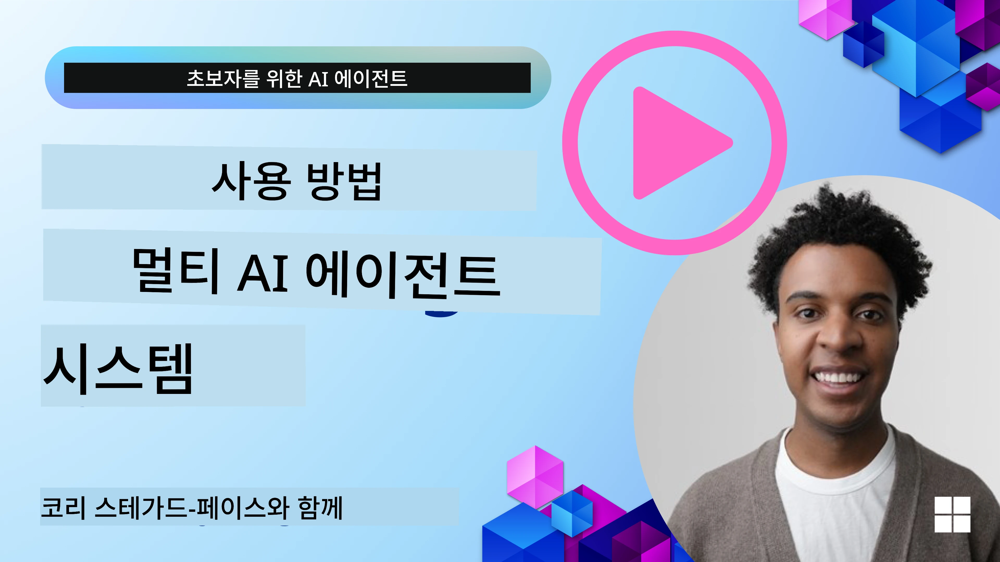
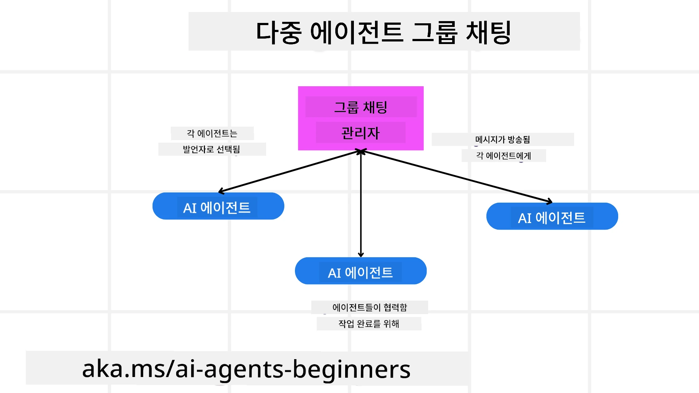
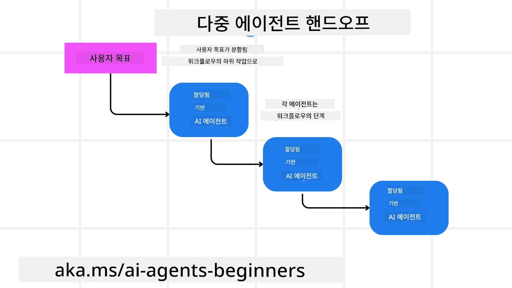
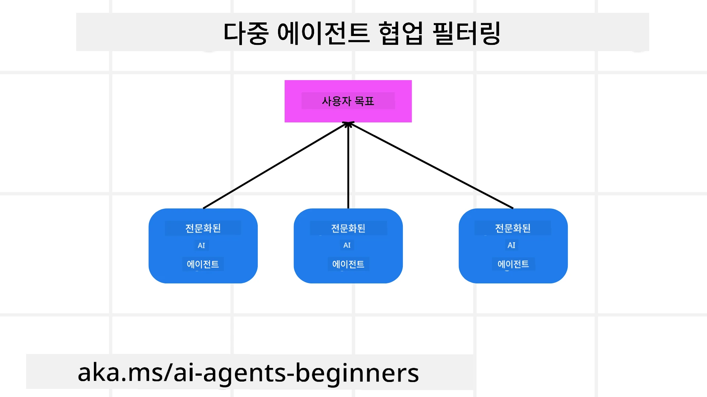

> _(위 이미지를 클릭하면 이 수업의 동영상을 볼 수 있습니다)_

# 다중 에이전트 설계 패턴

프로젝트에서 여러 에이전트를 다루기 시작하면 다중 에이전트 설계 패턴을 고려해야 합니다. 그러나 언제 다중 에이전트로 전환해야 하는지와 그 장점이 무엇인지가 즉시 명확하지 않을 수 있습니다.

## 소개

이 수업에서는 다음 질문들에 답하려고 합니다:

- 다중 에이전트가 적용될 수 있는 시나리오는 무엇인가?
- 하나의 단일 에이전트가 여러 작업을 수행하는 것보다 다중 에이전트를 사용하는 장점은 무엇인가?
- 다중 에이전트 설계 패턴을 구현하기 위한 구성 요소는 무엇인가?
- 여러 에이전트가 서로 어떻게 상호작용하는지에 대한 가시성은 어떻게 확보하는가?

## 학습 목표

이 수업을 마치면 다음을 수행할 수 있어야 합니다:

- 다중 에이전트가 적용될 수 있는 시나리오를 식별할 수 있다.
- 단일 에이전트보다 다중 에이전트를 사용할 때의 장점을 인식할 수 있다.
- 다중 에이전트 설계 패턴을 구현하는 구성 요소를 이해할 수 있다.

더 큰 그림은 무엇인가?

*다중 에이전트는 여러 에이전트가 공동의 목표를 달성하기 위해 함께 작업할 수 있도록 하는 설계 패턴입니다*.

이 패턴은 로봇 공학, 자율 시스템 및 분산 컴퓨팅을 포함한 다양한 분야에서 널리 사용됩니다.

## 다중 에이전트가 적용될 수 있는 시나리오

그렇다면 어떤 시나리오에서 다중 에이전트를 사용하는 것이 좋은 사례일까요? 답은 특히 다음과 같은 경우에 여러 시나리오에서 다중 에이전트를 사용하는 것이 유리하다는 것입니다:

- **큰 작업량**: 큰 작업량은 더 작은 작업으로 나누어 다양한 에이전트에 할당할 수 있어 병렬 처리와 더 빠른 완료가 가능합니다. 이에 대한 예는 대규모 데이터 처리 작업의 경우입니다.
- **복잡한 작업**: 복잡한 작업은 큰 작업량과 마찬가지로 더 작은 하위 작업으로 분해되어 각 작업의 특정 측면에 전문화된 다른 에이전트에 할당될 수 있습니다. 이에 대한 좋은 예는 자율주행 차량의 경우로, 서로 다른 에이전트가 내비게이션, 장애물 감지 및 다른 차량과의 통신을 관리합니다.
- **다양한 전문성**: 서로 다른 에이전트는 다양한 전문성을 가질 수 있어 단일 에이전트보다 작업의 다양한 측면을 더 효과적으로 처리할 수 있습니다. 이 경우의 좋은 예로는 진단, 치료 계획 및 환자 모니터링을 관리하는 에이전트가 있는 의료 분야가 있습니다.

## 단일 에이전트보다 다중 에이전트를 사용할 때의 장점

단일 에이전트 시스템은 간단한 작업에서는 잘 작동할 수 있지만, 더 복잡한 작업에서는 여러 에이전트를 사용하는 것이 여러 가지 장점을 제공할 수 있습니다:

- **전문화**: 각 에이전트는 특정 작업에 전문화될 수 있습니다. 단일 에이전트의 전문성 부족은 모든 것을 할 수 있지만 복잡한 작업에 직면했을 때 무엇을 해야 할지 혼란스러울 수 있는 에이전트를 만들 수 있습니다. 예를 들어, 최적의 에이전트가 아닌 작업을 수행하게 될 수 있습니다.
- **확장성**: 시스템을 확장할 때 단일 에이전트에 과부하를 주는 것보다 더 많은 에이전트를 추가하는 것이 더 쉽습니다.
- **결함 허용성**: 한 에이전트가 실패하더라도 다른 에이전트가 계속 작동할 수 있어 시스템의 신뢰성을 보장합니다.

예를 들어, 사용자를 위한 여행 예약을 해보겠습니다. 단일 에이전트 시스템은 항공편 찾기부터 호텔 및 렌터카 예약까지 여행 예약 프로세스의 모든 측면을 처리해야 합니다. 단일 에이전트로 이를 달성하려면 이러한 모든 작업을 처리할 도구가 필요합니다. 이는 유지 보수 및 확장이 어려운 복잡하고 단일체(monolithic) 시스템으로 이어질 수 있습니다. 반면 다중 에이전트 시스템은 항공편 찾기, 호텔 예약 및 렌터카 예약에 전문화된 서로 다른 에이전트를 가질 수 있습니다. 이는 시스템을 더 모듈화하고 유지 보수가 용이하며 확장 가능하게 만듭니다.

이를 소규모 가족 운영 여행사와 프랜차이즈로 운영되는 여행사에 비유해 보세요. 가족 운영 여행사는 여행 예약 프로세스의 모든 측면을 단일 에이전트가 처리하는 반면, 프랜차이즈는 여행 예약 프로세스의 다양한 측면을 처리하는 여러 에이전트를 가질 것입니다.

## 다중 에이전트 설계 패턴 구현의 구성 요소

다중 에이전트 설계 패턴을 구현하기 전에 패턴을 구성하는 구성 요소를 이해해야 합니다.

다시 사용자를 위한 여행 예약 예시를 통해 이를 더 구체적으로 살펴보겠습니다. 이 경우 구성 요소는 다음을 포함합니다:

- **Agent Communication**: 항공편 찾기, 호텔 예약 및 렌터카 에이전트는 사용자의 선호도와 제약 조건에 대한 정보를 공유하고 통신해야 합니다. 이 통신을 위한 프로토콜과 방법을 결정해야 합니다. 구체적으로 의미하는 바는 항공편을 찾는 에이전트가 호텔을 예약하는 에이전트와 통신하여 호텔이 항공편과 동일한 날짜에 예약되었는지 확인해야 한다는 것입니다. 이는 에이전트들이 사용자의 여행 날짜에 대한 정보를 공유해야 함을 의미하므로 *어떤 에이전트가 정보를 공유하고 어떻게 공유하는지*를 결정해야 합니다.
- **Coordination Mechanisms**: 에이전트들은 사용자의 선호도와 제약 조건이 충족되도록 행동을 조정해야 합니다. 예를 들어 사용자의 선호는 공항 근처의 호텔을 원할 수 있고 제약 조건은 렌터카가 공항에서만 이용 가능하다는 것일 수 있습니다. 이는 호텔 예약 에이전트가 렌터카 예약 에이전트와 조정하여 사용자의 선호도와 제약 조건을 충족시켜야 함을 의미합니다. 따라서 *에이전트들이 어떻게 행동을 조정하는지*를 결정해야 합니다.
- **Agent Architecture**: 에이전트들은 사용자와의 상호작용에서 결정을 내리고 학습할 수 있는 내부 구조를 가져야 합니다. 이는 항공편을 찾는 에이전트가 사용자에게 추천할 항공편을 결정하기 위한 내부 구조를 가져야 함을 의미합니다. 따라서 *에이전트들이 어떻게 결정을 내리고 사용자와의 상호작용에서 학습하는지*를 결정해야 합니다. 에이전트가 학습하고 개선하는 방법의 예로는, 항공편을 찾는 에이전트가 과거 사용자의 선호도에 기반해 항공편을 추천하기 위해 기계 학습 모델을 사용할 수 있다는 것입니다.
- **Visibility into Multi-Agent Interactions**: 여러 에이전트들이 서로 어떻게 상호작용하는지에 대한 가시성이 필요합니다. 이를 위해 에이전트 활동과 상호작용을 추적하기 위한 도구와 기법이 필요합니다. 이는 로깅 및 모니터링 도구, 시각화 도구 및 성능 지표의 형태일 수 있습니다.
- **Multi-Agent Patterns**: 중앙집중형, 분산형 및 하이브리드 아키텍처와 같은 다중 에이전트 시스템을 구현하는 다양한 패턴이 있습니다. 사용 사례에 가장 적합한 패턴을 결정해야 합니다.
- **Human in the loop**: 대부분의 경우 사람(Human)이 루프에 참여하게 되며 에이전트가 언제 인간의 개입을 요청해야 하는지 지시해야 합니다. 이는 에이전트가 추천하지 않은 특정 호텔이나 항공편을 사용자가 요청하거나 항공편이나 호텔을 예약하기 전에 확인을 요청하는 형태일 수 있습니다.

## 다중 에이전트 상호작용에 대한 가시성

여러 에이전트가 서로 어떻게 상호작용하는지에 대한 가시성을 확보하는 것이 중요합니다. 이러한 가시성은 디버깅, 최적화 및 전체 시스템의 효과성을 보장하는 데 필수적입니다. 이를 달성하기 위해 에이전트 활동과 상호작용을 추적하기 위한 도구와 기법이 필요합니다. 이는 로깅 및 모니터링 도구, 시각화 도구 및 성능 지표의 형태일 수 있습니다.

예를 들어 사용자의 여행을 예약하는 경우, 각 에이전트의 상태, 사용자의 선호도 및 제약 조건, 그리고 에이전트 간 상호작용을 표시하는 대시보드를 가질 수 있습니다. 이 대시보드는 사용자의 여행 날짜, 항공 에이전트가 추천한 항공편, 호텔 에이전트가 추천한 호텔, 렌터카 에이전트가 추천한 렌터카를 표시할 수 있습니다. 이는 에이전트들이 서로 어떻게 상호작용하고 있는지, 그리고 사용자의 선호도와 제약 조건이 충족되고 있는지에 대한 명확한 관점을 제공합니다.

이러한 각 측면을 좀 더 자세히 살펴보겠습니다.

- **Logging and Monitoring Tools**: 에이전트가 수행한 각 작업에 대해 로깅을 수행해야 합니다. 로그 항목에는 작업을 수행한 에이전트, 수행한 작업, 작업이 수행된 시간 및 작업의 결과에 대한 정보가 저장될 수 있습니다. 이 정보는 디버깅, 최적화 등에 사용될 수 있습니다.
- **Visualization Tools**: 시각화 도구는 에이전트 간의 상호작용을 보다 직관적인 방식으로 볼 수 있도록 도와줍니다. 예를 들어 에이전트 간 정보 흐름을 보여주는 그래프를 가질 수 있습니다. 이는 시스템의 병목 현상, 비효율성 및 기타 문제를 식별하는 데 도움이 될 수 있습니다.
- **Performance Metrics**: 성능 지표는 다중 에이전트 시스템의 효과성을 추적하는 데 도움이 됩니다. 예를 들어, 작업 완료에 걸린 시간, 단위 시간당 완료된 작업 수, 에이전트가 만든 추천의 정확도를 추적할 수 있습니다. 이 정보는 개선할 영역을 식별하고 시스템을 최적화하는 데 도움이 됩니다.

## 다중 에이전트 패턴

다중 에이전트 앱을 만들기 위해 사용할 수 있는 몇 가지 구체적인 패턴을 살펴보겠습니다. 고려해 볼 만한 흥미로운 패턴은 다음과 같습니다:

### 그룹 채팅

이 패턴은 여러 에이전트가 서로 통신할 수 있는 그룹 채팅 애플리케이션을 만들고자 할 때 유용합니다. 이 패턴의 전형적인 사용 사례에는 팀 협업, 고객 지원 및 소셜 네트워킹이 포함됩니다.

이 패턴에서는 각 에이전트가 그룹 채팅에서의 사용자를 나타내며, 메시지는 메시징 프로토콜을 사용하여 에이전트 간에 교환됩니다. 에이전트는 그룹 채팅에 메시지를 보내고, 그룹 채팅에서 메시지를 수신하며, 다른 에이전트의 메시지에 응답할 수 있습니다.

이 패턴은 모든 메시지가 중앙 서버를 통해 라우팅되는 중앙집중형 아키텍처로 구현하거나, 메시지가 직접 교환되는 분산 아키텍처로 구현할 수 있습니다.

### 핸드오프

이 패턴은 여러 에이전트가 서로 작업을 인계할 수 있는 애플리케이션을 만들고자 할 때 유용합니다.

이 패턴의 전형적인 사용 사례에는 고객 지원, 작업 관리 및 워크플로 자동화가 포함됩니다.

이 패턴에서는 각 에이전트가 작업 또는 워크플로의 단계를 나타내며, 에이전트는 사전 정의된 규칙에 따라 다른 에이전트에게 작업을 인계할 수 있습니다.

### 협업 필터링

이 패턴은 여러 에이전트가 협력하여 사용자에게 추천을 제공하는 애플리케이션을 만들고자 할 때 유용합니다.

여러 에이전트가 협력하는 이유는 각 에이전트가 서로 다른 전문성을 가질 수 있으며 추천 과정에 다양한 방식으로 기여할 수 있기 때문입니다.

예를 들어 사용자가 주식 시장에서 매수하기에 가장 좋은 주식에 대한 추천을 원한다고 가정해 보겠습니다.

- **Industry expert**:. 한 에이전트는 특정 산업의 전문가일 수 있습니다.
- **Technical analysis**: 또 다른 에이전트는 기술적 분석 전문가일 수 있습니다.
- **Fundamental analysis**: 그리고 다른 에이전트는 기본적(기본) 분석 전문가일 수 있습니다. 이들 에이전트가 협력함으로써 사용자에게 보다 포괄적인 추천을 제공할 수 있습니다.

## 시나리오: 환불 프로세스

고객이 제품 환불을 받으려는 시나리오를 고려해 보십시오. 이 프로세스에는 꽤 많은 에이전트가 관여할 수 있지만, 이 프로세스에 특정한 에이전트와 다른 프로세스에서도 사용할 수 있는 일반 에이전트로 나누어 보겠습니다.

**환불 프로세스에 특정한 에이전트**:

다음은 환불 프로세스에 관여할 수 있는 몇 가지 에이전트입니다:

- **Customer agent**: 이 에이전트는 고객을 대표하며 환불 프로세스를 시작하는 역할을 합니다.
- **Seller agent**: 이 에이전트는 판매자를 대표하며 환불을 처리하는 역할을 합니다.
- **Payment agent**: 이 에이전트는 결제 프로세스를 대표하며 고객의 결제를 환불하는 역할을 합니다.
- **Resolution agent**: 이 에이전트는 해결 프로세스를 대표하며 환불 과정 중 발생하는 문제를 해결하는 역할을 합니다.
- **Compliance agent**: 이 에이전트는 준수 프로세스를 대표하며 환불 프로세스가 규정 및 정책을 준수하는지 확인하는 역할을 합니다.

**일반 에이전트**:

이 에이전트들은 비즈니스의 다른 부분에서도 사용할 수 있습니다.

- **Shipping agent**: 이 에이전트는 배송 프로세스를 대표하며 제품을 판매자에게 반송하는 역할을 합니다. 이 에이전트는 환불 프로세스와 예를 들어 구매를 통한 일반적인 제품 배송 모두에 사용될 수 있습니다.
- **Feedback agent**: 이 에이전트는 피드백 프로세스를 대표하며 고객으로부터 피드백을 수집하는 역할을 합니다. 피드백은 환불 프로세스 중뿐만 아니라 언제든지 수집될 수 있습니다.
- **Escalation agent**: 이 에이전트는 에스컬레이션 프로세스를 대표하며 문제를 더 높은 수준의 지원으로 에스컬레이션하는 역할을 합니다. 이 유형의 에이전트는 문제를 에스컬레이션해야 하는 모든 프로세스에 사용할 수 있습니다.
- **Notification agent**: 이 에이전트는 알림 프로세스를 대표하며 환불 프로세스의 다양한 단계에서 고객에게 알림을 보내는 역할을 합니다.
- **Analytics agent**: 이 에이전트는 분석 프로세스를 대표하며 환불 프로세스와 관련된 데이터를 분석하는 역할을 합니다.
- **Audit agent**: 이 에이전트는 감사 프로세스를 대표하며 환불 프로세스가 올바르게 수행되고 있는지 감사하는 역할을 합니다.
- **Reporting agent**: 이 에이전트는 보고 프로세스를 대표하며 환불 프로세스에 대한 보고서를 생성하는 역할을 합니다.
- **Knowledge agent**: 이 에이전트는 지식 프로세스를 대표하며 환불 프로세스와 관련된 정보의 지식 베이스를 유지하는 역할을 합니다. 이 에이전트는 환불 및 비즈니스의 다른 부분에 대해 지식이 있을 수 있습니다.
- **Security agent**: 이 에이전트는 보안 프로세스를 대표하며 환불 프로세스의 보안을 보장하는 역할을 합니다.
- **Quality agent**: 이 에이전트는 품질 프로세스를 대표하며 환불 프로세스의 품질을 보장하는 역할을 합니다.

앞서 특정 환불 프로세스용 및 비즈니스의 다른 부분에서 사용할 수 있는 일반 에이전트 모두에 대해 꽤 많은 에이전트가 나열되었습니다. 이는 다중 에이전트 시스템에서 어떤 에이전트를 사용할지 결정하는 데 도움이 되기를 바랍니다.

## 과제

고객 지원 프로세스에 대한 다중 에이전트 시스템을 설계하십시오. 프로세스에 관련된 에이전트들, 그들의 역할과 책임 및 서로 어떻게 상호작용하는지를 식별하십시오. 고객 지원 프로세스에 특정한 에이전트와 비즈니스의 다른 부분에서 사용할 수 있는 일반 에이전트 모두를 고려하십시오.
> 읽기 전에 잠깐 생각해 보세요, 생각보다 더 많은 에이전트가 필요할 수 있습니다.
>
> 팁: 고객 지원 프로세스의 다양한 단계와 모든 시스템에 필요한 에이전트들을 고려해 보세요.

## 솔루션

[솔루션](./solution/solution.md)

## 지식 확인

Question: 멀티 에이전트를 언제 고려해야 하나요?

- [ ] A1: 작업량이 적고 작업이 단순할 때.
- [ ] A2: 작업량이 많을 때
- [ ] A3: 작업이 단순할 때.

[Solution quiz](./solution/solution-quiz.md)

## 요약

In this lesson, we've looked at the multi-agent design pattern, including the scenarios where multi-agents are applicable, the advantages of using multi-agents over a singular agent, the building blocks of implementing the multi-agent design pattern, and how to have visibility into how the multiple agents are interacting with each other.

### 멀티 에이전트 디자인 패턴에 대해 더 궁금한 점이 있으신가요?

Join the [Microsoft Foundry Discord](https://aka.ms/ai-agents/discord)에 가입하여 다른 학습자들을 만나고 오피스 아워에 참석하며 AI 에이전트에 관한 질문에 대한 답변을 얻으세요.

## 추가 자료

- <a href="https://learn.microsoft.com/azure/ai-services/agents/overview" target="_blank">Microsoft 에이전트 프레임워크 문서</a>
- <a href="https://www.analyticsvidhya.com/blog/2024/10/agentic-design-patterns/" target="_blank">에이전틱 디자인 패턴</a>

## Previous Lesson

[기획 설계](../07-planning-design/README.md)

## Next Lesson

[AI 에이전트의 메타인지](../09-metacognition/README.md)

---

<!-- CO-OP TRANSLATOR DISCLAIMER START -->
면책 조항:
본 문서는 AI 번역 서비스 [Co-op Translator](https://github.com/Azure/co-op-translator)를 사용하여 번역되었습니다. 저희는 정확성을 위해 노력하지만, 자동 번역에는 오류나 부정확성이 있을 수 있음을 유의하시기 바랍니다. 원문(원어) 문서를 권위 있는 출처로 간주해야 합니다. 중요한 정보의 경우 전문적인 인력에 의한 번역을 권장합니다. 본 번역의 사용으로 인해 발생하는 오해나 잘못된 해석에 대해 당사는 책임을 지지 않습니다.
<!-- CO-OP TRANSLATOR DISCLAIMER END -->