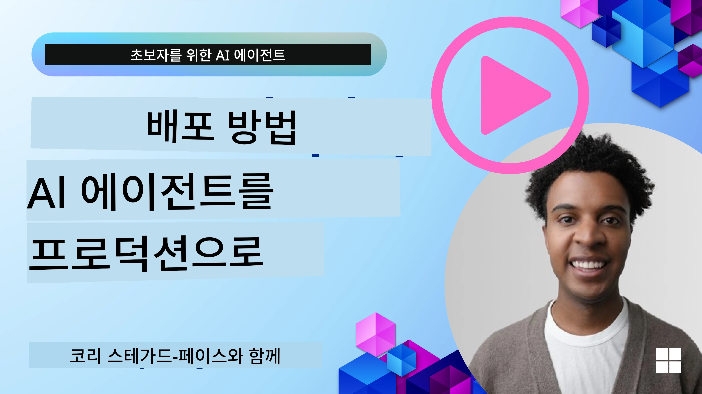

# 생산 환경에서의 AI 에이전트: 관측성 및 평가

[](https://youtu.be/l4TP6IyJxmQ?si=reGOyeqjxFevyDq9)

AI 에이전트가 실험적 프로토타입에서 실제 응용 프로그램으로 이동함에 따라, 이들의 행동을 이해하고 성능을 모니터링하며 체계적으로 출력을 평가하는 능력이 중요해집니다.

## 학습 목표

이 수업을 완료한 후, 여러분은 다음을 할 수 있게 됩니다/이해하게 됩니다:
- 에이전트 관측성과 평가의 핵심 개념
- 에이전트의 성능, 비용, 효과성을 개선하는 기법
- AI 에이전트를 체계적으로 평가하는 방법과 내용
- AI 에이전트의 생산 배포 시 비용을 제어하는 방법
- Microsoft Agent Framework로 구축된 에이전트를 계측하는 방법

목표는 여러분의 "블랙 박스" 에이전트를 투명하고 관리 가능하며 신뢰할 수 있는 시스템으로 변환하는 지식을 갖추는 것입니다.

_**참고:** 안전하고 신뢰할 수 있는 AI 에이전트를 배포하는 것이 중요합니다. [신뢰할 수 있는 AI 에이전트 구축](./06-building-trustworthy-agents/README.md) 수업도 확인해 보세요._

## 추적(Traces)과 스팬(Spans)

[Langfuse](https://langfuse.com/) 또는 [Microsoft Foundry](https://learn.microsoft.com/en-us/azure/ai-foundry/what-is-azure-ai-foundry)와 같은 관측성 도구는 보통 에이전트 실행을 추적과 스팬으로 표현합니다.

- **추적(trace)** 은 사용자 쿼리 처리 같은 에이전트 작업의 시작부터 끝까지 전체를 나타냅니다.
- **스팬(spans)** 은 추적 내 개별 단계들로, 예를 들어 언어 모델 호출이나 데이터 검색 같은 단계를 의미합니다.


<!-- Image URL retained for illustration purposes -->

관측성이 없으면 AI 에이전트는 "블랙 박스"처럼 느껴질 수 있습니다 — 내부 상태와 추론 과정이 불투명해서 문제를 진단하거나 성능을 최적화하기 어렵습니다. 관측성이 있으면 에이전트는 "유리 상자"가 되어 신뢰 구축과 의도대로 작동함을 보장하는 데 필수적인 투명성을 제공합니다.

## 생산 환경에서 관측성이 중요한 이유

AI 에이전트를 생산 환경에 전환할 때 새로운 도전과 요구 사항이 생깁니다. 관측성은 더 이상 "있으면 좋은" 기능이 아니라 필수 역량입니다:

*   **디버깅 및 근본 원인 분석**: 에이전트가 실패하거나 예상치 못한 출력을 낼 때, 관측성 도구는 오류 원인을 정확히 파악할 수 있는 추적 정보를 제공합니다. 다중 LLM 호출, 도구 상호작용, 조건부 로직이 포함된 복잡한 에이전트에서 특히 중요합니다.
*   **지연 시간과 비용 관리**: AI 에이전트는 토큰이나 호출 단위로 비용이 청구되는 LLM과 외부 API에 종종 의존합니다. 관측성은 이러한 호출을 정밀하게 추적하여 너무 느리거나 비용이 많이 드는 작업을 식별할 수 있게 합니다. 이를 통해 팀은 프롬프트를 최적화하거나 더 효율적인 모델을 선택하거나 워크플로우를 재설계하여 운영 비용을 관리하고 우수한 사용자 경험을 보장할 수 있습니다.
*   **신뢰, 안전, 컴플라이언스**: 많은 애플리케이션에서 에이전트가 안전하고 윤리적으로 행동하는 것이 중요합니다. 관측성은 에이전트 활동 및 의사결정의 감사 추적을 제공하여 프롬프트 인젝션, 유해 콘텐츠 생성, 개인 식별 정보(PII) 취급 문제를 감지 및 완화하는 데 사용될 수 있습니다. 예를 들어, 추적을 검토하여 에이전트가 특정 응답을 제공하거나 특정 도구를 사용한 이유를 이해할 수 있습니다.
*   **지속적인 개선 루프**: 관측성 데이터는 반복 개발 프로세스의 기반입니다. 실제 환경에서 에이전트 성능을 모니터링함으로써 개선 영역을 식별하고, 모델 미세조정에 필요한 데이터를 수집하며, 변경 사항의 영향을 검증할 수 있습니다. 이렇게 프로덕션에서의 인사이트가 오프라인 실험과 개선에 반영되어 점진적으로 에이전트 성능이 향상되는 피드백 루프가 만들어집니다.

## 추적해야 할 핵심 지표

에이전트 행동을 모니터링하고 이해하기 위해 다양한 지표와 신호를 추적해야 합니다. 특정 지표는 에이전트 목적에 따라 다를 수 있지만, 보편적으로 중요한 지표들이 있습니다.

관측성 도구가 모니터링하는 가장 일반적인 지표는 다음과 같습니다:

**지연 시간(Latency):** 에이전트가 얼마나 빨리 응답하는가? 긴 대기 시간은 사용자 경험에 부정적 영향을 미칩니다. 작업 및 개별 단계별 지연 시간을 에이전트 실행을 추적하여 측정해야 합니다. 예를 들어, 모든 모델 호출에 20초가 걸리는 에이전트는 더 빠른 모델 사용하거나 모델 호출을 병렬로 실행하여 가속할 수 있습니다.

**비용(Costs):** 에이전트 실행당 비용은 얼마인가? AI 에이전트는 토큰 단위로 비용이 청구되는 LLM 호출이나 외부 API에 의존합니다. 잦은 도구 사용이나 다중 프롬프트가 비용을 급격히 증가시킬 수 있습니다. 예를 들어 품질 향상을 위해 LLM을 5회 호출하는 경우, 비용이 정당한지, 호출 횟수를 줄이거나 더 저렴한 모델을 사용할지 평가해야 합니다. 실시간 모니터링은 예상치 못한 급증(예: 버그로 인한 과도한 API 루프)도 식별할 수 있습니다.

**요청 오류(Request Errors):** 에이전트가 실패한 요청 수는? API 오류나 도구 호출 실패를 포함합니다. 생산 환경에서 이러한 실패에 대응해 강인한 에이전트를 만들기 위해서 대체 경로나 재시도 설정이 가능해야 합니다. 예를 들어, LLM 공급자 A가 다운되면 백업으로 LLM 공급자 B를 사용하는 식입니다.

**사용자 피드백(User Feedback):** 직접적인 사용자 평가 구현은 귀중한 인사이트를 제공합니다. 명시적 평가(👍좋아요/👎싫어요, ⭐1-5점) 또는 텍스트 댓글이 포함될 수 있습니다. 일관된 부정적 피드백은 에이전트가 기대대로 작동하지 않음을 알리는 신호입니다.

**암묵적 사용자 피드백(Implicit User Feedback):** 사용자 행동도 명시적 평가 없이 간접적인 피드백을 제공합니다. 즉각적인 질문 재구성, 반복 질의, 재시도 버튼 클릭 등이 포함됩니다. 예: 사용자가 동일 질문을 반복하면 에이전트가 예상대로 작동하지 않는 신호입니다.

**정확도(Accuracy):** 에이전트가 정확하거나 바람직한 출력을 내는 빈도는? 정확도 정의는 다양합니다(예: 문제 해결 정확도, 정보 검색 정확도, 사용자 만족도). 먼저 에이전트 성공의 기준을 정의해야 합니다. 자동화 검사, 평가 점수, 작업 완료 레이블을 통해 정확도를 추적할 수 있습니다. 예를 들어 추적을 "성공" 또는 "실패"로 표시합니다.

**자동 평가 지표(Automated Evaluation Metrics):** 자동 평가를 설정할 수도 있습니다. 예를 들어, LLM을 사용하여 에이전트 출력이 유용한지, 정확한지 평가할 수 있습니다. 또한 [RAGAS](https://docs.ragas.io/) 같은 RAG 에이전트 평가용 오픈 소스 라이브러리나 [LLM Guard](https://llm-guard.com/) 같은 유해 언어 또는 프롬프트 인젝션 탐지용 라이브러리를 활용할 수 있습니다.

실제로는 이 지표들을 조합해 AI 에이전트 상태를 가장 잘 커버합니다. 이 장 [예제 노트북](./code_samples/10-expense_claim-demo.ipynb)에서는 실제 예시에서 이 지표들이 어떻게 나타나는지 보여 드리지만, 먼저 일반적인 평가 워크플로우가 어떻게 되는지 배워봅니다.

## 에이전트 계측하기

추적 데이터를 수집하려면 코드를 계측해야 합니다. 목표는 에이전트 코드에 추적과 지표를 내보낼 수 있게 계측하여 관측성 플랫폼이 이를 캡처, 처리, 시각화할 수 있도록 하는 것입니다.

**OpenTelemetry (OTel):** [OpenTelemetry](https://opentelemetry.io/)는 LLM 관측성에 있어 업계 표준으로 부상했습니다. 원격 측정 데이터를 생성, 수집, 내보내기 위한 API, SDK, 도구 세트를 제공합니다.

기존 에이전트 프레임워크를 감싸고 OpenTelemetry 스팬을 관측성 도구로 쉽게 내보낼 수 있게 하는 여러 계측 라이브러리가 있습니다. Microsoft Agent Framework는 OpenTelemetry를 네이티브로 통합합니다. 아래는 MAF 에이전트를 계측하는 예시입니다:

```python
from agent_framework.observability import get_tracer, get_meter

tracer = get_tracer()
meter = get_meter()

with tracer.start_as_current_span("agent_run"):
    # 에이전트 실행이 자동으로 추적됩니다
    pass
```

이 장의 [예제 노트북](./code_samples/10-expense_claim-demo.ipynb)에서 MAF 에이전트를 계측하는 방법을 보여드립니다.

**수동 스팬 생성(Manual Span Creation):** 계측 라이브러리가 좋은 기본을 제공하지만, 더 상세하거나 맞춤 정보를 요구하는 경우가 많습니다. 수동으로 스팬을 생성해 사용자 지정 애플리케이션 로직을 추가할 수 있습니다. 더욱 중요한 것은 자동 또는 수동으로 생성된 스팬에 `user_id`, `session_id`, `model_version`과 같은 비즈니스 특화 데이터, 중간 계산값, 디버깅이나 분석에 유용한 컨텍스트 등의 사용자 지정 속성(태그, 메타데이터로도 알려짐)을 덧붙일 수 있다는 점입니다.

[Langfuse Python SDK](https://langfuse.com/docs/sdk/python/sdk-v3)를 사용하여 수동으로 추적과 스팬을 생성하는 예:

```python
from langfuse import get_client
 
langfuse = get_client()
 
span = langfuse.start_span(name="my-span")
 
span.end()
```

## 에이전트 평가

관측성은 지표를 제공하지만, 평가는 그 데이터를 분석하고(테스트 수행) AI 에이전트가 얼마나 잘 수행하는지, 어떻게 개선할지를 판단하는 과정입니다. 즉, 추적과 지표를 확보한 후 이를 이용해 에이전트를 평가하고 의사결정을 하는 것입니다.

정기 평가는 매우 중요한데, AI 에이전트는 종종 비결정적이며(업데이트나 모델 동작 변화로 인해) 발전하기 때문입니다 — 평가 없이 “스마트한 에이전트”가 실제로 잘 작동하는지 아니면 성능이 저하되었는지 알 수 없습니다.

AI 에이전트 평가에는 두 가지 범주가 있습니다: **온라인 평가** 와 **오프라인 평가**. 두 평가 모두 중요하고 상호 보완적입니다. 보통은 오프라인 평가부터 시작하는데, 이는 어떤 에이전트를 배포하기 전에 최소한 반드시 거쳐야 하는 단계입니다.

### 오프라인 평가


이는 통제된 환경에서, 보통 테스트 데이터셋을 사용하여, 실제 라이브 사용자 쿼리가 아닌 환경에서 에이전트를 평가하는 것을 의미합니다. 기대 출력이나 올바른 행동을 알고 있는 큐레이션된 데이터셋을 사용해 에이전트를 실행합니다.

예를 들어, 수학 문제 에이전트를 구축했다면, 정답이 알려진 100개의 문제로 구성된 [테스트 데이터셋](https://huggingface.co/datasets/gsm8k)을 사용할 수 있습니다. 오프라인 평가는 주로 개발 중(또는 CI/CD 파이프라인 일부로) 진행되어 성능 향상 여부를 점검하거나 회귀를 방지합니다. 장점은 **재현 가능하며, 정답이 존재하기 때문에 명확한 정확도 지표를 얻을 수 있는 점**입니다. 사용자 쿼리를 시뮬레이션하고 에이전트 응답을 이상적인 답변과 비교하거나 앞서 설명한 자동화 지표를 활용할 수도 있습니다.

오프라인 평가의 핵심 과제는 테스트 데이터셋이 포괄적이고 최신성을 유지하는 것입니다 — 에이전트가 고정된 테스트 셋에서는 잘 작동해도 생산 환경에서 매우 다른 쿼리를 만날 수 있기 때문입니다. 따라서 새로운 경계 사례와 실제 시나리오와 일치하는 예제를 지속해서 테스트셋에 추가해야 합니다​. 간단한 “스모크 테스트” 케이스와 광범위한 평가 세트를 혼합하는 것이 유용하며, 작은 테스트셋은 빠른 점검용, 큰 세트는 전반적 성능 지표용입니다​.

### 온라인 평가


이는 실제 생산 환경, 즉 실제 사용자 사용 중에 에이전트를 평가하는 것을 의미합니다. 온라인 평가는 실사용에서 에이전트 성능을 지속적으로 모니터링하고 결과를 분석합니다.

예를 들어 성공률, 사용자 만족 점수, 기타 지표를 실시간 트래픽에서 추적할 수 있습니다. 온라인 평가의 장점은 **실험실 환경에서는 예상하지 못한 사항을 포착할 수 있다는 점**입니다 — 입력 패턴 변동으로 모델 성능 저하(모델 드리프트)를 관찰하거나 테스트 데이터에 없던 예상치 못한 쿼리와 상황을 발견할 수 있습니다​. 이는 에이전트가 실제 세상에서 어떻게 행동하는지에 대한 진정한 그림을 제공합니다.

온라인 평가는 앞서 논의한 암묵적 및 명시적 사용자 피드백 수집, 그리고 그림자 테스트(shadow tests)나 A/B 테스트(구버전과 신버전을 병행 실행해 비교)도 포함할 수 있습니다. 문제는 실시간 상호작용에 대해 신뢰할 만한 레이블이나 점수를 얻는 것이 까다롭다는 점이며, 사용자 피드백이나 하위 지표(예: 사용자가 결과를 클릭했는지) 등에 의존할 수밖에 없습니다.

### 두 가지 평가 방식의 결합

온라인 평가와 오프라인 평가는 상호 배타적이지 않으며, 매우 상호보완적입니다. 온라인 모니터링에서 얻은 인사이트(예, 에이전트가 잘 작동하지 않는 새로운 유형의 사용자 쿼리)는 오프라인 테스트 데이터셋 확장과 개선에 사용됩니다. 반대로 오프라인 테스트에서 잘 수행된 에이전트는 더 자신 있게 온라인에 배포하고 모니터링할 수 있습니다.

실제로 많은 팀이 다음과 같은 주기를 채택합니다:

_오프라인 평가 -> 배포 -> 온라인 모니터링 -> 새로운 실패 사례 수집 -> 오프라인 데이터셋에 추가 -> 에이전트 개선 -> 반복_

## 흔히 발생하는 문제

AI 에이전트를 생산에 배포하면서 여러 도전 과제를 만나게 됩니다. 다음은 일부 일반적인 문제와 가능한 해결책들입니다:

| **문제**    | **가능한 해결책**   |
| ------------- | ------------------ |
| AI 에이전트가 작업을 일관되게 수행하지 않음 | - 에이전트에게 제공되는 프롬프트를 명확하게 하고 목표를 분명히 함.<br>- 작업을 하위 작업으로 나눠 여러 에이전트가 처리하도록 하는 방법을 모색함. |
| AI 에이전트가 무한 루프에 빠짐  | - 에이전트가 언제 절차를 종료해야 하는지 명확한 종료 조건을 설정함.<br>- 추론과 계획이 필요한 복잡한 작업에는 추론 작업에 특화된 더 큰 모델을 사용함. |
| AI 에이전트 도구 호출 성능 문제   | - 에이전트 시스템 밖에서 도구 출력을 테스트하고 검증함.<br>- 정의된 매개변수, 프롬프트, 도구 명칭을 조정함. |
| 다중 에이전트 시스템이 일관되게 작동하지 않음 | - 각 에이전트에 주어지는 프롬프트를 구체적이고 명확하게 개선함.<br>- "라우팅" 또는 컨트롤러 역할 에이전트를 구축해 어떤 에이전트가 적절한지 결정하는 계층적 시스템을 만듦. |

이 문제들 중 다수는 관측성이 있으면 훨씬 효과적으로 식별할 수 있습니다. 앞서 논의한 추적과 지표는 에이전트 워크플로우 중 문제 발생 위치를 정확히 파악해 디버깅과 최적화를 더 효율적으로 만듭니다.

## 비용 관리
다음은 AI 에이전트를 프로덕션에 배포할 때 비용을 관리하는 몇 가지 전략입니다:

**더 작은 모델 사용하기:** 소형 언어 모델(SLM)은 특정 에이전트 활용 사례에서 좋은 성능을 보이며 비용을 크게 절감할 수 있습니다. 앞서 언급했듯이 평가 시스템을 구축하여 성능을 판단하고 대형 모델과 비교하는 것이 SLM이 특정 사용 사례에서 얼마나 잘 작동하는지 이해하는 가장 좋은 방법입니다. 의도 분류나 파라미터 추출과 같이 단순한 작업에는 SLM을 사용하고, 복잡한 추론에는 대형 모델을 사용하는 것을 고려하세요.

**라우터 모델 사용하기:** 유사한 전략으로 다양한 모델과 크기를 사용합니다. LLM/SLM 또는 서버리스 함수를 사용해 요청의 복잡성에 따라 최적의 모델로 라우팅할 수 있습니다. 이는 비용을 절감하는 동시에 적합한 작업에서 성능을 보장하는 데 도움이 됩니다. 예를 들어, 간단한 쿼리는 더 작고 빠른 모델로, 복잡한 추론 작업에는 비용이 많이 드는 대형 모델만 사용하도록 라우팅합니다.

**응답 캐싱:** 자주 요청되는 작업과 요청을 식별하여 에이전트 시스템을 통과하기 전에 응답을 제공하는 것은 유사한 요청의 양을 줄이는 좋은 방법입니다. 더 기본적인 AI 모델을 사용해 요청이 캐시된 요청들과 얼마나 유사한지 확인하는 흐름을 구현할 수도 있습니다. 이 전략은 자주 묻는 질문이나 일반적인 작업 흐름에 대해 비용을 크게 절감할 수 있습니다.

## 실제로 어떻게 작동하는지 살펴보기

[이 섹션의 예제 노트북](./code_samples/10-expense_claim-demo.ipynb)에서 관찰 도구를 사용하여 에이전트를 모니터링하고 평가하는 방법을 예제로 살펴봅니다.


### 프로덕션의 AI 에이전트에 대해 더 궁금한 점이 있나요?

[Microsoft Foundry Discord](https://aka.ms/ai-agents/discord)에 가입하여 다른 학습자들과 만나고, 오피스 아워에 참석하며 AI 에이전트 관련 질문에 답변을 받아보세요.

## 이전 강의

[메타인지 설계 패턴](../09-metacognition/README.md)

## 다음 강의

[에이전틱 프로토콜](../11-agentic-protocols/README.md)

---

<!-- CO-OP TRANSLATOR DISCLAIMER START -->
**면책 조항**:  
이 문서는 AI 번역 서비스 [Co-op Translator](https://github.com/Azure/co-op-translator)를 사용하여 번역되었습니다. 정확성을 위해 최선을 다하고 있으나, 자동 번역에는 오류나 부정확한 부분이 있을 수 있음을 양지해 주시기 바랍니다. 원문은 해당 언어의 원본 문서가 권위 있는 출처로 간주되어야 합니다. 중요한 정보의 경우, 전문 인간 번역을 권장합니다. 이 번역의 사용으로 인해 발생하는 오해나 잘못된 해석에 대해 당사는 책임을 지지 않습니다.
<!-- CO-OP TRANSLATOR DISCLAIMER END -->