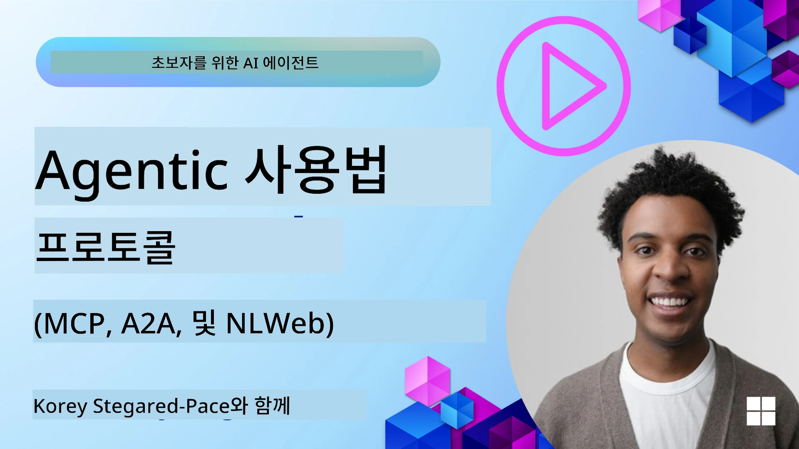
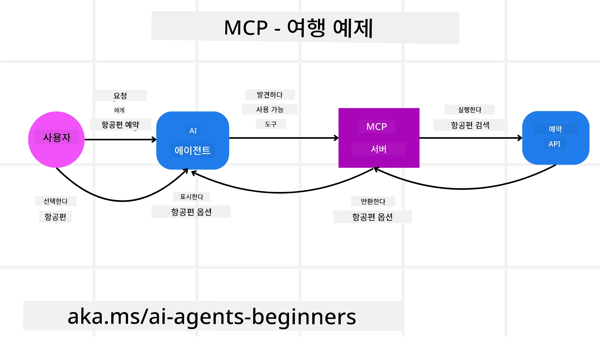
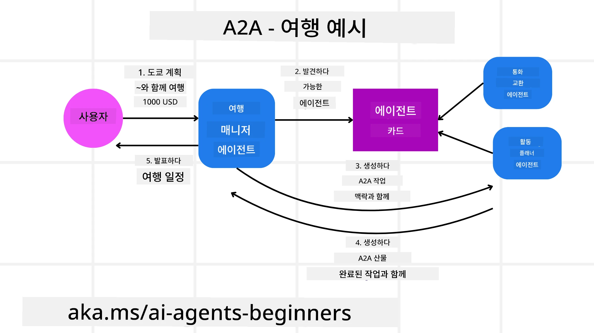
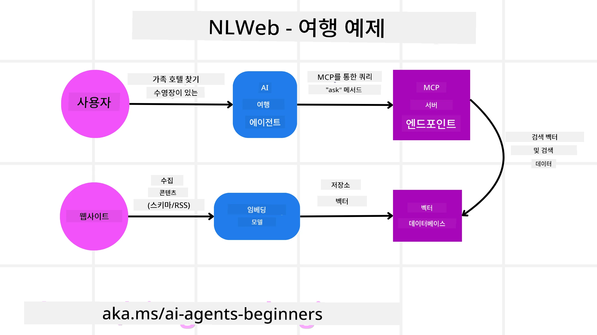

# 에이전틱 프로토콜 사용법 (MCP, A2A 및 NLWeb)

> _(위 이미지를 클릭하면 이 강의의 영상을 시청할 수 있습니다)_

AI 에이전트 사용이 증가함에 따라 표준화, 보안 및 개방형 혁신 지원을 보장하는 프로토콜에 대한 필요성도 커지고 있습니다. 이번 강의에서는 이러한 필요를 충족하기 위해 만들어진 3개의 프로토콜인 모델 컨텍스트 프로토콜(Model Context Protocol, MCP), 에이전트 간 통신(Agent to Agent, A2A) 및 내추럴 랭귀지 웹(Natural Language Web, NLWeb)에 대해 다루겠습니다.

## 소개

이번 강의에서 다룰 내용:

• **MCP**가 AI 에이전트가 외부 도구와 데이터를 활용해 사용자 작업을 완료하도록 어떻게 지원하는지

• **A2A**가 서로 다른 AI 에이전트 간의 통신과 협업을 가능하게 하는 방법

• **NLWeb**이 자연어 인터페이스를 웹사이트에 적용하여 AI 에이전트가 콘텐츠를 발견하고 상호작용할 수 있도록 하는 방식

## 학습 목표

• AI 에이전트 맥락에서 MCP, A2A, NLWeb의 핵심 목적과 이점을 **식별**하기

• 각 프로토콜이 LLM, 도구 및 다른 에이전트 간의 통신과 상호작용을 어떻게 촉진하는지 **설명**하기

• 복잡한 에이전틱 시스템을 구축하는 데 각각 프로토콜이 맡는 독특한 역할을 **인식**하기

## 모델 컨텍스트 프로토콜

**모델 컨텍스트 프로토콜(MCP)**은 애플리케이션이 LLM에 컨텍스트와 도구를 제공하는 표준화된 방법을 제공하는 오픈 표준입니다. 이를 통해 AI 에이전트가 일관된 방식으로 다양한 데이터 소스와 도구에 연결할 수 있는 "범용 어댑터" 역할을 가능하게 합니다.

MCP의 구성 요소, 직접 API 사용 대비 장점, 그리고 AI 에이전트가 MCP 서버를 활용하는 예를 살펴보겠습니다.

### MCP 핵심 구성 요소

MCP는 **클라이언트-서버 구조**로 작동하며 핵심 구성 요소는 다음과 같습니다:

• **호스트**: MCP 서버에 연결을 시작하는 LLM 애플리케이션(예: VSCode 같은 코드 편집기)

• **클라이언트**: 호스트 애플리케이션 내에서 서버와 일대일 연결을 유지하는 구성 요소

• **서버**: 특정 기능을 노출하는 경량 프로그램

프로토콜에 포함된 세 가지 핵심 프리미티브(기능)는 MCP 서버의 기능입니다:

• **도구**: AI 에이전트가 작업 수행을 위해 호출할 수 있는 독립적인 액션이나 기능입니다. 예를 들어, 기상 서비스는 "날씨 조회" 도구를, 전자상거래 서버는 "상품 구매" 도구를 노출할 수 있습니다. MCP 서버는 도구의 이름, 설명, 입력/출력 스키마를 기능 목록에 광고합니다.

• **자원**: MCP 서버가 제공할 수 있는 읽기 전용 데이터 항목이나 문서이며, 클라이언트가 필요할 때 불러올 수 있습니다. 예로는 파일 내용, 데이터베이스 레코드, 로그 파일 등이 있습니다. 자원은 코드나 JSON 같은 텍스트 형태 또는 이미지, PDF 같은 바이너리 형태일 수 있습니다.

• **프롬프트**: 미리 정의된 템플릿으로 제안된 프롬프트를 제공하며, 더 복잡한 워크플로우 작성을 지원합니다.

### MCP의 장점

MCP가 AI 에이전트에 제공하는 주요 이점:

• **동적 도구 탐색**: 에이전트는 서버로부터 사용 가능한 도구 목록과 각 도구의 기능 설명을 동적으로 받을 수 있습니다. 반면 전통적 API는 통합 시 정적 코딩이 필요하며 API 변경 시 코드 수정을 요구하는 경우가 많습니다. MCP는 "한 번 통합" 접근법을 제공해 뛰어난 적응성을 보장합니다.

• **LLM 간 상호운용성**: 다양한 LLM에 걸쳐 작동하여 성능 개선 평가를 위해 핵심 모델을 유연하게 교체할 수 있습니다.

• **표준화된 보안**: MCP는 표준 인증 방식을 포함하여 추가 MCP 서버 접근 시 확장성을 개선합니다. 이는 여러 전통적 API마다 다른 키와 인증 방식을 관리하는 것보다 단순합니다.

### MCP 예시

사용자가 MCP 기반 AI 비서로 비행기 예약을 하려는 상황을 상상해봅시다.

1. **연결**: AI 비서(클라이언트)가 항공사에서 제공하는 MCP 서버에 연결합니다.

2. **도구 탐색**: 클라이언트는 항공사의 MCP 서버에 "사용 가능한 도구가 무엇인가요?"라고 물어봅니다. 서버는 "항공편 검색", "항공편 예약" 등 도구를 응답으로 제공합니다.

3. **도구 호출**: 사용자가 "포틀랜드에서 호놀룰루행 비행기를 찾아줘"라고 AI 비서에 요청합니다. AI 비서는 LLM을 사용해 "항공편 검색" 도구를 호출해야 함을 인식하고, 관련 파라미터(출발지, 목적지)를 MCP 서버에 전달합니다.

4. **실행 및 응답**: MCP 서버는 래퍼 역할로 실제 항공사 내부 예약 API를 호출합니다. 받은 비행 정보(JSON 데이터 등)를 AI 비서에게 반환합니다.

5. **추가 상호작용**: AI 비서는 비행 옵션을 사용자에게 제공합니다. 사용자가 비행기를 선택하면, 동일 MCP 서버에서 "항공편 예약" 도구를 호출하여 예약을 완료할 수 있습니다.

## 에이전트 간 프로토콜 (A2A)

MCP가 LLM과 도구 연결에 중점을 둔다면, **에이전트 간 통신 프로토콜(A2A)**은 서로 다른 AI 에이전트 간 통신 및 협력을 더욱 진전된 방식으로 지원합니다. A2A는 서로 다른 조직, 환경, 기술 스택에 속한 AI 에이전트를 연결해 공동 작업을 수행하게 합니다.

A2A의 구성 요소와 장점, 그리고 여행 애플리케이션에 적용하는 예를 살펴봅니다.

### A2A 핵심 구성 요소

A2A는 에이전트 간 통신이 가능하도록 하고 사용자 작업의 하위 작업을 함께 수행하도록 지원합니다. 프로토콜 각 구성 요소는 다음과 같이 기여합니다:

#### 에이전트 카드

MCP 서버가 도구 목록을 공유하는 것처럼, 에이전트 카드는 다음 정보를 포함합니다:  
- 에이전트 이름  
- 수행하는 일반 작업에 대한 **설명**  
- 언제, 왜 해당 에이전트를 호출해야 하는지 이해를 돕는 특정 **기술 목록 및 설명** (다른 에이전트나 심지어 인간 사용자용)  
- 에이전트의 **현재 엔드포인트 URL**  
- 스트리밍 응답, 푸시 알림 등과 같은 **버전 및 기능**

#### 에이전트 실행기

에이전트 실행기는 **사용자 대화의 컨텍스트를 원격 에이전트에 전달**하는 역할을 맡습니다. 원격 에이전트가 수행할 작업을 이해하는 데 필요합니다. A2A 서버에서는 에이전트가 자체 LLM을 사용해 들어오는 요청을 파싱하고 자체 내부 도구로 작업을 실행합니다.

#### 아티팩트

원격 에이전트가 작업을 완료하면 결과물이 아티팩트로 생성됩니다. 아티팩트는 **에이전트 작업 결과**, **수행 내용 설명**, 그리고 프로토콜을 통해 전송되는 **텍스트 컨텍스트**를 포함합니다. 아티팩트가 전송되면 원격 에이전트와의 연결은 필요 시까지 종료됩니다.

#### 이벤트 큐

업데이트 처리 및 메시지 전달에 사용되는 구성 요소입니다. 작업 완료 시간이 길 수 있는 환경에서, 에이전트 간 연결이 작업 완료 전에 끊어지는 것을 방지하는 데 특히 중요합니다.

### A2A의 장점

• **향상된 협업**: 서로 다른 벤더나 플랫폼의 에이전트들이 상호작용하고 컨텍스트를 공유하며 협업할 수 있게 하여, 전통적으로 분리된 시스템 사이에서 원활한 자동화를 실현합니다.

• **모델 선택의 유연성**: 각 A2A 에이전트가 자체 LLM을 선택하여 요청을 처리할 수 있어, MCP 일부 시나리오처럼 단일 LLM 연결에 의존하지 않고 에이전트별 최적화 및 세밀 조정이 가능합니다.

• **내장 인증**: 인증이 A2A 프로토콜에 통합되어 에이전트 간 상호작용에 강력한 보안 체계를 제공합니다.

### A2A 예시

여행 예약 시나리오를 확장해 A2A를 사용해 보겠습니다.

1. **사용자 요청 - 멀티 에이전트**: 사용자가 "다음 주 호놀룰루로 가는 전체 여행 예약, 항공편, 호텔, 렌터카 포함해주세요"라고 "여행 에이전트" A2A 클라이언트/에이전트에게 요청합니다.

2. **여행 에이전트의 조율**: 여행 에이전트가 복잡한 요청을 수신합니다. LLM을 사용해 작업을 판단하고, 여러 전문 에이전트와 상호작용해야 함을 파악합니다.

3. **에이전트 간 통신**: 여행 에이전트는 A2A 프로토콜로 하위 그룹 에이전트(다양한 기업이 만든 "항공사 에이전트", "호텔 에이전트", "렌터카 에이전트")와 연결합니다.

4. **위임된 작업 실행**: 여행 에이전트는 각 전문 에이전트에 특정 작업을 보내고(예: "호놀룰루행 항공편 찾기", "호텔 예약", "렌터카 예약"), 각 에이전트는 자체 LLM과 도구(MCP 서버일 수도 있음)를 이용해 해당 업무를 처리합니다.

5. **통합 응답**: 모든 하위 에이전트가 작업 완료 후, 여행 에이전트가 결과(항공편 정보, 호텔 확인서, 렌터카 예약)를 취합해 사용자에게 챗 스타일로 종합적인 답변을 제공합니다.

## 내추럴 랭귀지 웹 (NLWeb)

웹사이트는 인터넷에서 이용자가 정보와 데이터를 접근하는 기본 수단으로 오랫동안 사용되어 왔습니다.

NLWeb의 다양한 구성 요소, 이점, 그리고 여행 애플리케이션을 통한 NLWeb 작동 원리를 살펴보겠습니다.

### NLWeb 구성 요소

- **NLWeb 애플리케이션 (코어 서비스 코드)**: 자연어 질문을 처리하는 시스템입니다. 플랫폼의 여러 부분을 연결해 응답을 생성합니다. 웹사이트의 자연어 기능을 구동하는 **엔진**이라 볼 수 있습니다.

- **NLWeb 프로토콜**: 웹사이트와의 자연어 상호작용을 위한 **기본 규칙 집합**입니다. 응답을 JSON 형식(주로 Schema.org 활용)으로 반환합니다. HTML이 문서를 온라인에 공유할 수 있게 만들었듯, "AI 웹"의 단순한 토대를 만드는 것을 목표로 합니다.

- **MCP 서버 (모델 컨텍스트 프로토콜 엔드포인트)**: 각 NLWeb 환경은 **MCP 서버** 역할을 함께 수행합니다. 즉, **도구(예: ask 메서드)와 데이터를 다른 AI 시스템과 공유**할 수 있습니다. 실제로 웹사이트 콘텐츠와 기능을 AI 에이전트가 활용할 수 있어 사이트가 더 넓은 "에이전트 생태계"의 일부가 됩니다.

- **임베딩 모델**: 웹사이트 콘텐츠를 숫자 벡터(임베딩)로 변환하는 데 사용됩니다. 이 벡터는 컴퓨터가 의미를 비교하고 검색할 수 있도록 합니다. 벡터는 특수 데이터베이스에 저장되며, 사용자는 원하는 임베딩 모델을 선택할 수 있습니다.

- **벡터 데이터베이스 (검색 메커니즘)**: 웹사이트 콘텐츠 임베딩을 저장하는 데이터베이스입니다. 사용자가 질문하면, NLWeb은 이 데이터베이스에서 관련 정보를 빠르게 찾아줍니다. Qdrant, Snowflake, Milvus, Azure AI Search, Elasticsearch 등의 다양한 벡터 저장 시스템과 호환됩니다.

### NLWeb 예시

다시 여행 예약 웹사이트를 생각해봅시다. 이번에는 NLWeb이 구동 중입니다.

1. **데이터 수집**: 기존 제품 카탈로그(예: 항공편 목록, 호텔 설명, 투어 패키지)가 Schema.org 포맷이나 RSS 피드를 통해 로드됩니다. NLWeb 도구가 이 구조화된 데이터를 받아 임베딩을 만들고, 로컬 또는 원격 벡터 데이터베이스에 저장합니다.

2. **자연어 질문 (사용자)**: 사용자는 메뉴를 탐색하는 대신 채팅 인터페이스에 "다음 주 호놀룰루에서 수영장이 있는 가족 친화적인 호텔 찾아줘"라고 입력합니다.

3. **NLWeb 처리**: NLWeb 애플리케이션이 이 질문을 받아 LLM으로 보내어 이해하고, 동시에 벡터 데이터베이스에서 관련 호텔 목록을 검색합니다.

4. **정확한 결과**: LLM은 검색 결과를 해석하여 "가족 친화적", "수영장", "호놀룰루" 기준에 가장 맞는 호텔을 식별하고 자연어 응답을 생성합니다. 응답은 웹사이트 카탈로그의 실제 호텔을 언급하며 허위 정보는 포함하지 않습니다.

5. **AI 에이전트 상호작용**: NLWeb은 MCP 서버 역할도 하므로, 외부 AI 여행 에이전트가 이 웹사이트의 NLWeb 인스턴스에 연결할 수 있습니다. AI 에이전트는 `ask("호텔 추천하는 호놀룰루 지역에 비건 친화적 식당이 있나요?")` 메서드를 사용해 직접 질문하고, NLWeb은 적절한 JSON 응답을 반환합니다.

### MCP/A2A/NLWeb에 대해 더 궁금한 점이 있나요?

[Microsoft Foundry Discord](https://aka.ms/ai-agents/discord)에 가입하여 다른 학습자들과 만나고, 오피스 아워에 참석하며 AI 에이전트 관련 질문을 해결해 보세요.

## 참고 자료

- [MCP 초보자 가이드](https://aka.ms/mcp-for-beginners)  
- [MCP 문서](https://learn.microsoft.com/python/api/overview/azure/ai-projects-readme)
- [NLWeb 저장소](https://github.com/nlweb-ai/NLWeb)
- [Microsoft 에이전트 프레임워크](https://aka.ms/ai-agents-beginners/agent-framewrok)

---

<!-- CO-OP TRANSLATOR DISCLAIMER START -->
**면책 조항**:  
본 문서는 AI 번역 서비스 [Co-op Translator](https://github.com/Azure/co-op-translator)를 사용하여 번역되었습니다. 정확성을 위해 최선을 다하고 있으나, 자동 번역이 오류나 부정확성을 포함할 수 있음을 유의해 주시기 바랍니다. 원본 문서는 해당 언어의 권위 있는 자료로 간주되어야 합니다. 중요한 정보에 대해서는 전문 인력의 번역을 권장합니다. 본 번역의 사용으로 인한 오해나 잘못된 해석에 대해 당사는 책임을 지지 않습니다.
<!-- CO-OP TRANSLATOR DISCLAIMER END -->