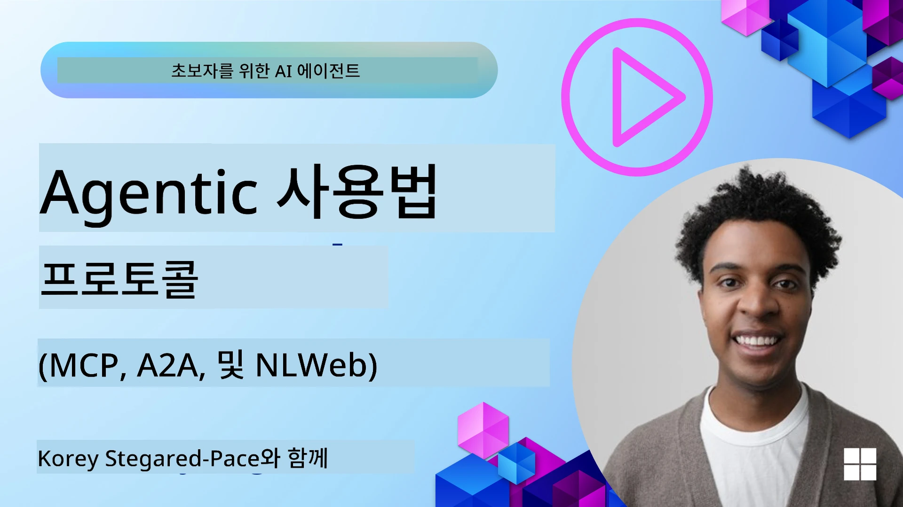
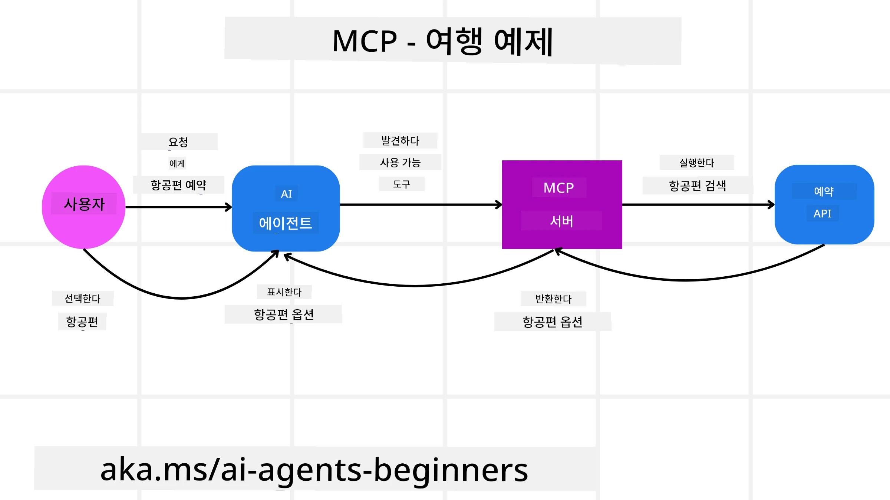
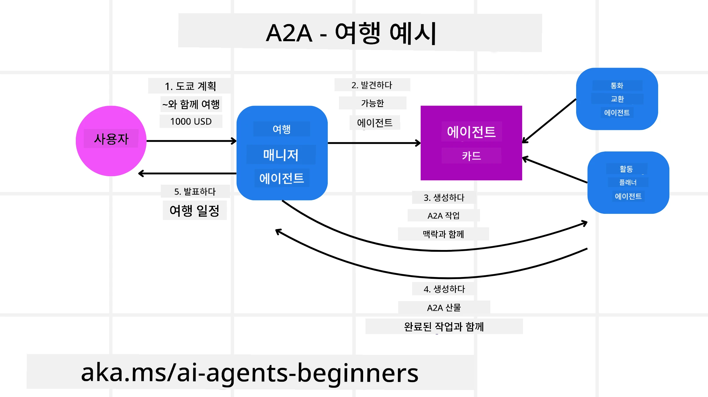
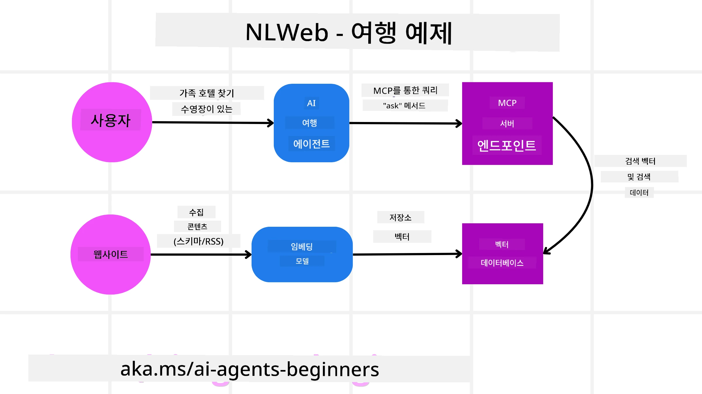

# 에이전틱 프로토콜 사용하기 (MCP, A2A 및 NLWeb)

> _(위 이미지를 클릭하면 이 강의 영상으로 이동합니다)_

AI 에이전트 사용이 증가함에 따라 표준화, 보안, 개방형 혁신 지원을 보장하는 프로토콜의 필요성도 커지고 있습니다. 이번 강의에서는 이 요구를 충족하고자 하는 3가지 프로토콜인 모델 컨텍스트 프로토콜(Model Context Protocol, MCP), 에이전트 간 통신(Agent to Agent, A2A), 자연어 웹(Natural Language Web, NLWeb)에 대해 다룹니다.

## 소개

이번 강의에서 다룰 내용은 다음과 같습니다:

• <strong>MCP</strong>가 AI 에이전트가 외부 도구와 데이터를 사용해 사용자 작업을 완료할 수 있게 하는 방법

• <strong>A2A</strong>가 서로 다른 AI 에이전트 간의 통신과 협업을 가능하게 하는 방법

• <strong>NLWeb</strong>이 자연어 인터페이스를 모든 웹사이트에 제공하여 AI 에이전트가 해당 콘텐츠를 검색하고 상호작용하도록 하는 방법

## 학습 목표

• AI 에이전트 맥락에서 MCP, A2A, NLWeb의 핵심 목적과 이점 <strong>식별</strong>

• 각 프로토콜이 LLM, 도구 및 다른 에이전트 사이 통신 및 상호작용을 어떻게 촉진하는지 <strong>설명</strong>

• 복잡한 에이전틱 시스템 구축에서 각 프로토콜이 수행하는 독특한 역할 <strong>인식</strong>

## 모델 컨텍스트 프로토콜

<strong>모델 컨텍스트 프로토콜(MCP)</strong>은 애플리케이션이 LLM에 컨텍스트와 도구를 표준화된 방식으로 제공할 수 있도록 하는 오픈 표준입니다. 이는 AI 에이전트가 일관된 방식으로 연결할 수 있는 다양한 데이터 소스와 도구에 대한 "범용 어댑터" 역할을 합니다.

MCP의 구성 요소, 직접 API를 사용하는 것과 비교했을 때의 이점, AI 에이전트가 MCP 서버를 사용하는 예시를 살펴보겠습니다.

### MCP 핵심 구성 요소

MCP는 <strong>클라이언트-서버 아키텍처</strong>로 작동하며, 핵심 구성 요소는 다음과 같습니다:

• <strong>호스트</strong>는 MCP 서버에 연결을 시작하는 LLM 애플리케이션(예: VSCode 같은 코드 에디터)입니다.

• <strong>클라이언트</strong>는 호스트 애플리케이션 내에서 서버와 일대일 연결을 유지하는 구성요소입니다.

• <strong>서버</strong>는 특정 기능을 제공하는 경량 프로그램입니다.

프로토콜에 포함된 세 가지 핵심 프리미티브는 MCP 서버의 기능입니다:

• **도구(Tools)**: AI 에이전트가 호출하여 작업을 수행할 수 있는 개별 작업 또는 기능입니다. 예를 들어, 날씨 서비스는 "날씨 조회" 도구를 제공할 수 있고, 전자상거래 서버는 "제품 구매" 도구를 제공합니다. MCP 서버는 각 도구의 이름, 설명, 입력/출력 스키마를 기능 목록에 광고합니다.

• **리소스(Resources)**: MCP 서버가 제공할 수 있는 읽기 전용 데이터 항목이나 문서로, 클라이언트가 필요할 때 가져올 수 있습니다. 예로는 파일 내용, 데이터베이스 레코드, 로그 파일 등이 있으며, 텍스트(코드나 JSON) 또는 바이너리(이미지나 PDF)일 수 있습니다.

• **프롬프트(Prompts)**: 미리 정의된 템플릿으로 제안 프롬프트를 제공하여 더 복잡한 작업 흐름을 지원합니다.

### MCP 이점

MCP는 AI 에이전트에 다음과 같은 중요한 장점을 제공합니다:

• **동적 도구 검색**: 에이전트는 서버로부터 사용 가능한 도구 목록과 그 설명을 동적으로 수신할 수 있습니다. 이는 전통적인 API와 달리 통합 시 정적 코딩이 필요 없어 API 변경 시 코드를 수정해야 하는 번거로움이 없습니다. MCP는 "한 번 통합"하는 방식으로 더 큰 적응성을 제공합니다.

• **LLM 간 상호운용성**: MCP는 다양한 LLM 간에 작동하여 핵심 모델을 교체하면서 더 나은 성능을 평가할 수 있는 유연성을 제공합니다.

• **표준화된 보안**: MCP는 표준 인증 방식을 포함하여 여러 MCP 서버에 대한 접근을 확장할 때 관리가 용이합니다. 여러 API별로 서로 다른 키와 인증 방식을 관리하는 것보다 간단합니다.

### MCP 예시

사용자가 MCP 기반 AI 어시스턴트를 통해 항공편을 예약하려 한다고 생각해 보겠습니다.

1. <strong>연결</strong>: AI 어시스턴트(MCP 클라이언트)가 항공사에서 제공하는 MCP 서버에 연결합니다.

2. **도구 검색**: 클라이언트가 항공사의 MCP 서버에 "사용 가능한 도구가 무엇인가요?"라고 질문하면, 서버는 "항공편 검색", "항공편 예약" 같은 도구를 응답합니다.

3. **도구 호출**: 사용자가 AI 어시스턴트에게 "포틀랜드에서 호놀룰루까지 항공편을 검색해줘"라고 요청하면, AI 어시스턴트는 LLM을 사용해 "항공편 검색" 도구를 호출해야 함을 인지하고 MCP 서버에 관련 매개변수(출발지, 목적지)를 전달합니다.

4. **실행 및 응답**: MCP 서버는 래퍼 역할을 하여 항공사의 내부 예약 API에 실제 호출을 하고, 받은 항공편 정보(예: JSON 데이터)를 AI 어시스턴트에게 반환합니다.

5. **추가 상호작용**: AI 어시스턴트가 항공편 옵션을 제시하며, 사용자가 항공편을 선택하면 동일 MCP 서버의 "항공편 예약" 도구를 호출하여 예약을 완료할 수 있습니다.

## 에이전트 간 프로토콜 (A2A)

MCP가 LLM과 도구 연결에 중점을 둔다면, <strong>에이전트 간 프로토콜(Agent-to-Agent, A2A)</strong>은 한 단계 더 나아가 서로 다른 AI 에이전트 간의 통신과 협업을 가능하게 합니다. A2A는 다른 조직, 환경, 기술 스택에 흩어진 AI 에이전트를 연결하여 공동 작업을 수행하게 합니다.

A2A의 구성 요소와 이점, 그리고 여행 애플리케이션에 적용하는 예를 살펴보겠습니다.

### A2A 핵심 구성 요소

A2A는 에이전트 간 통신을 가능하게 하며, 사용자 작업의 하위 작업을 완수하기 위한 협업을 지원합니다. 각 구성 요소가 이 목적에 기여합니다:

#### 에이전트 카드

MCP 서버가 도구 목록을 공유하는 방식과 유사하게, 에이전트 카드에는 다음이 포함됩니다:
- 에이전트 이름
- 에이전트가 수행하는 **일반 작업에 대한 설명**
- 다른 에이전트(또는 인간 사용자)가 언제, 왜 그 에이전트를 호출할지 이해하도록 돕는 **구체적인 기술 목록과 설명**
- 에이전트의 **현재 엔드포인트 URL**
- 스트리밍 응답, 푸시 알림 등 에이전트의 <strong>버전</strong>과 <strong>기능</strong>

#### 에이전트 실행기

에이전트 실행기는 <strong>사용자 채팅 컨텍스트를 원격 에이전트에 전달</strong>하는 역할을 합니다. 원격 에이전트는 이를 통해 수행할 작업을 이해합니다. A2A 서버에서 에이전트는 자체 LLM을 사용하여 들어오는 요청을 파싱하고 내부 도구로 작업을 수행합니다.

#### 작업 산출물 (Artifact)

원격 에이전트가 요청된 작업을 완료하면 작업 결과물이 아티팩트로 생성됩니다. 아티팩트는 **에이전트 작업 결과**, **완료된 작업에 대한 설명**, 그리고 프로토콜을 통해 전달된 <strong>텍스트 컨텍스트</strong>를 포함합니다. 아티팩트 전송 후에는 원격 에이전트와의 연결이 종료되어 필요할 때까지 대기합니다.

#### 이벤트 큐

이 구성 요소는 <strong>업데이트 처리와 메시지 전달</strong>에 사용됩니다. 작업 완료까지 시간이 오래 걸릴 수 있는 경우 에이전트 간 연결이 미리 닫히는 것을 방지하는 데 매우 중요합니다.

### A2A 이점

• **향상된 협업**: 서로 다른 공급업체와 플랫폼의 에이전트들이 상호작용하고 컨텍스트를 공유하며 협력할 수 있게 하여, 전통적으로 분리된 시스템 간의 원활한 자동화를 가능하게 합니다.

• **모델 선택의 유연성**: 각 A2A 에이전트는 요청을 처리하기 위해 사용할 LLM을 자체적으로 선택할 수 있어, 일부 MCP 시나리오의 단일 LLM 연결과 달리 에이전트별로 최적화되거나 미세 조정된 모델을 사용할 수 있습니다.

• **내장 인증**: A2A 프로토콜에 직접 통합된 인증이 에이전트 상호작용을 위한 견고한 보안 프레임워크를 제공합니다.

### A2A 예시

여행 예약 시나리오를 A2A를 사용해 확장해 보겠습니다.

1. **사용자의 다중 에이전트 요청**: 사용자가 "다음 주 호놀룰루 여행 전체(항공편, 호텔, 렌터카) 예약해줘"라고 '여행 에이전트' A2A 클라이언트/에이전트에게 요청합니다.

2. **여행 에이전트의 작업 조율**: 여행 에이전트가 이 복잡한 요청을 받고 LLM으로 작업을 판단하여 다른 전문 에이전트와 상호작용해야 한다고 결정합니다.

3. **에이전트 간 통신**: 여행 에이전트는 A2A 프로토콜을 사용해 '항공사 에이전트', '호텔 에이전트', '렌터카 에이전트' 등 다른 회사에서 만든 후속 에이전트들과 연결합니다.

4. **위임된 작업 수행**: 여행 에이전트가 특화된 각 에이전트에 "호놀룰루 행 항공편 찾아줘", "호텔 예약해줘", "렌터카 빌려줘" 등의 특정 작업을 할당합니다. 각 에이전트는 자체 LLM과 도구(자체 MCP 서버일 수도 있음)를 사용해 역할을 수행합니다.

5. **통합 응답**: 후속 에이전트들이 모두 작업을 완료하면 여행 에이전트가 결과(항공편 정보, 호텔 확인, 렌터카 예약)를 모아, 대화 형식의 종합 응답을 사용자에게 보냅니다.

## 자연어 웹 (NLWeb)

웹사이트는 오랫동안 사용자가 인터넷상 정보와 데이터를 접하는 주요 수단이었습니다.

여기서는 NLWeb의 다양한 구성 요소, 이점, 그리고 여행 애플리케이션으로 작동 방식을 예시로 살펴보겠습니다.

### NLWeb 구성 요소

- **NLWeb 애플리케이션 (핵심 서비스 코드)**: 자연어 질문을 처리하는 시스템입니다. 플랫폼의 다양한 부분을 연결해 응답을 생성합니다. 웹사이트 자연어 기능을 구동하는 <strong>엔진</strong>으로 생각할 수 있습니다.

- **NLWeb 프로토콜**: 웹사이트와 자연어 상호작용하기 위한 <strong>기본 규칙 집합</strong>입니다. JSON 형식(보통 Schema.org 사용)으로 응답을 반환합니다. HTML이 온라인 문서 공유를 가능하게 한 것처럼, “AI 웹”의 단순한 기반을 만들려는 목적입니다.

- **MCP 서버 (모델 컨텍스트 프로토콜 엔드포인트)**: 모든 NLWeb 구성이 MCP 서버로 작동합니다. 즉, 다른 AI 시스템과 <strong>도구(예: ‘ask’ 메서드)와 데이터</strong>를 공유할 수 있습니다. 실제 사용 시, 이는 웹사이트의 콘텐츠와 기능을 AI 에이전트가 활용할 수 있게 하여 사이트가 “에이전트 생태계”의 일부가 되도록 합니다.

- **임베딩 모델**: 웹사이트 콘텐츠를 컴퓨터가 비교하고 검색할 수 있는 수치적 표현(벡터, 임베딩)으로 변환하는 데 사용됩니다. 이 벡터는 특수 데이터베이스에 저장되고, 사용자는 원하는 임베딩 모델을 선택할 수 있습니다.

- **벡터 데이터베이스 (검색 메커니즘)**: 웹사이트 콘텐츠 임베딩을 저장하는 데이터베이스입니다. 누군가 질문을 하면, NLWeb이 벡터 데이터베이스를 확인해 가장 관련성 높은 정보를 빠르게 찾습니다. Qdrant, Snowflake, Milvus, Azure AI Search, Elasticsearch 등 다양한 벡터 저장 시스템과 연동됩니다.

### NLWeb 예시

다시 한번 여행 예약 웹사이트를 생각해 보겠습니다. 이번에는 NLWeb으로 구동됩니다.

1. **데이터 수집**: 여행 사이트 기존 상품 카탈로그(예: 항공편 목록, 호텔 설명, 투어 패키지)는 Schema.org로 포맷하거나 RSS 피드로 로드됩니다. NLWeb 도구가 이 구조화된 데이터를 흡수해 임베딩 생성 후, 로컬이나 원격 벡터 데이터베이스에 저장합니다.

2. **자연어 질의 (사람)**: 사용자가 웹사이트를 방문해 메뉴를 탐색하는 대신, 대화형 인터페이스에 "다음 주 호놀룰루에서 수영장 있는 가족 친화형 호텔 찾아줘"라고 입력합니다.

3. **NLWeb 처리**: NLWeb 애플리케이션이 이 쿼리를 받아 LLM에 보내 이해를 돕고, 동시에 벡터 데이터베이스에서 관련 호텔 목록을 검색합니다.

4. **정확한 결과**: LLM이 "가족 친화적", "수영장", "호놀룰루" 기준에 맞는 최적 매칭을 확인하여 자연어 응답을 형성합니다. 중요한 점은 응답이 사이트 카탈로그에 실제 존재하는 호텔을 참조해, 허구의 정보를 배제한다는 것입니다.

5. **AI 에이전트 상호작용**: NLWeb이 MCP 서버 역할을 하므로 외부 AI 여행 에이전트가 이 사이트의 NLWeb 인스턴스에 연결 가능하며, `ask` MCP 메서드로 직접 사이트에 질의할 수 있습니다: `ask("호놀룰루 지역 호텔에서 추천하는 비건 친화 레스토랑이 있나요?")`. NLWeb은 이 요청을 처리하고, 로드된 레스토랑 정보 데이터베이스를 활용해 구조화된 JSON 응답을 반환합니다.

### MCP/A2A/NLWeb에 대해 더 궁금하신가요?

[Microsoft Foundry Discord](https://discord.com/invite/ATgtXmAS5D)에 참여해 다른 학습자들과 만나고, 오피스 아워에 참석하며 AI 에이전트 관련 질문에 답변을 받아보세요.

## 자료

- [초보자를 위한 MCP](https://aka.ms/mcp-for-beginners)  
- [MCP 문서](https://learn.microsoft.com/python/api/overview/azure/ai-projects-readme)
- [NLWeb 저장소](https://github.com/nlweb-ai/NLWeb)
- [Microsoft Agent Framework](https://learn.microsoft.com/en-us/agent-framework/overview/?wt.mc_id=youtube_26688_organicsocial_reactor&pivots=programming-language-python)

## 이전 강의

[생산 환경의 AI 에이전트](../10-ai-agents-production/README.md)

## 다음 강의

[AI 에이전트를 위한 컨텍스트 엔지니어링](../12-context-engineering/README.md)

---

<!-- CO-OP TRANSLATOR DISCLAIMER START -->
**면책 조항**:
이 문서는 AI 번역 서비스 [Co-op Translator](https://github.com/Azure/co-op-translator)를 사용하여 번역되었습니다. 정확성을 기하기 위해 노력하고 있으나, 자동 번역은 오류나 부정확한 부분이 있을 수 있음을 유의하시기 바랍니다. 원본 문서의 원어본이 권위 있는 자료로 간주되어야 합니다. 중요한 정보의 경우, 전문가의 인간 번역을 권장합니다. 이 번역 사용으로 인해 발생하는 오해나 잘못된 해석에 대해 당사는 책임을 지지 않습니다.
<!-- CO-OP TRANSLATOR DISCLAIMER END -->