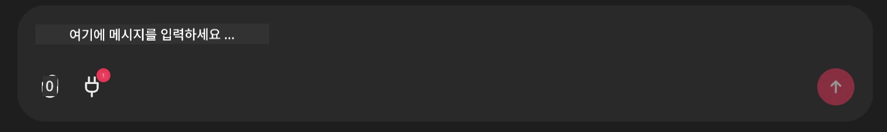

# Github MCP 서버 예제

## 설명

이 데모는 Microsoft Reactor를 통해 주최된 AI 에이전트 해커톤을 위해 만들어졌습니다.

이 도구는 사용자의 Github 저장소를 기반으로 해커톤 프로젝트를 추천하는 데 사용됩니다.
이는 다음과 같이 진행됩니다:

1. **Github 에이전트** - Github MCP 서버를 사용하여 저장소 및 해당 저장소에 대한 정보를 검색합니다.
2. **해커톤 에이전트** - Github 에이전트에서 가져온 데이터를 바탕으로 사용자의 프로젝트, 사용한 언어 및 AI 에이전트 해커톤의 프로젝트 트랙을 기반으로 창의적인 해커톤 프로젝트 아이디어를 제시합니다.
3. **이벤트 에이전트** - 해커톤 에이전트의 제안에 따라 이벤트 에이전트는 AI 에이전트 해커톤 시리즈에서 관련 이벤트를 추천합니다.

## 코드 실행

### 환경 변수

이 데모는 Microsoft Agent Framework, Azure OpenAI 서비스, Github MCP 서버 및 Azure AI 검색을 사용합니다.

이 도구들을 사용하기 위해 적절한 환경 변수가 설정되어 있는지 확인하세요:

```python
AZURE_AI_PROJECT_ENDPOINT=""
AZURE_AI_MODEL_DEPLOYMENT_NAME=""
AZURE_SEARCH_SERVICE_ENDPOINT=""
AZURE_SEARCH_API_KEY=""
``` 


## Chainlit 서버 실행

MCP 서버와 연결하기 위해 이 데모는 Chainlit을 채팅 인터페이스로 사용합니다.

서버를 실행하려면 터미널에서 다음 명령어를 사용하세요:

```bash
chainlit run app.py -w
```


이 명령어는 `localhost:8000`에서 Chainlit 서버를 시작하고, `event-descriptions.md` 내용을 Azure AI 검색 인덱스에 채웁니다.

## MCP 서버 연결

Github MCP 서버에 연결하려면 "Type your message here.." 채팅 상자 아래에 있는 "플러그" 아이콘을 선택하세요:



거기서 "Connect an MCP"를 클릭하여 Github MCP 서버에 연결하는 명령을 추가할 수 있습니다:

```bash
npx -y @modelcontextprotocol/server-github --env GITHUB_PERSONAL_ACCESS_TOKEN=[YOUR PERSONAL ACCESS TOKEN]
```


"[YOUR PERSONAL ACCESS TOKEN]"을 실제 개인 액세스 토큰으로 교체하세요.

연결 후, 플러그 아이콘 옆에 (1)이 표시되어 연결이 확인됩니다. 표시되지 않으면 `chainlit run app.py -w`로 Chainlit 서버를 다시 시작해 보세요.

## 데모 사용 방법

해커톤 프로젝트 추천 에이전트 워크플로우를 시작하려면 다음과 같은 메시지를 입력할 수 있습니다:

"Recommend hackathon projects for the Github user koreyspace"

라우터 에이전트가 요청을 분석하고 어떤 에이전트 조합(GitHub, 해커톤, 이벤트)이 쿼리를 처리하는 데 적합한지 결정합니다. 에이전트들은 Github 저장소 분석, 프로젝트 아이디어 제안, 관련 기술 이벤트에 관한 종합적인 추천을 제공하기 위해 협력합니다.

---

<!-- CO-OP TRANSLATOR DISCLAIMER START -->
**면책 조항**:  
이 문서는 AI 번역 서비스 [Co-op Translator](https://github.com/Azure/co-op-translator)를 사용하여 번역되었습니다. 정확성을 위해 최선을 다했으나, 자동 번역에는 오류나 부정확한 부분이 있을 수 있음을 알려드립니다. 원본 문서는 해당 언어의 원문이 권위 있는 출처로 간주되어야 합니다. 중요한 정보의 경우 전문적인 인간 번역을 권장합니다. 본 번역 사용으로 인한 오해나 잘못된 해석에 대해 당사는 책임을 지지 않습니다.
<!-- CO-OP TRANSLATOR DISCLAIMER END -->