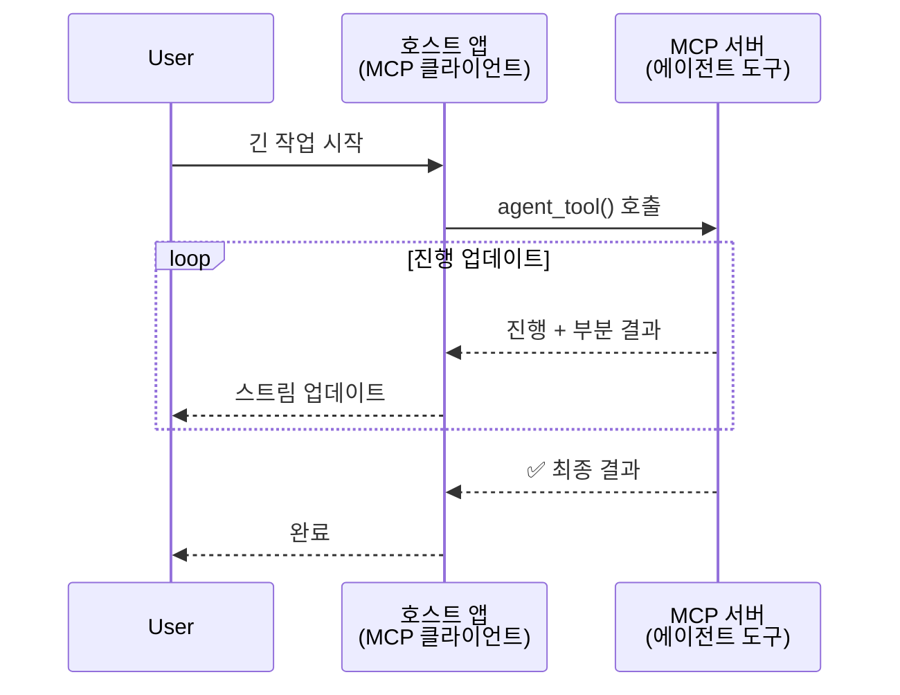
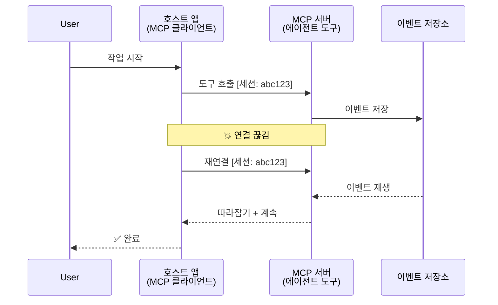
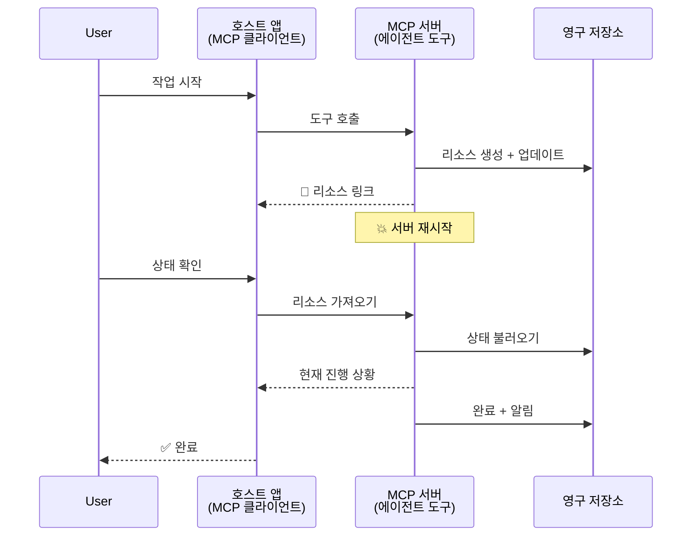
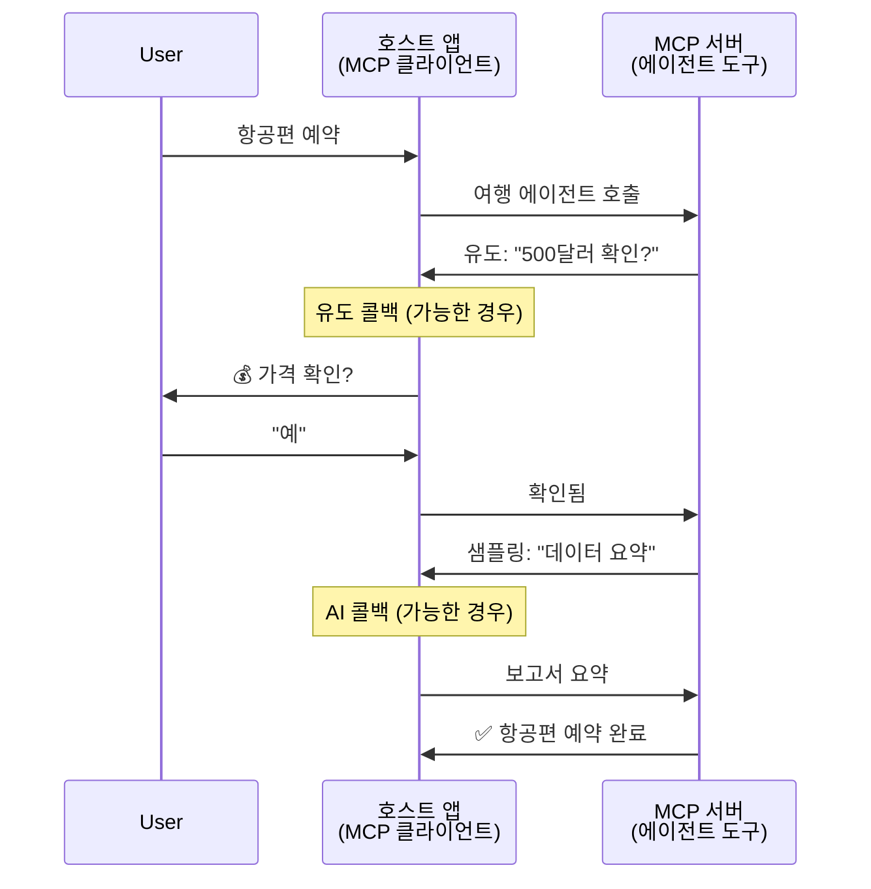
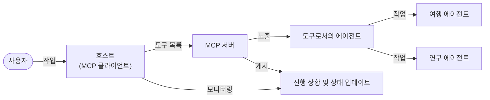

# MCP로 에이전트 간 통신 시스템 구축하기

> 요약 - MCP로 Agent2Agent 통신을 구축할 수 있을까요? 예!

MCP는 원래 "LLM에 컨텍스트 제공"이라는 목표를 훨씬 뛰어넘어 크게 발전했습니다. 최근 [재개 가능한 스트림](https://modelcontextprotocol.io/docs/concepts/transports#resumability-and-redelivery), [유도](https://modelcontextprotocol.io/specification/2025-06-18/client/elicitation), [샘플링](https://modelcontextprotocol.io/specification/2025-06-18/client/sampling), 알림([진행 상황](https://modelcontextprotocol.io/specification/2025-06-18/basic/utilities/progress) 및 [리소스](https://modelcontextprotocol.io/specification/2025-06-18/schema#resourceupdatednotification)) 등의 개선을 통해 MCP는 이제 복잡한 에이전트 간 통신 시스템을 구축할 수 있는 견고한 기반을 제공합니다.

## 에이전트/도구에 대한 오해

더 많은 개발자가 에이전트적 동작(장시간 실행, 중간에 추가 입력 필요 가능 등)을 갖춘 도구를 탐색함에 따라, MCP가 초기 도구 예제가 단순한 요청-응답 패턴에 집중했기 때문에 부적합하다는 오해가 있습니다.

이 인식은 시대에 뒤떨어집니다. MCP 사양은 지난 몇 달 동안 장기간 실행되는 에이전트 동작을 지원하는 기능으로 크게 향상되었습니다:

- **스트리밍 및 부분 결과**: 실행 중 실시간 진행 상황 업데이트 제공
- **재개 가능성**: 클라이언트가 연결 끊김 후 재접속 가능
- <strong>내구성</strong>: 서버 재시작 후에도 결과 유지(예: 리소스 링크 활용)
- **다중 턴**: 유도 및 샘플링을 통한 실행 중 인터랙티브 입력 제공

이러한 기능들은 MCP 프로토콜 위에서 복잡한 에이전트 및 다중 에이전트 애플리케이션을 가능하게 하도록 결합할 수 있습니다.

참고로, 에이전트를 MCP 서버에 배포된 "도구"로 지칭하며, 이는 MCP 서버와 세션을 설정하고 에이전트를 호출할 수 있는 MCP 클라이언트를 구현한 호스트 애플리케이션의 존재를 전제로 합니다.

## MCP 도구가 "에이전트적"인 이유는?

구현에 들어가기 전에, 장시간 실행되는 에이전트를 지원하기 위한 인프라 기능이 무엇인지 정의해 봅시다.

> 에이전트를 실시간 피드백에 따라 여러 상호작용이나 조정이 필요한 복잡한 작업을 처리하며 자율적으로 장기간 운영할 수 있는 개체로 정의합니다.

### 1. 스트리밍 및 부분 결과

전통적인 요청-응답 패턴은 장시간 작업에 적합하지 않습니다. 에이전트는 다음을 제공해야 합니다:

- 실시간 진행 상황 업데이트
- 중간 결과

**MCP 지원**: 리소스 업데이트 알림은 부분 결과 스트리밍을 지원하지만, JSON-RPC의 1:1 요청/응답 모델과 충돌을 피하려면 신중한 설계가 필요합니다.

| 기능                       | 사용 사례                                                                                                                                                                  | MCP 지원                                                                                  |
| -------------------------- | --------------------------------------------------------------------------------------------------------------------------------------------------------------------------- | ------------------------------------------------------------------------------------------ |
| 실시간 진행 상황 업데이트   | 사용자가 코드베이스 마이그레이션 작업을 요청하면 에이전트가 "10% - 의존성 분석 중... 25% - TypeScript 파일 변환 중... 50% - import 업데이트 중..." 등의 진행 상황을 스트리밍합니다.            | ✅ 진행 상황 알림                                                                          |
| 부분 결과                  | "책 생성" 작업에 대해 1) 스토리 아크 개요, 2) 챕터 목록, 3) 각 챕터가 완성됨 등 부분 결과를 스트리밍. 호스트는 언제든지 검사, 취소 또는 재지정 가능.                       | ✅ 알림에 부분 결과 포함 가능, PR 383, 776에서 제안 참고                                  |

<div align="center" style="font-style: italic; font-size: 0.95em; margin-bottom: 0.5em;">
<strong>그림 1:</strong> 이 다이어그램은 MCP 에이전트가 장시간 작업 중 호스트 애플리케이션에 실시간 진행 상황과 부분 결과를 스트리밍하여 사용자가 실행 상황을 실시간으로 모니터링할 수 있도록 하는 방식을 보여줍니다.
</div>



### 2. 재개 가능성

에이전트는 네트워크 중단을 원활하게 처리해야 합니다:

- (클라이언트) 연결 끊김 후 재접속 가능
- 중단한 시점부터 계속 실행(메시지 재전달)

**MCP 지원**: MCP StreamableHTTP 전송은 현재 세션 ID와 마지막 이벤트 ID를 사용해 세션 재개 및 메시지 재전달을 지원합니다. 서버는 클라이언트 재접속 시 이벤트 재생을 가능하게 하는 EventStore를 구현해야 합니다.  
커뮤니티 제안(PR #975) 중에는 전송 방식에 구애받지 않는 재개 가능한 스트림에 관한 논의도 있습니다.

| 기능       | 사용 사례                                                                                                                                                    | MCP 지원                                                                    |
| ---------- | ----------------------------------------------------------------------------------------------------------------------------------------------------------- | -------------------------------------------------------------------------- |
| 재개 가능성 | 클라이언트가 장시간 작업 중 연결이 끊김. 재접속 시 놓친 이벤트를 재생하여 중단 지점부터 원활하게 세션을 재개함.                                               | ✅ 세션 ID, 이벤트 재생, EventStore를 포함한 StreamableHTTP 전송             |

<div align="center" style="font-style: italic; font-size: 0.95em; margin-bottom: 0.5em;">
<strong>그림 2:</strong> 이 다이어그램은 MCP의 StreamableHTTP 전송과 이벤트 저장소가 세션 재개를 원활하게 지원하는 방식을 보여줍니다: 클라이언트가 연결 끊김 시 재접속하여 놓친 이벤트를 재생해 진행 손실 없이 작업을 계속할 수 있습니다.
</div>



### 3. 내구성

장시간 실행 에이전트에는 지속적인 상태가 필요합니다:

- 서버 재시작 후 결과가 유지됨
- 상태를 별도로 조회 가능
- 세션 간 진행 상황 추적 가능

**MCP 지원**: MCP는 이제 도구 호출에 대해 Resource 링크 반환 유형을 지원합니다. 일반적인 패턴으로는 도구가 리소스를 생성하고 즉시 리소스 링크를 반환한 뒤, 백그라운드에서 작업을 계속하며 리소스를 업데이트하는 방식입니다. 클라이언트는 이 리소스 상태를 폴링하거나 리소스 업데이트 알림 구독을 통해 부분 또는 전체 결과를 얻을 수 있습니다.

한계점으로는 리소스 폴링이나 업데이트 구독이 대규모에서 리소스 소비 문제를 일으킬 수 있다는 점이 있습니다. 현재 서버가 클라이언트/호스트 애플리케이션에 업데이트를 알리기 위해 호출할 수 있는 웹훅 또는 트리거 포함 가능성을 논의하는 커뮤니티 제안(#992 포함)이 있습니다.

| 기능     | 사용 사례                                                                                                                                                 | MCP 지원                                                      |
| -------- | -------------------------------------------------------------------------------------------------------------------------------------------------------- | ------------------------------------------------------------- |
| 내구성   | 데이터 마이그레이션 작업 중 서버가 충돌. 결과와 진행 상황이 재시작 후에도 유지되며, 클라이언트가 상태를 확인하고 영속 리소스에서 계속 진행 가능.           | ✅ 지속 저장 및 상태 알림을 지원하는 리소스 링크               |

오늘날 일반적인 패턴은 도구가 리소스를 생성하고 즉시 리소스 링크를 반환하도록 설계한 다음, 백그라운드에서 작업을 진행하며, 작업 진행 상황에 따른 리소스 알림 및 부분 결과를 포함하여 리소스 콘텐츠를 갱신하는 방식입니다.

<div align="center" style="font-style: italic; font-size: 0.95em; margin-bottom: 0.5em;">
<strong>그림 3:</strong> 이 다이어그램은 MCP 에이전트가 지속적인 리소스와 상태 알림을 사용하여 장시간 작업이 서버 재시작 후에도 유지되도록 보장하는 방식을 보여주며, 클라이언트가 진행 상황을 확인하고 실패 후에도 결과를 가져올 수 있음을 나타냅니다.
</div>



### 4. 다중 턴 상호작용

에이전트는 종종 실행 중 추가 입력이 필요합니다:

- 사람의 명확화 또는 승인
- 복잡한 의사결정을 위한 AI 지원
- 동적 매개변수 조정

**MCP 지원**: 샘플링(인공지능 입력)과 유도(사람 입력)를 통해 완벽히 지원됩니다.

| 기능                      | 사용 사례                                                                                                                                          | MCP 지원                                               |
| ------------------------ | ------------------------------------------------------------------------------------------------------------------------------------------------- | ------------------------------------------------------- |
| 다중 턴 상호작용         | 여행 예약 에이전트가 사용자에게 가격 확인을 요청하고, AI에 여행 데이터를 요약하도록 요청하여 예약을 완료합니다.                                 | ✅ 사람 입력을 위한 유도, AI 입력을 위한 샘플링        |

<div align="center" style="font-style: italic; font-size: 0.95em; margin-bottom: 0.5em;">
<strong>그림 4:</strong> 이 다이어그램은 MCP 에이전트가 실행 중에 사람 입력을 인터랙티브하게 유도하거나 AI 지원을 요청할 수 있어, 확인 및 동적 의사결정과 같은 복잡한 다중 턴 워크플로우를 지원하는 방식을 보여줍니다.
</div>



## MCP에서 장시간 실행 에이전트 구현 - 코드 개요

이 글에서는 MCP Python SDK와 StreamableHTTP 전송을 사용해 세션 재개와 메시지 재전달이 가능한 장기간 실행 에이전트를 완전하게 구현한 [코드 저장소](https://github.com/victordibia/ai-tutorials/tree/main/MCP%20Agents)를 제공합니다. 구현은 MCP 기능을 결합해 정교한 에이전트 유사 동작을 가능하게 하는 방법을 보여줍니다.

구체적으로 두 가지 주요 에이전트 도구를 포함한 서버를 구현했습니다:

- **여행 에이전트** - 유도를 통한 가격 확인이 포함된 여행 예약 서비스 시뮬레이션
- **연구 에이전트** - 샘플링을 통한 AI 지원 요약과 함께 연구 작업 수행

두 에이전트 모두 실시간 진행 상황 업데이트, 상호작용 확인, 완전한 세션 재개 기능을 시연합니다.

### 주요 구현 개념

다음 섹션에서는 각 기능에 대해 서버 측 에이전트 구현과 클라이언트 측 호스트 처리를 보여줍니다:

#### 스트리밍 및 진행 상황 업데이트 - 실시간 작업 상태

스트리밍은 에이전트가 장시간 작업 중 실시간으로 진행 상황 업데이트를 제공해 사용자가 작업 상태와 중간 결과를 알 수 있도록 합니다.

**서버 구현(에이전트가 진행 알림 전송):**

```python
# 서버/server.py에서 - 진행 상황 업데이트를 보내는 여행사
for i, step in enumerate(steps):
    await ctx.session.send_progress_notification(
        progress_token=ctx.request_id,
        progress=i * 25,
        total=100,
        message=step,
        related_request_id=str(ctx.request_id)
    )
    await anyio.sleep(2)  # 작업 시뮬레이션

# 대안: 단계별 자세한 업데이트를 위한 로그 메시지
await ctx.session.send_log_message(
    level="info",
    data=f"Processing step {current_step}/{steps} ({progress_percent}%)",
    logger="long_running_agent",
    related_request_id=ctx.request_id,
)
```

**클라이언트 구현(호스트가 진도 업데이트 수신):**

```python
# client/client.py에서 - 실시간 알림을 처리하는 클라이언트
async def message_handler(message) -> None:
    if isinstance(message, types.ServerNotification):
        if isinstance(message.root, types.LoggingMessageNotification):
            console.print(f"📡 [dim]{message.root.params.data}[/dim]")
        elif isinstance(message.root, types.ProgressNotification):
            progress = message.root.params
            console.print(f"🔄 [yellow]{progress.message} ({progress.progress}/{progress.total})[/yellow]")

# 세션을 생성할 때 메시지 핸들러 등록
async with ClientSession(
    read_stream, write_stream,
    message_handler=message_handler
) as session:
```

#### 유도 - 사용자 입력 요청

유도는 에이전트가 실행 중간에 사용자 입력을 요청할 수 있도록 하며, 이는 장시간 작업에서 확인, 명확화 또는 승인을 위해 필수적입니다.

**서버 구현(에이전트가 확인 요청):**

```python
# 서버/server.py에서 - 여행사 가격 확인 요청
elicit_result = await ctx.session.elicit(
    message=f"Please confirm the estimated price of $1200 for your trip to {destination}",
    requestedSchema=PriceConfirmationSchema.model_json_schema(),
    related_request_id=ctx.request_id,
)

if elicit_result and elicit_result.action == "accept":
    # 예약 계속 진행
    logger.info(f"User confirmed price: {elicit_result.content}")
elif elicit_result and elicit_result.action == "decline":
    # 예약 취소
    booking_cancelled = True
```

**클라이언트 구현(호스트가 유도 콜백 제공):**

```python
# client/client.py에서 - 클라이언트 처리 요청 관리
async def elicitation_callback(context, params):
    console.print(f"💬 Server is asking for confirmation:")
    console.print(f"   {params.message}")

    response = console.input("Do you accept? (y/n): ").strip().lower()

    if response in ['y', 'yes']:
        return types.ElicitResult(
            action="accept",
            content={"confirm": True, "notes": "Confirmed by user"}
        )
    else:
        return types.ElicitResult(
            action="decline",
            content={"confirm": False, "notes": "Declined by user"}
        )

# 세션 생성 시 콜백을 등록합니다
async with ClientSession(
    read_stream, write_stream,
    elicitation_callback=elicitation_callback
) as session:
```

#### 샘플링 - AI 지원 요청

샘플링은 에이전트가 실행 중에 복잡한 의사 결정이나 콘텐츠 생성을 위해 LLM 지원을 요청할 수 있게 하여, 하이브리드 인간-AI 워크플로우를 가능하게 합니다.

**서버 구현(에이전트가 AI 지원 요청):**

```python
# server/server.py에서 - AI 요약을 요청하는 리서치 에이전트
sampling_result = await ctx.session.create_message(
    messages=[
        SamplingMessage(
            role="user",
            content=TextContent(type="text", text=f"Please summarize the key findings for research on: {topic}")
        )
    ],
    max_tokens=100,
    related_request_id=ctx.request_id,
)

if sampling_result and sampling_result.content:
    if sampling_result.content.type == "text":
        sampling_summary = sampling_result.content.text
        logger.info(f"Received sampling summary: {sampling_summary}")
```

**클라이언트 구현(호스트가 샘플링 콜백 제공):**

```python
# client/client.py에서 - 샘플링 요청을 처리하는 클라이언트
async def sampling_callback(context, params):
    message_text = params.messages[0].content.text if params.messages else 'No message'
    console.print(f"🧠 Server requested sampling: {message_text}")

    # 실제 애플리케이션에서는 LLM API를 호출할 수 있습니다
    # 데모 목적을 위해, 모의 응답을 제공합니다
    mock_response = "Based on current research, MCP has evolved significantly..."

    return types.CreateMessageResult(
        role="assistant",
        content=types.TextContent(type="text", text=mock_response),
        model="interactive-client",
        stopReason="endTurn"
    )

# 세션 생성 시 콜백을 등록합니다
async with ClientSession(
    read_stream, write_stream,
    sampling_callback=sampling_callback,
    elicitation_callback=elicitation_callback
) as session:
```

#### 재개 가능성 - 연결 끊김 간 세션 연속성

재개 가능성은 장기간 실행되는 에이전트 작업이 클라이언트 연결 끊김을 견디고 재접속 시 중단 없이 계속 실행될 수 있도록 보장하며, 이는 이벤트 저장소와 재개 토큰을 통해 구현됩니다.

**이벤트 저장소 구현(서버가 세션 상태 보유):**

```python
# server/event_store.py에서 - 간단한 인메모리 이벤트 저장소
class SimpleEventStore(EventStore):
    def __init__(self):
        self._events: list[tuple[StreamId, EventId, JSONRPCMessage]] = []
        self._event_id_counter = 0

    async def store_event(self, stream_id: StreamId, message: JSONRPCMessage) -> EventId:
        """Store an event and return its ID."""
        self._event_id_counter += 1
        event_id = str(self._event_id_counter)
        self._events.append((stream_id, event_id, message))
        return event_id

    async def replay_events_after(self, last_event_id: EventId, send_callback: EventCallback) -> StreamId | None:
        """Replay events after the specified ID for resumption."""
        start_index = None
        stream_id = None
        for index, (event_stream_id, event_id, _) in enumerate(self._events):
            if event_id == last_event_id:
                start_index = index + 1
                stream_id = event_stream_id
                break

        if start_index is None:
            return None

        # 세션의 원래 스트림에서 이후 이벤트만 재생합니다.
        for event_stream_id, event_id, message in self._events[start_index:]:
            if event_stream_id != stream_id:
                continue
            await send_callback(EventMessage(message, event_id))

        return stream_id

# server/server.py에서 - 이벤트 저장소를 세션 관리자에게 전달
def create_server_app(event_store: Optional[EventStore] = None) -> Starlette:
    server = ResumableServer()

    # 재개를 위해 이벤트 저장소와 함께 세션 관리자 생성
    session_manager = StreamableHTTPSessionManager(
        app=server,
        event_store=event_store,  # 이벤트 저장소는 세션 재개를 가능하게 합니다
        json_response=False,
        security_settings=security_settings,
    )

    return Starlette(routes=[Mount("/mcp", app=session_manager.handle_request)])

# 사용법: 이벤트 저장소로 초기화
event_store = SimpleEventStore()
app = create_server_app(event_store)
```

**재개 토큰 포함 클라이언트 메타데이터(클라이언트가 저장한 상태로 재접속):**

```python
# client/client.py에서 - 메타데이터를 사용한 클라이언트 재개
if existing_tokens and existing_tokens.get("resumption_token"):
    # 기존 재개 토큰을 사용하여 중단한 위치에서 계속 진행
    metadata = ClientMessageMetadata(
        resumption_token=existing_tokens["resumption_token"],
    )
else:
    # 재개 토큰이 수신되면 저장하는 콜백 생성
    def enhanced_callback(token: str):
        protocol_version = getattr(session, 'protocol_version', None)
        token_manager.save_tokens(session_id, token, protocol_version, command, args)

    metadata = ClientMessageMetadata(
        on_resumption_token_update=enhanced_callback,
    )

# 재개 메타데이터와 함께 요청 전송
result = await session.send_request(
    types.ClientRequest(
        types.CallToolRequest(
            method="tools/call",
            params=types.CallToolRequestParams(name=command, arguments=args)
        )
    ),
    types.CallToolResult,
    metadata=metadata,
)
```

호스트 애플리케이션은 세션 ID와 재개 토큰을 로컬에 유지하여 진행 상황이나 상태 손실 없이 기존 세션에 재접속할 수 있습니다.

### 코드 구성

<div align="center" style="font-style: italic; font-size: 0.95em; margin-bottom: 0.5em;">
<strong>그림 5:</strong> MCP 기반 에이전트 시스템 아키텍처
</div>



**핵심 파일:**

- **`server/server.py`** - 재개 가능한 MCP 서버, 유도/샘플링/진행 상황 업데이트를 시연하는 여행 및 연구 에이전트 포함
- **`client/client.py`** - 재개 지원 및 콜백 핸들러, 토큰 관리를 갖춘 인터랙티브 호스트 애플리케이션
- **`server/event_store.py`** - 세션 재개와 메시지 재전달을 가능하게 하는 이벤트 저장소 구현

## MCP에서 다중 에이전트 통신 확장하기

위 구현은 호스트 애플리케이션의 인텔리전스와 범위를 확장하여 다중 에이전트 시스템으로 발전시킬 수 있습니다:

- **지능적 작업 분해**: 호스트가 복잡한 사용자 요청을 분석해 다양한 전문화된 에이전트에 하위 작업으로 분할
- **다중 서버 조정**: 호스트가 다른 에이전트 기능을 공개하는 여러 MCP 서버와 연결 유지
- **작업 상태 관리**: 호스트가 여러 동시 에이전트 작업의 진행 상황을 추적하고 의존성 및 순서를 관리
- **복원력 및 재시도**: 호스트가 실패를 관리하고 재시도 로직을 구현하며 에이전트가 불가용 시 작업을 재분배
- **결과 합성**: 호스트가 다중 에이전트 출력을 통합해 일관된 최종 결과 생성

호스트는 단순한 클라이언트를 넘어 지능적인 오케스트레이터로 진화하여 분산된 에이전트 기능을 조율하면서 동일한 MCP 프로토콜 기반을 유지합니다.

## 결론

MCP의 향상된 기능—리소스 알림, 유도/샘플링, 재개 가능한 스트림, 지속 리소스—은 프로토콜 단순성을 유지하면서도 복잡한 에이전트 간 상호작용을 가능하게 합니다.

## 시작하기

나만의 agent2agent 시스템을 구축할 준비가 되었나요? 다음 단계를 따라주세요:

### 1. 데모 실행

```bash
# 재개를 위해 이벤트 저장소와 함께 서버를 시작합니다
python -m server.server --port 8006

# 다른 터미널에서 인터랙티브 클라이언트를 실행합니다
python -m client.client --url http://127.0.0.1:8006/mcp
```

**인터랙티브 모드에서 사용 가능한 명령어:**

- `travel_agent` - 유도를 통한 가격 확인과 함께 여행 예약
- `research_agent` - 샘플링을 통한 AI 지원 요약으로 주제 연구
- `list` - 사용 가능한 모든 도구 목록 표시
- `clean-tokens` - 재개 토큰 삭제
- `help` - 상세 명령어 도움말 표시
- `quit` - 클라이언트 종료

### 2. 재개 기능 테스트

- 장시간 에이전트 실행 시작(예: `travel_agent`)
- 실행 중 클라이언트 중단 (Ctrl+C)
- 클라이언트 재시작 - 중단 지점부터 자동 재개

### 3. 탐색 및 확장

- **예제 탐색**: [mcp-agents](https://github.com/victordibia/ai-tutorials/tree/main/MCP%20Agents) 확인
- **커뮤니티 참여**: GitHub에서 MCP 토론에 참여
- **실험 시작**: 간단한 장시간 작업부터 시작해 스트리밍, 재개, 다중 에이전트 조정 추가

이는 MCP가 도구 기반의 단순성을 유지하면서도 지능형 에이전트 동작을 가능하게 함을 보여줍니다.

전반적으로 MCP 프로토콜 사양은 빠르게 진화하고 있으니, 최신 업데이트는 공식 문서 사이트 https://modelcontextprotocol.io/introduction 를 참고하시기 바랍니다.

---

<!-- CO-OP TRANSLATOR DISCLAIMER START -->
**면책 조항**:
이 문서는 AI 번역 서비스 [Co-op Translator](https://github.com/Azure/co-op-translator)를 사용하여 번역되었습니다. 정확성을 기하기 위해 노력하고 있으나, 자동 번역은 오류나 부정확한 부분이 있을 수 있음을 유의하시기 바랍니다. 원본 문서의 원어본이 권위 있는 자료로 간주되어야 합니다. 중요한 정보의 경우, 전문가의 인간 번역을 권장합니다. 이 번역 사용으로 인해 발생하는 오해나 잘못된 해석에 대해 당사는 책임을 지지 않습니다.
<!-- CO-OP TRANSLATOR DISCLAIMER END -->