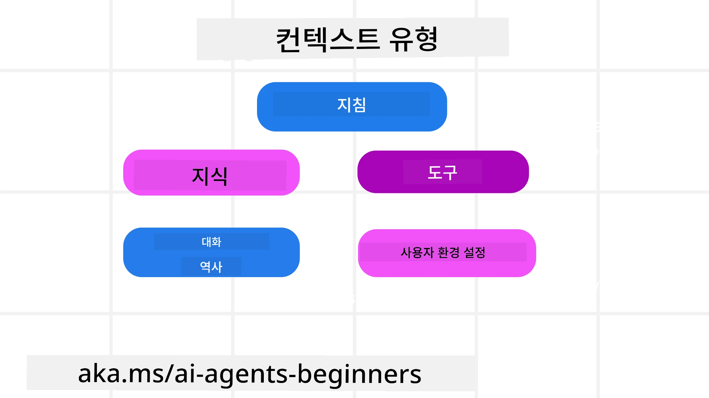
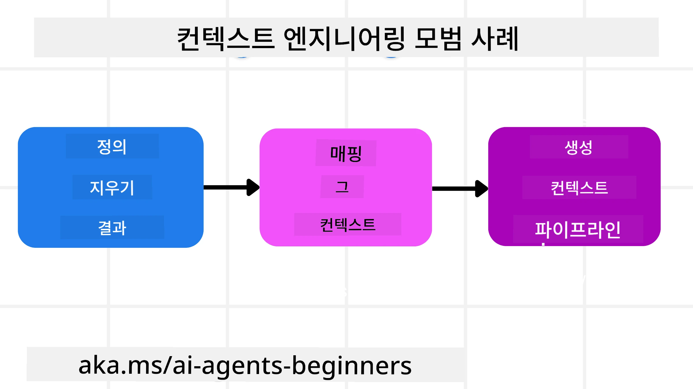

# AI 에이전트를 위한 컨텍스트 엔지니어링

> _(위 이미지를 클릭하면 이 강의의 동영상을 볼 수 있습니다)_

AI 에이전트를 구축하는 애플리케이션의 복잡성을 이해하는 것은 신뢰할 만한 에이전트를 만드는 데 중요합니다. 우리는 프롬프트 엔지니어링을 넘어 복잡한 요구사항을 해결하기 위해 정보를 효과적으로 관리하는 AI 에이전트를 구축해야 합니다.

이 강의에서는 컨텍스트 엔지니어링이 무엇인지와 AI 에이전트 구축에서의 역할을 살펴보겠습니다.

## 소개

이 강의에서는 다음을 다룹니다:

• **컨텍스트 엔지니어링이란 무엇인지** 및 프롬프트 엔지니어링과 다른 점

• 정보를 작성, 선택, 압축, 분리하는 등 **효과적인 컨텍스트 엔지니어링 전략**

• AI 에이전트를 망칠 수 있는 <strong>일반적인 컨텍스트 실패</strong>와 이를 해결하는 방법

## 학습 목표

이 강의를 완료하면 다음을 이해할 수 있습니다:

• **컨텍스트 엔지니어링을 정의하고 프롬프트 엔지니어링과 구분하는 법**

• 대규모 언어 모델(LLM) 애플리케이션에서 **컨텍스트의 주요 구성 요소를 식별하는 법**

• 에이전트 성능 향상을 위해 **컨텍스트 작성, 선택, 압축, 분리 전략을 적용하는 방법**

• 오염, 산만, 혼란, 충돌과 같은 **일반적인 컨텍스트 실패를 인식하고 완화 기법을 구현하는 방법**

## 컨텍스트 엔지니어링이란?

AI 에이전트에게 컨텍스트는 AI 에이전트가 특정 행동을 계획하도록 하는 원동력입니다. 컨텍스트 엔지니어링은 AI 에이전트가 다음 작업 단계를 완료하는 데 필요한 올바른 정보를 갖추도록 하는 실천입니다. 컨텍스트 창은 크기가 제한되어 있으므로 에이전트 구축자로서 우리는 컨텍스트 창에 정보를 추가, 제거, 압축하는 시스템과 프로세스를 만들어야 합니다.

### 프롬프트 엔지니어링 vs 컨텍스트 엔지니어링

프롬프트 엔지니어링은 일련의 정적 지침을 중심으로 하여 AI 에이전트를 규칙 집합으로 효과적으로 안내하는 데 집중합니다. 반면 컨텍스트 엔지니어링은 초기 프롬프트를 포함하여 AI 에이전트가 시간이 지남에 따라 필요한 정보를 관리하는 방법입니다. 컨텍스트 엔지니어링의 주요 개념은 이 과정을 반복 가능하고 신뢰할 수 있도록 만드는 것입니다.

### 컨텍스트 유형

컨텍스트는 단일한 것이 아니라는 점을 기억하는 것이 중요합니다. AI 에이전트가 필요로 하는 정보는 여러 출처에서 올 수 있으며 에이전트가 이들 출처에 접근할 수 있도록 하는 것이 우리의 몫입니다:

AI 에이전트가 관리해야 할 수 있는 컨텍스트 유형은 다음과 같습니다:

• **지침:** 에이전트의 "규칙"과 같습니다 - 프롬프트, 시스템 메시지, 몇 가지 예시(에이전트가 어떻게 할지 보여주는 것), 사용할 수 있는 도구 설명 등이 여기에 포함됩니다. 이는 프롬프트 엔지니어링과 컨텍스트 엔지니어링의 중첩 지점입니다.

• **지식:** 사실, 데이터베이스에서 검색된 정보, 에이전트가 축적한 장기 기억 등을 포함합니다. 에이전트가 다양한 지식 저장소나 데이터베이스에 접근해야 한다면 Retrieval Augmented Generation(RAG) 시스템 통합도 여기에 포함됩니다.

• **도구:** 에이전트가 호출할 수 있는 외부 함수, API, MCP 서버의 정의와 이들을 사용해 얻은 피드백(결과)을 말합니다.

• **대화 기록:** 사용자와의 진행 중인 대화입니다. 시간이 지남에 따라 대화가 길어지고 복잡해져 컨텍스트 창을 차지합니다.

• **사용자 선호:** 시간이 지남에 따라 학습된 사용자의 취향이나 선호 정보로, 주요 결정을 도울 때 저장 및 호출할 수 있습니다.

## 효과적인 컨텍스트 엔지니어링 전략

### 계획 전략

좋은 컨텍스트 엔지니어링은 좋은 계획에서 시작합니다. 다음은 컨텍스트 엔지니어링 개념을 적용하는 데 도움이 되는 접근법입니다:

1. **명확한 결과 정의** - AI 에이전트에게 할당될 작업의 결과를 명확히 정의합니다. "에이전트가 작업을 완료했을 때 세상은 어떻게 변할까요?" 즉, 사용자가 AI 에이전트와 상호작용한 후 어떤 변화나 정보, 응답을 받게 될지 답합니다.

2. **컨텍스트 매핑** - AI 에이전트의 결과를 정의했으면 "이 작업을 완료하려면 AI 에이전트가 어떤 정보가 필요할까요?"라는 질문을 답합니다. 이렇게 하면 정보가 어디에 위치하는지 컨텍스트를 매핑할 수 있습니다.

3. **컨텍스트 파이프라인 생성** - 정보가 어디 있는지 알았으니, "에이전트가 이 정보를 어떻게 얻을까요?"라는 질문에 답해야 합니다. 이는 RAG, MCP 서버 및 기타 도구 사용 등 다양한 방식으로 가능합니다.

### 실용적인 전략

계획도 중요하지만 에이전트의 컨텍스트 창에 정보가 유입되기 시작하면 이를 관리할 실용적인 전략이 필요합니다:

#### 컨텍스트 관리

일부 정보는 자동으로 컨텍스트 창에 추가되지만, 컨텍스트 엔지니어링은 다음과 같은 몇 가지 전략으로 좀 더 적극적으로 정보를 관리하는 것입니다:

 1. **에이전트 스크래치패드**  
   AI 에이전트가 한 세션 동안 현재 작업과 사용자 상호작용에 대한 관련 정보를 메모할 수 있게 합니다. 이는 컨텍스트 창 바깥에 파일이나 런타임 객체로 존재하며, 필요 시 세션 중에 에이전트가 다시 불러올 수 있습니다.

 2. **기억(메모리)**  
   스크래치패드는 단일 세션 내 컨텍스트 창 밖 정보를 관리하기 적합합니다. 기억은 여러 세션에 걸쳐 관련 정보를 저장하고 검색할 수 있게 합니다. 여기에 요약, 사용자 선호, 향후 개선을 위한 피드백 등이 포함됩니다.

 3. **컨텍스트 압축**  
   컨텍스트 창이 커지고 한계에 가까워지면 요약 및 정리와 같은 기법을 사용합니다. 가장 관련성 높은 정보만 유지하거나 오래된 메시지를 제거하는 방식입니다.

 4. **멀티 에이전트 시스템**  
   각각의 에이전트가 독자적인 컨텍스트 창을 가지므로 멀티 에이전트 시스템 구축은 컨텍스트 엔지니어링의 한 형태입니다. 이 컨텍스트가 어떻게 공유되고 전달될지 계획하는 것이 중요합니다.

 5. **샌드박스 환경**  
   에이전트가 코드를 실행하거나 문서 내 대량 정보를 처리해야 할 때 토큰을 많이 소모할 수 있습니다. 모든 결과를 컨텍스트 창에 저장하는 대신, 샌드박스 환경에서 코드를 실행하고 결과 및 관련 정보만 읽도록 할 수 있습니다.

 6. **런타임 상태 객체**  
   에이전트가 특정 정보에 접근해야 하는 상황을 관리하기 위해 정보를 담는 컨테이너를 생성하는 방법입니다. 복잡한 작업의 경우, 각 하위 작업 결과를 단계별로 저장해 컨텍스트를 특정 하위 작업에만 연결할 수 있도록 합니다.

#### 컨텍스트 점검

이 전략들 중 하나를 적용한 후에는 실제 다음 모델 호출에 무엇이 전달되었는지 확인하는 것이 좋습니다. 유용한 디버깅 질문은 다음과 같습니다:

> 에이전트가 너무 많은 컨텍스트, 잘못된 컨텍스트를 불러왔나요? 아니면 필요한 컨텍스트를 놓쳤나요?

원시 프롬프트, 도구 출력, 메모리 내용 전체를 로깅할 필요는 없습니다. 운영 환경에서는 개수, 아이디, 해시, 정책 라벨 등을 담은 작은 크기의 컨텍스트 점검 기록을 선호합니다:

- **선택:** 후보 청크, 도구, 메모리가 몇 개인지, 몇 개가 선택되었는지, 어떤 규칙이나 점수가 나머지를 필터링했는지 추적합니다.  
- **압축:** 원본 범위 또는 추적 ID, 요약 ID, 압축 전후 예상 토큰 수, 다음 호출에 원시 내용이 제외되었는지 기록합니다.  
- **분리:** 별도 에이전트, 세션, 샌드박스에서 실행한 하위 작업, 반환된 범위 요약, 큰 도구 출력이 상위 에이전트 컨텍스트 바깥에 머물렀는지 기록합니다.  
- **메모리 및 RAG:** 전체 검색 텍스트 대신 검색 문서 ID, 메모리 ID, 점수, 선택된 ID, 편집 상태를 저장합니다.  
- **안전 및 개인정보:** 민감한 프롬프트 텍스트, 도구 인수, 도구 결과, 사용자 메모리 본문 대신 해시, ID, 토큰 버킷, 정책 라벨을 선호합니다.

목표는 더 많은 컨텍스트를 보존하는 것이 아니라, 개발자가 어떤 컨텍스트 전략이 작동했는지, 그것이 다음 모델 호출에 의도한 대로 변화를 주었는지 알 수 있게 하는 증거를 남기는 것입니다.

### 컨텍스트 엔지니어링 사례

예를 들어 AI 에이전트에게 **"파리 여행을 예약해줘."** 라고 요청한다고 합시다.

• 단순히 프롬프트 엔지니어링만 사용하는 에이전트는 이렇게 응답할 수 있습니다: **"알겠습니다, 파리에 언제 가시겠어요?"** 사용자가 질문한 순간의 직접적인 요청만 처리했습니다.

• 이번 강의에서 다룬 컨텍스트 엔지니어링 전략을 사용하는 에이전트는 훨씬 더 많은 일을 합니다. 응답하기 전에 시스템은:

  ◦ 실시간 데이터 검색으로 <strong>사용자의 달력</strong>을 확인합니다.

 ◦ **과거 여행 선호도**(장기 기억) — 선호 항공사, 예산, 직항 선호 여부 등을 기억합니다.

 ◦ <strong>항공편과 호텔 예약용 도구</strong>를 확인합니다.

- 그 후 예시 응답은 다음과 같을 수 있습니다: "안녕하세요 [사용자 이름]님! 10월 첫째 주에 일정이 비어있네요. [선호 항공사] 직항편으로 [예산] 내에서 파리행 항공권을 찾아드릴까요?" 이러한 풍부하고 컨텍스트 인식된 응답이 컨텍스트 엔지니어링의 힘을 보여줍니다.

## 흔한 컨텍스트 실패

### 컨텍스트 오염

**무엇인가:** 홀루시네이션(LLM이 생성한 잘못된 정보)이나 오류가 컨텍스트에 들어가 반복해서 인용되어 에이전트가 불가능한 목표를 추구하거나 의미 없는 전략을 세우는 상황입니다.

**해결 방법:** <strong>컨텍스트 검증</strong>과 <strong>격리</strong>를 구현하세요. 장기 기억에 추가하기 전에 정보를 검증합니다. 잠재적인 오염이 감지되면 새 컨텍스트 스레드를 시작해 나쁜 정보 확산을 막습니다.

**여행 예약 예:** 에이전트가 소규모 지역 공항에서 먼 국제 도시로 가는 <strong>직항편이 실제로 존재하지 않음</strong>에도 이를 사실로 잘못 알고 있습니다. 이 비현실적 항공편 정보가 컨텍스트에 저장되고, 나중에 예약 요청할 때 이 불가능한 경로 티켓을 찾으려 계속 시도해 오류가 반복됩니다.

**해결책:** 항공편 세부 정보를 에이전트 작업 컨텍스트에 추가하기 <strong>전 실시간 API로 출발지와 경로를 검증하는 단계</strong>를 구현하세요. 검증이 실패하면 오염된 정보는 "격리"되어 더 이상 사용하지 않습니다.

### 컨텍스트 산만

**무엇인가:** 컨텍스트가 너무 커져 모델이 훈련 과정에서 학습한 내용 대신 누적된 역사 기록에 지나치게 집중해 반복적이거나 도움이 되지 않는 행동을 하게 됩니다. 컨텍스트 창이 가득 차기 전에 오류가 발생할 수도 있습니다.

**해결 방법:** <strong>컨텍스트 요약</strong>을 사용하세요. 일정 기간마다 누적 정보를 짧은 요약으로 압축해 핵심 내용을 유지하고 중복된 이력을 제거합니다. 집중을 "초기화"하는 데 도움이 됩니다.

**여행 예약 예:** 몇 년 전 배낭여행에 대한 자세한 설명을 포함해 다양한 여행지 이야기가 너무 길어졌습니다. "다음 달 싸게 갈 항공편 찾아줘"라고 요청했을 때, 에이전트가 과거 배낭용품이나 여행 일정에 집착하며 현재 요청을 무시하는 상황입니다.

**해결책:** 일정 대화 횟수 또는 컨텍스트 크기가 커지면 에이전트가 **가장 최근과 관련된 대화만 요약하고** 현재 여행 날짜와 목적지에 집중하며, 중요하지 않은 과거 대화는 폐기해야 합니다.

### 컨텍스트 혼란

**무엇인가:** 너무 많은 도구가 포함된 불필요한 컨텍스트가 모델을 혼란스럽게 하여 부적절한 응답을 하거나 관련 없는 도구를 호출하는 경우입니다. 특히 작은 모델에서 자주 발생합니다.

**해결 방법:** RAG 기법을 활용한 <strong>도구 로드아웃 관리</strong>를 구현하세요. 도구 설명을 벡터 데이터베이스에 저장하고 각 작업에 가장 관련 높은 도구만 선택합니다. 연구 결과 도구 선택 수를 30개 미만으로 제한하는 것이 좋습니다.

**여행 예약 예:** 에이전트가 `book_flight`, `book_hotel`, `rent_car`, `find_tours`, `currency_converter`, `weather_forecast`, `restaurant_reservations` 등 수십 개 도구에 접근할 수 있습니다. "파리에서 이동하는 가장 좋은 방법이 뭐야?"라고 묻자 너무 많은 도구 때문에 혼란스러워져 에이전트가 파리 내에서 비행편 예약 시도나 대중교통 선호임에도 차량 렌트 호출 같은 실수를 합니다.

**해결책:** 도구 설명에 대해 <strong>RAG를 적용</strong>하세요. 파리 내 이동 수단에 대한 요청 시 관련성 높은 도구(예: `rent_car`, `public_transport_info`)만 동적으로 불러와 LLM에 집중된 도구 집합을 제공합니다.

### 컨텍스트 충돌

**무엇인가:** 컨텍스트 내 상충하는 정보가 존재해 비일관적 추론이나 잘못된 최종 응답을 초래하는 경우입니다. 종종 정보가 단계적으로 들어오면서 초기의 잘못된 가정이 컨텍스트에 그대로 남아 있을 때 발생합니다.

**해결 방법:** <strong>컨텍스트 가지치기(pruning)</strong>와 <strong>오프로드(offloading)</strong>를 사용하세요. 가지치기는 새 정보 도착 시 오래되거나 상충하는 정보를 제거하는 것을 의미합니다. 오프로드는 모델이 메인 컨텍스트를 복잡하게 만들지 않고 별도의 "스크래치패드" 작업 공간을 사용해 정보를 처리하도록 합니다.
**여행 예약 예시:** 처음에 에이전트에게 <strong>"나는 이코노미 클래스로 비행하고 싶어요."</strong>라고 말합니다. 대화 중 나중에 마음이 바뀌어 <strong>"사실 이번 여행은 비즈니스 클래스로 가요."</strong>라고 말할 수 있습니다. 두 지시가 모두 컨텍스트에 남아 있다면, 에이전트는 상충되는 검색 결과를 받거나 어떤 선호도를 우선시해야 할지 혼란스러워할 수 있습니다.

**해결책:** <strong>컨텍스트 가지치기</strong>를 구현하세요. 새 지시가 이전 지시와 모순될 때는 이전 지시를 제거하거나 명시적으로 덮어써서 컨텍스트에서 제외합니다. 또는 에이전트가 <strong>스크래치패드</strong>를 사용해 상충되는 선호도를 조정한 후 최종적이고 일관된 지시만 행동에 반영하도록 할 수 있습니다.

## 컨텍스트 엔지니어링에 대해 더 궁금하세요?

다른 학습자들과 만나고, 오피스 아워에 참석하며 AI 에이전트 관련 질문에 답변을 받고 싶다면 [Microsoft Foundry Discord](https://aka.ms/ai-agents/discord) 에 참여하세요.

---

<!-- CO-OP TRANSLATOR DISCLAIMER START -->
**면책 조항**:
이 문서는 AI 번역 서비스 [Co-op Translator](https://github.com/Azure/co-op-translator)를 사용하여 번역되었습니다. 정확성을 기하기 위해 노력하고 있으나, 자동 번역은 오류나 부정확한 부분이 있을 수 있음을 유의하시기 바랍니다. 원본 문서의 원어본이 권위 있는 자료로 간주되어야 합니다. 중요한 정보의 경우, 전문가의 인간 번역을 권장합니다. 이 번역 사용으로 인해 발생하는 오해나 잘못된 해석에 대해 당사는 책임을 지지 않습니다.
<!-- CO-OP TRANSLATOR DISCLAIMER END -->