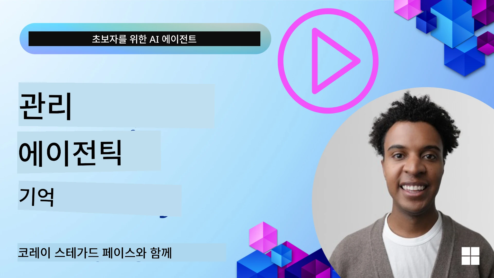

# AI 에이전트를 위한 메모리 

AI 에이전트를 만들 때의 독특한 이점에 대해 논의할 때 주로 두 가지가 이야기됩니다: 작업을 완수하기 위한 도구 호출 능력과 시간이 지남에 따라 개선할 수 있는 능력. 메모리는 사용자를 위한 더 나은 경험을 창출할 수 있는 자기 개선 에이전트를 만드는 기반이 됩니다.

이 수업에서는 AI 에이전트의 메모리가 무엇인지, 그리고 이를 어떻게 관리하고 우리 애플리케이션에 이득이 되도록 사용할 수 있는지 살펴보겠습니다.

## 소개

이 수업에서 다룰 내용은 다음과 같습니다:

• **AI 에이전트 메모리 이해하기**: 메모리가 무엇이며 에이전트에게 왜 필수적인지.

• **메모리 구현 및 저장**: 단기 및 장기 메모리에 중점을 두고 AI 에이전트에 메모리 기능을 추가하는 실용적인 방법.

• **AI 에이전트 자기 개선 구현**: 메모리를 통해 에이전트가 과거 상호작용에서 학습하고 시간이 지남에 따라 개선하는 방법.

## 사용 가능한 구현

이 수업에는 두 가지 포괄적인 노트북 튜토리얼이 포함되어 있습니다:

• **[13-agent-memory.ipynb](./13-agent-memory.ipynb)**: Mem0 및 Azure AI Search를 사용하여 Microsoft Agent Framework와 함께 메모리를 구현

• **[13-agent-memory-cognee.ipynb](./13-agent-memory-cognee.ipynb)**: 임베딩을 기반으로 자동으로 지식 그래프를 구축하고 그래프를 시각화하며 지능적 검색을 구현하는 Cognee를 사용한 구조화된 메모리 구현

## 학습 목표

이 수업을 완료하면 다음을 알게 됩니다:

• 작업 메모리, 단기 메모리, 장기 메모리뿐 아니라 페르소나 및 에피소드 메모리와 같은 특수 형태를 포함한 다양한 AI 에이전트 메모리 유형 간의 차이점 이해하기

• Mem0, Cognee, Whiteboard 메모리 같은 도구를 활용하고 Azure AI Search와 통합하여 Microsoft Agent Framework를 사용해 AI 에이전트의 단기 및 장기 메모리를 구현하고 관리하기

• 자기 개선 AI 에이전트의 원리를 이해하고 견고한 메모리 관리 시스템이 지속적인 학습과 적응에 어떻게 기여하는지 이해하기

## AI 에이전트 메모리 이해하기

핵심적으로, **AI 에이전트의 메모리는 정보를 저장하고 회상할 수 있게 하는 메커니즘을 의미**합니다. 이 정보는 대화의 특정 세부사항, 사용자 선호, 과거 행동, 혹은 학습된 패턴일 수 있습니다.

메모리가 없으면 AI 애플리케이션은 상태가 없는(stateless) 경우가 많아 각 상호작용이 매번 새로 시작됩니다. 이는 에이전트가 이전의 맥락이나 선호를 "잊어버리는" 반복적이고 답답한 사용자 경험으로 이어집니다.

### 왜 메모리가 중요한가?

에이전트의 지능은 과거 정보를 회상하고 활용하는 능력과 깊게 연결되어 있습니다. 메모리는 에이전트를 다음과 같이 만듭니다:

• **반영적**: 과거 행동과 결과에서 학습함

• **상호작용적**: 진행 중인 대화의 맥락을 유지함

• **예측적 및 반응적**: 과거 데이터를 바탕으로 필요를 예상하거나 적절히 반응함

• **자율적**: 저장된 지식을 바탕으로 더 독립적으로 작동함

메모리를 구현하는 목표는 에이전트를 더 **신뢰 가능하고 능력 있게** 만드는 것입니다.

### 메모리 유형

#### 작업 메모리

이는 에이전트가 하나의 진행 중인 작업이나 사고 과정 중에 사용하는 임시 메모리 같은 것입니다. 다음 단계를 계산하는 데 필요한 즉각적인 정보를 저장합니다.

AI 에이전트에서 작업 메모리는 대화에서 가장 관련성 높은 정보를 캡처하는 경우가 많으며, 전체 채팅 기록이 길거나 축약되더라도 중요 정보(요구사항, 제안, 결정, 행동 등)를 추출하는 데 집중합니다.

**작업 메모리 예시**

여행 예약 에이전트의 경우 "파리 여행을 예약하고 싶다"는 사용자의 현재 요청을 작업 메모리에 저장하여 현재 상호작용을 안내합니다.

#### 단기 메모리

이 메모리는 한 번의 대화나 세션 동안 정보를 유지합니다. 현재 대화의 맥락을 제공하여 에이전트가 이전 대화 발화를 참조할 수 있게 합니다.

**단기 메모리 예시**

사용자가 "파리행 비행기 요금이 얼마예요?"라고 묻고 곧이어 "거기 숙소는요?"라고 할 때, 단기 메모리는 "거기"가 같은 대화에서 "파리"를 의미한다는 것을 에이전트가 알 수 있도록 합니다.

#### 장기 메모리

여러 대화나 세션에 걸쳐 지속되는 정보입니다. 사용자의 선호, 과거 상호작용, 또는 전반적 지식을 장기간 기억할 수 있어 개인화에 중요합니다.

**장기 메모리 예시**

장기 메모리는 "벤은 스키와 야외 활동을 좋아하며, 산 전망과 함께하는 커피를 즐기고, 과거 부상 때문에 고급 스키 슬로프는 피하고 싶어한다"는 정보를 저장할 수 있습니다. 이 정보는 이후 여행 계획 세션에서 매우 개인화된 추천에 반영됩니다.

#### 페르소나 메모리

이 특수 메모리는 에이전트가 일관된 "성격" 또는 "페르소나"를 개발하도록 돕습니다. 에이전트 자신이나 의도된 역할에 관한 세부정보를 기억하여 상호작용이 더 자연스럽고 집중되도록 합니다.

**페르소나 메모리 예시**

여행 에이전트가 "전문 스키 기획자"로 설계된 경우, 페르소나 메모리는 이 역할을 강화하여 전문가의 어조와 지식에 맞춘 응답을 하도록 합니다.

#### 작업 순서/에피소드 메모리

이 메모리는 복잡한 작업 수행 중 에이전트가 거치는 단계의 순서(성공과 실패 포함)를 저장합니다. 특정 "에피소드"나 과거 경험을 기억하여 학습하는 것과 유사합니다.

**에피소드 메모리 예시**

에이전트가 특정 비행기를 예약하려 했으나 좌석이 없어서 실패한 경우, 에피소드 메모리가 이 실패를 기록하여 다음 시도 시 대체 항공편을 제안하거나 사용자에게 더 정보에 기반한 안내를 제공할 수 있게 합니다.

#### 엔티티 메모리

이는 대화에서 특정 엔티티(사람, 장소, 사물)와 이벤트를 추출하고 기억하는 것을 포함합니다. 에이전트가 핵심 요소를 구조적으로 이해할 수 있게 합니다.

**엔티티 메모리 예시**

과거 여행에 관한 대화에서 에이전트가 "파리," "에펠탑," "르 샤 노와르 레스토랑에서의 저녁"을 엔티티로 추출할 수 있습니다. 다음 대화에서는 "르 샤 노와르"를 기억하여 새 예약을 제안할 수도 있습니다.

#### 구조화된 RAG (Retrieval Augmented Generation)

RAG는 더 넓은 기술이지만, "구조화된 RAG"는 강력한 메모리 기술로 강조됩니다. 이는 대화, 이메일, 이미지 등 다양한 출처에서 밀도 있고 구조화된 정보를 추출하여 응답의 정밀도, 회상률, 속도를 높입니다. 고전적인 RAG가 단순히 의미 유사성에 의존하는 반면, 구조화된 RAG는 정보 고유의 구조를 활용합니다.

**구조화된 RAG 예시**

키워드 단순 매칭 대신 이메일에서 비행 정보(목적지, 날짜, 시간, 항공사)를 파싱해 구조화된 형태로 저장합니다. 예를 들어 "화요일에 파리행 예약한 비행은 무엇인가요?" 같은 정확한 질문에 답할 수 있게 합니다.

## 메모리 구현 및 저장

AI 에이전트에 메모리를 구현하는 것은 **메모리 관리**의 체계적 과정이며, 여기에는 생성, 저장, 검색, 통합, 업데이트, 심지어 "망각"(삭제)도 포함됩니다. 특히 검색이 매우 중요합니다.

### 특수 메모리 도구

#### Mem0

에이전트 메모리를 저장하고 관리하는 한 방법은 Mem0 같은 특수 도구를 사용하는 것입니다. Mem0는 지속적인 메모리 계층으로 작동하여 에이전트가 관련 있는 상호작용을 회상하고 사용자 선호 및 사실적 맥락을 저장하며 성공과 실패에서 학습하게 합니다. 이를 통해 무상태(stateless) 에이전트가 상태 기반(stateful) 에이전트로 변모합니다.

두 단계의 메모리 파이프라인, 즉 추출과 업데이트 과정을 통해 작동합니다. 먼저 에이전트의 스레드에 추가된 메시지는 Mem0 서비스로 보내져 대화 기록을 요약하고 새로운 메모리를 추출하는 데 LLM을 사용합니다. 이후 LLM 기반 업데이트 단계에서 메모리를 추가, 수정, 삭제할지를 결정하며, 벡터, 그래프, 키-값 데이터베이스를 포함하는 하이브리드 데이터 저장소에 저장합니다. 이 시스템은 다양한 메모리 유형을 지원하고 엔티티 간 관계 관리를 위한 그래프 메모리도 통합할 수 있습니다.

#### Cognee

또 다른 강력한 접근법은 **Cognee**입니다. 오픈소스 의미 기반 메모리로, 구조화 및 비구조화 데이터를 임베딩 기반 질의 가능한 지식 그래프로 변환합니다. Cognee는 벡터 유사도 검색과 그래프 관계를 결합한 **이중 저장소 아키텍처**를 제공하여 에이전트가 단순한 유사 정보뿐 아니라 개념 간 관계까지 이해할 수 있도록 합니다.

벡터 유사성, 그래프 구조, LLM 추론을 혼합한 **하이브리드 검색**에 탁월하며, 단순 청크 조회부터 그래프 인지 질문 답변까지 지원합니다. 이 시스템은 단기 세션 맥락과 장기 지속 메모리 모두를 지원하며 하나의 연결된 그래프 상태로 진화하는 **생성되는(living) 메모리**를 유지합니다.

Cognee 노트북 튜토리얼([13-agent-memory-cognee.ipynb](./13-agent-memory-cognee.ipynb))에서는 다양한 데이터 소스 수집, 지식 그래프 시각화, 특정 에이전트 요구를 맞춘 다양한 검색 전략 질의의 실용적 예제를 통해 이 통합 메모리 계층 구축을 보여줍니다.

### RAG를 활용한 메모리 저장

Mem0 같은 특수 메모리 도구 외에도, 강력한 검색 서비스인 **Azure AI Search를 메모리 저장과 검색의 백엔드로 활용**할 수 있습니다. 특히 구조화된 RAG에 적합합니다.

이를 통해 에이전트의 응답을 자체 데이터에 근거해 더욱 관련성 있고 정확하게 할 수 있습니다. Azure AI Search는 사용자별 여행 메모리, 제품 카탈로그, 기타 도메인별 지식을 저장하는 데 사용할 수 있습니다.

Azure AI Search는 대화 기록, 이메일, 심지어 이미지 같은 방대한 데이터에서 밀도 있고 구조화된 정보를 추출하고 검색하는 데 탁월한 **구조화된 RAG** 기능을 지원합니다. 이는 기존 텍스트 청킹 및 임베딩 방식에 비해 “초인적 정밀도와 회상률”을 제공합니다.

## AI 에이전트 자기 개선 구현

자기 개선 에이전트의 일반 패턴은 **“지식 에이전트”**를 도입하는 것입니다. 이 별도의 에이전트는 사용자와 주 에이전트 간의 대화를 관찰합니다. 역할은 다음과 같습니다:

1. **가치 있는 정보 식별**: 대화 중 일반 지식이나 특정 사용자 선호로 저장할 가치가 있는 부분이 있는지 판단.

2. **추출 및 요약**: 대화에서 핵심 학습 내용이나 선호를 요약.

3. **지식 베이스에 저장**: 추출한 정보를 벡터 데이터베이스 등에 영구 저장하여 나중에 검색할 수 있게 함.

4. **미래 질의 증강**: 사용자가 새 질의를 시작할 때 지식 에이전트가 관련 정보를 검색해 사용자 프롬프트에 덧붙여 주 에이전트가 중요한 맥락을 갖고 응답하도록 함(RAG와 유사).

### 메모리 최적화

• **지연 시간 관리**: 사용자 상호작용 속도를 늦추지 않도록, 초기에는 정보 저장 또는 검색의 가치가 있는지 빠르게 판단하는 간단하고 빠른 모델을 사용하고, 필요할 때만 복잡한 추출/검색 프로세스를 호출.

• **지식 베이스 유지**: 성장하는 지식 베이스의 경우, 덜 자주 사용되는 정보는 비용 관리를 위해 “콜드 스토리지”로 이동.

## 에이전트 메모리에 대해 더 궁금한 점이 있나요?

[Microsoft Foundry Discord](https://aka.ms/ai-agents/discord)에 참여하여 다른 학습자들과 만나고, 오피스 아워에 참석하며 AI 에이전트 관련 질문에 답변을 받아보세요.

---

<!-- CO-OP TRANSLATOR DISCLAIMER START -->
**면책 조항**:  
이 문서는 AI 번역 서비스 [Co-op Translator](https://github.com/Azure/co-op-translator)를 사용하여 번역되었습니다. 정확성을 기하기 위해 노력하였으나, 자동 번역물에는 오류나 부정확한 부분이 있을 수 있음을 알려드립니다. 원본 문서의 원어 버전을 권위 있는 출처로 간주하시기 바랍니다. 중요한 정보의 경우 전문적인 인간 번역을 권장합니다. 본 번역 사용으로 인해 발생하는 오해나 잘못된 해석에 대해서는 당사가 책임을 지지 않습니다.
<!-- CO-OP TRANSLATOR DISCLAIMER END -->