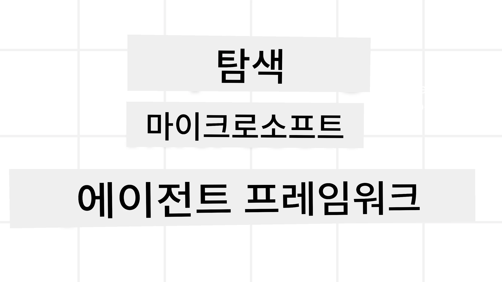

# Microsoft 에이전트 프레임워크 탐구



### 소개

이 수업에서는 다음을 다룹니다:

- Microsoft 에이전트 프레임워크 이해: 핵심 기능과 가치  
- Microsoft 에이전트 프레임워크의 핵심 개념 탐색
- 고급 MAF 패턴: 워크플로우, 미들웨어, 및 메모리

## 학습 목표

이 수업을 완료하면 다음을 할 수 있게 됩니다:

- Microsoft Agent Framework를 사용하여 프로덕션 수준의 AI 에이전트를 구축하는 방법
- Microsoft Agent Framework의 핵심 기능을 에이전트 기반 사용 사례에 적용하는 방법
- 워크플로우, 미들웨어 및 관찰성을 포함한 고급 패턴을 사용하는 방법

## 코드 샘플 

Code samples for [Microsoft 에이전트 프레임워크(MAF)](https://aka.ms/ai-agents-beginners/agent-framewrok) can be found in this repository under `xx-python-agent-framework` and `xx-dotnet-agent-framework` files.

## Microsoft Agent Framework 이해하기


[Microsoft 에이전트 프레임워크(MAF)](https://aka.ms/ai-agents-beginners/agent-framewrok)은 AI 에이전트를 구축하기 위한 Microsoft의 통합 프레임워크입니다. 이는 프로덕션 및 연구 환경에서 볼 수 있는 다양한 에이전트 기반 사용 사례를 다룰 수 있는 유연성을 제공합니다. 예를 들면:

- **순차적 에이전트 오케스트레이션** in scenarios where step-by-step workflows are needed.
- **동시 오케스트레이션** in scenarios where agents need to complete tasks at the same time.
- **그룹 채팅 오케스트레이션** in scenarios where agents can collaborate together on one task.
- **인계(핸드오프) 오케스트레이션** in scenarios where agents hand off the task to one another as the subtasks are completed.
- **Magnetic Orchestration** in scenarios where a manager agent creates and modifies a task list and handles the coordination of subagents to complete the task.

프로덕션 환경에서 AI 에이전트를 제공하기 위해, MAF는 다음과 같은 기능도 포함합니다:

- **관찰성(Observability)** through the use of OpenTelemetry where every action of the AI Agent including tool invocation, orchestration steps, reasoning flows and performance monitoring through Microsoft Foundry dashboards.
- **보안(Security)** by hosting agents natively on Microsoft Foundry which includes security controls such as role-based access, private data handling and built-in content safety.
- **내구성(Durability)** as Agent threads and workflows can pause, resume and recover from errors which enables longer running process.
- **제어(Control)** as human in the loop workflows are supported where tasks are marked as requiring human approval.

MAF는 또한 상호 운용성(interoperable)에 중점을 둡니다:

- **클라우드 독립성(Being Cloud-agnostic)** - Agents can run in containers, on-prem and across multiple different clouds.
- **제공자 독립성(Being Provider-agnostic)** - Agents can be created through your preferred SDK including Azure OpenAI and OpenAI
- **오픈 표준 통합(Integrating Open Standards)** - Agents can utilize protocols such as Agent-to-Agent(A2A) and Model Context Protocol (MCP) to discover and use other agents and tools.
- **플러그인 및 커넥터(Plugins and Connectors)** - Connections can be made to data and memory services such as Microsoft Fabric, SharePoint, Pinecone and Qdrant.

이제 이러한 기능들이 Microsoft Agent Framework의 핵심 개념들에 어떻게 적용되는지 살펴보겠습니다.

## Microsoft Agent Framework의 핵심 개념

### 에이전트


**에이전트 생성**

에이전트 생성은 추론 서비스(LLM Provider), AI 에이전트가 따를 지침 세트, 그리고 할당된 `name`을 정의하여 수행됩니다:

```python
agent = AzureOpenAIChatClient(credential=AzureCliCredential()).create_agent( instructions="You are good at recommending trips to customers based on their preferences.", name="TripRecommender" )
```

위 예시는 `Azure OpenAI`를 사용하지만 에이전트는 `Microsoft Foundry Agent Service`를 포함한 다양한 서비스로 생성할 수 있습니다:

```python
AzureAIAgentClient(async_credential=credential).create_agent( name="HelperAgent", instructions="You are a helpful assistant." ) as agent
```

OpenAI의 `Responses`, `ChatCompletion` API들

```python
agent = OpenAIResponsesClient().create_agent( name="WeatherBot", instructions="You are a helpful weather assistant.", )
```

```python
agent = OpenAIChatClient().create_agent( name="HelpfulAssistant", instructions="You are a helpful assistant.", )
```

또는 A2A 프로토콜을 사용하는 원격 에이전트:

```python
agent = A2AAgent( name=agent_card.name, description=agent_card.description, agent_card=agent_card, url="https://your-a2a-agent-host" )
```

**에이전트 실행**

에이전트는 비스트리밍 또는 스트리밍 응답을 위해 `.run` 또는 `.run_stream` 메서드를 사용하여 실행됩니다.

```python
result = await agent.run("What are good places to visit in Amsterdam?")
print(result.text)
```

```python
async for update in agent.run_stream("What are the good places to visit in Amsterdam?"):
    if update.text:
        print(update.text, end="", flush=True)

```

각 에이전트 실행에는 에이전트가 사용하는 `max_tokens`, 에이전트가 호출할 수 있는 `tools`, 심지어 에이전트에 사용되는 `model` 자체와 같은 매개변수를 사용자화하는 옵션이 있을 수 있습니다.

이는 특정 모델이나 도구가 사용자 작업을 완료하는 데 필요한 경우 유용합니다.

**도구(툴)**

도구는 에이전트를 정의할 때 다음과 같이 정의할 수 있습니다:

```python
def get_attractions( location: Annotated[str, Field(description="The location to get the top tourist attractions for")], ) -> str: """Get the top tourist attractions for a given location.""" return f"The top attractions for {location} are." 


# ChatAgent를 직접 생성할 때

agent = ChatAgent( chat_client=OpenAIChatClient(), instructions="You are a helpful assistant", tools=[get_attractions]

```

또한 에이전트를 실행할 때도 정의할 수 있습니다:

```python

result1 = await agent.run( "What's the best place to visit in Seattle?", tools=[get_attractions] # 이번 실행에만 제공되는 도구 )
```

**에이전트 스레드**

에이전트 스레드는 다중 턴 대화를 처리하는 데 사용됩니다. 스레드는 다음 중 하나로 생성할 수 있습니다:

- `get_new_thread()`을 사용하여 스레드를 생성하면 시간이 지나도 스레드를 저장할 수 있습니다
- 에이전트를 실행할 때 자동으로 스레드를 생성하여 해당 실행 동안에만 유지되도록 할 수 있습니다.

스레드를 생성하는 코드는 다음과 같습니다:

```python
# 새 스레드를 만듭니다.
thread = agent.get_new_thread() # 스레드와 함께 에이전트를 실행합니다.
response = await agent.run("Hello, I am here to help you book travel. Where would you like to go?", thread=thread)

```

그런 다음 나중에 사용하기 위해 스레드를 직렬화하여 저장할 수 있습니다:

```python
# 새 스레드를 생성합니다.
thread = agent.get_new_thread() 

# 스레드를 사용하여 에이전트를 실행합니다.

response = await agent.run("Hello, how are you?", thread=thread) 

# 저장을 위해 스레드를 직렬화합니다.

serialized_thread = await thread.serialize() 

# 저장소에서 로드한 후 스레드 상태를 역직렬화합니다.

resumed_thread = await agent.deserialize_thread(serialized_thread)
```

**에이전트 미들웨어**

에이전트는 도구 및 LLM과 상호작용하여 사용자의 작업을 완료합니다. 특정 시나리오에서는 이러한 상호작용 사이에 작업을 실행하거나 추적하고 싶을 수 있습니다. 에이전트 미들웨어는 다음을 통해 이를 가능하게 합니다:

*함수 미들웨어*

이 미들웨어는 에이전트와 에이전트가 호출할 함수/도구 사이에서 동작을 실행할 수 있게 해줍니다. 예로는 함수 호출에 대해 로깅을 하고 싶을 때 사용됩니다.

아래 코드에서 `next`는 다음 미들웨어를 호출할지 실제 함수를 호출할지를 결정합니다.

```python
async def logging_function_middleware(
    context: FunctionInvocationContext,
    next: Callable[[FunctionInvocationContext], Awaitable[None]],
) -> None:
    """Function middleware that logs function execution."""
    # 사전 처리: 함수 실행 전에 로그 기록
    print(f"[Function] Calling {context.function.name}")

    # 다음 미들웨어 또는 함수 실행으로 계속 진행
    await next(context)

    # 사후 처리: 함수 실행 후 로그 기록
    print(f"[Function] {context.function.name} completed")
```

*채팅 미들웨어*

이 미들웨어는 에이전트와 LLM 간의 요청 사이에서 작업을 실행하거나 로깅할 수 있게 해줍니다.

이것은 AI 서비스로 전송되는 `messages`와 같은 중요한 정보를 포함합니다.

```python
async def logging_chat_middleware(
    context: ChatContext,
    next: Callable[[ChatContext], Awaitable[None]],
) -> None:
    """Chat middleware that logs AI interactions."""
    # 전처리: AI 호출 전에 로그 기록
    print(f"[Chat] Sending {len(context.messages)} messages to AI")

    # 다음 미들웨어 또는 AI 서비스로 계속 진행
    await next(context)

    # 후처리: AI 응답 후 로그 기록
    print("[Chat] AI response received")

```

**에이전트 메모리**

‘Agentic Memory’ 수업에서 다룬 바와 같이, 메모리는 에이전트가 다양한 컨텍스트에서 동작할 수 있게 하는 중요한 요소입니다. MAF는 여러 가지 유형의 메모리를 제공합니다:

*인메모리 저장소*

애플리케이션 런타임 동안 스레드에 저장되는 메모리입니다.

```python
# 새 스레드를 생성합니다.
thread = agent.get_new_thread() # 스레드와 함께 에이전트를 실행합니다.
response = await agent.run("Hello, I am here to help you book travel. Where would you like to go?", thread=thread)
```

*영구 메시지*

이 메모리는 서로 다른 세션에 걸쳐 대화 기록을 저장할 때 사용됩니다. `chat_message_store_factory`를 사용하여 정의됩니다:

```python
from agent_framework import ChatMessageStore

# 사용자 정의 메시지 저장소를 만듭니다
def create_message_store():
    return ChatMessageStore()

agent = ChatAgent(
    chat_client=OpenAIChatClient(),
    instructions="You are a Travel assistant.",
    chat_message_store_factory=create_message_store
)

```

*동적 메모리*

이 메모리는 에이전트를 실행하기 전에 컨텍스트에 추가됩니다. 이러한 메모리는 mem0와 같은 외부 서비스에 저장될 수 있습니다:

```python
from agent_framework.mem0 import Mem0Provider

# 고급 메모리 기능을 위해 Mem0 사용
memory_provider = Mem0Provider(
    api_key="your-mem0-api-key",
    user_id="user_123",
    application_id="my_app"
)

agent = ChatAgent(
    chat_client=OpenAIChatClient(),
    instructions="You are a helpful assistant with memory.",
    context_providers=memory_provider
)

```

**에이전트 관찰성**

관찰성은 신뢰할 수 있고 유지보수 가능한 에이전트 시스템을 구축하는 데 중요합니다. MAF는 더 나은 관찰성을 위해 OpenTelemetry와 통합되어 추적(tracing) 및 미터(meters)를 제공합니다.

```python
from agent_framework.observability import get_tracer, get_meter

tracer = get_tracer()
meter = get_meter()
with tracer.start_as_current_span("my_custom_span"):
    # 무언가를 한다
    pass
counter = meter.create_counter("my_custom_counter")
counter.add(1, {"key": "value"})
```

### 워크플로우

MAF는 작업을 완료하기 위해 미리 정의된 단계인 워크플로우를 제공하며, 이 단계들에 AI 에이전트를 구성요소로 포함할 수 있습니다.

워크플로우는 더 나은 제어 흐름을 가능하게 하는 다양한 구성 요소로 이루어져 있습니다. 워크플로우는 또한 워크플로우 상태를 저장하기 위한 **다중 에이전트 오케스트레이션(multi-agent orchestration)** 및 **체크포인팅(checkpointing)**을 지원합니다.

워크플로우의 핵심 구성 요소는 다음과 같습니다:

**실행자(Executors)**

실행자는 입력 메시지를 수신하고, 할당된 작업을 수행한 뒤 출력 메시지를 생성합니다. 이는 전체 작업을 완료하기 위한 워크플로우를 진행시킵니다. 실행자는 AI 에이전트일 수도 있고, 커스텀 로직일 수도 있습니다.

**엣지(Edges)**

엣지는 워크플로우에서 메시지의 흐름을 정의하는 데 사용됩니다. 다음과 같은 유형이 있습니다:

*직접 엣지(Direct Edges)* - 실행자 간의 단순한 일대일 연결:

```python
from agent_framework import WorkflowBuilder

builder = WorkflowBuilder()
builder.add_edge(source_executor, target_executor)
builder.set_start_executor(source_executor)
workflow = builder.build()
```

*조건부 엣지(Conditional Edges)* - 특정 조건이 충족된 후 활성화됩니다. 예를 들어 호텔 객실이 없을 때 실행자가 다른 옵션을 제안할 수 있습니다.

*스위치-케이스 엣지(Switch-case Edges)* - 정의된 조건에 따라 메시지를 다른 실행자들로 라우팅합니다. 예를 들어 여행 고객이 우선 접근 권한을 가진 경우 그들의 작업이 다른 워크플로우를 통해 처리될 수 있습니다.

*Fan-out 엣지* - 하나의 메시지를 여러 대상에 전송합니다.

*Fan-in 엣지* - 서로 다른 실행자들로부터 여러 메시지를 수집하여 하나의 대상에 보냅니다.

**이벤트**

워크플로우의 관찰성을 높이기 위해 MAF는 실행 시 다음과 같은 내장 이벤트를 제공합니다:

- `WorkflowStartedEvent`  - 워크플로우 실행이 시작됨
- `WorkflowOutputEvent` - 워크플로우가 출력을 생성함
- `WorkflowErrorEvent` - 워크플로우에서 오류 발생
- `ExecutorInvokeEvent`  - 실행자가 처리를 시작함
- `ExecutorCompleteEvent`  -  실행자가 처리를 완료함
- `RequestInfoEvent` - 요청이 발행됨

## 고급 MAF 패턴

위 섹션들은 Microsoft Agent Framework의 핵심 개념을 다룹니다. 더 복잡한 에이전트를 구축할 때 고려할 몇 가지 고급 패턴은 다음과 같습니다:

- **미들웨어 구성(Middleware Composition)**: 함수 및 채팅 미들웨어를 사용하여 여러 미들웨어 핸들러(로깅, 인증, 속도 제한 등)를 체인으로 연결하여 에이전트 동작을 세분화하여 제어합니다.
- **워크플로우 체크포인팅(Workflow Checkpointing)**: 워크플로우 이벤트와 직렬화를 사용하여 장시간 실행되는 에이전트 프로세스를 저장하고 재개합니다.
- **동적 도구 선택(Dynamic Tool Selection)**: 도구 설명에 대한 RAG와 MAF의 도구 등록을 결합하여 쿼리마다 관련 있는 도구만 제공하도록 합니다.
- **다중 에이전트 인계(Multi-Agent Handoff)**: 워크플로우 엣지와 조건부 라우팅을 사용하여 전문화된 에이전트들 간의 인계를 오케스트레이션합니다.

## 코드 샘플 

Microsoft Agent Framework용 코드 샘플은 이 저장소의 `xx-python-agent-framework` 및 `xx-dotnet-agent-framework` 파일에서 확인할 수 있습니다.

## Microsoft Agent Framework에 대해 더 궁금한 점이 있으신가요?

다른 학습자들과 만나고, 오피스 아워에 참석하며 AI 에이전트 관련 질문에 대한 답변을 얻으려면 [Microsoft Foundry Discord](https://aka.ms/ai-agents/discord)에 참여하세요.

---

<!-- CO-OP TRANSLATOR DISCLAIMER START -->
면책 조항:
이 문서는 AI 번역 서비스 Co-op Translator (https://github.com/Azure/co-op-translator)를 사용하여 번역되었습니다. 정확성을 위해 노력하고 있으나 자동 번역에는 오류나 부정확성이 포함될 수 있음을 유의하시기 바랍니다. 원래 언어로 된 원문을 권위 있는 출처로 간주해야 합니다. 중요한 정보의 경우 전문 번역가에 의한 번역을 권장합니다. 본 번역의 사용으로 인해 발생하는 오해나 잘못된 해석에 대해서는 당사는 책임을 지지 않습니다.
<!-- CO-OP TRANSLATOR DISCLAIMER END -->