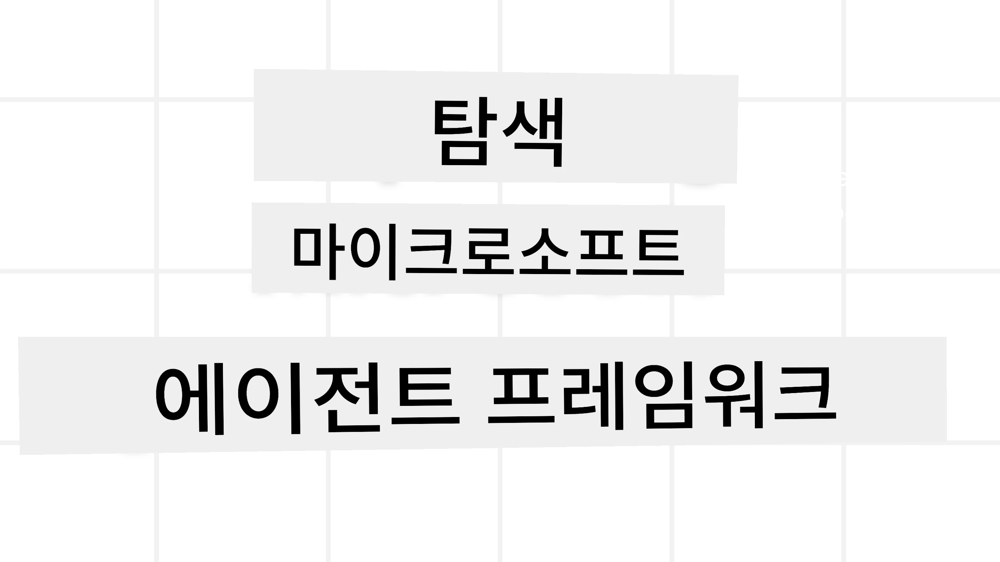
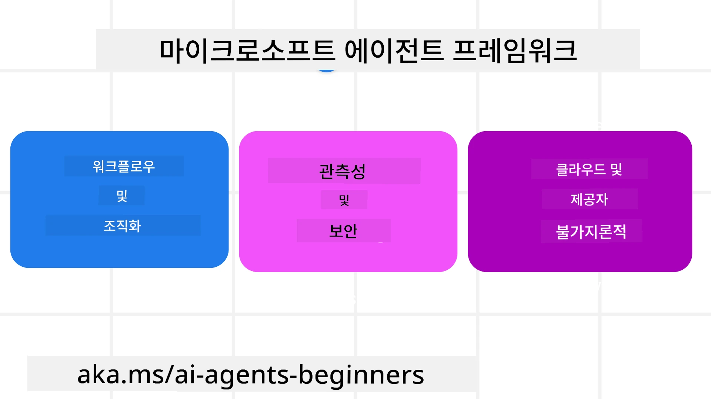
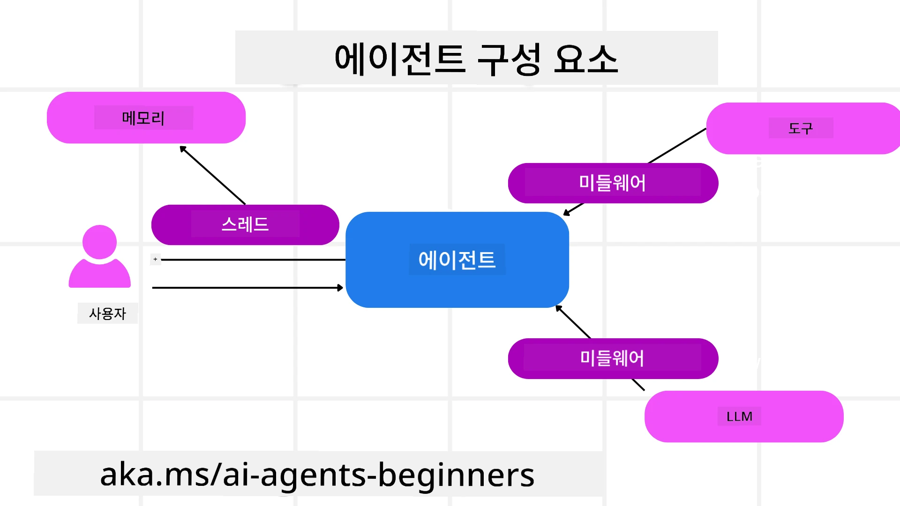

# 마이크로소프트 에이전트 프레임워크 탐구



### 소개

이 수업에서는 다음을 다룹니다:

- 마이크로소프트 에이전트 프레임워크 이해: 주요 기능 및 가치  
- 마이크로소프트 에이전트 프레임워크의 주요 개념 탐구
- 고급 MAF 패턴: 워크플로우, 미들웨어, 메모리

## 학습 목표

이 수업을 완료한 후에, 여러분은 다음을 알게 됩니다:

- 마이크로소프트 에이전트 프레임워크를 사용하여 프로덕션 준비 AI 에이전트 구축하기
- 에이전틱 사용 사례에 마이크로소프트 에이전트 프레임워크의 핵심 기능 적용하기
- 워크플로우, 미들웨어, 관측성 등 고급 패턴 사용하기

## 코드 샘플 

[Microsoft Agent Framework (MAF)](https://learn.microsoft.com/en-us/agent-framework/overview/?wt.mc_id=youtube_26688_organicsocial_reactor&pivots=programming-language-python) 의 코드 샘플은 이 저장소의 `xx-python-agent-framework` 및 `xx-dotnet-agent-framework` 파일에 있습니다.

## 마이크로소프트 에이전트 프레임워크 이해하기



[Microsoft Agent Framework (MAF)](https://learn.microsoft.com/en-us/agent-framework/overview/?wt.mc_id=youtube_26688_organicsocial_reactor&pivots=programming-language-python)는 AI 에이전트를 구축하기 위한 마이크로소프트의 통합 프레임워크입니다. 이 프레임워크는 프로덕션 및 연구 환경에서 볼 수 있는 다양한 에이전틱 사용 사례를 해결할 수 있는 유연성을 제공합니다:

- 단계별 워크플로우가 필요한 시나리오에서의 **순차적 에이전트 오케스트레이션**.
- 에이전트가 동시에 작업을 완료해야 하는 시나리오에서의 **동시 오케스트레이션**.
- 에이전트들이 하나의 작업에 함께 협력할 수 있는 시나리오에서의 **그룹 채팅 오케스트레이션**.
- 작업의 하위 작업들이 완료될 때 에이전트가 작업을 서로 넘기는 시나리오에서의 **핸드오프 오케스트레이션**.
- 관리자 에이전트가 작업 목록을 만들고 수정하며 하위 에이전트의 조정을 처리하는 시나리오에서의 **마그네틱 오케스트레이션**.

프로덕션에서 AI 에이전트를 제공하기 위해, MAF는 다음과 같은 기능도 포함하고 있습니다:

- OpenTelemetry를 이용한 <strong>관측성</strong>으로, AI 에이전트의 모든 행동(도구 호출, 오케스트레이션 단계, 추론 흐름, Microsoft Foundry 대시보드를 통한 성능 모니터링 등)을 추적합니다.
- Microsoft Foundry에서 에이전트를 네이티브로 호스팅하여 역할 기반 접근, 개인정보 처리 및 내장된 콘텐츠 안전성 같은 <strong>보안</strong> 제어를 제공합니다.
- 에이전트 스레드와 워크플로우가 일시 중지, 재개 및 오류 복구가 가능해 장시간 실행 프로세스를 지원하는 <strong>내구성</strong>.
- 작업이 인간 승인 필요로 표시될 수 있도록 하는 <strong>제어</strong> 지원인 인간 참여 워크플로우.

마이크로소프트 에이전트 프레임워크는 또한 상호 운용성에 중점을 두고 있습니다:

- **클라우드 독립성** - 에이전트가 컨테이너, 온프레미스, 다양한 클라우드 환경에서 실행 가능.
- **공급자 독립성** - Azure OpenAI 및 OpenAI 등 선호하는 SDK를 통해 에이전트 생성 가능.
- **오픈 표준 통합** - Agent-to-Agent(A2A), Model Context Protocol (MCP) 같은 프로토콜로 다른 에이전트 및 도구를 발견하고 활용할 수 있음.
- **플러그인 및 커넥터** - Microsoft Fabric, SharePoint, Pinecone, Qdrant 등의 데이터 및 메모리 서비스와 연결 가능.

이제 이러한 기능들이 마이크로소프트 에이전트 프레임워크의 핵심 개념들에 어떻게 적용되는지 살펴보겠습니다.

## 마이크로소프트 에이전트 프레임워크의 주요 개념

### 에이전트




**에이전트 생성하기**

에이전트 생성은 추론 서비스(LLM 공급자), AI 에이전트가 따를 지침 집합, 그리고 할당된 `name`을 정의하여 수행됩니다:


```python
agent = AzureOpenAIChatClient(credential=AzureCliCredential()).create_agent( instructions="You are good at recommending trips to customers based on their preferences.", name="TripRecommender" )
```

위는 `Azure OpenAI`를 사용하고 있지만, 에이전트는 `Microsoft Foundry Agent Service`를 포함한 다양한 서비스를 사용하여 생성할 수 있습니다:

```python
AzureAIAgentClient(async_credential=credential).create_agent( name="HelperAgent", instructions="You are a helpful assistant." ) as agent
```

OpenAI `Responses`, `ChatCompletion` API

```python
agent = OpenAIResponsesClient().create_agent( name="WeatherBot", instructions="You are a helpful weather assistant.", )
```

```python
agent = OpenAIChatClient().create_agent( name="HelpfulAssistant", instructions="You are a helpful assistant.", )
```

또는 큰 컨텍스트 창(최대 204K 토큰)을 제공하는 OpenAI 호환 API인 [MiniMax](https://platform.minimaxi.com/)를 사용할 수도 있습니다:

```python
agent = OpenAIChatClient(base_url="https://api.minimax.io/v1", api_key=os.environ["MINIMAX_API_KEY"], model_id="MiniMax-M3").create_agent( name="HelpfulAssistant", instructions="You are a helpful assistant.", )
```

또는 A2A 프로토콜을 사용하는 원격 에이전트도 가능합니다:

```python
agent = A2AAgent( name=agent_card.name, description=agent_card.description, agent_card=agent_card, url="https://your-a2a-agent-host" )
```

**에이전트 실행하기**

에이전트는 비스트리밍 응답 또는 스트리밍 응답을 위해 `.run` 또는 `.run_stream` 메서드를 사용하여 실행됩니다.

```python
result = await agent.run("What are good places to visit in Amsterdam?")
print(result.text)
```

```python
async for update in agent.run_stream("What are the good places to visit in Amsterdam?"):
    if update.text:
        print(update.text, end="", flush=True)

```

각 에이전트 실행은 에이전트가 사용하는 `max_tokens`, 에이전트가 호출할 수 있는 `tools`, 심지어 에이전트에 사용되는 `model` 자체와 같은 매개변수를 사용자 정의하는 옵션도 가질 수 있습니다.

이는 사용자의 작업 완료에 특정 모델이나 도구가 필요한 경우에 유용합니다.

<strong>도구</strong>

도구는 에이전트 정의 시점에도 정의할 수 있습니다:

```python
def get_attractions( location: Annotated[str, Field(description="The location to get the top tourist attractions for")], ) -> str: """Get the top tourist attractions for a given location.""" return f"The top attractions for {location} are." 


# ChatAgent를 직접 생성할 때

agent = ChatAgent( chat_client=OpenAIChatClient(), instructions="You are a helpful assistant", tools=[get_attractions]

```

그리고 에이전트 실행 시점에도 정의할 수 있습니다:

```python

result1 = await agent.run( "What's the best place to visit in Seattle?", tools=[get_attractions] # 이번 실행에서만 제공되는 도구 )
```

**에이전트 스레드**

에이전트 스레드는 다중 턴 대화를 처리하는 데 사용됩니다. 스레드는 다음 방법으로 생성할 수 있습니다:

- `get_new_thread()`을 사용하여 시간이 지나도 스레드가 저장되도록 함
- 에이전트를 실행할 때 자동으로 스레드를 생성하며, 스레드는 현재 실행 중에만 지속됨

스레드를 생성하는 코드는 다음과 같습니다:

```python
# 새 스레드를 생성합니다.
thread = agent.get_new_thread() # 스레드로 에이전트를 실행합니다.
response = await agent.run("Hello, I am here to help you book travel. Where would you like to go?", thread=thread)

```

이후 스레드를 직렬화하여 나중에 사용할 수 있도록 저장할 수 있습니다:

```python
# 새 스레드를 생성합니다.
thread = agent.get_new_thread() 

# 스레드로 에이전트를 실행합니다.

response = await agent.run("Hello, how are you?", thread=thread) 

# 저장을 위해 스레드를 직렬화합니다.

serialized_thread = await thread.serialize() 

# 저장소에서 로드한 후 스레드 상태를 역직렬화합니다.

resumed_thread = await agent.deserialize_thread(serialized_thread)
```

**에이전트 미들웨어**

에이전트는 사용자의 작업을 완료하기 위해 도구 및 LLM과 상호작용합니다. 특정 시나리오에서는 이 상호작용 사이에 실행하거나 추적을 수행하고자 할 때가 있습니다. 에이전트 미들웨어를 통해 이를 수행할 수 있습니다:

*함수 미들웨어*

이 미들웨어는 에이전트와 호출할 함수/도구 사이에서 동작을 실행할 수 있게 합니다. 예를 들어 함수 호출에 대해 로깅을 수행하고 싶을 때 사용됩니다.

아래 코드에서 `next`는 다음 미들웨어 또는 실제 함수를 호출할지 정의합니다.

```python
async def logging_function_middleware(
    context: FunctionInvocationContext,
    next: Callable[[FunctionInvocationContext], Awaitable[None]],
) -> None:
    """Function middleware that logs function execution."""
    # 전처리: 함수 실행 전 로그
    print(f"[Function] Calling {context.function.name}")

    # 다음 미들웨어나 함수 실행으로 계속 진행
    await next(context)

    # 후처리: 함수 실행 후 로그
    print(f"[Function] {context.function.name} completed")
```

*채팅 미들웨어*

이 미들웨어는 에이전트와 LLM 간의 요청 사이에서 동작을 실행하거나 로깅할 수 있습니다.

여기에는 AI 서비스로 전송되는 `messages`와 같은 중요한 정보가 포함됩니다.

```python
async def logging_chat_middleware(
    context: ChatContext,
    next: Callable[[ChatContext], Awaitable[None]],
) -> None:
    """Chat middleware that logs AI interactions."""
    # 전처리: AI 호출 전 로그 기록
    print(f"[Chat] Sending {len(context.messages)} messages to AI")

    # 다음 미들웨어 또는 AI 서비스로 계속 진행
    await next(context)

    # 후처리: AI 응답 후 로그 기록
    print("[Chat] AI response received")

```

**에이전트 메모리**

`Agentic Memory` 강의에서 다루었듯이, 메모리는 에이전트가 다양한 컨텍스트에서 작동하도록 하는 중요한 요소입니다. MAF는 여러 종류의 메모리를 제공합니다:

*인-메모리 저장소*

애플리케이션 실행 시간 동안 스레드에 저장되는 메모리입니다.

```python
# 새 스레드를 만듭니다.
thread = agent.get_new_thread() # 스레드와 함께 에이전트를 실행합니다.
response = await agent.run("Hello, I am here to help you book travel. Where would you like to go?", thread=thread)
```

*영구 메시지*

여러 세션에 걸친 대화 기록을 저장할 때 사용되는 메모리입니다. `chat_message_store_factory`를 사용하여 정의합니다:

```python
from agent_framework import ChatMessageStore

# 사용자 지정 메시지 저장소 생성
def create_message_store():
    return ChatMessageStore()

agent = ChatAgent(
    chat_client=OpenAIChatClient(),
    instructions="You are a Travel assistant.",
    chat_message_store_factory=create_message_store
)

```

*동적 메모리*


이 메모리는 에이전트가 실행되기 전에 컨텍스트에 추가됩니다. 이러한 메모리는 mem0와 같은 외부 서비스에 저장할 수 있습니다:

```python
from agent_framework.mem0 import Mem0Provider

# 향상된 메모리 기능을 위해 Mem0 사용하기
memory_provider = Mem0Provider(
    api_key="your-mem0-api-key",
    user_id="user_123",
    application_id="my_app"
)

agent = ChatAgent(
    chat_client=OpenAIChatClient(),
    instructions="You are a helpful assistant with memory.",
    context_providers=memory_provider
)

```

**에이전트 관측성**

관측성은 신뢰할 수 있고 유지 관리 가능한 에이전트 시스템을 구축하는 데 중요합니다. MAF는 추적 및 미터링을 제공하기 위해 OpenTelemetry와 통합되어 관측성을 향상시킵니다.

```python
from agent_framework.observability import get_tracer, get_meter

tracer = get_tracer()
meter = get_meter()
with tracer.start_as_current_span("my_custom_span"):
    # 무언가를 하다
    pass
counter = meter.create_counter("my_custom_counter")
counter.add(1, {"key": "value"})
```

### 워크플로우

MAF는 작업을 완료하기 위한 미리 정의된 단계인 워크플로우를 제공하며, 이 단계들에 AI 에이전트를 구성 요소로 포함합니다.

워크플로우는 더 나은 제어 흐름을 가능하게 하는 다양한 구성 요소로 이루어져 있습니다. 워크플로우는 또한 **다중 에이전트 오케스트레이션** 및 워크플로우 상태를 저장하는 <strong>체크포인트</strong>를 지원합니다.

워크플로우의 핵심 구성 요소는 다음과 같습니다:

**실행자(Executors)**

실행자는 입력 메시지를 받아 할당된 작업을 수행한 다음 출력 메시지를 생성합니다. 이것이 워크플로우를 더 큰 작업 완료 방향으로 나아가게 합니다. 실행자는 AI 에이전트 또는 사용자 지정 로직일 수 있습니다.

**엣지(Edges)**

엣지는 워크플로우 내 메시지 흐름을 정의하는 데 사용됩니다. 이들은 다음과 같을 수 있습니다:

*직접 엣지* - 실행자들 간의 단순한 일대일 연결:

```python
from agent_framework import WorkflowBuilder

builder = WorkflowBuilder()
builder.add_edge(source_executor, target_executor)
builder.set_start_executor(source_executor)
workflow = builder.build()
```

*조건부 엣지* - 특정 조건이 충족된 후 활성화됩니다. 예를 들어, 호텔 객실이 없을 경우 실행자가 다른 옵션을 제안할 수 있습니다.

*스위치 케이스 엣지* - 정의된 조건에 따라 메시지를 다른 실행자에게 라우팅합니다. 예를 들어, 여행 고객이 우선 접근권을 가진 경우 작업이 다른 워크플로우를 통해 처리됩니다.

*팬아웃 엣지* - 한 메시지를 여러 대상에게 전송합니다.

*팬인 엣지* - 여러 실행자로부터 메시지를 수집하여 한 대상에게 보냅니다.

**이벤트(Events)**

워크플로우에 대한 더 나은 관측성을 제공하기 위해 MAF는 실행 시 내장 이벤트를 제공합니다:

- `WorkflowStartedEvent`  - 워크플로우 실행 시작
- `WorkflowOutputEvent` - 워크플로우 결과 생성
- `WorkflowErrorEvent` - 워크플로우 오류 발생
- `ExecutorInvokeEvent`  - 실행자 작업 시작
- `ExecutorCompleteEvent`  -  실행자 작업 완료
- `RequestInfoEvent` - 요청 발생

## 고급 MAF 패턴

위 섹션들은 Microsoft Agent Framework의 주요 개념을 다루었습니다. 더 복잡한 에이전트를 구축할 때 고려할 수 있는 몇 가지 고급 패턴은 다음과 같습니다:

- **미들웨어 구성**: 함수 및 채팅 미들웨어를 사용하여 여러 미들웨어 핸들러(로깅, 인증, 속도 제한)를 연쇄하여 에이전트 동작을 세밀하게 제어합니다.
- **워크플로우 체크포인팅**: 워크플로우 이벤트와 직렬화를 사용하여 장기 실행 에이전트 프로세스를 저장 및 재개합니다.
- **동적 도구 선택**: 도구 설명에 대한 RAG와 MAF 도구 등록을 결합하여 쿼리별로 관련 도구만 제공합니다.
- **다중 에이전트 핸드오프**: 워크플로우 엣지와 조건부 라우팅을 사용하여 전문화된 에이전트 간 핸드오프를 오케스트레이션합니다.

## Microsoft Foundry에서 LangChain / LangGraph 에이전트 호스팅

Microsoft Agent Framework는 <strong>프레임워크 간 상호운용 가능</strong>합니다 — MAF로 작성된 에이전트에만 국한되지 않습니다. 이미 **LangChain** 또는 <strong>LangGraph</strong>로 작성된 에이전트가 있다면, 이를 <strong>Microsoft Foundry 호스티드 에이전트</strong>로 실행할 수 있으며, Foundry가 런타임, 세션, 확장, 신원 및 프로토콜 엔드포인트를 관리하는 동안 에이전트 로직은 LangGraph에 유지됩니다.

이는 `langchain_azure_ai.agents.hosting` 패키지를 통해 이루어지며, Foundry 호스티드 에이전트가 사용하는 동일한 프로토콜로 컴파일된 LangGraph 그래프를 노출합니다.

**1. 호스팅 추가 기능 설치:**

```bash
pip install -U "langchain-azure-ai[hosting]>=1.2.4" azure-identity
```

`hosting` 추가 기능은 Foundry 프로토콜 라이브러리인 `azure-ai-agentserver-responses` (OpenAI 호환 `/responses` 엔드포인트)와 `azure-ai-agentserver-invocations` (일반 `/invocations` 엔드포인트)를 설치합니다.

**2. 호스팅 프로토콜 선택:**

| 프로토콜 | 호스트 클래스 | 엔드포인트 | 사용 시기 |
|----------|-----------|----------|----------|
| **Responses** | `ResponsesHostServer` | `/responses` | OpenAI 호환 채팅, 스트리밍, 응답 기록, 대화 스레딩이 필요할 때 — 대화형 에이전트에 권장되는 기본값입니다. |
| **Invocations** | `InvocationsHostServer` | `/invocations` | 사용자 지정 JSON 형식, 웹훅 스타일 엔드포인트, 비대화형 처리가 필요할 때 사용합니다. |

**Responses API는 Foundry에서 에이전트 스타일 개발을 위한 주요 API이므로**, 대부분의 에이전트에서는 `ResponsesHostServer`부터 시작하세요.

**3. 환경 변수 구성** (`az login` 후 `DefaultAzureCredential` 인증 가능하도록):

```bash
export FOUNDRY_PROJECT_ENDPOINT="https://<resource>.services.ai.azure.com/api/projects/<project>"
export FOUNDRY_MODEL_NAME="gpt-5-mini"
```

에이전트가 나중에 Foundry에서 호스티드 에이전트로 실행될 때 플랫폼이 자동으로 `FOUNDRY_PROJECT_ENDPOINT`를 주입합니다.

**4. Responses 프로토콜을 통해 LangGraph 에이전트 노출:**

```python
import os

from azure.ai.projects import AIProjectClient
from azure.identity import DefaultAzureCredential, get_bearer_token_provider
from langchain.agents import create_agent
from langchain_openai import ChatOpenAI
from langchain_azure_ai.agents.hosting import ResponsesHostServer

_AZURE_AI_SCOPE = "https://ai.azure.com/.default"


def build_chat_model() -> ChatOpenAI:
    project_endpoint = os.environ["FOUNDRY_PROJECT_ENDPOINT"].rstrip("/")
    deployment = os.environ.get("FOUNDRY_MODEL_NAME", "gpt-5-mini")
    credential = DefaultAzureCredential()
    project = AIProjectClient(endpoint=project_endpoint, credential=credential)
    openai_client = project.get_openai_client()
    token_provider = get_bearer_token_provider(credential, _AZURE_AI_SCOPE)

    # ChatOpenAI 여기서는 Foundry 프로젝트의 OpenAI 호환 (응답) 엔드포인트를 대상으로 합니다.
    return ChatOpenAI(
        model=deployment,
        base_url=str(openai_client.base_url),
        api_key=token_provider,
    )


def main() -> None:
    graph = create_agent(build_chat_model(), tools=[])
    port = int(os.environ.get("PORT", "8088"))
    ResponsesHostServer(graph).run(port=port)


if __name__ == "__main__":
    main()
```

로컬에서 `python main.py`로 실행한 후 `http://localhost:8088/responses`에 Responses 요청을 보냅니다.

**주요 동작:**

- <strong>대화</strong>: 클라이언트는 `previous_response_id` 또는 `conversation` ID를 전달하여 대화를 계속합니다. 그래프가 LangGraph 체크포인터로 컴파일되었다면, Foundry는 대화 상태를 체크포인트에 키로 저장합니다(실제 서비스에는 내구성 있는 체크포인터를 사용하세요; 로컬 테스트에는 `MemorySaver`가 충분합니다).
- **휴먼 인 더 루프**: 그래프가 LangGraph `interrupt()`를 사용하면, `ResponsesHostServer`는 대기 중인 인터럽트를 Responses `function_call` / `mcp_approval_request` 아이템으로 노출하며, 클라이언트는 일치하는 `function_call_output` / `mcp_approval_response`로 다시 시작합니다.
- **Foundry에 배포**: Azure Developer CLI를 사용하여 — `azd ext install azure.ai.agents`, `azd ai agent init -m <manifest>`, `azd ai agent run` (로컬, Docker 필요), 이후 `azd provision` 및 `azd deploy`를 실행합니다. 호스티드 에이전트 배포에는 **Foundry 프로젝트 관리자** 역할이 필요합니다.

이 예제의 실행 가능한 버전은 [code-samples/14-langchain-hosted-agent.py](../../../14-microsoft-agent-framework/code-samples/14-langchain-hosted-agent.py)에 있습니다. 전체 워크스루(Invocations 프로토콜, 사용자 지정 요청 스키마 및 문제 해결)는 [Foundry 호스티드 에이전트로 LangGraph 에이전트 호스팅하기](https://learn.microsoft.com/azure/foundry/how-to/develop/langchain-hosted-agents)를 참고하세요.

## 코드 샘플

Microsoft Agent Framework 코드 샘플은 이 저장소의 `xx-python-agent-framework` 및 `xx-dotnet-agent-framework` 파일에서 확인할 수 있습니다.

## Microsoft Agent Framework에 대해 더 궁금한 점이 있나요?

[Microsoft Foundry Discord](https://discord.com/invite/ATgtXmAS5D)에 참여하여 다른 학습자들을 만나고 오피스 아워에 참석하며 AI 에이전트 관련 질문에 대한 답변을 받아보세요.
## 이전 강의

[AI 에이전트를 위한 메모리](../13-agent-memory/README.md)

## 다음 강의


[컴퓨터 사용 에이전트(CUA) 구축](../15-browser-use/README.md)

---

<!-- CO-OP TRANSLATOR DISCLAIMER START -->
**면책 조항**:
이 문서는 AI 번역 서비스 [Co-op Translator](https://github.com/Azure/co-op-translator)를 사용하여 번역되었습니다. 정확성을 기하기 위해 노력하고 있으나, 자동 번역은 오류나 부정확한 부분이 있을 수 있음을 유의하시기 바랍니다. 원본 문서의 원어본이 권위 있는 자료로 간주되어야 합니다. 중요한 정보의 경우, 전문가의 인간 번역을 권장합니다. 이 번역 사용으로 인해 발생하는 오해나 잘못된 해석에 대해 당사는 책임을 지지 않습니다.
<!-- CO-OP TRANSLATOR DISCLAIMER END -->