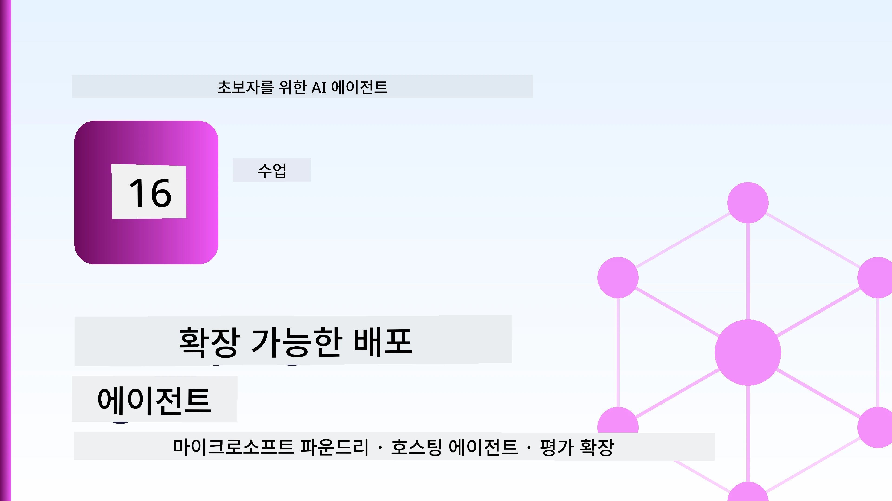
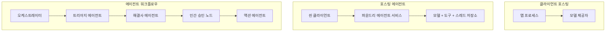
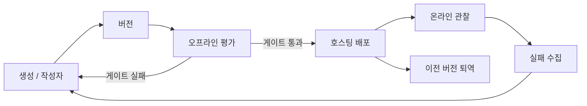
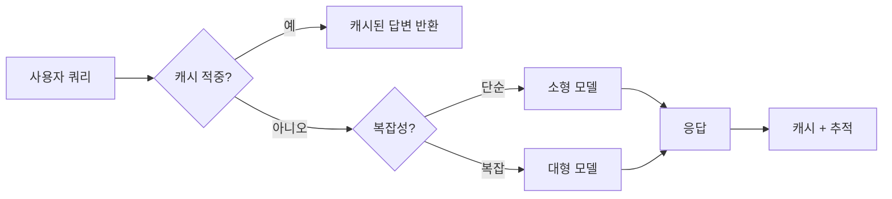
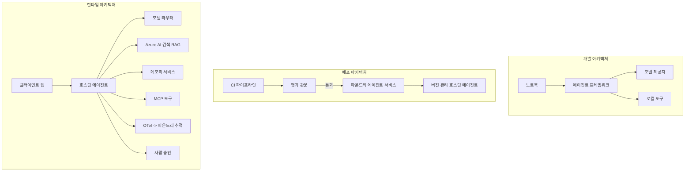

# Microsoft Foundry로 확장 가능한 에이전트 배포하기



지금까지 강의에서는 `az login`과 몇 가지 환경 변수를 사용하여 노트북 안에서 실행되는 랩탑용 에이전트를 만들었습니다. 이것은 배우기에 아주 적절한 방법입니다. 하지만 수천 명의 고객이 새벽 3시에 의존하는 에이전트를 운영하는 데 적합한 방법은 아닙니다.

이 강의는 "내 컴퓨터에서는 작동하는데"와 "운영 환경에서 신뢰할 수 있고 저렴하게 작동하는" 사이의 간극을 다룹니다. 이 간극을 <strong>Microsoft Foundry</strong>와 <strong>Microsoft Foundry Agent Service</strong>를 사용하여 메우며, 도구, 검색, 메모리, 평가, 모니터링이 통합된 실제 고객 지원 에이전트를 구축합니다.

## 소개

이 강의에서 다룰 내용:

- <strong>프로토타입 에이전트</strong>와 <strong>배포된 에이전트</strong>의 차이점 및 전환이 대부분 모델 <em>주변</em>의 모든 것이라는 점.
- 에이전트 배포 패턴: 클라이언트 호스팅, 서비스 호스팅(호스팅 에이전트), 워크플로우 오케스트레이션.
- Microsoft Foundry에서의 **에이전트 라이프사이클** — 생성, 버전 관리, 배포, 평가, 관찰, 은퇴.
- **확장 전략**: 모델 라우팅, 캐싱, 동시성, 무상태 설계.
- OpenTelemetry 및 Foundry 추적을 통한 <strong>관측성</strong>.
- 모델 선택, 라우팅, 평가 게이트를 통한 **비용 최적화**.
- **기업 배포 고려사항**: 거버넌스, 인간 승인, 프로덕션에서 MCP 서버 안전하게 운영하기.

## 학습 목표

이 강의를 완료하면 다음을 알게 됩니다:

- 특정 에이전트 작업 부하에 적합한 배포 패턴 선택 방법.
- Microsoft Foundry Agent Service에 에이전트를 배포하여 버전 관리되고 거버넌스와 관측이 이루어지게 하는 방법.
- 추적을 위한 에이전트 계측 및 모든 릴리스 전에 실행되는 평가 파이프라인 연결 방법.
- 대규모 환경에서 지연 시간과 비용을 관리하기 위한 모델 라우팅과 캐싱 적용법.
- 위험도가 높은 동작에 대한 인간 승인 게이트 추가 및 MCP 서버를 프로덕션 안전하게 통합하는 방법.

## 필요 조건

이 강의는 이전 강의를 완료하고 다음에 익숙하다고 가정합니다:

- [Microsoft Agent Framework](../14-microsoft-agent-framework/README.md)로 에이전트 빌딩 (강의 14).
- [도구 사용](../04-tool-use/README.md) (강의 4) 및 [Agentic RAG](../05-agentic-rag/README.md) (강의 5).
- [에이전트 메모리](../13-agent-memory/README.md) (강의 13) 및 [Agentic Protocols / MCP](../11-agentic-protocols/README.md) (강의 11).
- [관측성과 평가](../10-ai-agents-production/README.md) (강의 10) — 이 강의는 이를 직접 기반으로 합니다.

또한 다음이 필요합니다:

- **Azure 구독** 및 최소 하나 이상의 배포된 채팅 모델이 포함된 **Microsoft Foundry 프로젝트**.
- 인증된 **Azure CLI** (`az login`).
- Python 3.12 이상과 저장소의 [`requirements.txt`](../../../requirements.txt) 패키지들.

## 프로토타입에서 프로덕션으로: 실제 무엇이 변하는가

프로토타입 에이전트와 프로덕션 에이전트는 기본 루프 — 추론, 도구 호출, 응답 — 를 공유합니다. 변하는 것은 그 루프를 감싸는 모든 것입니다. 모델은 프로덕션 에이전트의 약 20%일 뿐이며, 나머지 80%는 운영의 골격입니다.

| 관심사 | 프로토타입 | 프로덕션 |
| --- | --- | --- |
| <strong>호스팅</strong> | 노트북에서 실행 | 호스팅 서비스로 실행, 버전 관리 및 배포됨 |
| <strong>신원</strong> | 당신의 `az login` 토큰 | 범위가 제한된 RBAC가 적용된 관리형 ID |
| <strong>상태</strong> | 메모리 내, 재시작 시 소실 | 외부화됨 (스레드 저장소, 메모리 서비스) |
| **장애 처리** | 추적 오류 확인 | 재시도, 대체, 데드레터, 알림 |
| <strong>비용</strong> | "몇 센트 수준" | 요청별 추적, 라우팅, 캐싱, 예산 관리 |
| <strong>품질</strong> | 직접 눈으로 확인 | 매 릴리스 전 자동 평가 |
| <strong>신뢰도</strong> | 모든 작업 당신이 승인 | 위험한 작업에 정책 + 인간 승인 루프 |

이 표를 기억하세요. 아래 각 섹션이 위 행들 중 하나에 대응됩니다.

## 에이전트 배포 패턴

자주 함께 사용될 세 가지 패턴이 있습니다.

### 1. 클라이언트 호스팅 에이전트

에이전트 객체가 <em>당신의</em> 애플리케이션 프로세스 내에 존재합니다. 코드가 모델 제공자를 직접 호출하며 추론 루프가 당신의 서비스 안에서 실행됩니다. 이전 강의들이 모두 이 방법을 사용했습니다.

- **사용 시기**: 루프에 대한 완전한 제어권, 맞춤 미들웨어가 필요하거나 기존 백엔드에 에이전트를 임베딩할 때.
- <strong>단점</strong>: 확장, 상태 관리, 복원력 모두 직접 담당해야 합니다.

### 2. 호스팅 에이전트 (Foundry Agent Service)

에이전트가 Microsoft Foundry에서 <em>자원으로 등록</em>됩니다. Foundry가 추론 루프를 호스팅하고 스레드를 저장하며 콘텐츠 안전 및 RBAC를 시행하고 포털 내에서 에이전트를 표시합니다. 당신의 앱은 스레드를 생성하고 응답을 읽는 가벼운 클라이언트가 됩니다.

- **사용 시기**: 내구성, 내장 관측성, 거버넌스, 운영 부담 감소를 원할 때.
- <strong>단점</strong>: 관리형 런타임 대신 낮은 수준의 제어가 덜 제공됩니다.

### 3. 에이전트 워크플로우

여러 에이전트(및 도구)를 명시적 제어 흐름이 있는 그래프로 구성합니다 — 순차 단계, 분기, 인간 승인 노드, 일시 중지 및 재개 가능한 내구성 체크포인트 등이 포함됩니다. 이는 Microsoft Agent Framework의 <strong>워크플로우</strong> 기능을 배포 규모에 적용한 것입니다.

- **사용 시기**: 단일 작업이 여러 특화 에이전트를 가로지르거나 중간에 승인 단계가 필요할 때.
- <strong>단점</strong>: 더 많은 구성 요소; 오케스트레이션 수준의 관측성이 요구됩니다.



## Microsoft Foundry에서의 에이전트 라이프사이클

에이전트 배포는 단 한 번의 `push`가 아닙니다. 이는 소프트웨어 릴리스 사이클과 매우 유사한 반복 과정입니다.



[강의 10](../10-ai-agents-production/README.md)에서 가져온 핵심 개념: **오프라인 평가는 사후 고려 사항이 아니라 게이트이다.** 새로운 에이전트 버전은 평가 임계값을 통과하지 않으면 출시되지 않습니다. 온라인 관측성은 실제 실패 사례를 오프라인 테스트 집합으로 피드백합니다. 이것이 전체 루프입니다.

## 확장 전략

에이전트를 확장하는 것은 무상태 웹 API를 확장하는 것과 다릅니다. 각 요청은 여러 비싼 모델과 도구 호출을 유발할 수 있기 때문입니다. 네 가지 기술이 대부분의 부하를 처리합니다.

**무상태 요청 처리.** 프로세스 메모리에 사용자별 상태를 저장하지 마세요. 대화 스레드는 Foundry 스레드 저장소나 메모리 서비스에 지속시켜 어느 인스턴스든 어떤 요청이든 처리할 수 있도록 합니다. 이것이 수평 확장이 가능한 이유입니다 — 인스턴스를 추가하고 고정 세션 없이 확장.

**모델 라우팅.** 모든 요청이 가장 강력하고(가장 비싼) 모델을 필요로 하지 않습니다. 간단한 요청 — 의도 분류, 짧은 사실 질문 — 은 작고 빠른 모델로 처리하고 진짜 추론은 대형 모델에 예약합니다. Foundry의 <strong>모델 라우터</strong>가 이를 지원하거나 직접 경량 분류기를 구현할 수 있습니다. 실습에서 DIY 버전을 구축할 것입니다.

**응답 캐싱.** 많은 지원 문의가 거의 중복입니다("비밀번호를 어떻게 재설정하나요?"). 일반 질문에 대한 답변을 캐시하고 모델을 전혀 호출하지 않고 제공하세요. 적당한 캐시 적중률만으로도 비용과 지연 시간을 의미 있게 줄일 수 있습니다.

**동시성 및 역압.** 모델 제공자는 속도 제한을 가집니다. 동시성 한도를 설정하고 지수 백오프가 적용된 재시도 사용, 그리고 우아하게 실패하세요(대기열에 "처리 중"이라고 응답하는 것이 500 오류보다 낫습니다).



## 프로덕션 환경에서 관측성

볼 수 없는 것은 운영할 수 없습니다. 강의 10에서 다룬 바와 같이 Microsoft Agent Framework는 **OpenTelemetry** 추적을 기본적으로 생성합니다 — 모든 모델 호출, 도구 실행, 오케스트레이션 단계는 스팬이 됩니다. 프로덕션에서는 이 스팬들을 Microsoft Foundry(또는 OTel 호환 백엔드)로 내보내서 다음을 할 수 있습니다:

- 단일 고객 불만을 모든 모델과 도구 호출 전반에 걸쳐 추적합니다.
- 시간 경과에 따른 요청별 p50/p95 지연 시간과 비용 관찰.
- 사용자(또는 재무 팀)가 인지하기 전에 오류율 급증 및 비용 이상 징후에 대해 알림.

```python
from agent_framework.observability import get_tracer

tracer = get_tracer()

with tracer.start_as_current_span("support_request") as span:
    span.set_attribute("customer.tier", "enterprise")
    span.set_attribute("routed.model", "gpt-5-nano")
    # 에이전트 실행은 이 범위 내에서 자동으로 추적됩니다
```

`customer.tier`와 `routed.model` 같은 속성들은 추적 기록을 응답 가능한 질문으로 전환합니다("기업 고객이 너무 자주 작은 모델로 라우팅되나요?").

## 비용 최적화

프로덕션 에이전트 비용은 토큰이 지배적입니다. 영향 순서대로 세 가지 조절 장치:

1. **모델 크기 적합화.** 평가 게이트를 통과하는 작은 모델이 게이트를 통과하는 큰 모델보다 거의 항상 저렴합니다. 평가를 통해 작은 모델이 충분히 좋음을 증명하고 기본적으로 가장 큰 모델을 선택하지 마세요.
2. **복잡도별 라우팅.** 위와 같이 — 큰 모델 추론이 필요한 요청에 대해서만 큰 모델 비용을 지불.
3. **공격적 캐싱.** 호출하지 않은 모델 호출이 가장 저렴한 모델 호출입니다.

평가 게이트와 비용 관리 두 가지는 같은 규율의 서로 다른 각도입니다: 평가는 <em>품질 하한</em>을 알려주고, 라우팅과 캐싱은 그 하한에 가까운 <em>비용</em>을 유지합니다.

## 기업 배포 고려사항

**거버넌스.** 호스팅 에이전트는 Foundry의 RBAC, 콘텐츠 안전, 감사 로깅을 상속받습니다. 각 에이전트에 필요한 최소 권한이 부여된 관리형 ID를 제공합니다 — 지식 베이스 읽기 전용, 티켓팅 API 제한적 접근, 그 이상은 안 됩니다.

**인간 승인 루프.** 일부 작업은 완전 자동화하기에 너무 중대합니다 — 환불 발행, 계정 삭제, 법무 팀 이관 등. Microsoft Agent Framework는 **승인 필요** 도구를 지원합니다: 에이전트가 작업을 제안하면 실행이 중지되고, 인간이 승인하거나 거부하며 워크플로우가 재개됩니다. [강의 6](../06-building-trustworthy-agents/README.md)에서 원시 기능을 보았고 여기서 배포합니다.

**프로덕션 내 MCP.** [MCP](../11-agentic-protocols/README.md)는 표준 인터페이스를 통해 에이전트가 외부 도구를 사용할 수 있게 합니다. 프로덕션에서는 모든 MCP 서버를 신뢰할 수 없는 경계로 취급하세요: 서버 버전을 고정하고, 제한된 ID로 실행하며, 출력값을 검증하고, 비밀을 절대 노출하지 마세요. MCP 서버는 종속성이며, 종속성은 패치, 감사, 속도 제한 대상입니다.



이 세 가지 다이어그램 — 개발, 배포, 런타임 — 은 같은 에이전트가 생애의 세 단계를 보여줍니다. 뒤이은 실습에서 이를 구축하는 과정을 안내합니다.

## 실습: 프로덕션 준비 완료된 고객 지원 에이전트

[`code_samples/16-python-agent-framework.ipynb`](./code_samples/16-python-agent-framework.ipynb)를 열어 처음부터 끝까지 실습하세요. 모든 프로덕션 고려사항이 포함된 <strong>Contoso 고객 지원 에이전트</strong>를 조립할 것입니다:

1. **도구 호출** — 주문 상태 조회 및 지원 티켓 생성.
2. **RAG** — 지식 베이스에서 정책 질문에 답변 (Azure AI Search, 노트북에서 Search 자원 없이 실행하도록 메모리 내 폴백 포함).
3. <strong>메모리</strong> — 대화 턴 간 고객 기억.
4. **모델 라우팅** — 복잡도 분류기가 각 요청을 작은 모델 또는 큰 모델로 라우팅.
5. **응답 캐싱** — 반복된 질문은 캐시에서 제공.
6. **인간 승인** — 임계값 이상의 환불은 인간 승인 중지.
7. **평가 파이프라인** — 작은 오프라인 테스트 세트가 에이전트를 점수화하고 릴리스 게이트 역할을 함.
8. <strong>관측성</strong> — 모든 요청에 OpenTelemetry 추적 포함.

### 진행 방법

노트북은 각 프로덕션 고려사항이 독립 실행 가능한 섹션으로 구성되어 있습니다. 핵심은 라우팅+캐싱 요청 핸들러입니다:

```python
async def handle_support_request(query: str, customer_id: str) -> str:
    # 1. 가능할 때 캐시에서 제공합니다.
    cached = response_cache.get(normalize(query))
    if cached:
        return cached

    # 2. 비용을 관리하기 위해 복잡도별로 라우팅합니다.
    model = "gpt-5-nano" if is_simple(query) else "gpt-5-mini"

    # 3. 관측 가능성을 위해 에이전트를 트레이스 스팬 내부에서 실행합니다.
    with tracer.start_as_current_span("support_request") as span:
        span.set_attribute("routed.model", model)
        span.set_attribute("customer.id", customer_id)
        response = await support_agent.run(query, model=model)

    # 4. 캐시하고 반환합니다.
    response_cache.set(normalize(query), response.text)
    return response.text
```

릴리스를 가드하는 평가 게이트는 다음과 같습니다:

```python
async def evaluation_gate(agent, test_cases, threshold: float = 0.8) -> bool:
    passed = 0
    for case in test_cases:
        result = await agent.run(case["input"])
        if score_response(result.text, case["expected"]) >= 0.8:
            passed += 1
    pass_rate = passed / len(test_cases)
    print(f"Evaluation pass rate: {pass_rate:.0%} (gate: {threshold:.0%})")
    return pass_rate >= threshold  # 게이트가 통과될 경우에만 배포
```

모든 줄을 읽으세요 — 노트북은 기본 기능을 의도적으로 작게 유지하여 프레임워크 호출 뒤에 아무것도 숨기지 않습니다.

## 배포된 에이전트 검증: 스모크 테스트

위의 평가 게이트는 <em>오프라인</em>으로 에이전트 객체에 대해 실행됩니다. 호스팅 에이전트로 배포되면 한 가지, 더 간단한 검사가 필요합니다: **배포된 엔드포인트가 실제로 응답하는가?**

"성공적으로" 배포되었다는 것은 제어 평면이 정의를 수락했다는 것뿐이며 에이전트가 응답한다는 보장은 아닙니다. 종속성 누락, 모델 라우팅 오류, 만료된 연결 때문에 아무것도 응답하지 않는 초록 불빛 배포가 있을 수 있습니다. <strong>스모크 테스트</strong>는 매 배포 시 몇 초 내에 이를 잡아내며 전체 평가의 비용이 들지 않습니다.

이 저장소는 [AI Smoke Test](https://github.com/marketplace/actions/ai-smoke-test) GitHub Action을 기반으로 하는 즉시 사용할 수 있는 스모크 테스트 파이프라인을 제공합니다:

- <strong>카탈로그</strong> — [`tests/lesson-16-smoke-tests.json`](../../../tests/lesson-16-smoke-tests.json)에는 Contoso 지원 에이전트의 프롬프트와 검증이 포함되어 있습니다 (근거 있는 정책 답변, 주문 조회, 주제 유지, 다중 턴 스레드 연속성). 다른 강의 에이전트용 카탈로그도 함께 존재합니다 — [`tests/README.md`](../tests/README.md) 참조.
- <strong>워크플로우</strong> — [`.github/workflows/smoke-test.yml`](../../../.github/workflows/smoke-test.yml)는 Azure OIDC로 로그인하고 각 프롬프트를 에이전트의 Responses 엔드포인트에 POST하며, 검증 실패 시 작업을 실패 처리합니다.

```yaml
- name: Smoke-test hosted agent
  uses: JFolberth/ai-smoketest@v1
  with:
    project_endpoint: ${{ inputs.project_endpoint }}
    agent_name: ContosoSupportAgent
    tests_file: tests/lesson-16-smoke-tests.json
```


에이전트가 배포된 후 <strong>작업</strong> 탭에서 실행하여 Foundry 프로젝트 엔드포인트와 에이전트 이름을 제공합니다. 연합 아이덴티티에는 Foundry 프로젝트 범위에서 **Azure AI 사용자** 역할이 필요합니다. 계층을 피라미드로 생각하세요: 모든 배포 시 스모크 테스트(접근 가능하고 응답 중인지?)를 실행하고, 프로모션 전에 오프라인 평가(출시할 만큼 충분히 좋은가?)를 실행하며, 온라인 평가(실제 환경에서 어떻게 작동하는가?)는 지속적으로 실행됩니다.

## 지식 점검

과제로 넘어가기 전에 이해도를 테스트하세요.

**1. 프로덕션 에이전트에서 "모델"이 차지하는 비중은 대략 얼마이며, 나머지는 무엇인가요?**

<details>
<summary>답변</summary>

모델은 시스템의 소수 부분으로, 약 20% 정도로 자주 언급됩니다. 나머지는 운영적인 뼈대입니다: 호스팅 및 버전 관리, 아이덴티티와 RBAC, 외부화된 상태, 장애 처리, 비용 추적, 평가, 그리고 인간 개입 제어 등이 포함됩니다. 프로덕션으로 전환하는 것은 대부분 추론 루프 <em>주변에</em> 모든 것을 구축하는 것입니다.
</details>

**2. 클라이언트 호스트 에이전트보다 Hosted Agent를 언제 선택하나요?**

<details>
<summary>답변</summary>

내구성(지속되고 재개 가능한 스레드), 관찰성, 콘텐츠 안전성, RBAC가 내장된 관리형 런타임이 필요하고, 추론 루프의 저수준 제어 일부를 포기하는 대신 운영 표면적이 줄어드는 것을 원할 때입니다. 클라이언트 호스트 방식은 루프에 대한 완전한 제어가 필요하거나 에이전트를 기존 백엔드에 임베딩할 때 선호됩니다.
</details>

**3. 확장 가능한 에이전트가 자체 프로세스 메모리에서 상태가 없어야 하는 이유는 무엇인가요?**

<details>
<summary>답변</summary>

모든 인스턴스가 어떤 요청도 처리할 수 있게 하기 때문입니다. 이는 스티키 세션 없이 수평 확장을 가능하게 합니다. 사용자별 대화 상태는 스레드 저장소나 메모리 서비스로 외부화됩니다. 상태가 프로세스 메모리에 있으면 재시작 시 손실되며 부하를 자유롭게 분산할 수 없습니다.
</details>

**4. 모델 라우팅이 해결하는 문제는 무엇이며, 평가와는 어떤 관련이 있나요?**

<details>
<summary>답변</summary>

라우팅은 단순 요청을 작고 저렴하며 빠른 모델로 보내고, 큰 모델은 진정한 추론에 예약하여 지연 시간과 비용을 모두 제어합니다. 평가는 작은 모델이 특정 요청 클래스에 충분히 좋은지 증명하는 기능을 하므로 라우팅은 평가 없이는 추측일 뿐입니다.
</details>

**5. "평가 게이트"란 무엇이며 생명 주기 어디에 위치하나요?**

<details>
<summary>답변</summary>

평가 게이트는 새로운 에이전트 버전에 대해 오프라인 테스트 세트를 실행하고 합격률이 임계값에 도달하지 못하면 배포를 차단합니다. 생명 주기에서 "버전"과 "배포" 사이에 위치하며 품질을 공개 후 점검하는 것이 아니라 출시 전 조건으로 만듭니다.
</details>

**6. 프로덕션에서 MCP 서버를 신뢰할 수 없는 경계로 취급해야 하는 이유는 무엇인가요?**

<details>
<summary>답변</summary>

에이전트가 호출하는 외부 종속성이기 때문입니다. 버전을 고정하고 범위가 지정된 아이덴티티로 실행하며 출력을 검증하고 속도 제한을 걸고 비밀 정보를 절대 노출하지 않아야 합니다. 이는 모든 서드파티 종속성에 적용하는 규율과 동일합니다. 출력값이 에이전트 추론에 영향을 주므로 검증되지 않은 신뢰는 보안 위험입니다.
</details>

**7. 보통 프로덕션 에이전트 비용에 가장 큰 영향을 미치는 단일 변경 사항은 무엇이며 이유는?**

<details>
<summary>답변</summary>

모델 크기를 적절하게 조정하는 것 — 평가 게이트를 통과하는 가장 작은 모델을 사용하는 것입니다. 비용은 토큰에 의해 지배되며 품질 기준을 충족하는 작은 모델이 거의 항상 큰 모델보다 저렴합니다. 캐싱과 라우팅이 비용을 더 줄이지만, 적절한 기본 모델 선택이 가장 큰 1차 영향을 미칩니다.
</details>

**8. `customer.tier` 및 `routed.model`과 같은 스팬 속성은 관찰성에서 어떤 역할을 하나요?**

<details>
<summary>답변</summary>

원시 트레이스를 대답 가능한 비즈니스 질문으로 전환합니다. 속성이 없으면 스팬이 가득한 벽만 보이지만, 속성을 통해 "엔터프라이즈 고객이 너무 자주 작은 모델로 라우팅되고 있나요?" 또는 "어떤 모델이 가장 느린 요청을 처리하나요?" 같은 질문을 할 수 있습니다. 속성은 운영에 중요한 차원별로 텔레메트리를 조각내는 방법입니다.
</details>

## 과제

랩에서 만든 고객 지원 에이전트를 특정 시나리오에 맞게 강화하세요: <strong>SaaS 회사의 구독 청구 지원 에이전트</strong>입니다.

제출물에는 다음이 포함되어야 합니다:

1. 청구 관련 도구로 <strong>도구를 교체</strong>하세요: `get_subscription_status`, `get_invoice` 및 `issue_credit` (50달러 이상 크레딧은 사람 승인 필요).
2. 회사 환불 정책, 청구 주기, 취소 정책을 다루는 세 개의 RAG 문서를 <strong>추가</strong>하세요.
3. 평가 세트를 최소 여덟 건으로 <strong>확장</strong>하여 반드시 두 건 이상의 사람이 승인 경로를 트리거하도록 하고 평가 게이트가 올바르게 합격 또는 불합격하는지 확인하세요.
4. 혼합 쿼리 10개를 에이전트에 실행한 후, 소형 모델로 가는 횟수, 대형 모델로 가는 횟수, 캐시에서 처리된 횟수를 출력하는 <strong>비용 보고서 하나를 추가</strong>하세요.

마크다운 셀에 어떤 모델 라우팅 규칙을 선택했으며 실 트래픽으로 어떻게 검증할지 짧게 설명하는 문단을 작성하세요. 정답은 없으며, 프로덕션 문제를 일관성 있게 연결했는지가 평가 기준입니다.

## 요약

이번 수업에서는 Microsoft Foundry로 에이전트를 프로토타입에서 프로덕션으로 이동했습니다:

- 프로덕션 전환은 대부분 모델 주변의 <strong>운영 뼈대</strong>에 관한 것입니다 — 호스팅, 아이덴티티, 상태, 장애 처리, 비용, 품질, 신뢰.
- 세 가지 **배포 패턴** — 클라이언트 호스트, Hosted Agents, Agent Workflows — 과 각각의 적합 시점을 배웠습니다.
- <strong>에이전트 생명 주기</strong>를 따라가며 오프라인 <strong>평가가 릴리스 게이트 역할</strong>을 하고 온라인 관찰성이 실패를 테스트 세트에 피드백한다는 것을 이해했습니다.
- **확장 전략** — 상태 없음 설계, 모델 라우팅, 캐싱, 한정적 동시 실행 — 을 적용하고 이를 <strong>비용 최적화</strong>와 연결했습니다.
- **기업 통제**: RBAC, 인간 개입 승인, 그리고 프로덕션 환경에 안전한 MCP 통합을 연결했습니다.
- 이 모든 문제를 실행 가능한 코드로 엮은 <strong>프로덕션 준비된 고객 지원 에이전트</strong>를 구축했습니다.

다음 수업에서는 반대 여정을 밟습니다: 에이전트를 클라우드로 확장하는 대신 단일 개발자 머신으로 가져와 완전히 로컬에서 실행합니다.

## 추가 자료

- <a href="https://learn.microsoft.com/azure/ai-foundry/what-is-azure-ai-foundry" target="_blank">Microsoft Foundry 문서</a>
- <a href="https://learn.microsoft.com/azure/ai-foundry/agents/overview" target="_blank">Microsoft Foundry Agent Service 개요</a>
- <a href="https://learn.microsoft.com/en-us/agent-framework/overview/?wt.mc_id=youtube_26688_organicsocial_reactor&pivots=programming-language-python" target="_blank">Microsoft Agent Framework</a>
- <a href="https://learn.microsoft.com/azure/ai-foundry/concepts/model-router" target="_blank">Microsoft Foundry의 모델 라우터</a>
- <a href="https://learn.microsoft.com/azure/search/search-what-is-azure-search" target="_blank">Azure AI 검색</a>
- <a href="https://opentelemetry.io/" target="_blank">OpenTelemetry</a>
- <a href="https://github.com/marketplace/actions/ai-smoke-test" target="_blank">AI Smoke Test GitHub Action</a>
- <a href="https://modelcontextprotocol.io/" target="_blank">Model Context Protocol (MCP)</a>

## 이전 수업

[컴퓨터 사용 에이전트(CUA) 구축](../15-browser-use/README.md)

## 다음 수업

[로컬 AI 에이전트 생성](../17-creating-local-ai-agents/README.md)

---

<!-- CO-OP TRANSLATOR DISCLAIMER START -->
**면책 조항**:
이 문서는 AI 번역 서비스 [Co-op Translator](https://github.com/Azure/co-op-translator)를 사용하여 번역되었습니다. 정확성을 기하기 위해 노력하고 있으나, 자동 번역은 오류나 부정확한 부분이 있을 수 있음을 유의하시기 바랍니다. 원본 문서의 원어본이 권위 있는 자료로 간주되어야 합니다. 중요한 정보의 경우, 전문가의 인간 번역을 권장합니다. 이 번역 사용으로 인해 발생하는 오해나 잘못된 해석에 대해 당사는 책임을 지지 않습니다.
<!-- CO-OP TRANSLATOR DISCLAIMER END -->