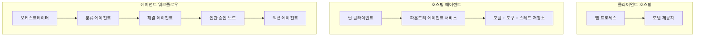
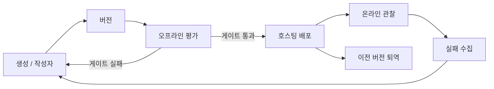
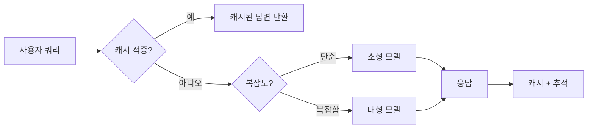
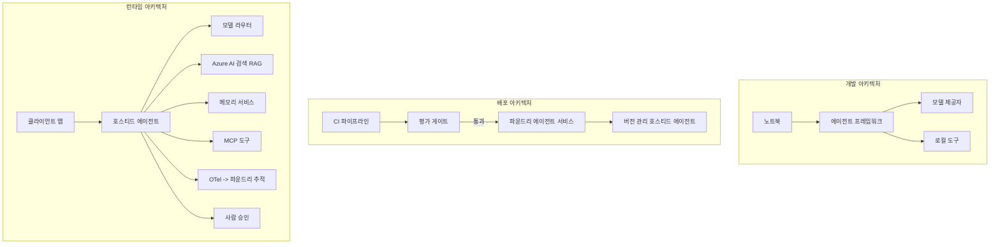

# Microsoft Foundry로 확장 가능한 에이전트 배포하기


이 과정의 지금까지는 노트북 내에서 실행되며 `az login`과 몇 가지 환경 변수로 구동되는 에이전트를 작성했습니다. 이는 학습하기에 아주 적절한 방법이지만, 수천 명의 고객이 새벽 3시에 의존하는 에이전트를 운영하는 데는 적합하지 않습니다.

이 강의는 "내 환경에서는 작동하는데"에서 "프로덕션 환경에서 신뢰할 수 있고 비용 효율적으로 작동하는" 사이의 간극을 다룹니다. 우리는 <strong>Microsoft Foundry</strong>와 <strong>Microsoft Foundry Agent Service</strong>를 사용하여 이 간극을 메우고, 도구, 검색, 메모리, 평가 및 모니터링을 갖춘 실제 고객 지원 에이전트를 구축합니다.

## 소개

이 강의에서는 다음을 다룹니다:

- <strong>프로토타입 에이전트</strong>와 **배포된 에이전트** 사이의 차이점과 전환이 주로 모델 <em>주변의 모든 것</em>에 관한 이유.
- 에이전트의 **배포 패턴**: 클라이언트 호스팅, 서비스 호스팅(호스트된 에이전트), 그리고 워크플로우 오케스트레이션.
- Microsoft Foundry에서의 **에이전트 라이프사이클** — 생성, 버전 관리, 배포, 평가, 관찰, 폐기.
- **확장 전략**: 모델 라우팅, 캐싱, 동시성 그리고 무상태 설계.
- OpenTelemetry 및 Foundry 추적을 통한 **관측 가능성**.
- 모델 선택, 라우팅, 평가 게이트를 통한 **비용 최적화**.
- **기업 환경 고려사항**: 거버넌스, 사람 승인, 그리고 MCP 서버의 프로덕션 안전 실행.

## 학습 목표

이 강의를 마치면 다음을 알게 됩니다:

- 특정 에이전트 워크로드에 적합한 배포 패턴 선택하기.
- 에이전트를 Microsoft Foundry Agent Service에 배포하여 버전 관리, 거버넌스, 관측 가능성 확보하기.
- 추적용으로 에이전트를 계측하고, 매 릴리스 전에 실행되는 평가 파이프라인 연결하기.
- 확장 시 지연 시간과 비용 제어를 위해 모델 라우팅과 캐싱 적용하기.
- 고위험 작업에 대한 사람 승인 게이트 추가 및 프로덕션 안전 방식으로 MCP 서버 통합.

## 사전 준비 사항

이 강의는 이전 강의들을 완료하고 다음에 익숙함을 전제로 합니다:

- [Microsoft Agent Framework](../14-microsoft-agent-framework/README.md)로 에이전트 빌드 (14강).
- [도구 사용법](../04-tool-use/README.md) (4강) 및 [Agentic RAG](../05-agentic-rag/README.md) (5강).
- [에이전트 메모리](../13-agent-memory/README.md) (13강)와 [Agentic Protocols / MCP](../11-agentic-protocols/README.md) (11강).
- [관측 가능성 및 평가](../10-ai-agents-production/README.md) (10강) — 이 강의는 이 내용을 직접 확장합니다.

또한 다음이 필요합니다:

- <strong>Azure 구독</strong>과 최소 하나의 배포된 채팅 모델이 포함된 **Microsoft Foundry 프로젝트**.
- 인증된 **Azure CLI** (`az login`).
- Python 3.12+ 및 저장소의 [`requirements.txt`](../../../requirements.txt) 패키지.

## 프로토타입에서 프로덕션으로: 실제로 무엇이 변하는가

프로토타입 에이전트와 프로덕션 에이전트는 동일한 핵심 루프 — 추론, 도구 호출, 응답 — 을 공유합니다. 변하는 것은 그 루프를 둘러싼 모든 것입니다. 모델은 프로덕션 에이전트의 약 20%에 불과하며, 나머지 80%는 운영 골격입니다.

| 관심사 | 프로토타입 | 프로덕션 |
| --- | --- | --- |
| <strong>호스팅</strong> | 노트북에서 실행 | 호스트된 서비스로서 버전 관리 및 롤아웃 |
| <strong>식별</strong> | 개인 `az login` 토큰 | 범위가 지정된 RBAC를 가진 관리형 아이덴티티 |
| <strong>상태</strong> | 메모리 내, 재시작 시 손실 | 외부화(스레드 저장소, 메모리 서비스) |
| <strong>실패</strong> | 추적 스택 출력 표시 | 재시도, 대체 경로, 데드레터, 경고 |
| <strong>비용</strong> | “몇 센트 정도” | 요청별 추적, 라우팅, 캐싱, 예산 관리 |
| <strong>품질</strong> | 직접 눈으로 확인 | 릴리스 전 자동 평가 |
| <strong>신뢰</strong> | 매 행동 승인 | 위험 작업에 대한 정책과 사람 개입 |

이 표를 기억하세요. 아래 각 섹션은 이 표의 행 중 하나와 연결됩니다.

## 에이전트 배포 패턴

보통 조합해서 사용하는 세 가지 패턴이 있습니다.

### 1. 클라이언트 호스팅 에이전트

에이전트 객체가 <em>사용자</em> 애플리케이션 프로세스 내에 존재합니다. 코드가 모델 제공자를 직접 호출하며, 추론 루프는 서비스 내에서 실행됩니다. 이전 강의에서 모두 이렇게 했습니다.

- **사용 시점:** 루프를 완전하게 제어하거나, 맞춤 미들웨어가 필요하거나, 기존 백엔드에 에이전트를 내장할 때.
- **트레이드오프:** 확장성, 상태 관리, 복원력을 직접 담당해야 합니다.

### 2. 호스트된 에이전트 (Foundry Agent Service)

에이전트는 Microsoft Foundry 내 <em>리소스로 등록</em>됩니다. Foundry가 추론 루프를 호스팅하고, 스레드를 저장하며, 콘텐츠 안전과 RBAC를 집행하고, 에이전트를 Foundry 포털에 표시합니다. 애플리케이션은 스레드 생성과 응답 읽기만 하는 가벼운 클라이언트가 됩니다.

- **사용 시점:** 내구성, 내장 관측 가능성, 거버넌스, 그리고 적은 운영 비용 효과를 원할 때.
- **트레이드오프:** 관리형 런타임 대신 낮은 수준의 제어는 감소합니다.

### 3. 에이전트 워크플로우

여러 에이전트(및 도구)를 그래프로 조합하며 명시적 흐름 제어 — 순차 단계, 분기, 사람 승인 노드, 잠시 중단 및 재개 가능한 내구 체크포인트 — 를 포함합니다. 이 기능은 Microsoft Agent Framework의 <strong>워크플로우</strong> 기능으로 배포 규모에 적용됩니다.

- **사용 시점:** 단일 작업이 여러 전문화된 에이전트를 아우르거나 중간에 승인 단계가 필요한 경우.
- **트레이드오프:** 더 많은 구성요소; 오케스트레이션 단위 관측 가능성 필요.



## Microsoft Foundry에서의 에이전트 라이프사이클

에이전트 배포는 일회성 `푸시`가 아닙니다. 반복되는 루프이며, 소프트웨어 릴리스 사이클과 매우 유사합니다.



[10강](../10-ai-agents-production/README.md)에서 이어받은 핵심 아이디어: **오프라인 평가는 단순 부수적 활동이 아니라 게이트입니다.** 새 에이전트 버전은 평가 임계치를 통과해야만 배포됩니다. 온라인 관측 가능성은 실제 실패를 오프라인 테스트 세트에 되돌려줍니다. 이것이 전체 루프입니다.

## 확장 전략

에이전트 확장은 무상태 웹 API 확장과 다릅니다. 요청마다 여러 비용 높은 모델 및 도구 호출이 발생할 수 있기 때문입니다. 네 가지 기법이 주요 부하를 담당합니다.

**무상태 요청 처리.** 각 사용자 상태를 프로세스 메모리에 저장하지 마세요. 대화 스레드는 Foundry 스레드 저장소나 메모리 서비스에 보존하여 어떤 인스턴스도 어떤 요청이나 처리할 수 있게 합니다. 이것이 수평적 확장 — 인스턴스 추가, 스티키 세션 없음 — 을 가능하게 합니다.

**모델 라우팅.** 모든 요청이 가장 강력하고 비싼 모델을 필요로 하지 않습니다. 간단한 요청 — 의도 분류, 짧은 사실 답변 — 은 작고 빠른 모델로 처리하고, 진짜 추론에는 큰 모델을 예약하세요. Foundry의 <strong>모델 라우터</strong>가 이 작업을 도와주며, 직접 가벼운 분류기를 구현할 수도 있습니다. 실습에서 직접 만들어 봅니다.

**응답 캐싱.** 많은 지원 질문은 중복에 가깝습니다 (“비밀번호를 어떻게 재설정하나요?”). 자주 묻는 질문 답변을 캐시하여 모델 호출 없이 제공합니다. 적절한 캐시 적중률만으로도 비용과 지연 시간을 크게 줄일 수 있습니다.

**동시성 관리 및 백프레셔.** 모델 제공자는 속도 제한이 있습니다. 동시성 제한, 지수 백오프 재시도, 우아한 실패 처리(큐에 저장된 “처리 중” 응답이 500 오류보다 낫습니다)를 사용하세요.



## 프로덕션에서의 관측 가능성

볼 수 없는 것은 운영할 수 없습니다. 10강에서 다룬 바와 같이, Microsoft Agent Framework는 기본적으로 **OpenTelemetry** 트레이스를 생성합니다 — 모든 모델 호출, 도구 실행, 오케스트레이션 단계가 스팬이 됩니다. 프로덕션에서는 이 스팬을 Microsoft Foundry(또는 OTel 호환 백엔드)로 내보내 다음을 할 수 있습니다:

- 단일 고객 불만을 모든 모델과 도구 호출을 넘어 끝까지 추적하기.
- 시간에 따른 p50/p95 지연 시간과 요청당 비용 모니터링.
- 에러율 급증 및 비용 이상 징후를 사용자(또는 재무팀)보다 먼저 알림.

```python
from agent_framework.observability import get_tracer

tracer = get_tracer()

with tracer.start_as_current_span("support_request") as span:
    span.set_attribute("customer.tier", "enterprise")
    span.set_attribute("routed.model", "gpt-5-nano")
    # 에이전트 실행이 이 범위 내에서 자동으로 추적됩니다
```

`customer.tier`와 `routed.model` 같은 속성은 수많은 추적을 응답 가능한 질문으로 바꾸는 데 도움을 줍니다 (“엔터프라이즈 고객이 너무 자주 작은 모델에 라우팅되고 있나요?”).

## 비용 최적화

프로덕션 에이전트 비용은 토큰 사용이 지배적입니다. 세 가지 조작 레버 — 영향력 순:

1. **모델 크기 최적화.** 평가 게이트를 통과하는 작은 모델은 거의 항상 큰 모델보다 저렴합니다. 평가를 통해 작은 모델이 충분하다는 것을 증명하고, 조심스럽게 가장 큰 모델을 기본으로 선택하는 것을 피하세요.
2. **복잡도에 따른 라우팅.** 위와 같이, 큰 모델 추론이 필요한 요청에만 비용을 지불하세요.
3. **공격적 캐싱.** 가장 저렴한 모델 호출은 할 필요가 없는 호출입니다.

평가 게이트와 비용 관리는 두 가지 관점으로 본 같은 규율입니다: 평가는 <em>품질 바닥</em>을 알려주고, 라우팅과 캐싱은 그 바닥 비용에 최대한 가깝게 유지합니다.

## 기업용 배포 고려사항

**거버넌스.** 호스트된 에이전트는 Foundry의 RBAC, 콘텐츠 안전, 감사 로깅을 상속받습니다. 각 에이전트에 필요한 최소 권한만 부여하는 관리형 아이덴티티 — 지식 베이스에 대한 읽기 전용, 티켓팅 API에 대한 범위 제한 접근 정도 — 만 부여하세요.

**사람 개입.** 환불 발행, 계정 삭제, 법무팀으로의 에스컬레이션 등 즉각 자동화하기 어려운 작업이 있습니다. Microsoft Agent Framework는 **승인 필요** 도구를 지원합니다: 에이전트가 작업을 제안하면 실행이 일시 중단되고, 인간이 승인하거나 거부한 후에 워크플로우가 재개됩니다. 6강에서 원시 기능을 보셨고, 여기서 이를 배포합니다.

**프로덕션에서 MCP.** [MCP](../11-agentic-protocols/README.md)는 표준화된 인터페이스를 통해 외부 도구를 소비하도록 에이전트를 허용합니다. 프로덕션 환경에서는 모든 MCP 서버를 신뢰할 수 없는 경계로 취급하세요: 서버 버전을 고정하고, 범위 제한된 아이덴티티로 실행하며, 출력 결과를 검증하고, 비밀을 절대 노출하지 마세요. MCP 서버는 의존성이며, 의존성은 패치되고, 감사받으며, 속도 제한 대상입니다.



세 가지 다이어그램 — 개발, 배포, 런타임 — 은 같은 에이전트의 세 생애 주기 단계입니다. 이어지는 실습에서 직접 구축해 봅니다.

## 실습 실습: 프로덕션 준비 완료 고객 지원 에이전트

[`code_samples/16-python-agent-framework.ipynb`](./code_samples/16-python-agent-framework.ipynb) 노트북을 열고 처음부터 끝까지 진행하세요. 모든 프로덕션 고려사항을 연결한 <strong>Contoso 고객 지원 에이전트</strong>를 조립합니다:

1. **도구 호출** — 주문 상태 조회 및 지원 티켓 오픈.
2. **RAG** — 지식 베이스(Azure AI Search, 그리고 Search 리소스 없이 노트북 실행을 위한 메모리 폴백)를 통한 정책 질문 응답.
3. <strong>메모리</strong> — 대화 내내 고객 기억.
4. **모델 라우팅** — 복잡도 분류기가 요청을 작은 모델 또는 큰 모델로 라우팅.
5. **응답 캐싱** — 반복 질문은 캐시에서 제공.
6. **사람 승인** — 특정 기준 이상의 환불에 대해 사람 승인을 일시 중단.
7. **평가 파이프라인** — 작은 오프라인 테스트 세트로 에이전트 점수화 및 출시 게이트 역할.
8. **관측 가능성** — 모든 요청에 OpenTelemetry 추적 포함.

### 진행 방법

노트북은 각 프로덕션 요구사항이 독립적이고 실행 가능한 섹션으로 구성되어 있습니다. 핵심은 라우팅과 캐싱이 결합된 요청 처리기입니다:

```python
async def handle_support_request(query: str, customer_id: str) -> str:
    # 1. 가능한 경우 캐시에서 제공.
    cached = response_cache.get(normalize(query))
    if cached:
        return cached

    # 2. 비용 관리를 위해 복잡도에 따라 라우팅.
    model = "gpt-5-nano" if is_simple(query) else "gpt-5-mini"

    # 3. 관측성을 위해 추적 스팬 내에서 에이전트 실행.
    with tracer.start_as_current_span("support_request") as span:
        span.set_attribute("routed.model", model)
        span.set_attribute("customer.id", customer_id)
        response = await support_agent.run(query, model=model)

    # 4. 캐시하고 반환.
    response_cache.set(normalize(query), response.text)
    return response.text
```

출시를 지키는 평가 게이트는 다음과 같습니다:

```python
async def evaluation_gate(agent, test_cases, threshold: float = 0.8) -> bool:
    passed = 0
    for case in test_cases:
        result = await agent.run(case["input"])
        if score_response(result.text, case["expected"]) >= 0.8:
            passed += 1
    pass_rate = passed / len(test_cases)
    print(f"Evaluation pass rate: {pass_rate:.0%} (gate: {threshold:.0%})")
    return pass_rate >= threshold  # 게이트가 통과될 경우에만 배포합니다
```

각 줄을 읽어보세요 — 노트북은 프리미티브를 작게 유지하여 프레임워크 호출 뒤에 숨겨진 내용이 없습니다.

## 배포된 에이전트에 대한 스모크 테스트 검증

위의 평가 게이트는 에이전트 객체에 대해 <em>오프라인</em>으로 실행됩니다. 호스트된 에이전트로 배포된 후에는 하나 더, 훨씬 가벼운 점검이 필요합니다: **배포된 엔드포인트가 실제로 응답하는가?**

"성공적" 배포는 제어 평면이 정의를 수락했다는 것만 증명하며, 에이전트가 응답한다는 보증은 아닙니다. 누락된 의존성, 잘못된 모델 라우팅, 또는 만료된 연결은 응답 없는 초록색 배포를 초래할 수 있습니다. <strong>스모크 테스트</strong>는 매 배포 시 몇 초 내에 이를 포착하며, 완전한 평가 비용 없이 확인할 수 있습니다.

이 저장소는 [AI Smoke Test](https://github.com/marketplace/actions/ai-smoke-test) GitHub Action을 기반으로 한 즉시 사용 가능한 스모크 테스트 파이프라인을 제공합니다:

- <strong>카탈로그</strong> — [`tests/lesson-16-smoke-tests.json`](../../../tests/lesson-16-smoke-tests.json) 은 Contoso 지원 에이전트용 프롬프트와 검증 기준(근거 있는 정책 답변, 주문 조회, 주제 유지, 다중 대화 흐름 연속성)을 포함합니다. 다른 강의용 에이전트 카탈로그도 함께 저장됩니다 — [`tests/README.md`](../tests/README.md) 참조.
- <strong>워크플로우</strong> — [`.github/workflows/smoke-test.yml`](../../../.github/workflows/smoke-test.yml) 은 Azure OIDC로 로그인하고 각 프롬프트를 에이전트의 Responses 엔드포인트로 POST하며, 모든 검증 실패 시 작업을 실패 처리합니다.

```yaml
- name: Smoke-test hosted agent
  uses: JFolberth/ai-smoketest@v1
  with:
    project_endpoint: ${{ inputs.project_endpoint }}
    agent_name: ContosoSupportAgent
    tests_file: tests/lesson-16-smoke-tests.json
```


에이전트가 배포되면 **Actions** 탭에서 실행하고 Foundry 프로젝트 엔드포인트와 에이전트 이름을 제공합니다. 페더레이션된 ID는 Foundry 프로젝트 범위에서 **Azure AI User** 역할이 필요합니다. 계층을 피라미드로 생각하세요: 스모크 테스트(연결 가능하고 응답 중인가?)는 배포 시마다 실행되고, 오프라인 평가(출시할 만큼 충분한가?)는 승격 전에 실행되며, 온라인 평가(실제 환경에서 어떻게 작동하는가?)는 지속적으로 실행됩니다.

## 지식 확인

과제로 넘어가기 전에 이해도를 테스트하세요.

**1. 실제 운영 에이전트에서 "모델"이 차지하는 대략적인 비율은 얼마이며 나머지는 무엇인가요?**

<details>
<summary>답변</summary>

모델은 시스템에서 소수에 해당하며 대략 20% 정도로 자주 인용됩니다. 나머지는 운영 골격으로서 호스팅 및 버전 관리, 신원 및 RBAC, 외부 상태, 장애 처리, 비용 추적, 평가, 인간 개입 제어 등을 포함합니다. 운영 환경으로 전환하는 것은 주로 추론 루프 <em>주변</em>의 모든 것을 구축하는 것입니다.
</details>

**2. 클라이언트 호스팅 에이전트보다 호스티드 에이전트를 선택하는 경우는 언제인가요?**

<details>
<summary>답변</summary>

내구성(재개 가능한 지속 스레드), 관측 가능성, 콘텐츠 안전, RBAC가 내장된 관리형 런타임을 원하고, 추론 루프의 저수준 제어 일부를 포기해서라도 운영 범위를 줄이고자 할 때입니다. 반면 루프에 대한 완전한 제어가 필요하거나 기존 백엔드에 에이전트를 임베드할 때는 클라이언트 호스팅이 더 적합합니다.
</details>

**3. 확장이 가능한 에이전트가 자체 프로세스 메모리에서 상태 비저장이어야 하는 이유는 무엇인가요?**

<details>
<summary>답변</summary>

어떤 인스턴스든 임의 요청을 처리할 수 있기 때문에 수평 확장이 스티키 세션 없이 가능합니다. 사용자별 대화 상태는 스레드 스토어나 메모리 서비스로 외부화됩니다. 상태가 프로세스 메모리에 있으면 재시작 시 손실되고 부하 분산도 자유롭지 못합니다.
</details>

**4. 모델 라우팅이 해결하는 문제는 무엇이며, 평가와는 어떻게 연결되나요?**

<details>
<summary>답변</summary>

라우팅은 간단한 요청을 작고 저렴하며 빠른 모델로 보내고, 큰 모델은 진짜 추론에 예약하여 지연 시간과 비용을 제어합니다. 이는 평가와 연결되는데, 평가는 작은 모델이 특정 요청 클래스에 충분히 좋은지 <em>증명</em>하는 역할을 하며 평가 없는 라우팅은 추측입니다.
</details>

**5. "평가 게이트"란 무엇이며 생명주기 어디에 위치하나요?**

<details>
<summary>답변</summary>

평가 게이트는 새로운 에이전트 버전에 대해 오프라인 테스트 세트를 실행하고 통과율이 임계값을 넘지 않으면 배포를 차단합니다. 생명주기에서 "버전"과 "배포" 사이에 위치하여 품질을 릴리스의 전제 조건으로 만듭니다.
</details>

**6. MCP 서버를 운영 환경에서 신뢰할 수 없는 경계로 다뤄야 하는 이유는?**

<details>
<summary>답변</summary>

에이전트가 호출하는 외부 의존성이기 때문입니다. 버전을 고정하고 범위 지정된 신원으로 실행하며 출력값을 검증하고 속도 제한을 걸고 비밀 정보를 절대 노출하지 않는 등 모든 서드파티 의존성에 적용하는 규율을 적용해야 합니다. 출력은 에이전트 추론에 반영되므로 검증 없는 신뢰는 보안 위험입니다.
</details>

**7. 일반적으로 운영 에이전트 비용에 가장 큰 영향을 미치는 단일 변경 사항은 무엇이고, 그 이유는?**

<details>
<summary>답변</summary>

적절한 크기의 모델 선택 — 평가 게이트를 통과하는 가장 작은 모델을 사용하는 것. 비용은 토큰에 지배적이며 질적 기준을 충족하는 작은 모델이 대체로 더 큰 모델보다 저렴합니다. 캐싱과 라우팅은 비용을 더 줄이지만 올바른 기본 모델을 선택하는 것이 가장 큰 1차 영향입니다.
</details>

**8. `customer.tier`와 `routed.model` 같은 스팬 속성은 관측성에서 어떤 역할을 하나요?**

<details>
<summary>답변</summary>

원시 트레이스를 답변 가능한 비즈니스 질문으로 전환합니다. 속성이 없으면 스팬 벽만 있고, 속성이 있으면 "기업 고객이 너무 자주 작은 모델로 라우팅되고 있는가?" 또는 "어떤 모델이 가장 느린 요청을 처리하는가?" 같은 질문이 가능합니다. 속성은 운영에 중요한 차원별로 원격 측정을 분할하는 방법입니다.
</details>

## 과제

실습에서 만든 고객 지원 에이전트를 특정 시나리오에 맞게 강화하세요: <strong>SaaS 회사의 구독 청구 지원 에이전트</strong>입니다.

제출물은 다음을 포함해야 합니다:

1. 청구 관련 도구인 `get_subscription_status`, `get_invoice`, `issue_credit` (50달러 초과 크레딧은 인간 승인 필요)로 **도구 교체**.
2. 회사의 환불 정책, 청구 주기, 취소 정책을 다루는 세 개의 RAG 문서 추가.
3. 평가 세트를 최소 8건으로 확장하되, 적어도 두 건은 인간 승인 경로를 *트리거해야 하며*, 평가 게이트가 올바르게 합격 또는 불합격하는지 확인.
4. 비용 보고서 1개: 에이전트에 10개의 혼합 쿼리를 실행한 후 작은 모델에 간 쿼리 수, 큰 모델에 간 쿼리 수, 캐시에서 처리된 쿼리 수 출력.

짧은 문단(markdown 셀)에 어느 모델 라우팅 규칙을 선택했는지 그리고 실제 트래픽으로 어떻게 검증할지 설명하세요. 정답은 없으며 운영상의 관심사가 일관되게 연결되었는지 평가합니다.

## 요약

본 강의에서는 Microsoft Foundry로 에이전트를 프로토타입에서 운영 환경으로 이전했습니다:

- 운영 전환은 주로 **모델 주변의 운영 골격** — 호스팅, 신원, 상태, 장애 처리, 비용, 품질, 신뢰입니다.
- 세 가지 **배포 패턴** — 클라이언트 호스팅, 호스티드 에이전트, 에이전트 워크플로우 — 와 각각이 적합한 경우를 배웠습니다.
- 에이전트 <strong>생명주기</strong>를 거치며 오프라인 <strong>평가가 릴리스 게이트 역할</strong>을 하고 온라인 관측성이 장애를 테스트 세트로 피드백합니다.
- **확장 전략** — 상태 비저장 설계, 모델 라우팅, 캐싱, 제한된 동시성 — 을 적용하고 이를 <strong>비용 최적화</strong>와 연결했습니다.
- **기업 제어 기능**: RBAC, 인간 승인, 운영 안전 MCP 통합을 연결했습니다.
- 모든 관심사를 실행 가능한 코드로 연결한 <strong>운영 준비된 고객 지원 에이전트</strong>를 구축했습니다.

다음 강의는 반대 여정을 다룹니다: 클라우드로 확장하는 대신 <em>단일 개발자 머신</em>으로 내려와 완전히 로컬에서 실행하는 법을 배웁니다.

## 추가 자료

- <a href="https://learn.microsoft.com/azure/ai-foundry/what-is-azure-ai-foundry" target="_blank">Microsoft Foundry 문서</a>
- <a href="https://learn.microsoft.com/azure/ai-foundry/agents/overview" target="_blank">Microsoft Foundry 에이전트 서비스 개요</a>
- <a href="https://learn.microsoft.com/en-us/agent-framework/overview/?wt.mc_id=youtube_26688_organicsocial_reactor&pivots=programming-language-python" target="_blank">Microsoft Agent Framework</a>
- <a href="https://learn.microsoft.com/azure/ai-foundry/concepts/model-router" target="_blank">Microsoft Foundry의 모델 라우터</a>
- <a href="https://learn.microsoft.com/azure/search/search-what-is-azure-search" target="_blank">Azure AI Search</a>
- <a href="https://opentelemetry.io/" target="_blank">OpenTelemetry</a>
- <a href="https://github.com/marketplace/actions/ai-smoke-test" target="_blank">AI Smoke Test GitHub 액션</a>
- <a href="https://modelcontextprotocol.io/" target="_blank">Model Context Protocol (MCP)</a>

## 이전 강의

[컴퓨터 사용 에이전트 구축(CUA)](../15-browser-use/README.md)

## 다음 강의

[로컬 AI 에이전트 생성](../17-creating-local-ai-agents/README.md)

---

<!-- CO-OP TRANSLATOR DISCLAIMER START -->
**면책 조항**:
이 문서는 AI 번역 서비스 [Co-op Translator](https://github.com/Azure/co-op-translator)를 사용하여 번역되었습니다. 정확성을 기하기 위해 노력하고 있으나, 자동 번역은 오류나 부정확한 부분이 있을 수 있음을 유의하시기 바랍니다. 원본 문서의 원어본이 권위 있는 자료로 간주되어야 합니다. 중요한 정보의 경우, 전문가의 인간 번역을 권장합니다. 이 번역 사용으로 인해 발생하는 오해나 잘못된 해석에 대해 당사는 책임을 지지 않습니다.
<!-- CO-OP TRANSLATOR DISCLAIMER END -->