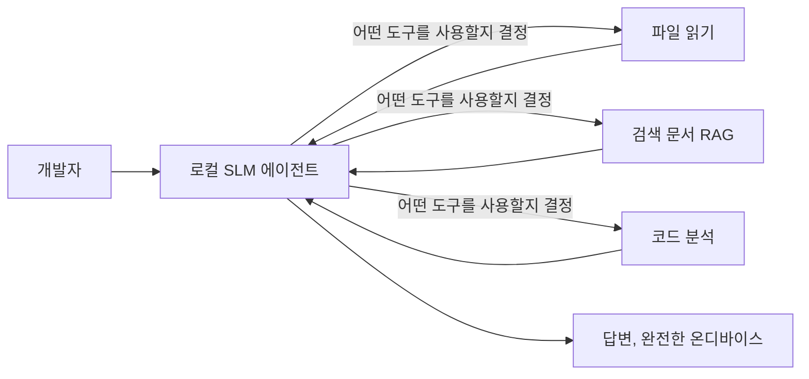
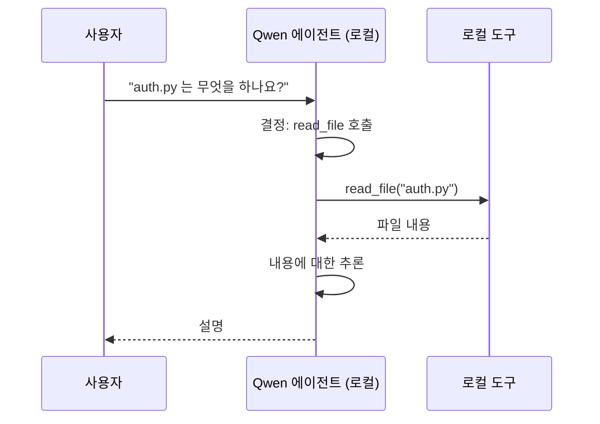
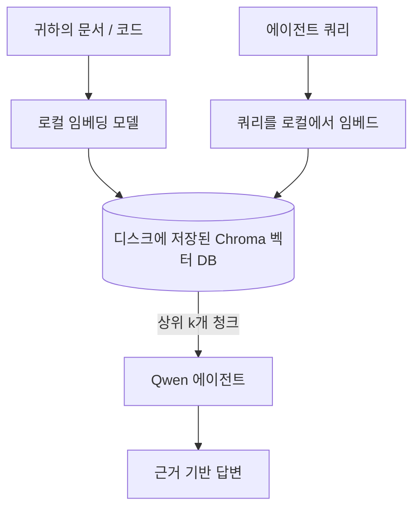

# Microsoft Foundry Local 및 Qwen을 사용한 로컬 AI 에이전트 생성


이전 수업에서는 에이전트를 클라우드로 <em>확장</em>했습니다. 이번 수업에서는 에이전트를 단일 머신으로 <em>내려옵니다</em>. 수업이 끝날 때쯤이면, 추론 호출이 단 한 번도 없는 상태에서 추론하고, 도구를 호출하고, 파일을 읽고, 문서를 검색하는 작동하는 엔지니어링 어시스턴트를 갖게 됩니다 — **단 한 번의 클라우드 추론 호출도 없이.**

왜 그럴 필요가 있을까요? 실제 엔지니어링 업무에서 자주 거론되는 세 가지 이유가 있습니다:

- **프라이버시.** 코드와 문서는 기계를 벗어나지 않습니다. 네트워크 경계를 넘는 프롬프트, 스니펫, 고객 데이터가 전혀 없습니다.
- **비용.** 로컬 추론에는 토큰당 요금이 없습니다. 전기세만 내면서 하루 종일 반복할 수 있습니다.
- **오프라인.** 비행기, 보안 시설, 혹은 장애 시에도 에이전트는 작동합니다.

단점은, 최신 클라우드 모델 대신 CPU, GPU 또는 NPU에서 실행되는 <strong>소형 언어 모델(SLM)</strong>을 사용한다는 점입니다. 이번 수업은 제약 조건을 무시하고 흉내 내는 것이 아니라, 그 제약 내에서 *잘 작동하는* 에이전트를 만드는 방법에 관한 것입니다.

## 소개

이 수업에서는 다음을 다룹니다:

- **소형 언어 모델(SLMs)** — 무엇인지, 어디에서 강하고, 어디에서 약한지.
- **Microsoft Foundry Local** — 기기 내에서 모델을 다운로드하고 제공하는 런타임이며, <strong>OpenAI 호환 API</strong>를 제공합니다.
- **Qwen 함수 호출 모델** — 도구 호출을 신뢰성 있게 생성하는 SLM으로, 로컬 <em>에이전트</em>(단순 로컬 채팅이 아님)를 가능하게 합니다.
- **로컬 도구, 로컬 RAG, 로컬 MCP** — 클라우드 없이 에이전트 기능을 제공합니다.
- **하이브리드 패턴** — 언제 로컬에 머물고 언제 클라우드를 이용할지.

## 학습 목표

이 수업을 마치면 다음을 알 수 있습니다:

- SLM의 트레이드오프를 설명하고 적절한 로컬 에이전트 사용 사례를 선택할 수 있습니다.
- Foundry Local로 Qwen 모델을 로컬에서 제공하고 OpenAI 호환 엔드포인트를 통해 연결할 수 있습니다.
- 완전히 워크스테이션에서 실행되는 도구 호출 에이전트를 구축할 수 있습니다.
- 로컬 벡터 데이터베이스(Chroma)를 사용해 문서 위에 로컬 RAG를 추가할 수 있습니다.
- 에이전트를 로컬 MCP 서버에 연결하고 하이브리드 로컬/클라우드 설계를 이해할 수 있습니다.

## 필수 조건

이 수업은 이전 수업을 완료하고 다음에 익숙하다고 가정합니다:

- [도구 사용](../04-tool-use/README.md) (수업 4) 및 [Agentic RAG](../05-agentic-rag/README.md) (수업 5).
- [Agentic 프로토콜 / MCP](../11-agentic-protocols/README.md) (수업 11).
- [Microsoft Agent Framework](../14-microsoft-agent-framework/README.md) (수업 14).

다음도 필요합니다:

- 개발자 워크스테이션. **8 GB RAM이 현실적 최소한의 용량이고**, 16 GB 이상이 쾌적합니다. GPU 또는 NPU가 있으면 좋지만 필수는 아닙니다.
- **Microsoft Foundry Local** 설치 (아래 설정 섹션 참조).
- Python 3.12 이상 및 저장소 [`requirements.txt`](../../../requirements.txt)에 명시된 패키지와 이번 수업용으로 `foundry-local-sdk`, `openai`, `chromadb`.

## 소형 언어 모델: 로컬 작업에 적합한 도구

최신 클라우드 모델은 수백억 개 매개변수를 가지고 데이터 센터 뒤에 있지만, SLM은 수십억 개 규모로 노트북 RAM에 맞춰야 합니다. 이 차이가 명확한 기대치를 설정합니다.

**SLM의 장점은:**

- 구조화되고 한정적인 작업 — 분류, 추출, 알려진 문서 요약.
- **도구 호출** — 어떤 함수와 인수로 호출할지 결정.
- 빠르고 저렴하며 프라이빗한 자기 데이터 반복 작업.

**SLM의 약점은:**

- 무제한 다중 단계 추론.
- 광범위한 세계 지식 (데이터량은 적고 망각은 많음).

로컬 에이전트의 최선 전략은: <strong>SLM은 조율하고 도구에 중대한 작업을 맡기는 것</strong>입니다. 모델이 코드베이스를 <em>알 필요</em>는 없지만, `read_file`과 `search_docs`를 언제 호출해야 하는지는 알아야 합니다. 이것이 SLM의 강점을 살리는 방식입니다.



## Microsoft Foundry Local

<strong>Microsoft Foundry Local</strong>은 가볍고 완전히 내 기계에서 모델을 다운로드, 관리, 서빙하는 런타임입니다. 가장 중요한 특징은 <strong>OpenAI 호환 HTTP 엔드포인트</strong>를 노출한다는 점입니다 — 즉, OpenAI SDK와 Microsoft Agent Framework의 OpenAI 클라이언트를 `base_url`만 바꾸면 사용할 수 있습니다. 에이전트를 만드는 모든 지식이 그대로 전이됩니다; 엔드포인트만 클라우드에서 `localhost`로 이동합니다.

Foundry Local은 하드웨어에 따라 최적의 모델 빌드(CPU, CUDA/GPU, NPU)를 자동으로 선택하므로 기계별로 최적화할 필요가 없습니다.

### 설정

Foundry Local을 설치하세요 (OS에 맞는 [문서](https://learn.microsoft.com/azure/ai-foundry/foundry-local/) 참고), 그리고 작동을 확인합니다:

```bash
# 설치 (예: 사용 중인 플랫폼의 문서를 따르세요)
winget install Microsoft.FoundryLocal      # 윈도우
# brew install microsoft/foundrylocal/foundrylocal   # macOS

# Qwen 모델을 다운로드하고 실행한 후 로컬 서비스를 시작하세요
foundry model run qwen2.5-7b-instruct
foundry service status
```

서비스가 실행되면 로컬, OpenAI 호환 엔드포인트(`http://localhost:PORT/v1` 보통)를 가지게 됩니다. 노트북은 `foundry-local-sdk`를 사용하여 엔드포인트를 자동으로 찾아 포트를 하드코딩할 필요가 없습니다.

## Qwen 함수 호출: 왜 중요한가

에이전트는 도구를 호출할 수 있을 때만 진정한 에이전트입니다. 많은 SLM은 채팅은 가능하지만 불안정하고 형식이 잘못된 도구 호출을 만듭니다. **Qwen** 모델은 함수 호출을 위해 훈련되어 도구 호출 구조를 항상 잘 형성하여 출력하므로, 로컬 채팅 모델로부터 로컬 <em>에이전트</em>가 탄생합니다.

흐름은 이미 아는 표준 도구 호출 루프와 같지만, 기기 내에서 실행됩니다:



## 로컬 RAG

문서 검색은 로컬 에이전트가 제 값을 하는 부분입니다. SLM이 프레임워크 문서를 외워두기를 기대하는 대신, 문서를 <strong>로컬 벡터 데이터베이스</strong>에 임베딩하여 에이전트가 관련 청크를 필요할 때마다 찾도록 합니다.

<strong>Chroma</strong>를 사용합니다. 이는 관리할 서버가 없는 인프로세스 임베딩 벡터 스토어입니다. 파이프라인은 완전히 로컬에서 이뤄집니다: 로컬 임베딩 모델 → 로컬 벡터 → 로컬 검색 → 로컬 SLM.



이는 수업 5의 Agentic RAG 패턴과 동일하며, 유일한 차이는 모든 구성요소가 내 기계에서 실행되는 점입니다.

## 로컬 MCP 서버

[MCP](../11-agentic-protocols/README.md)는 클라우드 서비스가 아닌 전송 프로토콜입니다. MCP 서버는 `stdio`에서 로컬 프로세스로 실행할 수 있으며, 표준 프로토콜을 통해 에이전트에 도구를 노출합니다. 이로써 파일 시스템 접근, git 작업, 데이터베이스 쿼리 등 점점 커지는 MCP 서버 생태계를 완전히 오프라인 상태에서 재사용할 수 있습니다.

보안 태세는 클라우드와 다르지만 없거나 무시해도 좋다는 뜻은 아닙니다: 로컬 MCP 서버는 사용자 권한으로 실행되므로, 접근 범위를 제한(예: 프로젝트 디렉터리만, 전체 홈 폴더는 아님)하고 출력 결과를 입력으로 검증하는 절차를 거치세요.

## 하이브리드 클라우드-로컬 패턴

로컬 우선은 로컬 전용을 의미하지 않습니다. 성숙한 시스템에서는 민감성과 난이도에 따라 경로를 지정합니다:

| 상황 | 실행 위치 |
| --- | --- |
| 민감한 코드/데이터, 또는 오프라인 | **로컬 SLM** |
| 단순 한정 작업 | **로컬 SLM** (저렴하고 빠름) |
| 민감하지 않은 데이터에 대한 복잡한 다중 단계 추론 | **클라우드 모델** |
| 장애 시 모든 작업 | **로컬 SLM** (우아한 감쇄) |

이는 수업 16의 **모델 라우팅** 개념과 일치하며, 단 하나의 "모델"이 내 기계가 된 점만 다릅니다. 견고한 설계는 클라우드를 사용할 수 없을 때 로컬로 대체하여 에이전트가 완전히 실패하지 않고 품질이 점진적으로 낮아지게 합니다.


## 실습: 로컬 엔지니어링 어시스턴트

[`code_samples/17-local-agent-foundry-local.ipynb`](./code_samples/17-local-agent-foundry-local.ipynb)를 열고 진행하세요. 다음을 모두 수행하는 <strong>로컬 엔지니어링 어시스턴트</strong>를 만들 것입니다:

1. **도구 호출** — Foundry Local을 통한 Qwen 함수 호출로.
2. **로컬 파일 작업 수행** — 프로젝트 디렉터리 내 파일 목록 표시 및 읽기.
3. **코드 분석** — 소스 파일에 대한 기본 메트릭 보고.
4. **문서 검색** — Chroma를 이용해 문서 폴더에 대해 로컬 RAG.
5. **MCP 사용** — 로컬 MCP 서버에 연결 (설정되지 않은 경우 우아하게 건너뜀).

어떤 지점에서도 클라우드 추론 호출은 사용하지 않습니다.

### 진행 과정

어시스턴트는 OpenAI 호환 엔드포인트를 통해 Foundry Local에 연결하므로 에이전트 코드는 클라우드 수업과 거의 같으며, 클라이언트만 다릅니다:

```python
from foundry_local import FoundryLocalManager
from openai import OpenAI

# Foundry Local은 모델을 발견/다운로드하고 로컬 엔드포인트를 제공합니다.
manager = FoundryLocalManager(\"qwen2.5-7b-instruct\")
client = OpenAI(base_url=manager.endpoint, api_key=manager.api_key)  # api_key는 로컬 자리 표시자입니다.
```

도구는 프로젝트 디렉터리에 한정된 일반 Python 함수입니다:

```python
def read_file(path: str) -> str:
    \"\"\"Read a file, but only inside the sandboxed project directory.\"\"\"
    full = (PROJECT_ROOT / path).resolve()
    if PROJECT_ROOT not in full.parents and full != PROJECT_ROOT:
        return \"Access denied: path is outside the project directory.\"
    return full.read_text(encoding=\"utf-8\")
```

샌드박스 검사를 주목하세요 — 심지어 로컬이라도 임의 경로를 읽는 도구는 위험합니다. 노트북은 모든 도구를 단일 프로젝트 루트에 한정합니다.

## 지식 점검

과제로 넘어가기 전에 이해도를 시험해보세요.

**1. 에이전트를 클라우드가 아닌 로컬로 실행하는 구체적인 두 가지 이유를 말하세요.**

<details>
<summary>정답</summary>

다음 중 두 가지: <strong>프라이버시</strong> (코드와 데이터가 기계를 벗어나지 않음), <strong>비용</strong> (토큰당 추론 요금 없음), **오프라인 사용 가능** (네트워크 없이 작동 — 비행기, 보안 시설, 장애 시). 데이터가 기기를 벗어나지 못하도록 하는 규제 및 준수 제약이 프라이버시 이유의 일반적인 원인입니다.
</details>

**2. 로컬 에이전트에서 SLM과 도구 사이 추천 작업 분담은 무엇이며 그 이유는?**

<details>
<summary>정답</summary>

SLM은 <strong>조율</strong>하고 (어떤 도구를 어떤 인수로 호출할지 결정), 도구가 <strong>중요 작업</strong>을 수행하게 합니다 (파일 읽기, 문서 검색, 결과 계산). SLM은 도구 선택 같은 한정된 의사결정에 강하지만 광범위한 지식과 다단계 추론엔 약하므로 도구에 의존하는 편이 강점을 살리는 방법입니다.
</details>

**3. Foundry Local로 클라우드 에이전트 코드를 재사용할 수 있는 이유는?**

<details>
<summary>정답</summary>

Foundry Local은 <strong>OpenAI 호환 HTTP 엔드포인트</strong>를 노출합니다. OpenAI SDK와 Agent Framework OpenAI 클라이언트는 `base_url`만 바꾸고(지역의 가짜 API 키 사용) 이를 사용 가능합니다. 에이전트 코드의 나머지는 그대로 유지됩니다.
</details>

**4. 왜 SLM 중에서 아무 모델이 아니라 Qwen 함수 호출 모델을 사용하는가?**

<details>
<summary>정답</summary>

에이전트는 신뢰성 있고 잘 형성된 <strong>도구 호출</strong>을 생성해야 합니다. 많은 SLM이 채팅은 가능하지만 형식이 잘못되거나 불일치하는 도구 호출을 생성합니다. Qwen 모델은 함수 호출을 위해 훈련되었으며, 일관된 도구 호출을 생성하여 로컬 채팅 모델을 작동 가능한 로컬 에이전트로 만듭니다.
</details>

**5. 로컬 RAG 파이프라인에서 어떤 구성요소가 기계 내에서 실행되는가?**

<details>
<summary>정답</summary>

전부입니다: 임베딩 모델, 벡터 데이터베이스(디스크에 저장된 Chroma), 검색 단계, 그리고 SLM. 문서는 로컬에서 임베딩되고, 로컬에 저장되며, 로컬에서 검색되고, 로컬 모델이 추론합니다 — 어느 구성요소도 클라우드에 닿지 않습니다.
</details>

**6. 로컬 MCP 서버가 당신의 기계에서 실행된다고 해서 자동으로 안전한가? 어떤 예방 조치가 필요한가?**

<details>
<summary>정답</summary>

아닙니다. 로컬 MCP 서버는 사용자 권한으로 실행되어 당신이 접근할 수 있는 것은 모두 접근 가능합니다. 필요한 범위로만 제한해야 하며 (예: 전체 홈 폴더가 아닌 단일 프로젝트 디렉터리), 출력물을 다시 입력으로 검증 후 처리해야 합니다.
</details>

**7. 로컬 모델이 포함된 합리적인 하이브리드 라우팅 규칙을 설명하세요.**

<details>
<summary>정답</summary>

민감하거나 오프라인 상태의 요청은 로컬 SLM으로 라우팅하고; 단순하고 한정된 작업은 속도와 비용을 고려해 로컬 SLM으로 라우팅하며; 민감하지 않은 복잡한 다중 단계 추론은 클라우드 모델로 라우팅합니다. 클라우드가 없을 때는 로컬 SLM으로 대체하여 에이전트가 완전히 실패하지 않고 우아하게 성능이 저하되게 합니다. 이는 수업 16의 모델 라우팅과 같으나 로컬 기계가 하나의 모델인 점이 다릅니다.
</details>

**8. 이번 수업의 로컬 에이전트를 실행하는 현실적인 최소 RAM 용량은 얼마이며, 더 많은 RAM은 무엇을 가능하게 하는가?**

<details>
<summary>정답</summary>

약 <strong>8 GB</strong>가 현실적인 최소이며, 16 GB 이상이 쾌적합니다. RAM이 많으면 더 크고 강력한 모델을 실행할 수 있고, 더 많은 문맥을 메모리에 유지할 수 있습니다. GPU나 NPU는 추론 속도를 높이지만 필수는 아니며, Foundry Local은 하드웨어 가속기가 없을 때 CPU 빌드를 선택합니다.
</details>

## 과제

로컬 엔지니어링 어시스턴트를 확장해서 당신이 선택한 소규모 프로젝트에 대한 <strong>로컬 문서 검토자</strong>로 만드세요 (원한다면 이 저장소의 수업 폴더 중 하나를 사용하세요).

제출물은 다음을 포함해야 합니다:

1. 실제 문서/코드 폴더를 Chroma로 인덱싱하기 (최소 다섯 개 파일).
2. `TODO`/`FIXME` 주석을 검색하여 파일명과 행 번호와 함께 반환하는 `find_todos` 도구 추가 — `read_file`과 동일한 샌드박스 검사 유지.

3. **에이전트에게 세 가지 질문을 하세요**: 순수 RAG 질문 하나, 특정 파일을 읽어야 하는 질문 하나, TODO를 찾아야 하는 질문 하나로 도구를 결합하도록 강제하세요.
4. <strong>측정하세요</strong>: 세 가지 응답 각각의 시간을 재고 마크다운 셀에 기록하세요. 대기 시간이 의도한 작업 흐름에 적합한지에 대해 코멘트하세요.

그런 다음 이 리뷰어를 위해 **클라우드로 옮길 것과 로컬에 유지할 것을** 짧은 단락으로 작성하고 그 이유를 설명하세요. 평가는 로컬 구성 요소가 올바르게 연결되었는지와 하이브리드 추론이 타당한지에 기반하며, 모델 품질은 평가하지 않습니다.

## 요약

이 수업에서는 완전히 자신의 머신에서 실행되는 에이전트를 만들었습니다:

- <strong>SLM</strong>은 프라이버시, 비용, 오프라인 작동을 위해 폭넓음을 포기하며 — 모든 지식을 스스로 지니는 대신 도구를 <strong>조율</strong>할 때 빛납니다.
- <strong>Foundry Local</strong>은 **OpenAI 호환 엔드포인트** 뒤에서 장치 내 모델을 제공하므로, 클라우드 에이전트 코드는 한 줄만 바꿔서 이전할 수 있습니다.
- <strong>Qwen 함수 호출 모델</strong>은 신뢰할 수 있는 로컬 도구 호출, 따라서 로컬 <em>에이전트</em>를 가능하게 합니다.
- **로컬 RAG**(Chroma)와 <strong>로컬 MCP</strong>는 머신을 떠나지 않고도 에이전트 기능을 제공합니다.
- <strong>하이브리드 패턴</strong>으로 민감도와 난이도에 따라 라우팅하고, 로컬을 우아한 대체 경로로 사용합니다.

이것으로 배포 여정이 완성되었습니다: 16강은 에이전트를 Microsoft Foundry까지 확장했고, 이 강의는 단일 워크스테이션에 축소했습니다. 다음 강의는 배포된 에이전트 보안을 다룹니다.

## 추가 자료

- <a href="https://learn.microsoft.com/azure/ai-foundry/foundry-local/" target="_blank">Microsoft Foundry Local 문서</a>
- <a href="https://learn.microsoft.com/azure/ai-foundry/what-is-azure-ai-foundry" target="_blank">Microsoft Foundry 문서</a>
- <a href="https://learn.microsoft.com/en-us/agent-framework/overview/?wt.mc_id=youtube_26688_organicsocial_reactor&pivots=programming-language-python" target="_blank">Microsoft Agent Framework</a>
- <a href="https://qwen.readthedocs.io/en/latest/framework/function_call.html" target="_blank">Qwen 함수 호출 문서</a>
- <a href="https://modelcontextprotocol.io/" target="_blank">Model Context Protocol (MCP)</a>
- <a href="https://docs.trychroma.com/" target="_blank">Chroma 벡터 데이터베이스</a>

## 이전 강의

[Deploying Scalable Agents](../16-deploying-scalable-agents/README.md)

## 다음 강의

[Securing AI Agents](../18-securing-ai-agents/README.md)

---

<!-- CO-OP TRANSLATOR DISCLAIMER START -->
**면책 조항**:
이 문서는 AI 번역 서비스 [Co-op Translator](https://github.com/Azure/co-op-translator)를 사용하여 번역되었습니다. 정확성을 기하기 위해 노력하고 있으나, 자동 번역은 오류나 부정확한 부분이 있을 수 있음을 유의하시기 바랍니다. 원본 문서의 원어본이 권위 있는 자료로 간주되어야 합니다. 중요한 정보의 경우, 전문가의 인간 번역을 권장합니다. 이 번역 사용으로 인해 발생하는 오해나 잘못된 해석에 대해 당사는 책임을 지지 않습니다.
<!-- CO-OP TRANSLATOR DISCLAIMER END -->