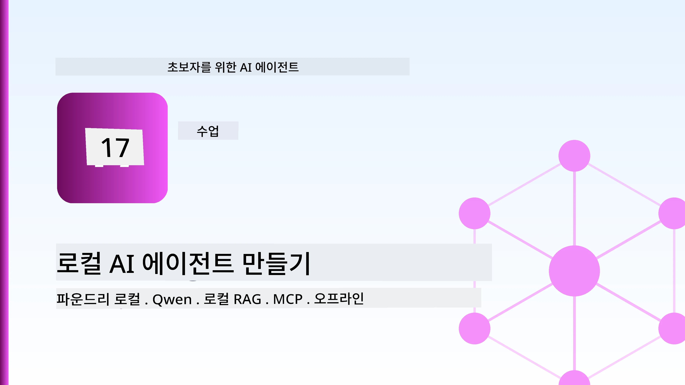
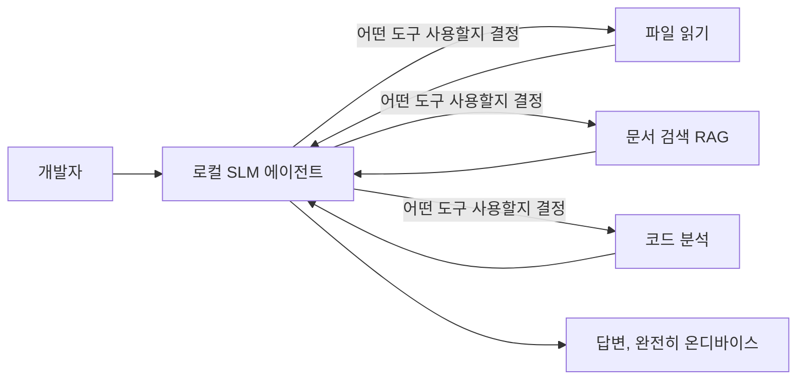
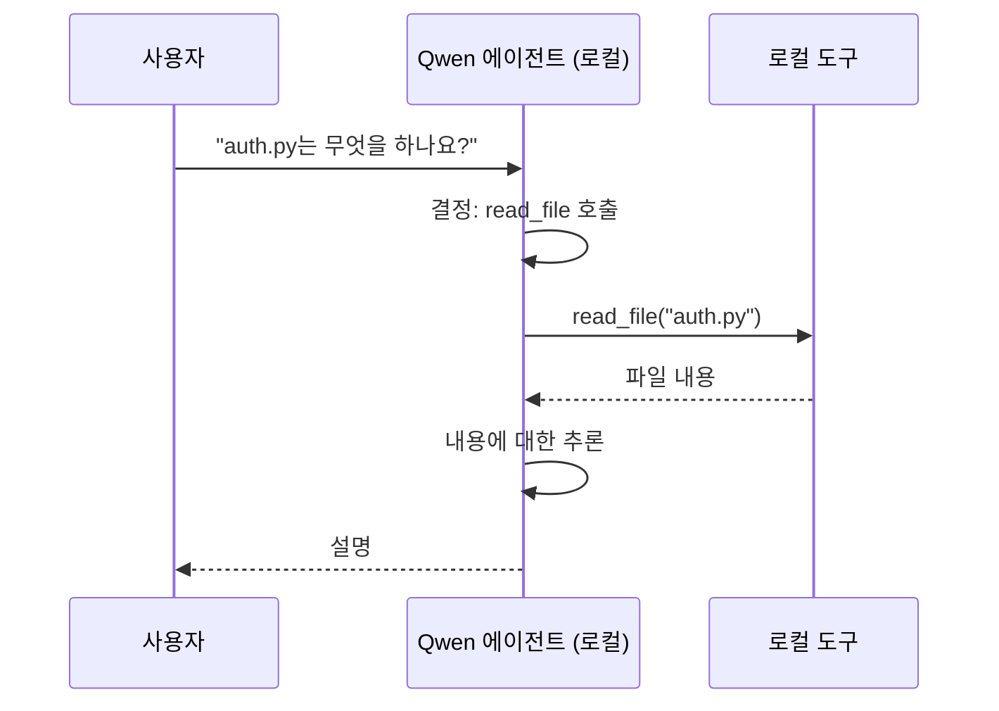
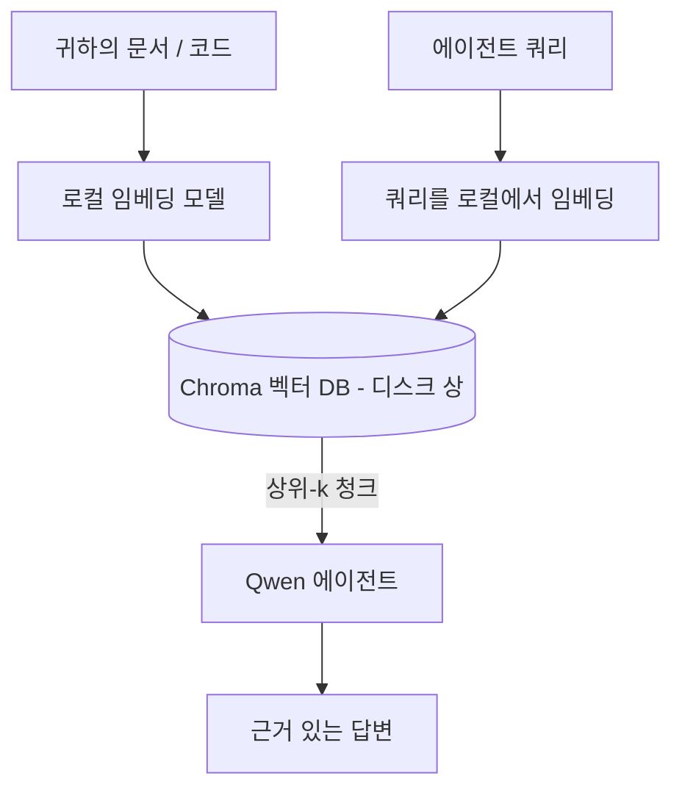
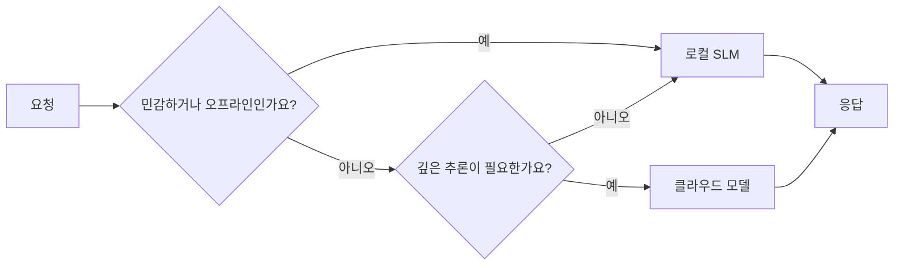

# Microsoft Foundry Local 및 Qwen을 사용한 로컬 AI 에이전트 생성



이전 수업에서는 에이전트를 클라우드로 <em>확장</em>했습니다. 이번 수업에서는 단일 머신으로 <em>축소</em>합니다. 마지막에는 추론 호출이 단 한 번도 클라우드를 거치지 않는, 추론하고 도구를 호출하며 파일을 읽고 문서를 검색하는 작동하는 엔지니어링 어시스턴트를 갖게 됩니다.

왜 그렇게 하시겠습니까? 실제 엔지니어링 작업에서 자주 언급되는 세 가지 이유가 있습니다:

- <strong>프라이버시</strong> 코드와 문서가 절대로 머신 밖으로 나가지 않습니다. 프롬프트도 스니펫도 고객 데이터도 네트워크 경계를 넘지 않습니다.
- <strong>비용</strong> 로컬 추론은 토큰당 요금이 없습니다. 전기 요금만 내면서 하루 종일 반복할 수 있습니다.
- <strong>오프라인</strong> 비행기 안, 보안 시설, 중단 상황에서도 에이전트가 작동합니다.

단점은 최첨단 클라우드 모델을 포기하고 CPU, GPU, NPU에서 실행되는 <strong>소형 언어 모델(SLM)</strong>을 사용하는 것입니다. 이 수업은 제약 조건을 무시하지 않고 그 안에서 *잘 작동하는* 에이전트 구축에 관한 것입니다.

## 소개

이 수업에서 다룰 내용:

- **소형 언어 모델(SLM)** — 무엇인지, 어떤 분야에서 강점이 있고 약점이 있는지.
- **Microsoft Foundry Local** — 디바이스에서 모델을 다운로드하고 제공하는 런타임으로, <strong>OpenAI 호환 API</strong>를 통해 작동.
- **Qwen 함수 호출 모델** — 도구 호출을 신뢰성 있게 생성하는 SLM으로, 로컬 <em>에이전트</em>(단순 채팅이 아님)를 가능하게 함.
- **로컬 도구, 로컬 RAG, 로컬 MCP** — 클라우드 없이 에이전트에 기능 제공.
- **하이브리드 패턴** — 언제 로컬에 머물고 언제 클라우드를 사용할지.

## 학습 목표

이 수업 완료 후, 여러분은 다음을 할 수 있습니다:

- SLM의 트레이드오프를 설명하고 적절한 로컬 에이전트 사용 사례를 선택.
- Foundry Local을 사용해 로컬에서 Qwen 모델을 서비스하고 OpenAI 호환 엔드포인트를 통해 연결.
- 워크스테이션에서 완전히 실행되는 도구 호출 에이전트를 구축.
- 로컬 벡터 DB(Chroma)를 이용해 자체 문서에 대해 로컬 RAG 추가.
- 에이전트를 로컬 MCP 서버에 연결하고 로컬/클라우드 혼합 설계에 대해 사고.

## 사전 준비 사항

이 수업은 이전 수업을 완료했고 다음에 익숙하다는 가정 하에 진행됩니다:

- [도구 사용](../04-tool-use/README.md) (수업 4) 및 [Agentic RAG](../05-agentic-rag/README.md) (수업 5).
- [Agentic 프로토콜 / MCP](../11-agentic-protocols/README.md) (수업 11).
- [Microsoft Agent Framework](../14-microsoft-agent-framework/README.md) (수업 14).

또한 필요합니다:

- 개발자 워크스테이션. <strong>RAM 8GB는 현실적인 최소 사양</strong>이며, 16GB 이상이면 쾌적합니다. GPU나 NPU가 도움은 되지만 필수는 아닙니다.
- **Microsoft Foundry Local** 설치 필요 (아래 설정 섹션 참고).
- Python 3.12 이상과 리포지토리 [`requirements.txt`](../../../requirements.txt)의 패키지, 그리고 이번 수업용 `foundry-local-sdk`, `openai`, `chromadb`.

## 소형 언어 모델: 로컬 작업에 적합한 도구

최첨단 클라우드 모델은 수천억 개의 매개변수를 가지고 데이터 센터에서 실행됩니다. 반면 SLM은 수십억 매개변수이며 노트북 RAM에 맞아야 합니다. 이 차이가 명확한 기대치를 만듭니다.

**SLM이 잘하는 것:**

- 구조화되고 제한된 작업 — 문서의 분류, 추출, 요약.
- **도구 호출** — 어떤 함수 호출과 어떤 인자를 쓸지 결정.
- 빠르고, 저렴하며, 프라이빗하게 자신의 데이터로 반복 수행.

**SLM이 약한 점:**

- 개방형, 다중 홉 추론과 대규모 문맥 처리.
- 광범위한 세계 지식(본 데이터가 적고 더 많이 잊음).

따라서 로컬 에이전트의 성공 전략은: **SLM으로 지휘하게 하고, 도구에 무거운 작업을 맡기자.** 모델이 코드베이스를 <em>알아야</em> 할 필요는 없고 `read_file`, `search_docs`를 언제 호출해야 하는지만 알면 됩니다. 이것이 SLM의 강점에 부합합니다.



## Microsoft Foundry Local

<strong>Microsoft Foundry Local</strong>은 가볍고, 모델을 다운로드, 관리, 완전히 머신 내에서 제공하는 런타임입니다. 가장 중요한 기능은 <strong>OpenAI 호환 HTTP 엔드포인트</strong>를 노출한다는 점입니다 — 따라서 OpenAI SDK와 Microsoft Agent Framework의 OpenAI 클라이언트가 `base_url`만 바꾸면 작동합니다. 에이전트 구축에 관한 모든 지식이 그대로 적용되며, 엔드포인트만 클라우드에서 `localhost`로 바뀝니다.

Foundry Local은 자동으로 하드웨어에 가장 적합한 모델 빌드(CPU, CUDA/GPU, NPU)를 선택하기 때문에 머신별 수동 최적화가 필요 없습니다.

### 설정

운영체제에 맞게 Foundry Local을 설치하세요(자세한 내용은 [문서](https://learn.microsoft.com/azure/ai-foundry/foundry-local/) 참고). 설치 후 정상 작동 확인:

```bash
# 설치하세요 (예: 플랫폼에 맞는 문서를 따르세요)
winget install Microsoft.FoundryLocal      # 윈도우
# brew install microsoft/foundrylocal/foundrylocal   # macOS

# Qwen 모델을 다운로드하고 실행한 후, 로컬 서비스를 시작하세요
foundry model run qwen2.5-7b-instruct
foundry service status
```

서비스가 실행 중이면 로컬 OpenAI 호환 엔드포인트(일반적으로 `http://localhost:PORT/v1`)가 준비됩니다. 노트북은 `foundry-local-sdk`를 사용해 엔드포인트를 자동 탐색하므로 포트를 하드코딩할 필요 없습니다.

## Qwen 함수 호출: 중요한 이유

에이전트는 도구를 호출할 수 있어야 진정한 에이전트입니다. 많은 SLM은 채팅은 가능하지만 신뢰할 수 없고 형식이 잘못된 도구 호출을 만듭니다. **Qwen** 모델은 함수 호출을 위해 훈련되어 잘 만들어진 도구 호출 구조체를 지속적으로 생성합니다 — 이것이 로컬 채팅 모델을 로컬 <em>에이전트</em>로 만드는 핵심입니다.

기본 툴 호출 루프 구조이지만, 장치 내에서 실행된다는 점이 다릅니다:



## 로컬 RAG

문서 검색은 로컬 에이전트의 주요 강점입니다. SLM이 프레임워크 문서를 암기했다고 기대하기보다는, 그 문서를 <strong>로컬 벡터 데이터베이스</strong>에 임베딩하고 필요할 때 관련 조각을 검색하도록 합니다.

서버가 필요 없는 임베딩 벡터 저장소인 <strong>Chroma</strong>를 사용합니다. 파이프라인은 완전히 로컬입니다: 로컬 임베딩 모델 → 로컬 벡터 → 로컬 검색 → 로컬 SLM.



이것은 수업 5의 Agentic RAG 패턴과 동일하며, 다른 점은 모든 컴포넌트가 당신의 머신에서 실행된다는 것입니다.

## 로컬 MCP 서버

[MCP](../11-agentic-protocols/README.md)는 클라우드 서비스가 아닌 전송 프로토콜입니다. MCP 서버는 로컬 프로세스로 `stdio`상에서 실행되어 표준 프로토콜로 도구를 에이전트에 노출합니다. 이를 통해 파일 시스템 접근, git 작업, DB 쿼리 등 하드웨어 완전 오프라인 상태에서 MCP 서버 생태계를 재사용할 수 있습니다.

보안 관점은 클라우드와 다르지만 없지는 않습니다. 로컬 MCP 서버도 사용자의 권한으로 실행되므로 접근 범위를 제한(예: 전체 홈 폴더가 아닌 특정 프로젝트 디렉터리)하고 출력물을 입력으로 받아 검증해야 합니다.

## 하이브리드 클라우드 및 로컬 패턴

로컬 우선이 로컬 전용을 의미하지는 않습니다. 성숙한 시스템은 민감도와 난이도에 따라 라우팅합니다:

| 상황 | 실행 위치 |
| --- | --- |
| 민감한 코드 / 데이터 또는 오프라인 상태 | **로컬 SLM** |
| 간단하고 제한된 작업 | **로컬 SLM** (저렴하고 빠름) |
| 민감하지 않은 데이터에 대한 어려운 다중 홉 추론 | **클라우드 모델** |
| 중단 발생 시 모두 | **로컬 SLM** (점진적 저하) |

이는 수업 16의 **모델 라우팅** 개념과 동일하지만 "모델" 중 하나가 이제 당신의 머신이라는 점이 다릅니다. 견고한 설계는 클라우드가 없을 때 로컬로 대체하여 에이전트가 완전 실패 대신 품질 저하로 대응하게 합니다.



## 실습: 로컬 엔지니어링 어시스턴트

[`code_samples/17-local-agent-foundry-local.ipynb`](./code_samples/17-local-agent-foundry-local.ipynb)를 열어 실습을 진행하세요. 전적으로 워크스테이션에서 실행되는 <strong>로컬 엔지니어링 어시스턴트</strong>를 만듭니다:

1. **도구 호출** — Foundry Local을 통한 Qwen 함수 호출 활용.
2. **로컬 파일 조작** — 프로젝트 디렉터리 내 파일 목록 확인 및 읽기.
3. **코드 분석** — 소스 파일의 기본 지표 보고.
4. **문서 검색** — Chroma로 docs 폴더에 대한 로컬 RAG 수행.
5. **MCP 사용** — 로컬 MCP 서버 연결(구성되지 않았다면 우아하게 건너뜀).

어떤 시점에서도 클라우드 추론은 사용하지 않습니다.

### 순서 안내

어시스턴트는 OpenAI 호환 엔드포인트를 통해 Foundry Local에 연결하므로 에이전트 코드는 클라우드 수업과 거의 동일합니다 — 클라이언트만 다릅니다:

```python
from foundry_local import FoundryLocalManager
from openai import OpenAI

# Foundry 로컬은 모델을 발견하고 다운로드하여 로컬 엔드포인트를 제공합니다.
manager = FoundryLocalManager(\"qwen2.5-7b-instruct\")
client = OpenAI(base_url=manager.endpoint, api_key=manager.api_key)  # api_key는 로컬 플레이스홀더입니다.
```

도구들은 프로젝트 디렉터리에 국한된 일반 파이썬 함수입니다:

```python
def read_file(path: str) -> str:
    \"\"\"Read a file, but only inside the sandboxed project directory.\"\"\"
    full = (PROJECT_ROOT / path).resolve()
    if PROJECT_ROOT not in full.parents and full != PROJECT_ROOT:
        return \"Access denied: path is outside the project directory.\"
    return full.read_text(encoding=\"utf-8\")
```

샌드박스 검사를 주의하세요 — 로컬이어도 임의 경로를 읽는 도구는 위험할 수 있습니다. 노트북은 모든 도구를 단일 프로젝트 루트로 제한합니다.

## 이해 점검

과제를 진행하기 전에 이해도를 테스트하세요.

**1. 클라우드 대신 로컬에서 에이전트를 실행해야 하는 구체적인 두 가지 이유를 말하세요.**

<details>
<summary>답변</summary>

다음 중 두 가지: <strong>프라이버시</strong> (코드와 데이터가 머신 밖으로 절대 나가지 않음), <strong>비용</strong> (토큰별 추론 요금 없음), **오프라인 기능** (비행기 내, 보안 시설, 중단 시에도 작업 가능). 규제/컴플라이언스 요구가 데이터 기기 외 전송 금지를 요구하는 경우가 많아 프라이버시 이유가 됩니다.
</details>

**2. 로컬 에이전트에서 SLM과 도구의 권장 역할 분담은 무엇이며 그 이유는?**

<details>
<summary>답변</summary>

SLM은 <strong>지휘</strong> 역할(어떤 도구 호출할지, 어떻게 호출할지 결정)이고, 도구는 **무거운 작업 수행**(파일 읽기, 문서 검색, 결과 계산). SLM은 도구 선택 같은 제한된 의사결정에 강하지만, 광범위 지식과 긴 다중홉 추론에는 약하므로 도구에 의존하는 것이 강점 발휘에 유리함.
</details>

**3. Foundry Local 덕분에 클라우드 에이전트 코드를 재사용할 수 있는 이유는?**

<details>
<summary>답변</summary>

Foundry Local은 <strong>OpenAI 호환 HTTP 엔드포인트</strong>를 제공합니다. OpenAI SDK와 Agent Framework OpenAI 클라이언트는 `base_url`만 변경하고(로컬 API 키 사용), 나머지 모든 에이전트 코드가 동일하게 작동합니다.
</details>

**4. 왜 모든 SLM 대신 Qwen 함수 호출 모델을 특별히 사용하는가?**

<details>
<summary>답변</summary>

에이전트는 신뢰할 수 있고 형식이 올바른 <strong>도구 호출</strong>을 생성해야 하기 때문입니다. 많은 SLM이 채팅은 가능하지만 도구 호출 구조체가 잘못 생성되거나 일관성이 없습니다. Qwen 모델은 함수 호출 훈련을 받아 일관된 도구 호출을 생성하며, 이 점이 로컬 채팅 모델을 작동하는 로컬 에이전트로 바꿉니다.
</details>

**5. 로컬 RAG 파이프라인에서 어떤 컴포넌트가 머신에서 실행되는가?**

<details>
<summary>답변</summary>

모든 컴포넌트: 임베딩 모델, 벡터 데이터베이스(디스크상의 Chroma), 검색 단계, SLM 전부 로컬에서 실행. 문서는 로컬에서 임베딩, 로컬 저장, 로컬 검색, 그리고 로컬 모델이 추론 — 클라우드와는 연동 없음.
</details>

**6. 로컬 MCP 서버가 머신에서 실행된다고 해서 자동으로 안전한가? 여전히 어떤 주의를 해야 하는가?**

<details>
<summary>답변</summary>

아니요. 로컬 MCP 서버는 사용자 권한으로 실행되므로 사용자가 접근 가능한 모든 것을 접할 수 있습니다. 필요 범위에 한정해(예: 전체 홈 폴더가 아닌 특정 프로젝트 디렉터리) 출력을 입력으로 간주해 검증 후 사용하는 습관을 가져야 합니다.
</details>

**7. 로컬 모델을 포함한 합리적인 하이브리드 라우팅 규칙을 설명하세요.**

<details>
<summary>답변</summary>

민감하거나 오프라인 요청은 로컬 SLM에, 간단하고 제한된 작업도 빠르고 비용 효과적이기에 로컬 SLM에, 민감하지 않은 어려운 다중 홉 추론은 클라우드 모델에, 클라우드가 불가할 때는 로컬 SLM로 대체해 에이전트가 완전 고장 대신 점진적으로 저하하는 방식. 이는 수업 16의 모델 라우팅 개념과 같되 로컬 머신을 하나의 모델로 취급합니다.
</details>

**8. 본 수업에서 로컬 에이전트를 실행하기에 현실적인 최소 RAM은 얼마이며 더 많은 RAM이 주는 이점은?**

<details>
<summary>답변</summary>

약 <strong>8GB</strong>가 현실적인 최소 사양이며 16GB 이상이면 편안합니다. 더 많은 RAM은 더 크고 강력한 모델을 실행하고 더 많은 문맥을 메모리에 유지할 수 있습니다. GPU나 NPU는 추론 속도를 높여주지만 필수는 아닙니다 — Foundry Local은 가속기가 없을 땐 CPU 빌드를 선택합니다.
</details>

## 과제

여러분의 로컬 엔지니어링 어시스턴트를 선택한 작은 프로젝트용 <strong>로컬 문서 리뷰어</strong>로 확장하세요 (필요하면 본 리포의 수업 폴더 중 하나를 사용).

제출은 다음을 포함해야 합니다:

1. 실제 문서/코드 폴더를 Chroma에 색인 생성(최소 5개 파일).
2. 프로젝트 내 `TODO`/`FIXME` 주석을 스캔하고 파일명과 줄 번호와 함께 반환하는 `find_todos` 도구 추가 — `read_file`와 같은 샌드박스 검사 유지.

3. **에이전트에게 세 가지 질문을 하세요**: 도구를 결합하도록 강제하는 질문 세 가지를 합니다. 하나는 순수 RAG 질문, 하나는 특정 파일을 읽어야 하는 질문, 그리고 하나는 TODO를 찾아야 하는 질문입니다.
4. <strong>측정하세요</strong>: 세 응답 각각에 소요된 시간을 측정하고 마크다운 셀에 기록합니다. 지연 시간이 의도한 작업 흐름에 적합한지 여부를 코멘트합니다.

그런 다음 이 리뷰어를 위해 <strong>클라우드로 옮길 부분과 로컬에 유지할 부분</strong>에 대해 짧은 단락을 작성하세요. 로컬 구성 요소들이 올바르게 연결되어 있는지와 하이브리드 추론이 타당한지를 평가합니다 — 모델 품질은 평가하지 않습니다.

## 요약

이번 강의에서는 완전히 자신의 머신에서 실행되는 에이전트를 구축했습니다:

- <strong>SLM</strong>은 프라이버시, 비용 및 오프라인 작동을 위해 폭넓은 범위를 포기하며 — 모든 지식을 직접 담기보다 <strong>도구를 조율</strong>할 때 뛰어납니다.
- <strong>Foundry Local</strong>은 **OpenAI 호환 엔드포인트** 뒤에서 장치 내 모델을 서비스하므로, 클라우드 에이전트 코드를 한 줄만 변경하여 이전할 수 있습니다.
- <strong>Qwen 함수 호출 모델</strong>은 신뢰할 수 있는 로컬 도구 호출을 가능하게 하여 로컬 <em>에이전트</em>도 가능하게 만듭니다.
- **로컬 RAG**(Chroma)와 <strong>로컬 MCP</strong>는 머신을 벗어나지 않고도 에이전트에 기능을 제공합니다.
- <strong>하이브리드 패턴</strong>은 민감도와 난이도에 따라 라우팅하며, 로컬은 우아한 대체 수단으로 작동합니다.

이것으로 배포 아크가 완성됩니다: 16강은 에이전트를 Microsoft Foundry에서 확장했고, 이번 강의는 단일 워크스테이션으로 축소했습니다. 다음 강의는 배포된 에이전트를 안전하게 유지하는 방법으로 넘어갑니다.

## 추가 자료

- <a href="https://learn.microsoft.com/azure/ai-foundry/foundry-local/" target="_blank">Microsoft Foundry Local 문서</a>
- <a href="https://learn.microsoft.com/azure/ai-foundry/what-is-azure-ai-foundry" target="_blank">Microsoft Foundry 문서</a>
- <a href="https://learn.microsoft.com/en-us/agent-framework/overview/?wt.mc_id=youtube_26688_organicsocial_reactor&pivots=programming-language-python" target="_blank">Microsoft Agent Framework</a>
- <a href="https://qwen.readthedocs.io/en/latest/framework/function_call.html" target="_blank">Qwen 함수 호출 문서</a>
- <a href="https://modelcontextprotocol.io/" target="_blank">Model Context Protocol (MCP)</a>
- <a href="https://docs.trychroma.com/" target="_blank">Chroma 벡터 데이터베이스</a>

## 이전 강의

[배포 가능한 에이전트 확장](../16-deploying-scalable-agents/README.md)

## 다음 강의

[AI 에이전트 보안](../18-securing-ai-agents/README.md)

---

<!-- CO-OP TRANSLATOR DISCLAIMER START -->
**면책 조항**:
이 문서는 AI 번역 서비스 [Co-op Translator](https://github.com/Azure/co-op-translator)를 사용하여 번역되었습니다. 정확성을 기하기 위해 노력하고 있으나, 자동 번역은 오류나 부정확한 부분이 있을 수 있음을 유의하시기 바랍니다. 원본 문서의 원어본이 권위 있는 자료로 간주되어야 합니다. 중요한 정보의 경우, 전문가의 인간 번역을 권장합니다. 이 번역 사용으로 인해 발생하는 오해나 잘못된 해석에 대해 당사는 책임을 지지 않습니다.
<!-- CO-OP TRANSLATOR DISCLAIMER END -->