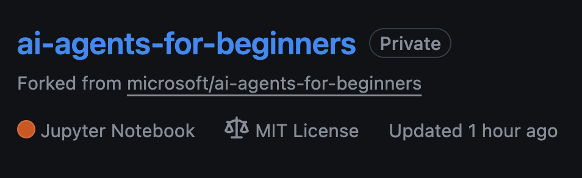
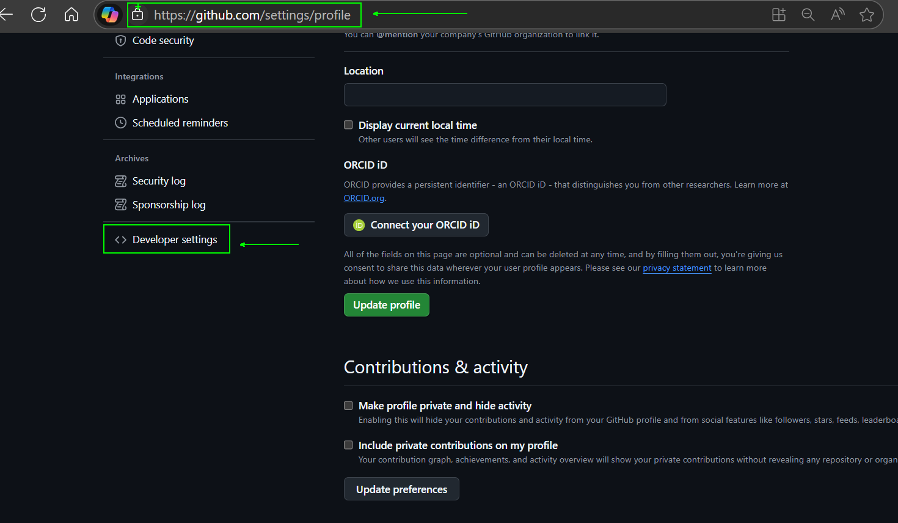
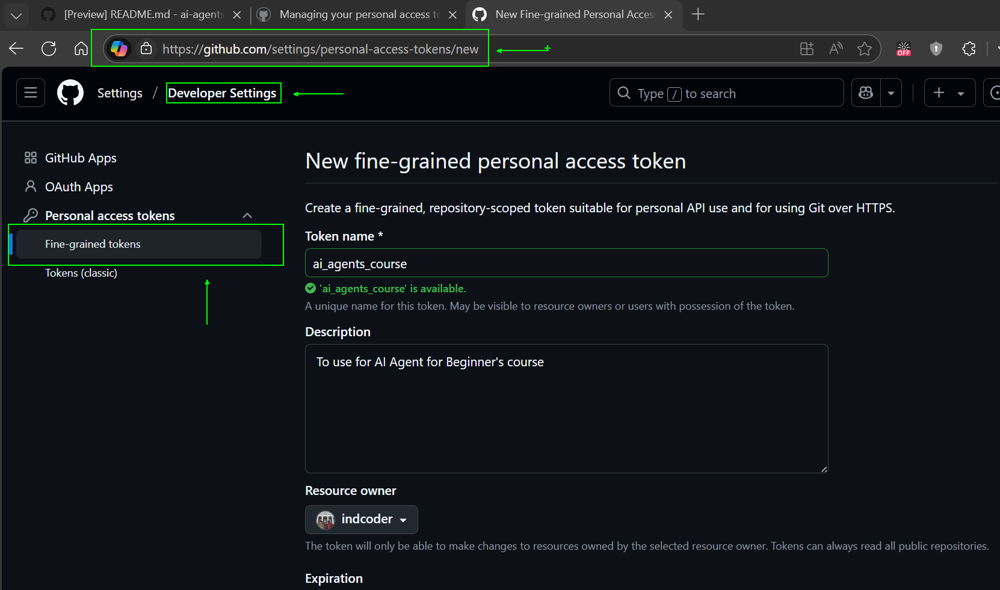
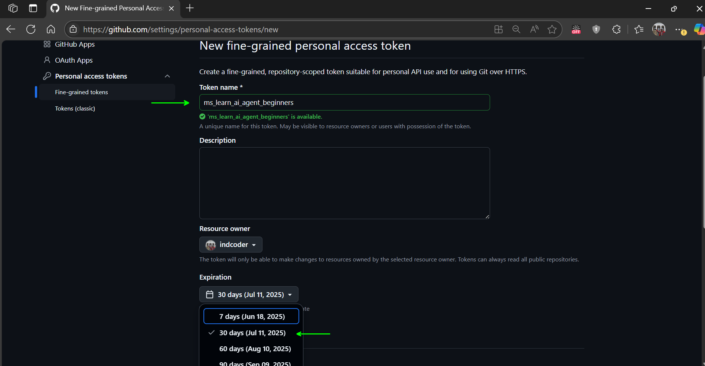
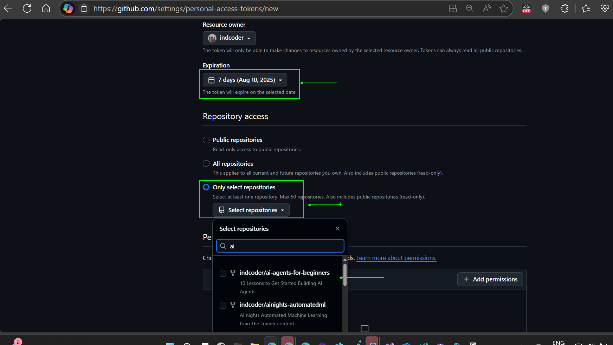
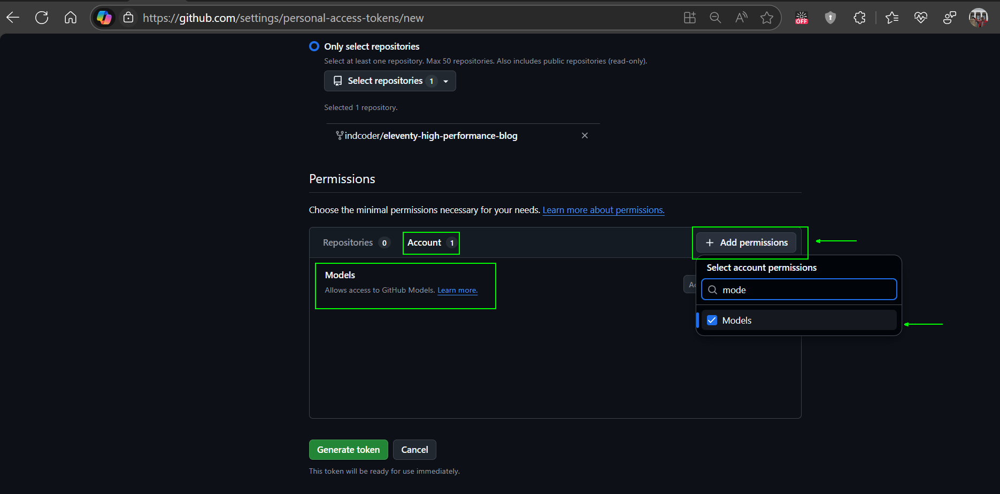
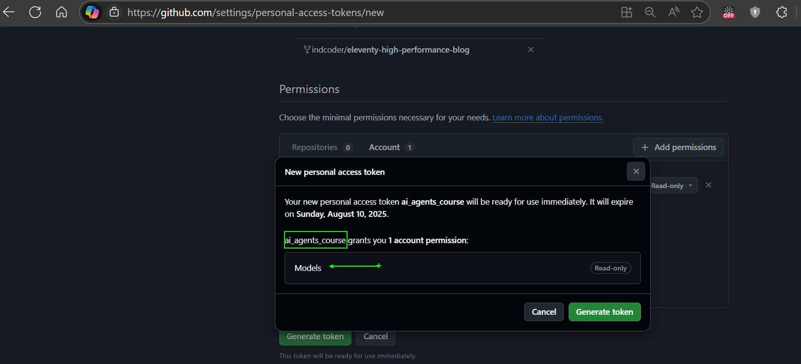
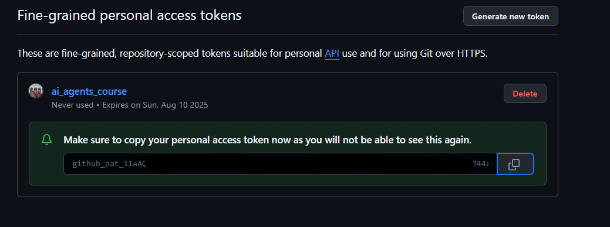
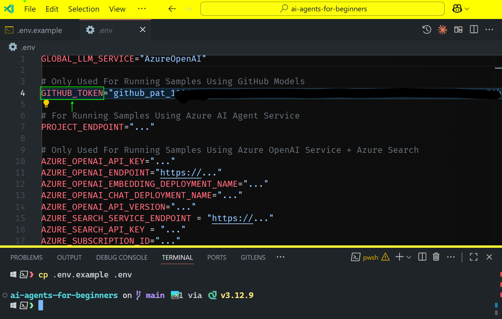
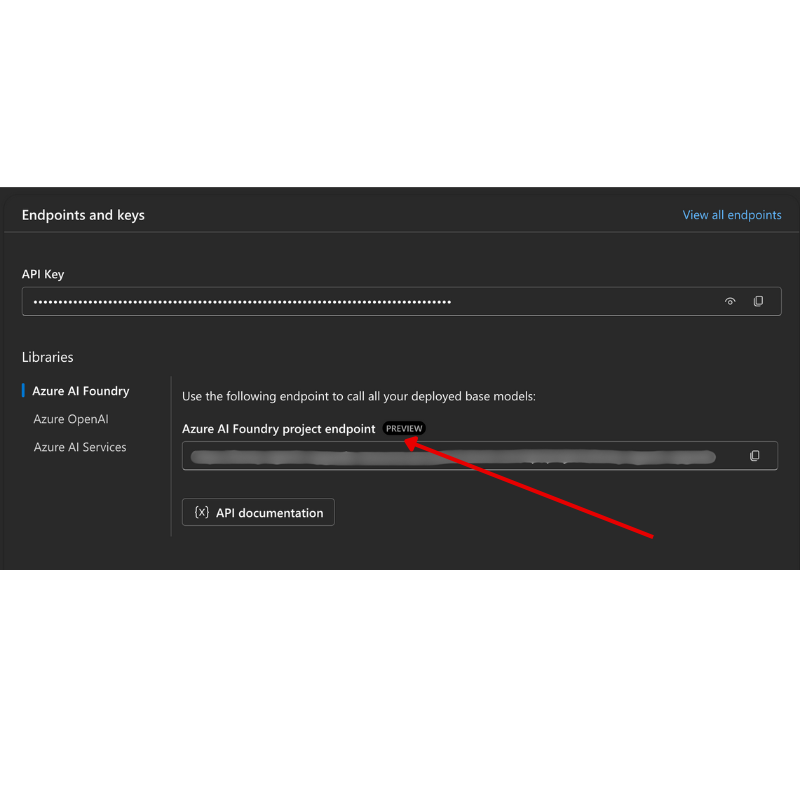

<!--
CO_OP_TRANSLATOR_METADATA:
{
  "original_hash": "c55b973b1562abf5aadf6a4028265ac5",
  "translation_date": "2025-08-30T10:47:20+00:00",
  "source_file": "00-course-setup/README.md",
  "language_code": "lt"
}
-->
# Kursų nustatymas

## Įvadas

Šioje pamokoje aptarsime, kaip paleisti šio kurso kodo pavyzdžius.

## Prisijunkite prie kitų mokinių ir gaukite pagalbos

Prieš pradėdami klonuoti savo saugyklą, prisijunkite prie [AI Agents For Beginners Discord kanalo](https://aka.ms/ai-agents/discord), kad gautumėte pagalbos dėl nustatymo, atsakymus į klausimus apie kursą ar galėtumėte susisiekti su kitais mokiniais.

## Klonuokite arba „forkinkite“ šią saugyklą

Norėdami pradėti, prašome klonuoti arba „forkinti“ GitHub saugyklą. Tai sukurs jūsų asmeninę kurso medžiagos versiją, kad galėtumėte paleisti, testuoti ir koreguoti kodą!

Tai galima padaryti paspaudus nuorodą į

Jūs turėtumėte turėti savo „forkintą“ šio kurso versiją šioje nuorodoje:



## Kodo paleidimas

Šis kursas siūlo seriją Jupyter Notebook failų, kuriuos galite paleisti, kad praktiškai išmoktumėte kurti AI agentus.

Kodo pavyzdžiai naudoja:

**Reikalinga GitHub paskyra - nemokama**:

1) Semantic Kernel Agent Framework + GitHub Models Marketplace. Pažymėta kaip (semantic-kernel.ipynb)
2) AutoGen Framework + GitHub Models Marketplace. Pažymėta kaip (autogen.ipynb)

**Reikalinga Azure prenumerata**:
3) Azure AI Foundry + Azure AI Agent Service. Pažymėta kaip (azureaiagent.ipynb)

Rekomenduojame išbandyti visus tris pavyzdžius, kad pamatytumėte, kuris jums geriausiai tinka.

Pasirinktas variantas nulems, kokius nustatymo veiksmus turėsite atlikti toliau:

## Reikalavimai

- Python 3.12+
  - **PASTABA**: Jei neturite įdiegto Python 3.12, įdiekite jį. Tada sukurkite savo venv naudodami python3.12, kad užtikrintumėte, jog iš `requirements.txt` failo bus įdiegtos tinkamos versijos.
- GitHub paskyra - prieiga prie GitHub Models Marketplace
- Azure prenumerata - prieiga prie Azure AI Foundry
- Azure AI Foundry paskyra - prieiga prie Azure AI Agent Service

Šios saugyklos šaknyje įtraukėme `requirements.txt` failą, kuriame yra visi reikalingi Python paketai, kad galėtumėte paleisti kodo pavyzdžius.

Juos galite įdiegti paleisdami šią komandą terminale saugyklos šaknyje:

```bash
pip install -r requirements.txt
```
Rekomenduojame sukurti Python virtualią aplinką, kad išvengtumėte konfliktų ir problemų.

## VSCode nustatymas
Įsitikinkite, kad naudojate tinkamą Python versiją VSCode.


## Nustatymas pavyzdžiams naudojant GitHub modelius

### 1 žingsnis: Gaukite savo GitHub asmeninį prieigos raktą (PAT)

Šis kursas naudoja GitHub Models Marketplace, kuris suteikia nemokamą prieigą prie didelių kalbos modelių (LLMs), kuriuos naudosite kurdami AI agentus.

Norėdami naudoti GitHub modelius, turėsite sukurti [GitHub asmeninį prieigos raktą](https://docs.github.com/en/authentication/keeping-your-account-and-data-secure/managing-your-personal-access-tokens).

Tai galima padaryti jūsų GitHub paskyroje.

Prašome laikytis [Minimalios privilegijos principo](https://docs.github.com/en/get-started/learning-to-code/storing-your-secrets-safely) kurdami savo raktą. Tai reiškia, kad turėtumėte suteikti raktui tik tas teises, kurios būtinos šio kurso kodo pavyzdžiams paleisti.

1. Kairėje ekrano pusėje pasirinkite `Fine-grained tokens` parinktį, eidami į **Developer settings**.
   

    Tada pasirinkite `Generate new token`.

    

2. Įveskite aprašomąjį pavadinimą savo raktui, kuris atspindi jo paskirtį, kad vėliau būtų lengva jį identifikuoti.

    🔐 Rekomendacija dėl rakto galiojimo trukmės

    Rekomenduojama trukmė: 30 dienų  
    Dėl saugesnės pozicijos galite pasirinkti trumpesnį laikotarpį, pvz., 7 dienas 🛡️  
    Tai puikus būdas nustatyti asmeninį tikslą ir baigti kursą, kol jūsų mokymosi tempas yra aukštas 🚀.

    

3. Apribokite rakto taikymo sritį savo „forkintai“ šios saugyklos versijai.

    

4. Apribokite rakto teises: Skiltyje **Permissions** spustelėkite **Account** kortelę ir paspauskite "+ Add permissions" mygtuką. Atsiras išskleidžiamasis meniu. Prašome ieškoti **Models** ir pažymėti langelį.

    

5. Patikrinkite reikalingas teises prieš generuodami raktą.  
    

6. Prieš generuodami raktą, įsitikinkite, kad esate pasiruošę saugoti raktą saugioje vietoje, pvz., slaptažodžių valdymo programoje, nes jis nebus rodomas dar kartą po sukūrimo.  
    

Nukopijuokite naują raktą, kurį ką tik sukūrėte. Dabar pridėsite jį į `.env` failą, įtrauktą į šį kursą.

### 2 žingsnis: Sukurkite savo `.env` failą

Norėdami sukurti `.env` failą, paleiskite šią komandą terminale.

```bash
cp .env.example .env
```

Tai nukopijuos pavyzdinį failą ir sukurs `.env` jūsų kataloge, kur užpildysite aplinkos kintamųjų reikšmes.

Nukopijavę savo raktą, atidarykite `.env` failą mėgstamame teksto redaktoriuje ir įklijuokite savo raktą į `GITHUB_TOKEN` lauką.  


Dabar turėtumėte galėti paleisti šio kurso kodo pavyzdžius.

## Nustatymas pavyzdžiams naudojant Azure AI Foundry ir Azure AI Agent Service

### 1 žingsnis: Gaukite savo Azure projekto galinį tašką

Sekite veiksmus, kaip sukurti centrą ir projektą Azure AI Foundry, pateiktus čia: [Hub resources overview](https://learn.microsoft.com/en-us/azure/ai-foundry/concepts/ai-resources)

Kai sukursite savo projektą, turėsite gauti projekto prisijungimo eilutę.

Tai galima padaryti einant į **Overview** puslapį savo projekte Azure AI Foundry portale.



### 2 žingsnis: Sukurkite savo `.env` failą

Norėdami sukurti `.env` failą, paleiskite šią komandą terminale.

```bash
cp .env.example .env
```

Tai nukopijuos pavyzdinį failą ir sukurs `.env` jūsų kataloge, kur užpildysite aplinkos kintamųjų reikšmes.

Nukopijavę savo raktą, atidarykite `.env` failą mėgstamame teksto redaktoriuje ir įklijuokite savo raktą į `PROJECT_ENDPOINT` lauką.

### 3 žingsnis: Prisijunkite prie Azure

Kaip saugumo geriausią praktiką, naudosime [autentifikaciją be rakto](https://learn.microsoft.com/azure/developer/ai/keyless-connections?tabs=csharp%2Cazure-cli?WT.mc_id=academic-105485-koreyst), kad prisijungtume prie Azure OpenAI su Microsoft Entra ID.

Tada atidarykite terminalą ir paleiskite `az login --use-device-code`, kad prisijungtumėte prie savo Azure paskyros.

Kai prisijungsite, terminale pasirinkite savo prenumeratą.

## Papildomi aplinkos kintamieji - Azure Search ir Azure OpenAI

Agentic RAG pamokoje - 5 pamokoje - yra pavyzdžių, kurie naudoja Azure Search ir Azure OpenAI.

Jei norite paleisti šiuos pavyzdžius, turėsite pridėti šiuos aplinkos kintamuosius į savo `.env` failą:

### Projekto apžvalgos puslapis

- `AZURE_SUBSCRIPTION_ID` - Patikrinkite **Project details** skiltyje **Overview** puslapyje savo projekte.

- `AZURE_AI_PROJECT_NAME` - Pažvelkite į **Overview** puslapio viršų savo projekte.

- `AZURE_OPENAI_SERVICE` - Raskite tai **Included capabilities** kortelėje **Azure OpenAI Service** skiltyje **Overview** puslapyje.

### Valdymo centras

- `AZURE_OPENAI_RESOURCE_GROUP` - Eikite į **Project properties** skiltyje **Overview** puslapyje **Management Center**.

- `GLOBAL_LLM_SERVICE` - Skiltyje **Connected resources** raskite **Azure AI Services** prisijungimo pavadinimą. Jei nerandate, patikrinkite **Azure portalą** savo išteklių grupėje dėl AI Services išteklių pavadinimo.

### Modeliai + galinių taškų puslapis

- `AZURE_OPENAI_EMBEDDING_DEPLOYMENT_NAME` - Pasirinkite savo įterpimo modelį (pvz., `text-embedding-ada-002`) ir užsirašykite **Deployment name** iš modelio detalių.

- `AZURE_OPENAI_CHAT_DEPLOYMENT_NAME` - Pasirinkite savo pokalbių modelį (pvz., `gpt-4o-mini`) ir užsirašykite **Deployment name** iš modelio detalių.

### Azure portalas

- `AZURE_OPENAI_ENDPOINT` - Ieškokite **Azure AI services**, spustelėkite, tada eikite į **Resource Management**, **Keys and Endpoint**, slinkite žemyn iki "Azure OpenAI endpoints" ir nukopijuokite tą, kuris sako "Language APIs".

- `AZURE_OPENAI_API_KEY` - Iš to paties ekrano nukopijuokite KEY 1 arba KEY 2.

- `AZURE_SEARCH_SERVICE_ENDPOINT` - Raskite savo **Azure AI Search** išteklių, spustelėkite jį ir peržiūrėkite **Overview**.

- `AZURE_SEARCH_API_KEY` - Tada eikite į **Settings** ir tada **Keys**, kad nukopijuotumėte pirminį arba antrinį administratoriaus raktą.

### Išorinė svetainė

- `AZURE_OPENAI_API_VERSION` - Apsilankykite [API versijos gyvavimo ciklo](https://learn.microsoft.com/en-us/azure/ai-services/openai/api-version-deprecation#latest-ga-api-release) puslapyje skiltyje **Latest GA API release**.

### Nustatykite autentifikaciją be rakto

Užuot įrašę savo kredencialus, naudosime ryšį be rakto su Azure OpenAI. Tam importuosime `DefaultAzureCredential` ir vėliau iškviesime `DefaultAzureCredential` funkciją, kad gautume kredencialą.

```python
from azure.identity import DefaultAzureCredential, InteractiveBrowserCredential
```

## Susidūrėte su problema?

Jei turite kokių nors problemų paleidžiant šį nustatymą, prisijunkite prie mūsų

## Kita pamoka

Dabar esate pasiruošę paleisti šio kurso kodą. Smagaus mokymosi apie AI agentų pasaulį!

[Įvadas į AI agentus ir jų naudojimo atvejus](../01-intro-to-ai-agents/README.md)

---

**Atsakomybės apribojimas**:  
Šis dokumentas buvo išverstas naudojant AI vertimo paslaugą [Co-op Translator](https://github.com/Azure/co-op-translator). Nors siekiame tikslumo, prašome atkreipti dėmesį, kad automatiniai vertimai gali turėti klaidų ar netikslumų. Originalus dokumentas jo gimtąja kalba turėtų būti laikomas autoritetingu šaltiniu. Kritinei informacijai rekomenduojama profesionali žmogaus vertimo paslauga. Mes neprisiimame atsakomybės už nesusipratimus ar klaidingus interpretavimus, atsiradusius naudojant šį vertimą.