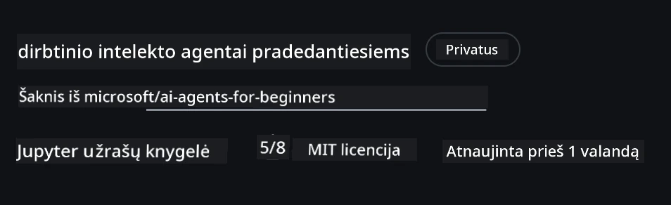
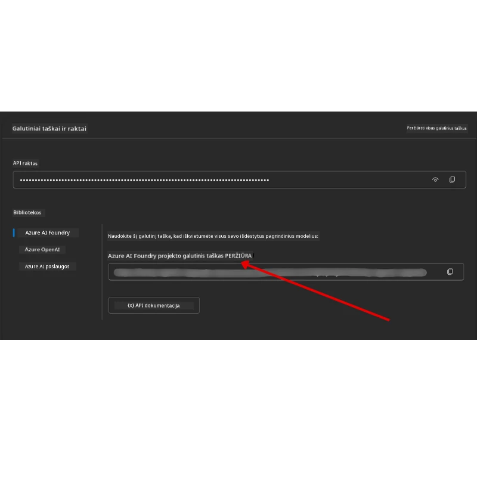

# Kurso nustatymas

## Įvadas

Ši pamoka apims, kaip paleisti šio kurso kodo pavyzdžius.

## Prisijunkite prie kitų besimokančiųjų ir gaukite pagalbą

Prieš pradėdami klonuoti savo saugyklą, prisijunkite prie [AI Agents For Beginners Discord channel](https://aka.ms/ai-agents/discord), kad gautumėte pagalbą dėl sąrankos, užduotumėte klausimus apie kursą arba susisiektumėte su kitais besimokančiaisiais.

## Klonuokite arba sukurkite fork šią saugyklą

Norėdami pradėti, klonuokite arba sukurkite fork GitHub saugyklos. Tai sukurs jūsų versiją kurso medžiagos, kad galėtumėte paleisti, testuoti ir koreguoti kodą!

Tai galima padaryti spustelėjus nuorodą į <a href="https://github.com/microsoft/ai-agents-for-beginners/fork" target="_blank">padaryti fork'ą saugyklą</a>

Dabar turėtumėte turėti savo šakintą šios kurso versiją šioje nuorodoje:



### Paviršutiniškas klonas (rekomenduojama dirbtuvėms / Codespaces)

  >Visos saugyklos istorija ir visi failai gali užimti daug vietos (~3 GB). Jei dalyvaujate tik dirbtuvėse arba reikia tik kelių pamokų aplankų, paviršutiniškas klonas (arba sparse klonas) sumažina atsisiuntimo dydį sutrumpinant istoriją ir/arba praleidžiant blob'us.

#### Greitas paviršutiniškas klonas — minimali istorija, visi failai

Pakeiskite `<your-username>` žemiau esančiose komandomis su savo fork URL (arba su upstream URL, jei pageidaujate).

Norėdami klonuoti tik paskutinį commit istoriją (mažas atsisiuntimas):

```bash|powershell
git clone --depth 1 https://github.com/<your-username>/ai-agents-for-beginners.git
```

Norėdami klonuoti konkretų šaką:

```bash|powershell
git clone --depth 1 --branch <branch-name> https://github.com/<your-username>/ai-agents-for-beginners.git
```

#### Dalinis (sparse) klonas — minimalūs blob'ai + tik pasirinkti aplankai

Tai naudoja dalinį kloną ir sparse-checkout (reikalauja Git 2.25+ ir rekomenduojama moderni Git versija su dalinio klonavimo palaikymu):

```bash|powershell
git clone --depth 1 --filter=blob:none --sparse https://github.com/<your-username>/ai-agents-for-beginners.git
```

Eikite į saugyklos aplanką:

```bash|powershell
cd ai-agents-for-beginners
```

Tada nurodykite, kuriuos aplankus norite (žemiau pateiktas pavyzdys rodo du aplankus):

```bash|powershell
git sparse-checkout set 00-course-setup 01-intro-to-ai-agents
```

Po klonavimo ir failų patikrinimo, jei jums reikia tik failų ir norite atlaisvinti vietos (be git istorijos), ištrinkite saugyklės metaduomenis (💀negrįžtama — prarasite visą Git funkcionalumą: nebus commit'ų, pull'ų, push'ų ar prieigos prie istorijos).

```bash
# zsh/bash
rm -rf .git
```

```powershell
# PowerShell
Remove-Item -Recurse -Force .git
```

#### Naudojant GitHub Codespaces (rekomenduojama vengti didelių vietinių atsisiuntimų)

- Sukurkite naują Codespace šiai saugyklai per [GitHub UI](https://github.com/codespaces).  

- Naujo Codespace terminale paleiskite vieną iš aukščiau nurodytų paviršutiniškų/sparse klonavimo komandų, kad į Codespace darbo katalogą atsivežtumėte tik reikalingus pamokų aplankus.
- Pasirinktinai: po klonavimo Codespaces, pašalinkite .git, kad atgautumėte papildomą vietą diske (žr. aukščiau pateiktas pašalinimo komandas).
- Pastaba: jei norite atidaryti saugyklą tiesiogiai Codespaces (be papildomo klonavimo), atkreipkite dėmesį, kad Codespaces parengs devcontainer aplinką ir gali suteikti daugiau nei jums reikia. Klonuojant paviršutinišką kopiją viduje naujo Codespace suteikiama daugiau kontrolės dėl disko naudojimo.

#### Patarimai

- Visada pakeiskite klono URL su savo fork, jei norite redaguoti/commit'inti.
- Jei vėliau prireiks daugiau istorijos ar failų, galite juos atsisiųsti arba pakoreguoti sparse-checkout, kad įtrauktumėte papildomus aplankus.

## Kodo paleidimas

Šis kursas siūlo seriją Jupyter užrašų knygų (notebook'ų), kuriuos galite paleisti, kad įgytumėte praktinės patirties kuriant AI agentus.

Kodo pavyzdžiai naudoja **Microsoft Agent Framework (MAF)** su `AzureAIProjectAgentProvider`, kuris jungiasi prie **Azure AI Agent Service V2** (Responses API) per **Microsoft Foundry**.

Visi Python užrašų failai yra pažymėti `*-python-agent-framework.ipynb`.

## Reikalavimai

- Python 3.12+
  - **PASTABA**: Jei neturite įdiegto Python3.12, įsitikinkite, kad jį įdiegėte. Tada sukurkite savo venv naudodami python3.12, kad būtų užtikrintos teisingos versijos, nurodytos requirements.txt faile.
  
    >Pavyzdys

    Sukurkite Python venv katalogą:

    ```bash|powershell
    python -m venv venv
    ```

    Tada aktyvuokite venv aplinką:

    ```bash
    # zsh/bash
    source venv/bin/activate
    ```
  
    ```dos
    # Command Prompt for Windows
    venv\Scripts\activate
    ```

- .NET 10+: Pavyzdinėms kodo dalims naudojančioms .NET, įdiekite [.NET 10 SDK](https://dotnet.microsoft.com/download/dotnet/10.0) arba naujesnę. Tada patikrinkite įdiegtą .NET SDK versiją:

    ```bash|powershell
    dotnet --list-sdks
    ```

- **Azure CLI** — Reikalingas autentifikacijai. Įdiekite iš [aka.ms/installazurecli](https://aka.ms/installazurecli).
- **Azure prenumerata** — Prieigai prie Microsoft Foundry ir Azure AI Agent Service.
- **Microsoft Foundry projektas** — Projektas su išdiegta modelio versija (pvz., `gpt-4o`). Žr. [1 žingsnis](../../../00-course-setup) žemiau.

Šioje saugykloje šakniniame kataloge įtraukėme `requirements.txt` failą, kuriame yra visi reikalingi Python paketai, reikalingi kodo pavyzdžiams paleisti.

Juos galite įdiegti paleidę šią komandą terminale saugyklos šaknyje:

```bash|powershell
pip install -r requirements.txt
```

Rekomenduojame sukurti Python virtualią aplinką, kad išvengtumėte konfliktų ir problemų.

## VSCode nustatymas

Įsitikinkite, kad VSCode naudojate teisingą Python versiją.


## Microsoft Foundry ir Azure AI Agent Service nustatymas

### 1 žingsnis: Sukurkite Microsoft Foundry projektą

Jums reikalingas Azure AI Foundry **hub** ir **project** su išdiegta modelio versija, kad paleistumėte užrašus.

1. Eikite į [ai.azure.com](https://ai.azure.com) ir prisijunkite su savo Azure paskyra.
2. Sukurkite **hub** (arba naudokite esamą). Žr.: [Hub resources overview](https://learn.microsoft.com/azure/ai-foundry/concepts/ai-resources).
3. Hub'e sukurkite **project**.
4. Išdiekite modelį (pvz., `gpt-4o`) iš **Models + Endpoints** → **Deploy model**.

### 2 žingsnis: Gaukite savo projekto galinį tašką ir modelio diegimo vardą

Iš savo projekto Microsoft Foundry portale:

- **Project Endpoint** — Eikite į **Overview** puslapį ir nukopijuokite endpoint URL.



- **Model Deployment Name** — Eikite į **Models + Endpoints**, pasirinkite savo išdiegtą modelį ir užsirašykite **Deployment name** (pvz., `gpt-4o`).

### 3 žingsnis: Prisijunkite prie Azure su `az login`

Visi užrašai naudoja **`AzureCliCredential`** autentifikacijai — nereikia valdyti API raktų. Tam būtina, kad būtumėte prisijungę per Azure CLI.

1. **Įdiekite Azure CLI**, jei dar to nepadarėte: [aka.ms/installazurecli](https://aka.ms/installazurecli)

2. **Prisijunkite** paleisdami:

    ```bash|powershell
    az login
    ```

    Arba jei esate nuotolinėje/Codespace aplinkoje be naršyklės:

    ```bash|powershell
    az login --use-device-code
    ```

3. **Pasirinkite prenumeratą**, jei bus paprašyta — pasirinkite tą, kurioje yra jūsų Foundry projektas.

4. **Patikrinkite**, ar esate prisijungę:

    ```bash|powershell
    az account show
    ```

> **Kodėl `az login`?** Užrašai autentifikuojasi naudodami `AzureCliCredential` iš `azure-identity` paketo. Tai reiškia, kad jūsų Azure CLI sesija suteikia kredencialus — jokie API raktai ar slaptažodžiai nėra reikalingi jūsų `.env` faile. Tai yra [saugumo geriausia praktika](https://learn.microsoft.com/azure/developer/ai/keyless-connections).

### 4 žingsnis: Sukurkite savo `.env` failą

Nukopijuokite pavyzdinį failą:

```bash
# zsh/bash
cp .env.example .env
```

```powershell
# PowerShell
Copy-Item .env.example .env
```

Atidarykite `.env` ir užpildykite šias dvi reikšmes:

```env
AZURE_AI_PROJECT_ENDPOINT=https://<your-project>.services.ai.azure.com/api/projects/<your-project-id>
AZURE_AI_MODEL_DEPLOYMENT_NAME=gpt-4o
```

| Variable | Where to find it |
|----------|-----------------|
| `AZURE_AI_PROJECT_ENDPOINT` | Foundry portal → your project → **Overview** page |
| `AZURE_AI_MODEL_DEPLOYMENT_NAME` | Foundry portal → **Models + Endpoints** → your deployed model's name |

Daugumai pamokų to pakaks! Užrašai automatiškai autentifikuosis per jūsų `az login` sesiją.

### 5 žingsnis: Įdiekite Python priklausomybes

```bash|powershell
pip install -r requirements.txt
```

Rekomenduojame tai vykdyti viduje anksčiau sukurtos virtualios aplinkos.

## Papildoma sąranka 5 pamokai (Agentic RAG)

5 pamoka naudoja **Azure AI Search** retrieval-augmented generation. Jei planuojate vykdyti tą pamoką, pridėkite šias kintamąsias į savo `.env` failą:

| Variable | Where to find it |
|----------|-----------------|
| `AZURE_SEARCH_SERVICE_ENDPOINT` | Azure portal → your **Azure AI Search** resource → **Overview** → URL |
| `AZURE_SEARCH_API_KEY` | Azure portal → your **Azure AI Search** resource → **Settings** → **Keys** → primary admin key |

## Papildoma sąranka 6 ir 8 pamokoms (GitHub modeliai)

Kai kurie 6 ir 8 pamokų užrašai naudoja **GitHub Models** vietoje Azure AI Foundry. Jei planuojate paleisti tuos pavyzdžius, pridėkite šias kintamąsias į savo `.env` failą:

| Variable | Where to find it |
|----------|-----------------|
| `GITHUB_TOKEN` | GitHub → **Settings** → **Developer settings** → **Personal access tokens** |
| `GITHUB_ENDPOINT` | Use `https://models.inference.ai.azure.com` (default value) |
| `GITHUB_MODEL_ID` | Model name to use (e.g. `gpt-4o-mini`) |

## Papildoma sąranka 8 pamokai (Bing grounding workflow)

Sąlyginio darbo eiga (conditional workflow) 8 pamokoje naudoja **Bing grounding** per Azure AI Foundry. Jei planuojate paleisti tą pavyzdį, pridėkite šį kintamąjį į savo `.env` failą:

| Variable | Where to find it |
|----------|-----------------|
| `BING_CONNECTION_ID` | Azure AI Foundry portal → your project → **Management** → **Connected resources** → your Bing connection → copy the connection ID |

## Trikčių šalinimas

### SSL sertifikato tikrinimo klaidos macOS

Jei naudojate macOS ir susiduriate su klaida panašia į:

```plaintext
ssl.SSLCertVerificationError: [SSL: CERTIFICATE_VERIFY_FAILED] certificate verify failed: self-signed certificate in certificate chain
```

Tai gerai žinoma problema su Python macOS, kai sistemos SSL sertifikatai nėra automatiškai patikimi. Išbandykite šiuos sprendimus iš eilės:

**Parinktis 1: Paleiskite Python Install Certificates skriptą (rekomenduojama)**

```bash
# Pakeiskite 3.XX į jūsų įdiegtą Python versiją (pvz., 3.12 arba 3.13):
/Applications/Python\ 3.XX/Install\ Certificates.command
```

**Parinktis 2: Naudokite `connection_verify=False` savo užraše (tik GitHub Models užrašams)**

6 pamokos užraše (`06-building-trustworthy-agents/code_samples/06-system-message-framework.ipynb`) jau yra komentaruose pateiktas sprendimas. Atkomentuokite `connection_verify=False` kuriant klientą:

```python
client = ChatCompletionsClient(
    endpoint=endpoint,
    credential=AzureKeyCredential(token),
    connection_verify=False,  # Išjunkite SSL patikrinimą, jei susiduriate su sertifikato klaidomis
)
```

> **⚠️ Įspėjimas:** SSL patikros išjungimas (`connection_verify=False`) sumažina saugumą, nes praleidžiama sertifikatų tikrinimas. Naudokite tai tik kaip laikina sprendimą vystymo aplinkoje, niekada neprodukcijoje.

**Parinktis 3: Įdiekite ir naudokite `truststore`**

```bash
pip install truststore
```

Tada pridėkite šį kodą savo užrašo ar skripto viršuje prieš bet kokius tinklo kvietimus:

```python
import truststore
truststore.inject_into_ssl()
```

## Užstrigote?

Jei turite problemų vykdant šią sąranką, prisijunkite prie <a href="https://discord.gg/kzRShWzttr" target="_blank">Azure AI Community Discord</a> arba <a href="https://github.com/microsoft/ai-agents-for-beginners/issues?WT.mc_id=academic-105485-koreyst" target="_blank">sukurkite problemą (issue)</a>.

## Kitos pamokos

Dabar esate pasirengę paleisti šio kurso kodo pavyzdžius. Sėkmės gilinat žinias apie AI agentų pasaulį!

[Įvadas į AI agentus ir jų panaudojimo atvejai](../01-intro-to-ai-agents/README.md)

---

<!-- CO-OP TRANSLATOR DISCLAIMER START -->
Atsakomybės apribojimas:
Šis dokumentas buvo išverstas naudojant dirbtinio intelekto vertimo paslaugą [Co-op Translator](https://github.com/Azure/co-op-translator). Nors siekiame tikslumo, atkreipkite dėmesį, kad automatiniai vertimai gali turėti klaidų arba netikslumų. Originalus dokumentas jo gimtąja kalba turėtų būti laikomas autoritetingu šaltiniu. Svarbiai informacijai rekomenduojamas profesionalus, žmogaus atliktas vertimas. Mes neatsakome už bet kokius nesusipratimus ar neteisingą aiškinimą, kilusius dėl šio vertimo naudojimo.
<!-- CO-OP TRANSLATOR DISCLAIMER END -->