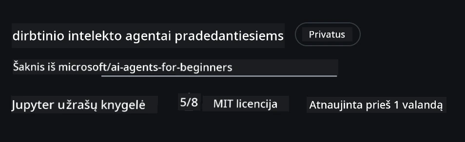
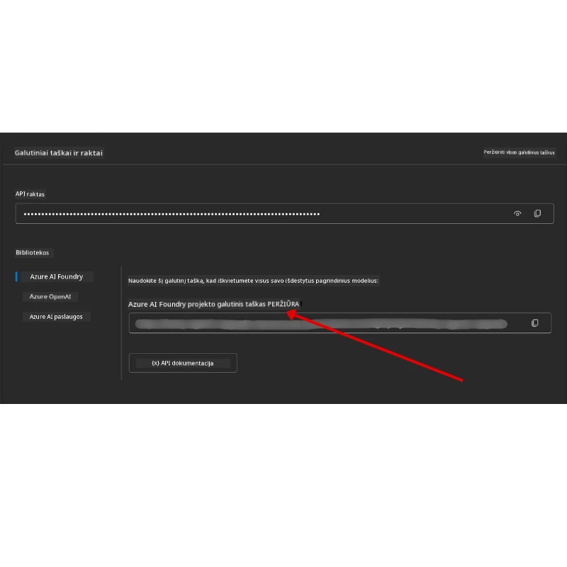

# Kurso paruošimas

## Įvadas

Ši pamoka apžvelgs, kaip paleisti šio kurso kodo pavyzdžius.

## Prisijunkite prie kitų mokinių ir gaukite pagalbą

Prieš pradėdami klonuoti savo repozitoriją, prisijunkite prie [AI Agents For Beginners Discord kanalo](https://aka.ms/ai-agents/discord), kad gautumėte pagalbą dėl sąrankos, užduotumėte klausimus apie kursą arba susisiektumėte su kitais mokiniais.

## Klonuokite arba atšakokite šią repozitoriją

Norėdami pradėti, klonuokite arba atšakokite GitHub repozitoriją. Tai sukurs jūsų asmeninę kurso medžiagos kopiją, kad galėtumėte paleisti, testuoti ir koreguoti kodą!

Tai galite padaryti spustelėję nuorodą <a href="https://github.com/microsoft/ai-agents-for-beginners/fork" target="_blank">atšakoti repozitoriją</a>

Dabar turėtumėte turėti savo atšakotą kurso versiją šioje nuorodoje:



### Negilus klonavimas (rekomenduojama dirbtuvėms / Codespaces)

  >Pilna repozitorija gali būti didelė (~3 GB), jei atsisiunčiate visą istoriją ir visus failus. Jei dalyvausite tik dirbtuvėse arba reikalingos tik kelios pamokų direktorijos, negilus klonavimas (arba retas klonavimas) leidžia išvengti didžiojo atsisiuntimo, sutrumpinant istoriją ir/ar praleidžiant blobus.

#### Greitas negilus klonavimas — minimalus istorijos kiekis, visi failai

Žemiau nurodytuose komandose `<your-username>` pakeiskite savo atšakos URL (arba aukštesnio lygio URL, jei pageidaujate).

Norėdami nuklonuoti tik naujausią sakinį istorijos (mažas atsisiuntimas):

```bash|powershell
git clone --depth 1 https://github.com/<your-username>/ai-agents-for-beginners.git
```

Norėdami nuklonuoti konkretų šaką:

```bash|powershell
git clone --depth 1 --branch <branch-name> https://github.com/<your-username>/ai-agents-for-beginners.git
```

#### Dalinis (retas) klonavimas — minimalūs blobai + tik pasirinktos direktorijos

Tai naudoja dalinį klonavimą ir sparčios peržiūros režimą (reikalauja Git 2.25+ ir rekomenduojamas modernus Git su dalinio klonato palaikymu):

```bash|powershell
git clone --depth 1 --filter=blob:none --sparse https://github.com/<your-username>/ai-agents-for-beginners.git
```

Pereikite į repozitorijos aplanką:

```bash|powershell
cd ai-agents-for-beginners
```

Tada nurodykite, kuriuos aplankus norite (žemiau pateiktas pavyzdys rodo du aplankus):

```bash|powershell
git sparse-checkout set 00-course-setup 01-intro-to-ai-agents
```

Po klonavimo ir failų patikrinimo, jei jums reikalingi tik failai ir norite išlaisvinti vietos (be git istorijos), ištrinkite repozitorijos metaduomenis (💀negrįžtama – prarasite visas Git funkcijas: jokių commitu, pull, push ar prieigos prie istorijos).

```bash
# zsh/bash
rm -rf .git
```

```powershell
# PowerShell
Remove-Item -Recurse -Force .git
```

#### Naudojant GitHub Codespaces (rekomenduojama, kad išvengtumėte didžiulių vietinių atsisiuntimų)

- Sukurkite naują Codespace šiai repozitorijai per [GitHub UI](https://github.com/codespaces).  

- Naujojoje Codespace terminale paleiskite vieną iš aukščiau pateiktų negilios arba retai klonavimo komandų, kad įtrauktumėte tik reikiamus pamokų aplankus į Codespace darbo erdvę.
- Pasirinktinai: po klonavimo Codespaces viduje pašalinkite .git, kad atlaisvintumėte papildomos vietos (žr. aukščiau pateiktas pašalinimo komandas).
- Pastaba: jeigu norite atidaryti repozitoriją tiesiogiai Codespaces (be papildomo klonavimo), turėkite omenyje, kad Codespaces nustatys devcontainer aplinką ir gali vis tiek paruošti daugiau, nei jums reikia. Klonavimas negiliai kopijos naujame Codespace suteikia jums daugiau kontrolės dėl disko naudojimo.

#### Patarimai

- Visada pakeiskite klonavimo URL į savo atšaką, jei norite redaguoti/pasiųsti pakeitimus.
- Jei vėliau reikės daugiau istorijos arba failų, galite juos parsiųsti arba koreguoti sparčios peržiūros filtrą, įtraukiant papildomus aplankus.

## Kodo paleidimas

Šis kursas siūlo seriją Jupyter užrašų knygelių, kurias galite paleisti, kad praktikuotumėtės statant AI agentus.

Kodo pavyzdžiai naudoja **Microsoft Agent Framework (MAF)** su `FoundryChatClient`, kuris jungiasi prie **Microsoft Foundry Agent Service V2** (Responses API) per **Microsoft Foundry**.

Visi Python užrašų knygelės yra pažymėtos kaip `*-python-agent-framework.ipynb`.

## Reikalavimai

- Python 3.12+
  - **PASTABA**: Jeigu neturite įdiegto Python 3.12, būtinai jį įdiekite. Tada sukurkite savo venv naudodami python3.12, kad būtų įdiegtos teisingos versijos iš requirements.txt failo.
  
    >Pavyzdys

    Sukurkite Python venv katalogą:

    ```bash|powershell
    python -m venv venv
    ```

    Tada suaktyvinkite venv aplinką šiems atvejams:

    ```bash
    # zsh/bash
    source venv/bin/activate
    ```
  
    ```dos
    # Command Prompt for Windows
    venv\Scripts\activate
    ```

- .NET 10+: Koduose, naudojančiuose .NET, įsitikinkite, kad įdiegėte [.NET 10 SDK](https://dotnet.microsoft.com/download/dotnet/10.0) arba naujesnę versiją. Patikrinkite savo įdiegtą .NET SDK versiją:

    ```bash|powershell
    dotnet --list-sdks
    ```

- **Azure CLI** — Reikalinga autentifikacijai. Įdiekite iš [aka.ms/installazurecli](https://aka.ms/installazurecli).
- **Azure prenumerata** — Norint pasiekti Microsoft Foundry ir Microsoft Foundry Agent Service.
- **Microsoft Foundry projektas** — Projektas su įdiegta modeliavimo sistema (pvz., `gpt-4o`). Matykite [1 žingsnis](#1-žingsnis-sukurkite-microsoft-foundry-projektą) žemiau.

Repozitorijos šaknyje pridėjome `requirements.txt` failą, kuriame yra visi reikalingi Python paketai kodo pavyzdžių paleidimui.

Juos galite įdiegti paleisdami šią komandą savo terminale repozitorijos šaknyje:

```bash|powershell
pip install -r requirements.txt
```

Rekomenduojame sukurti Python virtualią aplinką, kad išvengtumėte konfliktų ir problemų.

## VSCode paruošimas

Įsitikinkite, kad VSCode naudojate teisingą Python versiją.


## Microsoft Foundry ir Microsoft Foundry Agent Service nustatymas

### 1 žingsnis: Sukurkite Microsoft Foundry projektą

Jums reikia Microsoft Foundry **hub'o** ir **projekto** su įdiegta modelio sistema, kad paleistumėte užrašų knygeles.

1. Eikite į [ai.azure.com](https://ai.azure.com) ir prisijunkite su savo Azure paskyra.
2. Sukurkite **hub'ą** (arba naudokite esamą). Žr.: [Hub resursų apžvalga](https://learn.microsoft.com/azure/ai-foundry/concepts/ai-resources).
3. Hub'e sukurkite **projektą**.
4. Įdiekite modelį (pvz., `gpt-4o`) iš **Models + Endpoints** → **Deploy model**.

### 2 žingsnis: Gaukite projekto galutinį tašką ir modelio diegimo pavadinimą

Iš savo projekto Microsoft Foundry portale:

- **Projekto galutinis taškas** — Eikite į **Overview** puslapį ir nukopijuokite galutinio taško URL.



- **Modelio diegimo pavadinimas** — Eikite į **Models + Endpoints**, pasirinkite savo įdiegtą modelį ir užsirašykite **Deployment name** (pvz., `gpt-4o`).

### 3 žingsnis: Prisijunkite prie Azure naudodami `az login`

Visos užrašų knygelės autentiškuoja naudodamos **`AzureCliCredential`** — nereikia valdyti API raktų. Tai reikalauja, kad būtumėte prisijungę per Azure CLI.

1. **Įdiekite Azure CLI**, jei dar neįdiegėte: [aka.ms/installazurecli](https://aka.ms/installazurecli)

2. **Prisijunkite** vykdydami:

    ```bash|powershell
    az login
    ```

    Arba, jei esate nuotolinėje/Codespace aplinkoje be naršyklės:

    ```bash|powershell
    az login --use-device-code
    ```

3. **Pasirinkite prenumeratą**, jei paprašys – pasirinkite tą, kurioje yra jūsų Foundry projektas.

4. **Patikrinkite**, ar esate prisijungę:

    ```bash|powershell
    az account show
    ```

> **Kodėl `az login`?** Užrašų knygelės naudoja `AzureCliCredential` iš `azure-identity` paketo autentifikacijai – tai reiškia, kad jūsų Azure CLI sesija pateikia teisės duomenis – nereikia turėti API raktų ar slaptų duomenų `.env` faile. Tai yra [saugumo geriausia praktika](https://learn.microsoft.com/azure/developer/ai/keyless-connections).

### 4 žingsnis: Sukurkite savo `.env` failą

Nukopijuokite pavyzdinį failą:

```bash
# zsh/bash
cp .env.example .env
```

```powershell
# PowerShell
Copy-Item .env.example .env
```

Atidarykite `.env` ir užpildykite šias dvi reikšmes:

```env
AZURE_AI_PROJECT_ENDPOINT=https://<your-project>.services.ai.azure.com/api/projects/<your-project-id>
AZURE_AI_MODEL_DEPLOYMENT_NAME=gpt-4o
```

| Kintamasis | Kur rasti |
|----------|-----------------|
| `AZURE_AI_PROJECT_ENDPOINT` | Foundry portalas → jūsų projektas → **Overview** puslapis |
| `AZURE_AI_MODEL_DEPLOYMENT_NAME` | Foundry portalas → **Models + Endpoints** → jūsų įdiegto modelio pavadinimas |

Tai viskas daugumai pamokų! Užrašų knygelės automatiškai autentiškuos per jūsų `az login` sesiją.

### 5 žingsnis: Įdiekite Python priklausomybes

```bash|powershell
pip install -r requirements.txt
```

Rekomenduojama paleisti tai savo ankstesnė virtualioje aplinkoje.

## Papildoma sąranka 5 pamokai (Agentic RAG)

5 pamoka naudoja **Azure AI Search** informacijos gavimui. Jei planuojate paleisti šią pamoką, pridėkite šiuos kintamuosius į savo `.env` failą:

| Kintamasis | Kur rasti |
|----------|-----------------|
| `AZURE_SEARCH_SERVICE_ENDPOINT` | Azure portalas → jūsų **Azure AI Search** išteklius → **Overview** → URL |
| `AZURE_SEARCH_API_KEY` | Azure portalas → jūsų **Azure AI Search** išteklius → **Settings** → **Keys** → pagrindinis administratoriaus raktas |

## Papildoma sąranka pamokoms, kurios tiesiogiai naudoja Azure OpenAI (6 ir 8 pamokos)

Kai kurios 6 ir 8 pamokų užrašų knygelės tiesiogiai kreipiasi į **Azure OpenAI** (naudodamos **Responses API**) vietoje Microsoft Foundry projekto. Anksčiau šie pavyzdžiai naudojo GitHub Modelius, kurie yra nutraukiami (bus panaikinti 2026 m. liepos mėn.) ir nepalaiko Responses API. Jei planuojate paleisti šiuos pavyzdžius, pridėkite šiuos kintamuosius į savo `.env` failą:

| Kintamasis | Kur rasti |
|----------|-----------------|
| `AZURE_OPENAI_ENDPOINT` | Azure portalas → jūsų **Azure OpenAI** išteklius → **Keys and Endpoint** → Endpoint (pvz. `https://<your-resource>.openai.azure.com`) |
| `AZURE_OPENAI_DEPLOYMENT` | Jūsų įdiegto modelio pavadinimas (pvz., `gpt-4o-mini`), kuris palaiko Responses API |
| `AZURE_OPENAI_API_KEY` | Pasirinktinai – tik jei naudojate autentifikaciją raktu vietoje `az login` / Entra ID |

> Responses API naudoja stabilų `/openai/v1/` galutinį tašką, tad nereikia `api-version`. Prisijunkite su `az login`, kad naudotumėte autentifikaciją be raktų per Entra ID.

## Alternatyvus tiekėjas: MiniMax (suderinamas su OpenAI)

[MiniMax](https://platform.minimaxi.com/) teikia didelės apimties kontekstinius modelius (iki 204K tokenų) per OpenAI suderinamą API. Kadangi Microsoft Agent Framework `OpenAIChatClient` veikia su bet kuriuo OpenAI suderinamu galutiniu tašku, galite naudoti MiniMax kaip tiesioginę Azure OpenAI arba OpenAI alternatyvą.

Pridėkite šiuos kintamuosius į savo `.env` failą:

| Kintamasis | Kur rasti |
|----------|-----------------|
| `MINIMAX_API_KEY` | [MiniMax Platforma](https://platform.minimaxi.com/) → API raktai |
| `MINIMAX_BASE_URL` | Naudokite `https://api.minimax.io/v1` (numatytoji reikšmė) |
| `MINIMAX_MODEL_ID` | Naudojamo modelio pavadinimas (pvz., `MiniMax-M3`) |

**Pavyzdiniai modeliai**: `MiniMax-M3` (rekomenduojamas), `MiniMax-M2.7`, `MiniMax-M2.7-highspeed` (greitesni atsakymai). Modelių pavadinimai ir prieinamumas gali keistis laikui bėgant, o prieiga prie konkretaus modelio gali priklausyti nuo jūsų paskyros arba regiono – patikrinkite [MiniMax platformą](https://platform.minimaxi.com/) dėl dabartinio sąrašo. Jei `MiniMax-M3` nėra prieinamas jūsų paskyroje, nustatykite `MINIMAX_MODEL_ID` į modelį, prie kurio turite prieigą (pvz., `MiniMax-M2.7`).

Kodo pavyzdžiai, naudojantys `OpenAIChatClient` (pvz., 14 pamokos viešbučio rezervavimo darbo eiga), automatiškai atpažins ir naudos jūsų MiniMax konfigūraciją, kai bus nustatytas `MINIMAX_API_KEY`.

## Alternatyvus tiekėjas: Foundry Local (modelių paleidimas vietoje)

[Foundry Local](https://foundrylocal.ai) yra lengvas vykdymo įrankis, kuris atsisiunčia, tvarko ir aptarnauja kalbos modelius **visiškai jūsų pačių kompiuteryje** per OpenAI suderinamą API – be debesijos, be Azure prenumeratos ir be API raktų. Tai puiki opcija offline vystymui, eksperimentavimui be debesis sąnaudų arba duomenų saugojimui vietoje.

Kadangi Microsoft Agent Framework `OpenAIChatClient` veikia su bet kuriuo OpenAI suderinamu galutiniu tašku, Foundry Local yra tiesioginė vietinė Azure OpenAI alternatyva.

**1. Įdiekite Foundry Local**

```bash
# „Windows“
winget install Microsoft.FoundryLocal

# „macOS“
brew install foundrylocal
```

**2. Atsisiųskite ir paleiskite modelį** (tai taip pat paleidžia vietinę tarnybą):

```bash
foundry model list          # žiūrėti galimus modelius
foundry model run phi-4-mini
```

**3. Įdiekite Python SDK** naudojamą vietinio galutinio taško aptikimui:

```bash
pip install foundry-local-sdk
```

**4. Nukreipkite Microsoft Agent Framework į savo vietinį modelį:**

```python
from foundry_local import FoundryLocalManager
from agent_framework.openai import OpenAIChatClient

# Atsisiunčia (jei reikia) ir aptarnauja modelį vietoje, tada nustato galinį tašką/prievadą.
manager = FoundryLocalManager("phi-4-mini")

chat_client = OpenAIChatClient(
    base_url=manager.endpoint,      # pvz. http://localhost:<port>/v1
    api_key=manager.api_key,        # visada "neprivaloma" Foundry Local atveju
    model_id=manager.get_model_info("phi-4-mini").id,
)

agent = chat_client.as_agent(
    name="LocalAgent",
    instructions="You are a helpful assistant running fully on-device.",
)
```

> **Pastaba:** Foundry Local atskleidžia OpenAI suderinamą **Chat Completions** galutinį tašką. Naudokite jį vietiniam vystymui ir offline scenarijams. Pilnai **Responses API** funkcijų rinkiniui (būsimi pokalbiai, gilus įrankių orkestravimas ir agentų stiliaus vystymas), naudokite **Azure OpenAI** arba **Microsoft Foundry** projektą, kaip parodyta pamokose. Žr. [Foundry Local dokumentaciją](https://foundrylocal.ai) dėl dabartinės modelių katalogo ir platformos palaikymo.

## Papildoma sąranka 8 pamokai (Bing pagrindimo darbo eiga)


Sąlyginio darbo eigos užrašų knyga 8 pamokoje naudoja **Bing pagrindimą** per Microsoft Foundry. Jei planuojate paleisti tą pavyzdį, pridėkite šią kintamąją į savo `.env` failą:

| Kintamoji | Kur ją rasti |
|----------|--------------|
| `BING_CONNECTION_ID` | Microsoft Foundry portalas → jūsų projektas → **Valdymas** → **Prijungti ištekliai** → jūsų Bing ryšys → nukopijuokite ryšio ID |

## Problemų sprendimas

### SSL sertifikato patikros klaidos macOS

Jei naudojate macOS ir susiduriate su klaida, tokia kaip:

```plaintext
ssl.SSLCertVerificationError: [SSL: CERTIFICATE_VERIFY_FAILED] certificate verify failed: self-signed certificate in certificate chain
```

Tai žinoma problema su Python macOS, kai sistemos SSL sertifikatai nėra automatiškai patikimi. Išbandykite šiuos sprendimus iš eilės:

**1 variantas: Paleiskite Python Install Certificates scenarijų (rekomenduojama)**

```bash
# Pakeiskite 3.XX į savo įdiegtą Python versiją (pvz., 3.12 arba 3.13):
/Applications/Python\ 3.XX/Install\ Certificates.command
```

**2 variantas: Naudokite `connection_verify=False` savo užrašų knygoje (tik GitHub Models užrašų knygoms)**

6 pamokos užrašų knygoje (`06-building-trustworthy-agents/code_samples/06-system-message-framework.ipynb`) yra įtrauktas pašalintas sprendimas. Atkomentuokite `connection_verify=False` kuriant klientą:

```python
client = ChatCompletionsClient(
    endpoint=endpoint,
    credential=AzureKeyCredential(token),
    connection_verify=False,  # Išjunkite SSL patikros funkciją, jei susiduriate su sertifikato klaidomis
)
```

> **⚠️ Įspėjimas:** Išjungus SSL tikrinimą (`connection_verify=False`) sumažėja saugumas, nes praleidžiama sertifikato patikra. Naudokite tai tik kaip laikina sprendimą kūrimo aplinkose, niekada gamyboje.

**3 variantas: Įdiekite ir naudokite `truststore`**

```bash
pip install truststore
```

Tada pridėkite šias eilutes savo užrašų knygos ar scenarijaus pradžioje prieš bet kokius tinklo kvietimus:

```python
import truststore
truststore.inject_into_ssl()
```

## Užstrigote?

Jei kilo problemų vykdant šį nustatymą, prisijunkite prie mūsų <a href="https://discord.gg/kzRShWzttr" target="_blank">Azure AI bendruomenės Discord</a> arba <a href="https://github.com/microsoft/ai-agents-for-beginners/issues?WT.mc_id=academic-105485-koreyst" target="_blank">sukurkite problemos pranešimą</a>.

## Kitoji pamoka

Dabar esate pasirengę paleisti šio kurso kodą. Sėkmės gilinat žinias apie dirbtinių intelektų agentų pasaulį!

[Įvadas į AI agentus ir agentų naudojimo atvejus](../01-intro-to-ai-agents/README.md)

---

<!-- CO-OP TRANSLATOR DISCLAIMER START -->
**Atsakomybės apribojimas**:
Šis dokumentas buvo išverstas naudojant dirbtinio intelekto vertimo paslaugą [Co-op Translator](https://github.com/Azure/co-op-translator). Nors siekiame tikslumo, prašome atkreipti dėmesį, kad automatiniai vertimai gali turėti klaidų ar netikslumų. Originalus dokumentas jo gimtąja kalba laikomas autoritetingu šaltiniu. Svarbiai informacijai rekomenduojama naudoti profesionalų žmogiškąjį vertimą. Mes neatsakome už jokius nesusipratimus ar neteisingą interpretaciją, kilusią naudojantis šiuo vertimu.
<!-- CO-OP TRANSLATOR DISCLAIMER END -->