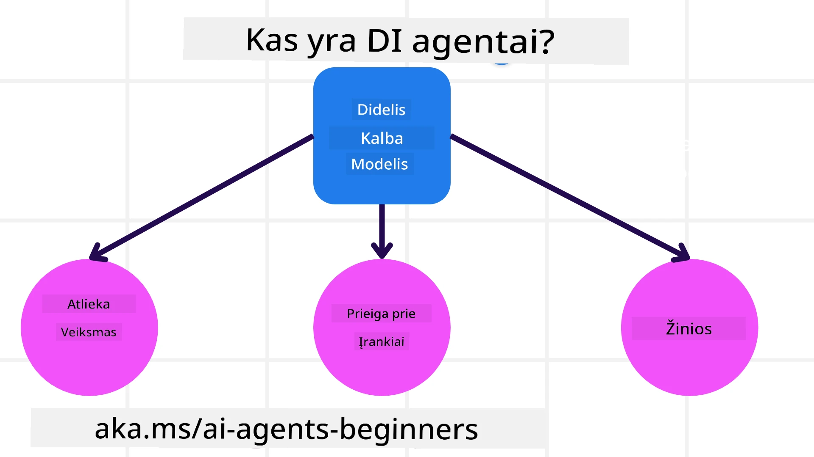
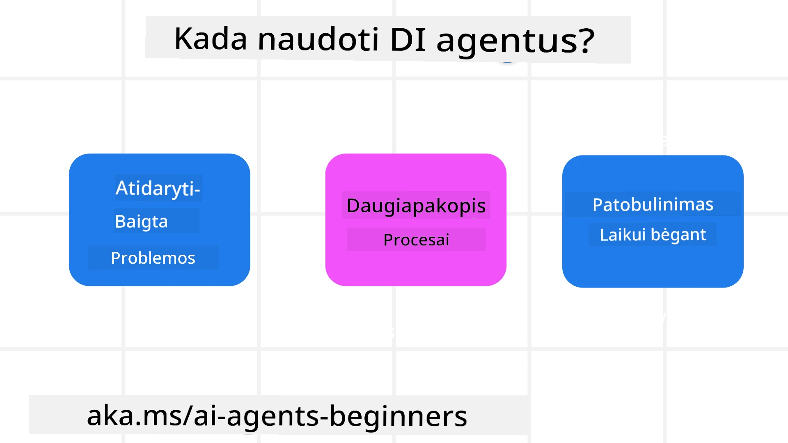

> _(Spustelėkite paveikslėlį aukščiau, kad peržiūrėtumėte šios pamokos vaizdo įrašą)_

# Įvadas į AI agentus ir agentų naudojimo atvejus

Sveiki atvykę į kursą „AI Agents for Beginners“! Šis kursas suteikia pagrindines žinias ir taikomųjų pavyzdžių AI agentų kūrimui.

Prisijunkite prie <a href="https://discord.gg/kzRShWzttr" target="_blank">Azure AI Discord bendruomenės</a>, kad susipažintumėte su kitais besimokančiais ir AI agentų kūrėjais bei užduotumėte bet kokius klausimus apie šį kursą.

Pradėdami šį kursą, mes pradėsime nuo geresnio supratimo, kas yra AI agentai ir kaip juos galime panaudoti programose ir darbo procesuose, kuriuos kuriame.

## Įžanga

Ši pamoka apima:

- Kas yra AI agentai ir kokie yra skirtingi agentų tipai?
- Kokie naudojimo atvejai geriausiai tinka AI agentams ir kaip jie gali mums padėti?
- Kokie yra pagrindiniai elementai kuriant agentinius sprendimus?

## Mokymosi tikslai
Baigę šią pamoką, turėtumėte sugebėti:

- Suprasti AI agentų koncepcijas ir kaip jos skiriasi nuo kitų AI sprendimų.
- Efektyviai taikyti AI agentus.
- Produktingai projektuoti agentinius sprendimus tiek vartotojams, tiek klientams.

## AI agentų apibrėžimas ir AI agentų tipai

### Kas yra AI agentai?

AI agentai yra **sistemos**, kurios leidžia **Dideliems kalbos modeliams (LLMs)** **atlikti veiksmus**, išplėsdamos jų galimybes suteikiant LLM prieigą prie **įrankių** ir **žinių**.

Padalinkime šį apibrėžimą į mažesnes dalis:

- **Sistema** - Svarbu galvoti apie agentus ne tik kaip apie vieną komponentą, o kaip apie daug komponentų sistemą. Pagrindiniu lygiu AI agento komponentai yra:
  - **Aplinka** - Apibrėžta erdvė, kurioje veikia AI agentas. Pavyzdžiui, jei turėtume kelionių užsakymų AI agentą, aplinka galėtų būti kelionių užsakymų sistema, kurią agentas naudoja užduotims atlikti.
  - **Jutikliai** - Aplinkos turi informaciją ir teikia grįžtamąjį ryšį. AI agentai naudoja jutiklius, kad surinktų ir interpretuotų informaciją apie dabartinę aplinkos būseną. Kelionių užsakymų agento pavyzdyje kelionių užsakymų sistema gali pateikti informaciją, tokią kaip viešbučio prieinamumas ar skrydžių kainos.
  - **Aktuatoriai** - Kai AI agentas gauna dabartinę aplinkos būseną, už esamą užduotį agentas nustato, kokį veiksmą atlikti, kad pakeistų aplinką. Kelionių užsakymų agentui tai gali būti užsakyti prieinamą kambarį vartotojui.

**Dideli kalbos modeliai (LLMs)** - Agentų koncepcija egzistavo dar prieš LLM atsiradimą. Kuriant AI agentus su LLM pranašumas yra jų gebėjimas interpretuoti žmogaus kalbą ir duomenis. Šis gebėjimas leidžia LLM interpretuoti aplinkos informaciją ir apibrėžti planą aplinkai pakeisti.

**Atlikti veiksmus** - Už AI agentų sistemų ribų LLM yra riboti situacijose, kur veiksmas yra turinio ar informacijos generavimas pagal vartotojo užklausą. AI agentų sistemose LLM gali įvykdyti užduotis interpretuodami vartotojo prašymą ir naudodami aplinkoje prieinamus įrankius.

**Prieiga prie įrankių** - Kokie įrankiai yra prieinami LLM yra apibrėžta 1) aplinkos, kurioje jis veikia, ir 2) AI agento kūrėjo. Mūsų kelionių agento pavyzdyje agento įrankiai yra ribojami operacijomis, prieinamomis užsakymų sistemoje, ir (arba) kūrėjas gali apriboti agento prieigą tik prie skrydžių.

**Atmintis + žinios** - Atmintis gali būti trumpalaikė, pokalbio tarp vartotojo ir agento kontekste. Ilgalaikėje perspektyvoje, nepriklausomai nuo aplinkos pateiktos informacijos, AI agentai taip pat gali gauti žinių iš kitų sistemų, paslaugų, įrankių ir net kitų agentų. Kelionių agento pavyzdyje šios žinios galėtų būti informacija apie vartotojo kelionių pageidavimus, saugoma klientų duomenų bazėje.

### Skirtingi agentų tipai

Now that we have a general definition of AI Agents, let us look at some specific agent types and how they would be applied to a travel booking AI agent.

| **Agentų tipas**                | **Aprašymas**                                                                                                                       | **Pavyzdys**                                                                                                                                                                                                                   |
| ----------------------------- | ------------------------------------------------------------------------------------------------------------------------------------- | ----------------------------------------------------------------------------------------------------------------------------------------------------------------------------------------------------------------------------- |
| **Paprasti refleksiniai agentai**      | Atlieka momentinius veiksmus pagal iš anksto apibrėžtas taisykles.                                                                                  | Kelionių agentas interpretuoja el. laiško kontekstą ir persiunčia kelionių skundus klientų aptarnavimui.                                                                                                                          |
| **Modeliu paremti refleksiniai agentai** | Atlieka veiksmus remdamiesi pasaulio modeliu ir šio modelio pokyčiais.                                                              | Kelionių agentas prioritetą teikia maršrutams su reikšmingais kainų pokyčiais, remdamasis prieiga prie istorinės kainų informacijos.                                                                                                             |
| **Agentai, orientuoti į tikslą**         | Kuria planus, kad pasiektų konkrečius tikslus, interpretuodami tikslą ir nustatydami veiksmus jam pasiekti.                                  | Kelionių agentas užsako kelionę nustatydamas reikalingus kelionės susitarimus (automobilį, viešąjį transportą, skrydžius) nuo dabartinės vietos iki paskirties vietos.                                                                                |
| **Naudingumo pagrindu veikiantys agentai**      | Apsvarsto nuostatas ir skaičiškai įvertina kompromisus, kad nustatytų, kaip pasiekti tikslus.                                               | Kelionių agentas maksimalizuoja naudingumą vertindamas patogumo ir kainos santykį užsakant keliones.                                                                                                                                          |
| **Mokymosi agentai**           | Tobulėja laikui bėgant, reaguodami į atsiliepimus ir atitinkamai koreguodami veiksmus.                                                        | Kelionių agentas tobulėja naudodamas klientų atsiliepimus iš po kelionės apklausų, kad atliktų pakeitimus būsimuose užsakymuose.                                                                                                               |
| **Hierarchiniai agentai**       | Apima kelis agentus sluoksniuotoje sistemoje, kur aukštesnio lygio agentai suskaido užduotis į sub-užduotis, kurias atlieka žemesnio lygio agentai. | Kelionių agentas atšaukia kelionę suskirstydamas užduotį į smulkesnes užduotis (pvz., atšaukti konkrečius užsakymus) ir leisdamas žemesnio lygio agentams jas įvykdyti, pranešant atgal aukštesnio lygio agentui.                                     |
| **Daugiagentės sistemos (MAS)** | Agentai atlieka užduotis savarankiškai, arba bendradarbiaudami, arba konkuruodami.                                                           | Bendradarbiavimas: keli agentai užsako konkrečias kelionės paslaugas, tokias kaip viešbučiai, skrydžiai ir pramogos. Konkurencija: keli agentai valdo ir konkuruoja dėl bendro viešbučio užsakymų kalendoriaus, siekdami užregistruoti klientus į viešbutį. |

## Kada naudoti AI agentus

Anksčiau skiltyje naudojome kelionių agento panaudojimo atvejį, kad paaiškintume, kaip skirtingi agentų tipai gali būti naudojami įvairiose kelionių užsakymų scenarijuose. Šią programą naudosime visame kurse.

Pažiūrėkime, kokiuose naudojimo atvejuose AI agentai yra tinkamiausi:

- **Atviros problemos** - leidžiant LLM nustatyti reikiamus žingsnius užduočiai atlikti, nes jų ne visada galima užkoduoti į darbo eigą.
- **Daugiapakopės procedūros** - užduotys, kurios reikalauja tam tikro sudėtingumo, kai AI agentas turi naudoti įrankius ar informaciją per kelis žingsnius, o ne vienkartinį atgavimą.  
- **Tobulėjimas laikui bėgant** - užduotys, kurioms agentas gali tobulėti gautas atsiliepimus iš aplinkos ar vartotojų, taip teikdamas didesnę naudą.

Daugiau svarstymų apie AI agentų naudojimą aptarsime pamokoje „Kuriant patikimus AI agentus“.

## Agentinių sprendimų pagrindai

### Agentų kūrimas

Pirmasis žingsnis projektuojant AI agentų sistemą yra apibrėžti įrankius, veiksmus ir elgesį. Šiame kurse mes sutelkiame dėmesį į **Azure AI Agent Service** naudojimą agentams apibrėžti. Jis siūlo tokias funkcijas kaip:

- Atvirų modelių, tokių kaip OpenAI, Mistral ir Llama, pasirinkimas
- Licencijuotų duomenų naudojimas per tiekėjus, tokius kaip Tripadvisor
- Standartizuotų OpenAPI 3.0 įrankių naudojimas

### Agentiniai modeliai

Bendravimas su LLM vyksta per užuominas (prompts). Atsižvelgiant į pusiau autonominę AI agentų pobūdį, ne visada yra įmanoma arba būtina rankiniu būdu iškart vėl siųsti užklausą LLM po aplinkos pakeitimo. Mes naudojame **agentinius modelius**, kurie leidžia mums inicijuoti užklausas LLM per kelis žingsnius masteliu.

Šis kursas yra padalintas į kai kuriuos šiuo metu populiarius agentinius modelius.

### Agentų karkasai

Agentų karkasai leidžia kūrėjams įgyvendinti agentinius modelius per kodą. Šie karkasai siūlo šablonus, įskiepius ir įrankius geresniam AI agentų bendradarbiavimui. Šios naudos suteikia geresnę stebimąją galią ir trikčių šalinimo galimybes AI agentų sistemoms.

Šiame kurse nagrinėsime Microsoft Agent Framework (MAF), skirtą gamybai parengtų AI agentų kūrimui.

## Pavyzdiniai kodai

- Python: [Agentų karkasas](./code_samples/01-python-agent-framework.ipynb)
- .NET: [Agentų karkasas](./code_samples/01-dotnet-agent-framework.md)

## Turite daugiau klausimų apie AI agentus?

Prisijunkite prie [Microsoft Foundry Discord](https://aka.ms/ai-agents/discord), kad susitikti su kitais besimokančiais, dalyvauti konsultacijose ir gauti atsakymus į savo klausimus apie AI agentus.

## Ankstesnė pamoka

[Kurso nustatymai](../00-course-setup/README.md)

## Kita pamoka

[Agentinių karkasų tyrinėjimas](../02-explore-agentic-frameworks/README.md)

---

<!-- CO-OP TRANSLATOR DISCLAIMER START -->
Atsakomybės apribojimas:
Šis dokumentas buvo išverstas naudojant dirbtinio intelekto vertimo paslaugą Co-op Translator (https://github.com/Azure/co-op-translator). Nors stengiamės užtikrinti tikslumą, atkreipkite dėmesį, kad automatizuoti vertimai gali turėti klaidų ar netikslumų. Originalus dokumentas pradinėje (gimtojoje) kalboje turi būti laikomas autoritetingu šaltiniu. Kritinei informacijai rekomenduojamas profesionalus žmogaus vertimas. Mes neprisiimame atsakomybės už bet kokius nesusipratimus ar neteisingus aiškinimus, kylančius dėl šio vertimo naudojimo.
<!-- CO-OP TRANSLATOR DISCLAIMER END -->