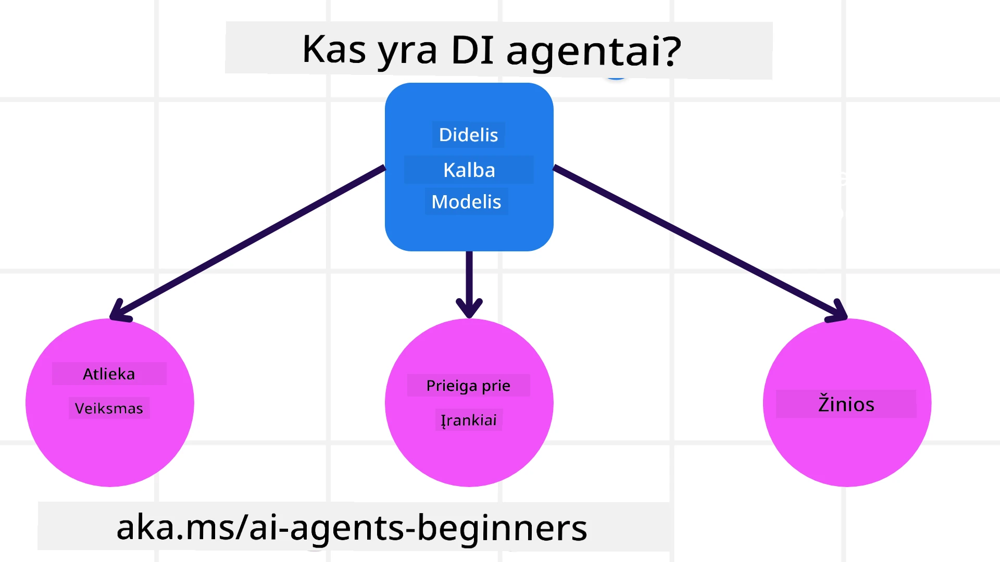
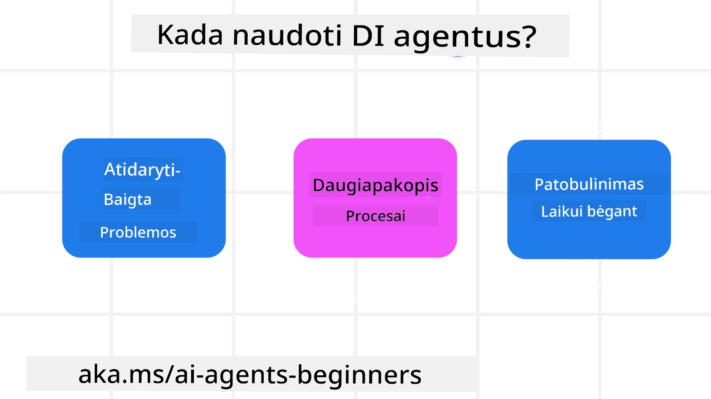

> _(Paspauskite aukščiau esantį vaizdą, kad peržiūrėtumėte šios pamokos vaizdo įrašą)_

# Įvadas į AI agentus ir agentų naudojimo atvejus

Sveiki atvykę į **AI agentų pradedantiesiems** kursą! Šis kursas suteikia jums pagrindines žinias — ir veikiantį kodą — nuo ko pradėti kurti AI agentus nuo nulio.

Ateikite ir pasisveikinkite <a href="https://discord.gg/kzRShWzttr" target="_blank">Azure AI Discord bendruomenėje</a> — joje pilna mokinių ir AI kūrėjų, kurie mielai atsako į klausimus.

Prieš pradėdami kurti, įsitikinkime, kad tikrai suprantame, kas yra AI agentas ir kada verta jį naudoti.

---

## Įvadas

Ši pamoka apima:

- Kas yra AI agentai ir kokie skirtingi jų tipai egzistuoja
- Kokiems užduotims AI agentai yra geriausiai tinkami
- Pagrindinius komponentus, kuriuos naudosite projektuodami agentinį sprendimą

## Mokymosi tikslai

Šios pamokos pabaigoje turėtumėte gebėti:

- Paaiškinti, kas yra AI agentas ir kuo jis skiriasi nuo įprasto AI sprendimo
- Žinoti, kada verta naudoti AI agentą (ir kada ne)
- Nusibrėžti pagrindinį agentinio sprendimo dizainą realaus pasaulio problemai

---

## AI agentų apibrėžimas ir AI agentų tipai

### Kas yra AI agentai?

Štai paprastas paaiškinimas:

> **AI agentai yra sistemos, kurios leidžia Dideliems kalbos modeliams (LLM) iš tiesų *daryti* veiksmus — suteikiant jiems įrankius ir žinias veikti pasaulyje, o ne tik atsakyti į užklausas.**

Paaiškinkime tai plačiau:

- **Sistema** — AI agentas nėra vienas dalykas. Tai dalių rinkinys, kuris veikia kartu. Pagrinde kiekvienas agentas turi tris dalis:
  - **Aplinka** — erdvė, kurioje agentas veikia. Kelionių užsakymo agentui tai būtų pats užsakymų platforma.
  - **Jutikliai** — kaip agentas skaito dabartinę aplinkos būseną. Mūsų kelionių agentas gali tikrinti viešbučių prieinamumą ar skrydžių kainas.
  - **Akcijų vykdytojai** — kaip agentas imasi veiksmų. Kelionių agentas gali užsakyti kambarį, išsiųsti patvirtinimą arba atšaukti rezervaciją.

- **Dideli kalbos modeliai** — Agentai egzistavo prieš LLM, tačiau LLM daro šiuolaikinius agentus tokiais galingais. Jie gali suprasti natūralią kalbą, mąstyti kontekste ir paversti neaiškią užklausą į konkrečią veiksmų planą.

- **Atlikti veiksmus** — Be agentų sistemos, LLM tiesiog generuoja tekstą. Agentų sistemoje LLM gali iš tiesų *vykdyti* veiksmus — ieškoti duomenų bazėje, kviesti API, siųsti žinutę.

- **Prieiga prie įrankių** — Kokius įrankius agentas gali naudoti priklauso nuo (1) aplinkos, kurioje jis veikia, ir (2) ką kūrėjas jam suteikė. Kelionių agentas gali ieškoti skrydžių, bet negali redaguoti klientų įrašų — viskas priklauso nuo sujungimo.

- **Atmintis ir žinios** — Agentai gali turėti trumpalaikę atmintį (dabartinė pokalbio seka) ir ilgalaikę atmintį (klientų duomenų bazė, ankstesni sąveikavimai). Kelionių agentas gali "atsiminti", kad pageidaujate sėdėti prie lango.

---

### Skirtingi AI agentų tipai

Ne visi agentai yra vienodi. Štai pagrindinių tipų apžvalga, naudojant kelionių užsakymo agentą kaip pavyzdį:

| **Agentų tipas** | **Ką daro** | **Kelionių agento pavyzdys** |
|---|---|---|
| **Paprasti refleksiniai agentai** | Laikosi iš anksto užkoduotų taisyklių — be atminties, be planavimo. | Matė skundo el. laišką → persiunčia klientų aptarnavimui. Viskas. |
| **Modeliu pagrįsti refleksiniai agentai** | Laiko vidinį pasaulio modelį ir atnaujina jį pagal pasikeitimus. | Sekė istorines skrydžių kainas ir pažymėjo maršrutus, kurie staiga pabrango. |
| **Tikslais pagrįsti agentai** | Turi tikslą ir žingsnis po žingsnio sugalvoja, kaip jį pasiekti. | Užsakė visą kelionę (skrydžius, automobilį, viešbutį) nuo jūsų dabartinės vietos iki kelionės tikslo. |
| **Naudingumo pagrindu agentai** | Neretai randa *geriausią* sprendimą, įvertindami už ir prieš variantus. | Subalansavo kainą ir patogumą, kad rastų kelionę, labiausiai atitinkančią jūsų pageidavimus. |
| **Mokymosi agentai** | Tobulėja laikui bėgant mokydamiesi iš atsiliepimų. | Koregavo būsimus užsakymo pasiūlymus pagal po kelionės apklausos rezultatus. |
| **Hierarchiniai agentai** | Aukšto lygio agentas skaidė darbą į potaskius ir delegavo juos žemesnio lygio agentams. | Prašymas "atšaukti kelionę" buvo suskaidytas į: atšaukti skrydį, atšaukti viešbutį, atšaukti automobilio nuomą — kiekvienas spręstas atskirai. |
| **Daugiagentinės sistemos (MAS)** | Keli nepriklausomi agentai dirba kartu (arba konkuruoja). | Bendradarbiaujantys: atskiri agentai rūpinasi viešbučiais, skrydžiais ir pramogomis. Konkuruojantys: keli agentai varžosi užpildyti viešbučio kambarius geriausia kaina. |

---

## Kada naudoti AI agentus

Tik todėl, kad galite naudoti AI agentą, dar nereiškia, kad visada turėtumėte. Štai situacijos, kai agentai tikrai išsiskiria:

- **Atviros problemos** — kai problemos sprendimo žingsnių negalima iš anksto užprogramuoti. Reikia, kad LLM dinamiškai rastų kelią.
- **Daugiažingsniai procesai** — užduotys, kurios reikalauja naudoti įrankius per kelis veiksmus, o ne vien tik vieną paiešką ar generavimą.
- **Tobulėjimas laikui bėgant** — kai norite, kad sistema taptų protingesnė remiantis vartotojo atsiliepimais ar aplinkos signalais.

Vėliau kurse gilinsimės į tai, kada (ir kada *ne*) naudoti AI agentus pamokoje **Patikimų AI agentų kūrimas**.

---

## Agentinių sprendimų pagrindai

### Agentų kūrimas

Pirmas dalykas, kurį darote kurdami agentą, yra apibrėžti *ką jis gali daryti* — jo įrankius, veiksmus ir elgseną.

Šiame kurse mes naudojame **Microsoft Foundry Agent Service** kaip pagrindinę platformą. Ji palaiko:

- Modelius iš tiekėjų, tokių kaip OpenAI, Mistral, ir Meta (Llama)
- Licencijuotus duomenis iš tiekėjų, tokių kaip Tripadvisor
- Standartizuotas OpenAPI 3.0 įrankių apibrėžtis

### Agentiniai modeliai

Bendraujate su LLM per užklausas. Su agentais ne visada galite ranka suformuluoti kiekvieną užklausą — agentas turi veikti per daug žingsnių. Tam yra **agentinių modelių** — pakartotinai naudojamos strategijos, skirtos išradingam ir patikimam LLM koordinavimui.

Šis kursas struktūruotas aplink pačius įprastus ir naudingiausius agentinius modelius.

### Agentų karkasai

Agentų karkasai suteikia kūrėjams paruoštus šablonus, įrankius ir infrastruktūrą agentų kūrimui. Jie supaprastina:

- Sujungti įrankius ir galimybes
- Stebėti, ką agentas daro (ir taisyti klaidas)
- Bendradarbiauti su keliais agentais

Šiame kurse mes daugiausia dėmesio skiriame **Microsoft Agent Framework (MAF)** gamybinės klasės agentų kūrimui.

---

## Kodo pavyzdžiai

Paruošta pamatyti veikiantį kodą? Štai šios pamokos kodo pavyzdžiai:

- 🐍 Python: [Agent Framework](./code_samples/01-python-agent-framework.ipynb)
- 🔷 .NET: [Agent Framework](./code_samples/01-dotnet-agent-framework.md)

---

## Turite klausimų?

Prisijunkite prie [Microsoft Foundry Discord](https://discord.com/invite/ATgtXmAS5D), kad susisiektumėte su kitais mokiniais, dalyvautumėte biuro valandomis ir gautumėte AI agentų klausimų atsakymus iš bendruomenės.

---

## Ankstesnė pamoka

[Kurso įrengimas](../00-course-setup/README.md)

## Kitoji pamoka

[Agentinių karkasų tyrinėjimas](../02-explore-agentic-frameworks/README.md)

---

<!-- CO-OP TRANSLATOR DISCLAIMER START -->
**Atsakomybės apribojimas**:
Šis dokumentas buvo išverstas naudojant dirbtinio intelekto vertimo paslaugą [Co-op Translator](https://github.com/Azure/co-op-translator). Nors siekiame tikslumo, prašome atkreipti dėmesį, kad automatiniai vertimai gali turėti klaidų ar netikslumų. Originalus dokumentas jo gimtąja kalba laikomas autoritetingu šaltiniu. Svarbiai informacijai rekomenduojama naudoti profesionalų žmogiškąjį vertimą. Mes neatsakome už jokius nesusipratimus ar neteisingą interpretaciją, kilusią naudojantis šiuo vertimu.
<!-- CO-OP TRANSLATOR DISCLAIMER END -->