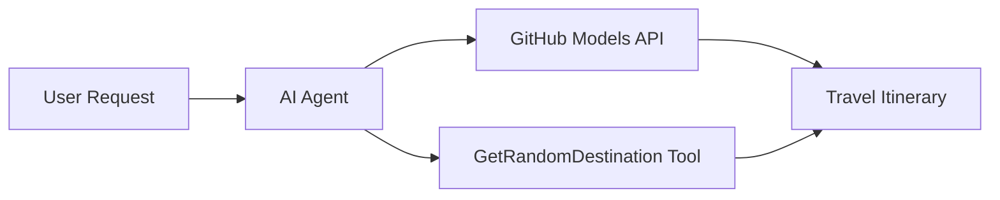

<!--
CO_OP_TRANSLATOR_METADATA:
{
  "original_hash": "23afd9be7b6ba5b69a44c3b6a78e07f6",
  "translation_date": "2025-11-06T10:07:35+00:00",
  "source_file": "01-intro-to-ai-agents/code_samples/01-dotnet-agent-framework.md",
  "language_code": "lt"
}
-->
# 🌍 AI Kelionių Agentas su Microsoft Agent Framework (.NET)

## 📋 Scenarijaus Apžvalga

Šiame užrašų knygelėje demonstruojama, kaip sukurti intelektualų kelionių planavimo agentą naudojant Microsoft Agent Framework for .NET. Agentas gali automatiškai generuoti asmeninius dienos kelionių maršrutus atsitiktinėms pasaulio vietoms.

**Pagrindinės Galimybės:**
- 🎲 **Atsitiktinis Vietos Pasirinkimas**: Naudoja pritaikytą įrankį atostogų vietoms pasirinkti
- 🗺️ **Išmanus Kelionių Planavimas**: Kuria detalius dienos maršrutus
- 🔄 **Realaus Laiko Transliacija**: Palaiko tiek momentinius, tiek transliuojamus atsakymus
- 🛠️ **Pritaikytų Įrankių Integracija**: Demonstruoja, kaip išplėsti agento galimybes

## 🔧 Techninė Architektūra

### Pagrindinės Technologijos
- **Microsoft Agent Framework**: Naujausia .NET implementacija AI agentų kūrimui
- **GitHub Models Integracija**: Naudoja GitHub AI modelių inferencijos paslaugą
- **OpenAI API Suderinamumas**: Naudoja OpenAI klientų bibliotekas su pritaikytais galiniais taškais
- **Saugus Konfigūravimas**: API raktų valdymas pagal aplinką

### Pagrindiniai Komponentai
1. **AIAgent**: Pagrindinis agento organizatorius, valdantis pokalbių eigą
2. **Pritaikyti Įrankiai**: `GetRandomDestination()` funkcija, prieinama agentui
3. **Chat Client**: GitHub Models palaikoma pokalbių sąsaja
4. **Transliacijos Palaikymas**: Realaus laiko atsakymų generavimo galimybės

### Integracijos Šablonas


## 🚀 Pradžia

**Reikalavimai:**
- .NET 10.0 ar naujesnė versija
- GitHub Models API prieigos raktas
- Aplinkos kintamieji sukonfigūruoti `.env` faile

**Reikalingi Aplinkos Kintamieji:**
```env
GITHUB_TOKEN=your_github_token
GITHUB_ENDPOINT=https://models.inference.ai.azure.com
GITHUB_MODEL_ID=gpt-4o-mini
```

Vykdykite žemiau pateiktą kodo pavyzdį iš eilės, kad pamatytumėte kelionių agentą veiksmuose!

---

## .NET Vieno Failo Programėlė: AI Kelionių Agentas Pavyzdys

Žr. `01-dotnet-agent-framework.cs` visam vykdomam kodo pavyzdžiui.

```bash
dotnet run 01-dotnet-agent-framework.cs
```

### Kodo Pavyzdys

```csharp
static string GetRandomDestination()
{
    var destinations = new List<string>
    {
        "Paris, France",
        "Tokyo, Japan",
        "New York City, USA",
        "Sydney, Australia",
        "Rome, Italy",
        "Barcelona, Spain",
        "Cape Town, South Africa",
        "Rio de Janeiro, Brazil",
        "Bangkok, Thailand",
        "Vancouver, Canada"
    };
    var random = new Random();
    int index = random.Next(destinations.Count);
    return destinations[index];
}

// Extract configuration from environment variables
var github_endpoint = Environment.GetEnvironmentVariable("GITHUB_ENDPOINT") ?? throw new InvalidOperationException("GITHUB_ENDPOINT is not set.");
var github_model_id = Environment.GetEnvironmentVariable("GITHUB_MODEL_ID") ?? "gpt-4o-mini";
var github_token = Environment.GetEnvironmentVariable("GITHUB_TOKEN") ?? throw new InvalidOperationException("GITHUB_TOKEN is not set.");

// Configure OpenAI Client Options
var openAIOptions = new OpenAIClientOptions()
{
    Endpoint = new Uri(github_endpoint)
};

// Initialize OpenAI Client with GitHub Models Configuration
var openAIClient = new OpenAIClient(new ApiKeyCredential(github_token), openAIOptions);

// Create AI Agent with Travel Planning Capabilities
AIAgent agent = openAIClient
    .GetChatClient(github_model_id)
    .CreateAIAgent(
        instructions: "You are a helpful AI Agent that can help plan vacations for customers at random destinations",
        tools: [AIFunctionFactory.Create(GetRandomDestination)]
    );

// Execute Agent: Plan a Day Trip (Non-Streaming)
Console.WriteLine(await agent.RunAsync("Plan me a day trip"));

// Execute Agent: Plan a Day Trip (Streaming Response)
await foreach (var update in agent.RunStreamingAsync("Plan me a day trip"))
{
    Console.Write(update);
}
```

---

**Atsakomybės apribojimas**:  
Šis dokumentas buvo išverstas naudojant AI vertimo paslaugą [Co-op Translator](https://github.com/Azure/co-op-translator). Nors siekiame tikslumo, prašome atkreipti dėmesį, kad automatiniai vertimai gali turėti klaidų ar netikslumų. Originalus dokumentas jo gimtąja kalba turėtų būti laikomas autoritetingu šaltiniu. Dėl svarbios informacijos rekomenduojama profesionali žmogaus vertimo paslauga. Mes neprisiimame atsakomybės už nesusipratimus ar neteisingus aiškinimus, atsiradusius naudojant šį vertimą.