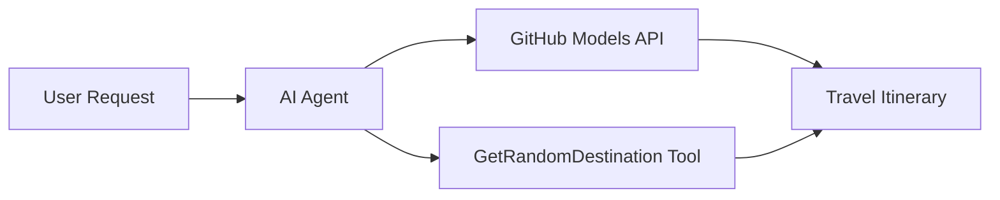

# 🌍 AI Kelionių Agentas su Microsoft Agent Framework (.NET)

## 📋 Scenarijaus Apžvalga

Šiame užrašų knygelėje demonstruojama, kaip sukurti išmanų kelionių planavimo agentą naudojant Microsoft Agent Framework skirtą .NET. Agentas gali automatiškai generuoti suasmenintus vienos dienos kelionių maršrutus atsitiktinėms pasaulio vietoms.

**Pagrindinės Galimybės:**
- 🎲 **Atsitiktinis Vietos Pasirinkimas**: Naudoja pritaikytą įrankį atostogų vietoms parinkti
- 🗺️ **Išmanus Kelionių Planavimas**: Kuria detalius dienos po dienos maršrutus
- 🔄 **Realaus Laiko Transliavimas**: Palaiko tiek momentinius, tiek transliuojamus atsakymus
- 🛠️ **Pritaikytų Įrankių Integracija**: Parodo, kaip išplėsti agento galimybes

## 🔧 Techninė Architektūra

### Pagrindinės Technologijos
- **Microsoft Agent Framework**: Naujausia .NET įgyvendinimo versija AI agentų kūrimui
- **GitHub Modelių Integracija**: Naudoja GitHub AI modelių inferencijos paslaugą
- **OpenAI API Suderinamumas**: Naudoja OpenAI klientų bibliotekas su pritaikytais galiniais taškais
- **Saugus Konfigūravimas**: API raktų valdymas pagal aplinką

### Pagrindiniai Komponentai
1. **AIAgent**: Pagrindinis agento organizatorius, valdantis pokalbių eigą
2. **Pritaikyti Įrankiai**: `GetRandomDestination()` funkcija, prieinama agentui
3. **Pokalbių Klientas**: Pokalbių sąsaja, paremta GitHub Modeliais
4. **Transliavimo Palaikymas**: Realaus laiko atsakymų generavimo galimybės

### Integracijos Šablonas


## 🚀 Pradžia

**Būtinos Sąlygos:**
- .NET 9.0 ar naujesnė versija
- GitHub Modelių API prieigos raktas
- Aplinkos kintamieji, sukonfigūruoti `.env` faile

**Reikalingi Aplinkos Kintamieji:**
```env
GITHUB_TOKEN=your_github_token
GITHUB_ENDPOINT=https://models.inference.ai.azure.com
GITHUB_MODEL_ID=gpt-4o-mini
```

Vykdykite žemiau esančias ląsteles iš eilės, kad pamatytumėte kelionių agentą veikiantį!

---

## .NET Single File App: AI Travel Agent Example

See `01-dotnet-agent-framework.cs` for the complete runnable code sample.

Paleiskite toliau pateiktą kodo pavyzdį:

```bash
dotnet run 01-dotnet-agent-framework.cs
```

### Sample Code

```csharp
static string GetRandomDestination()
{
    var destinations = new List<string>
    {
        "Paris, France",
        "Tokyo, Japan",
        "New York City, USA",
        "Sydney, Australia",
        "Rome, Italy",
        "Barcelona, Spain",
        "Cape Town, South Africa",
        "Rio de Janeiro, Brazil",
        "Bangkok, Thailand",
        "Vancouver, Canada"
    };
    var random = new Random();
    int index = random.Next(destinations.Count);
    return destinations[index];
}

// Extract configuration from environment variables
var github_endpoint = Environment.GetEnvironmentVariable("GITHUB_ENDPOINT") ?? throw new InvalidOperationException("GITHUB_ENDPOINT is not set.");
var github_model_id = Environment.GetEnvironmentVariable("GITHUB_MODEL_ID") ?? "gpt-4o-mini";
var github_token = Environment.GetEnvironmentVariable("GITHUB_TOKEN") ?? throw new InvalidOperationException("GITHUB_TOKEN is not set.");

// Configure OpenAI Client Options
var openAIOptions = new OpenAIClientOptions()
{
    Endpoint = new Uri(github_endpoint)
};

// Initialize OpenAI Client with GitHub Models Configuration
var openAIClient = new OpenAIClient(new ApiKeyCredential(github_token), openAIOptions);

// Create AI Agent with Travel Planning Capabilities
AIAgent agent = openAIClient
    .GetChatClient(github_model_id)
    .CreateAIAgent(
        instructions: "You are a helpful AI Agent that can help plan vacations for customers at random destinations",
        tools: [AIFunctionFactory.Create(GetRandomDestination)]
    );

// Execute Agent: Plan a Day Trip (Non-Streaming)
Console.WriteLine(await agent.RunAsync("Plan me a day trip"));

// Execute Agent: Plan a Day Trip (Streaming Response)
await foreach (var update in agent.RunStreamingAsync("Plan me a day trip"))
{
    Console.Write(update);
}
```
