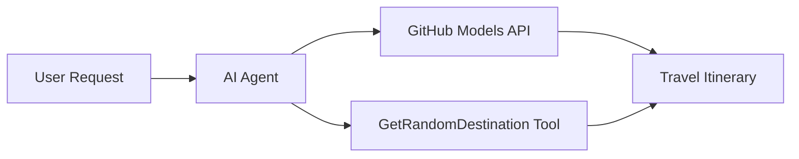

<!--
CO_OP_TRANSLATOR_METADATA:
{
  "original_hash": "e959fefef991a78e6eb72b5ce8ca58d4",
  "translation_date": "2025-11-11T11:48:57+00:00",
  "source_file": "01-intro-to-ai-agents/code_samples/01-dotnet-agent-framework.md",
  "language_code": "lt"
}
-->
# 🌍 AI Kelionių Agentas su Microsoft Agent Framework (.NET)

## 📋 Scenarijaus Apžvalga

Šiame užrašų knygelėje demonstruojama, kaip sukurti intelektualų kelionių planavimo agentą naudojant Microsoft Agent Framework for .NET. Agentas gali automatiškai generuoti asmeninius dienos kelionių maršrutus atsitiktinėms pasaulio vietoms.

### Pagrindinės Galimybės:

- 🎲 **Atsitiktinis Vietos Pasirinkimas**: Naudoja pritaikytą įrankį atostogų vietoms pasirinkti
- 🗺️ **Išmanus Kelionių Planavimas**: Kuria detalius dienos maršrutus
- 🔄 **Realaus Laiko Transliavimas**: Palaiko tiek momentinius, tiek transliuojamus atsakymus
- 🛠️ **Pritaikyto Įrankio Integracija**: Demonstruoja, kaip išplėsti agento galimybes

## 🔧 Techninė Architektūra

### Pagrindinės Technologijos

- **Microsoft Agent Framework**: Naujausia .NET implementacija AI agentų kūrimui
- **GitHub Models Integracija**: Naudoja GitHub AI modelių inferencijos paslaugą
- **OpenAI API Suderinamumas**: Pasitelkia OpenAI klientų bibliotekas su pritaikytais galiniais taškais
- **Saugus Konfigūravimas**: API raktų valdymas pagal aplinką

### Pagrindiniai Komponentai

1. **AIAgent**: Pagrindinis agento organizatorius, kuris valdo pokalbių eigą
2. **Pritaikyti Įrankiai**: `GetRandomDestination()` funkcija, prieinama agentui
3. **Chat Client**: Pokalbių sąsaja, paremta GitHub Models
4. **Transliavimo Palaikymas**: Realaus laiko atsakymų generavimo galimybės

### Integracijos Šablonas



## 🚀 Pradžia

### Būtinos Sąlygos

- [.NET 10 SDK](https://dotnet.microsoft.com/download/dotnet/10.0) arba naujesnė versija
- [GitHub Models API prieigos raktas](https://docs.github.com/github-models/github-models-at-scale/using-your-own-api-keys-in-github-models)

### Reikalingi Aplinkos Kintamieji

```bash
# zsh/bash
export GH_TOKEN=<your_github_token>
export GH_ENDPOINT=https://models.github.ai/inference
export GH_MODEL_ID=openai/gpt-5-mini
```

```powershell
# PowerShell
$env:GH_TOKEN = "<your_github_token>"
$env:GH_ENDPOINT = "https://models.github.ai/inference"
$env:GH_MODEL_ID = "openai/gpt-5-mini"
```

### Pavyzdinis Kodas

Norėdami paleisti kodo pavyzdį,

```bash
# zsh/bash
chmod +x ./01-dotnet-agent-framework.cs
./01-dotnet-agent-framework.cs
```

Arba naudojant dotnet CLI:

```bash
dotnet run ./01-dotnet-agent-framework.cs
```

Žr. [`01-dotnet-agent-framework.cs`](../../../../01-intro-to-ai-agents/code_samples/01-dotnet-agent-framework.cs) visam kodui.

```csharp
#!/usr/bin/dotnet run

#:package Microsoft.Extensions.AI@9.*
#:package Microsoft.Agents.AI.OpenAI@1.*-*

using System.ClientModel;
using System.ComponentModel;

using Microsoft.Agents.AI;
using Microsoft.Extensions.AI;

using OpenAI;

// Tool Function: Random Destination Generator
// This static method will be available to the agent as a callable tool
// The [Description] attribute helps the AI understand when to use this function
// This demonstrates how to create custom tools for AI agents
[Description("Provides a random vacation destination.")]
static string GetRandomDestination()
{
    // List of popular vacation destinations around the world
    // The agent will randomly select from these options
    var destinations = new List<string>
    {
        "Paris, France",
        "Tokyo, Japan",
        "New York City, USA",
        "Sydney, Australia",
        "Rome, Italy",
        "Barcelona, Spain",
        "Cape Town, South Africa",
        "Rio de Janeiro, Brazil",
        "Bangkok, Thailand",
        "Vancouver, Canada"
    };

    // Generate random index and return selected destination
    // Uses System.Random for simple random selection
    var random = new Random();
    int index = random.Next(destinations.Count);
    return destinations[index];
}

// Extract configuration from environment variables
// Retrieve the GitHub Models API endpoint, defaults to https://models.github.ai/inference if not specified
// Retrieve the model ID, defaults to openai/gpt-5-mini if not specified
// Retrieve the GitHub token for authentication, throws exception if not specified
var github_endpoint = Environment.GetEnvironmentVariable("GH_ENDPOINT") ?? "https://models.github.ai/inference";
var github_model_id = Environment.GetEnvironmentVariable("GH_MODEL_ID") ?? "openai/gpt-5-mini";
var github_token = Environment.GetEnvironmentVariable("GH_TOKEN") ?? throw new InvalidOperationException("GH_TOKEN is not set.");

// Configure OpenAI Client Options
// Create configuration options to point to GitHub Models endpoint
// This redirects OpenAI client calls to GitHub's model inference service
var openAIOptions = new OpenAIClientOptions()
{
    Endpoint = new Uri(github_endpoint)
};

// Initialize OpenAI Client with GitHub Models Configuration
// Create OpenAI client using GitHub token for authentication
// Configure it to use GitHub Models endpoint instead of OpenAI directly
var openAIClient = new OpenAIClient(new ApiKeyCredential(github_token), openAIOptions);

// Create AI Agent with Travel Planning Capabilities
// Initialize OpenAI client, get chat client for specified model, and create AI agent
// Configure agent with travel planning instructions and random destination tool
// The agent can now plan trips using the GetRandomDestination function
AIAgent agent = openAIClient
    .GetChatClient(github_model_id)
    .CreateAIAgent(
        instructions: "You are a helpful AI Agent that can help plan vacations for customers at random destinations",
        tools: [AIFunctionFactory.Create(GetRandomDestination)]
    );

// Execute Agent: Plan a Day Trip
// Run the agent with streaming enabled for real-time response display
// Shows the agent's thinking and response as it generates the content
// Provides better user experience with immediate feedback
await foreach (var update in agent.RunStreamingAsync("Plan me a day trip"))
{
    await Task.Delay(10);
    Console.Write(update);
}
```

---

<!-- CO-OP TRANSLATOR DISCLAIMER START -->
**Atsakomybės apribojimas**:  
Šis dokumentas buvo išverstas naudojant AI vertimo paslaugą [Co-op Translator](https://github.com/Azure/co-op-translator). Nors stengiamės užtikrinti tikslumą, prašome atkreipti dėmesį, kad automatiniai vertimai gali turėti klaidų ar netikslumų. Originalus dokumentas jo gimtąja kalba turėtų būti laikomas autoritetingu šaltiniu. Kritinei informacijai rekomenduojama naudoti profesionalų žmogaus vertimą. Mes neprisiimame atsakomybės už nesusipratimus ar neteisingus aiškinimus, atsiradusius dėl šio vertimo naudojimo.
<!-- CO-OP TRANSLATOR DISCLAIMER END -->