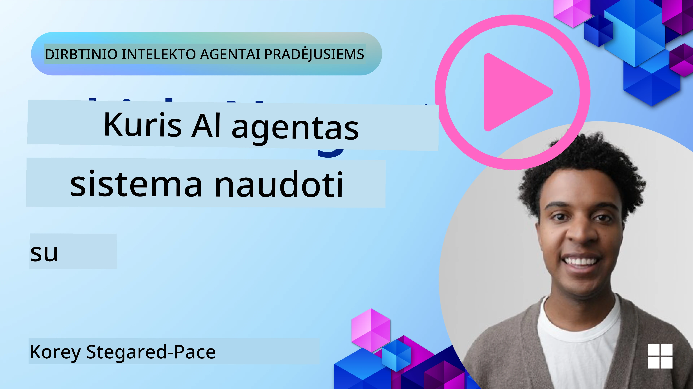

[](https://youtu.be/ODwF-EZo_O8?si=1xoy_B9RNQfrYdF7)

> _(Spustelėkite aukščiau esantį vaizdą, kad peržiūrėtumėte šios pamokos vaizdo įrašą)_

# Tyrinėkite AI agentų karkastus

AI agentų karkastai yra programinės įrangos platformos, skirtos supaprastinti AI agentų kūrimą, diegimą ir valdymą. Šie karkastai suteikia kūrėjams iš anksto paruoštus komponentus, abstrakcijas ir įrankius, kurie pagreitina sudėtingų AI sistemų vystymą.

Šie karkastai padeda kūrėjams susikoncentruoti į unikalius jų programų aspektus, suteikdami standartizuotus sprendimus dažnai pasitaikančioms užduotims AI agentų kūrime. Jie didina mastelį, prieinamumą ir efektyvumą kuriant AI sistemas.

## Įvadas 

Šioje pamokoje bus aptariama:

- Kas yra AI agentų karkastai ir ką jie leidžia kūrėjams pasiekti?
- Kaip komandos gali naudotis jais, kad greitai prototipuotų, iteruotų ir gerintų agentų galimybes?
- Kuo skiriasi Microsoft kuriami karkastai ir įrankiai (<a href="https://aka.ms/ai-agents-beginners/ai-agent-service" target="_blank">Azure AI agentų paslauga</a> ir the <a href="https://learn.microsoft.com/azure/ai-services/openai/how-to/responses" target="_blank">Microsoft agentų karkastas</a>)?
- Ar galiu tiesiogiai integruoti esamus Azure ekosistemos įrankius, ar man reikia atskirų sprendimų?
- Kas yra Azure AI Agent Service ir kaip tai man padeda?

## Mokymosi tikslai

Šios pamokos tikslas — padėti jums suprasti:

- AI agentų karkastų vaidmenį dirbtinio intelekto kūrime.
- Kaip pasinaudoti AI agentų karkastais kuriant intelektualius agentus.
- Pagrindines galimybes, kurias suteikia AI agentų karkastai.
- Skirtumus tarp Microsoft agentų karkasto ir Azure AI agentų paslaugos.

## Kas yra AI agentų karkastai ir ką jie leidžia kūrėjams daryti?

Tradiciniai AI karkastai gali padėti integruoti AI į jūsų programas ir pagerinti jas šiais būdais:

- **Personalizavimas**: AI gali analizuoti vartotojo elgesį ir pageidavimus, kad pateiktų suasmenintas rekomendacijas, turinį ir patirtis.
Example: Streaming services like Netflix use AI to suggest movies and shows based on viewing history, enhancing user engagement and satisfaction.
- **Automatizavimas ir efektyvumas**: AI gali automatizuoti pasikartojančias užduotis, supaprastinti darbo eigą ir pagerinti veiklos efektyvumą.
Example: Customer service apps use AI-powered chatbots to handle common inquiries, reducing response times and freeing up human agents for more complex issues.
- **Pagerinta naudotojo patirtis**: AI gali pagerinti bendrą naudotojo patirtį, siūlydama intelektualias funkcijas, tokias kaip balso atpažinimas, natūralios kalbos apdorojimas ir prognozuojamas tekstas.
Example: Virtual assistants like Siri and Google Assistant use AI to understand and respond to voice commands, making it easier for users to interact with their devices.

### Skamba puikiai, tiesa? Kodėl tada mums reikia AI agentų karkasto?

AI agentų karkastai reiškia kažką daugiau nei vien tik AI karkastus. Jie sukurti taip, kad leistų kurti intelektualius agentus, kurie gali sąveikauti su vartotojais, kitais agentais ir aplinka, siekdami konkrečių tikslų. Šie agentai gali demonstruoti autonominį elgesį, priimti sprendimus ir prisitaikyti prie besikeičiančių sąlygų. Pateikime keletą pagrindinių galimybių, kurias suteikia AI agentų karkastai:

- **Agentų bendradarbiavimas ir koordinavimas**: Leidžia sukurti kelis AI agentus, kurie gali dirbti kartu, komunikuoti ir koordinuotis sprendžiant sudėtingas užduotis.
- **Užduočių automatizavimas ir valdymas**: Suteikia mechanizmus daugiažingsnių darbo eigų automatizavimui, užduočių delegavimui ir dinamiškam užduočių valdymui tarp agentų.
- **Kontekstinis supratimas ir prisitaikymas**: Aprūpina agentus gebėjimu suprasti kontekstą, prisitaikyti prie besikeičiančios aplinkos ir priimti sprendimus remiantis realaus laiko informacija.

Taigi, apibendrinant, agentai leidžia jums nuveikti daugiau, pakelti automatizavimą į aukštesnį lygį ir sukurti išmanesnes sistemas, galinčias prisitaikyti ir mokytis iš savo aplinkos.

## Kaip greitai prototipuoti, iteruoti ir tobulinti agente galimybes?

Ši sritis labai greitai kinta, tačiau yra keletas bendrų dalykų daugelyje AI agentų karkastų, kurie gali padėti greitai prototipuoti ir iteruoti — tai moduliniai komponentai, bendradarbiavimo įrankiai ir realaus laiko mokymasis. Panagrinėkime juos:

- **Naudokite modulinius komponentus**: AI SDK'ai siūlo iš anksto paruoštus komponentus, tokius kaip AI ir atminties jungtys, funkcijų kvietimas naudojant natūralią kalbą arba kodo papildinius, užklausų (prompt) šablonai ir kt.
- **Pasinaudokite bendradarbiavimo įrankiais**: Kurkite agentus su specifinėmis rolėmis ir užduotimis, leidžiant juos testuoti ir tobulinti bendradarbiavimo darbo eigas.
- **Mokykitės realiuoju laiku**: Įgyvendinkite atsiliepimų ciklus, kuriuose agentai mokosi iš sąveikų ir dinamiškai koreguoja savo elgesį.

### Naudokite modulinius komponentus

SDK'ai, tokie kaip Microsoft agentų karkastas, siūlo iš anksto paruoštus komponentus, tokius kaip AI jungtys, įrankių apibrėžimai ir agentų valdymas.

**Kaip komandos gali tai naudoti**: Komandos gali greitai surinkti šiuos komponentus, kad sukurtų funkcionalų prototipą be pradinio kūrimo nuo nulio, leidžiant greitai eksperimentuoti ir iteruoti.

**Kaip tai veikia praktiškai**: Galite naudoti iš anksto paruoštą analizatorių, kad išgautumėte informaciją iš vartotojo įvesties, atminties modulį duomenų saugojimui ir atgavimui bei užklausų generatorių sąveikai su vartotojais — visa tai be būtinybės kurti šiuos komponentus nuo nulio.

**Pavyzdinis kodas**. Pažiūrėkime pavyzdį, kaip galite naudoti Microsoft agentų karkastą su `AzureAIProjectAgentProvider`, kad modelis atsakytų į vartotojo įvestį kviesdamas įrankius:

``` python
# Microsoft Agent Framework Python pavyzdys

import asyncio
import os
from typing import Annotated

from agent_framework.azure import AzureAIProjectAgentProvider
from azure.identity import AzureCliCredential


# Apibrėžkite pavyzdinę įrankio funkciją kelionės rezervavimui
def book_flight(date: str, location: str) -> str:
    """Book travel given location and date."""
    return f"Travel was booked to {location} on {date}"


async def main():
    provider = AzureAIProjectAgentProvider(credential=AzureCliCredential())
    agent = await provider.create_agent(
        name="travel_agent",
        instructions="Help the user book travel. Use the book_flight tool when ready.",
        tools=[book_flight],
    )

    response = await agent.run("I'd like to go to New York on January 1, 2025")
    print(response)
    # Pavyzdžio išvestis: Jūsų skrydis į Niujorką 2025 m. sausio 1 d. sėkmingai rezervuotas. Linkime saugių kelionių! ✈️🗽


if __name__ == "__main__":
    asyncio.run(main())
```

Iš šio pavyzdžio matyti, kaip galite pasinaudoti iš anksto paruoštu analizatoriumi, kad iš vartotojo įvesties išgautumėte pagrindinę informaciją, pvz., skrydžio užsakymo kilmę, paskirties vietą ir datą. Šis modulinis požiūris leidžia susikoncentruoti į aukšto lygio logiką.

### Pasinaudokite bendradarbiavimo įrankiais

Karkastai, tokie kaip Microsoft agentų karkastas, palengvina kelių agentų kūrimą, kurie gali dirbti kartu.

**Kaip komandos gali tai naudoti**: Komandos gali sukurti agentus su specifinėmis rolėmis ir užduotimis, leidžiančias testuoti ir tobulinti bendradarbiavimo darbo eigas bei pagerinti visos sistemos efektyvumą.

**Kaip tai veikia praktiškai**: Galite sukurti agentų komandą, kur kiekvienas agentas atlieka specializuotą funkciją, pvz., duomenų gavimą, analizę ar sprendimų priėmimą. Šie agentai gali komunikuoti ir dalytis informacija, siekdami bendro tikslo, pvz., atsakyti į vartotojo užklausą arba atlikti užduotį.

**Pavyzdinis kodas (Microsoft agentų karkastas)**:

```python
# Kuriant kelis agentus, kurie dirba kartu, naudojant Microsoft Agent Framework

import os
from agent_framework.azure import AzureAIProjectAgentProvider
from azure.identity import AzureCliCredential

provider = AzureAIProjectAgentProvider(credential=AzureCliCredential())

# Duomenų gavimo agentas
agent_retrieve = await provider.create_agent(
    name="dataretrieval",
    instructions="Retrieve relevant data using available tools.",
    tools=[retrieve_tool],
)

# Duomenų analizės agentas
agent_analyze = await provider.create_agent(
    name="dataanalysis",
    instructions="Analyze the retrieved data and provide insights.",
    tools=[analyze_tool],
)

# Vykdyti agentus paeiliui užduočiai
retrieval_result = await agent_retrieve.run("Retrieve sales data for Q4")
analysis_result = await agent_analyze.run(f"Analyze this data: {retrieval_result}")
print(analysis_result)
```

Anksčiau matomas kodas iliustruoja, kaip sukurti užduotį, kurioje keli agentai dirba kartu analizuodami duomenis. Kiekvienas agentas atlieka tam tikrą funkciją, o užduotis vykdoma koordinuojant agentų veiksmus, siekiant pageidaujamo rezultato. Kuriant specializuotus agentus su aiškiomis rolėmis, galima pagerinti užduočių efektyvumą ir našumą.

### Mokymasis realiuoju laiku

Pažangūs karkastai suteikia galimybes kontekstui suvokti ir prisitaikyti realiuoju laiku.

**Kaip komandos gali tai naudoti**: Komandos gali įdiegti atsiliepimų ciklus, kuriuose agentai mokosi iš sąveikų ir dinamiškai keičia elgesį, taip užtikrindami nuolatinį gebėjimų tobulinimą.

**Kaip tai veikia praktiškai**: Agentai gali analizuoti vartotojo atsiliepimus, aplinkos duomenis ir užduočių rezultatus, atnaujinti savo žinių bazę, koreguoti sprendimų priėmimo algoritmus ir laikui bėgant gerinti našumą. Šis iteratyvus mokymosi procesas suteikia agentams galimybę prisitaikyti prie besikeičiančių sąlygų ir vartotojų pageidavimų, didinant bendrą sistemos efektyvumą.

## Kuo skiriasi Microsoft agentų karkastas ir Azure AI agentų paslauga?

Yra daug būdų palyginti šiuos požiūrius, bet pažvelkime į keletą pagrindinių skirtumų jų dizaino, galimybių ir tikslinių naudojimo scenarijų atžvilgiu:

## Microsoft agentų karkastas (MAF)

Microsoft agentų karkastas suteikia supaprastintą SDK agentams kurti naudojant `AzureAIProjectAgentProvider`. Jis leidžia kūrėjams kurti agentus, kurie naudoja Azure OpenAI modelius su integruotu įrankių kvietimu, pokalbių valdymu ir įmonės klasės saugumu per Azure tapatybę.

**Naudojimo atvejai**: Gamybinių AI agentų kūrimas su įrankių naudojimu, daugiažingsnėmis darbo eigomis ir įmonės integracijos scenarijomis.

Štai keletas svarbių Microsoft agentų karkasto pagrindinių sąvokų:

- **Agentai**. Agentas sukuriamas per `AzureAIProjectAgentProvider` ir konfigūruojamas su pavadinimu, instrukcijomis ir įrankiais. Agentas gali:
  - **Apdoroti vartotojo žinutes** ir generuoti atsakymus naudodamas Azure OpenAI modelius.
  - **Automatiškai kviesti įrankius** pagal pokalbio kontekstą.
  - **Išlaikyti pokalbio būseną** per kelias sąveikas.

  Čia pateiktas kodo fragmentas, rodantis, kaip sukurti agentą:

    ```python
    import os
    from agent_framework.azure import AzureAIProjectAgentProvider
    from azure.identity import AzureCliCredential

    provider = AzureAIProjectAgentProvider(credential=AzureCliCredential())
    agent = await provider.create_agent(
        name="my_agent",
        instructions="You are a helpful assistant.",
    )

    response = await agent.run("Hello, World!")
    print(response)
    ```

- **Įrankiai**. Karkastas palaiko įrankių apibrėžimą kaip Python funkcijas, kurias agentas gali automatiškai iškviesti. Įrankiai registruojami kuriant agentą:

    ```python
    def get_weather(location: str) -> str:
        """Get the current weather for a location."""
        return f"The weather in {location} is sunny, 72\u00b0F."

    agent = await provider.create_agent(
        name="weather_agent",
        instructions="Help users check the weather.",
        tools=[get_weather],
    )
    ```

- **Daugelio agentų koordinavimas**. Galite sukurti kelis agentus su skirtingomis specializacijomis ir koordinuoti jų darbą:

    ```python
    planner = await provider.create_agent(
        name="planner",
        instructions="Break down complex tasks into steps.",
    )

    executor = await provider.create_agent(
        name="executor",
        instructions="Execute the planned steps using available tools.",
        tools=[execute_tool],
    )

    plan = await planner.run("Plan a trip to Paris")
    result = await executor.run(f"Execute this plan: {plan}")
    ```

- **Azure tapatybės integracija**. Karkastas naudoja `AzureCliCredential` (arba `DefaultAzureCredential`) saugiam autentifikavimui be raktų, taip pašalinant poreikį tiesiogiai valdyti API raktus.

## Azure AI agentų paslauga

Azure AI agentų paslauga yra naujesnis priedas, pristatytas Microsoft Ignite 2024. Ji leidžia kurti ir diegti AI agentus su lankstesniais modeliais, pavyzdžiui, tiesiogiai kviečiant atviro kodo LLM, tokius kaip Llama 3, Mistral ir Cohere.

Azure AI agentų paslauga suteikia stipresnes įmonės lygio saugumo priemones ir duomenų saugojimo metodus, dėl ko ji tinkama verslo taikymams.

Ji veikia iš karto kartu su Microsoft agentų karkastu agentų kūrimui ir diegimui.

Ši paslauga šiuo metu yra viešojo peržiūros (Public Preview) būsenoje ir palaiko Python bei C# agentų kūrimui.

Naudodami Azure AI Agent Service Python SDK galime sukurti agentą su vartotojo apibrėžtu įrankiu:

```python
import asyncio
from azure.identity import DefaultAzureCredential
from azure.ai.projects import AIProjectClient

# Apibrėžti įrankio funkcijas
def get_specials() -> str:
    """Provides a list of specials from the menu."""
    return """
    Special Soup: Clam Chowder
    Special Salad: Cobb Salad
    Special Drink: Chai Tea
    """

def get_item_price(menu_item: str) -> str:
    """Provides the price of the requested menu item."""
    return "$9.99"


async def main() -> None:
    credential = DefaultAzureCredential()
    project_client = AIProjectClient.from_connection_string(
        credential=credential,
        conn_str="your-connection-string",
    )

    agent = project_client.agents.create_agent(
        model="gpt-4o-mini",
        name="Host",
        instructions="Answer questions about the menu.",
        tools=[get_specials, get_item_price],
    )

    thread = project_client.agents.create_thread()

    user_inputs = [
        "Hello",
        "What is the special soup?",
        "How much does that cost?",
        "Thank you",
    ]

    for user_input in user_inputs:
        print(f"# User: '{user_input}'")
        message = project_client.agents.create_message(
            thread_id=thread.id,
            role="user",
            content=user_input,
        )
        run = project_client.agents.create_and_process_run(
            thread_id=thread.id, agent_id=agent.id
        )
        messages = project_client.agents.list_messages(thread_id=thread.id)
        print(f"# Agent: {messages.data[0].content[0].text.value}")


if __name__ == "__main__":
    asyncio.run(main())
```

### Pagrindinės sąvokos

Azure AI agentų paslauga turi šias pagrindines sąvokas:

- **Agentas**. Azure AI Agent Service integruojasi su Microsoft Foundry. AI Foundry viduje AI agentas veikia kaip „išmanus“ mikroservisas, kurį galima naudoti klausimams atsakyti (RAG), veiksmams atlikti arba visiškai automatizuoti darbo eigas. Tai pasiekiama derinant generatyviųjų AI modelių galią su įrankiais, leidžiančiais pasiekti ir sąveikauti su realaus pasaulio duomenų šaltiniais. Štai pavyzdys agento:

    ```python
    agent = project_client.agents.create_agent(
        model="gpt-4o-mini",
        name="my-agent",
        instructions="You are helpful agent",
        tools=code_interpreter.definitions,
        tool_resources=code_interpreter.resources,
    )
    ```

    Šiame pavyzdyje agentas sukuriamas su modeliu `gpt-4o-mini`, pavadinimu `my-agent` ir instrukcijomis `You are helpful agent`. Agentas aprūpintas įrankiais ir resursais kodo interpretacijos užduotims atlikti.

- **Raštas (thread) ir žinutės**. Raštas yra kita svarbi sąvoka. Jis reprezentuoja pokalbį arba sąveiką tarp agento ir vartotojo. Raštai gali būti naudojami stebėti pokalbio eigą, saugoti konteksto informaciją ir valdyti sąveikos būseną. Štai pavyzdys rašto:

    ```python
    thread = project_client.agents.create_thread()
    message = project_client.agents.create_message(
        thread_id=thread.id,
        role="user",
        content="Could you please create a bar chart for the operating profit using the following data and provide the file to me? Company A: $1.2 million, Company B: $2.5 million, Company C: $3.0 million, Company D: $1.8 million",
    )
    
    # Ask the agent to perform work on the thread
    run = project_client.agents.create_and_process_run(thread_id=thread.id, agent_id=agent.id)
    
    # Fetch and log all messages to see the agent's response
    messages = project_client.agents.list_messages(thread_id=thread.id)
    print(f"Messages: {messages}")
    ```

    Ankstesniame kode sukuriamas raštas. Vėliau į raštą siunčiama žinutė. Iškvietus `create_and_process_run`, agentui pateikiamas uždavinys atlikti darbą su tuo raštu. Galiausiai žinutės yra paimamos ir užfiksuojamos, kad būtų matomas agento atsakymas. Žinutės nurodo pokalbio eigą tarp vartotojo ir agento. Taip pat svarbu suprasti, kad žinutės gali būti skirtingų tipų, pavyzdžiui, tekstas, vaizdas ar failas — tai reiškia, kad agento darbas gali rezultatuoti, pavyzdžiui, vaizdu arba teksto atsakymu. Kaip kūrėjas, tada galite naudoti šią informaciją atsakymui toliau apdoroti arba pateikti vartotojui.

- **Integracija su Microsoft agentų karkastu**. Azure AI Agent Service veikia sklandžiai kartu su Microsoft agentų karkastu, tai reiškia, kad galite kurti agentus naudodami `AzureAIProjectAgentProvider` ir diegti juos per Agent Service gamybos scenarijoms.

**Naudojimo atvejai**: Azure AI Agent Service yra skirta įmonės taikymams, kuriems reikalingas saugus, mastelio keičiantis ir lankstus AI agentų diegimas.

## Kuo skiriasi šie požiūriai?
 
Atrodo, kad yra sutapimų, tačiau yra keletas pagrindinių skirtumų jų dizaino, galimybių ir tikslinių naudojimo scenarijų atžvilgiu:
 
- **Microsoft agentų karkastas (MAF)**: Tai gamybai paruoštas SDK AI agentams kurti. Jis suteikia supaprastintą API agentams kurti su įrankių kvietimu, pokalbių valdymu ir Azure tapatybės integracija.
- **Azure AI agentų paslauga**: Tai platforma ir diegimo paslauga Azure Foundry agentams. Ji siūlo įmontuotą ryšį su paslaugomis, tokiomis kaip Azure OpenAI, Azure AI Search, Bing Search ir kodo vykdymas.
 
Vis dar neaišku, kurį pasirinkti?

### Naudojimo atvejai
 
Tegul padėsime jums pereinant per keletą dažnų naudojimo atvejų:
 
> Q: I'm building production AI agent applications and want to get started quickly
>
>
>A: The Microsoft Agent Framework is a great choice. It provides a simple, Pythonic API via `AzureAIProjectAgentProvider` that lets you define agents with tools and instructions in just a few lines of code.

>Q: I need enterprise-grade deployment with Azure integrations like Search and code execution
>
> A: Azure AI Agent Service is the best fit. It's a platform service that provides built-in capabilities for multiple models, Azure AI Search, Bing Search and Azure Functions. It makes it easy to build your agents in the Foundry Portal and deploy them at scale.
 
> Q: I'm still confused, just give me one option
>
> A: Start with the Microsoft Agent Framework to build your agents, and then use Azure AI Agent Service when you need to deploy and scale them in production. This approach lets you iterate quickly on your agent logic while having a clear path to enterprise deployment.
 
Let's summarize the key differences in a table:

| Framework | Focus | Core Concepts | Use Cases |
| --- | --- | --- | --- |
| Microsoft Agent Framework | Streamlined agent SDK with tool calling | Agents, Tools, Azure Identity | Building AI agents, tool use, multi-step workflows |
| Azure AI Agent Service | Flexible models, enterprise security, Code generation, Tool calling | Modularity, Collaboration, Process Orchestration | Secure, scalable, and flexible AI agent deployment |

## Ar galiu tiesiogiai integruoti esamus Azure ekosistemos įrankius, ar man reikia atskirų sprendimų?
Atsakymas yra taip — galite integruoti savo esamus Azure ekosistemos įrankius tiesiogiai su Azure AI Agent Service, ypač todėl, kad jis buvo sukurtas taip, kad sklandžiai veiktų su kitomis Azure paslaugomis. Pavyzdžiui, galite integruoti Bing, Azure AI Search ir Azure Functions. Taip pat yra gilus integravimas su Microsoft Foundry.

Microsoft Agent Framework taip pat integruojasi su Azure paslaugomis per `AzureAIProjectAgentProvider` ir Azure tapatybę, leidžiant jums kviesti Azure paslaugas tiesiogiai iš jūsų agentų įrankių.

## Kodo pavyzdžiai

- Python: [Agent Framework](./code_samples/02-python-agent-framework.ipynb)
- .NET: [Agent Framework](./code_samples/02-dotnet-agent-framework.md)

## Turite daugiau klausimų apie AI Agent Frameworks?

Prisijunkite prie [Microsoft Foundry Discord](https://aka.ms/ai-agents/discord), kad susitiktumėte su kitais besimokančiais, dalyvautumėte konsultacijose ir gautumėte atsakymus į savo AI agentų klausimus.

## Nuorodos

- <a href="https://techcommunity.microsoft.com/blog/azure-ai-services-blog/introducing-azure-ai-agent-service/4298357" target="_blank">Azure Agent Service</a>
- <a href="https://learn.microsoft.com/azure/ai-services/openai/how-to/responses" target="_blank">Microsoft Agent Framework - Azure OpenAI Responses</a>
- <a href="https://learn.microsoft.com/azure/ai-services/agents/overview" target="_blank">Azure AI Agent service</a>

## Ankstesnė pamoka

[Introduction to AI Agents and Agent Use Cases](../01-intro-to-ai-agents/README.md)

## Kita pamoka

[Agentinių dizaino modelių supratimas](../03-agentic-design-patterns/README.md)

---

<!-- CO-OP TRANSLATOR DISCLAIMER START -->
Atsakomybės pareiškimas:
Šis dokumentas buvo išverstas naudojant dirbtinio intelekto vertimo paslaugą Co-op Translator (https://github.com/Azure/co-op-translator). Nors siekiame tikslumo, atkreipkite dėmesį, kad automatiniai vertimai gali turėti klaidų arba netikslumų. Originalus dokumentas jo gimtąja kalba turėtų būti laikomas autoritetingu šaltiniu. Esant kritinei informacijai rekomenduojamas profesionalus vertimas, atliktas žmogaus. Mes neatsakome už jokius nesusipratimus ar neteisingą interpretavimą, kilusius dėl šio vertimo naudojimo.
<!-- CO-OP TRANSLATOR DISCLAIMER END -->