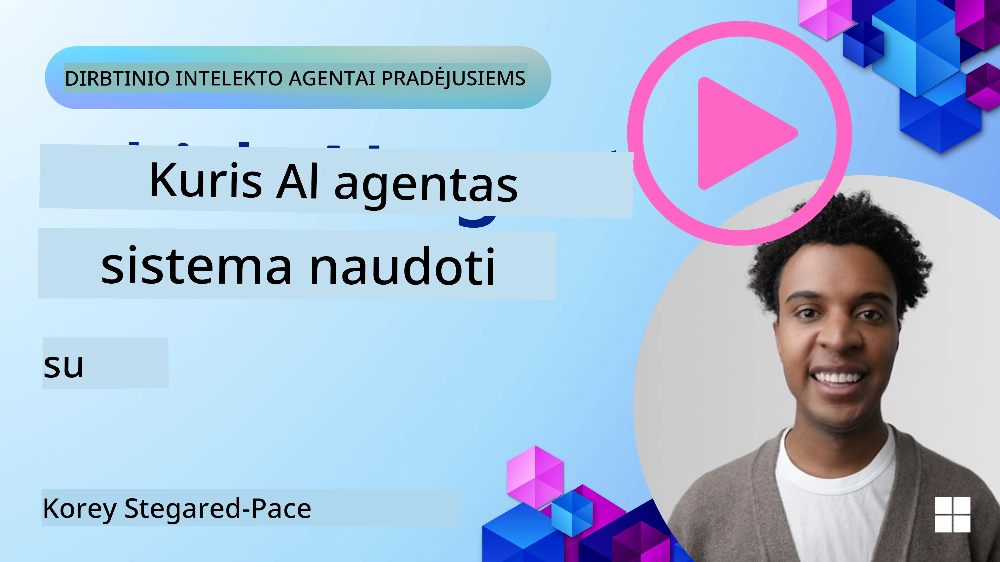

[](https://youtu.be/ODwF-EZo_O8?si=1xoy_B9RNQfrYdF7)

> _(Spustelėkite aukščiau esantį paveikslėlį, kad peržiūrėtumėte šios pamokos vaizdo įrašą)_

# Tyrinėkite DI agentų karkasus

DI agentų karkasai yra programinės įrangos platformos, sukurtos palengvinti DI agentų kūrimą, diegimą ir valdymą. Šie karkasai suteikia kūrėjams iš anksto paruoštas dalis, abstrakcijas ir įrankius, kurie supaprastina sudėtingų DI sistemų kūrimą.

Šie karkasai padeda kūrėjams sutelkti dėmesį į unikalius jų programų aspektus, siūlydami standartizuotus sprendimus įprastoms DI agentų kūrimo problemoms. Jie gerina mastelį, prieinamumą ir efektyvumą kuriant DI sistemas.

## Įvadas 

Šioje pamokoje bus aptariama:

- Kas yra DI agentų karkasai ir ką jie leidžia kūrėjams pasiekti?
- Kaip komandos gali juos naudoti greitai kurti prototipus, iteruoti ir tobulinti agentų gebėjimus?
- Kokie skirtumai tarp Microsoft sukurtų karkasų ir įrankių (<a href="https://aka.ms/ai-agents-beginners/ai-agent-service" target="_blank">Microsoft Foundry Agent Service</a> ir <a href="https://learn.microsoft.com/azure/ai-services/openai/how-to/responses" target="_blank">Microsoft Agent Framework</a>)?
- Ar galiu tiesiogiai integruoti savo esamus Azure ekosistemos įrankius, ar reikalingi nepriklausomi sprendimai?
- Kas yra Microsoft Foundry Agent Service ir kaip tai man padeda?

## Mokymosi tikslai

Šios pamokos tikslas – padėti jums suprasti:

- DI agentų karkasų vaidmenį DI kūrime.
- Kaip pasinaudoti DI agentų karkasais kuriant išmanius agentus.
- Pagrindines DI agentų karkasų galimybes.
- Skirtumus tarp Microsoft Agent Framework ir Microsoft Foundry Agent Service.

## Kas yra DI agentų karkasai ir ką jie leidžia kūrėjams daryti?

Tradiciniai DI karkasai gali padėti integruoti DI į jūsų programėles ir pagerinti jas šiais būdais:

- **Personalizavimas**: DI gali analizuoti vartotojų elgseną ir pageidavimus, kad suteiktų suasmenintas rekomendacijas, turinį ir patirtį.
Pavyzdys: srautinio transliavimo paslaugos, tokios kaip Netflix, naudoja DI, kad siūlytų filmus ir laidas pagal peržiūrų istoriją, didindamos vartotojų įsitraukimą ir pasitenkinimą.
- **Automatizavimas ir efektyvumas**: DI gali automatizuoti pasikartojančias užduotis, supaprastinti darbo eigą ir pagerinti operatyvumą.
Pavyzdys: klientų aptarnavimo programėlės naudoja DI palaikomus pokalbių robotus, kad atsakytų į dažniausiai užduodamus klausimus, sumažintų atsakymų laiką ir paliktų žmonių agentus sudėtingesniems klausimams.
- **Pagerinta vartotojo patirtis**: DI gali pagerinti bendrą vartotojo patirtį, suteikdama išmanias funkcijas kaip balso atpažinimas, natūralios kalbos apdorojimas ir prognozuojamasis tekstas.
Pavyzdys: virtualūs asistentai, tokie kaip Siri ir Google Assistant, naudoja DI, kad suprastų ir atsakytų į balso komandas, palengvindami vartotojų sąveiką su įrenginiais.

### Viskas skamba puikiai, bet kodėl mums reikia DI agentų karkaso?

DI agentų karkasai reiškia daugiau nei tik DI karkasus. Jie sukurti tam, kad būtų galima kurti išmanius agentus, galinčius bendrauti su vartotojais, kitais agentais ir aplinka, siekiant konkrečių tikslų. Šie agentai gali rodyti autonominį elgesį, priimti sprendimus ir prisitaikyti prie kintančių sąlygų. Pažiūrėkime į pagrindines DI agentų karkasų galimybes:

- **Agentų bendradarbiavimas ir koordinavimas**: leidžia sukurti kelis DI agentus, kurie gali dirbti kartu, bendrauti ir koordinuotis sprendžiant sudėtingas užduotis.
- **Užduočių automatizavimas ir valdymas**: suteikia mechanizmus daugiamatsių procesų automatikai, užduočių delegavimui ir dinamiškai užduočių valdymui tarp agentų.
- **Kontekstinis supratimas ir prisitaikymas**: įgalina agentus suprasti kontekstą, prisitaikyti prie kintančios aplinkos ir priimti sprendimus remiantis realaus laiko informacija.

Trumpai tariant, agentai leidžia daryti daugiau, pakelti automatizavimą į kitą lygį ir kurti protingesnes sistemas, kurios gali mokytis ir prisitaikyti prie aplinkos.

## Kaip greitai kurti prototipus, iteruoti ir tobulinti agentų gebėjimus?

Ši sritis juda labai greitai, tačiau daugumoje DI agentų karkasų yra bendrų dalykų, kurie padeda greitai kurti prototipus ir iteruoti – tai modulinių komponentų, bendradarbiavimo įrankių ir realaus laiko mokymosi panaudojimas. Apžvelkime juos:

- **Naudokite modulinės sudėties komponentus**: DI SDK suteikia iš anksto paruoštus komponentus, tokius kaip DI ir atminties jungtys, funkcijų iškvietimas naudojant natūralią kalbą ar kodo priedus, užklausų šablonus ir daugiau.
- **Pasinaudokite bendradarbiavimo įrankiais**: projektuokite agentus su specifinėmis rolėmis ir užduotimis, leidžiančiais testuoti ir tobulinti bendradarbiavimo darbo eigas.
- **Mokykitės realiu laiku**: įgyvendinkite atsiliepimų ciklus, kur agentai mokosi iš sąveikų ir dinamiškai keičia savo elgesį.

### Naudokite modulinės sudėties komponentus

SDK, pavyzdžiui, Microsoft Agent Framework, siūlo iš anksto paruoštus komponentus, tokius kaip DI jungtys, įrankių apibrėžimai ir agentų valdymas.

**Kaip komandos gali juos naudoti**: komandos greitai surenka šiuos komponentus, kad sukurtų veikiančius prototipus be reikalo kurti nuo nulio, leidžiančią greitai eksperimentuoti ir iteruoti.

**Kaip tai veikia praktikoje**: galite naudoti iš anksto paruoštą analizatorių, kad išgautumėte informaciją iš vartotojo įvesties, atminties modulį duomenų saugojimui ir atsigavimui bei užklausų generatorių sąveikai su vartotoju, visa tai nekuriančius šių komponentų nuo nulio.

**Kodo pavyzdys**. Pažiūrėkime, kaip naudoti Microsoft Agent Framework su `FoundryChatClient`, kad modelis reaguotų į vartotojo įvestį su įrankių iškvietimu:

``` python
# „Microsoft Agent Framework“ Python pavyzdys

import asyncio
import os

from agent_framework import tool
from agent_framework.foundry import FoundryChatClient
from azure.identity import AzureCliCredential


# Apibrėžkite pavyzdinę įrankio funkciją kelionės rezervavimui
@tool(approval_mode="never_require")
def book_flight(date: str, location: str) -> str:
    """Book travel given location and date."""
    return f"Travel was booked to {location} on {date}"


async def main():
    provider = FoundryChatClient(
        project_endpoint=os.environ["AZURE_AI_PROJECT_ENDPOINT"],
        model=os.environ["AZURE_AI_MODEL_DEPLOYMENT_NAME"],
        credential=AzureCliCredential(),
    )
    agent = provider.as_agent(
        name="travel_agent",
        instructions="Help the user book travel. Use the book_flight tool when ready.",
        tools=[book_flight],
    )

    response = await agent.run("I'd like to go to New York on January 1, 2025")
    print(response)
    # Pavyzdinis išvestis: Jūsų skrydis į Niujorką 2025 m. sausio 1 d. buvo sėkmingai užsakytas. Saugios kelionės! ✈️🗽


if __name__ == "__main__":
    asyncio.run(main())
```

Iš šio pavyzdžio matote, kaip galite pasinaudoti iš anksto paruoštu analizatoriumi, kad išgautumėte svarbią informaciją iš vartotojo įvesties, pvz., skrydžio užsakymo užklausos kilmę, paskirties vietą ir datą. Šis modulinis požiūris leidžia sutelkti dėmesį į aukšto lygio logiką.

### Pasinaudokite bendradarbiavimo įrankiais

Tokie karkasai kaip Microsoft Agent Framework palengvina kelių agentų kūrimą, kurie gali dirbti drauge.

**Kaip komandos gali juos naudoti**: komandos gali projektuoti agentus su specifinėmis rolėmis ir užduotimis, leidžiančiais testuoti bei tobulinti bendradarbiavimo darbo eigas ir didinti bendrą sistemos efektyvumą.

**Kaip tai veikia praktikoje**: galite sukurti agentų komandą, kur kiekvienas agentas atlieka specializuotą funkciją, pvz., duomenų gavimą, analizę ar sprendimų priėmimą. Šie agentai gali bendrauti ir dalytis informacija siekdami bendro tikslo, pvz., atsakyti į vartotojo užklausą arba užbaigti užduotį.

**Kodo pavyzdys (Microsoft Agent Framework)**:

```python
# Kuriami keli agentai, dirbantys kartu, naudojant Microsoft Agent Framework

import os
from agent_framework.foundry import FoundryChatClient
from azure.identity import AzureCliCredential

provider = FoundryChatClient(
    project_endpoint=os.environ["AZURE_AI_PROJECT_ENDPOINT"],
    model=os.environ["AZURE_AI_MODEL_DEPLOYMENT_NAME"],
    credential=AzureCliCredential(),
)

# Duomenų gavimo agentas
agent_retrieve = provider.as_agent(
    name="dataretrieval",
    instructions="Retrieve relevant data using available tools.",
    tools=[retrieve_tool],
)

# Duomenų analizės agentas
agent_analyze = provider.as_agent(
    name="dataanalysis",
    instructions="Analyze the retrieved data and provide insights.",
    tools=[analyze_tool],
)

# Vykdyti agentus nuosekliai užduočiai
retrieval_result = await agent_retrieve.run("Retrieve sales data for Q4")
analysis_result = await agent_analyze.run(f"Analyze this data: {retrieval_result}")
print(analysis_result)
```

Iš ankstesnio kodo matote, kaip galima sukurti užduotį, kurioje dalyvauja keli agentai dirbdami kartu analizuoti duomenis. Kiekvienas agentas atlieka specifinę funkciją, o užduotis vykdoma koordinuojant agentus pageidaujamam rezultatui pasiekti. Kurdamas agentus su specializuotomis rolėmis, galite padidinti užduočių efektyvumą ir našumą.

### Mokymasis realiu laiku

Pažangūs karkasai suteikia galimybes konteksto supratimui ir prisitaikymui realiu laiku.

**Kaip komandos gali juos naudoti**: komandos gali įgyvendinti atsiliepimų ciklus, kur agentai mokosi iš sąveikų ir dinamiškai koreguoja savo elgesį, kas lemia nuolatinį gebėjimų tobulėjimą.

**Kaip tai veikia praktikoje**: agentai gali analizuoti vartotojų atsiliepimus, aplinkos duomenis ir užduočių rezultatus, atnaujinti žinių bazę, koreguoti sprendimų priėmimo algoritmus ir laikui bėgant gerinti veikimą. Šis iteratyvus mokymosi procesas leidžia agentams prisitaikyti prie kintančių sąlygų ir vartotojų pageidavimų, gerinant bendrą sistemos efektyvumą.

## Kokie yra skirtumai tarp Microsoft Agent Framework ir Microsoft Foundry Agent Service?

Šiuos požiūrius galima palyginti įvairiais aspektais, tačiau pažiūrėkime į pagrindinius dizaino, galimybių ir paskirties atvejus skirtumus:

## Microsoft Agent Framework (MAF)

Microsoft Agent Framework siūlo supaprastintą SDK DI agentams kurti su `FoundryChatClient`. Tai leidžia kūrėjams kurti agentus, kurie naudoja Azure OpenAI modelius su įmontuotu įrankių iškvietimu, pokalbių valdymu ir verslo lygio saugumu per Azure tapatybę.

**Panaudojimo atvejai**: gamybai tinkamų DI agentų kūrimas su įrankių naudojimu, daugiamatėmis darbo eigomis ir verslo integravimo scenarijomis.

Štai keli svarbūs Microsoft Agent Framework pagrindiniai konceptai:

- **Agentai**. Agentas sukuriamas per `FoundryChatClient` ir sukonfigūruojamas su pavadinimu, instrukcijomis ir įrankiais. Agentas gali:
  - **Apdoroti vartotojų žinutes** ir generuoti atsakymus naudodamas Azure OpenAI modelius.
  - **Automatiškai iškviesti įrankius** pagal pokalbio kontekstą.
  - **Išlaikyti pokalbio būseną** per kelias sąveikas.

  Čia pateikiamas kodo fragmentas, rodantis, kaip sukurti agentą:

    ```python
    import os
    from agent_framework.foundry import FoundryChatClient
    from azure.identity import AzureCliCredential

    provider = FoundryChatClient(
        project_endpoint=os.environ["AZURE_AI_PROJECT_ENDPOINT"],
        model=os.environ["AZURE_AI_MODEL_DEPLOYMENT_NAME"],
        credential=AzureCliCredential(),
    )
    agent = provider.as_agent(
        name="my_agent",
        instructions="You are a helpful assistant.",
    )

    response = await agent.run("Hello, World!")
    print(response)
    ```

- **Įrankiai**. Karkasas palaiko įrankių apibrėžimą kaip Python funkcijas, kurias agentas gali automatiškai iškviesti. Įrankiai registruojami kuriant agentą:

    ```python
    def get_weather(location: str) -> str:
        """Get the current weather for a location."""
        return f"The weather in {location} is sunny, 72\u00b0F."

    agent = provider.as_agent(
        name="weather_agent",
        instructions="Help users check the weather.",
        tools=[get_weather],
    )
    ```

- **Daugiagentinis koordinavimas**. Galite sukurti kelis agentus su skirtingomis specializacijomis ir koordinuoti jų darbą:

    ```python
    planner = provider.as_agent(
        name="planner",
        instructions="Break down complex tasks into steps.",
    )

    executor = provider.as_agent(
        name="executor",
        instructions="Execute the planned steps using available tools.",
        tools=[execute_tool],
    )

    plan = await planner.run("Plan a trip to Paris")
    result = await executor.run(f"Execute this plan: {plan}")
    ```

- **Azure tapatybės integracija**. Karkasas naudoja `AzureCliCredential` (arba `DefaultAzureCredential`) saugiam, be raktų, autentifikavimui, pašalindamas tiesioginį API raktų valdymo poreikį.

## Microsoft Foundry Agent Service

Microsoft Foundry Agent Service yra naujesnė paslauga, pristatyta Microsoft Ignite 2024. Ji leidžia kurti ir diegti DI agentus su lankstesniais modeliais, tokiais kaip tiesioginis atvirojo kodo LLM iškvietimas, pavyzdžiui, Llama 3, Mistral ir Cohere.

Microsoft Foundry Agent Service suteikia stipresnes verslo lygio saugumo priemones ir duomenų saugojimo metodus, todėl tinka verslo programoms.

Ji veikia iš karto kartu su Microsoft Agent Framework agentų kūrimui ir diegimui.

Ši paslauga šiuo metu yra viešojo peržiūros stadijoje ir palaiko Python bei C# agentų kūrimui.

Naudodami Microsoft Foundry Agent Service Python SDK galime sukurti agentą su vartotojo apibrėžtu įrankiu:

```python
import asyncio
from azure.identity import DefaultAzureCredential
from azure.ai.projects import AIProjectClient

# Apibrėžti įrankių funkcijas
def get_specials() -> str:
    """Provides a list of specials from the menu."""
    return """
    Special Soup: Clam Chowder
    Special Salad: Cobb Salad
    Special Drink: Chai Tea
    """

def get_item_price(menu_item: str) -> str:
    """Provides the price of the requested menu item."""
    return "$9.99"


async def main() -> None:
    credential = DefaultAzureCredential()
    project_client = AIProjectClient.from_connection_string(
        credential=credential,
        conn_str="your-connection-string",
    )

    agent = project_client.agents.create_agent(
        model="gpt-4o-mini",
        name="Host",
        instructions="Answer questions about the menu.",
        tools=[get_specials, get_item_price],
    )

    thread = project_client.agents.create_thread()

    user_inputs = [
        "Hello",
        "What is the special soup?",
        "How much does that cost?",
        "Thank you",
    ]

    for user_input in user_inputs:
        print(f"# User: '{user_input}'")
        message = project_client.agents.create_message(
            thread_id=thread.id,
            role="user",
            content=user_input,
        )
        run = project_client.agents.create_and_process_run(
            thread_id=thread.id, agent_id=agent.id
        )
        messages = project_client.agents.list_messages(thread_id=thread.id)
        print(f"# Agent: {messages.data[0].content[0].text.value}")


if __name__ == "__main__":
    asyncio.run(main())
```

### Pagrindinės sąvokos

Microsoft Foundry Agent Service pagrindinės sąvokos:

- **Agentas**. Microsoft Foundry Agent Service integruojasi su Microsoft Foundry. Microsoft Foundry DI agentas veikia kaip "protinga" mikropaslauga, naudojama klausimams atsakyti (RAG), veiksmams atlikti ar visiškai automatizuoti darbo eigas. Tai pasiekiama derinant generatyvinių DI modelių galią su įrankiais, leidžiančiais prieigą ir sąveiką su realiais duomenų šaltiniais. Štai agento pavyzdys:

    ```python
    agent = project_client.agents.create_agent(
        model="gpt-4o-mini",
        name="my-agent",
        instructions="You are helpful agent",
        tools=code_interpreter.definitions,
        tool_resources=code_interpreter.resources,
    )
    ```

    Šiame pavyzdyje agentas sukuriamas su modeliu `gpt-4o-mini`, pavadinimu `my-agent` ir instrukcijomis `You are helpful agent`. Agentas turi įrankius ir išteklius kodo interpretacijos užduotims atlikti.

- **Gija ir žinutės**. Gija yra dar viena svarbi sąvoka. Ji reiškia pokalbį arba sąveiką tarp agento ir vartotojo. Gijos naudojamos pokalbio pažangai sekti, konteksto informacijai saugoti ir sąveikos būsenai valdyti. Štai gijos pavyzdys:

    ```python
    thread = project_client.agents.create_thread()
    message = project_client.agents.create_message(
        thread_id=thread.id,
        role="user",
        content="Could you please create a bar chart for the operating profit using the following data and provide the file to me? Company A: $1.2 million, Company B: $2.5 million, Company C: $3.0 million, Company D: $1.8 million",
    )
    
    # Paprašykite agento atlikti darbą gijoje
    run = project_client.agents.create_and_process_run(thread_id=thread.id, agent_id=agent.id)
    
    # Gaukite ir užfiksuokite visas žinutes, kad pamatytumėte agento atsakymą
    messages = project_client.agents.list_messages(thread_id=thread.id)
    print(f"Messages: {messages}")
    ```

    Ankstesniame kode sukurta gija. Vėliau į šią giją siunčiama žinutė. Iškviesdami `create_and_process_run`, prašome agento atlikti darbą gijoje. Galiausiai žinutės paimamos ir išsaugomos, kad matytume agento atsakymą. Žinutės rodo pokalbio tarp vartotojo ir agente eigą. Taip pat svarbu suprasti, kad žinutės gali būti įvairių tipų, pavyzdžiui, tekstas, paveikslėlis ar failas – tai gali būti agento darbo rezultatas, pvz., paveikslėlis ar teksto atsakymas. Kaip programuotojas, galite naudoti šią informaciją tolimesnei atsako apdorojimui ar pateikimui vartotojui.

- **Integracija su Microsoft Agent Framework**. Microsoft Foundry Agent Service sklandžiai veikia su Microsoft Agent Framework, todėl galite kurti agentus naudodami `FoundryChatClient` ir diegti juos per Agent Service gamybos scenarijoms.

**Panaudojimo atvejai**: Microsoft Foundry Agent Service skirta verslo programoms, reikalaujančioms saugaus, mastelio keičiamo ir lanksčio DI agentų diegimo.

## Kokie yra skirtumai tarp šių požiūrių?
 
Atrodo, kad yra persidengimų, tačiau yra pagrindinių skirtumų dizaino, galimybių ir paskirties atvejais:
 
- **Microsoft Agent Framework (MAF)**: gamybai paruoštas SDK DI agentams kurti. Suteikia supaprastintą API agentų kūrimui su įrankių iškvietimu, pokalbių valdymu ir Azure tapatybės integracija.
- **Microsoft Foundry Agent Service**: platforma ir diegimo paslauga Microsoft Foundry agentams. Siūlo įmontuotą jungiamumą su Azure OpenAI, Azure AI Search, Bing Search ir kodo vykdymu.
 
Vis dar nesate tikri, ką pasirinkti?

### Panaudojimo atvejai
 
Pažiūrėkime, ar galime padėti peržiūrėdami keletą įprastų panaudojimo atvejų:
 
> K: Kuriu gamybos DI agentų programas ir noriu greitai pradėti
>

>A: Microsoft Agent Framework yra puikus pasirinkimas. Jis suteikia paprastą, Python stiliaus API per `FoundryChatClient`, leidžiančią apibrėžti agentus su įrankiais ir instrukcijomis vos keliais kodo eilutėmis.

>K: Man reikia verslo klasės diegimo su Azure integracijomis, kaip Search ir kodo vykdymas
>
> A: Microsoft Foundry Agent Service yra geriausias pasirinkimas. Tai platformos paslauga, suteikianti įmontuotas galimybes keliems modeliams, Azure AI Search, Bing Search ir Azure Functions. Ji leidžia lengvai kurti agentus Foundry portale ir diegti juos masteliu.
 
> K: Aš vis dar susipainiojęs, duokite vieną variantą
>
> A: Pradėkite nuo Microsoft Agent Framework kuriant agentus, o tada naudokite Microsoft Foundry Agent Service, kai reikės diegti ir plėsti gamybinėje aplinkoje. Šis požiūris leidžia greitai iteruoti agentų logiką, turint aiškų kelią verslui diegti.
 
Apibendrinkime pagrindinius skirtumus lentelėje:

| Karkasas | Dėmesys | Pagrindinės sąvokos | Panaudojimo atvejai |
| --- | --- | --- | --- |
| Microsoft Agent Framework | Supaprastintas agentų SDK su įrankių iškvietimu | Agentai, Įrankiai, Azure tapatybė | DI agentų kūrimas, įrankių naudojimas, daugiamatė darbo eiga |
| Microsoft Foundry Agent Service | Lankstūs modeliai, verslo saugumas, kodo generavimas, įrankių iškvietimas | Moduliarumas, Bendradarbiavimas, Procesų orkestravimas | Saugu, mastelį keičiamas ir lankstus DI agentų diegimas |

## Ar galiu tiesiogiai integruoti savo esamus Azure ekosistemos įrankius, ar reikalingi nepriklausomi sprendimai?


Atsakymas yra taip, galite integruoti savo esamus „Azure“ ekosistemos įrankius tiesiogiai su „Microsoft Foundry Agent Service“, ypač todėl, kad jis sukurtas sklandžiai veikti su kitomis „Azure“ paslaugomis. Pavyzdžiui, galite integruoti „Bing“, „Azure AI Search“ ir „Azure Functions“. Taip pat yra gilus integravimas su „Microsoft Foundry“.

„Microsoft Agent Framework“ taip pat integruojasi su „Azure“ paslaugomis per `FoundryChatClient` ir „Azure“ tapatybę, leidžiant jums tiesiogiai iš savo agentų įrankių kviesti „Azure“ paslaugas.

## Pavyzdinės Kodo Rinkmenos

- Python: [Agent Framework (Microsoft Foundry)](./code_samples/02-python-agent-framework.ipynb)
- Python: [Agent Framework (Azure OpenAI Responses API)](./code_samples/02-python-agent-framework-azure-openai.ipynb)
- .NET: [Agent Framework](./code_samples/02-dotnet-agent-framework.md)

## Turite daugiau klausimų apie AI Agentų Framework’us?

Prisijunkite prie [Microsoft Foundry Discord](https://discord.com/invite/ATgtXmAS5D), kad susitiktumėte su kitais besimokančiaisiais, dalyvautumėte biuro valandose ir gautumėte atsakymus į savo AI agentų klausimus.

## Nuorodos

- <a href="https://techcommunity.microsoft.com/blog/azure-ai-services-blog/introducing-azure-ai-agent-service/4298357" target="_blank">Azure Agent Service</a>
- <a href="https://learn.microsoft.com/azure/ai-services/openai/how-to/responses" target="_blank">Microsoft Agent Framework - Azure OpenAI Responses</a>
- <a href="https://learn.microsoft.com/azure/ai-services/agents/overview" target="_blank">Microsoft Foundry Agent Service</a>

## Ankstesnė Pamoka

[Įvadas į AI Agentus ir jų panaudojimo atvejus](../01-intro-to-ai-agents/README.md)

## Kitoji Pamoka

[Agentinės Dizaino Šablonų supratimas](../03-agentic-design-patterns/README.md)

---

<!-- CO-OP TRANSLATOR DISCLAIMER START -->
**Atsakomybės apribojimas**:
Šis dokumentas buvo išverstas naudojant dirbtinio intelekto vertimo paslaugą [Co-op Translator](https://github.com/Azure/co-op-translator). Nors siekiame tikslumo, prašome atkreipti dėmesį, kad automatiniai vertimai gali turėti klaidų ar netikslumų. Originalus dokumentas jo gimtąja kalba laikomas autoritetingu šaltiniu. Svarbiai informacijai rekomenduojama naudoti profesionalų žmogiškąjį vertimą. Mes neatsakome už jokius nesusipratimus ar neteisingą interpretaciją, kilusią naudojantis šiuo vertimu.
<!-- CO-OP TRANSLATOR DISCLAIMER END -->