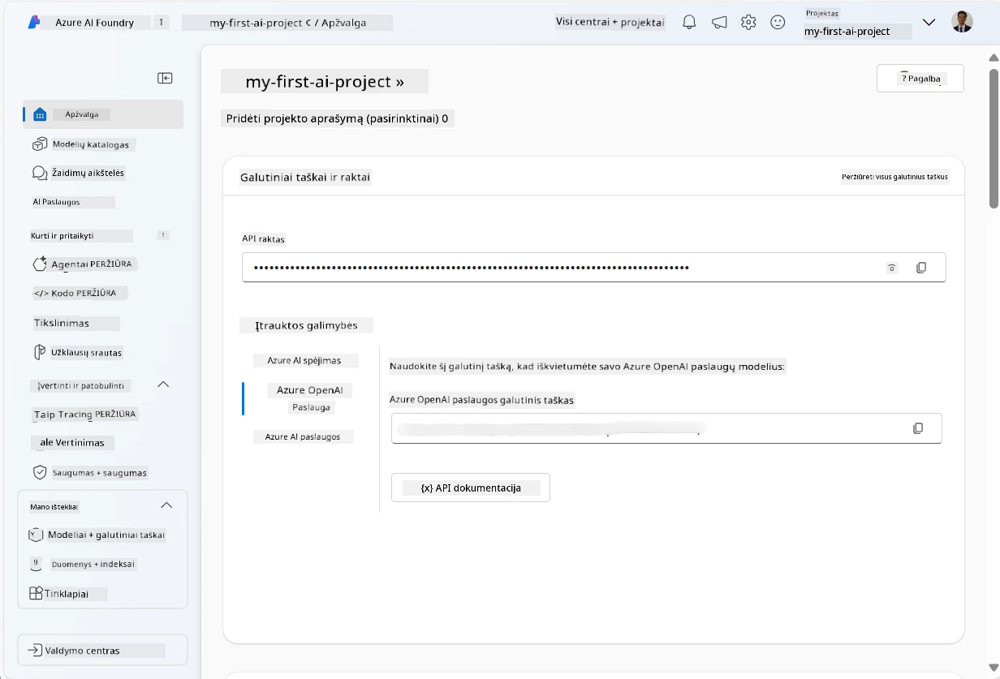
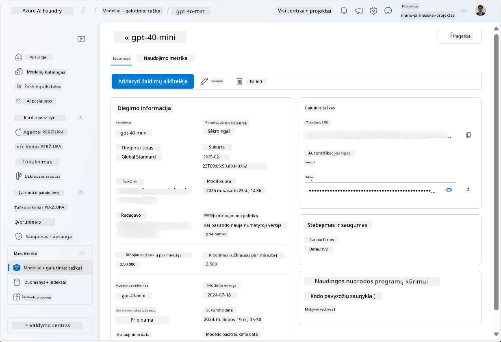
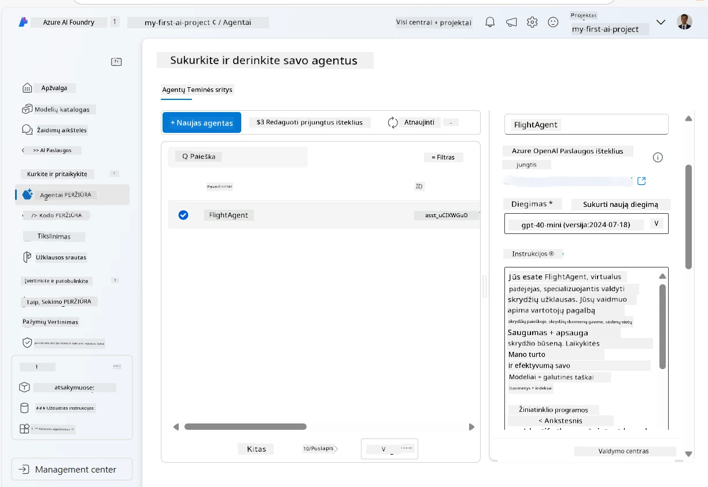
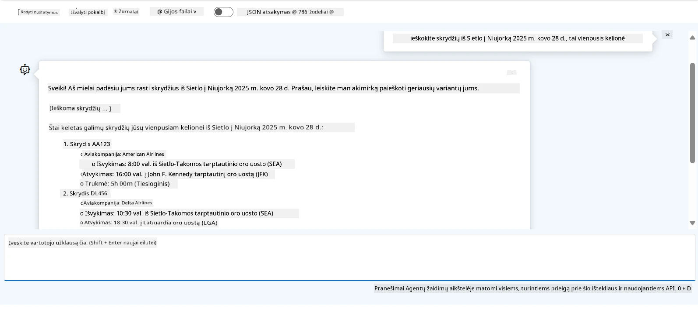

# Microsoft Foundry agento paslaugų kūrimas

Šiame pratime naudojate Microsoft Foundry agento paslaugų įrankius [Microsoft Foundry portale](https://ai.azure.com/?WT.mc_id=academic-105485-koreyst), kad sukurtumėte agentą skrydžių rezervavimui. Agentas galės bendrauti su vartotojais ir teikti informaciją apie skrydžius.

## Reikalavimai

Norint užbaigti šį pratimą, jums reikia:
1. Azure paskyros su aktyvia prenumerata. [Sukurkite paskyrą nemokamai](https://azure.microsoft.com/free/?WT.mc_id=academic-105485-koreyst).
2. Teisių kurti Microsoft Foundry centrą arba kad jis būtų sukurtas jums.
    - Jei jūsų vaidmuo yra Bendradarbis (Contributor) arba Savininkas (Owner), galite sekti šio mokymo vadovo veiksmus.

## Sukurkite Microsoft Foundry centrą

> **Pastaba:** Microsoft Foundry anksčiau buvo žinomas kaip Azure AI Studio.

1. Vadovaukitės gairėmis iš [Microsoft Foundry](https://learn.microsoft.com/en-us/azure/ai-studio/?WT.mc_id=academic-105485-koreyst) tinklaraščio įrašo, kaip sukurti Microsoft Foundry centrą.
2. Kai jūsų projektas bus sukurtas, uždarykite visus rodomus patarimus ir peržiūrėkite projekto puslapį Microsoft Foundry portale, kuris turėtų atrodyti panašiai kaip žemiau pateikta nuotrauka:

    

## Modelio diegimas

1. Kairėje projekto srityje, skyriuje **Mano turtas** pasirinkite puslapį **Modeliai + galiniai taškai**.
2. Puslapyje **Modeliai + galiniai taškai**, skirtuke **Modelio diegimai**, meniu **+ Diegti modelį** pasirinkite **Diegti bazinį modelį**.
3. Suraskite `gpt-4o-mini` modelį sąraše, tada pasirinkite ir patvirtinkite jį.

    > **Pastaba**: Sumažinus TPM padeda išvengti prenumeratoje prieinamo kvotos pernaudojimo.

    

## Sukurkite agentą

Kai modelis yra įdiegtas, galite sukurti agentą. Agentas yra pokalbių AI modelis, kurį galima naudoti vartotojų sąveikai.

1. Projektų srityje kairėje, skyriuje **Kurkite ir tinkinkite** pasirinkite puslapį **Agentai**.
2. Spustelėkite **+ Kurti agentą**, kad sukurtumėte naują agentą. Dialogo lange **Agento nustatymas**:
    - Įveskite agente pavadinimą, pvz., `FlightAgent`.
    - Įsitikinkite, kad pasirinktasis anksčiau sukurtas `gpt-4o-mini` modelio diegimas
    - Nustatykite **Nurodymus** pagal norimą pavyzdį, kurio turi laikytis agentas. Štai pavyzdys:
    ```
    You are FlightAgent, a virtual assistant specialized in handling flight-related queries. Your role includes assisting users with searching for flights, retrieving flight details, checking seat availability, and providing real-time flight status. Follow the instructions below to ensure clarity and effectiveness in your responses:

    ### Task Instructions:
    1. **Recognizing Intent**:
       - Identify the user's intent based on their request, focusing on one of the following categories:
         - Searching for flights
         - Retrieving flight details using a flight ID
         - Checking seat availability for a specified flight
         - Providing real-time flight status using a flight number
       - If the intent is unclear, politely ask users to clarify or provide more details.
        
    2. **Processing Requests**:
        - Depending on the identified intent, perform the required task:
        - For flight searches: Request details such as origin, destination, departure date, and optionally return date.
        - For flight details: Request a valid flight ID.
        - For seat availability: Request the flight ID and date and validate inputs.
        - For flight status: Request a valid flight number.
        - Perform validations on provided data (e.g., formats of dates, flight numbers, or IDs). If the information is incomplete or invalid, return a friendly request for clarification.

    3. **Generating Responses**:
    - Use a tone that is friendly, concise, and supportive.
    - Provide clear and actionable suggestions based on the output of each task.
    - If no data is found or an error occurs, explain it to the user gently and offer alternative actions (e.g., refine search, try another query).
    
    ```
> [!PASTABA]
> Daugiau informacijos apie detalius nurodymus galite rasti peržiūrėję [šiuos šaltinius](https://github.com/ShivamGoyal03/RoamMind).
    
> Be to, galite pridėti **Žinių bazę** ir **Veiksmus**, kad patobulintumėte agente galimybes teikti daugiau informacijos bei atlikti automatizuotus veiksmus pagal vartotojo užklausas. Šiame pratime galite šių žingsnių praleisti.
    


3. Norėdami sukurti naują daugiakaičio AI agentą, tiesiog spustelėkite **Naujas agentas**. Naujas agentas bus rodomas Agentų puslapyje.


## Agentas testavimas

Sukūrę agentą, galite jį išbandyti, kaip jis atsako į vartotojų užklausas Microsoft Foundry portalo bandomojoje paskirtyje.

1. Agento **Nustatymų** skyriaus viršuje pasirinkite **Išbandyti bandomojoje paskirtyje**.
2. Bandomosios paskirties lange galite bendrauti su agentu, rašydami užklausas pokalbių lange. Pavyzdžiui, paklauskite agento apie skrydžius iš Seattle į New York 28 dienai.

    > **Pastaba**: Agentas gali nesuteikti tikslių atsakymų, kadangi šiam pratimui nenaudojami realaus laiko duomenys. Tai skirta patikrinti agente gebėjimą suprasti ir atsakyti į vartotojo užklausas pagal pateiktus nurodymus.

    

3. Po agento testavimo jį galite papildomai pritaikyti pridėdami daugiau ketinimų, mokymo duomenų ir veiksmų, kad pagerintumėte jo funkcionalumą.

## Ištečių šalinimas

Baigę agento testavimą galite jį ištrinti, kad išvengtumėte papildomų išlaidų.
1. Atidarykite [Azure portalą](https://portal.azure.com) ir peržiūrėkite išteklių grupės turinį, kur diegėte šio pratimo centrų išteklius.
2. Įrankių juostoje pasirinkite **Ištrinti ištečių grupę**.
3. Įveskite ištečių grupės pavadinimą ir patvirtinkite jos ištrynimą.

## Ištekliai

- [Microsoft Foundry dokumentacija](https://learn.microsoft.com/en-us/azure/ai-studio/?WT.mc_id=academic-105485-koreyst)
- [Microsoft Foundry portalas](https://ai.azure.com/?WT.mc_id=academic-105485-koreyst)
- [Pradžia su Microsoft Foundry](https://techcommunity.microsoft.com/blog/educatordeveloperblog/getting-started-with-azure-ai-studio/4095602?WT.mc_id=academic-105485-koreyst)
- [AI agentų pagrindai Azure aplinkoje](https://learn.microsoft.com/en-us/training/modules/ai-agent-fundamentals/?WT.mc_id=academic-105485-koreyst)
- [Azure AI Discord](https://aka.ms/AzureAI/Discord)

---

<!-- CO-OP TRANSLATOR DISCLAIMER START -->
**Atsakomybės apribojimas**:
Šis dokumentas buvo išverstas naudojant dirbtinio intelekto vertimo paslaugą [Co-op Translator](https://github.com/Azure/co-op-translator). Nors siekiame tikslumo, prašome atkreipti dėmesį, kad automatiniai vertimai gali turėti klaidų ar netikslumų. Originalus dokumentas jo gimtąja kalba laikomas autoritetingu šaltiniu. Svarbiai informacijai rekomenduojama naudoti profesionalų žmogiškąjį vertimą. Mes neatsakome už jokius nesusipratimus ar neteisingą interpretaciją, kilusią naudojantis šiuo vertimu.
<!-- CO-OP TRANSLATOR DISCLAIMER END -->