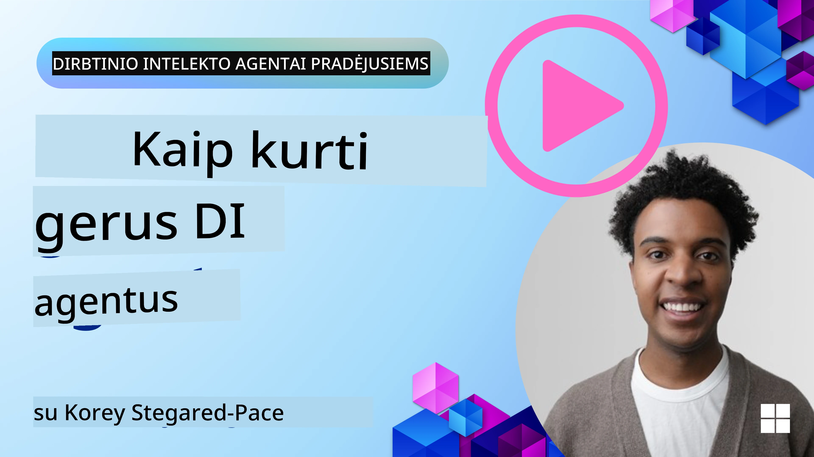
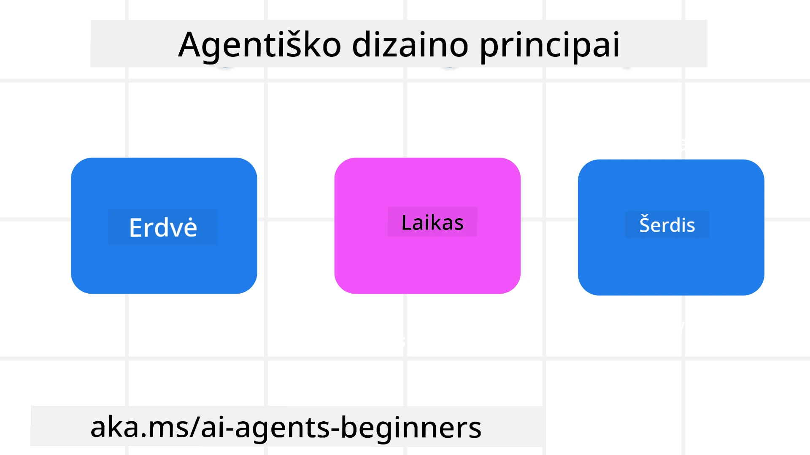

> _(Spustelėkite paveikslėlį aukščiau, kad peržiūrėtumėte šios pamokos vaizdo įrašą)_
# AI agentų dizaino principai

## Įvadas

Yra daugybė būdų, kaip galvoti apie AI agentinių sistemų kūrimą. Kadangi neapibrėžtumas yra savybė, o ne klaida generatyvių AI dizaino sprendimų atžvilgiu, kartais inžinieriams sunku nuspręsti, nuo ko pradėti. Mes sukūrėme žmonėms pritaikytų UX dizaino principų rinkinį, leidžiantį kūrėjams kurti klientams pritaikytas agentines sistemas, sprendžiančias jų verslo poreikius. Šie dizaino principai nėra griežtai nurodoma architektūra, o greičiau pradinė vieta komandoms, kurios apibrėžia ir kuria agentines patirtis.

Apskritai, agentai turėtų:

- Išplėsti ir keisti žmogaus galimybes (idėjų generavimas, problemų sprendimas, automatizavimas ir kt.)
- Užpildyti žinių spragas (supažindinti su žinių sritimis, vertimas ir kt.)
- Palengvinti ir palaikyti bendradarbiavimą taip, kaip mes patys norime dirbti su kitais
- Daryti mus geresnėmis savo versijomis (pvz., gyvenimo treneriu/užduočių valdytoju, padedant išmokti emocinę reguliaciją ir dėmesingumo įgūdžius, stiprinant atsparumą ir kt.)

## Ką apims ši pamoka

- Kas yra agentų dizaino principai
- Kokias gaires reikia sekti įgyvendinant šiuos dizaino principus
- Keletas pavyzdžių, kaip naudoti dizaino principus

## Mokymosi tikslai

Pabaigę šią pamoką galėsite:

1. Paaiškinti, kas yra agentų dizaino principai
2. Paaiškinti gaires, kaip naudoti agentų dizaino principus
3. Suprasti, kaip sukurti agentą naudojant agentų dizaino principus

## Agentų dizaino principai

### Agentas (erdvė)

Tai yra aplinka, kurioje veikia agentas. Šie principai nurodo, kaip kurti agentus, veikiančius fiziniuose ir skaitmeniniuose pasauliuose.

- **Jungti, ne sugriauti** – padėti žmonėms jungtis su kitais žmonėmis, renginiais ir naudinga informacija, kad būtų palengvintas bendradarbiavimas ir ryšys.
- Agentai padeda jungti įvykius, žinias ir žmones.
- Agentai suartina žmones. Jie nėra skirti pakeisti ar menkinti žmonių.
- **Lengvai pasiekiamas, tačiau kartais nematomas** – agentas daugiausia veikia fone ir tik praneša, kai tai aktualu ir tinkama.
  - Agentą lengva rasti ir pasiekti įgaliotiems vartotojams bet kuriame įrenginyje ar platformoje.
  - Agentas palaiko multimodalius įėjimus ir išėjimus (garsas, balsas, tekstas ir kt.).
  - Agentas gali sklandžiai pereiti tarp pirmojo plano ir fono; tarp proaktyvaus ir reaktyvaus veikimo, priklausomai nuo vartotojo poreikių suvokimo.
  - Agentas gali veikti nematomoje formoje, tačiau jo foninis procesas ir bendradarbiavimas su kitais agentais yra skaidrūs ir vartotojui valdantys.

### Agentas (laikas)

Tai, kaip agentas veikia per laiką. Šie principai nurodo, kaip kurti agentus, veikiančius praeityje, dabartyje ir ateityje.

- **Praeitis**: Atsispindi istorijoje, apimančioje tiek būklę, tiek kontekstą.
  - Agentas pateikia tikslesnius rezultatus, remdamasis analize paremtais turtingesniais istoriniais duomenimis, ne tik įvykiais, žmonėmis ar būsenomis.
  - Agentas jungia praeities įvykius ir aktyviai atsigręžia į atmintį, kad įsitrauktų į dabartines situacijas.
- **Dabar**: Skatina veiksmus, o ne tik praneša.
  - Agentas įkūnija išsamų būdą bendrauti su žmonėmis. Kai įvyksta įvykis, agentas daro daugiau nei statinį pranešimą ar kitą formalumą. Agentas gali supaprastinti procesus ar dinamiškai generuoti signalus, nukreipiančius vartotojo dėmesį tinkamu laiku.
  - Agentas teikia informaciją pagal kontekstinę aplinką, socialinius ir kultūrinius pokyčius bei pritaiko pagal vartotojo ketinimus.
  - Agentų sąveika gali būti palaipsninė, kintanti ir auganti sudėtingumu, kad ilgainiui suteiktų vartotojams daugiau galimybių.
- **Ateitis**: Adaptacija ir evoliucija.
  - Agentas prisitaiko prie įvairių įrenginių, platformų ir modalumų.
  - Agentas prisitaiko prie vartotojo elgesio, prieinamumo poreikių ir yra laisvai pritaikomas.
  - Agentas formuojamas ir vystosi per nuolatinę vartotojo sąveiką.

### Agentas (branduolys)

Tai pagrindiniai elementai agento dizaino branduolyje.

- **Priimti neapibrėžtumą, bet užtikrinti pasitikėjimą**.
  - Tikimasi tam tikro agento neapibrėžtumo. Neapibrėžtumas yra pagrindinis agentų dizaino elementas.
  - Pasitikėjimas ir skaidrumas yra agentų dizaino pamatiniai sluoksniai.
  - Žmonės kontroliuoja, kada agentas įjungtas/išjungtas, o į agento būseną visada aiškiai matoma.

## Gairės, kaip įgyvendinti šiuos principus

Naudodami aukščiau minėtus dizaino principus, vadovaukitės šiomis gairėmis:

1. **Skaidrumas**: Informuokite vartotoją, kad yra įtraukta AI, kaip ji veikia (įskaitant ankstesnius veiksmus) ir kaip galima pateikti atsiliepimus bei keisti sistemą.
2. **Valdymas**: Leiskite vartotojui pritaikyti, nurodyti pageidavimus ir suasmeninti sistemą bei jos savybes (įskaitant galimybę pamiršti).
3. **Nuoseklumas**: Siekite nuoseklios, daugialypės patirties skirtinguose įrenginiuose ir taškuose. Naudokite pažįstamus UI/UX elementus, kur įmanoma (pvz., mikrofono piktogramą balso sąveikai) ir kiek įmanoma sumažinkite vartotojo kognityvinę apkrovą (pvz., trumpi atsakymai, vizualiniai pagalbiniai elementai, skyreliai „Sužinokite daugiau“).

## Kaip sukurti kelionių agentą, naudojant šiuos principus ir gaires

Įsivaizduokite, kad kuriate kelionių agentą, štai kaip galėtumėte pagalvoti apie dizaino principų ir gairių taikymą:

1. **Skaidrumas** – Leiskite vartotojui žinoti, kad Kelionių agentas yra AI pagrindu veikiantis agentas. Pateikite keletą pagrindinių instrukcijų, kaip pradėti (pvz., „Sveiki“ žinutė, pavyzdinės užklausos). Aiškiai dokumentuokite tai produkto puslapyje. Rodykite vartotojo anksčiau užduotų užklausų sąrašą. Aiškiai apibūdinkite, kaip pateikti atsiliepimus (patinka/nepatinka mygtukai, „Siųsti atsiliepimą“ ir kt.). Aiškiai nurodykite, jei agentas turi naudojimo ar temų apribojimų.
2. **Valdymas** – Užtikrinkite, kad būtų aišku, kaip vartotojas gali redaguoti agentą po jo sukūrimo, pvz., naudojant sistemos užklausą. Leiskite vartotojui pasirinkti, kiek išsamus agentas yra, jo rašymo stilių ir kokias temas agentas neturėtų aptarti. Leiskite vartotojui peržiūrėti ir ištrinti susijusius failus arba duomenis, užklausas ir ankstesnius pokalbius.
3. **Nuoseklumas** – Užtikrinkite, kad piktogramos „Dalintis užklausa“, „Įkelti failą ar nuotrauką“ ir „Pažymėti ką nors“ būtų standartinės ir atpažįstamos. Naudokite segtuko piktogramą failo įkėlimui/bendrinimui su agentu, o vaizdo piktogramą – grafikų įkėlimui.

## Pavyzdiniai kodai

- Python: [Agent Framework](./code_samples/03-python-agent-framework.ipynb)
- .NET: [Agent Framework](./code_samples/03-dotnet-agent-framework.md)

## Turite daugiau klausimų apie AI agentų dizaino modelius?

Prisijunkite prie [Microsoft Foundry Discord](https://discord.com/invite/ATgtXmAS5D), kad susipažintumėte su kitais besimokančiais, dalyvautumėte „office hours“ renginiuose ir sulauktumėte atsakymų į savo AI agentų klausimus.

## Papildomi ištekliai

- <a href="https://openai.com" target="_blank">Agentinių AI sistemų valdymo praktikos | OpenAI</a>
- <a href="https://microsoft.com" target="_blank">HAX įrankių rinkinys - Microsoft Research</a>
- <a href="https://responsibleaitoolbox.ai" target="_blank">Atsakingo AI įrankių rinkinys</a>

## Ankstesnė pamoka

[Agentinių sistemų tyrinėjimas](../02-explore-agentic-frameworks/README.md)

## Kita pamoka

[Įrankių naudojimo dizaino modelis](../04-tool-use/README.md)

---

<!-- CO-OP TRANSLATOR DISCLAIMER START -->
**Atsakomybės apribojimas**:
Šis dokumentas buvo išverstas naudojant dirbtinio intelekto vertimo paslaugą [Co-op Translator](https://github.com/Azure/co-op-translator). Nors siekiame tikslumo, prašome atkreipti dėmesį, kad automatiniai vertimai gali turėti klaidų ar netikslumų. Originalus dokumentas jo gimtąja kalba laikomas autoritetingu šaltiniu. Svarbiai informacijai rekomenduojama naudoti profesionalų žmogiškąjį vertimą. Mes neatsakome už jokius nesusipratimus ar neteisingą interpretaciją, kilusią naudojantis šiuo vertimu.
<!-- CO-OP TRANSLATOR DISCLAIMER END -->