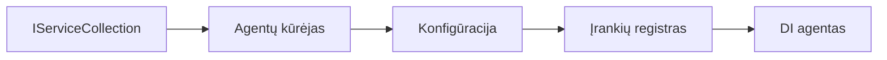

# 🎨 Agentų kūrimo šablonai su Azure OpenAI (Responses API) (.NET)

## 📋 Mokymosi tikslai

Šis pavyzdys demonstruoja įmonės lygio dizaino šablonus, skirtus intelektualių agentų kūrimui naudojant Microsoft Agent Framework .NET aplinkoje su Azure OpenAI (Responses API) integracija. Sužinosite profesionalius šablonus ir architektūros metodus, kurie padaro agentus pasiruošusius gamybai, prižiūrimus ir pritaikomus mastelio keitimui.

### Įmonės lygio dizaino šablonai

- 🏭 **Factory Pattern**: Standartizuotas agentų kūrimas su priklausomybių injekcija
- 🔧 **Builder Pattern**: Nuosekli agentų konfigūracija ir nustatymas
- 🧵 **Thread-Safe Patterns**: Lygiagrečių pokalbių valdymas
- 📋 **Repository Pattern**: Įrankių ir galimybių organizuotas valdymas

## 🎯 .NET specifinės architektūrinės naudos

### Įmonės funkcijos

- **Stiprus tipizavimas**: Kompiliavimo laiko patikra ir IntelliSense palaikymas
- **Priklausomybių injekcija**: Įdiegta DI konteinerio integracija
- **Konfigūracijos valdymas**: IConfiguration ir Options šablonai
- **Async/Await**: Aukščiausios klasės asinchroninio programavimo palaikymas

### Paruošti gamybai šablonai

- **Registravimo integracija**: ILogger ir struktūruotas įvykių registravimas
- **Sveikatos patikrinimai**: Integruotas monitoringas ir diagnostika
- **Konfigūracijos validacija**: Stiprus tipizavimas su duomenų anotacijomis
- **Klaidų valdymas**: Struktūruotas išimčių valdymas

## 🔧 Techninė architektūra

### Pagrindinės .NET sudedamosios dalys

- **Microsoft.Extensions.AI**: Vieningos AI paslaugų abstrakcijos
- **Microsoft.Agents.AI**: Įmonės agentų valdymo sistema
- **Azure OpenAI (Responses API)**: Aukšto našumo API kliento šablonai
- **Konfigūracijos sistema**: appsettings.json ir aplinkos integracija

### Dizaino šablonų įgyvendinimas



## 🏗️ Demonstruojami įmonės lygio šablonai

### 1. **Kūrybiniai šablonai**

- **Agentų gamykla**: Centralizuotas agentų kūrimas su nuoseklia konfigūracija
- **Builder Pattern**: Nuoseklus API sudėtingai agentų konfigūracijai
- **Singleton Pattern**: Bendrų išteklių ir konfigūracijos valdymas
- **Priklausomybių injekcija**: Laisvas susiejimas ir patikrinamumas

### 2. **Elgesio šablonai**

- **Strategy Pattern**: Pakeičiamos įrankių vykdymo strategijos
- **Command Pattern**: Inkapsuliuotos agentų operacijos su undo/redo funkcionalumu
- **Observer Pattern**: Įvykių pagrindu vykdomas agentų gyvavimo ciklo valdymas
- **Template Method**: Standartizuoti agentų vykdymo darbo procesai

### 3. **Struktūriniai šablonai**

- **Adapter Pattern**: Azure OpenAI (Responses API) integracijos sluoksnis
- **Decorator Pattern**: Agentų galimybių plėtra
- **Facade Pattern**: Supaprastinti agentų sąveikos sąsajos
- **Proxy Pattern**: Tingus užkrovimas ir talpinimas našumui pagerinti

## 📚 .NET dizaino principai

### SOLID principai

- **Vieningas atsakomybės principas**: Kiekvienas komponentas turi aiškią paskirtį
- **Atviras/Uždaras principas**: Išplečiamas be modifikacijų
- **Liskovo pakeitimo principas**: Intelekso pagrindu įgyvendinti įrankiai
- **Sąsajų segregavimo principas**: Fokusinės, vientisos sąsajos
- **Priklausomybių apvertimo principas**: Priklausomybė nuo abstrakcijų, ne nuo konkrečių realizacijų

### Švari architektūra

- **Domeno sluoksnis**: Pagrindinės agentų ir įrankių abstrakcijos
- **Pritaikymo sluoksnis**: Agentų koordinavimas ir darbo procesai
- **Infrastruktūros sluoksnis**: Azure OpenAI (Responses API) integracija ir išorinės paslaugos
- **Pristatymo sluoksnis**: Naudotojo sąveika ir atsakymų formatavimas

## 🔒 Įmonės lygio aspektai

### Saugumas

- **Sertifikatų valdymas**: Saugaus API rakto valdymas su IConfiguration
- **Įvesties validacija**: Stiprus tipizavimas ir duomenų anotacijų validacija
- **Išvesties valymas**: Saugus atsakymų apdorojimas ir filtravimas
- **Auditavimo registravimas**: Išsamus operacijų sekimas

### Našumas

- **Asinchroniniai šablonai**: Neužblokavimai I/O operacijose
- **Ryšio pūtimas**: Efektyvus HTTP kliento valdymas
- **Talpyklavimas**: Atsakymų talpyklavimas našumo didinimui
- **Išteklių valdymas**: Teisingas išmetimas ir išvalymas

### Mastelio keitimas

- **Daugiagijumas**: Lygiagrečių agentų vykdymo palaikymas
- **Išteklių telkinys**: Efektyvus išteklių panaudojimas
- **Krovio valdymas**: Kiekybinė kontrolė ir atgalinis spaudimas
- **Stebėsena**: Našumo metrika ir sveikatos patikrinimai

## 🚀 Gaminių diegimas

- **Konfigūracijos valdymas**: Aplinkai pritaikyti nustatymai
- **Registravimo strategija**: Struktūruotas registravimas su susiejimo ID
- **Klaidų valdymas**: Globalus išimčių valdymas su tinkamu atkūrimu
- **Stebėsena**: Programų įžvalgos ir našumo skaitikliai
- **Testavimas**: Vienetiniai testai, integraciniai testai ir apkrovos testavimo šablonai

Pasiruošę kurti įmonės lygio intelektualius agentus su .NET? Sukurkime kažką tvirto! 🏢✨

## 🚀 Pradžia

### Prieš sąlygos

- [.NET 10 SDK](https://dotnet.microsoft.com/download/dotnet/10.0) arba naujesnis
- [Azure prenumerata](https://azure.microsoft.com/free/) su Azure OpenAI resursu ir modelio diegimu
- [Azure CLI](https://learn.microsoft.com/cli/azure/install-azure-cli) — prisijunkite su `az login`

### Būtini aplinkos kintamieji

```bash
# zsh/bash
export AZURE_OPENAI_ENDPOINT=https://<your-resource>.openai.azure.com
export AZURE_OPENAI_DEPLOYMENT=gpt-4o-mini
# Tada prisijunkite, kad AzureCliCredential galėtų gauti žetoną
az login
```

```powershell
# PowerShell
$env:AZURE_OPENAI_ENDPOINT = "https://<your-resource>.openai.azure.com"
$env:AZURE_OPENAI_DEPLOYMENT = "gpt-4o-mini"
# Tada prisijunkite, kad AzureCliCredential galėtų gauti žetoną
az login
```

### Pavyzdinis kodas

Norėdami paleisti pavyzdinį kodą,

```bash
# zsh/bash
chmod +x ./03-dotnet-agent-framework.cs
./03-dotnet-agent-framework.cs
```

Arba naudodami dotnet CLI:

```bash
dotnet run ./03-dotnet-agent-framework.cs
```

Žr. [`03-dotnet-agent-framework.cs`](../../../../03-agentic-design-patterns/code_samples/03-dotnet-agent-framework.cs) pilną kodą.

```csharp
#!/usr/bin/dotnet run

#:package Microsoft.Extensions.AI@10.*
#:package Microsoft.Agents.AI.OpenAI@1.*-*
#:package Azure.AI.OpenAI@2.1.0
#:package Azure.Identity@1.13.1

using System.ComponentModel;

using Microsoft.Agents.AI;
using Microsoft.Extensions.AI;

using Azure.AI.OpenAI;
using Azure.Identity;

// Tool Function: Random Destination Generator
// This static method will be available to the agent as a callable tool
// The [Description] attribute helps the AI understand when to use this function
// This demonstrates how to create custom tools for AI agents
[Description("Provides a random vacation destination.")]
static string GetRandomDestination()
{
    // List of popular vacation destinations around the world
    // The agent will randomly select from these options
    var destinations = new List<string>
    {
        "Paris, France",
        "Tokyo, Japan",
        "New York City, USA",
        "Sydney, Australia",
        "Rome, Italy",
        "Barcelona, Spain",
        "Cape Town, South Africa",
        "Rio de Janeiro, Brazil",
        "Bangkok, Thailand",
        "Vancouver, Canada"
    };

    // Generate random index and return selected destination
    // Uses System.Random for simple random selection
    var random = new Random();
    int index = random.Next(destinations.Count);
    return destinations[index];
}

// Azure OpenAI with the Responses API (stable v1 endpoint). Sign in with `az login`.
var azureEndpoint = Environment.GetEnvironmentVariable("AZURE_OPENAI_ENDPOINT")
    ?? throw new InvalidOperationException("AZURE_OPENAI_ENDPOINT is not set.");
var deployment = Environment.GetEnvironmentVariable("AZURE_OPENAI_DEPLOYMENT") ?? "gpt-4o-mini";

var azureClient = new AzureOpenAIClient(new Uri(azureEndpoint), new AzureCliCredential());

// Define Agent Identity and Comprehensive Instructions
// Agent name for identification and logging purposes
var AGENT_NAME = "TravelAgent";

// Detailed instructions that define the agent's personality, capabilities, and behavior
// This system prompt shapes how the agent responds and interacts with users
var AGENT_INSTRUCTIONS = """
You are a helpful AI Agent that can help plan vacations for customers.

Important: When users specify a destination, always plan for that location. Only suggest random destinations when the user hasn't specified a preference.

When the conversation begins, introduce yourself with this message:
"Hello! I'm your TravelAgent assistant. I can help plan vacations and suggest interesting destinations for you. Here are some things you can ask me:
1. Plan a day trip to a specific location
2. Suggest a random vacation destination
3. Find destinations with specific features (beaches, mountains, historical sites, etc.)
4. Plan an alternative trip if you don't like my first suggestion

What kind of trip would you like me to help you plan today?"

Always prioritize user preferences. If they mention a specific destination like "Bali" or "Paris," focus your planning on that location rather than suggesting alternatives.
""";

// Create AI Agent with Advanced Travel Planning Capabilities
// Get the Responses client for the deployment and create the AI agent
// Configure agent with name, detailed instructions, and available tools
// This demonstrates the .NET agent creation pattern with full configuration
AIAgent agent = azureClient
    .GetOpenAIResponseClient(deployment)
    .CreateAIAgent(
        name: AGENT_NAME,
        instructions: AGENT_INSTRUCTIONS,
        tools: [AIFunctionFactory.Create(GetRandomDestination)]
    );

// Create New Conversation Thread for Context Management
// Initialize a new conversation thread to maintain context across multiple interactions
// Threads enable the agent to remember previous exchanges and maintain conversational state
// This is essential for multi-turn conversations and contextual understanding
AgentThread thread = agent.GetNewThread();

// Execute Agent: First Travel Planning Request
// Run the agent with an initial request that will likely trigger the random destination tool
// The agent will analyze the request, use the GetRandomDestination tool, and create an itinerary
// Using the thread parameter maintains conversation context for subsequent interactions
await foreach (var update in agent.RunStreamingAsync("Plan me a day trip", thread))
{
    await Task.Delay(10);
    Console.Write(update);
}

Console.WriteLine();

// Execute Agent: Follow-up Request with Context Awareness
// Demonstrate contextual conversation by referencing the previous response
// The agent remembers the previous destination suggestion and will provide an alternative
// This showcases the power of conversation threads and contextual understanding in .NET agents
await foreach (var update in agent.RunStreamingAsync("I don't like that destination. Plan me another vacation.", thread))
{
    await Task.Delay(10);
    Console.Write(update);
}
```

---

<!-- CO-OP TRANSLATOR DISCLAIMER START -->
**Atsakomybės apribojimas**:
Šis dokumentas buvo išverstas naudojant dirbtinio intelekto vertimo paslaugą [Co-op Translator](https://github.com/Azure/co-op-translator). Nors siekiame tikslumo, prašome atkreipti dėmesį, kad automatiniai vertimai gali turėti klaidų ar netikslumų. Originalus dokumentas jo gimtąja kalba laikomas autoritetingu šaltiniu. Svarbiai informacijai rekomenduojama naudoti profesionalų žmogiškąjį vertimą. Mes neatsakome už jokius nesusipratimus ar neteisingą interpretaciją, kilusią naudojantis šiuo vertimu.
<!-- CO-OP TRANSLATOR DISCLAIMER END -->